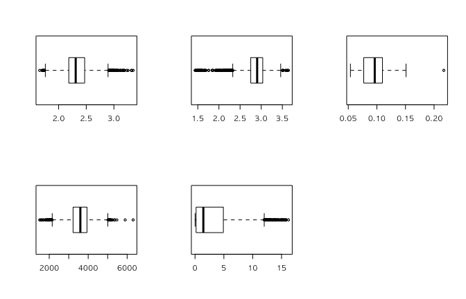
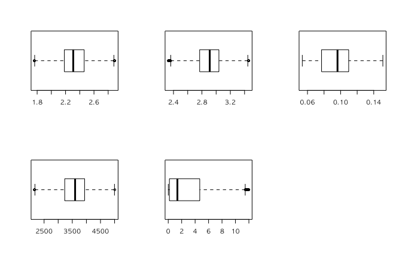
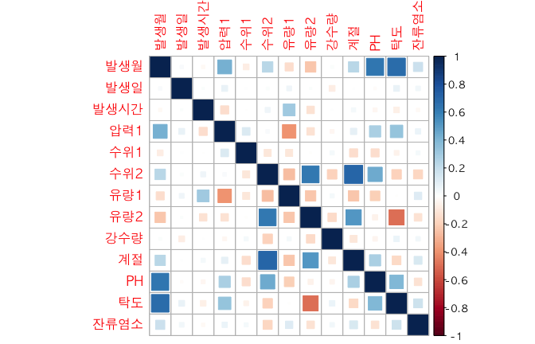
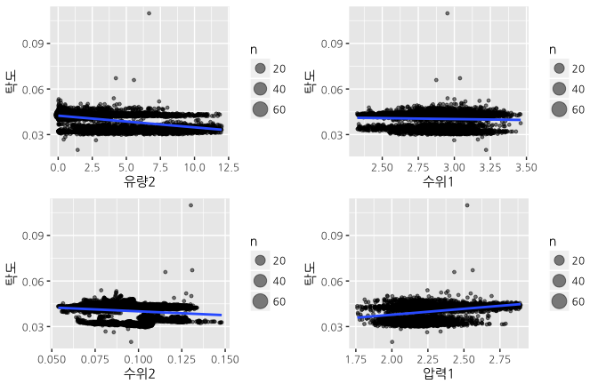
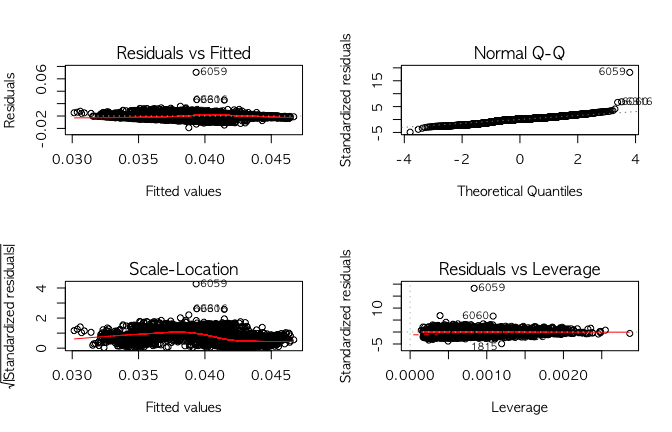

> 분석 개요

* **데이터 소스** : 한국수자원공사 제공하는 경기도 지역 정수장 데이터
* **갱신 주기** : 1시간 단위 (2016년 1년간 Data 분석 예정, 8460 rows)
* **변수 종류**
  + `발생일시` : 년 / 월 / 일 / 시
  + `시설명` : 8개소 (고양/덕소/반월/성남/수원/수지/시흥/와부/일산)
  + `수위` : 정수장 내 수위 (m, 정수장 별 2~3개 tag)
  + `압력` : 정수장 유입 원수에 대한 유입 압력 (kg/cm2)
  + `유량` : 공업/생활 유출수에 대한 유량 (m3/h, 정수장 별 2~3개 tag)
  + `유량 적산차` : 시간별 유출되는 유출수의 volume (m3, 정수장 별 2~3개 tag)
  + `pH` : 용수의 pH 측정값 (Control Range : 5.8 ~ 8.5)
  + `탁도(NTU)` : 용수의 탁도 측정값 (Control Range : 0.5 이하)
  + `잔류염소(mg/L)` : 용수의 잔류염소 측정값 (Control Range : 0.1 ~ 4.0)
* **활용 데이터**
  + 수질 데이터 : 탁도, 잔류염소 (낮을수록 우수한 품질)
* pH는 잔류염소와 강한 상관관계가 있어 제외하여도 무관한 것으로 판단되며, Control Range 이내로 관리하면 되고 측정값 중 우수한 값을 정의할 수 없음
  + **Variables** : 압력 / 수위 / 유량 / 유량적산차
  + **외부 Data 활용** : 수원 지역 일별 강수량

---

# 분석환경 준비

## 기본 환경 설정

```r
knitr::opts_chunk$set(echo=TRUE, error=FALSE)
```

## 필수 패키지 적재


```r
library(readxl)       # 데이터 수집
library(dplyr)        # 데이터 가공
library(reshape2)     # 데이터 가공
library(psych)        # 통계
library(corrplot)     # 통계
library(ggplot2)      # 시각화
library(gridExtra)    # 시각화
library(RColorBrewer) # 시각화
library(plotly)       # 시각화

## 플롯 한글깨짐 방지 설정
par(family = "NanumGothic")
theme_set(theme_gray(base_family='NanumGothic')) 
```

# 데이터 수집

한국수원공사(K-Water)에 취득한 압력, 수질, 유량 등이 포함되 데이터와 기상청 공공데이터에서 취득한 강수량 자료를 수집 함 

* data 중 0인 값은 모두 제거하고 필요한 값만 불러옴
* pH / 탁도 / 잔류염소 : `수질 관련 Data`
* 강수량 : 인접한 수원 `지역 강수량 공공데이터` 활용
* 계절 : 월 기준 계절 구분 (1:봄, 2:여름, 3:가을, 4:겨울)


```r
dataset <- read_excel("../data/와부 정수.xlsx")
rain <- read_excel("../data/서울강수량.xlsx")

dataset <- dataset %>% mutate(일자 = substr(발생일시, 1, 8))
rain$일자 <- as.character(rain$일자)
season_num <- c(4, 4, 1, 1, 1, 2, 2, 2, 3, 3, 3, 4)

water_origin <- left_join(dataset, rain, by = "일자") %>%
  mutate(발생월 = as.integer(substr(발생일시, 5, 6))) %>%
  mutate(발생일 = as.integer(substr(발생일시, 7, 8))) %>%
  mutate(발생시간 = as.integer(substr(발생일시, 9, 10))) %>%
  mutate(계절 = season_num[as.integer(발생월)]) %>%
  select("발생월", "발생일", "발생시간", "압력1", 
         "수위1", "수위2", "유량1", "유량2", "강수량", 
         "계절", "PH", "탁도", "잔류염소") %>%
  filter(PH != 0 & 탁도 != 0 & 잔류염소 != 0 & 
           압력1 != 0 & 수위1 != 0 & 수위2 != 0 & 
           유량1 != 0 & 유량2 != 0) %>%
  arrange(발생월, 발생일, 발생시간)

water <- water_origin
```

# 데이터 정제

## 데이터의 구조 및 기초통계 확인


```r
glimpse(water)
```

```
## Observations: 7,326
## Variables: 13
## $ 발생월   <int> 1, 1, 1, 1, 1, 1, 1, 1, 1, 1, 1, 1, 1, 1, 1, 1, 1, 1, 1,...
## $ 발생일   <int> 1, 1, 1, 1, 1, 1, 1, 1, 1, 1, 1, 1, 1, 1, 1, 1, 1, 1, 1,...
## $ 발생시간 <int> 1, 2, 3, 4, 5, 6, 7, 8, 9, 10, 11, 12, 13, 14, 15, 16, 17...
## $ 압력1    <dbl> 2.285, 2.278, 2.281, 2.480, 1.955, 2.235, 2.088, 2.486,...
## $ 수위1    <dbl> 2.79850, 2.76775, 2.83550, 2.95525, 2.80475, 2.43900, 2...
## $ 수위2    <dbl> 0.11875, 0.11900, 0.11925, 0.11925, 0.11975, 0.12150, 0...
## $ 유량1    <dbl> 3107.550, 3234.750, 3134.617, 2684.667, 2490.733, 2822....
## $ 유량2    <dbl> 7.3950, 8.4583, 8.0040, 9.1350, 9.0963, 9.7247, 8.8063,...
## $ 강수량   <dbl> 0, 0, 0, 0, 0, 0, 0, 0, 0, 0, 0, 0, 0, 0, 0, 0, 0, 0, 0,...
## $ 계절     <dbl> 4, 4, 4, 4, 4, 4, 4, 4, 4, 4, 4, 4, 4, 4, 4, 4, 4, 4, 4...
## $ PH       <dbl> 7.4345, 7.4384, 7.4403, 7.4443, 7.4453, 7.4457, 7.445...
## $ 탁도     <dbl> 0.0362, 0.0361, 0.0363, 0.0365, 0.0365, 0.0366, 0.0364,...
## $ 잔류염소 <dbl> 0.7659, 0.7560, 0.7477, 0.7367, 0.7255, 0.7220, 0.7293, 0...
```

```r
summary(water)
```

```
##      발생월           발생일         발생시간         압력1      
##  Min.   : 1.000   Min.   : 1.00   Min.   : 1.00   Min.   :1.659  
##  1st Qu.: 3.000   1st Qu.: 8.00   1st Qu.: 6.00   1st Qu.:2.184  
##  Median : 6.000   Median :16.00   Median :11.00   Median :2.309  
##  Mean   : 6.321   Mean   :15.85   Mean   :11.97   Mean   :2.334  
##  3rd Qu.:10.000   3rd Qu.:24.00   3rd Qu.:18.00   3rd Qu.:2.471  
##  Max.   :12.000   Max.   :31.00   Max.   :24.00   Max.   :3.348  
##      수위1           수위2             유량1          유량2        
##  Min.   :1.437   Min.   :0.05375   Min.   :1514   Min.   : 0.0097  
##  1st Qu.:2.752   1st Qu.:0.07700   1st Qu.:3224   1st Qu.: 0.1837  
##  Median :2.904   Median :0.09625   Median :3598   Median : 1.4403  
##  Mean   :2.876   Mean   :0.09487   Mean   :3569   Mean   : 2.9361  
##  3rd Qu.:3.036   3rd Qu.:0.10975   3rd Qu.:3938   3rd Qu.: 4.9083  
##  Max.   :3.644   Max.   :0.21700   Max.   :6308   Max.   :16.2013  
##      강수량             계절             PH             탁도        
##  Min.   :  0.000   Min.   :1.000   Min.   :6.767   Min.   :0.01990  
##  1st Qu.:  0.000   1st Qu.:1.000   1st Qu.:7.143   1st Qu.:0.03560  
##  Median :  0.000   Median :3.000   Median :7.238   Median :0.04250  
##  Mean   :  2.854   Mean   :2.562   Mean   :7.268   Mean   :0.04027  
##  3rd Qu.:  0.200   3rd Qu.:4.000   3rd Qu.:7.403   3rd Qu.:0.04330  
##  Max.   :108.500   Max.   :4.000   Max.   :7.774   Max.   :0.10980  
##     잔류염소     
##  Min.   :0.4845  
##  1st Qu.:0.7933  
##  Median :0.8185  
##  Mean   :0.8186  
##  3rd Qu.:0.8479  
##  Max.   :1.0658
```

## 변수별 이상치 및 결측치 제거


```r
opar <- par(mfrow = c(2,3))

# 압력1 이상치 제거
stat <- boxplot(water$압력1, horizontal = T)$stats  # Boxplot 기초통계
stat
```

```
##       [,1]
## [1,] 1.760
## [2,] 2.184
## [3,] 2.309
## [4,] 2.471
## [5,] 2.894
```

```r
out_below <- stat[1, 1]  # 아래쪽 극단치 경계
out_upper <- stat[5, 1]  # 위쪽 극단치 경계
out_below; out_upper
```

```
## [1] 1.76
```

```
## [1] 2.894
```

```r
water$압력1 <- ifelse(water$압력1 < out_below |
                      water$압력1 > out_upper, NA, water$압력1 )

table(is.na(water$압력1))
```

```
## 
## FALSE  TRUE 
##  7230    96
```

```r
# 수위1 이상치 제거
stat <- boxplot(water$수위1, horizontal = T)$stats  # Boxplot 기초통계
stat
```

```
##         [,1]
## [1,] 2.32700
## [2,] 2.75225
## [3,] 2.90400
## [4,] 3.03600
## [5,] 3.46050
```

```r
out_below <- stat[1, 1]  # 아래쪽 극단치 경계
out_upper <- stat[5, 1]  # 위쪽 극단치 경계
out_below; out_upper
```

```
## [1] 2.327
```

```
## [1] 3.4605
```

```r
water$수위1 <- ifelse(water$수위1 < out_below |
                      water$수위1 > out_upper, NA, water$수위1 )

table(is.na(water$수위1))
```

```
## 
## FALSE  TRUE 
##  7134   192
```

```r
# 수위2 이상치 제거
stat <- boxplot(water$수위2, horizontal = T)$stats  # Boxplot 기초통계
stat
```

```
##         [,1]
## [1,] 0.05375
## [2,] 0.07700
## [3,] 0.09625
## [4,] 0.10975
## [5,] 0.15100
```

```r
out_below <- stat[1, 1]  # 아래쪽 극단치 경계
out_upper <- stat[5, 1]  # 위쪽 극단치 경계
out_below; out_upper
```

```
## [1] 0.05375
```

```
## [1] 0.151
```

```r
water$수위2 <- ifelse(water$수위2 < out_below |
                      water$수위2 > out_upper, NA, water$수위2 )

table(is.na(water$수위2))
```

```
## 
## FALSE  TRUE 
##  7325     1
```

```r
# 유량1 이상치 제거
stat <- boxplot(water$유량1, horizontal = T)$stats  # Boxplot 기초통계
stat
```

```
##          [,1]
## [1,] 2153.400
## [2,] 3223.717
## [3,] 3597.708
## [4,] 3938.233
## [5,] 5009.233
```

```r
out_below <- stat[1, 1]  # 아래쪽 극단치 경계
out_upper <- stat[5, 1]  # 위쪽 극단치 경계
out_below; out_upper
```

```
## [1] 2153.4
```

```
## [1] 5009.233
```

```r
water$유량1 <- ifelse(water$유량1 < out_below |
                      water$유량1 > out_upper, NA, water$유량1 )

table(is.na(water$유량1))
```

```
## 
## FALSE  TRUE 
##  7261    65
```

```r
# 유량2 이상치 제거
stat <- boxplot(water$유량2, horizontal = T)$stats  # Boxplot 기초통계
stat
```

```
##         [,1]
## [1,]  0.0097
## [2,]  0.1837
## [3,]  1.4403
## [4,]  4.9107
## [5,] 11.9963
```

```r
out_below <- stat[1, 1]  # 아래쪽 극단치 경계
out_upper <- stat[5, 1]  # 위쪽 극단치 경계
out_below; out_upper
```

```
## [1] 0.0097
```

```
## [1] 11.9963
```

```r
water$유량2 <- ifelse(water$유량2 < out_below |
                      water$유량2 > out_upper, NA, water$유량2 )

table(is.na(water$유량2))
```

```
## 
## FALSE  TRUE 
##  7215   111
```

```r
par(opar)
```

<!-- -->

```r
opar <- par(mfrow = c(2,3))

boxplot(water$압력1, horizontal = T)
boxplot(water$수위1, horizontal = T)
boxplot(water$수위2, horizontal = T)
boxplot(water$유량1, horizontal = T)
boxplot(water$유량2, horizontal = T)

par(opar)
```

<!-- -->

```r
# 결측치(NA) 제거
water_new <- water %>% 
  filter(!is.na(압력1) & !is.na(수위1) & !is.na(수위2) & 
           !is.na(유량1) & !is.na(유량2))

glimpse(water_new)
```

```
## Observations: 6,883
## Variables: 13
## $ 발생월   <int> 1, 1, 1, 1, 1, 1, 1, 1, 1, 1, 1, 1, 1, 1, 1, 1, 1, 1, 1,...
## $ 발생일   <int> 1, 1, 1, 1, 1, 1, 1, 1, 1, 1, 1, 1, 1, 1, 1, 1, 1, 1, 1,...
## $ 발생시간 <int> 1, 2, 3, 4, 5, 6, 7, 9, 10, 11, 12, 13, 14, 15, 16, 17, 1...
## $ 압력1    <dbl> 2.285, 2.278, 2.281, 2.480, 1.955, 2.235, 2.088, 2.406,...
## $ 수위1    <dbl> 2.79850, 2.76775, 2.83550, 2.95525, 2.80475, 2.43900, 2...
## $ 수위2    <dbl> 0.11875, 0.11900, 0.11925, 0.11925, 0.11975, 0.12150, 0...
## $ 유량1    <dbl> 3107.550, 3234.750, 3134.617, 2684.667, 2490.733, 2822....
## $ 유량2    <dbl> 7.3950, 8.4583, 8.0040, 9.1350, 9.0963, 9.7247, 8.8063,...
## $ 강수량   <dbl> 0, 0, 0, 0, 0, 0, 0, 0, 0, 0, 0, 0, 0, 0, 0, 0, 0, 0, 0,...
## $ 계절     <dbl> 4, 4, 4, 4, 4, 4, 4, 4, 4, 4, 4, 4, 4, 4, 4, 4, 4, 4, 4...
## $ PH       <dbl> 7.4345, 7.4384, 7.4403, 7.4443, 7.4453, 7.4457, 7.445...
## $ 탁도     <dbl> 0.0362, 0.0361, 0.0363, 0.0365, 0.0365, 0.0366, 0.0364,...
## $ 잔류염소 <dbl> 0.7659, 0.7560, 0.7477, 0.7367, 0.7255, 0.7220, 0.7293, 0...
```

# 데이터 분석

## 상관관계 분석


```r
WaterCorr <- cor(water_new)
corrplot(WaterCorr,method = "square")
```

<!-- -->

## 단순회귀분석

* `종속변수` : 탁도
* `독립변수` : 압력1, 수위1, 수위2, 유량2


```r
p1 <- water_new %>% 
  ggplot(aes(유량2, 탁도)) + geom_count(alpha = .5) + 
  geom_smooth(method = "lm")

ggplotly(p1)
```

<!--html_preserve--><div id="80bf39894873" style="width:672px;height:432px;" class="plotly html-widget"></div>
<script type="application/json" data-for="80bf39894873">{"x":{"data":[{"x":[0.0097,0.0097,0.0097,0.0097,0.0097,0.0097,0.0097,0.0097,0.0097,0.0097,0.0097,0.0097,0.0097,0.0097,0.0097,0.0097,0.0097,0.0097,0.0097,0.0097,0.0097,0.0097,0.0097,0.0097,0.0097,0.0097,0.0097,0.0097,0.0097,0.0097,0.0097,0.0097,0.0097,0.0097,0.0097,0.0097,0.0097,0.0097,0.0193,0.0193,0.0193,0.0193,0.0193,0.0193,0.0193,0.0193,0.0193,0.0193,0.0193,0.0193,0.0193,0.0193,0.0193,0.0193,0.0193,0.0193,0.0193,0.0193,0.0193,0.0193,0.0193,0.0193,0.0193,0.0193,0.0193,0.0193,0.0193,0.0193,0.0193,0.0193,0.0193,0.0193,0.0193,0.0193,0.0193,0.0193,0.0193,0.0193,0.0193,0.0193,0.0193,0.0193,0.0193,0.0193,0.0193,0.029,0.029,0.029,0.029,0.029,0.029,0.029,0.029,0.029,0.029,0.029,0.029,0.029,0.029,0.029,0.029,0.029,0.029,0.029,0.029,0.029,0.029,0.029,0.029,0.029,0.029,0.029,0.029,0.029,0.029,0.029,0.029,0.029,0.029,0.029,0.029,0.029,0.029,0.029,0.029,0.029,0.029,0.029,0.029,0.029,0.029,0.029,0.0387,0.0387,0.0387,0.0387,0.0387,0.0387,0.0387,0.0387,0.0387,0.0387,0.0387,0.0387,0.0387,0.0387,0.0387,0.0387,0.0387,0.0387,0.0387,0.0387,0.0387,0.0387,0.0387,0.0387,0.0387,0.0387,0.0387,0.0387,0.0387,0.0387,0.0387,0.0387,0.0387,0.0387,0.0387,0.0387,0.0387,0.0387,0.0387,0.0387,0.0387,0.0483,0.0483,0.0483,0.0483,0.0483,0.0483,0.0483,0.0483,0.0483,0.0483,0.0483,0.0483,0.0483,0.0483,0.0483,0.0483,0.0483,0.0483,0.0483,0.0483,0.0483,0.0483,0.0483,0.0483,0.0483,0.0483,0.0483,0.0483,0.0483,0.0483,0.0483,0.0483,0.0483,0.0483,0.0483,0.0483,0.0483,0.0483,0.0483,0.0483,0.058,0.058,0.058,0.058,0.058,0.058,0.058,0.058,0.058,0.058,0.058,0.058,0.058,0.058,0.058,0.058,0.058,0.058,0.058,0.058,0.058,0.058,0.058,0.058,0.058,0.058,0.058,0.058,0.058,0.058,0.058,0.058,0.058,0.058,0.058,0.058,0.058,0.058,0.058,0.058,0.058,0.058,0.058,0.058,0.06,0.0677,0.0677,0.0677,0.0677,0.0677,0.0677,0.0677,0.0677,0.0677,0.0677,0.0677,0.0677,0.0677,0.0677,0.0677,0.0677,0.0677,0.0677,0.0677,0.0677,0.0677,0.0677,0.0677,0.0677,0.0677,0.0677,0.0677,0.0677,0.0677,0.0677,0.0677,0.0677,0.0677,0.0677,0.0677,0.0677,0.0677,0.0677,0.0677,0.0773,0.0773,0.0773,0.0773,0.0773,0.0773,0.0773,0.0773,0.0773,0.0773,0.0773,0.0773,0.0773,0.0773,0.0773,0.0773,0.0773,0.0773,0.0773,0.0773,0.0773,0.0773,0.0773,0.0773,0.0773,0.0773,0.0773,0.0773,0.0773,0.0773,0.0773,0.0773,0.0773,0.0773,0.0773,0.0773,0.087,0.087,0.087,0.087,0.087,0.087,0.087,0.087,0.087,0.087,0.087,0.087,0.087,0.087,0.087,0.087,0.087,0.087,0.087,0.087,0.087,0.087,0.087,0.087,0.087,0.087,0.087,0.087,0.087,0.087,0.087,0.087,0.087,0.087,0.087,0.087,0.0967,0.0967,0.0967,0.0967,0.0967,0.0967,0.0967,0.0967,0.0967,0.0967,0.0967,0.0967,0.0967,0.0967,0.0967,0.0967,0.0967,0.0967,0.0967,0.0967,0.0967,0.0967,0.0967,0.0967,0.0967,0.0967,0.0967,0.0967,0.0967,0.1063,0.1063,0.1063,0.1063,0.1063,0.1063,0.1063,0.1063,0.1063,0.1063,0.1063,0.1063,0.1063,0.1063,0.1063,0.1063,0.1063,0.1063,0.1063,0.1063,0.1063,0.1063,0.1063,0.1063,0.1063,0.1063,0.1063,0.1063,0.1063,0.1063,0.1063,0.1063,0.1063,0.1063,0.1063,0.1063,0.1063,0.116,0.116,0.116,0.116,0.116,0.116,0.116,0.116,0.116,0.116,0.116,0.116,0.116,0.116,0.116,0.116,0.116,0.116,0.116,0.116,0.116,0.116,0.116,0.116,0.116,0.116,0.116,0.116,0.116,0.116,0.116,0.116,0.116,0.116,0.116,0.116,0.1257,0.1257,0.1257,0.1257,0.1257,0.1257,0.1257,0.1257,0.1257,0.1257,0.1257,0.1257,0.1257,0.1257,0.1257,0.1257,0.1257,0.1257,0.1257,0.1257,0.1257,0.1257,0.1257,0.1257,0.1257,0.1257,0.1257,0.1257,0.1257,0.1257,0.1257,0.1257,0.1257,0.1353,0.1353,0.1353,0.1353,0.1353,0.1353,0.1353,0.1353,0.1353,0.1353,0.1353,0.1353,0.1353,0.1353,0.1353,0.1353,0.1353,0.1353,0.1353,0.1353,0.1353,0.1353,0.1353,0.1353,0.1353,0.1353,0.1353,0.1353,0.1353,0.1353,0.1353,0.1353,0.1353,0.1353,0.1353,0.1353,0.145,0.145,0.145,0.145,0.145,0.145,0.145,0.145,0.145,0.145,0.145,0.145,0.145,0.145,0.145,0.145,0.145,0.145,0.145,0.145,0.145,0.145,0.145,0.145,0.145,0.145,0.145,0.145,0.145,0.145,0.145,0.145,0.145,0.145,0.1547,0.1547,0.1547,0.1547,0.1547,0.1547,0.1547,0.1547,0.1547,0.1547,0.1547,0.1547,0.1547,0.1547,0.1547,0.1547,0.1547,0.1547,0.1547,0.1547,0.1547,0.1547,0.1547,0.1547,0.1643,0.1643,0.1643,0.1643,0.1643,0.1643,0.1643,0.1643,0.1643,0.1643,0.1643,0.1643,0.1643,0.1643,0.1643,0.1643,0.1643,0.1643,0.1643,0.1643,0.1643,0.1643,0.1643,0.1643,0.1643,0.1643,0.1643,0.1643,0.1643,0.1643,0.1643,0.1643,0.1643,0.1643,0.1643,0.174,0.174,0.174,0.174,0.174,0.174,0.174,0.174,0.174,0.174,0.174,0.174,0.174,0.174,0.174,0.174,0.174,0.174,0.174,0.174,0.174,0.174,0.174,0.174,0.174,0.174,0.1813,0.1837,0.1837,0.1837,0.1837,0.1837,0.1837,0.1837,0.1837,0.1837,0.1837,0.1837,0.1837,0.1837,0.1837,0.1837,0.1837,0.1837,0.1837,0.1837,0.1837,0.1837,0.1837,0.1837,0.1837,0.1837,0.1837,0.1837,0.1837,0.1837,0.1837,0.1837,0.1837,0.1837,0.1933,0.1933,0.1933,0.1933,0.1933,0.1933,0.1933,0.1933,0.1933,0.1933,0.1933,0.1933,0.1933,0.1933,0.1933,0.1933,0.1933,0.1933,0.1933,0.1933,0.1933,0.1933,0.1933,0.1933,0.203,0.203,0.203,0.203,0.203,0.203,0.203,0.203,0.203,0.203,0.203,0.203,0.203,0.203,0.203,0.203,0.203,0.2127,0.2127,0.2127,0.2127,0.2127,0.2127,0.2127,0.2127,0.2127,0.2127,0.2127,0.2127,0.2127,0.2127,0.2127,0.2127,0.2127,0.2127,0.2127,0.2127,0.2127,0.2127,0.2127,0.2127,0.2127,0.2223,0.2223,0.2223,0.2223,0.2223,0.2223,0.2223,0.2223,0.2223,0.2223,0.2223,0.2223,0.2223,0.2223,0.2223,0.2223,0.2223,0.2223,0.2223,0.2223,0.2223,0.2223,0.2223,0.2223,0.2223,0.232,0.232,0.232,0.232,0.232,0.232,0.232,0.232,0.232,0.232,0.232,0.232,0.232,0.232,0.232,0.232,0.232,0.232,0.232,0.232,0.232,0.232,0.232,0.2417,0.2417,0.2417,0.2417,0.2417,0.2417,0.2417,0.2417,0.2417,0.2417,0.2417,0.2417,0.2417,0.2417,0.2417,0.2417,0.2417,0.2417,0.2417,0.2417,0.2417,0.2417,0.2417,0.2417,0.2417,0.2417,0.2417,0.2417,0.2417,0.2417,0.2417,0.2417,0.2458,0.2513,0.2513,0.2513,0.2513,0.2513,0.2513,0.2513,0.2513,0.2513,0.2513,0.2513,0.2513,0.2513,0.2513,0.2513,0.2513,0.2513,0.261,0.261,0.261,0.261,0.261,0.261,0.261,0.261,0.261,0.261,0.261,0.261,0.261,0.261,0.261,0.261,0.261,0.261,0.261,0.261,0.261,0.261,0.2707,0.2707,0.2707,0.2707,0.2707,0.2707,0.2707,0.2707,0.2707,0.2707,0.2707,0.2707,0.2707,0.2707,0.2707,0.2707,0.2707,0.2707,0.2707,0.2803,0.2803,0.2803,0.2803,0.2803,0.2803,0.2803,0.2803,0.2803,0.2803,0.2803,0.2803,0.2803,0.2803,0.2803,0.2803,0.2803,0.2803,0.29,0.29,0.29,0.29,0.29,0.29,0.29,0.29,0.29,0.29,0.29,0.29,0.29,0.2997,0.2997,0.2997,0.2997,0.2997,0.2997,0.2997,0.2997,0.2997,0.2997,0.2997,0.2997,0.2997,0.2997,0.2997,0.2997,0.2997,0.2997,0.2997,0.2997,0.2997,0.2997,0.2997,0.2997,0.2997,0.2997,0.3093,0.3093,0.3093,0.3093,0.3093,0.3093,0.3093,0.3093,0.3093,0.3093,0.3093,0.3093,0.3093,0.3093,0.3093,0.3093,0.3093,0.3093,0.3093,0.3093,0.3093,0.3093,0.319,0.319,0.319,0.319,0.319,0.319,0.319,0.319,0.319,0.319,0.319,0.319,0.319,0.319,0.319,0.319,0.319,0.3287,0.3287,0.3287,0.3287,0.3287,0.3287,0.3287,0.3287,0.3287,0.3287,0.3287,0.3287,0.3287,0.3287,0.3287,0.3287,0.3287,0.3287,0.3383,0.3383,0.3383,0.3383,0.3383,0.3383,0.3383,0.3383,0.3383,0.3383,0.3383,0.3383,0.3383,0.3383,0.3383,0.3383,0.3383,0.3383,0.3383,0.3383,0.3383,0.3383,0.3383,0.3383,0.3383,0.3441,0.348,0.348,0.348,0.348,0.348,0.348,0.348,0.348,0.348,0.348,0.348,0.348,0.348,0.348,0.348,0.348,0.348,0.348,0.3577,0.3577,0.3577,0.3577,0.3577,0.3577,0.3577,0.3577,0.3577,0.3577,0.3577,0.3577,0.3577,0.3577,0.3577,0.3577,0.3577,0.3577,0.3577,0.3577,0.3673,0.3673,0.3673,0.3673,0.3673,0.3673,0.3673,0.3673,0.3673,0.3673,0.3673,0.3673,0.3673,0.3673,0.3673,0.3673,0.3673,0.3673,0.377,0.377,0.377,0.377,0.377,0.377,0.377,0.377,0.377,0.377,0.377,0.377,0.377,0.377,0.3867,0.3867,0.3867,0.3867,0.3867,0.3867,0.3867,0.3867,0.3867,0.3867,0.3867,0.3867,0.3867,0.3963,0.3963,0.3963,0.3963,0.3963,0.3963,0.3963,0.3963,0.3963,0.3963,0.3963,0.3963,0.3963,0.3963,0.3963,0.3963,0.3963,0.3963,0.406,0.406,0.406,0.406,0.406,0.406,0.406,0.406,0.406,0.406,0.406,0.406,0.406,0.406,0.406,0.406,0.406,0.406,0.406,0.406,0.41,0.4157,0.4157,0.4157,0.4157,0.4157,0.4157,0.4157,0.4157,0.4157,0.4157,0.4157,0.4157,0.4157,0.4157,0.4229,0.4253,0.4253,0.4253,0.4253,0.4253,0.4253,0.4253,0.4253,0.4253,0.4253,0.4253,0.4253,0.4253,0.4253,0.4253,0.4253,0.4253,0.4253,0.4253,0.435,0.435,0.435,0.435,0.435,0.435,0.435,0.435,0.435,0.435,0.435,0.4447,0.4447,0.4447,0.4447,0.4447,0.4447,0.4447,0.4447,0.4447,0.4447,0.4447,0.4447,0.4447,0.4447,0.4447,0.4447,0.4543,0.4543,0.4543,0.4543,0.4543,0.4543,0.4543,0.4543,0.4543,0.4543,0.4543,0.4543,0.4543,0.4543,0.464,0.464,0.464,0.464,0.464,0.464,0.464,0.464,0.464,0.464,0.464,0.464,0.464,0.464,0.464,0.464,0.4737,0.4737,0.4737,0.4737,0.4737,0.4737,0.4737,0.4737,0.4737,0.4833,0.4833,0.4833,0.4833,0.4833,0.4833,0.4833,0.4833,0.4833,0.4833,0.4833,0.4833,0.4833,0.4833,0.493,0.493,0.493,0.493,0.493,0.493,0.493,0.493,0.493,0.493,0.493,0.493,0.493,0.493,0.5027,0.5027,0.5027,0.5027,0.5027,0.5027,0.5027,0.5027,0.5027,0.5027,0.5027,0.5027,0.5027,0.5027,0.5123,0.5123,0.5123,0.5123,0.5123,0.5123,0.5123,0.5123,0.5123,0.5123,0.5123,0.5123,0.5123,0.5123,0.5123,0.5123,0.5123,0.5123,0.522,0.522,0.522,0.522,0.522,0.522,0.522,0.522,0.522,0.522,0.522,0.522,0.522,0.522,0.522,0.5317,0.5317,0.5317,0.5317,0.5317,0.5317,0.5317,0.5317,0.5317,0.5317,0.5317,0.5317,0.5413,0.5413,0.5413,0.5413,0.5413,0.5413,0.5413,0.5413,0.5413,0.5413,0.5413,0.5413,0.551,0.551,0.551,0.551,0.551,0.551,0.551,0.551,0.551,0.551,0.551,0.551,0.551,0.551,0.5607,0.5607,0.5607,0.5607,0.5607,0.5607,0.5607,0.5607,0.5607,0.5607,0.5607,0.5607,0.5607,0.5607,0.5607,0.5703,0.5703,0.5703,0.5703,0.5703,0.5703,0.5703,0.5703,0.5703,0.58,0.58,0.58,0.58,0.58,0.58,0.58,0.58,0.58,0.58,0.5897,0.5897,0.5897,0.5897,0.5897,0.5897,0.5897,0.5897,0.5897,0.5993,0.5993,0.5993,0.5993,0.5993,0.5993,0.5993,0.5993,0.609,0.609,0.609,0.609,0.609,0.609,0.609,0.609,0.609,0.609,0.609,0.6187,0.6187,0.6187,0.6187,0.6187,0.6187,0.6187,0.6187,0.6187,0.6187,0.6187,0.6187,0.6187,0.6187,0.6283,0.6283,0.6283,0.6283,0.6283,0.6283,0.6283,0.6283,0.6283,0.6283,0.6283,0.638,0.638,0.638,0.638,0.638,0.638,0.638,0.638,0.638,0.638,0.638,0.638,0.6477,0.6477,0.6477,0.6477,0.6477,0.6477,0.6477,0.6573,0.6573,0.6573,0.6573,0.6573,0.6573,0.6573,0.6573,0.6573,0.6573,0.6573,0.6573,0.6573,0.6573,0.6573,0.6573,0.6573,0.667,0.667,0.667,0.667,0.667,0.667,0.667,0.667,0.6767,0.6767,0.6767,0.6767,0.6767,0.6767,0.6767,0.6767,0.6767,0.6767,0.6767,0.6767,0.6767,0.6767,0.6767,0.6767,0.6767,0.6863,0.6863,0.6863,0.6863,0.6863,0.6863,0.6863,0.6863,0.6863,0.6863,0.696,0.696,0.696,0.696,0.696,0.696,0.696,0.696,0.7057,0.7057,0.7057,0.7057,0.7057,0.7057,0.7057,0.7057,0.7153,0.7153,0.7153,0.7153,0.7153,0.7153,0.7153,0.7153,0.7153,0.725,0.725,0.725,0.725,0.725,0.725,0.725,0.725,0.725,0.725,0.725,0.725,0.725,0.7347,0.7347,0.7347,0.7347,0.7347,0.7347,0.7347,0.7347,0.7347,0.7347,0.7443,0.7443,0.7443,0.7443,0.7443,0.7443,0.754,0.754,0.754,0.754,0.754,0.754,0.754,0.754,0.754,0.754,0.754,0.7637,0.7637,0.7637,0.7637,0.7637,0.7637,0.7637,0.7637,0.7637,0.7637,0.7637,0.7637,0.7733,0.7733,0.7733,0.7733,0.7733,0.7733,0.783,0.783,0.783,0.783,0.783,0.783,0.783,0.783,0.783,0.783,0.783,0.783,0.7927,0.7927,0.7927,0.7927,0.7927,0.7927,0.7927,0.7927,0.7927,0.7927,0.7927,0.7927,0.8023,0.8023,0.8023,0.8023,0.8023,0.8023,0.8023,0.8023,0.8023,0.8023,0.8023,0.8023,0.812,0.812,0.812,0.812,0.812,0.812,0.812,0.812,0.8217,0.8217,0.8217,0.8217,0.8217,0.8217,0.8217,0.8217,0.8217,0.8313,0.8313,0.8313,0.8313,0.8313,0.841,0.841,0.841,0.841,0.841,0.841,0.841,0.841,0.841,0.8507,0.8507,0.8507,0.8507,0.8507,0.8507,0.8507,0.8507,0.8507,0.8603,0.8603,0.8603,0.8603,0.8603,0.8603,0.8603,0.87,0.87,0.87,0.87,0.87,0.87,0.8797,0.8797,0.8797,0.8893,0.8893,0.8893,0.8893,0.8893,0.8893,0.8893,0.8893,0.899,0.899,0.899,0.899,0.899,0.899,0.899,0.9087,0.9087,0.9087,0.9087,0.9087,0.9087,0.9087,0.9087,0.9087,0.9087,0.9183,0.9183,0.9183,0.9183,0.9183,0.9183,0.928,0.928,0.928,0.928,0.928,0.928,0.9377,0.9377,0.9377,0.9377,0.9377,0.9377,0.9473,0.9473,0.9473,0.9473,0.9473,0.957,0.957,0.957,0.957,0.957,0.957,0.957,0.9667,0.9667,0.9667,0.9667,0.9763,0.9763,0.9763,0.9763,0.9763,0.9763,0.9763,0.9763,0.9763,0.986,0.986,0.986,0.986,0.986,0.986,0.986,0.986,0.986,0.9957,0.9957,0.9957,0.9957,0.9957,0.9957,0.9957,1.0053,1.0053,1.0053,1.0053,1.0053,1.015,1.015,1.015,1.015,1.015,1.015,1.015,1.015,1.0247,1.0247,1.0247,1.0247,1.0247,1.0247,1.0247,1.0343,1.0343,1.0343,1.0343,1.0343,1.0343,1.0343,1.0343,1.044,1.044,1.044,1.044,1.044,1.044,1.044,1.044,1.0537,1.0537,1.0537,1.0537,1.0537,1.0633,1.0633,1.0633,1.0633,1.0633,1.0633,1.0633,1.073,1.073,1.073,1.073,1.073,1.073,1.073,1.073,1.073,1.0827,1.0923,1.0923,1.0923,1.0923,1.0923,1.0923,1.0923,1.0923,1.102,1.102,1.102,1.102,1.102,1.102,1.102,1.102,1.102,1.102,1.1117,1.1117,1.1117,1.1117,1.1117,1.1117,1.1117,1.1117,1.1117,1.12,1.1213,1.1213,1.1213,1.1213,1.1213,1.131,1.131,1.131,1.131,1.131,1.131,1.131,1.131,1.1407,1.1407,1.1407,1.1407,1.1503,1.1503,1.1503,1.1503,1.1503,1.1503,1.1503,1.1503,1.1503,1.1503,1.1503,1.1503,1.16,1.16,1.16,1.16,1.16,1.16,1.1697,1.1697,1.1697,1.1697,1.1697,1.1697,1.1697,1.1697,1.1697,1.1697,1.1793,1.1793,1.1793,1.189,1.189,1.189,1.189,1.189,1.189,1.1987,1.1987,1.1987,1.1987,1.1987,1.1987,1.1987,1.2083,1.2083,1.2083,1.2083,1.218,1.218,1.218,1.218,1.218,1.218,1.218,1.2277,1.2277,1.2277,1.2277,1.2277,1.2277,1.2277,1.2277,1.2373,1.2373,1.2373,1.2373,1.2373,1.2373,1.2373,1.2373,1.2373,1.2373,1.2373,1.247,1.247,1.247,1.247,1.247,1.247,1.247,1.247,1.247,1.247,1.247,1.2567,1.2567,1.2567,1.2567,1.2567,1.2567,1.2567,1.2567,1.2567,1.2567,1.2663,1.2663,1.2663,1.2663,1.2663,1.2663,1.2663,1.2663,1.2663,1.2663,1.276,1.276,1.276,1.276,1.276,1.276,1.276,1.276,1.2857,1.2857,1.2857,1.2857,1.2857,1.2953,1.2953,1.2953,1.2953,1.2953,1.2953,1.2953,1.2953,1.2953,1.2953,1.305,1.305,1.305,1.305,1.305,1.305,1.305,1.305,1.305,1.3147,1.3147,1.3147,1.3147,1.3243,1.3243,1.3243,1.3243,1.3243,1.3243,1.334,1.334,1.334,1.334,1.334,1.334,1.3437,1.3437,1.3437,1.3437,1.3437,1.3437,1.3437,1.3533,1.3533,1.3533,1.363,1.363,1.363,1.363,1.363,1.363,1.363,1.363,1.3727,1.3727,1.3727,1.3727,1.3727,1.3727,1.3727,1.3727,1.3823,1.3823,1.3823,1.3823,1.392,1.4017,1.4017,1.4017,1.4017,1.4017,1.4017,1.4017,1.4113,1.4113,1.4113,1.4113,1.4113,1.4113,1.4113,1.421,1.421,1.421,1.421,1.421,1.4307,1.4307,1.4307,1.4307,1.4307,1.4307,1.4307,1.4403,1.4403,1.4403,1.4403,1.4403,1.4403,1.45,1.45,1.45,1.45,1.45,1.45,1.45,1.45,1.45,1.45,1.4597,1.4597,1.4597,1.4597,1.4597,1.4693,1.4693,1.4693,1.4693,1.4693,1.4693,1.4693,1.479,1.479,1.479,1.479,1.479,1.479,1.479,1.479,1.4887,1.4887,1.4887,1.4887,1.4887,1.4887,1.4983,1.4983,1.4983,1.4983,1.508,1.508,1.508,1.508,1.5177,1.5177,1.5177,1.5177,1.5177,1.5177,1.5177,1.5273,1.5273,1.5273,1.537,1.537,1.537,1.537,1.537,1.5467,1.5467,1.5467,1.5467,1.5467,1.5467,1.5563,1.5563,1.5563,1.5563,1.5563,1.5563,1.566,1.566,1.5757,1.5757,1.5757,1.5757,1.5757,1.5757,1.5757,1.5853,1.5853,1.5853,1.595,1.595,1.595,1.595,1.595,1.595,1.6047,1.6047,1.6047,1.6047,1.6143,1.6143,1.6143,1.6143,1.6143,1.6143,1.6143,1.6143,1.6143,1.624,1.624,1.624,1.624,1.624,1.624,1.6337,1.6337,1.6337,1.6337,1.6337,1.6337,1.6337,1.6337,1.6337,1.6337,1.6433,1.6433,1.6433,1.6433,1.653,1.653,1.653,1.653,1.653,1.653,1.653,1.653,1.653,1.653,1.6627,1.6627,1.6723,1.6723,1.6723,1.6723,1.6723,1.6723,1.6723,1.6723,1.682,1.682,1.682,1.682,1.6917,1.6917,1.711,1.711,1.711,1.711,1.711,1.711,1.711,1.7207,1.7207,1.7207,1.7303,1.7303,1.7303,1.7303,1.7303,1.74,1.74,1.74,1.7497,1.7497,1.7497,1.7593,1.7593,1.7593,1.7593,1.7593,1.7593,1.7593,1.7593,1.769,1.769,1.769,1.769,1.769,1.769,1.769,1.7787,1.7787,1.7787,1.7787,1.7787,1.7883,1.7883,1.7883,1.7883,1.7883,1.7883,1.7883,1.798,1.798,1.798,1.798,1.8077,1.8077,1.8077,1.8173,1.8173,1.8173,1.8173,1.8173,1.8173,1.8173,1.827,1.827,1.827,1.827,1.827,1.827,1.8367,1.8367,1.8367,1.8367,1.8367,1.8367,1.8367,1.8463,1.8463,1.8463,1.8463,1.856,1.856,1.856,1.856,1.856,1.8657,1.8657,1.8657,1.8657,1.8657,1.8657,1.8753,1.8753,1.8753,1.8753,1.885,1.885,1.885,1.885,1.885,1.885,1.885,1.885,1.885,1.8947,1.8947,1.8947,1.8947,1.8947,1.8947,1.9043,1.914,1.914,1.914,1.914,1.9237,1.9237,1.9237,1.9237,1.9237,1.9237,1.9237,1.9333,1.9333,1.9333,1.943,1.943,1.9527,1.9527,1.9527,1.9527,1.9623,1.9623,1.9623,1.9623,1.9623,1.9623,1.9623,1.9623,1.972,1.972,1.972,1.9817,1.9817,1.9817,1.9913,1.9913,1.9913,1.9913,1.9913,1.9913,2.001,2.001,2.001,2.001,2.001,2.001,2.001,2.001,2.001,2.001,2.0107,2.0107,2.0107,2.0107,2.0107,2.0203,2.0203,2.0203,2.0203,2.0203,2.0203,2.03,2.03,2.03,2.03,2.03,2.0397,2.0397,2.0397,2.0397,2.0397,2.0493,2.0493,2.0493,2.0493,2.0493,2.0493,2.059,2.059,2.059,2.059,2.0687,2.0687,2.0687,2.0783,2.0783,2.0783,2.0783,2.088,2.088,2.088,2.0977,2.0977,2.0977,2.0977,2.0977,2.0977,2.0977,2.0977,2.0977,2.0977,2.1073,2.1073,2.1073,2.1073,2.117,2.117,2.117,2.117,2.117,2.117,2.117,2.1267,2.1267,2.1267,2.1267,2.1267,2.1267,2.1267,2.1267,2.1267,2.1363,2.1363,2.1363,2.1363,2.1363,2.146,2.146,2.1557,2.1557,2.1557,2.1557,2.1557,2.1653,2.1653,2.1653,2.1653,2.1653,2.1653,2.175,2.175,2.175,2.175,2.175,2.175,2.175,2.175,2.1847,2.1847,2.1847,2.1847,2.1847,2.1847,2.1943,2.1943,2.1943,2.1943,2.1943,2.204,2.204,2.204,2.204,2.2137,2.2137,2.2137,2.2137,2.2137,2.2137,2.2137,2.2137,2.2137,2.2233,2.2233,2.2233,2.2233,2.233,2.2427,2.2427,2.2427,2.2427,2.2427,2.2523,2.2523,2.2523,2.262,2.262,2.262,2.262,2.2717,2.2717,2.2717,2.2717,2.2717,2.2813,2.2813,2.2813,2.2813,2.2813,2.291,2.291,2.291,2.291,2.291,2.3007,2.3007,2.3007,2.3007,2.3007,2.3103,2.3103,2.3103,2.3103,2.3103,2.3103,2.3103,2.32,2.32,2.32,2.32,2.32,2.3297,2.3297,2.3297,2.3297,2.3297,2.3297,2.3297,2.3393,2.3393,2.3393,2.3393,2.3393,2.349,2.349,2.349,2.349,2.349,2.349,2.3587,2.3587,2.3683,2.3683,2.3683,2.3683,2.3683,2.3683,2.3683,2.3683,2.378,2.378,2.378,2.378,2.378,2.378,2.3877,2.3877,2.3877,2.3973,2.3973,2.3973,2.3973,2.3973,2.3973,2.3973,2.3973,2.407,2.407,2.407,2.407,2.4167,2.4167,2.4263,2.4263,2.4263,2.4263,2.4263,2.4263,2.436,2.436,2.436,2.436,2.436,2.436,2.4457,2.4457,2.4457,2.4553,2.4553,2.4553,2.4553,2.4553,2.4553,2.4553,2.4553,2.465,2.465,2.4747,2.4747,2.4747,2.4843,2.4843,2.4843,2.4843,2.4843,2.4843,2.4843,2.4843,2.4843,2.4843,2.494,2.494,2.494,2.494,2.494,2.494,2.5037,2.5037,2.5037,2.5133,2.5133,2.5133,2.5133,2.5133,2.5133,2.523,2.523,2.523,2.523,2.523,2.5327,2.5327,2.5327,2.5327,2.5423,2.5423,2.5423,2.5423,2.5423,2.5423,2.5423,2.5423,2.5423,2.552,2.552,2.552,2.552,2.552,2.552,2.5617,2.5617,2.5617,2.5617,2.5713,2.5713,2.5713,2.5907,2.5907,2.5907,2.5907,2.5907,2.5907,2.6003,2.6003,2.6003,2.6003,2.6003,2.6003,2.61,2.61,2.61,2.61,2.61,2.6197,2.6197,2.6197,2.6197,2.6197,2.6293,2.6293,2.6293,2.639,2.639,2.639,2.639,2.639,2.639,2.639,2.6487,2.6487,2.6487,2.6487,2.6487,2.6487,2.6487,2.6487,2.6583,2.6583,2.668,2.668,2.668,2.668,2.668,2.6777,2.6777,2.6873,2.6873,2.6873,2.697,2.697,2.697,2.697,2.7067,2.7067,2.7067,2.7163,2.7163,2.7163,2.7163,2.726,2.726,2.726,2.726,2.726,2.726,2.7357,2.7357,2.7357,2.7453,2.7453,2.7453,2.7453,2.755,2.755,2.755,2.755,2.755,2.755,2.7647,2.7647,2.7647,2.7647,2.7647,2.7647,2.7647,2.7647,2.7743,2.7743,2.784,2.784,2.784,2.784,2.784,2.784,2.7937,2.7937,2.7937,2.7937,2.7937,2.8033,2.8033,2.813,2.813,2.813,2.813,2.8227,2.8227,2.8227,2.8227,2.8227,2.8227,2.8227,2.8323,2.8323,2.8323,2.8323,2.8323,2.8323,2.8323,2.842,2.842,2.842,2.842,2.842,2.8517,2.8517,2.8517,2.8517,2.8613,2.871,2.871,2.8807,2.8807,2.8807,2.8903,2.8903,2.8903,2.8903,2.8903,2.8903,2.9,2.9,2.9,2.9,2.9,2.9097,2.9097,2.9097,2.9097,2.9097,2.9097,2.9097,2.9193,2.9193,2.9193,2.9193,2.9193,2.929,2.929,2.929,2.929,2.929,2.929,2.9387,2.9387,2.9387,2.9483,2.9483,2.9483,2.9483,2.9483,2.9483,2.9483,2.9483,2.958,2.958,2.958,2.958,2.9677,2.9677,2.9677,2.9677,2.9677,2.9677,2.9773,2.9773,2.9773,2.9773,2.9773,2.9773,2.9773,2.987,2.987,2.987,2.987,2.9967,2.9967,2.9967,2.9967,2.9967,3.0063,3.0063,3.0063,3.0063,3.0063,3.0063,3.0063,3.0063,3.016,3.016,3.016,3.016,3.016,3.0257,3.0353,3.0353,3.0353,3.045,3.045,3.045,3.045,3.0547,3.0547,3.0547,3.0547,3.0643,3.0643,3.0643,3.0643,3.074,3.074,3.074,3.074,3.074,3.074,3.074,3.074,3.0837,3.0837,3.0837,3.0837,3.0837,3.0933,3.103,3.103,3.103,3.1127,3.1127,3.1127,3.1127,3.1223,3.1223,3.1223,3.1223,3.1223,3.1223,3.1223,3.1223,3.132,3.132,3.132,3.132,3.132,3.132,3.132,3.132,3.1417,3.1513,3.1513,3.1513,3.1513,3.1513,3.161,3.161,3.161,3.1707,3.1707,3.1707,3.1707,3.1707,3.1707,3.1803,3.1803,3.1803,3.1803,3.1803,3.1803,3.1803,3.1803,3.19,3.19,3.19,3.19,3.1997,3.1997,3.1997,3.1997,3.2093,3.2093,3.2093,3.2093,3.219,3.219,3.219,3.219,3.219,3.219,3.219,3.2287,3.2287,3.2287,3.2287,3.2287,3.2383,3.2383,3.2383,3.2383,3.248,3.248,3.248,3.248,3.248,3.248,3.248,3.248,3.248,3.248,3.2577,3.2577,3.2577,3.2577,3.2577,3.2577,3.2673,3.2673,3.2673,3.2673,3.2673,3.2673,3.2673,3.277,3.277,3.2867,3.2867,3.2963,3.306,3.306,3.306,3.306,3.3157,3.3157,3.3157,3.3253,3.3253,3.3253,3.3253,3.3253,3.335,3.335,3.335,3.335,3.3447,3.3543,3.364,3.364,3.364,3.364,3.364,3.3737,3.3737,3.3737,3.3833,3.3833,3.3833,3.3833,3.393,3.393,3.393,3.393,3.4027,3.4027,3.4027,3.4027,3.4027,3.4123,3.4123,3.4123,3.4123,3.4123,3.4123,3.422,3.422,3.422,3.422,3.4317,3.4317,3.4317,3.4317,3.4317,3.4317,3.4317,3.4317,3.4317,3.4317,3.4317,3.4317,3.4353,3.4413,3.4413,3.4413,3.4413,3.451,3.4607,3.4607,3.4607,3.4607,3.4703,3.4703,3.4703,3.4703,3.4703,3.4703,3.48,3.48,3.48,3.48,3.4897,3.4897,3.4897,3.4897,3.4897,3.4897,3.4993,3.4993,3.4993,3.4993,3.4993,3.4993,3.4993,3.4993,3.4993,3.4993,3.509,3.509,3.509,3.509,3.509,3.509,3.509,3.5187,3.5187,3.5187,3.5187,3.5187,3.5187,3.5187,3.5283,3.5283,3.5283,3.5283,3.5283,3.5283,3.5283,3.5283,3.5283,3.5283,3.538,3.538,3.538,3.5477,3.5477,3.5573,3.5573,3.5573,3.5573,3.567,3.567,3.567,3.567,3.567,3.5767,3.5767,3.5767,3.5767,3.5863,3.5863,3.5863,3.596,3.596,3.596,3.596,3.596,3.6057,3.6057,3.6057,3.6057,3.6153,3.6153,3.625,3.625,3.625,3.625,3.625,3.625,3.6347,3.6347,3.6347,3.6443,3.6443,3.6443,3.6443,3.654,3.654,3.654,3.654,3.654,3.654,3.654,3.6637,3.6637,3.6637,3.6637,3.6733,3.6733,3.6733,3.683,3.683,3.683,3.6927,3.6927,3.6927,3.6927,3.6927,3.7023,3.7023,3.7023,3.7023,3.7023,3.712,3.712,3.712,3.7217,3.7217,3.7313,3.7313,3.7313,3.7313,3.7313,3.7313,3.741,3.741,3.7507,3.7507,3.7507,3.7507,3.7603,3.7603,3.7603,3.7603,3.7603,3.7603,3.77,3.77,3.77,3.77,3.7797,3.7797,3.7893,3.7893,3.7893,3.7893,3.7893,3.7893,3.799,3.799,3.799,3.799,3.799,3.799,3.8087,3.8087,3.8087,3.8183,3.8183,3.8183,3.828,3.828,3.828,3.8377,3.8377,3.8377,3.8377,3.8377,3.8377,3.8377,3.8473,3.8473,3.8473,3.8473,3.857,3.8667,3.8667,3.8763,3.8763,3.8763,3.8763,3.886,3.886,3.886,3.886,3.886,3.8957,3.8957,3.8957,3.8957,3.8957,3.8957,3.8957,3.9053,3.9053,3.915,3.915,3.915,3.9247,3.9247,3.9247,3.9343,3.9343,3.9343,3.9343,3.9343,3.944,3.944,3.944,3.944,3.944,3.9537,3.9537,3.9537,3.9537,3.9537,3.9633,3.9633,3.9633,3.973,3.973,3.9827,3.9827,3.9827,3.9827,3.9827,3.9923,3.9923,4.002,4.002,4.002,4.002,4.002,4.002,4.0117,4.0117,4.0117,4.031,4.031,4.031,4.031,4.031,4.031,4.031,4.031,4.031,4.0407,4.0407,4.0407,4.0407,4.0503,4.0503,4.06,4.06,4.06,4.06,4.06,4.06,4.0697,4.0697,4.0697,4.0697,4.0697,4.0793,4.0793,4.0793,4.0793,4.0793,4.0793,4.0793,4.089,4.089,4.089,4.089,4.0987,4.0987,4.1083,4.1083,4.1083,4.118,4.118,4.118,4.118,4.118,4.1277,4.1277,4.1277,4.1373,4.1373,4.1373,4.1373,4.1373,4.1373,4.1373,4.1373,4.147,4.147,4.147,4.147,4.1567,4.1567,4.1567,4.1663,4.1663,4.176,4.176,4.176,4.176,4.176,4.1857,4.1857,4.1857,4.1953,4.1953,4.1953,4.1953,4.1953,4.205,4.205,4.205,4.2147,4.2147,4.2147,4.2147,4.2147,4.2243,4.2243,4.2243,4.2243,4.2243,4.2243,4.234,4.234,4.234,4.234,4.234,4.234,4.234,4.2437,4.2437,4.2533,4.2533,4.2533,4.2533,4.2533,4.263,4.263,4.263,4.263,4.263,4.263,4.2727,4.2727,4.2727,4.2727,4.2823,4.292,4.292,4.292,4.292,4.292,4.292,4.292,4.292,4.292,4.3017,4.3017,4.3017,4.3113,4.3113,4.321,4.321,4.321,4.321,4.3307,4.3307,4.3307,4.3307,4.3307,4.3307,4.3403,4.3403,4.3403,4.35,4.35,4.35,4.35,4.35,4.3597,4.3597,4.3597,4.3597,4.3597,4.3693,4.3693,4.3693,4.3693,4.3693,4.379,4.379,4.379,4.379,4.379,4.3887,4.3887,4.3887,4.3887,4.3887,4.3887,4.3887,4.3983,4.3983,4.3983,4.3983,4.408,4.408,4.408,4.408,4.408,4.408,4.4177,4.4177,4.4273,4.4273,4.4273,4.437,4.437,4.437,4.4434,4.4467,4.4467,4.4467,4.4563,4.466,4.466,4.466,4.466,4.466,4.4757,4.4757,4.4757,4.4757,4.4757,4.4853,4.4853,4.4853,4.495,4.495,4.495,4.495,4.5047,4.5047,4.5047,4.5047,4.5047,4.5143,4.5143,4.524,4.524,4.524,4.5337,4.5337,4.5337,4.5337,4.5337,4.5433,4.5433,4.5433,4.553,4.553,4.553,4.553,4.5627,4.5627,4.5627,4.5627,4.5627,4.5723,4.5723,4.5723,4.5723,4.5723,4.582,4.582,4.582,4.582,4.582,4.5917,4.6013,4.611,4.611,4.611,4.611,4.6207,4.6207,4.6207,4.6207,4.6207,4.6303,4.6303,4.6303,4.6303,4.6303,4.6303,4.64,4.64,4.64,4.6497,4.6497,4.6497,4.6497,4.6497,4.6497,4.6593,4.6593,4.6593,4.669,4.669,4.669,4.669,4.669,4.6787,4.6787,4.6787,4.6787,4.6787,4.6883,4.6883,4.6883,4.6883,4.6883,4.6883,4.6883,4.698,4.698,4.698,4.698,4.698,4.7077,4.7077,4.7077,4.7173,4.7173,4.7367,4.7367,4.7463,4.7463,4.7463,4.7463,4.7463,4.756,4.756,4.7657,4.7657,4.7753,4.7753,4.7753,4.7753,4.785,4.785,4.7947,4.8043,4.8043,4.8043,4.8043,4.814,4.814,4.814,4.814,4.8237,4.8237,4.8237,4.8237,4.843,4.843,4.843,4.8527,4.8527,4.8527,4.8527,4.8623,4.8623,4.8623,4.8623,4.8623,4.8623,4.872,4.872,4.8759,4.8817,4.8817,4.8817,4.8817,4.8913,4.8913,4.8913,4.8913,4.8913,4.8913,4.8913,4.901,4.901,4.901,4.901,4.901,4.9107,4.9107,4.9107,4.9107,4.9203,4.9203,4.9203,4.93,4.93,4.93,4.9397,4.9397,4.9397,4.9397,4.9397,4.9493,4.959,4.959,4.959,4.959,4.9687,4.9687,4.9687,4.9783,4.9783,4.9783,4.9783,4.988,4.9977,4.9977,4.9977,4.9977,4.9977,5.017,5.017,5.017,5.0267,5.0267,5.0267,5.0267,5.0363,5.0363,5.0363,5.0363,5.046,5.0557,5.0557,5.0653,5.0653,5.0653,5.0653,5.0653,5.075,5.075,5.0847,5.0943,5.0943,5.0943,5.104,5.1137,5.1137,5.1137,5.1233,5.1233,5.1233,5.1233,5.1233,5.1233,5.1233,5.133,5.133,5.133,5.1427,5.1427,5.1427,5.1427,5.1427,5.1427,5.1427,5.1427,5.1523,5.162,5.162,5.1717,5.1717,5.1717,5.1717,5.191,5.2007,5.2007,5.2103,5.22,5.22,5.2297,5.2297,5.2297,5.2297,5.2297,5.2393,5.2393,5.2393,5.24,5.249,5.249,5.2587,5.2587,5.2683,5.2683,5.2683,5.278,5.278,5.278,5.278,5.278,5.2973,5.2973,5.307,5.3167,5.3167,5.3167,5.3167,5.3167,5.3263,5.3263,5.3263,5.3263,5.3263,5.336,5.336,5.336,5.336,5.3457,5.3553,5.3553,5.3553,5.3553,5.3553,5.3553,5.365,5.365,5.3747,5.3747,5.3843,5.3843,5.3843,5.3843,5.3843,5.394,5.394,5.394,5.4037,5.4037,5.4037,5.4133,5.4133,5.4133,5.4133,5.423,5.423,5.423,5.423,5.423,5.4327,5.4327,5.4327,5.4327,5.4327,5.4423,5.4423,5.4423,5.4423,5.4423,5.4423,5.452,5.452,5.452,5.4617,5.4617,5.4617,5.4617,5.4617,5.4658,5.4713,5.4713,5.4713,5.4713,5.481,5.481,5.481,5.481,5.481,5.481,5.481,5.481,5.4907,5.4907,5.5003,5.5003,5.5003,5.5003,5.5003,5.51,5.51,5.5197,5.5293,5.5293,5.5293,5.5293,5.539,5.539,5.539,5.539,5.539,5.539,5.539,5.5487,5.5487,5.5583,5.5583,5.5583,5.568,5.568,5.568,5.5777,5.5873,5.5873,5.597,5.597,5.597,5.597,5.597,5.597,5.597,5.6067,5.6067,5.6067,5.6163,5.6163,5.6163,5.6357,5.6357,5.6357,5.6453,5.6453,5.655,5.655,5.6647,5.6647,5.6647,5.6647,5.6743,5.6743,5.6743,5.684,5.684,5.684,5.684,5.684,5.684,5.684,5.6937,5.6937,5.7033,5.7033,5.7033,5.7033,5.7033,5.7033,5.713,5.713,5.713,5.713,5.7227,5.7227,5.7227,5.7323,5.7323,5.7323,5.742,5.742,5.7517,5.7517,5.7517,5.7613,5.7613,5.7613,5.771,5.7807,5.7807,5.7903,5.7903,5.7903,5.7903,5.8,5.8,5.8097,5.8097,5.8097,5.8193,5.8193,5.8193,5.829,5.829,5.829,5.8387,5.8483,5.8483,5.8483,5.858,5.858,5.858,5.8677,5.8677,5.8773,5.8773,5.8773,5.8773,5.8773,5.887,5.887,5.887,5.887,5.887,5.887,5.8967,5.8967,5.8967,5.9063,5.9063,5.9063,5.9063,5.9063,5.9063,5.9063,5.9063,5.9063,5.916,5.9257,5.9257,5.9257,5.9257,5.9353,5.9353,5.9353,5.945,5.945,5.945,5.945,5.945,5.945,5.9547,5.9643,5.9643,5.9643,5.974,5.974,5.974,5.9837,5.9837,5.9933,5.9933,5.9933,5.9933,6.003,6.003,6.003,6.003,6.003,6.0127,6.0127,6.0127,6.0127,6.0127,6.0127,6.0223,6.0223,6.032,6.032,6.032,6.0417,6.0513,6.0513,6.0513,6.0513,6.061,6.061,6.061,6.0707,6.0707,6.0707,6.0707,6.0803,6.0803,6.0803,6.0803,6.09,6.0997,6.0997,6.0997,6.0997,6.0997,6.1093,6.1093,6.1093,6.1093,6.1093,6.1093,6.119,6.119,6.119,6.119,6.1287,6.1287,6.1383,6.1383,6.1383,6.1383,6.1383,6.148,6.148,6.1577,6.1577,6.1577,6.1673,6.1673,6.1673,6.1673,6.1673,6.1673,6.177,6.177,6.177,6.177,6.177,6.1867,6.1867,6.1867,6.1867,6.1963,6.1963,6.206,6.206,6.206,6.206,6.2253,6.2253,6.2253,6.2253,6.235,6.235,6.2447,6.2447,6.2543,6.2543,6.2543,6.2543,6.2543,6.2543,6.264,6.264,6.2737,6.2737,6.2737,6.2737,6.2833,6.2833,6.293,6.293,6.293,6.3027,6.3027,6.3027,6.3123,6.3123,6.3123,6.3123,6.3123,6.322,6.322,6.322,6.3317,6.3317,6.3317,6.3317,6.3413,6.351,6.351,6.351,6.3607,6.3607,6.3607,6.3607,6.3607,6.3703,6.3703,6.38,6.38,6.38,6.38,6.38,6.3897,6.3897,6.3993,6.3993,6.3993,6.3993,6.3993,6.409,6.409,6.4187,6.4283,6.4283,6.438,6.438,6.438,6.4477,6.4573,6.467,6.467,6.4767,6.4863,6.4863,6.496,6.496,6.496,6.496,6.496,6.496,6.496,6.496,6.496,6.5057,6.5057,6.5057,6.5153,6.5153,6.525,6.525,6.525,6.525,6.525,6.5304,6.5347,6.5443,6.554,6.554,6.5637,6.5637,6.5733,6.5733,6.5733,6.5733,6.5733,6.583,6.583,6.583,6.5927,6.5927,6.5927,6.6023,6.6023,6.612,6.612,6.6217,6.6217,6.6313,6.6313,6.6313,6.6313,6.6313,6.6313,6.641,6.641,6.6507,6.6507,6.6507,6.6507,6.6603,6.6603,6.6603,6.67,6.67,6.67,6.67,6.6797,6.6797,6.6797,6.6893,6.6893,6.699,6.7087,6.7087,6.7087,6.7087,6.7087,6.7183,6.7183,6.7183,6.7183,6.7183,6.728,6.728,6.728,6.728,6.7377,6.7377,6.7377,6.7473,6.7473,6.7473,6.7473,6.7473,6.757,6.7667,6.7763,6.786,6.7957,6.7957,6.8053,6.8053,6.8053,6.8053,6.815,6.8247,6.8247,6.8343,6.844,6.844,6.844,6.8537,6.8537,6.8537,6.8633,6.8633,6.873,6.873,6.873,6.873,6.873,6.8923,6.8923,6.8923,6.9117,6.9213,6.9213,6.9213,6.931,6.931,6.9407,6.9407,6.9503,6.9503,6.9503,6.96,6.96,6.96,6.96,6.9697,6.9697,6.9697,6.9697,6.9793,6.9793,6.989,6.989,6.989,6.9987,6.9987,6.9987,6.9987,7.0083,7.0083,7.018,7.018,7.0277,7.0277,7.0373,7.047,7.047,7.0567,7.0567,7.0567,7.0567,7.0663,7.0663,7.076,7.076,7.076,7.076,7.076,7.0857,7.0857,7.0857,7.0857,7.0857,7.0953,7.0953,7.0953,7.0953,7.1147,7.1147,7.1147,7.1243,7.134,7.134,7.134,7.134,7.1437,7.1437,7.1437,7.1533,7.1533,7.163,7.1727,7.1727,7.1727,7.1727,7.1823,7.1823,7.1823,7.1823,7.1823,7.1823,7.192,7.2017,7.2017,7.2017,7.2113,7.2113,7.221,7.221,7.2307,7.2307,7.2403,7.2403,7.25,7.25,7.25,7.25,7.2597,7.2597,7.2597,7.2597,7.2597,7.2693,7.2693,7.2693,7.2693,7.279,7.279,7.279,7.2887,7.2887,7.2983,7.2983,7.3177,7.3177,7.3177,7.3273,7.3273,7.337,7.337,7.337,7.3467,7.3467,7.3467,7.3563,7.3563,7.3563,7.3563,7.366,7.366,7.366,7.366,7.3853,7.3853,7.3853,7.395,7.395,7.395,7.4047,7.4047,7.4047,7.4047,7.4047,7.4143,7.4143,7.4143,7.4143,7.4143,7.424,7.424,7.424,7.424,7.424,7.4337,7.4337,7.4337,7.4337,7.4337,7.4433,7.4433,7.4433,7.453,7.4627,7.4627,7.4627,7.4627,7.4723,7.4723,7.4723,7.482,7.482,7.482,7.482,7.5013,7.5013,7.5013,7.5013,7.511,7.511,7.511,7.5303,7.5303,7.5303,7.5303,7.54,7.54,7.54,7.54,7.5497,7.5497,7.5497,7.5497,7.5593,7.5593,7.5593,7.5593,7.569,7.569,7.5787,7.5787,7.5787,7.5787,7.5787,7.5883,7.598,7.6077,7.6077,7.6077,7.6077,7.6173,7.6173,7.6173,7.627,7.627,7.627,7.627,7.6367,7.6367,7.6367,7.6463,7.6463,7.656,7.656,7.656,7.656,7.656,7.6657,7.6657,7.6657,7.6753,7.6753,7.6753,7.6753,7.6753,7.685,7.685,7.685,7.6947,7.6947,7.6947,7.6947,7.6947,7.7043,7.714,7.714,7.714,7.7237,7.7237,7.743,7.743,7.743,7.743,7.743,7.7527,7.7527,7.7527,7.7623,7.7623,7.7623,7.7623,7.772,7.772,7.772,7.7817,7.7817,7.7817,7.7913,7.7913,7.7913,7.801,7.801,7.8107,7.8107,7.8203,7.8203,7.83,7.8397,7.8397,7.8493,7.8493,7.8493,7.859,7.859,7.859,7.8687,7.8687,7.8687,7.8783,7.8783,7.8783,7.8783,7.888,7.888,7.888,7.888,7.888,7.8977,7.9073,7.917,7.9267,7.9267,7.9267,7.9363,7.9363,7.9363,7.9363,7.946,7.946,7.946,7.946,7.946,7.9557,7.9557,7.9557,7.975,7.9847,7.9847,7.9943,7.9943,7.9943,7.9943,7.9943,8.004,8.004,8.004,8.004,8.004,8.0137,8.0137,8.0137,8.0137,8.033,8.033,8.033,8.0427,8.0427,8.0523,8.0523,8.0717,8.0717,8.091,8.1007,8.1007,8.1007,8.1007,8.1007,8.1103,8.1103,8.1103,8.1103,8.12,8.12,8.12,8.12,8.1297,8.1297,8.1393,8.149,8.149,8.149,8.149,8.149,8.1587,8.1587,8.1587,8.1683,8.1683,8.1683,8.178,8.178,8.178,8.1877,8.1877,8.1877,8.1973,8.207,8.207,8.2167,8.2167,8.2263,8.2263,8.2263,8.236,8.236,8.2457,8.2457,8.2553,8.2553,8.265,8.2747,8.2747,8.2747,8.2843,8.2843,8.294,8.3037,8.3037,8.3037,8.3133,8.3133,8.3133,8.3133,8.323,8.3327,8.3327,8.3327,8.3327,8.3327,8.3423,8.3423,8.3423,8.3423,8.352,8.352,8.352,8.3617,8.3617,8.3617,8.3713,8.381,8.3907,8.3907,8.3907,8.4003,8.41,8.41,8.41,8.41,8.4197,8.4293,8.4293,8.4293,8.439,8.4487,8.4487,8.4487,8.4583,8.4583,8.4583,8.4583,8.4583,8.468,8.468,8.4777,8.4873,8.4873,8.4873,8.497,8.497,8.5163,8.5163,8.5357,8.5357,8.5357,8.5453,8.555,8.5647,8.5647,8.5743,8.5743,8.5743,8.584,8.584,8.584,8.584,8.5937,8.6033,8.6033,8.6033,8.613,8.613,8.613,8.613,8.613,8.6227,8.6227,8.6323,8.6323,8.642,8.642,8.6517,8.6613,8.6613,8.6613,8.6613,8.6613,8.6613,8.671,8.671,8.6807,8.6903,8.7,8.7097,8.7097,8.7097,8.7193,8.7193,8.7193,8.7193,8.729,8.7387,8.7387,8.7387,8.7483,8.7483,8.7483,8.7483,8.758,8.758,8.758,8.758,8.7677,8.7677,8.7773,8.7773,8.7773,8.787,8.7967,8.7967,8.7967,8.8063,8.816,8.816,8.8257,8.8257,8.8257,8.8257,8.845,8.8547,8.8547,8.8643,8.8643,8.8643,8.874,8.8837,8.8837,8.8837,8.8933,8.8933,8.8933,8.903,8.9127,8.9127,8.9223,8.9223,8.932,8.932,8.932,8.9513,8.961,8.961,8.961,8.9803,8.9803,8.9803,8.9803,8.99,8.9997,9.0093,9.0093,9.0093,9.019,9.019,9.0287,9.0287,9.0383,9.0577,9.0673,9.077,9.0867,9.0963,9.0963,9.106,9.1157,9.1157,9.1157,9.1253,9.135,9.135,9.135,9.1447,9.1447,9.1543,9.1543,9.1737,9.1833,9.193,9.193,9.2027,9.2027,9.2123,9.222,9.2317,9.2317,9.2413,9.251,9.251,9.2607,9.2703,9.2703,9.2897,9.2993,9.2993,9.3187,9.3187,9.3283,9.3283,9.3309,9.338,9.338,9.3477,9.3477,9.367,9.3767,9.3767,9.3767,9.3863,9.396,9.396,9.396,9.4153,9.4153,9.425,9.425,9.4347,9.4347,9.4347,9.4347,9.4443,9.454,9.454,9.4733,9.483,9.4927,9.4927,9.5023,9.5023,9.512,9.5217,9.5217,9.5313,9.541,9.541,9.5507,9.5603,9.5603,9.57,9.57,9.57,9.57,9.5797,9.5893,9.599,9.599,9.599,9.6087,9.6087,9.6183,9.6377,9.6377,9.6377,9.6473,9.657,9.657,9.657,9.6667,9.6763,9.6763,9.686,9.715,9.715,9.715,9.7247,9.7343,9.7343,9.7537,9.773,9.7827,9.7923,9.7923,9.7923,9.802,9.802,9.8117,9.8213,9.8213,9.831,9.8407,9.8407,9.8503,9.8503,9.8503,9.86,9.8697,9.889,9.8987,9.9083,9.9277,9.9373,9.9373,9.947,9.9567,9.9663,9.9663,9.9663,9.976,9.976,9.976,9.9857,9.9953,10.005,10.005,10.005,10.0147,10.0147,10.0147,10.0243,10.034,10.034,10.0437,10.0437,10.063,10.063,10.0727,10.0823,10.0823,10.0823,10.092,10.092,10.092,10.1017,10.1017,10.1113,10.121,10.121,10.121,10.121,10.1307,10.1307,10.1307,10.15,10.1597,10.1693,10.1693,10.1887,10.1887,10.1983,10.208,10.208,10.2273,10.2273,10.237,10.2467,10.2467,10.2563,10.266,10.2757,10.2853,10.2853,10.295,10.295,10.3047,10.3047,10.3047,10.3143,10.3143,10.324,10.3433,10.353,10.3627,10.3627,10.382,10.3917,10.411,10.4593,10.4787,10.4787,10.4787,10.498,10.498,10.5077,10.5077,10.527,10.5367,10.5463,10.5463,10.5463,10.5463,10.5463,10.556,10.5657,10.5657,10.5753,10.585,10.585,10.5947,10.5947,10.5947,10.614,10.614,10.6333,10.643,10.643,10.6623,10.672,10.6817,10.6817,10.6817,10.6913,10.701,10.7107,10.7203,10.7493,10.759,10.7977,10.7977,10.8073,10.8073,10.817,10.817,10.8363,10.8557,10.875,10.875,10.8847,10.904,10.9217,10.9233,10.9427,10.962,10.962,10.9717,10.9717,10.991,11.0587,11.0587,11.078,11.078,11.0877,11.1167,11.1263,11.1263,11.1263,11.1457,11.1553,11.1747,11.2037,11.2037,11.2037,11.2133,11.2327,11.2423,11.2617,11.2617,11.2713,11.2713,11.281,11.281,11.281,11.31,11.31,11.3293,11.3487,11.368,11.368,11.368,11.3777,11.3873,11.397,11.397,11.4067,11.4163,11.426,11.4453,11.455,11.4743,11.4743,11.484,11.484,11.484,11.484,11.484,11.5033,11.513,11.513,11.513,11.5227,11.5323,11.5517,11.5517,11.571,11.5903,11.6,11.6,11.6387,11.6967,11.7063,11.716,11.7257,11.7257,11.7353,11.7643,11.7643,11.7643,11.7837,11.8223,11.8223,11.832,11.861,11.8707,11.8707,11.8997,11.9383,11.9577,11.977,11.9963,11.9963],"y":[0.032,0.0321,0.04,0.0404,0.0405,0.0413,0.0417,0.0418,0.042,0.0421,0.0422,0.0423,0.0424,0.0425,0.0426,0.0427,0.0428,0.0429,0.043,0.0431,0.0432,0.0433,0.0434,0.0435,0.0436,0.0437,0.0438,0.0439,0.044,0.0441,0.0442,0.0443,0.0444,0.0445,0.0446,0.0448,0.0449,0.0451,0.0324,0.0397,0.0404,0.0408,0.0413,0.0414,0.0416,0.0417,0.0418,0.0419,0.042,0.0421,0.0422,0.0423,0.0424,0.0425,0.0426,0.0427,0.0428,0.0429,0.043,0.0431,0.0432,0.0433,0.0434,0.0435,0.0436,0.0437,0.0438,0.0439,0.044,0.0441,0.0442,0.0443,0.0444,0.0445,0.0447,0.0448,0.0449,0.045,0.0451,0.0452,0.0453,0.0455,0.0468,0.0491,0.0522,0.0322,0.0323,0.0325,0.0365,0.0373,0.0396,0.0398,0.0409,0.0412,0.0414,0.0415,0.0418,0.0419,0.042,0.0421,0.0422,0.0423,0.0424,0.0425,0.0426,0.0427,0.0428,0.0429,0.043,0.0431,0.0432,0.0433,0.0434,0.0435,0.0436,0.0437,0.0439,0.044,0.0441,0.0442,0.0444,0.0445,0.0446,0.0447,0.0448,0.0449,0.045,0.0452,0.0454,0.0455,0.0458,0.0474,0.0318,0.0404,0.0406,0.0414,0.0417,0.0418,0.0419,0.042,0.0421,0.0422,0.0423,0.0424,0.0425,0.0426,0.0427,0.0428,0.0429,0.043,0.0431,0.0432,0.0433,0.0434,0.0435,0.0436,0.0437,0.0438,0.0439,0.044,0.0441,0.0443,0.0444,0.0445,0.0446,0.0447,0.0448,0.045,0.0452,0.0454,0.0458,0.0482,0.0533,0.0324,0.0368,0.0402,0.0411,0.0415,0.0418,0.0419,0.042,0.0421,0.0422,0.0423,0.0424,0.0425,0.0426,0.0427,0.0428,0.0429,0.043,0.0431,0.0432,0.0433,0.0434,0.0435,0.0436,0.0437,0.0438,0.0439,0.044,0.0441,0.0442,0.0443,0.0444,0.0445,0.0446,0.0447,0.0448,0.0451,0.0456,0.0461,0.0496,0.0318,0.0321,0.0323,0.0396,0.04,0.0402,0.0413,0.0415,0.0416,0.0417,0.0418,0.0419,0.042,0.0421,0.0422,0.0423,0.0424,0.0425,0.0426,0.0427,0.0428,0.0429,0.043,0.0431,0.0432,0.0433,0.0434,0.0435,0.0436,0.0437,0.0438,0.0439,0.044,0.0441,0.0443,0.0444,0.0445,0.0446,0.0447,0.0448,0.045,0.0467,0.0474,0.0503,0.0441,0.0316,0.0325,0.0417,0.0418,0.0419,0.042,0.0421,0.0422,0.0423,0.0424,0.0425,0.0426,0.0427,0.0428,0.0429,0.043,0.0431,0.0432,0.0433,0.0434,0.0435,0.0436,0.0437,0.0438,0.0439,0.044,0.0441,0.0442,0.0443,0.0444,0.0445,0.0446,0.0448,0.0449,0.0451,0.0457,0.0462,0.0467,0.0473,0.0311,0.0316,0.0411,0.0415,0.0418,0.042,0.0421,0.0422,0.0423,0.0424,0.0425,0.0426,0.0427,0.0428,0.0429,0.043,0.0431,0.0432,0.0433,0.0434,0.0435,0.0436,0.0437,0.0438,0.0439,0.044,0.0441,0.0444,0.0445,0.0446,0.0449,0.045,0.0452,0.0453,0.0456,0.0481,0.0318,0.0322,0.0324,0.0368,0.041,0.0413,0.0415,0.0416,0.0417,0.042,0.0421,0.0422,0.0423,0.0424,0.0425,0.0426,0.0427,0.0428,0.0429,0.043,0.0431,0.0432,0.0433,0.0434,0.0435,0.0436,0.0437,0.0438,0.0439,0.044,0.0442,0.0443,0.0444,0.0445,0.0458,0.0474,0.0368,0.0413,0.0414,0.0416,0.0418,0.0419,0.0422,0.0423,0.0424,0.0425,0.0426,0.0427,0.0428,0.0429,0.043,0.0431,0.0432,0.0433,0.0435,0.0436,0.0437,0.0438,0.0439,0.044,0.0442,0.0443,0.0445,0.0446,0.0449,0.032,0.0324,0.0397,0.0402,0.0413,0.0414,0.0418,0.0419,0.042,0.0421,0.0422,0.0423,0.0424,0.0425,0.0426,0.0427,0.0428,0.0429,0.0431,0.0432,0.0433,0.0434,0.0435,0.0436,0.0437,0.0438,0.0439,0.044,0.0441,0.0442,0.0443,0.0444,0.0445,0.0448,0.0449,0.0454,0.0461,0.0314,0.0367,0.0406,0.0409,0.0413,0.0414,0.0415,0.0416,0.0417,0.0419,0.042,0.0422,0.0423,0.0424,0.0425,0.0426,0.0427,0.0428,0.0429,0.043,0.0431,0.0432,0.0433,0.0434,0.0435,0.0436,0.0437,0.0438,0.044,0.0441,0.0445,0.0446,0.0447,0.0449,0.0452,0.0454,0.0314,0.032,0.0398,0.0402,0.0414,0.0415,0.0418,0.042,0.0421,0.0422,0.0423,0.0424,0.0425,0.0426,0.0427,0.0428,0.043,0.0431,0.0432,0.0433,0.0434,0.0436,0.0437,0.0438,0.0439,0.0441,0.0443,0.0444,0.0445,0.0446,0.0448,0.045,0.0457,0.0319,0.0327,0.0402,0.0404,0.0412,0.0413,0.0419,0.0421,0.0422,0.0423,0.0424,0.0425,0.0426,0.0428,0.0429,0.043,0.0431,0.0432,0.0433,0.0434,0.0435,0.0436,0.0437,0.0438,0.044,0.0441,0.0442,0.0443,0.0445,0.0446,0.0448,0.0449,0.045,0.0454,0.0455,0.0457,0.032,0.0332,0.0397,0.0413,0.0415,0.0416,0.0417,0.0418,0.0419,0.042,0.0422,0.0424,0.0425,0.0427,0.0428,0.0429,0.043,0.0431,0.0432,0.0433,0.0434,0.0435,0.0439,0.044,0.0443,0.0444,0.0445,0.0447,0.0448,0.0449,0.045,0.0451,0.0455,0.0469,0.0314,0.0398,0.0418,0.0419,0.0421,0.0422,0.0423,0.0424,0.0426,0.0427,0.0428,0.043,0.0431,0.0432,0.0433,0.0434,0.0436,0.0437,0.0438,0.0439,0.0442,0.0443,0.0459,0.0463,0.0313,0.0317,0.0403,0.0405,0.0414,0.0417,0.0419,0.042,0.0421,0.0422,0.0423,0.0425,0.0426,0.0427,0.0428,0.0429,0.043,0.0431,0.0432,0.0433,0.0434,0.0435,0.0436,0.0437,0.0441,0.0442,0.0446,0.0447,0.0449,0.0454,0.0459,0.0461,0.0467,0.0472,0.0489,0.0402,0.0405,0.0411,0.0413,0.042,0.0421,0.0423,0.0424,0.0425,0.0426,0.0427,0.0428,0.043,0.0431,0.0432,0.0433,0.0434,0.0435,0.0437,0.0441,0.0445,0.0446,0.0447,0.0456,0.0463,0.0524,0.0418,0.0315,0.032,0.0322,0.0323,0.0403,0.0408,0.0409,0.0417,0.0418,0.0419,0.042,0.0423,0.0424,0.0425,0.0426,0.0427,0.0429,0.043,0.0431,0.0432,0.0433,0.0434,0.0435,0.0436,0.0438,0.0439,0.044,0.0441,0.0443,0.0445,0.0448,0.0449,0.0472,0.0307,0.0318,0.0414,0.0418,0.0419,0.0422,0.0423,0.0424,0.0425,0.0426,0.0427,0.0428,0.043,0.0432,0.0434,0.0435,0.0436,0.0438,0.0441,0.0444,0.0445,0.0447,0.0448,0.0475,0.0337,0.0417,0.042,0.0421,0.0422,0.0423,0.0428,0.0429,0.043,0.0431,0.0432,0.0433,0.0435,0.0436,0.0438,0.0439,0.0443,0.0317,0.032,0.0323,0.0401,0.0412,0.0418,0.042,0.0421,0.0422,0.0423,0.0425,0.0426,0.0427,0.0428,0.0429,0.043,0.0433,0.0435,0.0436,0.0437,0.044,0.0445,0.0447,0.0448,0.0508,0.0394,0.0421,0.0422,0.0423,0.0424,0.0427,0.0429,0.043,0.0431,0.0432,0.0433,0.0434,0.0435,0.0436,0.0437,0.0438,0.0439,0.044,0.0441,0.0442,0.0443,0.045,0.0462,0.0483,0.0491,0.032,0.0409,0.0413,0.0415,0.0419,0.042,0.0422,0.0424,0.0425,0.0426,0.0427,0.0429,0.043,0.0431,0.0432,0.0433,0.0434,0.0437,0.0438,0.044,0.0444,0.0451,0.0457,0.0308,0.0369,0.04,0.0412,0.0418,0.0419,0.042,0.0421,0.0423,0.0424,0.0425,0.0427,0.0429,0.043,0.0431,0.0432,0.0433,0.0434,0.0436,0.0437,0.0438,0.0439,0.044,0.0441,0.0442,0.0443,0.0444,0.0445,0.0446,0.0449,0.0472,0.0481,0.0442,0.0397,0.0412,0.0417,0.0421,0.0422,0.0423,0.0424,0.0425,0.0429,0.0431,0.0432,0.0433,0.0434,0.0439,0.044,0.0445,0.0448,0.0411,0.0419,0.042,0.0422,0.0423,0.0424,0.0425,0.0426,0.0428,0.043,0.0431,0.0432,0.0433,0.0438,0.0439,0.0441,0.0443,0.0444,0.0445,0.0447,0.0472,0.0478,0.0399,0.0403,0.0418,0.042,0.0423,0.0425,0.0429,0.043,0.0431,0.0432,0.0433,0.0435,0.0437,0.0438,0.0441,0.0444,0.0448,0.0456,0.046,0.0321,0.0408,0.0418,0.0419,0.0421,0.0422,0.0424,0.0425,0.0426,0.0428,0.043,0.0431,0.0432,0.0433,0.0434,0.0437,0.0439,0.0443,0.0315,0.0413,0.042,0.0427,0.0428,0.043,0.0431,0.0436,0.0438,0.044,0.0442,0.0443,0.0444,0.0316,0.0323,0.0412,0.0418,0.0419,0.042,0.0421,0.0423,0.0424,0.0425,0.0426,0.0428,0.0429,0.043,0.0431,0.0432,0.0433,0.0434,0.0435,0.0438,0.0441,0.0443,0.0445,0.0446,0.045,0.0457,0.0317,0.0407,0.0414,0.0417,0.0418,0.042,0.0421,0.0426,0.0427,0.043,0.0433,0.0434,0.0435,0.0436,0.0437,0.0438,0.0442,0.0443,0.0444,0.0445,0.046,0.0466,0.032,0.0325,0.0412,0.0418,0.042,0.0423,0.0424,0.0427,0.0429,0.0433,0.0437,0.0438,0.0439,0.044,0.0441,0.0443,0.0445,0.0314,0.0315,0.0324,0.0417,0.0423,0.0425,0.0427,0.0428,0.0429,0.0431,0.0432,0.0433,0.0434,0.0438,0.0441,0.0443,0.0451,0.0479,0.0315,0.0327,0.0369,0.0393,0.0413,0.042,0.0421,0.0423,0.0424,0.0425,0.0426,0.0427,0.0428,0.0429,0.0431,0.0432,0.0433,0.0436,0.0438,0.044,0.0441,0.0445,0.0446,0.0447,0.045,0.043,0.0323,0.0396,0.041,0.0412,0.0413,0.0416,0.0418,0.0419,0.0425,0.0427,0.0428,0.043,0.0438,0.044,0.0442,0.0443,0.0444,0.0446,0.0405,0.041,0.0414,0.0418,0.0419,0.042,0.0421,0.0422,0.0423,0.0424,0.0425,0.0426,0.0427,0.0428,0.0429,0.0432,0.0434,0.0441,0.0446,0.0447,0.0325,0.0418,0.042,0.0422,0.0423,0.0424,0.0425,0.0426,0.0427,0.0429,0.043,0.0431,0.0432,0.0433,0.0436,0.0442,0.0443,0.0455,0.0415,0.0418,0.0422,0.0423,0.0424,0.0425,0.0427,0.0432,0.0433,0.0435,0.0436,0.0441,0.0442,0.0443,0.032,0.0421,0.0424,0.0425,0.0426,0.0427,0.0428,0.043,0.0433,0.0436,0.0439,0.0441,0.0443,0.0329,0.0407,0.0413,0.0417,0.0418,0.0422,0.0423,0.0424,0.0425,0.0426,0.0427,0.0429,0.0431,0.0432,0.0434,0.0436,0.0441,0.0459,0.0268,0.0315,0.0318,0.0415,0.0417,0.0419,0.0421,0.0422,0.0427,0.0429,0.043,0.0432,0.0433,0.0434,0.0435,0.0437,0.0438,0.044,0.0442,0.0444,0.0438,0.0423,0.0425,0.0426,0.0427,0.0428,0.0429,0.043,0.0431,0.0437,0.0439,0.0442,0.045,0.0454,0.0481,0.0423,0.0418,0.0419,0.0421,0.0422,0.0425,0.0426,0.0427,0.0428,0.0429,0.043,0.0432,0.0434,0.0436,0.0438,0.044,0.0441,0.0442,0.0444,0.0445,0.0316,0.0326,0.0369,0.041,0.042,0.0421,0.0427,0.0431,0.0432,0.0436,0.0437,0.032,0.0327,0.0408,0.0409,0.0413,0.0419,0.0421,0.0422,0.0425,0.0426,0.0427,0.0429,0.043,0.0432,0.0435,0.0436,0.0312,0.0418,0.042,0.0421,0.0423,0.0427,0.0428,0.043,0.0432,0.0434,0.0436,0.0439,0.0453,0.0471,0.0415,0.0418,0.0421,0.0422,0.0423,0.0424,0.0425,0.0426,0.0427,0.0428,0.0429,0.0433,0.0434,0.0436,0.044,0.0443,0.0342,0.0413,0.0416,0.042,0.0422,0.0427,0.0431,0.0435,0.0441,0.0405,0.0408,0.0418,0.0419,0.0421,0.0424,0.0427,0.043,0.0432,0.0433,0.0434,0.0435,0.0437,0.0475,0.0319,0.032,0.0337,0.0413,0.0416,0.0418,0.0421,0.0422,0.0423,0.0425,0.0433,0.0435,0.0437,0.0477,0.0315,0.0319,0.0395,0.0418,0.042,0.0422,0.0424,0.0426,0.0432,0.0433,0.0436,0.0452,0.0454,0.0473,0.0399,0.0402,0.0415,0.0419,0.042,0.0421,0.0422,0.0423,0.0424,0.0426,0.0428,0.043,0.0431,0.0435,0.0437,0.0438,0.0441,0.0499,0.0284,0.0418,0.042,0.0421,0.0422,0.0423,0.0424,0.0425,0.043,0.0432,0.0433,0.044,0.0442,0.0443,0.0492,0.0314,0.0416,0.0417,0.042,0.0427,0.043,0.0431,0.0432,0.0433,0.0436,0.0437,0.0451,0.0421,0.0422,0.0423,0.0426,0.0427,0.0429,0.0432,0.0434,0.0436,0.0438,0.0443,0.0447,0.0311,0.0323,0.0395,0.0417,0.042,0.0424,0.0425,0.0429,0.0432,0.0436,0.0437,0.0441,0.0443,0.0473,0.0317,0.0412,0.0414,0.0416,0.0419,0.0421,0.0422,0.0424,0.0432,0.0433,0.0434,0.0437,0.044,0.0462,0.0474,0.0416,0.0419,0.042,0.0428,0.0431,0.0434,0.0436,0.0437,0.0441,0.0413,0.0421,0.0424,0.0425,0.0427,0.0429,0.0432,0.0433,0.0437,0.0439,0.0419,0.042,0.0421,0.0422,0.0425,0.0433,0.0434,0.0436,0.0449,0.042,0.0423,0.0425,0.0426,0.0427,0.0432,0.0433,0.0436,0.0396,0.0404,0.0411,0.0419,0.0423,0.0424,0.0425,0.0426,0.0432,0.0433,0.0436,0.0302,0.0416,0.0418,0.0419,0.042,0.0422,0.0424,0.0425,0.0428,0.0429,0.043,0.0438,0.044,0.0467,0.0414,0.0417,0.0419,0.0421,0.0424,0.0427,0.0429,0.0431,0.0434,0.0437,0.0443,0.0414,0.0416,0.0422,0.0425,0.0426,0.0427,0.0428,0.0429,0.0433,0.0442,0.0444,0.0455,0.032,0.0414,0.0419,0.042,0.0421,0.0427,0.0454,0.0315,0.0316,0.0318,0.0366,0.0417,0.0419,0.0421,0.0424,0.0425,0.0426,0.0427,0.0431,0.0432,0.0433,0.0434,0.0443,0.0444,0.0315,0.0392,0.0399,0.0429,0.043,0.0433,0.0435,0.0453,0.0396,0.0401,0.0411,0.0415,0.0418,0.0421,0.0422,0.0425,0.0426,0.0427,0.043,0.0432,0.0435,0.0438,0.0439,0.0446,0.0472,0.0367,0.0399,0.0423,0.0425,0.0426,0.0431,0.0437,0.0442,0.0443,0.0454,0.0347,0.0414,0.0415,0.0419,0.0425,0.0431,0.0434,0.0436,0.0419,0.0422,0.0425,0.0431,0.0455,0.0462,0.0469,0.0476,0.042,0.0421,0.0423,0.0428,0.0429,0.0434,0.0435,0.0436,0.0444,0.0314,0.032,0.0415,0.0418,0.0419,0.0427,0.0428,0.043,0.0432,0.0436,0.0441,0.0444,0.0454,0.032,0.0398,0.0413,0.0419,0.042,0.0423,0.0425,0.0428,0.0429,0.0431,0.0391,0.0426,0.0433,0.0437,0.0443,0.0453,0.0314,0.0315,0.032,0.0321,0.0411,0.0423,0.0425,0.0426,0.0431,0.0432,0.0438,0.0317,0.0323,0.0418,0.0422,0.0423,0.0426,0.0433,0.0436,0.0439,0.0443,0.0444,0.045,0.0331,0.0427,0.0428,0.0436,0.0437,0.0449,0.0392,0.0413,0.0417,0.0421,0.0426,0.0428,0.043,0.0431,0.0434,0.0435,0.0438,0.0442,0.032,0.0392,0.0397,0.0411,0.0416,0.0421,0.0422,0.0427,0.0431,0.0434,0.0437,0.0464,0.0399,0.0408,0.041,0.0419,0.0423,0.0424,0.0427,0.0428,0.0429,0.0435,0.0436,0.0437,0.0417,0.0418,0.0419,0.0423,0.0426,0.0428,0.0437,0.0438,0.0411,0.0415,0.0419,0.0422,0.0427,0.0429,0.043,0.0432,0.0439,0.0415,0.0417,0.0419,0.0421,0.0426,0.0398,0.0422,0.0427,0.0428,0.0432,0.0438,0.0441,0.046,0.0474,0.0337,0.0393,0.0397,0.0423,0.0429,0.043,0.0436,0.044,0.0443,0.0416,0.0421,0.0428,0.0436,0.0439,0.0447,0.0464,0.0324,0.0418,0.0427,0.043,0.0435,0.0438,0.0321,0.0421,0.0423,0.0424,0.0426,0.0427,0.0429,0.0431,0.0433,0.0436,0.0442,0.0304,0.0404,0.0411,0.0415,0.0424,0.043,0.0432,0.0396,0.0419,0.0424,0.0428,0.0429,0.0433,0.0435,0.0439,0.0441,0.0444,0.0417,0.0426,0.0427,0.0428,0.0436,0.0474,0.0409,0.0413,0.0414,0.0418,0.043,0.0445,0.0398,0.0419,0.042,0.0427,0.0432,0.0437,0.0398,0.0421,0.0428,0.043,0.0433,0.0314,0.0395,0.0423,0.0432,0.0433,0.0436,0.0444,0.0414,0.0424,0.043,0.0432,0.0413,0.0419,0.0421,0.0423,0.0425,0.0429,0.0439,0.044,0.0451,0.0319,0.0368,0.041,0.0419,0.0423,0.0424,0.043,0.0439,0.044,0.0418,0.0419,0.0423,0.0426,0.0427,0.0438,0.046,0.032,0.041,0.0412,0.0415,0.0417,0.0315,0.0352,0.0395,0.0414,0.0422,0.0425,0.0428,0.0433,0.0414,0.0416,0.0419,0.0427,0.0432,0.0434,0.0461,0.0315,0.0317,0.0362,0.0415,0.0427,0.0428,0.0442,0.0444,0.0321,0.0348,0.0415,0.0419,0.0429,0.0431,0.0433,0.0438,0.0315,0.0416,0.0419,0.042,0.0425,0.0397,0.0416,0.0423,0.0424,0.0426,0.0427,0.0442,0.0317,0.0318,0.0319,0.04,0.0416,0.0421,0.0423,0.0426,0.0429,0.0363,0.0319,0.0406,0.0419,0.0424,0.0428,0.0434,0.0438,0.0444,0.0351,0.0362,0.0416,0.0421,0.0422,0.0426,0.043,0.0435,0.0436,0.0444,0.0398,0.0406,0.042,0.0427,0.0429,0.043,0.0432,0.0436,0.0442,0.0439,0.035,0.0395,0.0418,0.0423,0.044,0.0327,0.0425,0.0427,0.043,0.0431,0.0442,0.046,0.0477,0.0421,0.0428,0.0431,0.0435,0.0321,0.0322,0.0404,0.0414,0.0418,0.0423,0.0424,0.0429,0.0431,0.0432,0.0433,0.046,0.0364,0.0412,0.0416,0.042,0.0422,0.043,0.0406,0.0411,0.0415,0.0419,0.0425,0.0426,0.0427,0.0428,0.0431,0.0432,0.0422,0.0427,0.043,0.032,0.0397,0.0422,0.0424,0.0429,0.0442,0.0408,0.0416,0.0424,0.0425,0.0426,0.0442,0.0453,0.0319,0.0366,0.0425,0.0427,0.0407,0.0421,0.0422,0.0426,0.0428,0.0429,0.043,0.0322,0.0417,0.042,0.0425,0.0429,0.0439,0.044,0.0442,0.0317,0.0319,0.0412,0.042,0.0425,0.0426,0.0427,0.0429,0.0431,0.0432,0.0442,0.0314,0.032,0.0336,0.0406,0.042,0.0421,0.0424,0.0431,0.0432,0.0434,0.0442,0.0332,0.04,0.0414,0.0419,0.0422,0.0423,0.0424,0.0431,0.0432,0.044,0.0315,0.0319,0.032,0.0338,0.0418,0.0423,0.0426,0.0427,0.0434,0.0436,0.0317,0.0325,0.0365,0.0393,0.0405,0.0414,0.0429,0.0441,0.0331,0.0351,0.0423,0.0435,0.0471,0.0394,0.0421,0.0422,0.0423,0.0426,0.0429,0.0431,0.0433,0.0441,0.0456,0.0323,0.033,0.0413,0.0418,0.0425,0.0426,0.043,0.0433,0.0435,0.0418,0.0422,0.0434,0.0439,0.0357,0.0419,0.0424,0.0425,0.0427,0.0434,0.0314,0.0416,0.0423,0.0424,0.0426,0.0437,0.0318,0.0319,0.0323,0.0421,0.0426,0.043,0.0474,0.0319,0.0418,0.0435,0.0332,0.041,0.0417,0.0419,0.0423,0.0426,0.0428,0.0451,0.0302,0.032,0.0417,0.0426,0.0427,0.0439,0.044,0.0442,0.0326,0.0418,0.042,0.0432,0.0403,0.0313,0.032,0.0322,0.0356,0.0423,0.0426,0.0427,0.0333,0.04,0.0427,0.043,0.0439,0.0442,0.0445,0.0419,0.0423,0.043,0.0431,0.0455,0.0199,0.0315,0.0336,0.0426,0.0428,0.0429,0.0441,0.0316,0.0321,0.0422,0.0431,0.0433,0.0435,0.0356,0.0357,0.0411,0.0415,0.0416,0.0421,0.0424,0.0425,0.0432,0.0478,0.0357,0.0427,0.0428,0.0431,0.0474,0.0314,0.0419,0.0422,0.0423,0.0431,0.0432,0.0437,0.0331,0.0411,0.0425,0.0428,0.0429,0.0433,0.0435,0.0463,0.0417,0.0423,0.0428,0.0429,0.0432,0.0457,0.0354,0.0431,0.0433,0.0443,0.0321,0.0427,0.0443,0.0475,0.0316,0.0322,0.0323,0.0328,0.0425,0.0427,0.0443,0.035,0.0416,0.0429,0.0372,0.0424,0.0426,0.0429,0.0436,0.0314,0.0319,0.0365,0.04,0.0426,0.0431,0.0315,0.0326,0.0398,0.0415,0.0429,0.043,0.0427,0.0436,0.0328,0.0329,0.0413,0.0416,0.0423,0.0429,0.0431,0.0422,0.0426,0.046,0.0322,0.0421,0.0422,0.043,0.0434,0.0435,0.0429,0.0431,0.044,0.0444,0.0302,0.0312,0.0358,0.0401,0.0422,0.0425,0.0426,0.0431,0.0435,0.0319,0.0327,0.0352,0.0424,0.0428,0.0442,0.0319,0.0343,0.0346,0.0423,0.0424,0.043,0.0433,0.0434,0.0441,0.0459,0.042,0.043,0.0443,0.0444,0.0302,0.0318,0.032,0.0324,0.0337,0.0415,0.0422,0.0431,0.0432,0.0503,0.042,0.043,0.0314,0.0354,0.0403,0.0418,0.0425,0.0426,0.0427,0.0435,0.0332,0.0354,0.0361,0.0428,0.034,0.0427,0.0332,0.0426,0.0436,0.0441,0.0447,0.0458,0.0461,0.0327,0.0422,0.0428,0.0315,0.0319,0.0422,0.0424,0.0434,0.032,0.0419,0.0425,0.0421,0.0422,0.0435,0.0321,0.0333,0.0409,0.0415,0.042,0.043,0.0431,0.0438,0.0323,0.0331,0.0424,0.043,0.0433,0.0434,0.0446,0.032,0.0422,0.0427,0.043,0.0436,0.0312,0.0427,0.0428,0.0433,0.0439,0.0441,0.0442,0.0356,0.043,0.0439,0.0443,0.0327,0.042,0.0435,0.0345,0.0413,0.0419,0.0424,0.0432,0.0436,0.0481,0.0301,0.0349,0.0357,0.0422,0.0424,0.0427,0.0324,0.0341,0.0403,0.0416,0.0419,0.0422,0.0425,0.043,0.0431,0.044,0.0441,0.0412,0.0421,0.0425,0.0431,0.0435,0.0305,0.0357,0.0427,0.0428,0.043,0.0457,0.0316,0.0423,0.0427,0.0461,0.0302,0.0315,0.0318,0.0362,0.0407,0.0421,0.0424,0.0445,0.046,0.0321,0.0356,0.0423,0.0425,0.0433,0.0456,0.0338,0.0304,0.0343,0.0389,0.0411,0.0401,0.0415,0.0419,0.0422,0.0435,0.0439,0.0481,0.0318,0.0427,0.0474,0.0418,0.0432,0.033,0.0342,0.0424,0.0435,0.0401,0.041,0.0426,0.0427,0.0428,0.0429,0.0432,0.0441,0.0305,0.0433,0.0451,0.0409,0.0418,0.0424,0.0411,0.0425,0.0426,0.0431,0.044,0.0447,0.0323,0.0327,0.0331,0.0416,0.0426,0.0427,0.0439,0.0443,0.0446,0.0456,0.0427,0.043,0.0438,0.044,0.0448,0.0319,0.0409,0.0423,0.0436,0.0456,0.0458,0.0316,0.0336,0.042,0.0428,0.0431,0.0399,0.0415,0.0418,0.0431,0.0433,0.0322,0.0356,0.0407,0.0428,0.0431,0.0433,0.0414,0.0424,0.0427,0.044,0.0411,0.0429,0.043,0.0408,0.0422,0.0456,0.0485,0.032,0.041,0.0424,0.0312,0.0319,0.033,0.0355,0.0416,0.0429,0.0434,0.0435,0.0436,0.0437,0.0422,0.0423,0.0427,0.0433,0.0321,0.0409,0.0411,0.0435,0.0438,0.044,0.0489,0.0306,0.0351,0.0399,0.0401,0.0413,0.0433,0.0436,0.0474,0.0478,0.0328,0.0419,0.0422,0.0427,0.043,0.0428,0.0445,0.0332,0.0357,0.0411,0.0422,0.0424,0.0305,0.0409,0.041,0.0423,0.0432,0.0433,0.0308,0.0318,0.0409,0.0415,0.0432,0.0433,0.0447,0.0502,0.032,0.0359,0.0404,0.0416,0.0422,0.0439,0.036,0.0402,0.0418,0.0428,0.043,0.0328,0.0353,0.0417,0.043,0.0349,0.0351,0.0359,0.0421,0.0424,0.0426,0.0428,0.043,0.0439,0.0302,0.0316,0.0356,0.0409,0.042,0.0317,0.0409,0.0426,0.0431,0.0445,0.0318,0.0417,0.0437,0.0347,0.0427,0.0434,0.0458,0.0312,0.0363,0.0412,0.0425,0.0436,0.0323,0.0337,0.0427,0.0443,0.0474,0.0327,0.0414,0.042,0.0427,0.043,0.0315,0.0316,0.0317,0.0418,0.0439,0.0309,0.0323,0.0412,0.0424,0.0425,0.0433,0.0443,0.0319,0.0332,0.0414,0.0437,0.0448,0.0325,0.0349,0.04,0.0405,0.0421,0.044,0.0446,0.0309,0.0312,0.0419,0.0424,0.0429,0.0336,0.0409,0.0431,0.0433,0.0459,0.0461,0.0422,0.0471,0.0331,0.0334,0.0419,0.0421,0.0432,0.044,0.0446,0.0463,0.0319,0.0349,0.0416,0.0427,0.0429,0.0441,0.0424,0.0427,0.0442,0.0317,0.0319,0.0355,0.0416,0.0422,0.0423,0.0438,0.0461,0.0422,0.0427,0.0429,0.0437,0.0317,0.0318,0.0331,0.0352,0.0391,0.0421,0.0423,0.0471,0.032,0.0334,0.04,0.042,0.0422,0.0432,0.0314,0.0427,0.0457,0.0303,0.0312,0.0335,0.0337,0.04,0.0428,0.0441,0.0451,0.0356,0.0427,0.0412,0.0427,0.0429,0.0314,0.0318,0.0346,0.0351,0.0352,0.0418,0.0427,0.0428,0.0432,0.0442,0.0317,0.0322,0.042,0.0427,0.0441,0.0473,0.0307,0.0331,0.0335,0.0312,0.0405,0.0419,0.0423,0.0424,0.0437,0.0343,0.0425,0.0426,0.0437,0.0458,0.0312,0.0316,0.0323,0.0345,0.03,0.032,0.0347,0.0361,0.0421,0.0424,0.0427,0.0431,0.0473,0.0318,0.0324,0.0424,0.0434,0.044,0.0443,0.0312,0.0317,0.042,0.0436,0.0421,0.0438,0.0459,0.032,0.0325,0.0336,0.0419,0.0426,0.043,0.0333,0.0349,0.0356,0.0389,0.0419,0.043,0.032,0.0324,0.039,0.0423,0.0424,0.0414,0.0421,0.0428,0.0433,0.0439,0.0318,0.0429,0.043,0.0312,0.0319,0.0409,0.0426,0.0428,0.0432,0.0474,0.0309,0.0321,0.033,0.034,0.0352,0.0426,0.0433,0.0439,0.0339,0.0411,0.0322,0.0339,0.0426,0.0427,0.043,0.0428,0.0431,0.0322,0.0432,0.0436,0.032,0.037,0.0426,0.0427,0.032,0.0334,0.042,0.0314,0.0319,0.0419,0.0423,0.0319,0.0427,0.0435,0.0441,0.0461,0.0468,0.0423,0.0426,0.0431,0.0315,0.0322,0.0342,0.0424,0.0317,0.0422,0.0427,0.0437,0.0441,0.0442,0.0313,0.0323,0.041,0.0411,0.0421,0.0423,0.0428,0.0433,0.0263,0.0427,0.0337,0.0362,0.0414,0.0419,0.0434,0.046,0.031,0.0322,0.0338,0.0423,0.0432,0.0312,0.0406,0.0341,0.0352,0.0425,0.0462,0.0315,0.0321,0.0332,0.0349,0.0413,0.0422,0.0437,0.0333,0.0403,0.042,0.0423,0.0427,0.0432,0.0437,0.0313,0.0318,0.0326,0.0425,0.0429,0.0312,0.0314,0.0427,0.0428,0.0436,0.0311,0.0427,0.0357,0.0427,0.0433,0.0314,0.0356,0.0371,0.0407,0.0412,0.0423,0.041,0.0426,0.0427,0.043,0.0438,0.0307,0.0326,0.0423,0.0425,0.0427,0.0432,0.0434,0.0302,0.0315,0.0353,0.0473,0.0476,0.0405,0.0425,0.043,0.0436,0.044,0.0441,0.0418,0.0421,0.0438,0.0304,0.0318,0.0355,0.0356,0.0391,0.0421,0.0425,0.0427,0.0322,0.0353,0.0422,0.0446,0.0341,0.0358,0.0427,0.0433,0.0436,0.0467,0.0318,0.032,0.0327,0.0331,0.0424,0.0425,0.0428,0.0324,0.0423,0.0429,0.0434,0.0421,0.0425,0.0427,0.0445,0.0488,0.0318,0.0319,0.0323,0.0324,0.033,0.0343,0.0344,0.0435,0.032,0.0332,0.0428,0.0459,0.0473,0.0302,0.0312,0.042,0.0473,0.0333,0.036,0.0413,0.0427,0.0311,0.0431,0.0438,0.0467,0.0316,0.0335,0.0336,0.0394,0.0305,0.0311,0.0317,0.0321,0.0325,0.0428,0.0433,0.0466,0.0312,0.032,0.0357,0.0422,0.0425,0.05,0.0314,0.0342,0.0433,0.0311,0.0326,0.0331,0.043,0.0326,0.0353,0.0399,0.042,0.0423,0.0425,0.0427,0.0459,0.0311,0.0346,0.0422,0.0423,0.043,0.0436,0.0437,0.0439,0.0429,0.0312,0.0396,0.0424,0.0432,0.0437,0.0406,0.0428,0.0464,0.0315,0.0323,0.0324,0.041,0.0429,0.0431,0.0318,0.032,0.033,0.0354,0.042,0.047,0.0471,0.0473,0.032,0.0322,0.0401,0.0424,0.0305,0.0344,0.0422,0.0436,0.0325,0.0426,0.0427,0.0462,0.0319,0.0321,0.0334,0.0339,0.0364,0.0424,0.0461,0.0337,0.0421,0.0428,0.0435,0.0467,0.0327,0.0428,0.0431,0.0476,0.0321,0.0324,0.0339,0.0365,0.0395,0.0421,0.0422,0.0425,0.0446,0.0474,0.0315,0.0342,0.0351,0.0415,0.0429,0.043,0.0304,0.0323,0.0352,0.036,0.0427,0.0429,0.0431,0.0424,0.043,0.0321,0.0435,0.0349,0.0311,0.0363,0.0431,0.0438,0.036,0.0422,0.0467,0.032,0.042,0.0427,0.043,0.0439,0.031,0.0423,0.0429,0.0437,0.0423,0.0319,0.0317,0.0324,0.0422,0.0431,0.0459,0.0424,0.0429,0.044,0.0312,0.0318,0.0331,0.0431,0.0384,0.0433,0.0442,0.0462,0.0314,0.0356,0.0428,0.0437,0.044,0.0315,0.032,0.0325,0.0343,0.0357,0.05,0.0327,0.0423,0.0426,0.0436,0.0307,0.032,0.0322,0.0355,0.0364,0.0408,0.0424,0.0427,0.043,0.0432,0.044,0.0476,0.0373,0.0304,0.0326,0.0335,0.0337,0.0315,0.0315,0.0317,0.0323,0.0473,0.0312,0.0317,0.0318,0.0423,0.0432,0.0433,0.033,0.0421,0.0442,0.046,0.0303,0.0319,0.0347,0.0397,0.0422,0.043,0.0314,0.0403,0.0408,0.0418,0.0423,0.0424,0.0431,0.0435,0.0437,0.0462,0.0332,0.0346,0.0369,0.0415,0.042,0.0436,0.0442,0.032,0.0327,0.0392,0.0429,0.0431,0.0437,0.0462,0.0319,0.0321,0.033,0.0357,0.0422,0.0429,0.0434,0.0435,0.0439,0.0468,0.0331,0.0426,0.0429,0.0332,0.0349,0.0307,0.0331,0.0423,0.0428,0.0328,0.0353,0.0424,0.0426,0.0433,0.0322,0.0345,0.0358,0.044,0.0427,0.0429,0.0478,0.0304,0.0313,0.0318,0.0361,0.0431,0.0339,0.0346,0.042,0.0424,0.0325,0.0329,0.0309,0.0431,0.0432,0.0439,0.0441,0.0458,0.0347,0.0437,0.0472,0.0365,0.0425,0.0435,0.0448,0.0313,0.0326,0.0355,0.0366,0.0421,0.0423,0.0429,0.0319,0.0327,0.0462,0.0483,0.0318,0.0326,0.0435,0.0319,0.0395,0.0444,0.0314,0.0322,0.0335,0.0352,0.0437,0.0303,0.0324,0.0353,0.0355,0.0402,0.032,0.0332,0.0475,0.0313,0.0425,0.0318,0.0331,0.0332,0.0353,0.0363,0.0431,0.031,0.0437,0.0305,0.0391,0.0421,0.044,0.0314,0.0322,0.0369,0.0425,0.0431,0.0433,0.0369,0.0422,0.0436,0.0463,0.0423,0.0429,0.042,0.0423,0.0424,0.0428,0.0437,0.044,0.0322,0.0426,0.0433,0.0435,0.0438,0.0476,0.0326,0.0337,0.0395,0.0419,0.0425,0.0436,0.0313,0.0325,0.0436,0.0316,0.0322,0.0422,0.0423,0.0431,0.044,0.0441,0.0316,0.0323,0.0351,0.0439,0.0336,0.0335,0.0401,0.0425,0.0428,0.0438,0.0448,0.0308,0.0331,0.0332,0.0428,0.0433,0.0315,0.0318,0.033,0.0397,0.042,0.0425,0.043,0.0334,0.0444,0.0307,0.0322,0.043,0.0326,0.0425,0.0463,0.0313,0.0314,0.0331,0.0424,0.0462,0.0353,0.0422,0.0423,0.0428,0.0438,0.031,0.0314,0.034,0.0424,0.0458,0.0349,0.0421,0.0427,0.0313,0.0347,0.0309,0.0313,0.0429,0.0438,0.0443,0.0326,0.0429,0.0314,0.0327,0.0345,0.0428,0.0432,0.0439,0.0316,0.0424,0.0426,0.0314,0.0321,0.0346,0.0347,0.0351,0.0422,0.0425,0.0429,0.0441,0.0326,0.033,0.0423,0.0426,0.042,0.044,0.0309,0.0318,0.0319,0.032,0.0422,0.0429,0.0317,0.0325,0.0331,0.0427,0.0428,0.03,0.0316,0.033,0.0342,0.0345,0.0429,0.0539,0.0318,0.0422,0.0425,0.0437,0.0323,0.0429,0.0313,0.036,0.0438,0.0326,0.0329,0.0362,0.0423,0.0491,0.0429,0.0431,0.0442,0.0303,0.0309,0.0312,0.0316,0.0373,0.0428,0.0433,0.0439,0.0311,0.0316,0.0424,0.0438,0.0314,0.0421,0.0431,0.0318,0.0325,0.0318,0.0334,0.035,0.0354,0.0433,0.0435,0.0439,0.0448,0.0319,0.0423,0.0425,0.0437,0.0442,0.0306,0.033,0.0429,0.0334,0.0353,0.0425,0.0432,0.0458,0.0329,0.0335,0.0366,0.0421,0.043,0.0436,0.0321,0.034,0.0421,0.0425,0.0437,0.0438,0.0671,0.0315,0.043,0.0319,0.0345,0.0431,0.0432,0.0436,0.032,0.0325,0.0345,0.0426,0.0437,0.044,0.032,0.0343,0.042,0.0421,0.032,0.0308,0.0323,0.0336,0.0345,0.0424,0.0426,0.0432,0.0469,0.0499,0.0319,0.0339,0.0441,0.0318,0.0322,0.0321,0.0338,0.0351,0.0463,0.0329,0.034,0.0377,0.0421,0.0427,0.0437,0.0348,0.0422,0.0428,0.0306,0.0307,0.0341,0.0435,0.0441,0.0315,0.032,0.0327,0.0344,0.0423,0.0319,0.0337,0.0422,0.0425,0.0438,0.0329,0.0334,0.038,0.0426,0.043,0.0311,0.0318,0.0319,0.032,0.0419,0.0424,0.0429,0.0317,0.0333,0.0421,0.0425,0.0313,0.0314,0.0324,0.0328,0.0428,0.0431,0.0326,0.0428,0.0314,0.0423,0.0437,0.0312,0.0348,0.0428,0.0428,0.0306,0.0428,0.043,0.0305,0.0314,0.0316,0.0348,0.0424,0.0432,0.0314,0.0324,0.0427,0.0429,0.0458,0.0317,0.0434,0.0439,0.0317,0.0425,0.0431,0.046,0.0306,0.0321,0.0327,0.0422,0.0501,0.0327,0.0439,0.0423,0.0424,0.0428,0.0317,0.0318,0.0327,0.0373,0.0422,0.0313,0.0323,0.0337,0.0322,0.0408,0.042,0.0435,0.0336,0.0351,0.0352,0.0429,0.0439,0.0316,0.0326,0.0338,0.0427,0.0429,0.0315,0.0324,0.033,0.0346,0.0422,0.0335,0.0428,0.036,0.0421,0.0429,0.044,0.0309,0.0423,0.0425,0.0432,0.0464,0.0308,0.0317,0.0323,0.0361,0.043,0.0439,0.0299,0.043,0.0433,0.0325,0.0327,0.0337,0.0346,0.0357,0.0439,0.0355,0.039,0.0423,0.0318,0.0335,0.0353,0.0424,0.0426,0.0324,0.034,0.0361,0.0364,0.043,0.0317,0.032,0.0334,0.0336,0.035,0.0427,0.0438,0.0352,0.039,0.043,0.0438,0.0439,0.0423,0.043,0.0437,0.0424,0.0448,0.0423,0.0438,0.0315,0.0318,0.0324,0.0429,0.0439,0.0341,0.0425,0.0423,0.0433,0.0313,0.0324,0.0371,0.0461,0.043,0.0438,0.0358,0.0305,0.0314,0.0322,0.0434,0.0326,0.0421,0.0425,0.0432,0.0319,0.0421,0.043,0.0431,0.0331,0.043,0.0434,0.0326,0.0345,0.0351,0.043,0.0326,0.0347,0.0352,0.0353,0.0428,0.043,0.0317,0.0423,0.037,0.0332,0.035,0.0433,0.0438,0.0305,0.0313,0.0333,0.0376,0.0427,0.0429,0.0443,0.0351,0.0424,0.0425,0.043,0.0438,0.033,0.0363,0.043,0.0432,0.0318,0.0326,0.0338,0.0317,0.0322,0.0465,0.0317,0.0321,0.0334,0.0427,0.0442,0.0314,0.0349,0.0425,0.0428,0.0472,0.0344,0.0346,0.0426,0.0299,0.0359,0.0377,0.0425,0.0424,0.0318,0.0324,0.0341,0.0425,0.0439,0.0321,0.0422,0.0432,0.0303,0.0318,0.0425,0.0426,0.0333,0.0358,0.0369,0.0423,0.0319,0.0345,0.0432,0.0307,0.0322,0.0335,0.0351,0.0425,0.0334,0.0441,0.0324,0.0333,0.0422,0.0426,0.0424,0.0302,0.0307,0.0426,0.0317,0.0326,0.0331,0.0375,0.0424,0.0431,0.0434,0.0319,0.0345,0.0425,0.0319,0.0323,0.0424,0.0431,0.0436,0.0439,0.0441,0.0472,0.0316,0.0314,0.0426,0.0306,0.0317,0.0321,0.034,0.044,0.0436,0.0476,0.0433,0.0338,0.035,0.0318,0.0323,0.0354,0.0381,0.0421,0.0313,0.0321,0.0435,0.0432,0.0316,0.0422,0.0314,0.0424,0.0303,0.0317,0.0427,0.0308,0.0312,0.0331,0.0431,0.0476,0.0323,0.0336,0.0314,0.0314,0.0422,0.0433,0.0435,0.0442,0.0312,0.0331,0.0337,0.0341,0.0431,0.0349,0.0351,0.0425,0.044,0.0334,0.0305,0.031,0.0336,0.0347,0.0433,0.044,0.0316,0.0323,0.0342,0.0433,0.0305,0.0372,0.0425,0.0428,0.043,0.0312,0.0318,0.0335,0.0343,0.0424,0.0427,0.0335,0.0422,0.0432,0.0439,0.0309,0.0312,0.0354,0.0433,0.0472,0.0322,0.0333,0.0372,0.0433,0.0442,0.0305,0.0314,0.0315,0.0318,0.0346,0.0424,0.0319,0.0423,0.0461,0.0325,0.0372,0.0426,0.043,0.0443,0.0367,0.0352,0.0427,0.0433,0.0437,0.0314,0.0317,0.0324,0.0354,0.0364,0.0428,0.0429,0.0435,0.0338,0.0471,0.0319,0.0323,0.0351,0.0429,0.0461,0.0325,0.043,0.0309,0.0323,0.034,0.0425,0.0436,0.032,0.0378,0.04,0.043,0.0434,0.0435,0.0437,0.0319,0.0325,0.0326,0.0335,0.0659,0.0425,0.0429,0.0439,0.0428,0.0428,0.0438,0.0329,0.033,0.0371,0.0426,0.0427,0.0432,0.0482,0.0308,0.0316,0.0339,0.0355,0.0423,0.0425,0.0315,0.0422,0.0429,0.0316,0.0428,0.0429,0.0432,0.0317,0.0342,0.0425,0.0438,0.0319,0.034,0.0422,0.0316,0.0319,0.0327,0.0353,0.0428,0.0434,0.0463,0.0316,0.0425,0.0313,0.034,0.0422,0.0426,0.0438,0.0466,0.0348,0.0425,0.0437,0.0438,0.0302,0.0324,0.0435,0.0316,0.042,0.0437,0.0315,0.0428,0.0327,0.0422,0.0424,0.0321,0.036,0.0421,0.0444,0.0315,0.0423,0.0322,0.0341,0.0347,0.035,0.0345,0.0475,0.0323,0.0324,0.0326,0.0319,0.0333,0.0433,0.0384,0.0437,0.0461,0.0326,0.0348,0.0427,0.0432,0.0319,0.042,0.0422,0.0346,0.0425,0.0313,0.0319,0.0322,0.0323,0.0424,0.0316,0.0324,0.0423,0.0427,0.0443,0.0467,0.0324,0.0352,0.0422,0.0313,0.0317,0.0327,0.034,0.0344,0.0422,0.0437,0.0438,0.0482,0.0315,0.0315,0.0326,0.0346,0.0429,0.0313,0.0326,0.0338,0.032,0.0322,0.0324,0.0338,0.0426,0.0445,0.0433,0.0319,0.0433,0.0435,0.0315,0.0428,0.0433,0.0351,0.0426,0.0313,0.0429,0.0431,0.0447,0.0313,0.0314,0.0348,0.0426,0.0427,0.032,0.0357,0.0365,0.0432,0.0437,0.0445,0.0324,0.033,0.0317,0.0425,0.0432,0.0437,0.0425,0.0434,0.0441,0.0471,0.0319,0.0426,0.0443,0.0314,0.0319,0.0323,0.0438,0.0321,0.0394,0.0425,0.0435,0.0427,0.0317,0.0337,0.0351,0.0436,0.047,0.0318,0.0322,0.0352,0.0357,0.0428,0.0429,0.0346,0.0427,0.0434,0.044,0.0319,0.0363,0.0318,0.0351,0.0354,0.0425,0.0437,0.034,0.0426,0.0319,0.0422,0.0425,0.031,0.0322,0.033,0.0352,0.0428,0.0438,0.0318,0.0325,0.0334,0.0348,0.0425,0.0331,0.0362,0.0439,0.0443,0.0333,0.0424,0.0334,0.0353,0.0425,0.0433,0.0317,0.0361,0.0432,0.0436,0.0313,0.0319,0.0304,0.0443,0.0312,0.0314,0.0321,0.0352,0.0427,0.0431,0.0315,0.0406,0.0317,0.0318,0.034,0.0341,0.0318,0.043,0.0318,0.0435,0.0439,0.0337,0.0427,0.0429,0.0301,0.031,0.0421,0.0426,0.0431,0.0303,0.0314,0.0338,0.0322,0.043,0.0433,0.0434,0.0428,0.032,0.0423,0.0447,0.0312,0.0337,0.0424,0.0442,0.0443,0.0319,0.0431,0.0316,0.0345,0.0351,0.0367,0.044,0.0426,0.0432,0.0316,0.0425,0.0426,0.0432,0.0438,0.0318,0.0361,0.0448,0.0323,0.044,0.0324,0.0335,0.0428,0.0435,0.0348,0.0308,0.0425,0.0436,0.0322,0.0343,0.0305,0.0318,0.034,0.042,0.0421,0.0423,0.0427,0.0428,0.0433,0.0311,0.0423,0.0424,0.0304,0.0352,0.0335,0.034,0.0354,0.0423,0.0442,0.0312,0.0314,0.0339,0.0335,0.0434,0.0306,0.0337,0.0312,0.0332,0.0341,0.0424,0.0434,0.0314,0.0441,0.0466,0.0313,0.0323,0.0437,0.0319,0.0422,0.0442,0.0474,0.0344,0.0423,0.0321,0.0322,0.0324,0.0345,0.0348,0.046,0.0326,0.0425,0.0317,0.0333,0.0344,0.0472,0.0332,0.0441,0.0468,0.0309,0.0326,0.0447,0.1098,0.0311,0.033,0.0342,0.0315,0.0327,0.0337,0.0314,0.0336,0.0425,0.0427,0.0432,0.0302,0.0318,0.0319,0.0435,0.044,0.0314,0.0357,0.0424,0.0428,0.0315,0.0428,0.0474,0.0303,0.0308,0.033,0.0426,0.0435,0.043,0.0335,0.0354,0.0342,0.0333,0.0469,0.0334,0.0346,0.0347,0.0425,0.0315,0.0319,0.0323,0.0351,0.0338,0.0348,0.0421,0.0311,0.0319,0.0326,0.0434,0.044,0.0309,0.033,0.035,0.0351,0.0352,0.0323,0.0423,0.044,0.035,0.033,0.0425,0.0454,0.0323,0.0426,0.0318,0.0338,0.0318,0.0328,0.0431,0.0312,0.033,0.0365,0.0426,0.0311,0.0321,0.0325,0.0434,0.035,0.0351,0.0313,0.0337,0.0422,0.0336,0.0346,0.0433,0.0447,0.0313,0.0339,0.0425,0.0437,0.0305,0.0339,0.0326,0.0337,0.0339,0.032,0.0347,0.0426,0.0471,0.032,0.0422,0.0337,0.0422,0.0426,0.0432,0.0441,0.0302,0.0324,0.0325,0.0426,0.0427,0.0321,0.0339,0.0343,0.0424,0.0325,0.0337,0.0441,0.0351,0.0315,0.034,0.0342,0.0426,0.032,0.0324,0.043,0.0435,0.0438,0.0315,0.0324,0.0339,0.0434,0.044,0.0326,0.0329,0.0336,0.0428,0.0429,0.0442,0.0424,0.0426,0.0435,0.0446,0.0343,0.0429,0.0319,0.032,0.0447,0.045,0.0316,0.0433,0.0323,0.0333,0.0335,0.0348,0.0318,0.0337,0.0338,0.0366,0.0428,0.0313,0.032,0.043,0.0433,0.0428,0.0431,0.0442,0.0421,0.0429,0.0314,0.0327,0.0422,0.0426,0.0432,0.0422,0.0427,0.0318,0.0426,0.0428,0.0318,0.0351,0.0473,0.0305,0.0311,0.0313,0.0448,0.0319,0.0334,0.0431,0.0435,0.0339,0.0345,0.0435,0.032,0.0362,0.0473,0.0311,0.0325,0.043,0.0431,0.0518,0.0322,0.0336,0.034,0.0345,0.0427,0.0306,0.032,0.0325,0.0335,0.0364,0.0305,0.0309,0.0357,0.0428,0.0434,0.0336,0.0358,0.0438,0.0351,0.0322,0.0335,0.034,0.0435,0.0313,0.0325,0.0427,0.0425,0.0427,0.0428,0.0433,0.0313,0.0322,0.0335,0.0342,0.0311,0.0337,0.0423,0.0315,0.0318,0.0326,0.0339,0.0321,0.0322,0.0422,0.0424,0.0318,0.0319,0.0344,0.0427,0.032,0.0421,0.0428,0.043,0.0367,0.0427,0.0312,0.0314,0.0338,0.0423,0.0428,0.0425,0.0342,0.0322,0.0335,0.0427,0.0431,0.0301,0.0335,0.0428,0.0424,0.0425,0.0427,0.0468,0.0311,0.0325,0.0431,0.0305,0.0427,0.0304,0.0346,0.0349,0.0424,0.0434,0.0319,0.0328,0.0338,0.0306,0.032,0.033,0.0426,0.0427,0.0323,0.0424,0.043,0.0305,0.0317,0.0424,0.044,0.0466,0.0466,0.0347,0.0427,0.0428,0.0347,0.0426,0.0373,0.0422,0.0427,0.0429,0.0432,0.0306,0.0342,0.0433,0.0311,0.0316,0.032,0.0429,0.0317,0.0321,0.0425,0.0317,0.0425,0.0427,0.0347,0.0421,0.0423,0.0332,0.044,0.0319,0.0437,0.0304,0.0311,0.0429,0.0364,0.0427,0.0328,0.0338,0.0426,0.0306,0.0424,0.0432,0.0323,0.0336,0.0366,0.0328,0.0342,0.0422,0.0428,0.0303,0.0346,0.042,0.0427,0.0432,0.0345,0.0415,0.0317,0.0313,0.0317,0.0379,0.0318,0.0429,0.0436,0.0438,0.0302,0.0344,0.0363,0.0424,0.0433,0.0311,0.0325,0.0418,0.0421,0.0309,0.0427,0.0304,0.0307,0.0343,0.0427,0.0428,0.0314,0.0319,0.0346,0.0363,0.0381,0.0311,0.0428,0.0429,0.0477,0.0313,0.034,0.0428,0.0346,0.0428,0.0318,0.035,0.0304,0.0415,0.0427,0.0317,0.0337,0.0367,0.0425,0.0437,0.0318,0.0426,0.0429,0.0432,0.0321,0.0323,0.037,0.043,0.0335,0.0426,0.0336,0.0322,0.0323,0.0349,0.0427,0.0429,0.0321,0.0339,0.0425,0.0315,0.043,0.0431,0.0338,0.0421,0.043,0.0317,0.0345,0.0427,0.0429,0.0321,0.0431,0.0314,0.0338,0.0353,0.0421,0.0424,0.032,0.0388,0.0317,0.0428,0.034,0.0425,0.0428,0.0312,0.0333,0.0349,0.0341,0.0428,0.0323,0.0306,0.0326,0.0433,0.0313,0.0323,0.0428,0.043,0.0336,0.0314,0.0318,0.0319,0.0424,0.0432,0.0317,0.0318,0.0334,0.0429,0.0335,0.0417,0.0425,0.0311,0.0321,0.0435,0.0339,0.0343,0.0315,0.034,0.0438,0.0425,0.0303,0.0319,0.0364,0.0384,0.0342,0.0305,0.0312,0.0349,0.0424,0.0312,0.0422,0.0424,0.0304,0.0313,0.0343,0.0361,0.0422,0.0317,0.0319,0.0344,0.0362,0.0369,0.0432,0.0335,0.0424,0.0362,0.0423,0.0312,0.0319,0.0429,0.0423,0.0431,0.0359,0.0427,0.0316,0.0345,0.0429,0.0343,0.0344,0.0353,0.0429,0.0428,0.0317,0.042,0.0423,0.0303,0.031,0.0339,0.0348,0.0354,0.0341,0.0428,0.0333,0.0339,0.0425,0.0436,0.0422,0.0311,0.0316,0.035,0.0357,0.036,0.0431,0.0352,0.0381,0.0363,0.0316,0.0338,0.0317,0.0349,0.0421,0.0311,0.0319,0.0335,0.0441,0.0423,0.0306,0.0322,0.0335,0.0336,0.0421,0.0428,0.0429,0.0303,0.0361,0.0362,0.0434,0.0345,0.0421,0.0323,0.0339,0.0424,0.0318,0.0338,0.0347,0.043,0.0364,0.0315,0.0424,0.0311,0.0318,0.0384,0.0434,0.0349,0.0304,0.0422,0.0303,0.0347,0.0428,0.0339,0.031,0.0316,0.0358,0.0313,0.0343,0.0353,0.0431,0.0322,0.0423,0.0363,0.0423,0.0343,0.0426,0.0431,0.0328,0.0304,0.0322,0.0436,0.0335,0.0336,0.0344,0.0424,0.0322,0.0356,0.0308,0.0345,0.0422,0.0348,0.038,0.0315,0.032,0.0344,0.0314,0.0322,0.0365,0.0349,0.0343,0.0365,0.0424,0.0314,0.032,0.0364,0.0348,0.0302,0.0318,0.0365,0.0318,0.0437,0.0315,0.0349,0.0329,0.0332,0.0306,0.0346,0.0344,0.0345,0.0338,0.0351,0.0355,0.0423,0.0432,0.0327,0.0422,0.0344,0.0351,0.0376,0.0306,0.0343,0.0422,0.034,0.0372,0.0337,0.0424,0.0314,0.0317,0.0353,0.0313,0.0351,0.0362,0.0317,0.0328,0.043,0.0315,0.0312,0.0357,0.0359,0.0314,0.032,0.0313,0.0429,0.0324,0.0343,0.0355,0.0367,0.0358,0.0313,0.0432,0.0324,0.0337,0.0316,0.0319,0.0306,0.0337,0.0307,0.0324,0.0325,0.0325,0.0323,0.0325,0.0434,0.0313,0.0343,0.0316,0.0317,0.0343,0.0346,0.0436,0.0349,0.0425,0.0431,0.0432,0.0337,0.0436,0.0434,0.0316,0.0317,0.0341,0.032,0.0344,0.0365,0.0424,0.0314,0.0317,0.0357,0.0317,0.0307,0.0319,0.0353,0.0366,0.031,0.0335,0.0423,0.0353,0.0341,0.0323,0.0353,0.0357,0.0324,0.0434,0.032,0.0333,0.0337,0.0355,0.0325,0.0358,0.0306,0.0333,0.0344,0.0433,0.0314,0.0349,0.0349,0.0425,0.0311,0.0318,0.032,0.0359,0.0315,0.0316,0.0344,0.0425,0.0336,0.034,0.0424,0.0423,0.0359,0.032,0.0342,0.0344,0.0324,0.0341,0.0347,0.034,0.0315,0.0353,0.0351,0.0362,0.0342,0.0356,0.0344,0.0317,0.0336,0.0349,0.0313,0.0424,0.0426,0.0341,0.0391,0.0426,0.0313,0.0341,0.0342,0.0343,0.0348,0.035,0.0356,0.0316,0.0314,0.0314,0.0321,0.0311,0.0312,0.0314,0.0396,0.0425,0.0348,0.0353,0.0343,0.0343,0.0433,0.0316,0.0435,0.0364,0.0347,0.0435,0.0312,0.0425,0.0313,0.0375,0.0396,0.0339,0.0346,0.0337,0.0313,0.0426,0.0317,0.0342,0.0434,0.0339,0.0358,0.0435,0.0314,0.0345,0.035,0.0311,0.0375,0.0361,0.0425,0.0357,0.0351,0.0312,0.032,0.0321,0.0326,0.0339,0.0315,0.034,0.0356,0.0426,0.0313,0.0435,0.0334,0.0344,0.0348,0.0314,0.034,0.0311,0.0347,0.0351,0.0345,0.0318,0.0313,0.0357,0.0426,0.0319,0.0432,0.0356,0.0358,0.0433,0.0316,0.036,0.0426,0.0326,0.0334,0.0315,0.032,0.0422,0.0433,0.0354,0.0433,0.0431,0.0349,0.031,0.0427,0.0357,0.036,0.0363,0.0422,0.0434,0.0327,0.0328,0.0358,0.0333,0.0337,0.0362,0.0314,0.0329,0.0335,0.0354,0.0336,0.0326,0.0383,0.0314,0.0343,0.0345,0.0312,0.0312,0.0314,0.034,0.0341,0.0338,0.0341,0.0348,0.0354,0.0423,0.0339,0.0347,0.033,0.0368,0.0343,0.036,0.0374,0.0315,0.0363,0.0337,0.0345,0.0319,0.0348,0.0422,0.0335,0.0353,0.0334,0.0336,0.0313,0.0317,0.0318,0.0335,0.0357,0.0313,0.0336,0.0338,0.0356,0.0335,0.034,0.0336,0.0341,0.034,0.0312,0.034,0.0438,0.0335,0.0365,0.0423,0.0335,0.0313,0.0345,0.0331,0.0332,0.0335,0.0436,0.0361,0.0313,0.0332,0.0347,0.0432,0.0335,0.0361,0.0334,0.0313,0.0334,0.0347,0.033,0.0357],"text":["n:  1<br />유량2:  0.0097<br />탁도: 0.0320","n:  1<br />유량2:  0.0097<br />탁도: 0.0321","n:  1<br />유량2:  0.0097<br />탁도: 0.0400","n:  1<br />유량2:  0.0097<br />탁도: 0.0404","n:  1<br />유량2:  0.0097<br />탁도: 0.0405","n:  1<br />유량2:  0.0097<br />탁도: 0.0413","n:  2<br />유량2:  0.0097<br />탁도: 0.0417","n:  4<br />유량2:  0.0097<br />탁도: 0.0418","n:  2<br />유량2:  0.0097<br />탁도: 0.0420","n:  5<br />유량2:  0.0097<br />탁도: 0.0421","n:  7<br />유량2:  0.0097<br />탁도: 0.0422","n:  5<br />유량2:  0.0097<br />탁도: 0.0423","n:  4<br />유량2:  0.0097<br />탁도: 0.0424","n:  7<br />유량2:  0.0097<br />탁도: 0.0425","n:  6<br />유량2:  0.0097<br />탁도: 0.0426","n:  8<br />유량2:  0.0097<br />탁도: 0.0427","n:  7<br />유량2:  0.0097<br />탁도: 0.0428","n: 12<br />유량2:  0.0097<br />탁도: 0.0429","n:  3<br />유량2:  0.0097<br />탁도: 0.0430","n:  6<br />유량2:  0.0097<br />탁도: 0.0431","n: 11<br />유량2:  0.0097<br />탁도: 0.0432","n: 11<br />유량2:  0.0097<br />탁도: 0.0433","n:  7<br />유량2:  0.0097<br />탁도: 0.0434","n:  2<br />유량2:  0.0097<br />탁도: 0.0435","n:  4<br />유량2:  0.0097<br />탁도: 0.0436","n:  6<br />유량2:  0.0097<br />탁도: 0.0437","n:  7<br />유량2:  0.0097<br />탁도: 0.0438","n:  4<br />유량2:  0.0097<br />탁도: 0.0439","n:  3<br />유량2:  0.0097<br />탁도: 0.0440","n:  3<br />유량2:  0.0097<br />탁도: 0.0441","n:  5<br />유량2:  0.0097<br />탁도: 0.0442","n:  5<br />유량2:  0.0097<br />탁도: 0.0443","n:  3<br />유량2:  0.0097<br />탁도: 0.0444","n:  4<br />유량2:  0.0097<br />탁도: 0.0445","n:  1<br />유량2:  0.0097<br />탁도: 0.0446","n:  4<br />유량2:  0.0097<br />탁도: 0.0448","n:  4<br />유량2:  0.0097<br />탁도: 0.0449","n:  1<br />유량2:  0.0097<br />탁도: 0.0451","n:  1<br />유량2:  0.0193<br />탁도: 0.0324","n:  1<br />유량2:  0.0193<br />탁도: 0.0397","n:  1<br />유량2:  0.0193<br />탁도: 0.0404","n:  1<br />유량2:  0.0193<br />탁도: 0.0408","n:  1<br />유량2:  0.0193<br />탁도: 0.0413","n:  3<br />유량2:  0.0193<br />탁도: 0.0414","n:  1<br />유량2:  0.0193<br />탁도: 0.0416","n:  2<br />유량2:  0.0193<br />탁도: 0.0417","n:  2<br />유량2:  0.0193<br />탁도: 0.0418","n:  5<br />유량2:  0.0193<br />탁도: 0.0419","n:  3<br />유량2:  0.0193<br />탁도: 0.0420","n:  5<br />유량2:  0.0193<br />탁도: 0.0421","n:  5<br />유량2:  0.0193<br />탁도: 0.0422","n: 12<br />유량2:  0.0193<br />탁도: 0.0423","n: 10<br />유량2:  0.0193<br />탁도: 0.0424","n:  8<br />유량2:  0.0193<br />탁도: 0.0425","n:  6<br />유량2:  0.0193<br />탁도: 0.0426","n:  6<br />유량2:  0.0193<br />탁도: 0.0427","n:  1<br />유량2:  0.0193<br />탁도: 0.0428","n: 10<br />유량2:  0.0193<br />탁도: 0.0429","n:  4<br />유량2:  0.0193<br />탁도: 0.0430","n: 12<br />유량2:  0.0193<br />탁도: 0.0431","n:  9<br />유량2:  0.0193<br />탁도: 0.0432","n:  6<br />유량2:  0.0193<br />탁도: 0.0433","n:  5<br />유량2:  0.0193<br />탁도: 0.0434","n:  4<br />유량2:  0.0193<br />탁도: 0.0435","n:  1<br />유량2:  0.0193<br />탁도: 0.0436","n:  5<br />유량2:  0.0193<br />탁도: 0.0437","n:  4<br />유량2:  0.0193<br />탁도: 0.0438","n:  1<br />유량2:  0.0193<br />탁도: 0.0439","n:  1<br />유량2:  0.0193<br />탁도: 0.0440","n:  2<br />유량2:  0.0193<br />탁도: 0.0441","n:  4<br />유량2:  0.0193<br />탁도: 0.0442","n:  1<br />유량2:  0.0193<br />탁도: 0.0443","n:  6<br />유량2:  0.0193<br />탁도: 0.0444","n:  3<br />유량2:  0.0193<br />탁도: 0.0445","n:  3<br />유량2:  0.0193<br />탁도: 0.0447","n:  3<br />유량2:  0.0193<br />탁도: 0.0448","n:  2<br />유량2:  0.0193<br />탁도: 0.0449","n:  2<br />유량2:  0.0193<br />탁도: 0.0450","n:  1<br />유량2:  0.0193<br />탁도: 0.0451","n:  2<br />유량2:  0.0193<br />탁도: 0.0452","n:  1<br />유량2:  0.0193<br />탁도: 0.0453","n:  2<br />유량2:  0.0193<br />탁도: 0.0455","n:  1<br />유량2:  0.0193<br />탁도: 0.0468","n:  1<br />유량2:  0.0193<br />탁도: 0.0491","n:  1<br />유량2:  0.0193<br />탁도: 0.0522","n:  1<br />유량2:  0.0290<br />탁도: 0.0322","n:  1<br />유량2:  0.0290<br />탁도: 0.0323","n:  1<br />유량2:  0.0290<br />탁도: 0.0325","n:  1<br />유량2:  0.0290<br />탁도: 0.0365","n:  1<br />유량2:  0.0290<br />탁도: 0.0373","n:  1<br />유량2:  0.0290<br />탁도: 0.0396","n:  1<br />유량2:  0.0290<br />탁도: 0.0398","n:  1<br />유량2:  0.0290<br />탁도: 0.0409","n:  1<br />유량2:  0.0290<br />탁도: 0.0412","n:  1<br />유량2:  0.0290<br />탁도: 0.0414","n:  1<br />유량2:  0.0290<br />탁도: 0.0415","n:  1<br />유량2:  0.0290<br />탁도: 0.0418","n:  3<br />유량2:  0.0290<br />탁도: 0.0419","n:  6<br />유량2:  0.0290<br />탁도: 0.0420","n:  2<br />유량2:  0.0290<br />탁도: 0.0421","n:  6<br />유량2:  0.0290<br />탁도: 0.0422","n:  5<br />유량2:  0.0290<br />탁도: 0.0423","n:  6<br />유량2:  0.0290<br />탁도: 0.0424","n:  6<br />유량2:  0.0290<br />탁도: 0.0425","n:  9<br />유량2:  0.0290<br />탁도: 0.0426","n: 12<br />유량2:  0.0290<br />탁도: 0.0427","n:  8<br />유량2:  0.0290<br />탁도: 0.0428","n:  3<br />유량2:  0.0290<br />탁도: 0.0429","n:  6<br />유량2:  0.0290<br />탁도: 0.0430","n:  6<br />유량2:  0.0290<br />탁도: 0.0431","n:  6<br />유량2:  0.0290<br />탁도: 0.0432","n:  8<br />유량2:  0.0290<br />탁도: 0.0433","n:  6<br />유량2:  0.0290<br />탁도: 0.0434","n:  3<br />유량2:  0.0290<br />탁도: 0.0435","n:  5<br />유량2:  0.0290<br />탁도: 0.0436","n:  1<br />유량2:  0.0290<br />탁도: 0.0437","n:  4<br />유량2:  0.0290<br />탁도: 0.0439","n:  4<br />유량2:  0.0290<br />탁도: 0.0440","n:  3<br />유량2:  0.0290<br />탁도: 0.0441","n:  3<br />유량2:  0.0290<br />탁도: 0.0442","n:  7<br />유량2:  0.0290<br />탁도: 0.0444","n:  1<br />유량2:  0.0290<br />탁도: 0.0445","n:  3<br />유량2:  0.0290<br />탁도: 0.0446","n:  4<br />유량2:  0.0290<br />탁도: 0.0447","n:  3<br />유량2:  0.0290<br />탁도: 0.0448","n:  1<br />유량2:  0.0290<br />탁도: 0.0449","n:  1<br />유량2:  0.0290<br />탁도: 0.0450","n:  1<br />유량2:  0.0290<br />탁도: 0.0452","n:  1<br />유량2:  0.0290<br />탁도: 0.0454","n:  1<br />유량2:  0.0290<br />탁도: 0.0455","n:  2<br />유량2:  0.0290<br />탁도: 0.0458","n:  1<br />유량2:  0.0290<br />탁도: 0.0474","n:  1<br />유량2:  0.0387<br />탁도: 0.0318","n:  2<br />유량2:  0.0387<br />탁도: 0.0404","n:  1<br />유량2:  0.0387<br />탁도: 0.0406","n:  1<br />유량2:  0.0387<br />탁도: 0.0414","n:  2<br />유량2:  0.0387<br />탁도: 0.0417","n:  2<br />유량2:  0.0387<br />탁도: 0.0418","n:  5<br />유량2:  0.0387<br />탁도: 0.0419","n:  5<br />유량2:  0.0387<br />탁도: 0.0420","n:  6<br />유량2:  0.0387<br />탁도: 0.0421","n:  6<br />유량2:  0.0387<br />탁도: 0.0422","n:  8<br />유량2:  0.0387<br />탁도: 0.0423","n:  4<br />유량2:  0.0387<br />탁도: 0.0424","n:  3<br />유량2:  0.0387<br />탁도: 0.0425","n:  4<br />유량2:  0.0387<br />탁도: 0.0426","n:  5<br />유량2:  0.0387<br />탁도: 0.0427","n:  5<br />유량2:  0.0387<br />탁도: 0.0428","n:  3<br />유량2:  0.0387<br />탁도: 0.0429","n:  8<br />유량2:  0.0387<br />탁도: 0.0430","n:  5<br />유량2:  0.0387<br />탁도: 0.0431","n:  4<br />유량2:  0.0387<br />탁도: 0.0432","n:  5<br />유량2:  0.0387<br />탁도: 0.0433","n:  2<br />유량2:  0.0387<br />탁도: 0.0434","n:  4<br />유량2:  0.0387<br />탁도: 0.0435","n:  8<br />유량2:  0.0387<br />탁도: 0.0436","n:  4<br />유량2:  0.0387<br />탁도: 0.0437","n:  4<br />유량2:  0.0387<br />탁도: 0.0438","n:  4<br />유량2:  0.0387<br />탁도: 0.0439","n:  3<br />유량2:  0.0387<br />탁도: 0.0440","n:  2<br />유량2:  0.0387<br />탁도: 0.0441","n:  4<br />유량2:  0.0387<br />탁도: 0.0443","n:  3<br />유량2:  0.0387<br />탁도: 0.0444","n:  2<br />유량2:  0.0387<br />탁도: 0.0445","n:  2<br />유량2:  0.0387<br />탁도: 0.0446","n:  1<br />유량2:  0.0387<br />탁도: 0.0447","n:  3<br />유량2:  0.0387<br />탁도: 0.0448","n:  1<br />유량2:  0.0387<br />탁도: 0.0450","n:  3<br />유량2:  0.0387<br />탁도: 0.0452","n:  2<br />유량2:  0.0387<br />탁도: 0.0454","n:  1<br />유량2:  0.0387<br />탁도: 0.0458","n:  1<br />유량2:  0.0387<br />탁도: 0.0482","n:  1<br />유량2:  0.0387<br />탁도: 0.0533","n:  1<br />유량2:  0.0483<br />탁도: 0.0324","n:  1<br />유량2:  0.0483<br />탁도: 0.0368","n:  1<br />유량2:  0.0483<br />탁도: 0.0402","n:  1<br />유량2:  0.0483<br />탁도: 0.0411","n:  1<br />유량2:  0.0483<br />탁도: 0.0415","n:  1<br />유량2:  0.0483<br />탁도: 0.0418","n:  3<br />유량2:  0.0483<br />탁도: 0.0419","n:  1<br />유량2:  0.0483<br />탁도: 0.0420","n:  3<br />유량2:  0.0483<br />탁도: 0.0421","n:  1<br />유량2:  0.0483<br />탁도: 0.0422","n:  4<br />유량2:  0.0483<br />탁도: 0.0423","n:  6<br />유량2:  0.0483<br />탁도: 0.0424","n:  5<br />유량2:  0.0483<br />탁도: 0.0425","n:  8<br />유량2:  0.0483<br />탁도: 0.0426","n:  6<br />유량2:  0.0483<br />탁도: 0.0427","n:  4<br />유량2:  0.0483<br />탁도: 0.0428","n:  4<br />유량2:  0.0483<br />탁도: 0.0429","n:  2<br />유량2:  0.0483<br />탁도: 0.0430","n:  5<br />유량2:  0.0483<br />탁도: 0.0431","n:  4<br />유량2:  0.0483<br />탁도: 0.0432","n:  3<br />유량2:  0.0483<br />탁도: 0.0433","n:  5<br />유량2:  0.0483<br />탁도: 0.0434","n:  5<br />유량2:  0.0483<br />탁도: 0.0435","n:  3<br />유량2:  0.0483<br />탁도: 0.0436","n:  3<br />유량2:  0.0483<br />탁도: 0.0437","n:  1<br />유량2:  0.0483<br />탁도: 0.0438","n:  2<br />유량2:  0.0483<br />탁도: 0.0439","n:  3<br />유량2:  0.0483<br />탁도: 0.0440","n:  1<br />유량2:  0.0483<br />탁도: 0.0441","n:  1<br />유량2:  0.0483<br />탁도: 0.0442","n:  3<br />유량2:  0.0483<br />탁도: 0.0443","n:  2<br />유량2:  0.0483<br />탁도: 0.0444","n:  2<br />유량2:  0.0483<br />탁도: 0.0445","n:  1<br />유량2:  0.0483<br />탁도: 0.0446","n:  1<br />유량2:  0.0483<br />탁도: 0.0447","n:  1<br />유량2:  0.0483<br />탁도: 0.0448","n:  1<br />유량2:  0.0483<br />탁도: 0.0451","n:  1<br />유량2:  0.0483<br />탁도: 0.0456","n:  1<br />유량2:  0.0483<br />탁도: 0.0461","n:  1<br />유량2:  0.0483<br />탁도: 0.0496","n:  1<br />유량2:  0.0580<br />탁도: 0.0318","n:  2<br />유량2:  0.0580<br />탁도: 0.0321","n:  1<br />유량2:  0.0580<br />탁도: 0.0323","n:  1<br />유량2:  0.0580<br />탁도: 0.0396","n:  1<br />유량2:  0.0580<br />탁도: 0.0400","n:  1<br />유량2:  0.0580<br />탁도: 0.0402","n:  2<br />유량2:  0.0580<br />탁도: 0.0413","n:  1<br />유량2:  0.0580<br />탁도: 0.0415","n:  1<br />유량2:  0.0580<br />탁도: 0.0416","n:  1<br />유량2:  0.0580<br />탁도: 0.0417","n:  2<br />유량2:  0.0580<br />탁도: 0.0418","n:  1<br />유량2:  0.0580<br />탁도: 0.0419","n:  1<br />유량2:  0.0580<br />탁도: 0.0420","n:  2<br />유량2:  0.0580<br />탁도: 0.0421","n:  4<br />유량2:  0.0580<br />탁도: 0.0422","n:  2<br />유량2:  0.0580<br />탁도: 0.0423","n:  5<br />유량2:  0.0580<br />탁도: 0.0424","n:  6<br />유량2:  0.0580<br />탁도: 0.0425","n:  4<br />유량2:  0.0580<br />탁도: 0.0426","n:  3<br />유량2:  0.0580<br />탁도: 0.0427","n:  7<br />유량2:  0.0580<br />탁도: 0.0428","n:  5<br />유량2:  0.0580<br />탁도: 0.0429","n:  5<br />유량2:  0.0580<br />탁도: 0.0430","n:  7<br />유량2:  0.0580<br />탁도: 0.0431","n:  9<br />유량2:  0.0580<br />탁도: 0.0432","n:  4<br />유량2:  0.0580<br />탁도: 0.0433","n:  2<br />유량2:  0.0580<br />탁도: 0.0434","n:  3<br />유량2:  0.0580<br />탁도: 0.0435","n:  4<br />유량2:  0.0580<br />탁도: 0.0436","n:  1<br />유량2:  0.0580<br />탁도: 0.0437","n:  2<br />유량2:  0.0580<br />탁도: 0.0438","n:  2<br />유량2:  0.0580<br />탁도: 0.0439","n:  2<br />유량2:  0.0580<br />탁도: 0.0440","n:  2<br />유량2:  0.0580<br />탁도: 0.0441","n:  2<br />유량2:  0.0580<br />탁도: 0.0443","n:  3<br />유량2:  0.0580<br />탁도: 0.0444","n:  2<br />유량2:  0.0580<br />탁도: 0.0445","n:  1<br />유량2:  0.0580<br />탁도: 0.0446","n:  2<br />유량2:  0.0580<br />탁도: 0.0447","n:  1<br />유량2:  0.0580<br />탁도: 0.0448","n:  1<br />유량2:  0.0580<br />탁도: 0.0450","n:  1<br />유량2:  0.0580<br />탁도: 0.0467","n:  1<br />유량2:  0.0580<br />탁도: 0.0474","n:  1<br />유량2:  0.0580<br />탁도: 0.0503","n:  1<br />유량2:  0.0600<br />탁도: 0.0441","n:  1<br />유량2:  0.0677<br />탁도: 0.0316","n:  1<br />유량2:  0.0677<br />탁도: 0.0325","n:  2<br />유량2:  0.0677<br />탁도: 0.0417","n:  1<br />유량2:  0.0677<br />탁도: 0.0418","n:  2<br />유량2:  0.0677<br />탁도: 0.0419","n:  3<br />유량2:  0.0677<br />탁도: 0.0420","n:  5<br />유량2:  0.0677<br />탁도: 0.0421","n:  3<br />유량2:  0.0677<br />탁도: 0.0422","n:  3<br />유량2:  0.0677<br />탁도: 0.0423","n:  5<br />유량2:  0.0677<br />탁도: 0.0424","n:  5<br />유량2:  0.0677<br />탁도: 0.0425","n:  3<br />유량2:  0.0677<br />탁도: 0.0426","n:  2<br />유량2:  0.0677<br />탁도: 0.0427","n:  5<br />유량2:  0.0677<br />탁도: 0.0428","n:  7<br />유량2:  0.0677<br />탁도: 0.0429","n:  4<br />유량2:  0.0677<br />탁도: 0.0430","n:  3<br />유량2:  0.0677<br />탁도: 0.0431","n:  8<br />유량2:  0.0677<br />탁도: 0.0432","n:  2<br />유량2:  0.0677<br />탁도: 0.0433","n:  3<br />유량2:  0.0677<br />탁도: 0.0434","n:  3<br />유량2:  0.0677<br />탁도: 0.0435","n:  2<br />유량2:  0.0677<br />탁도: 0.0436","n:  2<br />유량2:  0.0677<br />탁도: 0.0437","n:  5<br />유량2:  0.0677<br />탁도: 0.0438","n:  2<br />유량2:  0.0677<br />탁도: 0.0439","n:  2<br />유량2:  0.0677<br />탁도: 0.0440","n:  2<br />유량2:  0.0677<br />탁도: 0.0441","n:  2<br />유량2:  0.0677<br />탁도: 0.0442","n:  1<br />유량2:  0.0677<br />탁도: 0.0443","n:  4<br />유량2:  0.0677<br />탁도: 0.0444","n:  1<br />유량2:  0.0677<br />탁도: 0.0445","n:  1<br />유량2:  0.0677<br />탁도: 0.0446","n:  1<br />유량2:  0.0677<br />탁도: 0.0448","n:  4<br />유량2:  0.0677<br />탁도: 0.0449","n:  1<br />유량2:  0.0677<br />탁도: 0.0451","n:  1<br />유량2:  0.0677<br />탁도: 0.0457","n:  1<br />유량2:  0.0677<br />탁도: 0.0462","n:  1<br />유량2:  0.0677<br />탁도: 0.0467","n:  1<br />유량2:  0.0677<br />탁도: 0.0473","n:  1<br />유량2:  0.0773<br />탁도: 0.0311","n:  1<br />유량2:  0.0773<br />탁도: 0.0316","n:  1<br />유량2:  0.0773<br />탁도: 0.0411","n:  2<br />유량2:  0.0773<br />탁도: 0.0415","n:  1<br />유량2:  0.0773<br />탁도: 0.0418","n:  3<br />유량2:  0.0773<br />탁도: 0.0420","n:  4<br />유량2:  0.0773<br />탁도: 0.0421","n:  6<br />유량2:  0.0773<br />탁도: 0.0422","n:  4<br />유량2:  0.0773<br />탁도: 0.0423","n:  2<br />유량2:  0.0773<br />탁도: 0.0424","n:  4<br />유량2:  0.0773<br />탁도: 0.0425","n:  4<br />유량2:  0.0773<br />탁도: 0.0426","n:  3<br />유량2:  0.0773<br />탁도: 0.0427","n:  2<br />유량2:  0.0773<br />탁도: 0.0428","n:  7<br />유량2:  0.0773<br />탁도: 0.0429","n:  4<br />유량2:  0.0773<br />탁도: 0.0430","n:  6<br />유량2:  0.0773<br />탁도: 0.0431","n:  3<br />유량2:  0.0773<br />탁도: 0.0432","n:  8<br />유량2:  0.0773<br />탁도: 0.0433","n:  2<br />유량2:  0.0773<br />탁도: 0.0434","n:  3<br />유량2:  0.0773<br />탁도: 0.0435","n:  2<br />유량2:  0.0773<br />탁도: 0.0436","n:  3<br />유량2:  0.0773<br />탁도: 0.0437","n:  3<br />유량2:  0.0773<br />탁도: 0.0438","n:  1<br />유량2:  0.0773<br />탁도: 0.0439","n:  1<br />유량2:  0.0773<br />탁도: 0.0440","n:  2<br />유량2:  0.0773<br />탁도: 0.0441","n:  1<br />유량2:  0.0773<br />탁도: 0.0444","n:  1<br />유량2:  0.0773<br />탁도: 0.0445","n:  3<br />유량2:  0.0773<br />탁도: 0.0446","n:  1<br />유량2:  0.0773<br />탁도: 0.0449","n:  1<br />유량2:  0.0773<br />탁도: 0.0450","n:  1<br />유량2:  0.0773<br />탁도: 0.0452","n:  1<br />유량2:  0.0773<br />탁도: 0.0453","n:  1<br />유량2:  0.0773<br />탁도: 0.0456","n:  1<br />유량2:  0.0773<br />탁도: 0.0481","n:  2<br />유량2:  0.0870<br />탁도: 0.0318","n:  1<br />유량2:  0.0870<br />탁도: 0.0322","n:  2<br />유량2:  0.0870<br />탁도: 0.0324","n:  1<br />유량2:  0.0870<br />탁도: 0.0368","n:  1<br />유량2:  0.0870<br />탁도: 0.0410","n:  1<br />유량2:  0.0870<br />탁도: 0.0413","n:  1<br />유량2:  0.0870<br />탁도: 0.0415","n:  2<br />유량2:  0.0870<br />탁도: 0.0416","n:  1<br />유량2:  0.0870<br />탁도: 0.0417","n:  1<br />유량2:  0.0870<br />탁도: 0.0420","n:  5<br />유량2:  0.0870<br />탁도: 0.0421","n:  4<br />유량2:  0.0870<br />탁도: 0.0422","n:  4<br />유량2:  0.0870<br />탁도: 0.0423","n:  3<br />유량2:  0.0870<br />탁도: 0.0424","n:  5<br />유량2:  0.0870<br />탁도: 0.0425","n:  3<br />유량2:  0.0870<br />탁도: 0.0426","n:  4<br />유량2:  0.0870<br />탁도: 0.0427","n:  1<br />유량2:  0.0870<br />탁도: 0.0428","n:  2<br />유량2:  0.0870<br />탁도: 0.0429","n:  3<br />유량2:  0.0870<br />탁도: 0.0430","n:  6<br />유량2:  0.0870<br />탁도: 0.0431","n:  6<br />유량2:  0.0870<br />탁도: 0.0432","n:  7<br />유량2:  0.0870<br />탁도: 0.0433","n:  1<br />유량2:  0.0870<br />탁도: 0.0434","n:  2<br />유량2:  0.0870<br />탁도: 0.0435","n:  1<br />유량2:  0.0870<br />탁도: 0.0436","n:  2<br />유량2:  0.0870<br />탁도: 0.0437","n:  2<br />유량2:  0.0870<br />탁도: 0.0438","n:  1<br />유량2:  0.0870<br />탁도: 0.0439","n:  1<br />유량2:  0.0870<br />탁도: 0.0440","n:  3<br />유량2:  0.0870<br />탁도: 0.0442","n:  1<br />유량2:  0.0870<br />탁도: 0.0443","n:  2<br />유량2:  0.0870<br />탁도: 0.0444","n:  1<br />유량2:  0.0870<br />탁도: 0.0445","n:  1<br />유량2:  0.0870<br />탁도: 0.0458","n:  1<br />유량2:  0.0870<br />탁도: 0.0474","n:  1<br />유량2:  0.0967<br />탁도: 0.0368","n:  1<br />유량2:  0.0967<br />탁도: 0.0413","n:  1<br />유량2:  0.0967<br />탁도: 0.0414","n:  2<br />유량2:  0.0967<br />탁도: 0.0416","n:  3<br />유량2:  0.0967<br />탁도: 0.0418","n:  3<br />유량2:  0.0967<br />탁도: 0.0419","n:  2<br />유량2:  0.0967<br />탁도: 0.0422","n:  2<br />유량2:  0.0967<br />탁도: 0.0423","n:  6<br />유량2:  0.0967<br />탁도: 0.0424","n:  3<br />유량2:  0.0967<br />탁도: 0.0425","n:  5<br />유량2:  0.0967<br />탁도: 0.0426","n:  5<br />유량2:  0.0967<br />탁도: 0.0427","n:  4<br />유량2:  0.0967<br />탁도: 0.0428","n:  3<br />유량2:  0.0967<br />탁도: 0.0429","n:  2<br />유량2:  0.0967<br />탁도: 0.0430","n:  7<br />유량2:  0.0967<br />탁도: 0.0431","n:  3<br />유량2:  0.0967<br />탁도: 0.0432","n:  6<br />유량2:  0.0967<br />탁도: 0.0433","n:  3<br />유량2:  0.0967<br />탁도: 0.0435","n:  2<br />유량2:  0.0967<br />탁도: 0.0436","n:  1<br />유량2:  0.0967<br />탁도: 0.0437","n:  2<br />유량2:  0.0967<br />탁도: 0.0438","n:  4<br />유량2:  0.0967<br />탁도: 0.0439","n:  2<br />유량2:  0.0967<br />탁도: 0.0440","n:  4<br />유량2:  0.0967<br />탁도: 0.0442","n:  2<br />유량2:  0.0967<br />탁도: 0.0443","n:  1<br />유량2:  0.0967<br />탁도: 0.0445","n:  1<br />유량2:  0.0967<br />탁도: 0.0446","n:  1<br />유량2:  0.0967<br />탁도: 0.0449","n:  1<br />유량2:  0.1063<br />탁도: 0.0320","n:  1<br />유량2:  0.1063<br />탁도: 0.0324","n:  1<br />유량2:  0.1063<br />탁도: 0.0397","n:  1<br />유량2:  0.1063<br />탁도: 0.0402","n:  1<br />유량2:  0.1063<br />탁도: 0.0413","n:  2<br />유량2:  0.1063<br />탁도: 0.0414","n:  1<br />유량2:  0.1063<br />탁도: 0.0418","n:  3<br />유량2:  0.1063<br />탁도: 0.0419","n:  2<br />유량2:  0.1063<br />탁도: 0.0420","n:  2<br />유량2:  0.1063<br />탁도: 0.0421","n:  4<br />유량2:  0.1063<br />탁도: 0.0422","n:  3<br />유량2:  0.1063<br />탁도: 0.0423","n:  4<br />유량2:  0.1063<br />탁도: 0.0424","n:  3<br />유량2:  0.1063<br />탁도: 0.0425","n:  2<br />유량2:  0.1063<br />탁도: 0.0426","n:  3<br />유량2:  0.1063<br />탁도: 0.0427","n:  2<br />유량2:  0.1063<br />탁도: 0.0428","n:  2<br />유량2:  0.1063<br />탁도: 0.0429","n:  4<br />유량2:  0.1063<br />탁도: 0.0431","n:  6<br />유량2:  0.1063<br />탁도: 0.0432","n:  2<br />유량2:  0.1063<br />탁도: 0.0433","n:  3<br />유량2:  0.1063<br />탁도: 0.0434","n:  1<br />유량2:  0.1063<br />탁도: 0.0435","n:  2<br />유량2:  0.1063<br />탁도: 0.0436","n:  2<br />유량2:  0.1063<br />탁도: 0.0437","n:  1<br />유량2:  0.1063<br />탁도: 0.0438","n:  3<br />유량2:  0.1063<br />탁도: 0.0439","n:  1<br />유량2:  0.1063<br />탁도: 0.0440","n:  1<br />유량2:  0.1063<br />탁도: 0.0441","n:  1<br />유량2:  0.1063<br />탁도: 0.0442","n:  2<br />유량2:  0.1063<br />탁도: 0.0443","n:  1<br />유량2:  0.1063<br />탁도: 0.0444","n:  1<br />유량2:  0.1063<br />탁도: 0.0445","n:  1<br />유량2:  0.1063<br />탁도: 0.0448","n:  2<br />유량2:  0.1063<br />탁도: 0.0449","n:  1<br />유량2:  0.1063<br />탁도: 0.0454","n:  1<br />유량2:  0.1063<br />탁도: 0.0461","n:  1<br />유량2:  0.1160<br />탁도: 0.0314","n:  1<br />유량2:  0.1160<br />탁도: 0.0367","n:  1<br />유량2:  0.1160<br />탁도: 0.0406","n:  1<br />유량2:  0.1160<br />탁도: 0.0409","n:  1<br />유량2:  0.1160<br />탁도: 0.0413","n:  1<br />유량2:  0.1160<br />탁도: 0.0414","n:  1<br />유량2:  0.1160<br />탁도: 0.0415","n:  1<br />유량2:  0.1160<br />탁도: 0.0416","n:  1<br />유량2:  0.1160<br />탁도: 0.0417","n:  1<br />유량2:  0.1160<br />탁도: 0.0419","n:  3<br />유량2:  0.1160<br />탁도: 0.0420","n:  4<br />유량2:  0.1160<br />탁도: 0.0422","n:  2<br />유량2:  0.1160<br />탁도: 0.0423","n:  1<br />유량2:  0.1160<br />탁도: 0.0424","n:  3<br />유량2:  0.1160<br />탁도: 0.0425","n:  5<br />유량2:  0.1160<br />탁도: 0.0426","n:  1<br />유량2:  0.1160<br />탁도: 0.0427","n:  4<br />유량2:  0.1160<br />탁도: 0.0428","n:  2<br />유량2:  0.1160<br />탁도: 0.0429","n:  3<br />유량2:  0.1160<br />탁도: 0.0430","n:  3<br />유량2:  0.1160<br />탁도: 0.0431","n:  3<br />유량2:  0.1160<br />탁도: 0.0432","n:  1<br />유량2:  0.1160<br />탁도: 0.0433","n:  4<br />유량2:  0.1160<br />탁도: 0.0434","n:  1<br />유량2:  0.1160<br />탁도: 0.0435","n:  2<br />유량2:  0.1160<br />탁도: 0.0436","n:  1<br />유량2:  0.1160<br />탁도: 0.0437","n:  1<br />유량2:  0.1160<br />탁도: 0.0438","n:  2<br />유량2:  0.1160<br />탁도: 0.0440","n:  1<br />유량2:  0.1160<br />탁도: 0.0441","n:  1<br />유량2:  0.1160<br />탁도: 0.0445","n:  2<br />유량2:  0.1160<br />탁도: 0.0446","n:  1<br />유량2:  0.1160<br />탁도: 0.0447","n:  1<br />유량2:  0.1160<br />탁도: 0.0449","n:  1<br />유량2:  0.1160<br />탁도: 0.0452","n:  1<br />유량2:  0.1160<br />탁도: 0.0454","n:  1<br />유량2:  0.1257<br />탁도: 0.0314","n:  1<br />유량2:  0.1257<br />탁도: 0.0320","n:  1<br />유량2:  0.1257<br />탁도: 0.0398","n:  1<br />유량2:  0.1257<br />탁도: 0.0402","n:  1<br />유량2:  0.1257<br />탁도: 0.0414","n:  1<br />유량2:  0.1257<br />탁도: 0.0415","n:  1<br />유량2:  0.1257<br />탁도: 0.0418","n:  1<br />유량2:  0.1257<br />탁도: 0.0420","n:  1<br />유량2:  0.1257<br />탁도: 0.0421","n:  1<br />유량2:  0.1257<br />탁도: 0.0422","n:  3<br />유량2:  0.1257<br />탁도: 0.0423","n:  1<br />유량2:  0.1257<br />탁도: 0.0424","n:  2<br />유량2:  0.1257<br />탁도: 0.0425","n:  3<br />유량2:  0.1257<br />탁도: 0.0426","n:  3<br />유량2:  0.1257<br />탁도: 0.0427","n:  4<br />유량2:  0.1257<br />탁도: 0.0428","n:  1<br />유량2:  0.1257<br />탁도: 0.0430","n:  4<br />유량2:  0.1257<br />탁도: 0.0431","n:  1<br />유량2:  0.1257<br />탁도: 0.0432","n:  1<br />유량2:  0.1257<br />탁도: 0.0433","n:  4<br />유량2:  0.1257<br />탁도: 0.0434","n:  1<br />유량2:  0.1257<br />탁도: 0.0436","n:  5<br />유량2:  0.1257<br />탁도: 0.0437","n:  1<br />유량2:  0.1257<br />탁도: 0.0438","n:  2<br />유량2:  0.1257<br />탁도: 0.0439","n:  1<br />유량2:  0.1257<br />탁도: 0.0441","n:  2<br />유량2:  0.1257<br />탁도: 0.0443","n:  2<br />유량2:  0.1257<br />탁도: 0.0444","n:  1<br />유량2:  0.1257<br />탁도: 0.0445","n:  2<br />유량2:  0.1257<br />탁도: 0.0446","n:  1<br />유량2:  0.1257<br />탁도: 0.0448","n:  1<br />유량2:  0.1257<br />탁도: 0.0450","n:  1<br />유량2:  0.1257<br />탁도: 0.0457","n:  1<br />유량2:  0.1353<br />탁도: 0.0319","n:  1<br />유량2:  0.1353<br />탁도: 0.0327","n:  1<br />유량2:  0.1353<br />탁도: 0.0402","n:  1<br />유량2:  0.1353<br />탁도: 0.0404","n:  1<br />유량2:  0.1353<br />탁도: 0.0412","n:  1<br />유량2:  0.1353<br />탁도: 0.0413","n:  1<br />유량2:  0.1353<br />탁도: 0.0419","n:  1<br />유량2:  0.1353<br />탁도: 0.0421","n:  3<br />유량2:  0.1353<br />탁도: 0.0422","n:  1<br />유량2:  0.1353<br />탁도: 0.0423","n:  3<br />유량2:  0.1353<br />탁도: 0.0424","n:  3<br />유량2:  0.1353<br />탁도: 0.0425","n:  4<br />유량2:  0.1353<br />탁도: 0.0426","n:  2<br />유량2:  0.1353<br />탁도: 0.0428","n:  1<br />유량2:  0.1353<br />탁도: 0.0429","n:  5<br />유량2:  0.1353<br />탁도: 0.0430","n:  1<br />유량2:  0.1353<br />탁도: 0.0431","n:  3<br />유량2:  0.1353<br />탁도: 0.0432","n:  2<br />유량2:  0.1353<br />탁도: 0.0433","n:  4<br />유량2:  0.1353<br />탁도: 0.0434","n:  3<br />유량2:  0.1353<br />탁도: 0.0435","n:  2<br />유량2:  0.1353<br />탁도: 0.0436","n:  3<br />유량2:  0.1353<br />탁도: 0.0437","n:  2<br />유량2:  0.1353<br />탁도: 0.0438","n:  1<br />유량2:  0.1353<br />탁도: 0.0440","n:  1<br />유량2:  0.1353<br />탁도: 0.0441","n:  1<br />유량2:  0.1353<br />탁도: 0.0442","n:  4<br />유량2:  0.1353<br />탁도: 0.0443","n:  2<br />유량2:  0.1353<br />탁도: 0.0445","n:  1<br />유량2:  0.1353<br />탁도: 0.0446","n:  2<br />유량2:  0.1353<br />탁도: 0.0448","n:  1<br />유량2:  0.1353<br />탁도: 0.0449","n:  1<br />유량2:  0.1353<br />탁도: 0.0450","n:  1<br />유량2:  0.1353<br />탁도: 0.0454","n:  1<br />유량2:  0.1353<br />탁도: 0.0455","n:  3<br />유량2:  0.1353<br />탁도: 0.0457","n:  1<br />유량2:  0.1450<br />탁도: 0.0320","n:  1<br />유량2:  0.1450<br />탁도: 0.0332","n:  1<br />유량2:  0.1450<br />탁도: 0.0397","n:  1<br />유량2:  0.1450<br />탁도: 0.0413","n:  1<br />유량2:  0.1450<br />탁도: 0.0415","n:  2<br />유량2:  0.1450<br />탁도: 0.0416","n:  2<br />유량2:  0.1450<br />탁도: 0.0417","n:  2<br />유량2:  0.1450<br />탁도: 0.0418","n:  4<br />유량2:  0.1450<br />탁도: 0.0419","n:  1<br />유량2:  0.1450<br />탁도: 0.0420","n:  3<br />유량2:  0.1450<br />탁도: 0.0422","n:  1<br />유량2:  0.1450<br />탁도: 0.0424","n:  1<br />유량2:  0.1450<br />탁도: 0.0425","n:  3<br />유량2:  0.1450<br />탁도: 0.0427","n:  3<br />유량2:  0.1450<br />탁도: 0.0428","n:  2<br />유량2:  0.1450<br />탁도: 0.0429","n:  1<br />유량2:  0.1450<br />탁도: 0.0430","n:  1<br />유량2:  0.1450<br />탁도: 0.0431","n:  2<br />유량2:  0.1450<br />탁도: 0.0432","n:  4<br />유량2:  0.1450<br />탁도: 0.0433","n:  2<br />유량2:  0.1450<br />탁도: 0.0434","n:  3<br />유량2:  0.1450<br />탁도: 0.0435","n:  2<br />유량2:  0.1450<br />탁도: 0.0439","n:  2<br />유량2:  0.1450<br />탁도: 0.0440","n:  1<br />유량2:  0.1450<br />탁도: 0.0443","n:  4<br />유량2:  0.1450<br />탁도: 0.0444","n:  1<br />유량2:  0.1450<br />탁도: 0.0445","n:  1<br />유량2:  0.1450<br />탁도: 0.0447","n:  1<br />유량2:  0.1450<br />탁도: 0.0448","n:  2<br />유량2:  0.1450<br />탁도: 0.0449","n:  1<br />유량2:  0.1450<br />탁도: 0.0450","n:  1<br />유량2:  0.1450<br />탁도: 0.0451","n:  1<br />유량2:  0.1450<br />탁도: 0.0455","n:  2<br />유량2:  0.1450<br />탁도: 0.0469","n:  1<br />유량2:  0.1547<br />탁도: 0.0314","n:  1<br />유량2:  0.1547<br />탁도: 0.0398","n:  2<br />유량2:  0.1547<br />탁도: 0.0418","n:  1<br />유량2:  0.1547<br />탁도: 0.0419","n:  1<br />유량2:  0.1547<br />탁도: 0.0421","n:  2<br />유량2:  0.1547<br />탁도: 0.0422","n:  3<br />유량2:  0.1547<br />탁도: 0.0423","n:  4<br />유량2:  0.1547<br />탁도: 0.0424","n:  3<br />유량2:  0.1547<br />탁도: 0.0426","n:  2<br />유량2:  0.1547<br />탁도: 0.0427","n:  1<br />유량2:  0.1547<br />탁도: 0.0428","n:  3<br />유량2:  0.1547<br />탁도: 0.0430","n:  2<br />유량2:  0.1547<br />탁도: 0.0431","n:  3<br />유량2:  0.1547<br />탁도: 0.0432","n:  2<br />유량2:  0.1547<br />탁도: 0.0433","n:  2<br />유량2:  0.1547<br />탁도: 0.0434","n:  2<br />유량2:  0.1547<br />탁도: 0.0436","n:  1<br />유량2:  0.1547<br />탁도: 0.0437","n:  1<br />유량2:  0.1547<br />탁도: 0.0438","n:  2<br />유량2:  0.1547<br />탁도: 0.0439","n:  3<br />유량2:  0.1547<br />탁도: 0.0442","n:  5<br />유량2:  0.1547<br />탁도: 0.0443","n:  1<br />유량2:  0.1547<br />탁도: 0.0459","n:  1<br />유량2:  0.1547<br />탁도: 0.0463","n:  1<br />유량2:  0.1643<br />탁도: 0.0313","n:  1<br />유량2:  0.1643<br />탁도: 0.0317","n:  1<br />유량2:  0.1643<br />탁도: 0.0403","n:  1<br />유량2:  0.1643<br />탁도: 0.0405","n:  1<br />유량2:  0.1643<br />탁도: 0.0414","n:  1<br />유량2:  0.1643<br />탁도: 0.0417","n:  1<br />유량2:  0.1643<br />탁도: 0.0419","n:  3<br />유량2:  0.1643<br />탁도: 0.0420","n:  1<br />유량2:  0.1643<br />탁도: 0.0421","n:  1<br />유량2:  0.1643<br />탁도: 0.0422","n:  3<br />유량2:  0.1643<br />탁도: 0.0423","n:  1<br />유량2:  0.1643<br />탁도: 0.0425","n:  3<br />유량2:  0.1643<br />탁도: 0.0426","n:  8<br />유량2:  0.1643<br />탁도: 0.0427","n:  1<br />유량2:  0.1643<br />탁도: 0.0428","n:  2<br />유량2:  0.1643<br />탁도: 0.0429","n:  1<br />유량2:  0.1643<br />탁도: 0.0430","n:  4<br />유량2:  0.1643<br />탁도: 0.0431","n:  4<br />유량2:  0.1643<br />탁도: 0.0432","n:  2<br />유량2:  0.1643<br />탁도: 0.0433","n:  4<br />유량2:  0.1643<br />탁도: 0.0434","n:  1<br />유량2:  0.1643<br />탁도: 0.0435","n:  1<br />유량2:  0.1643<br />탁도: 0.0436","n:  2<br />유량2:  0.1643<br />탁도: 0.0437","n:  1<br />유량2:  0.1643<br />탁도: 0.0441","n:  3<br />유량2:  0.1643<br />탁도: 0.0442","n:  1<br />유량2:  0.1643<br />탁도: 0.0446","n:  2<br />유량2:  0.1643<br />탁도: 0.0447","n:  2<br />유량2:  0.1643<br />탁도: 0.0449","n:  1<br />유량2:  0.1643<br />탁도: 0.0454","n:  1<br />유량2:  0.1643<br />탁도: 0.0459","n:  1<br />유량2:  0.1643<br />탁도: 0.0461","n:  1<br />유량2:  0.1643<br />탁도: 0.0467","n:  1<br />유량2:  0.1643<br />탁도: 0.0472","n:  1<br />유량2:  0.1643<br />탁도: 0.0489","n:  1<br />유량2:  0.1740<br />탁도: 0.0402","n:  1<br />유량2:  0.1740<br />탁도: 0.0405","n:  1<br />유량2:  0.1740<br />탁도: 0.0411","n:  2<br />유량2:  0.1740<br />탁도: 0.0413","n:  1<br />유량2:  0.1740<br />탁도: 0.0420","n:  4<br />유량2:  0.1740<br />탁도: 0.0421","n:  2<br />유량2:  0.1740<br />탁도: 0.0423","n:  3<br />유량2:  0.1740<br />탁도: 0.0424","n:  2<br />유량2:  0.1740<br />탁도: 0.0425","n:  3<br />유량2:  0.1740<br />탁도: 0.0426","n:  1<br />유량2:  0.1740<br />탁도: 0.0427","n:  5<br />유량2:  0.1740<br />탁도: 0.0428","n:  3<br />유량2:  0.1740<br />탁도: 0.0430","n:  2<br />유량2:  0.1740<br />탁도: 0.0431","n:  3<br />유량2:  0.1740<br />탁도: 0.0432","n:  1<br />유량2:  0.1740<br />탁도: 0.0433","n:  3<br />유량2:  0.1740<br />탁도: 0.0434","n:  3<br />유량2:  0.1740<br />탁도: 0.0435","n:  2<br />유량2:  0.1740<br />탁도: 0.0437","n:  1<br />유량2:  0.1740<br />탁도: 0.0441","n:  1<br />유량2:  0.1740<br />탁도: 0.0445","n:  1<br />유량2:  0.1740<br />탁도: 0.0446","n:  2<br />유량2:  0.1740<br />탁도: 0.0447","n:  1<br />유량2:  0.1740<br />탁도: 0.0456","n:  1<br />유량2:  0.1740<br />탁도: 0.0463","n:  1<br />유량2:  0.1740<br />탁도: 0.0524","n:  1<br />유량2:  0.1813<br />탁도: 0.0418","n:  1<br />유량2:  0.1837<br />탁도: 0.0315","n:  1<br />유량2:  0.1837<br />탁도: 0.0320","n:  1<br />유량2:  0.1837<br />탁도: 0.0322","n:  1<br />유량2:  0.1837<br />탁도: 0.0323","n:  1<br />유량2:  0.1837<br />탁도: 0.0403","n:  1<br />유량2:  0.1837<br />탁도: 0.0408","n:  1<br />유량2:  0.1837<br />탁도: 0.0409","n:  1<br />유량2:  0.1837<br />탁도: 0.0417","n:  2<br />유량2:  0.1837<br />탁도: 0.0418","n:  1<br />유량2:  0.1837<br />탁도: 0.0419","n:  3<br />유량2:  0.1837<br />탁도: 0.0420","n:  2<br />유량2:  0.1837<br />탁도: 0.0423","n:  1<br />유량2:  0.1837<br />탁도: 0.0424","n:  1<br />유량2:  0.1837<br />탁도: 0.0425","n:  1<br />유량2:  0.1837<br />탁도: 0.0426","n:  4<br />유량2:  0.1837<br />탁도: 0.0427","n:  4<br />유량2:  0.1837<br />탁도: 0.0429","n:  2<br />유량2:  0.1837<br />탁도: 0.0430","n:  1<br />유량2:  0.1837<br />탁도: 0.0431","n:  3<br />유량2:  0.1837<br />탁도: 0.0432","n:  2<br />유량2:  0.1837<br />탁도: 0.0433","n:  2<br />유량2:  0.1837<br />탁도: 0.0434","n:  1<br />유량2:  0.1837<br />탁도: 0.0435","n:  2<br />유량2:  0.1837<br />탁도: 0.0436","n:  1<br />유량2:  0.1837<br />탁도: 0.0438","n:  2<br />유량2:  0.1837<br />탁도: 0.0439","n:  1<br />유량2:  0.1837<br />탁도: 0.0440","n:  1<br />유량2:  0.1837<br />탁도: 0.0441","n:  3<br />유량2:  0.1837<br />탁도: 0.0443","n:  1<br />유량2:  0.1837<br />탁도: 0.0445","n:  1<br />유량2:  0.1837<br />탁도: 0.0448","n:  1<br />유량2:  0.1837<br />탁도: 0.0449","n:  1<br />유량2:  0.1837<br />탁도: 0.0472","n:  1<br />유량2:  0.1933<br />탁도: 0.0307","n:  1<br />유량2:  0.1933<br />탁도: 0.0318","n:  1<br />유량2:  0.1933<br />탁도: 0.0414","n:  1<br />유량2:  0.1933<br />탁도: 0.0418","n:  1<br />유량2:  0.1933<br />탁도: 0.0419","n:  2<br />유량2:  0.1933<br />탁도: 0.0422","n:  2<br />유량2:  0.1933<br />탁도: 0.0423","n:  1<br />유량2:  0.1933<br />탁도: 0.0424","n:  3<br />유량2:  0.1933<br />탁도: 0.0425","n:  3<br />유량2:  0.1933<br />탁도: 0.0426","n:  4<br />유량2:  0.1933<br />탁도: 0.0427","n:  2<br />유량2:  0.1933<br />탁도: 0.0428","n:  1<br />유량2:  0.1933<br />탁도: 0.0430","n:  3<br />유량2:  0.1933<br />탁도: 0.0432","n:  1<br />유량2:  0.1933<br />탁도: 0.0434","n:  2<br />유량2:  0.1933<br />탁도: 0.0435","n:  2<br />유량2:  0.1933<br />탁도: 0.0436","n:  1<br />유량2:  0.1933<br />탁도: 0.0438","n:  1<br />유량2:  0.1933<br />탁도: 0.0441","n:  1<br />유량2:  0.1933<br />탁도: 0.0444","n:  1<br />유량2:  0.1933<br />탁도: 0.0445","n:  1<br />유량2:  0.1933<br />탁도: 0.0447","n:  1<br />유량2:  0.1933<br />탁도: 0.0448","n:  1<br />유량2:  0.1933<br />탁도: 0.0475","n:  1<br />유량2:  0.2030<br />탁도: 0.0337","n:  2<br />유량2:  0.2030<br />탁도: 0.0417","n:  1<br />유량2:  0.2030<br />탁도: 0.0420","n:  3<br />유량2:  0.2030<br />탁도: 0.0421","n:  3<br />유량2:  0.2030<br />탁도: 0.0422","n:  3<br />유량2:  0.2030<br />탁도: 0.0423","n:  1<br />유량2:  0.2030<br />탁도: 0.0428","n:  4<br />유량2:  0.2030<br />탁도: 0.0429","n:  1<br />유량2:  0.2030<br />탁도: 0.0430","n:  1<br />유량2:  0.2030<br />탁도: 0.0431","n:  2<br />유량2:  0.2030<br />탁도: 0.0432","n:  1<br />유량2:  0.2030<br />탁도: 0.0433","n:  2<br />유량2:  0.2030<br />탁도: 0.0435","n:  1<br />유량2:  0.2030<br />탁도: 0.0436","n:  1<br />유량2:  0.2030<br />탁도: 0.0438","n:  1<br />유량2:  0.2030<br />탁도: 0.0439","n:  2<br />유량2:  0.2030<br />탁도: 0.0443","n:  1<br />유량2:  0.2127<br />탁도: 0.0317","n:  1<br />유량2:  0.2127<br />탁도: 0.0320","n:  1<br />유량2:  0.2127<br />탁도: 0.0323","n:  1<br />유량2:  0.2127<br />탁도: 0.0401","n:  1<br />유량2:  0.2127<br />탁도: 0.0412","n:  2<br />유량2:  0.2127<br />탁도: 0.0418","n:  2<br />유량2:  0.2127<br />탁도: 0.0420","n:  2<br />유량2:  0.2127<br />탁도: 0.0421","n:  2<br />유량2:  0.2127<br />탁도: 0.0422","n:  2<br />유량2:  0.2127<br />탁도: 0.0423","n:  1<br />유량2:  0.2127<br />탁도: 0.0425","n:  2<br />유량2:  0.2127<br />탁도: 0.0426","n:  2<br />유량2:  0.2127<br />탁도: 0.0427","n:  2<br />유량2:  0.2127<br />탁도: 0.0428","n:  3<br />유량2:  0.2127<br />탁도: 0.0429","n:  1<br />유량2:  0.2127<br />탁도: 0.0430","n:  1<br />유량2:  0.2127<br />탁도: 0.0433","n:  1<br />유량2:  0.2127<br />탁도: 0.0435","n:  1<br />유량2:  0.2127<br />탁도: 0.0436","n:  2<br />유량2:  0.2127<br />탁도: 0.0437","n:  1<br />유량2:  0.2127<br />탁도: 0.0440","n:  1<br />유량2:  0.2127<br />탁도: 0.0445","n:  2<br />유량2:  0.2127<br />탁도: 0.0447","n:  1<br />유량2:  0.2127<br />탁도: 0.0448","n:  1<br />유량2:  0.2127<br />탁도: 0.0508","n:  1<br />유량2:  0.2223<br />탁도: 0.0394","n:  2<br />유량2:  0.2223<br />탁도: 0.0421","n:  2<br />유량2:  0.2223<br />탁도: 0.0422","n:  2<br />유량2:  0.2223<br />탁도: 0.0423","n:  1<br />유량2:  0.2223<br />탁도: 0.0424","n:  2<br />유량2:  0.2223<br />탁도: 0.0427","n:  3<br />유량2:  0.2223<br />탁도: 0.0429","n:  1<br />유량2:  0.2223<br />탁도: 0.0430","n:  1<br />유량2:  0.2223<br />탁도: 0.0431","n:  1<br />유량2:  0.2223<br />탁도: 0.0432","n:  1<br />유량2:  0.2223<br />탁도: 0.0433","n:  1<br />유량2:  0.2223<br />탁도: 0.0434","n:  1<br />유량2:  0.2223<br />탁도: 0.0435","n:  1<br />유량2:  0.2223<br />탁도: 0.0436","n:  1<br />유량2:  0.2223<br />탁도: 0.0437","n:  2<br />유량2:  0.2223<br />탁도: 0.0438","n:  2<br />유량2:  0.2223<br />탁도: 0.0439","n:  1<br />유량2:  0.2223<br />탁도: 0.0440","n:  1<br />유량2:  0.2223<br />탁도: 0.0441","n:  1<br />유량2:  0.2223<br />탁도: 0.0442","n:  2<br />유량2:  0.2223<br />탁도: 0.0443","n:  1<br />유량2:  0.2223<br />탁도: 0.0450","n:  1<br />유량2:  0.2223<br />탁도: 0.0462","n:  1<br />유량2:  0.2223<br />탁도: 0.0483","n:  1<br />유량2:  0.2223<br />탁도: 0.0491","n:  1<br />유량2:  0.2320<br />탁도: 0.0320","n:  1<br />유량2:  0.2320<br />탁도: 0.0409","n:  1<br />유량2:  0.2320<br />탁도: 0.0413","n:  2<br />유량2:  0.2320<br />탁도: 0.0415","n:  1<br />유량2:  0.2320<br />탁도: 0.0419","n:  1<br />유량2:  0.2320<br />탁도: 0.0420","n:  1<br />유량2:  0.2320<br />탁도: 0.0422","n:  4<br />유량2:  0.2320<br />탁도: 0.0424","n:  2<br />유량2:  0.2320<br />탁도: 0.0425","n:  2<br />유량2:  0.2320<br />탁도: 0.0426","n:  4<br />유량2:  0.2320<br />탁도: 0.0427","n:  1<br />유량2:  0.2320<br />탁도: 0.0429","n:  1<br />유량2:  0.2320<br />탁도: 0.0430","n:  1<br />유량2:  0.2320<br />탁도: 0.0431","n:  2<br />유량2:  0.2320<br />탁도: 0.0432","n:  2<br />유량2:  0.2320<br />탁도: 0.0433","n:  1<br />유량2:  0.2320<br />탁도: 0.0434","n:  1<br />유량2:  0.2320<br />탁도: 0.0437","n:  1<br />유량2:  0.2320<br />탁도: 0.0438","n:  1<br />유량2:  0.2320<br />탁도: 0.0440","n:  1<br />유량2:  0.2320<br />탁도: 0.0444","n:  1<br />유량2:  0.2320<br />탁도: 0.0451","n:  1<br />유량2:  0.2320<br />탁도: 0.0457","n:  1<br />유량2:  0.2417<br />탁도: 0.0308","n:  1<br />유량2:  0.2417<br />탁도: 0.0369","n:  1<br />유량2:  0.2417<br />탁도: 0.0400","n:  1<br />유량2:  0.2417<br />탁도: 0.0412","n:  1<br />유량2:  0.2417<br />탁도: 0.0418","n:  3<br />유량2:  0.2417<br />탁도: 0.0419","n:  1<br />유량2:  0.2417<br />탁도: 0.0420","n:  2<br />유량2:  0.2417<br />탁도: 0.0421","n:  2<br />유량2:  0.2417<br />탁도: 0.0423","n:  3<br />유량2:  0.2417<br />탁도: 0.0424","n:  4<br />유량2:  0.2417<br />탁도: 0.0425","n:  1<br />유량2:  0.2417<br />탁도: 0.0427","n:  1<br />유량2:  0.2417<br />탁도: 0.0429","n:  3<br />유량2:  0.2417<br />탁도: 0.0430","n:  1<br />유량2:  0.2417<br />탁도: 0.0431","n:  3<br />유량2:  0.2417<br />탁도: 0.0432","n:  5<br />유량2:  0.2417<br />탁도: 0.0433","n:  1<br />유량2:  0.2417<br />탁도: 0.0434","n:  1<br />유량2:  0.2417<br />탁도: 0.0436","n:  1<br />유량2:  0.2417<br />탁도: 0.0437","n:  1<br />유량2:  0.2417<br />탁도: 0.0438","n:  1<br />유량2:  0.2417<br />탁도: 0.0439","n:  1<br />유량2:  0.2417<br />탁도: 0.0440","n:  2<br />유량2:  0.2417<br />탁도: 0.0441","n:  1<br />유량2:  0.2417<br />탁도: 0.0442","n:  1<br />유량2:  0.2417<br />탁도: 0.0443","n:  2<br />유량2:  0.2417<br />탁도: 0.0444","n:  1<br />유량2:  0.2417<br />탁도: 0.0445","n:  1<br />유량2:  0.2417<br />탁도: 0.0446","n:  1<br />유량2:  0.2417<br />탁도: 0.0449","n:  1<br />유량2:  0.2417<br />탁도: 0.0472","n:  1<br />유량2:  0.2417<br />탁도: 0.0481","n:  1<br />유량2:  0.2458<br />탁도: 0.0442","n:  1<br />유량2:  0.2513<br />탁도: 0.0397","n:  1<br />유량2:  0.2513<br />탁도: 0.0412","n:  2<br />유량2:  0.2513<br />탁도: 0.0417","n:  2<br />유량2:  0.2513<br />탁도: 0.0421","n:  1<br />유량2:  0.2513<br />탁도: 0.0422","n:  4<br />유량2:  0.2513<br />탁도: 0.0423","n:  4<br />유량2:  0.2513<br />탁도: 0.0424","n:  2<br />유량2:  0.2513<br />탁도: 0.0425","n:  3<br />유량2:  0.2513<br />탁도: 0.0429","n:  2<br />유량2:  0.2513<br />탁도: 0.0431","n:  3<br />유량2:  0.2513<br />탁도: 0.0432","n:  1<br />유량2:  0.2513<br />탁도: 0.0433","n:  1<br />유량2:  0.2513<br />탁도: 0.0434","n:  2<br />유량2:  0.2513<br />탁도: 0.0439","n:  1<br />유량2:  0.2513<br />탁도: 0.0440","n:  1<br />유량2:  0.2513<br />탁도: 0.0445","n:  1<br />유량2:  0.2513<br />탁도: 0.0448","n:  1<br />유량2:  0.2610<br />탁도: 0.0411","n:  1<br />유량2:  0.2610<br />탁도: 0.0419","n:  1<br />유량2:  0.2610<br />탁도: 0.0420","n:  2<br />유량2:  0.2610<br />탁도: 0.0422","n:  2<br />유량2:  0.2610<br />탁도: 0.0423","n:  1<br />유량2:  0.2610<br />탁도: 0.0424","n:  2<br />유량2:  0.2610<br />탁도: 0.0425","n:  3<br />유량2:  0.2610<br />탁도: 0.0426","n:  3<br />유량2:  0.2610<br />탁도: 0.0428","n:  1<br />유량2:  0.2610<br />탁도: 0.0430","n:  1<br />유량2:  0.2610<br />탁도: 0.0431","n:  2<br />유량2:  0.2610<br />탁도: 0.0432","n:  1<br />유량2:  0.2610<br />탁도: 0.0433","n:  1<br />유량2:  0.2610<br />탁도: 0.0438","n:  1<br />유량2:  0.2610<br />탁도: 0.0439","n:  2<br />유량2:  0.2610<br />탁도: 0.0441","n:  1<br />유량2:  0.2610<br />탁도: 0.0443","n:  1<br />유량2:  0.2610<br />탁도: 0.0444","n:  1<br />유량2:  0.2610<br />탁도: 0.0445","n:  1<br />유량2:  0.2610<br />탁도: 0.0447","n:  1<br />유량2:  0.2610<br />탁도: 0.0472","n:  1<br />유량2:  0.2610<br />탁도: 0.0478","n:  1<br />유량2:  0.2707<br />탁도: 0.0399","n:  1<br />유량2:  0.2707<br />탁도: 0.0403","n:  1<br />유량2:  0.2707<br />탁도: 0.0418","n:  1<br />유량2:  0.2707<br />탁도: 0.0420","n:  1<br />유량2:  0.2707<br />탁도: 0.0423","n:  1<br />유량2:  0.2707<br />탁도: 0.0425","n:  2<br />유량2:  0.2707<br />탁도: 0.0429","n:  2<br />유량2:  0.2707<br />탁도: 0.0430","n:  1<br />유량2:  0.2707<br />탁도: 0.0431","n:  2<br />유량2:  0.2707<br />탁도: 0.0432","n:  2<br />유량2:  0.2707<br />탁도: 0.0433","n:  1<br />유량2:  0.2707<br />탁도: 0.0435","n:  3<br />유량2:  0.2707<br />탁도: 0.0437","n:  1<br />유량2:  0.2707<br />탁도: 0.0438","n:  1<br />유량2:  0.2707<br />탁도: 0.0441","n:  2<br />유량2:  0.2707<br />탁도: 0.0444","n:  1<br />유량2:  0.2707<br />탁도: 0.0448","n:  2<br />유량2:  0.2707<br />탁도: 0.0456","n:  1<br />유량2:  0.2707<br />탁도: 0.0460","n:  1<br />유량2:  0.2803<br />탁도: 0.0321","n:  1<br />유량2:  0.2803<br />탁도: 0.0408","n:  1<br />유량2:  0.2803<br />탁도: 0.0418","n:  1<br />유량2:  0.2803<br />탁도: 0.0419","n:  2<br />유량2:  0.2803<br />탁도: 0.0421","n:  4<br />유량2:  0.2803<br />탁도: 0.0422","n:  1<br />유량2:  0.2803<br />탁도: 0.0424","n:  3<br />유량2:  0.2803<br />탁도: 0.0425","n:  1<br />유량2:  0.2803<br />탁도: 0.0426","n:  1<br />유량2:  0.2803<br />탁도: 0.0428","n:  1<br />유량2:  0.2803<br />탁도: 0.0430","n:  1<br />유량2:  0.2803<br />탁도: 0.0431","n:  1<br />유량2:  0.2803<br />탁도: 0.0432","n:  1<br />유량2:  0.2803<br />탁도: 0.0433","n:  1<br />유량2:  0.2803<br />탁도: 0.0434","n:  1<br />유량2:  0.2803<br />탁도: 0.0437","n:  2<br />유량2:  0.2803<br />탁도: 0.0439","n:  1<br />유량2:  0.2803<br />탁도: 0.0443","n:  1<br />유량2:  0.2900<br />탁도: 0.0315","n:  1<br />유량2:  0.2900<br />탁도: 0.0413","n:  1<br />유량2:  0.2900<br />탁도: 0.0420","n:  1<br />유량2:  0.2900<br />탁도: 0.0427","n:  2<br />유량2:  0.2900<br />탁도: 0.0428","n:  1<br />유량2:  0.2900<br />탁도: 0.0430","n:  1<br />유량2:  0.2900<br />탁도: 0.0431","n:  1<br />유량2:  0.2900<br />탁도: 0.0436","n:  1<br />유량2:  0.2900<br />탁도: 0.0438","n:  2<br />유량2:  0.2900<br />탁도: 0.0440","n:  2<br />유량2:  0.2900<br />탁도: 0.0442","n:  1<br />유량2:  0.2900<br />탁도: 0.0443","n:  1<br />유량2:  0.2900<br />탁도: 0.0444","n:  1<br />유량2:  0.2997<br />탁도: 0.0316","n:  1<br />유량2:  0.2997<br />탁도: 0.0323","n:  1<br />유량2:  0.2997<br />탁도: 0.0412","n:  1<br />유량2:  0.2997<br />탁도: 0.0418","n:  1<br />유량2:  0.2997<br />탁도: 0.0419","n:  1<br />유량2:  0.2997<br />탁도: 0.0420","n:  1<br />유량2:  0.2997<br />탁도: 0.0421","n:  2<br />유량2:  0.2997<br />탁도: 0.0423","n:  2<br />유량2:  0.2997<br />탁도: 0.0424","n:  1<br />유량2:  0.2997<br />탁도: 0.0425","n:  2<br />유량2:  0.2997<br />탁도: 0.0426","n:  1<br />유량2:  0.2997<br />탁도: 0.0428","n:  1<br />유량2:  0.2997<br />탁도: 0.0429","n:  3<br />유량2:  0.2997<br />탁도: 0.0430","n:  1<br />유량2:  0.2997<br />탁도: 0.0431","n:  1<br />유량2:  0.2997<br />탁도: 0.0432","n:  1<br />유량2:  0.2997<br />탁도: 0.0433","n:  1<br />유량2:  0.2997<br />탁도: 0.0434","n:  1<br />유량2:  0.2997<br />탁도: 0.0435","n:  1<br />유량2:  0.2997<br />탁도: 0.0438","n:  1<br />유량2:  0.2997<br />탁도: 0.0441","n:  2<br />유량2:  0.2997<br />탁도: 0.0443","n:  1<br />유량2:  0.2997<br />탁도: 0.0445","n:  1<br />유량2:  0.2997<br />탁도: 0.0446","n:  2<br />유량2:  0.2997<br />탁도: 0.0450","n:  1<br />유량2:  0.2997<br />탁도: 0.0457","n:  1<br />유량2:  0.3093<br />탁도: 0.0317","n:  1<br />유량2:  0.3093<br />탁도: 0.0407","n:  1<br />유량2:  0.3093<br />탁도: 0.0414","n:  1<br />유량2:  0.3093<br />탁도: 0.0417","n:  2<br />유량2:  0.3093<br />탁도: 0.0418","n:  2<br />유량2:  0.3093<br />탁도: 0.0420","n:  1<br />유량2:  0.3093<br />탁도: 0.0421","n:  1<br />유량2:  0.3093<br />탁도: 0.0426","n:  4<br />유량2:  0.3093<br />탁도: 0.0427","n:  1<br />유량2:  0.3093<br />탁도: 0.0430","n:  1<br />유량2:  0.3093<br />탁도: 0.0433","n:  4<br />유량2:  0.3093<br />탁도: 0.0434","n:  1<br />유량2:  0.3093<br />탁도: 0.0435","n:  1<br />유량2:  0.3093<br />탁도: 0.0436","n:  1<br />유량2:  0.3093<br />탁도: 0.0437","n:  1<br />유량2:  0.3093<br />탁도: 0.0438","n:  1<br />유량2:  0.3093<br />탁도: 0.0442","n:  2<br />유량2:  0.3093<br />탁도: 0.0443","n:  3<br />유량2:  0.3093<br />탁도: 0.0444","n:  1<br />유량2:  0.3093<br />탁도: 0.0445","n:  1<br />유량2:  0.3093<br />탁도: 0.0460","n:  1<br />유량2:  0.3093<br />탁도: 0.0466","n:  1<br />유량2:  0.3190<br />탁도: 0.0320","n:  1<br />유량2:  0.3190<br />탁도: 0.0325","n:  1<br />유량2:  0.3190<br />탁도: 0.0412","n:  1<br />유량2:  0.3190<br />탁도: 0.0418","n:  3<br />유량2:  0.3190<br />탁도: 0.0420","n:  1<br />유량2:  0.3190<br />탁도: 0.0423","n:  1<br />유량2:  0.3190<br />탁도: 0.0424","n:  1<br />유량2:  0.3190<br />탁도: 0.0427","n:  3<br />유량2:  0.3190<br />탁도: 0.0429","n:  2<br />유량2:  0.3190<br />탁도: 0.0433","n:  1<br />유량2:  0.3190<br />탁도: 0.0437","n:  1<br />유량2:  0.3190<br />탁도: 0.0438","n:  1<br />유량2:  0.3190<br />탁도: 0.0439","n:  2<br />유량2:  0.3190<br />탁도: 0.0440","n:  2<br />유량2:  0.3190<br />탁도: 0.0441","n:  2<br />유량2:  0.3190<br />탁도: 0.0443","n:  1<br />유량2:  0.3190<br />탁도: 0.0445","n:  1<br />유량2:  0.3287<br />탁도: 0.0314","n:  1<br />유량2:  0.3287<br />탁도: 0.0315","n:  1<br />유량2:  0.3287<br />탁도: 0.0324","n:  1<br />유량2:  0.3287<br />탁도: 0.0417","n:  1<br />유량2:  0.3287<br />탁도: 0.0423","n:  1<br />유량2:  0.3287<br />탁도: 0.0425","n:  1<br />유량2:  0.3287<br />탁도: 0.0427","n:  1<br />유량2:  0.3287<br />탁도: 0.0428","n:  2<br />유량2:  0.3287<br />탁도: 0.0429","n:  1<br />유량2:  0.3287<br />탁도: 0.0431","n:  1<br />유량2:  0.3287<br />탁도: 0.0432","n:  2<br />유량2:  0.3287<br />탁도: 0.0433","n:  1<br />유량2:  0.3287<br />탁도: 0.0434","n:  2<br />유량2:  0.3287<br />탁도: 0.0438","n:  1<br />유량2:  0.3287<br />탁도: 0.0441","n:  1<br />유량2:  0.3287<br />탁도: 0.0443","n:  1<br />유량2:  0.3287<br />탁도: 0.0451","n:  1<br />유량2:  0.3287<br />탁도: 0.0479","n:  1<br />유량2:  0.3383<br />탁도: 0.0315","n:  1<br />유량2:  0.3383<br />탁도: 0.0327","n:  1<br />유량2:  0.3383<br />탁도: 0.0369","n:  1<br />유량2:  0.3383<br />탁도: 0.0393","n:  1<br />유량2:  0.3383<br />탁도: 0.0413","n:  1<br />유량2:  0.3383<br />탁도: 0.0420","n:  1<br />유량2:  0.3383<br />탁도: 0.0421","n:  2<br />유량2:  0.3383<br />탁도: 0.0423","n:  1<br />유량2:  0.3383<br />탁도: 0.0424","n:  1<br />유량2:  0.3383<br />탁도: 0.0425","n:  4<br />유량2:  0.3383<br />탁도: 0.0426","n:  1<br />유량2:  0.3383<br />탁도: 0.0427","n:  1<br />유량2:  0.3383<br />탁도: 0.0428","n:  1<br />유량2:  0.3383<br />탁도: 0.0429","n:  1<br />유량2:  0.3383<br />탁도: 0.0431","n:  2<br />유량2:  0.3383<br />탁도: 0.0432","n:  1<br />유량2:  0.3383<br />탁도: 0.0433","n:  1<br />유량2:  0.3383<br />탁도: 0.0436","n:  1<br />유량2:  0.3383<br />탁도: 0.0438","n:  1<br />유량2:  0.3383<br />탁도: 0.0440","n:  1<br />유량2:  0.3383<br />탁도: 0.0441","n:  1<br />유량2:  0.3383<br />탁도: 0.0445","n:  1<br />유량2:  0.3383<br />탁도: 0.0446","n:  2<br />유량2:  0.3383<br />탁도: 0.0447","n:  1<br />유량2:  0.3383<br />탁도: 0.0450","n:  1<br />유량2:  0.3441<br />탁도: 0.0430","n:  1<br />유량2:  0.3480<br />탁도: 0.0323","n:  1<br />유량2:  0.3480<br />탁도: 0.0396","n:  1<br />유량2:  0.3480<br />탁도: 0.0410","n:  1<br />유량2:  0.3480<br />탁도: 0.0412","n:  1<br />유량2:  0.3480<br />탁도: 0.0413","n:  2<br />유량2:  0.3480<br />탁도: 0.0416","n:  1<br />유량2:  0.3480<br />탁도: 0.0418","n:  1<br />유량2:  0.3480<br />탁도: 0.0419","n:  2<br />유량2:  0.3480<br />탁도: 0.0425","n:  1<br />유량2:  0.3480<br />탁도: 0.0427","n:  1<br />유량2:  0.3480<br />탁도: 0.0428","n:  2<br />유량2:  0.3480<br />탁도: 0.0430","n:  1<br />유량2:  0.3480<br />탁도: 0.0438","n:  2<br />유량2:  0.3480<br />탁도: 0.0440","n:  1<br />유량2:  0.3480<br />탁도: 0.0442","n:  1<br />유량2:  0.3480<br />탁도: 0.0443","n:  2<br />유량2:  0.3480<br />탁도: 0.0444","n:  1<br />유량2:  0.3480<br />탁도: 0.0446","n:  1<br />유량2:  0.3577<br />탁도: 0.0405","n:  1<br />유량2:  0.3577<br />탁도: 0.0410","n:  1<br />유량2:  0.3577<br />탁도: 0.0414","n:  2<br />유량2:  0.3577<br />탁도: 0.0418","n:  1<br />유량2:  0.3577<br />탁도: 0.0419","n:  1<br />유량2:  0.3577<br />탁도: 0.0420","n:  2<br />유량2:  0.3577<br />탁도: 0.0421","n:  1<br />유량2:  0.3577<br />탁도: 0.0422","n:  1<br />유량2:  0.3577<br />탁도: 0.0423","n:  2<br />유량2:  0.3577<br />탁도: 0.0424","n:  1<br />유량2:  0.3577<br />탁도: 0.0425","n:  1<br />유량2:  0.3577<br />탁도: 0.0426","n:  4<br />유량2:  0.3577<br />탁도: 0.0427","n:  1<br />유량2:  0.3577<br />탁도: 0.0428","n:  1<br />유량2:  0.3577<br />탁도: 0.0429","n:  3<br />유량2:  0.3577<br />탁도: 0.0432","n:  1<br />유량2:  0.3577<br />탁도: 0.0434","n:  2<br />유량2:  0.3577<br />탁도: 0.0441","n:  1<br />유량2:  0.3577<br />탁도: 0.0446","n:  1<br />유량2:  0.3577<br />탁도: 0.0447","n:  1<br />유량2:  0.3673<br />탁도: 0.0325","n:  1<br />유량2:  0.3673<br />탁도: 0.0418","n:  1<br />유량2:  0.3673<br />탁도: 0.0420","n:  1<br />유량2:  0.3673<br />탁도: 0.0422","n:  1<br />유량2:  0.3673<br />탁도: 0.0423","n:  1<br />유량2:  0.3673<br />탁도: 0.0424","n:  1<br />유량2:  0.3673<br />탁도: 0.0425","n:  1<br />유량2:  0.3673<br />탁도: 0.0426","n:  1<br />유량2:  0.3673<br />탁도: 0.0427","n:  1<br />유량2:  0.3673<br />탁도: 0.0429","n:  1<br />유량2:  0.3673<br />탁도: 0.0430","n:  1<br />유량2:  0.3673<br />탁도: 0.0431","n:  3<br />유량2:  0.3673<br />탁도: 0.0432","n:  2<br />유량2:  0.3673<br />탁도: 0.0433","n:  1<br />유량2:  0.3673<br />탁도: 0.0436","n:  1<br />유량2:  0.3673<br />탁도: 0.0442","n:  1<br />유량2:  0.3673<br />탁도: 0.0443","n:  1<br />유량2:  0.3673<br />탁도: 0.0455","n:  1<br />유량2:  0.3770<br />탁도: 0.0415","n:  1<br />유량2:  0.3770<br />탁도: 0.0418","n:  1<br />유량2:  0.3770<br />탁도: 0.0422","n:  1<br />유량2:  0.3770<br />탁도: 0.0423","n:  1<br />유량2:  0.3770<br />탁도: 0.0424","n:  1<br />유량2:  0.3770<br />탁도: 0.0425","n:  2<br />유량2:  0.3770<br />탁도: 0.0427","n:  1<br />유량2:  0.3770<br />탁도: 0.0432","n:  1<br />유량2:  0.3770<br />탁도: 0.0433","n:  1<br />유량2:  0.3770<br />탁도: 0.0435","n:  1<br />유량2:  0.3770<br />탁도: 0.0436","n:  2<br />유량2:  0.3770<br />탁도: 0.0441","n:  2<br />유량2:  0.3770<br />탁도: 0.0442","n:  1<br />유량2:  0.3770<br />탁도: 0.0443","n:  1<br />유량2:  0.3867<br />탁도: 0.0320","n:  2<br />유량2:  0.3867<br />탁도: 0.0421","n:  2<br />유량2:  0.3867<br />탁도: 0.0424","n:  2<br />유량2:  0.3867<br />탁도: 0.0425","n:  1<br />유량2:  0.3867<br />탁도: 0.0426","n:  2<br />유량2:  0.3867<br />탁도: 0.0427","n:  2<br />유량2:  0.3867<br />탁도: 0.0428","n:  4<br />유량2:  0.3867<br />탁도: 0.0430","n:  1<br />유량2:  0.3867<br />탁도: 0.0433","n:  2<br />유량2:  0.3867<br />탁도: 0.0436","n:  1<br />유량2:  0.3867<br />탁도: 0.0439","n:  1<br />유량2:  0.3867<br />탁도: 0.0441","n:  1<br />유량2:  0.3867<br />탁도: 0.0443","n:  1<br />유량2:  0.3963<br />탁도: 0.0329","n:  1<br />유량2:  0.3963<br />탁도: 0.0407","n:  1<br />유량2:  0.3963<br />탁도: 0.0413","n:  1<br />유량2:  0.3963<br />탁도: 0.0417","n:  1<br />유량2:  0.3963<br />탁도: 0.0418","n:  2<br />유량2:  0.3963<br />탁도: 0.0422","n:  2<br />유량2:  0.3963<br />탁도: 0.0423","n:  2<br />유량2:  0.3963<br />탁도: 0.0424","n:  1<br />유량2:  0.3963<br />탁도: 0.0425","n:  3<br />유량2:  0.3963<br />탁도: 0.0426","n:  2<br />유량2:  0.3963<br />탁도: 0.0427","n:  1<br />유량2:  0.3963<br />탁도: 0.0429","n:  2<br />유량2:  0.3963<br />탁도: 0.0431","n:  2<br />유량2:  0.3963<br />탁도: 0.0432","n:  2<br />유량2:  0.3963<br />탁도: 0.0434","n:  1<br />유량2:  0.3963<br />탁도: 0.0436","n:  1<br />유량2:  0.3963<br />탁도: 0.0441","n:  1<br />유량2:  0.3963<br />탁도: 0.0459","n:  1<br />유량2:  0.4060<br />탁도: 0.0268","n:  1<br />유량2:  0.4060<br />탁도: 0.0315","n:  1<br />유량2:  0.4060<br />탁도: 0.0318","n:  2<br />유량2:  0.4060<br />탁도: 0.0415","n:  1<br />유량2:  0.4060<br />탁도: 0.0417","n:  2<br />유량2:  0.4060<br />탁도: 0.0419","n:  1<br />유량2:  0.4060<br />탁도: 0.0421","n:  1<br />유량2:  0.4060<br />탁도: 0.0422","n:  1<br />유량2:  0.4060<br />탁도: 0.0427","n:  2<br />유량2:  0.4060<br />탁도: 0.0429","n:  2<br />유량2:  0.4060<br />탁도: 0.0430","n:  1<br />유량2:  0.4060<br />탁도: 0.0432","n:  2<br />유량2:  0.4060<br />탁도: 0.0433","n:  1<br />유량2:  0.4060<br />탁도: 0.0434","n:  1<br />유량2:  0.4060<br />탁도: 0.0435","n:  2<br />유량2:  0.4060<br />탁도: 0.0437","n:  1<br />유량2:  0.4060<br />탁도: 0.0438","n:  1<br />유량2:  0.4060<br />탁도: 0.0440","n:  1<br />유량2:  0.4060<br />탁도: 0.0442","n:  1<br />유량2:  0.4060<br />탁도: 0.0444","n:  1<br />유량2:  0.4100<br />탁도: 0.0438","n:  1<br />유량2:  0.4157<br />탁도: 0.0423","n:  1<br />유량2:  0.4157<br />탁도: 0.0425","n:  1<br />유량2:  0.4157<br />탁도: 0.0426","n:  2<br />유량2:  0.4157<br />탁도: 0.0427","n:  1<br />유량2:  0.4157<br />탁도: 0.0428","n:  1<br />유량2:  0.4157<br />탁도: 0.0429","n:  1<br />유량2:  0.4157<br />탁도: 0.0430","n:  3<br />유량2:  0.4157<br />탁도: 0.0431","n:  1<br />유량2:  0.4157<br />탁도: 0.0437","n:  1<br />유량2:  0.4157<br />탁도: 0.0439","n:  2<br />유량2:  0.4157<br />탁도: 0.0442","n:  1<br />유량2:  0.4157<br />탁도: 0.0450","n:  1<br />유량2:  0.4157<br />탁도: 0.0454","n:  1<br />유량2:  0.4157<br />탁도: 0.0481","n:  1<br />유량2:  0.4229<br />탁도: 0.0423","n:  2<br />유량2:  0.4253<br />탁도: 0.0418","n:  2<br />유량2:  0.4253<br />탁도: 0.0419","n:  1<br />유량2:  0.4253<br />탁도: 0.0421","n:  1<br />유량2:  0.4253<br />탁도: 0.0422","n:  2<br />유량2:  0.4253<br />탁도: 0.0425","n:  1<br />유량2:  0.4253<br />탁도: 0.0426","n:  2<br />유량2:  0.4253<br />탁도: 0.0427","n:  1<br />유량2:  0.4253<br />탁도: 0.0428","n:  1<br />유량2:  0.4253<br />탁도: 0.0429","n:  1<br />유량2:  0.4253<br />탁도: 0.0430","n:  2<br />유량2:  0.4253<br />탁도: 0.0432","n:  1<br />유량2:  0.4253<br />탁도: 0.0434","n:  1<br />유량2:  0.4253<br />탁도: 0.0436","n:  1<br />유량2:  0.4253<br />탁도: 0.0438","n:  1<br />유량2:  0.4253<br />탁도: 0.0440","n:  2<br />유량2:  0.4253<br />탁도: 0.0441","n:  3<br />유량2:  0.4253<br />탁도: 0.0442","n:  2<br />유량2:  0.4253<br />탁도: 0.0444","n:  1<br />유량2:  0.4253<br />탁도: 0.0445","n:  1<br />유량2:  0.4350<br />탁도: 0.0316","n:  1<br />유량2:  0.4350<br />탁도: 0.0326","n:  1<br />유량2:  0.4350<br />탁도: 0.0369","n:  1<br />유량2:  0.4350<br />탁도: 0.0410","n:  1<br />유량2:  0.4350<br />탁도: 0.0420","n:  1<br />유량2:  0.4350<br />탁도: 0.0421","n:  1<br />유량2:  0.4350<br />탁도: 0.0427","n:  2<br />유량2:  0.4350<br />탁도: 0.0431","n:  1<br />유량2:  0.4350<br />탁도: 0.0432","n:  1<br />유량2:  0.4350<br />탁도: 0.0436","n:  1<br />유량2:  0.4350<br />탁도: 0.0437","n:  1<br />유량2:  0.4447<br />탁도: 0.0320","n:  1<br />유량2:  0.4447<br />탁도: 0.0327","n:  1<br />유량2:  0.4447<br />탁도: 0.0408","n:  1<br />유량2:  0.4447<br />탁도: 0.0409","n:  1<br />유량2:  0.4447<br />탁도: 0.0413","n:  1<br />유량2:  0.4447<br />탁도: 0.0419","n:  1<br />유량2:  0.4447<br />탁도: 0.0421","n:  2<br />유량2:  0.4447<br />탁도: 0.0422","n:  3<br />유량2:  0.4447<br />탁도: 0.0425","n:  1<br />유량2:  0.4447<br />탁도: 0.0426","n:  1<br />유량2:  0.4447<br />탁도: 0.0427","n:  1<br />유량2:  0.4447<br />탁도: 0.0429","n:  1<br />유량2:  0.4447<br />탁도: 0.0430","n:  1<br />유량2:  0.4447<br />탁도: 0.0432","n:  1<br />유량2:  0.4447<br />탁도: 0.0435","n:  2<br />유량2:  0.4447<br />탁도: 0.0436","n:  1<br />유량2:  0.4543<br />탁도: 0.0312","n:  1<br />유량2:  0.4543<br />탁도: 0.0418","n:  1<br />유량2:  0.4543<br />탁도: 0.0420","n:  1<br />유량2:  0.4543<br />탁도: 0.0421","n:  1<br />유량2:  0.4543<br />탁도: 0.0423","n:  1<br />유량2:  0.4543<br />탁도: 0.0427","n:  1<br />유량2:  0.4543<br />탁도: 0.0428","n:  1<br />유량2:  0.4543<br />탁도: 0.0430","n:  1<br />유량2:  0.4543<br />탁도: 0.0432","n:  1<br />유량2:  0.4543<br />탁도: 0.0434","n:  1<br />유량2:  0.4543<br />탁도: 0.0436","n:  1<br />유량2:  0.4543<br />탁도: 0.0439","n:  1<br />유량2:  0.4543<br />탁도: 0.0453","n:  1<br />유량2:  0.4543<br />탁도: 0.0471","n:  1<br />유량2:  0.4640<br />탁도: 0.0415","n:  1<br />유량2:  0.4640<br />탁도: 0.0418","n:  1<br />유량2:  0.4640<br />탁도: 0.0421","n:  1<br />유량2:  0.4640<br />탁도: 0.0422","n:  1<br />유량2:  0.4640<br />탁도: 0.0423","n:  1<br />유량2:  0.4640<br />탁도: 0.0424","n:  3<br />유량2:  0.4640<br />탁도: 0.0425","n:  4<br />유량2:  0.4640<br />탁도: 0.0426","n:  1<br />유량2:  0.4640<br />탁도: 0.0427","n:  2<br />유량2:  0.4640<br />탁도: 0.0428","n:  1<br />유량2:  0.4640<br />탁도: 0.0429","n:  1<br />유량2:  0.4640<br />탁도: 0.0433","n:  2<br />유량2:  0.4640<br />탁도: 0.0434","n:  2<br />유량2:  0.4640<br />탁도: 0.0436","n:  1<br />유량2:  0.4640<br />탁도: 0.0440","n:  1<br />유량2:  0.4640<br />탁도: 0.0443","n:  1<br />유량2:  0.4737<br />탁도: 0.0342","n:  2<br />유량2:  0.4737<br />탁도: 0.0413","n:  1<br />유량2:  0.4737<br />탁도: 0.0416","n:  2<br />유량2:  0.4737<br />탁도: 0.0420","n:  1<br />유량2:  0.4737<br />탁도: 0.0422","n:  1<br />유량2:  0.4737<br />탁도: 0.0427","n:  1<br />유량2:  0.4737<br />탁도: 0.0431","n:  1<br />유량2:  0.4737<br />탁도: 0.0435","n:  1<br />유량2:  0.4737<br />탁도: 0.0441","n:  1<br />유량2:  0.4833<br />탁도: 0.0405","n:  1<br />유량2:  0.4833<br />탁도: 0.0408","n:  2<br />유량2:  0.4833<br />탁도: 0.0418","n:  2<br />유량2:  0.4833<br />탁도: 0.0419","n:  1<br />유량2:  0.4833<br />탁도: 0.0421","n:  1<br />유량2:  0.4833<br />탁도: 0.0424","n:  3<br />유량2:  0.4833<br />탁도: 0.0427","n:  2<br />유량2:  0.4833<br />탁도: 0.0430","n:  3<br />유량2:  0.4833<br />탁도: 0.0432","n:  1<br />유량2:  0.4833<br />탁도: 0.0433","n:  1<br />유량2:  0.4833<br />탁도: 0.0434","n:  1<br />유량2:  0.4833<br />탁도: 0.0435","n:  2<br />유량2:  0.4833<br />탁도: 0.0437","n:  1<br />유량2:  0.4833<br />탁도: 0.0475","n:  1<br />유량2:  0.4930<br />탁도: 0.0319","n:  1<br />유량2:  0.4930<br />탁도: 0.0320","n:  1<br />유량2:  0.4930<br />탁도: 0.0337","n:  1<br />유량2:  0.4930<br />탁도: 0.0413","n:  1<br />유량2:  0.4930<br />탁도: 0.0416","n:  1<br />유량2:  0.4930<br />탁도: 0.0418","n:  1<br />유량2:  0.4930<br />탁도: 0.0421","n:  2<br />유량2:  0.4930<br />탁도: 0.0422","n:  2<br />유량2:  0.4930<br />탁도: 0.0423","n:  1<br />유량2:  0.4930<br />탁도: 0.0425","n:  1<br />유량2:  0.4930<br />탁도: 0.0433","n:  1<br />유량2:  0.4930<br />탁도: 0.0435","n:  1<br />유량2:  0.4930<br />탁도: 0.0437","n:  1<br />유량2:  0.4930<br />탁도: 0.0477","n:  1<br />유량2:  0.5027<br />탁도: 0.0315","n:  1<br />유량2:  0.5027<br />탁도: 0.0319","n:  1<br />유량2:  0.5027<br />탁도: 0.0395","n:  2<br />유량2:  0.5027<br />탁도: 0.0418","n:  1<br />유량2:  0.5027<br />탁도: 0.0420","n:  2<br />유량2:  0.5027<br />탁도: 0.0422","n:  1<br />유량2:  0.5027<br />탁도: 0.0424","n:  3<br />유량2:  0.5027<br />탁도: 0.0426","n:  1<br />유량2:  0.5027<br />탁도: 0.0432","n:  1<br />유량2:  0.5027<br />탁도: 0.0433","n:  1<br />유량2:  0.5027<br />탁도: 0.0436","n:  1<br />유량2:  0.5027<br />탁도: 0.0452","n:  1<br />유량2:  0.5027<br />탁도: 0.0454","n:  1<br />유량2:  0.5027<br />탁도: 0.0473","n:  1<br />유량2:  0.5123<br />탁도: 0.0399","n:  1<br />유량2:  0.5123<br />탁도: 0.0402","n:  1<br />유량2:  0.5123<br />탁도: 0.0415","n:  2<br />유량2:  0.5123<br />탁도: 0.0419","n:  1<br />유량2:  0.5123<br />탁도: 0.0420","n:  1<br />유량2:  0.5123<br />탁도: 0.0421","n:  2<br />유량2:  0.5123<br />탁도: 0.0422","n:  1<br />유량2:  0.5123<br />탁도: 0.0423","n:  1<br />유량2:  0.5123<br />탁도: 0.0424","n:  1<br />유량2:  0.5123<br />탁도: 0.0426","n:  1<br />유량2:  0.5123<br />탁도: 0.0428","n:  1<br />유량2:  0.5123<br />탁도: 0.0430","n:  1<br />유량2:  0.5123<br />탁도: 0.0431","n:  1<br />유량2:  0.5123<br />탁도: 0.0435","n:  1<br />유량2:  0.5123<br />탁도: 0.0437","n:  1<br />유량2:  0.5123<br />탁도: 0.0438","n:  1<br />유량2:  0.5123<br />탁도: 0.0441","n:  1<br />유량2:  0.5123<br />탁도: 0.0499","n:  1<br />유량2:  0.5220<br />탁도: 0.0284","n:  1<br />유량2:  0.5220<br />탁도: 0.0418","n:  1<br />유량2:  0.5220<br />탁도: 0.0420","n:  1<br />유량2:  0.5220<br />탁도: 0.0421","n:  1<br />유량2:  0.5220<br />탁도: 0.0422","n:  1<br />유량2:  0.5220<br />탁도: 0.0423","n:  1<br />유량2:  0.5220<br />탁도: 0.0424","n:  1<br />유량2:  0.5220<br />탁도: 0.0425","n:  1<br />유량2:  0.5220<br />탁도: 0.0430","n:  1<br />유량2:  0.5220<br />탁도: 0.0432","n:  1<br />유량2:  0.5220<br />탁도: 0.0433","n:  1<br />유량2:  0.5220<br />탁도: 0.0440","n:  1<br />유량2:  0.5220<br />탁도: 0.0442","n:  1<br />유량2:  0.5220<br />탁도: 0.0443","n:  1<br />유량2:  0.5220<br />탁도: 0.0492","n:  1<br />유량2:  0.5317<br />탁도: 0.0314","n:  2<br />유량2:  0.5317<br />탁도: 0.0416","n:  1<br />유량2:  0.5317<br />탁도: 0.0417","n:  1<br />유량2:  0.5317<br />탁도: 0.0420","n:  1<br />유량2:  0.5317<br />탁도: 0.0427","n:  2<br />유량2:  0.5317<br />탁도: 0.0430","n:  1<br />유량2:  0.5317<br />탁도: 0.0431","n:  2<br />유량2:  0.5317<br />탁도: 0.0432","n:  1<br />유량2:  0.5317<br />탁도: 0.0433","n:  3<br />유량2:  0.5317<br />탁도: 0.0436","n:  1<br />유량2:  0.5317<br />탁도: 0.0437","n:  1<br />유량2:  0.5317<br />탁도: 0.0451","n:  1<br />유량2:  0.5413<br />탁도: 0.0421","n:  1<br />유량2:  0.5413<br />탁도: 0.0422","n:  1<br />유량2:  0.5413<br />탁도: 0.0423","n:  1<br />유량2:  0.5413<br />탁도: 0.0426","n:  1<br />유량2:  0.5413<br />탁도: 0.0427","n:  2<br />유량2:  0.5413<br />탁도: 0.0429","n:  1<br />유량2:  0.5413<br />탁도: 0.0432","n:  1<br />유량2:  0.5413<br />탁도: 0.0434","n:  1<br />유량2:  0.5413<br />탁도: 0.0436","n:  1<br />유량2:  0.5413<br />탁도: 0.0438","n:  1<br />유량2:  0.5413<br />탁도: 0.0443","n:  1<br />유량2:  0.5413<br />탁도: 0.0447","n:  1<br />유량2:  0.5510<br />탁도: 0.0311","n:  2<br />유량2:  0.5510<br />탁도: 0.0323","n:  1<br />유량2:  0.5510<br />탁도: 0.0395","n:  1<br />유량2:  0.5510<br />탁도: 0.0417","n:  1<br />유량2:  0.5510<br />탁도: 0.0420","n:  1<br />유량2:  0.5510<br />탁도: 0.0424","n:  1<br />유량2:  0.5510<br />탁도: 0.0425","n:  2<br />유량2:  0.5510<br />탁도: 0.0429","n:  1<br />유량2:  0.5510<br />탁도: 0.0432","n:  1<br />유량2:  0.5510<br />탁도: 0.0436","n:  1<br />유량2:  0.5510<br />탁도: 0.0437","n:  1<br />유량2:  0.5510<br />탁도: 0.0441","n:  1<br />유량2:  0.5510<br />탁도: 0.0443","n:  1<br />유량2:  0.5510<br />탁도: 0.0473","n:  1<br />유량2:  0.5607<br />탁도: 0.0317","n:  1<br />유량2:  0.5607<br />탁도: 0.0412","n:  1<br />유량2:  0.5607<br />탁도: 0.0414","n:  1<br />유량2:  0.5607<br />탁도: 0.0416","n:  1<br />유량2:  0.5607<br />탁도: 0.0419","n:  2<br />유량2:  0.5607<br />탁도: 0.0421","n:  2<br />유량2:  0.5607<br />탁도: 0.0422","n:  1<br />유량2:  0.5607<br />탁도: 0.0424","n:  1<br />유량2:  0.5607<br />탁도: 0.0432","n:  1<br />유량2:  0.5607<br />탁도: 0.0433","n:  1<br />유량2:  0.5607<br />탁도: 0.0434","n:  1<br />유량2:  0.5607<br />탁도: 0.0437","n:  1<br />유량2:  0.5607<br />탁도: 0.0440","n:  1<br />유량2:  0.5607<br />탁도: 0.0462","n:  1<br />유량2:  0.5607<br />탁도: 0.0474","n:  1<br />유량2:  0.5703<br />탁도: 0.0416","n:  1<br />유량2:  0.5703<br />탁도: 0.0419","n:  1<br />유량2:  0.5703<br />탁도: 0.0420","n:  1<br />유량2:  0.5703<br />탁도: 0.0428","n:  1<br />유량2:  0.5703<br />탁도: 0.0431","n:  1<br />유량2:  0.5703<br />탁도: 0.0434","n:  2<br />유량2:  0.5703<br />탁도: 0.0436","n:  1<br />유량2:  0.5703<br />탁도: 0.0437","n:  1<br />유량2:  0.5703<br />탁도: 0.0441","n:  1<br />유량2:  0.5800<br />탁도: 0.0413","n:  1<br />유량2:  0.5800<br />탁도: 0.0421","n:  1<br />유량2:  0.5800<br />탁도: 0.0424","n:  1<br />유량2:  0.5800<br />탁도: 0.0425","n:  1<br />유량2:  0.5800<br />탁도: 0.0427","n:  2<br />유량2:  0.5800<br />탁도: 0.0429","n:  2<br />유량2:  0.5800<br />탁도: 0.0432","n:  1<br />유량2:  0.5800<br />탁도: 0.0433","n:  1<br />유량2:  0.5800<br />탁도: 0.0437","n:  1<br />유량2:  0.5800<br />탁도: 0.0439","n:  1<br />유량2:  0.5897<br />탁도: 0.0419","n:  1<br />유량2:  0.5897<br />탁도: 0.0420","n:  1<br />유량2:  0.5897<br />탁도: 0.0421","n:  1<br />유량2:  0.5897<br />탁도: 0.0422","n:  2<br />유량2:  0.5897<br />탁도: 0.0425","n:  1<br />유량2:  0.5897<br />탁도: 0.0433","n:  1<br />유량2:  0.5897<br />탁도: 0.0434","n:  1<br />유량2:  0.5897<br />탁도: 0.0436","n:  1<br />유량2:  0.5897<br />탁도: 0.0449","n:  1<br />유량2:  0.5993<br />탁도: 0.0420","n:  2<br />유량2:  0.5993<br />탁도: 0.0423","n:  2<br />유량2:  0.5993<br />탁도: 0.0425","n:  2<br />유량2:  0.5993<br />탁도: 0.0426","n:  1<br />유량2:  0.5993<br />탁도: 0.0427","n:  1<br />유량2:  0.5993<br />탁도: 0.0432","n:  1<br />유량2:  0.5993<br />탁도: 0.0433","n:  2<br />유량2:  0.5993<br />탁도: 0.0436","n:  1<br />유량2:  0.6090<br />탁도: 0.0396","n:  1<br />유량2:  0.6090<br />탁도: 0.0404","n:  1<br />유량2:  0.6090<br />탁도: 0.0411","n:  1<br />유량2:  0.6090<br />탁도: 0.0419","n:  1<br />유량2:  0.6090<br />탁도: 0.0423","n:  1<br />유량2:  0.6090<br />탁도: 0.0424","n:  1<br />유량2:  0.6090<br />탁도: 0.0425","n:  1<br />유량2:  0.6090<br />탁도: 0.0426","n:  1<br />유량2:  0.6090<br />탁도: 0.0432","n:  1<br />유량2:  0.6090<br />탁도: 0.0433","n:  1<br />유량2:  0.6090<br />탁도: 0.0436","n:  1<br />유량2:  0.6187<br />탁도: 0.0302","n:  1<br />유량2:  0.6187<br />탁도: 0.0416","n:  1<br />유량2:  0.6187<br />탁도: 0.0418","n:  1<br />유량2:  0.6187<br />탁도: 0.0419","n:  1<br />유량2:  0.6187<br />탁도: 0.0420","n:  1<br />유량2:  0.6187<br />탁도: 0.0422","n:  1<br />유량2:  0.6187<br />탁도: 0.0424","n:  1<br />유량2:  0.6187<br />탁도: 0.0425","n:  1<br />유량2:  0.6187<br />탁도: 0.0428","n:  1<br />유량2:  0.6187<br />탁도: 0.0429","n:  1<br />유량2:  0.6187<br />탁도: 0.0430","n:  1<br />유량2:  0.6187<br />탁도: 0.0438","n:  1<br />유량2:  0.6187<br />탁도: 0.0440","n:  1<br />유량2:  0.6187<br />탁도: 0.0467","n:  2<br />유량2:  0.6283<br />탁도: 0.0414","n:  1<br />유량2:  0.6283<br />탁도: 0.0417","n:  1<br />유량2:  0.6283<br />탁도: 0.0419","n:  1<br />유량2:  0.6283<br />탁도: 0.0421","n:  2<br />유량2:  0.6283<br />탁도: 0.0424","n:  1<br />유량2:  0.6283<br />탁도: 0.0427","n:  1<br />유량2:  0.6283<br />탁도: 0.0429","n:  1<br />유량2:  0.6283<br />탁도: 0.0431","n:  1<br />유량2:  0.6283<br />탁도: 0.0434","n:  4<br />유량2:  0.6283<br />탁도: 0.0437","n:  1<br />유량2:  0.6283<br />탁도: 0.0443","n:  1<br />유량2:  0.6380<br />탁도: 0.0414","n:  2<br />유량2:  0.6380<br />탁도: 0.0416","n:  1<br />유량2:  0.6380<br />탁도: 0.0422","n:  1<br />유량2:  0.6380<br />탁도: 0.0425","n:  2<br />유량2:  0.6380<br />탁도: 0.0426","n:  1<br />유량2:  0.6380<br />탁도: 0.0427","n:  1<br />유량2:  0.6380<br />탁도: 0.0428","n:  1<br />유량2:  0.6380<br />탁도: 0.0429","n:  1<br />유량2:  0.6380<br />탁도: 0.0433","n:  1<br />유량2:  0.6380<br />탁도: 0.0442","n:  1<br />유량2:  0.6380<br />탁도: 0.0444","n:  1<br />유량2:  0.6380<br />탁도: 0.0455","n:  1<br />유량2:  0.6477<br />탁도: 0.0320","n:  1<br />유량2:  0.6477<br />탁도: 0.0414","n:  2<br />유량2:  0.6477<br />탁도: 0.0419","n:  1<br />유량2:  0.6477<br />탁도: 0.0420","n:  1<br />유량2:  0.6477<br />탁도: 0.0421","n:  1<br />유량2:  0.6477<br />탁도: 0.0427","n:  1<br />유량2:  0.6477<br />탁도: 0.0454","n:  1<br />유량2:  0.6573<br />탁도: 0.0315","n:  1<br />유량2:  0.6573<br />탁도: 0.0316","n:  1<br />유량2:  0.6573<br />탁도: 0.0318","n:  1<br />유량2:  0.6573<br />탁도: 0.0366","n:  1<br />유량2:  0.6573<br />탁도: 0.0417","n:  1<br />유량2:  0.6573<br />탁도: 0.0419","n:  1<br />유량2:  0.6573<br />탁도: 0.0421","n:  1<br />유량2:  0.6573<br />탁도: 0.0424","n:  1<br />유량2:  0.6573<br />탁도: 0.0425","n:  1<br />유량2:  0.6573<br />탁도: 0.0426","n:  3<br />유량2:  0.6573<br />탁도: 0.0427","n:  2<br />유량2:  0.6573<br />탁도: 0.0431","n:  2<br />유량2:  0.6573<br />탁도: 0.0432","n:  1<br />유량2:  0.6573<br />탁도: 0.0433","n:  1<br />유량2:  0.6573<br />탁도: 0.0434","n:  1<br />유량2:  0.6573<br />탁도: 0.0443","n:  1<br />유량2:  0.6573<br />탁도: 0.0444","n:  1<br />유량2:  0.6670<br />탁도: 0.0315","n:  1<br />유량2:  0.6670<br />탁도: 0.0392","n:  1<br />유량2:  0.6670<br />탁도: 0.0399","n:  3<br />유량2:  0.6670<br />탁도: 0.0429","n:  1<br />유량2:  0.6670<br />탁도: 0.0430","n:  2<br />유량2:  0.6670<br />탁도: 0.0433","n:  1<br />유량2:  0.6670<br />탁도: 0.0435","n:  1<br />유량2:  0.6670<br />탁도: 0.0453","n:  1<br />유량2:  0.6767<br />탁도: 0.0396","n:  1<br />유량2:  0.6767<br />탁도: 0.0401","n:  1<br />유량2:  0.6767<br />탁도: 0.0411","n:  1<br />유량2:  0.6767<br />탁도: 0.0415","n:  1<br />유량2:  0.6767<br />탁도: 0.0418","n:  1<br />유량2:  0.6767<br />탁도: 0.0421","n:  1<br />유량2:  0.6767<br />탁도: 0.0422","n:  1<br />유량2:  0.6767<br />탁도: 0.0425","n:  1<br />유량2:  0.6767<br />탁도: 0.0426","n:  1<br />유량2:  0.6767<br />탁도: 0.0427","n:  1<br />유량2:  0.6767<br />탁도: 0.0430","n:  1<br />유량2:  0.6767<br />탁도: 0.0432","n:  1<br />유량2:  0.6767<br />탁도: 0.0435","n:  1<br />유량2:  0.6767<br />탁도: 0.0438","n:  1<br />유량2:  0.6767<br />탁도: 0.0439","n:  1<br />유량2:  0.6767<br />탁도: 0.0446","n:  1<br />유량2:  0.6767<br />탁도: 0.0472","n:  1<br />유량2:  0.6863<br />탁도: 0.0367","n:  1<br />유량2:  0.6863<br />탁도: 0.0399","n:  1<br />유량2:  0.6863<br />탁도: 0.0423","n:  1<br />유량2:  0.6863<br />탁도: 0.0425","n:  1<br />유량2:  0.6863<br />탁도: 0.0426","n:  1<br />유량2:  0.6863<br />탁도: 0.0431","n:  1<br />유량2:  0.6863<br />탁도: 0.0437","n:  1<br />유량2:  0.6863<br />탁도: 0.0442","n:  1<br />유량2:  0.6863<br />탁도: 0.0443","n:  1<br />유량2:  0.6863<br />탁도: 0.0454","n:  1<br />유량2:  0.6960<br />탁도: 0.0347","n:  1<br />유량2:  0.6960<br />탁도: 0.0414","n:  1<br />유량2:  0.6960<br />탁도: 0.0415","n:  1<br />유량2:  0.6960<br />탁도: 0.0419","n:  1<br />유량2:  0.6960<br />탁도: 0.0425","n:  2<br />유량2:  0.6960<br />탁도: 0.0431","n:  1<br />유량2:  0.6960<br />탁도: 0.0434","n:  1<br />유량2:  0.6960<br />탁도: 0.0436","n:  1<br />유량2:  0.7057<br />탁도: 0.0419","n:  1<br />유량2:  0.7057<br />탁도: 0.0422","n:  2<br />유량2:  0.7057<br />탁도: 0.0425","n:  1<br />유량2:  0.7057<br />탁도: 0.0431","n:  1<br />유량2:  0.7057<br />탁도: 0.0455","n:  1<br />유량2:  0.7057<br />탁도: 0.0462","n:  1<br />유량2:  0.7057<br />탁도: 0.0469","n:  1<br />유량2:  0.7057<br />탁도: 0.0476","n:  1<br />유량2:  0.7153<br />탁도: 0.0420","n:  1<br />유량2:  0.7153<br />탁도: 0.0421","n:  1<br />유량2:  0.7153<br />탁도: 0.0423","n:  1<br />유량2:  0.7153<br />탁도: 0.0428","n:  2<br />유량2:  0.7153<br />탁도: 0.0429","n:  1<br />유량2:  0.7153<br />탁도: 0.0434","n:  1<br />유량2:  0.7153<br />탁도: 0.0435","n:  1<br />유량2:  0.7153<br />탁도: 0.0436","n:  1<br />유량2:  0.7153<br />탁도: 0.0444","n:  1<br />유량2:  0.7250<br />탁도: 0.0314","n:  1<br />유량2:  0.7250<br />탁도: 0.0320","n:  1<br />유량2:  0.7250<br />탁도: 0.0415","n:  1<br />유량2:  0.7250<br />탁도: 0.0418","n:  1<br />유량2:  0.7250<br />탁도: 0.0419","n:  1<br />유량2:  0.7250<br />탁도: 0.0427","n:  1<br />유량2:  0.7250<br />탁도: 0.0428","n:  1<br />유량2:  0.7250<br />탁도: 0.0430","n:  1<br />유량2:  0.7250<br />탁도: 0.0432","n:  1<br />유량2:  0.7250<br />탁도: 0.0436","n:  1<br />유량2:  0.7250<br />탁도: 0.0441","n:  1<br />유량2:  0.7250<br />탁도: 0.0444","n:  1<br />유량2:  0.7250<br />탁도: 0.0454","n:  1<br />유량2:  0.7347<br />탁도: 0.0320","n:  1<br />유량2:  0.7347<br />탁도: 0.0398","n:  1<br />유량2:  0.7347<br />탁도: 0.0413","n:  1<br />유량2:  0.7347<br />탁도: 0.0419","n:  1<br />유량2:  0.7347<br />탁도: 0.0420","n:  1<br />유량2:  0.7347<br />탁도: 0.0423","n:  1<br />유량2:  0.7347<br />탁도: 0.0425","n:  1<br />유량2:  0.7347<br />탁도: 0.0428","n:  1<br />유량2:  0.7347<br />탁도: 0.0429","n:  2<br />유량2:  0.7347<br />탁도: 0.0431","n:  1<br />유량2:  0.7443<br />탁도: 0.0391","n:  2<br />유량2:  0.7443<br />탁도: 0.0426","n:  2<br />유량2:  0.7443<br />탁도: 0.0433","n:  1<br />유량2:  0.7443<br />탁도: 0.0437","n:  1<br />유량2:  0.7443<br />탁도: 0.0443","n:  1<br />유량2:  0.7443<br />탁도: 0.0453","n:  1<br />유량2:  0.7540<br />탁도: 0.0314","n:  1<br />유량2:  0.7540<br />탁도: 0.0315","n:  1<br />유량2:  0.7540<br />탁도: 0.0320","n:  1<br />유량2:  0.7540<br />탁도: 0.0321","n:  1<br />유량2:  0.7540<br />탁도: 0.0411","n:  1<br />유량2:  0.7540<br />탁도: 0.0423","n:  1<br />유량2:  0.7540<br />탁도: 0.0425","n:  1<br />유량2:  0.7540<br />탁도: 0.0426","n:  1<br />유량2:  0.7540<br />탁도: 0.0431","n:  1<br />유량2:  0.7540<br />탁도: 0.0432","n:  1<br />유량2:  0.7540<br />탁도: 0.0438","n:  1<br />유량2:  0.7637<br />탁도: 0.0317","n:  1<br />유량2:  0.7637<br />탁도: 0.0323","n:  1<br />유량2:  0.7637<br />탁도: 0.0418","n:  1<br />유량2:  0.7637<br />탁도: 0.0422","n:  1<br />유량2:  0.7637<br />탁도: 0.0423","n:  1<br />유량2:  0.7637<br />탁도: 0.0426","n:  1<br />유량2:  0.7637<br />탁도: 0.0433","n:  1<br />유량2:  0.7637<br />탁도: 0.0436","n:  1<br />유량2:  0.7637<br />탁도: 0.0439","n:  1<br />유량2:  0.7637<br />탁도: 0.0443","n:  1<br />유량2:  0.7637<br />탁도: 0.0444","n:  1<br />유량2:  0.7637<br />탁도: 0.0450","n:  1<br />유량2:  0.7733<br />탁도: 0.0331","n:  1<br />유량2:  0.7733<br />탁도: 0.0427","n:  2<br />유량2:  0.7733<br />탁도: 0.0428","n:  2<br />유량2:  0.7733<br />탁도: 0.0436","n:  1<br />유량2:  0.7733<br />탁도: 0.0437","n:  1<br />유량2:  0.7733<br />탁도: 0.0449","n:  1<br />유량2:  0.7830<br />탁도: 0.0392","n:  1<br />유량2:  0.7830<br />탁도: 0.0413","n:  1<br />유량2:  0.7830<br />탁도: 0.0417","n:  1<br />유량2:  0.7830<br />탁도: 0.0421","n:  1<br />유량2:  0.7830<br />탁도: 0.0426","n:  1<br />유량2:  0.7830<br />탁도: 0.0428","n:  1<br />유량2:  0.7830<br />탁도: 0.0430","n:  1<br />유량2:  0.7830<br />탁도: 0.0431","n:  1<br />유량2:  0.7830<br />탁도: 0.0434","n:  2<br />유량2:  0.7830<br />탁도: 0.0435","n:  1<br />유량2:  0.7830<br />탁도: 0.0438","n:  1<br />유량2:  0.7830<br />탁도: 0.0442","n:  1<br />유량2:  0.7927<br />탁도: 0.0320","n:  1<br />유량2:  0.7927<br />탁도: 0.0392","n:  1<br />유량2:  0.7927<br />탁도: 0.0397","n:  1<br />유량2:  0.7927<br />탁도: 0.0411","n:  1<br />유량2:  0.7927<br />탁도: 0.0416","n:  1<br />유량2:  0.7927<br />탁도: 0.0421","n:  1<br />유량2:  0.7927<br />탁도: 0.0422","n:  1<br />유량2:  0.7927<br />탁도: 0.0427","n:  1<br />유량2:  0.7927<br />탁도: 0.0431","n:  1<br />유량2:  0.7927<br />탁도: 0.0434","n:  1<br />유량2:  0.7927<br />탁도: 0.0437","n:  1<br />유량2:  0.7927<br />탁도: 0.0464","n:  1<br />유량2:  0.8023<br />탁도: 0.0399","n:  1<br />유량2:  0.8023<br />탁도: 0.0408","n:  1<br />유량2:  0.8023<br />탁도: 0.0410","n:  1<br />유량2:  0.8023<br />탁도: 0.0419","n:  1<br />유량2:  0.8023<br />탁도: 0.0423","n:  1<br />유량2:  0.8023<br />탁도: 0.0424","n:  1<br />유량2:  0.8023<br />탁도: 0.0427","n:  1<br />유량2:  0.8023<br />탁도: 0.0428","n:  1<br />유량2:  0.8023<br />탁도: 0.0429","n:  1<br />유량2:  0.8023<br />탁도: 0.0435","n:  1<br />유량2:  0.8023<br />탁도: 0.0436","n:  1<br />유량2:  0.8023<br />탁도: 0.0437","n:  1<br />유량2:  0.8120<br />탁도: 0.0417","n:  1<br />유량2:  0.8120<br />탁도: 0.0418","n:  2<br />유량2:  0.8120<br />탁도: 0.0419","n:  1<br />유량2:  0.8120<br />탁도: 0.0423","n:  1<br />유량2:  0.8120<br />탁도: 0.0426","n:  3<br />유량2:  0.8120<br />탁도: 0.0428","n:  1<br />유량2:  0.8120<br />탁도: 0.0437","n:  1<br />유량2:  0.8120<br />탁도: 0.0438","n:  1<br />유량2:  0.8217<br />탁도: 0.0411","n:  1<br />유량2:  0.8217<br />탁도: 0.0415","n:  1<br />유량2:  0.8217<br />탁도: 0.0419","n:  1<br />유량2:  0.8217<br />탁도: 0.0422","n:  1<br />유량2:  0.8217<br />탁도: 0.0427","n:  2<br />유량2:  0.8217<br />탁도: 0.0429","n:  1<br />유량2:  0.8217<br />탁도: 0.0430","n:  1<br />유량2:  0.8217<br />탁도: 0.0432","n:  1<br />유량2:  0.8217<br />탁도: 0.0439","n:  1<br />유량2:  0.8313<br />탁도: 0.0415","n:  1<br />유량2:  0.8313<br />탁도: 0.0417","n:  1<br />유량2:  0.8313<br />탁도: 0.0419","n:  1<br />유량2:  0.8313<br />탁도: 0.0421","n:  1<br />유량2:  0.8313<br />탁도: 0.0426","n:  1<br />유량2:  0.8410<br />탁도: 0.0398","n:  2<br />유량2:  0.8410<br />탁도: 0.0422","n:  1<br />유량2:  0.8410<br />탁도: 0.0427","n:  1<br />유량2:  0.8410<br />탁도: 0.0428","n:  1<br />유량2:  0.8410<br />탁도: 0.0432","n:  1<br />유량2:  0.8410<br />탁도: 0.0438","n:  1<br />유량2:  0.8410<br />탁도: 0.0441","n:  1<br />유량2:  0.8410<br />탁도: 0.0460","n:  1<br />유량2:  0.8410<br />탁도: 0.0474","n:  1<br />유량2:  0.8507<br />탁도: 0.0337","n:  1<br />유량2:  0.8507<br />탁도: 0.0393","n:  1<br />유량2:  0.8507<br />탁도: 0.0397","n:  1<br />유량2:  0.8507<br />탁도: 0.0423","n:  1<br />유량2:  0.8507<br />탁도: 0.0429","n:  1<br />유량2:  0.8507<br />탁도: 0.0430","n:  1<br />유량2:  0.8507<br />탁도: 0.0436","n:  1<br />유량2:  0.8507<br />탁도: 0.0440","n:  1<br />유량2:  0.8507<br />탁도: 0.0443","n:  1<br />유량2:  0.8603<br />탁도: 0.0416","n:  1<br />유량2:  0.8603<br />탁도: 0.0421","n:  1<br />유량2:  0.8603<br />탁도: 0.0428","n:  2<br />유량2:  0.8603<br />탁도: 0.0436","n:  1<br />유량2:  0.8603<br />탁도: 0.0439","n:  1<br />유량2:  0.8603<br />탁도: 0.0447","n:  1<br />유량2:  0.8603<br />탁도: 0.0464","n:  1<br />유량2:  0.8700<br />탁도: 0.0324","n:  1<br />유량2:  0.8700<br />탁도: 0.0418","n:  1<br />유량2:  0.8700<br />탁도: 0.0427","n:  1<br />유량2:  0.8700<br />탁도: 0.0430","n:  1<br />유량2:  0.8700<br />탁도: 0.0435","n:  1<br />유량2:  0.8700<br />탁도: 0.0438","n:  1<br />유량2:  0.8797<br />탁도: 0.0321","n:  1<br />유량2:  0.8797<br />탁도: 0.0421","n:  1<br />유량2:  0.8797<br />탁도: 0.0423","n:  2<br />유량2:  0.8893<br />탁도: 0.0424","n:  1<br />유량2:  0.8893<br />탁도: 0.0426","n:  1<br />유량2:  0.8893<br />탁도: 0.0427","n:  1<br />유량2:  0.8893<br />탁도: 0.0429","n:  1<br />유량2:  0.8893<br />탁도: 0.0431","n:  1<br />유량2:  0.8893<br />탁도: 0.0433","n:  1<br />유량2:  0.8893<br />탁도: 0.0436","n:  1<br />유량2:  0.8893<br />탁도: 0.0442","n:  1<br />유량2:  0.8990<br />탁도: 0.0304","n:  1<br />유량2:  0.8990<br />탁도: 0.0404","n:  2<br />유량2:  0.8990<br />탁도: 0.0411","n:  1<br />유량2:  0.8990<br />탁도: 0.0415","n:  1<br />유량2:  0.8990<br />탁도: 0.0424","n:  1<br />유량2:  0.8990<br />탁도: 0.0430","n:  1<br />유량2:  0.8990<br />탁도: 0.0432","n:  1<br />유량2:  0.9087<br />탁도: 0.0396","n:  2<br />유량2:  0.9087<br />탁도: 0.0419","n:  1<br />유량2:  0.9087<br />탁도: 0.0424","n:  3<br />유량2:  0.9087<br />탁도: 0.0428","n:  1<br />유량2:  0.9087<br />탁도: 0.0429","n:  1<br />유량2:  0.9087<br />탁도: 0.0433","n:  1<br />유량2:  0.9087<br />탁도: 0.0435","n:  1<br />유량2:  0.9087<br />탁도: 0.0439","n:  1<br />유량2:  0.9087<br />탁도: 0.0441","n:  1<br />유량2:  0.9087<br />탁도: 0.0444","n:  1<br />유량2:  0.9183<br />탁도: 0.0417","n:  1<br />유량2:  0.9183<br />탁도: 0.0426","n:  2<br />유량2:  0.9183<br />탁도: 0.0427","n:  1<br />유량2:  0.9183<br />탁도: 0.0428","n:  1<br />유량2:  0.9183<br />탁도: 0.0436","n:  2<br />유량2:  0.9183<br />탁도: 0.0474","n:  1<br />유량2:  0.9280<br />탁도: 0.0409","n:  2<br />유량2:  0.9280<br />탁도: 0.0413","n:  1<br />유량2:  0.9280<br />탁도: 0.0414","n:  1<br />유량2:  0.9280<br />탁도: 0.0418","n:  2<br />유량2:  0.9280<br />탁도: 0.0430","n:  1<br />유량2:  0.9280<br />탁도: 0.0445","n:  1<br />유량2:  0.9377<br />탁도: 0.0398","n:  1<br />유량2:  0.9377<br />탁도: 0.0419","n:  1<br />유량2:  0.9377<br />탁도: 0.0420","n:  1<br />유량2:  0.9377<br />탁도: 0.0427","n:  1<br />유량2:  0.9377<br />탁도: 0.0432","n:  1<br />유량2:  0.9377<br />탁도: 0.0437","n:  1<br />유량2:  0.9473<br />탁도: 0.0398","n:  1<br />유량2:  0.9473<br />탁도: 0.0421","n:  1<br />유량2:  0.9473<br />탁도: 0.0428","n:  1<br />유량2:  0.9473<br />탁도: 0.0430","n:  1<br />유량2:  0.9473<br />탁도: 0.0433","n:  1<br />유량2:  0.9570<br />탁도: 0.0314","n:  1<br />유량2:  0.9570<br />탁도: 0.0395","n:  1<br />유량2:  0.9570<br />탁도: 0.0423","n:  1<br />유량2:  0.9570<br />탁도: 0.0432","n:  1<br />유량2:  0.9570<br />탁도: 0.0433","n:  1<br />유량2:  0.9570<br />탁도: 0.0436","n:  1<br />유량2:  0.9570<br />탁도: 0.0444","n:  1<br />유량2:  0.9667<br />탁도: 0.0414","n:  2<br />유량2:  0.9667<br />탁도: 0.0424","n:  1<br />유량2:  0.9667<br />탁도: 0.0430","n:  1<br />유량2:  0.9667<br />탁도: 0.0432","n:  1<br />유량2:  0.9763<br />탁도: 0.0413","n:  1<br />유량2:  0.9763<br />탁도: 0.0419","n:  1<br />유량2:  0.9763<br />탁도: 0.0421","n:  2<br />유량2:  0.9763<br />탁도: 0.0423","n:  1<br />유량2:  0.9763<br />탁도: 0.0425","n:  1<br />유량2:  0.9763<br />탁도: 0.0429","n:  1<br />유량2:  0.9763<br />탁도: 0.0439","n:  1<br />유량2:  0.9763<br />탁도: 0.0440","n:  1<br />유량2:  0.9763<br />탁도: 0.0451","n:  1<br />유량2:  0.9860<br />탁도: 0.0319","n:  1<br />유량2:  0.9860<br />탁도: 0.0368","n:  1<br />유량2:  0.9860<br />탁도: 0.0410","n:  1<br />유량2:  0.9860<br />탁도: 0.0419","n:  1<br />유량2:  0.9860<br />탁도: 0.0423","n:  1<br />유량2:  0.9860<br />탁도: 0.0424","n:  1<br />유량2:  0.9860<br />탁도: 0.0430","n:  1<br />유량2:  0.9860<br />탁도: 0.0439","n:  1<br />유량2:  0.9860<br />탁도: 0.0440","n:  1<br />유량2:  0.9957<br />탁도: 0.0418","n:  1<br />유량2:  0.9957<br />탁도: 0.0419","n:  2<br />유량2:  0.9957<br />탁도: 0.0423","n:  1<br />유량2:  0.9957<br />탁도: 0.0426","n:  1<br />유량2:  0.9957<br />탁도: 0.0427","n:  1<br />유량2:  0.9957<br />탁도: 0.0438","n:  1<br />유량2:  0.9957<br />탁도: 0.0460","n:  1<br />유량2:  1.0053<br />탁도: 0.0320","n:  1<br />유량2:  1.0053<br />탁도: 0.0410","n:  1<br />유량2:  1.0053<br />탁도: 0.0412","n:  1<br />유량2:  1.0053<br />탁도: 0.0415","n:  1<br />유량2:  1.0053<br />탁도: 0.0417","n:  1<br />유량2:  1.0150<br />탁도: 0.0315","n:  1<br />유량2:  1.0150<br />탁도: 0.0352","n:  1<br />유량2:  1.0150<br />탁도: 0.0395","n:  1<br />유량2:  1.0150<br />탁도: 0.0414","n:  1<br />유량2:  1.0150<br />탁도: 0.0422","n:  1<br />유량2:  1.0150<br />탁도: 0.0425","n:  1<br />유량2:  1.0150<br />탁도: 0.0428","n:  1<br />유량2:  1.0150<br />탁도: 0.0433","n:  1<br />유량2:  1.0247<br />탁도: 0.0414","n:  1<br />유량2:  1.0247<br />탁도: 0.0416","n:  1<br />유량2:  1.0247<br />탁도: 0.0419","n:  1<br />유량2:  1.0247<br />탁도: 0.0427","n:  1<br />유량2:  1.0247<br />탁도: 0.0432","n:  1<br />유량2:  1.0247<br />탁도: 0.0434","n:  1<br />유량2:  1.0247<br />탁도: 0.0461","n:  1<br />유량2:  1.0343<br />탁도: 0.0315","n:  1<br />유량2:  1.0343<br />탁도: 0.0317","n:  1<br />유량2:  1.0343<br />탁도: 0.0362","n:  1<br />유량2:  1.0343<br />탁도: 0.0415","n:  1<br />유량2:  1.0343<br />탁도: 0.0427","n:  2<br />유량2:  1.0343<br />탁도: 0.0428","n:  1<br />유량2:  1.0343<br />탁도: 0.0442","n:  1<br />유량2:  1.0343<br />탁도: 0.0444","n:  1<br />유량2:  1.0440<br />탁도: 0.0321","n:  1<br />유량2:  1.0440<br />탁도: 0.0348","n:  2<br />유량2:  1.0440<br />탁도: 0.0415","n:  1<br />유량2:  1.0440<br />탁도: 0.0419","n:  1<br />유량2:  1.0440<br />탁도: 0.0429","n:  1<br />유량2:  1.0440<br />탁도: 0.0431","n:  1<br />유량2:  1.0440<br />탁도: 0.0433","n:  1<br />유량2:  1.0440<br />탁도: 0.0438","n:  1<br />유량2:  1.0537<br />탁도: 0.0315","n:  1<br />유량2:  1.0537<br />탁도: 0.0416","n:  1<br />유량2:  1.0537<br />탁도: 0.0419","n:  1<br />유량2:  1.0537<br />탁도: 0.0420","n:  1<br />유량2:  1.0537<br />탁도: 0.0425","n:  1<br />유량2:  1.0633<br />탁도: 0.0397","n:  1<br />유량2:  1.0633<br />탁도: 0.0416","n:  1<br />유량2:  1.0633<br />탁도: 0.0423","n:  2<br />유량2:  1.0633<br />탁도: 0.0424","n:  1<br />유량2:  1.0633<br />탁도: 0.0426","n:  1<br />유량2:  1.0633<br />탁도: 0.0427","n:  2<br />유량2:  1.0633<br />탁도: 0.0442","n:  1<br />유량2:  1.0730<br />탁도: 0.0317","n:  1<br />유량2:  1.0730<br />탁도: 0.0318","n:  1<br />유량2:  1.0730<br />탁도: 0.0319","n:  1<br />유량2:  1.0730<br />탁도: 0.0400","n:  1<br />유량2:  1.0730<br />탁도: 0.0416","n:  2<br />유량2:  1.0730<br />탁도: 0.0421","n:  1<br />유량2:  1.0730<br />탁도: 0.0423","n:  1<br />유량2:  1.0730<br />탁도: 0.0426","n:  1<br />유량2:  1.0730<br />탁도: 0.0429","n:  1<br />유량2:  1.0827<br />탁도: 0.0363","n:  1<br />유량2:  1.0923<br />탁도: 0.0319","n:  1<br />유량2:  1.0923<br />탁도: 0.0406","n:  1<br />유량2:  1.0923<br />탁도: 0.0419","n:  1<br />유량2:  1.0923<br />탁도: 0.0424","n:  1<br />유량2:  1.0923<br />탁도: 0.0428","n:  1<br />유량2:  1.0923<br />탁도: 0.0434","n:  1<br />유량2:  1.0923<br />탁도: 0.0438","n:  1<br />유량2:  1.0923<br />탁도: 0.0444","n:  1<br />유량2:  1.1020<br />탁도: 0.0351","n:  1<br />유량2:  1.1020<br />탁도: 0.0362","n:  1<br />유량2:  1.1020<br />탁도: 0.0416","n:  1<br />유량2:  1.1020<br />탁도: 0.0421","n:  1<br />유량2:  1.1020<br />탁도: 0.0422","n:  1<br />유량2:  1.1020<br />탁도: 0.0426","n:  1<br />유량2:  1.1020<br />탁도: 0.0430","n:  1<br />유량2:  1.1020<br />탁도: 0.0435","n:  1<br />유량2:  1.1020<br />탁도: 0.0436","n:  1<br />유량2:  1.1020<br />탁도: 0.0444","n:  1<br />유량2:  1.1117<br />탁도: 0.0398","n:  1<br />유량2:  1.1117<br />탁도: 0.0406","n:  1<br />유량2:  1.1117<br />탁도: 0.0420","n:  1<br />유량2:  1.1117<br />탁도: 0.0427","n:  1<br />유량2:  1.1117<br />탁도: 0.0429","n:  1<br />유량2:  1.1117<br />탁도: 0.0430","n:  1<br />유량2:  1.1117<br />탁도: 0.0432","n:  1<br />유량2:  1.1117<br />탁도: 0.0436","n:  1<br />유량2:  1.1117<br />탁도: 0.0442","n:  1<br />유량2:  1.1200<br />탁도: 0.0439","n:  1<br />유량2:  1.1213<br />탁도: 0.0350","n:  1<br />유량2:  1.1213<br />탁도: 0.0395","n:  1<br />유량2:  1.1213<br />탁도: 0.0418","n:  1<br />유량2:  1.1213<br />탁도: 0.0423","n:  1<br />유량2:  1.1213<br />탁도: 0.0440","n:  1<br />유량2:  1.1310<br />탁도: 0.0327","n:  1<br />유량2:  1.1310<br />탁도: 0.0425","n:  1<br />유량2:  1.1310<br />탁도: 0.0427","n:  1<br />유량2:  1.1310<br />탁도: 0.0430","n:  1<br />유량2:  1.1310<br />탁도: 0.0431","n:  1<br />유량2:  1.1310<br />탁도: 0.0442","n:  1<br />유량2:  1.1310<br />탁도: 0.0460","n:  1<br />유량2:  1.1310<br />탁도: 0.0477","n:  1<br />유량2:  1.1407<br />탁도: 0.0421","n:  1<br />유량2:  1.1407<br />탁도: 0.0428","n:  1<br />유량2:  1.1407<br />탁도: 0.0431","n:  1<br />유량2:  1.1407<br />탁도: 0.0435","n:  1<br />유량2:  1.1503<br />탁도: 0.0321","n:  1<br />유량2:  1.1503<br />탁도: 0.0322","n:  1<br />유량2:  1.1503<br />탁도: 0.0404","n:  1<br />유량2:  1.1503<br />탁도: 0.0414","n:  1<br />유량2:  1.1503<br />탁도: 0.0418","n:  1<br />유량2:  1.1503<br />탁도: 0.0423","n:  1<br />유량2:  1.1503<br />탁도: 0.0424","n:  2<br />유량2:  1.1503<br />탁도: 0.0429","n:  1<br />유량2:  1.1503<br />탁도: 0.0431","n:  2<br />유량2:  1.1503<br />탁도: 0.0432","n:  1<br />유량2:  1.1503<br />탁도: 0.0433","n:  1<br />유량2:  1.1503<br />탁도: 0.0460","n:  1<br />유량2:  1.1600<br />탁도: 0.0364","n:  1<br />유량2:  1.1600<br />탁도: 0.0412","n:  1<br />유량2:  1.1600<br />탁도: 0.0416","n:  1<br />유량2:  1.1600<br />탁도: 0.0420","n:  2<br />유량2:  1.1600<br />탁도: 0.0422","n:  1<br />유량2:  1.1600<br />탁도: 0.0430","n:  1<br />유량2:  1.1697<br />탁도: 0.0406","n:  1<br />유량2:  1.1697<br />탁도: 0.0411","n:  1<br />유량2:  1.1697<br />탁도: 0.0415","n:  2<br />유량2:  1.1697<br />탁도: 0.0419","n:  1<br />유량2:  1.1697<br />탁도: 0.0425","n:  1<br />유량2:  1.1697<br />탁도: 0.0426","n:  1<br />유량2:  1.1697<br />탁도: 0.0427","n:  2<br />유량2:  1.1697<br />탁도: 0.0428","n:  1<br />유량2:  1.1697<br />탁도: 0.0431","n:  1<br />유량2:  1.1697<br />탁도: 0.0432","n:  1<br />유량2:  1.1793<br />탁도: 0.0422","n:  1<br />유량2:  1.1793<br />탁도: 0.0427","n:  1<br />유량2:  1.1793<br />탁도: 0.0430","n:  1<br />유량2:  1.1890<br />탁도: 0.0320","n:  1<br />유량2:  1.1890<br />탁도: 0.0397","n:  1<br />유량2:  1.1890<br />탁도: 0.0422","n:  1<br />유량2:  1.1890<br />탁도: 0.0424","n:  1<br />유량2:  1.1890<br />탁도: 0.0429","n:  1<br />유량2:  1.1890<br />탁도: 0.0442","n:  1<br />유량2:  1.1987<br />탁도: 0.0408","n:  1<br />유량2:  1.1987<br />탁도: 0.0416","n:  1<br />유량2:  1.1987<br />탁도: 0.0424","n:  1<br />유량2:  1.1987<br />탁도: 0.0425","n:  2<br />유량2:  1.1987<br />탁도: 0.0426","n:  1<br />유량2:  1.1987<br />탁도: 0.0442","n:  1<br />유량2:  1.1987<br />탁도: 0.0453","n:  1<br />유량2:  1.2083<br />탁도: 0.0319","n:  1<br />유량2:  1.2083<br />탁도: 0.0366","n:  1<br />유량2:  1.2083<br />탁도: 0.0425","n:  1<br />유량2:  1.2083<br />탁도: 0.0427","n:  1<br />유량2:  1.2180<br />탁도: 0.0407","n:  1<br />유량2:  1.2180<br />탁도: 0.0421","n:  1<br />유량2:  1.2180<br />탁도: 0.0422","n:  1<br />유량2:  1.2180<br />탁도: 0.0426","n:  1<br />유량2:  1.2180<br />탁도: 0.0428","n:  1<br />유량2:  1.2180<br />탁도: 0.0429","n:  1<br />유량2:  1.2180<br />탁도: 0.0430","n:  1<br />유량2:  1.2277<br />탁도: 0.0322","n:  1<br />유량2:  1.2277<br />탁도: 0.0417","n:  1<br />유량2:  1.2277<br />탁도: 0.0420","n:  1<br />유량2:  1.2277<br />탁도: 0.0425","n:  1<br />유량2:  1.2277<br />탁도: 0.0429","n:  1<br />유량2:  1.2277<br />탁도: 0.0439","n:  1<br />유량2:  1.2277<br />탁도: 0.0440","n:  1<br />유량2:  1.2277<br />탁도: 0.0442","n:  1<br />유량2:  1.2373<br />탁도: 0.0317","n:  1<br />유량2:  1.2373<br />탁도: 0.0319","n:  1<br />유량2:  1.2373<br />탁도: 0.0412","n:  1<br />유량2:  1.2373<br />탁도: 0.0420","n:  1<br />유량2:  1.2373<br />탁도: 0.0425","n:  1<br />유량2:  1.2373<br />탁도: 0.0426","n:  1<br />유량2:  1.2373<br />탁도: 0.0427","n:  1<br />유량2:  1.2373<br />탁도: 0.0429","n:  1<br />유량2:  1.2373<br />탁도: 0.0431","n:  1<br />유량2:  1.2373<br />탁도: 0.0432","n:  1<br />유량2:  1.2373<br />탁도: 0.0442","n:  1<br />유량2:  1.2470<br />탁도: 0.0314","n:  2<br />유량2:  1.2470<br />탁도: 0.0320","n:  1<br />유량2:  1.2470<br />탁도: 0.0336","n:  1<br />유량2:  1.2470<br />탁도: 0.0406","n:  1<br />유량2:  1.2470<br />탁도: 0.0420","n:  1<br />유량2:  1.2470<br />탁도: 0.0421","n:  1<br />유량2:  1.2470<br />탁도: 0.0424","n:  1<br />유량2:  1.2470<br />탁도: 0.0431","n:  1<br />유량2:  1.2470<br />탁도: 0.0432","n:  1<br />유량2:  1.2470<br />탁도: 0.0434","n:  1<br />유량2:  1.2470<br />탁도: 0.0442","n:  1<br />유량2:  1.2567<br />탁도: 0.0332","n:  1<br />유량2:  1.2567<br />탁도: 0.0400","n:  1<br />유량2:  1.2567<br />탁도: 0.0414","n:  1<br />유량2:  1.2567<br />탁도: 0.0419","n:  2<br />유량2:  1.2567<br />탁도: 0.0422","n:  2<br />유량2:  1.2567<br />탁도: 0.0423","n:  1<br />유량2:  1.2567<br />탁도: 0.0424","n:  1<br />유량2:  1.2567<br />탁도: 0.0431","n:  1<br />유량2:  1.2567<br />탁도: 0.0432","n:  1<br />유량2:  1.2567<br />탁도: 0.0440","n:  1<br />유량2:  1.2663<br />탁도: 0.0315","n:  1<br />유량2:  1.2663<br />탁도: 0.0319","n:  1<br />유량2:  1.2663<br />탁도: 0.0320","n:  1<br />유량2:  1.2663<br />탁도: 0.0338","n:  1<br />유량2:  1.2663<br />탁도: 0.0418","n:  1<br />유량2:  1.2663<br />탁도: 0.0423","n:  1<br />유량2:  1.2663<br />탁도: 0.0426","n:  1<br />유량2:  1.2663<br />탁도: 0.0427","n:  1<br />유량2:  1.2663<br />탁도: 0.0434","n:  1<br />유량2:  1.2663<br />탁도: 0.0436","n:  1<br />유량2:  1.2760<br />탁도: 0.0317","n:  1<br />유량2:  1.2760<br />탁도: 0.0325","n:  1<br />유량2:  1.2760<br />탁도: 0.0365","n:  1<br />유량2:  1.2760<br />탁도: 0.0393","n:  1<br />유량2:  1.2760<br />탁도: 0.0405","n:  2<br />유량2:  1.2760<br />탁도: 0.0414","n:  1<br />유량2:  1.2760<br />탁도: 0.0429","n:  1<br />유량2:  1.2760<br />탁도: 0.0441","n:  1<br />유량2:  1.2857<br />탁도: 0.0331","n:  1<br />유량2:  1.2857<br />탁도: 0.0351","n:  1<br />유량2:  1.2857<br />탁도: 0.0423","n:  1<br />유량2:  1.2857<br />탁도: 0.0435","n:  1<br />유량2:  1.2857<br />탁도: 0.0471","n:  1<br />유량2:  1.2953<br />탁도: 0.0394","n:  1<br />유량2:  1.2953<br />탁도: 0.0421","n:  1<br />유량2:  1.2953<br />탁도: 0.0422","n:  1<br />유량2:  1.2953<br />탁도: 0.0423","n:  1<br />유량2:  1.2953<br />탁도: 0.0426","n:  1<br />유량2:  1.2953<br />탁도: 0.0429","n:  1<br />유량2:  1.2953<br />탁도: 0.0431","n:  1<br />유량2:  1.2953<br />탁도: 0.0433","n:  1<br />유량2:  1.2953<br />탁도: 0.0441","n:  1<br />유량2:  1.2953<br />탁도: 0.0456","n:  1<br />유량2:  1.3050<br />탁도: 0.0323","n:  1<br />유량2:  1.3050<br />탁도: 0.0330","n:  1<br />유량2:  1.3050<br />탁도: 0.0413","n:  1<br />유량2:  1.3050<br />탁도: 0.0418","n:  1<br />유량2:  1.3050<br />탁도: 0.0425","n:  1<br />유량2:  1.3050<br />탁도: 0.0426","n:  1<br />유량2:  1.3050<br />탁도: 0.0430","n:  2<br />유량2:  1.3050<br />탁도: 0.0433","n:  1<br />유량2:  1.3050<br />탁도: 0.0435","n:  1<br />유량2:  1.3147<br />탁도: 0.0418","n:  1<br />유량2:  1.3147<br />탁도: 0.0422","n:  1<br />유량2:  1.3147<br />탁도: 0.0434","n:  1<br />유량2:  1.3147<br />탁도: 0.0439","n:  1<br />유량2:  1.3243<br />탁도: 0.0357","n:  1<br />유량2:  1.3243<br />탁도: 0.0419","n:  1<br />유량2:  1.3243<br />탁도: 0.0424","n:  1<br />유량2:  1.3243<br />탁도: 0.0425","n:  1<br />유량2:  1.3243<br />탁도: 0.0427","n:  1<br />유량2:  1.3243<br />탁도: 0.0434","n:  1<br />유량2:  1.3340<br />탁도: 0.0314","n:  1<br />유량2:  1.3340<br />탁도: 0.0416","n:  1<br />유량2:  1.3340<br />탁도: 0.0423","n:  1<br />유량2:  1.3340<br />탁도: 0.0424","n:  1<br />유량2:  1.3340<br />탁도: 0.0426","n:  1<br />유량2:  1.3340<br />탁도: 0.0437","n:  1<br />유량2:  1.3437<br />탁도: 0.0318","n:  1<br />유량2:  1.3437<br />탁도: 0.0319","n:  1<br />유량2:  1.3437<br />탁도: 0.0323","n:  1<br />유량2:  1.3437<br />탁도: 0.0421","n:  1<br />유량2:  1.3437<br />탁도: 0.0426","n:  1<br />유량2:  1.3437<br />탁도: 0.0430","n:  1<br />유량2:  1.3437<br />탁도: 0.0474","n:  1<br />유량2:  1.3533<br />탁도: 0.0319","n:  1<br />유량2:  1.3533<br />탁도: 0.0418","n:  1<br />유량2:  1.3533<br />탁도: 0.0435","n:  1<br />유량2:  1.3630<br />탁도: 0.0332","n:  1<br />유량2:  1.3630<br />탁도: 0.0410","n:  1<br />유량2:  1.3630<br />탁도: 0.0417","n:  1<br />유량2:  1.3630<br />탁도: 0.0419","n:  1<br />유량2:  1.3630<br />탁도: 0.0423","n:  1<br />유량2:  1.3630<br />탁도: 0.0426","n:  1<br />유량2:  1.3630<br />탁도: 0.0428","n:  1<br />유량2:  1.3630<br />탁도: 0.0451","n:  1<br />유량2:  1.3727<br />탁도: 0.0302","n:  1<br />유량2:  1.3727<br />탁도: 0.0320","n:  1<br />유량2:  1.3727<br />탁도: 0.0417","n:  1<br />유량2:  1.3727<br />탁도: 0.0426","n:  2<br />유량2:  1.3727<br />탁도: 0.0427","n:  1<br />유량2:  1.3727<br />탁도: 0.0439","n:  1<br />유량2:  1.3727<br />탁도: 0.0440","n:  1<br />유량2:  1.3727<br />탁도: 0.0442","n:  1<br />유량2:  1.3823<br />탁도: 0.0326","n:  1<br />유량2:  1.3823<br />탁도: 0.0418","n:  2<br />유량2:  1.3823<br />탁도: 0.0420","n:  1<br />유량2:  1.3823<br />탁도: 0.0432","n:  1<br />유량2:  1.3920<br />탁도: 0.0403","n:  1<br />유량2:  1.4017<br />탁도: 0.0313","n:  1<br />유량2:  1.4017<br />탁도: 0.0320","n:  1<br />유량2:  1.4017<br />탁도: 0.0322","n:  1<br />유량2:  1.4017<br />탁도: 0.0356","n:  1<br />유량2:  1.4017<br />탁도: 0.0423","n:  1<br />유량2:  1.4017<br />탁도: 0.0426","n:  1<br />유량2:  1.4017<br />탁도: 0.0427","n:  1<br />유량2:  1.4113<br />탁도: 0.0333","n:  1<br />유량2:  1.4113<br />탁도: 0.0400","n:  1<br />유량2:  1.4113<br />탁도: 0.0427","n:  1<br />유량2:  1.4113<br />탁도: 0.0430","n:  1<br />유량2:  1.4113<br />탁도: 0.0439","n:  1<br />유량2:  1.4113<br />탁도: 0.0442","n:  1<br />유량2:  1.4113<br />탁도: 0.0445","n:  1<br />유량2:  1.4210<br />탁도: 0.0419","n:  1<br />유량2:  1.4210<br />탁도: 0.0423","n:  1<br />유량2:  1.4210<br />탁도: 0.0430","n:  1<br />유량2:  1.4210<br />탁도: 0.0431","n:  1<br />유량2:  1.4210<br />탁도: 0.0455","n:  1<br />유량2:  1.4307<br />탁도: 0.0199","n:  1<br />유량2:  1.4307<br />탁도: 0.0315","n:  1<br />유량2:  1.4307<br />탁도: 0.0336","n:  1<br />유량2:  1.4307<br />탁도: 0.0426","n:  1<br />유량2:  1.4307<br />탁도: 0.0428","n:  1<br />유량2:  1.4307<br />탁도: 0.0429","n:  1<br />유량2:  1.4307<br />탁도: 0.0441","n:  1<br />유량2:  1.4403<br />탁도: 0.0316","n:  1<br />유량2:  1.4403<br />탁도: 0.0321","n:  1<br />유량2:  1.4403<br />탁도: 0.0422","n:  1<br />유량2:  1.4403<br />탁도: 0.0431","n:  1<br />유량2:  1.4403<br />탁도: 0.0433","n:  1<br />유량2:  1.4403<br />탁도: 0.0435","n:  1<br />유량2:  1.4500<br />탁도: 0.0356","n:  1<br />유량2:  1.4500<br />탁도: 0.0357","n:  1<br />유량2:  1.4500<br />탁도: 0.0411","n:  1<br />유량2:  1.4500<br />탁도: 0.0415","n:  1<br />유량2:  1.4500<br />탁도: 0.0416","n:  1<br />유량2:  1.4500<br />탁도: 0.0421","n:  1<br />유량2:  1.4500<br />탁도: 0.0424","n:  1<br />유량2:  1.4500<br />탁도: 0.0425","n:  1<br />유량2:  1.4500<br />탁도: 0.0432","n:  1<br />유량2:  1.4500<br />탁도: 0.0478","n:  1<br />유량2:  1.4597<br />탁도: 0.0357","n:  2<br />유량2:  1.4597<br />탁도: 0.0427","n:  1<br />유량2:  1.4597<br />탁도: 0.0428","n:  1<br />유량2:  1.4597<br />탁도: 0.0431","n:  1<br />유량2:  1.4597<br />탁도: 0.0474","n:  1<br />유량2:  1.4693<br />탁도: 0.0314","n:  1<br />유량2:  1.4693<br />탁도: 0.0419","n:  1<br />유량2:  1.4693<br />탁도: 0.0422","n:  1<br />유량2:  1.4693<br />탁도: 0.0423","n:  1<br />유량2:  1.4693<br />탁도: 0.0431","n:  1<br />유량2:  1.4693<br />탁도: 0.0432","n:  1<br />유량2:  1.4693<br />탁도: 0.0437","n:  1<br />유량2:  1.4790<br />탁도: 0.0331","n:  1<br />유량2:  1.4790<br />탁도: 0.0411","n:  1<br />유량2:  1.4790<br />탁도: 0.0425","n:  1<br />유량2:  1.4790<br />탁도: 0.0428","n:  1<br />유량2:  1.4790<br />탁도: 0.0429","n:  2<br />유량2:  1.4790<br />탁도: 0.0433","n:  1<br />유량2:  1.4790<br />탁도: 0.0435","n:  1<br />유량2:  1.4790<br />탁도: 0.0463","n:  1<br />유량2:  1.4887<br />탁도: 0.0417","n:  1<br />유량2:  1.4887<br />탁도: 0.0423","n:  1<br />유량2:  1.4887<br />탁도: 0.0428","n:  1<br />유량2:  1.4887<br />탁도: 0.0429","n:  1<br />유량2:  1.4887<br />탁도: 0.0432","n:  1<br />유량2:  1.4887<br />탁도: 0.0457","n:  1<br />유량2:  1.4983<br />탁도: 0.0354","n:  2<br />유량2:  1.4983<br />탁도: 0.0431","n:  1<br />유량2:  1.4983<br />탁도: 0.0433","n:  1<br />유량2:  1.4983<br />탁도: 0.0443","n:  1<br />유량2:  1.5080<br />탁도: 0.0321","n:  2<br />유량2:  1.5080<br />탁도: 0.0427","n:  1<br />유량2:  1.5080<br />탁도: 0.0443","n:  1<br />유량2:  1.5080<br />탁도: 0.0475","n:  1<br />유량2:  1.5177<br />탁도: 0.0316","n:  1<br />유량2:  1.5177<br />탁도: 0.0322","n:  1<br />유량2:  1.5177<br />탁도: 0.0323","n:  1<br />유량2:  1.5177<br />탁도: 0.0328","n:  2<br />유량2:  1.5177<br />탁도: 0.0425","n:  1<br />유량2:  1.5177<br />탁도: 0.0427","n:  1<br />유량2:  1.5177<br />탁도: 0.0443","n:  1<br />유량2:  1.5273<br />탁도: 0.0350","n:  1<br />유량2:  1.5273<br />탁도: 0.0416","n:  1<br />유량2:  1.5273<br />탁도: 0.0429","n:  1<br />유량2:  1.5370<br />탁도: 0.0372","n:  1<br />유량2:  1.5370<br />탁도: 0.0424","n:  1<br />유량2:  1.5370<br />탁도: 0.0426","n:  1<br />유량2:  1.5370<br />탁도: 0.0429","n:  1<br />유량2:  1.5370<br />탁도: 0.0436","n:  1<br />유량2:  1.5467<br />탁도: 0.0314","n:  1<br />유량2:  1.5467<br />탁도: 0.0319","n:  1<br />유량2:  1.5467<br />탁도: 0.0365","n:  1<br />유량2:  1.5467<br />탁도: 0.0400","n:  1<br />유량2:  1.5467<br />탁도: 0.0426","n:  1<br />유량2:  1.5467<br />탁도: 0.0431","n:  1<br />유량2:  1.5563<br />탁도: 0.0315","n:  1<br />유량2:  1.5563<br />탁도: 0.0326","n:  1<br />유량2:  1.5563<br />탁도: 0.0398","n:  1<br />유량2:  1.5563<br />탁도: 0.0415","n:  1<br />유량2:  1.5563<br />탁도: 0.0429","n:  1<br />유량2:  1.5563<br />탁도: 0.0430","n:  1<br />유량2:  1.5660<br />탁도: 0.0427","n:  1<br />유량2:  1.5660<br />탁도: 0.0436","n:  1<br />유량2:  1.5757<br />탁도: 0.0328","n:  1<br />유량2:  1.5757<br />탁도: 0.0329","n:  1<br />유량2:  1.5757<br />탁도: 0.0413","n:  1<br />유량2:  1.5757<br />탁도: 0.0416","n:  2<br />유량2:  1.5757<br />탁도: 0.0423","n:  1<br />유량2:  1.5757<br />탁도: 0.0429","n:  1<br />유량2:  1.5757<br />탁도: 0.0431","n:  1<br />유량2:  1.5853<br />탁도: 0.0422","n:  1<br />유량2:  1.5853<br />탁도: 0.0426","n:  1<br />유량2:  1.5853<br />탁도: 0.0460","n:  1<br />유량2:  1.5950<br />탁도: 0.0322","n:  2<br />유량2:  1.5950<br />탁도: 0.0421","n:  1<br />유량2:  1.5950<br />탁도: 0.0422","n:  1<br />유량2:  1.5950<br />탁도: 0.0430","n:  1<br />유량2:  1.5950<br />탁도: 0.0434","n:  1<br />유량2:  1.5950<br />탁도: 0.0435","n:  1<br />유량2:  1.6047<br />탁도: 0.0429","n:  1<br />유량2:  1.6047<br />탁도: 0.0431","n:  1<br />유량2:  1.6047<br />탁도: 0.0440","n:  1<br />유량2:  1.6047<br />탁도: 0.0444","n:  1<br />유량2:  1.6143<br />탁도: 0.0302","n:  1<br />유량2:  1.6143<br />탁도: 0.0312","n:  1<br />유량2:  1.6143<br />탁도: 0.0358","n:  1<br />유량2:  1.6143<br />탁도: 0.0401","n:  1<br />유량2:  1.6143<br />탁도: 0.0422","n:  1<br />유량2:  1.6143<br />탁도: 0.0425","n:  1<br />유량2:  1.6143<br />탁도: 0.0426","n:  1<br />유량2:  1.6143<br />탁도: 0.0431","n:  1<br />유량2:  1.6143<br />탁도: 0.0435","n:  1<br />유량2:  1.6240<br />탁도: 0.0319","n:  1<br />유량2:  1.6240<br />탁도: 0.0327","n:  1<br />유량2:  1.6240<br />탁도: 0.0352","n:  1<br />유량2:  1.6240<br />탁도: 0.0424","n:  1<br />유량2:  1.6240<br />탁도: 0.0428","n:  2<br />유량2:  1.6240<br />탁도: 0.0442","n:  1<br />유량2:  1.6337<br />탁도: 0.0319","n:  1<br />유량2:  1.6337<br />탁도: 0.0343","n:  1<br />유량2:  1.6337<br />탁도: 0.0346","n:  1<br />유량2:  1.6337<br />탁도: 0.0423","n:  1<br />유량2:  1.6337<br />탁도: 0.0424","n:  2<br />유량2:  1.6337<br />탁도: 0.0430","n:  1<br />유량2:  1.6337<br />탁도: 0.0433","n:  1<br />유량2:  1.6337<br />탁도: 0.0434","n:  1<br />유량2:  1.6337<br />탁도: 0.0441","n:  1<br />유량2:  1.6337<br />탁도: 0.0459","n:  1<br />유량2:  1.6433<br />탁도: 0.0420","n:  2<br />유량2:  1.6433<br />탁도: 0.0430","n:  1<br />유량2:  1.6433<br />탁도: 0.0443","n:  1<br />유량2:  1.6433<br />탁도: 0.0444","n:  1<br />유량2:  1.6530<br />탁도: 0.0302","n:  1<br />유량2:  1.6530<br />탁도: 0.0318","n:  1<br />유량2:  1.6530<br />탁도: 0.0320","n:  1<br />유량2:  1.6530<br />탁도: 0.0324","n:  1<br />유량2:  1.6530<br />탁도: 0.0337","n:  1<br />유량2:  1.6530<br />탁도: 0.0415","n:  1<br />유량2:  1.6530<br />탁도: 0.0422","n:  1<br />유량2:  1.6530<br />탁도: 0.0431","n:  1<br />유량2:  1.6530<br />탁도: 0.0432","n:  1<br />유량2:  1.6530<br />탁도: 0.0503","n:  1<br />유량2:  1.6627<br />탁도: 0.0420","n:  2<br />유량2:  1.6627<br />탁도: 0.0430","n:  1<br />유량2:  1.6723<br />탁도: 0.0314","n:  1<br />유량2:  1.6723<br />탁도: 0.0354","n:  1<br />유량2:  1.6723<br />탁도: 0.0403","n:  1<br />유량2:  1.6723<br />탁도: 0.0418","n:  1<br />유량2:  1.6723<br />탁도: 0.0425","n:  1<br />유량2:  1.6723<br />탁도: 0.0426","n:  1<br />유량2:  1.6723<br />탁도: 0.0427","n:  1<br />유량2:  1.6723<br />탁도: 0.0435","n:  1<br />유량2:  1.6820<br />탁도: 0.0332","n:  1<br />유량2:  1.6820<br />탁도: 0.0354","n:  1<br />유량2:  1.6820<br />탁도: 0.0361","n:  1<br />유량2:  1.6820<br />탁도: 0.0428","n:  1<br />유량2:  1.6917<br />탁도: 0.0340","n:  1<br />유량2:  1.6917<br />탁도: 0.0427","n:  1<br />유량2:  1.7110<br />탁도: 0.0332","n:  1<br />유량2:  1.7110<br />탁도: 0.0426","n:  1<br />유량2:  1.7110<br />탁도: 0.0436","n:  1<br />유량2:  1.7110<br />탁도: 0.0441","n:  1<br />유량2:  1.7110<br />탁도: 0.0447","n:  1<br />유량2:  1.7110<br />탁도: 0.0458","n:  1<br />유량2:  1.7110<br />탁도: 0.0461","n:  1<br />유량2:  1.7207<br />탁도: 0.0327","n:  1<br />유량2:  1.7207<br />탁도: 0.0422","n:  1<br />유량2:  1.7207<br />탁도: 0.0428","n:  1<br />유량2:  1.7303<br />탁도: 0.0315","n:  2<br />유량2:  1.7303<br />탁도: 0.0319","n:  2<br />유량2:  1.7303<br />탁도: 0.0422","n:  1<br />유량2:  1.7303<br />탁도: 0.0424","n:  1<br />유량2:  1.7303<br />탁도: 0.0434","n:  1<br />유량2:  1.7400<br />탁도: 0.0320","n:  1<br />유량2:  1.7400<br />탁도: 0.0419","n:  1<br />유량2:  1.7400<br />탁도: 0.0425","n:  1<br />유량2:  1.7497<br />탁도: 0.0421","n:  1<br />유량2:  1.7497<br />탁도: 0.0422","n:  2<br />유량2:  1.7497<br />탁도: 0.0435","n:  1<br />유량2:  1.7593<br />탁도: 0.0321","n:  1<br />유량2:  1.7593<br />탁도: 0.0333","n:  1<br />유량2:  1.7593<br />탁도: 0.0409","n:  1<br />유량2:  1.7593<br />탁도: 0.0415","n:  1<br />유량2:  1.7593<br />탁도: 0.0420","n:  1<br />유량2:  1.7593<br />탁도: 0.0430","n:  1<br />유량2:  1.7593<br />탁도: 0.0431","n:  1<br />유량2:  1.7593<br />탁도: 0.0438","n:  1<br />유량2:  1.7690<br />탁도: 0.0323","n:  1<br />유량2:  1.7690<br />탁도: 0.0331","n:  1<br />유량2:  1.7690<br />탁도: 0.0424","n:  1<br />유량2:  1.7690<br />탁도: 0.0430","n:  1<br />유량2:  1.7690<br />탁도: 0.0433","n:  1<br />유량2:  1.7690<br />탁도: 0.0434","n:  1<br />유량2:  1.7690<br />탁도: 0.0446","n:  1<br />유량2:  1.7787<br />탁도: 0.0320","n:  1<br />유량2:  1.7787<br />탁도: 0.0422","n:  1<br />유량2:  1.7787<br />탁도: 0.0427","n:  1<br />유량2:  1.7787<br />탁도: 0.0430","n:  1<br />유량2:  1.7787<br />탁도: 0.0436","n:  1<br />유량2:  1.7883<br />탁도: 0.0312","n:  1<br />유량2:  1.7883<br />탁도: 0.0427","n:  1<br />유량2:  1.7883<br />탁도: 0.0428","n:  1<br />유량2:  1.7883<br />탁도: 0.0433","n:  1<br />유량2:  1.7883<br />탁도: 0.0439","n:  1<br />유량2:  1.7883<br />탁도: 0.0441","n:  1<br />유량2:  1.7883<br />탁도: 0.0442","n:  1<br />유량2:  1.7980<br />탁도: 0.0356","n:  1<br />유량2:  1.7980<br />탁도: 0.0430","n:  1<br />유량2:  1.7980<br />탁도: 0.0439","n:  1<br />유량2:  1.7980<br />탁도: 0.0443","n:  1<br />유량2:  1.8077<br />탁도: 0.0327","n:  2<br />유량2:  1.8077<br />탁도: 0.0420","n:  1<br />유량2:  1.8077<br />탁도: 0.0435","n:  1<br />유량2:  1.8173<br />탁도: 0.0345","n:  1<br />유량2:  1.8173<br />탁도: 0.0413","n:  1<br />유량2:  1.8173<br />탁도: 0.0419","n:  1<br />유량2:  1.8173<br />탁도: 0.0424","n:  1<br />유량2:  1.8173<br />탁도: 0.0432","n:  1<br />유량2:  1.8173<br />탁도: 0.0436","n:  1<br />유량2:  1.8173<br />탁도: 0.0481","n:  1<br />유량2:  1.8270<br />탁도: 0.0301","n:  1<br />유량2:  1.8270<br />탁도: 0.0349","n:  1<br />유량2:  1.8270<br />탁도: 0.0357","n:  1<br />유량2:  1.8270<br />탁도: 0.0422","n:  1<br />유량2:  1.8270<br />탁도: 0.0424","n:  1<br />유량2:  1.8270<br />탁도: 0.0427","n:  1<br />유량2:  1.8367<br />탁도: 0.0324","n:  1<br />유량2:  1.8367<br />탁도: 0.0341","n:  1<br />유량2:  1.8367<br />탁도: 0.0403","n:  1<br />유량2:  1.8367<br />탁도: 0.0416","n:  1<br />유량2:  1.8367<br />탁도: 0.0419","n:  1<br />유량2:  1.8367<br />탁도: 0.0422","n:  1<br />유량2:  1.8367<br />탁도: 0.0425","n:  1<br />유량2:  1.8463<br />탁도: 0.0430","n:  1<br />유량2:  1.8463<br />탁도: 0.0431","n:  1<br />유량2:  1.8463<br />탁도: 0.0440","n:  1<br />유량2:  1.8463<br />탁도: 0.0441","n:  1<br />유량2:  1.8560<br />탁도: 0.0412","n:  1<br />유량2:  1.8560<br />탁도: 0.0421","n:  1<br />유량2:  1.8560<br />탁도: 0.0425","n:  1<br />유량2:  1.8560<br />탁도: 0.0431","n:  2<br />유량2:  1.8560<br />탁도: 0.0435","n:  1<br />유량2:  1.8657<br />탁도: 0.0305","n:  1<br />유량2:  1.8657<br />탁도: 0.0357","n:  1<br />유량2:  1.8657<br />탁도: 0.0427","n:  1<br />유량2:  1.8657<br />탁도: 0.0428","n:  1<br />유량2:  1.8657<br />탁도: 0.0430","n:  1<br />유량2:  1.8657<br />탁도: 0.0457","n:  1<br />유량2:  1.8753<br />탁도: 0.0316","n:  1<br />유량2:  1.8753<br />탁도: 0.0423","n:  1<br />유량2:  1.8753<br />탁도: 0.0427","n:  1<br />유량2:  1.8753<br />탁도: 0.0461","n:  1<br />유량2:  1.8850<br />탁도: 0.0302","n:  1<br />유량2:  1.8850<br />탁도: 0.0315","n:  1<br />유량2:  1.8850<br />탁도: 0.0318","n:  1<br />유량2:  1.8850<br />탁도: 0.0362","n:  1<br />유량2:  1.8850<br />탁도: 0.0407","n:  1<br />유량2:  1.8850<br />탁도: 0.0421","n:  2<br />유량2:  1.8850<br />탁도: 0.0424","n:  1<br />유량2:  1.8850<br />탁도: 0.0445","n:  1<br />유량2:  1.8850<br />탁도: 0.0460","n:  1<br />유량2:  1.8947<br />탁도: 0.0321","n:  1<br />유량2:  1.8947<br />탁도: 0.0356","n:  1<br />유량2:  1.8947<br />탁도: 0.0423","n:  2<br />유량2:  1.8947<br />탁도: 0.0425","n:  1<br />유량2:  1.8947<br />탁도: 0.0433","n:  1<br />유량2:  1.8947<br />탁도: 0.0456","n:  1<br />유량2:  1.9043<br />탁도: 0.0338","n:  1<br />유량2:  1.9140<br />탁도: 0.0304","n:  1<br />유량2:  1.9140<br />탁도: 0.0343","n:  1<br />유량2:  1.9140<br />탁도: 0.0389","n:  2<br />유량2:  1.9140<br />탁도: 0.0411","n:  1<br />유량2:  1.9237<br />탁도: 0.0401","n:  1<br />유량2:  1.9237<br />탁도: 0.0415","n:  1<br />유량2:  1.9237<br />탁도: 0.0419","n:  1<br />유량2:  1.9237<br />탁도: 0.0422","n:  1<br />유량2:  1.9237<br />탁도: 0.0435","n:  1<br />유량2:  1.9237<br />탁도: 0.0439","n:  1<br />유량2:  1.9237<br />탁도: 0.0481","n:  1<br />유량2:  1.9333<br />탁도: 0.0318","n:  1<br />유량2:  1.9333<br />탁도: 0.0427","n:  1<br />유량2:  1.9333<br />탁도: 0.0474","n:  1<br />유량2:  1.9430<br />탁도: 0.0418","n:  1<br />유량2:  1.9430<br />탁도: 0.0432","n:  1<br />유량2:  1.9527<br />탁도: 0.0330","n:  1<br />유량2:  1.9527<br />탁도: 0.0342","n:  1<br />유량2:  1.9527<br />탁도: 0.0424","n:  1<br />유량2:  1.9527<br />탁도: 0.0435","n:  1<br />유량2:  1.9623<br />탁도: 0.0401","n:  1<br />유량2:  1.9623<br />탁도: 0.0410","n:  1<br />유량2:  1.9623<br />탁도: 0.0426","n:  1<br />유량2:  1.9623<br />탁도: 0.0427","n:  1<br />유량2:  1.9623<br />탁도: 0.0428","n:  1<br />유량2:  1.9623<br />탁도: 0.0429","n:  1<br />유량2:  1.9623<br />탁도: 0.0432","n:  1<br />유량2:  1.9623<br />탁도: 0.0441","n:  1<br />유량2:  1.9720<br />탁도: 0.0305","n:  1<br />유량2:  1.9720<br />탁도: 0.0433","n:  1<br />유량2:  1.9720<br />탁도: 0.0451","n:  1<br />유량2:  1.9817<br />탁도: 0.0409","n:  2<br />유량2:  1.9817<br />탁도: 0.0418","n:  1<br />유량2:  1.9817<br />탁도: 0.0424","n:  1<br />유량2:  1.9913<br />탁도: 0.0411","n:  1<br />유량2:  1.9913<br />탁도: 0.0425","n:  2<br />유량2:  1.9913<br />탁도: 0.0426","n:  2<br />유량2:  1.9913<br />탁도: 0.0431","n:  1<br />유량2:  1.9913<br />탁도: 0.0440","n:  1<br />유량2:  1.9913<br />탁도: 0.0447","n:  1<br />유량2:  2.0010<br />탁도: 0.0323","n:  1<br />유량2:  2.0010<br />탁도: 0.0327","n:  1<br />유량2:  2.0010<br />탁도: 0.0331","n:  1<br />유량2:  2.0010<br />탁도: 0.0416","n:  1<br />유량2:  2.0010<br />탁도: 0.0426","n:  1<br />유량2:  2.0010<br />탁도: 0.0427","n:  1<br />유량2:  2.0010<br />탁도: 0.0439","n:  1<br />유량2:  2.0010<br />탁도: 0.0443","n:  1<br />유량2:  2.0010<br />탁도: 0.0446","n:  1<br />유량2:  2.0010<br />탁도: 0.0456","n:  1<br />유량2:  2.0107<br />탁도: 0.0427","n:  1<br />유량2:  2.0107<br />탁도: 0.0430","n:  1<br />유량2:  2.0107<br />탁도: 0.0438","n:  1<br />유량2:  2.0107<br />탁도: 0.0440","n:  1<br />유량2:  2.0107<br />탁도: 0.0448","n:  1<br />유량2:  2.0203<br />탁도: 0.0319","n:  1<br />유량2:  2.0203<br />탁도: 0.0409","n:  1<br />유량2:  2.0203<br />탁도: 0.0423","n:  1<br />유량2:  2.0203<br />탁도: 0.0436","n:  1<br />유량2:  2.0203<br />탁도: 0.0456","n:  1<br />유량2:  2.0203<br />탁도: 0.0458","n:  1<br />유량2:  2.0300<br />탁도: 0.0316","n:  1<br />유량2:  2.0300<br />탁도: 0.0336","n:  1<br />유량2:  2.0300<br />탁도: 0.0420","n:  2<br />유량2:  2.0300<br />탁도: 0.0428","n:  1<br />유량2:  2.0300<br />탁도: 0.0431","n:  1<br />유량2:  2.0397<br />탁도: 0.0399","n:  1<br />유량2:  2.0397<br />탁도: 0.0415","n:  1<br />유량2:  2.0397<br />탁도: 0.0418","n:  1<br />유량2:  2.0397<br />탁도: 0.0431","n:  1<br />유량2:  2.0397<br />탁도: 0.0433","n:  1<br />유량2:  2.0493<br />탁도: 0.0322","n:  1<br />유량2:  2.0493<br />탁도: 0.0356","n:  1<br />유량2:  2.0493<br />탁도: 0.0407","n:  1<br />유량2:  2.0493<br />탁도: 0.0428","n:  1<br />유량2:  2.0493<br />탁도: 0.0431","n:  1<br />유량2:  2.0493<br />탁도: 0.0433","n:  1<br />유량2:  2.0590<br />탁도: 0.0414","n:  1<br />유량2:  2.0590<br />탁도: 0.0424","n:  1<br />유량2:  2.0590<br />탁도: 0.0427","n:  1<br />유량2:  2.0590<br />탁도: 0.0440","n:  1<br />유량2:  2.0687<br />탁도: 0.0411","n:  1<br />유량2:  2.0687<br />탁도: 0.0429","n:  1<br />유량2:  2.0687<br />탁도: 0.0430","n:  1<br />유량2:  2.0783<br />탁도: 0.0408","n:  1<br />유량2:  2.0783<br />탁도: 0.0422","n:  1<br />유량2:  2.0783<br />탁도: 0.0456","n:  1<br />유량2:  2.0783<br />탁도: 0.0485","n:  1<br />유량2:  2.0880<br />탁도: 0.0320","n:  1<br />유량2:  2.0880<br />탁도: 0.0410","n:  1<br />유량2:  2.0880<br />탁도: 0.0424","n:  1<br />유량2:  2.0977<br />탁도: 0.0312","n:  1<br />유량2:  2.0977<br />탁도: 0.0319","n:  1<br />유량2:  2.0977<br />탁도: 0.0330","n:  1<br />유량2:  2.0977<br />탁도: 0.0355","n:  1<br />유량2:  2.0977<br />탁도: 0.0416","n:  1<br />유량2:  2.0977<br />탁도: 0.0429","n:  1<br />유량2:  2.0977<br />탁도: 0.0434","n:  1<br />유량2:  2.0977<br />탁도: 0.0435","n:  1<br />유량2:  2.0977<br />탁도: 0.0436","n:  1<br />유량2:  2.0977<br />탁도: 0.0437","n:  1<br />유량2:  2.1073<br />탁도: 0.0422","n:  1<br />유량2:  2.1073<br />탁도: 0.0423","n:  1<br />유량2:  2.1073<br />탁도: 0.0427","n:  1<br />유량2:  2.1073<br />탁도: 0.0433","n:  1<br />유량2:  2.1170<br />탁도: 0.0321","n:  1<br />유량2:  2.1170<br />탁도: 0.0409","n:  1<br />유량2:  2.1170<br />탁도: 0.0411","n:  1<br />유량2:  2.1170<br />탁도: 0.0435","n:  1<br />유량2:  2.1170<br />탁도: 0.0438","n:  1<br />유량2:  2.1170<br />탁도: 0.0440","n:  1<br />유량2:  2.1170<br />탁도: 0.0489","n:  1<br />유량2:  2.1267<br />탁도: 0.0306","n:  1<br />유량2:  2.1267<br />탁도: 0.0351","n:  1<br />유량2:  2.1267<br />탁도: 0.0399","n:  1<br />유량2:  2.1267<br />탁도: 0.0401","n:  1<br />유량2:  2.1267<br />탁도: 0.0413","n:  1<br />유량2:  2.1267<br />탁도: 0.0433","n:  1<br />유량2:  2.1267<br />탁도: 0.0436","n:  1<br />유량2:  2.1267<br />탁도: 0.0474","n:  1<br />유량2:  2.1267<br />탁도: 0.0478","n:  1<br />유량2:  2.1363<br />탁도: 0.0328","n:  1<br />유량2:  2.1363<br />탁도: 0.0419","n:  1<br />유량2:  2.1363<br />탁도: 0.0422","n:  1<br />유량2:  2.1363<br />탁도: 0.0427","n:  1<br />유량2:  2.1363<br />탁도: 0.0430","n:  1<br />유량2:  2.1460<br />탁도: 0.0428","n:  1<br />유량2:  2.1460<br />탁도: 0.0445","n:  1<br />유량2:  2.1557<br />탁도: 0.0332","n:  1<br />유량2:  2.1557<br />탁도: 0.0357","n:  1<br />유량2:  2.1557<br />탁도: 0.0411","n:  1<br />유량2:  2.1557<br />탁도: 0.0422","n:  1<br />유량2:  2.1557<br />탁도: 0.0424","n:  1<br />유량2:  2.1653<br />탁도: 0.0305","n:  1<br />유량2:  2.1653<br />탁도: 0.0409","n:  1<br />유량2:  2.1653<br />탁도: 0.0410","n:  2<br />유량2:  2.1653<br />탁도: 0.0423","n:  2<br />유량2:  2.1653<br />탁도: 0.0432","n:  1<br />유량2:  2.1653<br />탁도: 0.0433","n:  1<br />유량2:  2.1750<br />탁도: 0.0308","n:  1<br />유량2:  2.1750<br />탁도: 0.0318","n:  1<br />유량2:  2.1750<br />탁도: 0.0409","n:  1<br />유량2:  2.1750<br />탁도: 0.0415","n:  1<br />유량2:  2.1750<br />탁도: 0.0432","n:  1<br />유량2:  2.1750<br />탁도: 0.0433","n:  1<br />유량2:  2.1750<br />탁도: 0.0447","n:  1<br />유량2:  2.1750<br />탁도: 0.0502","n:  1<br />유량2:  2.1847<br />탁도: 0.0320","n:  1<br />유량2:  2.1847<br />탁도: 0.0359","n:  1<br />유량2:  2.1847<br />탁도: 0.0404","n:  1<br />유량2:  2.1847<br />탁도: 0.0416","n:  1<br />유량2:  2.1847<br />탁도: 0.0422","n:  1<br />유량2:  2.1847<br />탁도: 0.0439","n:  1<br />유량2:  2.1943<br />탁도: 0.0360","n:  1<br />유량2:  2.1943<br />탁도: 0.0402","n:  1<br />유량2:  2.1943<br />탁도: 0.0418","n:  1<br />유량2:  2.1943<br />탁도: 0.0428","n:  1<br />유량2:  2.1943<br />탁도: 0.0430","n:  1<br />유량2:  2.2040<br />탁도: 0.0328","n:  1<br />유량2:  2.2040<br />탁도: 0.0353","n:  1<br />유량2:  2.2040<br />탁도: 0.0417","n:  2<br />유량2:  2.2040<br />탁도: 0.0430","n:  1<br />유량2:  2.2137<br />탁도: 0.0349","n:  1<br />유량2:  2.2137<br />탁도: 0.0351","n:  1<br />유량2:  2.2137<br />탁도: 0.0359","n:  1<br />유량2:  2.2137<br />탁도: 0.0421","n:  1<br />유량2:  2.2137<br />탁도: 0.0424","n:  1<br />유량2:  2.2137<br />탁도: 0.0426","n:  1<br />유량2:  2.2137<br />탁도: 0.0428","n:  1<br />유량2:  2.2137<br />탁도: 0.0430","n:  1<br />유량2:  2.2137<br />탁도: 0.0439","n:  1<br />유량2:  2.2233<br />탁도: 0.0302","n:  1<br />유량2:  2.2233<br />탁도: 0.0316","n:  1<br />유량2:  2.2233<br />탁도: 0.0356","n:  1<br />유량2:  2.2233<br />탁도: 0.0409","n:  1<br />유량2:  2.2330<br />탁도: 0.0420","n:  1<br />유량2:  2.2427<br />탁도: 0.0317","n:  1<br />유량2:  2.2427<br />탁도: 0.0409","n:  1<br />유량2:  2.2427<br />탁도: 0.0426","n:  1<br />유량2:  2.2427<br />탁도: 0.0431","n:  1<br />유량2:  2.2427<br />탁도: 0.0445","n:  1<br />유량2:  2.2523<br />탁도: 0.0318","n:  1<br />유량2:  2.2523<br />탁도: 0.0417","n:  1<br />유량2:  2.2523<br />탁도: 0.0437","n:  1<br />유량2:  2.2620<br />탁도: 0.0347","n:  1<br />유량2:  2.2620<br />탁도: 0.0427","n:  1<br />유량2:  2.2620<br />탁도: 0.0434","n:  1<br />유량2:  2.2620<br />탁도: 0.0458","n:  1<br />유량2:  2.2717<br />탁도: 0.0312","n:  1<br />유량2:  2.2717<br />탁도: 0.0363","n:  1<br />유량2:  2.2717<br />탁도: 0.0412","n:  1<br />유량2:  2.2717<br />탁도: 0.0425","n:  1<br />유량2:  2.2717<br />탁도: 0.0436","n:  1<br />유량2:  2.2813<br />탁도: 0.0323","n:  1<br />유량2:  2.2813<br />탁도: 0.0337","n:  1<br />유량2:  2.2813<br />탁도: 0.0427","n:  1<br />유량2:  2.2813<br />탁도: 0.0443","n:  1<br />유량2:  2.2813<br />탁도: 0.0474","n:  1<br />유량2:  2.2910<br />탁도: 0.0327","n:  1<br />유량2:  2.2910<br />탁도: 0.0414","n:  1<br />유량2:  2.2910<br />탁도: 0.0420","n:  1<br />유량2:  2.2910<br />탁도: 0.0427","n:  1<br />유량2:  2.2910<br />탁도: 0.0430","n:  1<br />유량2:  2.3007<br />탁도: 0.0315","n:  1<br />유량2:  2.3007<br />탁도: 0.0316","n:  1<br />유량2:  2.3007<br />탁도: 0.0317","n:  1<br />유량2:  2.3007<br />탁도: 0.0418","n:  1<br />유량2:  2.3007<br />탁도: 0.0439","n:  1<br />유량2:  2.3103<br />탁도: 0.0309","n:  1<br />유량2:  2.3103<br />탁도: 0.0323","n:  1<br />유량2:  2.3103<br />탁도: 0.0412","n:  1<br />유량2:  2.3103<br />탁도: 0.0424","n:  1<br />유량2:  2.3103<br />탁도: 0.0425","n:  1<br />유량2:  2.3103<br />탁도: 0.0433","n:  1<br />유량2:  2.3103<br />탁도: 0.0443","n:  1<br />유량2:  2.3200<br />탁도: 0.0319","n:  1<br />유량2:  2.3200<br />탁도: 0.0332","n:  1<br />유량2:  2.3200<br />탁도: 0.0414","n:  1<br />유량2:  2.3200<br />탁도: 0.0437","n:  1<br />유량2:  2.3200<br />탁도: 0.0448","n:  1<br />유량2:  2.3297<br />탁도: 0.0325","n:  1<br />유량2:  2.3297<br />탁도: 0.0349","n:  1<br />유량2:  2.3297<br />탁도: 0.0400","n:  1<br />유량2:  2.3297<br />탁도: 0.0405","n:  1<br />유량2:  2.3297<br />탁도: 0.0421","n:  1<br />유량2:  2.3297<br />탁도: 0.0440","n:  1<br />유량2:  2.3297<br />탁도: 0.0446","n:  1<br />유량2:  2.3393<br />탁도: 0.0309","n:  1<br />유량2:  2.3393<br />탁도: 0.0312","n:  1<br />유량2:  2.3393<br />탁도: 0.0419","n:  1<br />유량2:  2.3393<br />탁도: 0.0424","n:  1<br />유량2:  2.3393<br />탁도: 0.0429","n:  1<br />유량2:  2.3490<br />탁도: 0.0336","n:  1<br />유량2:  2.3490<br />탁도: 0.0409","n:  2<br />유량2:  2.3490<br />탁도: 0.0431","n:  1<br />유량2:  2.3490<br />탁도: 0.0433","n:  1<br />유량2:  2.3490<br />탁도: 0.0459","n:  1<br />유량2:  2.3490<br />탁도: 0.0461","n:  1<br />유량2:  2.3587<br />탁도: 0.0422","n:  1<br />유량2:  2.3587<br />탁도: 0.0471","n:  1<br />유량2:  2.3683<br />탁도: 0.0331","n:  1<br />유량2:  2.3683<br />탁도: 0.0334","n:  1<br />유량2:  2.3683<br />탁도: 0.0419","n:  1<br />유량2:  2.3683<br />탁도: 0.0421","n:  1<br />유량2:  2.3683<br />탁도: 0.0432","n:  1<br />유량2:  2.3683<br />탁도: 0.0440","n:  1<br />유량2:  2.3683<br />탁도: 0.0446","n:  1<br />유량2:  2.3683<br />탁도: 0.0463","n:  1<br />유량2:  2.3780<br />탁도: 0.0319","n:  1<br />유량2:  2.3780<br />탁도: 0.0349","n:  1<br />유량2:  2.3780<br />탁도: 0.0416","n:  1<br />유량2:  2.3780<br />탁도: 0.0427","n:  1<br />유량2:  2.3780<br />탁도: 0.0429","n:  1<br />유량2:  2.3780<br />탁도: 0.0441","n:  1<br />유량2:  2.3877<br />탁도: 0.0424","n:  1<br />유량2:  2.3877<br />탁도: 0.0427","n:  1<br />유량2:  2.3877<br />탁도: 0.0442","n:  1<br />유량2:  2.3973<br />탁도: 0.0317","n:  1<br />유량2:  2.3973<br />탁도: 0.0319","n:  1<br />유량2:  2.3973<br />탁도: 0.0355","n:  1<br />유량2:  2.3973<br />탁도: 0.0416","n:  1<br />유량2:  2.3973<br />탁도: 0.0422","n:  1<br />유량2:  2.3973<br />탁도: 0.0423","n:  1<br />유량2:  2.3973<br />탁도: 0.0438","n:  1<br />유량2:  2.3973<br />탁도: 0.0461","n:  1<br />유량2:  2.4070<br />탁도: 0.0422","n:  1<br />유량2:  2.4070<br />탁도: 0.0427","n:  1<br />유량2:  2.4070<br />탁도: 0.0429","n:  1<br />유량2:  2.4070<br />탁도: 0.0437","n:  1<br />유량2:  2.4167<br />탁도: 0.0317","n:  1<br />유량2:  2.4167<br />탁도: 0.0318","n:  1<br />유량2:  2.4263<br />탁도: 0.0331","n:  1<br />유량2:  2.4263<br />탁도: 0.0352","n:  1<br />유량2:  2.4263<br />탁도: 0.0391","n:  1<br />유량2:  2.4263<br />탁도: 0.0421","n:  1<br />유량2:  2.4263<br />탁도: 0.0423","n:  1<br />유량2:  2.4263<br />탁도: 0.0471","n:  1<br />유량2:  2.4360<br />탁도: 0.0320","n:  1<br />유량2:  2.4360<br />탁도: 0.0334","n:  1<br />유량2:  2.4360<br />탁도: 0.0400","n:  1<br />유량2:  2.4360<br />탁도: 0.0420","n:  1<br />유량2:  2.4360<br />탁도: 0.0422","n:  1<br />유량2:  2.4360<br />탁도: 0.0432","n:  1<br />유량2:  2.4457<br />탁도: 0.0314","n:  1<br />유량2:  2.4457<br />탁도: 0.0427","n:  1<br />유량2:  2.4457<br />탁도: 0.0457","n:  1<br />유량2:  2.4553<br />탁도: 0.0303","n:  1<br />유량2:  2.4553<br />탁도: 0.0312","n:  1<br />유량2:  2.4553<br />탁도: 0.0335","n:  1<br />유량2:  2.4553<br />탁도: 0.0337","n:  1<br />유량2:  2.4553<br />탁도: 0.0400","n:  1<br />유량2:  2.4553<br />탁도: 0.0428","n:  1<br />유량2:  2.4553<br />탁도: 0.0441","n:  1<br />유량2:  2.4553<br />탁도: 0.0451","n:  1<br />유량2:  2.4650<br />탁도: 0.0356","n:  1<br />유량2:  2.4650<br />탁도: 0.0427","n:  1<br />유량2:  2.4747<br />탁도: 0.0412","n:  1<br />유량2:  2.4747<br />탁도: 0.0427","n:  1<br />유량2:  2.4747<br />탁도: 0.0429","n:  1<br />유량2:  2.4843<br />탁도: 0.0314","n:  1<br />유량2:  2.4843<br />탁도: 0.0318","n:  1<br />유량2:  2.4843<br />탁도: 0.0346","n:  1<br />유량2:  2.4843<br />탁도: 0.0351","n:  1<br />유량2:  2.4843<br />탁도: 0.0352","n:  1<br />유량2:  2.4843<br />탁도: 0.0418","n:  1<br />유량2:  2.4843<br />탁도: 0.0427","n:  1<br />유량2:  2.4843<br />탁도: 0.0428","n:  1<br />유량2:  2.4843<br />탁도: 0.0432","n:  1<br />유량2:  2.4843<br />탁도: 0.0442","n:  1<br />유량2:  2.4940<br />탁도: 0.0317","n:  1<br />유량2:  2.4940<br />탁도: 0.0322","n:  1<br />유량2:  2.4940<br />탁도: 0.0420","n:  1<br />유량2:  2.4940<br />탁도: 0.0427","n:  1<br />유량2:  2.4940<br />탁도: 0.0441","n:  1<br />유량2:  2.4940<br />탁도: 0.0473","n:  1<br />유량2:  2.5037<br />탁도: 0.0307","n:  1<br />유량2:  2.5037<br />탁도: 0.0331","n:  1<br />유량2:  2.5037<br />탁도: 0.0335","n:  1<br />유량2:  2.5133<br />탁도: 0.0312","n:  1<br />유량2:  2.5133<br />탁도: 0.0405","n:  1<br />유량2:  2.5133<br />탁도: 0.0419","n:  1<br />유량2:  2.5133<br />탁도: 0.0423","n:  1<br />유량2:  2.5133<br />탁도: 0.0424","n:  1<br />유량2:  2.5133<br />탁도: 0.0437","n:  1<br />유량2:  2.5230<br />탁도: 0.0343","n:  1<br />유량2:  2.5230<br />탁도: 0.0425","n:  2<br />유량2:  2.5230<br />탁도: 0.0426","n:  1<br />유량2:  2.5230<br />탁도: 0.0437","n:  1<br />유량2:  2.5230<br />탁도: 0.0458","n:  1<br />유량2:  2.5327<br />탁도: 0.0312","n:  1<br />유량2:  2.5327<br />탁도: 0.0316","n:  1<br />유량2:  2.5327<br />탁도: 0.0323","n:  1<br />유량2:  2.5327<br />탁도: 0.0345","n:  1<br />유량2:  2.5423<br />탁도: 0.0300","n:  1<br />유량2:  2.5423<br />탁도: 0.0320","n:  1<br />유량2:  2.5423<br />탁도: 0.0347","n:  1<br />유량2:  2.5423<br />탁도: 0.0361","n:  2<br />유량2:  2.5423<br />탁도: 0.0421","n:  2<br />유량2:  2.5423<br />탁도: 0.0424","n:  2<br />유량2:  2.5423<br />탁도: 0.0427","n:  1<br />유량2:  2.5423<br />탁도: 0.0431","n:  1<br />유량2:  2.5423<br />탁도: 0.0473","n:  1<br />유량2:  2.5520<br />탁도: 0.0318","n:  1<br />유량2:  2.5520<br />탁도: 0.0324","n:  1<br />유량2:  2.5520<br />탁도: 0.0424","n:  2<br />유량2:  2.5520<br />탁도: 0.0434","n:  1<br />유량2:  2.5520<br />탁도: 0.0440","n:  1<br />유량2:  2.5520<br />탁도: 0.0443","n:  1<br />유량2:  2.5617<br />탁도: 0.0312","n:  1<br />유량2:  2.5617<br />탁도: 0.0317","n:  1<br />유량2:  2.5617<br />탁도: 0.0420","n:  1<br />유량2:  2.5617<br />탁도: 0.0436","n:  1<br />유량2:  2.5713<br />탁도: 0.0421","n:  1<br />유량2:  2.5713<br />탁도: 0.0438","n:  1<br />유량2:  2.5713<br />탁도: 0.0459","n:  1<br />유량2:  2.5907<br />탁도: 0.0320","n:  1<br />유량2:  2.5907<br />탁도: 0.0325","n:  1<br />유량2:  2.5907<br />탁도: 0.0336","n:  1<br />유량2:  2.5907<br />탁도: 0.0419","n:  1<br />유량2:  2.5907<br />탁도: 0.0426","n:  1<br />유량2:  2.5907<br />탁도: 0.0430","n:  1<br />유량2:  2.6003<br />탁도: 0.0333","n:  1<br />유량2:  2.6003<br />탁도: 0.0349","n:  1<br />유량2:  2.6003<br />탁도: 0.0356","n:  1<br />유량2:  2.6003<br />탁도: 0.0389","n:  1<br />유량2:  2.6003<br />탁도: 0.0419","n:  2<br />유량2:  2.6003<br />탁도: 0.0430","n:  1<br />유량2:  2.6100<br />탁도: 0.0320","n:  1<br />유량2:  2.6100<br />탁도: 0.0324","n:  1<br />유량2:  2.6100<br />탁도: 0.0390","n:  1<br />유량2:  2.6100<br />탁도: 0.0423","n:  1<br />유량2:  2.6100<br />탁도: 0.0424","n:  1<br />유량2:  2.6197<br />탁도: 0.0414","n:  1<br />유량2:  2.6197<br />탁도: 0.0421","n:  1<br />유량2:  2.6197<br />탁도: 0.0428","n:  1<br />유량2:  2.6197<br />탁도: 0.0433","n:  1<br />유량2:  2.6197<br />탁도: 0.0439","n:  1<br />유량2:  2.6293<br />탁도: 0.0318","n:  1<br />유량2:  2.6293<br />탁도: 0.0429","n:  1<br />유량2:  2.6293<br />탁도: 0.0430","n:  1<br />유량2:  2.6390<br />탁도: 0.0312","n:  1<br />유량2:  2.6390<br />탁도: 0.0319","n:  1<br />유량2:  2.6390<br />탁도: 0.0409","n:  1<br />유량2:  2.6390<br />탁도: 0.0426","n:  1<br />유량2:  2.6390<br />탁도: 0.0428","n:  2<br />유량2:  2.6390<br />탁도: 0.0432","n:  1<br />유량2:  2.6390<br />탁도: 0.0474","n:  1<br />유량2:  2.6487<br />탁도: 0.0309","n:  1<br />유량2:  2.6487<br />탁도: 0.0321","n:  1<br />유량2:  2.6487<br />탁도: 0.0330","n:  1<br />유량2:  2.6487<br />탁도: 0.0340","n:  1<br />유량2:  2.6487<br />탁도: 0.0352","n:  1<br />유량2:  2.6487<br />탁도: 0.0426","n:  1<br />유량2:  2.6487<br />탁도: 0.0433","n:  1<br />유량2:  2.6487<br />탁도: 0.0439","n:  1<br />유량2:  2.6583<br />탁도: 0.0339","n:  1<br />유량2:  2.6583<br />탁도: 0.0411","n:  1<br />유량2:  2.6680<br />탁도: 0.0322","n:  1<br />유량2:  2.6680<br />탁도: 0.0339","n:  1<br />유량2:  2.6680<br />탁도: 0.0426","n:  1<br />유량2:  2.6680<br />탁도: 0.0427","n:  1<br />유량2:  2.6680<br />탁도: 0.0430","n:  1<br />유량2:  2.6777<br />탁도: 0.0428","n:  1<br />유량2:  2.6777<br />탁도: 0.0431","n:  1<br />유량2:  2.6873<br />탁도: 0.0322","n:  1<br />유량2:  2.6873<br />탁도: 0.0432","n:  1<br />유량2:  2.6873<br />탁도: 0.0436","n:  1<br />유량2:  2.6970<br />탁도: 0.0320","n:  1<br />유량2:  2.6970<br />탁도: 0.0370","n:  1<br />유량2:  2.6970<br />탁도: 0.0426","n:  1<br />유량2:  2.6970<br />탁도: 0.0427","n:  1<br />유량2:  2.7067<br />탁도: 0.0320","n:  1<br />유량2:  2.7067<br />탁도: 0.0334","n:  2<br />유량2:  2.7067<br />탁도: 0.0420","n:  1<br />유량2:  2.7163<br />탁도: 0.0314","n:  1<br />유량2:  2.7163<br />탁도: 0.0319","n:  1<br />유량2:  2.7163<br />탁도: 0.0419","n:  2<br />유량2:  2.7163<br />탁도: 0.0423","n:  1<br />유량2:  2.7260<br />탁도: 0.0319","n:  2<br />유량2:  2.7260<br />탁도: 0.0427","n:  1<br />유량2:  2.7260<br />탁도: 0.0435","n:  1<br />유량2:  2.7260<br />탁도: 0.0441","n:  1<br />유량2:  2.7260<br />탁도: 0.0461","n:  1<br />유량2:  2.7260<br />탁도: 0.0468","n:  1<br />유량2:  2.7357<br />탁도: 0.0423","n:  1<br />유량2:  2.7357<br />탁도: 0.0426","n:  1<br />유량2:  2.7357<br />탁도: 0.0431","n:  1<br />유량2:  2.7453<br />탁도: 0.0315","n:  1<br />유량2:  2.7453<br />탁도: 0.0322","n:  1<br />유량2:  2.7453<br />탁도: 0.0342","n:  1<br />유량2:  2.7453<br />탁도: 0.0424","n:  1<br />유량2:  2.7550<br />탁도: 0.0317","n:  2<br />유량2:  2.7550<br />탁도: 0.0422","n:  1<br />유량2:  2.7550<br />탁도: 0.0427","n:  1<br />유량2:  2.7550<br />탁도: 0.0437","n:  1<br />유량2:  2.7550<br />탁도: 0.0441","n:  1<br />유량2:  2.7550<br />탁도: 0.0442","n:  1<br />유량2:  2.7647<br />탁도: 0.0313","n:  1<br />유량2:  2.7647<br />탁도: 0.0323","n:  1<br />유량2:  2.7647<br />탁도: 0.0410","n:  1<br />유량2:  2.7647<br />탁도: 0.0411","n:  1<br />유량2:  2.7647<br />탁도: 0.0421","n:  1<br />유량2:  2.7647<br />탁도: 0.0423","n:  1<br />유량2:  2.7647<br />탁도: 0.0428","n:  1<br />유량2:  2.7647<br />탁도: 0.0433","n:  1<br />유량2:  2.7743<br />탁도: 0.0263","n:  1<br />유량2:  2.7743<br />탁도: 0.0427","n:  1<br />유량2:  2.7840<br />탁도: 0.0337","n:  1<br />유량2:  2.7840<br />탁도: 0.0362","n:  1<br />유량2:  2.7840<br />탁도: 0.0414","n:  1<br />유량2:  2.7840<br />탁도: 0.0419","n:  1<br />유량2:  2.7840<br />탁도: 0.0434","n:  1<br />유량2:  2.7840<br />탁도: 0.0460","n:  1<br />유량2:  2.7937<br />탁도: 0.0310","n:  1<br />유량2:  2.7937<br />탁도: 0.0322","n:  1<br />유량2:  2.7937<br />탁도: 0.0338","n:  2<br />유량2:  2.7937<br />탁도: 0.0423","n:  1<br />유량2:  2.7937<br />탁도: 0.0432","n:  1<br />유량2:  2.8033<br />탁도: 0.0312","n:  1<br />유량2:  2.8033<br />탁도: 0.0406","n:  1<br />유량2:  2.8130<br />탁도: 0.0341","n:  1<br />유량2:  2.8130<br />탁도: 0.0352","n:  1<br />유량2:  2.8130<br />탁도: 0.0425","n:  1<br />유량2:  2.8130<br />탁도: 0.0462","n:  1<br />유량2:  2.8227<br />탁도: 0.0315","n:  1<br />유량2:  2.8227<br />탁도: 0.0321","n:  1<br />유량2:  2.8227<br />탁도: 0.0332","n:  1<br />유량2:  2.8227<br />탁도: 0.0349","n:  1<br />유량2:  2.8227<br />탁도: 0.0413","n:  1<br />유량2:  2.8227<br />탁도: 0.0422","n:  1<br />유량2:  2.8227<br />탁도: 0.0437","n:  1<br />유량2:  2.8323<br />탁도: 0.0333","n:  1<br />유량2:  2.8323<br />탁도: 0.0403","n:  1<br />유량2:  2.8323<br />탁도: 0.0420","n:  1<br />유량2:  2.8323<br />탁도: 0.0423","n:  1<br />유량2:  2.8323<br />탁도: 0.0427","n:  1<br />유량2:  2.8323<br />탁도: 0.0432","n:  1<br />유량2:  2.8323<br />탁도: 0.0437","n:  1<br />유량2:  2.8420<br />탁도: 0.0313","n:  1<br />유량2:  2.8420<br />탁도: 0.0318","n:  1<br />유량2:  2.8420<br />탁도: 0.0326","n:  1<br />유량2:  2.8420<br />탁도: 0.0425","n:  2<br />유량2:  2.8420<br />탁도: 0.0429","n:  1<br />유량2:  2.8517<br />탁도: 0.0312","n:  1<br />유량2:  2.8517<br />탁도: 0.0314","n:  1<br />유량2:  2.8517<br />탁도: 0.0427","n:  1<br />유량2:  2.8517<br />탁도: 0.0428","n:  1<br />유량2:  2.8613<br />탁도: 0.0436","n:  1<br />유량2:  2.8710<br />탁도: 0.0311","n:  1<br />유량2:  2.8710<br />탁도: 0.0427","n:  1<br />유량2:  2.8807<br />탁도: 0.0357","n:  1<br />유량2:  2.8807<br />탁도: 0.0427","n:  1<br />유량2:  2.8807<br />탁도: 0.0433","n:  1<br />유량2:  2.8903<br />탁도: 0.0314","n:  1<br />유량2:  2.8903<br />탁도: 0.0356","n:  1<br />유량2:  2.8903<br />탁도: 0.0371","n:  1<br />유량2:  2.8903<br />탁도: 0.0407","n:  1<br />유량2:  2.8903<br />탁도: 0.0412","n:  2<br />유량2:  2.8903<br />탁도: 0.0423","n:  1<br />유량2:  2.9000<br />탁도: 0.0410","n:  1<br />유량2:  2.9000<br />탁도: 0.0426","n:  1<br />유량2:  2.9000<br />탁도: 0.0427","n:  1<br />유량2:  2.9000<br />탁도: 0.0430","n:  1<br />유량2:  2.9000<br />탁도: 0.0438","n:  1<br />유량2:  2.9097<br />탁도: 0.0307","n:  1<br />유량2:  2.9097<br />탁도: 0.0326","n:  1<br />유량2:  2.9097<br />탁도: 0.0423","n:  1<br />유량2:  2.9097<br />탁도: 0.0425","n:  1<br />유량2:  2.9097<br />탁도: 0.0427","n:  1<br />유량2:  2.9097<br />탁도: 0.0432","n:  1<br />유량2:  2.9097<br />탁도: 0.0434","n:  1<br />유량2:  2.9193<br />탁도: 0.0302","n:  1<br />유량2:  2.9193<br />탁도: 0.0315","n:  1<br />유량2:  2.9193<br />탁도: 0.0353","n:  1<br />유량2:  2.9193<br />탁도: 0.0473","n:  1<br />유량2:  2.9193<br />탁도: 0.0476","n:  1<br />유량2:  2.9290<br />탁도: 0.0405","n:  1<br />유량2:  2.9290<br />탁도: 0.0425","n:  1<br />유량2:  2.9290<br />탁도: 0.0430","n:  1<br />유량2:  2.9290<br />탁도: 0.0436","n:  1<br />유량2:  2.9290<br />탁도: 0.0440","n:  1<br />유량2:  2.9290<br />탁도: 0.0441","n:  1<br />유량2:  2.9387<br />탁도: 0.0418","n:  1<br />유량2:  2.9387<br />탁도: 0.0421","n:  1<br />유량2:  2.9387<br />탁도: 0.0438","n:  1<br />유량2:  2.9483<br />탁도: 0.0304","n:  1<br />유량2:  2.9483<br />탁도: 0.0318","n:  1<br />유량2:  2.9483<br />탁도: 0.0355","n:  1<br />유량2:  2.9483<br />탁도: 0.0356","n:  1<br />유량2:  2.9483<br />탁도: 0.0391","n:  1<br />유량2:  2.9483<br />탁도: 0.0421","n:  1<br />유량2:  2.9483<br />탁도: 0.0425","n:  1<br />유량2:  2.9483<br />탁도: 0.0427","n:  1<br />유량2:  2.9580<br />탁도: 0.0322","n:  1<br />유량2:  2.9580<br />탁도: 0.0353","n:  1<br />유량2:  2.9580<br />탁도: 0.0422","n:  1<br />유량2:  2.9580<br />탁도: 0.0446","n:  1<br />유량2:  2.9677<br />탁도: 0.0341","n:  1<br />유량2:  2.9677<br />탁도: 0.0358","n:  1<br />유량2:  2.9677<br />탁도: 0.0427","n:  1<br />유량2:  2.9677<br />탁도: 0.0433","n:  1<br />유량2:  2.9677<br />탁도: 0.0436","n:  1<br />유량2:  2.9677<br />탁도: 0.0467","n:  1<br />유량2:  2.9773<br />탁도: 0.0318","n:  1<br />유량2:  2.9773<br />탁도: 0.0320","n:  1<br />유량2:  2.9773<br />탁도: 0.0327","n:  1<br />유량2:  2.9773<br />탁도: 0.0331","n:  1<br />유량2:  2.9773<br />탁도: 0.0424","n:  3<br />유량2:  2.9773<br />탁도: 0.0425","n:  1<br />유량2:  2.9773<br />탁도: 0.0428","n:  1<br />유량2:  2.9870<br />탁도: 0.0324","n:  1<br />유량2:  2.9870<br />탁도: 0.0423","n:  1<br />유량2:  2.9870<br />탁도: 0.0429","n:  1<br />유량2:  2.9870<br />탁도: 0.0434","n:  1<br />유량2:  2.9967<br />탁도: 0.0421","n:  1<br />유량2:  2.9967<br />탁도: 0.0425","n:  1<br />유량2:  2.9967<br />탁도: 0.0427","n:  1<br />유량2:  2.9967<br />탁도: 0.0445","n:  1<br />유량2:  2.9967<br />탁도: 0.0488","n:  1<br />유량2:  3.0063<br />탁도: 0.0318","n:  1<br />유량2:  3.0063<br />탁도: 0.0319","n:  1<br />유량2:  3.0063<br />탁도: 0.0323","n:  1<br />유량2:  3.0063<br />탁도: 0.0324","n:  1<br />유량2:  3.0063<br />탁도: 0.0330","n:  1<br />유량2:  3.0063<br />탁도: 0.0343","n:  1<br />유량2:  3.0063<br />탁도: 0.0344","n:  1<br />유량2:  3.0063<br />탁도: 0.0435","n:  1<br />유량2:  3.0160<br />탁도: 0.0320","n:  1<br />유량2:  3.0160<br />탁도: 0.0332","n:  1<br />유량2:  3.0160<br />탁도: 0.0428","n:  1<br />유량2:  3.0160<br />탁도: 0.0459","n:  1<br />유량2:  3.0160<br />탁도: 0.0473","n:  1<br />유량2:  3.0257<br />탁도: 0.0302","n:  1<br />유량2:  3.0353<br />탁도: 0.0312","n:  1<br />유량2:  3.0353<br />탁도: 0.0420","n:  1<br />유량2:  3.0353<br />탁도: 0.0473","n:  1<br />유량2:  3.0450<br />탁도: 0.0333","n:  1<br />유량2:  3.0450<br />탁도: 0.0360","n:  1<br />유량2:  3.0450<br />탁도: 0.0413","n:  1<br />유량2:  3.0450<br />탁도: 0.0427","n:  1<br />유량2:  3.0547<br />탁도: 0.0311","n:  1<br />유량2:  3.0547<br />탁도: 0.0431","n:  1<br />유량2:  3.0547<br />탁도: 0.0438","n:  1<br />유량2:  3.0547<br />탁도: 0.0467","n:  1<br />유량2:  3.0643<br />탁도: 0.0316","n:  1<br />유량2:  3.0643<br />탁도: 0.0335","n:  1<br />유량2:  3.0643<br />탁도: 0.0336","n:  1<br />유량2:  3.0643<br />탁도: 0.0394","n:  1<br />유량2:  3.0740<br />탁도: 0.0305","n:  1<br />유량2:  3.0740<br />탁도: 0.0311","n:  1<br />유량2:  3.0740<br />탁도: 0.0317","n:  1<br />유량2:  3.0740<br />탁도: 0.0321","n:  2<br />유량2:  3.0740<br />탁도: 0.0325","n:  1<br />유량2:  3.0740<br />탁도: 0.0428","n:  1<br />유량2:  3.0740<br />탁도: 0.0433","n:  1<br />유량2:  3.0740<br />탁도: 0.0466","n:  1<br />유량2:  3.0837<br />탁도: 0.0312","n:  1<br />유량2:  3.0837<br />탁도: 0.0320","n:  2<br />유량2:  3.0837<br />탁도: 0.0357","n:  1<br />유량2:  3.0837<br />탁도: 0.0422","n:  1<br />유량2:  3.0837<br />탁도: 0.0425","n:  1<br />유량2:  3.0933<br />탁도: 0.0500","n:  1<br />유량2:  3.1030<br />탁도: 0.0314","n:  1<br />유량2:  3.1030<br />탁도: 0.0342","n:  1<br />유량2:  3.1030<br />탁도: 0.0433","n:  1<br />유량2:  3.1127<br />탁도: 0.0311","n:  1<br />유량2:  3.1127<br />탁도: 0.0326","n:  1<br />유량2:  3.1127<br />탁도: 0.0331","n:  1<br />유량2:  3.1127<br />탁도: 0.0430","n:  1<br />유량2:  3.1223<br />탁도: 0.0326","n:  1<br />유량2:  3.1223<br />탁도: 0.0353","n:  1<br />유량2:  3.1223<br />탁도: 0.0399","n:  1<br />유량2:  3.1223<br />탁도: 0.0420","n:  1<br />유량2:  3.1223<br />탁도: 0.0423","n:  1<br />유량2:  3.1223<br />탁도: 0.0425","n:  1<br />유량2:  3.1223<br />탁도: 0.0427","n:  1<br />유량2:  3.1223<br />탁도: 0.0459","n:  1<br />유량2:  3.1320<br />탁도: 0.0311","n:  1<br />유량2:  3.1320<br />탁도: 0.0346","n:  1<br />유량2:  3.1320<br />탁도: 0.0422","n:  1<br />유량2:  3.1320<br />탁도: 0.0423","n:  1<br />유량2:  3.1320<br />탁도: 0.0430","n:  1<br />유량2:  3.1320<br />탁도: 0.0436","n:  1<br />유량2:  3.1320<br />탁도: 0.0437","n:  1<br />유량2:  3.1320<br />탁도: 0.0439","n:  1<br />유량2:  3.1417<br />탁도: 0.0429","n:  1<br />유량2:  3.1513<br />탁도: 0.0312","n:  1<br />유량2:  3.1513<br />탁도: 0.0396","n:  1<br />유량2:  3.1513<br />탁도: 0.0424","n:  1<br />유량2:  3.1513<br />탁도: 0.0432","n:  1<br />유량2:  3.1513<br />탁도: 0.0437","n:  1<br />유량2:  3.1610<br />탁도: 0.0406","n:  1<br />유량2:  3.1610<br />탁도: 0.0428","n:  1<br />유량2:  3.1610<br />탁도: 0.0464","n:  1<br />유량2:  3.1707<br />탁도: 0.0315","n:  1<br />유량2:  3.1707<br />탁도: 0.0323","n:  1<br />유량2:  3.1707<br />탁도: 0.0324","n:  1<br />유량2:  3.1707<br />탁도: 0.0410","n:  1<br />유량2:  3.1707<br />탁도: 0.0429","n:  1<br />유량2:  3.1707<br />탁도: 0.0431","n:  1<br />유량2:  3.1803<br />탁도: 0.0318","n:  1<br />유량2:  3.1803<br />탁도: 0.0320","n:  1<br />유량2:  3.1803<br />탁도: 0.0330","n:  1<br />유량2:  3.1803<br />탁도: 0.0354","n:  1<br />유량2:  3.1803<br />탁도: 0.0420","n:  1<br />유량2:  3.1803<br />탁도: 0.0470","n:  1<br />유량2:  3.1803<br />탁도: 0.0471","n:  1<br />유량2:  3.1803<br />탁도: 0.0473","n:  1<br />유량2:  3.1900<br />탁도: 0.0320","n:  1<br />유량2:  3.1900<br />탁도: 0.0322","n:  1<br />유량2:  3.1900<br />탁도: 0.0401","n:  1<br />유량2:  3.1900<br />탁도: 0.0424","n:  1<br />유량2:  3.1997<br />탁도: 0.0305","n:  1<br />유량2:  3.1997<br />탁도: 0.0344","n:  1<br />유량2:  3.1997<br />탁도: 0.0422","n:  1<br />유량2:  3.1997<br />탁도: 0.0436","n:  1<br />유량2:  3.2093<br />탁도: 0.0325","n:  1<br />유량2:  3.2093<br />탁도: 0.0426","n:  1<br />유량2:  3.2093<br />탁도: 0.0427","n:  1<br />유량2:  3.2093<br />탁도: 0.0462","n:  1<br />유량2:  3.2190<br />탁도: 0.0319","n:  1<br />유량2:  3.2190<br />탁도: 0.0321","n:  1<br />유량2:  3.2190<br />탁도: 0.0334","n:  1<br />유량2:  3.2190<br />탁도: 0.0339","n:  1<br />유량2:  3.2190<br />탁도: 0.0364","n:  1<br />유량2:  3.2190<br />탁도: 0.0424","n:  1<br />유량2:  3.2190<br />탁도: 0.0461","n:  1<br />유량2:  3.2287<br />탁도: 0.0337","n:  1<br />유량2:  3.2287<br />탁도: 0.0421","n:  1<br />유량2:  3.2287<br />탁도: 0.0428","n:  1<br />유량2:  3.2287<br />탁도: 0.0435","n:  1<br />유량2:  3.2287<br />탁도: 0.0467","n:  1<br />유량2:  3.2383<br />탁도: 0.0327","n:  1<br />유량2:  3.2383<br />탁도: 0.0428","n:  1<br />유량2:  3.2383<br />탁도: 0.0431","n:  1<br />유량2:  3.2383<br />탁도: 0.0476","n:  1<br />유량2:  3.2480<br />탁도: 0.0321","n:  1<br />유량2:  3.2480<br />탁도: 0.0324","n:  1<br />유량2:  3.2480<br />탁도: 0.0339","n:  1<br />유량2:  3.2480<br />탁도: 0.0365","n:  1<br />유량2:  3.2480<br />탁도: 0.0395","n:  1<br />유량2:  3.2480<br />탁도: 0.0421","n:  1<br />유량2:  3.2480<br />탁도: 0.0422","n:  1<br />유량2:  3.2480<br />탁도: 0.0425","n:  1<br />유량2:  3.2480<br />탁도: 0.0446","n:  1<br />유량2:  3.2480<br />탁도: 0.0474","n:  1<br />유량2:  3.2577<br />탁도: 0.0315","n:  1<br />유량2:  3.2577<br />탁도: 0.0342","n:  1<br />유량2:  3.2577<br />탁도: 0.0351","n:  1<br />유량2:  3.2577<br />탁도: 0.0415","n:  1<br />유량2:  3.2577<br />탁도: 0.0429","n:  1<br />유량2:  3.2577<br />탁도: 0.0430","n:  1<br />유량2:  3.2673<br />탁도: 0.0304","n:  1<br />유량2:  3.2673<br />탁도: 0.0323","n:  1<br />유량2:  3.2673<br />탁도: 0.0352","n:  1<br />유량2:  3.2673<br />탁도: 0.0360","n:  1<br />유량2:  3.2673<br />탁도: 0.0427","n:  1<br />유량2:  3.2673<br />탁도: 0.0429","n:  1<br />유량2:  3.2673<br />탁도: 0.0431","n:  1<br />유량2:  3.2770<br />탁도: 0.0424","n:  1<br />유량2:  3.2770<br />탁도: 0.0430","n:  1<br />유량2:  3.2867<br />탁도: 0.0321","n:  2<br />유량2:  3.2867<br />탁도: 0.0435","n:  1<br />유량2:  3.2963<br />탁도: 0.0349","n:  1<br />유량2:  3.3060<br />탁도: 0.0311","n:  1<br />유량2:  3.3060<br />탁도: 0.0363","n:  1<br />유량2:  3.3060<br />탁도: 0.0431","n:  1<br />유량2:  3.3060<br />탁도: 0.0438","n:  1<br />유량2:  3.3157<br />탁도: 0.0360","n:  1<br />유량2:  3.3157<br />탁도: 0.0422","n:  1<br />유량2:  3.3157<br />탁도: 0.0467","n:  1<br />유량2:  3.3253<br />탁도: 0.0320","n:  1<br />유량2:  3.3253<br />탁도: 0.0420","n:  1<br />유량2:  3.3253<br />탁도: 0.0427","n:  1<br />유량2:  3.3253<br />탁도: 0.0430","n:  2<br />유량2:  3.3253<br />탁도: 0.0439","n:  1<br />유량2:  3.3350<br />탁도: 0.0310","n:  1<br />유량2:  3.3350<br />탁도: 0.0423","n:  1<br />유량2:  3.3350<br />탁도: 0.0429","n:  1<br />유량2:  3.3350<br />탁도: 0.0437","n:  1<br />유량2:  3.3447<br />탁도: 0.0423","n:  1<br />유량2:  3.3543<br />탁도: 0.0319","n:  1<br />유량2:  3.3640<br />탁도: 0.0317","n:  1<br />유량2:  3.3640<br />탁도: 0.0324","n:  1<br />유량2:  3.3640<br />탁도: 0.0422","n:  1<br />유량2:  3.3640<br />탁도: 0.0431","n:  1<br />유량2:  3.3640<br />탁도: 0.0459","n:  1<br />유량2:  3.3737<br />탁도: 0.0424","n:  1<br />유량2:  3.3737<br />탁도: 0.0429","n:  1<br />유량2:  3.3737<br />탁도: 0.0440","n:  1<br />유량2:  3.3833<br />탁도: 0.0312","n:  1<br />유량2:  3.3833<br />탁도: 0.0318","n:  2<br />유량2:  3.3833<br />탁도: 0.0331","n:  1<br />유량2:  3.3833<br />탁도: 0.0431","n:  1<br />유량2:  3.3930<br />탁도: 0.0384","n:  1<br />유량2:  3.3930<br />탁도: 0.0433","n:  1<br />유량2:  3.3930<br />탁도: 0.0442","n:  1<br />유량2:  3.3930<br />탁도: 0.0462","n:  1<br />유량2:  3.4027<br />탁도: 0.0314","n:  1<br />유량2:  3.4027<br />탁도: 0.0356","n:  1<br />유량2:  3.4027<br />탁도: 0.0428","n:  1<br />유량2:  3.4027<br />탁도: 0.0437","n:  1<br />유량2:  3.4027<br />탁도: 0.0440","n:  1<br />유량2:  3.4123<br />탁도: 0.0315","n:  1<br />유량2:  3.4123<br />탁도: 0.0320","n:  1<br />유량2:  3.4123<br />탁도: 0.0325","n:  1<br />유량2:  3.4123<br />탁도: 0.0343","n:  1<br />유량2:  3.4123<br />탁도: 0.0357","n:  1<br />유량2:  3.4123<br />탁도: 0.0500","n:  1<br />유량2:  3.4220<br />탁도: 0.0327","n:  1<br />유량2:  3.4220<br />탁도: 0.0423","n:  1<br />유량2:  3.4220<br />탁도: 0.0426","n:  1<br />유량2:  3.4220<br />탁도: 0.0436","n:  1<br />유량2:  3.4317<br />탁도: 0.0307","n:  1<br />유량2:  3.4317<br />탁도: 0.0320","n:  1<br />유량2:  3.4317<br />탁도: 0.0322","n:  1<br />유량2:  3.4317<br />탁도: 0.0355","n:  1<br />유량2:  3.4317<br />탁도: 0.0364","n:  1<br />유량2:  3.4317<br />탁도: 0.0408","n:  1<br />유량2:  3.4317<br />탁도: 0.0424","n:  1<br />유량2:  3.4317<br />탁도: 0.0427","n:  1<br />유량2:  3.4317<br />탁도: 0.0430","n:  1<br />유량2:  3.4317<br />탁도: 0.0432","n:  1<br />유량2:  3.4317<br />탁도: 0.0440","n:  1<br />유량2:  3.4317<br />탁도: 0.0476","n: 73<br />유량2:  3.4353<br />탁도: 0.0373","n:  1<br />유량2:  3.4413<br />탁도: 0.0304","n:  1<br />유량2:  3.4413<br />탁도: 0.0326","n:  1<br />유량2:  3.4413<br />탁도: 0.0335","n:  1<br />유량2:  3.4413<br />탁도: 0.0337","n:  1<br />유량2:  3.4510<br />탁도: 0.0315","n:  1<br />유량2:  3.4607<br />탁도: 0.0315","n:  1<br />유량2:  3.4607<br />탁도: 0.0317","n:  1<br />유량2:  3.4607<br />탁도: 0.0323","n:  1<br />유량2:  3.4607<br />탁도: 0.0473","n:  1<br />유량2:  3.4703<br />탁도: 0.0312","n:  1<br />유량2:  3.4703<br />탁도: 0.0317","n:  1<br />유량2:  3.4703<br />탁도: 0.0318","n:  1<br />유량2:  3.4703<br />탁도: 0.0423","n:  1<br />유량2:  3.4703<br />탁도: 0.0432","n:  1<br />유량2:  3.4703<br />탁도: 0.0433","n:  1<br />유량2:  3.4800<br />탁도: 0.0330","n:  1<br />유량2:  3.4800<br />탁도: 0.0421","n:  1<br />유량2:  3.4800<br />탁도: 0.0442","n:  1<br />유량2:  3.4800<br />탁도: 0.0460","n:  1<br />유량2:  3.4897<br />탁도: 0.0303","n:  1<br />유량2:  3.4897<br />탁도: 0.0319","n:  1<br />유량2:  3.4897<br />탁도: 0.0347","n:  1<br />유량2:  3.4897<br />탁도: 0.0397","n:  1<br />유량2:  3.4897<br />탁도: 0.0422","n:  1<br />유량2:  3.4897<br />탁도: 0.0430","n:  1<br />유량2:  3.4993<br />탁도: 0.0314","n:  1<br />유량2:  3.4993<br />탁도: 0.0403","n:  1<br />유량2:  3.4993<br />탁도: 0.0408","n:  1<br />유량2:  3.4993<br />탁도: 0.0418","n:  1<br />유량2:  3.4993<br />탁도: 0.0423","n:  1<br />유량2:  3.4993<br />탁도: 0.0424","n:  2<br />유량2:  3.4993<br />탁도: 0.0431","n:  1<br />유량2:  3.4993<br />탁도: 0.0435","n:  1<br />유량2:  3.4993<br />탁도: 0.0437","n:  1<br />유량2:  3.4993<br />탁도: 0.0462","n:  1<br />유량2:  3.5090<br />탁도: 0.0332","n:  2<br />유량2:  3.5090<br />탁도: 0.0346","n:  1<br />유량2:  3.5090<br />탁도: 0.0369","n:  1<br />유량2:  3.5090<br />탁도: 0.0415","n:  1<br />유량2:  3.5090<br />탁도: 0.0420","n:  1<br />유량2:  3.5090<br />탁도: 0.0436","n:  1<br />유량2:  3.5090<br />탁도: 0.0442","n:  1<br />유량2:  3.5187<br />탁도: 0.0320","n:  1<br />유량2:  3.5187<br />탁도: 0.0327","n:  1<br />유량2:  3.5187<br />탁도: 0.0392","n:  1<br />유량2:  3.5187<br />탁도: 0.0429","n:  1<br />유량2:  3.5187<br />탁도: 0.0431","n:  1<br />유량2:  3.5187<br />탁도: 0.0437","n:  1<br />유량2:  3.5187<br />탁도: 0.0462","n:  1<br />유량2:  3.5283<br />탁도: 0.0319","n:  1<br />유량2:  3.5283<br />탁도: 0.0321","n:  1<br />유량2:  3.5283<br />탁도: 0.0330","n:  1<br />유량2:  3.5283<br />탁도: 0.0357","n:  1<br />유량2:  3.5283<br />탁도: 0.0422","n:  1<br />유량2:  3.5283<br />탁도: 0.0429","n:  1<br />유량2:  3.5283<br />탁도: 0.0434","n:  1<br />유량2:  3.5283<br />탁도: 0.0435","n:  1<br />유량2:  3.5283<br />탁도: 0.0439","n:  1<br />유량2:  3.5283<br />탁도: 0.0468","n:  1<br />유량2:  3.5380<br />탁도: 0.0331","n:  1<br />유량2:  3.5380<br />탁도: 0.0426","n:  1<br />유량2:  3.5380<br />탁도: 0.0429","n:  1<br />유량2:  3.5477<br />탁도: 0.0332","n:  1<br />유량2:  3.5477<br />탁도: 0.0349","n:  1<br />유량2:  3.5573<br />탁도: 0.0307","n:  1<br />유량2:  3.5573<br />탁도: 0.0331","n:  1<br />유량2:  3.5573<br />탁도: 0.0423","n:  1<br />유량2:  3.5573<br />탁도: 0.0428","n:  1<br />유량2:  3.5670<br />탁도: 0.0328","n:  1<br />유량2:  3.5670<br />탁도: 0.0353","n:  1<br />유량2:  3.5670<br />탁도: 0.0424","n:  1<br />유량2:  3.5670<br />탁도: 0.0426","n:  1<br />유량2:  3.5670<br />탁도: 0.0433","n:  1<br />유량2:  3.5767<br />탁도: 0.0322","n:  1<br />유량2:  3.5767<br />탁도: 0.0345","n:  1<br />유량2:  3.5767<br />탁도: 0.0358","n:  1<br />유량2:  3.5767<br />탁도: 0.0440","n:  1<br />유량2:  3.5863<br />탁도: 0.0427","n:  1<br />유량2:  3.5863<br />탁도: 0.0429","n:  1<br />유량2:  3.5863<br />탁도: 0.0478","n:  1<br />유량2:  3.5960<br />탁도: 0.0304","n:  1<br />유량2:  3.5960<br />탁도: 0.0313","n:  1<br />유량2:  3.5960<br />탁도: 0.0318","n:  1<br />유량2:  3.5960<br />탁도: 0.0361","n:  1<br />유량2:  3.5960<br />탁도: 0.0431","n:  1<br />유량2:  3.6057<br />탁도: 0.0339","n:  1<br />유량2:  3.6057<br />탁도: 0.0346","n:  1<br />유량2:  3.6057<br />탁도: 0.0420","n:  1<br />유량2:  3.6057<br />탁도: 0.0424","n:  1<br />유량2:  3.6153<br />탁도: 0.0325","n:  1<br />유량2:  3.6153<br />탁도: 0.0329","n:  1<br />유량2:  3.6250<br />탁도: 0.0309","n:  1<br />유량2:  3.6250<br />탁도: 0.0431","n:  1<br />유량2:  3.6250<br />탁도: 0.0432","n:  1<br />유량2:  3.6250<br />탁도: 0.0439","n:  1<br />유량2:  3.6250<br />탁도: 0.0441","n:  1<br />유량2:  3.6250<br />탁도: 0.0458","n:  1<br />유량2:  3.6347<br />탁도: 0.0347","n:  2<br />유량2:  3.6347<br />탁도: 0.0437","n:  1<br />유량2:  3.6347<br />탁도: 0.0472","n:  1<br />유량2:  3.6443<br />탁도: 0.0365","n:  1<br />유량2:  3.6443<br />탁도: 0.0425","n:  1<br />유량2:  3.6443<br />탁도: 0.0435","n:  1<br />유량2:  3.6443<br />탁도: 0.0448","n:  1<br />유량2:  3.6540<br />탁도: 0.0313","n:  1<br />유량2:  3.6540<br />탁도: 0.0326","n:  1<br />유량2:  3.6540<br />탁도: 0.0355","n:  1<br />유량2:  3.6540<br />탁도: 0.0366","n:  1<br />유량2:  3.6540<br />탁도: 0.0421","n:  1<br />유량2:  3.6540<br />탁도: 0.0423","n:  1<br />유량2:  3.6540<br />탁도: 0.0429","n:  1<br />유량2:  3.6637<br />탁도: 0.0319","n:  1<br />유량2:  3.6637<br />탁도: 0.0327","n:  1<br />유량2:  3.6637<br />탁도: 0.0462","n:  1<br />유량2:  3.6637<br />탁도: 0.0483","n:  1<br />유량2:  3.6733<br />탁도: 0.0318","n:  1<br />유량2:  3.6733<br />탁도: 0.0326","n:  1<br />유량2:  3.6733<br />탁도: 0.0435","n:  1<br />유량2:  3.6830<br />탁도: 0.0319","n:  1<br />유량2:  3.6830<br />탁도: 0.0395","n:  1<br />유량2:  3.6830<br />탁도: 0.0444","n:  1<br />유량2:  3.6927<br />탁도: 0.0314","n:  1<br />유량2:  3.6927<br />탁도: 0.0322","n:  1<br />유량2:  3.6927<br />탁도: 0.0335","n:  1<br />유량2:  3.6927<br />탁도: 0.0352","n:  1<br />유량2:  3.6927<br />탁도: 0.0437","n:  1<br />유량2:  3.7023<br />탁도: 0.0303","n:  1<br />유량2:  3.7023<br />탁도: 0.0324","n:  1<br />유량2:  3.7023<br />탁도: 0.0353","n:  1<br />유량2:  3.7023<br />탁도: 0.0355","n:  1<br />유량2:  3.7023<br />탁도: 0.0402","n:  1<br />유량2:  3.7120<br />탁도: 0.0320","n:  1<br />유량2:  3.7120<br />탁도: 0.0332","n:  1<br />유량2:  3.7120<br />탁도: 0.0475","n:  1<br />유량2:  3.7217<br />탁도: 0.0313","n:  1<br />유량2:  3.7217<br />탁도: 0.0425","n:  1<br />유량2:  3.7313<br />탁도: 0.0318","n:  1<br />유량2:  3.7313<br />탁도: 0.0331","n:  1<br />유량2:  3.7313<br />탁도: 0.0332","n:  1<br />유량2:  3.7313<br />탁도: 0.0353","n:  1<br />유량2:  3.7313<br />탁도: 0.0363","n:  1<br />유량2:  3.7313<br />탁도: 0.0431","n:  1<br />유량2:  3.7410<br />탁도: 0.0310","n:  1<br />유량2:  3.7410<br />탁도: 0.0437","n:  1<br />유량2:  3.7507<br />탁도: 0.0305","n:  1<br />유량2:  3.7507<br />탁도: 0.0391","n:  1<br />유량2:  3.7507<br />탁도: 0.0421","n:  1<br />유량2:  3.7507<br />탁도: 0.0440","n:  1<br />유량2:  3.7603<br />탁도: 0.0314","n:  1<br />유량2:  3.7603<br />탁도: 0.0322","n:  1<br />유량2:  3.7603<br />탁도: 0.0369","n:  1<br />유량2:  3.7603<br />탁도: 0.0425","n:  1<br />유량2:  3.7603<br />탁도: 0.0431","n:  1<br />유량2:  3.7603<br />탁도: 0.0433","n:  1<br />유량2:  3.7700<br />탁도: 0.0369","n:  1<br />유량2:  3.7700<br />탁도: 0.0422","n:  1<br />유량2:  3.7700<br />탁도: 0.0436","n:  1<br />유량2:  3.7700<br />탁도: 0.0463","n:  2<br />유량2:  3.7797<br />탁도: 0.0423","n:  1<br />유량2:  3.7797<br />탁도: 0.0429","n:  1<br />유량2:  3.7893<br />탁도: 0.0420","n:  1<br />유량2:  3.7893<br />탁도: 0.0423","n:  1<br />유량2:  3.7893<br />탁도: 0.0424","n:  1<br />유량2:  3.7893<br />탁도: 0.0428","n:  1<br />유량2:  3.7893<br />탁도: 0.0437","n:  1<br />유량2:  3.7893<br />탁도: 0.0440","n:  1<br />유량2:  3.7990<br />탁도: 0.0322","n:  1<br />유량2:  3.7990<br />탁도: 0.0426","n:  1<br />유량2:  3.7990<br />탁도: 0.0433","n:  1<br />유량2:  3.7990<br />탁도: 0.0435","n:  1<br />유량2:  3.7990<br />탁도: 0.0438","n:  1<br />유량2:  3.7990<br />탁도: 0.0476","n:  1<br />유량2:  3.8087<br />탁도: 0.0326","n:  1<br />유량2:  3.8087<br />탁도: 0.0337","n:  1<br />유량2:  3.8087<br />탁도: 0.0395","n:  1<br />유량2:  3.8183<br />탁도: 0.0419","n:  1<br />유량2:  3.8183<br />탁도: 0.0425","n:  1<br />유량2:  3.8183<br />탁도: 0.0436","n:  1<br />유량2:  3.8280<br />탁도: 0.0313","n:  1<br />유량2:  3.8280<br />탁도: 0.0325","n:  1<br />유량2:  3.8280<br />탁도: 0.0436","n:  1<br />유량2:  3.8377<br />탁도: 0.0316","n:  1<br />유량2:  3.8377<br />탁도: 0.0322","n:  1<br />유량2:  3.8377<br />탁도: 0.0422","n:  1<br />유량2:  3.8377<br />탁도: 0.0423","n:  1<br />유량2:  3.8377<br />탁도: 0.0431","n:  1<br />유량2:  3.8377<br />탁도: 0.0440","n:  1<br />유량2:  3.8377<br />탁도: 0.0441","n:  1<br />유량2:  3.8473<br />탁도: 0.0316","n:  1<br />유량2:  3.8473<br />탁도: 0.0323","n:  1<br />유량2:  3.8473<br />탁도: 0.0351","n:  1<br />유량2:  3.8473<br />탁도: 0.0439","n:  1<br />유량2:  3.8570<br />탁도: 0.0336","n:  1<br />유량2:  3.8667<br />탁도: 0.0335","n:  1<br />유량2:  3.8667<br />탁도: 0.0401","n:  1<br />유량2:  3.8763<br />탁도: 0.0425","n:  1<br />유량2:  3.8763<br />탁도: 0.0428","n:  1<br />유량2:  3.8763<br />탁도: 0.0438","n:  1<br />유량2:  3.8763<br />탁도: 0.0448","n:  1<br />유량2:  3.8860<br />탁도: 0.0308","n:  1<br />유량2:  3.8860<br />탁도: 0.0331","n:  1<br />유량2:  3.8860<br />탁도: 0.0332","n:  1<br />유량2:  3.8860<br />탁도: 0.0428","n:  1<br />유량2:  3.8860<br />탁도: 0.0433","n:  1<br />유량2:  3.8957<br />탁도: 0.0315","n:  1<br />유량2:  3.8957<br />탁도: 0.0318","n:  1<br />유량2:  3.8957<br />탁도: 0.0330","n:  1<br />유량2:  3.8957<br />탁도: 0.0397","n:  1<br />유량2:  3.8957<br />탁도: 0.0420","n:  1<br />유량2:  3.8957<br />탁도: 0.0425","n:  1<br />유량2:  3.8957<br />탁도: 0.0430","n:  1<br />유량2:  3.9053<br />탁도: 0.0334","n:  1<br />유량2:  3.9053<br />탁도: 0.0444","n:  1<br />유량2:  3.9150<br />탁도: 0.0307","n:  1<br />유량2:  3.9150<br />탁도: 0.0322","n:  1<br />유량2:  3.9150<br />탁도: 0.0430","n:  2<br />유량2:  3.9247<br />탁도: 0.0326","n:  1<br />유량2:  3.9247<br />탁도: 0.0425","n:  1<br />유량2:  3.9247<br />탁도: 0.0463","n:  1<br />유량2:  3.9343<br />탁도: 0.0313","n:  1<br />유량2:  3.9343<br />탁도: 0.0314","n:  1<br />유량2:  3.9343<br />탁도: 0.0331","n:  1<br />유량2:  3.9343<br />탁도: 0.0424","n:  1<br />유량2:  3.9343<br />탁도: 0.0462","n:  1<br />유량2:  3.9440<br />탁도: 0.0353","n:  1<br />유량2:  3.9440<br />탁도: 0.0422","n:  1<br />유량2:  3.9440<br />탁도: 0.0423","n:  1<br />유량2:  3.9440<br />탁도: 0.0428","n:  1<br />유량2:  3.9440<br />탁도: 0.0438","n:  1<br />유량2:  3.9537<br />탁도: 0.0310","n:  1<br />유량2:  3.9537<br />탁도: 0.0314","n:  1<br />유량2:  3.9537<br />탁도: 0.0340","n:  2<br />유량2:  3.9537<br />탁도: 0.0424","n:  1<br />유량2:  3.9537<br />탁도: 0.0458","n:  1<br />유량2:  3.9633<br />탁도: 0.0349","n:  1<br />유량2:  3.9633<br />탁도: 0.0421","n:  1<br />유량2:  3.9633<br />탁도: 0.0427","n:  1<br />유량2:  3.9730<br />탁도: 0.0313","n:  1<br />유량2:  3.9730<br />탁도: 0.0347","n:  1<br />유량2:  3.9827<br />탁도: 0.0309","n:  1<br />유량2:  3.9827<br />탁도: 0.0313","n:  3<br />유량2:  3.9827<br />탁도: 0.0429","n:  1<br />유량2:  3.9827<br />탁도: 0.0438","n:  1<br />유량2:  3.9827<br />탁도: 0.0443","n:  1<br />유량2:  3.9923<br />탁도: 0.0326","n:  1<br />유량2:  3.9923<br />탁도: 0.0429","n:  1<br />유량2:  4.0020<br />탁도: 0.0314","n:  1<br />유량2:  4.0020<br />탁도: 0.0327","n:  1<br />유량2:  4.0020<br />탁도: 0.0345","n:  1<br />유량2:  4.0020<br />탁도: 0.0428","n:  1<br />유량2:  4.0020<br />탁도: 0.0432","n:  1<br />유량2:  4.0020<br />탁도: 0.0439","n:  1<br />유량2:  4.0117<br />탁도: 0.0316","n:  1<br />유량2:  4.0117<br />탁도: 0.0424","n:  2<br />유량2:  4.0117<br />탁도: 0.0426","n:  1<br />유량2:  4.0310<br />탁도: 0.0314","n:  1<br />유량2:  4.0310<br />탁도: 0.0321","n:  1<br />유량2:  4.0310<br />탁도: 0.0346","n:  1<br />유량2:  4.0310<br />탁도: 0.0347","n:  1<br />유량2:  4.0310<br />탁도: 0.0351","n:  1<br />유량2:  4.0310<br />탁도: 0.0422","n:  2<br />유량2:  4.0310<br />탁도: 0.0425","n:  1<br />유량2:  4.0310<br />탁도: 0.0429","n:  1<br />유량2:  4.0310<br />탁도: 0.0441","n:  1<br />유량2:  4.0407<br />탁도: 0.0326","n:  1<br />유량2:  4.0407<br />탁도: 0.0330","n:  1<br />유량2:  4.0407<br />탁도: 0.0423","n:  1<br />유량2:  4.0407<br />탁도: 0.0426","n:  1<br />유량2:  4.0503<br />탁도: 0.0420","n:  1<br />유량2:  4.0503<br />탁도: 0.0440","n:  1<br />유량2:  4.0600<br />탁도: 0.0309","n:  1<br />유량2:  4.0600<br />탁도: 0.0318","n:  1<br />유량2:  4.0600<br />탁도: 0.0319","n:  1<br />유량2:  4.0600<br />탁도: 0.0320","n:  1<br />유량2:  4.0600<br />탁도: 0.0422","n:  3<br />유량2:  4.0600<br />탁도: 0.0429","n:  1<br />유량2:  4.0697<br />탁도: 0.0317","n:  1<br />유량2:  4.0697<br />탁도: 0.0325","n:  1<br />유량2:  4.0697<br />탁도: 0.0331","n:  1<br />유량2:  4.0697<br />탁도: 0.0427","n:  1<br />유량2:  4.0697<br />탁도: 0.0428","n:  1<br />유량2:  4.0793<br />탁도: 0.0300","n:  1<br />유량2:  4.0793<br />탁도: 0.0316","n:  1<br />유량2:  4.0793<br />탁도: 0.0330","n:  1<br />유량2:  4.0793<br />탁도: 0.0342","n:  1<br />유량2:  4.0793<br />탁도: 0.0345","n:  1<br />유량2:  4.0793<br />탁도: 0.0429","n:  1<br />유량2:  4.0793<br />탁도: 0.0539","n:  1<br />유량2:  4.0890<br />탁도: 0.0318","n:  1<br />유량2:  4.0890<br />탁도: 0.0422","n:  1<br />유량2:  4.0890<br />탁도: 0.0425","n:  1<br />유량2:  4.0890<br />탁도: 0.0437","n:  1<br />유량2:  4.0987<br />탁도: 0.0323","n:  1<br />유량2:  4.0987<br />탁도: 0.0429","n:  1<br />유량2:  4.1083<br />탁도: 0.0313","n:  1<br />유량2:  4.1083<br />탁도: 0.0360","n:  1<br />유량2:  4.1083<br />탁도: 0.0438","n:  1<br />유량2:  4.1180<br />탁도: 0.0326","n:  1<br />유량2:  4.1180<br />탁도: 0.0329","n:  1<br />유량2:  4.1180<br />탁도: 0.0362","n:  1<br />유량2:  4.1180<br />탁도: 0.0423","n:  1<br />유량2:  4.1180<br />탁도: 0.0491","n:  1<br />유량2:  4.1277<br />탁도: 0.0429","n:  1<br />유량2:  4.1277<br />탁도: 0.0431","n:  1<br />유량2:  4.1277<br />탁도: 0.0442","n:  1<br />유량2:  4.1373<br />탁도: 0.0303","n:  1<br />유량2:  4.1373<br />탁도: 0.0309","n:  1<br />유량2:  4.1373<br />탁도: 0.0312","n:  1<br />유량2:  4.1373<br />탁도: 0.0316","n:  1<br />유량2:  4.1373<br />탁도: 0.0373","n:  1<br />유량2:  4.1373<br />탁도: 0.0428","n:  1<br />유량2:  4.1373<br />탁도: 0.0433","n:  1<br />유량2:  4.1373<br />탁도: 0.0439","n:  1<br />유량2:  4.1470<br />탁도: 0.0311","n:  1<br />유량2:  4.1470<br />탁도: 0.0316","n:  1<br />유량2:  4.1470<br />탁도: 0.0424","n:  1<br />유량2:  4.1470<br />탁도: 0.0438","n:  1<br />유량2:  4.1567<br />탁도: 0.0314","n:  1<br />유량2:  4.1567<br />탁도: 0.0421","n:  1<br />유량2:  4.1567<br />탁도: 0.0431","n:  1<br />유량2:  4.1663<br />탁도: 0.0318","n:  1<br />유량2:  4.1663<br />탁도: 0.0325","n:  1<br />유량2:  4.1760<br />탁도: 0.0318","n:  1<br />유량2:  4.1760<br />탁도: 0.0334","n:  1<br />유량2:  4.1760<br />탁도: 0.0350","n:  1<br />유량2:  4.1760<br />탁도: 0.0354","n:  1<br />유량2:  4.1760<br />탁도: 0.0433","n:  1<br />유량2:  4.1857<br />탁도: 0.0435","n:  1<br />유량2:  4.1857<br />탁도: 0.0439","n:  1<br />유량2:  4.1857<br />탁도: 0.0448","n:  1<br />유량2:  4.1953<br />탁도: 0.0319","n:  1<br />유량2:  4.1953<br />탁도: 0.0423","n:  1<br />유량2:  4.1953<br />탁도: 0.0425","n:  1<br />유량2:  4.1953<br />탁도: 0.0437","n:  1<br />유량2:  4.1953<br />탁도: 0.0442","n:  1<br />유량2:  4.2050<br />탁도: 0.0306","n:  1<br />유량2:  4.2050<br />탁도: 0.0330","n:  1<br />유량2:  4.2050<br />탁도: 0.0429","n:  1<br />유량2:  4.2147<br />탁도: 0.0334","n:  1<br />유량2:  4.2147<br />탁도: 0.0353","n:  1<br />유량2:  4.2147<br />탁도: 0.0425","n:  1<br />유량2:  4.2147<br />탁도: 0.0432","n:  1<br />유량2:  4.2147<br />탁도: 0.0458","n:  1<br />유량2:  4.2243<br />탁도: 0.0329","n:  1<br />유량2:  4.2243<br />탁도: 0.0335","n:  1<br />유량2:  4.2243<br />탁도: 0.0366","n:  1<br />유량2:  4.2243<br />탁도: 0.0421","n:  1<br />유량2:  4.2243<br />탁도: 0.0430","n:  1<br />유량2:  4.2243<br />탁도: 0.0436","n:  1<br />유량2:  4.2340<br />탁도: 0.0321","n:  1<br />유량2:  4.2340<br />탁도: 0.0340","n:  3<br />유량2:  4.2340<br />탁도: 0.0421","n:  1<br />유량2:  4.2340<br />탁도: 0.0425","n:  1<br />유량2:  4.2340<br />탁도: 0.0437","n:  1<br />유량2:  4.2340<br />탁도: 0.0438","n:  1<br />유량2:  4.2340<br />탁도: 0.0671","n:  1<br />유량2:  4.2437<br />탁도: 0.0315","n:  1<br />유량2:  4.2437<br />탁도: 0.0430","n:  1<br />유량2:  4.2533<br />탁도: 0.0319","n:  1<br />유량2:  4.2533<br />탁도: 0.0345","n:  1<br />유량2:  4.2533<br />탁도: 0.0431","n:  1<br />유량2:  4.2533<br />탁도: 0.0432","n:  1<br />유량2:  4.2533<br />탁도: 0.0436","n:  1<br />유량2:  4.2630<br />탁도: 0.0320","n:  1<br />유량2:  4.2630<br />탁도: 0.0325","n:  1<br />유량2:  4.2630<br />탁도: 0.0345","n:  1<br />유량2:  4.2630<br />탁도: 0.0426","n:  1<br />유량2:  4.2630<br />탁도: 0.0437","n:  1<br />유량2:  4.2630<br />탁도: 0.0440","n:  1<br />유량2:  4.2727<br />탁도: 0.0320","n:  1<br />유량2:  4.2727<br />탁도: 0.0343","n:  1<br />유량2:  4.2727<br />탁도: 0.0420","n:  1<br />유량2:  4.2727<br />탁도: 0.0421","n:  1<br />유량2:  4.2823<br />탁도: 0.0320","n:  1<br />유량2:  4.2920<br />탁도: 0.0308","n:  1<br />유량2:  4.2920<br />탁도: 0.0323","n:  1<br />유량2:  4.2920<br />탁도: 0.0336","n:  1<br />유량2:  4.2920<br />탁도: 0.0345","n:  1<br />유량2:  4.2920<br />탁도: 0.0424","n:  1<br />유량2:  4.2920<br />탁도: 0.0426","n:  1<br />유량2:  4.2920<br />탁도: 0.0432","n:  1<br />유량2:  4.2920<br />탁도: 0.0469","n:  1<br />유량2:  4.2920<br />탁도: 0.0499","n:  1<br />유량2:  4.3017<br />탁도: 0.0319","n:  1<br />유량2:  4.3017<br />탁도: 0.0339","n:  1<br />유량2:  4.3017<br />탁도: 0.0441","n:  1<br />유량2:  4.3113<br />탁도: 0.0318","n:  1<br />유량2:  4.3113<br />탁도: 0.0322","n:  1<br />유량2:  4.3210<br />탁도: 0.0321","n:  1<br />유량2:  4.3210<br />탁도: 0.0338","n:  1<br />유량2:  4.3210<br />탁도: 0.0351","n:  1<br />유량2:  4.3210<br />탁도: 0.0463","n:  1<br />유량2:  4.3307<br />탁도: 0.0329","n:  1<br />유량2:  4.3307<br />탁도: 0.0340","n:  1<br />유량2:  4.3307<br />탁도: 0.0377","n:  1<br />유량2:  4.3307<br />탁도: 0.0421","n:  1<br />유량2:  4.3307<br />탁도: 0.0427","n:  2<br />유량2:  4.3307<br />탁도: 0.0437","n:  1<br />유량2:  4.3403<br />탁도: 0.0348","n:  1<br />유량2:  4.3403<br />탁도: 0.0422","n:  1<br />유량2:  4.3403<br />탁도: 0.0428","n:  1<br />유량2:  4.3500<br />탁도: 0.0306","n:  1<br />유량2:  4.3500<br />탁도: 0.0307","n:  1<br />유량2:  4.3500<br />탁도: 0.0341","n:  1<br />유량2:  4.3500<br />탁도: 0.0435","n:  1<br />유량2:  4.3500<br />탁도: 0.0441","n:  1<br />유량2:  4.3597<br />탁도: 0.0315","n:  1<br />유량2:  4.3597<br />탁도: 0.0320","n:  1<br />유량2:  4.3597<br />탁도: 0.0327","n:  1<br />유량2:  4.3597<br />탁도: 0.0344","n:  1<br />유량2:  4.3597<br />탁도: 0.0423","n:  1<br />유량2:  4.3693<br />탁도: 0.0319","n:  1<br />유량2:  4.3693<br />탁도: 0.0337","n:  1<br />유량2:  4.3693<br />탁도: 0.0422","n:  1<br />유량2:  4.3693<br />탁도: 0.0425","n:  1<br />유량2:  4.3693<br />탁도: 0.0438","n:  2<br />유량2:  4.3790<br />탁도: 0.0329","n:  1<br />유량2:  4.3790<br />탁도: 0.0334","n:  1<br />유량2:  4.3790<br />탁도: 0.0380","n:  1<br />유량2:  4.3790<br />탁도: 0.0426","n:  1<br />유량2:  4.3790<br />탁도: 0.0430","n:  1<br />유량2:  4.3887<br />탁도: 0.0311","n:  1<br />유량2:  4.3887<br />탁도: 0.0318","n:  1<br />유량2:  4.3887<br />탁도: 0.0319","n:  1<br />유량2:  4.3887<br />탁도: 0.0320","n:  1<br />유량2:  4.3887<br />탁도: 0.0419","n:  1<br />유량2:  4.3887<br />탁도: 0.0424","n:  1<br />유량2:  4.3887<br />탁도: 0.0429","n:  1<br />유량2:  4.3983<br />탁도: 0.0317","n:  1<br />유량2:  4.3983<br />탁도: 0.0333","n:  1<br />유량2:  4.3983<br />탁도: 0.0421","n:  1<br />유량2:  4.3983<br />탁도: 0.0425","n:  1<br />유량2:  4.4080<br />탁도: 0.0313","n:  1<br />유량2:  4.4080<br />탁도: 0.0314","n:  1<br />유량2:  4.4080<br />탁도: 0.0324","n:  1<br />유량2:  4.4080<br />탁도: 0.0328","n:  1<br />유량2:  4.4080<br />탁도: 0.0428","n:  1<br />유량2:  4.4080<br />탁도: 0.0431","n:  1<br />유량2:  4.4177<br />탁도: 0.0326","n:  1<br />유량2:  4.4177<br />탁도: 0.0428","n:  1<br />유량2:  4.4273<br />탁도: 0.0314","n:  1<br />유량2:  4.4273<br />탁도: 0.0423","n:  1<br />유량2:  4.4273<br />탁도: 0.0437","n:  1<br />유량2:  4.4370<br />탁도: 0.0312","n:  1<br />유량2:  4.4370<br />탁도: 0.0348","n:  2<br />유량2:  4.4370<br />탁도: 0.0428","n:  1<br />유량2:  4.4434<br />탁도: 0.0428","n:  1<br />유량2:  4.4467<br />탁도: 0.0306","n:  1<br />유량2:  4.4467<br />탁도: 0.0428","n:  1<br />유량2:  4.4467<br />탁도: 0.0430","n:  1<br />유량2:  4.4563<br />탁도: 0.0305","n:  1<br />유량2:  4.4660<br />탁도: 0.0314","n:  1<br />유량2:  4.4660<br />탁도: 0.0316","n:  1<br />유량2:  4.4660<br />탁도: 0.0348","n:  1<br />유량2:  4.4660<br />탁도: 0.0424","n:  1<br />유량2:  4.4660<br />탁도: 0.0432","n:  1<br />유량2:  4.4757<br />탁도: 0.0314","n:  1<br />유량2:  4.4757<br />탁도: 0.0324","n:  1<br />유량2:  4.4757<br />탁도: 0.0427","n:  2<br />유량2:  4.4757<br />탁도: 0.0429","n:  1<br />유량2:  4.4757<br />탁도: 0.0458","n:  1<br />유량2:  4.4853<br />탁도: 0.0317","n:  1<br />유량2:  4.4853<br />탁도: 0.0434","n:  1<br />유량2:  4.4853<br />탁도: 0.0439","n:  1<br />유량2:  4.4950<br />탁도: 0.0317","n:  1<br />유량2:  4.4950<br />탁도: 0.0425","n:  1<br />유량2:  4.4950<br />탁도: 0.0431","n:  1<br />유량2:  4.4950<br />탁도: 0.0460","n:  1<br />유량2:  4.5047<br />탁도: 0.0306","n:  1<br />유량2:  4.5047<br />탁도: 0.0321","n:  1<br />유량2:  4.5047<br />탁도: 0.0327","n:  1<br />유량2:  4.5047<br />탁도: 0.0422","n:  1<br />유량2:  4.5047<br />탁도: 0.0501","n:  1<br />유량2:  4.5143<br />탁도: 0.0327","n:  1<br />유량2:  4.5143<br />탁도: 0.0439","n:  1<br />유량2:  4.5240<br />탁도: 0.0423","n:  1<br />유량2:  4.5240<br />탁도: 0.0424","n:  1<br />유량2:  4.5240<br />탁도: 0.0428","n:  1<br />유량2:  4.5337<br />탁도: 0.0317","n:  1<br />유량2:  4.5337<br />탁도: 0.0318","n:  1<br />유량2:  4.5337<br />탁도: 0.0327","n:  1<br />유량2:  4.5337<br />탁도: 0.0373","n:  1<br />유량2:  4.5337<br />탁도: 0.0422","n:  1<br />유량2:  4.5433<br />탁도: 0.0313","n:  1<br />유량2:  4.5433<br />탁도: 0.0323","n:  1<br />유량2:  4.5433<br />탁도: 0.0337","n:  1<br />유량2:  4.5530<br />탁도: 0.0322","n:  1<br />유량2:  4.5530<br />탁도: 0.0408","n:  1<br />유량2:  4.5530<br />탁도: 0.0420","n:  1<br />유량2:  4.5530<br />탁도: 0.0435","n:  1<br />유량2:  4.5627<br />탁도: 0.0336","n:  1<br />유량2:  4.5627<br />탁도: 0.0351","n:  1<br />유량2:  4.5627<br />탁도: 0.0352","n:  1<br />유량2:  4.5627<br />탁도: 0.0429","n:  1<br />유량2:  4.5627<br />탁도: 0.0439","n:  1<br />유량2:  4.5723<br />탁도: 0.0316","n:  1<br />유량2:  4.5723<br />탁도: 0.0326","n:  1<br />유량2:  4.5723<br />탁도: 0.0338","n:  1<br />유량2:  4.5723<br />탁도: 0.0427","n:  2<br />유량2:  4.5723<br />탁도: 0.0429","n:  1<br />유량2:  4.5820<br />탁도: 0.0315","n:  1<br />유량2:  4.5820<br />탁도: 0.0324","n:  1<br />유량2:  4.5820<br />탁도: 0.0330","n:  1<br />유량2:  4.5820<br />탁도: 0.0346","n:  1<br />유량2:  4.5820<br />탁도: 0.0422","n:  1<br />유량2:  4.5917<br />탁도: 0.0335","n:  1<br />유량2:  4.6013<br />탁도: 0.0428","n:  1<br />유량2:  4.6110<br />탁도: 0.0360","n:  1<br />유량2:  4.6110<br />탁도: 0.0421","n:  1<br />유량2:  4.6110<br />탁도: 0.0429","n:  1<br />유량2:  4.6110<br />탁도: 0.0440","n:  1<br />유량2:  4.6207<br />탁도: 0.0309","n:  1<br />유량2:  4.6207<br />탁도: 0.0423","n:  1<br />유량2:  4.6207<br />탁도: 0.0425","n:  1<br />유량2:  4.6207<br />탁도: 0.0432","n:  1<br />유량2:  4.6207<br />탁도: 0.0464","n:  1<br />유량2:  4.6303<br />탁도: 0.0308","n:  1<br />유량2:  4.6303<br />탁도: 0.0317","n:  1<br />유량2:  4.6303<br />탁도: 0.0323","n:  1<br />유량2:  4.6303<br />탁도: 0.0361","n:  1<br />유량2:  4.6303<br />탁도: 0.0430","n:  1<br />유량2:  4.6303<br />탁도: 0.0439","n:  1<br />유량2:  4.6400<br />탁도: 0.0299","n:  1<br />유량2:  4.6400<br />탁도: 0.0430","n:  1<br />유량2:  4.6400<br />탁도: 0.0433","n:  1<br />유량2:  4.6497<br />탁도: 0.0325","n:  1<br />유량2:  4.6497<br />탁도: 0.0327","n:  1<br />유량2:  4.6497<br />탁도: 0.0337","n:  1<br />유량2:  4.6497<br />탁도: 0.0346","n:  1<br />유량2:  4.6497<br />탁도: 0.0357","n:  1<br />유량2:  4.6497<br />탁도: 0.0439","n:  1<br />유량2:  4.6593<br />탁도: 0.0355","n:  1<br />유량2:  4.6593<br />탁도: 0.0390","n:  1<br />유량2:  4.6593<br />탁도: 0.0423","n:  1<br />유량2:  4.6690<br />탁도: 0.0318","n:  1<br />유량2:  4.6690<br />탁도: 0.0335","n:  1<br />유량2:  4.6690<br />탁도: 0.0353","n:  1<br />유량2:  4.6690<br />탁도: 0.0424","n:  1<br />유량2:  4.6690<br />탁도: 0.0426","n:  1<br />유량2:  4.6787<br />탁도: 0.0324","n:  1<br />유량2:  4.6787<br />탁도: 0.0340","n:  1<br />유량2:  4.6787<br />탁도: 0.0361","n:  1<br />유량2:  4.6787<br />탁도: 0.0364","n:  1<br />유량2:  4.6787<br />탁도: 0.0430","n:  1<br />유량2:  4.6883<br />탁도: 0.0317","n:  1<br />유량2:  4.6883<br />탁도: 0.0320","n:  1<br />유량2:  4.6883<br />탁도: 0.0334","n:  1<br />유량2:  4.6883<br />탁도: 0.0336","n:  1<br />유량2:  4.6883<br />탁도: 0.0350","n:  2<br />유량2:  4.6883<br />탁도: 0.0427","n:  1<br />유량2:  4.6883<br />탁도: 0.0438","n:  1<br />유량2:  4.6980<br />탁도: 0.0352","n:  1<br />유량2:  4.6980<br />탁도: 0.0390","n:  1<br />유량2:  4.6980<br />탁도: 0.0430","n:  1<br />유량2:  4.6980<br />탁도: 0.0438","n:  1<br />유량2:  4.6980<br />탁도: 0.0439","n:  1<br />유량2:  4.7077<br />탁도: 0.0423","n:  1<br />유량2:  4.7077<br />탁도: 0.0430","n:  1<br />유량2:  4.7077<br />탁도: 0.0437","n:  1<br />유량2:  4.7173<br />탁도: 0.0424","n:  1<br />유량2:  4.7173<br />탁도: 0.0448","n:  1<br />유량2:  4.7367<br />탁도: 0.0423","n:  1<br />유량2:  4.7367<br />탁도: 0.0438","n:  1<br />유량2:  4.7463<br />탁도: 0.0315","n:  1<br />유량2:  4.7463<br />탁도: 0.0318","n:  1<br />유량2:  4.7463<br />탁도: 0.0324","n:  1<br />유량2:  4.7463<br />탁도: 0.0429","n:  1<br />유량2:  4.7463<br />탁도: 0.0439","n:  1<br />유량2:  4.7560<br />탁도: 0.0341","n:  1<br />유량2:  4.7560<br />탁도: 0.0425","n:  1<br />유량2:  4.7657<br />탁도: 0.0423","n:  1<br />유량2:  4.7657<br />탁도: 0.0433","n:  1<br />유량2:  4.7753<br />탁도: 0.0313","n:  1<br />유량2:  4.7753<br />탁도: 0.0324","n:  1<br />유량2:  4.7753<br />탁도: 0.0371","n:  1<br />유량2:  4.7753<br />탁도: 0.0461","n:  1<br />유량2:  4.7850<br />탁도: 0.0430","n:  1<br />유량2:  4.7850<br />탁도: 0.0438","n:  1<br />유량2:  4.7947<br />탁도: 0.0358","n:  1<br />유량2:  4.8043<br />탁도: 0.0305","n:  1<br />유량2:  4.8043<br />탁도: 0.0314","n:  1<br />유량2:  4.8043<br />탁도: 0.0322","n:  1<br />유량2:  4.8043<br />탁도: 0.0434","n:  1<br />유량2:  4.8140<br />탁도: 0.0326","n:  1<br />유량2:  4.8140<br />탁도: 0.0421","n:  1<br />유량2:  4.8140<br />탁도: 0.0425","n:  1<br />유량2:  4.8140<br />탁도: 0.0432","n:  1<br />유량2:  4.8237<br />탁도: 0.0319","n:  1<br />유량2:  4.8237<br />탁도: 0.0421","n:  1<br />유량2:  4.8237<br />탁도: 0.0430","n:  1<br />유량2:  4.8237<br />탁도: 0.0431","n:  1<br />유량2:  4.8430<br />탁도: 0.0331","n:  1<br />유량2:  4.8430<br />탁도: 0.0430","n:  1<br />유량2:  4.8430<br />탁도: 0.0434","n:  1<br />유량2:  4.8527<br />탁도: 0.0326","n:  1<br />유량2:  4.8527<br />탁도: 0.0345","n:  1<br />유량2:  4.8527<br />탁도: 0.0351","n:  1<br />유량2:  4.8527<br />탁도: 0.0430","n:  1<br />유량2:  4.8623<br />탁도: 0.0326","n:  1<br />유량2:  4.8623<br />탁도: 0.0347","n:  1<br />유량2:  4.8623<br />탁도: 0.0352","n:  1<br />유량2:  4.8623<br />탁도: 0.0353","n:  1<br />유량2:  4.8623<br />탁도: 0.0428","n:  1<br />유량2:  4.8623<br />탁도: 0.0430","n:  1<br />유량2:  4.8720<br />탁도: 0.0317","n:  2<br />유량2:  4.8720<br />탁도: 0.0423","n:  1<br />유량2:  4.8759<br />탁도: 0.0370","n:  1<br />유량2:  4.8817<br />탁도: 0.0332","n:  1<br />유량2:  4.8817<br />탁도: 0.0350","n:  1<br />유량2:  4.8817<br />탁도: 0.0433","n:  1<br />유량2:  4.8817<br />탁도: 0.0438","n:  1<br />유량2:  4.8913<br />탁도: 0.0305","n:  1<br />유량2:  4.8913<br />탁도: 0.0313","n:  1<br />유량2:  4.8913<br />탁도: 0.0333","n:  1<br />유량2:  4.8913<br />탁도: 0.0376","n:  1<br />유량2:  4.8913<br />탁도: 0.0427","n:  1<br />유량2:  4.8913<br />탁도: 0.0429","n:  1<br />유량2:  4.8913<br />탁도: 0.0443","n:  1<br />유량2:  4.9010<br />탁도: 0.0351","n:  1<br />유량2:  4.9010<br />탁도: 0.0424","n:  1<br />유량2:  4.9010<br />탁도: 0.0425","n:  1<br />유량2:  4.9010<br />탁도: 0.0430","n:  1<br />유량2:  4.9010<br />탁도: 0.0438","n:  1<br />유량2:  4.9107<br />탁도: 0.0330","n:  1<br />유량2:  4.9107<br />탁도: 0.0363","n:  1<br />유량2:  4.9107<br />탁도: 0.0430","n:  1<br />유량2:  4.9107<br />탁도: 0.0432","n:  1<br />유량2:  4.9203<br />탁도: 0.0318","n:  1<br />유량2:  4.9203<br />탁도: 0.0326","n:  1<br />유량2:  4.9203<br />탁도: 0.0338","n:  1<br />유량2:  4.9300<br />탁도: 0.0317","n:  1<br />유량2:  4.9300<br />탁도: 0.0322","n:  1<br />유량2:  4.9300<br />탁도: 0.0465","n:  1<br />유량2:  4.9397<br />탁도: 0.0317","n:  1<br />유량2:  4.9397<br />탁도: 0.0321","n:  1<br />유량2:  4.9397<br />탁도: 0.0334","n:  1<br />유량2:  4.9397<br />탁도: 0.0427","n:  1<br />유량2:  4.9397<br />탁도: 0.0442","n:  1<br />유량2:  4.9493<br />탁도: 0.0314","n:  1<br />유량2:  4.9590<br />탁도: 0.0349","n:  1<br />유량2:  4.9590<br />탁도: 0.0425","n:  1<br />유량2:  4.9590<br />탁도: 0.0428","n:  1<br />유량2:  4.9590<br />탁도: 0.0472","n:  1<br />유량2:  4.9687<br />탁도: 0.0344","n:  1<br />유량2:  4.9687<br />탁도: 0.0346","n:  1<br />유량2:  4.9687<br />탁도: 0.0426","n:  1<br />유량2:  4.9783<br />탁도: 0.0299","n:  1<br />유량2:  4.9783<br />탁도: 0.0359","n:  1<br />유량2:  4.9783<br />탁도: 0.0377","n:  1<br />유량2:  4.9783<br />탁도: 0.0425","n:  1<br />유량2:  4.9880<br />탁도: 0.0424","n:  1<br />유량2:  4.9977<br />탁도: 0.0318","n:  1<br />유량2:  4.9977<br />탁도: 0.0324","n:  1<br />유량2:  4.9977<br />탁도: 0.0341","n:  1<br />유량2:  4.9977<br />탁도: 0.0425","n:  1<br />유량2:  4.9977<br />탁도: 0.0439","n:  1<br />유량2:  5.0170<br />탁도: 0.0321","n:  2<br />유량2:  5.0170<br />탁도: 0.0422","n:  1<br />유량2:  5.0170<br />탁도: 0.0432","n:  1<br />유량2:  5.0267<br />탁도: 0.0303","n:  1<br />유량2:  5.0267<br />탁도: 0.0318","n:  1<br />유량2:  5.0267<br />탁도: 0.0425","n:  1<br />유량2:  5.0267<br />탁도: 0.0426","n:  1<br />유량2:  5.0363<br />탁도: 0.0333","n:  1<br />유량2:  5.0363<br />탁도: 0.0358","n:  1<br />유량2:  5.0363<br />탁도: 0.0369","n:  1<br />유량2:  5.0363<br />탁도: 0.0423","n:  1<br />유량2:  5.0460<br />탁도: 0.0319","n:  1<br />유량2:  5.0557<br />탁도: 0.0345","n:  1<br />유량2:  5.0557<br />탁도: 0.0432","n:  1<br />유량2:  5.0653<br />탁도: 0.0307","n:  1<br />유량2:  5.0653<br />탁도: 0.0322","n:  1<br />유량2:  5.0653<br />탁도: 0.0335","n:  1<br />유량2:  5.0653<br />탁도: 0.0351","n:  1<br />유량2:  5.0653<br />탁도: 0.0425","n:  1<br />유량2:  5.0750<br />탁도: 0.0334","n:  1<br />유량2:  5.0750<br />탁도: 0.0441","n:  1<br />유량2:  5.0847<br />탁도: 0.0324","n:  1<br />유량2:  5.0943<br />탁도: 0.0333","n:  1<br />유량2:  5.0943<br />탁도: 0.0422","n:  1<br />유량2:  5.0943<br />탁도: 0.0426","n:  2<br />유량2:  5.1040<br />탁도: 0.0424","n:  1<br />유량2:  5.1137<br />탁도: 0.0302","n:  1<br />유량2:  5.1137<br />탁도: 0.0307","n:  1<br />유량2:  5.1137<br />탁도: 0.0426","n:  1<br />유량2:  5.1233<br />탁도: 0.0317","n:  1<br />유량2:  5.1233<br />탁도: 0.0326","n:  1<br />유량2:  5.1233<br />탁도: 0.0331","n:  1<br />유량2:  5.1233<br />탁도: 0.0375","n:  1<br />유량2:  5.1233<br />탁도: 0.0424","n:  1<br />유량2:  5.1233<br />탁도: 0.0431","n:  1<br />유량2:  5.1233<br />탁도: 0.0434","n:  1<br />유량2:  5.1330<br />탁도: 0.0319","n:  1<br />유량2:  5.1330<br />탁도: 0.0345","n:  1<br />유량2:  5.1330<br />탁도: 0.0425","n:  1<br />유량2:  5.1427<br />탁도: 0.0319","n:  1<br />유량2:  5.1427<br />탁도: 0.0323","n:  1<br />유량2:  5.1427<br />탁도: 0.0424","n:  1<br />유량2:  5.1427<br />탁도: 0.0431","n:  1<br />유량2:  5.1427<br />탁도: 0.0436","n:  1<br />유량2:  5.1427<br />탁도: 0.0439","n:  1<br />유량2:  5.1427<br />탁도: 0.0441","n:  1<br />유량2:  5.1427<br />탁도: 0.0472","n:  1<br />유량2:  5.1523<br />탁도: 0.0316","n:  1<br />유량2:  5.1620<br />탁도: 0.0314","n:  1<br />유량2:  5.1620<br />탁도: 0.0426","n:  1<br />유량2:  5.1717<br />탁도: 0.0306","n:  1<br />유량2:  5.1717<br />탁도: 0.0317","n:  1<br />유량2:  5.1717<br />탁도: 0.0321","n:  1<br />유량2:  5.1717<br />탁도: 0.0340","n:  1<br />유량2:  5.1910<br />탁도: 0.0440","n:  1<br />유량2:  5.2007<br />탁도: 0.0436","n:  1<br />유량2:  5.2007<br />탁도: 0.0476","n:  1<br />유량2:  5.2103<br />탁도: 0.0433","n:  1<br />유량2:  5.2200<br />탁도: 0.0338","n:  1<br />유량2:  5.2200<br />탁도: 0.0350","n:  1<br />유량2:  5.2297<br />탁도: 0.0318","n:  1<br />유량2:  5.2297<br />탁도: 0.0323","n:  1<br />유량2:  5.2297<br />탁도: 0.0354","n:  1<br />유량2:  5.2297<br />탁도: 0.0381","n:  1<br />유량2:  5.2297<br />탁도: 0.0421","n:  1<br />유량2:  5.2393<br />탁도: 0.0313","n:  1<br />유량2:  5.2393<br />탁도: 0.0321","n:  1<br />유량2:  5.2393<br />탁도: 0.0435","n:  1<br />유량2:  5.2400<br />탁도: 0.0432","n:  1<br />유량2:  5.2490<br />탁도: 0.0316","n:  1<br />유량2:  5.2490<br />탁도: 0.0422","n:  1<br />유량2:  5.2587<br />탁도: 0.0314","n:  1<br />유량2:  5.2587<br />탁도: 0.0424","n:  1<br />유량2:  5.2683<br />탁도: 0.0303","n:  1<br />유량2:  5.2683<br />탁도: 0.0317","n:  1<br />유량2:  5.2683<br />탁도: 0.0427","n:  1<br />유량2:  5.2780<br />탁도: 0.0308","n:  1<br />유량2:  5.2780<br />탁도: 0.0312","n:  1<br />유량2:  5.2780<br />탁도: 0.0331","n:  1<br />유량2:  5.2780<br />탁도: 0.0431","n:  1<br />유량2:  5.2780<br />탁도: 0.0476","n:  1<br />유량2:  5.2973<br />탁도: 0.0323","n:  1<br />유량2:  5.2973<br />탁도: 0.0336","n:  1<br />유량2:  5.3070<br />탁도: 0.0314","n:  1<br />유량2:  5.3167<br />탁도: 0.0314","n:  1<br />유량2:  5.3167<br />탁도: 0.0422","n:  1<br />유량2:  5.3167<br />탁도: 0.0433","n:  1<br />유량2:  5.3167<br />탁도: 0.0435","n:  1<br />유량2:  5.3167<br />탁도: 0.0442","n:  1<br />유량2:  5.3263<br />탁도: 0.0312","n:  1<br />유량2:  5.3263<br />탁도: 0.0331","n:  1<br />유량2:  5.3263<br />탁도: 0.0337","n:  1<br />유량2:  5.3263<br />탁도: 0.0341","n:  1<br />유량2:  5.3263<br />탁도: 0.0431","n:  1<br />유량2:  5.3360<br />탁도: 0.0349","n:  1<br />유량2:  5.3360<br />탁도: 0.0351","n:  1<br />유량2:  5.3360<br />탁도: 0.0425","n:  1<br />유량2:  5.3360<br />탁도: 0.0440","n:  1<br />유량2:  5.3457<br />탁도: 0.0334","n:  1<br />유량2:  5.3553<br />탁도: 0.0305","n:  1<br />유량2:  5.3553<br />탁도: 0.0310","n:  1<br />유량2:  5.3553<br />탁도: 0.0336","n:  1<br />유량2:  5.3553<br />탁도: 0.0347","n:  1<br />유량2:  5.3553<br />탁도: 0.0433","n:  1<br />유량2:  5.3553<br />탁도: 0.0440","n:  1<br />유량2:  5.3650<br />탁도: 0.0316","n:  1<br />유량2:  5.3650<br />탁도: 0.0323","n:  1<br />유량2:  5.3747<br />탁도: 0.0342","n:  1<br />유량2:  5.3747<br />탁도: 0.0433","n:  1<br />유량2:  5.3843<br />탁도: 0.0305","n:  1<br />유량2:  5.3843<br />탁도: 0.0372","n:  2<br />유량2:  5.3843<br />탁도: 0.0425","n:  1<br />유량2:  5.3843<br />탁도: 0.0428","n:  1<br />유량2:  5.3843<br />탁도: 0.0430","n:  1<br />유량2:  5.3940<br />탁도: 0.0312","n:  2<br />유량2:  5.3940<br />탁도: 0.0318","n:  1<br />유량2:  5.3940<br />탁도: 0.0335","n:  1<br />유량2:  5.4037<br />탁도: 0.0343","n:  1<br />유량2:  5.4037<br />탁도: 0.0424","n:  1<br />유량2:  5.4037<br />탁도: 0.0427","n:  1<br />유량2:  5.4133<br />탁도: 0.0335","n:  1<br />유량2:  5.4133<br />탁도: 0.0422","n:  1<br />유량2:  5.4133<br />탁도: 0.0432","n:  1<br />유량2:  5.4133<br />탁도: 0.0439","n:  1<br />유량2:  5.4230<br />탁도: 0.0309","n:  1<br />유량2:  5.4230<br />탁도: 0.0312","n:  1<br />유량2:  5.4230<br />탁도: 0.0354","n:  1<br />유량2:  5.4230<br />탁도: 0.0433","n:  1<br />유량2:  5.4230<br />탁도: 0.0472","n:  1<br />유량2:  5.4327<br />탁도: 0.0322","n:  1<br />유량2:  5.4327<br />탁도: 0.0333","n:  1<br />유량2:  5.4327<br />탁도: 0.0372","n:  1<br />유량2:  5.4327<br />탁도: 0.0433","n:  1<br />유량2:  5.4327<br />탁도: 0.0442","n:  1<br />유량2:  5.4423<br />탁도: 0.0305","n:  1<br />유량2:  5.4423<br />탁도: 0.0314","n:  1<br />유량2:  5.4423<br />탁도: 0.0315","n:  1<br />유량2:  5.4423<br />탁도: 0.0318","n:  1<br />유량2:  5.4423<br />탁도: 0.0346","n:  1<br />유량2:  5.4423<br />탁도: 0.0424","n:  1<br />유량2:  5.4520<br />탁도: 0.0319","n:  1<br />유량2:  5.4520<br />탁도: 0.0423","n:  1<br />유량2:  5.4520<br />탁도: 0.0461","n:  1<br />유량2:  5.4617<br />탁도: 0.0325","n:  1<br />유량2:  5.4617<br />탁도: 0.0372","n:  1<br />유량2:  5.4617<br />탁도: 0.0426","n:  1<br />유량2:  5.4617<br />탁도: 0.0430","n:  1<br />유량2:  5.4617<br />탁도: 0.0443","n:  1<br />유량2:  5.4658<br />탁도: 0.0367","n:  1<br />유량2:  5.4713<br />탁도: 0.0352","n:  1<br />유량2:  5.4713<br />탁도: 0.0427","n:  1<br />유량2:  5.4713<br />탁도: 0.0433","n:  1<br />유량2:  5.4713<br />탁도: 0.0437","n:  1<br />유량2:  5.4810<br />탁도: 0.0314","n:  1<br />유량2:  5.4810<br />탁도: 0.0317","n:  1<br />유량2:  5.4810<br />탁도: 0.0324","n:  1<br />유량2:  5.4810<br />탁도: 0.0354","n:  1<br />유량2:  5.4810<br />탁도: 0.0364","n:  1<br />유량2:  5.4810<br />탁도: 0.0428","n:  1<br />유량2:  5.4810<br />탁도: 0.0429","n:  1<br />유량2:  5.4810<br />탁도: 0.0435","n:  1<br />유량2:  5.4907<br />탁도: 0.0338","n:  2<br />유량2:  5.4907<br />탁도: 0.0471","n:  1<br />유량2:  5.5003<br />탁도: 0.0319","n:  1<br />유량2:  5.5003<br />탁도: 0.0323","n:  1<br />유량2:  5.5003<br />탁도: 0.0351","n:  1<br />유량2:  5.5003<br />탁도: 0.0429","n:  1<br />유량2:  5.5003<br />탁도: 0.0461","n:  1<br />유량2:  5.5100<br />탁도: 0.0325","n:  1<br />유량2:  5.5100<br />탁도: 0.0430","n:  1<br />유량2:  5.5197<br />탁도: 0.0309","n:  1<br />유량2:  5.5293<br />탁도: 0.0323","n:  1<br />유량2:  5.5293<br />탁도: 0.0340","n:  1<br />유량2:  5.5293<br />탁도: 0.0425","n:  1<br />유량2:  5.5293<br />탁도: 0.0436","n:  1<br />유량2:  5.5390<br />탁도: 0.0320","n:  1<br />유량2:  5.5390<br />탁도: 0.0378","n:  1<br />유량2:  5.5390<br />탁도: 0.0400","n:  1<br />유량2:  5.5390<br />탁도: 0.0430","n:  1<br />유량2:  5.5390<br />탁도: 0.0434","n:  1<br />유량2:  5.5390<br />탁도: 0.0435","n:  1<br />유량2:  5.5390<br />탁도: 0.0437","n:  1<br />유량2:  5.5487<br />탁도: 0.0319","n:  1<br />유량2:  5.5487<br />탁도: 0.0325","n:  1<br />유량2:  5.5583<br />탁도: 0.0326","n:  1<br />유량2:  5.5583<br />탁도: 0.0335","n:  1<br />유량2:  5.5583<br />탁도: 0.0659","n:  1<br />유량2:  5.5680<br />탁도: 0.0425","n:  1<br />유량2:  5.5680<br />탁도: 0.0429","n:  1<br />유량2:  5.5680<br />탁도: 0.0439","n:  2<br />유량2:  5.5777<br />탁도: 0.0428","n:  1<br />유량2:  5.5873<br />탁도: 0.0428","n:  1<br />유량2:  5.5873<br />탁도: 0.0438","n:  1<br />유량2:  5.5970<br />탁도: 0.0329","n:  1<br />유량2:  5.5970<br />탁도: 0.0330","n:  1<br />유량2:  5.5970<br />탁도: 0.0371","n:  2<br />유량2:  5.5970<br />탁도: 0.0426","n:  1<br />유량2:  5.5970<br />탁도: 0.0427","n:  1<br />유량2:  5.5970<br />탁도: 0.0432","n:  1<br />유량2:  5.5970<br />탁도: 0.0482","n:  1<br />유량2:  5.6067<br />탁도: 0.0308","n:  1<br />유량2:  5.6067<br />탁도: 0.0316","n:  1<br />유량2:  5.6067<br />탁도: 0.0339","n:  1<br />유량2:  5.6163<br />탁도: 0.0355","n:  1<br />유량2:  5.6163<br />탁도: 0.0423","n:  1<br />유량2:  5.6163<br />탁도: 0.0425","n:  1<br />유량2:  5.6357<br />탁도: 0.0315","n:  1<br />유량2:  5.6357<br />탁도: 0.0422","n:  1<br />유량2:  5.6357<br />탁도: 0.0429","n:  1<br />유량2:  5.6453<br />탁도: 0.0316","n:  1<br />유량2:  5.6453<br />탁도: 0.0428","n:  1<br />유량2:  5.6550<br />탁도: 0.0429","n:  1<br />유량2:  5.6550<br />탁도: 0.0432","n:  1<br />유량2:  5.6647<br />탁도: 0.0317","n:  1<br />유량2:  5.6647<br />탁도: 0.0342","n:  1<br />유량2:  5.6647<br />탁도: 0.0425","n:  1<br />유량2:  5.6647<br />탁도: 0.0438","n:  1<br />유량2:  5.6743<br />탁도: 0.0319","n:  1<br />유량2:  5.6743<br />탁도: 0.0340","n:  2<br />유량2:  5.6743<br />탁도: 0.0422","n:  1<br />유량2:  5.6840<br />탁도: 0.0316","n:  1<br />유량2:  5.6840<br />탁도: 0.0319","n:  1<br />유량2:  5.6840<br />탁도: 0.0327","n:  1<br />유량2:  5.6840<br />탁도: 0.0353","n:  1<br />유량2:  5.6840<br />탁도: 0.0428","n:  1<br />유량2:  5.6840<br />탁도: 0.0434","n:  1<br />유량2:  5.6840<br />탁도: 0.0463","n:  1<br />유량2:  5.6937<br />탁도: 0.0316","n:  1<br />유량2:  5.6937<br />탁도: 0.0425","n:  1<br />유량2:  5.7033<br />탁도: 0.0313","n:  1<br />유량2:  5.7033<br />탁도: 0.0340","n:  1<br />유량2:  5.7033<br />탁도: 0.0422","n:  1<br />유량2:  5.7033<br />탁도: 0.0426","n:  1<br />유량2:  5.7033<br />탁도: 0.0438","n:  1<br />유량2:  5.7033<br />탁도: 0.0466","n:  1<br />유량2:  5.7130<br />탁도: 0.0348","n:  1<br />유량2:  5.7130<br />탁도: 0.0425","n:  1<br />유량2:  5.7130<br />탁도: 0.0437","n:  1<br />유량2:  5.7130<br />탁도: 0.0438","n:  1<br />유량2:  5.7227<br />탁도: 0.0302","n:  1<br />유량2:  5.7227<br />탁도: 0.0324","n:  2<br />유량2:  5.7227<br />탁도: 0.0435","n:  1<br />유량2:  5.7323<br />탁도: 0.0316","n:  1<br />유량2:  5.7323<br />탁도: 0.0420","n:  1<br />유량2:  5.7323<br />탁도: 0.0437","n:  1<br />유량2:  5.7420<br />탁도: 0.0315","n:  1<br />유량2:  5.7420<br />탁도: 0.0428","n:  1<br />유량2:  5.7517<br />탁도: 0.0327","n:  1<br />유량2:  5.7517<br />탁도: 0.0422","n:  1<br />유량2:  5.7517<br />탁도: 0.0424","n:  1<br />유량2:  5.7613<br />탁도: 0.0321","n:  1<br />유량2:  5.7613<br />탁도: 0.0360","n:  1<br />유량2:  5.7613<br />탁도: 0.0421","n:  1<br />유량2:  5.7710<br />탁도: 0.0444","n:  2<br />유량2:  5.7807<br />탁도: 0.0315","n:  1<br />유량2:  5.7807<br />탁도: 0.0423","n:  1<br />유량2:  5.7903<br />탁도: 0.0322","n:  1<br />유량2:  5.7903<br />탁도: 0.0341","n:  1<br />유량2:  5.7903<br />탁도: 0.0347","n:  1<br />유량2:  5.7903<br />탁도: 0.0350","n:  1<br />유량2:  5.8000<br />탁도: 0.0345","n:  1<br />유량2:  5.8000<br />탁도: 0.0475","n:  1<br />유량2:  5.8097<br />탁도: 0.0323","n:  1<br />유량2:  5.8097<br />탁도: 0.0324","n:  1<br />유량2:  5.8097<br />탁도: 0.0326","n:  1<br />유량2:  5.8193<br />탁도: 0.0319","n:  1<br />유량2:  5.8193<br />탁도: 0.0333","n:  1<br />유량2:  5.8193<br />탁도: 0.0433","n:  1<br />유량2:  5.8290<br />탁도: 0.0384","n:  1<br />유량2:  5.8290<br />탁도: 0.0437","n:  1<br />유량2:  5.8290<br />탁도: 0.0461","n:  1<br />유량2:  5.8387<br />탁도: 0.0326","n:  1<br />유량2:  5.8483<br />탁도: 0.0348","n:  1<br />유량2:  5.8483<br />탁도: 0.0427","n:  1<br />유량2:  5.8483<br />탁도: 0.0432","n:  2<br />유량2:  5.8580<br />탁도: 0.0319","n:  1<br />유량2:  5.8580<br />탁도: 0.0420","n:  1<br />유량2:  5.8580<br />탁도: 0.0422","n:  1<br />유량2:  5.8677<br />탁도: 0.0346","n:  1<br />유량2:  5.8677<br />탁도: 0.0425","n:  1<br />유량2:  5.8773<br />탁도: 0.0313","n:  1<br />유량2:  5.8773<br />탁도: 0.0319","n:  1<br />유량2:  5.8773<br />탁도: 0.0322","n:  1<br />유량2:  5.8773<br />탁도: 0.0323","n:  1<br />유량2:  5.8773<br />탁도: 0.0424","n:  1<br />유량2:  5.8870<br />탁도: 0.0316","n:  1<br />유량2:  5.8870<br />탁도: 0.0324","n:  1<br />유량2:  5.8870<br />탁도: 0.0423","n:  1<br />유량2:  5.8870<br />탁도: 0.0427","n:  1<br />유량2:  5.8870<br />탁도: 0.0443","n:  1<br />유량2:  5.8870<br />탁도: 0.0467","n:  1<br />유량2:  5.8967<br />탁도: 0.0324","n:  1<br />유량2:  5.8967<br />탁도: 0.0352","n:  1<br />유량2:  5.8967<br />탁도: 0.0422","n:  1<br />유량2:  5.9063<br />탁도: 0.0313","n:  1<br />유량2:  5.9063<br />탁도: 0.0317","n:  1<br />유량2:  5.9063<br />탁도: 0.0327","n:  1<br />유량2:  5.9063<br />탁도: 0.0340","n:  1<br />유량2:  5.9063<br />탁도: 0.0344","n:  1<br />유량2:  5.9063<br />탁도: 0.0422","n:  1<br />유량2:  5.9063<br />탁도: 0.0437","n:  1<br />유량2:  5.9063<br />탁도: 0.0438","n:  1<br />유량2:  5.9063<br />탁도: 0.0482","n:  1<br />유량2:  5.9160<br />탁도: 0.0315","n:  1<br />유량2:  5.9257<br />탁도: 0.0315","n:  1<br />유량2:  5.9257<br />탁도: 0.0326","n:  1<br />유량2:  5.9257<br />탁도: 0.0346","n:  1<br />유량2:  5.9257<br />탁도: 0.0429","n:  1<br />유량2:  5.9353<br />탁도: 0.0313","n:  1<br />유량2:  5.9353<br />탁도: 0.0326","n:  1<br />유량2:  5.9353<br />탁도: 0.0338","n:  1<br />유량2:  5.9450<br />탁도: 0.0320","n:  1<br />유량2:  5.9450<br />탁도: 0.0322","n:  1<br />유량2:  5.9450<br />탁도: 0.0324","n:  1<br />유량2:  5.9450<br />탁도: 0.0338","n:  1<br />유량2:  5.9450<br />탁도: 0.0426","n:  1<br />유량2:  5.9450<br />탁도: 0.0445","n:  1<br />유량2:  5.9547<br />탁도: 0.0433","n:  1<br />유량2:  5.9643<br />탁도: 0.0319","n:  1<br />유량2:  5.9643<br />탁도: 0.0433","n:  1<br />유량2:  5.9643<br />탁도: 0.0435","n:  1<br />유량2:  5.9740<br />탁도: 0.0315","n:  1<br />유량2:  5.9740<br />탁도: 0.0428","n:  1<br />유량2:  5.9740<br />탁도: 0.0433","n:  1<br />유량2:  5.9837<br />탁도: 0.0351","n:  1<br />유량2:  5.9837<br />탁도: 0.0426","n:  1<br />유량2:  5.9933<br />탁도: 0.0313","n:  2<br />유량2:  5.9933<br />탁도: 0.0429","n:  1<br />유량2:  5.9933<br />탁도: 0.0431","n:  1<br />유량2:  5.9933<br />탁도: 0.0447","n:  1<br />유량2:  6.0030<br />탁도: 0.0313","n:  1<br />유량2:  6.0030<br />탁도: 0.0314","n:  1<br />유량2:  6.0030<br />탁도: 0.0348","n:  1<br />유량2:  6.0030<br />탁도: 0.0426","n:  1<br />유량2:  6.0030<br />탁도: 0.0427","n:  1<br />유량2:  6.0127<br />탁도: 0.0320","n:  1<br />유량2:  6.0127<br />탁도: 0.0357","n:  1<br />유량2:  6.0127<br />탁도: 0.0365","n:  1<br />유량2:  6.0127<br />탁도: 0.0432","n:  2<br />유량2:  6.0127<br />탁도: 0.0437","n:  1<br />유량2:  6.0127<br />탁도: 0.0445","n:  1<br />유량2:  6.0223<br />탁도: 0.0324","n:  1<br />유량2:  6.0223<br />탁도: 0.0330","n:  1<br />유량2:  6.0320<br />탁도: 0.0317","n:  1<br />유량2:  6.0320<br />탁도: 0.0425","n:  1<br />유량2:  6.0320<br />탁도: 0.0432","n:  1<br />유량2:  6.0417<br />탁도: 0.0437","n:  1<br />유량2:  6.0513<br />탁도: 0.0425","n:  1<br />유량2:  6.0513<br />탁도: 0.0434","n:  1<br />유량2:  6.0513<br />탁도: 0.0441","n:  1<br />유량2:  6.0513<br />탁도: 0.0471","n:  1<br />유량2:  6.0610<br />탁도: 0.0319","n:  1<br />유량2:  6.0610<br />탁도: 0.0426","n:  1<br />유량2:  6.0610<br />탁도: 0.0443","n:  1<br />유량2:  6.0707<br />탁도: 0.0314","n:  1<br />유량2:  6.0707<br />탁도: 0.0319","n:  1<br />유량2:  6.0707<br />탁도: 0.0323","n:  1<br />유량2:  6.0707<br />탁도: 0.0438","n:  1<br />유량2:  6.0803<br />탁도: 0.0321","n:  1<br />유량2:  6.0803<br />탁도: 0.0394","n:  1<br />유량2:  6.0803<br />탁도: 0.0425","n:  1<br />유량2:  6.0803<br />탁도: 0.0435","n:  1<br />유량2:  6.0900<br />탁도: 0.0427","n:  1<br />유량2:  6.0997<br />탁도: 0.0317","n:  1<br />유량2:  6.0997<br />탁도: 0.0337","n:  1<br />유량2:  6.0997<br />탁도: 0.0351","n:  1<br />유량2:  6.0997<br />탁도: 0.0436","n:  1<br />유량2:  6.0997<br />탁도: 0.0470","n:  1<br />유량2:  6.1093<br />탁도: 0.0318","n:  1<br />유량2:  6.1093<br />탁도: 0.0322","n:  1<br />유량2:  6.1093<br />탁도: 0.0352","n:  1<br />유량2:  6.1093<br />탁도: 0.0357","n:  1<br />유량2:  6.1093<br />탁도: 0.0428","n:  1<br />유량2:  6.1093<br />탁도: 0.0429","n:  1<br />유량2:  6.1190<br />탁도: 0.0346","n:  1<br />유량2:  6.1190<br />탁도: 0.0427","n:  1<br />유량2:  6.1190<br />탁도: 0.0434","n:  1<br />유량2:  6.1190<br />탁도: 0.0440","n:  1<br />유량2:  6.1287<br />탁도: 0.0319","n:  1<br />유량2:  6.1287<br />탁도: 0.0363","n:  1<br />유량2:  6.1383<br />탁도: 0.0318","n:  2<br />유량2:  6.1383<br />탁도: 0.0351","n:  1<br />유량2:  6.1383<br />탁도: 0.0354","n:  1<br />유량2:  6.1383<br />탁도: 0.0425","n:  1<br />유량2:  6.1383<br />탁도: 0.0437","n:  1<br />유량2:  6.1480<br />탁도: 0.0340","n:  1<br />유량2:  6.1480<br />탁도: 0.0426","n:  1<br />유량2:  6.1577<br />탁도: 0.0319","n:  1<br />유량2:  6.1577<br />탁도: 0.0422","n:  1<br />유량2:  6.1577<br />탁도: 0.0425","n:  1<br />유량2:  6.1673<br />탁도: 0.0310","n:  1<br />유량2:  6.1673<br />탁도: 0.0322","n:  1<br />유량2:  6.1673<br />탁도: 0.0330","n:  1<br />유량2:  6.1673<br />탁도: 0.0352","n:  1<br />유량2:  6.1673<br />탁도: 0.0428","n:  1<br />유량2:  6.1673<br />탁도: 0.0438","n:  1<br />유량2:  6.1770<br />탁도: 0.0318","n:  1<br />유량2:  6.1770<br />탁도: 0.0325","n:  1<br />유량2:  6.1770<br />탁도: 0.0334","n:  1<br />유량2:  6.1770<br />탁도: 0.0348","n:  1<br />유량2:  6.1770<br />탁도: 0.0425","n:  1<br />유량2:  6.1867<br />탁도: 0.0331","n:  1<br />유량2:  6.1867<br />탁도: 0.0362","n:  1<br />유량2:  6.1867<br />탁도: 0.0439","n:  1<br />유량2:  6.1867<br />탁도: 0.0443","n:  2<br />유량2:  6.1963<br />탁도: 0.0333","n:  1<br />유량2:  6.1963<br />탁도: 0.0424","n:  1<br />유량2:  6.2060<br />탁도: 0.0334","n:  1<br />유량2:  6.2060<br />탁도: 0.0353","n:  1<br />유량2:  6.2060<br />탁도: 0.0425","n:  1<br />유량2:  6.2060<br />탁도: 0.0433","n:  1<br />유량2:  6.2253<br />탁도: 0.0317","n:  1<br />유량2:  6.2253<br />탁도: 0.0361","n:  1<br />유량2:  6.2253<br />탁도: 0.0432","n:  1<br />유량2:  6.2253<br />탁도: 0.0436","n:  1<br />유량2:  6.2350<br />탁도: 0.0313","n:  1<br />유량2:  6.2350<br />탁도: 0.0319","n:  1<br />유량2:  6.2447<br />탁도: 0.0304","n:  1<br />유량2:  6.2447<br />탁도: 0.0443","n:  1<br />유량2:  6.2543<br />탁도: 0.0312","n:  1<br />유량2:  6.2543<br />탁도: 0.0314","n:  1<br />유량2:  6.2543<br />탁도: 0.0321","n:  1<br />유량2:  6.2543<br />탁도: 0.0352","n:  1<br />유량2:  6.2543<br />탁도: 0.0427","n:  1<br />유량2:  6.2543<br />탁도: 0.0431","n:  1<br />유량2:  6.2640<br />탁도: 0.0315","n:  1<br />유량2:  6.2640<br />탁도: 0.0406","n:  1<br />유량2:  6.2737<br />탁도: 0.0317","n:  1<br />유량2:  6.2737<br />탁도: 0.0318","n:  1<br />유량2:  6.2737<br />탁도: 0.0340","n:  1<br />유량2:  6.2737<br />탁도: 0.0341","n:  1<br />유량2:  6.2833<br />탁도: 0.0318","n:  1<br />유량2:  6.2833<br />탁도: 0.0430","n:  1<br />유량2:  6.2930<br />탁도: 0.0318","n:  1<br />유량2:  6.2930<br />탁도: 0.0435","n:  2<br />유량2:  6.2930<br />탁도: 0.0439","n:  1<br />유량2:  6.3027<br />탁도: 0.0337","n:  1<br />유량2:  6.3027<br />탁도: 0.0427","n:  1<br />유량2:  6.3027<br />탁도: 0.0429","n:  1<br />유량2:  6.3123<br />탁도: 0.0301","n:  1<br />유량2:  6.3123<br />탁도: 0.0310","n:  1<br />유량2:  6.3123<br />탁도: 0.0421","n:  1<br />유량2:  6.3123<br />탁도: 0.0426","n:  1<br />유량2:  6.3123<br />탁도: 0.0431","n:  1<br />유량2:  6.3220<br />탁도: 0.0303","n:  1<br />유량2:  6.3220<br />탁도: 0.0314","n:  1<br />유량2:  6.3220<br />탁도: 0.0338","n:  1<br />유량2:  6.3317<br />탁도: 0.0322","n:  1<br />유량2:  6.3317<br />탁도: 0.0430","n:  1<br />유량2:  6.3317<br />탁도: 0.0433","n:  1<br />유량2:  6.3317<br />탁도: 0.0434","n:  1<br />유량2:  6.3413<br />탁도: 0.0428","n:  1<br />유량2:  6.3510<br />탁도: 0.0320","n:  1<br />유량2:  6.3510<br />탁도: 0.0423","n:  1<br />유량2:  6.3510<br />탁도: 0.0447","n:  1<br />유량2:  6.3607<br />탁도: 0.0312","n:  1<br />유량2:  6.3607<br />탁도: 0.0337","n:  1<br />유량2:  6.3607<br />탁도: 0.0424","n:  1<br />유량2:  6.3607<br />탁도: 0.0442","n:  1<br />유량2:  6.3607<br />탁도: 0.0443","n:  1<br />유량2:  6.3703<br />탁도: 0.0319","n:  1<br />유량2:  6.3703<br />탁도: 0.0431","n:  1<br />유량2:  6.3800<br />탁도: 0.0316","n:  1<br />유량2:  6.3800<br />탁도: 0.0345","n:  1<br />유량2:  6.3800<br />탁도: 0.0351","n:  1<br />유량2:  6.3800<br />탁도: 0.0367","n:  1<br />유량2:  6.3800<br />탁도: 0.0440","n:  1<br />유량2:  6.3897<br />탁도: 0.0426","n:  1<br />유량2:  6.3897<br />탁도: 0.0432","n:  1<br />유량2:  6.3993<br />탁도: 0.0316","n:  1<br />유량2:  6.3993<br />탁도: 0.0425","n:  1<br />유량2:  6.3993<br />탁도: 0.0426","n:  1<br />유량2:  6.3993<br />탁도: 0.0432","n:  1<br />유량2:  6.3993<br />탁도: 0.0438","n:  1<br />유량2:  6.4090<br />탁도: 0.0318","n:  1<br />유량2:  6.4090<br />탁도: 0.0361","n:  1<br />유량2:  6.4187<br />탁도: 0.0448","n:  1<br />유량2:  6.4283<br />탁도: 0.0323","n:  1<br />유량2:  6.4283<br />탁도: 0.0440","n:  1<br />유량2:  6.4380<br />탁도: 0.0324","n:  1<br />유량2:  6.4380<br />탁도: 0.0335","n:  1<br />유량2:  6.4380<br />탁도: 0.0428","n:  1<br />유량2:  6.4477<br />탁도: 0.0435","n:  1<br />유량2:  6.4573<br />탁도: 0.0348","n:  1<br />유량2:  6.4670<br />탁도: 0.0308","n:  1<br />유량2:  6.4670<br />탁도: 0.0425","n:  1<br />유량2:  6.4767<br />탁도: 0.0436","n:  1<br />유량2:  6.4863<br />탁도: 0.0322","n:  1<br />유량2:  6.4863<br />탁도: 0.0343","n:  1<br />유량2:  6.4960<br />탁도: 0.0305","n:  1<br />유량2:  6.4960<br />탁도: 0.0318","n:  1<br />유량2:  6.4960<br />탁도: 0.0340","n:  1<br />유량2:  6.4960<br />탁도: 0.0420","n:  1<br />유량2:  6.4960<br />탁도: 0.0421","n:  1<br />유량2:  6.4960<br />탁도: 0.0423","n:  1<br />유량2:  6.4960<br />탁도: 0.0427","n:  1<br />유량2:  6.4960<br />탁도: 0.0428","n:  1<br />유량2:  6.4960<br />탁도: 0.0433","n:  1<br />유량2:  6.5057<br />탁도: 0.0311","n:  1<br />유량2:  6.5057<br />탁도: 0.0423","n:  1<br />유량2:  6.5057<br />탁도: 0.0424","n:  1<br />유량2:  6.5153<br />탁도: 0.0304","n:  1<br />유량2:  6.5153<br />탁도: 0.0352","n:  1<br />유량2:  6.5250<br />탁도: 0.0335","n:  1<br />유량2:  6.5250<br />탁도: 0.0340","n:  1<br />유량2:  6.5250<br />탁도: 0.0354","n:  1<br />유량2:  6.5250<br />탁도: 0.0423","n:  1<br />유량2:  6.5250<br />탁도: 0.0442","n:  1<br />유량2:  6.5304<br />탁도: 0.0312","n:  1<br />유량2:  6.5347<br />탁도: 0.0314","n:  1<br />유량2:  6.5443<br />탁도: 0.0339","n:  1<br />유량2:  6.5540<br />탁도: 0.0335","n:  1<br />유량2:  6.5540<br />탁도: 0.0434","n:  1<br />유량2:  6.5637<br />탁도: 0.0306","n:  1<br />유량2:  6.5637<br />탁도: 0.0337","n:  1<br />유량2:  6.5733<br />탁도: 0.0312","n:  1<br />유량2:  6.5733<br />탁도: 0.0332","n:  1<br />유량2:  6.5733<br />탁도: 0.0341","n:  1<br />유량2:  6.5733<br />탁도: 0.0424","n:  1<br />유량2:  6.5733<br />탁도: 0.0434","n:  1<br />유량2:  6.5830<br />탁도: 0.0314","n:  1<br />유량2:  6.5830<br />탁도: 0.0441","n:  1<br />유량2:  6.5830<br />탁도: 0.0466","n:  1<br />유량2:  6.5927<br />탁도: 0.0313","n:  1<br />유량2:  6.5927<br />탁도: 0.0323","n:  1<br />유량2:  6.5927<br />탁도: 0.0437","n:  1<br />유량2:  6.6023<br />탁도: 0.0319","n:  1<br />유량2:  6.6023<br />탁도: 0.0422","n:  1<br />유량2:  6.6120<br />탁도: 0.0442","n:  1<br />유량2:  6.6120<br />탁도: 0.0474","n:  1<br />유량2:  6.6217<br />탁도: 0.0344","n:  1<br />유량2:  6.6217<br />탁도: 0.0423","n:  1<br />유량2:  6.6313<br />탁도: 0.0321","n:  1<br />유량2:  6.6313<br />탁도: 0.0322","n:  1<br />유량2:  6.6313<br />탁도: 0.0324","n:  1<br />유량2:  6.6313<br />탁도: 0.0345","n:  1<br />유량2:  6.6313<br />탁도: 0.0348","n:  1<br />유량2:  6.6313<br />탁도: 0.0460","n:  1<br />유량2:  6.6410<br />탁도: 0.0326","n:  1<br />유량2:  6.6410<br />탁도: 0.0425","n:  1<br />유량2:  6.6507<br />탁도: 0.0317","n:  1<br />유량2:  6.6507<br />탁도: 0.0333","n:  1<br />유량2:  6.6507<br />탁도: 0.0344","n:  1<br />유량2:  6.6507<br />탁도: 0.0472","n:  1<br />유량2:  6.6603<br />탁도: 0.0332","n:  1<br />유량2:  6.6603<br />탁도: 0.0441","n:  1<br />유량2:  6.6603<br />탁도: 0.0468","n:  1<br />유량2:  6.6700<br />탁도: 0.0309","n:  1<br />유량2:  6.6700<br />탁도: 0.0326","n:  1<br />유량2:  6.6700<br />탁도: 0.0447","n:  1<br />유량2:  6.6700<br />탁도: 0.1098","n:  1<br />유량2:  6.6797<br />탁도: 0.0311","n:  1<br />유량2:  6.6797<br />탁도: 0.0330","n:  1<br />유량2:  6.6797<br />탁도: 0.0342","n:  1<br />유량2:  6.6893<br />탁도: 0.0315","n:  1<br />유량2:  6.6893<br />탁도: 0.0327","n:  1<br />유량2:  6.6990<br />탁도: 0.0337","n:  1<br />유량2:  6.7087<br />탁도: 0.0314","n:  1<br />유량2:  6.7087<br />탁도: 0.0336","n:  1<br />유량2:  6.7087<br />탁도: 0.0425","n:  1<br />유량2:  6.7087<br />탁도: 0.0427","n:  2<br />유량2:  6.7087<br />탁도: 0.0432","n:  1<br />유량2:  6.7183<br />탁도: 0.0302","n:  1<br />유량2:  6.7183<br />탁도: 0.0318","n:  1<br />유량2:  6.7183<br />탁도: 0.0319","n:  1<br />유량2:  6.7183<br />탁도: 0.0435","n:  1<br />유량2:  6.7183<br />탁도: 0.0440","n:  1<br />유량2:  6.7280<br />탁도: 0.0314","n:  1<br />유량2:  6.7280<br />탁도: 0.0357","n:  1<br />유량2:  6.7280<br />탁도: 0.0424","n:  1<br />유량2:  6.7280<br />탁도: 0.0428","n:  1<br />유량2:  6.7377<br />탁도: 0.0315","n:  1<br />유량2:  6.7377<br />탁도: 0.0428","n:  1<br />유량2:  6.7377<br />탁도: 0.0474","n:  1<br />유량2:  6.7473<br />탁도: 0.0303","n:  1<br />유량2:  6.7473<br />탁도: 0.0308","n:  1<br />유량2:  6.7473<br />탁도: 0.0330","n:  1<br />유량2:  6.7473<br />탁도: 0.0426","n:  1<br />유량2:  6.7473<br />탁도: 0.0435","n:  1<br />유량2:  6.7570<br />탁도: 0.0430","n:  1<br />유량2:  6.7667<br />탁도: 0.0335","n:  1<br />유량2:  6.7763<br />탁도: 0.0354","n:  1<br />유량2:  6.7860<br />탁도: 0.0342","n:  1<br />유량2:  6.7957<br />탁도: 0.0333","n:  1<br />유량2:  6.7957<br />탁도: 0.0469","n:  1<br />유량2:  6.8053<br />탁도: 0.0334","n:  1<br />유량2:  6.8053<br />탁도: 0.0346","n:  1<br />유량2:  6.8053<br />탁도: 0.0347","n:  1<br />유량2:  6.8053<br />탁도: 0.0425","n:  1<br />유량2:  6.8150<br />탁도: 0.0315","n:  1<br />유량2:  6.8247<br />탁도: 0.0319","n:  1<br />유량2:  6.8247<br />탁도: 0.0323","n:  1<br />유량2:  6.8343<br />탁도: 0.0351","n:  1<br />유량2:  6.8440<br />탁도: 0.0338","n:  1<br />유량2:  6.8440<br />탁도: 0.0348","n:  1<br />유량2:  6.8440<br />탁도: 0.0421","n:  1<br />유량2:  6.8537<br />탁도: 0.0311","n:  1<br />유량2:  6.8537<br />탁도: 0.0319","n:  1<br />유량2:  6.8537<br />탁도: 0.0326","n:  1<br />유량2:  6.8633<br />탁도: 0.0434","n:  1<br />유량2:  6.8633<br />탁도: 0.0440","n:  1<br />유량2:  6.8730<br />탁도: 0.0309","n:  1<br />유량2:  6.8730<br />탁도: 0.0330","n:  1<br />유량2:  6.8730<br />탁도: 0.0350","n:  1<br />유량2:  6.8730<br />탁도: 0.0351","n:  1<br />유량2:  6.8730<br />탁도: 0.0352","n:  1<br />유량2:  6.8923<br />탁도: 0.0323","n:  1<br />유량2:  6.8923<br />탁도: 0.0423","n:  1<br />유량2:  6.8923<br />탁도: 0.0440","n:  1<br />유량2:  6.9117<br />탁도: 0.0350","n:  1<br />유량2:  6.9213<br />탁도: 0.0330","n:  1<br />유량2:  6.9213<br />탁도: 0.0425","n:  1<br />유량2:  6.9213<br />탁도: 0.0454","n:  1<br />유량2:  6.9310<br />탁도: 0.0323","n:  1<br />유량2:  6.9310<br />탁도: 0.0426","n:  1<br />유량2:  6.9407<br />탁도: 0.0318","n:  1<br />유량2:  6.9407<br />탁도: 0.0338","n:  1<br />유량2:  6.9503<br />탁도: 0.0318","n:  1<br />유량2:  6.9503<br />탁도: 0.0328","n:  1<br />유량2:  6.9503<br />탁도: 0.0431","n:  1<br />유량2:  6.9600<br />탁도: 0.0312","n:  1<br />유량2:  6.9600<br />탁도: 0.0330","n:  1<br />유량2:  6.9600<br />탁도: 0.0365","n:  2<br />유량2:  6.9600<br />탁도: 0.0426","n:  1<br />유량2:  6.9697<br />탁도: 0.0311","n:  1<br />유량2:  6.9697<br />탁도: 0.0321","n:  1<br />유량2:  6.9697<br />탁도: 0.0325","n:  1<br />유량2:  6.9697<br />탁도: 0.0434","n:  1<br />유량2:  6.9793<br />탁도: 0.0350","n:  1<br />유량2:  6.9793<br />탁도: 0.0351","n:  1<br />유량2:  6.9890<br />탁도: 0.0313","n:  1<br />유량2:  6.9890<br />탁도: 0.0337","n:  1<br />유량2:  6.9890<br />탁도: 0.0422","n:  1<br />유량2:  6.9987<br />탁도: 0.0336","n:  1<br />유량2:  6.9987<br />탁도: 0.0346","n:  1<br />유량2:  6.9987<br />탁도: 0.0433","n:  1<br />유량2:  6.9987<br />탁도: 0.0447","n:  1<br />유량2:  7.0083<br />탁도: 0.0313","n:  1<br />유량2:  7.0083<br />탁도: 0.0339","n:  1<br />유량2:  7.0180<br />탁도: 0.0425","n:  1<br />유량2:  7.0180<br />탁도: 0.0437","n:  1<br />유량2:  7.0277<br />탁도: 0.0305","n:  1<br />유량2:  7.0277<br />탁도: 0.0339","n:  1<br />유량2:  7.0373<br />탁도: 0.0326","n:  1<br />유량2:  7.0470<br />탁도: 0.0337","n:  1<br />유량2:  7.0470<br />탁도: 0.0339","n:  1<br />유량2:  7.0567<br />탁도: 0.0320","n:  1<br />유량2:  7.0567<br />탁도: 0.0347","n:  1<br />유량2:  7.0567<br />탁도: 0.0426","n:  1<br />유량2:  7.0567<br />탁도: 0.0471","n:  1<br />유량2:  7.0663<br />탁도: 0.0320","n:  1<br />유량2:  7.0663<br />탁도: 0.0422","n:  1<br />유량2:  7.0760<br />탁도: 0.0337","n:  1<br />유량2:  7.0760<br />탁도: 0.0422","n:  1<br />유량2:  7.0760<br />탁도: 0.0426","n:  1<br />유량2:  7.0760<br />탁도: 0.0432","n:  1<br />유량2:  7.0760<br />탁도: 0.0441","n:  1<br />유량2:  7.0857<br />탁도: 0.0302","n:  1<br />유량2:  7.0857<br />탁도: 0.0324","n:  1<br />유량2:  7.0857<br />탁도: 0.0325","n:  1<br />유량2:  7.0857<br />탁도: 0.0426","n:  1<br />유량2:  7.0857<br />탁도: 0.0427","n:  1<br />유량2:  7.0953<br />탁도: 0.0321","n:  1<br />유량2:  7.0953<br />탁도: 0.0339","n:  1<br />유량2:  7.0953<br />탁도: 0.0343","n:  1<br />유량2:  7.0953<br />탁도: 0.0424","n:  1<br />유량2:  7.1147<br />탁도: 0.0325","n:  1<br />유량2:  7.1147<br />탁도: 0.0337","n:  1<br />유량2:  7.1147<br />탁도: 0.0441","n:  1<br />유량2:  7.1243<br />탁도: 0.0351","n:  1<br />유량2:  7.1340<br />탁도: 0.0315","n:  1<br />유량2:  7.1340<br />탁도: 0.0340","n:  1<br />유량2:  7.1340<br />탁도: 0.0342","n:  1<br />유량2:  7.1340<br />탁도: 0.0426","n:  1<br />유량2:  7.1437<br />탁도: 0.0320","n:  1<br />유량2:  7.1437<br />탁도: 0.0324","n:  1<br />유량2:  7.1437<br />탁도: 0.0430","n:  1<br />유량2:  7.1533<br />탁도: 0.0435","n:  1<br />유량2:  7.1533<br />탁도: 0.0438","n:  1<br />유량2:  7.1630<br />탁도: 0.0315","n:  1<br />유량2:  7.1727<br />탁도: 0.0324","n:  1<br />유량2:  7.1727<br />탁도: 0.0339","n:  1<br />유량2:  7.1727<br />탁도: 0.0434","n:  1<br />유량2:  7.1727<br />탁도: 0.0440","n:  1<br />유량2:  7.1823<br />탁도: 0.0326","n:  1<br />유량2:  7.1823<br />탁도: 0.0329","n:  1<br />유량2:  7.1823<br />탁도: 0.0336","n:  1<br />유량2:  7.1823<br />탁도: 0.0428","n:  1<br />유량2:  7.1823<br />탁도: 0.0429","n:  1<br />유량2:  7.1823<br />탁도: 0.0442","n:  1<br />유량2:  7.1920<br />탁도: 0.0424","n:  1<br />유량2:  7.2017<br />탁도: 0.0426","n:  1<br />유량2:  7.2017<br />탁도: 0.0435","n:  1<br />유량2:  7.2017<br />탁도: 0.0446","n:  1<br />유량2:  7.2113<br />탁도: 0.0343","n:  1<br />유량2:  7.2113<br />탁도: 0.0429","n:  1<br />유량2:  7.2210<br />탁도: 0.0319","n:  1<br />유량2:  7.2210<br />탁도: 0.0320","n:  1<br />유량2:  7.2307<br />탁도: 0.0447","n:  1<br />유량2:  7.2307<br />탁도: 0.0450","n:  1<br />유량2:  7.2403<br />탁도: 0.0316","n:  1<br />유량2:  7.2403<br />탁도: 0.0433","n:  1<br />유량2:  7.2500<br />탁도: 0.0323","n:  1<br />유량2:  7.2500<br />탁도: 0.0333","n:  1<br />유량2:  7.2500<br />탁도: 0.0335","n:  1<br />유량2:  7.2500<br />탁도: 0.0348","n:  1<br />유량2:  7.2597<br />탁도: 0.0318","n:  1<br />유량2:  7.2597<br />탁도: 0.0337","n:  1<br />유량2:  7.2597<br />탁도: 0.0338","n:  1<br />유량2:  7.2597<br />탁도: 0.0366","n:  1<br />유량2:  7.2597<br />탁도: 0.0428","n:  1<br />유량2:  7.2693<br />탁도: 0.0313","n:  1<br />유량2:  7.2693<br />탁도: 0.0320","n:  1<br />유량2:  7.2693<br />탁도: 0.0430","n:  1<br />유량2:  7.2693<br />탁도: 0.0433","n:  1<br />유량2:  7.2790<br />탁도: 0.0428","n:  1<br />유량2:  7.2790<br />탁도: 0.0431","n:  1<br />유량2:  7.2790<br />탁도: 0.0442","n:  1<br />유량2:  7.2887<br />탁도: 0.0421","n:  1<br />유량2:  7.2887<br />탁도: 0.0429","n:  1<br />유량2:  7.2983<br />탁도: 0.0314","n:  1<br />유량2:  7.2983<br />탁도: 0.0327","n:  1<br />유량2:  7.3177<br />탁도: 0.0422","n:  1<br />유량2:  7.3177<br />탁도: 0.0426","n:  1<br />유량2:  7.3177<br />탁도: 0.0432","n:  1<br />유량2:  7.3273<br />탁도: 0.0422","n:  1<br />유량2:  7.3273<br />탁도: 0.0427","n:  1<br />유량2:  7.3370<br />탁도: 0.0318","n:  1<br />유량2:  7.3370<br />탁도: 0.0426","n:  1<br />유량2:  7.3370<br />탁도: 0.0428","n:  1<br />유량2:  7.3467<br />탁도: 0.0318","n:  1<br />유량2:  7.3467<br />탁도: 0.0351","n:  1<br />유량2:  7.3467<br />탁도: 0.0473","n:  1<br />유량2:  7.3563<br />탁도: 0.0305","n:  1<br />유량2:  7.3563<br />탁도: 0.0311","n:  1<br />유량2:  7.3563<br />탁도: 0.0313","n:  1<br />유량2:  7.3563<br />탁도: 0.0448","n:  1<br />유량2:  7.3660<br />탁도: 0.0319","n:  1<br />유량2:  7.3660<br />탁도: 0.0334","n:  1<br />유량2:  7.3660<br />탁도: 0.0431","n:  1<br />유량2:  7.3660<br />탁도: 0.0435","n:  1<br />유량2:  7.3853<br />탁도: 0.0339","n:  1<br />유량2:  7.3853<br />탁도: 0.0345","n:  1<br />유량2:  7.3853<br />탁도: 0.0435","n:  1<br />유량2:  7.3950<br />탁도: 0.0320","n:  1<br />유량2:  7.3950<br />탁도: 0.0362","n:  1<br />유량2:  7.3950<br />탁도: 0.0473","n:  1<br />유량2:  7.4047<br />탁도: 0.0311","n:  1<br />유량2:  7.4047<br />탁도: 0.0325","n:  1<br />유량2:  7.4047<br />탁도: 0.0430","n:  1<br />유량2:  7.4047<br />탁도: 0.0431","n:  1<br />유량2:  7.4047<br />탁도: 0.0518","n:  1<br />유량2:  7.4143<br />탁도: 0.0322","n:  1<br />유량2:  7.4143<br />탁도: 0.0336","n:  1<br />유량2:  7.4143<br />탁도: 0.0340","n:  1<br />유량2:  7.4143<br />탁도: 0.0345","n:  1<br />유량2:  7.4143<br />탁도: 0.0427","n:  1<br />유량2:  7.4240<br />탁도: 0.0306","n:  1<br />유량2:  7.4240<br />탁도: 0.0320","n:  1<br />유량2:  7.4240<br />탁도: 0.0325","n:  1<br />유량2:  7.4240<br />탁도: 0.0335","n:  1<br />유량2:  7.4240<br />탁도: 0.0364","n:  1<br />유량2:  7.4337<br />탁도: 0.0305","n:  1<br />유량2:  7.4337<br />탁도: 0.0309","n:  1<br />유량2:  7.4337<br />탁도: 0.0357","n:  1<br />유량2:  7.4337<br />탁도: 0.0428","n:  1<br />유량2:  7.4337<br />탁도: 0.0434","n:  1<br />유량2:  7.4433<br />탁도: 0.0336","n:  1<br />유량2:  7.4433<br />탁도: 0.0358","n:  1<br />유량2:  7.4433<br />탁도: 0.0438","n:  1<br />유량2:  7.4530<br />탁도: 0.0351","n:  1<br />유량2:  7.4627<br />탁도: 0.0322","n:  1<br />유량2:  7.4627<br />탁도: 0.0335","n:  1<br />유량2:  7.4627<br />탁도: 0.0340","n:  1<br />유량2:  7.4627<br />탁도: 0.0435","n:  1<br />유량2:  7.4723<br />탁도: 0.0313","n:  1<br />유량2:  7.4723<br />탁도: 0.0325","n:  1<br />유량2:  7.4723<br />탁도: 0.0427","n:  1<br />유량2:  7.4820<br />탁도: 0.0425","n:  1<br />유량2:  7.4820<br />탁도: 0.0427","n:  1<br />유량2:  7.4820<br />탁도: 0.0428","n:  1<br />유량2:  7.4820<br />탁도: 0.0433","n:  1<br />유량2:  7.5013<br />탁도: 0.0313","n:  1<br />유량2:  7.5013<br />탁도: 0.0322","n:  1<br />유량2:  7.5013<br />탁도: 0.0335","n:  1<br />유량2:  7.5013<br />탁도: 0.0342","n:  1<br />유량2:  7.5110<br />탁도: 0.0311","n:  1<br />유량2:  7.5110<br />탁도: 0.0337","n:  1<br />유량2:  7.5110<br />탁도: 0.0423","n:  1<br />유량2:  7.5303<br />탁도: 0.0315","n:  1<br />유량2:  7.5303<br />탁도: 0.0318","n:  1<br />유량2:  7.5303<br />탁도: 0.0326","n:  1<br />유량2:  7.5303<br />탁도: 0.0339","n:  1<br />유량2:  7.5400<br />탁도: 0.0321","n:  1<br />유량2:  7.5400<br />탁도: 0.0322","n:  1<br />유량2:  7.5400<br />탁도: 0.0422","n:  1<br />유량2:  7.5400<br />탁도: 0.0424","n:  1<br />유량2:  7.5497<br />탁도: 0.0318","n:  1<br />유량2:  7.5497<br />탁도: 0.0319","n:  1<br />유량2:  7.5497<br />탁도: 0.0344","n:  1<br />유량2:  7.5497<br />탁도: 0.0427","n:  1<br />유량2:  7.5593<br />탁도: 0.0320","n:  1<br />유량2:  7.5593<br />탁도: 0.0421","n:  1<br />유량2:  7.5593<br />탁도: 0.0428","n:  1<br />유량2:  7.5593<br />탁도: 0.0430","n:  1<br />유량2:  7.5690<br />탁도: 0.0367","n:  1<br />유량2:  7.5690<br />탁도: 0.0427","n:  1<br />유량2:  7.5787<br />탁도: 0.0312","n:  1<br />유량2:  7.5787<br />탁도: 0.0314","n:  1<br />유량2:  7.5787<br />탁도: 0.0338","n:  1<br />유량2:  7.5787<br />탁도: 0.0423","n:  1<br />유량2:  7.5787<br />탁도: 0.0428","n:  1<br />유량2:  7.5883<br />탁도: 0.0425","n:  1<br />유량2:  7.5980<br />탁도: 0.0342","n:  1<br />유량2:  7.6077<br />탁도: 0.0322","n:  1<br />유량2:  7.6077<br />탁도: 0.0335","n:  1<br />유량2:  7.6077<br />탁도: 0.0427","n:  1<br />유량2:  7.6077<br />탁도: 0.0431","n:  1<br />유량2:  7.6173<br />탁도: 0.0301","n:  1<br />유량2:  7.6173<br />탁도: 0.0335","n:  1<br />유량2:  7.6173<br />탁도: 0.0428","n:  1<br />유량2:  7.6270<br />탁도: 0.0424","n:  1<br />유량2:  7.6270<br />탁도: 0.0425","n:  1<br />유량2:  7.6270<br />탁도: 0.0427","n:  1<br />유량2:  7.6270<br />탁도: 0.0468","n:  1<br />유량2:  7.6367<br />탁도: 0.0311","n:  1<br />유량2:  7.6367<br />탁도: 0.0325","n:  1<br />유량2:  7.6367<br />탁도: 0.0431","n:  1<br />유량2:  7.6463<br />탁도: 0.0305","n:  1<br />유량2:  7.6463<br />탁도: 0.0427","n:  1<br />유량2:  7.6560<br />탁도: 0.0304","n:  1<br />유량2:  7.6560<br />탁도: 0.0346","n:  1<br />유량2:  7.6560<br />탁도: 0.0349","n:  1<br />유량2:  7.6560<br />탁도: 0.0424","n:  1<br />유량2:  7.6560<br />탁도: 0.0434","n:  1<br />유량2:  7.6657<br />탁도: 0.0319","n:  1<br />유량2:  7.6657<br />탁도: 0.0328","n:  1<br />유량2:  7.6657<br />탁도: 0.0338","n:  1<br />유량2:  7.6753<br />탁도: 0.0306","n:  1<br />유량2:  7.6753<br />탁도: 0.0320","n:  1<br />유량2:  7.6753<br />탁도: 0.0330","n:  2<br />유량2:  7.6753<br />탁도: 0.0426","n:  1<br />유량2:  7.6753<br />탁도: 0.0427","n:  1<br />유량2:  7.6850<br />탁도: 0.0323","n:  1<br />유량2:  7.6850<br />탁도: 0.0424","n:  1<br />유량2:  7.6850<br />탁도: 0.0430","n:  1<br />유량2:  7.6947<br />탁도: 0.0305","n:  1<br />유량2:  7.6947<br />탁도: 0.0317","n:  1<br />유량2:  7.6947<br />탁도: 0.0424","n:  1<br />유량2:  7.6947<br />탁도: 0.0440","n:  1<br />유량2:  7.6947<br />탁도: 0.0466","n:  1<br />유량2:  7.7043<br />탁도: 0.0466","n:  1<br />유량2:  7.7140<br />탁도: 0.0347","n:  1<br />유량2:  7.7140<br />탁도: 0.0427","n:  1<br />유량2:  7.7140<br />탁도: 0.0428","n:  1<br />유량2:  7.7237<br />탁도: 0.0347","n:  1<br />유량2:  7.7237<br />탁도: 0.0426","n:  1<br />유량2:  7.7430<br />탁도: 0.0373","n:  1<br />유량2:  7.7430<br />탁도: 0.0422","n:  1<br />유량2:  7.7430<br />탁도: 0.0427","n:  1<br />유량2:  7.7430<br />탁도: 0.0429","n:  1<br />유량2:  7.7430<br />탁도: 0.0432","n:  1<br />유량2:  7.7527<br />탁도: 0.0306","n:  1<br />유량2:  7.7527<br />탁도: 0.0342","n:  1<br />유량2:  7.7527<br />탁도: 0.0433","n:  1<br />유량2:  7.7623<br />탁도: 0.0311","n:  1<br />유량2:  7.7623<br />탁도: 0.0316","n:  1<br />유량2:  7.7623<br />탁도: 0.0320","n:  2<br />유량2:  7.7623<br />탁도: 0.0429","n:  1<br />유량2:  7.7720<br />탁도: 0.0317","n:  1<br />유량2:  7.7720<br />탁도: 0.0321","n:  1<br />유량2:  7.7720<br />탁도: 0.0425","n:  1<br />유량2:  7.7817<br />탁도: 0.0317","n:  1<br />유량2:  7.7817<br />탁도: 0.0425","n:  1<br />유량2:  7.7817<br />탁도: 0.0427","n:  1<br />유량2:  7.7913<br />탁도: 0.0347","n:  2<br />유량2:  7.7913<br />탁도: 0.0421","n:  1<br />유량2:  7.7913<br />탁도: 0.0423","n:  1<br />유량2:  7.8010<br />탁도: 0.0332","n:  1<br />유량2:  7.8010<br />탁도: 0.0440","n:  1<br />유량2:  7.8107<br />탁도: 0.0319","n:  1<br />유량2:  7.8107<br />탁도: 0.0437","n:  1<br />유량2:  7.8203<br />탁도: 0.0304","n:  1<br />유량2:  7.8203<br />탁도: 0.0311","n:  1<br />유량2:  7.8300<br />탁도: 0.0429","n:  1<br />유량2:  7.8397<br />탁도: 0.0364","n:  1<br />유량2:  7.8397<br />탁도: 0.0427","n:  1<br />유량2:  7.8493<br />탁도: 0.0328","n:  1<br />유량2:  7.8493<br />탁도: 0.0338","n:  1<br />유량2:  7.8493<br />탁도: 0.0426","n:  1<br />유량2:  7.8590<br />탁도: 0.0306","n:  1<br />유량2:  7.8590<br />탁도: 0.0424","n:  1<br />유량2:  7.8590<br />탁도: 0.0432","n:  1<br />유량2:  7.8687<br />탁도: 0.0323","n:  1<br />유량2:  7.8687<br />탁도: 0.0336","n:  1<br />유량2:  7.8687<br />탁도: 0.0366","n:  1<br />유량2:  7.8783<br />탁도: 0.0328","n:  1<br />유량2:  7.8783<br />탁도: 0.0342","n:  1<br />유량2:  7.8783<br />탁도: 0.0422","n:  1<br />유량2:  7.8783<br />탁도: 0.0428","n:  1<br />유량2:  7.8880<br />탁도: 0.0303","n:  1<br />유량2:  7.8880<br />탁도: 0.0346","n:  1<br />유량2:  7.8880<br />탁도: 0.0420","n:  1<br />유량2:  7.8880<br />탁도: 0.0427","n:  1<br />유량2:  7.8880<br />탁도: 0.0432","n:  1<br />유량2:  7.8977<br />탁도: 0.0345","n:  1<br />유량2:  7.9073<br />탁도: 0.0415","n:  2<br />유량2:  7.9170<br />탁도: 0.0317","n:  1<br />유량2:  7.9267<br />탁도: 0.0313","n:  1<br />유량2:  7.9267<br />탁도: 0.0317","n:  1<br />유량2:  7.9267<br />탁도: 0.0379","n:  1<br />유량2:  7.9363<br />탁도: 0.0318","n:  1<br />유량2:  7.9363<br />탁도: 0.0429","n:  1<br />유량2:  7.9363<br />탁도: 0.0436","n:  1<br />유량2:  7.9363<br />탁도: 0.0438","n:  1<br />유량2:  7.9460<br />탁도: 0.0302","n:  1<br />유량2:  7.9460<br />탁도: 0.0344","n:  1<br />유량2:  7.9460<br />탁도: 0.0363","n:  1<br />유량2:  7.9460<br />탁도: 0.0424","n:  1<br />유량2:  7.9460<br />탁도: 0.0433","n:  1<br />유량2:  7.9557<br />탁도: 0.0311","n:  1<br />유량2:  7.9557<br />탁도: 0.0325","n:  1<br />유량2:  7.9557<br />탁도: 0.0418","n:  1<br />유량2:  7.9750<br />탁도: 0.0421","n:  1<br />유량2:  7.9847<br />탁도: 0.0309","n:  1<br />유량2:  7.9847<br />탁도: 0.0427","n:  1<br />유량2:  7.9943<br />탁도: 0.0304","n:  1<br />유량2:  7.9943<br />탁도: 0.0307","n:  1<br />유량2:  7.9943<br />탁도: 0.0343","n:  1<br />유량2:  7.9943<br />탁도: 0.0427","n:  1<br />유량2:  7.9943<br />탁도: 0.0428","n:  1<br />유량2:  8.0040<br />탁도: 0.0314","n:  1<br />유량2:  8.0040<br />탁도: 0.0319","n:  1<br />유량2:  8.0040<br />탁도: 0.0346","n:  1<br />유량2:  8.0040<br />탁도: 0.0363","n:  1<br />유량2:  8.0040<br />탁도: 0.0381","n:  1<br />유량2:  8.0137<br />탁도: 0.0311","n:  1<br />유량2:  8.0137<br />탁도: 0.0428","n:  1<br />유량2:  8.0137<br />탁도: 0.0429","n:  1<br />유량2:  8.0137<br />탁도: 0.0477","n:  1<br />유량2:  8.0330<br />탁도: 0.0313","n:  1<br />유량2:  8.0330<br />탁도: 0.0340","n:  1<br />유량2:  8.0330<br />탁도: 0.0428","n:  1<br />유량2:  8.0427<br />탁도: 0.0346","n:  1<br />유량2:  8.0427<br />탁도: 0.0428","n:  1<br />유량2:  8.0523<br />탁도: 0.0318","n:  1<br />유량2:  8.0523<br />탁도: 0.0350","n:  1<br />유량2:  8.0717<br />탁도: 0.0304","n:  1<br />유량2:  8.0717<br />탁도: 0.0415","n:  1<br />유량2:  8.0910<br />탁도: 0.0427","n:  1<br />유량2:  8.1007<br />탁도: 0.0317","n:  1<br />유량2:  8.1007<br />탁도: 0.0337","n:  1<br />유량2:  8.1007<br />탁도: 0.0367","n:  1<br />유량2:  8.1007<br />탁도: 0.0425","n:  1<br />유량2:  8.1007<br />탁도: 0.0437","n:  1<br />유량2:  8.1103<br />탁도: 0.0318","n:  1<br />유량2:  8.1103<br />탁도: 0.0426","n:  1<br />유량2:  8.1103<br />탁도: 0.0429","n:  1<br />유량2:  8.1103<br />탁도: 0.0432","n:  1<br />유량2:  8.1200<br />탁도: 0.0321","n:  2<br />유량2:  8.1200<br />탁도: 0.0323","n:  1<br />유량2:  8.1200<br />탁도: 0.0370","n:  1<br />유량2:  8.1200<br />탁도: 0.0430","n:  1<br />유량2:  8.1297<br />탁도: 0.0335","n:  1<br />유량2:  8.1297<br />탁도: 0.0426","n:  1<br />유량2:  8.1393<br />탁도: 0.0336","n:  1<br />유량2:  8.1490<br />탁도: 0.0322","n:  1<br />유량2:  8.1490<br />탁도: 0.0323","n:  1<br />유량2:  8.1490<br />탁도: 0.0349","n:  1<br />유량2:  8.1490<br />탁도: 0.0427","n:  2<br />유량2:  8.1490<br />탁도: 0.0429","n:  1<br />유량2:  8.1587<br />탁도: 0.0321","n:  1<br />유량2:  8.1587<br />탁도: 0.0339","n:  1<br />유량2:  8.1587<br />탁도: 0.0425","n:  1<br />유량2:  8.1683<br />탁도: 0.0315","n:  1<br />유량2:  8.1683<br />탁도: 0.0430","n:  1<br />유량2:  8.1683<br />탁도: 0.0431","n:  1<br />유량2:  8.1780<br />탁도: 0.0338","n:  1<br />유량2:  8.1780<br />탁도: 0.0421","n:  1<br />유량2:  8.1780<br />탁도: 0.0430","n:  1<br />유량2:  8.1877<br />탁도: 0.0317","n:  1<br />유량2:  8.1877<br />탁도: 0.0345","n:  1<br />유량2:  8.1877<br />탁도: 0.0427","n:  1<br />유량2:  8.1973<br />탁도: 0.0429","n:  1<br />유량2:  8.2070<br />탁도: 0.0321","n:  1<br />유량2:  8.2070<br />탁도: 0.0431","n:  1<br />유량2:  8.2167<br />탁도: 0.0314","n:  1<br />유량2:  8.2167<br />탁도: 0.0338","n:  1<br />유량2:  8.2263<br />탁도: 0.0353","n:  1<br />유량2:  8.2263<br />탁도: 0.0421","n:  1<br />유량2:  8.2263<br />탁도: 0.0424","n:  1<br />유량2:  8.2360<br />탁도: 0.0320","n:  1<br />유량2:  8.2360<br />탁도: 0.0388","n:  1<br />유량2:  8.2457<br />탁도: 0.0317","n:  1<br />유량2:  8.2457<br />탁도: 0.0428","n:  1<br />유량2:  8.2553<br />탁도: 0.0340","n:  1<br />유량2:  8.2553<br />탁도: 0.0425","n:  1<br />유량2:  8.2650<br />탁도: 0.0428","n:  1<br />유량2:  8.2747<br />탁도: 0.0312","n:  1<br />유량2:  8.2747<br />탁도: 0.0333","n:  1<br />유량2:  8.2747<br />탁도: 0.0349","n:  2<br />유량2:  8.2843<br />탁도: 0.0341","n:  1<br />유량2:  8.2843<br />탁도: 0.0428","n:  1<br />유량2:  8.2940<br />탁도: 0.0323","n:  1<br />유량2:  8.3037<br />탁도: 0.0306","n:  1<br />유량2:  8.3037<br />탁도: 0.0326","n:  1<br />유량2:  8.3037<br />탁도: 0.0433","n:  1<br />유량2:  8.3133<br />탁도: 0.0313","n:  1<br />유량2:  8.3133<br />탁도: 0.0323","n:  1<br />유량2:  8.3133<br />탁도: 0.0428","n:  1<br />유량2:  8.3133<br />탁도: 0.0430","n:  1<br />유량2:  8.3230<br />탁도: 0.0336","n:  1<br />유량2:  8.3327<br />탁도: 0.0314","n:  1<br />유량2:  8.3327<br />탁도: 0.0318","n:  1<br />유량2:  8.3327<br />탁도: 0.0319","n:  1<br />유량2:  8.3327<br />탁도: 0.0424","n:  1<br />유량2:  8.3327<br />탁도: 0.0432","n:  1<br />유량2:  8.3423<br />탁도: 0.0317","n:  1<br />유량2:  8.3423<br />탁도: 0.0318","n:  1<br />유량2:  8.3423<br />탁도: 0.0334","n:  1<br />유량2:  8.3423<br />탁도: 0.0429","n:  1<br />유량2:  8.3520<br />탁도: 0.0335","n:  1<br />유량2:  8.3520<br />탁도: 0.0417","n:  1<br />유량2:  8.3520<br />탁도: 0.0425","n:  1<br />유량2:  8.3617<br />탁도: 0.0311","n:  1<br />유량2:  8.3617<br />탁도: 0.0321","n:  1<br />유량2:  8.3617<br />탁도: 0.0435","n:  1<br />유량2:  8.3713<br />탁도: 0.0339","n:  1<br />유량2:  8.3810<br />탁도: 0.0343","n:  1<br />유량2:  8.3907<br />탁도: 0.0315","n:  1<br />유량2:  8.3907<br />탁도: 0.0340","n:  1<br />유량2:  8.3907<br />탁도: 0.0438","n:  1<br />유량2:  8.4003<br />탁도: 0.0425","n:  1<br />유량2:  8.4100<br />탁도: 0.0303","n:  1<br />유량2:  8.4100<br />탁도: 0.0319","n:  1<br />유량2:  8.4100<br />탁도: 0.0364","n:  1<br />유량2:  8.4100<br />탁도: 0.0384","n:  2<br />유량2:  8.4197<br />탁도: 0.0342","n:  1<br />유량2:  8.4293<br />탁도: 0.0305","n:  1<br />유량2:  8.4293<br />탁도: 0.0312","n:  1<br />유량2:  8.4293<br />탁도: 0.0349","n:  1<br />유량2:  8.4390<br />탁도: 0.0424","n:  1<br />유량2:  8.4487<br />탁도: 0.0312","n:  1<br />유량2:  8.4487<br />탁도: 0.0422","n:  1<br />유량2:  8.4487<br />탁도: 0.0424","n:  1<br />유량2:  8.4583<br />탁도: 0.0304","n:  1<br />유량2:  8.4583<br />탁도: 0.0313","n:  1<br />유량2:  8.4583<br />탁도: 0.0343","n:  1<br />유량2:  8.4583<br />탁도: 0.0361","n:  1<br />유량2:  8.4583<br />탁도: 0.0422","n:  1<br />유량2:  8.4680<br />탁도: 0.0317","n:  1<br />유량2:  8.4680<br />탁도: 0.0319","n:  1<br />유량2:  8.4777<br />탁도: 0.0344","n:  1<br />유량2:  8.4873<br />탁도: 0.0362","n:  1<br />유량2:  8.4873<br />탁도: 0.0369","n:  1<br />유량2:  8.4873<br />탁도: 0.0432","n:  1<br />유량2:  8.4970<br />탁도: 0.0335","n:  1<br />유량2:  8.4970<br />탁도: 0.0424","n:  1<br />유량2:  8.5163<br />탁도: 0.0362","n:  1<br />유량2:  8.5163<br />탁도: 0.0423","n:  1<br />유량2:  8.5357<br />탁도: 0.0312","n:  1<br />유량2:  8.5357<br />탁도: 0.0319","n:  2<br />유량2:  8.5357<br />탁도: 0.0429","n:  1<br />유량2:  8.5453<br />탁도: 0.0423","n:  1<br />유량2:  8.5550<br />탁도: 0.0431","n:  1<br />유량2:  8.5647<br />탁도: 0.0359","n:  1<br />유량2:  8.5647<br />탁도: 0.0427","n:  1<br />유량2:  8.5743<br />탁도: 0.0316","n:  1<br />유량2:  8.5743<br />탁도: 0.0345","n:  1<br />유량2:  8.5743<br />탁도: 0.0429","n:  1<br />유량2:  8.5840<br />탁도: 0.0343","n:  1<br />유량2:  8.5840<br />탁도: 0.0344","n:  1<br />유량2:  8.5840<br />탁도: 0.0353","n:  1<br />유량2:  8.5840<br />탁도: 0.0429","n:  1<br />유량2:  8.5937<br />탁도: 0.0428","n:  1<br />유량2:  8.6033<br />탁도: 0.0317","n:  1<br />유량2:  8.6033<br />탁도: 0.0420","n:  1<br />유량2:  8.6033<br />탁도: 0.0423","n:  1<br />유량2:  8.6130<br />탁도: 0.0303","n:  1<br />유량2:  8.6130<br />탁도: 0.0310","n:  1<br />유량2:  8.6130<br />탁도: 0.0339","n:  1<br />유량2:  8.6130<br />탁도: 0.0348","n:  1<br />유량2:  8.6130<br />탁도: 0.0354","n:  1<br />유량2:  8.6227<br />탁도: 0.0341","n:  1<br />유량2:  8.6227<br />탁도: 0.0428","n:  1<br />유량2:  8.6323<br />탁도: 0.0333","n:  1<br />유량2:  8.6323<br />탁도: 0.0339","n:  1<br />유량2:  8.6420<br />탁도: 0.0425","n:  1<br />유량2:  8.6420<br />탁도: 0.0436","n:  2<br />유량2:  8.6517<br />탁도: 0.0422","n:  1<br />유량2:  8.6613<br />탁도: 0.0311","n:  1<br />유량2:  8.6613<br />탁도: 0.0316","n:  1<br />유량2:  8.6613<br />탁도: 0.0350","n:  1<br />유량2:  8.6613<br />탁도: 0.0357","n:  1<br />유량2:  8.6613<br />탁도: 0.0360","n:  1<br />유량2:  8.6613<br />탁도: 0.0431","n:  1<br />유량2:  8.6710<br />탁도: 0.0352","n:  1<br />유량2:  8.6710<br />탁도: 0.0381","n:  1<br />유량2:  8.6807<br />탁도: 0.0363","n:  1<br />유량2:  8.6903<br />탁도: 0.0316","n:  2<br />유량2:  8.7000<br />탁도: 0.0338","n:  1<br />유량2:  8.7097<br />탁도: 0.0317","n:  1<br />유량2:  8.7097<br />탁도: 0.0349","n:  1<br />유량2:  8.7097<br />탁도: 0.0421","n:  1<br />유량2:  8.7193<br />탁도: 0.0311","n:  1<br />유량2:  8.7193<br />탁도: 0.0319","n:  1<br />유량2:  8.7193<br />탁도: 0.0335","n:  1<br />유량2:  8.7193<br />탁도: 0.0441","n:  1<br />유량2:  8.7290<br />탁도: 0.0423","n:  1<br />유량2:  8.7387<br />탁도: 0.0306","n:  1<br />유량2:  8.7387<br />탁도: 0.0322","n:  1<br />유량2:  8.7387<br />탁도: 0.0335","n:  1<br />유량2:  8.7483<br />탁도: 0.0336","n:  1<br />유량2:  8.7483<br />탁도: 0.0421","n:  1<br />유량2:  8.7483<br />탁도: 0.0428","n:  1<br />유량2:  8.7483<br />탁도: 0.0429","n:  1<br />유량2:  8.7580<br />탁도: 0.0303","n:  1<br />유량2:  8.7580<br />탁도: 0.0361","n:  1<br />유량2:  8.7580<br />탁도: 0.0362","n:  1<br />유량2:  8.7580<br />탁도: 0.0434","n:  1<br />유량2:  8.7677<br />탁도: 0.0345","n:  1<br />유량2:  8.7677<br />탁도: 0.0421","n:  1<br />유량2:  8.7773<br />탁도: 0.0323","n:  1<br />유량2:  8.7773<br />탁도: 0.0339","n:  2<br />유량2:  8.7773<br />탁도: 0.0424","n:  1<br />유량2:  8.7870<br />탁도: 0.0318","n:  1<br />유량2:  8.7967<br />탁도: 0.0338","n:  1<br />유량2:  8.7967<br />탁도: 0.0347","n:  1<br />유량2:  8.7967<br />탁도: 0.0430","n:  1<br />유량2:  8.8063<br />탁도: 0.0364","n:  1<br />유량2:  8.8160<br />탁도: 0.0315","n:  1<br />유량2:  8.8160<br />탁도: 0.0424","n:  1<br />유량2:  8.8257<br />탁도: 0.0311","n:  1<br />유량2:  8.8257<br />탁도: 0.0318","n:  1<br />유량2:  8.8257<br />탁도: 0.0384","n:  1<br />유량2:  8.8257<br />탁도: 0.0434","n:  2<br />유량2:  8.8450<br />탁도: 0.0349","n:  1<br />유량2:  8.8547<br />탁도: 0.0304","n:  1<br />유량2:  8.8547<br />탁도: 0.0422","n:  1<br />유량2:  8.8643<br />탁도: 0.0303","n:  1<br />유량2:  8.8643<br />탁도: 0.0347","n:  1<br />유량2:  8.8643<br />탁도: 0.0428","n:  1<br />유량2:  8.8740<br />탁도: 0.0339","n:  1<br />유량2:  8.8837<br />탁도: 0.0310","n:  1<br />유량2:  8.8837<br />탁도: 0.0316","n:  1<br />유량2:  8.8837<br />탁도: 0.0358","n:  1<br />유량2:  8.8933<br />탁도: 0.0313","n:  1<br />유량2:  8.8933<br />탁도: 0.0343","n:  1<br />유량2:  8.8933<br />탁도: 0.0353","n:  1<br />유량2:  8.9030<br />탁도: 0.0431","n:  1<br />유량2:  8.9127<br />탁도: 0.0322","n:  1<br />유량2:  8.9127<br />탁도: 0.0423","n:  1<br />유량2:  8.9223<br />탁도: 0.0363","n:  1<br />유량2:  8.9223<br />탁도: 0.0423","n:  1<br />유량2:  8.9320<br />탁도: 0.0343","n:  1<br />유량2:  8.9320<br />탁도: 0.0426","n:  1<br />유량2:  8.9320<br />탁도: 0.0431","n:  1<br />유량2:  8.9513<br />탁도: 0.0328","n:  1<br />유량2:  8.9610<br />탁도: 0.0304","n:  1<br />유량2:  8.9610<br />탁도: 0.0322","n:  1<br />유량2:  8.9610<br />탁도: 0.0436","n:  1<br />유량2:  8.9803<br />탁도: 0.0335","n:  1<br />유량2:  8.9803<br />탁도: 0.0336","n:  1<br />유량2:  8.9803<br />탁도: 0.0344","n:  2<br />유량2:  8.9803<br />탁도: 0.0424","n:  1<br />유량2:  8.9900<br />탁도: 0.0322","n:  1<br />유량2:  8.9997<br />탁도: 0.0356","n:  1<br />유량2:  9.0093<br />탁도: 0.0308","n:  1<br />유량2:  9.0093<br />탁도: 0.0345","n:  1<br />유량2:  9.0093<br />탁도: 0.0422","n:  1<br />유량2:  9.0190<br />탁도: 0.0348","n:  1<br />유량2:  9.0190<br />탁도: 0.0380","n:  1<br />유량2:  9.0287<br />탁도: 0.0315","n:  1<br />유량2:  9.0287<br />탁도: 0.0320","n:  1<br />유량2:  9.0383<br />탁도: 0.0344","n:  1<br />유량2:  9.0577<br />탁도: 0.0314","n:  1<br />유량2:  9.0673<br />탁도: 0.0322","n:  1<br />유량2:  9.0770<br />탁도: 0.0365","n:  1<br />유량2:  9.0867<br />탁도: 0.0349","n:  1<br />유량2:  9.0963<br />탁도: 0.0343","n:  1<br />유량2:  9.0963<br />탁도: 0.0365","n:  1<br />유량2:  9.1060<br />탁도: 0.0424","n:  1<br />유량2:  9.1157<br />탁도: 0.0314","n:  1<br />유량2:  9.1157<br />탁도: 0.0320","n:  1<br />유량2:  9.1157<br />탁도: 0.0364","n:  1<br />유량2:  9.1253<br />탁도: 0.0348","n:  1<br />유량2:  9.1350<br />탁도: 0.0302","n:  1<br />유량2:  9.1350<br />탁도: 0.0318","n:  2<br />유량2:  9.1350<br />탁도: 0.0365","n:  1<br />유량2:  9.1447<br />탁도: 0.0318","n:  1<br />유량2:  9.1447<br />탁도: 0.0437","n:  1<br />유량2:  9.1543<br />탁도: 0.0315","n:  1<br />유량2:  9.1543<br />탁도: 0.0349","n:  1<br />유량2:  9.1737<br />탁도: 0.0329","n:  1<br />유량2:  9.1833<br />탁도: 0.0332","n:  1<br />유량2:  9.1930<br />탁도: 0.0306","n:  1<br />유량2:  9.1930<br />탁도: 0.0346","n:  1<br />유량2:  9.2027<br />탁도: 0.0344","n:  1<br />유량2:  9.2027<br />탁도: 0.0345","n:  1<br />유량2:  9.2123<br />탁도: 0.0338","n:  1<br />유량2:  9.2220<br />탁도: 0.0351","n:  1<br />유량2:  9.2317<br />탁도: 0.0355","n:  1<br />유량2:  9.2317<br />탁도: 0.0423","n:  1<br />유량2:  9.2413<br />탁도: 0.0432","n:  1<br />유량2:  9.2510<br />탁도: 0.0327","n:  1<br />유량2:  9.2510<br />탁도: 0.0422","n:  1<br />유량2:  9.2607<br />탁도: 0.0344","n:  1<br />유량2:  9.2703<br />탁도: 0.0351","n:  1<br />유량2:  9.2703<br />탁도: 0.0376","n:  1<br />유량2:  9.2897<br />탁도: 0.0306","n:  1<br />유량2:  9.2993<br />탁도: 0.0343","n:  2<br />유량2:  9.2993<br />탁도: 0.0422","n:  2<br />유량2:  9.3187<br />탁도: 0.0340","n:  1<br />유량2:  9.3187<br />탁도: 0.0372","n:  1<br />유량2:  9.3283<br />탁도: 0.0337","n:  1<br />유량2:  9.3283<br />탁도: 0.0424","n:  1<br />유량2:  9.3309<br />탁도: 0.0314","n:  1<br />유량2:  9.3380<br />탁도: 0.0317","n:  1<br />유량2:  9.3380<br />탁도: 0.0353","n:  1<br />유량2:  9.3477<br />탁도: 0.0313","n:  1<br />유량2:  9.3477<br />탁도: 0.0351","n:  1<br />유량2:  9.3670<br />탁도: 0.0362","n:  1<br />유량2:  9.3767<br />탁도: 0.0317","n:  1<br />유량2:  9.3767<br />탁도: 0.0328","n:  1<br />유량2:  9.3767<br />탁도: 0.0430","n:  1<br />유량2:  9.3863<br />탁도: 0.0315","n:  1<br />유량2:  9.3960<br />탁도: 0.0312","n:  1<br />유량2:  9.3960<br />탁도: 0.0357","n:  1<br />유량2:  9.3960<br />탁도: 0.0359","n:  1<br />유량2:  9.4153<br />탁도: 0.0314","n:  1<br />유량2:  9.4153<br />탁도: 0.0320","n:  1<br />유량2:  9.4250<br />탁도: 0.0313","n:  1<br />유량2:  9.4250<br />탁도: 0.0429","n:  1<br />유량2:  9.4347<br />탁도: 0.0324","n:  1<br />유량2:  9.4347<br />탁도: 0.0343","n:  1<br />유량2:  9.4347<br />탁도: 0.0355","n:  1<br />유량2:  9.4347<br />탁도: 0.0367","n:  1<br />유량2:  9.4443<br />탁도: 0.0358","n:  1<br />유량2:  9.4540<br />탁도: 0.0313","n:  1<br />유량2:  9.4540<br />탁도: 0.0432","n:  1<br />유량2:  9.4733<br />탁도: 0.0324","n:  1<br />유량2:  9.4830<br />탁도: 0.0337","n:  1<br />유량2:  9.4927<br />탁도: 0.0316","n:  1<br />유량2:  9.4927<br />탁도: 0.0319","n:  1<br />유량2:  9.5023<br />탁도: 0.0306","n:  1<br />유량2:  9.5023<br />탁도: 0.0337","n:  1<br />유량2:  9.5120<br />탁도: 0.0307","n:  1<br />유량2:  9.5217<br />탁도: 0.0324","n:  1<br />유량2:  9.5217<br />탁도: 0.0325","n:  1<br />유량2:  9.5313<br />탁도: 0.0325","n:  1<br />유량2:  9.5410<br />탁도: 0.0323","n:  1<br />유량2:  9.5410<br />탁도: 0.0325","n:  1<br />유량2:  9.5507<br />탁도: 0.0434","n:  1<br />유량2:  9.5603<br />탁도: 0.0313","n:  1<br />유량2:  9.5603<br />탁도: 0.0343","n:  1<br />유량2:  9.5700<br />탁도: 0.0316","n:  1<br />유량2:  9.5700<br />탁도: 0.0317","n:  1<br />유량2:  9.5700<br />탁도: 0.0343","n:  1<br />유량2:  9.5700<br />탁도: 0.0346","n:  1<br />유량2:  9.5797<br />탁도: 0.0436","n:  1<br />유량2:  9.5893<br />탁도: 0.0349","n:  1<br />유량2:  9.5990<br />탁도: 0.0425","n:  1<br />유량2:  9.5990<br />탁도: 0.0431","n:  1<br />유량2:  9.5990<br />탁도: 0.0432","n:  1<br />유량2:  9.6087<br />탁도: 0.0337","n:  1<br />유량2:  9.6087<br />탁도: 0.0436","n:  1<br />유량2:  9.6183<br />탁도: 0.0434","n:  1<br />유량2:  9.6377<br />탁도: 0.0316","n:  1<br />유량2:  9.6377<br />탁도: 0.0317","n:  1<br />유량2:  9.6377<br />탁도: 0.0341","n:  1<br />유량2:  9.6473<br />탁도: 0.0320","n:  1<br />유량2:  9.6570<br />탁도: 0.0344","n:  1<br />유량2:  9.6570<br />탁도: 0.0365","n:  1<br />유량2:  9.6570<br />탁도: 0.0424","n:  1<br />유량2:  9.6667<br />탁도: 0.0314","n:  1<br />유량2:  9.6763<br />탁도: 0.0317","n:  1<br />유량2:  9.6763<br />탁도: 0.0357","n:  1<br />유량2:  9.6860<br />탁도: 0.0317","n:  1<br />유량2:  9.7150<br />탁도: 0.0307","n:  1<br />유량2:  9.7150<br />탁도: 0.0319","n:  1<br />유량2:  9.7150<br />탁도: 0.0353","n:  1<br />유량2:  9.7247<br />탁도: 0.0366","n:  1<br />유량2:  9.7343<br />탁도: 0.0310","n:  1<br />유량2:  9.7343<br />탁도: 0.0335","n:  1<br />유량2:  9.7537<br />탁도: 0.0423","n:  1<br />유량2:  9.7730<br />탁도: 0.0353","n:  1<br />유량2:  9.7827<br />탁도: 0.0341","n:  1<br />유량2:  9.7923<br />탁도: 0.0323","n:  1<br />유량2:  9.7923<br />탁도: 0.0353","n:  1<br />유량2:  9.7923<br />탁도: 0.0357","n:  1<br />유량2:  9.8020<br />탁도: 0.0324","n:  1<br />유량2:  9.8020<br />탁도: 0.0434","n:  1<br />유량2:  9.8117<br />탁도: 0.0320","n:  1<br />유량2:  9.8213<br />탁도: 0.0333","n:  1<br />유량2:  9.8213<br />탁도: 0.0337","n:  1<br />유량2:  9.8310<br />탁도: 0.0355","n:  1<br />유량2:  9.8407<br />탁도: 0.0325","n:  1<br />유량2:  9.8407<br />탁도: 0.0358","n:  1<br />유량2:  9.8503<br />탁도: 0.0306","n:  1<br />유량2:  9.8503<br />탁도: 0.0333","n:  1<br />유량2:  9.8503<br />탁도: 0.0344","n:  1<br />유량2:  9.8600<br />탁도: 0.0433","n:  1<br />유량2:  9.8697<br />탁도: 0.0314","n:  1<br />유량2:  9.8890<br />탁도: 0.0349","n:  1<br />유량2:  9.8987<br />탁도: 0.0349","n:  1<br />유량2:  9.9083<br />탁도: 0.0425","n:  1<br />유량2:  9.9277<br />탁도: 0.0311","n:  1<br />유량2:  9.9373<br />탁도: 0.0318","n:  1<br />유량2:  9.9373<br />탁도: 0.0320","n:  1<br />유량2:  9.9470<br />탁도: 0.0359","n:  1<br />유량2:  9.9567<br />탁도: 0.0315","n:  1<br />유량2:  9.9663<br />탁도: 0.0316","n:  1<br />유량2:  9.9663<br />탁도: 0.0344","n:  1<br />유량2:  9.9663<br />탁도: 0.0425","n:  1<br />유량2:  9.9760<br />탁도: 0.0336","n:  1<br />유량2:  9.9760<br />탁도: 0.0340","n:  1<br />유량2:  9.9760<br />탁도: 0.0424","n:  1<br />유량2:  9.9857<br />탁도: 0.0423","n:  1<br />유량2:  9.9953<br />탁도: 0.0359","n:  1<br />유량2: 10.0050<br />탁도: 0.0320","n:  1<br />유량2: 10.0050<br />탁도: 0.0342","n:  1<br />유량2: 10.0050<br />탁도: 0.0344","n:  1<br />유량2: 10.0147<br />탁도: 0.0324","n:  1<br />유량2: 10.0147<br />탁도: 0.0341","n:  1<br />유량2: 10.0147<br />탁도: 0.0347","n:  1<br />유량2: 10.0243<br />탁도: 0.0340","n:  1<br />유량2: 10.0340<br />탁도: 0.0315","n:  1<br />유량2: 10.0340<br />탁도: 0.0353","n:  1<br />유량2: 10.0437<br />탁도: 0.0351","n:  1<br />유량2: 10.0437<br />탁도: 0.0362","n:  1<br />유량2: 10.0630<br />탁도: 0.0342","n:  1<br />유량2: 10.0630<br />탁도: 0.0356","n:  1<br />유량2: 10.0727<br />탁도: 0.0344","n:  1<br />유량2: 10.0823<br />탁도: 0.0317","n:  1<br />유량2: 10.0823<br />탁도: 0.0336","n:  1<br />유량2: 10.0823<br />탁도: 0.0349","n:  1<br />유량2: 10.0920<br />탁도: 0.0313","n:  1<br />유량2: 10.0920<br />탁도: 0.0424","n:  1<br />유량2: 10.0920<br />탁도: 0.0426","n:  1<br />유량2: 10.1017<br />탁도: 0.0341","n:  1<br />유량2: 10.1017<br />탁도: 0.0391","n:  1<br />유량2: 10.1113<br />탁도: 0.0426","n:  1<br />유량2: 10.1210<br />탁도: 0.0313","n:  1<br />유량2: 10.1210<br />탁도: 0.0341","n:  1<br />유량2: 10.1210<br />탁도: 0.0342","n:  1<br />유량2: 10.1210<br />탁도: 0.0343","n:  1<br />유량2: 10.1307<br />탁도: 0.0348","n:  1<br />유량2: 10.1307<br />탁도: 0.0350","n:  1<br />유량2: 10.1307<br />탁도: 0.0356","n:  1<br />유량2: 10.1500<br />탁도: 0.0316","n:  1<br />유량2: 10.1597<br />탁도: 0.0314","n:  1<br />유량2: 10.1693<br />탁도: 0.0314","n:  1<br />유량2: 10.1693<br />탁도: 0.0321","n:  1<br />유량2: 10.1887<br />탁도: 0.0311","n:  1<br />유량2: 10.1887<br />탁도: 0.0312","n:  1<br />유량2: 10.1983<br />탁도: 0.0314","n:  1<br />유량2: 10.2080<br />탁도: 0.0396","n:  1<br />유량2: 10.2080<br />탁도: 0.0425","n:  1<br />유량2: 10.2273<br />탁도: 0.0348","n:  1<br />유량2: 10.2273<br />탁도: 0.0353","n:  1<br />유량2: 10.2370<br />탁도: 0.0343","n:  1<br />유량2: 10.2467<br />탁도: 0.0343","n:  1<br />유량2: 10.2467<br />탁도: 0.0433","n:  1<br />유량2: 10.2563<br />탁도: 0.0316","n:  1<br />유량2: 10.2660<br />탁도: 0.0435","n:  1<br />유량2: 10.2757<br />탁도: 0.0364","n:  1<br />유량2: 10.2853<br />탁도: 0.0347","n:  1<br />유량2: 10.2853<br />탁도: 0.0435","n:  1<br />유량2: 10.2950<br />탁도: 0.0312","n:  1<br />유량2: 10.2950<br />탁도: 0.0425","n:  1<br />유량2: 10.3047<br />탁도: 0.0313","n:  1<br />유량2: 10.3047<br />탁도: 0.0375","n:  1<br />유량2: 10.3047<br />탁도: 0.0396","n:  1<br />유량2: 10.3143<br />탁도: 0.0339","n:  1<br />유량2: 10.3143<br />탁도: 0.0346","n:  1<br />유량2: 10.3240<br />탁도: 0.0337","n:  2<br />유량2: 10.3433<br />탁도: 0.0313","n:  1<br />유량2: 10.3530<br />탁도: 0.0426","n:  1<br />유량2: 10.3627<br />탁도: 0.0317","n:  1<br />유량2: 10.3627<br />탁도: 0.0342","n:  1<br />유량2: 10.3820<br />탁도: 0.0434","n:  1<br />유량2: 10.3917<br />탁도: 0.0339","n:  1<br />유량2: 10.4110<br />탁도: 0.0358","n:  1<br />유량2: 10.4593<br />탁도: 0.0435","n:  1<br />유량2: 10.4787<br />탁도: 0.0314","n:  1<br />유량2: 10.4787<br />탁도: 0.0345","n:  1<br />유량2: 10.4787<br />탁도: 0.0350","n:  1<br />유량2: 10.4980<br />탁도: 0.0311","n:  1<br />유량2: 10.4980<br />탁도: 0.0375","n:  1<br />유량2: 10.5077<br />탁도: 0.0361","n:  1<br />유량2: 10.5077<br />탁도: 0.0425","n:  1<br />유량2: 10.5270<br />탁도: 0.0357","n:  1<br />유량2: 10.5367<br />탁도: 0.0351","n:  1<br />유량2: 10.5463<br />탁도: 0.0312","n:  1<br />유량2: 10.5463<br />탁도: 0.0320","n:  1<br />유량2: 10.5463<br />탁도: 0.0321","n:  1<br />유량2: 10.5463<br />탁도: 0.0326","n:  1<br />유량2: 10.5463<br />탁도: 0.0339","n:  1<br />유량2: 10.5560<br />탁도: 0.0315","n:  1<br />유량2: 10.5657<br />탁도: 0.0340","n:  1<br />유량2: 10.5657<br />탁도: 0.0356","n:  1<br />유량2: 10.5753<br />탁도: 0.0426","n:  1<br />유량2: 10.5850<br />탁도: 0.0313","n:  1<br />유량2: 10.5850<br />탁도: 0.0435","n:  1<br />유량2: 10.5947<br />탁도: 0.0334","n:  1<br />유량2: 10.5947<br />탁도: 0.0344","n:  1<br />유량2: 10.5947<br />탁도: 0.0348","n:  1<br />유량2: 10.6140<br />탁도: 0.0314","n:  1<br />유량2: 10.6140<br />탁도: 0.0340","n:  1<br />유량2: 10.6333<br />탁도: 0.0311","n:  1<br />유량2: 10.6430<br />탁도: 0.0347","n:  1<br />유량2: 10.6430<br />탁도: 0.0351","n:  1<br />유량2: 10.6623<br />탁도: 0.0345","n:  1<br />유량2: 10.6720<br />탁도: 0.0318","n:  1<br />유량2: 10.6817<br />탁도: 0.0313","n:  1<br />유량2: 10.6817<br />탁도: 0.0357","n:  1<br />유량2: 10.6817<br />탁도: 0.0426","n:  1<br />유량2: 10.6913<br />탁도: 0.0319","n:  1<br />유량2: 10.7010<br />탁도: 0.0432","n:  1<br />유량2: 10.7107<br />탁도: 0.0356","n:  1<br />유량2: 10.7203<br />탁도: 0.0358","n:  1<br />유량2: 10.7493<br />탁도: 0.0433","n:  1<br />유량2: 10.7590<br />탁도: 0.0316","n:  1<br />유량2: 10.7977<br />탁도: 0.0360","n:  1<br />유량2: 10.7977<br />탁도: 0.0426","n:  1<br />유량2: 10.8073<br />탁도: 0.0326","n:  1<br />유량2: 10.8073<br />탁도: 0.0334","n:  1<br />유량2: 10.8170<br />탁도: 0.0315","n:  1<br />유량2: 10.8170<br />탁도: 0.0320","n:  1<br />유량2: 10.8363<br />탁도: 0.0422","n:  1<br />유량2: 10.8557<br />탁도: 0.0433","n:  1<br />유량2: 10.8750<br />탁도: 0.0354","n:  1<br />유량2: 10.8750<br />탁도: 0.0433","n:  1<br />유량2: 10.8847<br />탁도: 0.0431","n:  1<br />유량2: 10.9040<br />탁도: 0.0349","n:  1<br />유량2: 10.9217<br />탁도: 0.0310","n:  1<br />유량2: 10.9233<br />탁도: 0.0427","n:  1<br />유량2: 10.9427<br />탁도: 0.0357","n:  1<br />유량2: 10.9620<br />탁도: 0.0360","n:  1<br />유량2: 10.9620<br />탁도: 0.0363","n:  1<br />유량2: 10.9717<br />탁도: 0.0422","n:  1<br />유량2: 10.9717<br />탁도: 0.0434","n:  1<br />유량2: 10.9910<br />탁도: 0.0327","n:  1<br />유량2: 11.0587<br />탁도: 0.0328","n:  1<br />유량2: 11.0587<br />탁도: 0.0358","n:  1<br />유량2: 11.0780<br />탁도: 0.0333","n:  1<br />유량2: 11.0780<br />탁도: 0.0337","n:  1<br />유량2: 11.0877<br />탁도: 0.0362","n:  1<br />유량2: 11.1167<br />탁도: 0.0314","n:  1<br />유량2: 11.1263<br />탁도: 0.0329","n:  1<br />유량2: 11.1263<br />탁도: 0.0335","n:  1<br />유량2: 11.1263<br />탁도: 0.0354","n:  1<br />유량2: 11.1457<br />탁도: 0.0336","n:  1<br />유량2: 11.1553<br />탁도: 0.0326","n:  1<br />유량2: 11.1747<br />탁도: 0.0383","n:  1<br />유량2: 11.2037<br />탁도: 0.0314","n:  1<br />유량2: 11.2037<br />탁도: 0.0343","n:  1<br />유량2: 11.2037<br />탁도: 0.0345","n:  1<br />유량2: 11.2133<br />탁도: 0.0312","n:  1<br />유량2: 11.2327<br />탁도: 0.0312","n:  1<br />유량2: 11.2423<br />탁도: 0.0314","n:  1<br />유량2: 11.2617<br />탁도: 0.0340","n:  1<br />유량2: 11.2617<br />탁도: 0.0341","n:  1<br />유량2: 11.2713<br />탁도: 0.0338","n:  1<br />유량2: 11.2713<br />탁도: 0.0341","n:  1<br />유량2: 11.2810<br />탁도: 0.0348","n:  1<br />유량2: 11.2810<br />탁도: 0.0354","n:  1<br />유량2: 11.2810<br />탁도: 0.0423","n:  1<br />유량2: 11.3100<br />탁도: 0.0339","n:  1<br />유량2: 11.3100<br />탁도: 0.0347","n:  1<br />유량2: 11.3293<br />탁도: 0.0330","n:  1<br />유량2: 11.3487<br />탁도: 0.0368","n:  1<br />유량2: 11.3680<br />탁도: 0.0343","n:  1<br />유량2: 11.3680<br />탁도: 0.0360","n:  1<br />유량2: 11.3680<br />탁도: 0.0374","n:  1<br />유량2: 11.3777<br />탁도: 0.0315","n:  1<br />유량2: 11.3873<br />탁도: 0.0363","n:  1<br />유량2: 11.3970<br />탁도: 0.0337","n:  1<br />유량2: 11.3970<br />탁도: 0.0345","n:  1<br />유량2: 11.4067<br />탁도: 0.0319","n:  1<br />유량2: 11.4163<br />탁도: 0.0348","n:  1<br />유량2: 11.4260<br />탁도: 0.0422","n:  1<br />유량2: 11.4453<br />탁도: 0.0335","n:  1<br />유량2: 11.4550<br />탁도: 0.0353","n:  1<br />유량2: 11.4743<br />탁도: 0.0334","n:  1<br />유량2: 11.4743<br />탁도: 0.0336","n:  1<br />유량2: 11.4840<br />탁도: 0.0313","n:  1<br />유량2: 11.4840<br />탁도: 0.0317","n:  1<br />유량2: 11.4840<br />탁도: 0.0318","n:  1<br />유량2: 11.4840<br />탁도: 0.0335","n:  1<br />유량2: 11.4840<br />탁도: 0.0357","n:  1<br />유량2: 11.5033<br />탁도: 0.0313","n:  1<br />유량2: 11.5130<br />탁도: 0.0336","n:  1<br />유량2: 11.5130<br />탁도: 0.0338","n:  1<br />유량2: 11.5130<br />탁도: 0.0356","n:  1<br />유량2: 11.5227<br />탁도: 0.0335","n:  1<br />유량2: 11.5323<br />탁도: 0.0340","n:  1<br />유량2: 11.5517<br />탁도: 0.0336","n:  1<br />유량2: 11.5517<br />탁도: 0.0341","n:  1<br />유량2: 11.5710<br />탁도: 0.0340","n:  1<br />유량2: 11.5903<br />탁도: 0.0312","n:  1<br />유량2: 11.6000<br />탁도: 0.0340","n:  1<br />유량2: 11.6000<br />탁도: 0.0438","n:  1<br />유량2: 11.6387<br />탁도: 0.0335","n:  1<br />유량2: 11.6967<br />탁도: 0.0365","n:  1<br />유량2: 11.7063<br />탁도: 0.0423","n:  1<br />유량2: 11.7160<br />탁도: 0.0335","n:  1<br />유량2: 11.7257<br />탁도: 0.0313","n:  1<br />유량2: 11.7257<br />탁도: 0.0345","n:  1<br />유량2: 11.7353<br />탁도: 0.0331","n:  1<br />유량2: 11.7643<br />탁도: 0.0332","n:  1<br />유량2: 11.7643<br />탁도: 0.0335","n:  1<br />유량2: 11.7643<br />탁도: 0.0436","n:  1<br />유량2: 11.7837<br />탁도: 0.0361","n:  1<br />유량2: 11.8223<br />탁도: 0.0313","n:  1<br />유량2: 11.8223<br />탁도: 0.0332","n:  1<br />유량2: 11.8320<br />탁도: 0.0347","n:  1<br />유량2: 11.8610<br />탁도: 0.0432","n:  1<br />유량2: 11.8707<br />탁도: 0.0335","n:  1<br />유량2: 11.8707<br />탁도: 0.0361","n:  1<br />유량2: 11.8997<br />탁도: 0.0334","n:  1<br />유량2: 11.9383<br />탁도: 0.0313","n:  1<br />유량2: 11.9577<br />탁도: 0.0334","n:  1<br />유량2: 11.9770<br />탁도: 0.0347","n:  1<br />유량2: 11.9963<br />탁도: 0.0330","n:  1<br />유량2: 11.9963<br />탁도: 0.0357"],"type":"scatter","mode":"markers","marker":{"autocolorscale":false,"color":"rgba(0,0,0,1)","opacity":0.5,"size":[3.77952755905512,3.77952755905512,3.77952755905512,3.77952755905512,3.77952755905512,3.77952755905512,6.00663553129621,7.63699172091839,6.00663553129621,8.23374350353731,9.23480569313032,8.23374350353731,7.63699172091839,9.23480569313032,8.75949237821792,9.6719013964944,9.23480569313032,11.1660090705881,6.92913385826772,8.75949237821792,10.822261346456,10.822261346456,9.23480569313032,6.00663553129621,7.63699172091839,8.75949237821792,9.23480569313032,7.63699172091839,6.92913385826772,6.92913385826772,8.23374350353731,8.23374350353731,6.92913385826772,7.63699172091839,3.77952755905512,7.63699172091839,7.63699172091839,3.77952755905512,3.77952755905512,3.77952755905512,3.77952755905512,3.77952755905512,3.77952755905512,6.92913385826772,3.77952755905512,6.00663553129621,6.00663553129621,8.23374350353731,6.92913385826772,8.23374350353731,8.23374350353731,11.1660090705881,10.4608514757784,9.6719013964944,8.75949237821792,8.75949237821792,3.77952755905512,10.4608514757784,7.63699172091839,11.1660090705881,10.0787401574803,8.75949237821792,8.23374350353731,7.63699172091839,3.77952755905512,8.23374350353731,7.63699172091839,3.77952755905512,3.77952755905512,6.00663553129621,7.63699172091839,3.77952755905512,8.75949237821792,6.92913385826772,6.92913385826772,6.92913385826772,6.00663553129621,6.00663553129621,3.77952755905512,6.00663553129621,3.77952755905512,6.00663553129621,3.77952755905512,3.77952755905512,3.77952755905512,3.77952755905512,3.77952755905512,3.77952755905512,3.77952755905512,3.77952755905512,3.77952755905512,3.77952755905512,3.77952755905512,3.77952755905512,3.77952755905512,3.77952755905512,3.77952755905512,6.92913385826772,8.75949237821792,6.00663553129621,8.75949237821792,8.23374350353731,8.75949237821792,8.75949237821792,10.0787401574803,11.1660090705881,9.6719013964944,6.92913385826772,8.75949237821792,8.75949237821792,8.75949237821792,9.6719013964944,8.75949237821792,6.92913385826772,8.23374350353731,3.77952755905512,7.63699172091839,7.63699172091839,6.92913385826772,6.92913385826772,9.23480569313032,3.77952755905512,6.92913385826772,7.63699172091839,6.92913385826772,3.77952755905512,3.77952755905512,3.77952755905512,3.77952755905512,3.77952755905512,6.00663553129621,3.77952755905512,3.77952755905512,6.00663553129621,3.77952755905512,3.77952755905512,6.00663553129621,6.00663553129621,8.23374350353731,8.23374350353731,8.75949237821792,8.75949237821792,9.6719013964944,7.63699172091839,6.92913385826772,7.63699172091839,8.23374350353731,8.23374350353731,6.92913385826772,9.6719013964944,8.23374350353731,7.63699172091839,8.23374350353731,6.00663553129621,7.63699172091839,9.6719013964944,7.63699172091839,7.63699172091839,7.63699172091839,6.92913385826772,6.00663553129621,7.63699172091839,6.92913385826772,6.00663553129621,6.00663553129621,3.77952755905512,6.92913385826772,3.77952755905512,6.92913385826772,6.00663553129621,3.77952755905512,3.77952755905512,3.77952755905512,3.77952755905512,3.77952755905512,3.77952755905512,3.77952755905512,3.77952755905512,3.77952755905512,6.92913385826772,3.77952755905512,6.92913385826772,3.77952755905512,7.63699172091839,8.75949237821792,8.23374350353731,9.6719013964944,8.75949237821792,7.63699172091839,7.63699172091839,6.00663553129621,8.23374350353731,7.63699172091839,6.92913385826772,8.23374350353731,8.23374350353731,6.92913385826772,6.92913385826772,3.77952755905512,6.00663553129621,6.92913385826772,3.77952755905512,3.77952755905512,6.92913385826772,6.00663553129621,6.00663553129621,3.77952755905512,3.77952755905512,3.77952755905512,3.77952755905512,3.77952755905512,3.77952755905512,3.77952755905512,3.77952755905512,6.00663553129621,3.77952755905512,3.77952755905512,3.77952755905512,3.77952755905512,6.00663553129621,3.77952755905512,3.77952755905512,3.77952755905512,6.00663553129621,3.77952755905512,3.77952755905512,6.00663553129621,7.63699172091839,6.00663553129621,8.23374350353731,8.75949237821792,7.63699172091839,6.92913385826772,9.23480569313032,8.23374350353731,8.23374350353731,9.23480569313032,10.0787401574803,7.63699172091839,6.00663553129621,6.92913385826772,7.63699172091839,3.77952755905512,6.00663553129621,6.00663553129621,6.00663553129621,6.00663553129621,6.00663553129621,6.92913385826772,6.00663553129621,3.77952755905512,6.00663553129621,3.77952755905512,3.77952755905512,3.77952755905512,3.77952755905512,3.77952755905512,3.77952755905512,3.77952755905512,3.77952755905512,6.00663553129621,3.77952755905512,6.00663553129621,6.92913385826772,8.23374350353731,6.92913385826772,6.92913385826772,8.23374350353731,8.23374350353731,6.92913385826772,6.00663553129621,8.23374350353731,9.23480569313032,7.63699172091839,6.92913385826772,9.6719013964944,6.00663553129621,6.92913385826772,6.92913385826772,6.00663553129621,6.00663553129621,8.23374350353731,6.00663553129621,6.00663553129621,6.00663553129621,6.00663553129621,3.77952755905512,7.63699172091839,3.77952755905512,3.77952755905512,3.77952755905512,7.63699172091839,3.77952755905512,3.77952755905512,3.77952755905512,3.77952755905512,3.77952755905512,3.77952755905512,3.77952755905512,3.77952755905512,6.00663553129621,3.77952755905512,6.92913385826772,7.63699172091839,8.75949237821792,7.63699172091839,6.00663553129621,7.63699172091839,7.63699172091839,6.92913385826772,6.00663553129621,9.23480569313032,7.63699172091839,8.75949237821792,6.92913385826772,9.6719013964944,6.00663553129621,6.92913385826772,6.00663553129621,6.92913385826772,6.92913385826772,3.77952755905512,3.77952755905512,6.00663553129621,3.77952755905512,3.77952755905512,6.92913385826772,3.77952755905512,3.77952755905512,3.77952755905512,3.77952755905512,3.77952755905512,3.77952755905512,6.00663553129621,3.77952755905512,6.00663553129621,3.77952755905512,3.77952755905512,3.77952755905512,3.77952755905512,6.00663553129621,3.77952755905512,3.77952755905512,8.23374350353731,7.63699172091839,7.63699172091839,6.92913385826772,8.23374350353731,6.92913385826772,7.63699172091839,3.77952755905512,6.00663553129621,6.92913385826772,8.75949237821792,8.75949237821792,9.23480569313032,3.77952755905512,6.00663553129621,3.77952755905512,6.00663553129621,6.00663553129621,3.77952755905512,3.77952755905512,6.92913385826772,3.77952755905512,6.00663553129621,3.77952755905512,3.77952755905512,3.77952755905512,3.77952755905512,3.77952755905512,3.77952755905512,6.00663553129621,6.92913385826772,6.92913385826772,6.00663553129621,6.00663553129621,8.75949237821792,6.92913385826772,8.23374350353731,8.23374350353731,7.63699172091839,6.92913385826772,6.00663553129621,9.23480569313032,6.92913385826772,8.75949237821792,6.92913385826772,6.00663553129621,3.77952755905512,6.00663553129621,7.63699172091839,6.00663553129621,7.63699172091839,6.00663553129621,3.77952755905512,3.77952755905512,3.77952755905512,3.77952755905512,3.77952755905512,3.77952755905512,3.77952755905512,3.77952755905512,6.00663553129621,3.77952755905512,6.92913385826772,6.00663553129621,6.00663553129621,7.63699172091839,6.92913385826772,7.63699172091839,6.92913385826772,6.00663553129621,6.92913385826772,6.00663553129621,6.00663553129621,7.63699172091839,8.75949237821792,6.00663553129621,6.92913385826772,3.77952755905512,6.00663553129621,6.00663553129621,3.77952755905512,6.92913385826772,3.77952755905512,3.77952755905512,3.77952755905512,6.00663553129621,3.77952755905512,3.77952755905512,3.77952755905512,6.00663553129621,3.77952755905512,3.77952755905512,3.77952755905512,3.77952755905512,3.77952755905512,3.77952755905512,3.77952755905512,3.77952755905512,3.77952755905512,3.77952755905512,3.77952755905512,3.77952755905512,6.92913385826772,7.63699172091839,6.00663553129621,3.77952755905512,6.92913385826772,8.23374350353731,3.77952755905512,7.63699172091839,6.00663553129621,6.92913385826772,6.92913385826772,6.92913385826772,3.77952755905512,7.63699172091839,3.77952755905512,6.00663553129621,3.77952755905512,3.77952755905512,6.00663553129621,3.77952755905512,3.77952755905512,6.00663553129621,3.77952755905512,3.77952755905512,3.77952755905512,3.77952755905512,3.77952755905512,3.77952755905512,3.77952755905512,3.77952755905512,3.77952755905512,3.77952755905512,3.77952755905512,3.77952755905512,3.77952755905512,3.77952755905512,6.92913385826772,3.77952755905512,6.00663553129621,6.92913385826772,6.92913385826772,7.63699172091839,3.77952755905512,7.63699172091839,3.77952755905512,3.77952755905512,7.63699172091839,3.77952755905512,8.23374350353731,3.77952755905512,6.00663553129621,3.77952755905512,6.00663553129621,6.00663553129621,3.77952755905512,6.00663553129621,3.77952755905512,3.77952755905512,3.77952755905512,3.77952755905512,3.77952755905512,3.77952755905512,3.77952755905512,3.77952755905512,3.77952755905512,3.77952755905512,3.77952755905512,6.92913385826772,3.77952755905512,6.92913385826772,6.92913385826772,7.63699172091839,6.00663553129621,3.77952755905512,8.23374350353731,3.77952755905512,6.92913385826772,6.00663553129621,7.63699172091839,6.92913385826772,6.00663553129621,6.92913385826772,6.00663553129621,3.77952755905512,3.77952755905512,3.77952755905512,7.63699172091839,6.00663553129621,3.77952755905512,6.00663553129621,3.77952755905512,3.77952755905512,3.77952755905512,3.77952755905512,6.92913385826772,3.77952755905512,3.77952755905512,3.77952755905512,3.77952755905512,3.77952755905512,6.00663553129621,6.00663553129621,6.00663553129621,7.63699172091839,3.77952755905512,6.92913385826772,3.77952755905512,3.77952755905512,6.92913385826772,6.92913385826772,6.00663553129621,3.77952755905512,3.77952755905512,6.00663553129621,7.63699172091839,6.00663553129621,6.92913385826772,6.00663553129621,6.00663553129621,3.77952755905512,7.63699172091839,3.77952755905512,3.77952755905512,3.77952755905512,6.00663553129621,3.77952755905512,3.77952755905512,3.77952755905512,6.00663553129621,3.77952755905512,3.77952755905512,6.00663553129621,3.77952755905512,3.77952755905512,6.00663553129621,6.92913385826772,7.63699172091839,6.92913385826772,6.00663553129621,3.77952755905512,6.92913385826772,6.00663553129621,6.92913385826772,6.00663553129621,6.00663553129621,6.00663553129621,3.77952755905512,3.77952755905512,6.00663553129621,6.92913385826772,8.23374350353731,3.77952755905512,3.77952755905512,3.77952755905512,3.77952755905512,3.77952755905512,3.77952755905512,3.77952755905512,3.77952755905512,3.77952755905512,6.92913385826772,3.77952755905512,3.77952755905512,6.92913385826772,3.77952755905512,6.92913385826772,9.6719013964944,3.77952755905512,6.00663553129621,3.77952755905512,7.63699172091839,7.63699172091839,6.00663553129621,7.63699172091839,3.77952755905512,3.77952755905512,6.00663553129621,3.77952755905512,6.92913385826772,3.77952755905512,6.00663553129621,6.00663553129621,3.77952755905512,3.77952755905512,3.77952755905512,3.77952755905512,3.77952755905512,3.77952755905512,3.77952755905512,3.77952755905512,3.77952755905512,6.00663553129621,3.77952755905512,7.63699172091839,6.00663553129621,6.92913385826772,6.00663553129621,6.92913385826772,3.77952755905512,8.23374350353731,6.92913385826772,6.00663553129621,6.92913385826772,3.77952755905512,6.92913385826772,6.92913385826772,6.00663553129621,3.77952755905512,3.77952755905512,3.77952755905512,6.00663553129621,3.77952755905512,3.77952755905512,3.77952755905512,3.77952755905512,3.77952755905512,3.77952755905512,3.77952755905512,3.77952755905512,3.77952755905512,3.77952755905512,3.77952755905512,3.77952755905512,6.00663553129621,3.77952755905512,6.92913385826772,6.00663553129621,3.77952755905512,3.77952755905512,3.77952755905512,7.63699172091839,7.63699172091839,6.00663553129621,3.77952755905512,6.92913385826772,6.00663553129621,6.00663553129621,3.77952755905512,6.00663553129621,3.77952755905512,6.00663553129621,3.77952755905512,3.77952755905512,6.92913385826772,3.77952755905512,3.77952755905512,3.77952755905512,3.77952755905512,3.77952755905512,3.77952755905512,3.77952755905512,3.77952755905512,3.77952755905512,6.00663553129621,6.00663553129621,3.77952755905512,6.92913385826772,6.92913385826772,7.63699172091839,6.00663553129621,3.77952755905512,6.92913385826772,3.77952755905512,6.00663553129621,6.00663553129621,3.77952755905512,3.77952755905512,3.77952755905512,3.77952755905512,3.77952755905512,3.77952755905512,3.77952755905512,3.77952755905512,6.00663553129621,3.77952755905512,6.92913385826772,6.92913385826772,6.92913385826772,3.77952755905512,7.63699172091839,3.77952755905512,3.77952755905512,6.00663553129621,3.77952755905512,6.00663553129621,3.77952755905512,3.77952755905512,3.77952755905512,6.00663553129621,3.77952755905512,3.77952755905512,3.77952755905512,3.77952755905512,3.77952755905512,6.00663553129621,6.00663553129621,6.00663553129621,6.00663553129621,6.00663553129621,3.77952755905512,6.00663553129621,6.00663553129621,6.00663553129621,6.92913385826772,3.77952755905512,3.77952755905512,3.77952755905512,3.77952755905512,6.00663553129621,3.77952755905512,3.77952755905512,6.00663553129621,3.77952755905512,3.77952755905512,3.77952755905512,6.00663553129621,6.00663553129621,6.00663553129621,3.77952755905512,6.00663553129621,6.92913385826772,3.77952755905512,3.77952755905512,3.77952755905512,3.77952755905512,3.77952755905512,3.77952755905512,3.77952755905512,3.77952755905512,6.00663553129621,6.00663553129621,3.77952755905512,3.77952755905512,3.77952755905512,6.00663553129621,3.77952755905512,3.77952755905512,3.77952755905512,3.77952755905512,3.77952755905512,3.77952755905512,3.77952755905512,6.00663553129621,3.77952755905512,3.77952755905512,3.77952755905512,7.63699172091839,6.00663553129621,6.00663553129621,7.63699172091839,3.77952755905512,3.77952755905512,3.77952755905512,6.00663553129621,6.00663553129621,3.77952755905512,3.77952755905512,3.77952755905512,3.77952755905512,3.77952755905512,3.77952755905512,3.77952755905512,3.77952755905512,3.77952755905512,3.77952755905512,3.77952755905512,3.77952755905512,6.92913385826772,3.77952755905512,6.00663553129621,6.00663553129621,6.92913385826772,7.63699172091839,3.77952755905512,3.77952755905512,6.92913385826772,3.77952755905512,6.92913385826772,8.23374350353731,3.77952755905512,3.77952755905512,3.77952755905512,3.77952755905512,3.77952755905512,3.77952755905512,6.00663553129621,3.77952755905512,3.77952755905512,6.00663553129621,3.77952755905512,3.77952755905512,3.77952755905512,3.77952755905512,3.77952755905512,3.77952755905512,3.77952755905512,3.77952755905512,6.00663553129621,6.00663553129621,3.77952755905512,7.63699172091839,7.63699172091839,6.00663553129621,6.92913385826772,6.00663553129621,6.92913385826772,3.77952755905512,3.77952755905512,6.00663553129621,3.77952755905512,3.77952755905512,3.77952755905512,3.77952755905512,3.77952755905512,3.77952755905512,6.00663553129621,6.00663553129621,3.77952755905512,6.00663553129621,6.92913385826772,6.92913385826772,3.77952755905512,3.77952755905512,6.00663553129621,3.77952755905512,3.77952755905512,3.77952755905512,6.00663553129621,3.77952755905512,3.77952755905512,3.77952755905512,3.77952755905512,3.77952755905512,3.77952755905512,3.77952755905512,3.77952755905512,3.77952755905512,3.77952755905512,3.77952755905512,3.77952755905512,6.00663553129621,6.00663553129621,3.77952755905512,6.00663553129621,6.00663553129621,3.77952755905512,6.92913385826772,3.77952755905512,3.77952755905512,6.00663553129621,3.77952755905512,6.00663553129621,3.77952755905512,3.77952755905512,3.77952755905512,3.77952755905512,3.77952755905512,6.00663553129621,7.63699172091839,3.77952755905512,6.92913385826772,3.77952755905512,3.77952755905512,3.77952755905512,3.77952755905512,3.77952755905512,3.77952755905512,3.77952755905512,3.77952755905512,6.00663553129621,3.77952755905512,3.77952755905512,3.77952755905512,3.77952755905512,3.77952755905512,6.00663553129621,3.77952755905512,3.77952755905512,3.77952755905512,3.77952755905512,6.00663553129621,6.00663553129621,3.77952755905512,3.77952755905512,3.77952755905512,3.77952755905512,3.77952755905512,3.77952755905512,3.77952755905512,3.77952755905512,3.77952755905512,6.00663553129621,6.00663553129621,3.77952755905512,6.00663553129621,3.77952755905512,3.77952755905512,6.92913385826772,3.77952755905512,3.77952755905512,3.77952755905512,3.77952755905512,3.77952755905512,3.77952755905512,3.77952755905512,6.00663553129621,3.77952755905512,3.77952755905512,6.00663553129621,3.77952755905512,3.77952755905512,3.77952755905512,3.77952755905512,3.77952755905512,6.00663553129621,6.00663553129621,3.77952755905512,3.77952755905512,7.63699172091839,3.77952755905512,3.77952755905512,7.63699172091839,3.77952755905512,3.77952755905512,3.77952755905512,3.77952755905512,3.77952755905512,6.00663553129621,6.92913385826772,3.77952755905512,3.77952755905512,3.77952755905512,3.77952755905512,3.77952755905512,3.77952755905512,3.77952755905512,6.92913385826772,3.77952755905512,3.77952755905512,3.77952755905512,6.92913385826772,6.00663553129621,3.77952755905512,3.77952755905512,3.77952755905512,6.00663553129621,6.00663553129621,6.00663553129621,3.77952755905512,3.77952755905512,3.77952755905512,3.77952755905512,3.77952755905512,3.77952755905512,3.77952755905512,3.77952755905512,3.77952755905512,6.00663553129621,3.77952755905512,3.77952755905512,6.00663553129621,3.77952755905512,6.00663553129621,3.77952755905512,3.77952755905512,3.77952755905512,3.77952755905512,3.77952755905512,3.77952755905512,3.77952755905512,3.77952755905512,3.77952755905512,3.77952755905512,3.77952755905512,6.00663553129621,3.77952755905512,3.77952755905512,7.63699172091839,3.77952755905512,3.77952755905512,3.77952755905512,3.77952755905512,6.00663553129621,3.77952755905512,3.77952755905512,3.77952755905512,3.77952755905512,3.77952755905512,3.77952755905512,3.77952755905512,6.00663553129621,3.77952755905512,3.77952755905512,3.77952755905512,3.77952755905512,3.77952755905512,3.77952755905512,3.77952755905512,6.00663553129621,3.77952755905512,3.77952755905512,6.00663553129621,3.77952755905512,3.77952755905512,6.00663553129621,3.77952755905512,6.00663553129621,3.77952755905512,3.77952755905512,6.00663553129621,3.77952755905512,3.77952755905512,3.77952755905512,3.77952755905512,6.00663553129621,3.77952755905512,3.77952755905512,6.00663553129621,3.77952755905512,3.77952755905512,6.00663553129621,3.77952755905512,3.77952755905512,7.63699172091839,3.77952755905512,3.77952755905512,6.92913385826772,3.77952755905512,6.00663553129621,3.77952755905512,3.77952755905512,3.77952755905512,3.77952755905512,3.77952755905512,3.77952755905512,3.77952755905512,3.77952755905512,3.77952755905512,3.77952755905512,3.77952755905512,3.77952755905512,3.77952755905512,3.77952755905512,6.92913385826772,6.00663553129621,3.77952755905512,3.77952755905512,3.77952755905512,3.77952755905512,3.77952755905512,3.77952755905512,3.77952755905512,3.77952755905512,3.77952755905512,3.77952755905512,6.00663553129621,3.77952755905512,3.77952755905512,3.77952755905512,3.77952755905512,6.00663553129621,6.00663553129621,3.77952755905512,3.77952755905512,6.00663553129621,6.00663553129621,6.00663553129621,3.77952755905512,6.00663553129621,6.00663553129621,7.63699172091839,3.77952755905512,6.00663553129621,3.77952755905512,3.77952755905512,3.77952755905512,3.77952755905512,3.77952755905512,3.77952755905512,3.77952755905512,3.77952755905512,6.00663553129621,6.00663553129621,6.00663553129621,3.77952755905512,6.92913385826772,6.00663553129621,3.77952755905512,6.00663553129621,6.00663553129621,6.00663553129621,3.77952755905512,3.77952755905512,3.77952755905512,3.77952755905512,3.77952755905512,3.77952755905512,6.00663553129621,3.77952755905512,6.00663553129621,3.77952755905512,3.77952755905512,3.77952755905512,6.00663553129621,6.00663553129621,3.77952755905512,6.00663553129621,3.77952755905512,3.77952755905512,6.00663553129621,3.77952755905512,3.77952755905512,3.77952755905512,3.77952755905512,3.77952755905512,3.77952755905512,3.77952755905512,3.77952755905512,6.00663553129621,3.77952755905512,3.77952755905512,3.77952755905512,6.92913385826772,3.77952755905512,3.77952755905512,6.00663553129621,3.77952755905512,3.77952755905512,3.77952755905512,3.77952755905512,6.00663553129621,6.00663553129621,3.77952755905512,3.77952755905512,6.00663553129621,3.77952755905512,6.00663553129621,3.77952755905512,3.77952755905512,3.77952755905512,6.00663553129621,3.77952755905512,3.77952755905512,3.77952755905512,3.77952755905512,6.00663553129621,6.92913385826772,6.00663553129621,3.77952755905512,3.77952755905512,3.77952755905512,3.77952755905512,3.77952755905512,3.77952755905512,3.77952755905512,3.77952755905512,6.00663553129621,3.77952755905512,3.77952755905512,3.77952755905512,3.77952755905512,3.77952755905512,3.77952755905512,3.77952755905512,3.77952755905512,3.77952755905512,3.77952755905512,6.00663553129621,6.92913385826772,3.77952755905512,3.77952755905512,3.77952755905512,3.77952755905512,3.77952755905512,3.77952755905512,6.00663553129621,3.77952755905512,3.77952755905512,3.77952755905512,3.77952755905512,3.77952755905512,3.77952755905512,3.77952755905512,3.77952755905512,3.77952755905512,3.77952755905512,3.77952755905512,3.77952755905512,3.77952755905512,3.77952755905512,3.77952755905512,3.77952755905512,3.77952755905512,3.77952755905512,3.77952755905512,3.77952755905512,6.92913385826772,7.63699172091839,3.77952755905512,6.00663553129621,3.77952755905512,3.77952755905512,6.00663553129621,6.00663553129621,3.77952755905512,3.77952755905512,3.77952755905512,6.00663553129621,3.77952755905512,6.00663553129621,3.77952755905512,3.77952755905512,3.77952755905512,3.77952755905512,3.77952755905512,3.77952755905512,3.77952755905512,6.00663553129621,6.00663553129621,3.77952755905512,3.77952755905512,6.92913385826772,6.00663553129621,6.92913385826772,3.77952755905512,3.77952755905512,3.77952755905512,6.00663553129621,3.77952755905512,3.77952755905512,3.77952755905512,3.77952755905512,3.77952755905512,3.77952755905512,3.77952755905512,3.77952755905512,6.00663553129621,6.00663553129621,3.77952755905512,3.77952755905512,3.77952755905512,3.77952755905512,3.77952755905512,3.77952755905512,3.77952755905512,3.77952755905512,6.00663553129621,3.77952755905512,6.00663553129621,3.77952755905512,6.92913385826772,3.77952755905512,3.77952755905512,3.77952755905512,3.77952755905512,3.77952755905512,3.77952755905512,3.77952755905512,3.77952755905512,3.77952755905512,6.00663553129621,3.77952755905512,3.77952755905512,6.00663553129621,3.77952755905512,3.77952755905512,3.77952755905512,3.77952755905512,3.77952755905512,3.77952755905512,3.77952755905512,3.77952755905512,3.77952755905512,3.77952755905512,3.77952755905512,3.77952755905512,3.77952755905512,3.77952755905512,3.77952755905512,3.77952755905512,3.77952755905512,3.77952755905512,3.77952755905512,3.77952755905512,3.77952755905512,3.77952755905512,3.77952755905512,3.77952755905512,3.77952755905512,3.77952755905512,3.77952755905512,6.00663553129621,3.77952755905512,3.77952755905512,3.77952755905512,6.00663553129621,3.77952755905512,6.00663553129621,3.77952755905512,6.92913385826772,3.77952755905512,3.77952755905512,3.77952755905512,3.77952755905512,3.77952755905512,3.77952755905512,3.77952755905512,6.00663553129621,3.77952755905512,3.77952755905512,3.77952755905512,3.77952755905512,3.77952755905512,3.77952755905512,3.77952755905512,6.00663553129621,3.77952755905512,3.77952755905512,3.77952755905512,3.77952755905512,3.77952755905512,6.00663553129621,3.77952755905512,3.77952755905512,3.77952755905512,3.77952755905512,3.77952755905512,3.77952755905512,3.77952755905512,3.77952755905512,3.77952755905512,3.77952755905512,3.77952755905512,6.00663553129621,6.00663553129621,3.77952755905512,3.77952755905512,3.77952755905512,3.77952755905512,3.77952755905512,3.77952755905512,3.77952755905512,3.77952755905512,3.77952755905512,3.77952755905512,3.77952755905512,3.77952755905512,3.77952755905512,3.77952755905512,6.00663553129621,3.77952755905512,3.77952755905512,3.77952755905512,3.77952755905512,3.77952755905512,3.77952755905512,3.77952755905512,6.00663553129621,6.00663553129621,3.77952755905512,3.77952755905512,3.77952755905512,3.77952755905512,3.77952755905512,3.77952755905512,3.77952755905512,6.00663553129621,3.77952755905512,3.77952755905512,3.77952755905512,3.77952755905512,3.77952755905512,6.00663553129621,6.00663553129621,6.00663553129621,3.77952755905512,3.77952755905512,3.77952755905512,6.00663553129621,3.77952755905512,3.77952755905512,3.77952755905512,3.77952755905512,3.77952755905512,3.77952755905512,3.77952755905512,3.77952755905512,3.77952755905512,3.77952755905512,3.77952755905512,3.77952755905512,3.77952755905512,3.77952755905512,3.77952755905512,3.77952755905512,3.77952755905512,3.77952755905512,3.77952755905512,3.77952755905512,3.77952755905512,3.77952755905512,3.77952755905512,3.77952755905512,3.77952755905512,6.00663553129621,3.77952755905512,3.77952755905512,3.77952755905512,6.00663553129621,3.77952755905512,3.77952755905512,3.77952755905512,3.77952755905512,7.63699172091839,3.77952755905512,3.77952755905512,6.00663553129621,3.77952755905512,3.77952755905512,6.00663553129621,3.77952755905512,3.77952755905512,3.77952755905512,3.77952755905512,3.77952755905512,3.77952755905512,3.77952755905512,3.77952755905512,3.77952755905512,6.00663553129621,3.77952755905512,3.77952755905512,3.77952755905512,3.77952755905512,3.77952755905512,3.77952755905512,3.77952755905512,3.77952755905512,3.77952755905512,3.77952755905512,3.77952755905512,3.77952755905512,3.77952755905512,3.77952755905512,6.92913385826772,6.00663553129621,6.00663553129621,3.77952755905512,3.77952755905512,3.77952755905512,3.77952755905512,3.77952755905512,3.77952755905512,3.77952755905512,6.92913385826772,3.77952755905512,6.00663553129621,3.77952755905512,3.77952755905512,3.77952755905512,3.77952755905512,3.77952755905512,3.77952755905512,3.77952755905512,3.77952755905512,3.77952755905512,3.77952755905512,3.77952755905512,3.77952755905512,3.77952755905512,3.77952755905512,3.77952755905512,3.77952755905512,3.77952755905512,3.77952755905512,3.77952755905512,3.77952755905512,3.77952755905512,3.77952755905512,3.77952755905512,3.77952755905512,3.77952755905512,3.77952755905512,3.77952755905512,3.77952755905512,3.77952755905512,3.77952755905512,3.77952755905512,3.77952755905512,3.77952755905512,3.77952755905512,6.00663553129621,3.77952755905512,3.77952755905512,3.77952755905512,3.77952755905512,6.00663553129621,3.77952755905512,3.77952755905512,3.77952755905512,3.77952755905512,3.77952755905512,3.77952755905512,3.77952755905512,3.77952755905512,3.77952755905512,6.00663553129621,3.77952755905512,3.77952755905512,3.77952755905512,3.77952755905512,3.77952755905512,3.77952755905512,3.77952755905512,3.77952755905512,3.77952755905512,3.77952755905512,3.77952755905512,3.77952755905512,3.77952755905512,3.77952755905512,3.77952755905512,3.77952755905512,3.77952755905512,3.77952755905512,3.77952755905512,3.77952755905512,3.77952755905512,3.77952755905512,3.77952755905512,3.77952755905512,3.77952755905512,3.77952755905512,6.00663553129621,3.77952755905512,6.00663553129621,6.00663553129621,3.77952755905512,3.77952755905512,3.77952755905512,3.77952755905512,3.77952755905512,3.77952755905512,3.77952755905512,3.77952755905512,3.77952755905512,3.77952755905512,3.77952755905512,3.77952755905512,3.77952755905512,3.77952755905512,3.77952755905512,3.77952755905512,3.77952755905512,3.77952755905512,3.77952755905512,3.77952755905512,3.77952755905512,3.77952755905512,3.77952755905512,3.77952755905512,3.77952755905512,3.77952755905512,3.77952755905512,3.77952755905512,6.00663553129621,6.00663553129621,3.77952755905512,3.77952755905512,3.77952755905512,3.77952755905512,3.77952755905512,3.77952755905512,3.77952755905512,3.77952755905512,3.77952755905512,3.77952755905512,3.77952755905512,6.00663553129621,3.77952755905512,3.77952755905512,3.77952755905512,3.77952755905512,3.77952755905512,3.77952755905512,3.77952755905512,3.77952755905512,3.77952755905512,3.77952755905512,3.77952755905512,3.77952755905512,3.77952755905512,3.77952755905512,3.77952755905512,3.77952755905512,3.77952755905512,3.77952755905512,3.77952755905512,3.77952755905512,3.77952755905512,3.77952755905512,3.77952755905512,3.77952755905512,3.77952755905512,3.77952755905512,3.77952755905512,3.77952755905512,6.00663553129621,3.77952755905512,3.77952755905512,6.92913385826772,3.77952755905512,3.77952755905512,3.77952755905512,3.77952755905512,3.77952755905512,3.77952755905512,3.77952755905512,6.00663553129621,3.77952755905512,3.77952755905512,3.77952755905512,3.77952755905512,3.77952755905512,3.77952755905512,3.77952755905512,3.77952755905512,3.77952755905512,6.00663553129621,3.77952755905512,3.77952755905512,3.77952755905512,3.77952755905512,3.77952755905512,3.77952755905512,3.77952755905512,3.77952755905512,3.77952755905512,3.77952755905512,3.77952755905512,3.77952755905512,3.77952755905512,3.77952755905512,3.77952755905512,3.77952755905512,3.77952755905512,3.77952755905512,3.77952755905512,6.00663553129621,3.77952755905512,3.77952755905512,3.77952755905512,3.77952755905512,3.77952755905512,3.77952755905512,3.77952755905512,3.77952755905512,3.77952755905512,3.77952755905512,3.77952755905512,3.77952755905512,6.00663553129621,3.77952755905512,3.77952755905512,3.77952755905512,3.77952755905512,3.77952755905512,3.77952755905512,3.77952755905512,3.77952755905512,3.77952755905512,6.00663553129621,3.77952755905512,3.77952755905512,3.77952755905512,3.77952755905512,3.77952755905512,6.00663553129621,3.77952755905512,6.92913385826772,3.77952755905512,3.77952755905512,3.77952755905512,3.77952755905512,3.77952755905512,3.77952755905512,3.77952755905512,3.77952755905512,6.00663553129621,3.77952755905512,3.77952755905512,6.00663553129621,3.77952755905512,6.00663553129621,3.77952755905512,3.77952755905512,6.00663553129621,3.77952755905512,3.77952755905512,3.77952755905512,3.77952755905512,3.77952755905512,3.77952755905512,3.77952755905512,3.77952755905512,3.77952755905512,3.77952755905512,3.77952755905512,3.77952755905512,3.77952755905512,3.77952755905512,3.77952755905512,3.77952755905512,3.77952755905512,3.77952755905512,3.77952755905512,3.77952755905512,6.00663553129621,3.77952755905512,3.77952755905512,3.77952755905512,3.77952755905512,3.77952755905512,6.00663553129621,3.77952755905512,3.77952755905512,3.77952755905512,3.77952755905512,3.77952755905512,3.77952755905512,3.77952755905512,3.77952755905512,3.77952755905512,3.77952755905512,3.77952755905512,3.77952755905512,3.77952755905512,3.77952755905512,3.77952755905512,3.77952755905512,6.00663553129621,3.77952755905512,3.77952755905512,3.77952755905512,3.77952755905512,3.77952755905512,3.77952755905512,3.77952755905512,3.77952755905512,3.77952755905512,3.77952755905512,3.77952755905512,3.77952755905512,3.77952755905512,3.77952755905512,3.77952755905512,3.77952755905512,3.77952755905512,3.77952755905512,3.77952755905512,3.77952755905512,3.77952755905512,3.77952755905512,3.77952755905512,3.77952755905512,3.77952755905512,3.77952755905512,3.77952755905512,3.77952755905512,3.77952755905512,6.00663553129621,3.77952755905512,3.77952755905512,3.77952755905512,3.77952755905512,6.00663553129621,3.77952755905512,3.77952755905512,3.77952755905512,3.77952755905512,3.77952755905512,3.77952755905512,3.77952755905512,3.77952755905512,3.77952755905512,3.77952755905512,3.77952755905512,3.77952755905512,3.77952755905512,6.00663553129621,3.77952755905512,3.77952755905512,6.00663553129621,3.77952755905512,3.77952755905512,3.77952755905512,3.77952755905512,3.77952755905512,6.00663553129621,3.77952755905512,3.77952755905512,3.77952755905512,3.77952755905512,3.77952755905512,3.77952755905512,3.77952755905512,3.77952755905512,3.77952755905512,3.77952755905512,3.77952755905512,3.77952755905512,3.77952755905512,3.77952755905512,3.77952755905512,3.77952755905512,3.77952755905512,3.77952755905512,3.77952755905512,3.77952755905512,3.77952755905512,3.77952755905512,3.77952755905512,3.77952755905512,3.77952755905512,3.77952755905512,3.77952755905512,3.77952755905512,3.77952755905512,3.77952755905512,3.77952755905512,3.77952755905512,3.77952755905512,3.77952755905512,3.77952755905512,3.77952755905512,3.77952755905512,3.77952755905512,3.77952755905512,3.77952755905512,3.77952755905512,3.77952755905512,3.77952755905512,3.77952755905512,3.77952755905512,3.77952755905512,3.77952755905512,3.77952755905512,3.77952755905512,3.77952755905512,3.77952755905512,3.77952755905512,3.77952755905512,3.77952755905512,3.77952755905512,3.77952755905512,6.00663553129621,3.77952755905512,6.00663553129621,3.77952755905512,3.77952755905512,3.77952755905512,3.77952755905512,3.77952755905512,3.77952755905512,6.00663553129621,3.77952755905512,3.77952755905512,3.77952755905512,3.77952755905512,6.00663553129621,3.77952755905512,3.77952755905512,3.77952755905512,6.00663553129621,3.77952755905512,3.77952755905512,3.77952755905512,3.77952755905512,3.77952755905512,3.77952755905512,3.77952755905512,3.77952755905512,3.77952755905512,3.77952755905512,3.77952755905512,3.77952755905512,3.77952755905512,3.77952755905512,3.77952755905512,6.00663553129621,3.77952755905512,3.77952755905512,3.77952755905512,3.77952755905512,3.77952755905512,3.77952755905512,3.77952755905512,3.77952755905512,3.77952755905512,3.77952755905512,3.77952755905512,3.77952755905512,3.77952755905512,3.77952755905512,3.77952755905512,3.77952755905512,3.77952755905512,3.77952755905512,3.77952755905512,3.77952755905512,3.77952755905512,3.77952755905512,3.77952755905512,3.77952755905512,3.77952755905512,3.77952755905512,3.77952755905512,3.77952755905512,3.77952755905512,3.77952755905512,3.77952755905512,3.77952755905512,3.77952755905512,6.00663553129621,3.77952755905512,3.77952755905512,3.77952755905512,3.77952755905512,3.77952755905512,3.77952755905512,3.77952755905512,3.77952755905512,3.77952755905512,3.77952755905512,3.77952755905512,3.77952755905512,3.77952755905512,6.00663553129621,6.00663553129621,3.77952755905512,3.77952755905512,3.77952755905512,3.77952755905512,3.77952755905512,3.77952755905512,3.77952755905512,3.77952755905512,3.77952755905512,3.77952755905512,3.77952755905512,3.77952755905512,3.77952755905512,3.77952755905512,3.77952755905512,3.77952755905512,3.77952755905512,3.77952755905512,3.77952755905512,6.00663553129621,3.77952755905512,3.77952755905512,3.77952755905512,3.77952755905512,3.77952755905512,3.77952755905512,3.77952755905512,3.77952755905512,3.77952755905512,3.77952755905512,3.77952755905512,3.77952755905512,3.77952755905512,3.77952755905512,3.77952755905512,3.77952755905512,3.77952755905512,3.77952755905512,3.77952755905512,3.77952755905512,3.77952755905512,3.77952755905512,3.77952755905512,3.77952755905512,6.00663553129621,3.77952755905512,3.77952755905512,3.77952755905512,3.77952755905512,3.77952755905512,3.77952755905512,3.77952755905512,3.77952755905512,3.77952755905512,3.77952755905512,3.77952755905512,3.77952755905512,3.77952755905512,3.77952755905512,3.77952755905512,3.77952755905512,3.77952755905512,3.77952755905512,3.77952755905512,3.77952755905512,3.77952755905512,3.77952755905512,3.77952755905512,3.77952755905512,3.77952755905512,3.77952755905512,3.77952755905512,3.77952755905512,3.77952755905512,3.77952755905512,3.77952755905512,3.77952755905512,3.77952755905512,3.77952755905512,3.77952755905512,3.77952755905512,3.77952755905512,3.77952755905512,3.77952755905512,6.00663553129621,3.77952755905512,3.77952755905512,3.77952755905512,3.77952755905512,3.77952755905512,6.00663553129621,3.77952755905512,3.77952755905512,3.77952755905512,3.77952755905512,3.77952755905512,3.77952755905512,3.77952755905512,3.77952755905512,3.77952755905512,3.77952755905512,3.77952755905512,3.77952755905512,3.77952755905512,3.77952755905512,3.77952755905512,3.77952755905512,3.77952755905512,3.77952755905512,3.77952755905512,3.77952755905512,3.77952755905512,3.77952755905512,3.77952755905512,3.77952755905512,3.77952755905512,3.77952755905512,3.77952755905512,3.77952755905512,3.77952755905512,3.77952755905512,3.77952755905512,3.77952755905512,3.77952755905512,3.77952755905512,3.77952755905512,3.77952755905512,3.77952755905512,3.77952755905512,3.77952755905512,3.77952755905512,3.77952755905512,3.77952755905512,3.77952755905512,3.77952755905512,3.77952755905512,6.00663553129621,3.77952755905512,3.77952755905512,3.77952755905512,3.77952755905512,3.77952755905512,3.77952755905512,3.77952755905512,3.77952755905512,3.77952755905512,3.77952755905512,3.77952755905512,3.77952755905512,3.77952755905512,3.77952755905512,3.77952755905512,6.00663553129621,3.77952755905512,3.77952755905512,3.77952755905512,3.77952755905512,3.77952755905512,3.77952755905512,3.77952755905512,3.77952755905512,3.77952755905512,6.00663553129621,3.77952755905512,3.77952755905512,3.77952755905512,6.00663553129621,3.77952755905512,3.77952755905512,3.77952755905512,3.77952755905512,3.77952755905512,3.77952755905512,6.00663553129621,3.77952755905512,3.77952755905512,3.77952755905512,3.77952755905512,3.77952755905512,3.77952755905512,3.77952755905512,3.77952755905512,3.77952755905512,3.77952755905512,3.77952755905512,3.77952755905512,3.77952755905512,3.77952755905512,3.77952755905512,3.77952755905512,3.77952755905512,3.77952755905512,3.77952755905512,3.77952755905512,3.77952755905512,3.77952755905512,3.77952755905512,3.77952755905512,3.77952755905512,3.77952755905512,3.77952755905512,3.77952755905512,6.00663553129621,3.77952755905512,3.77952755905512,3.77952755905512,3.77952755905512,3.77952755905512,3.77952755905512,6.00663553129621,3.77952755905512,3.77952755905512,3.77952755905512,3.77952755905512,3.77952755905512,3.77952755905512,3.77952755905512,3.77952755905512,3.77952755905512,3.77952755905512,3.77952755905512,3.77952755905512,3.77952755905512,3.77952755905512,3.77952755905512,3.77952755905512,3.77952755905512,3.77952755905512,3.77952755905512,3.77952755905512,3.77952755905512,3.77952755905512,6.00663553129621,3.77952755905512,3.77952755905512,3.77952755905512,3.77952755905512,3.77952755905512,6.00663553129621,3.77952755905512,3.77952755905512,3.77952755905512,3.77952755905512,3.77952755905512,6.00663553129621,3.77952755905512,3.77952755905512,3.77952755905512,3.77952755905512,3.77952755905512,3.77952755905512,3.77952755905512,3.77952755905512,3.77952755905512,3.77952755905512,3.77952755905512,3.77952755905512,3.77952755905512,6.00663553129621,3.77952755905512,3.77952755905512,3.77952755905512,3.77952755905512,3.77952755905512,3.77952755905512,3.77952755905512,3.77952755905512,3.77952755905512,3.77952755905512,3.77952755905512,3.77952755905512,3.77952755905512,3.77952755905512,3.77952755905512,3.77952755905512,3.77952755905512,3.77952755905512,3.77952755905512,3.77952755905512,3.77952755905512,3.77952755905512,3.77952755905512,3.77952755905512,3.77952755905512,6.00663553129621,6.00663553129621,3.77952755905512,3.77952755905512,3.77952755905512,3.77952755905512,3.77952755905512,3.77952755905512,3.77952755905512,6.00663553129621,3.77952755905512,3.77952755905512,3.77952755905512,3.77952755905512,3.77952755905512,3.77952755905512,3.77952755905512,3.77952755905512,3.77952755905512,3.77952755905512,3.77952755905512,3.77952755905512,3.77952755905512,3.77952755905512,3.77952755905512,3.77952755905512,3.77952755905512,3.77952755905512,3.77952755905512,3.77952755905512,3.77952755905512,3.77952755905512,3.77952755905512,3.77952755905512,3.77952755905512,3.77952755905512,3.77952755905512,3.77952755905512,3.77952755905512,3.77952755905512,3.77952755905512,3.77952755905512,6.00663553129621,3.77952755905512,3.77952755905512,3.77952755905512,3.77952755905512,3.77952755905512,3.77952755905512,3.77952755905512,3.77952755905512,3.77952755905512,3.77952755905512,3.77952755905512,3.77952755905512,3.77952755905512,3.77952755905512,3.77952755905512,3.77952755905512,3.77952755905512,3.77952755905512,3.77952755905512,3.77952755905512,3.77952755905512,3.77952755905512,3.77952755905512,3.77952755905512,3.77952755905512,3.77952755905512,3.77952755905512,3.77952755905512,3.77952755905512,6.00663553129621,3.77952755905512,3.77952755905512,3.77952755905512,3.77952755905512,3.77952755905512,3.77952755905512,3.77952755905512,3.77952755905512,3.77952755905512,3.77952755905512,3.77952755905512,3.77952755905512,3.77952755905512,3.77952755905512,3.77952755905512,3.77952755905512,6.00663553129621,3.77952755905512,3.77952755905512,3.77952755905512,3.77952755905512,3.77952755905512,6.00663553129621,3.77952755905512,3.77952755905512,3.77952755905512,3.77952755905512,3.77952755905512,3.77952755905512,6.00663553129621,3.77952755905512,3.77952755905512,3.77952755905512,3.77952755905512,3.77952755905512,3.77952755905512,3.77952755905512,3.77952755905512,3.77952755905512,3.77952755905512,3.77952755905512,3.77952755905512,3.77952755905512,3.77952755905512,3.77952755905512,3.77952755905512,3.77952755905512,3.77952755905512,3.77952755905512,3.77952755905512,3.77952755905512,3.77952755905512,3.77952755905512,3.77952755905512,3.77952755905512,3.77952755905512,3.77952755905512,3.77952755905512,6.00663553129621,3.77952755905512,3.77952755905512,3.77952755905512,6.00663553129621,6.00663553129621,3.77952755905512,3.77952755905512,3.77952755905512,3.77952755905512,3.77952755905512,3.77952755905512,3.77952755905512,3.77952755905512,3.77952755905512,3.77952755905512,3.77952755905512,3.77952755905512,3.77952755905512,3.77952755905512,3.77952755905512,3.77952755905512,3.77952755905512,3.77952755905512,3.77952755905512,3.77952755905512,3.77952755905512,3.77952755905512,3.77952755905512,3.77952755905512,3.77952755905512,3.77952755905512,6.00663553129621,3.77952755905512,3.77952755905512,3.77952755905512,3.77952755905512,3.77952755905512,3.77952755905512,3.77952755905512,3.77952755905512,3.77952755905512,3.77952755905512,3.77952755905512,3.77952755905512,3.77952755905512,3.77952755905512,3.77952755905512,3.77952755905512,3.77952755905512,3.77952755905512,3.77952755905512,3.77952755905512,3.77952755905512,3.77952755905512,3.77952755905512,3.77952755905512,3.77952755905512,3.77952755905512,3.77952755905512,3.77952755905512,3.77952755905512,3.77952755905512,3.77952755905512,3.77952755905512,3.77952755905512,3.77952755905512,3.77952755905512,3.77952755905512,3.77952755905512,3.77952755905512,3.77952755905512,3.77952755905512,3.77952755905512,3.77952755905512,3.77952755905512,3.77952755905512,3.77952755905512,3.77952755905512,3.77952755905512,3.77952755905512,3.77952755905512,3.77952755905512,3.77952755905512,3.77952755905512,3.77952755905512,3.77952755905512,3.77952755905512,3.77952755905512,3.77952755905512,3.77952755905512,3.77952755905512,3.77952755905512,3.77952755905512,3.77952755905512,3.77952755905512,3.77952755905512,3.77952755905512,3.77952755905512,3.77952755905512,3.77952755905512,3.77952755905512,3.77952755905512,3.77952755905512,6.00663553129621,6.00663553129621,3.77952755905512,3.77952755905512,3.77952755905512,3.77952755905512,3.77952755905512,3.77952755905512,3.77952755905512,3.77952755905512,3.77952755905512,3.77952755905512,3.77952755905512,3.77952755905512,3.77952755905512,3.77952755905512,3.77952755905512,3.77952755905512,3.77952755905512,3.77952755905512,3.77952755905512,3.77952755905512,3.77952755905512,3.77952755905512,3.77952755905512,6.00663553129621,3.77952755905512,3.77952755905512,3.77952755905512,3.77952755905512,3.77952755905512,3.77952755905512,3.77952755905512,3.77952755905512,3.77952755905512,3.77952755905512,3.77952755905512,3.77952755905512,3.77952755905512,3.77952755905512,3.77952755905512,3.77952755905512,3.77952755905512,3.77952755905512,3.77952755905512,3.77952755905512,3.77952755905512,3.77952755905512,3.77952755905512,3.77952755905512,3.77952755905512,3.77952755905512,3.77952755905512,3.77952755905512,3.77952755905512,3.77952755905512,3.77952755905512,3.77952755905512,3.77952755905512,3.77952755905512,3.77952755905512,3.77952755905512,3.77952755905512,3.77952755905512,3.77952755905512,3.77952755905512,3.77952755905512,3.77952755905512,3.77952755905512,3.77952755905512,3.77952755905512,3.77952755905512,3.77952755905512,3.77952755905512,3.77952755905512,3.77952755905512,3.77952755905512,3.77952755905512,3.77952755905512,3.77952755905512,3.77952755905512,3.77952755905512,3.77952755905512,3.77952755905512,3.77952755905512,3.77952755905512,3.77952755905512,3.77952755905512,3.77952755905512,3.77952755905512,3.77952755905512,3.77952755905512,3.77952755905512,3.77952755905512,3.77952755905512,3.77952755905512,3.77952755905512,3.77952755905512,6.00663553129621,3.77952755905512,3.77952755905512,3.77952755905512,3.77952755905512,3.77952755905512,3.77952755905512,3.77952755905512,3.77952755905512,3.77952755905512,3.77952755905512,3.77952755905512,3.77952755905512,3.77952755905512,3.77952755905512,3.77952755905512,3.77952755905512,3.77952755905512,3.77952755905512,3.77952755905512,3.77952755905512,3.77952755905512,3.77952755905512,3.77952755905512,3.77952755905512,3.77952755905512,3.77952755905512,3.77952755905512,3.77952755905512,3.77952755905512,3.77952755905512,3.77952755905512,3.77952755905512,3.77952755905512,3.77952755905512,3.77952755905512,3.77952755905512,3.77952755905512,3.77952755905512,3.77952755905512,3.77952755905512,3.77952755905512,3.77952755905512,3.77952755905512,3.77952755905512,3.77952755905512,3.77952755905512,3.77952755905512,3.77952755905512,3.77952755905512,3.77952755905512,3.77952755905512,3.77952755905512,3.77952755905512,3.77952755905512,3.77952755905512,3.77952755905512,3.77952755905512,3.77952755905512,3.77952755905512,3.77952755905512,3.77952755905512,3.77952755905512,3.77952755905512,3.77952755905512,3.77952755905512,3.77952755905512,3.77952755905512,3.77952755905512,3.77952755905512,3.77952755905512,3.77952755905512,3.77952755905512,3.77952755905512,3.77952755905512,3.77952755905512,3.77952755905512,3.77952755905512,3.77952755905512,3.77952755905512,3.77952755905512,3.77952755905512,3.77952755905512,3.77952755905512,3.77952755905512,3.77952755905512,3.77952755905512,3.77952755905512,3.77952755905512,3.77952755905512,3.77952755905512,3.77952755905512,6.00663553129621,3.77952755905512,3.77952755905512,3.77952755905512,3.77952755905512,3.77952755905512,3.77952755905512,3.77952755905512,3.77952755905512,3.77952755905512,3.77952755905512,6.00663553129621,6.00663553129621,6.00663553129621,3.77952755905512,3.77952755905512,3.77952755905512,3.77952755905512,3.77952755905512,6.00663553129621,3.77952755905512,3.77952755905512,3.77952755905512,3.77952755905512,3.77952755905512,3.77952755905512,3.77952755905512,3.77952755905512,3.77952755905512,3.77952755905512,3.77952755905512,3.77952755905512,3.77952755905512,3.77952755905512,3.77952755905512,3.77952755905512,3.77952755905512,3.77952755905512,3.77952755905512,3.77952755905512,6.00663553129621,3.77952755905512,3.77952755905512,3.77952755905512,3.77952755905512,3.77952755905512,3.77952755905512,3.77952755905512,3.77952755905512,3.77952755905512,3.77952755905512,3.77952755905512,3.77952755905512,3.77952755905512,3.77952755905512,3.77952755905512,3.77952755905512,3.77952755905512,3.77952755905512,6.00663553129621,3.77952755905512,3.77952755905512,3.77952755905512,3.77952755905512,3.77952755905512,3.77952755905512,3.77952755905512,3.77952755905512,3.77952755905512,3.77952755905512,3.77952755905512,3.77952755905512,3.77952755905512,3.77952755905512,3.77952755905512,3.77952755905512,3.77952755905512,3.77952755905512,3.77952755905512,3.77952755905512,3.77952755905512,3.77952755905512,3.77952755905512,3.77952755905512,3.77952755905512,3.77952755905512,3.77952755905512,6.00663553129621,3.77952755905512,3.77952755905512,3.77952755905512,6.00663553129621,3.77952755905512,6.00663553129621,3.77952755905512,3.77952755905512,3.77952755905512,3.77952755905512,3.77952755905512,3.77952755905512,3.77952755905512,3.77952755905512,3.77952755905512,3.77952755905512,3.77952755905512,3.77952755905512,6.00663553129621,3.77952755905512,3.77952755905512,3.77952755905512,3.77952755905512,3.77952755905512,3.77952755905512,3.77952755905512,3.77952755905512,3.77952755905512,3.77952755905512,3.77952755905512,3.77952755905512,3.77952755905512,3.77952755905512,3.77952755905512,3.77952755905512,3.77952755905512,3.77952755905512,3.77952755905512,3.77952755905512,3.77952755905512,3.77952755905512,3.77952755905512,6.00663553129621,3.77952755905512,3.77952755905512,3.77952755905512,3.77952755905512,3.77952755905512,3.77952755905512,3.77952755905512,3.77952755905512,3.77952755905512,3.77952755905512,3.77952755905512,3.77952755905512,3.77952755905512,3.77952755905512,3.77952755905512,3.77952755905512,3.77952755905512,3.77952755905512,3.77952755905512,3.77952755905512,3.77952755905512,3.77952755905512,3.77952755905512,3.77952755905512,3.77952755905512,6.00663553129621,3.77952755905512,3.77952755905512,3.77952755905512,3.77952755905512,3.77952755905512,3.77952755905512,3.77952755905512,3.77952755905512,3.77952755905512,3.77952755905512,3.77952755905512,3.77952755905512,3.77952755905512,3.77952755905512,3.77952755905512,6.00663553129621,3.77952755905512,3.77952755905512,3.77952755905512,3.77952755905512,3.77952755905512,3.77952755905512,3.77952755905512,3.77952755905512,3.77952755905512,3.77952755905512,3.77952755905512,3.77952755905512,3.77952755905512,3.77952755905512,3.77952755905512,3.77952755905512,3.77952755905512,3.77952755905512,3.77952755905512,3.77952755905512,3.77952755905512,3.77952755905512,3.77952755905512,3.77952755905512,3.77952755905512,3.77952755905512,3.77952755905512,3.77952755905512,3.77952755905512,3.77952755905512,3.77952755905512,3.77952755905512,3.77952755905512,3.77952755905512,3.77952755905512,3.77952755905512,3.77952755905512,3.77952755905512,3.77952755905512,3.77952755905512,3.77952755905512,3.77952755905512,3.77952755905512,3.77952755905512,3.77952755905512,3.77952755905512,3.77952755905512,3.77952755905512,3.77952755905512,6.92913385826772,3.77952755905512,3.77952755905512,3.77952755905512,3.77952755905512,3.77952755905512,3.77952755905512,3.77952755905512,3.77952755905512,3.77952755905512,3.77952755905512,3.77952755905512,3.77952755905512,3.77952755905512,3.77952755905512,3.77952755905512,3.77952755905512,3.77952755905512,3.77952755905512,3.77952755905512,3.77952755905512,3.77952755905512,3.77952755905512,3.77952755905512,3.77952755905512,3.77952755905512,3.77952755905512,3.77952755905512,3.77952755905512,3.77952755905512,3.77952755905512,3.77952755905512,3.77952755905512,3.77952755905512,3.77952755905512,3.77952755905512,3.77952755905512,3.77952755905512,3.77952755905512,3.77952755905512,3.77952755905512,3.77952755905512,3.77952755905512,3.77952755905512,6.00663553129621,3.77952755905512,3.77952755905512,3.77952755905512,3.77952755905512,3.77952755905512,6.00663553129621,3.77952755905512,3.77952755905512,3.77952755905512,3.77952755905512,3.77952755905512,3.77952755905512,3.77952755905512,3.77952755905512,3.77952755905512,3.77952755905512,3.77952755905512,3.77952755905512,3.77952755905512,3.77952755905512,3.77952755905512,3.77952755905512,3.77952755905512,3.77952755905512,3.77952755905512,3.77952755905512,3.77952755905512,3.77952755905512,3.77952755905512,3.77952755905512,3.77952755905512,3.77952755905512,3.77952755905512,3.77952755905512,3.77952755905512,3.77952755905512,3.77952755905512,3.77952755905512,3.77952755905512,3.77952755905512,3.77952755905512,3.77952755905512,3.77952755905512,3.77952755905512,3.77952755905512,3.77952755905512,3.77952755905512,3.77952755905512,3.77952755905512,3.77952755905512,3.77952755905512,3.77952755905512,3.77952755905512,3.77952755905512,3.77952755905512,3.77952755905512,3.77952755905512,3.77952755905512,3.77952755905512,3.77952755905512,3.77952755905512,3.77952755905512,3.77952755905512,3.77952755905512,3.77952755905512,3.77952755905512,3.77952755905512,3.77952755905512,3.77952755905512,3.77952755905512,3.77952755905512,3.77952755905512,3.77952755905512,3.77952755905512,3.77952755905512,3.77952755905512,3.77952755905512,3.77952755905512,3.77952755905512,3.77952755905512,3.77952755905512,3.77952755905512,3.77952755905512,3.77952755905512,3.77952755905512,3.77952755905512,3.77952755905512,3.77952755905512,3.77952755905512,3.77952755905512,3.77952755905512,3.77952755905512,3.77952755905512,3.77952755905512,3.77952755905512,3.77952755905512,3.77952755905512,3.77952755905512,3.77952755905512,3.77952755905512,3.77952755905512,3.77952755905512,3.77952755905512,3.77952755905512,3.77952755905512,3.77952755905512,3.77952755905512,3.77952755905512,3.77952755905512,6.00663553129621,3.77952755905512,3.77952755905512,3.77952755905512,3.77952755905512,3.77952755905512,3.77952755905512,3.77952755905512,3.77952755905512,3.77952755905512,3.77952755905512,3.77952755905512,3.77952755905512,6.00663553129621,3.77952755905512,3.77952755905512,3.77952755905512,3.77952755905512,3.77952755905512,3.77952755905512,3.77952755905512,3.77952755905512,3.77952755905512,3.77952755905512,3.77952755905512,3.77952755905512,3.77952755905512,3.77952755905512,3.77952755905512,3.77952755905512,6.00663553129621,3.77952755905512,3.77952755905512,3.77952755905512,3.77952755905512,3.77952755905512,3.77952755905512,3.77952755905512,3.77952755905512,3.77952755905512,3.77952755905512,3.77952755905512,3.77952755905512,3.77952755905512,3.77952755905512,3.77952755905512,3.77952755905512,3.77952755905512,3.77952755905512,3.77952755905512,3.77952755905512,3.77952755905512,3.77952755905512,3.77952755905512,3.77952755905512,3.77952755905512,3.77952755905512,3.77952755905512,3.77952755905512,3.77952755905512,3.77952755905512,3.77952755905512,3.77952755905512,22.6771653543307,3.77952755905512,3.77952755905512,3.77952755905512,3.77952755905512,3.77952755905512,3.77952755905512,3.77952755905512,3.77952755905512,3.77952755905512,3.77952755905512,3.77952755905512,3.77952755905512,3.77952755905512,3.77952755905512,3.77952755905512,3.77952755905512,3.77952755905512,3.77952755905512,3.77952755905512,3.77952755905512,3.77952755905512,3.77952755905512,3.77952755905512,3.77952755905512,3.77952755905512,3.77952755905512,3.77952755905512,3.77952755905512,3.77952755905512,3.77952755905512,3.77952755905512,6.00663553129621,3.77952755905512,3.77952755905512,3.77952755905512,3.77952755905512,6.00663553129621,3.77952755905512,3.77952755905512,3.77952755905512,3.77952755905512,3.77952755905512,3.77952755905512,3.77952755905512,3.77952755905512,3.77952755905512,3.77952755905512,3.77952755905512,3.77952755905512,3.77952755905512,3.77952755905512,3.77952755905512,3.77952755905512,3.77952755905512,3.77952755905512,3.77952755905512,3.77952755905512,3.77952755905512,3.77952755905512,3.77952755905512,3.77952755905512,3.77952755905512,3.77952755905512,3.77952755905512,3.77952755905512,3.77952755905512,3.77952755905512,3.77952755905512,3.77952755905512,3.77952755905512,3.77952755905512,3.77952755905512,3.77952755905512,3.77952755905512,3.77952755905512,3.77952755905512,3.77952755905512,3.77952755905512,3.77952755905512,3.77952755905512,3.77952755905512,3.77952755905512,3.77952755905512,3.77952755905512,3.77952755905512,3.77952755905512,3.77952755905512,3.77952755905512,3.77952755905512,3.77952755905512,3.77952755905512,3.77952755905512,3.77952755905512,3.77952755905512,3.77952755905512,3.77952755905512,3.77952755905512,3.77952755905512,6.00663553129621,3.77952755905512,3.77952755905512,3.77952755905512,3.77952755905512,3.77952755905512,3.77952755905512,3.77952755905512,3.77952755905512,3.77952755905512,3.77952755905512,3.77952755905512,3.77952755905512,3.77952755905512,3.77952755905512,3.77952755905512,3.77952755905512,3.77952755905512,3.77952755905512,3.77952755905512,3.77952755905512,3.77952755905512,3.77952755905512,3.77952755905512,3.77952755905512,3.77952755905512,3.77952755905512,3.77952755905512,3.77952755905512,3.77952755905512,3.77952755905512,3.77952755905512,3.77952755905512,3.77952755905512,3.77952755905512,3.77952755905512,3.77952755905512,3.77952755905512,3.77952755905512,3.77952755905512,3.77952755905512,3.77952755905512,3.77952755905512,3.77952755905512,3.77952755905512,3.77952755905512,3.77952755905512,3.77952755905512,3.77952755905512,3.77952755905512,3.77952755905512,3.77952755905512,3.77952755905512,3.77952755905512,3.77952755905512,3.77952755905512,3.77952755905512,3.77952755905512,3.77952755905512,3.77952755905512,6.00663553129621,3.77952755905512,3.77952755905512,3.77952755905512,3.77952755905512,3.77952755905512,3.77952755905512,3.77952755905512,3.77952755905512,3.77952755905512,3.77952755905512,3.77952755905512,3.77952755905512,3.77952755905512,3.77952755905512,3.77952755905512,3.77952755905512,3.77952755905512,3.77952755905512,3.77952755905512,3.77952755905512,3.77952755905512,3.77952755905512,3.77952755905512,3.77952755905512,3.77952755905512,3.77952755905512,3.77952755905512,3.77952755905512,3.77952755905512,3.77952755905512,3.77952755905512,3.77952755905512,3.77952755905512,3.77952755905512,3.77952755905512,3.77952755905512,3.77952755905512,3.77952755905512,3.77952755905512,3.77952755905512,3.77952755905512,3.77952755905512,3.77952755905512,3.77952755905512,3.77952755905512,3.77952755905512,3.77952755905512,3.77952755905512,3.77952755905512,3.77952755905512,3.77952755905512,3.77952755905512,3.77952755905512,3.77952755905512,3.77952755905512,3.77952755905512,3.77952755905512,6.00663553129621,3.77952755905512,3.77952755905512,3.77952755905512,3.77952755905512,3.77952755905512,3.77952755905512,3.77952755905512,3.77952755905512,3.77952755905512,3.77952755905512,3.77952755905512,3.77952755905512,3.77952755905512,3.77952755905512,3.77952755905512,6.00663553129621,3.77952755905512,3.77952755905512,3.77952755905512,3.77952755905512,3.77952755905512,3.77952755905512,3.77952755905512,3.77952755905512,6.92913385826772,3.77952755905512,3.77952755905512,3.77952755905512,3.77952755905512,3.77952755905512,3.77952755905512,3.77952755905512,3.77952755905512,3.77952755905512,3.77952755905512,3.77952755905512,3.77952755905512,6.00663553129621,3.77952755905512,3.77952755905512,3.77952755905512,3.77952755905512,3.77952755905512,3.77952755905512,6.00663553129621,3.77952755905512,3.77952755905512,3.77952755905512,3.77952755905512,3.77952755905512,3.77952755905512,3.77952755905512,3.77952755905512,3.77952755905512,3.77952755905512,3.77952755905512,3.77952755905512,3.77952755905512,6.92913385826772,3.77952755905512,3.77952755905512,3.77952755905512,3.77952755905512,3.77952755905512,3.77952755905512,3.77952755905512,3.77952755905512,3.77952755905512,3.77952755905512,3.77952755905512,3.77952755905512,3.77952755905512,3.77952755905512,3.77952755905512,3.77952755905512,3.77952755905512,3.77952755905512,3.77952755905512,3.77952755905512,3.77952755905512,3.77952755905512,3.77952755905512,3.77952755905512,3.77952755905512,3.77952755905512,3.77952755905512,3.77952755905512,3.77952755905512,3.77952755905512,3.77952755905512,3.77952755905512,3.77952755905512,3.77952755905512,3.77952755905512,3.77952755905512,3.77952755905512,3.77952755905512,3.77952755905512,3.77952755905512,3.77952755905512,3.77952755905512,3.77952755905512,3.77952755905512,3.77952755905512,3.77952755905512,3.77952755905512,3.77952755905512,3.77952755905512,3.77952755905512,3.77952755905512,3.77952755905512,3.77952755905512,3.77952755905512,3.77952755905512,3.77952755905512,3.77952755905512,3.77952755905512,3.77952755905512,3.77952755905512,3.77952755905512,3.77952755905512,3.77952755905512,3.77952755905512,3.77952755905512,3.77952755905512,3.77952755905512,3.77952755905512,3.77952755905512,3.77952755905512,3.77952755905512,3.77952755905512,3.77952755905512,3.77952755905512,3.77952755905512,6.92913385826772,3.77952755905512,3.77952755905512,3.77952755905512,3.77952755905512,3.77952755905512,3.77952755905512,3.77952755905512,3.77952755905512,3.77952755905512,3.77952755905512,3.77952755905512,3.77952755905512,3.77952755905512,3.77952755905512,3.77952755905512,3.77952755905512,3.77952755905512,3.77952755905512,3.77952755905512,3.77952755905512,3.77952755905512,3.77952755905512,3.77952755905512,3.77952755905512,3.77952755905512,3.77952755905512,3.77952755905512,3.77952755905512,3.77952755905512,3.77952755905512,3.77952755905512,3.77952755905512,3.77952755905512,3.77952755905512,3.77952755905512,3.77952755905512,3.77952755905512,3.77952755905512,3.77952755905512,3.77952755905512,3.77952755905512,3.77952755905512,3.77952755905512,3.77952755905512,3.77952755905512,6.00663553129621,3.77952755905512,3.77952755905512,3.77952755905512,3.77952755905512,3.77952755905512,3.77952755905512,3.77952755905512,3.77952755905512,3.77952755905512,3.77952755905512,3.77952755905512,3.77952755905512,3.77952755905512,3.77952755905512,3.77952755905512,3.77952755905512,3.77952755905512,3.77952755905512,6.00663553129621,3.77952755905512,3.77952755905512,3.77952755905512,3.77952755905512,3.77952755905512,3.77952755905512,3.77952755905512,3.77952755905512,3.77952755905512,3.77952755905512,3.77952755905512,3.77952755905512,3.77952755905512,3.77952755905512,3.77952755905512,3.77952755905512,3.77952755905512,3.77952755905512,3.77952755905512,3.77952755905512,3.77952755905512,3.77952755905512,3.77952755905512,3.77952755905512,3.77952755905512,3.77952755905512,3.77952755905512,3.77952755905512,6.00663553129621,3.77952755905512,3.77952755905512,3.77952755905512,3.77952755905512,3.77952755905512,3.77952755905512,3.77952755905512,3.77952755905512,3.77952755905512,3.77952755905512,3.77952755905512,3.77952755905512,3.77952755905512,6.00663553129621,3.77952755905512,3.77952755905512,3.77952755905512,3.77952755905512,3.77952755905512,3.77952755905512,3.77952755905512,3.77952755905512,3.77952755905512,3.77952755905512,3.77952755905512,3.77952755905512,3.77952755905512,3.77952755905512,3.77952755905512,3.77952755905512,3.77952755905512,3.77952755905512,3.77952755905512,3.77952755905512,3.77952755905512,3.77952755905512,3.77952755905512,3.77952755905512,3.77952755905512,3.77952755905512,3.77952755905512,3.77952755905512,3.77952755905512,3.77952755905512,3.77952755905512,3.77952755905512,3.77952755905512,3.77952755905512,3.77952755905512,3.77952755905512,3.77952755905512,3.77952755905512,3.77952755905512,6.00663553129621,3.77952755905512,3.77952755905512,3.77952755905512,3.77952755905512,3.77952755905512,3.77952755905512,3.77952755905512,3.77952755905512,3.77952755905512,3.77952755905512,3.77952755905512,3.77952755905512,3.77952755905512,3.77952755905512,3.77952755905512,3.77952755905512,3.77952755905512,3.77952755905512,3.77952755905512,3.77952755905512,3.77952755905512,3.77952755905512,3.77952755905512,3.77952755905512,3.77952755905512,3.77952755905512,3.77952755905512,3.77952755905512,3.77952755905512,3.77952755905512,3.77952755905512,3.77952755905512,3.77952755905512,3.77952755905512,3.77952755905512,3.77952755905512,3.77952755905512,3.77952755905512,3.77952755905512,3.77952755905512,3.77952755905512,3.77952755905512,3.77952755905512,3.77952755905512,3.77952755905512,3.77952755905512,3.77952755905512,3.77952755905512,3.77952755905512,6.00663553129621,3.77952755905512,3.77952755905512,3.77952755905512,3.77952755905512,3.77952755905512,3.77952755905512,3.77952755905512,3.77952755905512,3.77952755905512,3.77952755905512,3.77952755905512,3.77952755905512,3.77952755905512,3.77952755905512,3.77952755905512,3.77952755905512,3.77952755905512,3.77952755905512,3.77952755905512,3.77952755905512,3.77952755905512,3.77952755905512,3.77952755905512,3.77952755905512,3.77952755905512,3.77952755905512,3.77952755905512,3.77952755905512,3.77952755905512,3.77952755905512,3.77952755905512,3.77952755905512,3.77952755905512,3.77952755905512,3.77952755905512,3.77952755905512,3.77952755905512,3.77952755905512,3.77952755905512,3.77952755905512,3.77952755905512,3.77952755905512,3.77952755905512,3.77952755905512,3.77952755905512,3.77952755905512,3.77952755905512,3.77952755905512,3.77952755905512,3.77952755905512,3.77952755905512,3.77952755905512,3.77952755905512,3.77952755905512,3.77952755905512,6.00663553129621,3.77952755905512,3.77952755905512,3.77952755905512,3.77952755905512,3.77952755905512,3.77952755905512,3.77952755905512,3.77952755905512,3.77952755905512,3.77952755905512,3.77952755905512,3.77952755905512,3.77952755905512,3.77952755905512,3.77952755905512,3.77952755905512,3.77952755905512,3.77952755905512,3.77952755905512,3.77952755905512,3.77952755905512,3.77952755905512,3.77952755905512,3.77952755905512,3.77952755905512,3.77952755905512,3.77952755905512,3.77952755905512,3.77952755905512,3.77952755905512,3.77952755905512,3.77952755905512,3.77952755905512,3.77952755905512,3.77952755905512,3.77952755905512,3.77952755905512,3.77952755905512,3.77952755905512,3.77952755905512,3.77952755905512,3.77952755905512,3.77952755905512,3.77952755905512,3.77952755905512,3.77952755905512,3.77952755905512,3.77952755905512,3.77952755905512,3.77952755905512,3.77952755905512,6.00663553129621,3.77952755905512,3.77952755905512,3.77952755905512,3.77952755905512,3.77952755905512,3.77952755905512,3.77952755905512,3.77952755905512,3.77952755905512,3.77952755905512,3.77952755905512,3.77952755905512,3.77952755905512,3.77952755905512,3.77952755905512,3.77952755905512,3.77952755905512,3.77952755905512,3.77952755905512,3.77952755905512,3.77952755905512,3.77952755905512,3.77952755905512,6.00663553129621,3.77952755905512,3.77952755905512,3.77952755905512,3.77952755905512,3.77952755905512,3.77952755905512,3.77952755905512,3.77952755905512,3.77952755905512,3.77952755905512,3.77952755905512,3.77952755905512,3.77952755905512,3.77952755905512,3.77952755905512,3.77952755905512,3.77952755905512,3.77952755905512,3.77952755905512,3.77952755905512,3.77952755905512,3.77952755905512,3.77952755905512,3.77952755905512,3.77952755905512,3.77952755905512,3.77952755905512,3.77952755905512,3.77952755905512,3.77952755905512,3.77952755905512,3.77952755905512,3.77952755905512,3.77952755905512,3.77952755905512,3.77952755905512,3.77952755905512,3.77952755905512,3.77952755905512,3.77952755905512,3.77952755905512,3.77952755905512,3.77952755905512,3.77952755905512,3.77952755905512,3.77952755905512,3.77952755905512,3.77952755905512,3.77952755905512,3.77952755905512,3.77952755905512,3.77952755905512,3.77952755905512,3.77952755905512,3.77952755905512,3.77952755905512,3.77952755905512,3.77952755905512,3.77952755905512,3.77952755905512,3.77952755905512,3.77952755905512,3.77952755905512,3.77952755905512,3.77952755905512,3.77952755905512,3.77952755905512,3.77952755905512,3.77952755905512,3.77952755905512,3.77952755905512,3.77952755905512,3.77952755905512,3.77952755905512,3.77952755905512,3.77952755905512,3.77952755905512,3.77952755905512,3.77952755905512,3.77952755905512,3.77952755905512,3.77952755905512,3.77952755905512,3.77952755905512,3.77952755905512,6.00663553129621,3.77952755905512,3.77952755905512,3.77952755905512,6.00663553129621,3.77952755905512,3.77952755905512,3.77952755905512,3.77952755905512,3.77952755905512,3.77952755905512,3.77952755905512,3.77952755905512,3.77952755905512,3.77952755905512,3.77952755905512,3.77952755905512,3.77952755905512,3.77952755905512,3.77952755905512,3.77952755905512,3.77952755905512,3.77952755905512,3.77952755905512,3.77952755905512,3.77952755905512,3.77952755905512,3.77952755905512,3.77952755905512,3.77952755905512,3.77952755905512,3.77952755905512,3.77952755905512,3.77952755905512,3.77952755905512,3.77952755905512,3.77952755905512,3.77952755905512,3.77952755905512,3.77952755905512,3.77952755905512,3.77952755905512,3.77952755905512,3.77952755905512,3.77952755905512,3.77952755905512,3.77952755905512,3.77952755905512,3.77952755905512,3.77952755905512,3.77952755905512,6.00663553129621,3.77952755905512,3.77952755905512,3.77952755905512,3.77952755905512,3.77952755905512,3.77952755905512,3.77952755905512,3.77952755905512,3.77952755905512,3.77952755905512,3.77952755905512,3.77952755905512,3.77952755905512,3.77952755905512,3.77952755905512,3.77952755905512,3.77952755905512,3.77952755905512,3.77952755905512,3.77952755905512,3.77952755905512,3.77952755905512,3.77952755905512,3.77952755905512,3.77952755905512,3.77952755905512,3.77952755905512,6.00663553129621,3.77952755905512,3.77952755905512,3.77952755905512,3.77952755905512,3.77952755905512,6.00663553129621,3.77952755905512,3.77952755905512,3.77952755905512,3.77952755905512,3.77952755905512,3.77952755905512,3.77952755905512,3.77952755905512,3.77952755905512,3.77952755905512,3.77952755905512,3.77952755905512,3.77952755905512,3.77952755905512,3.77952755905512,3.77952755905512,3.77952755905512,3.77952755905512,3.77952755905512,3.77952755905512,3.77952755905512,3.77952755905512,6.00663553129621,3.77952755905512,3.77952755905512,3.77952755905512,3.77952755905512,3.77952755905512,3.77952755905512,3.77952755905512,3.77952755905512,3.77952755905512,3.77952755905512,3.77952755905512,3.77952755905512,3.77952755905512,3.77952755905512,3.77952755905512,3.77952755905512,3.77952755905512,3.77952755905512,3.77952755905512,3.77952755905512,3.77952755905512,6.00663553129621,3.77952755905512,3.77952755905512,3.77952755905512,3.77952755905512,3.77952755905512,3.77952755905512,3.77952755905512,3.77952755905512,3.77952755905512,3.77952755905512,3.77952755905512,3.77952755905512,6.00663553129621,3.77952755905512,3.77952755905512,3.77952755905512,3.77952755905512,3.77952755905512,3.77952755905512,3.77952755905512,3.77952755905512,3.77952755905512,3.77952755905512,3.77952755905512,3.77952755905512,3.77952755905512,3.77952755905512,3.77952755905512,3.77952755905512,3.77952755905512,3.77952755905512,3.77952755905512,3.77952755905512,6.00663553129621,3.77952755905512,3.77952755905512,3.77952755905512,3.77952755905512,3.77952755905512,3.77952755905512,3.77952755905512,3.77952755905512,3.77952755905512,3.77952755905512,3.77952755905512,3.77952755905512,3.77952755905512,3.77952755905512,3.77952755905512,3.77952755905512,3.77952755905512,3.77952755905512,3.77952755905512,3.77952755905512,3.77952755905512,3.77952755905512,3.77952755905512,3.77952755905512,3.77952755905512,3.77952755905512,3.77952755905512,3.77952755905512,3.77952755905512,3.77952755905512,3.77952755905512,3.77952755905512,3.77952755905512,3.77952755905512,3.77952755905512,3.77952755905512,3.77952755905512,3.77952755905512,3.77952755905512,3.77952755905512,3.77952755905512,3.77952755905512,3.77952755905512,3.77952755905512,3.77952755905512,3.77952755905512,3.77952755905512,3.77952755905512,3.77952755905512,3.77952755905512,3.77952755905512,6.00663553129621,3.77952755905512,3.77952755905512,3.77952755905512,3.77952755905512,3.77952755905512,3.77952755905512,3.77952755905512,3.77952755905512,3.77952755905512,3.77952755905512,3.77952755905512,6.00663553129621,3.77952755905512,3.77952755905512,3.77952755905512,3.77952755905512,3.77952755905512,3.77952755905512,3.77952755905512,3.77952755905512,3.77952755905512,3.77952755905512,3.77952755905512,3.77952755905512,3.77952755905512,3.77952755905512,3.77952755905512,3.77952755905512,3.77952755905512,3.77952755905512,3.77952755905512,3.77952755905512,3.77952755905512,3.77952755905512,3.77952755905512,3.77952755905512,3.77952755905512,3.77952755905512,3.77952755905512,3.77952755905512,3.77952755905512,3.77952755905512,3.77952755905512,3.77952755905512,3.77952755905512,3.77952755905512,3.77952755905512,3.77952755905512,3.77952755905512,3.77952755905512,3.77952755905512,3.77952755905512,3.77952755905512,6.00663553129621,3.77952755905512,3.77952755905512,3.77952755905512,3.77952755905512,3.77952755905512,3.77952755905512,3.77952755905512,3.77952755905512,3.77952755905512,3.77952755905512,3.77952755905512,3.77952755905512,3.77952755905512,3.77952755905512,3.77952755905512,3.77952755905512,3.77952755905512,3.77952755905512,3.77952755905512,3.77952755905512,3.77952755905512,3.77952755905512,3.77952755905512,6.00663553129621,3.77952755905512,3.77952755905512,3.77952755905512,3.77952755905512,3.77952755905512,3.77952755905512,3.77952755905512,3.77952755905512,3.77952755905512,3.77952755905512,3.77952755905512,3.77952755905512,3.77952755905512,3.77952755905512,3.77952755905512,3.77952755905512,3.77952755905512,3.77952755905512,3.77952755905512,3.77952755905512,3.77952755905512,3.77952755905512,3.77952755905512,3.77952755905512,3.77952755905512,3.77952755905512,3.77952755905512,3.77952755905512,3.77952755905512,6.00663553129621,3.77952755905512,3.77952755905512,3.77952755905512,3.77952755905512,3.77952755905512,3.77952755905512,3.77952755905512,3.77952755905512,3.77952755905512,3.77952755905512,3.77952755905512,3.77952755905512,3.77952755905512,3.77952755905512,3.77952755905512,3.77952755905512,3.77952755905512,3.77952755905512,3.77952755905512,3.77952755905512,3.77952755905512,3.77952755905512,3.77952755905512,3.77952755905512,3.77952755905512,3.77952755905512,3.77952755905512,3.77952755905512,3.77952755905512,3.77952755905512,3.77952755905512,3.77952755905512,3.77952755905512,3.77952755905512,3.77952755905512,3.77952755905512,3.77952755905512,3.77952755905512,3.77952755905512,3.77952755905512,3.77952755905512,3.77952755905512,3.77952755905512,3.77952755905512,3.77952755905512,3.77952755905512,3.77952755905512,3.77952755905512,3.77952755905512,3.77952755905512,3.77952755905512,3.77952755905512,3.77952755905512,3.77952755905512,3.77952755905512,3.77952755905512,3.77952755905512,3.77952755905512,3.77952755905512,3.77952755905512,3.77952755905512,3.77952755905512,3.77952755905512,3.77952755905512,3.77952755905512,3.77952755905512,3.77952755905512,3.77952755905512,3.77952755905512,3.77952755905512,3.77952755905512,3.77952755905512,3.77952755905512,3.77952755905512,3.77952755905512,3.77952755905512,3.77952755905512,3.77952755905512,3.77952755905512,3.77952755905512,3.77952755905512,3.77952755905512,3.77952755905512,3.77952755905512,3.77952755905512,3.77952755905512,3.77952755905512,3.77952755905512,3.77952755905512,3.77952755905512,3.77952755905512,3.77952755905512,3.77952755905512,3.77952755905512,3.77952755905512,3.77952755905512,3.77952755905512,3.77952755905512,3.77952755905512,3.77952755905512,3.77952755905512,3.77952755905512,3.77952755905512,3.77952755905512,3.77952755905512,3.77952755905512,3.77952755905512,3.77952755905512,3.77952755905512,3.77952755905512,3.77952755905512,3.77952755905512,3.77952755905512,3.77952755905512,3.77952755905512,3.77952755905512,3.77952755905512,3.77952755905512,3.77952755905512,3.77952755905512,3.77952755905512,3.77952755905512,3.77952755905512,3.77952755905512,3.77952755905512,6.00663553129621,3.77952755905512,3.77952755905512,3.77952755905512,3.77952755905512,3.77952755905512,3.77952755905512,3.77952755905512,3.77952755905512,3.77952755905512,3.77952755905512,3.77952755905512,3.77952755905512,3.77952755905512,3.77952755905512,3.77952755905512,3.77952755905512,3.77952755905512,3.77952755905512,3.77952755905512,3.77952755905512,3.77952755905512,3.77952755905512,3.77952755905512,3.77952755905512,3.77952755905512,3.77952755905512,3.77952755905512,3.77952755905512,3.77952755905512,3.77952755905512,3.77952755905512,3.77952755905512,3.77952755905512,3.77952755905512,3.77952755905512,3.77952755905512,3.77952755905512,3.77952755905512,3.77952755905512,3.77952755905512,3.77952755905512,3.77952755905512,3.77952755905512,3.77952755905512,3.77952755905512,3.77952755905512,3.77952755905512,3.77952755905512,3.77952755905512,3.77952755905512,3.77952755905512,3.77952755905512,3.77952755905512,3.77952755905512,3.77952755905512,3.77952755905512,3.77952755905512,3.77952755905512,3.77952755905512,3.77952755905512,3.77952755905512,6.00663553129621,3.77952755905512,3.77952755905512,3.77952755905512,3.77952755905512,3.77952755905512,3.77952755905512,3.77952755905512,3.77952755905512,3.77952755905512,3.77952755905512,3.77952755905512,3.77952755905512,3.77952755905512,3.77952755905512,3.77952755905512,3.77952755905512,3.77952755905512,3.77952755905512,3.77952755905512,3.77952755905512,3.77952755905512,3.77952755905512,3.77952755905512,3.77952755905512,3.77952755905512,3.77952755905512,3.77952755905512,3.77952755905512,3.77952755905512,3.77952755905512,3.77952755905512,3.77952755905512,3.77952755905512,3.77952755905512,3.77952755905512,3.77952755905512,3.77952755905512,3.77952755905512,3.77952755905512,3.77952755905512,3.77952755905512,3.77952755905512,3.77952755905512,3.77952755905512,3.77952755905512,3.77952755905512,3.77952755905512,3.77952755905512,3.77952755905512,3.77952755905512,3.77952755905512,3.77952755905512,3.77952755905512,3.77952755905512,3.77952755905512,3.77952755905512,3.77952755905512,3.77952755905512,3.77952755905512,3.77952755905512,3.77952755905512,3.77952755905512,3.77952755905512,3.77952755905512,3.77952755905512,3.77952755905512,3.77952755905512,3.77952755905512,3.77952755905512,3.77952755905512,3.77952755905512,3.77952755905512,3.77952755905512,3.77952755905512,3.77952755905512,3.77952755905512,3.77952755905512,3.77952755905512,3.77952755905512,3.77952755905512,3.77952755905512,3.77952755905512,3.77952755905512,3.77952755905512,3.77952755905512,3.77952755905512,3.77952755905512,3.77952755905512,3.77952755905512,3.77952755905512,3.77952755905512,3.77952755905512,3.77952755905512,3.77952755905512,3.77952755905512,3.77952755905512,3.77952755905512,3.77952755905512,3.77952755905512,3.77952755905512,3.77952755905512,3.77952755905512,3.77952755905512,3.77952755905512,3.77952755905512,3.77952755905512,3.77952755905512,3.77952755905512,3.77952755905512,3.77952755905512,3.77952755905512,3.77952755905512,3.77952755905512,3.77952755905512,3.77952755905512,3.77952755905512,3.77952755905512,3.77952755905512,3.77952755905512,3.77952755905512,3.77952755905512,3.77952755905512,3.77952755905512,3.77952755905512,3.77952755905512,3.77952755905512,3.77952755905512,3.77952755905512,3.77952755905512,3.77952755905512,3.77952755905512,3.77952755905512,3.77952755905512,3.77952755905512,3.77952755905512,3.77952755905512,3.77952755905512,3.77952755905512,3.77952755905512,3.77952755905512,3.77952755905512,3.77952755905512,3.77952755905512,3.77952755905512,3.77952755905512,3.77952755905512,3.77952755905512,3.77952755905512,3.77952755905512,3.77952755905512,3.77952755905512,3.77952755905512,3.77952755905512,3.77952755905512,3.77952755905512,3.77952755905512,3.77952755905512,3.77952755905512,3.77952755905512,3.77952755905512,3.77952755905512,3.77952755905512,3.77952755905512,3.77952755905512,3.77952755905512,3.77952755905512,3.77952755905512,3.77952755905512,3.77952755905512,3.77952755905512,3.77952755905512,3.77952755905512,3.77952755905512,3.77952755905512,3.77952755905512,3.77952755905512,3.77952755905512,3.77952755905512,3.77952755905512,3.77952755905512,3.77952755905512,3.77952755905512,3.77952755905512,3.77952755905512,3.77952755905512,3.77952755905512,3.77952755905512,3.77952755905512,3.77952755905512,3.77952755905512,3.77952755905512,3.77952755905512,3.77952755905512,3.77952755905512,3.77952755905512,3.77952755905512,3.77952755905512,3.77952755905512,3.77952755905512,3.77952755905512,3.77952755905512,3.77952755905512,3.77952755905512,3.77952755905512,3.77952755905512,3.77952755905512,3.77952755905512,3.77952755905512,3.77952755905512,3.77952755905512,3.77952755905512,3.77952755905512,3.77952755905512,3.77952755905512,3.77952755905512,3.77952755905512,3.77952755905512,6.00663553129621,3.77952755905512,3.77952755905512,3.77952755905512,3.77952755905512,3.77952755905512,3.77952755905512,3.77952755905512,3.77952755905512,3.77952755905512,3.77952755905512,3.77952755905512,3.77952755905512,3.77952755905512,3.77952755905512,3.77952755905512,3.77952755905512,3.77952755905512,3.77952755905512,3.77952755905512,3.77952755905512,3.77952755905512,3.77952755905512,3.77952755905512,3.77952755905512,3.77952755905512,3.77952755905512,6.00663553129621,3.77952755905512,3.77952755905512,3.77952755905512,3.77952755905512,3.77952755905512,3.77952755905512,3.77952755905512,6.00663553129621,3.77952755905512,3.77952755905512,3.77952755905512,3.77952755905512,3.77952755905512,3.77952755905512,3.77952755905512,3.77952755905512,3.77952755905512,3.77952755905512,3.77952755905512,3.77952755905512,3.77952755905512,3.77952755905512,3.77952755905512,3.77952755905512,3.77952755905512,3.77952755905512,3.77952755905512,3.77952755905512,3.77952755905512,3.77952755905512,3.77952755905512,3.77952755905512,3.77952755905512,3.77952755905512,3.77952755905512,3.77952755905512,3.77952755905512,3.77952755905512,6.00663553129621,3.77952755905512,3.77952755905512,3.77952755905512,3.77952755905512,3.77952755905512,3.77952755905512,3.77952755905512,3.77952755905512,3.77952755905512,3.77952755905512,3.77952755905512,3.77952755905512,3.77952755905512,3.77952755905512,3.77952755905512,3.77952755905512,3.77952755905512,3.77952755905512,3.77952755905512,3.77952755905512,3.77952755905512,3.77952755905512,3.77952755905512,3.77952755905512,3.77952755905512,3.77952755905512,3.77952755905512,3.77952755905512,3.77952755905512,3.77952755905512,3.77952755905512,3.77952755905512,3.77952755905512,3.77952755905512,3.77952755905512,3.77952755905512,3.77952755905512,3.77952755905512,3.77952755905512,3.77952755905512,3.77952755905512,3.77952755905512,3.77952755905512,3.77952755905512,3.77952755905512,3.77952755905512,3.77952755905512,3.77952755905512,3.77952755905512,3.77952755905512,3.77952755905512,3.77952755905512,6.00663553129621,3.77952755905512,3.77952755905512,3.77952755905512,3.77952755905512,3.77952755905512,3.77952755905512,3.77952755905512,3.77952755905512,3.77952755905512,6.00663553129621,3.77952755905512,3.77952755905512,3.77952755905512,3.77952755905512,3.77952755905512,3.77952755905512,3.77952755905512,3.77952755905512,3.77952755905512,3.77952755905512,3.77952755905512,3.77952755905512,3.77952755905512,3.77952755905512,3.77952755905512,3.77952755905512,3.77952755905512,3.77952755905512,3.77952755905512,3.77952755905512,3.77952755905512,3.77952755905512,3.77952755905512,3.77952755905512,3.77952755905512,3.77952755905512,3.77952755905512,3.77952755905512,3.77952755905512,3.77952755905512,6.00663553129621,3.77952755905512,3.77952755905512,3.77952755905512,3.77952755905512,3.77952755905512,3.77952755905512,3.77952755905512,3.77952755905512,3.77952755905512,3.77952755905512,3.77952755905512,3.77952755905512,3.77952755905512,3.77952755905512,3.77952755905512,3.77952755905512,3.77952755905512,3.77952755905512,3.77952755905512,3.77952755905512,3.77952755905512,3.77952755905512,3.77952755905512,3.77952755905512,3.77952755905512,3.77952755905512,3.77952755905512,3.77952755905512,3.77952755905512,3.77952755905512,3.77952755905512,3.77952755905512,3.77952755905512,3.77952755905512,3.77952755905512,6.00663553129621,3.77952755905512,3.77952755905512,3.77952755905512,3.77952755905512,3.77952755905512,3.77952755905512,3.77952755905512,3.77952755905512,3.77952755905512,3.77952755905512,3.77952755905512,3.77952755905512,3.77952755905512,3.77952755905512,3.77952755905512,3.77952755905512,3.77952755905512,3.77952755905512,3.77952755905512,3.77952755905512,3.77952755905512,3.77952755905512,3.77952755905512,3.77952755905512,6.00663553129621,3.77952755905512,3.77952755905512,3.77952755905512,3.77952755905512,3.77952755905512,3.77952755905512,3.77952755905512,3.77952755905512,3.77952755905512,3.77952755905512,3.77952755905512,3.77952755905512,3.77952755905512,3.77952755905512,3.77952755905512,3.77952755905512,3.77952755905512,3.77952755905512,3.77952755905512,3.77952755905512,3.77952755905512,3.77952755905512,3.77952755905512,3.77952755905512,3.77952755905512,3.77952755905512,6.00663553129621,3.77952755905512,3.77952755905512,3.77952755905512,3.77952755905512,3.77952755905512,3.77952755905512,3.77952755905512,3.77952755905512,3.77952755905512,3.77952755905512,6.00663553129621,3.77952755905512,3.77952755905512,3.77952755905512,3.77952755905512,3.77952755905512,3.77952755905512,3.77952755905512,3.77952755905512,3.77952755905512,3.77952755905512,3.77952755905512,3.77952755905512,3.77952755905512,3.77952755905512,3.77952755905512,3.77952755905512,3.77952755905512,3.77952755905512,3.77952755905512,3.77952755905512,3.77952755905512,3.77952755905512,3.77952755905512,6.00663553129621,3.77952755905512,3.77952755905512,3.77952755905512,3.77952755905512,3.77952755905512,3.77952755905512,3.77952755905512,3.77952755905512,3.77952755905512,3.77952755905512,3.77952755905512,6.00663553129621,3.77952755905512,3.77952755905512,3.77952755905512,3.77952755905512,3.77952755905512,3.77952755905512,3.77952755905512,3.77952755905512,3.77952755905512,3.77952755905512,3.77952755905512,3.77952755905512,3.77952755905512,3.77952755905512,3.77952755905512,3.77952755905512,3.77952755905512,3.77952755905512,3.77952755905512,3.77952755905512,3.77952755905512,3.77952755905512,3.77952755905512,3.77952755905512,3.77952755905512,3.77952755905512,3.77952755905512,6.00663553129621,3.77952755905512,3.77952755905512,3.77952755905512,3.77952755905512,3.77952755905512,3.77952755905512,3.77952755905512,3.77952755905512,3.77952755905512,3.77952755905512,3.77952755905512,3.77952755905512,3.77952755905512,3.77952755905512,3.77952755905512,3.77952755905512,3.77952755905512,3.77952755905512,3.77952755905512,3.77952755905512,3.77952755905512,3.77952755905512,3.77952755905512,6.00663553129621,3.77952755905512,3.77952755905512,3.77952755905512,3.77952755905512,3.77952755905512,3.77952755905512,3.77952755905512,3.77952755905512,3.77952755905512,3.77952755905512,3.77952755905512,3.77952755905512,3.77952755905512,3.77952755905512,3.77952755905512,3.77952755905512,3.77952755905512,3.77952755905512,3.77952755905512,3.77952755905512,3.77952755905512,3.77952755905512,6.00663553129621,6.00663553129621,3.77952755905512,3.77952755905512,3.77952755905512,3.77952755905512,3.77952755905512,3.77952755905512,3.77952755905512,3.77952755905512,3.77952755905512,3.77952755905512,3.77952755905512,3.77952755905512,3.77952755905512,3.77952755905512,3.77952755905512,3.77952755905512,3.77952755905512,3.77952755905512,3.77952755905512,3.77952755905512,3.77952755905512,3.77952755905512,3.77952755905512,3.77952755905512,3.77952755905512,3.77952755905512,3.77952755905512,3.77952755905512,3.77952755905512,3.77952755905512,3.77952755905512,3.77952755905512,3.77952755905512,3.77952755905512,3.77952755905512,3.77952755905512,3.77952755905512,3.77952755905512,3.77952755905512,3.77952755905512,3.77952755905512,3.77952755905512,3.77952755905512,3.77952755905512,3.77952755905512,3.77952755905512,3.77952755905512,3.77952755905512,3.77952755905512,3.77952755905512,3.77952755905512,3.77952755905512,3.77952755905512,3.77952755905512,3.77952755905512,3.77952755905512,3.77952755905512,3.77952755905512,3.77952755905512,3.77952755905512,3.77952755905512,3.77952755905512,3.77952755905512,3.77952755905512,3.77952755905512,3.77952755905512,3.77952755905512,3.77952755905512,3.77952755905512,3.77952755905512,3.77952755905512,3.77952755905512,3.77952755905512,3.77952755905512,3.77952755905512,3.77952755905512,3.77952755905512,3.77952755905512,3.77952755905512,3.77952755905512,3.77952755905512,3.77952755905512,3.77952755905512,3.77952755905512,3.77952755905512,3.77952755905512,3.77952755905512,3.77952755905512,3.77952755905512,3.77952755905512,3.77952755905512,3.77952755905512,3.77952755905512,3.77952755905512,3.77952755905512,3.77952755905512,3.77952755905512,3.77952755905512,3.77952755905512,3.77952755905512,3.77952755905512,3.77952755905512,3.77952755905512,3.77952755905512,3.77952755905512,3.77952755905512,3.77952755905512,3.77952755905512,3.77952755905512,3.77952755905512,3.77952755905512,3.77952755905512,3.77952755905512,3.77952755905512,3.77952755905512,3.77952755905512,3.77952755905512,3.77952755905512,3.77952755905512,3.77952755905512,3.77952755905512,3.77952755905512,3.77952755905512,3.77952755905512,3.77952755905512,3.77952755905512,3.77952755905512,3.77952755905512,3.77952755905512,3.77952755905512,3.77952755905512,3.77952755905512,3.77952755905512,3.77952755905512,3.77952755905512,3.77952755905512,3.77952755905512,3.77952755905512,3.77952755905512,3.77952755905512,3.77952755905512,3.77952755905512,3.77952755905512,3.77952755905512,3.77952755905512,3.77952755905512,3.77952755905512,3.77952755905512,3.77952755905512,3.77952755905512,3.77952755905512,3.77952755905512,3.77952755905512,3.77952755905512,3.77952755905512,3.77952755905512,3.77952755905512,3.77952755905512,3.77952755905512,3.77952755905512,3.77952755905512,3.77952755905512,3.77952755905512,6.00663553129621,3.77952755905512,3.77952755905512,3.77952755905512,3.77952755905512,3.77952755905512,3.77952755905512,3.77952755905512,3.77952755905512,3.77952755905512,3.77952755905512,3.77952755905512,3.77952755905512,3.77952755905512,3.77952755905512,3.77952755905512,3.77952755905512,3.77952755905512,3.77952755905512,3.77952755905512,3.77952755905512,3.77952755905512,3.77952755905512,3.77952755905512,3.77952755905512,3.77952755905512,3.77952755905512,3.77952755905512,3.77952755905512,3.77952755905512,3.77952755905512,3.77952755905512,3.77952755905512,3.77952755905512,3.77952755905512,3.77952755905512,3.77952755905512,3.77952755905512,3.77952755905512,3.77952755905512,3.77952755905512,3.77952755905512,3.77952755905512,3.77952755905512,3.77952755905512,3.77952755905512,3.77952755905512,3.77952755905512,3.77952755905512,3.77952755905512,3.77952755905512,3.77952755905512,3.77952755905512,3.77952755905512,3.77952755905512,3.77952755905512,3.77952755905512,3.77952755905512,3.77952755905512,3.77952755905512,3.77952755905512,3.77952755905512,3.77952755905512,3.77952755905512,3.77952755905512,3.77952755905512,3.77952755905512,3.77952755905512,3.77952755905512,3.77952755905512,3.77952755905512,3.77952755905512,3.77952755905512,3.77952755905512,3.77952755905512,3.77952755905512,3.77952755905512,3.77952755905512,3.77952755905512,3.77952755905512,3.77952755905512,3.77952755905512,3.77952755905512,3.77952755905512,3.77952755905512,3.77952755905512,3.77952755905512,3.77952755905512,3.77952755905512,3.77952755905512,3.77952755905512,3.77952755905512,3.77952755905512,3.77952755905512,3.77952755905512,3.77952755905512,3.77952755905512,3.77952755905512,3.77952755905512,3.77952755905512,3.77952755905512,3.77952755905512,3.77952755905512,3.77952755905512,3.77952755905512,3.77952755905512,3.77952755905512,3.77952755905512,3.77952755905512,3.77952755905512,3.77952755905512,3.77952755905512,3.77952755905512,3.77952755905512,3.77952755905512,3.77952755905512,3.77952755905512,3.77952755905512,3.77952755905512,3.77952755905512,3.77952755905512,3.77952755905512,3.77952755905512,3.77952755905512,3.77952755905512,3.77952755905512,3.77952755905512,3.77952755905512,3.77952755905512,3.77952755905512,3.77952755905512,3.77952755905512,3.77952755905512,3.77952755905512,3.77952755905512,3.77952755905512,3.77952755905512,3.77952755905512,3.77952755905512,3.77952755905512,3.77952755905512,3.77952755905512,3.77952755905512,3.77952755905512,3.77952755905512,3.77952755905512,3.77952755905512,3.77952755905512,3.77952755905512,3.77952755905512],"symbol":"circle","line":{"width":1.88976377952756,"color":"rgba(0,0,0,1)"}},"hoveron":"points","showlegend":false,"xaxis":"x","yaxis":"y","hoverinfo":"text","frame":null},{"x":[0.0097,0.161429113924051,0.313158227848101,0.464887341772152,0.616616455696202,0.768345569620253,0.920074683544304,1.07180379746835,1.2235329113924,1.37526202531646,1.52699113924051,1.67872025316456,1.83044936708861,1.98217848101266,2.13390759493671,2.28563670886076,2.43736582278481,2.58909493670886,2.74082405063291,2.89255316455696,3.04428227848101,3.19601139240506,3.34774050632911,3.49946962025316,3.65119873417721,3.80292784810127,3.95465696202532,4.10638607594937,4.25811518987342,4.40984430379747,4.56157341772152,4.71330253164557,4.86503164556962,5.01676075949367,5.16848987341772,5.32021898734177,5.47194810126582,5.62367721518987,5.77540632911392,5.92713544303797,6.07886455696202,6.23059367088607,6.38232278481013,6.53405189873418,6.68578101265823,6.83751012658228,6.98923924050633,7.14096835443038,7.29269746835443,7.44442658227848,7.59615569620253,7.74788481012658,7.89961392405063,8.05134303797468,8.20307215189873,8.35480126582278,8.50653037974683,8.65825949367088,8.80998860759494,8.96171772151899,9.11344683544304,9.26517594936709,9.41690506329114,9.56863417721519,9.72036329113924,9.87209240506329,10.0238215189873,10.1755506329114,10.3272797468354,10.4790088607595,10.6307379746835,10.7824670886076,10.9341962025316,11.0859253164557,11.2376544303797,11.3893835443038,11.5411126582278,11.6928417721519,11.8445708860759,11.9963],"y":[0.0424347814079181,0.0423181968033186,0.0422016121987192,0.0420850275941197,0.0419684429895203,0.0418518583849209,0.0417352737803214,0.041618689175722,0.0415021045711225,0.0413855199665231,0.0412689353619237,0.0411523507573242,0.0410357661527248,0.0409191815481253,0.0408025969435259,0.0406860123389264,0.040569427734327,0.0404528431297276,0.0403362585251281,0.0402196739205287,0.0401030893159292,0.0399865047113298,0.0398699201067303,0.0397533355021309,0.0396367508975315,0.039520166292932,0.0394035816883326,0.0392869970837331,0.0391704124791337,0.0390538278745342,0.0389372432699348,0.0388206586653354,0.0387040740607359,0.0385874894561365,0.038470904851537,0.0383543202469376,0.0382377356423381,0.0381211510377387,0.0380045664331393,0.0378879818285398,0.0377713972239404,0.0376548126193409,0.0375382280147415,0.0374216434101421,0.0373050588055426,0.0371884742009432,0.0370718895963437,0.0369553049917443,0.0368387203871448,0.0367221357825454,0.036605551177946,0.0364889665733465,0.0363723819687471,0.0362557973641476,0.0361392127595482,0.0360226281549487,0.0359060435503493,0.0357894589457499,0.0356728743411504,0.035556289736551,0.0354397051319515,0.0353231205273521,0.0352065359227526,0.0350899513181532,0.0349733667135538,0.0348567821089543,0.0347401975043549,0.0346236128997554,0.034507028295156,0.0343904436905566,0.0342738590859571,0.0341572744813577,0.0340406898767582,0.0339241052721588,0.0338075206675593,0.0336909360629599,0.0335743514583605,0.033457766853761,0.0333411822491616,0.0332245976445621],"text":["유량2:  0.0097000<br />탁도: 0.04243478","유량2:  0.1614291<br />탁도: 0.04231820","유량2:  0.3131582<br />탁도: 0.04220161","유량2:  0.4648873<br />탁도: 0.04208503","유량2:  0.6166165<br />탁도: 0.04196844","유량2:  0.7683456<br />탁도: 0.04185186","유량2:  0.9200747<br />탁도: 0.04173527","유량2:  1.0718038<br />탁도: 0.04161869","유량2:  1.2235329<br />탁도: 0.04150210","유량2:  1.3752620<br />탁도: 0.04138552","유량2:  1.5269911<br />탁도: 0.04126894","유량2:  1.6787203<br />탁도: 0.04115235","유량2:  1.8304494<br />탁도: 0.04103577","유량2:  1.9821785<br />탁도: 0.04091918","유량2:  2.1339076<br />탁도: 0.04080260","유량2:  2.2856367<br />탁도: 0.04068601","유량2:  2.4373658<br />탁도: 0.04056943","유량2:  2.5890949<br />탁도: 0.04045284","유량2:  2.7408241<br />탁도: 0.04033626","유량2:  2.8925532<br />탁도: 0.04021967","유량2:  3.0442823<br />탁도: 0.04010309","유량2:  3.1960114<br />탁도: 0.03998650","유량2:  3.3477405<br />탁도: 0.03986992","유량2:  3.4994696<br />탁도: 0.03975334","유량2:  3.6511987<br />탁도: 0.03963675","유량2:  3.8029278<br />탁도: 0.03952017","유량2:  3.9546570<br />탁도: 0.03940358","유량2:  4.1063861<br />탁도: 0.03928700","유량2:  4.2581152<br />탁도: 0.03917041","유량2:  4.4098443<br />탁도: 0.03905383","유량2:  4.5615734<br />탁도: 0.03893724","유량2:  4.7133025<br />탁도: 0.03882066","유량2:  4.8650316<br />탁도: 0.03870407","유량2:  5.0167608<br />탁도: 0.03858749","유량2:  5.1684899<br />탁도: 0.03847090","유량2:  5.3202190<br />탁도: 0.03835432","유량2:  5.4719481<br />탁도: 0.03823774","유량2:  5.6236772<br />탁도: 0.03812115","유량2:  5.7754063<br />탁도: 0.03800457","유량2:  5.9271354<br />탁도: 0.03788798","유량2:  6.0788646<br />탁도: 0.03777140","유량2:  6.2305937<br />탁도: 0.03765481","유량2:  6.3823228<br />탁도: 0.03753823","유량2:  6.5340519<br />탁도: 0.03742164","유량2:  6.6857810<br />탁도: 0.03730506","유량2:  6.8375101<br />탁도: 0.03718847","유량2:  6.9892392<br />탁도: 0.03707189","유량2:  7.1409684<br />탁도: 0.03695530","유량2:  7.2926975<br />탁도: 0.03683872","유량2:  7.4444266<br />탁도: 0.03672214","유량2:  7.5961557<br />탁도: 0.03660555","유량2:  7.7478848<br />탁도: 0.03648897","유량2:  7.8996139<br />탁도: 0.03637238","유량2:  8.0513430<br />탁도: 0.03625580","유량2:  8.2030722<br />탁도: 0.03613921","유량2:  8.3548013<br />탁도: 0.03602263","유량2:  8.5065304<br />탁도: 0.03590604","유량2:  8.6582595<br />탁도: 0.03578946","유량2:  8.8099886<br />탁도: 0.03567287","유량2:  8.9617177<br />탁도: 0.03555629","유량2:  9.1134468<br />탁도: 0.03543971","유량2:  9.2651759<br />탁도: 0.03532312","유량2:  9.4169051<br />탁도: 0.03520654","유량2:  9.5686342<br />탁도: 0.03508995","유량2:  9.7203633<br />탁도: 0.03497337","유량2:  9.8720924<br />탁도: 0.03485678","유량2: 10.0238215<br />탁도: 0.03474020","유량2: 10.1755506<br />탁도: 0.03462361","유량2: 10.3272797<br />탁도: 0.03450703","유량2: 10.4790089<br />탁도: 0.03439044","유량2: 10.6307380<br />탁도: 0.03427386","유량2: 10.7824671<br />탁도: 0.03415727","유량2: 10.9341962<br />탁도: 0.03404069","유량2: 11.0859253<br />탁도: 0.03392411","유량2: 11.2376544<br />탁도: 0.03380752","유량2: 11.3893835<br />탁도: 0.03369094","유량2: 11.5411127<br />탁도: 0.03357435","유량2: 11.6928418<br />탁도: 0.03345777","유량2: 11.8445709<br />탁도: 0.03334118","유량2: 11.9963000<br />탁도: 0.03322460"],"type":"scatter","mode":"lines","name":"fitted values","line":{"width":3.77952755905512,"color":"rgba(51,102,255,1)","dash":"solid"},"hoveron":"points","showlegend":false,"xaxis":"x","yaxis":"y","hoverinfo":"text","frame":null},{"x":[0.0097,0.161429113924051,0.313158227848101,0.464887341772152,0.616616455696202,0.768345569620253,0.920074683544304,1.07180379746835,1.2235329113924,1.37526202531646,1.52699113924051,1.67872025316456,1.83044936708861,1.98217848101266,2.13390759493671,2.28563670886076,2.43736582278481,2.58909493670886,2.74082405063291,2.89255316455696,3.04428227848101,3.19601139240506,3.34774050632911,3.49946962025316,3.65119873417721,3.80292784810127,3.95465696202532,4.10638607594937,4.25811518987342,4.40984430379747,4.56157341772152,4.71330253164557,4.86503164556962,5.01676075949367,5.16848987341772,5.32021898734177,5.47194810126582,5.62367721518987,5.77540632911392,5.92713544303797,6.07886455696202,6.23059367088607,6.38232278481013,6.53405189873418,6.68578101265823,6.83751012658228,6.98923924050633,7.14096835443038,7.29269746835443,7.44442658227848,7.59615569620253,7.74788481012658,7.89961392405063,8.05134303797468,8.20307215189873,8.35480126582278,8.50653037974683,8.65825949367088,8.80998860759494,8.96171772151899,9.11344683544304,9.26517594936709,9.41690506329114,9.56863417721519,9.72036329113924,9.87209240506329,10.0238215189873,10.1755506329114,10.3272797468354,10.4790088607595,10.6307379746835,10.7824670886076,10.9341962025316,11.0859253164557,11.2376544303797,11.3893835443038,11.5411126582278,11.6928417721519,11.8445708860759,11.9963,11.9963,11.9963,11.8445708860759,11.6928417721519,11.5411126582278,11.3893835443038,11.2376544303797,11.0859253164557,10.9341962025316,10.7824670886076,10.6307379746835,10.4790088607595,10.3272797468354,10.1755506329114,10.0238215189873,9.87209240506329,9.72036329113924,9.56863417721519,9.41690506329114,9.26517594936709,9.11344683544304,8.96171772151899,8.80998860759494,8.65825949367088,8.50653037974683,8.35480126582278,8.20307215189873,8.05134303797468,7.89961392405063,7.74788481012658,7.59615569620253,7.44442658227848,7.29269746835443,7.14096835443038,6.98923924050633,6.83751012658228,6.68578101265823,6.53405189873418,6.38232278481013,6.23059367088607,6.07886455696202,5.92713544303797,5.77540632911392,5.62367721518987,5.47194810126582,5.32021898734177,5.16848987341772,5.01676075949367,4.86503164556962,4.71330253164557,4.56157341772152,4.40984430379747,4.25811518987342,4.10638607594937,3.95465696202532,3.80292784810127,3.65119873417721,3.49946962025316,3.34774050632911,3.19601139240506,3.04428227848101,2.89255316455696,2.74082405063291,2.58909493670886,2.43736582278481,2.28563670886076,2.13390759493671,1.98217848101266,1.83044936708861,1.67872025316456,1.52699113924051,1.37526202531646,1.2235329113924,1.07180379746835,0.920074683544304,0.768345569620253,0.616616455696202,0.464887341772152,0.313158227848101,0.161429113924051,0.0097,0.0097],"y":[0.0423044024967247,0.0421909531726299,0.0420773967611694,0.0419637252420878,0.0418499301269305,0.0417360024877989,0.04162193300432,0.0415077120320426,0.0413933296951546,0.0412787760056992,0.0411640410102602,0.0410491149633506,0.0409339885244768,0.0408186529732116,0.0407031004338156,0.0405873240983765,0.0404713184355368,0.040355079371088,0.0402386044273875,0.0401218928108209,0.0400049454402477,0.0398877649140854,0.0397703554187437,0.0396527225857838,0.0395348733087996,0.0394168155331683,0.0392985580323802,0.0391801101837714,0.0390614817545184,0.0389426827061509,0.0388237230230505,0.0387046125677778,0.0385853609638512,0.038465977504899,0.0383464710879393,0.0382268501678578,0.0381071227298598,0.0379872962766747,0.0378673778274868,0.0377473739258806,0.0376272906544596,0.0375071336541739,0.0373869081467597,0.0372666189590151,0.0371462705479278,0.0370258670259064,0.0369054121855682,0.0367849095236956,0.0366643622640977,0.0365437733792159,0.0364231456103819,0.0363024814866955,0.0361817833425294,0.0360610533336952,0.0359402934523264,0.0358195055405448,0.0356986913029852,0.0355778523182554,0.0354569900494102,0.0353361058535152,0.0352152009903746,0.035094276630493,0.034973333862337,0.034852373698958,0.0347313970840322,0.0346104048973719,0.0344893979599546,0.0343683770385141,0.0342473428497345,0.0341262960640824,0.0340052373093119,0.0338841671736706,0.0337630862088356,0.0336419949326034,0.0335208938313559,0.0333997833623234,0.0332786639556625,0.0331575360163649,0.0330363999260138,0.0329152560443996,0.0329152560443996,0.0335339392447247,0.0336459645723094,0.0337579976911572,0.0338700389610585,0.0339820887635964,0.0340941475037628,0.0342062156117142,0.0343182935446809,0.0344303817890447,0.0345424808626023,0.0346545913170307,0.0347667137405775,0.0348788487609968,0.0349909970487551,0.0351031593205367,0.0352153363430753,0.0353275289373484,0.0354397379831683,0.0355519644242112,0.0356642092735285,0.0357764736195867,0.0358887586328906,0.0360010655732443,0.0361133957977134,0.0362257507693527,0.03633813206677,0.0364505413946,0.0365629805949647,0.0366754516599975,0.03678795674551,0.0369004981858749,0.037013078510192,0.037125700459793,0.0372383670071192,0.03735108137598,0.0374638470631574,0.037576667861269,0.0376895478827233,0.0378024915845079,0.0379155037934212,0.038028589731199,0.0381417550387918,0.0382550057988027,0.0383683485548165,0.0384817903260174,0.0385953386151348,0.038709001407374,0.0388227871576206,0.0389367047628929,0.0390507635168191,0.0391649730429176,0.039279343203749,0.0393938839836948,0.0395086053442849,0.0396235170526957,0.0397386284862633,0.039853948418478,0.039969484794717,0.0400852445085741,0.0402012331916107,0.0403174550302364,0.0404339126228687,0.0405506068883671,0.0406675370331172,0.0407847005794764,0.0409020934532362,0.041019710123039,0.0411375437809728,0.0412555865512978,0.0413738297135871,0.041492263927347,0.0416108794470904,0.0417296663194014,0.0418486145563229,0.0419677142820428,0.0420869558521101,0.0422063299461517,0.042325827636269,0.0424454404340074,0.0425651603191115,0.0423044024967247],"text":["유량2:  0.0097000<br />탁도: 0.04243478","유량2:  0.1614291<br />탁도: 0.04231820","유량2:  0.3131582<br />탁도: 0.04220161","유량2:  0.4648873<br />탁도: 0.04208503","유량2:  0.6166165<br />탁도: 0.04196844","유량2:  0.7683456<br />탁도: 0.04185186","유량2:  0.9200747<br />탁도: 0.04173527","유량2:  1.0718038<br />탁도: 0.04161869","유량2:  1.2235329<br />탁도: 0.04150210","유량2:  1.3752620<br />탁도: 0.04138552","유량2:  1.5269911<br />탁도: 0.04126894","유량2:  1.6787203<br />탁도: 0.04115235","유량2:  1.8304494<br />탁도: 0.04103577","유량2:  1.9821785<br />탁도: 0.04091918","유량2:  2.1339076<br />탁도: 0.04080260","유량2:  2.2856367<br />탁도: 0.04068601","유량2:  2.4373658<br />탁도: 0.04056943","유량2:  2.5890949<br />탁도: 0.04045284","유량2:  2.7408241<br />탁도: 0.04033626","유량2:  2.8925532<br />탁도: 0.04021967","유량2:  3.0442823<br />탁도: 0.04010309","유량2:  3.1960114<br />탁도: 0.03998650","유량2:  3.3477405<br />탁도: 0.03986992","유량2:  3.4994696<br />탁도: 0.03975334","유량2:  3.6511987<br />탁도: 0.03963675","유량2:  3.8029278<br />탁도: 0.03952017","유량2:  3.9546570<br />탁도: 0.03940358","유량2:  4.1063861<br />탁도: 0.03928700","유량2:  4.2581152<br />탁도: 0.03917041","유량2:  4.4098443<br />탁도: 0.03905383","유량2:  4.5615734<br />탁도: 0.03893724","유량2:  4.7133025<br />탁도: 0.03882066","유량2:  4.8650316<br />탁도: 0.03870407","유량2:  5.0167608<br />탁도: 0.03858749","유량2:  5.1684899<br />탁도: 0.03847090","유량2:  5.3202190<br />탁도: 0.03835432","유량2:  5.4719481<br />탁도: 0.03823774","유량2:  5.6236772<br />탁도: 0.03812115","유량2:  5.7754063<br />탁도: 0.03800457","유량2:  5.9271354<br />탁도: 0.03788798","유량2:  6.0788646<br />탁도: 0.03777140","유량2:  6.2305937<br />탁도: 0.03765481","유량2:  6.3823228<br />탁도: 0.03753823","유량2:  6.5340519<br />탁도: 0.03742164","유량2:  6.6857810<br />탁도: 0.03730506","유량2:  6.8375101<br />탁도: 0.03718847","유량2:  6.9892392<br />탁도: 0.03707189","유량2:  7.1409684<br />탁도: 0.03695530","유량2:  7.2926975<br />탁도: 0.03683872","유량2:  7.4444266<br />탁도: 0.03672214","유량2:  7.5961557<br />탁도: 0.03660555","유량2:  7.7478848<br />탁도: 0.03648897","유량2:  7.8996139<br />탁도: 0.03637238","유량2:  8.0513430<br />탁도: 0.03625580","유량2:  8.2030722<br />탁도: 0.03613921","유량2:  8.3548013<br />탁도: 0.03602263","유량2:  8.5065304<br />탁도: 0.03590604","유량2:  8.6582595<br />탁도: 0.03578946","유량2:  8.8099886<br />탁도: 0.03567287","유량2:  8.9617177<br />탁도: 0.03555629","유량2:  9.1134468<br />탁도: 0.03543971","유량2:  9.2651759<br />탁도: 0.03532312","유량2:  9.4169051<br />탁도: 0.03520654","유량2:  9.5686342<br />탁도: 0.03508995","유량2:  9.7203633<br />탁도: 0.03497337","유량2:  9.8720924<br />탁도: 0.03485678","유량2: 10.0238215<br />탁도: 0.03474020","유량2: 10.1755506<br />탁도: 0.03462361","유량2: 10.3272797<br />탁도: 0.03450703","유량2: 10.4790089<br />탁도: 0.03439044","유량2: 10.6307380<br />탁도: 0.03427386","유량2: 10.7824671<br />탁도: 0.03415727","유량2: 10.9341962<br />탁도: 0.03404069","유량2: 11.0859253<br />탁도: 0.03392411","유량2: 11.2376544<br />탁도: 0.03380752","유량2: 11.3893835<br />탁도: 0.03369094","유량2: 11.5411127<br />탁도: 0.03357435","유량2: 11.6928418<br />탁도: 0.03345777","유량2: 11.8445709<br />탁도: 0.03334118","유량2: 11.9963000<br />탁도: 0.03322460","유량2: 11.9963000<br />탁도: 0.03322460","유량2: 11.9963000<br />탁도: 0.03322460","유량2: 11.8445709<br />탁도: 0.03334118","유량2: 11.6928418<br />탁도: 0.03345777","유량2: 11.5411127<br />탁도: 0.03357435","유량2: 11.3893835<br />탁도: 0.03369094","유량2: 11.2376544<br />탁도: 0.03380752","유량2: 11.0859253<br />탁도: 0.03392411","유량2: 10.9341962<br />탁도: 0.03404069","유량2: 10.7824671<br />탁도: 0.03415727","유량2: 10.6307380<br />탁도: 0.03427386","유량2: 10.4790089<br />탁도: 0.03439044","유량2: 10.3272797<br />탁도: 0.03450703","유량2: 10.1755506<br />탁도: 0.03462361","유량2: 10.0238215<br />탁도: 0.03474020","유량2:  9.8720924<br />탁도: 0.03485678","유량2:  9.7203633<br />탁도: 0.03497337","유량2:  9.5686342<br />탁도: 0.03508995","유량2:  9.4169051<br />탁도: 0.03520654","유량2:  9.2651759<br />탁도: 0.03532312","유량2:  9.1134468<br />탁도: 0.03543971","유량2:  8.9617177<br />탁도: 0.03555629","유량2:  8.8099886<br />탁도: 0.03567287","유량2:  8.6582595<br />탁도: 0.03578946","유량2:  8.5065304<br />탁도: 0.03590604","유량2:  8.3548013<br />탁도: 0.03602263","유량2:  8.2030722<br />탁도: 0.03613921","유량2:  8.0513430<br />탁도: 0.03625580","유량2:  7.8996139<br />탁도: 0.03637238","유량2:  7.7478848<br />탁도: 0.03648897","유량2:  7.5961557<br />탁도: 0.03660555","유량2:  7.4444266<br />탁도: 0.03672214","유량2:  7.2926975<br />탁도: 0.03683872","유량2:  7.1409684<br />탁도: 0.03695530","유량2:  6.9892392<br />탁도: 0.03707189","유량2:  6.8375101<br />탁도: 0.03718847","유량2:  6.6857810<br />탁도: 0.03730506","유량2:  6.5340519<br />탁도: 0.03742164","유량2:  6.3823228<br />탁도: 0.03753823","유량2:  6.2305937<br />탁도: 0.03765481","유량2:  6.0788646<br />탁도: 0.03777140","유량2:  5.9271354<br />탁도: 0.03788798","유량2:  5.7754063<br />탁도: 0.03800457","유량2:  5.6236772<br />탁도: 0.03812115","유량2:  5.4719481<br />탁도: 0.03823774","유량2:  5.3202190<br />탁도: 0.03835432","유량2:  5.1684899<br />탁도: 0.03847090","유량2:  5.0167608<br />탁도: 0.03858749","유량2:  4.8650316<br />탁도: 0.03870407","유량2:  4.7133025<br />탁도: 0.03882066","유량2:  4.5615734<br />탁도: 0.03893724","유량2:  4.4098443<br />탁도: 0.03905383","유량2:  4.2581152<br />탁도: 0.03917041","유량2:  4.1063861<br />탁도: 0.03928700","유량2:  3.9546570<br />탁도: 0.03940358","유량2:  3.8029278<br />탁도: 0.03952017","유량2:  3.6511987<br />탁도: 0.03963675","유량2:  3.4994696<br />탁도: 0.03975334","유량2:  3.3477405<br />탁도: 0.03986992","유량2:  3.1960114<br />탁도: 0.03998650","유량2:  3.0442823<br />탁도: 0.04010309","유량2:  2.8925532<br />탁도: 0.04021967","유량2:  2.7408241<br />탁도: 0.04033626","유량2:  2.5890949<br />탁도: 0.04045284","유량2:  2.4373658<br />탁도: 0.04056943","유량2:  2.2856367<br />탁도: 0.04068601","유량2:  2.1339076<br />탁도: 0.04080260","유량2:  1.9821785<br />탁도: 0.04091918","유량2:  1.8304494<br />탁도: 0.04103577","유량2:  1.6787203<br />탁도: 0.04115235","유량2:  1.5269911<br />탁도: 0.04126894","유량2:  1.3752620<br />탁도: 0.04138552","유량2:  1.2235329<br />탁도: 0.04150210","유량2:  1.0718038<br />탁도: 0.04161869","유량2:  0.9200747<br />탁도: 0.04173527","유량2:  0.7683456<br />탁도: 0.04185186","유량2:  0.6166165<br />탁도: 0.04196844","유량2:  0.4648873<br />탁도: 0.04208503","유량2:  0.3131582<br />탁도: 0.04220161","유량2:  0.1614291<br />탁도: 0.04231820","유량2:  0.0097000<br />탁도: 0.04243478","유량2:  0.0097000<br />탁도: 0.04243478"],"type":"scatter","mode":"lines","line":{"width":3.77952755905512,"color":"transparent","dash":"solid"},"fill":"toself","fillcolor":"rgba(153,153,153,0.4)","hoveron":"points","hoverinfo":"x+y","showlegend":false,"xaxis":"x","yaxis":"y","frame":null}],"layout":{"margin":{"t":27.3647894469812,"r":7.30593607305936,"b":41.3191273465246,"l":48.9497716894977},"plot_bgcolor":"rgba(235,235,235,1)","paper_bgcolor":"rgba(255,255,255,1)","font":{"color":"rgba(0,0,0,1)","family":"NanumGothic","size":14.6118721461187},"xaxis":{"domain":[0,1],"type":"linear","autorange":false,"tickmode":"array","range":[-0.58963,12.59563],"ticktext":["0.0","2.5","5.0","7.5","10.0","12.5"],"tickvals":[0,2.5,5,7.5,10,12.5],"ticks":"outside","tickcolor":"rgba(51,51,51,1)","ticklen":3.65296803652968,"tickwidth":0.66417600664176,"showticklabels":true,"tickfont":{"color":"rgba(77,77,77,1)","family":"NanumGothic","size":11.689497716895},"tickangle":-0,"showline":false,"linecolor":null,"linewidth":0,"showgrid":true,"gridcolor":"rgba(255,255,255,1)","gridwidth":0.66417600664176,"zeroline":false,"anchor":"y","title":"유량2","titlefont":{"color":"rgba(0,0,0,1)","family":"NanumGothic","size":14.6118721461187},"hoverformat":".2f"},"yaxis":{"domain":[0,1],"type":"linear","autorange":false,"tickmode":"array","range":[0.015405,0.114295],"ticktext":["0.03","0.06","0.09"],"tickvals":[0.03,0.06,0.09],"ticks":"outside","tickcolor":"rgba(51,51,51,1)","ticklen":3.65296803652968,"tickwidth":0.66417600664176,"showticklabels":true,"tickfont":{"color":"rgba(77,77,77,1)","family":"NanumGothic","size":11.689497716895},"tickangle":-0,"showline":false,"linecolor":null,"linewidth":0,"showgrid":true,"gridcolor":"rgba(255,255,255,1)","gridwidth":0.66417600664176,"zeroline":false,"anchor":"x","title":"탁도","titlefont":{"color":"rgba(0,0,0,1)","family":"NanumGothic","size":14.6118721461187},"hoverformat":".2f"},"shapes":[{"type":"rect","fillcolor":null,"line":{"color":null,"width":0,"linetype":[]},"yref":"paper","xref":"paper","x0":0,"x1":1,"y0":0,"y1":1}],"showlegend":false,"legend":{"bgcolor":"rgba(255,255,255,1)","bordercolor":"transparent","borderwidth":1.88976377952756,"font":{"color":"rgba(0,0,0,1)","family":"NanumGothic","size":11.689497716895}},"hovermode":"closest"},"source":"A","attrs":{"80bfe6d2414":{"x":{},"y":{},"type":"ggplotly"},"80bf1f5ba472":{"x":{},"y":{}}},"cur_data":"80bfe6d2414","visdat":{"80bfe6d2414":["function (y) ","x"],"80bf1f5ba472":["function (y) ","x"]},"config":{"modeBarButtonsToAdd":[{"name":"Collaborate","icon":{"width":1000,"ascent":500,"descent":-50,"path":"M487 375c7-10 9-23 5-36l-79-259c-3-12-11-23-22-31-11-8-22-12-35-12l-263 0c-15 0-29 5-43 15-13 10-23 23-28 37-5 13-5 25-1 37 0 0 0 3 1 7 1 5 1 8 1 11 0 2 0 4-1 6 0 3-1 5-1 6 1 2 2 4 3 6 1 2 2 4 4 6 2 3 4 5 5 7 5 7 9 16 13 26 4 10 7 19 9 26 0 2 0 5 0 9-1 4-1 6 0 8 0 2 2 5 4 8 3 3 5 5 5 7 4 6 8 15 12 26 4 11 7 19 7 26 1 1 0 4 0 9-1 4-1 7 0 8 1 2 3 5 6 8 4 4 6 6 6 7 4 5 8 13 13 24 4 11 7 20 7 28 1 1 0 4 0 7-1 3-1 6-1 7 0 2 1 4 3 6 1 1 3 4 5 6 2 3 3 5 5 6 1 2 3 5 4 9 2 3 3 7 5 10 1 3 2 6 4 10 2 4 4 7 6 9 2 3 4 5 7 7 3 2 7 3 11 3 3 0 8 0 13-1l0-1c7 2 12 2 14 2l218 0c14 0 25-5 32-16 8-10 10-23 6-37l-79-259c-7-22-13-37-20-43-7-7-19-10-37-10l-248 0c-5 0-9-2-11-5-2-3-2-7 0-12 4-13 18-20 41-20l264 0c5 0 10 2 16 5 5 3 8 6 10 11l85 282c2 5 2 10 2 17 7-3 13-7 17-13z m-304 0c-1-3-1-5 0-7 1-1 3-2 6-2l174 0c2 0 4 1 7 2 2 2 4 4 5 7l6 18c0 3 0 5-1 7-1 1-3 2-6 2l-173 0c-3 0-5-1-8-2-2-2-4-4-4-7z m-24-73c-1-3-1-5 0-7 2-2 3-2 6-2l174 0c2 0 5 0 7 2 3 2 4 4 5 7l6 18c1 2 0 5-1 6-1 2-3 3-5 3l-174 0c-3 0-5-1-7-3-3-1-4-4-5-6z"},"click":"function(gd) { \n        // is this being viewed in RStudio?\n        if (location.search == '?viewer_pane=1') {\n          alert('To learn about plotly for collaboration, visit:\\n https://cpsievert.github.io/plotly_book/plot-ly-for-collaboration.html');\n        } else {\n          window.open('https://cpsievert.github.io/plotly_book/plot-ly-for-collaboration.html', '_blank');\n        }\n      }"}],"cloud":false},"highlight":{"on":"plotly_click","persistent":false,"dynamic":false,"selectize":false,"opacityDim":0.2,"selected":{"opacity":1}},"base_url":"https://plot.ly"},"evals":["config.modeBarButtonsToAdd.0.click"],"jsHooks":{"render":[{"code":"function(el, x) { var ctConfig = crosstalk.var('plotlyCrosstalkOpts').set({\"on\":\"plotly_click\",\"persistent\":false,\"dynamic\":false,\"selectize\":false,\"opacityDim\":0.2,\"selected\":{\"opacity\":1}}); }","data":null}]}}</script><!--/html_preserve-->

```r
p2 <- water_new %>% 
  ggplot(aes(수위1, 탁도)) + geom_count(alpha = .5) + 
  geom_smooth(method = "lm")

ggplotly(p2)
```

<!--html_preserve--><div id="80bf51799fa4" style="width:672px;height:432px;" class="plotly html-widget"></div>
<script type="application/json" data-for="80bf51799fa4">{"x":{"data":[{"x":[2.327,2.32775,2.32975,2.33025,2.332,2.334,2.3355,2.336,2.33725,2.33775,2.338,2.33925,2.34,2.342,2.3425,2.344,2.3445,2.34525,2.34675,2.347,2.34825,2.349,2.351,2.35175,2.3535,2.356,2.35625,2.3575,2.35775,2.3585,2.361,2.3615,2.36175,2.36325,2.364,2.36575,2.36725,2.3705,2.37075,2.37225,2.37375,2.374,2.374,2.376,2.37725,2.37825,2.381,2.38125,2.38125,2.3825,2.38275,2.385,2.38575,2.3865,2.39025,2.392,2.3925,2.39375,2.394,2.39475,2.39725,2.398,2.399,2.40125,2.40175,2.40325,2.4035,2.404,2.404,2.4045,2.40475,2.405,2.40525,2.40575,2.407,2.40775,2.40775,2.40825,2.409,2.4105,2.41075,2.41225,2.4135,2.4135,2.41475,2.41575,2.41675,2.41725,2.4175,2.418,2.418,2.41975,2.41975,2.42175,2.424,2.424,2.42525,2.42875,2.429,2.43025,2.4305,2.43075,2.43175,2.43325,2.4335,2.43425,2.43475,2.43525,2.4355,2.43625,2.437,2.437,2.437,2.43725,2.43725,2.4375,2.438,2.438,2.439,2.439,2.44125,2.4415,2.442,2.44225,2.44275,2.44525,2.448,2.44875,2.45,2.45025,2.45025,2.45075,2.45175,2.45225,2.453,2.45325,2.45375,2.45525,2.45625,2.45625,2.45625,2.4595,2.46,2.4605,2.4605,2.4615,2.46175,2.462,2.46275,2.46325,2.4635,2.46375,2.46475,2.46475,2.465,2.4655,2.4655,2.46575,2.46625,2.46675,2.46975,2.47,2.47125,2.4715,2.4715,2.47175,2.47225,2.47275,2.473,2.473,2.4735,2.4735,2.47475,2.475,2.475,2.47525,2.47525,2.476,2.47675,2.477,2.47825,2.479,2.47925,2.47925,2.4795,2.4795,2.48,2.48175,2.48275,2.48275,2.48275,2.48275,2.48425,2.485,2.4855,2.48725,2.488,2.48825,2.48825,2.48825,2.48825,2.489,2.48925,2.49025,2.491,2.49175,2.4935,2.49375,2.49375,2.494,2.49425,2.495,2.496,2.497,2.497,2.49725,2.4975,2.49775,2.498,2.4985,2.49925,2.49975,2.5,2.5005,2.501,2.50125,2.50175,2.50175,2.502,2.50225,2.5035,2.50425,2.50425,2.50425,2.50525,2.5055,2.50625,2.5065,2.5065,2.50675,2.507,2.50725,2.50725,2.5075,2.508,2.508,2.509,2.50975,2.50975,2.51,2.51025,2.51075,2.51125,2.51225,2.51275,2.513,2.513,2.5135,2.51425,2.5145,2.51475,2.51475,2.515,2.5155,2.5155,2.51575,2.51625,2.51625,2.5165,2.5165,2.51675,2.517,2.5175,2.5175,2.51925,2.51925,2.51925,2.5195,2.51975,2.52,2.52,2.52025,2.52125,2.523,2.52375,2.524,2.5245,2.5245,2.52475,2.525,2.5255,2.526,2.526,2.52675,2.527,2.52725,2.528,2.529,2.5295,2.53,2.53,2.5305,2.5315,2.5315,2.532,2.532,2.53275,2.53275,2.533,2.5335,2.534,2.535,2.53575,2.536,2.536,2.53675,2.53675,2.537,2.538,2.539,2.54025,2.541,2.5415,2.542,2.54225,2.5425,2.54275,2.54275,2.543,2.544,2.54475,2.545,2.545,2.5455,2.5455,2.546,2.546,2.54625,2.5465,2.547,2.54775,2.548,2.54825,2.549,2.54925,2.55075,2.551,2.55125,2.5515,2.5515,2.55175,2.55225,2.5525,2.5525,2.553,2.5535,2.55375,2.554,2.554,2.55425,2.555,2.556,2.556,2.5565,2.5565,2.557,2.557,2.55725,2.55725,2.5575,2.55775,2.558,2.55875,2.559,2.5595,2.55975,2.56025,2.561,2.56125,2.5615,2.5615,2.56175,2.56175,2.56225,2.56225,2.56225,2.5625,2.5625,2.56275,2.563,2.564,2.564,2.56425,2.56475,2.56525,2.5655,2.56575,2.5665,2.5675,2.5675,2.5685,2.569,2.56925,2.57,2.57,2.57,2.57025,2.571,2.571,2.571,2.57225,2.57225,2.57225,2.5725,2.573,2.5735,2.57375,2.574,2.57425,2.5745,2.5745,2.57475,2.57475,2.57525,2.57575,2.57575,2.5765,2.57675,2.577,2.577,2.5775,2.57775,2.57775,2.578,2.578,2.578,2.57875,2.579,2.57925,2.58,2.58,2.58,2.58025,2.58025,2.581,2.5815,2.5815,2.5815,2.5815,2.58175,2.58175,2.58225,2.58275,2.583,2.583,2.58325,2.5835,2.58375,2.58375,2.584,2.58475,2.585,2.5855,2.5855,2.5855,2.586,2.58625,2.58625,2.5865,2.5865,2.58675,2.587,2.587,2.587,2.587,2.587,2.587,2.58775,2.58775,2.58775,2.5885,2.5885,2.58875,2.58875,2.58875,2.58875,2.589,2.58925,2.58925,2.58925,2.5895,2.59,2.59,2.5905,2.5905,2.59075,2.59075,2.591,2.59125,2.5915,2.5915,2.59175,2.592,2.592,2.59225,2.59225,2.593,2.59325,2.59325,2.5935,2.594,2.594,2.59425,2.5945,2.59475,2.59475,2.59525,2.59525,2.59525,2.59575,2.596,2.59675,2.597,2.597,2.59725,2.59725,2.59725,2.59725,2.59725,2.5975,2.5975,2.5975,2.5975,2.5975,2.5975,2.59775,2.598,2.59825,2.5985,2.59875,2.59875,2.59875,2.59875,2.599,2.59925,2.5995,2.5995,2.59975,2.6,2.60025,2.60025,2.60075,2.601,2.60125,2.60125,2.6015,2.6015,2.60175,2.60175,2.602,2.602,2.602,2.60225,2.60275,2.603,2.603,2.60325,2.6035,2.6035,2.6035,2.60375,2.60375,2.60375,2.604,2.6045,2.6045,2.6045,2.60475,2.60475,2.60475,2.605,2.605,2.605,2.605,2.605,2.60525,2.606,2.606,2.6065,2.60675,2.60675,2.607,2.607,2.6075,2.608,2.60825,2.60875,2.609,2.609,2.609,2.6095,2.6095,2.60975,2.61,2.61,2.611,2.611,2.61125,2.61175,2.61175,2.612,2.6125,2.6125,2.61275,2.613,2.6135,2.6135,2.61375,2.6145,2.61475,2.61475,2.61475,2.61475,2.615,2.615,2.615,2.615,2.61525,2.61525,2.61525,2.6155,2.6155,2.6155,2.616,2.61625,2.61625,2.61625,2.61675,2.61675,2.61675,2.61675,2.617,2.61725,2.6175,2.6175,2.61775,2.61775,2.618,2.61825,2.61825,2.61825,2.6185,2.6185,2.61875,2.61875,2.61875,2.619,2.61925,2.6195,2.6195,2.6195,2.61975,2.61975,2.62025,2.6205,2.621,2.62125,2.6215,2.6215,2.6215,2.62175,2.62175,2.622,2.622,2.62225,2.62225,2.6225,2.6225,2.62275,2.623,2.623,2.6235,2.6235,2.62375,2.62375,2.624,2.624,2.624,2.62425,2.6245,2.62475,2.62475,2.625,2.625,2.625,2.625,2.62525,2.62525,2.6255,2.6255,2.6255,2.62575,2.62575,2.626,2.626,2.62625,2.6265,2.6265,2.6275,2.62775,2.62775,2.628,2.62825,2.62825,2.62825,2.6285,2.629,2.629,2.62925,2.62925,2.6295,2.6295,2.63,2.63025,2.6305,2.6305,2.63075,2.631,2.631,2.631,2.6315,2.6315,2.6315,2.6315,2.632,2.632,2.632,2.63225,2.6325,2.6325,2.63275,2.633,2.633,2.63325,2.6335,2.6335,2.63375,2.63375,2.634,2.634,2.6345,2.63475,2.63475,2.63475,2.635,2.63575,2.63575,2.63625,2.63625,2.6365,2.6365,2.63675,2.63725,2.63725,2.6375,2.63775,2.638,2.6385,2.63875,2.63875,2.6395,2.6395,2.63975,2.6405,2.641,2.641,2.64125,2.64125,2.6415,2.6415,2.6415,2.6415,2.642,2.642,2.64225,2.64225,2.6425,2.643,2.643,2.643,2.64325,2.6435,2.644,2.644,2.64425,2.6445,2.6445,2.6445,2.64475,2.645,2.64525,2.64525,2.6455,2.64575,2.646,2.64625,2.6465,2.64675,2.64675,2.647,2.64725,2.6475,2.6475,2.6475,2.64775,2.64775,2.64775,2.64775,2.64825,2.6485,2.6485,2.64875,2.64875,2.64925,2.64925,2.64975,2.65,2.65,2.65025,2.65025,2.65075,2.651,2.651,2.6515,2.65175,2.65175,2.652,2.652,2.652,2.65225,2.6525,2.65275,2.65275,2.65275,2.65275,2.65275,2.65275,2.65275,2.65325,2.6535,2.6535,2.6535,2.65375,2.654,2.6545,2.65475,2.65475,2.65525,2.65525,2.65525,2.6555,2.65625,2.65625,2.6565,2.657,2.657,2.657,2.657,2.65725,2.6575,2.6575,2.65775,2.65775,2.65775,2.658,2.65825,2.65825,2.6585,2.6585,2.659,2.659,2.659,2.659,2.6595,2.66,2.66025,2.6605,2.66075,2.66075,2.66075,2.66125,2.66125,2.66125,2.66125,2.6615,2.66225,2.6625,2.66275,2.66275,2.66275,2.663,2.663,2.663,2.663,2.663,2.6635,2.6635,2.66375,2.66375,2.66375,2.664,2.6645,2.6645,2.66475,2.665,2.665,2.665,2.66525,2.6655,2.66575,2.66575,2.66575,2.66575,2.66625,2.6665,2.6665,2.66675,2.66675,2.66675,2.66725,2.66725,2.6675,2.6675,2.66775,2.66775,2.668,2.66825,2.66825,2.66875,2.669,2.669,2.66925,2.6695,2.6695,2.66975,2.66975,2.67,2.67025,2.6705,2.67075,2.67125,2.67125,2.67125,2.6715,2.67175,2.672,2.67225,2.67225,2.67225,2.6725,2.6725,2.673,2.673,2.67325,2.6735,2.67375,2.674,2.67425,2.6745,2.6745,2.6745,2.67475,2.675,2.675,2.675,2.675,2.67525,2.6755,2.6755,2.67575,2.67575,2.676,2.676,2.6765,2.6765,2.6765,2.67675,2.67675,2.677,2.677,2.677,2.677,2.67725,2.67725,2.6775,2.6775,2.67775,2.67775,2.67775,2.678,2.678,2.678,2.678,2.67825,2.67825,2.67875,2.679,2.67925,2.67975,2.67975,2.68,2.68025,2.68025,2.68075,2.68075,2.68075,2.681,2.681,2.6815,2.68175,2.68175,2.682,2.682,2.6825,2.68275,2.68275,2.683,2.68325,2.68325,2.68325,2.6835,2.6835,2.68425,2.6845,2.6845,2.6845,2.68475,2.68475,2.68525,2.68525,2.68525,2.6855,2.6855,2.68575,2.686,2.686,2.686,2.686,2.686,2.68625,2.68625,2.6865,2.68725,2.68725,2.68725,2.6875,2.68775,2.68775,2.68775,2.68775,2.688,2.688,2.68825,2.68825,2.68825,2.68825,2.6885,2.6885,2.68875,2.689,2.689,2.689,2.68925,2.68925,2.6895,2.68975,2.68975,2.68975,2.68975,2.69025,2.69025,2.69025,2.69025,2.6905,2.6905,2.69075,2.69075,2.691,2.691,2.691,2.691,2.69125,2.6915,2.6915,2.69175,2.692,2.692,2.69225,2.69225,2.69225,2.69275,2.69275,2.69325,2.69325,2.69325,2.6935,2.6935,2.6935,2.69375,2.69375,2.69375,2.69375,2.694,2.694,2.694,2.694,2.69425,2.69425,2.69425,2.6945,2.6945,2.6945,2.69475,2.69475,2.69475,2.69475,2.69525,2.6955,2.69575,2.69575,2.69575,2.696,2.696,2.696,2.6965,2.69675,2.69675,2.697,2.697,2.69725,2.69725,2.69725,2.6975,2.6975,2.69775,2.698,2.698,2.698,2.69825,2.6985,2.699,2.699,2.69925,2.6995,2.6995,2.69975,2.70025,2.70025,2.70025,2.7005,2.7005,2.7005,2.70075,2.701,2.7015,2.7015,2.7015,2.7015,2.7015,2.702,2.70225,2.70225,2.70225,2.7025,2.7025,2.7025,2.7025,2.703,2.70325,2.7035,2.70375,2.70375,2.704,2.7045,2.70475,2.705,2.705,2.70525,2.70525,2.70525,2.70575,2.70575,2.706,2.706,2.706,2.70625,2.70625,2.7065,2.70675,2.70675,2.707,2.707,2.707,2.707,2.70725,2.70725,2.7075,2.70775,2.70775,2.708,2.708,2.7085,2.7085,2.7085,2.709,2.709,2.709,2.709,2.7095,2.7095,2.70975,2.70975,2.71,2.71,2.71025,2.71025,2.71025,2.71025,2.7105,2.7105,2.71075,2.71075,2.71075,2.711,2.71125,2.71125,2.71125,2.7115,2.71175,2.712,2.712,2.71225,2.71225,2.71225,2.7125,2.71275,2.713,2.713,2.71325,2.71325,2.7135,2.71375,2.714,2.71425,2.71425,2.7145,2.7145,2.71475,2.715,2.71525,2.71525,2.71525,2.7155,2.7155,2.71575,2.716,2.716,2.71625,2.71625,2.71625,2.7165,2.7165,2.7165,2.71675,2.71675,2.717,2.717,2.71725,2.71725,2.71725,2.7175,2.71775,2.71775,2.71825,2.7185,2.71875,2.71875,2.719,2.719,2.719,2.71925,2.71925,2.71925,2.7195,2.7195,2.71975,2.72,2.72,2.72025,2.72025,2.7205,2.7205,2.7205,2.72075,2.72075,2.721,2.72125,2.7215,2.7215,2.72175,2.722,2.722,2.72225,2.72225,2.72275,2.723,2.723,2.723,2.723,2.723,2.723,2.723,2.723,2.7235,2.7235,2.72375,2.72375,2.72375,2.72425,2.72425,2.72425,2.72475,2.72475,2.725,2.725,2.725,2.725,2.72525,2.72525,2.7255,2.7255,2.7255,2.72575,2.726,2.726,2.72625,2.72625,2.7265,2.7265,2.72675,2.72675,2.72725,2.7275,2.7275,2.72775,2.7285,2.7285,2.7285,2.72875,2.72875,2.72875,2.729,2.729,2.72925,2.72925,2.72925,2.7295,2.7295,2.7295,2.72975,2.72975,2.72975,2.73,2.73,2.73,2.73025,2.73025,2.73025,2.73025,2.73025,2.731,2.731,2.73125,2.73125,2.7315,2.7315,2.7315,2.7315,2.73175,2.73175,2.732,2.73225,2.73225,2.7325,2.73275,2.733,2.733,2.73325,2.7335,2.7335,2.73375,2.73375,2.734,2.73425,2.7345,2.7345,2.7345,2.73475,2.735,2.73525,2.7355,2.7355,2.7355,2.7355,2.73575,2.73575,2.73575,2.736,2.736,2.736,2.73625,2.73625,2.7365,2.737,2.737,2.73725,2.73725,2.73725,2.73725,2.7375,2.73775,2.73775,2.73775,2.73775,2.738,2.738,2.738,2.73825,2.7385,2.7385,2.73875,2.73925,2.73925,2.73925,2.73975,2.74,2.74,2.74025,2.74025,2.74025,2.74025,2.7405,2.7405,2.74075,2.741,2.741,2.74125,2.74125,2.74125,2.74175,2.74175,2.74175,2.74175,2.742,2.742,2.742,2.74225,2.74225,2.7425,2.7425,2.7425,2.74275,2.743,2.743,2.743,2.74325,2.74325,2.7435,2.74375,2.74375,2.74375,2.74375,2.744,2.744,2.744,2.74425,2.74425,2.74425,2.74425,2.7445,2.74475,2.74475,2.74475,2.745,2.74525,2.74525,2.7455,2.74575,2.74575,2.746,2.746,2.746,2.746,2.746,2.74625,2.74625,2.74675,2.74675,2.74725,2.74725,2.74725,2.74725,2.74725,2.7475,2.74775,2.74775,2.748,2.748,2.74825,2.74825,2.74825,2.7485,2.7485,2.749,2.74925,2.74925,2.7495,2.74975,2.75,2.75025,2.75025,2.75025,2.7505,2.7505,2.7505,2.75075,2.751,2.75125,2.7515,2.7515,2.7515,2.75175,2.75175,2.752,2.75225,2.75225,2.75225,2.75225,2.75225,2.7525,2.7525,2.7525,2.7525,2.7525,2.7525,2.7525,2.75275,2.75275,2.753,2.753,2.753,2.753,2.753,2.75325,2.75325,2.754,2.75425,2.75425,2.7545,2.75475,2.75475,2.75475,2.755,2.755,2.755,2.755,2.755,2.75525,2.75525,2.75525,2.75525,2.7555,2.75575,2.75575,2.756,2.756,2.756,2.75625,2.75625,2.7565,2.7565,2.75675,2.757,2.75725,2.7575,2.75775,2.75775,2.758,2.75825,2.75825,2.7585,2.7585,2.7585,2.7585,2.759,2.759,2.759,2.759,2.759,2.75925,2.75925,2.7595,2.75975,2.76025,2.76025,2.76025,2.7605,2.7605,2.7605,2.76075,2.761,2.76125,2.76125,2.7615,2.76175,2.76175,2.76175,2.762,2.762,2.762,2.7625,2.7625,2.7625,2.763,2.763,2.76325,2.76325,2.7635,2.76375,2.76375,2.76375,2.764,2.764,2.764,2.764,2.7645,2.76475,2.76475,2.76475,2.765,2.765,2.765,2.76525,2.76525,2.76525,2.7655,2.7655,2.7655,2.766,2.76625,2.76625,2.7665,2.7665,2.7665,2.76675,2.767,2.767,2.76725,2.7675,2.7675,2.7675,2.76775,2.76775,2.768,2.768,2.768,2.76825,2.76825,2.7685,2.7685,2.76875,2.76875,2.76875,2.76875,2.76875,2.769,2.76925,2.76925,2.7695,2.7695,2.77,2.77,2.77,2.77,2.7705,2.7705,2.77075,2.77075,2.77075,2.77075,2.77075,2.771,2.771,2.771,2.771,2.77125,2.77125,2.7715,2.772,2.772,2.772,2.77225,2.77225,2.77225,2.77225,2.7725,2.77275,2.77275,2.77275,2.77275,2.77275,2.77275,2.77275,2.77275,2.77275,2.773,2.773,2.77375,2.774,2.774,2.77425,2.7745,2.7745,2.7745,2.77475,2.77475,2.775,2.77525,2.77525,2.7755,2.77575,2.776,2.776,2.776,2.77625,2.77625,2.7765,2.7765,2.77675,2.77675,2.777,2.777,2.777,2.77725,2.77725,2.77725,2.7775,2.77775,2.77775,2.778,2.778,2.778,2.77825,2.7785,2.7785,2.7785,2.77875,2.77875,2.77875,2.77875,2.77875,2.779,2.779,2.77925,2.77925,2.7795,2.7795,2.77975,2.77975,2.78,2.78025,2.78025,2.78025,2.7805,2.7805,2.7805,2.7805,2.78075,2.781,2.781,2.7815,2.7815,2.7815,2.78175,2.78175,2.782,2.782,2.782,2.78225,2.78225,2.78225,2.78225,2.7825,2.7825,2.7825,2.7825,2.78275,2.783,2.7835,2.7835,2.7835,2.78375,2.78375,2.78375,2.784,2.784,2.7845,2.7845,2.7845,2.78475,2.78475,2.78475,2.78475,2.78475,2.785,2.785,2.785,2.78525,2.78525,2.7855,2.78575,2.786,2.786,2.786,2.78625,2.7865,2.7865,2.7865,2.78675,2.78675,2.78675,2.787,2.787,2.78725,2.78725,2.78725,2.7875,2.788,2.78825,2.78825,2.78825,2.7885,2.7885,2.7885,2.78875,2.78875,2.78875,2.78925,2.78925,2.7895,2.7895,2.78975,2.79,2.79,2.79,2.79,2.79025,2.79025,2.79025,2.7905,2.7905,2.7905,2.79075,2.79075,2.79075,2.791,2.791,2.7915,2.79175,2.79175,2.79175,2.792,2.79225,2.79225,2.79225,2.7925,2.7925,2.7925,2.79275,2.79275,2.79275,2.793,2.79325,2.79325,2.79325,2.7935,2.7935,2.79375,2.79375,2.79375,2.79375,2.7945,2.7945,2.7945,2.7945,2.79475,2.79475,2.79475,2.79475,2.795,2.795,2.79525,2.7955,2.79575,2.79575,2.79575,2.796,2.79625,2.79625,2.7965,2.7965,2.7965,2.79675,2.79675,2.797,2.797,2.797,2.79725,2.79725,2.79725,2.7975,2.7975,2.7975,2.79775,2.79775,2.798,2.79825,2.79825,2.79825,2.7985,2.7985,2.799,2.799,2.799,2.799,2.79925,2.79925,2.79925,2.79925,2.79925,2.7995,2.7995,2.7995,2.7995,2.79975,2.79975,2.79975,2.79975,2.79975,2.79975,2.8,2.8,2.8,2.8,2.80025,2.80025,2.8005,2.8005,2.80075,2.801,2.80125,2.80125,2.80125,2.80125,2.8015,2.8015,2.80175,2.80175,2.802,2.802,2.802,2.80225,2.80225,2.8025,2.8025,2.803,2.80325,2.8035,2.8035,2.80375,2.80375,2.80375,2.80375,2.804,2.804,2.80425,2.80425,2.8045,2.8045,2.8045,2.8045,2.80475,2.80475,2.805,2.805,2.805,2.805,2.805,2.805,2.805,2.80525,2.80575,2.806,2.806,2.8065,2.8065,2.80675,2.807,2.807,2.807,2.80725,2.8075,2.8075,2.8075,2.8075,2.8075,2.8075,2.80775,2.80775,2.80775,2.808,2.808,2.808,2.8085,2.8085,2.8085,2.8085,2.8085,2.80875,2.80875,2.80875,2.80875,2.80875,2.809,2.809,2.809,2.80925,2.80925,2.80925,2.80925,2.8095,2.8095,2.8095,2.80975,2.81,2.81,2.81025,2.81025,2.81025,2.81025,2.8105,2.8105,2.8105,2.8105,2.8105,2.8105,2.8105,2.81075,2.81075,2.811,2.811,2.811,2.811,2.81125,2.81125,2.81125,2.81125,2.8115,2.8115,2.8115,2.8115,2.81175,2.81175,2.812,2.81225,2.81225,2.8125,2.8125,2.81275,2.81275,2.813,2.81325,2.8135,2.8135,2.8135,2.81375,2.81375,2.814,2.814,2.81425,2.81425,2.81425,2.8145,2.8145,2.8145,2.81475,2.81475,2.81475,2.81475,2.815,2.815,2.815,2.815,2.815,2.81525,2.81525,2.8155,2.8155,2.8155,2.8155,2.81555,2.81575,2.81575,2.816,2.816,2.816,2.81675,2.81675,2.81675,2.817,2.817,2.8175,2.8175,2.8175,2.8175,2.8175,2.81775,2.81775,2.818,2.818,2.818,2.81825,2.81825,2.81825,2.8185,2.8185,2.8185,2.8185,2.8185,2.81875,2.81875,2.81875,2.81875,2.819,2.819,2.819,2.819,2.819,2.81925,2.8195,2.8195,2.81975,2.81975,2.81975,2.81975,2.81975,2.81975,2.81975,2.82,2.82,2.82,2.82025,2.82025,2.82025,2.8205,2.8205,2.82075,2.821,2.821,2.821,2.821,2.821,2.82125,2.82125,2.82125,2.82125,2.82125,2.8215,2.8215,2.82175,2.82175,2.82175,2.82175,2.822,2.822,2.82225,2.82225,2.82225,2.8225,2.8225,2.8225,2.82275,2.82275,2.823,2.82325,2.82325,2.82325,2.82325,2.8235,2.8235,2.8235,2.82375,2.82375,2.82375,2.824,2.824,2.82425,2.82425,2.82425,2.82425,2.82425,2.8245,2.8245,2.82475,2.82475,2.82475,2.825,2.82525,2.8255,2.8255,2.82575,2.82575,2.826,2.826,2.826,2.826,2.82625,2.82625,2.8265,2.8265,2.82675,2.82675,2.827,2.827,2.827,2.82725,2.82725,2.82725,2.8275,2.8275,2.82775,2.828,2.828,2.82825,2.82825,2.8285,2.8285,2.8285,2.8285,2.8285,2.82875,2.82875,2.82875,2.829,2.829,2.829,2.829,2.829,2.82925,2.82925,2.8295,2.8295,2.8295,2.82975,2.82975,2.82975,2.82975,2.83025,2.8305,2.8305,2.8305,2.8305,2.83075,2.83075,2.83075,2.83075,2.831,2.831,2.831,2.831,2.831,2.831,2.83125,2.8315,2.8315,2.8315,2.83175,2.83175,2.83175,2.83175,2.83175,2.832,2.832,2.83225,2.83225,2.83225,2.83225,2.8325,2.8325,2.8325,2.833,2.833,2.83325,2.83325,2.8335,2.8335,2.8335,2.8335,2.8335,2.83375,2.83375,2.83425,2.83425,2.83425,2.8345,2.8345,2.8345,2.83475,2.835,2.835,2.83525,2.83525,2.8355,2.8355,2.8355,2.8355,2.83575,2.83575,2.83575,2.83575,2.83575,2.836,2.836,2.836,2.836,2.836,2.8365,2.8365,2.8365,2.8365,2.8365,2.83675,2.83675,2.83675,2.83675,2.83675,2.837,2.837,2.837,2.837,2.837,2.837,2.83725,2.83725,2.8375,2.8375,2.83775,2.83775,2.83775,2.83775,2.838,2.838,2.838,2.83825,2.83825,2.8385,2.83875,2.83875,2.839,2.839,2.839,2.839,2.839,2.83925,2.8395,2.8395,2.8395,2.8395,2.83975,2.83975,2.84,2.84,2.84,2.84,2.84025,2.84025,2.8405,2.8405,2.84075,2.84075,2.84075,2.84075,2.841,2.841,2.841,2.84125,2.84125,2.8415,2.8415,2.8415,2.84175,2.84175,2.842,2.842,2.842,2.842,2.84225,2.84225,2.84225,2.8425,2.8425,2.8425,2.8425,2.8425,2.84275,2.84275,2.84275,2.843,2.843,2.84325,2.84325,2.8435,2.8435,2.8435,2.8435,2.84375,2.84375,2.84375,2.84375,2.844,2.844,2.84425,2.84425,2.8445,2.8445,2.8445,2.8445,2.8445,2.84475,2.84475,2.84475,2.845,2.84525,2.84525,2.8455,2.8455,2.8455,2.8455,2.8455,2.84575,2.84575,2.84575,2.84575,2.84575,2.84575,2.846,2.846,2.846,2.846,2.84625,2.8465,2.8465,2.84675,2.847,2.847,2.84725,2.84725,2.84725,2.84725,2.8475,2.8475,2.8475,2.8475,2.84775,2.84775,2.848,2.84825,2.84825,2.84825,2.84825,2.8485,2.8485,2.84875,2.84875,2.84875,2.84875,2.849,2.849,2.84925,2.8495,2.8495,2.8495,2.8495,2.8495,2.84975,2.85,2.85,2.85,2.85025,2.85025,2.85075,2.85075,2.85075,2.851,2.851,2.85125,2.85125,2.8515,2.8515,2.85175,2.85175,2.85175,2.85175,2.852,2.852,2.85225,2.85225,2.85225,2.8525,2.853,2.853,2.853,2.853,2.853,2.853,2.85325,2.85325,2.85325,2.85325,2.8535,2.8535,2.8535,2.8535,2.85375,2.85375,2.85375,2.854,2.85425,2.8545,2.8545,2.85475,2.855,2.8555,2.8555,2.8555,2.8555,2.8555,2.85575,2.85575,2.85575,2.856,2.856,2.85625,2.85625,2.8565,2.8565,2.85675,2.85675,2.85675,2.85675,2.857,2.857,2.85725,2.8575,2.85775,2.858,2.858,2.858,2.85825,2.85825,2.8585,2.8585,2.85875,2.85875,2.859,2.859,2.859,2.85925,2.85925,2.85925,2.8595,2.8595,2.85975,2.85975,2.86,2.86,2.86,2.86,2.86025,2.86025,2.8605,2.8605,2.86075,2.86075,2.86075,2.86075,2.861,2.861,2.861,2.86125,2.86125,2.8615,2.86175,2.86175,2.86175,2.86175,2.862,2.862,2.862,2.862,2.86225,2.86225,2.86225,2.86225,2.8625,2.8625,2.8625,2.86275,2.86275,2.863,2.863,2.863,2.86325,2.86325,2.86325,2.8635,2.8635,2.8635,2.86375,2.864,2.864,2.864,2.864,2.864,2.86425,2.86425,2.86425,2.86425,2.8645,2.8645,2.86475,2.86475,2.865,2.865,2.865,2.865,2.865,2.86525,2.86525,2.86525,2.86525,2.86525,2.8655,2.86575,2.86575,2.86575,2.86575,2.86575,2.866,2.866,2.866,2.866,2.866,2.866,2.86625,2.86625,2.86625,2.86625,2.8665,2.8665,2.8665,2.86675,2.86675,2.86675,2.86675,2.867,2.867,2.867,2.867,2.86725,2.86725,2.86725,2.8675,2.868,2.868,2.86825,2.86825,2.8685,2.8685,2.8685,2.8685,2.8685,2.86875,2.86875,2.86875,2.86875,2.869,2.869,2.869,2.869,2.86925,2.86925,2.8695,2.8695,2.86975,2.86975,2.86975,2.86975,2.86975,2.86975,2.86975,2.86975,2.86975,2.87,2.87,2.87,2.87,2.87025,2.87025,2.87025,2.8705,2.8705,2.8705,2.87075,2.87075,2.87075,2.871,2.871,2.871,2.871,2.871,2.871,2.871,2.871,2.87125,2.87125,2.87125,2.87125,2.87125,2.8715,2.8715,2.87175,2.87175,2.87175,2.87175,2.872,2.872,2.872,2.872,2.872,2.87225,2.8725,2.8725,2.8725,2.8725,2.87275,2.87275,2.87275,2.87275,2.87275,2.873,2.873,2.873,2.87325,2.87325,2.87325,2.87325,2.87325,2.8735,2.8735,2.8735,2.8735,2.87375,2.87375,2.87375,2.874,2.874,2.874,2.874,2.8745,2.8745,2.8745,2.8745,2.8745,2.87475,2.87475,2.87475,2.875,2.875,2.875,2.87525,2.87525,2.8755,2.8755,2.8755,2.8755,2.8755,2.87575,2.87575,2.87575,2.87575,2.87575,2.876,2.876,2.876,2.87625,2.8765,2.8765,2.8765,2.8765,2.87675,2.87675,2.87675,2.877,2.877,2.877,2.877,2.877,2.8775,2.8775,2.87775,2.87775,2.87775,2.87775,2.87775,2.878,2.87825,2.87825,2.87825,2.8785,2.8785,2.8785,2.8785,2.8785,2.87875,2.87875,2.879,2.879,2.879,2.87925,2.87925,2.87925,2.8795,2.8795,2.8795,2.8795,2.8795,2.8795,2.8795,2.87975,2.87975,2.87975,2.87975,2.87975,2.88,2.88,2.88025,2.88025,2.88025,2.8805,2.8805,2.8805,2.88075,2.88075,2.88075,2.88075,2.881,2.881,2.881,2.881,2.881,2.881,2.881,2.881,2.88125,2.88125,2.88125,2.88125,2.8815,2.8815,2.8815,2.88175,2.88175,2.882,2.882,2.882,2.882,2.882,2.882,2.88225,2.88225,2.88225,2.88225,2.88225,2.8825,2.8825,2.88275,2.883,2.883,2.883,2.883,2.883,2.88325,2.88325,2.8835,2.8835,2.8835,2.8835,2.88375,2.88375,2.88375,2.884,2.884,2.884,2.884,2.884,2.88425,2.88425,2.88425,2.88425,2.8845,2.8845,2.8845,2.8845,2.8845,2.88475,2.88475,2.88475,2.88475,2.88475,2.88475,2.885,2.88525,2.88525,2.88525,2.88525,2.8855,2.8855,2.8855,2.88575,2.88575,2.88575,2.886,2.886,2.886,2.886,2.88625,2.88625,2.88625,2.88625,2.88625,2.8865,2.8865,2.8865,2.8865,2.88675,2.88675,2.88675,2.88675,2.88675,2.887,2.88725,2.88725,2.88725,2.8875,2.8875,2.8875,2.8875,2.88775,2.88775,2.888,2.888,2.888,2.88825,2.88825,2.88825,2.88825,2.88825,2.88825,2.88825,2.88825,2.88825,2.8885,2.8885,2.8885,2.8885,2.8885,2.8885,2.8885,2.88875,2.88875,2.88875,2.889,2.889,2.88925,2.88925,2.88925,2.8895,2.8895,2.8895,2.8895,2.88975,2.88975,2.89,2.89,2.89,2.89,2.89025,2.89025,2.89025,2.89025,2.89025,2.8905,2.8905,2.89075,2.89075,2.89075,2.89075,2.89125,2.8915,2.8915,2.8915,2.8915,2.8915,2.89175,2.89175,2.89175,2.89175,2.892,2.892,2.892,2.89225,2.89275,2.89275,2.89275,2.893,2.893,2.89325,2.89325,2.89325,2.89325,2.8935,2.8935,2.8935,2.8935,2.8935,2.89375,2.89375,2.894,2.894,2.894,2.894,2.894,2.89425,2.89425,2.89425,2.89425,2.8945,2.8945,2.8945,2.8945,2.8945,2.89475,2.895,2.895,2.89525,2.89525,2.89525,2.89525,2.8955,2.8955,2.8955,2.8955,2.89575,2.89575,2.896,2.896,2.896,2.896,2.896,2.89625,2.89625,2.89625,2.89625,2.8965,2.8965,2.89675,2.89675,2.89675,2.897,2.89725,2.89725,2.89725,2.89725,2.89725,2.89725,2.8975,2.8975,2.89775,2.89775,2.898,2.898,2.898,2.89825,2.8985,2.8985,2.8985,2.8985,2.8985,2.89875,2.89875,2.89875,2.89875,2.89875,2.899,2.899,2.899,2.899,2.899,2.89925,2.89925,2.89925,2.89925,2.89925,2.89925,2.8995,2.8995,2.8995,2.8995,2.89975,2.89975,2.89975,2.89975,2.89975,2.89975,2.9,2.9,2.9,2.9,2.90025,2.9005,2.9005,2.90075,2.90075,2.90075,2.90075,2.901,2.901,2.901,2.901,2.9015,2.9015,2.9015,2.9015,2.9015,2.9015,2.9015,2.90175,2.90175,2.90175,2.90175,2.90175,2.90175,2.90175,2.902,2.902,2.902,2.90225,2.90225,2.9025,2.90275,2.90275,2.90275,2.903,2.90325,2.90325,2.90325,2.90325,2.90325,2.90325,2.90325,2.9035,2.9035,2.9035,2.9035,2.9035,2.90375,2.90375,2.90375,2.90425,2.90425,2.90425,2.90425,2.9045,2.9045,2.9045,2.9045,2.9045,2.9045,2.9045,2.9045,2.90475,2.90475,2.90475,2.90475,2.90475,2.905,2.905,2.90525,2.90525,2.90525,2.90525,2.90525,2.9055,2.9055,2.90575,2.90575,2.90575,2.90575,2.906,2.906,2.90625,2.90625,2.90625,2.90625,2.90625,2.90625,2.90625,2.90625,2.90625,2.9065,2.9065,2.9065,2.90675,2.90675,2.907,2.907,2.907,2.907,2.90725,2.9075,2.9075,2.9075,2.9075,2.90775,2.90775,2.90775,2.908,2.908,2.90825,2.9085,2.9085,2.9085,2.9085,2.9085,2.9085,2.9085,2.90875,2.90875,2.90875,2.909,2.909,2.909,2.909,2.909,2.90925,2.90925,2.90925,2.9095,2.9095,2.90975,2.90975,2.91,2.91,2.91025,2.91025,2.91025,2.9105,2.9105,2.9105,2.9105,2.91075,2.91075,2.911,2.911,2.91125,2.91125,2.91125,2.91125,2.9115,2.9115,2.9115,2.9115,2.9115,2.9115,2.9115,2.91175,2.91175,2.912,2.912,2.912,2.912,2.912,2.912,2.912,2.912,2.912,2.91225,2.91225,2.91225,2.9125,2.9125,2.91275,2.91275,2.91275,2.91275,2.91275,2.913,2.913,2.91325,2.9135,2.9135,2.91375,2.91375,2.91375,2.91375,2.91375,2.914,2.914,2.914,2.914,2.91425,2.91425,2.91425,2.91425,2.91425,2.9145,2.9145,2.91475,2.915,2.915,2.91525,2.91525,2.91525,2.91525,2.9155,2.9155,2.91575,2.91575,2.91575,2.91575,2.91575,2.91575,2.91575,2.916,2.91625,2.91625,2.91625,2.91625,2.91625,2.91625,2.91625,2.91625,2.9165,2.91675,2.91675,2.91675,2.917,2.91725,2.91725,2.9175,2.9175,2.9175,2.9175,2.9175,2.91775,2.91775,2.918,2.918,2.918,2.918,2.91825,2.91825,2.9185,2.9185,2.91875,2.91875,2.91875,2.91875,2.919,2.919,2.919,2.91925,2.91925,2.91925,2.91925,2.9195,2.9195,2.9195,2.9195,2.91975,2.91975,2.92,2.92025,2.92025,2.92025,2.9205,2.9205,2.9205,2.9205,2.92075,2.92075,2.921,2.921,2.921,2.92125,2.92125,2.9215,2.9215,2.9215,2.9215,2.9215,2.92175,2.922,2.922,2.92225,2.92225,2.92225,2.92225,2.9225,2.9225,2.92275,2.92275,2.92275,2.92275,2.92275,2.923,2.92325,2.92325,2.9235,2.9235,2.9235,2.9235,2.92375,2.92375,2.92375,2.92375,2.924,2.924,2.924,2.92425,2.92425,2.92425,2.9245,2.9245,2.92475,2.92475,2.92475,2.92475,2.925,2.925,2.925,2.925,2.92525,2.92525,2.92525,2.92525,2.92525,2.92525,2.92525,2.9255,2.9255,2.9255,2.9255,2.92575,2.92575,2.92575,2.926,2.926,2.92625,2.92625,2.9265,2.92675,2.92675,2.92675,2.927,2.927,2.927,2.927,2.92725,2.92725,2.92725,2.92725,2.92725,2.92725,2.92725,2.92725,2.92725,2.92725,2.9275,2.9275,2.9275,2.9275,2.9275,2.9275,2.9275,2.9275,2.92775,2.92775,2.92775,2.92775,2.928,2.928,2.92825,2.92825,2.9285,2.9285,2.929,2.92925,2.92925,2.92925,2.92925,2.92925,2.9295,2.9295,2.9295,2.92975,2.92975,2.92975,2.92975,2.92975,2.93,2.93,2.93,2.93,2.93,2.93,2.93025,2.93025,2.93025,2.93025,2.93025,2.9305,2.9305,2.9305,2.93075,2.93075,2.93075,2.931,2.931,2.931,2.93125,2.93125,2.9315,2.9315,2.93175,2.93175,2.93175,2.932,2.93225,2.9325,2.9325,2.9325,2.93275,2.93275,2.933,2.933,2.93325,2.93325,2.93325,2.93325,2.93325,2.9335,2.9335,2.9335,2.9335,2.9335,2.9335,2.9335,2.93375,2.93375,2.93375,2.934,2.934,2.934,2.934,2.934,2.93425,2.93425,2.93425,2.9345,2.9345,2.9345,2.93475,2.93475,2.935,2.935,2.935,2.935,2.93525,2.93525,2.9355,2.93575,2.93575,2.93575,2.93575,2.93575,2.93575,2.93575,2.936,2.936,2.936,2.936,2.936,2.936,2.936,2.93625,2.93625,2.9365,2.9365,2.93675,2.93675,2.93675,2.93675,2.93725,2.93725,2.93725,2.93725,2.93725,2.9375,2.9375,2.9375,2.9375,2.9375,2.9375,2.93775,2.93775,2.938,2.938,2.93825,2.93825,2.93825,2.9385,2.9385,2.9385,2.9385,2.9385,2.93875,2.93875,2.93875,2.939,2.939,2.93925,2.93925,2.93925,2.93925,2.9395,2.9395,2.9395,2.9395,2.9395,2.93975,2.93975,2.93975,2.93975,2.93975,2.94,2.94,2.94,2.94,2.94025,2.94025,2.94025,2.9405,2.9405,2.9405,2.9405,2.9405,2.94075,2.94075,2.94075,2.94075,2.941,2.941,2.941,2.941,2.94125,2.94125,2.94125,2.9415,2.9415,2.9415,2.9415,2.9415,2.94175,2.94175,2.94175,2.94175,2.94175,2.94175,2.942,2.942,2.942,2.94225,2.94225,2.94225,2.9425,2.9425,2.9425,2.9425,2.9425,2.94275,2.94275,2.94275,2.943,2.943,2.94325,2.9435,2.9435,2.9435,2.944,2.944,2.944,2.944,2.94425,2.94425,2.94425,2.9445,2.9445,2.94475,2.94475,2.945,2.94525,2.94525,2.94525,2.9455,2.9455,2.94575,2.94575,2.94575,2.94575,2.946,2.946,2.946,2.946,2.946,2.94625,2.94625,2.94625,2.94625,2.9465,2.9465,2.9465,2.9465,2.9465,2.9465,2.94675,2.94675,2.94675,2.947,2.947,2.947,2.947,2.947,2.94725,2.94725,2.94725,2.9475,2.9475,2.94775,2.94775,2.948,2.948,2.948,2.94825,2.9485,2.9485,2.9485,2.94875,2.949,2.949,2.949,2.94925,2.94925,2.94925,2.94925,2.94925,2.9495,2.9495,2.9495,2.9495,2.94975,2.94975,2.94975,2.94975,2.94975,2.95,2.95,2.95025,2.95025,2.95025,2.95025,2.9505,2.9505,2.9505,2.9505,2.9505,2.95075,2.95075,2.95075,2.95075,2.95075,2.951,2.951,2.951,2.95125,2.95125,2.95125,2.9515,2.9515,2.9515,2.9515,2.95175,2.95175,2.95175,2.95175,2.95175,2.95175,2.95175,2.952,2.952,2.952,2.952,2.95225,2.95225,2.95225,2.9525,2.9525,2.9525,2.9525,2.95275,2.95275,2.95275,2.95275,2.95275,2.95275,2.95275,2.953,2.95325,2.95325,2.95325,2.95325,2.95325,2.9535,2.9535,2.9535,2.9535,2.95375,2.95375,2.95375,2.95375,2.954,2.954,2.954,2.954,2.954,2.95425,2.95425,2.9545,2.9545,2.955,2.955,2.955,2.95525,2.95525,2.95525,2.95525,2.95525,2.9555,2.9555,2.9555,2.9555,2.9555,2.95575,2.95575,2.95575,2.95575,2.95575,2.956,2.956,2.956,2.956,2.956,2.956,2.95625,2.95625,2.95625,2.95625,2.95625,2.95625,2.95625,2.9565,2.9565,2.9565,2.95675,2.95675,2.957,2.957,2.957,2.95725,2.95725,2.9575,2.9575,2.9575,2.9575,2.95775,2.95775,2.95775,2.958,2.958,2.958,2.95825,2.95825,2.95825,2.95825,2.95825,2.9585,2.9585,2.9585,2.95875,2.95875,2.95875,2.95875,2.95875,2.959,2.959,2.959,2.959,2.95925,2.95925,2.95925,2.95975,2.95975,2.95975,2.95975,2.96,2.96,2.96025,2.96025,2.96025,2.96025,2.96025,2.9605,2.9605,2.9605,2.96075,2.96075,2.96075,2.96075,2.96075,2.961,2.961,2.961,2.961,2.9615,2.9615,2.96175,2.96175,2.962,2.962,2.962,2.962,2.962,2.96225,2.9625,2.9625,2.96275,2.96275,2.96275,2.96275,2.963,2.963,2.963,2.963,2.96325,2.96325,2.96325,2.96325,2.96325,2.96325,2.96325,2.96325,2.9635,2.9635,2.9635,2.9635,2.9635,2.9635,2.96375,2.96375,2.964,2.964,2.964,2.96425,2.96425,2.96425,2.96425,2.9645,2.9645,2.9645,2.96475,2.96475,2.96475,2.965,2.965,2.965,2.96525,2.96525,2.9655,2.96575,2.96575,2.966,2.966,2.96625,2.96625,2.96625,2.96625,2.96625,2.96625,2.9665,2.9665,2.9665,2.9665,2.9665,2.96675,2.967,2.967,2.96725,2.96725,2.9675,2.9675,2.9675,2.9675,2.9675,2.96775,2.96775,2.96775,2.96775,2.968,2.968,2.968,2.968,2.968,2.96825,2.96825,2.96875,2.96875,2.969,2.969,2.969,2.9695,2.9695,2.96975,2.97,2.97,2.97,2.97,2.97,2.97,2.97025,2.97025,2.97025,2.9705,2.9705,2.9705,2.97075,2.97075,2.971,2.971,2.971,2.971,2.971,2.971,2.971,2.97125,2.97125,2.97125,2.97125,2.9715,2.9715,2.9715,2.97175,2.97175,2.97175,2.972,2.972,2.972,2.972,2.97225,2.97225,2.9725,2.97275,2.97275,2.973,2.973,2.97325,2.97325,2.97325,2.9735,2.9735,2.9735,2.9735,2.9735,2.97375,2.974,2.974,2.974,2.974,2.974,2.974,2.97425,2.97425,2.97425,2.97425,2.97425,2.97425,2.97425,2.9745,2.9745,2.9745,2.9745,2.9745,2.9745,2.97475,2.975,2.975,2.97525,2.97525,2.9755,2.9755,2.9755,2.97575,2.97575,2.97575,2.97575,2.976,2.976,2.97625,2.97625,2.97625,2.9765,2.9765,2.9765,2.97675,2.97675,2.97675,2.97675,2.97675,2.977,2.977,2.977,2.977,2.977,2.97725,2.97725,2.97725,2.97725,2.9775,2.9775,2.9775,2.9775,2.9775,2.97775,2.97775,2.97775,2.97775,2.97775,2.978,2.978,2.978,2.9785,2.9785,2.9785,2.9785,2.97875,2.97875,2.979,2.979,2.979,2.979,2.979,2.97925,2.97925,2.9795,2.9795,2.97975,2.97975,2.97975,2.98,2.98,2.98,2.98025,2.98025,2.98025,2.9805,2.9805,2.9805,2.9805,2.981,2.981,2.98125,2.98125,2.9815,2.9815,2.9815,2.9815,2.9815,2.98175,2.98175,2.98175,2.98175,2.98175,2.982,2.982,2.98225,2.98225,2.98225,2.9825,2.9825,2.9825,2.9825,2.98275,2.98275,2.983,2.983,2.983,2.98325,2.98325,2.98325,2.98325,2.98325,2.98325,2.9835,2.9835,2.9835,2.9835,2.9835,2.9835,2.98375,2.98375,2.984,2.984,2.984,2.98425,2.98425,2.9845,2.9845,2.9845,2.9845,2.9845,2.98475,2.98475,2.98475,2.98475,2.985,2.985,2.985,2.985,2.985,2.985,2.985,2.98525,2.98525,2.98525,2.98525,2.9855,2.9855,2.98575,2.98575,2.98575,2.986,2.986,2.98625,2.98625,2.98625,2.9865,2.9865,2.9865,2.98675,2.98675,2.98675,2.98675,2.987,2.987,2.98725,2.98725,2.98725,2.9875,2.9875,2.9875,2.9875,2.9875,2.9875,2.9875,2.9875,2.98775,2.98775,2.988,2.988,2.988,2.988,2.98825,2.98825,2.98825,2.9885,2.9885,2.98875,2.98875,2.98875,2.98875,2.98875,2.98875,2.989,2.989,2.989,2.98925,2.98925,2.98925,2.98925,2.98925,2.9895,2.9895,2.9895,2.9895,2.98975,2.98975,2.98975,2.99,2.99,2.99,2.99,2.99025,2.9905,2.9905,2.9905,2.9905,2.9905,2.9905,2.99075,2.99075,2.99075,2.991,2.991,2.991,2.991,2.991,2.99125,2.99125,2.99125,2.9915,2.9915,2.9915,2.9915,2.99175,2.992,2.992,2.992,2.992,2.99225,2.99225,2.99225,2.9925,2.9925,2.99275,2.99275,2.99275,2.99275,2.99275,2.99275,2.993,2.993,2.993,2.993,2.99325,2.99325,2.99325,2.99325,2.99325,2.9935,2.9935,2.9935,2.9935,2.9935,2.99375,2.994,2.994,2.994,2.994,2.99425,2.99425,2.99425,2.99425,2.9945,2.99475,2.99475,2.99475,2.99475,2.99475,2.99475,2.995,2.995,2.995,2.995,2.99525,2.99525,2.9955,2.9955,2.99575,2.996,2.996,2.996,2.996,2.996,2.996,2.99625,2.99625,2.99625,2.9965,2.9965,2.99675,2.99675,2.99675,2.997,2.997,2.997,2.997,2.997,2.99725,2.9975,2.9975,2.9975,2.9975,2.9975,2.99775,2.99775,2.99775,2.99775,2.998,2.998,2.998,2.998,2.99825,2.99825,2.9985,2.9985,2.9985,2.9985,2.99875,2.99875,2.99875,2.99875,2.999,2.999,2.999,2.999,2.999,2.99925,2.99925,2.99925,2.99925,2.99925,2.99925,2.9995,2.9995,2.99975,2.99975,2.99975,2.99975,3,3,3,3,3.00025,3.00025,3.00025,3.00025,3.0005,3.00075,3.00075,3.00075,3.00075,3.001,3.001,3.00125,3.00125,3.00125,3.00125,3.0015,3.0015,3.0015,3.0015,3.0015,3.00175,3.00175,3.00175,3.002,3.002,3.002,3.002,3.00225,3.0025,3.0025,3.0025,3.0025,3.00275,3.00275,3.00275,3.003,3.003,3.00325,3.00325,3.00325,3.00325,3.0035,3.0035,3.00375,3.00375,3.00425,3.00425,3.00425,3.00425,3.00425,3.0045,3.0045,3.0045,3.0045,3.00475,3.005,3.005,3.005,3.005,3.005,3.005,3.005,3.00525,3.00525,3.00525,3.00525,3.00525,3.00525,3.0055,3.0055,3.0055,3.0055,3.0055,3.00575,3.00575,3.00575,3.00575,3.006,3.006,3.006,3.006,3.00625,3.00625,3.00625,3.00625,3.0065,3.0065,3.0065,3.00675,3.00675,3.007,3.007,3.007,3.00725,3.00725,3.0075,3.0075,3.0075,3.00775,3.00775,3.00775,3.00775,3.00775,3.008,3.008,3.008,3.008,3.00825,3.0085,3.0085,3.0085,3.0085,3.00875,3.00875,3.00875,3.009,3.009,3.00925,3.00925,3.00925,3.0095,3.0095,3.0095,3.0095,3.0095,3.00975,3.00975,3.01,3.01,3.01075,3.011,3.011,3.011,3.011,3.01125,3.01125,3.01125,3.0115,3.0115,3.0115,3.01175,3.01175,3.01175,3.01175,3.01175,3.012,3.012,3.012,3.012,3.01225,3.01225,3.0125,3.0125,3.0125,3.0125,3.01275,3.01275,3.013,3.013,3.01325,3.01325,3.01325,3.01325,3.01325,3.0135,3.0135,3.0135,3.01375,3.01375,3.01375,3.01375,3.014,3.014,3.014,3.014,3.014,3.01425,3.01425,3.01425,3.01425,3.0145,3.0145,3.01475,3.01475,3.015,3.015,3.01525,3.01525,3.01525,3.01525,3.0155,3.01575,3.01575,3.01575,3.01575,3.016,3.01625,3.0165,3.01675,3.01675,3.017,3.017,3.017,3.017,3.017,3.01725,3.01725,3.0175,3.0175,3.01775,3.01775,3.01775,3.01775,3.01775,3.01775,3.01775,3.01775,3.018,3.018,3.018,3.01825,3.01825,3.01825,3.01825,3.01825,3.01825,3.01825,3.01825,3.0185,3.0185,3.0185,3.0185,3.0185,3.01875,3.01875,3.01875,3.019,3.019,3.019,3.01925,3.01925,3.01925,3.01925,3.01925,3.0195,3.0195,3.0195,3.0195,3.01975,3.01975,3.01975,3.01975,3.02,3.02,3.02025,3.02025,3.0205,3.0205,3.0205,3.0205,3.0205,3.02075,3.02075,3.02075,3.02075,3.02075,3.021,3.021,3.021,3.021,3.02125,3.02125,3.02125,3.0215,3.0215,3.02175,3.02175,3.02175,3.02225,3.02225,3.02225,3.02225,3.0225,3.0225,3.02275,3.02275,3.02275,3.02275,3.023,3.02325,3.02325,3.02325,3.0235,3.0235,3.0235,3.02375,3.02375,3.024,3.024,3.024,3.02425,3.02425,3.02425,3.0245,3.02475,3.02475,3.025,3.025,3.02525,3.02525,3.0255,3.0255,3.02575,3.02575,3.02575,3.02575,3.02575,3.026,3.026,3.02625,3.0265,3.0265,3.0265,3.02675,3.02675,3.02675,3.027,3.027,3.0275,3.02775,3.02775,3.02775,3.028,3.028,3.028,3.028,3.02825,3.02825,3.02825,3.02825,3.02825,3.0285,3.0285,3.0285,3.0285,3.02875,3.02875,3.02875,3.029,3.029,3.029,3.02925,3.02925,3.02925,3.0295,3.0295,3.02975,3.02975,3.02975,3.02975,3.02975,3.03,3.03,3.03,3.03,3.03,3.03,3.03,3.03025,3.03025,3.03025,3.03025,3.0305,3.0305,3.0305,3.0305,3.0305,3.03075,3.03075,3.031,3.031,3.0315,3.0315,3.0315,3.0315,3.03175,3.03175,3.032,3.03225,3.03225,3.03225,3.03225,3.03225,3.0325,3.0325,3.03275,3.03275,3.03275,3.03275,3.03275,3.033,3.03325,3.03325,3.0335,3.0335,3.0335,3.0335,3.03375,3.03375,3.034,3.034,3.034,3.034,3.03425,3.03425,3.03425,3.03425,3.0345,3.03475,3.03475,3.035,3.035,3.035,3.03525,3.0355,3.0355,3.0355,3.03575,3.03575,3.03575,3.03575,3.03575,3.03575,3.03575,3.036,3.036,3.036,3.036,3.036,3.03625,3.03625,3.03625,3.03625,3.03625,3.0365,3.03675,3.03675,3.037,3.03725,3.03725,3.03725,3.0375,3.0375,3.0375,3.0375,3.03775,3.038,3.038,3.038,3.03825,3.03825,3.03825,3.03825,3.0385,3.0385,3.0385,3.03875,3.03875,3.03875,3.03875,3.039,3.039,3.039,3.039,3.039,3.039,3.039,3.03925,3.03925,3.03925,3.0395,3.0395,3.03975,3.03975,3.03975,3.03975,3.03975,3.03975,3.04,3.04,3.04,3.04,3.04025,3.04025,3.04025,3.04025,3.0405,3.04075,3.04075,3.04075,3.041,3.041,3.041,3.04125,3.04125,3.04125,3.04125,3.04125,3.0415,3.04175,3.042,3.042,3.042,3.04225,3.04225,3.04225,3.04225,3.0425,3.0425,3.0425,3.0425,3.04275,3.04275,3.04275,3.04275,3.043,3.04325,3.04325,3.0435,3.0435,3.0435,3.04375,3.04375,3.04375,3.044,3.044,3.044,3.044,3.04425,3.04425,3.04425,3.0445,3.04475,3.04475,3.04475,3.045,3.04525,3.04525,3.0455,3.0455,3.0455,3.04575,3.04575,3.04575,3.04575,3.04575,3.046,3.046,3.046,3.046,3.04625,3.04625,3.04625,3.0465,3.0465,3.0465,3.0465,3.0465,3.04675,3.04675,3.04675,3.047,3.047,3.0475,3.0475,3.0475,3.0475,3.0475,3.0475,3.048,3.048,3.04825,3.04825,3.04825,3.04825,3.0485,3.04875,3.049,3.049,3.049,3.04925,3.04925,3.04925,3.04925,3.04925,3.0495,3.0495,3.0495,3.0495,3.0495,3.0495,3.04975,3.04975,3.04975,3.04975,3.05,3.05,3.05025,3.05025,3.0505,3.0505,3.0505,3.0505,3.0505,3.0505,3.05075,3.05075,3.051,3.05125,3.05125,3.0515,3.0515,3.05175,3.05175,3.05175,3.05175,3.052,3.052,3.052,3.052,3.05225,3.05225,3.05225,3.05225,3.0525,3.0525,3.0525,3.0525,3.05275,3.05275,3.05275,3.05275,3.05275,3.05275,3.053,3.053,3.05325,3.05325,3.05325,3.05325,3.0535,3.0535,3.0535,3.0535,3.05375,3.05375,3.054,3.054,3.054,3.054,3.05425,3.0545,3.0545,3.0545,3.0545,3.0545,3.0545,3.0545,3.0545,3.05475,3.055,3.055,3.055,3.055,3.055,3.05525,3.05525,3.05525,3.05525,3.0555,3.0555,3.05575,3.05575,3.05575,3.056,3.056,3.056,3.05625,3.05625,3.05625,3.05625,3.0565,3.0565,3.0565,3.05675,3.05675,3.05675,3.05675,3.057,3.057,3.057,3.05725,3.05725,3.05775,3.058,3.058,3.058,3.05825,3.05825,3.05825,3.05825,3.0585,3.0585,3.05875,3.05875,3.05875,3.059,3.059,3.059,3.05925,3.05925,3.0595,3.05975,3.05975,3.05975,3.06,3.06,3.06025,3.06025,3.06075,3.061,3.061,3.061,3.061,3.06125,3.06125,3.06125,3.0615,3.0615,3.06175,3.06175,3.062,3.062,3.06225,3.06225,3.06225,3.0625,3.0625,3.0625,3.06275,3.06275,3.06275,3.06275,3.063,3.063,3.063,3.063,3.06325,3.06325,3.06325,3.06325,3.0635,3.0635,3.0635,3.0635,3.0635,3.06375,3.06375,3.064,3.064,3.064,3.064,3.064,3.06425,3.06425,3.0645,3.0645,3.0645,3.06475,3.06475,3.065,3.065,3.06525,3.0655,3.06575,3.06575,3.06575,3.066,3.06625,3.06625,3.0665,3.0665,3.06675,3.067,3.067,3.067,3.067,3.06725,3.06725,3.06725,3.06775,3.06775,3.06775,3.068,3.068,3.068,3.06825,3.06825,3.0685,3.0685,3.0685,3.0685,3.0685,3.06875,3.06875,3.06875,3.06875,3.069,3.069,3.06925,3.06925,3.06925,3.06925,3.06925,3.0695,3.0695,3.0695,3.0695,3.06975,3.06975,3.06975,3.06975,3.07,3.07,3.07,3.07,3.07,3.07025,3.07025,3.07025,3.0705,3.0705,3.07075,3.07075,3.07075,3.07075,3.071,3.071,3.071,3.07125,3.07125,3.0715,3.0715,3.0715,3.0715,3.07175,3.072,3.072,3.072,3.07225,3.07225,3.07225,3.07275,3.07275,3.07275,3.07275,3.073,3.073,3.07325,3.07325,3.07325,3.07325,3.07325,3.07325,3.0735,3.0735,3.0735,3.07375,3.07375,3.07375,3.07375,3.074,3.074,3.07425,3.07425,3.07425,3.07425,3.0745,3.0745,3.0745,3.07475,3.07475,3.07475,3.07475,3.075,3.075,3.075,3.07575,3.07575,3.07575,3.076,3.076,3.07625,3.07625,3.07625,3.07625,3.0765,3.0765,3.0765,3.07675,3.07675,3.077,3.077,3.07725,3.0775,3.0775,3.07775,3.078,3.078,3.078,3.07825,3.07825,3.07825,3.0785,3.0785,3.0785,3.0785,3.079,3.07925,3.07925,3.07925,3.0795,3.0795,3.0795,3.07975,3.07975,3.07975,3.07975,3.07975,3.08,3.08,3.08,3.08025,3.08025,3.08025,3.08025,3.08025,3.08075,3.081,3.08125,3.08125,3.08125,3.0815,3.0815,3.0815,3.0815,3.08175,3.082,3.082,3.08225,3.08225,3.0825,3.0825,3.0825,3.08275,3.08275,3.08275,3.08275,3.083,3.083,3.083,3.083,3.08325,3.08325,3.08325,3.08325,3.0835,3.0835,3.08375,3.08375,3.08375,3.084,3.08425,3.08425,3.0845,3.0845,3.0845,3.08475,3.08475,3.08475,3.085,3.085,3.08525,3.08525,3.0855,3.0855,3.086,3.086,3.086,3.08625,3.08625,3.08625,3.08625,3.08625,3.0865,3.0865,3.0865,3.08675,3.08675,3.08675,3.087,3.087,3.087,3.08725,3.08775,3.08775,3.08775,3.088,3.088,3.08825,3.08825,3.08825,3.0885,3.08875,3.089,3.0895,3.0895,3.0895,3.08975,3.08975,3.09,3.09,3.09025,3.09025,3.09025,3.09025,3.0905,3.0905,3.09075,3.09075,3.09075,3.09075,3.09075,3.09075,3.09075,3.091,3.091,3.09125,3.09125,3.09125,3.09125,3.09125,3.0915,3.0915,3.09175,3.092,3.092,3.092,3.092,3.092,3.092,3.09225,3.09225,3.0925,3.09275,3.09275,3.09275,3.09275,3.09275,3.093,3.09325,3.09325,3.0935,3.0935,3.0935,3.0935,3.09375,3.09375,3.09375,3.094,3.09425,3.09425,3.0945,3.0945,3.0945,3.09475,3.09475,3.09475,3.095,3.095,3.09525,3.09525,3.09525,3.0955,3.0955,3.0955,3.0955,3.09575,3.09575,3.09575,3.096,3.096,3.096,3.096,3.09625,3.09625,3.09625,3.0965,3.0965,3.0965,3.0965,3.0965,3.09675,3.097,3.09725,3.09725,3.09725,3.0975,3.0975,3.098,3.098,3.098,3.09825,3.09825,3.0985,3.0985,3.09875,3.099,3.099,3.099,3.09925,3.09925,3.0995,3.0995,3.0995,3.0995,3.09975,3.09975,3.09975,3.09975,3.09975,3.10025,3.10025,3.10025,3.10025,3.1005,3.10075,3.10125,3.10125,3.1015,3.10175,3.10175,3.102,3.102,3.102,3.102,3.102,3.10225,3.10225,3.1025,3.1025,3.1025,3.1025,3.103,3.103,3.103,3.10325,3.10325,3.10325,3.1035,3.1035,3.10375,3.10375,3.10375,3.10375,3.10375,3.104,3.104,3.104,3.10425,3.10425,3.1045,3.10475,3.10475,3.105,3.10525,3.1055,3.1055,3.1055,3.1055,3.10575,3.10575,3.10575,3.106,3.106,3.106,3.106,3.10625,3.1065,3.1065,3.1065,3.1065,3.10675,3.10675,3.107,3.107,3.107,3.10725,3.1075,3.1075,3.1075,3.108,3.108,3.108,3.108,3.10825,3.10825,3.1085,3.10875,3.10875,3.10925,3.1095,3.10975,3.11,3.11,3.1105,3.11075,3.11075,3.11075,3.111,3.111,3.11125,3.1115,3.1115,3.1115,3.1115,3.11175,3.11175,3.112,3.112,3.112,3.11225,3.11275,3.11275,3.113,3.11325,3.1135,3.1135,3.1135,3.11375,3.114,3.114,3.114,3.11425,3.11475,3.11475,3.115,3.115,3.11525,3.1155,3.1155,3.1155,3.11575,3.11575,3.11575,3.116,3.116,3.116,3.11625,3.11625,3.11625,3.1165,3.1165,3.1165,3.1165,3.1165,3.11675,3.11675,3.117,3.11725,3.11725,3.11725,3.11725,3.1175,3.1175,3.11775,3.11775,3.11775,3.118,3.11825,3.11825,3.11825,3.11825,3.1185,3.1185,3.11875,3.11875,3.119,3.11925,3.11925,3.1195,3.11975,3.12,3.12,3.12025,3.12025,3.12025,3.1205,3.12075,3.12075,3.12075,3.121,3.121,3.121,3.121,3.1215,3.1215,3.122,3.122,3.12225,3.1225,3.1225,3.1225,3.1225,3.12275,3.12275,3.12275,3.12275,3.123,3.123,3.123,3.12325,3.1235,3.1235,3.12375,3.12375,3.12375,3.12375,3.124,3.124,3.124,3.12425,3.1245,3.1245,3.12475,3.125,3.125,3.125,3.125,3.12525,3.12525,3.12525,3.1255,3.1255,3.1255,3.1255,3.1255,3.1255,3.1255,3.12575,3.126,3.12625,3.12625,3.12675,3.127,3.12725,3.1275,3.1275,3.12775,3.12775,3.128,3.1285,3.129,3.12925,3.12925,3.12925,3.1295,3.12975,3.13,3.13,3.13025,3.13025,3.1305,3.1305,3.1305,3.13075,3.13075,3.131,3.131,3.131,3.131,3.13125,3.1315,3.13175,3.132,3.132,3.132,3.13225,3.1325,3.1325,3.13275,3.13275,3.13275,3.133,3.133,3.13325,3.13325,3.13325,3.1335,3.1335,3.1335,3.13375,3.13425,3.1345,3.1345,3.13475,3.135,3.13525,3.1355,3.1355,3.1355,3.1355,3.136,3.136,3.136,3.136,3.136,3.13625,3.13625,3.1365,3.1365,3.13675,3.13675,3.1375,3.1375,3.13775,3.13775,3.138,3.13825,3.1385,3.13875,3.13875,3.1395,3.13975,3.14,3.14,3.1405,3.1405,3.1405,3.14075,3.14075,3.141,3.14125,3.14125,3.1415,3.1415,3.1415,3.1415,3.14175,3.14175,3.14225,3.1425,3.1425,3.1425,3.1425,3.1425,3.1425,3.14275,3.14275,3.143,3.143,3.143,3.14325,3.1435,3.1435,3.14375,3.144,3.1445,3.14475,3.145,3.145,3.145,3.14525,3.14525,3.1455,3.1455,3.1455,3.14575,3.14575,3.146,3.14625,3.14625,3.14625,3.1465,3.1465,3.1465,3.14675,3.14675,3.147,3.14725,3.14725,3.14725,3.1475,3.14775,3.14775,3.148,3.148,3.14825,3.14875,3.149,3.14925,3.14925,3.1495,3.1495,3.1495,3.1495,3.14975,3.15,3.15025,3.15025,3.1505,3.15075,3.15075,3.151,3.151,3.151,3.151,3.15125,3.15125,3.15125,3.1515,3.1515,3.1515,3.15175,3.15175,3.15175,3.15175,3.15175,3.152,3.15225,3.15225,3.15225,3.15225,3.1525,3.1525,3.153,3.15325,3.1535,3.1535,3.15375,3.15375,3.15375,3.154,3.154,3.15425,3.15425,3.15425,3.15425,3.15475,3.15475,3.15575,3.15575,3.15575,3.15625,3.1565,3.15675,3.15675,3.157,3.157,3.157,3.157,3.15725,3.15725,3.1575,3.1575,3.158,3.15825,3.15825,3.15825,3.1585,3.1585,3.15875,3.159,3.159,3.159,3.1595,3.15975,3.15975,3.15975,3.15975,3.15975,3.16,3.16025,3.16025,3.16025,3.16075,3.161,3.161,3.161,3.161,3.16125,3.1615,3.1615,3.162,3.16225,3.16225,3.1625,3.1625,3.16275,3.16275,3.16275,3.163,3.1635,3.1635,3.164,3.16425,3.1645,3.1645,3.165,3.1655,3.166,3.166,3.1665,3.16675,3.16675,3.16675,3.16675,3.16725,3.1675,3.16775,3.16775,3.16775,3.16825,3.1685,3.16875,3.1695,3.1695,3.16975,3.17,3.17,3.17025,3.17025,3.17025,3.17025,3.17025,3.1705,3.17075,3.171,3.17125,3.1715,3.1715,3.1715,3.17175,3.17175,3.17175,3.172,3.172,3.17225,3.1725,3.1725,3.17275,3.17275,3.17275,3.173,3.17325,3.1735,3.17425,3.17425,3.17425,3.17425,3.1745,3.175,3.17525,3.17575,3.17625,3.17675,3.17675,3.177,3.177,3.177,3.17725,3.1775,3.17775,3.17775,3.17775,3.178,3.1785,3.1785,3.179,3.17925,3.1795,3.1795,3.17975,3.17975,3.18,3.18,3.18,3.18025,3.18025,3.1805,3.181,3.1815,3.18175,3.182,3.182,3.18225,3.18225,3.18225,3.18225,3.1825,3.18275,3.183,3.183,3.18375,3.18375,3.18425,3.18425,3.1845,3.1845,3.18475,3.18475,3.185,3.18525,3.18525,3.1855,3.18575,3.186,3.1865,3.18675,3.18675,3.187,3.188,3.188,3.1885,3.189,3.189,3.1895,3.19,3.19,3.1905,3.19075,3.19075,3.1915,3.19175,3.19225,3.19225,3.19225,3.1925,3.19275,3.193,3.19325,3.19325,3.19325,3.19325,3.1935,3.194,3.194,3.194,3.19425,3.1945,3.19475,3.19475,3.19475,3.195,3.1955,3.19575,3.196,3.196,3.19625,3.19675,3.197,3.197,3.197,3.197,3.19725,3.19725,3.19725,3.1975,3.1975,3.198,3.198,3.1985,3.1985,3.19875,3.199,3.199,3.19925,3.19925,3.1995,3.19975,3.2,3.2015,3.2015,3.20225,3.20225,3.20275,3.20325,3.2035,3.2035,3.20375,3.20475,3.20475,3.205,3.2055,3.20575,3.20675,3.207,3.207,3.2075,3.20775,3.20775,3.208,3.2085,3.20875,3.209,3.209,3.20975,3.20975,3.21,3.21,3.21075,3.21075,3.211,3.21175,3.21225,3.21275,3.21325,3.2135,3.2135,3.21375,3.2145,3.21475,3.21525,3.2155,3.2155,3.21575,3.21575,3.216,3.216,3.21625,3.2165,3.21675,3.217,3.217,3.217,3.217,3.21775,3.21825,3.21825,3.2185,3.21875,3.219,3.21925,3.21925,3.2195,3.2195,3.21975,3.22,3.22025,3.22075,3.22075,3.221,3.22125,3.22225,3.2225,3.2225,3.223,3.22375,3.2245,3.22475,3.22475,3.22475,3.22525,3.22575,3.226,3.2265,3.227,3.22725,3.2275,3.22775,3.22775,3.228,3.22825,3.2285,3.22875,3.22875,3.229,3.229,3.22925,3.22925,3.2295,3.22975,3.2305,3.2305,3.2315,3.2315,3.23175,3.23175,3.232,3.232,3.23275,3.2335,3.2335,3.23375,3.234,3.234,3.23425,3.23475,3.23475,3.23525,3.23525,3.23525,3.2355,3.23575,3.23575,3.23625,3.237,3.237,3.237,3.2375,3.23775,3.238,3.23825,3.239,3.2395,3.2395,3.23975,3.24,3.24,3.2405,3.24075,3.24075,3.241,3.241,3.24125,3.2415,3.2415,3.24175,3.242,3.242,3.24225,3.2425,3.24275,3.24275,3.2435,3.244,3.245,3.2455,3.24575,3.246,3.24625,3.24625,3.247,3.2475,3.24775,3.248,3.248,3.24825,3.249,3.249,3.249,3.24925,3.24975,3.25025,3.25075,3.2515,3.25175,3.25225,3.2525,3.253,3.2535,3.25375,3.254,3.254,3.25425,3.2545,3.2545,3.2545,3.2545,3.25475,3.255,3.255,3.25575,3.256,3.2575,3.25775,3.258,3.25875,3.25925,3.25925,3.2595,3.25975,3.2605,3.26075,3.26125,3.26125,3.262,3.263,3.2635,3.26375,3.26375,3.26425,3.26425,3.2645,3.266,3.266,3.267,3.267,3.267,3.26725,3.26775,3.268,3.268,3.2685,3.2685,3.26875,3.269,3.26925,3.26925,3.26925,3.2695,3.26975,3.26975,3.27075,3.27125,3.272,3.27325,3.27375,3.27375,3.274,3.27475,3.2755,3.27575,3.276,3.276,3.27675,3.27675,3.27775,3.27775,3.27825,3.27925,3.27925,3.281,3.2815,3.28175,3.28175,3.282,3.28475,3.28525,3.28625,3.2865,3.287,3.2885,3.28975,3.29025,3.2915,3.293,3.293,3.29375,3.295,3.29525,3.2955,3.29575,3.29825,3.2985,3.2985,3.30025,3.3005,3.302,3.303,3.30325,3.30675,3.308,3.3095,3.30975,3.31,3.31075,3.31175,3.3125,3.3125,3.31325,3.314,3.31575,3.31575,3.31575,3.316,3.3165,3.31675,3.3175,3.318,3.32125,3.323,3.32475,3.3255,3.326,3.32775,3.33,3.33075,3.3315,3.33175,3.333,3.333,3.3345,3.33475,3.335,3.33625,3.33775,3.338,3.34125,3.3425,3.34275,3.343,3.34325,3.34525,3.3455,3.3455,3.34625,3.347,3.34725,3.34775,3.35025,3.351,3.3515,3.35375,3.3545,3.35475,3.35725,3.35775,3.358,3.36,3.3615,3.3615,3.36325,3.36675,3.36675,3.3705,3.37175,3.37225,3.37925,3.38075,3.38875,3.39175,3.39225,3.39475,3.3965,3.40225,3.4025,3.4175,3.4275,3.4335,3.4455,3.4525,3.45875,3.46025],"y":[0.044,0.0431,0.0338,0.0336,0.0432,0.0434,0.0427,0.0427,0.0369,0.0344,0.0426,0.0354,0.035,0.0338,0.0337,0.0332,0.0425,0.0337,0.0354,0.0336,0.0428,0.0437,0.0343,0.0338,0.0351,0.0426,0.0435,0.0422,0.0435,0.0426,0.0427,0.0328,0.0439,0.034,0.0426,0.0344,0.0417,0.0438,0.0413,0.0438,0.0328,0.0345,0.0436,0.0343,0.0346,0.0337,0.0351,0.0426,0.0432,0.0441,0.0331,0.0437,0.043,0.0338,0.0332,0.0335,0.0329,0.0416,0.0333,0.0428,0.0339,0.0333,0.0361,0.0353,0.0436,0.0357,0.0426,0.0433,0.0455,0.033,0.0329,0.0423,0.0432,0.0439,0.0426,0.0357,0.0478,0.0326,0.0428,0.0421,0.0429,0.0458,0.0353,0.0423,0.035,0.0428,0.0423,0.0435,0.043,0.0429,0.0441,0.0349,0.0457,0.0423,0.0433,0.0444,0.0431,0.0356,0.0428,0.0437,0.0431,0.0332,0.0435,0.0432,0.034,0.0444,0.0434,0.0422,0.0427,0.0327,0.0348,0.0431,0.0432,0.0334,0.0442,0.0414,0.033,0.0437,0.0366,0.0436,0.0422,0.034,0.0426,0.0422,0.0437,0.0436,0.0423,0.033,0.0431,0.034,0.043,0.0429,0.0331,0.0336,0.0337,0.0418,0.043,0.0432,0.0329,0.0346,0.0423,0.0357,0.0422,0.0329,0.0423,0.0338,0.0424,0.043,0.0333,0.042,0.0351,0.043,0.0363,0.0433,0.0421,0.0342,0.0416,0.0425,0.0439,0.0412,0.0423,0.0418,0.0426,0.0334,0.0335,0.0415,0.0437,0.0341,0.0364,0.0366,0.042,0.0438,0.0353,0.0352,0.044,0.0424,0.0431,0.0421,0.0433,0.0425,0.0444,0.0426,0.0428,0.0438,0.0425,0.0433,0.0424,0.0336,0.0323,0.0356,0.0418,0.0421,0.0362,0.0436,0.043,0.0337,0.044,0.0356,0.0431,0.0436,0.0441,0.0423,0.0338,0.0434,0.0434,0.0429,0.0334,0.0435,0.0444,0.0436,0.0426,0.0424,0.0425,0.0335,0.0424,0.0337,0.0423,0.0426,0.0436,0.0439,0.0427,0.036,0.0431,0.0424,0.0413,0.0343,0.043,0.0433,0.0431,0.0426,0.0328,0.0436,0.0441,0.0447,0.0424,0.0436,0.0435,0.0422,0.0434,0.0422,0.036,0.0367,0.0444,0.0425,0.0337,0.0431,0.0445,0.0413,0.0431,0.0431,0.0412,0.0434,0.0347,0.0404,0.0431,0.0344,0.0347,0.0429,0.0427,0.0434,0.0352,0.0418,0.0436,0.0349,0.0427,0.0351,0.0423,0.0433,0.0417,0.0433,0.0429,0.0423,0.0341,0.0437,0.0421,0.0422,0.0437,0.0426,0.0427,0.0337,0.0432,0.0351,0.0439,0.0331,0.0432,0.0431,0.033,0.0332,0.0441,0.0342,0.0442,0.043,0.0455,0.0436,0.0426,0.0432,0.0342,0.043,0.043,0.0416,0.044,0.043,0.0427,0.0437,0.0426,0.0437,0.0437,0.0462,0.0438,0.0433,0.0428,0.0442,0.0461,0.0343,0.0436,0.042,0.0436,0.0421,0.0428,0.0433,0.043,0.0351,0.0323,0.043,0.0438,0.0428,0.0424,0.0438,0.0409,0.0352,0.0434,0.0348,0.043,0.0426,0.044,0.0321,0.0429,0.0343,0.0421,0.043,0.0438,0.0423,0.0351,0.0439,0.0412,0.0417,0.0345,0.0334,0.0423,0.0429,0.0429,0.0312,0.0426,0.0438,0.0422,0.0423,0.0335,0.0434,0.0439,0.0423,0.0316,0.0428,0.0432,0.0306,0.0329,0.0421,0.043,0.0427,0.0429,0.0443,0.0432,0.0356,0.0436,0.0312,0.0437,0.0425,0.0463,0.0427,0.0442,0.0345,0.0431,0.0421,0.044,0.0323,0.0333,0.0345,0.0326,0.0453,0.0431,0.0426,0.043,0.0436,0.036,0.0353,0.0441,0.0441,0.0426,0.0361,0.0431,0.0433,0.0315,0.0423,0.0423,0.0424,0.0429,0.043,0.0422,0.0338,0.0425,0.0432,0.0425,0.0431,0.044,0.0428,0.0426,0.0397,0.0427,0.0444,0.0427,0.0347,0.0423,0.0438,0.0439,0.0404,0.0344,0.0425,0.0421,0.0437,0.0424,0.0429,0.0343,0.0394,0.043,0.0341,0.0428,0.0431,0.042,0.0345,0.0436,0.0314,0.0346,0.0433,0.0422,0.0436,0.0431,0.0421,0.0423,0.0428,0.043,0.0336,0.0353,0.0321,0.032,0.0333,0.0425,0.0343,0.0421,0.0433,0.0446,0.043,0.043,0.0431,0.0335,0.0422,0.0425,0.0441,0.0425,0.0435,0.0427,0.0432,0.0421,0.033,0.0341,0.0418,0.0433,0.0436,0.0437,0.0423,0.0424,0.043,0.0423,0.0428,0.0323,0.0348,0.0422,0.0436,0.0346,0.031,0.0426,0.043,0.0439,0.0429,0.043,0.0424,0.0441,0.0343,0.042,0.0425,0.0346,0.0438,0.0439,0.0432,0.0425,0.0426,0.042,0.0426,0.0429,0.0424,0.0432,0.0329,0.0431,0.0441,0.0433,0.0435,0.0349,0.0426,0.0421,0.043,0.0435,0.0334,0.0364,0.0443,0.0344,0.043,0.0323,0.0421,0.0424,0.043,0.0432,0.0311,0.0426,0.0429,0.043,0.0432,0.0462,0.0425,0.0399,0.0431,0.032,0.0311,0.0402,0.0437,0.0455,0.041,0.0398,0.0433,0.0437,0.0426,0.0424,0.0422,0.0449,0.0433,0.0435,0.0424,0.0442,0.032,0.042,0.0425,0.0436,0.0415,0.0434,0.0435,0.034,0.0435,0.0349,0.0425,0.0421,0.0433,0.0435,0.0439,0.0351,0.0425,0.0434,0.0336,0.0421,0.0427,0.0432,0.0422,0.043,0.0432,0.0315,0.0322,0.0353,0.0419,0.0428,0.0426,0.0425,0.0429,0.0415,0.0426,0.0446,0.0345,0.0414,0.0313,0.0446,0.0311,0.0433,0.0311,0.042,0.0439,0.0429,0.0432,0.0335,0.0416,0.0426,0.0427,0.0446,0.0419,0.0436,0.0477,0.0309,0.0441,0.0442,0.0429,0.0353,0.0427,0.0442,0.0424,0.0355,0.0301,0.0311,0.0339,0.044,0.0334,0.0421,0.0422,0.0443,0.0327,0.0428,0.0437,0.039,0.0414,0.0436,0.0419,0.0399,0.0417,0.0439,0.0367,0.043,0.0432,0.0444,0.042,0.0437,0.0335,0.0353,0.034,0.0422,0.0423,0.0307,0.0429,0.0441,0.0351,0.0357,0.0343,0.0425,0.044,0.0427,0.0427,0.0408,0.0432,0.0434,0.0326,0.0425,0.0422,0.0436,0.0429,0.0425,0.0428,0.0434,0.0454,0.0431,0.045,0.043,0.0444,0.0418,0.0421,0.043,0.0445,0.0423,0.0343,0.0428,0.0418,0.0427,0.0344,0.0435,0.0305,0.0414,0.0434,0.0418,0.0422,0.0437,0.0439,0.0422,0.0428,0.0438,0.0445,0.0424,0.0425,0.0424,0.0428,0.0432,0.0335,0.0439,0.0426,0.0436,0.0426,0.042,0.0439,0.0339,0.0425,0.0445,0.0438,0.0426,0.0427,0.0443,0.0357,0.0343,0.0436,0.0427,0.0443,0.0432,0.0433,0.0336,0.0429,0.0437,0.0445,0.0426,0.0345,0.0433,0.0441,0.0336,0.0345,0.0426,0.0428,0.0431,0.0441,0.0443,0.0348,0.0422,0.0427,0.0424,0.0414,0.0481,0.0427,0.0317,0.0435,0.0333,0.0337,0.0348,0.0428,0.0419,0.0319,0.0416,0.0463,0.0437,0.0426,0.0435,0.0412,0.0449,0.0431,0.0439,0.0423,0.042,0.0439,0.0437,0.0373,0.0422,0.0302,0.0321,0.0424,0.0356,0.0426,0.0478,0.0442,0.0426,0.043,0.0414,0.0429,0.0398,0.0414,0.0423,0.0431,0.0425,0.0435,0.0441,0.0443,0.0457,0.0425,0.0441,0.0478,0.0435,0.0422,0.043,0.0437,0.0425,0.0426,0.0432,0.0437,0.0422,0.0347,0.043,0.0431,0.0421,0.0423,0.0424,0.0423,0.0436,0.0322,0.0434,0.0333,0.0424,0.0416,0.0442,0.0443,0.0424,0.0429,0.0435,0.0437,0.0421,0.0358,0.043,0.0303,0.0432,0.0334,0.0337,0.0435,0.0417,0.0434,0.0343,0.0425,0.044,0.0426,0.0432,0.0423,0.0427,0.043,0.0406,0.0407,0.0437,0.042,0.0425,0.0302,0.0338,0.042,0.0423,0.0425,0.0445,0.0447,0.0436,0.0329,0.0421,0.0438,0.0365,0.0422,0.0428,0.0347,0.0425,0.0331,0.0351,0.0443,0.042,0.0423,0.0426,0.0315,0.0422,0.0427,0.0433,0.0473,0.0419,0.0414,0.0433,0.0335,0.0348,0.035,0.0432,0.0418,0.0437,0.0346,0.0432,0.0347,0.0419,0.0422,0.0432,0.0423,0.0422,0.0429,0.0426,0.0425,0.0432,0.0437,0.0357,0.0425,0.0431,0.0432,0.0429,0.0317,0.0354,0.042,0.0422,0.0426,0.0319,0.0327,0.0421,0.043,0.0432,0.0331,0.0436,0.0344,0.0427,0.043,0.0447,0.0351,0.0438,0.0426,0.0338,0.0409,0.0437,0.0321,0.0429,0.0341,0.0404,0.0429,0.0434,0.0429,0.0418,0.0443,0.0346,0.0347,0.0427,0.0422,0.0435,0.0412,0.0436,0.0318,0.0426,0.0432,0.0421,0.0433,0.0421,0.0423,0.043,0.0321,0.0354,0.0424,0.042,0.0436,0.042,0.0443,0.0435,0.0419,0.0422,0.0428,0.0441,0.0365,0.0335,0.0443,0.0418,0.0424,0.0436,0.0425,0.0432,0.0345,0.043,0.0311,0.0423,0.0349,0.0341,0.0433,0.0422,0.0427,0.0429,0.0431,0.0335,0.0347,0.042,0.0445,0.044,0.034,0.036,0.0417,0.0444,0.0331,0.0437,0.0413,0.0425,0.0431,0.0342,0.0424,0.035,0.0428,0.0431,0.0485,0.0421,0.0424,0.0324,0.0482,0.043,0.0431,0.0435,0.0324,0.0422,0.0424,0.0428,0.032,0.0422,0.0359,0.0359,0.0429,0.0328,0.0397,0.0426,0.0423,0.0434,0.0429,0.0431,0.0432,0.0422,0.0431,0.0357,0.0328,0.0341,0.0427,0.0428,0.0449,0.0417,0.0423,0.0452,0.0344,0.0431,0.0432,0.0347,0.0424,0.0428,0.0335,0.0423,0.0434,0.0423,0.0427,0.0367,0.0429,0.0442,0.0424,0.0433,0.0331,0.0342,0.0418,0.0421,0.0426,0.0473,0.0426,0.0434,0.0424,0.0425,0.043,0.0443,0.0448,0.031,0.0336,0.0424,0.0425,0.0353,0.0443,0.034,0.0421,0.0435,0.044,0.0429,0.0437,0.0428,0.0341,0.0425,0.0444,0.0422,0.0433,0.0425,0.0335,0.0353,0.0425,0.0427,0.0314,0.0344,0.0433,0.0447,0.043,0.0438,0.042,0.0426,0.0364,0.0425,0.043,0.0433,0.0443,0.0345,0.0466,0.0345,0.0314,0.0428,0.0348,0.0432,0.0448,0.0436,0.0447,0.0421,0.0428,0.0442,0.0423,0.0424,0.0447,0.0337,0.0423,0.0434,0.0439,0.0337,0.0346,0.043,0.0444,0.0308,0.0415,0.0431,0.0307,0.0413,0.0422,0.0301,0.043,0.0432,0.044,0.0434,0.0345,0.0418,0.0429,0.0438,0.0426,0.0429,0.0436,0.0427,0.0423,0.0428,0.0425,0.0432,0.0426,0.043,0.0435,0.0423,0.046,0.0441,0.0424,0.0425,0.0429,0.0433,0.0319,0.0334,0.0422,0.0429,0.0416,0.0422,0.0436,0.0423,0.0428,0.0431,0.0336,0.0361,0.0429,0.0422,0.0426,0.0315,0.0393,0.0419,0.0435,0.0438,0.0423,0.0358,0.0425,0.0427,0.0303,0.0329,0.0426,0.0429,0.0419,0.0313,0.0433,0.032,0.0436,0.0427,0.0441,0.0438,0.0331,0.0473,0.0422,0.0432,0.0433,0.0427,0.0432,0.0309,0.0433,0.0447,0.042,0.0454,0.0419,0.0318,0.0426,0.0343,0.0419,0.0425,0.044,0.0312,0.0441,0.045,0.0339,0.0423,0.0419,0.0431,0.0422,0.0429,0.043,0.034,0.0418,0.0426,0.0432,0.0316,0.0431,0.0429,0.0434,0.0348,0.0349,0.0356,0.036,0.0419,0.0428,0.0332,0.0427,0.0419,0.0426,0.0436,0.041,0.0326,0.0334,0.042,0.0424,0.036,0.0428,0.0432,0.0333,0.0435,0.0446,0.0428,0.0433,0.0424,0.0436,0.0428,0.0431,0.0428,0.0426,0.0423,0.042,0.0423,0.0426,0.0444,0.0326,0.044,0.0344,0.0427,0.0429,0.0429,0.044,0.0426,0.0433,0.0434,0.0421,0.0429,0.0448,0.0331,0.0425,0.0428,0.0421,0.0435,0.0423,0.0424,0.0343,0.0427,0.0429,0.0448,0.0337,0.0427,0.0426,0.0422,0.0429,0.0435,0.0422,0.0424,0.0451,0.04,0.0418,0.044,0.0303,0.0343,0.0426,0.0442,0.0447,0.0422,0.0423,0.0318,0.0432,0.0437,0.0429,0.0445,0.0419,0.0461,0.0432,0.0489,0.0438,0.0433,0.0448,0.0425,0.0428,0.0427,0.0413,0.0424,0.0425,0.0427,0.0429,0.0431,0.044,0.0442,0.0419,0.0422,0.0422,0.0438,0.0443,0.0423,0.0427,0.0442,0.043,0.0432,0.0319,0.0423,0.0431,0.0475,0.0419,0.0425,0.0396,0.0426,0.0432,0.0426,0.042,0.0421,0.0424,0.0425,0.0411,0.0422,0.0432,0.0437,0.044,0.0433,0.0438,0.0336,0.0419,0.043,0.0434,0.0345,0.0432,0.0434,0.0429,0.044,0.0337,0.0424,0.0431,0.0426,0.0437,0.0442,0.0316,0.0336,0.043,0.0416,0.0445,0.0454,0.0342,0.0423,0.0425,0.0429,0.0441,0.0427,0.0433,0.0299,0.043,0.042,0.043,0.0433,0.0446,0.0431,0.0438,0.0316,0.0397,0.0435,0.0425,0.0431,0.038,0.0435,0.0431,0.0331,0.0435,0.0352,0.0466,0.0334,0.0446,0.042,0.0436,0.0446,0.032,0.0323,0.0412,0.0418,0.0422,0.0428,0.0433,0.0315,0.0438,0.0441,0.0351,0.0405,0.043,0.0428,0.0429,0.033,0.0348,0.0464,0.0416,0.0419,0.0422,0.0436,0.0466,0.0324,0.0416,0.0423,0.0432,0.0415,0.0425,0.0429,0.0431,0.0434,0.0452,0.0444,0.0314,0.0424,0.0473,0.0433,0.0321,0.0417,0.0421,0.0431,0.0432,0.0441,0.0413,0.0441,0.0431,0.0426,0.0448,0.0364,0.0415,0.0492,0.0338,0.0346,0.0424,0.044,0.0346,0.0427,0.0456,0.0322,0.034,0.0335,0.0422,0.0431,0.0405,0.0418,0.0423,0.0447,0.042,0.043,0.0344,0.0312,0.0422,0.0429,0.0437,0.0319,0.0428,0.0445,0.0305,0.04,0.0433,0.0458,0.0429,0.0349,0.0414,0.0481,0.0432,0.0423,0.0462,0.0445,0.0423,0.0427,0.0315,0.0423,0.043,0.0433,0.0448,0.0424,0.0444,0.0433,0.0436,0.0393,0.0422,0.0423,0.0426,0.0437,0.0429,0.0312,0.0471,0.0313,0.0432,0.0333,0.0429,0.0438,0.0417,0.0428,0.0425,0.0347,0.0457,0.0349,0.0355,0.0432,0.0343,0.0424,0.0432,0.0351,0.0418,0.0424,0.0419,0.043,0.0433,0.0335,0.0419,0.0432,0.0423,0.0453,0.043,0.0318,0.0358,0.0417,0.0428,0.0431,0.0316,0.0411,0.0419,0.0423,0.0425,0.0443,0.0448,0.0428,0.0431,0.0309,0.0421,0.0425,0.0429,0.0432,0.0325,0.0438,0.0426,0.0315,0.0421,0.0422,0.0313,0.0337,0.0424,0.0316,0.0318,0.0426,0.0428,0.0432,0.0333,0.0419,0.0428,0.0488,0.042,0.0413,0.0422,0.0346,0.042,0.0428,0.0428,0.0435,0.0426,0.0442,0.0337,0.0435,0.0429,0.042,0.0431,0.0436,0.0418,0.0421,0.0478,0.0335,0.0375,0.0414,0.0461,0.0339,0.0345,0.0432,0.0436,0.0437,0.0429,0.0442,0.0415,0.0354,0.0325,0.0424,0.0434,0.0432,0.0434,0.0435,0.0322,0.0425,0.0339,0.0432,0.0422,0.0354,0.0395,0.0422,0.0421,0.0424,0.043,0.0335,0.0354,0.0423,0.0423,0.0425,0.0427,0.043,0.0413,0.0308,0.0321,0.0422,0.0419,0.042,0.0431,0.0443,0.0434,0.0425,0.0427,0.0436,0.034,0.0415,0.0434,0.0424,0.0435,0.0472,0.0411,0.0428,0.0441,0.0427,0.0353,0.0443,0.0395,0.0423,0.0433,0.0422,0.0352,0.0425,0.0421,0.0321,0.0351,0.0421,0.0361,0.0426,0.0352,0.0427,0.0431,0.0306,0.0443,0.0432,0.0452,0.0397,0.0418,0.0423,0.0433,0.0438,0.0432,0.0426,0.0433,0.0335,0.0433,0.0334,0.0355,0.0419,0.0426,0.0432,0.0438,0.0319,0.0424,0.0426,0.0432,0.0442,0.0319,0.0349,0.04,0.0432,0.0422,0.0426,0.0429,0.0421,0.0431,0.0444,0.0316,0.032,0.0343,0.0454,0.0481,0.0328,0.0359,0.0395,0.04,0.0411,0.0427,0.0429,0.0462,0.0471,0.0438,0.0439,0.0422,0.0428,0.0431,0.0423,0.0364,0.0421,0.0424,0.0416,0.0434,0.046,0.031,0.0412,0.0433,0.0431,0.0437,0.0438,0.0439,0.0342,0.0427,0.0425,0.0437,0.044,0.0442,0.0305,0.0425,0.0436,0.0418,0.0432,0.0442,0.0442,0.0309,0.0443,0.0357,0.0431,0.0432,0.0439,0.0304,0.0423,0.0424,0.0363,0.0377,0.0415,0.0429,0.0442,0.0422,0.0437,0.0324,0.0442,0.0352,0.0426,0.0318,0.0425,0.0344,0.0322,0.0417,0.0441,0.0419,0.0424,0.0432,0.0472,0.0318,0.0342,0.0433,0.0421,0.0422,0.0427,0.0413,0.0423,0.0431,0.0432,0.044,0.0428,0.0429,0.0431,0.0444,0.0419,0.0425,0.0426,0.0443,0.0425,0.0433,0.0426,0.0435,0.0437,0.0321,0.0419,0.0435,0.0432,0.0448,0.0336,0.0429,0.0443,0.0362,0.0425,0.0431,0.0436,0.044,0.0421,0.0425,0.0432,0.0425,0.0432,0.0346,0.0426,0.0419,0.0425,0.0458,0.0429,0.0366,0.0432,0.0433,0.0323,0.042,0.0429,0.0422,0.0429,0.0421,0.0424,0.0431,0.0435,0.0419,0.0418,0.0427,0.0432,0.0347,0.042,0.0429,0.0318,0.0422,0.0424,0.0352,0.0467,0.0415,0.0425,0.0441,0.0351,0.0424,0.0429,0.0436,0.0319,0.0415,0.0432,0.0425,0.0439,0.046,0.0339,0.041,0.0448,0.0339,0.0437,0.0313,0.0317,0.0427,0.044,0.0426,0.0423,0.0439,0.0454,0.0364,0.0427,0.0436,0.0423,0.0447,0.0451,0.0417,0.0427,0.0433,0.0438,0.0368,0.0429,0.0322,0.0422,0.0423,0.0436,0.0408,0.0427,0.0433,0.045,0.0342,0.0412,0.0429,0.043,0.041,0.0432,0.0424,0.0447,0.0425,0.0432,0.0434,0.0431,0.0318,0.0425,0.0428,0.0429,0.0436,0.0359,0.0429,0.0347,0.0353,0.0421,0.0338,0.0343,0.0424,0.0349,0.0427,0.0432,0.0425,0.0434,0.0422,0.0338,0.0349,0.0422,0.0362,0.0452,0.0346,0.0418,0.0421,0.0432,0.0318,0.0421,0.0426,0.0432,0.0438,0.0378,0.0421,0.0432,0.0448,0.0422,0.0427,0.043,0.0433,0.0435,0.0441,0.0322,0.042,0.0422,0.0439,0.0325,0.0433,0.0315,0.0474,0.0439,0.0429,0.0308,0.0351,0.0391,0.043,0.0423,0.0433,0.0404,0.0432,0.0427,0.0433,0.0436,0.0332,0.0432,0.0349,0.0431,0.0403,0.0428,0.0424,0.0427,0.0401,0.0423,0.0434,0.0441,0.0361,0.044,0.0416,0.0431,0.0308,0.0419,0.0424,0.0445,0.0365,0.0425,0.0413,0.0427,0.0428,0.043,0.0434,0.0435,0.0443,0.0418,0.0421,0.0427,0.0429,0.0316,0.0443,0.0433,0.032,0.0335,0.0356,0.0413,0.0307,0.0347,0.0411,0.0419,0.0424,0.043,0.0413,0.0424,0.0443,0.0428,0.0435,0.0444,0.0319,0.0341,0.0419,0.0432,0.0434,0.0313,0.0321,0.0415,0.0421,0.0427,0.0321,0.0425,0.0426,0.0363,0.0398,0.0425,0.0429,0.0423,0.0426,0.0432,0.0324,0.0317,0.0423,0.0422,0.0424,0.0429,0.0455,0.0318,0.0319,0.0411,0.0423,0.0431,0.0433,0.0468,0.0426,0.0428,0.0351,0.0395,0.0415,0.0437,0.0324,0.0422,0.0424,0.0426,0.0348,0.0352,0.0356,0.0458,0.0323,0.0428,0.0429,0.0327,0.0421,0.0361,0.0429,0.0324,0.0425,0.044,0.0426,0.0316,0.0421,0.044,0.0432,0.0436,0.0415,0.0438,0.0299,0.0419,0.043,0.0426,0.043,0.0472,0.0312,0.0411,0.0423,0.0437,0.042,0.0424,0.0427,0.0432,0.044,0.0438,0.0439,0.0325,0.0422,0.0427,0.0428,0.0373,0.0396,0.0426,0.0415,0.0422,0.0425,0.032,0.0421,0.0425,0.0335,0.0431,0.0334,0.0418,0.0427,0.0433,0.0443,0.0421,0.0436,0.0322,0.0424,0.0446,0.0318,0.0421,0.0424,0.0309,0.0333,0.0345,0.0426,0.0445,0.0353,0.0427,0.0432,0.0474,0.0312,0.0336,0.0423,0.0432,0.0439,0.0446,0.0429,0.0433,0.0305,0.033,0.042,0.0428,0.0429,0.0433,0.0437,0.0311,0.0424,0.0433,0.0422,0.0423,0.0425,0.042,0.0429,0.0432,0.0303,0.0424,0.0428,0.044,0.0474,0.0321,0.0425,0.0427,0.043,0.0451,0.0356,0.0424,0.0335,0.0427,0.0447,0.0449,0.0342,0.0419,0.0335,0.034,0.0424,0.042,0.043,0.0435,0.0419,0.0423,0.0446,0.0413,0.0423,0.0428,0.0444,0.0322,0.0426,0.0437,0.0318,0.0421,0.0429,0.032,0.0439,0.032,0.0421,0.0431,0.0432,0.0443,0.0331,0.0432,0.0319,0.0436,0.0454,0.0427,0.0426,0.0414,0.043,0.0429,0.043,0.0423,0.0439,0.0441,0.0462,0.0372,0.0421,0.0441,0.0471,0.0421,0.0422,0.0371,0.0436,0.0443,0.0313,0.0427,0.0461,0.0409,0.0441,0.0428,0.0422,0.0426,0.0419,0.0433,0.0319,0.0418,0.044,0.0442,0.0448,0.0322,0.0422,0.0428,0.0422,0.0428,0.043,0.0431,0.0454,0.0427,0.0428,0.0319,0.0424,0.0428,0.0315,0.0425,0.0431,0.0438,0.0438,0.0425,0.043,0.0436,0.0474,0.0319,0.0423,0.0426,0.0436,0.0368,0.0429,0.0431,0.0433,0.0438,0.0439,0.0331,0.0314,0.0356,0.0433,0.0314,0.0419,0.0424,0.0425,0.0455,0.0423,0.0434,0.0422,0.0427,0.0432,0.0442,0.0345,0.0426,0.0428,0.042,0.0424,0.0346,0.0429,0.0326,0.034,0.0381,0.0427,0.0477,0.0429,0.0441,0.0425,0.0426,0.0431,0.0322,0.0422,0.0449,0.0309,0.0422,0.0429,0.0317,0.0472,0.0363,0.0427,0.0431,0.0456,0.0314,0.0421,0.0423,0.0425,0.0428,0.0314,0.0419,0.0423,0.0424,0.0432,0.033,0.0332,0.0424,0.0426,0.0431,0.0334,0.0411,0.0426,0.0427,0.0444,0.0339,0.0422,0.0429,0.0432,0.0438,0.0445,0.0322,0.0423,0.0431,0.0438,0.0303,0.0318,0.0425,0.0427,0.0316,0.0318,0.0437,0.0322,0.0422,0.0413,0.0314,0.0432,0.0323,0.0353,0.0423,0.0425,0.0436,0.0432,0.0408,0.0422,0.0431,0.047,0.0315,0.032,0.0416,0.0421,0.0425,0.0428,0.0441,0.0446,0.032,0.0399,0.032,0.0431,0.0434,0.0442,0.0338,0.0347,0.0432,0.0342,0.0431,0.0308,0.043,0.0454,0.0304,0.0418,0.0351,0.0422,0.0427,0.0438,0.0316,0.0424,0.0489,0.0423,0.0427,0.0433,0.0437,0.0442,0.0339,0.0424,0.0433,0.0433,0.044,0.0326,0.0428,0.0351,0.042,0.0423,0.0425,0.0305,0.0311,0.0419,0.0437,0.0426,0.044,0.0367,0.0426,0.0339,0.0354,0.0435,0.0441,0.0456,0.0318,0.0421,0.0427,0.0313,0.0434,0.0462,0.042,0.0432,0.0433,0.045,0.0474,0.0307,0.0315,0.0423,0.0434,0.0435,0.0469,0.0321,0.0421,0.0425,0.0431,0.0434,0.0324,0.0427,0.0428,0.0317,0.0429,0.0337,0.0354,0.0416,0.0421,0.0311,0.0425,0.0427,0.0435,0.034,0.0434,0.0421,0.0411,0.0423,0.0427,0.0433,0.0433,0.0441,0.032,0.0332,0.0414,0.0438,0.0427,0.0434,0.0435,0.0428,0.0431,0.0433,0.0448,0.0452,0.0433,0.0367,0.043,0.0443,0.042,0.0429,0.0409,0.0431,0.0432,0.0422,0.0427,0.042,0.0424,0.0317,0.0422,0.0408,0.0426,0.043,0.0499,0.0323,0.0421,0.0318,0.0425,0.0436,0.0428,0.0309,0.0311,0.0317,0.0325,0.0436,0.0437,0.0317,0.0323,0.036,0.0449,0.0329,0.0336,0.0427,0.0448,0.0313,0.0423,0.0426,0.0428,0.0422,0.0424,0.0433,0.0358,0.0319,0.0326,0.0332,0.0423,0.0426,0.0474,0.0323,0.043,0.046,0.0423,0.0425,0.0315,0.0414,0.0416,0.042,0.0421,0.0422,0.0433,0.0438,0.0422,0.044,0.0321,0.0425,0.0421,0.0419,0.0424,0.0425,0.0422,0.0448,0.034,0.0482,0.0429,0.0432,0.0392,0.0425,0.0437,0.0319,0.0428,0.0429,0.0335,0.0428,0.0422,0.0427,0.0365,0.0426,0.043,0.0432,0.0422,0.044,0.0315,0.0433,0.0322,0.0439,0.0451,0.0458,0.0321,0.0324,0.0476,0.0422,0.0427,0.0317,0.0334,0.0368,0.0443,0.0475,0.042,0.0421,0.0423,0.0426,0.032,0.0423,0.0428,0.0439,0.0351,0.0363,0.0444,0.0314,0.0457,0.0423,0.0433,0.0439,0.0332,0.0429,0.0444,0.0428,0.043,0.0444,0.0421,0.0341,0.0418,0.0421,0.0423,0.0438,0.0335,0.0422,0.0423,0.0429,0.0427,0.0428,0.0415,0.0441,0.0339,0.0427,0.0428,0.0429,0.0439,0.035,0.0423,0.0427,0.0428,0.0436,0.0437,0.0333,0.041,0.0423,0.0434,0.0436,0.0317,0.04,0.0425,0.0429,0.044,0.0445,0.0425,0.0426,0.0437,0.0443,0.0323,0.0426,0.0433,0.0309,0.0324,0.0425,0.0436,0.0318,0.0327,0.0423,0.0434,0.0401,0.0425,0.0427,0.0437,0.0317,0.0432,0.0319,0.0338,0.033,0.0332,0.0421,0.0426,0.0442,0.03,0.0423,0.0427,0.043,0.0426,0.0427,0.0428,0.0429,0.0314,0.0429,0.0348,0.0416,0.0353,0.042,0.0421,0.0422,0.0424,0.0426,0.0427,0.0435,0.0443,0.0428,0.0442,0.0445,0.0448,0.0314,0.0395,0.043,0.0403,0.0432,0.0435,0.0316,0.0413,0.0432,0.0321,0.0397,0.0421,0.0423,0.0425,0.0426,0.0435,0.0466,0.0422,0.0423,0.0434,0.0443,0.0449,0.0427,0.0444,0.0349,0.0411,0.0419,0.0423,0.0422,0.0425,0.0429,0.0431,0.0444,0.0428,0.0317,0.0419,0.0421,0.0431,0.0353,0.042,0.0421,0.0425,0.0427,0.0357,0.0412,0.0422,0.0352,0.0357,0.0422,0.0428,0.0429,0.0384,0.0424,0.0429,0.0431,0.0428,0.0432,0.0433,0.0421,0.0422,0.0426,0.0444,0.0318,0.0352,0.0366,0.038,0.0418,0.0416,0.043,0.0659,0.0423,0.0428,0.043,0.0418,0.0423,0.0339,0.0352,0.0413,0.0429,0.0442,0.0365,0.0419,0.0422,0.0427,0.0431,0.0427,0.0431,0.0441,0.043,0.032,0.0433,0.0435,0.0441,0.0322,0.0355,0.0431,0.0304,0.0365,0.0414,0.0431,0.0449,0.0426,0.045,0.0398,0.0422,0.0442,0.0454,0.0475,0.0318,0.0397,0.0412,0.0431,0.0315,0.036,0.0428,0.0433,0.0451,0.0419,0.0428,0.0308,0.043,0.0448,0.0415,0.0423,0.0426,0.0345,0.0347,0.0425,0.0426,0.0427,0.043,0.0442,0.0342,0.0425,0.0428,0.0441,0.0443,0.0411,0.0429,0.0316,0.0408,0.0428,0.0422,0.0431,0.045,0.0309,0.0319,0.0433,0.0435,0.0315,0.0324,0.0423,0.0425,0.0428,0.0431,0.0434,0.0473,0.0328,0.0396,0.0425,0.0437,0.0323,0.0443,0.0444,0.0341,0.0466,0.0322,0.0339,0.0349,0.042,0.0422,0.043,0.0315,0.0335,0.0339,0.043,0.0433,0.0318,0.0426,0.0429,0.0426,0.0436,0.0437,0.0441,0.0473,0.0333,0.0414,0.0422,0.0425,0.0429,0.0444,0.0424,0.0431,0.0435,0.0337,0.0419,0.0424,0.0433,0.0473,0.0403,0.0418,0.0422,0.0424,0.0355,0.0413,0.0421,0.0428,0.0429,0.0312,0.032,0.0426,0.0432,0.0434,0.0437,0.0423,0.0317,0.0422,0.0427,0.044,0.0429,0.0434,0.0437,0.0344,0.0412,0.0431,0.0314,0.0418,0.0422,0.0424,0.0411,0.0423,0.043,0.0436,0.0448,0.0363,0.0431,0.0432,0.045,0.0313,0.0418,0.042,0.0421,0.0428,0.0327,0.0327,0.0426,0.0432,0.0313,0.0425,0.0429,0.0431,0.034,0.0419,0.0428,0.0437,0.0443,0.0331,0.0407,0.0425,0.0426,0.0427,0.0428,0.0429,0.0447,0.0453,0.042,0.0424,0.0428,0.0429,0.0434,0.0439,0.0445,0.0314,0.0422,0.0431,0.0338,0.0434,0.0315,0.032,0.0432,0.0315,0.0428,0.0436,0.0437,0.0317,0.0418,0.0316,0.0417,0.0422,0.0432,0.0326,0.0426,0.0427,0.0437,0.0455,0.0307,0.0439,0.0318,0.0321,0.0322,0.0429,0.0333,0.0316,0.0326,0.0421,0.0423,0.0435,0.0317,0.0427,0.0435,0.0458,0.035,0.042,0.0491,0.0423,0.0344,0.0348,0.0444,0.0315,0.0321,0.0414,0.0424,0.0456,0.0467,0.0319,0.0322,0.0362,0.042,0.043,0.0431,0.0474,0.041,0.0425,0.0428,0.043,0.0431,0.0328,0.0348,0.044,0.0441,0.0319,0.0335,0.041,0.0423,0.0432,0.0323,0.0415,0.0425,0.031,0.0419,0.042,0.043,0.0309,0.0342,0.0425,0.0431,0.0425,0.0435,0.0304,0.0344,0.0422,0.0424,0.0436,0.0324,0.0346,0.0432,0.0448,0.0316,0.0404,0.0319,0.0432,0.0451,0.032,0.0327,0.0422,0.0435,0.045,0.0463,0.0476,0.0418,0.0442,0.0343,0.0424,0.0427,0.0432,0.0437,0.0317,0.0315,0.0323,0.0418,0.0428,0.0433,0.0331,0.0341,0.0374,0.0424,0.0432,0.033,0.0339,0.0416,0.0426,0.0446,0.0315,0.0421,0.0432,0.0435,0.0445,0.0473,0.0336,0.0424,0.0426,0.0431,0.0307,0.034,0.0419,0.0422,0.0426,0.0431,0.0317,0.0424,0.0427,0.0432,0.0429,0.0433,0.0443,0.0427,0.0434,0.0436,0.0501,0.0317,0.0426,0.0429,0.043,0.03,0.0313,0.0317,0.0325,0.0408,0.0427,0.0438,0.0322,0.0401,0.0423,0.0426,0.0428,0.0429,0.0433,0.043,0.0442,0.0467,0.0425,0.0433,0.043,0.0415,0.0427,0.0433,0.0322,0.0347,0.0402,0.0419,0.0422,0.0425,0.044,0.0446,0.0423,0.0425,0.0431,0.0434,0.0445,0.0357,0.0429,0.044,0.0335,0.0401,0.0418,0.0419,0.04,0.0423,0.0424,0.0429,0.0433,0.0434,0.0442,0.0447,0.0421,0.0422,0.0425,0.0429,0.0442,0.0332,0.0422,0.0316,0.0423,0.0429,0.044,0.0453,0.0415,0.0426,0.0344,0.0421,0.0423,0.0427,0.0354,0.0423,0.0319,0.0349,0.035,0.0362,0.0409,0.0417,0.0427,0.0431,0.0436,0.0314,0.0426,0.0427,0.0418,0.0427,0.0313,0.0424,0.0426,0.0431,0.0445,0.0327,0.0335,0.0429,0.0431,0.0395,0.0418,0.0423,0.0342,0.0438,0.0474,0.0303,0.0351,0.0403,0.0426,0.0431,0.0433,0.0434,0.0422,0.043,0.0474,0.0315,0.0319,0.0425,0.0427,0.043,0.0324,0.0428,0.0433,0.0321,0.0333,0.0421,0.0423,0.0409,0.042,0.0349,0.0423,0.0428,0.0323,0.034,0.0347,0.0355,0.0432,0.0434,0.0419,0.0423,0.035,0.0426,0.0428,0.0432,0.0323,0.0332,0.0335,0.0369,0.0417,0.0429,0.0473,0.0429,0.0442,0.0352,0.0361,0.0421,0.0428,0.043,0.0432,0.0433,0.0439,0.0445,0.0398,0.0433,0.0438,0.0312,0.0423,0.0416,0.0426,0.0429,0.0433,0.0434,0.0422,0.0425,0.0434,0.0356,0.0424,0.0337,0.0345,0.0424,0.0428,0.0433,0.0336,0.034,0.0429,0.0432,0.0321,0.0372,0.04,0.0426,0.0438,0.0403,0.0431,0.0439,0.042,0.0442,0.0364,0.0434,0.044,0.0442,0.0306,0.0439,0.0316,0.0336,0.0345,0.0401,0.0425,0.0429,0.0432,0.0427,0.0315,0.0414,0.0418,0.042,0.0421,0.0428,0.0432,0.0438,0.0314,0.0396,0.0402,0.0423,0.0422,0.0348,0.0427,0.0314,0.0315,0.0434,0.0439,0.0446,0.0312,0.0425,0.0319,0.0436,0.0437,0.047,0.0436,0.0472,0.0325,0.0473,0.0311,0.0418,0.0427,0.0443,0.0331,0.0415,0.0428,0.0305,0.0423,0.0427,0.0438,0.032,0.042,0.0441,0.0444,0.0423,0.0429,0.0423,0.035,0.0395,0.0435,0.0414,0.0431,0.0435,0.0472,0.0317,0.0427,0.0421,0.0426,0.0438,0.0423,0.0443,0.0325,0.0336,0.0423,0.0427,0.0437,0.0423,0.0427,0.0429,0.0345,0.0425,0.0448,0.05,0.0322,0.0437,0.0319,0.0326,0.0349,0.0419,0.0431,0.0423,0.032,0.0428,0.0341,0.0425,0.0436,0.0441,0.0335,0.0425,0.0438,0.0443,0.0323,0.0427,0.0467,0.0428,0.0432,0.0435,0.0418,0.0422,0.0362,0.0419,0.0422,0.0456,0.0318,0.0323,0.0425,0.0454,0.0321,0.0339,0.0342,0.0351,0.0405,0.0414,0.0425,0.0316,0.0327,0.042,0.0422,0.0418,0.0419,0.0428,0.0322,0.0432,0.0414,0.044,0.0422,0.0311,0.0413,0.0433,0.0315,0.0426,0.0427,0.0463,0.0316,0.0339,0.0423,0.0424,0.0425,0.0426,0.0444,0.0469,0.0471,0.0474,0.0348,0.042,0.0424,0.0425,0.0427,0.0433,0.0444,0.0445,0.0315,0.0418,0.042,0.0458,0.0424,0.0431,0.033,0.0424,0.0422,0.0441,0.0429,0.0337,0.0355,0.0426,0.0437,0.0461,0.0302,0.0417,0.0439,0.0321,0.0349,0.0422,0.0429,0.044,0.0357,0.0425,0.0426,0.0432,0.0434,0.0437,0.034,0.042,0.0424,0.0434,0.0438,0.0316,0.0337,0.0424,0.0363,0.0421,0.0426,0.0335,0.0431,0.0471,0.0313,0.046,0.0314,0.044,0.0308,0.0423,0.0434,0.0442,0.0423,0.0333,0.0369,0.0447,0.0335,0.0428,0.0427,0.043,0.0323,0.0427,0.043,0.0435,0.0437,0.031,0.0326,0.0421,0.0427,0.0431,0.0448,0.0449,0.0423,0.0424,0.043,0.034,0.0425,0.043,0.0431,0.0432,0.0423,0.0427,0.0429,0.0423,0.0425,0.0436,0.0327,0.0428,0.042,0.043,0.0432,0.0436,0.0427,0.0439,0.0427,0.0352,0.0417,0.0422,0.0426,0.0429,0.043,0.0433,0.0326,0.0421,0.043,0.0433,0.0435,0.0441,0.0467,0.0429,0.0439,0.0438,0.044,0.0316,0.0421,0.0443,0.0445,0.0348,0.042,0.0423,0.043,0.0434,0.0305,0.031,0.035,0.0424,0.0425,0.0428,0.0335,0.044,0.0422,0.0438,0.0363,0.0428,0.0438,0.0333,0.0342,0.0401,0.0428,0.0435,0.0306,0.0335,0.0436,0.0426,0.0431,0.033,0.0426,0.0431,0.0442,0.0308,0.0324,0.0428,0.0432,0.046,0.0418,0.0425,0.0431,0.0436,0.0446,0.0323,0.0393,0.0435,0.0444,0.0413,0.0419,0.0431,0.0311,0.0317,0.0419,0.0423,0.0429,0.0327,0.0428,0.0435,0.0438,0.0314,0.0421,0.0425,0.0442,0.0433,0.0436,0.0459,0.0315,0.0422,0.0427,0.0433,0.0436,0.0325,0.0337,0.0357,0.0422,0.0424,0.043,0.042,0.0459,0.0462,0.0314,0.0426,0.0431,0.0427,0.043,0.0433,0.0452,0.0459,0.034,0.0419,0.0441,0.0304,0.0424,0.0421,0.0317,0.0318,0.0423,0.0313,0.0337,0.0345,0.0428,0.0333,0.0434,0.0435,0.0419,0.0431,0.0422,0.0429,0.0438,0.0312,0.0423,0.0424,0.0311,0.0423,0.0334,0.0419,0.0422,0.0434,0.0319,0.0327,0.0415,0.042,0.043,0.0314,0.0435,0.0447,0.0482,0.0338,0.0407,0.0418,0.0433,0.0434,0.0435,0.0318,0.0428,0.0434,0.0372,0.0415,0.0422,0.0424,0.0461,0.0315,0.041,0.0443,0.0424,0.0439,0.04,0.0429,0.0351,0.0422,0.043,0.0431,0.0419,0.0443,0.0496,0.0431,0.0323,0.0328,0.0432,0.0318,0.032,0.0422,0.043,0.0432,0.0313,0.0404,0.0437,0.0439,0.0309,0.0347,0.0362,0.0427,0.0432,0.0431,0.0438,0.0332,0.0334,0.0429,0.0437,0.0318,0.0342,0.0349,0.043,0.0442,0.0398,0.0409,0.0418,0.0426,0.0437,0.033,0.0343,0.0425,0.0351,0.0427,0.0435,0.0423,0.0429,0.0435,0.0447,0.0418,0.0421,0.0423,0.0424,0.0428,0.0437,0.0442,0.037,0.041,0.043,0.1098,0.0341,0.0432,0.0437,0.0337,0.0421,0.0432,0.0476,0.0309,0.0312,0.0418,0.0425,0.0426,0.0432,0.0539,0.0317,0.0325,0.0422,0.0432,0.0433,0.0461,0.0413,0.0415,0.0424,0.0468,0.0312,0.0366,0.0423,0.0428,0.036,0.0419,0.0423,0.0427,0.0428,0.0311,0.043,0.0312,0.0316,0.0305,0.043,0.0442,0.0317,0.0319,0.0365,0.0405,0.0425,0.0409,0.0422,0.0423,0.0434,0.0438,0.0362,0.0409,0.0416,0.0433,0.0443,0.0313,0.0426,0.0427,0.0429,0.0437,0.0443,0.0309,0.0338,0.0418,0.0425,0.0428,0.0441,0.0456,0.0314,0.0418,0.0419,0.0346,0.0438,0.0403,0.0416,0.042,0.0319,0.0414,0.0319,0.0422,0.043,0.0441,0.0332,0.0355,0.0442,0.0319,0.0358,0.043,0.0315,0.0352,0.0425,0.0426,0.0427,0.0405,0.0421,0.0439,0.0326,0.0343,0.0417,0.0434,0.0439,0.0312,0.0424,0.0426,0.0481,0.0424,0.0429,0.0437,0.0316,0.0339,0.0373,0.044,0.0418,0.0428,0.0421,0.0431,0.0434,0.0437,0.0443,0.0337,0.0425,0.0434,0.0325,0.0372,0.0424,0.0433,0.046,0.0324,0.0342,0.0422,0.0437,0.0302,0.0312,0.0312,0.0366,0.0336,0.0418,0.042,0.0426,0.0428,0.0451,0.0324,0.0414,0.0314,0.0421,0.043,0.0433,0.0317,0.0419,0.0428,0.0431,0.0318,0.0356,0.0377,0.0422,0.0424,0.0426,0.0429,0.0432,0.0318,0.0322,0.0417,0.0419,0.0442,0.0449,0.032,0.0324,0.0424,0.0431,0.0436,0.0417,0.0421,0.0428,0.0457,0.033,0.0434,0.0445,0.0314,0.0345,0.0427,0.0319,0.0417,0.042,0.0354,0.0447,0.0429,0.0423,0.044,0.0307,0.0424,0.034,0.0421,0.0427,0.043,0.0431,0.0438,0.0313,0.0319,0.0351,0.0413,0.0422,0.0312,0.0337,0.0427,0.0434,0.0435,0.0312,0.0318,0.0429,0.044,0.0451,0.032,0.0363,0.0427,0.0431,0.0422,0.0431,0.044,0.0442,0.0476,0.0354,0.0419,0.0419,0.043,0.0417,0.0427,0.0464,0.0343,0.0438,0.0427,0.0302,0.0313,0.0325,0.0346,0.035,0.0474,0.0421,0.0432,0.0435,0.0326,0.0433,0.0454,0.0314,0.0421,0.0313,0.0322,0.0326,0.0327,0.0435,0.0438,0.0446,0.0391,0.0419,0.0433,0.0442,0.032,0.0427,0.0469,0.0421,0.0423,0.0427,0.0427,0.0439,0.0445,0.0449,0.0317,0.0446,0.0419,0.0394,0.0427,0.0423,0.0431,0.0317,0.0433,0.0442,0.034,0.0421,0.0422,0.0426,0.043,0.0431,0.0319,0.0326,0.0336,0.043,0.044,0.0449,0.0319,0.0324,0.035,0.0426,0.0431,0.0434,0.0437,0.0315,0.0323,0.0332,0.0424,0.0428,0.043,0.0433,0.0432,0.0462,0.0417,0.0443,0.0432,0.044,0.0446,0.0312,0.0323,0.0408,0.0457,0.0303,0.0318,0.0422,0.0432,0.0447,0.0417,0.0421,0.0425,0.0422,0.0424,0.0431,0.0438,0.0453,0.0324,0.0429,0.043,0.0436,0.0437,0.0315,0.0406,0.0428,0.0432,0.0421,0.0426,0.0432,0.0439,0.0443,0.0317,0.042,0.0425,0.0427,0.0428,0.0317,0.0427,0.0438,0.0364,0.0426,0.0427,0.05,0.0426,0.043,0.0302,0.0396,0.0419,0.0423,0.0434,0.0359,0.0414,0.0351,0.0413,0.0349,0.0402,0.0429,0.0322,0.0435,0.0436,0.0429,0.043,0.0433,0.032,0.0419,0.0423,0.0435,0.0412,0.0448,0.0425,0.0429,0.0316,0.042,0.0421,0.0431,0.0432,0.0326,0.0369,0.041,0.0425,0.0439,0.0312,0.0427,0.0321,0.041,0.0439,0.0319,0.0415,0.0432,0.0436,0.0421,0.044,0.0322,0.0343,0.0428,0.0316,0.0317,0.0423,0.0427,0.0437,0.0438,0.0418,0.0422,0.0423,0.0429,0.0435,0.0438,0.0443,0.0474,0.0314,0.0417,0.045,0.0322,0.034,0.0322,0.0423,0.0435,0.0443,0.046,0.0309,0.0319,0.0425,0.0434,0.0313,0.0421,0.0423,0.0429,0.0436,0.0444,0.0449,0.0392,0.041,0.0425,0.0443,0.0332,0.0422,0.0424,0.0429,0.0432,0.0439,0.0476,0.0434,0.0444,0.0448,0.0338,0.0422,0.0423,0.0411,0.0426,0.0432,0.0444,0.0322,0.0443,0.0315,0.0327,0.0442,0.0337,0.034,0.0418,0.0425,0.0427,0.0429,0.0434,0.0446,0.0313,0.0422,0.033,0.0345,0.0421,0.0426,0.0306,0.0307,0.045,0.0428,0.0436,0.0305,0.0323,0.0339,0.0414,0.0427,0.0433,0.0315,0.0336,0.0424,0.0341,0.0357,0.0416,0.0427,0.0429,0.0315,0.0317,0.043,0.0431,0.0319,0.043,0.0446,0.0368,0.0426,0.0436,0.0448,0.0423,0.0311,0.0318,0.036,0.042,0.0427,0.0428,0.0331,0.0416,0.0422,0.0303,0.0319,0.0402,0.043,0.0431,0.0313,0.0342,0.044,0.0315,0.0323,0.0326,0.0424,0.0424,0.0323,0.033,0.0405,0.0424,0.0422,0.0433,0.0443,0.0429,0.0447,0.0414,0.0421,0.0428,0.0431,0.0434,0.0436,0.0317,0.032,0.0428,0.046,0.0341,0.0431,0.0432,0.0433,0.0439,0.0315,0.0325,0.0347,0.0428,0.0436,0.0432,0.0307,0.043,0.0431,0.0435,0.031,0.0412,0.0425,0.0427,0.0346,0.0315,0.0353,0.0413,0.0417,0.0423,0.0448,0.0318,0.0326,0.0407,0.0422,0.0317,0.0433,0.0421,0.0474,0.0437,0.0301,0.0312,0.0323,0.0416,0.0431,0.044,0.0318,0.0422,0.0432,0.0324,0.043,0.0369,0.0431,0.0434,0.0322,0.0418,0.0435,0.0439,0.0447,0.0357,0.0352,0.0366,0.0412,0.042,0.0448,0.0357,0.0426,0.0429,0.0443,0.0325,0.0357,0.0431,0.0437,0.0425,0.0432,0.0304,0.0313,0.0408,0.0441,0.0314,0.0424,0.0425,0.0428,0.0263,0.0343,0.0424,0.0426,0.0463,0.0317,0.042,0.0426,0.0431,0.0434,0.0469,0.0353,0.0411,0.0399,0.0427,0.0431,0.0437,0.0409,0.042,0.0429,0.0443,0.0419,0.0429,0.0443,0.0533,0.0444,0.0426,0.0435,0.0438,0.0443,0.0432,0.044,0.0425,0.0429,0.0433,0.0503,0.042,0.0421,0.0426,0.043,0.0439,0.0425,0.0445,0.0448,0.0311,0.0358,0.0436,0.0439,0.0431,0.0307,0.0314,0.042,0.0432,0.0423,0.0429,0.0441,0.0399,0.0428,0.032,0.0345,0.0426,0.0467,0.0318,0.0352,0.0419,0.0424,0.0317,0.0416,0.0422,0.0426,0.0431,0.0332,0.0419,0.0423,0.0436,0.0429,0.0318,0.0319,0.0324,0.0344,0.0416,0.0422,0.0428,0.0357,0.0422,0.0428,0.0429,0.0432,0.0457,0.0341,0.0425,0.0427,0.043,0.0471,0.0356,0.0428,0.0434,0.044,0.0427,0.0433,0.0435,0.0443,0.034,0.0418,0.0425,0.0427,0.0334,0.0419,0.042,0.0424,0.0437,0.0321,0.0327,0.0428,0.033,0.0424,0.0421,0.0428,0.0441,0.0357,0.0428,0.0436,0.0446,0.0451,0.0308,0.0318,0.0433,0.0438,0.0324,0.0429,0.0431,0.0433,0.0437,0.0344,0.0427,0.0433,0.0418,0.0424,0.0328,0.0415,0.0421,0.0313,0.0319,0.032,0.0428,0.0436,0.0427,0.0456,0.032,0.0435,0.0424,0.0323,0.0415,0.0423,0.0431,0.0321,0.0425,0.0441,0.0422,0.0435,0.0437,0.0336,0.04,0.0428,0.043,0.0438,0.0323,0.0419,0.0439,0.0447,0.0325,0.042,0.0351,0.0426,0.0433,0.0499,0.042,0.0434,0.0336,0.0461,0.0311,0.0317,0.0422,0.0425,0.0429,0.0425,0.0428,0.0429,0.0316,0.0418,0.0431,0.0434,0.0422,0.0425,0.0428,0.0434,0.0445,0.0325,0.0353,0.0425,0.0448,0.0423,0.0427,0.042,0.0422,0.0338,0.0422,0.0418,0.0425,0.0427,0.0428,0.0422,0.0311,0.0433,0.0444,0.0448,0.0413,0.0322,0.0434,0.0349,0.0424,0.0304,0.0305,0.0321,0.0337,0.0355,0.0312,0.0397,0.0402,0.0406,0.0302,0.0303,0.0318,0.0322,0.0324,0.0413,0.0425,0.0427,0.0312,0.0317,0.0375,0.031,0.0314,0.0317,0.0319,0.0418,0.0427,0.0432,0.0442,0.0315,0.0319,0.0406,0.0427,0.0428,0.0415,0.0431,0.0434,0.0351,0.0434,0.0444,0.0323,0.0425,0.0427,0.0437,0.0444,0.0323,0.0346,0.0434,0.0448,0.0304,0.0421,0.043,0.0432,0.0317,0.0433,0.0421,0.0429,0.0325,0.033,0.0358,0.0425,0.0434,0.0304,0.0319,0.042,0.0424,0.0436,0.0411,0.0414,0.0441,0.0444,0.042,0.0434,0.0437,0.0436,0.0444,0.032,0.0331,0.0379,0.0317,0.0424,0.0439,0.044,0.0422,0.0436,0.0326,0.0357,0.0423,0.0424,0.0425,0.036,0.0424,0.0433,0.0307,0.0415,0.0461,0.0319,0.043,0.0433,0.0437,0.0446,0.0339,0.0405,0.0433,0.0337,0.0419,0.0424,0.0424,0.0441,0.0423,0.0441,0.0421,0.0446,0.0362,0.0424,0.0428,0.0433,0.044,0.0363,0.0432,0.0316,0.0317,0.0427,0.0433,0.0422,0.0431,0.0436,0.0442,0.0474,0.0429,0.0307,0.0313,0.0426,0.0316,0.0319,0.0364,0.0424,0.0362,0.0431,0.0432,0.0434,0.0446,0.0317,0.0335,0.0342,0.0429,0.0314,0.0345,0.0439,0.0316,0.0318,0.0437,0.0341,0.0427,0.0432,0.0424,0.0442,0.0411,0.0419,0.0421,0.0425,0.0437,0.0316,0.0317,0.0321,0.0421,0.0423,0.0424,0.043,0.0319,0.0421,0.0425,0.0426,0.0311,0.0314,0.0428,0.0433,0.0436,0.0324,0.0443,0.0422,0.043,0.0302,0.0319,0.0344,0.0427,0.0426,0.0434,0.0314,0.0316,0.0423,0.0424,0.0427,0.043,0.0381,0.0424,0.0357,0.0358,0.0424,0.0431,0.0436,0.0442,0.0432,0.0436,0.0317,0.0429,0.0431,0.0435,0.042,0.0439,0.0325,0.0415,0.0424,0.0433,0.0422,0.0427,0.0442,0.0448,0.0317,0.042,0.0425,0.0317,0.04,0.0431,0.0445,0.0322,0.0397,0.0427,0.0302,0.0426,0.0427,0.043,0.0434,0.0443,0.045,0.0315,0.032,0.0352,0.037,0.0437,0.0409,0.0419,0.0424,0.0429,0.0475,0.0431,0.0356,0.043,0.0411,0.0428,0.043,0.0433,0.0316,0.0318,0.0425,0.0426,0.0421,0.0304,0.0396,0.0447,0.0305,0.0346,0.0425,0.0443,0.0317,0.0421,0.0427,0.0318,0.032,0.0427,0.0442,0.034,0.0422,0.0423,0.0424,0.043,0.0437,0.0444,0.032,0.0364,0.0671,0.0322,0.0432,0.0319,0.0322,0.0344,0.0365,0.0408,0.0476,0.0423,0.0426,0.0429,0.0433,0.0313,0.0422,0.0423,0.0425,0.0444,0.0323,0.0431,0.0442,0.0311,0.043,0.0432,0.0335,0.0348,0.0411,0.0429,0.0445,0.0456,0.0445,0.0312,0.0324,0.043,0.0306,0.0319,0.032,0.0405,0.0317,0.0343,0.0435,0.0439,0.0324,0.0419,0.0425,0.0429,0.0433,0.0423,0.0435,0.0324,0.0417,0.0459,0.0346,0.0435,0.0443,0.0324,0.0398,0.0425,0.0444,0.0427,0.0438,0.044,0.0437,0.0343,0.0429,0.0434,0.0303,0.0427,0.0432,0.0339,0.0369,0.044,0.0324,0.0338,0.0428,0.0431,0.0432,0.0304,0.0341,0.0427,0.0461,0.0325,0.0334,0.0431,0.0313,0.0314,0.0425,0.0426,0.043,0.0314,0.0411,0.0468,0.0404,0.0428,0.0305,0.0414,0.0432,0.0434,0.0442,0.0444,0.0302,0.0394,0.0313,0.0318,0.0424,0.0435,0.0491,0.044,0.0313,0.0325,0.0332,0.0312,0.0317,0.0426,0.0432,0.0508,0.0324,0.034,0.0428,0.0439,0.0442,0.0503,0.0314,0.0425,0.0427,0.0431,0.0408,0.0444,0.0314,0.0439,0.0305,0.0315,0.032,0.0358,0.0422,0.0431,0.0316,0.0319,0.032,0.0419,0.0427,0.0322,0.0411,0.035,0.0424,0.0427,0.0436,0.0424,0.0428,0.0429,0.0431,0.0318,0.0331,0.0423,0.0431,0.0312,0.0431,0.0437,0.0438,0.0338,0.0427,0.043,0.0433,0.0436,0.046,0.0436,0.0455,0.0306,0.0324,0.0429,0.0437,0.0396,0.0428,0.0429,0.0463,0.043,0.0447,0.0368,0.0424,0.0441,0.0444,0.0315,0.032,0.0328,0.0341,0.0423,0.0424,0.0428,0.0441,0.0471,0.0444,0.0312,0.0313,0.032,0.0424,0.0434,0.0315,0.0333,0.0427,0.0454,0.0318,0.0442,0.0312,0.0427,0.043,0.0316,0.0336,0.0436,0.0426,0.0429,0.044,0.0446,0.0433,0.0438,0.0445,0.0339,0.0351,0.0427,0.0443,0.0424,0.0426,0.0447,0.0347,0.0433,0.0413,0.0424,0.0426,0.0431,0.0323,0.0427,0.0436,0.0441,0.0425,0.0426,0.0316,0.0411,0.0421,0.0314,0.0439,0.044,0.0435,0.0436,0.0458,0.0418,0.0433,0.0449,0.0429,0.0432,0.043,0.0431,0.0431,0.0423,0.0435,0.0443,0.0447,0.0326,0.0424,0.0435,0.0313,0.0325,0.032,0.0391,0.0432,0.0441,0.0336,0.0424,0.0435,0.0314,0.0427,0.0434,0.0314,0.0381,0.0398,0.0426,0.0314,0.0324,0.0429,0.043,0.0318,0.0319,0.0433,0.0435,0.0319,0.0354,0.0424,0.0425,0.0428,0.0326,0.0435,0.0339,0.0429,0.0431,0.0438,0.0502,0.032,0.0427,0.0317,0.0422,0.0423,0.032,0.0346,0.042,0.0438,0.0423,0.0324,0.0424,0.0427,0.0433,0.0313,0.0326,0.0425,0.0422,0.0433,0.0312,0.0318,0.0337,0.0354,0.0427,0.0441,0.0467,0.0469,0.0314,0.0315,0.0319,0.0334,0.0422,0.0433,0.0306,0.043,0.0305,0.0319,0.0422,0.0424,0.043,0.0306,0.0318,0.0419,0.0436,0.0427,0.0428,0.032,0.0348,0.0362,0.0435,0.044,0.0319,0.0349,0.0383,0.0419,0.0318,0.0357,0.0417,0.0444,0.0323,0.0428,0.0433,0.044,0.0464,0.0322,0.0422,0.0438,0.0317,0.043,0.0319,0.0421,0.0424,0.0425,0.0416,0.0422,0.0475,0.0327,0.0356,0.0331,0.0406,0.0437,0.0449,0.0429,0.0427,0.0432,0.0436,0.0414,0.0427,0.0431,0.0318,0.0424,0.0425,0.0431,0.0447,0.0456,0.0314,0.0317,0.032,0.0327,0.0415,0.0442,0.0303,0.034,0.0436,0.0311,0.0314,0.0427,0.0432,0.0305,0.0397,0.0432,0.0438,0.0439,0.0456,0.0317,0.0419,0.0438,0.042,0.043,0.0442,0.0449,0.0319,0.0419,0.0434,0.0322,0.0403,0.0436,0.0427,0.043,0.0326,0.0424,0.0429,0.0441,0.0355,0.0425,0.0518,0.0421,0.0429,0.0315,0.0425,0.0449,0.0313,0.0428,0.0426,0.0319,0.0325,0.0431,0.0312,0.0324,0.0442,0.0323,0.0331,0.0419,0.0433,0.0423,0.0414,0.0418,0.0444,0.0315,0.0321,0.043,0.0426,0.0432,0.0435,0.0437,0.0441,0.0318,0.032,0.0327,0.0313,0.0331,0.0412,0.044,0.0441,0.0432,0.0455,0.0326,0.0421,0.0467,0.0327,0.042,0.0423,0.0425,0.0423,0.0314,0.0335,0.0338,0.0483,0.0313,0.0422,0.0438,0.0318,0.0337,0.0415,0.0429,0.0303,0.032,0.0425,0.0447,0.0315,0.0353,0.0432,0.0441,0.0397,0.0423,0.0318,0.0423,0.044,0.0315,0.0321,0.0434,0.0408,0.042,0.0439,0.0306,0.0336,0.0421,0.0418,0.0441,0.0413,0.0428,0.0425,0.0436,0.0428,0.0432,0.0434,0.0317,0.0429,0.0431,0.0439,0.0443,0.0339,0.0346,0.0423,0.0434,0.0435,0.0442,0.0325,0.0444,0.0466,0.032,0.0349,0.0426,0.0433,0.0427,0.0429,0.0329,0.0427,0.0437,0.0424,0.0423,0.0395,0.0421,0.0426,0.0441,0.0449,0.0472,0.032,0.0457,0.0302,0.0418,0.0432,0.0434,0.0412,0.0427,0.0316,0.0323,0.0425,0.0426,0.0431,0.0433,0.0442,0.0429,0.0436,0.0325,0.0417,0.0435,0.0436,0.0444,0.0334,0.0426,0.0424,0.0311,0.0337,0.0425,0.0431,0.0442,0.0443,0.0358,0.0439,0.0317,0.0321,0.0351,0.0417,0.0433,0.0447,0.0429,0.0419,0.0441,0.0399,0.042,0.0443,0.0444,0.0311,0.0388,0.0459,0.042,0.0321,0.035,0.0314,0.0416,0.0433,0.0316,0.0347,0.0426,0.0316,0.043,0.0312,0.032,0.043,0.0319,0.0424,0.0425,0.0471,0.0347,0.0448,0.0462,0.0314,0.0422,0.043,0.0436,0.0376,0.0432,0.0436,0.0313,0.0323,0.0409,0.0422,0.0437,0.0431,0.0433,0.0427,0.0428,0.0438,0.0304,0.0338,0.0311,0.0422,0.0424,0.0398,0.0427,0.0384,0.0433,0.0447,0.0316,0.0353,0.0438,0.0425,0.0435,0.0314,0.0358,0.0426,0.0445,0.0312,0.0336,0.0428,0.043,0.0444,0.0424,0.0431,0.0433,0.0435,0.0318,0.0444,0.0323,0.0351,0.0422,0.0452,0.0472,0.0321,0.0426,0.0427,0.0437,0.0473,0.0403,0.0427,0.0313,0.0327,0.0435,0.0442,0.0425,0.0427,0.0429,0.0315,0.0367,0.0401,0.0427,0.0436,0.0306,0.0421,0.0429,0.0436,0.0439,0.0322,0.0333,0.0439,0.0314,0.0418,0.0404,0.0319,0.0327,0.0429,0.0423,0.0426,0.0438,0.0447,0.0457,0.0327,0.0424,0.0429,0.0303,0.0337,0.0347,0.0451,0.0429,0.0348,0.0415,0.0417,0.0444,0.0321,0.0419,0.044,0.0441,0.0444,0.0434,0.0326,0.0444,0.0458,0.043,0.0432,0.0439,0.0444,0.0409,0.0426,0.0365,0.0426,0.044,0.0428,0.045,0.0344,0.0431,0.0436,0.0312,0.0326,0.0426,0.0458,0.0424,0.0446,0.0319,0.0315,0.0318,0.033,0.0373,0.0429,0.0436,0.0423,0.0425,0.0465,0.0392,0.0315,0.044,0.0428,0.0312,0.0317,0.0431,0.0437,0.0423,0.0316,0.0427,0.0435,0.0331,0.0361,0.0434,0.0371,0.0451,0.0394,0.0438,0.0446,0.0449,0.0313,0.0423,0.0437,0.0319,0.0424,0.0442,0.0424,0.0435,0.0462,0.0313,0.0318,0.0416,0.0427,0.0434,0.0312,0.0313,0.0432,0.0326,0.0423,0.0471,0.0472,0.0314,0.0318,0.0414,0.0455,0.0461,0.042,0.032,0.042,0.0437,0.0443,0.0432,0.0441,0.0315,0.0444,0.0416,0.0422,0.0442,0.0312,0.0424,0.0432,0.0439,0.0425,0.0437,0.0438,0.0317,0.032,0.0428,0.046,0.0323,0.0418,0.0432,0.0434,0.0325,0.0434,0.0345,0.0427,0.0429,0.0314,0.0401,0.0424,0.0425,0.0313,0.0365,0.0406,0.0432,0.043,0.0432,0.0437,0.0367,0.0391,0.0428,0.0372,0.0424,0.0431,0.0434,0.0409,0.0411,0.0426,0.0438,0.0345,0.0437,0.0439,0.0318,0.0324,0.0433,0.0438,0.031,0.0433,0.0434,0.032,0.0324,0.0421,0.0425,0.0429,0.043,0.0431,0.0332,0.0318,0.0431,0.0441,0.0419,0.032,0.032,0.0424,0.0442,0.0318,0.0421,0.0426,0.0318,0.0313,0.0437,0.0438,0.0439,0.0373,0.0419,0.0313,0.0414,0.0421,0.0428,0.0313,0.0369,0.0427,0.0418,0.0425,0.0323,0.0324,0.0418,0.0432,0.0428,0.0314,0.0361,0.0302,0.0319,0.0439,0.0428,0.0417,0.0457,0.0321,0.0342,0.0431,0.0317,0.0446,0.0409,0.0435,0.045,0.032,0.0326,0.0443,0.0433,0.0314,0.0333,0.0349,0.0437,0.0324,0.0425,0.0422,0.0426,0.0439,0.0461,0.0361,0.0399,0.0421,0.0427,0.0429,0.0314,0.0433,0.0326,0.0433,0.032,0.0423,0.0421,0.043,0.0433,0.0437,0.0437,0.0429,0.0423,0.0306,0.0326,0.0313,0.0436,0.043,0.0462,0.0328,0.0429,0.0447,0.042,0.0438,0.045,0.0391,0.0427,0.0329,0.0416,0.043,0.0434,0.033,0.0434,0.0426,0.0325,0.0419,0.0422,0.0424,0.0464,0.0481,0.0421,0.0449,0.0338,0.0427,0.0434,0.0356,0.0426,0.0427,0.0433,0.0426,0.0399,0.0449,0.0311,0.0433,0.0437,0.0422,0.0427,0.0324,0.0421,0.0423,0.0432,0.0436,0.039,0.0426,0.043,0.0431,0.032,0.0414,0.0436,0.0357,0.0438,0.0423,0.0313,0.0326,0.043,0.0433,0.0318,0.0435,0.0414,0.043,0.0316,0.0441,0.0427,0.0415,0.0424,0.0353,0.0389,0.043,0.0432,0.0416,0.0428,0.0422,0.0429,0.033,0.0318,0.0441,0.042,0.0421,0.0427,0.0433,0.0334,0.0424,0.0433,0.0304,0.0438,0.044,0.0327,0.0331,0.0415,0.043,0.0435,0.033,0.0313,0.0315,0.032,0.0322,0.0429,0.0432,0.0479,0.0426,0.0338,0.0439,0.0306,0.0416,0.0427,0.0409,0.0444,0.0322,0.0361,0.0431,0.0468,0.0428,0.0429,0.0313,0.0433,0.044,0.032,0.042,0.032,0.043,0.0305,0.0428,0.0434,0.044,0.0312,0.0424,0.039,0.0442,0.0424,0.0325,0.0419,0.0439,0.0429,0.0437,0.0418,0.0421,0.0438,0.0442,0.042,0.0322,0.0424,0.0427,0.0436,0.044,0.032,0.0428,0.0431,0.0439,0.044,0.0331,0.042,0.0424,0.0434,0.0437,0.0415,0.0425,0.0444,0.0315,0.0435,0.042,0.0441,0.0433,0.0437,0.0439,0.0447,0.0268,0.0326,0.043,0.0415,0.0412,0.0445,0.0427,0.0438,0.0337,0.0413,0.0452,0.0314,0.0341,0.0419,0.0424,0.0429,0.0438,0.0318,0.0325,0.0436,0.0459,0.0416,0.0422,0.0365,0.0443,0.0427,0.0304,0.0314,0.0318,0.0424,0.0425,0.0431,0.0439,0.0436,0.0425,0.0429,0.0325,0.0329,0.0421,0.0436,0.0321,0.0419,0.0445,0.0313,0.0432,0.0427,0.0425,0.0437,0.0359,0.0427,0.0428,0.0335,0.0312,0.0427,0.0323,0.043,0.0439,0.0522,0.0429,0.0363,0.0433,0.0322,0.0459,0.0319,0.0422,0.0402,0.0416,0.0427,0.0376,0.0426,0.0325,0.0425,0.0459,0.0353,0.0425,0.0473,0.0426,0.042,0.0433,0.0443,0.0396,0.0433,0.032,0.0371,0.0461,0.0433,0.0439,0.0319,0.0483,0.0426,0.0423,0.0427,0.0442,0.0318,0.0421,0.0434,0.0445,0.0432,0.0433,0.0429,0.0477,0.0306,0.0425,0.0432,0.0437,0.0427,0.0433,0.0321,0.0424,0.0438,0.0306,0.0449,0.0432,0.0317,0.0431,0.0322,0.0416,0.0437,0.0439,0.044,0.0442,0.0425,0.0314,0.0434,0.0323,0.0419,0.0435,0.0476,0.0323,0.0422,0.031,0.0452,0.0314,0.0364,0.0429,0.0361,0.0319,0.0284,0.0308,0.0422,0.0435,0.0443,0.044,0.0327,0.037,0.0413,0.031,0.044,0.0356,0.043,0.0446,0.0424,0.0319,0.0317,0.0424,0.0435,0.0302,0.0424,0.032,0.0421,0.0428,0.0429,0.0357,0.0406,0.0423,0.0421,0.0433,0.0315,0.0321,0.0432,0.0434,0.0351,0.0323,0.0445,0.0433,0.0435,0.041,0.0428,0.0454,0.0359,0.0423,0.0438,0.0446,0.0362,0.0431,0.042,0.0474,0.0438,0.0407,0.0443,0.043,0.0425,0.0316,0.043,0.0428,0.0446,0.0426,0.033,0.0421,0.0402,0.0445,0.0319,0.0314,0.0423,0.0425,0.0427,0.032,0.0445,0.0427,0.0438,0.0323,0.0314,0.0314,0.0422,0.042,0.0318,0.0348,0.0326,0.0427,0.0435,0.0447,0.0404,0.0431,0.042,0.0444,0.0313,0.0443,0.0406,0.0417,0.0431,0.0352,0.0424,0.043,0.044,0.0432,0.0302,0.0437,0.0432,0.043,0.0432,0.0326,0.0432,0.0373,0.0434,0.0323,0.0491,0.0199,0.0419,0.0461,0.0423,0.0428,0.0425,0.0417,0.0442,0.0449,0.0442,0.0396,0.0427,0.0432,0.044,0.0327,0.0318,0.0436,0.044,0.0431,0.0318,0.0418,0.0427,0.0445,0.0392,0.0324,0.0318,0.042,0.0458,0.0305,0.044,0.042,0.0428,0.0426,0.0445,0.0349,0.04,0.0325,0.0421,0.0306,0.0418,0.0322,0.0442,0.0421,0.0416,0.0421,0.0402,0.0417,0.042,0.0434,0.0426,0.0433,0.042,0.0426,0.0435,0.0433,0.0424,0.0458,0.0434,0.0315,0.0426,0.0427,0.0524,0.0384,0.0314,0.0438,0.0433,0.033,0.0418,0.0362,0.0317,0.0319,0.0312,0.0319,0.0328,0.0316,0.0431,0.0438,0.0428,0.0441,0.0425,0.0427,0.0451,0.0444,0.0463,0.0424,0.0436,0.0416,0.0429,0.0423,0.0442,0.0434,0.0325,0.0427,0.0432,0.0417,0.0406,0.0433,0.0427,0.0449,0.0427,0.0315,0.0421,0.0425,0.0432,0.0304,0.0322,0.0467,0.0323,0.0423,0.0413,0.0321,0.0435,0.0432,0.0439,0.0431,0.0439,0.0445,0.0321,0.0322,0.0334,0.0428,0.0332,0.0306,0.0423,0.0326,0.0416,0.0435,0.0305,0.0427,0.0428,0.032,0.0438,0.0357,0.043,0.0314,0.0433,0.0405,0.0424,0.0433,0.0319,0.0433,0.043,0.0434,0.0426,0.0429,0.0363,0.032,0.0421,0.0432,0.0439,0.0445,0.0413,0.0427,0.0425,0.0432,0.0311,0.0317,0.0444,0.0449,0.0419,0.0428,0.0468,0.0441,0.0421,0.0426,0.0421,0.043,0.0442,0.0446,0.0311,0.0426,0.0424,0.0427,0.042,0.0431,0.0311,0.0427,0.0326,0.0443,0.0427,0.0463,0.0423,0.0327,0.0441,0.0422,0.042,0.0423,0.0459,0.0425,0.041,0.0321,0.0428,0.0428,0.0433,0.0365,0.0474,0.0435,0.0444,0.0445,0.0472,0.0321,0.0436,0.0435,0.0448,0.044,0.0424,0.0435,0.0441,0.0425,0.0305,0.0421,0.0434,0.0448,0.0314,0.0429,0.0425,0.033,0.0444,0.0325,0.0427,0.032,0.0418,0.0439,0.0418,0.0358,0.0428,0.045,0.0437,0.032,0.0438,0.0432,0.0427,0.045,0.0437,0.0429,0.0439,0.0428,0.0445,0.0311,0.0428,0.0384,0.0318,0.0321,0.0434,0.0429,0.0435,0.032,0.042,0.0423,0.0323,0.0424,0.046,0.0355,0.0419,0.0369,0.0443,0.0431,0.0439,0.043,0.0442,0.032,0.0453,0.0354,0.0436,0.0314,0.0389,0.0324,0.032,0.0318,0.0407,0.0432,0.0432,0.0423,0.0433,0.043,0.0319,0.0323,0.0434,0.0434,0.0443,0.0415,0.0365,0.0417,0.0319,0.0424,0.0443,0.0425,0.0433,0.032,0.0432,0.032,0.0426,0.0426,0.0435,0.0433,0.0375],"text":["n:  1<br />수위1: 2.32700<br />탁도: 0.0440","n:  1<br />수위1: 2.32775<br />탁도: 0.0431","n:  1<br />수위1: 2.32975<br />탁도: 0.0338","n:  1<br />수위1: 2.33025<br />탁도: 0.0336","n:  1<br />수위1: 2.33200<br />탁도: 0.0432","n:  1<br />수위1: 2.33400<br />탁도: 0.0434","n:  1<br />수위1: 2.33550<br />탁도: 0.0427","n:  1<br />수위1: 2.33600<br />탁도: 0.0427","n:  1<br />수위1: 2.33725<br />탁도: 0.0369","n:  1<br />수위1: 2.33775<br />탁도: 0.0344","n:  1<br />수위1: 2.33800<br />탁도: 0.0426","n:  1<br />수위1: 2.33925<br />탁도: 0.0354","n:  1<br />수위1: 2.34000<br />탁도: 0.0350","n:  1<br />수위1: 2.34200<br />탁도: 0.0338","n:  1<br />수위1: 2.34250<br />탁도: 0.0337","n:  1<br />수위1: 2.34400<br />탁도: 0.0332","n:  1<br />수위1: 2.34450<br />탁도: 0.0425","n:  1<br />수위1: 2.34525<br />탁도: 0.0337","n:  1<br />수위1: 2.34675<br />탁도: 0.0354","n:  1<br />수위1: 2.34700<br />탁도: 0.0336","n:  1<br />수위1: 2.34825<br />탁도: 0.0428","n:  1<br />수위1: 2.34900<br />탁도: 0.0437","n:  1<br />수위1: 2.35100<br />탁도: 0.0343","n:  1<br />수위1: 2.35175<br />탁도: 0.0338","n:  1<br />수위1: 2.35350<br />탁도: 0.0351","n:  1<br />수위1: 2.35600<br />탁도: 0.0426","n:  1<br />수위1: 2.35625<br />탁도: 0.0435","n:  1<br />수위1: 2.35750<br />탁도: 0.0422","n:  1<br />수위1: 2.35775<br />탁도: 0.0435","n:  1<br />수위1: 2.35850<br />탁도: 0.0426","n:  1<br />수위1: 2.36100<br />탁도: 0.0427","n:  1<br />수위1: 2.36150<br />탁도: 0.0328","n:  1<br />수위1: 2.36175<br />탁도: 0.0439","n:  1<br />수위1: 2.36325<br />탁도: 0.0340","n:  1<br />수위1: 2.36400<br />탁도: 0.0426","n:  1<br />수위1: 2.36575<br />탁도: 0.0344","n:  1<br />수위1: 2.36725<br />탁도: 0.0417","n:  1<br />수위1: 2.37050<br />탁도: 0.0438","n:  1<br />수위1: 2.37075<br />탁도: 0.0413","n:  1<br />수위1: 2.37225<br />탁도: 0.0438","n:  1<br />수위1: 2.37375<br />탁도: 0.0328","n:  1<br />수위1: 2.37400<br />탁도: 0.0345","n:  1<br />수위1: 2.37400<br />탁도: 0.0436","n:  1<br />수위1: 2.37600<br />탁도: 0.0343","n:  1<br />수위1: 2.37725<br />탁도: 0.0346","n:  1<br />수위1: 2.37825<br />탁도: 0.0337","n:  1<br />수위1: 2.38100<br />탁도: 0.0351","n:  1<br />수위1: 2.38125<br />탁도: 0.0426","n:  1<br />수위1: 2.38125<br />탁도: 0.0432","n:  1<br />수위1: 2.38250<br />탁도: 0.0441","n:  1<br />수위1: 2.38275<br />탁도: 0.0331","n:  1<br />수위1: 2.38500<br />탁도: 0.0437","n:  1<br />수위1: 2.38575<br />탁도: 0.0430","n:  1<br />수위1: 2.38650<br />탁도: 0.0338","n:  1<br />수위1: 2.39025<br />탁도: 0.0332","n:  1<br />수위1: 2.39200<br />탁도: 0.0335","n:  1<br />수위1: 2.39250<br />탁도: 0.0329","n:  1<br />수위1: 2.39375<br />탁도: 0.0416","n:  1<br />수위1: 2.39400<br />탁도: 0.0333","n:  1<br />수위1: 2.39475<br />탁도: 0.0428","n:  1<br />수위1: 2.39725<br />탁도: 0.0339","n:  1<br />수위1: 2.39800<br />탁도: 0.0333","n:  1<br />수위1: 2.39900<br />탁도: 0.0361","n:  1<br />수위1: 2.40125<br />탁도: 0.0353","n:  1<br />수위1: 2.40175<br />탁도: 0.0436","n:  1<br />수위1: 2.40325<br />탁도: 0.0357","n:  1<br />수위1: 2.40350<br />탁도: 0.0426","n:  1<br />수위1: 2.40400<br />탁도: 0.0433","n:  1<br />수위1: 2.40400<br />탁도: 0.0455","n:  1<br />수위1: 2.40450<br />탁도: 0.0330","n:  1<br />수위1: 2.40475<br />탁도: 0.0329","n:  1<br />수위1: 2.40500<br />탁도: 0.0423","n:  1<br />수위1: 2.40525<br />탁도: 0.0432","n:  1<br />수위1: 2.40575<br />탁도: 0.0439","n:  1<br />수위1: 2.40700<br />탁도: 0.0426","n:  1<br />수위1: 2.40775<br />탁도: 0.0357","n:  1<br />수위1: 2.40775<br />탁도: 0.0478","n:  1<br />수위1: 2.40825<br />탁도: 0.0326","n:  1<br />수위1: 2.40900<br />탁도: 0.0428","n:  1<br />수위1: 2.41050<br />탁도: 0.0421","n:  1<br />수위1: 2.41075<br />탁도: 0.0429","n:  1<br />수위1: 2.41225<br />탁도: 0.0458","n:  1<br />수위1: 2.41350<br />탁도: 0.0353","n:  1<br />수위1: 2.41350<br />탁도: 0.0423","n:  1<br />수위1: 2.41475<br />탁도: 0.0350","n:  1<br />수위1: 2.41575<br />탁도: 0.0428","n:  1<br />수위1: 2.41675<br />탁도: 0.0423","n:  1<br />수위1: 2.41725<br />탁도: 0.0435","n:  1<br />수위1: 2.41750<br />탁도: 0.0430","n:  1<br />수위1: 2.41800<br />탁도: 0.0429","n:  1<br />수위1: 2.41800<br />탁도: 0.0441","n:  1<br />수위1: 2.41975<br />탁도: 0.0349","n:  1<br />수위1: 2.41975<br />탁도: 0.0457","n:  1<br />수위1: 2.42175<br />탁도: 0.0423","n:  1<br />수위1: 2.42400<br />탁도: 0.0433","n:  1<br />수위1: 2.42400<br />탁도: 0.0444","n:  1<br />수위1: 2.42525<br />탁도: 0.0431","n:  1<br />수위1: 2.42875<br />탁도: 0.0356","n:  1<br />수위1: 2.42900<br />탁도: 0.0428","n:  1<br />수위1: 2.43025<br />탁도: 0.0437","n:  1<br />수위1: 2.43050<br />탁도: 0.0431","n:  1<br />수위1: 2.43075<br />탁도: 0.0332","n:  1<br />수위1: 2.43175<br />탁도: 0.0435","n:  1<br />수위1: 2.43325<br />탁도: 0.0432","n:  1<br />수위1: 2.43350<br />탁도: 0.0340","n:  1<br />수위1: 2.43425<br />탁도: 0.0444","n:  1<br />수위1: 2.43475<br />탁도: 0.0434","n:  1<br />수위1: 2.43525<br />탁도: 0.0422","n:  1<br />수위1: 2.43550<br />탁도: 0.0427","n:  1<br />수위1: 2.43625<br />탁도: 0.0327","n:  1<br />수위1: 2.43700<br />탁도: 0.0348","n:  1<br />수위1: 2.43700<br />탁도: 0.0431","n:  1<br />수위1: 2.43700<br />탁도: 0.0432","n:  1<br />수위1: 2.43725<br />탁도: 0.0334","n:  1<br />수위1: 2.43725<br />탁도: 0.0442","n:  1<br />수위1: 2.43750<br />탁도: 0.0414","n:  1<br />수위1: 2.43800<br />탁도: 0.0330","n:  1<br />수위1: 2.43800<br />탁도: 0.0437","n:  1<br />수위1: 2.43900<br />탁도: 0.0366","n:  1<br />수위1: 2.43900<br />탁도: 0.0436","n:  1<br />수위1: 2.44125<br />탁도: 0.0422","n:  2<br />수위1: 2.44150<br />탁도: 0.0340","n:  1<br />수위1: 2.44200<br />탁도: 0.0426","n:  1<br />수위1: 2.44225<br />탁도: 0.0422","n:  1<br />수위1: 2.44275<br />탁도: 0.0437","n:  1<br />수위1: 2.44525<br />탁도: 0.0436","n:  1<br />수위1: 2.44800<br />탁도: 0.0423","n:  1<br />수위1: 2.44875<br />탁도: 0.0330","n:  1<br />수위1: 2.45000<br />탁도: 0.0431","n:  1<br />수위1: 2.45025<br />탁도: 0.0340","n:  1<br />수위1: 2.45025<br />탁도: 0.0430","n:  1<br />수위1: 2.45075<br />탁도: 0.0429","n:  1<br />수위1: 2.45175<br />탁도: 0.0331","n:  1<br />수위1: 2.45225<br />탁도: 0.0336","n:  1<br />수위1: 2.45300<br />탁도: 0.0337","n:  1<br />수위1: 2.45325<br />탁도: 0.0418","n:  1<br />수위1: 2.45375<br />탁도: 0.0430","n:  1<br />수위1: 2.45525<br />탁도: 0.0432","n:  1<br />수위1: 2.45625<br />탁도: 0.0329","n:  1<br />수위1: 2.45625<br />탁도: 0.0346","n:  1<br />수위1: 2.45625<br />탁도: 0.0423","n:  1<br />수위1: 2.45950<br />탁도: 0.0357","n:  1<br />수위1: 2.46000<br />탁도: 0.0422","n:  1<br />수위1: 2.46050<br />탁도: 0.0329","n:  1<br />수위1: 2.46050<br />탁도: 0.0423","n:  1<br />수위1: 2.46150<br />탁도: 0.0338","n:  1<br />수위1: 2.46175<br />탁도: 0.0424","n:  1<br />수위1: 2.46200<br />탁도: 0.0430","n:  1<br />수위1: 2.46275<br />탁도: 0.0333","n:  1<br />수위1: 2.46325<br />탁도: 0.0420","n:  1<br />수위1: 2.46350<br />탁도: 0.0351","n:  1<br />수위1: 2.46375<br />탁도: 0.0430","n:  1<br />수위1: 2.46475<br />탁도: 0.0363","n:  1<br />수위1: 2.46475<br />탁도: 0.0433","n:  1<br />수위1: 2.46500<br />탁도: 0.0421","n:  1<br />수위1: 2.46550<br />탁도: 0.0342","n:  1<br />수위1: 2.46550<br />탁도: 0.0416","n:  1<br />수위1: 2.46575<br />탁도: 0.0425","n:  1<br />수위1: 2.46625<br />탁도: 0.0439","n:  1<br />수위1: 2.46675<br />탁도: 0.0412","n:  1<br />수위1: 2.46975<br />탁도: 0.0423","n:  1<br />수위1: 2.47000<br />탁도: 0.0418","n:  1<br />수위1: 2.47125<br />탁도: 0.0426","n:  1<br />수위1: 2.47150<br />탁도: 0.0334","n:  1<br />수위1: 2.47150<br />탁도: 0.0335","n:  1<br />수위1: 2.47175<br />탁도: 0.0415","n:  1<br />수위1: 2.47225<br />탁도: 0.0437","n:  1<br />수위1: 2.47275<br />탁도: 0.0341","n:  1<br />수위1: 2.47300<br />탁도: 0.0364","n:  1<br />수위1: 2.47300<br />탁도: 0.0366","n:  1<br />수위1: 2.47350<br />탁도: 0.0420","n:  1<br />수위1: 2.47350<br />탁도: 0.0438","n:  1<br />수위1: 2.47475<br />탁도: 0.0353","n:  1<br />수위1: 2.47500<br />탁도: 0.0352","n:  1<br />수위1: 2.47500<br />탁도: 0.0440","n:  1<br />수위1: 2.47525<br />탁도: 0.0424","n:  1<br />수위1: 2.47525<br />탁도: 0.0431","n:  1<br />수위1: 2.47600<br />탁도: 0.0421","n:  1<br />수위1: 2.47675<br />탁도: 0.0433","n:  1<br />수위1: 2.47700<br />탁도: 0.0425","n:  1<br />수위1: 2.47825<br />탁도: 0.0444","n:  1<br />수위1: 2.47900<br />탁도: 0.0426","n:  1<br />수위1: 2.47925<br />탁도: 0.0428","n:  1<br />수위1: 2.47925<br />탁도: 0.0438","n:  1<br />수위1: 2.47950<br />탁도: 0.0425","n:  1<br />수위1: 2.47950<br />탁도: 0.0433","n:  1<br />수위1: 2.48000<br />탁도: 0.0424","n:  1<br />수위1: 2.48175<br />탁도: 0.0336","n:  1<br />수위1: 2.48275<br />탁도: 0.0323","n:  1<br />수위1: 2.48275<br />탁도: 0.0356","n:  1<br />수위1: 2.48275<br />탁도: 0.0418","n:  1<br />수위1: 2.48275<br />탁도: 0.0421","n:  1<br />수위1: 2.48425<br />탁도: 0.0362","n:  1<br />수위1: 2.48500<br />탁도: 0.0436","n:  1<br />수위1: 2.48550<br />탁도: 0.0430","n:  1<br />수위1: 2.48725<br />탁도: 0.0337","n:  1<br />수위1: 2.48800<br />탁도: 0.0440","n:  1<br />수위1: 2.48825<br />탁도: 0.0356","n:  1<br />수위1: 2.48825<br />탁도: 0.0431","n:  1<br />수위1: 2.48825<br />탁도: 0.0436","n:  1<br />수위1: 2.48825<br />탁도: 0.0441","n:  1<br />수위1: 2.48900<br />탁도: 0.0423","n:  1<br />수위1: 2.48925<br />탁도: 0.0338","n:  1<br />수위1: 2.49025<br />탁도: 0.0434","n:  1<br />수위1: 2.49100<br />탁도: 0.0434","n:  1<br />수위1: 2.49175<br />탁도: 0.0429","n:  1<br />수위1: 2.49350<br />탁도: 0.0334","n:  1<br />수위1: 2.49375<br />탁도: 0.0435","n:  1<br />수위1: 2.49375<br />탁도: 0.0444","n:  1<br />수위1: 2.49400<br />탁도: 0.0436","n:  1<br />수위1: 2.49425<br />탁도: 0.0426","n:  1<br />수위1: 2.49500<br />탁도: 0.0424","n:  1<br />수위1: 2.49600<br />탁도: 0.0425","n:  1<br />수위1: 2.49700<br />탁도: 0.0335","n:  1<br />수위1: 2.49700<br />탁도: 0.0424","n:  1<br />수위1: 2.49725<br />탁도: 0.0337","n:  1<br />수위1: 2.49750<br />탁도: 0.0423","n:  1<br />수위1: 2.49775<br />탁도: 0.0426","n:  1<br />수위1: 2.49800<br />탁도: 0.0436","n:  1<br />수위1: 2.49850<br />탁도: 0.0439","n:  1<br />수위1: 2.49925<br />탁도: 0.0427","n:  1<br />수위1: 2.49975<br />탁도: 0.0360","n:  1<br />수위1: 2.50000<br />탁도: 0.0431","n:  1<br />수위1: 2.50050<br />탁도: 0.0424","n:  1<br />수위1: 2.50100<br />탁도: 0.0413","n:  1<br />수위1: 2.50125<br />탁도: 0.0343","n:  1<br />수위1: 2.50175<br />탁도: 0.0430","n:  1<br />수위1: 2.50175<br />탁도: 0.0433","n:  1<br />수위1: 2.50200<br />탁도: 0.0431","n:  1<br />수위1: 2.50225<br />탁도: 0.0426","n:  1<br />수위1: 2.50350<br />탁도: 0.0328","n:  1<br />수위1: 2.50425<br />탁도: 0.0436","n:  1<br />수위1: 2.50425<br />탁도: 0.0441","n:  1<br />수위1: 2.50425<br />탁도: 0.0447","n:  1<br />수위1: 2.50525<br />탁도: 0.0424","n:  1<br />수위1: 2.50550<br />탁도: 0.0436","n:  1<br />수위1: 2.50625<br />탁도: 0.0435","n:  1<br />수위1: 2.50650<br />탁도: 0.0422","n:  1<br />수위1: 2.50650<br />탁도: 0.0434","n:  1<br />수위1: 2.50675<br />탁도: 0.0422","n:  1<br />수위1: 2.50700<br />탁도: 0.0360","n:  1<br />수위1: 2.50725<br />탁도: 0.0367","n:  1<br />수위1: 2.50725<br />탁도: 0.0444","n:  1<br />수위1: 2.50750<br />탁도: 0.0425","n:  1<br />수위1: 2.50800<br />탁도: 0.0337","n:  1<br />수위1: 2.50800<br />탁도: 0.0431","n:  1<br />수위1: 2.50900<br />탁도: 0.0445","n:  1<br />수위1: 2.50975<br />탁도: 0.0413","n:  1<br />수위1: 2.50975<br />탁도: 0.0431","n:  1<br />수위1: 2.51000<br />탁도: 0.0431","n:  1<br />수위1: 2.51025<br />탁도: 0.0412","n:  1<br />수위1: 2.51075<br />탁도: 0.0434","n:  1<br />수위1: 2.51125<br />탁도: 0.0347","n:  1<br />수위1: 2.51225<br />탁도: 0.0404","n:  1<br />수위1: 2.51275<br />탁도: 0.0431","n:  1<br />수위1: 2.51300<br />탁도: 0.0344","n:  1<br />수위1: 2.51300<br />탁도: 0.0347","n:  1<br />수위1: 2.51350<br />탁도: 0.0429","n:  1<br />수위1: 2.51425<br />탁도: 0.0427","n:  1<br />수위1: 2.51450<br />탁도: 0.0434","n:  1<br />수위1: 2.51475<br />탁도: 0.0352","n:  1<br />수위1: 2.51475<br />탁도: 0.0418","n:  1<br />수위1: 2.51500<br />탁도: 0.0436","n:  1<br />수위1: 2.51550<br />탁도: 0.0349","n:  1<br />수위1: 2.51550<br />탁도: 0.0427","n:  1<br />수위1: 2.51575<br />탁도: 0.0351","n:  1<br />수위1: 2.51625<br />탁도: 0.0423","n:  1<br />수위1: 2.51625<br />탁도: 0.0433","n:  1<br />수위1: 2.51650<br />탁도: 0.0417","n:  1<br />수위1: 2.51650<br />탁도: 0.0433","n:  1<br />수위1: 2.51675<br />탁도: 0.0429","n:  1<br />수위1: 2.51700<br />탁도: 0.0423","n:  1<br />수위1: 2.51750<br />탁도: 0.0341","n:  1<br />수위1: 2.51750<br />탁도: 0.0437","n:  1<br />수위1: 2.51925<br />탁도: 0.0421","n:  1<br />수위1: 2.51925<br />탁도: 0.0422","n:  1<br />수위1: 2.51925<br />탁도: 0.0437","n:  1<br />수위1: 2.51950<br />탁도: 0.0426","n:  1<br />수위1: 2.51975<br />탁도: 0.0427","n:  1<br />수위1: 2.52000<br />탁도: 0.0337","n:  1<br />수위1: 2.52000<br />탁도: 0.0432","n:  1<br />수위1: 2.52025<br />탁도: 0.0351","n:  1<br />수위1: 2.52125<br />탁도: 0.0439","n:  1<br />수위1: 2.52300<br />탁도: 0.0331","n:  1<br />수위1: 2.52375<br />탁도: 0.0432","n:  1<br />수위1: 2.52400<br />탁도: 0.0431","n:  1<br />수위1: 2.52450<br />탁도: 0.0330","n:  1<br />수위1: 2.52450<br />탁도: 0.0332","n:  1<br />수위1: 2.52475<br />탁도: 0.0441","n:  1<br />수위1: 2.52500<br />탁도: 0.0342","n:  1<br />수위1: 2.52550<br />탁도: 0.0442","n:  1<br />수위1: 2.52600<br />탁도: 0.0430","n:  1<br />수위1: 2.52600<br />탁도: 0.0455","n:  1<br />수위1: 2.52675<br />탁도: 0.0436","n:  1<br />수위1: 2.52700<br />탁도: 0.0426","n:  1<br />수위1: 2.52725<br />탁도: 0.0432","n:  1<br />수위1: 2.52800<br />탁도: 0.0342","n:  1<br />수위1: 2.52900<br />탁도: 0.0430","n:  1<br />수위1: 2.52950<br />탁도: 0.0430","n:  1<br />수위1: 2.53000<br />탁도: 0.0416","n:  1<br />수위1: 2.53000<br />탁도: 0.0440","n:  1<br />수위1: 2.53050<br />탁도: 0.0430","n:  1<br />수위1: 2.53150<br />탁도: 0.0427","n:  1<br />수위1: 2.53150<br />탁도: 0.0437","n:  1<br />수위1: 2.53200<br />탁도: 0.0426","n:  1<br />수위1: 2.53200<br />탁도: 0.0437","n:  1<br />수위1: 2.53275<br />탁도: 0.0437","n:  1<br />수위1: 2.53275<br />탁도: 0.0462","n:  1<br />수위1: 2.53300<br />탁도: 0.0438","n:  1<br />수위1: 2.53350<br />탁도: 0.0433","n:  1<br />수위1: 2.53400<br />탁도: 0.0428","n:  1<br />수위1: 2.53500<br />탁도: 0.0442","n:  1<br />수위1: 2.53575<br />탁도: 0.0461","n:  1<br />수위1: 2.53600<br />탁도: 0.0343","n:  1<br />수위1: 2.53600<br />탁도: 0.0436","n:  1<br />수위1: 2.53675<br />탁도: 0.0420","n:  1<br />수위1: 2.53675<br />탁도: 0.0436","n:  1<br />수위1: 2.53700<br />탁도: 0.0421","n:  1<br />수위1: 2.53800<br />탁도: 0.0428","n:  1<br />수위1: 2.53900<br />탁도: 0.0433","n:  1<br />수위1: 2.54025<br />탁도: 0.0430","n:  1<br />수위1: 2.54100<br />탁도: 0.0351","n:  1<br />수위1: 2.54150<br />탁도: 0.0323","n:  1<br />수위1: 2.54200<br />탁도: 0.0430","n:  1<br />수위1: 2.54225<br />탁도: 0.0438","n:  1<br />수위1: 2.54250<br />탁도: 0.0428","n:  1<br />수위1: 2.54275<br />탁도: 0.0424","n:  1<br />수위1: 2.54275<br />탁도: 0.0438","n:  1<br />수위1: 2.54300<br />탁도: 0.0409","n:  1<br />수위1: 2.54400<br />탁도: 0.0352","n:  1<br />수위1: 2.54475<br />탁도: 0.0434","n:  1<br />수위1: 2.54500<br />탁도: 0.0348","n:  1<br />수위1: 2.54500<br />탁도: 0.0430","n:  1<br />수위1: 2.54550<br />탁도: 0.0426","n:  1<br />수위1: 2.54550<br />탁도: 0.0440","n:  1<br />수위1: 2.54600<br />탁도: 0.0321","n:  1<br />수위1: 2.54600<br />탁도: 0.0429","n:  1<br />수위1: 2.54625<br />탁도: 0.0343","n:  1<br />수위1: 2.54650<br />탁도: 0.0421","n:  1<br />수위1: 2.54700<br />탁도: 0.0430","n:  1<br />수위1: 2.54775<br />탁도: 0.0438","n:  1<br />수위1: 2.54800<br />탁도: 0.0423","n:  1<br />수위1: 2.54825<br />탁도: 0.0351","n:  1<br />수위1: 2.54900<br />탁도: 0.0439","n:  1<br />수위1: 2.54925<br />탁도: 0.0412","n:  1<br />수위1: 2.55075<br />탁도: 0.0417","n:  1<br />수위1: 2.55100<br />탁도: 0.0345","n:  1<br />수위1: 2.55125<br />탁도: 0.0334","n:  1<br />수위1: 2.55150<br />탁도: 0.0423","n:  1<br />수위1: 2.55150<br />탁도: 0.0429","n:  1<br />수위1: 2.55175<br />탁도: 0.0429","n:  1<br />수위1: 2.55225<br />탁도: 0.0312","n:  1<br />수위1: 2.55250<br />탁도: 0.0426","n:  1<br />수위1: 2.55250<br />탁도: 0.0438","n:  1<br />수위1: 2.55300<br />탁도: 0.0422","n:  1<br />수위1: 2.55350<br />탁도: 0.0423","n:  1<br />수위1: 2.55375<br />탁도: 0.0335","n:  1<br />수위1: 2.55400<br />탁도: 0.0434","n:  1<br />수위1: 2.55400<br />탁도: 0.0439","n:  1<br />수위1: 2.55425<br />탁도: 0.0423","n:  1<br />수위1: 2.55500<br />탁도: 0.0316","n:  1<br />수위1: 2.55600<br />탁도: 0.0428","n:  1<br />수위1: 2.55600<br />탁도: 0.0432","n:  1<br />수위1: 2.55650<br />탁도: 0.0306","n:  1<br />수위1: 2.55650<br />탁도: 0.0329","n:  1<br />수위1: 2.55700<br />탁도: 0.0421","n:  1<br />수위1: 2.55700<br />탁도: 0.0430","n:  1<br />수위1: 2.55725<br />탁도: 0.0427","n:  2<br />수위1: 2.55725<br />탁도: 0.0429","n:  1<br />수위1: 2.55750<br />탁도: 0.0443","n:  1<br />수위1: 2.55775<br />탁도: 0.0432","n:  1<br />수위1: 2.55800<br />탁도: 0.0356","n:  1<br />수위1: 2.55875<br />탁도: 0.0436","n:  1<br />수위1: 2.55900<br />탁도: 0.0312","n:  1<br />수위1: 2.55950<br />탁도: 0.0437","n:  2<br />수위1: 2.55975<br />탁도: 0.0425","n:  1<br />수위1: 2.56025<br />탁도: 0.0463","n:  1<br />수위1: 2.56100<br />탁도: 0.0427","n:  1<br />수위1: 2.56125<br />탁도: 0.0442","n:  1<br />수위1: 2.56150<br />탁도: 0.0345","n:  1<br />수위1: 2.56150<br />탁도: 0.0431","n:  1<br />수위1: 2.56175<br />탁도: 0.0421","n:  1<br />수위1: 2.56175<br />탁도: 0.0440","n:  1<br />수위1: 2.56225<br />탁도: 0.0323","n:  1<br />수위1: 2.56225<br />탁도: 0.0333","n:  1<br />수위1: 2.56225<br />탁도: 0.0345","n:  1<br />수위1: 2.56250<br />탁도: 0.0326","n:  1<br />수위1: 2.56250<br />탁도: 0.0453","n:  1<br />수위1: 2.56275<br />탁도: 0.0431","n:  1<br />수위1: 2.56300<br />탁도: 0.0426","n:  1<br />수위1: 2.56400<br />탁도: 0.0430","n:  1<br />수위1: 2.56400<br />탁도: 0.0436","n:  1<br />수위1: 2.56425<br />탁도: 0.0360","n:  1<br />수위1: 2.56475<br />탁도: 0.0353","n:  1<br />수위1: 2.56525<br />탁도: 0.0441","n:  1<br />수위1: 2.56550<br />탁도: 0.0441","n:  1<br />수위1: 2.56575<br />탁도: 0.0426","n:  1<br />수위1: 2.56650<br />탁도: 0.0361","n:  1<br />수위1: 2.56750<br />탁도: 0.0431","n:  1<br />수위1: 2.56750<br />탁도: 0.0433","n:  1<br />수위1: 2.56850<br />탁도: 0.0315","n:  1<br />수위1: 2.56900<br />탁도: 0.0423","n:  1<br />수위1: 2.56925<br />탁도: 0.0423","n:  1<br />수위1: 2.57000<br />탁도: 0.0424","n:  1<br />수위1: 2.57000<br />탁도: 0.0429","n:  1<br />수위1: 2.57000<br />탁도: 0.0430","n:  1<br />수위1: 2.57025<br />탁도: 0.0422","n:  1<br />수위1: 2.57100<br />탁도: 0.0338","n:  1<br />수위1: 2.57100<br />탁도: 0.0425","n:  1<br />수위1: 2.57100<br />탁도: 0.0432","n:  1<br />수위1: 2.57225<br />탁도: 0.0425","n:  1<br />수위1: 2.57225<br />탁도: 0.0431","n:  1<br />수위1: 2.57225<br />탁도: 0.0440","n:  1<br />수위1: 2.57250<br />탁도: 0.0428","n:  1<br />수위1: 2.57300<br />탁도: 0.0426","n:  1<br />수위1: 2.57350<br />탁도: 0.0397","n:  1<br />수위1: 2.57375<br />탁도: 0.0427","n:  1<br />수위1: 2.57400<br />탁도: 0.0444","n:  1<br />수위1: 2.57425<br />탁도: 0.0427","n:  1<br />수위1: 2.57450<br />탁도: 0.0347","n:  1<br />수위1: 2.57450<br />탁도: 0.0423","n:  1<br />수위1: 2.57475<br />탁도: 0.0438","n:  1<br />수위1: 2.57475<br />탁도: 0.0439","n:  1<br />수위1: 2.57525<br />탁도: 0.0404","n:  1<br />수위1: 2.57575<br />탁도: 0.0344","n:  1<br />수위1: 2.57575<br />탁도: 0.0425","n:  1<br />수위1: 2.57650<br />탁도: 0.0421","n:  1<br />수위1: 2.57675<br />탁도: 0.0437","n:  1<br />수위1: 2.57700<br />탁도: 0.0424","n:  1<br />수위1: 2.57700<br />탁도: 0.0429","n:  1<br />수위1: 2.57750<br />탁도: 0.0343","n:  1<br />수위1: 2.57775<br />탁도: 0.0394","n:  1<br />수위1: 2.57775<br />탁도: 0.0430","n:  1<br />수위1: 2.57800<br />탁도: 0.0341","n:  1<br />수위1: 2.57800<br />탁도: 0.0428","n:  1<br />수위1: 2.57800<br />탁도: 0.0431","n:  1<br />수위1: 2.57875<br />탁도: 0.0420","n:  1<br />수위1: 2.57900<br />탁도: 0.0345","n:  1<br />수위1: 2.57925<br />탁도: 0.0436","n:  1<br />수위1: 2.58000<br />탁도: 0.0314","n:  1<br />수위1: 2.58000<br />탁도: 0.0346","n:  1<br />수위1: 2.58000<br />탁도: 0.0433","n:  1<br />수위1: 2.58025<br />탁도: 0.0422","n:  1<br />수위1: 2.58025<br />탁도: 0.0436","n:  1<br />수위1: 2.58100<br />탁도: 0.0431","n:  1<br />수위1: 2.58150<br />탁도: 0.0421","n:  1<br />수위1: 2.58150<br />탁도: 0.0423","n:  1<br />수위1: 2.58150<br />탁도: 0.0428","n:  1<br />수위1: 2.58150<br />탁도: 0.0430","n:  1<br />수위1: 2.58175<br />탁도: 0.0336","n:  1<br />수위1: 2.58175<br />탁도: 0.0353","n:  1<br />수위1: 2.58225<br />탁도: 0.0321","n:  1<br />수위1: 2.58275<br />탁도: 0.0320","n:  1<br />수위1: 2.58300<br />탁도: 0.0333","n:  1<br />수위1: 2.58300<br />탁도: 0.0425","n:  1<br />수위1: 2.58325<br />탁도: 0.0343","n:  1<br />수위1: 2.58350<br />탁도: 0.0421","n:  1<br />수위1: 2.58375<br />탁도: 0.0433","n:  1<br />수위1: 2.58375<br />탁도: 0.0446","n:  1<br />수위1: 2.58400<br />탁도: 0.0430","n:  1<br />수위1: 2.58475<br />탁도: 0.0430","n:  1<br />수위1: 2.58500<br />탁도: 0.0431","n:  1<br />수위1: 2.58550<br />탁도: 0.0335","n:  1<br />수위1: 2.58550<br />탁도: 0.0422","n:  1<br />수위1: 2.58550<br />탁도: 0.0425","n:  1<br />수위1: 2.58600<br />탁도: 0.0441","n:  2<br />수위1: 2.58625<br />탁도: 0.0425","n:  1<br />수위1: 2.58625<br />탁도: 0.0435","n:  1<br />수위1: 2.58650<br />탁도: 0.0427","n:  1<br />수위1: 2.58650<br />탁도: 0.0432","n:  1<br />수위1: 2.58675<br />탁도: 0.0421","n:  1<br />수위1: 2.58700<br />탁도: 0.0330","n:  1<br />수위1: 2.58700<br />탁도: 0.0341","n:  1<br />수위1: 2.58700<br />탁도: 0.0418","n:  1<br />수위1: 2.58700<br />탁도: 0.0433","n:  1<br />수위1: 2.58700<br />탁도: 0.0436","n:  1<br />수위1: 2.58700<br />탁도: 0.0437","n:  2<br />수위1: 2.58775<br />탁도: 0.0423","n:  1<br />수위1: 2.58775<br />탁도: 0.0424","n:  1<br />수위1: 2.58775<br />탁도: 0.0430","n:  1<br />수위1: 2.58850<br />탁도: 0.0423","n:  1<br />수위1: 2.58850<br />탁도: 0.0428","n:  1<br />수위1: 2.58875<br />탁도: 0.0323","n:  1<br />수위1: 2.58875<br />탁도: 0.0348","n:  1<br />수위1: 2.58875<br />탁도: 0.0422","n:  1<br />수위1: 2.58875<br />탁도: 0.0436","n:  1<br />수위1: 2.58900<br />탁도: 0.0346","n:  1<br />수위1: 2.58925<br />탁도: 0.0310","n:  1<br />수위1: 2.58925<br />탁도: 0.0426","n:  2<br />수위1: 2.58925<br />탁도: 0.0430","n:  1<br />수위1: 2.58950<br />탁도: 0.0439","n:  1<br />수위1: 2.59000<br />탁도: 0.0429","n:  1<br />수위1: 2.59000<br />탁도: 0.0430","n:  1<br />수위1: 2.59050<br />탁도: 0.0424","n:  1<br />수위1: 2.59050<br />탁도: 0.0441","n:  1<br />수위1: 2.59075<br />탁도: 0.0343","n:  1<br />수위1: 2.59075<br />탁도: 0.0420","n:  1<br />수위1: 2.59100<br />탁도: 0.0425","n:  1<br />수위1: 2.59125<br />탁도: 0.0346","n:  1<br />수위1: 2.59150<br />탁도: 0.0438","n:  1<br />수위1: 2.59150<br />탁도: 0.0439","n:  1<br />수위1: 2.59175<br />탁도: 0.0432","n:  1<br />수위1: 2.59200<br />탁도: 0.0425","n:  1<br />수위1: 2.59200<br />탁도: 0.0426","n:  1<br />수위1: 2.59225<br />탁도: 0.0420","n:  1<br />수위1: 2.59225<br />탁도: 0.0426","n:  1<br />수위1: 2.59300<br />탁도: 0.0429","n:  1<br />수위1: 2.59325<br />탁도: 0.0424","n:  1<br />수위1: 2.59325<br />탁도: 0.0432","n:  1<br />수위1: 2.59350<br />탁도: 0.0329","n:  1<br />수위1: 2.59400<br />탁도: 0.0431","n:  1<br />수위1: 2.59400<br />탁도: 0.0441","n:  1<br />수위1: 2.59425<br />탁도: 0.0433","n:  1<br />수위1: 2.59450<br />탁도: 0.0435","n:  1<br />수위1: 2.59475<br />탁도: 0.0349","n:  1<br />수위1: 2.59475<br />탁도: 0.0426","n:  1<br />수위1: 2.59525<br />탁도: 0.0421","n:  1<br />수위1: 2.59525<br />탁도: 0.0430","n:  1<br />수위1: 2.59525<br />탁도: 0.0435","n:  1<br />수위1: 2.59575<br />탁도: 0.0334","n:  1<br />수위1: 2.59600<br />탁도: 0.0364","n:  1<br />수위1: 2.59675<br />탁도: 0.0443","n:  1<br />수위1: 2.59700<br />탁도: 0.0344","n:  1<br />수위1: 2.59700<br />탁도: 0.0430","n:  1<br />수위1: 2.59725<br />탁도: 0.0323","n:  1<br />수위1: 2.59725<br />탁도: 0.0421","n:  1<br />수위1: 2.59725<br />탁도: 0.0424","n:  1<br />수위1: 2.59725<br />탁도: 0.0430","n:  1<br />수위1: 2.59725<br />탁도: 0.0432","n:  1<br />수위1: 2.59750<br />탁도: 0.0311","n:  1<br />수위1: 2.59750<br />탁도: 0.0426","n:  1<br />수위1: 2.59750<br />탁도: 0.0429","n:  1<br />수위1: 2.59750<br />탁도: 0.0430","n:  1<br />수위1: 2.59750<br />탁도: 0.0432","n:  1<br />수위1: 2.59750<br />탁도: 0.0462","n:  1<br />수위1: 2.59775<br />탁도: 0.0425","n:  1<br />수위1: 2.59800<br />탁도: 0.0399","n:  1<br />수위1: 2.59825<br />탁도: 0.0431","n:  1<br />수위1: 2.59850<br />탁도: 0.0320","n:  1<br />수위1: 2.59875<br />탁도: 0.0311","n:  1<br />수위1: 2.59875<br />탁도: 0.0402","n:  1<br />수위1: 2.59875<br />탁도: 0.0437","n:  1<br />수위1: 2.59875<br />탁도: 0.0455","n:  1<br />수위1: 2.59900<br />탁도: 0.0410","n:  1<br />수위1: 2.59925<br />탁도: 0.0398","n:  1<br />수위1: 2.59950<br />탁도: 0.0433","n:  1<br />수위1: 2.59950<br />탁도: 0.0437","n:  1<br />수위1: 2.59975<br />탁도: 0.0426","n:  1<br />수위1: 2.60000<br />탁도: 0.0424","n:  1<br />수위1: 2.60025<br />탁도: 0.0422","n:  1<br />수위1: 2.60025<br />탁도: 0.0449","n:  1<br />수위1: 2.60075<br />탁도: 0.0433","n:  1<br />수위1: 2.60100<br />탁도: 0.0435","n:  1<br />수위1: 2.60125<br />탁도: 0.0424","n:  1<br />수위1: 2.60125<br />탁도: 0.0442","n:  1<br />수위1: 2.60150<br />탁도: 0.0320","n:  1<br />수위1: 2.60150<br />탁도: 0.0420","n:  1<br />수위1: 2.60175<br />탁도: 0.0425","n:  1<br />수위1: 2.60175<br />탁도: 0.0436","n:  1<br />수위1: 2.60200<br />탁도: 0.0415","n:  1<br />수위1: 2.60200<br />탁도: 0.0434","n:  1<br />수위1: 2.60200<br />탁도: 0.0435","n:  1<br />수위1: 2.60225<br />탁도: 0.0340","n:  1<br />수위1: 2.60275<br />탁도: 0.0435","n:  1<br />수위1: 2.60300<br />탁도: 0.0349","n:  1<br />수위1: 2.60300<br />탁도: 0.0425","n:  1<br />수위1: 2.60325<br />탁도: 0.0421","n:  1<br />수위1: 2.60350<br />탁도: 0.0433","n:  1<br />수위1: 2.60350<br />탁도: 0.0435","n:  1<br />수위1: 2.60350<br />탁도: 0.0439","n:  1<br />수위1: 2.60375<br />탁도: 0.0351","n:  1<br />수위1: 2.60375<br />탁도: 0.0425","n:  1<br />수위1: 2.60375<br />탁도: 0.0434","n:  1<br />수위1: 2.60400<br />탁도: 0.0336","n:  1<br />수위1: 2.60450<br />탁도: 0.0421","n:  1<br />수위1: 2.60450<br />탁도: 0.0427","n:  1<br />수위1: 2.60450<br />탁도: 0.0432","n:  1<br />수위1: 2.60475<br />탁도: 0.0422","n:  1<br />수위1: 2.60475<br />탁도: 0.0430","n:  1<br />수위1: 2.60475<br />탁도: 0.0432","n:  1<br />수위1: 2.60500<br />탁도: 0.0315","n:  1<br />수위1: 2.60500<br />탁도: 0.0322","n:  1<br />수위1: 2.60500<br />탁도: 0.0353","n:  1<br />수위1: 2.60500<br />탁도: 0.0419","n:  1<br />수위1: 2.60500<br />탁도: 0.0428","n:  1<br />수위1: 2.60525<br />탁도: 0.0426","n:  1<br />수위1: 2.60600<br />탁도: 0.0425","n:  1<br />수위1: 2.60600<br />탁도: 0.0429","n:  1<br />수위1: 2.60650<br />탁도: 0.0415","n:  1<br />수위1: 2.60675<br />탁도: 0.0426","n:  1<br />수위1: 2.60675<br />탁도: 0.0446","n:  1<br />수위1: 2.60700<br />탁도: 0.0345","n:  1<br />수위1: 2.60700<br />탁도: 0.0414","n:  1<br />수위1: 2.60750<br />탁도: 0.0313","n:  1<br />수위1: 2.60800<br />탁도: 0.0446","n:  1<br />수위1: 2.60825<br />탁도: 0.0311","n:  1<br />수위1: 2.60875<br />탁도: 0.0433","n:  1<br />수위1: 2.60900<br />탁도: 0.0311","n:  1<br />수위1: 2.60900<br />탁도: 0.0420","n:  1<br />수위1: 2.60900<br />탁도: 0.0439","n:  1<br />수위1: 2.60950<br />탁도: 0.0429","n:  1<br />수위1: 2.60950<br />탁도: 0.0432","n:  1<br />수위1: 2.60975<br />탁도: 0.0335","n:  1<br />수위1: 2.61000<br />탁도: 0.0416","n:  1<br />수위1: 2.61000<br />탁도: 0.0426","n:  1<br />수위1: 2.61100<br />탁도: 0.0427","n:  1<br />수위1: 2.61100<br />탁도: 0.0446","n:  1<br />수위1: 2.61125<br />탁도: 0.0419","n:  1<br />수위1: 2.61175<br />탁도: 0.0436","n:  1<br />수위1: 2.61175<br />탁도: 0.0477","n:  1<br />수위1: 2.61200<br />탁도: 0.0309","n:  1<br />수위1: 2.61250<br />탁도: 0.0441","n:  1<br />수위1: 2.61250<br />탁도: 0.0442","n:  1<br />수위1: 2.61275<br />탁도: 0.0429","n:  1<br />수위1: 2.61300<br />탁도: 0.0353","n:  1<br />수위1: 2.61350<br />탁도: 0.0427","n:  1<br />수위1: 2.61350<br />탁도: 0.0442","n:  1<br />수위1: 2.61375<br />탁도: 0.0424","n:  1<br />수위1: 2.61450<br />탁도: 0.0355","n:  1<br />수위1: 2.61475<br />탁도: 0.0301","n:  1<br />수위1: 2.61475<br />탁도: 0.0311","n:  1<br />수위1: 2.61475<br />탁도: 0.0339","n:  1<br />수위1: 2.61475<br />탁도: 0.0440","n:  1<br />수위1: 2.61500<br />탁도: 0.0334","n:  1<br />수위1: 2.61500<br />탁도: 0.0421","n:  1<br />수위1: 2.61500<br />탁도: 0.0422","n:  1<br />수위1: 2.61500<br />탁도: 0.0443","n:  1<br />수위1: 2.61525<br />탁도: 0.0327","n:  1<br />수위1: 2.61525<br />탁도: 0.0428","n:  1<br />수위1: 2.61525<br />탁도: 0.0437","n:  1<br />수위1: 2.61550<br />탁도: 0.0390","n:  1<br />수위1: 2.61550<br />탁도: 0.0414","n:  1<br />수위1: 2.61550<br />탁도: 0.0436","n:  1<br />수위1: 2.61600<br />탁도: 0.0419","n:  1<br />수위1: 2.61625<br />탁도: 0.0399","n:  1<br />수위1: 2.61625<br />탁도: 0.0417","n:  1<br />수위1: 2.61625<br />탁도: 0.0439","n:  1<br />수위1: 2.61675<br />탁도: 0.0367","n:  1<br />수위1: 2.61675<br />탁도: 0.0430","n:  1<br />수위1: 2.61675<br />탁도: 0.0432","n:  1<br />수위1: 2.61675<br />탁도: 0.0444","n:  1<br />수위1: 2.61700<br />탁도: 0.0420","n:  1<br />수위1: 2.61725<br />탁도: 0.0437","n:  1<br />수위1: 2.61750<br />탁도: 0.0335","n:  1<br />수위1: 2.61750<br />탁도: 0.0353","n:  1<br />수위1: 2.61775<br />탁도: 0.0340","n:  1<br />수위1: 2.61775<br />탁도: 0.0422","n:  1<br />수위1: 2.61800<br />탁도: 0.0423","n:  1<br />수위1: 2.61825<br />탁도: 0.0307","n:  1<br />수위1: 2.61825<br />탁도: 0.0429","n:  1<br />수위1: 2.61825<br />탁도: 0.0441","n:  1<br />수위1: 2.61850<br />탁도: 0.0351","n:  1<br />수위1: 2.61850<br />탁도: 0.0357","n:  1<br />수위1: 2.61875<br />탁도: 0.0343","n:  1<br />수위1: 2.61875<br />탁도: 0.0425","n:  1<br />수위1: 2.61875<br />탁도: 0.0440","n:  1<br />수위1: 2.61900<br />탁도: 0.0427","n:  1<br />수위1: 2.61925<br />탁도: 0.0427","n:  1<br />수위1: 2.61950<br />탁도: 0.0408","n:  1<br />수위1: 2.61950<br />탁도: 0.0432","n:  1<br />수위1: 2.61950<br />탁도: 0.0434","n:  1<br />수위1: 2.61975<br />탁도: 0.0326","n:  1<br />수위1: 2.61975<br />탁도: 0.0425","n:  1<br />수위1: 2.62025<br />탁도: 0.0422","n:  1<br />수위1: 2.62050<br />탁도: 0.0436","n:  1<br />수위1: 2.62100<br />탁도: 0.0429","n:  1<br />수위1: 2.62125<br />탁도: 0.0425","n:  1<br />수위1: 2.62150<br />탁도: 0.0428","n:  1<br />수위1: 2.62150<br />탁도: 0.0434","n:  1<br />수위1: 2.62150<br />탁도: 0.0454","n:  1<br />수위1: 2.62175<br />탁도: 0.0431","n:  1<br />수위1: 2.62175<br />탁도: 0.0450","n:  1<br />수위1: 2.62200<br />탁도: 0.0430","n:  1<br />수위1: 2.62200<br />탁도: 0.0444","n:  1<br />수위1: 2.62225<br />탁도: 0.0418","n:  1<br />수위1: 2.62225<br />탁도: 0.0421","n:  1<br />수위1: 2.62250<br />탁도: 0.0430","n:  1<br />수위1: 2.62250<br />탁도: 0.0445","n:  1<br />수위1: 2.62275<br />탁도: 0.0423","n:  1<br />수위1: 2.62300<br />탁도: 0.0343","n:  1<br />수위1: 2.62300<br />탁도: 0.0428","n:  1<br />수위1: 2.62350<br />탁도: 0.0418","n:  1<br />수위1: 2.62350<br />탁도: 0.0427","n:  1<br />수위1: 2.62375<br />탁도: 0.0344","n:  1<br />수위1: 2.62375<br />탁도: 0.0435","n:  1<br />수위1: 2.62400<br />탁도: 0.0305","n:  1<br />수위1: 2.62400<br />탁도: 0.0414","n:  1<br />수위1: 2.62400<br />탁도: 0.0434","n:  1<br />수위1: 2.62425<br />탁도: 0.0418","n:  1<br />수위1: 2.62450<br />탁도: 0.0422","n:  1<br />수위1: 2.62475<br />탁도: 0.0437","n:  1<br />수위1: 2.62475<br />탁도: 0.0439","n:  1<br />수위1: 2.62500<br />탁도: 0.0422","n:  1<br />수위1: 2.62500<br />탁도: 0.0428","n:  1<br />수위1: 2.62500<br />탁도: 0.0438","n:  1<br />수위1: 2.62500<br />탁도: 0.0445","n:  1<br />수위1: 2.62525<br />탁도: 0.0424","n:  1<br />수위1: 2.62525<br />탁도: 0.0425","n:  1<br />수위1: 2.62550<br />탁도: 0.0424","n:  1<br />수위1: 2.62550<br />탁도: 0.0428","n:  1<br />수위1: 2.62550<br />탁도: 0.0432","n:  1<br />수위1: 2.62575<br />탁도: 0.0335","n:  1<br />수위1: 2.62575<br />탁도: 0.0439","n:  1<br />수위1: 2.62600<br />탁도: 0.0426","n:  1<br />수위1: 2.62600<br />탁도: 0.0436","n:  1<br />수위1: 2.62625<br />탁도: 0.0426","n:  1<br />수위1: 2.62650<br />탁도: 0.0420","n:  1<br />수위1: 2.62650<br />탁도: 0.0439","n:  1<br />수위1: 2.62750<br />탁도: 0.0339","n:  1<br />수위1: 2.62775<br />탁도: 0.0425","n:  1<br />수위1: 2.62775<br />탁도: 0.0445","n:  1<br />수위1: 2.62800<br />탁도: 0.0438","n:  1<br />수위1: 2.62825<br />탁도: 0.0426","n:  1<br />수위1: 2.62825<br />탁도: 0.0427","n:  1<br />수위1: 2.62825<br />탁도: 0.0443","n:  1<br />수위1: 2.62850<br />탁도: 0.0357","n:  1<br />수위1: 2.62900<br />탁도: 0.0343","n:  1<br />수위1: 2.62900<br />탁도: 0.0436","n:  1<br />수위1: 2.62925<br />탁도: 0.0427","n:  1<br />수위1: 2.62925<br />탁도: 0.0443","n:  1<br />수위1: 2.62950<br />탁도: 0.0432","n:  1<br />수위1: 2.62950<br />탁도: 0.0433","n:  1<br />수위1: 2.63000<br />탁도: 0.0336","n:  1<br />수위1: 2.63025<br />탁도: 0.0429","n:  1<br />수위1: 2.63050<br />탁도: 0.0437","n:  1<br />수위1: 2.63050<br />탁도: 0.0445","n:  1<br />수위1: 2.63075<br />탁도: 0.0426","n:  1<br />수위1: 2.63100<br />탁도: 0.0345","n:  2<br />수위1: 2.63100<br />탁도: 0.0433","n:  1<br />수위1: 2.63100<br />탁도: 0.0441","n:  1<br />수위1: 2.63150<br />탁도: 0.0336","n:  1<br />수위1: 2.63150<br />탁도: 0.0345","n:  1<br />수위1: 2.63150<br />탁도: 0.0426","n:  1<br />수위1: 2.63150<br />탁도: 0.0428","n:  1<br />수위1: 2.63200<br />탁도: 0.0431","n:  1<br />수위1: 2.63200<br />탁도: 0.0441","n:  2<br />수위1: 2.63200<br />탁도: 0.0443","n:  1<br />수위1: 2.63225<br />탁도: 0.0348","n:  1<br />수위1: 2.63250<br />탁도: 0.0422","n:  2<br />수위1: 2.63250<br />탁도: 0.0427","n:  1<br />수위1: 2.63275<br />탁도: 0.0424","n:  1<br />수위1: 2.63300<br />탁도: 0.0414","n:  1<br />수위1: 2.63300<br />탁도: 0.0481","n:  1<br />수위1: 2.63325<br />탁도: 0.0427","n:  1<br />수위1: 2.63350<br />탁도: 0.0317","n:  1<br />수위1: 2.63350<br />탁도: 0.0435","n:  1<br />수위1: 2.63375<br />탁도: 0.0333","n:  1<br />수위1: 2.63375<br />탁도: 0.0337","n:  1<br />수위1: 2.63400<br />탁도: 0.0348","n:  1<br />수위1: 2.63400<br />탁도: 0.0428","n:  1<br />수위1: 2.63450<br />탁도: 0.0419","n:  1<br />수위1: 2.63475<br />탁도: 0.0319","n:  1<br />수위1: 2.63475<br />탁도: 0.0416","n:  1<br />수위1: 2.63475<br />탁도: 0.0463","n:  1<br />수위1: 2.63500<br />탁도: 0.0437","n:  1<br />수위1: 2.63575<br />탁도: 0.0426","n:  1<br />수위1: 2.63575<br />탁도: 0.0435","n:  1<br />수위1: 2.63625<br />탁도: 0.0412","n:  1<br />수위1: 2.63625<br />탁도: 0.0449","n:  1<br />수위1: 2.63650<br />탁도: 0.0431","n:  1<br />수위1: 2.63650<br />탁도: 0.0439","n:  1<br />수위1: 2.63675<br />탁도: 0.0423","n:  1<br />수위1: 2.63725<br />탁도: 0.0420","n:  1<br />수위1: 2.63725<br />탁도: 0.0439","n:  1<br />수위1: 2.63750<br />탁도: 0.0437","n:  1<br />수위1: 2.63775<br />탁도: 0.0373","n:  1<br />수위1: 2.63800<br />탁도: 0.0422","n:  1<br />수위1: 2.63850<br />탁도: 0.0302","n:  1<br />수위1: 2.63875<br />탁도: 0.0321","n:  1<br />수위1: 2.63875<br />탁도: 0.0424","n:  1<br />수위1: 2.63950<br />탁도: 0.0356","n:  1<br />수위1: 2.63950<br />탁도: 0.0426","n:  1<br />수위1: 2.63975<br />탁도: 0.0478","n:  1<br />수위1: 2.64050<br />탁도: 0.0442","n:  1<br />수위1: 2.64100<br />탁도: 0.0426","n:  1<br />수위1: 2.64100<br />탁도: 0.0430","n:  1<br />수위1: 2.64125<br />탁도: 0.0414","n:  1<br />수위1: 2.64125<br />탁도: 0.0429","n:  1<br />수위1: 2.64150<br />탁도: 0.0398","n:  1<br />수위1: 2.64150<br />탁도: 0.0414","n:  1<br />수위1: 2.64150<br />탁도: 0.0423","n:  1<br />수위1: 2.64150<br />탁도: 0.0431","n:  1<br />수위1: 2.64200<br />탁도: 0.0425","n:  1<br />수위1: 2.64200<br />탁도: 0.0435","n:  1<br />수위1: 2.64225<br />탁도: 0.0441","n:  1<br />수위1: 2.64225<br />탁도: 0.0443","n:  1<br />수위1: 2.64250<br />탁도: 0.0457","n:  1<br />수위1: 2.64300<br />탁도: 0.0425","n:  1<br />수위1: 2.64300<br />탁도: 0.0441","n:  1<br />수위1: 2.64300<br />탁도: 0.0478","n:  2<br />수위1: 2.64325<br />탁도: 0.0435","n:  1<br />수위1: 2.64350<br />탁도: 0.0422","n:  1<br />수위1: 2.64400<br />탁도: 0.0430","n:  1<br />수위1: 2.64400<br />탁도: 0.0437","n:  1<br />수위1: 2.64425<br />탁도: 0.0425","n:  1<br />수위1: 2.64450<br />탁도: 0.0426","n:  1<br />수위1: 2.64450<br />탁도: 0.0432","n:  1<br />수위1: 2.64450<br />탁도: 0.0437","n:  1<br />수위1: 2.64475<br />탁도: 0.0422","n:  1<br />수위1: 2.64500<br />탁도: 0.0347","n:  2<br />수위1: 2.64525<br />탁도: 0.0430","n:  1<br />수위1: 2.64525<br />탁도: 0.0431","n:  1<br />수위1: 2.64550<br />탁도: 0.0421","n:  1<br />수위1: 2.64575<br />탁도: 0.0423","n:  1<br />수위1: 2.64600<br />탁도: 0.0424","n:  1<br />수위1: 2.64625<br />탁도: 0.0423","n:  1<br />수위1: 2.64650<br />탁도: 0.0436","n:  1<br />수위1: 2.64675<br />탁도: 0.0322","n:  1<br />수위1: 2.64675<br />탁도: 0.0434","n:  1<br />수위1: 2.64700<br />탁도: 0.0333","n:  1<br />수위1: 2.64725<br />탁도: 0.0424","n:  1<br />수위1: 2.64750<br />탁도: 0.0416","n:  1<br />수위1: 2.64750<br />탁도: 0.0442","n:  1<br />수위1: 2.64750<br />탁도: 0.0443","n:  1<br />수위1: 2.64775<br />탁도: 0.0424","n:  1<br />수위1: 2.64775<br />탁도: 0.0429","n:  1<br />수위1: 2.64775<br />탁도: 0.0435","n:  1<br />수위1: 2.64775<br />탁도: 0.0437","n:  1<br />수위1: 2.64825<br />탁도: 0.0421","n:  1<br />수위1: 2.64850<br />탁도: 0.0358","n:  1<br />수위1: 2.64850<br />탁도: 0.0430","n:  1<br />수위1: 2.64875<br />탁도: 0.0303","n:  1<br />수위1: 2.64875<br />탁도: 0.0432","n:  1<br />수위1: 2.64925<br />탁도: 0.0334","n:  1<br />수위1: 2.64925<br />탁도: 0.0337","n:  1<br />수위1: 2.64975<br />탁도: 0.0435","n:  1<br />수위1: 2.65000<br />탁도: 0.0417","n:  1<br />수위1: 2.65000<br />탁도: 0.0434","n:  1<br />수위1: 2.65025<br />탁도: 0.0343","n:  1<br />수위1: 2.65025<br />탁도: 0.0425","n:  1<br />수위1: 2.65075<br />탁도: 0.0440","n:  1<br />수위1: 2.65100<br />탁도: 0.0426","n:  1<br />수위1: 2.65100<br />탁도: 0.0432","n:  1<br />수위1: 2.65150<br />탁도: 0.0423","n:  1<br />수위1: 2.65175<br />탁도: 0.0427","n:  1<br />수위1: 2.65175<br />탁도: 0.0430","n:  1<br />수위1: 2.65200<br />탁도: 0.0406","n:  1<br />수위1: 2.65200<br />탁도: 0.0407","n:  1<br />수위1: 2.65200<br />탁도: 0.0437","n:  1<br />수위1: 2.65225<br />탁도: 0.0420","n:  1<br />수위1: 2.65250<br />탁도: 0.0425","n:  1<br />수위1: 2.65275<br />탁도: 0.0302","n:  1<br />수위1: 2.65275<br />탁도: 0.0338","n:  1<br />수위1: 2.65275<br />탁도: 0.0420","n:  1<br />수위1: 2.65275<br />탁도: 0.0423","n:  1<br />수위1: 2.65275<br />탁도: 0.0425","n:  1<br />수위1: 2.65275<br />탁도: 0.0445","n:  1<br />수위1: 2.65275<br />탁도: 0.0447","n:  1<br />수위1: 2.65325<br />탁도: 0.0436","n:  1<br />수위1: 2.65350<br />탁도: 0.0329","n:  1<br />수위1: 2.65350<br />탁도: 0.0421","n:  1<br />수위1: 2.65350<br />탁도: 0.0438","n:  1<br />수위1: 2.65375<br />탁도: 0.0365","n:  2<br />수위1: 2.65400<br />탁도: 0.0422","n:  1<br />수위1: 2.65450<br />탁도: 0.0428","n:  1<br />수위1: 2.65475<br />탁도: 0.0347","n:  1<br />수위1: 2.65475<br />탁도: 0.0425","n:  1<br />수위1: 2.65525<br />탁도: 0.0331","n:  1<br />수위1: 2.65525<br />탁도: 0.0351","n:  1<br />수위1: 2.65525<br />탁도: 0.0443","n:  1<br />수위1: 2.65550<br />탁도: 0.0420","n:  1<br />수위1: 2.65625<br />탁도: 0.0423","n:  1<br />수위1: 2.65625<br />탁도: 0.0426","n:  1<br />수위1: 2.65650<br />탁도: 0.0315","n:  1<br />수위1: 2.65700<br />탁도: 0.0422","n:  1<br />수위1: 2.65700<br />탁도: 0.0427","n:  1<br />수위1: 2.65700<br />탁도: 0.0433","n:  1<br />수위1: 2.65700<br />탁도: 0.0473","n:  1<br />수위1: 2.65725<br />탁도: 0.0419","n:  1<br />수위1: 2.65750<br />탁도: 0.0414","n:  1<br />수위1: 2.65750<br />탁도: 0.0433","n:  1<br />수위1: 2.65775<br />탁도: 0.0335","n:  1<br />수위1: 2.65775<br />탁도: 0.0348","n:  1<br />수위1: 2.65775<br />탁도: 0.0350","n:  1<br />수위1: 2.65800<br />탁도: 0.0432","n:  1<br />수위1: 2.65825<br />탁도: 0.0418","n:  1<br />수위1: 2.65825<br />탁도: 0.0437","n:  1<br />수위1: 2.65850<br />탁도: 0.0346","n:  1<br />수위1: 2.65850<br />탁도: 0.0432","n:  1<br />수위1: 2.65900<br />탁도: 0.0347","n:  1<br />수위1: 2.65900<br />탁도: 0.0419","n:  1<br />수위1: 2.65900<br />탁도: 0.0422","n:  1<br />수위1: 2.65900<br />탁도: 0.0432","n:  1<br />수위1: 2.65950<br />탁도: 0.0423","n:  1<br />수위1: 2.66000<br />탁도: 0.0422","n:  1<br />수위1: 2.66025<br />탁도: 0.0429","n:  1<br />수위1: 2.66050<br />탁도: 0.0426","n:  1<br />수위1: 2.66075<br />탁도: 0.0425","n:  1<br />수위1: 2.66075<br />탁도: 0.0432","n:  1<br />수위1: 2.66075<br />탁도: 0.0437","n:  1<br />수위1: 2.66125<br />탁도: 0.0357","n:  2<br />수위1: 2.66125<br />탁도: 0.0425","n:  1<br />수위1: 2.66125<br />탁도: 0.0431","n:  1<br />수위1: 2.66125<br />탁도: 0.0432","n:  1<br />수위1: 2.66150<br />탁도: 0.0429","n:  1<br />수위1: 2.66225<br />탁도: 0.0317","n:  1<br />수위1: 2.66250<br />탁도: 0.0354","n:  1<br />수위1: 2.66275<br />탁도: 0.0420","n:  1<br />수위1: 2.66275<br />탁도: 0.0422","n:  1<br />수위1: 2.66275<br />탁도: 0.0426","n:  1<br />수위1: 2.66300<br />탁도: 0.0319","n:  1<br />수위1: 2.66300<br />탁도: 0.0327","n:  1<br />수위1: 2.66300<br />탁도: 0.0421","n:  1<br />수위1: 2.66300<br />탁도: 0.0430","n:  1<br />수위1: 2.66300<br />탁도: 0.0432","n:  1<br />수위1: 2.66350<br />탁도: 0.0331","n:  1<br />수위1: 2.66350<br />탁도: 0.0436","n:  1<br />수위1: 2.66375<br />탁도: 0.0344","n:  1<br />수위1: 2.66375<br />탁도: 0.0427","n:  1<br />수위1: 2.66375<br />탁도: 0.0430","n:  1<br />수위1: 2.66400<br />탁도: 0.0447","n:  1<br />수위1: 2.66450<br />탁도: 0.0351","n:  1<br />수위1: 2.66450<br />탁도: 0.0438","n:  1<br />수위1: 2.66475<br />탁도: 0.0426","n:  1<br />수위1: 2.66500<br />탁도: 0.0338","n:  1<br />수위1: 2.66500<br />탁도: 0.0409","n:  1<br />수위1: 2.66500<br />탁도: 0.0437","n:  1<br />수위1: 2.66525<br />탁도: 0.0321","n:  1<br />수위1: 2.66550<br />탁도: 0.0429","n:  1<br />수위1: 2.66575<br />탁도: 0.0341","n:  1<br />수위1: 2.66575<br />탁도: 0.0404","n:  1<br />수위1: 2.66575<br />탁도: 0.0429","n:  1<br />수위1: 2.66575<br />탁도: 0.0434","n:  1<br />수위1: 2.66625<br />탁도: 0.0429","n:  1<br />수위1: 2.66650<br />탁도: 0.0418","n:  1<br />수위1: 2.66650<br />탁도: 0.0443","n:  1<br />수위1: 2.66675<br />탁도: 0.0346","n:  1<br />수위1: 2.66675<br />탁도: 0.0347","n:  2<br />수위1: 2.66675<br />탁도: 0.0427","n:  1<br />수위1: 2.66725<br />탁도: 0.0422","n:  1<br />수위1: 2.66725<br />탁도: 0.0435","n:  1<br />수위1: 2.66750<br />탁도: 0.0412","n:  1<br />수위1: 2.66750<br />탁도: 0.0436","n:  1<br />수위1: 2.66775<br />탁도: 0.0318","n:  1<br />수위1: 2.66775<br />탁도: 0.0426","n:  1<br />수위1: 2.66800<br />탁도: 0.0432","n:  1<br />수위1: 2.66825<br />탁도: 0.0421","n:  1<br />수위1: 2.66825<br />탁도: 0.0433","n:  1<br />수위1: 2.66875<br />탁도: 0.0421","n:  1<br />수위1: 2.66900<br />탁도: 0.0423","n:  1<br />수위1: 2.66900<br />탁도: 0.0430","n:  1<br />수위1: 2.66925<br />탁도: 0.0321","n:  1<br />수위1: 2.66950<br />탁도: 0.0354","n:  1<br />수위1: 2.66950<br />탁도: 0.0424","n:  1<br />수위1: 2.66975<br />탁도: 0.0420","n:  1<br />수위1: 2.66975<br />탁도: 0.0436","n:  1<br />수위1: 2.67000<br />탁도: 0.0420","n:  1<br />수위1: 2.67025<br />탁도: 0.0443","n:  1<br />수위1: 2.67050<br />탁도: 0.0435","n:  1<br />수위1: 2.67075<br />탁도: 0.0419","n:  1<br />수위1: 2.67125<br />탁도: 0.0422","n:  1<br />수위1: 2.67125<br />탁도: 0.0428","n:  1<br />수위1: 2.67125<br />탁도: 0.0441","n:  1<br />수위1: 2.67150<br />탁도: 0.0365","n:  1<br />수위1: 2.67175<br />탁도: 0.0335","n:  1<br />수위1: 2.67200<br />탁도: 0.0443","n:  1<br />수위1: 2.67225<br />탁도: 0.0418","n:  1<br />수위1: 2.67225<br />탁도: 0.0424","n:  1<br />수위1: 2.67225<br />탁도: 0.0436","n:  1<br />수위1: 2.67250<br />탁도: 0.0425","n:  1<br />수위1: 2.67250<br />탁도: 0.0432","n:  1<br />수위1: 2.67300<br />탁도: 0.0345","n:  1<br />수위1: 2.67300<br />탁도: 0.0430","n:  1<br />수위1: 2.67325<br />탁도: 0.0311","n:  1<br />수위1: 2.67350<br />탁도: 0.0423","n:  1<br />수위1: 2.67375<br />탁도: 0.0349","n:  1<br />수위1: 2.67400<br />탁도: 0.0341","n:  1<br />수위1: 2.67425<br />탁도: 0.0433","n:  1<br />수위1: 2.67450<br />탁도: 0.0422","n:  1<br />수위1: 2.67450<br />탁도: 0.0427","n:  1<br />수위1: 2.67450<br />탁도: 0.0429","n:  1<br />수위1: 2.67475<br />탁도: 0.0431","n:  1<br />수위1: 2.67500<br />탁도: 0.0335","n:  1<br />수위1: 2.67500<br />탁도: 0.0347","n:  1<br />수위1: 2.67500<br />탁도: 0.0420","n:  1<br />수위1: 2.67500<br />탁도: 0.0445","n:  1<br />수위1: 2.67525<br />탁도: 0.0440","n:  1<br />수위1: 2.67550<br />탁도: 0.0340","n:  1<br />수위1: 2.67550<br />탁도: 0.0360","n:  1<br />수위1: 2.67575<br />탁도: 0.0417","n:  1<br />수위1: 2.67575<br />탁도: 0.0444","n:  1<br />수위1: 2.67600<br />탁도: 0.0331","n:  1<br />수위1: 2.67600<br />탁도: 0.0437","n:  1<br />수위1: 2.67650<br />탁도: 0.0413","n:  1<br />수위1: 2.67650<br />탁도: 0.0425","n:  1<br />수위1: 2.67650<br />탁도: 0.0431","n:  1<br />수위1: 2.67675<br />탁도: 0.0342","n:  1<br />수위1: 2.67675<br />탁도: 0.0424","n:  1<br />수위1: 2.67700<br />탁도: 0.0350","n:  1<br />수위1: 2.67700<br />탁도: 0.0428","n:  1<br />수위1: 2.67700<br />탁도: 0.0431","n:  1<br />수위1: 2.67700<br />탁도: 0.0485","n:  1<br />수위1: 2.67725<br />탁도: 0.0421","n:  1<br />수위1: 2.67725<br />탁도: 0.0424","n:  1<br />수위1: 2.67750<br />탁도: 0.0324","n:  1<br />수위1: 2.67750<br />탁도: 0.0482","n:  1<br />수위1: 2.67775<br />탁도: 0.0430","n:  1<br />수위1: 2.67775<br />탁도: 0.0431","n:  1<br />수위1: 2.67775<br />탁도: 0.0435","n:  1<br />수위1: 2.67800<br />탁도: 0.0324","n:  1<br />수위1: 2.67800<br />탁도: 0.0422","n:  1<br />수위1: 2.67800<br />탁도: 0.0424","n:  2<br />수위1: 2.67800<br />탁도: 0.0428","n:  1<br />수위1: 2.67825<br />탁도: 0.0320","n:  1<br />수위1: 2.67825<br />탁도: 0.0422","n:  1<br />수위1: 2.67875<br />탁도: 0.0359","n:  1<br />수위1: 2.67900<br />탁도: 0.0359","n:  1<br />수위1: 2.67925<br />탁도: 0.0429","n:  1<br />수위1: 2.67975<br />탁도: 0.0328","n:  1<br />수위1: 2.67975<br />탁도: 0.0397","n:  1<br />수위1: 2.68000<br />탁도: 0.0426","n:  1<br />수위1: 2.68025<br />탁도: 0.0423","n:  1<br />수위1: 2.68025<br />탁도: 0.0434","n:  1<br />수위1: 2.68075<br />탁도: 0.0429","n:  1<br />수위1: 2.68075<br />탁도: 0.0431","n:  1<br />수위1: 2.68075<br />탁도: 0.0432","n:  1<br />수위1: 2.68100<br />탁도: 0.0422","n:  1<br />수위1: 2.68100<br />탁도: 0.0431","n:  1<br />수위1: 2.68150<br />탁도: 0.0357","n:  1<br />수위1: 2.68175<br />탁도: 0.0328","n:  1<br />수위1: 2.68175<br />탁도: 0.0341","n:  1<br />수위1: 2.68200<br />탁도: 0.0427","n:  1<br />수위1: 2.68200<br />탁도: 0.0428","n:  1<br />수위1: 2.68250<br />탁도: 0.0449","n:  1<br />수위1: 2.68275<br />탁도: 0.0417","n:  1<br />수위1: 2.68275<br />탁도: 0.0423","n:  1<br />수위1: 2.68300<br />탁도: 0.0452","n:  1<br />수위1: 2.68325<br />탁도: 0.0344","n:  1<br />수위1: 2.68325<br />탁도: 0.0431","n:  1<br />수위1: 2.68325<br />탁도: 0.0432","n:  1<br />수위1: 2.68350<br />탁도: 0.0347","n:  1<br />수위1: 2.68350<br />탁도: 0.0424","n:  1<br />수위1: 2.68425<br />탁도: 0.0428","n:  1<br />수위1: 2.68450<br />탁도: 0.0335","n:  1<br />수위1: 2.68450<br />탁도: 0.0423","n:  1<br />수위1: 2.68450<br />탁도: 0.0434","n:  1<br />수위1: 2.68475<br />탁도: 0.0423","n:  1<br />수위1: 2.68475<br />탁도: 0.0427","n:  1<br />수위1: 2.68525<br />탁도: 0.0367","n:  1<br />수위1: 2.68525<br />탁도: 0.0429","n:  1<br />수위1: 2.68525<br />탁도: 0.0442","n:  1<br />수위1: 2.68550<br />탁도: 0.0424","n:  1<br />수위1: 2.68550<br />탁도: 0.0433","n:  1<br />수위1: 2.68575<br />탁도: 0.0331","n:  1<br />수위1: 2.68600<br />탁도: 0.0342","n:  1<br />수위1: 2.68600<br />탁도: 0.0418","n:  1<br />수위1: 2.68600<br />탁도: 0.0421","n:  1<br />수위1: 2.68600<br />탁도: 0.0426","n:  1<br />수위1: 2.68600<br />탁도: 0.0473","n:  1<br />수위1: 2.68625<br />탁도: 0.0426","n:  1<br />수위1: 2.68625<br />탁도: 0.0434","n:  2<br />수위1: 2.68650<br />탁도: 0.0424","n:  1<br />수위1: 2.68725<br />탁도: 0.0425","n:  1<br />수위1: 2.68725<br />탁도: 0.0430","n:  1<br />수위1: 2.68725<br />탁도: 0.0443","n:  1<br />수위1: 2.68750<br />탁도: 0.0448","n:  1<br />수위1: 2.68775<br />탁도: 0.0310","n:  1<br />수위1: 2.68775<br />탁도: 0.0336","n:  1<br />수위1: 2.68775<br />탁도: 0.0424","n:  1<br />수위1: 2.68775<br />탁도: 0.0425","n:  1<br />수위1: 2.68800<br />탁도: 0.0353","n:  1<br />수위1: 2.68800<br />탁도: 0.0443","n:  1<br />수위1: 2.68825<br />탁도: 0.0340","n:  1<br />수위1: 2.68825<br />탁도: 0.0421","n:  1<br />수위1: 2.68825<br />탁도: 0.0435","n:  1<br />수위1: 2.68825<br />탁도: 0.0440","n:  1<br />수위1: 2.68850<br />탁도: 0.0429","n:  1<br />수위1: 2.68850<br />탁도: 0.0437","n:  1<br />수위1: 2.68875<br />탁도: 0.0428","n:  1<br />수위1: 2.68900<br />탁도: 0.0341","n:  1<br />수위1: 2.68900<br />탁도: 0.0425","n:  1<br />수위1: 2.68900<br />탁도: 0.0444","n:  1<br />수위1: 2.68925<br />탁도: 0.0422","n:  1<br />수위1: 2.68925<br />탁도: 0.0433","n:  1<br />수위1: 2.68950<br />탁도: 0.0425","n:  1<br />수위1: 2.68975<br />탁도: 0.0335","n:  1<br />수위1: 2.68975<br />탁도: 0.0353","n:  1<br />수위1: 2.68975<br />탁도: 0.0425","n:  1<br />수위1: 2.68975<br />탁도: 0.0427","n:  1<br />수위1: 2.69025<br />탁도: 0.0314","n:  1<br />수위1: 2.69025<br />탁도: 0.0344","n:  1<br />수위1: 2.69025<br />탁도: 0.0433","n:  1<br />수위1: 2.69025<br />탁도: 0.0447","n:  1<br />수위1: 2.69050<br />탁도: 0.0430","n:  1<br />수위1: 2.69050<br />탁도: 0.0438","n:  1<br />수위1: 2.69075<br />탁도: 0.0420","n:  1<br />수위1: 2.69075<br />탁도: 0.0426","n:  1<br />수위1: 2.69100<br />탁도: 0.0364","n:  1<br />수위1: 2.69100<br />탁도: 0.0425","n:  1<br />수위1: 2.69100<br />탁도: 0.0430","n:  1<br />수위1: 2.69100<br />탁도: 0.0433","n:  1<br />수위1: 2.69125<br />탁도: 0.0443","n:  1<br />수위1: 2.69150<br />탁도: 0.0345","n:  1<br />수위1: 2.69150<br />탁도: 0.0466","n:  1<br />수위1: 2.69175<br />탁도: 0.0345","n:  1<br />수위1: 2.69200<br />탁도: 0.0314","n:  1<br />수위1: 2.69200<br />탁도: 0.0428","n:  1<br />수위1: 2.69225<br />탁도: 0.0348","n:  1<br />수위1: 2.69225<br />탁도: 0.0432","n:  1<br />수위1: 2.69225<br />탁도: 0.0448","n:  1<br />수위1: 2.69275<br />탁도: 0.0436","n:  1<br />수위1: 2.69275<br />탁도: 0.0447","n:  1<br />수위1: 2.69325<br />탁도: 0.0421","n:  1<br />수위1: 2.69325<br />탁도: 0.0428","n:  1<br />수위1: 2.69325<br />탁도: 0.0442","n:  1<br />수위1: 2.69350<br />탁도: 0.0423","n:  1<br />수위1: 2.69350<br />탁도: 0.0424","n:  1<br />수위1: 2.69350<br />탁도: 0.0447","n:  1<br />수위1: 2.69375<br />탁도: 0.0337","n:  1<br />수위1: 2.69375<br />탁도: 0.0423","n:  1<br />수위1: 2.69375<br />탁도: 0.0434","n:  1<br />수위1: 2.69375<br />탁도: 0.0439","n:  1<br />수위1: 2.69400<br />탁도: 0.0337","n:  1<br />수위1: 2.69400<br />탁도: 0.0346","n:  1<br />수위1: 2.69400<br />탁도: 0.0430","n:  1<br />수위1: 2.69400<br />탁도: 0.0444","n:  1<br />수위1: 2.69425<br />탁도: 0.0308","n:  1<br />수위1: 2.69425<br />탁도: 0.0415","n:  1<br />수위1: 2.69425<br />탁도: 0.0431","n:  1<br />수위1: 2.69450<br />탁도: 0.0307","n:  1<br />수위1: 2.69450<br />탁도: 0.0413","n:  1<br />수위1: 2.69450<br />탁도: 0.0422","n:  1<br />수위1: 2.69475<br />탁도: 0.0301","n:  1<br />수위1: 2.69475<br />탁도: 0.0430","n:  1<br />수위1: 2.69475<br />탁도: 0.0432","n:  1<br />수위1: 2.69475<br />탁도: 0.0440","n:  1<br />수위1: 2.69525<br />탁도: 0.0434","n:  1<br />수위1: 2.69550<br />탁도: 0.0345","n:  1<br />수위1: 2.69575<br />탁도: 0.0418","n:  1<br />수위1: 2.69575<br />탁도: 0.0429","n:  1<br />수위1: 2.69575<br />탁도: 0.0438","n:  1<br />수위1: 2.69600<br />탁도: 0.0426","n:  1<br />수위1: 2.69600<br />탁도: 0.0429","n:  1<br />수위1: 2.69600<br />탁도: 0.0436","n:  1<br />수위1: 2.69650<br />탁도: 0.0427","n:  1<br />수위1: 2.69675<br />탁도: 0.0423","n:  1<br />수위1: 2.69675<br />탁도: 0.0428","n:  1<br />수위1: 2.69700<br />탁도: 0.0425","n:  1<br />수위1: 2.69700<br />탁도: 0.0432","n:  1<br />수위1: 2.69725<br />탁도: 0.0426","n:  1<br />수위1: 2.69725<br />탁도: 0.0430","n:  1<br />수위1: 2.69725<br />탁도: 0.0435","n:  1<br />수위1: 2.69750<br />탁도: 0.0423","n:  1<br />수위1: 2.69750<br />탁도: 0.0460","n:  1<br />수위1: 2.69775<br />탁도: 0.0441","n:  1<br />수위1: 2.69800<br />탁도: 0.0424","n:  1<br />수위1: 2.69800<br />탁도: 0.0425","n:  1<br />수위1: 2.69800<br />탁도: 0.0429","n:  1<br />수위1: 2.69825<br />탁도: 0.0433","n:  1<br />수위1: 2.69850<br />탁도: 0.0319","n:  1<br />수위1: 2.69900<br />탁도: 0.0334","n:  1<br />수위1: 2.69900<br />탁도: 0.0422","n:  1<br />수위1: 2.69925<br />탁도: 0.0429","n:  1<br />수위1: 2.69950<br />탁도: 0.0416","n:  1<br />수위1: 2.69950<br />탁도: 0.0422","n:  1<br />수위1: 2.69975<br />탁도: 0.0436","n:  1<br />수위1: 2.70025<br />탁도: 0.0423","n:  1<br />수위1: 2.70025<br />탁도: 0.0428","n:  1<br />수위1: 2.70025<br />탁도: 0.0431","n:  1<br />수위1: 2.70050<br />탁도: 0.0336","n:  1<br />수위1: 2.70050<br />탁도: 0.0361","n:  1<br />수위1: 2.70050<br />탁도: 0.0429","n:  1<br />수위1: 2.70075<br />탁도: 0.0422","n:  1<br />수위1: 2.70100<br />탁도: 0.0426","n:  1<br />수위1: 2.70150<br />탁도: 0.0315","n:  1<br />수위1: 2.70150<br />탁도: 0.0393","n:  1<br />수위1: 2.70150<br />탁도: 0.0419","n:  1<br />수위1: 2.70150<br />탁도: 0.0435","n:  1<br />수위1: 2.70150<br />탁도: 0.0438","n:  1<br />수위1: 2.70200<br />탁도: 0.0423","n:  1<br />수위1: 2.70225<br />탁도: 0.0358","n:  1<br />수위1: 2.70225<br />탁도: 0.0425","n:  1<br />수위1: 2.70225<br />탁도: 0.0427","n:  1<br />수위1: 2.70250<br />탁도: 0.0303","n:  1<br />수위1: 2.70250<br />탁도: 0.0329","n:  1<br />수위1: 2.70250<br />탁도: 0.0426","n:  1<br />수위1: 2.70250<br />탁도: 0.0429","n:  1<br />수위1: 2.70300<br />탁도: 0.0419","n:  1<br />수위1: 2.70325<br />탁도: 0.0313","n:  1<br />수위1: 2.70350<br />탁도: 0.0433","n:  1<br />수위1: 2.70375<br />탁도: 0.0320","n:  1<br />수위1: 2.70375<br />탁도: 0.0436","n:  1<br />수위1: 2.70400<br />탁도: 0.0427","n:  1<br />수위1: 2.70450<br />탁도: 0.0441","n:  2<br />수위1: 2.70475<br />탁도: 0.0438","n:  1<br />수위1: 2.70500<br />탁도: 0.0331","n:  1<br />수위1: 2.70500<br />탁도: 0.0473","n:  1<br />수위1: 2.70525<br />탁도: 0.0422","n:  1<br />수위1: 2.70525<br />탁도: 0.0432","n:  1<br />수위1: 2.70525<br />탁도: 0.0433","n:  1<br />수위1: 2.70575<br />탁도: 0.0427","n:  1<br />수위1: 2.70575<br />탁도: 0.0432","n:  1<br />수위1: 2.70600<br />탁도: 0.0309","n:  1<br />수위1: 2.70600<br />탁도: 0.0433","n:  1<br />수위1: 2.70600<br />탁도: 0.0447","n:  1<br />수위1: 2.70625<br />탁도: 0.0420","n:  1<br />수위1: 2.70625<br />탁도: 0.0454","n:  1<br />수위1: 2.70650<br />탁도: 0.0419","n:  1<br />수위1: 2.70675<br />탁도: 0.0318","n:  1<br />수위1: 2.70675<br />탁도: 0.0426","n:  1<br />수위1: 2.70700<br />탁도: 0.0343","n:  1<br />수위1: 2.70700<br />탁도: 0.0419","n:  1<br />수위1: 2.70700<br />탁도: 0.0425","n:  1<br />수위1: 2.70700<br />탁도: 0.0440","n:  1<br />수위1: 2.70725<br />탁도: 0.0312","n:  1<br />수위1: 2.70725<br />탁도: 0.0441","n:  1<br />수위1: 2.70750<br />탁도: 0.0450","n:  1<br />수위1: 2.70775<br />탁도: 0.0339","n:  1<br />수위1: 2.70775<br />탁도: 0.0423","n:  1<br />수위1: 2.70800<br />탁도: 0.0419","n:  1<br />수위1: 2.70800<br />탁도: 0.0431","n:  1<br />수위1: 2.70850<br />탁도: 0.0422","n:  1<br />수위1: 2.70850<br />탁도: 0.0429","n:  1<br />수위1: 2.70850<br />탁도: 0.0430","n:  1<br />수위1: 2.70900<br />탁도: 0.0340","n:  1<br />수위1: 2.70900<br />탁도: 0.0418","n:  1<br />수위1: 2.70900<br />탁도: 0.0426","n:  1<br />수위1: 2.70900<br />탁도: 0.0432","n:  1<br />수위1: 2.70950<br />탁도: 0.0316","n:  1<br />수위1: 2.70950<br />탁도: 0.0431","n:  1<br />수위1: 2.70975<br />탁도: 0.0429","n:  1<br />수위1: 2.70975<br />탁도: 0.0434","n:  1<br />수위1: 2.71000<br />탁도: 0.0348","n:  1<br />수위1: 2.71000<br />탁도: 0.0349","n:  1<br />수위1: 2.71025<br />탁도: 0.0356","n:  1<br />수위1: 2.71025<br />탁도: 0.0360","n:  1<br />수위1: 2.71025<br />탁도: 0.0419","n:  1<br />수위1: 2.71025<br />탁도: 0.0428","n:  1<br />수위1: 2.71050<br />탁도: 0.0332","n:  1<br />수위1: 2.71050<br />탁도: 0.0427","n:  1<br />수위1: 2.71075<br />탁도: 0.0419","n:  1<br />수위1: 2.71075<br />탁도: 0.0426","n:  1<br />수위1: 2.71075<br />탁도: 0.0436","n:  1<br />수위1: 2.71100<br />탁도: 0.0410","n:  1<br />수위1: 2.71125<br />탁도: 0.0326","n:  1<br />수위1: 2.71125<br />탁도: 0.0334","n:  1<br />수위1: 2.71125<br />탁도: 0.0420","n:  1<br />수위1: 2.71150<br />탁도: 0.0424","n:  1<br />수위1: 2.71175<br />탁도: 0.0360","n:  1<br />수위1: 2.71200<br />탁도: 0.0428","n:  1<br />수위1: 2.71200<br />탁도: 0.0432","n:  1<br />수위1: 2.71225<br />탁도: 0.0333","n:  1<br />수위1: 2.71225<br />탁도: 0.0435","n:  1<br />수위1: 2.71225<br />탁도: 0.0446","n:  1<br />수위1: 2.71250<br />탁도: 0.0428","n:  1<br />수위1: 2.71275<br />탁도: 0.0433","n:  1<br />수위1: 2.71300<br />탁도: 0.0424","n:  1<br />수위1: 2.71300<br />탁도: 0.0436","n:  1<br />수위1: 2.71325<br />탁도: 0.0428","n:  1<br />수위1: 2.71325<br />탁도: 0.0431","n:  1<br />수위1: 2.71350<br />탁도: 0.0428","n:  1<br />수위1: 2.71375<br />탁도: 0.0426","n:  1<br />수위1: 2.71400<br />탁도: 0.0423","n:  1<br />수위1: 2.71425<br />탁도: 0.0420","n:  1<br />수위1: 2.71425<br />탁도: 0.0423","n:  1<br />수위1: 2.71450<br />탁도: 0.0426","n:  1<br />수위1: 2.71450<br />탁도: 0.0444","n:  1<br />수위1: 2.71475<br />탁도: 0.0326","n:  1<br />수위1: 2.71500<br />탁도: 0.0440","n:  1<br />수위1: 2.71525<br />탁도: 0.0344","n:  1<br />수위1: 2.71525<br />탁도: 0.0427","n:  1<br />수위1: 2.71525<br />탁도: 0.0429","n:  1<br />수위1: 2.71550<br />탁도: 0.0429","n:  1<br />수위1: 2.71550<br />탁도: 0.0440","n:  2<br />수위1: 2.71575<br />탁도: 0.0426","n:  1<br />수위1: 2.71600<br />탁도: 0.0433","n:  1<br />수위1: 2.71600<br />탁도: 0.0434","n:  1<br />수위1: 2.71625<br />탁도: 0.0421","n:  1<br />수위1: 2.71625<br />탁도: 0.0429","n:  1<br />수위1: 2.71625<br />탁도: 0.0448","n:  1<br />수위1: 2.71650<br />탁도: 0.0331","n:  1<br />수위1: 2.71650<br />탁도: 0.0425","n:  1<br />수위1: 2.71650<br />탁도: 0.0428","n:  1<br />수위1: 2.71675<br />탁도: 0.0421","n:  1<br />수위1: 2.71675<br />탁도: 0.0435","n:  1<br />수위1: 2.71700<br />탁도: 0.0423","n:  1<br />수위1: 2.71700<br />탁도: 0.0424","n:  1<br />수위1: 2.71725<br />탁도: 0.0343","n:  1<br />수위1: 2.71725<br />탁도: 0.0427","n:  1<br />수위1: 2.71725<br />탁도: 0.0429","n:  1<br />수위1: 2.71750<br />탁도: 0.0448","n:  1<br />수위1: 2.71775<br />탁도: 0.0337","n:  2<br />수위1: 2.71775<br />탁도: 0.0427","n:  2<br />수위1: 2.71825<br />탁도: 0.0426","n:  1<br />수위1: 2.71850<br />탁도: 0.0422","n:  1<br />수위1: 2.71875<br />탁도: 0.0429","n:  1<br />수위1: 2.71875<br />탁도: 0.0435","n:  1<br />수위1: 2.71900<br />탁도: 0.0422","n:  1<br />수위1: 2.71900<br />탁도: 0.0424","n:  1<br />수위1: 2.71900<br />탁도: 0.0451","n:  1<br />수위1: 2.71925<br />탁도: 0.0400","n:  1<br />수위1: 2.71925<br />탁도: 0.0418","n:  1<br />수위1: 2.71925<br />탁도: 0.0440","n:  1<br />수위1: 2.71950<br />탁도: 0.0303","n:  1<br />수위1: 2.71950<br />탁도: 0.0343","n:  1<br />수위1: 2.71975<br />탁도: 0.0426","n:  1<br />수위1: 2.72000<br />탁도: 0.0442","n:  1<br />수위1: 2.72000<br />탁도: 0.0447","n:  1<br />수위1: 2.72025<br />탁도: 0.0422","n:  1<br />수위1: 2.72025<br />탁도: 0.0423","n:  1<br />수위1: 2.72050<br />탁도: 0.0318","n:  1<br />수위1: 2.72050<br />탁도: 0.0432","n:  1<br />수위1: 2.72050<br />탁도: 0.0437","n:  1<br />수위1: 2.72075<br />탁도: 0.0429","n:  1<br />수위1: 2.72075<br />탁도: 0.0445","n:  1<br />수위1: 2.72100<br />탁도: 0.0419","n:  1<br />수위1: 2.72125<br />탁도: 0.0461","n:  1<br />수위1: 2.72150<br />탁도: 0.0432","n:  1<br />수위1: 2.72150<br />탁도: 0.0489","n:  1<br />수위1: 2.72175<br />탁도: 0.0438","n:  1<br />수위1: 2.72200<br />탁도: 0.0433","n:  1<br />수위1: 2.72200<br />탁도: 0.0448","n:  1<br />수위1: 2.72225<br />탁도: 0.0425","n:  1<br />수위1: 2.72225<br />탁도: 0.0428","n:  1<br />수위1: 2.72275<br />탁도: 0.0427","n:  1<br />수위1: 2.72300<br />탁도: 0.0413","n:  1<br />수위1: 2.72300<br />탁도: 0.0424","n:  1<br />수위1: 2.72300<br />탁도: 0.0425","n:  2<br />수위1: 2.72300<br />탁도: 0.0427","n:  1<br />수위1: 2.72300<br />탁도: 0.0429","n:  1<br />수위1: 2.72300<br />탁도: 0.0431","n:  1<br />수위1: 2.72300<br />탁도: 0.0440","n:  1<br />수위1: 2.72300<br />탁도: 0.0442","n:  1<br />수위1: 2.72350<br />탁도: 0.0419","n:  1<br />수위1: 2.72350<br />탁도: 0.0422","n:  1<br />수위1: 2.72375<br />탁도: 0.0422","n:  1<br />수위1: 2.72375<br />탁도: 0.0438","n:  1<br />수위1: 2.72375<br />탁도: 0.0443","n:  1<br />수위1: 2.72425<br />탁도: 0.0423","n:  1<br />수위1: 2.72425<br />탁도: 0.0427","n:  1<br />수위1: 2.72425<br />탁도: 0.0442","n:  1<br />수위1: 2.72475<br />탁도: 0.0430","n:  1<br />수위1: 2.72475<br />탁도: 0.0432","n:  1<br />수위1: 2.72500<br />탁도: 0.0319","n:  3<br />수위1: 2.72500<br />탁도: 0.0423","n:  1<br />수위1: 2.72500<br />탁도: 0.0431","n:  1<br />수위1: 2.72500<br />탁도: 0.0475","n:  1<br />수위1: 2.72525<br />탁도: 0.0419","n:  1<br />수위1: 2.72525<br />탁도: 0.0425","n:  1<br />수위1: 2.72550<br />탁도: 0.0396","n:  1<br />수위1: 2.72550<br />탁도: 0.0426","n:  1<br />수위1: 2.72550<br />탁도: 0.0432","n:  1<br />수위1: 2.72575<br />탁도: 0.0426","n:  1<br />수위1: 2.72600<br />탁도: 0.0420","n:  1<br />수위1: 2.72600<br />탁도: 0.0421","n:  1<br />수위1: 2.72625<br />탁도: 0.0424","n:  1<br />수위1: 2.72625<br />탁도: 0.0425","n:  1<br />수위1: 2.72650<br />탁도: 0.0411","n:  1<br />수위1: 2.72650<br />탁도: 0.0422","n:  1<br />수위1: 2.72675<br />탁도: 0.0432","n:  1<br />수위1: 2.72675<br />탁도: 0.0437","n:  1<br />수위1: 2.72725<br />탁도: 0.0440","n:  1<br />수위1: 2.72750<br />탁도: 0.0433","n:  1<br />수위1: 2.72750<br />탁도: 0.0438","n:  1<br />수위1: 2.72775<br />탁도: 0.0336","n:  1<br />수위1: 2.72850<br />탁도: 0.0419","n:  1<br />수위1: 2.72850<br />탁도: 0.0430","n:  1<br />수위1: 2.72850<br />탁도: 0.0434","n:  1<br />수위1: 2.72875<br />탁도: 0.0345","n:  1<br />수위1: 2.72875<br />탁도: 0.0432","n:  1<br />수위1: 2.72875<br />탁도: 0.0434","n:  1<br />수위1: 2.72900<br />탁도: 0.0429","n:  1<br />수위1: 2.72900<br />탁도: 0.0440","n:  1<br />수위1: 2.72925<br />탁도: 0.0337","n:  1<br />수위1: 2.72925<br />탁도: 0.0424","n:  1<br />수위1: 2.72925<br />탁도: 0.0431","n:  1<br />수위1: 2.72950<br />탁도: 0.0426","n:  1<br />수위1: 2.72950<br />탁도: 0.0437","n:  1<br />수위1: 2.72950<br />탁도: 0.0442","n:  1<br />수위1: 2.72975<br />탁도: 0.0316","n:  1<br />수위1: 2.72975<br />탁도: 0.0336","n:  1<br />수위1: 2.72975<br />탁도: 0.0430","n:  1<br />수위1: 2.73000<br />탁도: 0.0416","n:  1<br />수위1: 2.73000<br />탁도: 0.0445","n:  1<br />수위1: 2.73000<br />탁도: 0.0454","n:  1<br />수위1: 2.73025<br />탁도: 0.0342","n:  1<br />수위1: 2.73025<br />탁도: 0.0423","n:  2<br />수위1: 2.73025<br />탁도: 0.0425","n:  1<br />수위1: 2.73025<br />탁도: 0.0429","n:  1<br />수위1: 2.73025<br />탁도: 0.0441","n:  1<br />수위1: 2.73100<br />탁도: 0.0427","n:  1<br />수위1: 2.73100<br />탁도: 0.0433","n:  1<br />수위1: 2.73125<br />탁도: 0.0299","n:  1<br />수위1: 2.73125<br />탁도: 0.0430","n:  1<br />수위1: 2.73150<br />탁도: 0.0420","n:  1<br />수위1: 2.73150<br />탁도: 0.0430","n:  1<br />수위1: 2.73150<br />탁도: 0.0433","n:  1<br />수위1: 2.73150<br />탁도: 0.0446","n:  1<br />수위1: 2.73175<br />탁도: 0.0431","n:  1<br />수위1: 2.73175<br />탁도: 0.0438","n:  1<br />수위1: 2.73200<br />탁도: 0.0316","n:  1<br />수위1: 2.73225<br />탁도: 0.0397","n:  1<br />수위1: 2.73225<br />탁도: 0.0435","n:  1<br />수위1: 2.73250<br />탁도: 0.0425","n:  1<br />수위1: 2.73275<br />탁도: 0.0431","n:  1<br />수위1: 2.73300<br />탁도: 0.0380","n:  1<br />수위1: 2.73300<br />탁도: 0.0435","n:  1<br />수위1: 2.73325<br />탁도: 0.0431","n:  1<br />수위1: 2.73350<br />탁도: 0.0331","n:  1<br />수위1: 2.73350<br />탁도: 0.0435","n:  1<br />수위1: 2.73375<br />탁도: 0.0352","n:  1<br />수위1: 2.73375<br />탁도: 0.0466","n:  1<br />수위1: 2.73400<br />탁도: 0.0334","n:  1<br />수위1: 2.73425<br />탁도: 0.0446","n:  1<br />수위1: 2.73450<br />탁도: 0.0420","n:  1<br />수위1: 2.73450<br />탁도: 0.0436","n:  1<br />수위1: 2.73450<br />탁도: 0.0446","n:  1<br />수위1: 2.73475<br />탁도: 0.0320","n:  1<br />수위1: 2.73500<br />탁도: 0.0323","n:  1<br />수위1: 2.73525<br />탁도: 0.0412","n:  1<br />수위1: 2.73550<br />탁도: 0.0418","n:  1<br />수위1: 2.73550<br />탁도: 0.0422","n:  1<br />수위1: 2.73550<br />탁도: 0.0428","n:  1<br />수위1: 2.73550<br />탁도: 0.0433","n:  1<br />수위1: 2.73575<br />탁도: 0.0315","n:  1<br />수위1: 2.73575<br />탁도: 0.0438","n:  1<br />수위1: 2.73575<br />탁도: 0.0441","n:  1<br />수위1: 2.73600<br />탁도: 0.0351","n:  1<br />수위1: 2.73600<br />탁도: 0.0405","n:  1<br />수위1: 2.73600<br />탁도: 0.0430","n:  2<br />수위1: 2.73625<br />탁도: 0.0428","n:  1<br />수위1: 2.73625<br />탁도: 0.0429","n:  1<br />수위1: 2.73650<br />탁도: 0.0330","n:  1<br />수위1: 2.73700<br />탁도: 0.0348","n:  1<br />수위1: 2.73700<br />탁도: 0.0464","n:  1<br />수위1: 2.73725<br />탁도: 0.0416","n:  1<br />수위1: 2.73725<br />탁도: 0.0419","n:  1<br />수위1: 2.73725<br />탁도: 0.0422","n:  1<br />수위1: 2.73725<br />탁도: 0.0436","n:  1<br />수위1: 2.73750<br />탁도: 0.0466","n:  1<br />수위1: 2.73775<br />탁도: 0.0324","n:  1<br />수위1: 2.73775<br />탁도: 0.0416","n:  1<br />수위1: 2.73775<br />탁도: 0.0423","n:  1<br />수위1: 2.73775<br />탁도: 0.0432","n:  1<br />수위1: 2.73800<br />탁도: 0.0415","n:  1<br />수위1: 2.73800<br />탁도: 0.0425","n:  1<br />수위1: 2.73800<br />탁도: 0.0429","n:  1<br />수위1: 2.73825<br />탁도: 0.0431","n:  2<br />수위1: 2.73850<br />탁도: 0.0434","n:  1<br />수위1: 2.73850<br />탁도: 0.0452","n:  1<br />수위1: 2.73875<br />탁도: 0.0444","n:  1<br />수위1: 2.73925<br />탁도: 0.0314","n:  1<br />수위1: 2.73925<br />탁도: 0.0424","n:  1<br />수위1: 2.73925<br />탁도: 0.0473","n:  1<br />수위1: 2.73975<br />탁도: 0.0433","n:  1<br />수위1: 2.74000<br />탁도: 0.0321","n:  1<br />수위1: 2.74000<br />탁도: 0.0417","n:  1<br />수위1: 2.74025<br />탁도: 0.0421","n:  1<br />수위1: 2.74025<br />탁도: 0.0431","n:  3<br />수위1: 2.74025<br />탁도: 0.0432","n:  1<br />수위1: 2.74025<br />탁도: 0.0441","n:  1<br />수위1: 2.74050<br />탁도: 0.0413","n:  1<br />수위1: 2.74050<br />탁도: 0.0441","n:  1<br />수위1: 2.74075<br />탁도: 0.0431","n:  1<br />수위1: 2.74100<br />탁도: 0.0426","n:  1<br />수위1: 2.74100<br />탁도: 0.0448","n:  1<br />수위1: 2.74125<br />탁도: 0.0364","n:  1<br />수위1: 2.74125<br />탁도: 0.0415","n:  1<br />수위1: 2.74125<br />탁도: 0.0492","n:  1<br />수위1: 2.74175<br />탁도: 0.0338","n:  1<br />수위1: 2.74175<br />탁도: 0.0346","n:  1<br />수위1: 2.74175<br />탁도: 0.0424","n:  2<br />수위1: 2.74175<br />탁도: 0.0440","n:  1<br />수위1: 2.74200<br />탁도: 0.0346","n:  1<br />수위1: 2.74200<br />탁도: 0.0427","n:  1<br />수위1: 2.74200<br />탁도: 0.0456","n:  1<br />수위1: 2.74225<br />탁도: 0.0322","n:  1<br />수위1: 2.74225<br />탁도: 0.0340","n:  1<br />수위1: 2.74250<br />탁도: 0.0335","n:  1<br />수위1: 2.74250<br />탁도: 0.0422","n:  1<br />수위1: 2.74250<br />탁도: 0.0431","n:  1<br />수위1: 2.74275<br />탁도: 0.0405","n:  1<br />수위1: 2.74300<br />탁도: 0.0418","n:  1<br />수위1: 2.74300<br />탁도: 0.0423","n:  1<br />수위1: 2.74300<br />탁도: 0.0447","n:  1<br />수위1: 2.74325<br />탁도: 0.0420","n:  1<br />수위1: 2.74325<br />탁도: 0.0430","n:  1<br />수위1: 2.74350<br />탁도: 0.0344","n:  1<br />수위1: 2.74375<br />탁도: 0.0312","n:  1<br />수위1: 2.74375<br />탁도: 0.0422","n:  1<br />수위1: 2.74375<br />탁도: 0.0429","n:  1<br />수위1: 2.74375<br />탁도: 0.0437","n:  1<br />수위1: 2.74400<br />탁도: 0.0319","n:  1<br />수위1: 2.74400<br />탁도: 0.0428","n:  1<br />수위1: 2.74400<br />탁도: 0.0445","n:  1<br />수위1: 2.74425<br />탁도: 0.0305","n:  1<br />수위1: 2.74425<br />탁도: 0.0400","n:  1<br />수위1: 2.74425<br />탁도: 0.0433","n:  1<br />수위1: 2.74425<br />탁도: 0.0458","n:  1<br />수위1: 2.74450<br />탁도: 0.0429","n:  1<br />수위1: 2.74475<br />탁도: 0.0349","n:  1<br />수위1: 2.74475<br />탁도: 0.0414","n:  1<br />수위1: 2.74475<br />탁도: 0.0481","n:  1<br />수위1: 2.74500<br />탁도: 0.0432","n:  1<br />수위1: 2.74525<br />탁도: 0.0423","n:  1<br />수위1: 2.74525<br />탁도: 0.0462","n:  1<br />수위1: 2.74550<br />탁도: 0.0445","n:  1<br />수위1: 2.74575<br />탁도: 0.0423","n:  1<br />수위1: 2.74575<br />탁도: 0.0427","n:  1<br />수위1: 2.74600<br />탁도: 0.0315","n:  1<br />수위1: 2.74600<br />탁도: 0.0423","n:  1<br />수위1: 2.74600<br />탁도: 0.0430","n:  1<br />수위1: 2.74600<br />탁도: 0.0433","n:  1<br />수위1: 2.74600<br />탁도: 0.0448","n:  1<br />수위1: 2.74625<br />탁도: 0.0424","n:  1<br />수위1: 2.74625<br />탁도: 0.0444","n:  1<br />수위1: 2.74675<br />탁도: 0.0433","n:  1<br />수위1: 2.74675<br />탁도: 0.0436","n:  1<br />수위1: 2.74725<br />탁도: 0.0393","n:  1<br />수위1: 2.74725<br />탁도: 0.0422","n:  1<br />수위1: 2.74725<br />탁도: 0.0423","n:  1<br />수위1: 2.74725<br />탁도: 0.0426","n:  1<br />수위1: 2.74725<br />탁도: 0.0437","n:  1<br />수위1: 2.74750<br />탁도: 0.0429","n:  1<br />수위1: 2.74775<br />탁도: 0.0312","n:  1<br />수위1: 2.74775<br />탁도: 0.0471","n:  1<br />수위1: 2.74800<br />탁도: 0.0313","n:  1<br />수위1: 2.74800<br />탁도: 0.0432","n:  1<br />수위1: 2.74825<br />탁도: 0.0333","n:  1<br />수위1: 2.74825<br />탁도: 0.0429","n:  1<br />수위1: 2.74825<br />탁도: 0.0438","n:  1<br />수위1: 2.74850<br />탁도: 0.0417","n:  1<br />수위1: 2.74850<br />탁도: 0.0428","n:  1<br />수위1: 2.74900<br />탁도: 0.0425","n:  1<br />수위1: 2.74925<br />탁도: 0.0347","n:  1<br />수위1: 2.74925<br />탁도: 0.0457","n:  1<br />수위1: 2.74950<br />탁도: 0.0349","n:  1<br />수위1: 2.74975<br />탁도: 0.0355","n:  1<br />수위1: 2.75000<br />탁도: 0.0432","n:  1<br />수위1: 2.75025<br />탁도: 0.0343","n:  1<br />수위1: 2.75025<br />탁도: 0.0424","n:  1<br />수위1: 2.75025<br />탁도: 0.0432","n:  1<br />수위1: 2.75050<br />탁도: 0.0351","n:  1<br />수위1: 2.75050<br />탁도: 0.0418","n:  1<br />수위1: 2.75050<br />탁도: 0.0424","n:  1<br />수위1: 2.75075<br />탁도: 0.0419","n:  1<br />수위1: 2.75100<br />탁도: 0.0430","n:  1<br />수위1: 2.75125<br />탁도: 0.0433","n:  1<br />수위1: 2.75150<br />탁도: 0.0335","n:  1<br />수위1: 2.75150<br />탁도: 0.0419","n:  1<br />수위1: 2.75150<br />탁도: 0.0432","n:  1<br />수위1: 2.75175<br />탁도: 0.0423","n:  1<br />수위1: 2.75175<br />탁도: 0.0453","n:  1<br />수위1: 2.75200<br />탁도: 0.0430","n:  1<br />수위1: 2.75225<br />탁도: 0.0318","n:  1<br />수위1: 2.75225<br />탁도: 0.0358","n:  1<br />수위1: 2.75225<br />탁도: 0.0417","n:  1<br />수위1: 2.75225<br />탁도: 0.0428","n:  1<br />수위1: 2.75225<br />탁도: 0.0431","n:  1<br />수위1: 2.75250<br />탁도: 0.0316","n:  1<br />수위1: 2.75250<br />탁도: 0.0411","n:  1<br />수위1: 2.75250<br />탁도: 0.0419","n:  1<br />수위1: 2.75250<br />탁도: 0.0423","n:  1<br />수위1: 2.75250<br />탁도: 0.0425","n:  1<br />수위1: 2.75250<br />탁도: 0.0443","n:  1<br />수위1: 2.75250<br />탁도: 0.0448","n:  1<br />수위1: 2.75275<br />탁도: 0.0428","n:  1<br />수위1: 2.75275<br />탁도: 0.0431","n:  1<br />수위1: 2.75300<br />탁도: 0.0309","n:  1<br />수위1: 2.75300<br />탁도: 0.0421","n:  1<br />수위1: 2.75300<br />탁도: 0.0425","n:  1<br />수위1: 2.75300<br />탁도: 0.0429","n:  1<br />수위1: 2.75300<br />탁도: 0.0432","n:  1<br />수위1: 2.75325<br />탁도: 0.0325","n:  1<br />수위1: 2.75325<br />탁도: 0.0438","n:  1<br />수위1: 2.75400<br />탁도: 0.0426","n:  1<br />수위1: 2.75425<br />탁도: 0.0315","n:  1<br />수위1: 2.75425<br />탁도: 0.0421","n:  1<br />수위1: 2.75450<br />탁도: 0.0422","n:  1<br />수위1: 2.75475<br />탁도: 0.0313","n:  1<br />수위1: 2.75475<br />탁도: 0.0337","n:  1<br />수위1: 2.75475<br />탁도: 0.0424","n:  1<br />수위1: 2.75500<br />탁도: 0.0316","n:  1<br />수위1: 2.75500<br />탁도: 0.0318","n:  1<br />수위1: 2.75500<br />탁도: 0.0426","n:  1<br />수위1: 2.75500<br />탁도: 0.0428","n:  1<br />수위1: 2.75500<br />탁도: 0.0432","n:  1<br />수위1: 2.75525<br />탁도: 0.0333","n:  1<br />수위1: 2.75525<br />탁도: 0.0419","n:  1<br />수위1: 2.75525<br />탁도: 0.0428","n:  1<br />수위1: 2.75525<br />탁도: 0.0488","n:  1<br />수위1: 2.75550<br />탁도: 0.0420","n:  1<br />수위1: 2.75575<br />탁도: 0.0413","n:  1<br />수위1: 2.75575<br />탁도: 0.0422","n:  1<br />수위1: 2.75600<br />탁도: 0.0346","n:  1<br />수위1: 2.75600<br />탁도: 0.0420","n:  1<br />수위1: 2.75600<br />탁도: 0.0428","n:  1<br />수위1: 2.75625<br />탁도: 0.0428","n:  1<br />수위1: 2.75625<br />탁도: 0.0435","n:  1<br />수위1: 2.75650<br />탁도: 0.0426","n:  1<br />수위1: 2.75650<br />탁도: 0.0442","n:  1<br />수위1: 2.75675<br />탁도: 0.0337","n:  1<br />수위1: 2.75700<br />탁도: 0.0435","n:  1<br />수위1: 2.75725<br />탁도: 0.0429","n:  1<br />수위1: 2.75750<br />탁도: 0.0420","n:  1<br />수위1: 2.75775<br />탁도: 0.0431","n:  1<br />수위1: 2.75775<br />탁도: 0.0436","n:  1<br />수위1: 2.75800<br />탁도: 0.0418","n:  1<br />수위1: 2.75825<br />탁도: 0.0421","n:  1<br />수위1: 2.75825<br />탁도: 0.0478","n:  1<br />수위1: 2.75850<br />탁도: 0.0335","n:  1<br />수위1: 2.75850<br />탁도: 0.0375","n:  1<br />수위1: 2.75850<br />탁도: 0.0414","n:  1<br />수위1: 2.75850<br />탁도: 0.0461","n:  1<br />수위1: 2.75900<br />탁도: 0.0339","n:  1<br />수위1: 2.75900<br />탁도: 0.0345","n:  1<br />수위1: 2.75900<br />탁도: 0.0432","n:  1<br />수위1: 2.75900<br />탁도: 0.0436","n:  1<br />수위1: 2.75900<br />탁도: 0.0437","n:  1<br />수위1: 2.75925<br />탁도: 0.0429","n:  1<br />수위1: 2.75925<br />탁도: 0.0442","n:  1<br />수위1: 2.75950<br />탁도: 0.0415","n:  1<br />수위1: 2.75975<br />탁도: 0.0354","n:  1<br />수위1: 2.76025<br />탁도: 0.0325","n:  1<br />수위1: 2.76025<br />탁도: 0.0424","n:  1<br />수위1: 2.76025<br />탁도: 0.0434","n:  1<br />수위1: 2.76050<br />탁도: 0.0432","n:  1<br />수위1: 2.76050<br />탁도: 0.0434","n:  1<br />수위1: 2.76050<br />탁도: 0.0435","n:  1<br />수위1: 2.76075<br />탁도: 0.0322","n:  1<br />수위1: 2.76100<br />탁도: 0.0425","n:  1<br />수위1: 2.76125<br />탁도: 0.0339","n:  1<br />수위1: 2.76125<br />탁도: 0.0432","n:  1<br />수위1: 2.76150<br />탁도: 0.0422","n:  1<br />수위1: 2.76175<br />탁도: 0.0354","n:  1<br />수위1: 2.76175<br />탁도: 0.0395","n:  2<br />수위1: 2.76175<br />탁도: 0.0422","n:  1<br />수위1: 2.76200<br />탁도: 0.0421","n:  3<br />수위1: 2.76200<br />탁도: 0.0424","n:  1<br />수위1: 2.76200<br />탁도: 0.0430","n:  1<br />수위1: 2.76250<br />탁도: 0.0335","n:  1<br />수위1: 2.76250<br />탁도: 0.0354","n:  1<br />수위1: 2.76250<br />탁도: 0.0423","n:  1<br />수위1: 2.76300<br />탁도: 0.0423","n:  1<br />수위1: 2.76300<br />탁도: 0.0425","n:  1<br />수위1: 2.76325<br />탁도: 0.0427","n:  1<br />수위1: 2.76325<br />탁도: 0.0430","n:  1<br />수위1: 2.76350<br />탁도: 0.0413","n:  1<br />수위1: 2.76375<br />탁도: 0.0308","n:  1<br />수위1: 2.76375<br />탁도: 0.0321","n:  1<br />수위1: 2.76375<br />탁도: 0.0422","n:  1<br />수위1: 2.76400<br />탁도: 0.0419","n:  1<br />수위1: 2.76400<br />탁도: 0.0420","n:  1<br />수위1: 2.76400<br />탁도: 0.0431","n:  1<br />수위1: 2.76400<br />탁도: 0.0443","n:  1<br />수위1: 2.76450<br />탁도: 0.0434","n:  1<br />수위1: 2.76475<br />탁도: 0.0425","n:  1<br />수위1: 2.76475<br />탁도: 0.0427","n:  1<br />수위1: 2.76475<br />탁도: 0.0436","n:  1<br />수위1: 2.76500<br />탁도: 0.0340","n:  1<br />수위1: 2.76500<br />탁도: 0.0415","n:  1<br />수위1: 2.76500<br />탁도: 0.0434","n:  1<br />수위1: 2.76525<br />탁도: 0.0424","n:  1<br />수위1: 2.76525<br />탁도: 0.0435","n:  1<br />수위1: 2.76525<br />탁도: 0.0472","n:  1<br />수위1: 2.76550<br />탁도: 0.0411","n:  1<br />수위1: 2.76550<br />탁도: 0.0428","n:  1<br />수위1: 2.76550<br />탁도: 0.0441","n:  1<br />수위1: 2.76600<br />탁도: 0.0427","n:  1<br />수위1: 2.76625<br />탁도: 0.0353","n:  1<br />수위1: 2.76625<br />탁도: 0.0443","n:  1<br />수위1: 2.76650<br />탁도: 0.0395","n:  1<br />수위1: 2.76650<br />탁도: 0.0423","n:  1<br />수위1: 2.76650<br />탁도: 0.0433","n:  1<br />수위1: 2.76675<br />탁도: 0.0422","n:  1<br />수위1: 2.76700<br />탁도: 0.0352","n:  1<br />수위1: 2.76700<br />탁도: 0.0425","n:  1<br />수위1: 2.76725<br />탁도: 0.0421","n:  1<br />수위1: 2.76750<br />탁도: 0.0321","n:  1<br />수위1: 2.76750<br />탁도: 0.0351","n:  1<br />수위1: 2.76750<br />탁도: 0.0421","n:  1<br />수위1: 2.76775<br />탁도: 0.0361","n:  1<br />수위1: 2.76775<br />탁도: 0.0426","n:  1<br />수위1: 2.76800<br />탁도: 0.0352","n:  1<br />수위1: 2.76800<br />탁도: 0.0427","n:  1<br />수위1: 2.76800<br />탁도: 0.0431","n:  1<br />수위1: 2.76825<br />탁도: 0.0306","n:  1<br />수위1: 2.76825<br />탁도: 0.0443","n:  1<br />수위1: 2.76850<br />탁도: 0.0432","n:  1<br />수위1: 2.76850<br />탁도: 0.0452","n:  1<br />수위1: 2.76875<br />탁도: 0.0397","n:  1<br />수위1: 2.76875<br />탁도: 0.0418","n:  1<br />수위1: 2.76875<br />탁도: 0.0423","n:  1<br />수위1: 2.76875<br />탁도: 0.0433","n:  1<br />수위1: 2.76875<br />탁도: 0.0438","n:  1<br />수위1: 2.76900<br />탁도: 0.0432","n:  1<br />수위1: 2.76925<br />탁도: 0.0426","n:  1<br />수위1: 2.76925<br />탁도: 0.0433","n:  1<br />수위1: 2.76950<br />탁도: 0.0335","n:  1<br />수위1: 2.76950<br />탁도: 0.0433","n:  1<br />수위1: 2.77000<br />탁도: 0.0334","n:  1<br />수위1: 2.77000<br />탁도: 0.0355","n:  1<br />수위1: 2.77000<br />탁도: 0.0419","n:  1<br />수위1: 2.77000<br />탁도: 0.0426","n:  1<br />수위1: 2.77050<br />탁도: 0.0432","n:  1<br />수위1: 2.77050<br />탁도: 0.0438","n:  1<br />수위1: 2.77075<br />탁도: 0.0319","n:  1<br />수위1: 2.77075<br />탁도: 0.0424","n:  1<br />수위1: 2.77075<br />탁도: 0.0426","n:  1<br />수위1: 2.77075<br />탁도: 0.0432","n:  1<br />수위1: 2.77075<br />탁도: 0.0442","n:  1<br />수위1: 2.77100<br />탁도: 0.0319","n:  1<br />수위1: 2.77100<br />탁도: 0.0349","n:  1<br />수위1: 2.77100<br />탁도: 0.0400","n:  1<br />수위1: 2.77100<br />탁도: 0.0432","n:  1<br />수위1: 2.77125<br />탁도: 0.0422","n:  1<br />수위1: 2.77125<br />탁도: 0.0426","n:  1<br />수위1: 2.77150<br />탁도: 0.0429","n:  1<br />수위1: 2.77200<br />탁도: 0.0421","n:  1<br />수위1: 2.77200<br />탁도: 0.0431","n:  1<br />수위1: 2.77200<br />탁도: 0.0444","n:  1<br />수위1: 2.77225<br />탁도: 0.0316","n:  1<br />수위1: 2.77225<br />탁도: 0.0320","n:  1<br />수위1: 2.77225<br />탁도: 0.0343","n:  1<br />수위1: 2.77225<br />탁도: 0.0454","n:  1<br />수위1: 2.77250<br />탁도: 0.0481","n:  1<br />수위1: 2.77275<br />탁도: 0.0328","n:  1<br />수위1: 2.77275<br />탁도: 0.0359","n:  1<br />수위1: 2.77275<br />탁도: 0.0395","n:  1<br />수위1: 2.77275<br />탁도: 0.0400","n:  1<br />수위1: 2.77275<br />탁도: 0.0411","n:  1<br />수위1: 2.77275<br />탁도: 0.0427","n:  1<br />수위1: 2.77275<br />탁도: 0.0429","n:  1<br />수위1: 2.77275<br />탁도: 0.0462","n:  1<br />수위1: 2.77275<br />탁도: 0.0471","n:  1<br />수위1: 2.77300<br />탁도: 0.0438","n:  1<br />수위1: 2.77300<br />탁도: 0.0439","n:  2<br />수위1: 2.77375<br />탁도: 0.0422","n:  1<br />수위1: 2.77400<br />탁도: 0.0428","n:  1<br />수위1: 2.77400<br />탁도: 0.0431","n:  1<br />수위1: 2.77425<br />탁도: 0.0423","n:  1<br />수위1: 2.77450<br />탁도: 0.0364","n:  1<br />수위1: 2.77450<br />탁도: 0.0421","n:  2<br />수위1: 2.77450<br />탁도: 0.0424","n:  1<br />수위1: 2.77475<br />탁도: 0.0416","n:  1<br />수위1: 2.77475<br />탁도: 0.0434","n:  1<br />수위1: 2.77500<br />탁도: 0.0460","n:  1<br />수위1: 2.77525<br />탁도: 0.0310","n:  1<br />수위1: 2.77525<br />탁도: 0.0412","n:  1<br />수위1: 2.77550<br />탁도: 0.0433","n:  1<br />수위1: 2.77575<br />탁도: 0.0431","n:  1<br />수위1: 2.77600<br />탁도: 0.0437","n:  1<br />수위1: 2.77600<br />탁도: 0.0438","n:  1<br />수위1: 2.77600<br />탁도: 0.0439","n:  1<br />수위1: 2.77625<br />탁도: 0.0342","n:  1<br />수위1: 2.77625<br />탁도: 0.0427","n:  1<br />수위1: 2.77650<br />탁도: 0.0425","n:  1<br />수위1: 2.77650<br />탁도: 0.0437","n:  1<br />수위1: 2.77675<br />탁도: 0.0440","n:  1<br />수위1: 2.77675<br />탁도: 0.0442","n:  1<br />수위1: 2.77700<br />탁도: 0.0305","n:  2<br />수위1: 2.77700<br />탁도: 0.0425","n:  1<br />수위1: 2.77700<br />탁도: 0.0436","n:  1<br />수위1: 2.77725<br />탁도: 0.0418","n:  1<br />수위1: 2.77725<br />탁도: 0.0432","n:  1<br />수위1: 2.77725<br />탁도: 0.0442","n:  1<br />수위1: 2.77750<br />탁도: 0.0442","n:  1<br />수위1: 2.77775<br />탁도: 0.0309","n:  1<br />수위1: 2.77775<br />탁도: 0.0443","n:  1<br />수위1: 2.77800<br />탁도: 0.0357","n:  1<br />수위1: 2.77800<br />탁도: 0.0431","n:  2<br />수위1: 2.77800<br />탁도: 0.0432","n:  1<br />수위1: 2.77825<br />탁도: 0.0439","n:  1<br />수위1: 2.77850<br />탁도: 0.0304","n:  1<br />수위1: 2.77850<br />탁도: 0.0423","n:  1<br />수위1: 2.77850<br />탁도: 0.0424","n:  1<br />수위1: 2.77875<br />탁도: 0.0363","n:  1<br />수위1: 2.77875<br />탁도: 0.0377","n:  1<br />수위1: 2.77875<br />탁도: 0.0415","n:  1<br />수위1: 2.77875<br />탁도: 0.0429","n:  1<br />수위1: 2.77875<br />탁도: 0.0442","n:  1<br />수위1: 2.77900<br />탁도: 0.0422","n:  1<br />수위1: 2.77900<br />탁도: 0.0437","n:  1<br />수위1: 2.77925<br />탁도: 0.0324","n:  1<br />수위1: 2.77925<br />탁도: 0.0442","n:  1<br />수위1: 2.77950<br />탁도: 0.0352","n:  1<br />수위1: 2.77950<br />탁도: 0.0426","n:  1<br />수위1: 2.77975<br />탁도: 0.0318","n:  2<br />수위1: 2.77975<br />탁도: 0.0425","n:  1<br />수위1: 2.78000<br />탁도: 0.0344","n:  1<br />수위1: 2.78025<br />탁도: 0.0322","n:  1<br />수위1: 2.78025<br />탁도: 0.0417","n:  1<br />수위1: 2.78025<br />탁도: 0.0441","n:  1<br />수위1: 2.78050<br />탁도: 0.0419","n:  1<br />수위1: 2.78050<br />탁도: 0.0424","n:  1<br />수위1: 2.78050<br />탁도: 0.0432","n:  1<br />수위1: 2.78050<br />탁도: 0.0472","n:  1<br />수위1: 2.78075<br />탁도: 0.0318","n:  1<br />수위1: 2.78100<br />탁도: 0.0342","n:  1<br />수위1: 2.78100<br />탁도: 0.0433","n:  1<br />수위1: 2.78150<br />탁도: 0.0421","n:  1<br />수위1: 2.78150<br />탁도: 0.0422","n:  1<br />수위1: 2.78150<br />탁도: 0.0427","n:  1<br />수위1: 2.78175<br />탁도: 0.0413","n:  1<br />수위1: 2.78175<br />탁도: 0.0423","n:  1<br />수위1: 2.78200<br />탁도: 0.0431","n:  1<br />수위1: 2.78200<br />탁도: 0.0432","n:  1<br />수위1: 2.78200<br />탁도: 0.0440","n:  1<br />수위1: 2.78225<br />탁도: 0.0428","n:  1<br />수위1: 2.78225<br />탁도: 0.0429","n:  1<br />수위1: 2.78225<br />탁도: 0.0431","n:  1<br />수위1: 2.78225<br />탁도: 0.0444","n:  1<br />수위1: 2.78250<br />탁도: 0.0419","n:  1<br />수위1: 2.78250<br />탁도: 0.0425","n:  1<br />수위1: 2.78250<br />탁도: 0.0426","n:  1<br />수위1: 2.78250<br />탁도: 0.0443","n:  1<br />수위1: 2.78275<br />탁도: 0.0425","n:  1<br />수위1: 2.78300<br />탁도: 0.0433","n:  1<br />수위1: 2.78350<br />탁도: 0.0426","n:  1<br />수위1: 2.78350<br />탁도: 0.0435","n:  1<br />수위1: 2.78350<br />탁도: 0.0437","n:  1<br />수위1: 2.78375<br />탁도: 0.0321","n:  1<br />수위1: 2.78375<br />탁도: 0.0419","n:  1<br />수위1: 2.78375<br />탁도: 0.0435","n:  1<br />수위1: 2.78400<br />탁도: 0.0432","n:  1<br />수위1: 2.78400<br />탁도: 0.0448","n:  1<br />수위1: 2.78450<br />탁도: 0.0336","n:  1<br />수위1: 2.78450<br />탁도: 0.0429","n:  1<br />수위1: 2.78450<br />탁도: 0.0443","n:  1<br />수위1: 2.78475<br />탁도: 0.0362","n:  1<br />수위1: 2.78475<br />탁도: 0.0425","n:  1<br />수위1: 2.78475<br />탁도: 0.0431","n:  1<br />수위1: 2.78475<br />탁도: 0.0436","n:  1<br />수위1: 2.78475<br />탁도: 0.0440","n:  1<br />수위1: 2.78500<br />탁도: 0.0421","n:  1<br />수위1: 2.78500<br />탁도: 0.0425","n:  1<br />수위1: 2.78500<br />탁도: 0.0432","n:  1<br />수위1: 2.78525<br />탁도: 0.0425","n:  1<br />수위1: 2.78525<br />탁도: 0.0432","n:  1<br />수위1: 2.78550<br />탁도: 0.0346","n:  1<br />수위1: 2.78575<br />탁도: 0.0426","n:  1<br />수위1: 2.78600<br />탁도: 0.0419","n:  1<br />수위1: 2.78600<br />탁도: 0.0425","n:  1<br />수위1: 2.78600<br />탁도: 0.0458","n:  1<br />수위1: 2.78625<br />탁도: 0.0429","n:  1<br />수위1: 2.78650<br />탁도: 0.0366","n:  1<br />수위1: 2.78650<br />탁도: 0.0432","n:  1<br />수위1: 2.78650<br />탁도: 0.0433","n:  1<br />수위1: 2.78675<br />탁도: 0.0323","n:  1<br />수위1: 2.78675<br />탁도: 0.0420","n:  1<br />수위1: 2.78675<br />탁도: 0.0429","n:  1<br />수위1: 2.78700<br />탁도: 0.0422","n:  1<br />수위1: 2.78700<br />탁도: 0.0429","n:  1<br />수위1: 2.78725<br />탁도: 0.0421","n:  1<br />수위1: 2.78725<br />탁도: 0.0424","n:  1<br />수위1: 2.78725<br />탁도: 0.0431","n:  1<br />수위1: 2.78750<br />탁도: 0.0435","n:  1<br />수위1: 2.78800<br />탁도: 0.0419","n:  1<br />수위1: 2.78825<br />탁도: 0.0418","n:  1<br />수위1: 2.78825<br />탁도: 0.0427","n:  2<br />수위1: 2.78825<br />탁도: 0.0432","n:  1<br />수위1: 2.78850<br />탁도: 0.0347","n:  1<br />수위1: 2.78850<br />탁도: 0.0420","n:  1<br />수위1: 2.78850<br />탁도: 0.0429","n:  1<br />수위1: 2.78875<br />탁도: 0.0318","n:  1<br />수위1: 2.78875<br />탁도: 0.0422","n:  1<br />수위1: 2.78875<br />탁도: 0.0424","n:  1<br />수위1: 2.78925<br />탁도: 0.0352","n:  1<br />수위1: 2.78925<br />탁도: 0.0467","n:  1<br />수위1: 2.78950<br />탁도: 0.0415","n:  1<br />수위1: 2.78950<br />탁도: 0.0425","n:  1<br />수위1: 2.78975<br />탁도: 0.0441","n:  1<br />수위1: 2.79000<br />탁도: 0.0351","n:  1<br />수위1: 2.79000<br />탁도: 0.0424","n:  1<br />수위1: 2.79000<br />탁도: 0.0429","n:  1<br />수위1: 2.79000<br />탁도: 0.0436","n:  1<br />수위1: 2.79025<br />탁도: 0.0319","n:  1<br />수위1: 2.79025<br />탁도: 0.0415","n:  1<br />수위1: 2.79025<br />탁도: 0.0432","n:  1<br />수위1: 2.79050<br />탁도: 0.0425","n:  1<br />수위1: 2.79050<br />탁도: 0.0439","n:  1<br />수위1: 2.79050<br />탁도: 0.0460","n:  1<br />수위1: 2.79075<br />탁도: 0.0339","n:  1<br />수위1: 2.79075<br />탁도: 0.0410","n:  1<br />수위1: 2.79075<br />탁도: 0.0448","n:  1<br />수위1: 2.79100<br />탁도: 0.0339","n:  1<br />수위1: 2.79100<br />탁도: 0.0437","n:  1<br />수위1: 2.79150<br />탁도: 0.0313","n:  1<br />수위1: 2.79175<br />탁도: 0.0317","n:  1<br />수위1: 2.79175<br />탁도: 0.0427","n:  1<br />수위1: 2.79175<br />탁도: 0.0440","n:  1<br />수위1: 2.79200<br />탁도: 0.0426","n:  1<br />수위1: 2.79225<br />탁도: 0.0423","n:  1<br />수위1: 2.79225<br />탁도: 0.0439","n:  1<br />수위1: 2.79225<br />탁도: 0.0454","n:  1<br />수위1: 2.79250<br />탁도: 0.0364","n:  1<br />수위1: 2.79250<br />탁도: 0.0427","n:  1<br />수위1: 2.79250<br />탁도: 0.0436","n:  1<br />수위1: 2.79275<br />탁도: 0.0423","n:  1<br />수위1: 2.79275<br />탁도: 0.0447","n:  1<br />수위1: 2.79275<br />탁도: 0.0451","n:  1<br />수위1: 2.79300<br />탁도: 0.0417","n:  1<br />수위1: 2.79325<br />탁도: 0.0427","n:  1<br />수위1: 2.79325<br />탁도: 0.0433","n:  1<br />수위1: 2.79325<br />탁도: 0.0438","n:  1<br />수위1: 2.79350<br />탁도: 0.0368","n:  1<br />수위1: 2.79350<br />탁도: 0.0429","n:  1<br />수위1: 2.79375<br />탁도: 0.0322","n:  1<br />수위1: 2.79375<br />탁도: 0.0422","n:  1<br />수위1: 2.79375<br />탁도: 0.0423","n:  1<br />수위1: 2.79375<br />탁도: 0.0436","n:  1<br />수위1: 2.79450<br />탁도: 0.0408","n:  1<br />수위1: 2.79450<br />탁도: 0.0427","n:  1<br />수위1: 2.79450<br />탁도: 0.0433","n:  1<br />수위1: 2.79450<br />탁도: 0.0450","n:  1<br />수위1: 2.79475<br />탁도: 0.0342","n:  1<br />수위1: 2.79475<br />탁도: 0.0412","n:  1<br />수위1: 2.79475<br />탁도: 0.0429","n:  1<br />수위1: 2.79475<br />탁도: 0.0430","n:  1<br />수위1: 2.79500<br />탁도: 0.0410","n:  1<br />수위1: 2.79500<br />탁도: 0.0432","n:  1<br />수위1: 2.79525<br />탁도: 0.0424","n:  1<br />수위1: 2.79550<br />탁도: 0.0447","n:  2<br />수위1: 2.79575<br />탁도: 0.0425","n:  1<br />수위1: 2.79575<br />탁도: 0.0432","n:  1<br />수위1: 2.79575<br />탁도: 0.0434","n:  1<br />수위1: 2.79600<br />탁도: 0.0431","n:  1<br />수위1: 2.79625<br />탁도: 0.0318","n:  1<br />수위1: 2.79625<br />탁도: 0.0425","n:  1<br />수위1: 2.79650<br />탁도: 0.0428","n:  1<br />수위1: 2.79650<br />탁도: 0.0429","n:  1<br />수위1: 2.79650<br />탁도: 0.0436","n:  1<br />수위1: 2.79675<br />탁도: 0.0359","n:  1<br />수위1: 2.79675<br />탁도: 0.0429","n:  1<br />수위1: 2.79700<br />탁도: 0.0347","n:  1<br />수위1: 2.79700<br />탁도: 0.0353","n:  1<br />수위1: 2.79700<br />탁도: 0.0421","n:  1<br />수위1: 2.79725<br />탁도: 0.0338","n:  1<br />수위1: 2.79725<br />탁도: 0.0343","n:  1<br />수위1: 2.79725<br />탁도: 0.0424","n:  1<br />수위1: 2.79750<br />탁도: 0.0349","n:  1<br />수위1: 2.79750<br />탁도: 0.0427","n:  1<br />수위1: 2.79750<br />탁도: 0.0432","n:  1<br />수위1: 2.79775<br />탁도: 0.0425","n:  1<br />수위1: 2.79775<br />탁도: 0.0434","n:  1<br />수위1: 2.79800<br />탁도: 0.0422","n:  1<br />수위1: 2.79825<br />탁도: 0.0338","n:  1<br />수위1: 2.79825<br />탁도: 0.0349","n:  1<br />수위1: 2.79825<br />탁도: 0.0422","n:  1<br />수위1: 2.79850<br />탁도: 0.0362","n:  1<br />수위1: 2.79850<br />탁도: 0.0452","n:  1<br />수위1: 2.79900<br />탁도: 0.0346","n:  1<br />수위1: 2.79900<br />탁도: 0.0418","n:  1<br />수위1: 2.79900<br />탁도: 0.0421","n:  1<br />수위1: 2.79900<br />탁도: 0.0432","n:  1<br />수위1: 2.79925<br />탁도: 0.0318","n:  1<br />수위1: 2.79925<br />탁도: 0.0421","n:  1<br />수위1: 2.79925<br />탁도: 0.0426","n:  1<br />수위1: 2.79925<br />탁도: 0.0432","n:  1<br />수위1: 2.79925<br />탁도: 0.0438","n:  1<br />수위1: 2.79950<br />탁도: 0.0378","n:  1<br />수위1: 2.79950<br />탁도: 0.0421","n:  1<br />수위1: 2.79950<br />탁도: 0.0432","n:  1<br />수위1: 2.79950<br />탁도: 0.0448","n:  1<br />수위1: 2.79975<br />탁도: 0.0422","n:  1<br />수위1: 2.79975<br />탁도: 0.0427","n:  1<br />수위1: 2.79975<br />탁도: 0.0430","n:  1<br />수위1: 2.79975<br />탁도: 0.0433","n:  1<br />수위1: 2.79975<br />탁도: 0.0435","n:  1<br />수위1: 2.79975<br />탁도: 0.0441","n:  1<br />수위1: 2.80000<br />탁도: 0.0322","n:  2<br />수위1: 2.80000<br />탁도: 0.0420","n:  1<br />수위1: 2.80000<br />탁도: 0.0422","n:  1<br />수위1: 2.80000<br />탁도: 0.0439","n:  1<br />수위1: 2.80025<br />탁도: 0.0325","n:  1<br />수위1: 2.80025<br />탁도: 0.0433","n:  1<br />수위1: 2.80050<br />탁도: 0.0315","n:  1<br />수위1: 2.80050<br />탁도: 0.0474","n:  1<br />수위1: 2.80075<br />탁도: 0.0439","n:  1<br />수위1: 2.80100<br />탁도: 0.0429","n:  1<br />수위1: 2.80125<br />탁도: 0.0308","n:  1<br />수위1: 2.80125<br />탁도: 0.0351","n:  1<br />수위1: 2.80125<br />탁도: 0.0391","n:  2<br />수위1: 2.80125<br />탁도: 0.0430","n:  1<br />수위1: 2.80150<br />탁도: 0.0423","n:  1<br />수위1: 2.80150<br />탁도: 0.0433","n:  1<br />수위1: 2.80175<br />탁도: 0.0404","n:  1<br />수위1: 2.80175<br />탁도: 0.0432","n:  1<br />수위1: 2.80200<br />탁도: 0.0427","n:  2<br />수위1: 2.80200<br />탁도: 0.0433","n:  1<br />수위1: 2.80200<br />탁도: 0.0436","n:  1<br />수위1: 2.80225<br />탁도: 0.0332","n:  1<br />수위1: 2.80225<br />탁도: 0.0432","n:  1<br />수위1: 2.80250<br />탁도: 0.0349","n:  1<br />수위1: 2.80250<br />탁도: 0.0431","n:  1<br />수위1: 2.80300<br />탁도: 0.0403","n:  1<br />수위1: 2.80325<br />탁도: 0.0428","n:  1<br />수위1: 2.80350<br />탁도: 0.0424","n:  1<br />수위1: 2.80350<br />탁도: 0.0427","n:  1<br />수위1: 2.80375<br />탁도: 0.0401","n:  1<br />수위1: 2.80375<br />탁도: 0.0423","n:  1<br />수위1: 2.80375<br />탁도: 0.0434","n:  1<br />수위1: 2.80375<br />탁도: 0.0441","n:  1<br />수위1: 2.80400<br />탁도: 0.0361","n:  1<br />수위1: 2.80400<br />탁도: 0.0440","n:  1<br />수위1: 2.80425<br />탁도: 0.0416","n:  1<br />수위1: 2.80425<br />탁도: 0.0431","n:  1<br />수위1: 2.80450<br />탁도: 0.0308","n:  1<br />수위1: 2.80450<br />탁도: 0.0419","n:  1<br />수위1: 2.80450<br />탁도: 0.0424","n:  1<br />수위1: 2.80450<br />탁도: 0.0445","n:  1<br />수위1: 2.80475<br />탁도: 0.0365","n:  1<br />수위1: 2.80475<br />탁도: 0.0425","n:  1<br />수위1: 2.80500<br />탁도: 0.0413","n:  1<br />수위1: 2.80500<br />탁도: 0.0427","n:  1<br />수위1: 2.80500<br />탁도: 0.0428","n:  1<br />수위1: 2.80500<br />탁도: 0.0430","n:  1<br />수위1: 2.80500<br />탁도: 0.0434","n:  2<br />수위1: 2.80500<br />탁도: 0.0435","n:  1<br />수위1: 2.80500<br />탁도: 0.0443","n:  1<br />수위1: 2.80525<br />탁도: 0.0418","n:  1<br />수위1: 2.80575<br />탁도: 0.0421","n:  1<br />수위1: 2.80600<br />탁도: 0.0427","n:  1<br />수위1: 2.80600<br />탁도: 0.0429","n:  1<br />수위1: 2.80650<br />탁도: 0.0316","n:  1<br />수위1: 2.80650<br />탁도: 0.0443","n:  1<br />수위1: 2.80675<br />탁도: 0.0433","n:  1<br />수위1: 2.80700<br />탁도: 0.0320","n:  1<br />수위1: 2.80700<br />탁도: 0.0335","n:  1<br />수위1: 2.80700<br />탁도: 0.0356","n:  1<br />수위1: 2.80725<br />탁도: 0.0413","n:  1<br />수위1: 2.80750<br />탁도: 0.0307","n:  1<br />수위1: 2.80750<br />탁도: 0.0347","n:  1<br />수위1: 2.80750<br />탁도: 0.0411","n:  1<br />수위1: 2.80750<br />탁도: 0.0419","n:  1<br />수위1: 2.80750<br />탁도: 0.0424","n:  1<br />수위1: 2.80750<br />탁도: 0.0430","n:  1<br />수위1: 2.80775<br />탁도: 0.0413","n:  1<br />수위1: 2.80775<br />탁도: 0.0424","n:  1<br />수위1: 2.80775<br />탁도: 0.0443","n:  1<br />수위1: 2.80800<br />탁도: 0.0428","n:  1<br />수위1: 2.80800<br />탁도: 0.0435","n:  1<br />수위1: 2.80800<br />탁도: 0.0444","n:  1<br />수위1: 2.80850<br />탁도: 0.0319","n:  1<br />수위1: 2.80850<br />탁도: 0.0341","n:  1<br />수위1: 2.80850<br />탁도: 0.0419","n:  1<br />수위1: 2.80850<br />탁도: 0.0432","n:  1<br />수위1: 2.80850<br />탁도: 0.0434","n:  1<br />수위1: 2.80875<br />탁도: 0.0313","n:  1<br />수위1: 2.80875<br />탁도: 0.0321","n:  1<br />수위1: 2.80875<br />탁도: 0.0415","n:  1<br />수위1: 2.80875<br />탁도: 0.0421","n:  1<br />수위1: 2.80875<br />탁도: 0.0427","n:  1<br />수위1: 2.80900<br />탁도: 0.0321","n:  1<br />수위1: 2.80900<br />탁도: 0.0425","n:  1<br />수위1: 2.80900<br />탁도: 0.0426","n:  1<br />수위1: 2.80925<br />탁도: 0.0363","n:  1<br />수위1: 2.80925<br />탁도: 0.0398","n:  1<br />수위1: 2.80925<br />탁도: 0.0425","n:  1<br />수위1: 2.80925<br />탁도: 0.0429","n:  1<br />수위1: 2.80950<br />탁도: 0.0423","n:  2<br />수위1: 2.80950<br />탁도: 0.0426","n:  1<br />수위1: 2.80950<br />탁도: 0.0432","n:  1<br />수위1: 2.80975<br />탁도: 0.0324","n:  1<br />수위1: 2.81000<br />탁도: 0.0317","n:  1<br />수위1: 2.81000<br />탁도: 0.0423","n:  1<br />수위1: 2.81025<br />탁도: 0.0422","n:  1<br />수위1: 2.81025<br />탁도: 0.0424","n:  2<br />수위1: 2.81025<br />탁도: 0.0429","n:  1<br />수위1: 2.81025<br />탁도: 0.0455","n:  1<br />수위1: 2.81050<br />탁도: 0.0318","n:  1<br />수위1: 2.81050<br />탁도: 0.0319","n:  1<br />수위1: 2.81050<br />탁도: 0.0411","n:  1<br />수위1: 2.81050<br />탁도: 0.0423","n:  1<br />수위1: 2.81050<br />탁도: 0.0431","n:  1<br />수위1: 2.81050<br />탁도: 0.0433","n:  1<br />수위1: 2.81050<br />탁도: 0.0468","n:  1<br />수위1: 2.81075<br />탁도: 0.0426","n:  1<br />수위1: 2.81075<br />탁도: 0.0428","n:  1<br />수위1: 2.81100<br />탁도: 0.0351","n:  1<br />수위1: 2.81100<br />탁도: 0.0395","n:  1<br />수위1: 2.81100<br />탁도: 0.0415","n:  1<br />수위1: 2.81100<br />탁도: 0.0437","n:  1<br />수위1: 2.81125<br />탁도: 0.0324","n:  1<br />수위1: 2.81125<br />탁도: 0.0422","n:  2<br />수위1: 2.81125<br />탁도: 0.0424","n:  2<br />수위1: 2.81125<br />탁도: 0.0426","n:  1<br />수위1: 2.81150<br />탁도: 0.0348","n:  1<br />수위1: 2.81150<br />탁도: 0.0352","n:  1<br />수위1: 2.81150<br />탁도: 0.0356","n:  1<br />수위1: 2.81150<br />탁도: 0.0458","n:  1<br />수위1: 2.81175<br />탁도: 0.0323","n:  1<br />수위1: 2.81175<br />탁도: 0.0428","n:  1<br />수위1: 2.81200<br />탁도: 0.0429","n:  1<br />수위1: 2.81225<br />탁도: 0.0327","n:  1<br />수위1: 2.81225<br />탁도: 0.0421","n:  1<br />수위1: 2.81250<br />탁도: 0.0361","n:  1<br />수위1: 2.81250<br />탁도: 0.0429","n:  1<br />수위1: 2.81275<br />탁도: 0.0324","n:  1<br />수위1: 2.81275<br />탁도: 0.0425","n:  1<br />수위1: 2.81300<br />탁도: 0.0440","n:  1<br />수위1: 2.81325<br />탁도: 0.0426","n:  1<br />수위1: 2.81350<br />탁도: 0.0316","n:  1<br />수위1: 2.81350<br />탁도: 0.0421","n:  1<br />수위1: 2.81350<br />탁도: 0.0440","n:  1<br />수위1: 2.81375<br />탁도: 0.0432","n:  1<br />수위1: 2.81375<br />탁도: 0.0436","n:  1<br />수위1: 2.81400<br />탁도: 0.0415","n:  1<br />수위1: 2.81400<br />탁도: 0.0438","n:  1<br />수위1: 2.81425<br />탁도: 0.0299","n:  1<br />수위1: 2.81425<br />탁도: 0.0419","n:  1<br />수위1: 2.81425<br />탁도: 0.0430","n:  1<br />수위1: 2.81450<br />탁도: 0.0426","n:  1<br />수위1: 2.81450<br />탁도: 0.0430","n:  1<br />수위1: 2.81450<br />탁도: 0.0472","n:  1<br />수위1: 2.81475<br />탁도: 0.0312","n:  1<br />수위1: 2.81475<br />탁도: 0.0411","n:  2<br />수위1: 2.81475<br />탁도: 0.0423","n:  1<br />수위1: 2.81475<br />탁도: 0.0437","n:  1<br />수위1: 2.81500<br />탁도: 0.0420","n:  1<br />수위1: 2.81500<br />탁도: 0.0424","n:  1<br />수위1: 2.81500<br />탁도: 0.0427","n:  1<br />수위1: 2.81500<br />탁도: 0.0432","n:  1<br />수위1: 2.81500<br />탁도: 0.0440","n:  1<br />수위1: 2.81525<br />탁도: 0.0438","n:  1<br />수위1: 2.81525<br />탁도: 0.0439","n:  1<br />수위1: 2.81550<br />탁도: 0.0325","n:  1<br />수위1: 2.81550<br />탁도: 0.0422","n:  2<br />수위1: 2.81550<br />탁도: 0.0427","n:  1<br />수위1: 2.81550<br />탁도: 0.0428","n: 72<br />수위1: 2.81555<br />탁도: 0.0373","n:  1<br />수위1: 2.81575<br />탁도: 0.0396","n:  1<br />수위1: 2.81575<br />탁도: 0.0426","n:  1<br />수위1: 2.81600<br />탁도: 0.0415","n:  1<br />수위1: 2.81600<br />탁도: 0.0422","n:  1<br />수위1: 2.81600<br />탁도: 0.0425","n:  1<br />수위1: 2.81675<br />탁도: 0.0320","n:  1<br />수위1: 2.81675<br />탁도: 0.0421","n:  1<br />수위1: 2.81675<br />탁도: 0.0425","n:  1<br />수위1: 2.81700<br />탁도: 0.0335","n:  2<br />수위1: 2.81700<br />탁도: 0.0431","n:  1<br />수위1: 2.81750<br />탁도: 0.0334","n:  1<br />수위1: 2.81750<br />탁도: 0.0418","n:  1<br />수위1: 2.81750<br />탁도: 0.0427","n:  1<br />수위1: 2.81750<br />탁도: 0.0433","n:  1<br />수위1: 2.81750<br />탁도: 0.0443","n:  1<br />수위1: 2.81775<br />탁도: 0.0421","n:  1<br />수위1: 2.81775<br />탁도: 0.0436","n:  1<br />수위1: 2.81800<br />탁도: 0.0322","n:  1<br />수위1: 2.81800<br />탁도: 0.0424","n:  1<br />수위1: 2.81800<br />탁도: 0.0446","n:  1<br />수위1: 2.81825<br />탁도: 0.0318","n:  1<br />수위1: 2.81825<br />탁도: 0.0421","n:  1<br />수위1: 2.81825<br />탁도: 0.0424","n:  1<br />수위1: 2.81850<br />탁도: 0.0309","n:  1<br />수위1: 2.81850<br />탁도: 0.0333","n:  1<br />수위1: 2.81850<br />탁도: 0.0345","n:  1<br />수위1: 2.81850<br />탁도: 0.0426","n:  1<br />수위1: 2.81850<br />탁도: 0.0445","n:  1<br />수위1: 2.81875<br />탁도: 0.0353","n:  1<br />수위1: 2.81875<br />탁도: 0.0427","n:  1<br />수위1: 2.81875<br />탁도: 0.0432","n:  1<br />수위1: 2.81875<br />탁도: 0.0474","n:  1<br />수위1: 2.81900<br />탁도: 0.0312","n:  1<br />수위1: 2.81900<br />탁도: 0.0336","n:  1<br />수위1: 2.81900<br />탁도: 0.0423","n:  1<br />수위1: 2.81900<br />탁도: 0.0432","n:  1<br />수위1: 2.81900<br />탁도: 0.0439","n:  1<br />수위1: 2.81925<br />탁도: 0.0446","n:  1<br />수위1: 2.81950<br />탁도: 0.0429","n:  1<br />수위1: 2.81950<br />탁도: 0.0433","n:  1<br />수위1: 2.81975<br />탁도: 0.0305","n:  1<br />수위1: 2.81975<br />탁도: 0.0330","n:  1<br />수위1: 2.81975<br />탁도: 0.0420","n:  1<br />수위1: 2.81975<br />탁도: 0.0428","n:  1<br />수위1: 2.81975<br />탁도: 0.0429","n:  1<br />수위1: 2.81975<br />탁도: 0.0433","n:  1<br />수위1: 2.81975<br />탁도: 0.0437","n:  1<br />수위1: 2.82000<br />탁도: 0.0311","n:  1<br />수위1: 2.82000<br />탁도: 0.0424","n:  1<br />수위1: 2.82000<br />탁도: 0.0433","n:  1<br />수위1: 2.82025<br />탁도: 0.0422","n:  1<br />수위1: 2.82025<br />탁도: 0.0423","n:  1<br />수위1: 2.82025<br />탁도: 0.0425","n:  1<br />수위1: 2.82050<br />탁도: 0.0420","n:  1<br />수위1: 2.82050<br />탁도: 0.0429","n:  1<br />수위1: 2.82075<br />탁도: 0.0432","n:  1<br />수위1: 2.82100<br />탁도: 0.0303","n:  1<br />수위1: 2.82100<br />탁도: 0.0424","n:  1<br />수위1: 2.82100<br />탁도: 0.0428","n:  1<br />수위1: 2.82100<br />탁도: 0.0440","n:  1<br />수위1: 2.82100<br />탁도: 0.0474","n:  1<br />수위1: 2.82125<br />탁도: 0.0321","n:  1<br />수위1: 2.82125<br />탁도: 0.0425","n:  1<br />수위1: 2.82125<br />탁도: 0.0427","n:  1<br />수위1: 2.82125<br />탁도: 0.0430","n:  1<br />수위1: 2.82125<br />탁도: 0.0451","n:  1<br />수위1: 2.82150<br />탁도: 0.0356","n:  1<br />수위1: 2.82150<br />탁도: 0.0424","n:  1<br />수위1: 2.82175<br />탁도: 0.0335","n:  1<br />수위1: 2.82175<br />탁도: 0.0427","n:  1<br />수위1: 2.82175<br />탁도: 0.0447","n:  1<br />수위1: 2.82175<br />탁도: 0.0449","n:  1<br />수위1: 2.82200<br />탁도: 0.0342","n:  1<br />수위1: 2.82200<br />탁도: 0.0419","n:  1<br />수위1: 2.82225<br />탁도: 0.0335","n:  1<br />수위1: 2.82225<br />탁도: 0.0340","n:  1<br />수위1: 2.82225<br />탁도: 0.0424","n:  1<br />수위1: 2.82250<br />탁도: 0.0420","n:  1<br />수위1: 2.82250<br />탁도: 0.0430","n:  1<br />수위1: 2.82250<br />탁도: 0.0435","n:  1<br />수위1: 2.82275<br />탁도: 0.0419","n:  1<br />수위1: 2.82275<br />탁도: 0.0423","n:  1<br />수위1: 2.82300<br />탁도: 0.0446","n:  1<br />수위1: 2.82325<br />탁도: 0.0413","n:  1<br />수위1: 2.82325<br />탁도: 0.0423","n:  1<br />수위1: 2.82325<br />탁도: 0.0428","n:  1<br />수위1: 2.82325<br />탁도: 0.0444","n:  1<br />수위1: 2.82350<br />탁도: 0.0322","n:  1<br />수위1: 2.82350<br />탁도: 0.0426","n:  1<br />수위1: 2.82350<br />탁도: 0.0437","n:  1<br />수위1: 2.82375<br />탁도: 0.0318","n:  1<br />수위1: 2.82375<br />탁도: 0.0421","n:  1<br />수위1: 2.82375<br />탁도: 0.0429","n:  1<br />수위1: 2.82400<br />탁도: 0.0320","n:  1<br />수위1: 2.82400<br />탁도: 0.0439","n:  1<br />수위1: 2.82425<br />탁도: 0.0320","n:  1<br />수위1: 2.82425<br />탁도: 0.0421","n:  1<br />수위1: 2.82425<br />탁도: 0.0431","n:  2<br />수위1: 2.82425<br />탁도: 0.0432","n:  1<br />수위1: 2.82425<br />탁도: 0.0443","n:  1<br />수위1: 2.82450<br />탁도: 0.0331","n:  1<br />수위1: 2.82450<br />탁도: 0.0432","n:  1<br />수위1: 2.82475<br />탁도: 0.0319","n:  1<br />수위1: 2.82475<br />탁도: 0.0436","n:  1<br />수위1: 2.82475<br />탁도: 0.0454","n:  1<br />수위1: 2.82500<br />탁도: 0.0427","n:  1<br />수위1: 2.82525<br />탁도: 0.0426","n:  1<br />수위1: 2.82550<br />탁도: 0.0414","n:  1<br />수위1: 2.82550<br />탁도: 0.0430","n:  1<br />수위1: 2.82575<br />탁도: 0.0429","n:  1<br />수위1: 2.82575<br />탁도: 0.0430","n:  1<br />수위1: 2.82600<br />탁도: 0.0423","n:  1<br />수위1: 2.82600<br />탁도: 0.0439","n:  1<br />수위1: 2.82600<br />탁도: 0.0441","n:  1<br />수위1: 2.82600<br />탁도: 0.0462","n:  1<br />수위1: 2.82625<br />탁도: 0.0372","n:  1<br />수위1: 2.82625<br />탁도: 0.0421","n:  1<br />수위1: 2.82650<br />탁도: 0.0441","n:  1<br />수위1: 2.82650<br />탁도: 0.0471","n:  1<br />수위1: 2.82675<br />탁도: 0.0421","n:  1<br />수위1: 2.82675<br />탁도: 0.0422","n:  1<br />수위1: 2.82700<br />탁도: 0.0371","n:  1<br />수위1: 2.82700<br />탁도: 0.0436","n:  1<br />수위1: 2.82700<br />탁도: 0.0443","n:  1<br />수위1: 2.82725<br />탁도: 0.0313","n:  1<br />수위1: 2.82725<br />탁도: 0.0427","n:  1<br />수위1: 2.82725<br />탁도: 0.0461","n:  1<br />수위1: 2.82750<br />탁도: 0.0409","n:  1<br />수위1: 2.82750<br />탁도: 0.0441","n:  1<br />수위1: 2.82775<br />탁도: 0.0428","n:  1<br />수위1: 2.82800<br />탁도: 0.0422","n:  1<br />수위1: 2.82800<br />탁도: 0.0426","n:  1<br />수위1: 2.82825<br />탁도: 0.0419","n:  1<br />수위1: 2.82825<br />탁도: 0.0433","n:  1<br />수위1: 2.82850<br />탁도: 0.0319","n:  1<br />수위1: 2.82850<br />탁도: 0.0418","n:  1<br />수위1: 2.82850<br />탁도: 0.0440","n:  1<br />수위1: 2.82850<br />탁도: 0.0442","n:  1<br />수위1: 2.82850<br />탁도: 0.0448","n:  1<br />수위1: 2.82875<br />탁도: 0.0322","n:  1<br />수위1: 2.82875<br />탁도: 0.0422","n:  1<br />수위1: 2.82875<br />탁도: 0.0428","n:  1<br />수위1: 2.82900<br />탁도: 0.0422","n:  1<br />수위1: 2.82900<br />탁도: 0.0428","n:  1<br />수위1: 2.82900<br />탁도: 0.0430","n:  1<br />수위1: 2.82900<br />탁도: 0.0431","n:  1<br />수위1: 2.82900<br />탁도: 0.0454","n:  1<br />수위1: 2.82925<br />탁도: 0.0427","n:  1<br />수위1: 2.82925<br />탁도: 0.0428","n:  1<br />수위1: 2.82950<br />탁도: 0.0319","n:  1<br />수위1: 2.82950<br />탁도: 0.0424","n:  1<br />수위1: 2.82950<br />탁도: 0.0428","n:  1<br />수위1: 2.82975<br />탁도: 0.0315","n:  1<br />수위1: 2.82975<br />탁도: 0.0425","n:  1<br />수위1: 2.82975<br />탁도: 0.0431","n:  1<br />수위1: 2.82975<br />탁도: 0.0438","n:  1<br />수위1: 2.83025<br />탁도: 0.0438","n:  1<br />수위1: 2.83050<br />탁도: 0.0425","n:  1<br />수위1: 2.83050<br />탁도: 0.0430","n:  1<br />수위1: 2.83050<br />탁도: 0.0436","n:  1<br />수위1: 2.83050<br />탁도: 0.0474","n:  1<br />수위1: 2.83075<br />탁도: 0.0319","n:  1<br />수위1: 2.83075<br />탁도: 0.0423","n:  1<br />수위1: 2.83075<br />탁도: 0.0426","n:  1<br />수위1: 2.83075<br />탁도: 0.0436","n:  1<br />수위1: 2.83100<br />탁도: 0.0368","n:  1<br />수위1: 2.83100<br />탁도: 0.0429","n:  1<br />수위1: 2.83100<br />탁도: 0.0431","n:  1<br />수위1: 2.83100<br />탁도: 0.0433","n:  1<br />수위1: 2.83100<br />탁도: 0.0438","n:  1<br />수위1: 2.83100<br />탁도: 0.0439","n:  1<br />수위1: 2.83125<br />탁도: 0.0331","n:  1<br />수위1: 2.83150<br />탁도: 0.0314","n:  1<br />수위1: 2.83150<br />탁도: 0.0356","n:  1<br />수위1: 2.83150<br />탁도: 0.0433","n:  1<br />수위1: 2.83175<br />탁도: 0.0314","n:  1<br />수위1: 2.83175<br />탁도: 0.0419","n:  1<br />수위1: 2.83175<br />탁도: 0.0424","n:  1<br />수위1: 2.83175<br />탁도: 0.0425","n:  1<br />수위1: 2.83175<br />탁도: 0.0455","n:  1<br />수위1: 2.83200<br />탁도: 0.0423","n:  1<br />수위1: 2.83200<br />탁도: 0.0434","n:  1<br />수위1: 2.83225<br />탁도: 0.0422","n:  2<br />수위1: 2.83225<br />탁도: 0.0427","n:  2<br />수위1: 2.83225<br />탁도: 0.0432","n:  1<br />수위1: 2.83225<br />탁도: 0.0442","n:  1<br />수위1: 2.83250<br />탁도: 0.0345","n:  1<br />수위1: 2.83250<br />탁도: 0.0426","n:  1<br />수위1: 2.83250<br />탁도: 0.0428","n:  1<br />수위1: 2.83300<br />탁도: 0.0420","n:  1<br />수위1: 2.83300<br />탁도: 0.0424","n:  1<br />수위1: 2.83325<br />탁도: 0.0346","n:  1<br />수위1: 2.83325<br />탁도: 0.0429","n:  1<br />수위1: 2.83350<br />탁도: 0.0326","n:  1<br />수위1: 2.83350<br />탁도: 0.0340","n:  1<br />수위1: 2.83350<br />탁도: 0.0381","n:  1<br />수위1: 2.83350<br />탁도: 0.0427","n:  1<br />수위1: 2.83350<br />탁도: 0.0477","n:  1<br />수위1: 2.83375<br />탁도: 0.0429","n:  1<br />수위1: 2.83375<br />탁도: 0.0441","n:  1<br />수위1: 2.83425<br />탁도: 0.0425","n:  1<br />수위1: 2.83425<br />탁도: 0.0426","n:  1<br />수위1: 2.83425<br />탁도: 0.0431","n:  1<br />수위1: 2.83450<br />탁도: 0.0322","n:  1<br />수위1: 2.83450<br />탁도: 0.0422","n:  1<br />수위1: 2.83450<br />탁도: 0.0449","n:  1<br />수위1: 2.83475<br />탁도: 0.0309","n:  1<br />수위1: 2.83500<br />탁도: 0.0422","n:  1<br />수위1: 2.83500<br />탁도: 0.0429","n:  1<br />수위1: 2.83525<br />탁도: 0.0317","n:  1<br />수위1: 2.83525<br />탁도: 0.0472","n:  1<br />수위1: 2.83550<br />탁도: 0.0363","n:  1<br />수위1: 2.83550<br />탁도: 0.0427","n:  1<br />수위1: 2.83550<br />탁도: 0.0431","n:  1<br />수위1: 2.83550<br />탁도: 0.0456","n:  1<br />수위1: 2.83575<br />탁도: 0.0314","n:  1<br />수위1: 2.83575<br />탁도: 0.0421","n:  1<br />수위1: 2.83575<br />탁도: 0.0423","n:  1<br />수위1: 2.83575<br />탁도: 0.0425","n:  1<br />수위1: 2.83575<br />탁도: 0.0428","n:  1<br />수위1: 2.83600<br />탁도: 0.0314","n:  1<br />수위1: 2.83600<br />탁도: 0.0419","n:  1<br />수위1: 2.83600<br />탁도: 0.0423","n:  1<br />수위1: 2.83600<br />탁도: 0.0424","n:  1<br />수위1: 2.83600<br />탁도: 0.0432","n:  1<br />수위1: 2.83650<br />탁도: 0.0330","n:  1<br />수위1: 2.83650<br />탁도: 0.0332","n:  1<br />수위1: 2.83650<br />탁도: 0.0424","n:  1<br />수위1: 2.83650<br />탁도: 0.0426","n:  1<br />수위1: 2.83650<br />탁도: 0.0431","n:  1<br />수위1: 2.83675<br />탁도: 0.0334","n:  1<br />수위1: 2.83675<br />탁도: 0.0411","n:  1<br />수위1: 2.83675<br />탁도: 0.0426","n:  1<br />수위1: 2.83675<br />탁도: 0.0427","n:  1<br />수위1: 2.83675<br />탁도: 0.0444","n:  1<br />수위1: 2.83700<br />탁도: 0.0339","n:  1<br />수위1: 2.83700<br />탁도: 0.0422","n:  1<br />수위1: 2.83700<br />탁도: 0.0429","n:  1<br />수위1: 2.83700<br />탁도: 0.0432","n:  1<br />수위1: 2.83700<br />탁도: 0.0438","n:  1<br />수위1: 2.83700<br />탁도: 0.0445","n:  1<br />수위1: 2.83725<br />탁도: 0.0322","n:  1<br />수위1: 2.83725<br />탁도: 0.0423","n:  1<br />수위1: 2.83750<br />탁도: 0.0431","n:  1<br />수위1: 2.83750<br />탁도: 0.0438","n:  1<br />수위1: 2.83775<br />탁도: 0.0303","n:  1<br />수위1: 2.83775<br />탁도: 0.0318","n:  1<br />수위1: 2.83775<br />탁도: 0.0425","n:  1<br />수위1: 2.83775<br />탁도: 0.0427","n:  1<br />수위1: 2.83800<br />탁도: 0.0316","n:  1<br />수위1: 2.83800<br />탁도: 0.0318","n:  1<br />수위1: 2.83800<br />탁도: 0.0437","n:  1<br />수위1: 2.83825<br />탁도: 0.0322","n:  1<br />수위1: 2.83825<br />탁도: 0.0422","n:  1<br />수위1: 2.83850<br />탁도: 0.0413","n:  1<br />수위1: 2.83875<br />탁도: 0.0314","n:  1<br />수위1: 2.83875<br />탁도: 0.0432","n:  1<br />수위1: 2.83900<br />탁도: 0.0323","n:  1<br />수위1: 2.83900<br />탁도: 0.0353","n:  1<br />수위1: 2.83900<br />탁도: 0.0423","n:  1<br />수위1: 2.83900<br />탁도: 0.0425","n:  1<br />수위1: 2.83900<br />탁도: 0.0436","n:  1<br />수위1: 2.83925<br />탁도: 0.0432","n:  1<br />수위1: 2.83950<br />탁도: 0.0408","n:  1<br />수위1: 2.83950<br />탁도: 0.0422","n:  1<br />수위1: 2.83950<br />탁도: 0.0431","n:  1<br />수위1: 2.83950<br />탁도: 0.0470","n:  1<br />수위1: 2.83975<br />탁도: 0.0315","n:  1<br />수위1: 2.83975<br />탁도: 0.0320","n:  1<br />수위1: 2.84000<br />탁도: 0.0416","n:  1<br />수위1: 2.84000<br />탁도: 0.0421","n:  1<br />수위1: 2.84000<br />탁도: 0.0425","n:  2<br />수위1: 2.84000<br />탁도: 0.0428","n:  1<br />수위1: 2.84025<br />탁도: 0.0441","n:  1<br />수위1: 2.84025<br />탁도: 0.0446","n:  1<br />수위1: 2.84050<br />탁도: 0.0320","n:  1<br />수위1: 2.84050<br />탁도: 0.0399","n:  1<br />수위1: 2.84075<br />탁도: 0.0320","n:  1<br />수위1: 2.84075<br />탁도: 0.0431","n:  1<br />수위1: 2.84075<br />탁도: 0.0434","n:  1<br />수위1: 2.84075<br />탁도: 0.0442","n:  1<br />수위1: 2.84100<br />탁도: 0.0338","n:  1<br />수위1: 2.84100<br />탁도: 0.0347","n:  1<br />수위1: 2.84100<br />탁도: 0.0432","n:  1<br />수위1: 2.84125<br />탁도: 0.0342","n:  1<br />수위1: 2.84125<br />탁도: 0.0431","n:  1<br />수위1: 2.84150<br />탁도: 0.0308","n:  2<br />수위1: 2.84150<br />탁도: 0.0430","n:  1<br />수위1: 2.84150<br />탁도: 0.0454","n:  1<br />수위1: 2.84175<br />탁도: 0.0304","n:  1<br />수위1: 2.84175<br />탁도: 0.0418","n:  1<br />수위1: 2.84200<br />탁도: 0.0351","n:  1<br />수위1: 2.84200<br />탁도: 0.0422","n:  1<br />수위1: 2.84200<br />탁도: 0.0427","n:  1<br />수위1: 2.84200<br />탁도: 0.0438","n:  1<br />수위1: 2.84225<br />탁도: 0.0316","n:  1<br />수위1: 2.84225<br />탁도: 0.0424","n:  1<br />수위1: 2.84225<br />탁도: 0.0489","n:  1<br />수위1: 2.84250<br />탁도: 0.0423","n:  1<br />수위1: 2.84250<br />탁도: 0.0427","n:  1<br />수위1: 2.84250<br />탁도: 0.0433","n:  1<br />수위1: 2.84250<br />탁도: 0.0437","n:  1<br />수위1: 2.84250<br />탁도: 0.0442","n:  1<br />수위1: 2.84275<br />탁도: 0.0339","n:  1<br />수위1: 2.84275<br />탁도: 0.0424","n:  1<br />수위1: 2.84275<br />탁도: 0.0433","n:  1<br />수위1: 2.84300<br />탁도: 0.0433","n:  1<br />수위1: 2.84300<br />탁도: 0.0440","n:  1<br />수위1: 2.84325<br />탁도: 0.0326","n:  1<br />수위1: 2.84325<br />탁도: 0.0428","n:  1<br />수위1: 2.84350<br />탁도: 0.0351","n:  1<br />수위1: 2.84350<br />탁도: 0.0420","n:  1<br />수위1: 2.84350<br />탁도: 0.0423","n:  1<br />수위1: 2.84350<br />탁도: 0.0425","n:  1<br />수위1: 2.84375<br />탁도: 0.0305","n:  1<br />수위1: 2.84375<br />탁도: 0.0311","n:  1<br />수위1: 2.84375<br />탁도: 0.0419","n:  1<br />수위1: 2.84375<br />탁도: 0.0437","n:  1<br />수위1: 2.84400<br />탁도: 0.0426","n:  1<br />수위1: 2.84400<br />탁도: 0.0440","n:  1<br />수위1: 2.84425<br />탁도: 0.0367","n:  1<br />수위1: 2.84425<br />탁도: 0.0426","n:  1<br />수위1: 2.84450<br />탁도: 0.0339","n:  1<br />수위1: 2.84450<br />탁도: 0.0354","n:  1<br />수위1: 2.84450<br />탁도: 0.0435","n:  1<br />수위1: 2.84450<br />탁도: 0.0441","n:  1<br />수위1: 2.84450<br />탁도: 0.0456","n:  1<br />수위1: 2.84475<br />탁도: 0.0318","n:  1<br />수위1: 2.84475<br />탁도: 0.0421","n:  1<br />수위1: 2.84475<br />탁도: 0.0427","n:  1<br />수위1: 2.84500<br />탁도: 0.0313","n:  1<br />수위1: 2.84525<br />탁도: 0.0434","n:  1<br />수위1: 2.84525<br />탁도: 0.0462","n:  1<br />수위1: 2.84550<br />탁도: 0.0420","n:  1<br />수위1: 2.84550<br />탁도: 0.0432","n:  1<br />수위1: 2.84550<br />탁도: 0.0433","n:  1<br />수위1: 2.84550<br />탁도: 0.0450","n:  1<br />수위1: 2.84550<br />탁도: 0.0474","n:  1<br />수위1: 2.84575<br />탁도: 0.0307","n:  1<br />수위1: 2.84575<br />탁도: 0.0315","n:  2<br />수위1: 2.84575<br />탁도: 0.0423","n:  1<br />수위1: 2.84575<br />탁도: 0.0434","n:  1<br />수위1: 2.84575<br />탁도: 0.0435","n:  1<br />수위1: 2.84575<br />탁도: 0.0469","n:  1<br />수위1: 2.84600<br />탁도: 0.0321","n:  1<br />수위1: 2.84600<br />탁도: 0.0421","n:  1<br />수위1: 2.84600<br />탁도: 0.0425","n:  1<br />수위1: 2.84600<br />탁도: 0.0431","n:  1<br />수위1: 2.84625<br />탁도: 0.0434","n:  1<br />수위1: 2.84650<br />탁도: 0.0324","n:  1<br />수위1: 2.84650<br />탁도: 0.0427","n:  1<br />수위1: 2.84675<br />탁도: 0.0428","n:  1<br />수위1: 2.84700<br />탁도: 0.0317","n:  1<br />수위1: 2.84700<br />탁도: 0.0429","n:  1<br />수위1: 2.84725<br />탁도: 0.0337","n:  1<br />수위1: 2.84725<br />탁도: 0.0354","n:  1<br />수위1: 2.84725<br />탁도: 0.0416","n:  1<br />수위1: 2.84725<br />탁도: 0.0421","n:  1<br />수위1: 2.84750<br />탁도: 0.0311","n:  1<br />수위1: 2.84750<br />탁도: 0.0425","n:  1<br />수위1: 2.84750<br />탁도: 0.0427","n:  1<br />수위1: 2.84750<br />탁도: 0.0435","n:  1<br />수위1: 2.84775<br />탁도: 0.0340","n:  1<br />수위1: 2.84775<br />탁도: 0.0434","n:  1<br />수위1: 2.84800<br />탁도: 0.0421","n:  1<br />수위1: 2.84825<br />탁도: 0.0411","n:  1<br />수위1: 2.84825<br />탁도: 0.0423","n:  1<br />수위1: 2.84825<br />탁도: 0.0427","n:  1<br />수위1: 2.84825<br />탁도: 0.0433","n:  1<br />수위1: 2.84850<br />탁도: 0.0433","n:  1<br />수위1: 2.84850<br />탁도: 0.0441","n:  1<br />수위1: 2.84875<br />탁도: 0.0320","n:  1<br />수위1: 2.84875<br />탁도: 0.0332","n:  1<br />수위1: 2.84875<br />탁도: 0.0414","n:  1<br />수위1: 2.84875<br />탁도: 0.0438","n:  1<br />수위1: 2.84900<br />탁도: 0.0427","n:  1<br />수위1: 2.84900<br />탁도: 0.0434","n:  1<br />수위1: 2.84925<br />탁도: 0.0435","n:  2<br />수위1: 2.84950<br />탁도: 0.0428","n:  1<br />수위1: 2.84950<br />탁도: 0.0431","n:  1<br />수위1: 2.84950<br />탁도: 0.0433","n:  1<br />수위1: 2.84950<br />탁도: 0.0448","n:  1<br />수위1: 2.84950<br />탁도: 0.0452","n:  1<br />수위1: 2.84975<br />탁도: 0.0433","n:  1<br />수위1: 2.85000<br />탁도: 0.0367","n:  1<br />수위1: 2.85000<br />탁도: 0.0430","n:  1<br />수위1: 2.85000<br />탁도: 0.0443","n:  1<br />수위1: 2.85025<br />탁도: 0.0420","n:  1<br />수위1: 2.85025<br />탁도: 0.0429","n:  1<br />수위1: 2.85075<br />탁도: 0.0409","n:  1<br />수위1: 2.85075<br />탁도: 0.0431","n:  1<br />수위1: 2.85075<br />탁도: 0.0432","n:  1<br />수위1: 2.85100<br />탁도: 0.0422","n:  1<br />수위1: 2.85100<br />탁도: 0.0427","n:  1<br />수위1: 2.85125<br />탁도: 0.0420","n:  1<br />수위1: 2.85125<br />탁도: 0.0424","n:  1<br />수위1: 2.85150<br />탁도: 0.0317","n:  2<br />수위1: 2.85150<br />탁도: 0.0422","n:  1<br />수위1: 2.85175<br />탁도: 0.0408","n:  1<br />수위1: 2.85175<br />탁도: 0.0426","n:  1<br />수위1: 2.85175<br />탁도: 0.0430","n:  1<br />수위1: 2.85175<br />탁도: 0.0499","n:  1<br />수위1: 2.85200<br />탁도: 0.0323","n:  1<br />수위1: 2.85200<br />탁도: 0.0421","n:  1<br />수위1: 2.85225<br />탁도: 0.0318","n:  1<br />수위1: 2.85225<br />탁도: 0.0425","n:  1<br />수위1: 2.85225<br />탁도: 0.0436","n:  1<br />수위1: 2.85250<br />탁도: 0.0428","n:  1<br />수위1: 2.85300<br />탁도: 0.0309","n:  1<br />수위1: 2.85300<br />탁도: 0.0311","n:  1<br />수위1: 2.85300<br />탁도: 0.0317","n:  1<br />수위1: 2.85300<br />탁도: 0.0325","n:  1<br />수위1: 2.85300<br />탁도: 0.0436","n:  1<br />수위1: 2.85300<br />탁도: 0.0437","n:  1<br />수위1: 2.85325<br />탁도: 0.0317","n:  1<br />수위1: 2.85325<br />탁도: 0.0323","n:  1<br />수위1: 2.85325<br />탁도: 0.0360","n:  1<br />수위1: 2.85325<br />탁도: 0.0449","n:  1<br />수위1: 2.85350<br />탁도: 0.0329","n:  1<br />수위1: 2.85350<br />탁도: 0.0336","n:  1<br />수위1: 2.85350<br />탁도: 0.0427","n:  1<br />수위1: 2.85350<br />탁도: 0.0448","n:  1<br />수위1: 2.85375<br />탁도: 0.0313","n:  1<br />수위1: 2.85375<br />탁도: 0.0423","n:  1<br />수위1: 2.85375<br />탁도: 0.0426","n:  1<br />수위1: 2.85400<br />탁도: 0.0428","n:  1<br />수위1: 2.85425<br />탁도: 0.0422","n:  1<br />수위1: 2.85450<br />탁도: 0.0424","n:  1<br />수위1: 2.85450<br />탁도: 0.0433","n:  1<br />수위1: 2.85475<br />탁도: 0.0358","n:  1<br />수위1: 2.85500<br />탁도: 0.0319","n:  1<br />수위1: 2.85550<br />탁도: 0.0326","n:  1<br />수위1: 2.85550<br />탁도: 0.0332","n:  1<br />수위1: 2.85550<br />탁도: 0.0423","n:  1<br />수위1: 2.85550<br />탁도: 0.0426","n:  1<br />수위1: 2.85550<br />탁도: 0.0474","n:  1<br />수위1: 2.85575<br />탁도: 0.0323","n:  1<br />수위1: 2.85575<br />탁도: 0.0430","n:  1<br />수위1: 2.85575<br />탁도: 0.0460","n:  1<br />수위1: 2.85600<br />탁도: 0.0423","n:  1<br />수위1: 2.85600<br />탁도: 0.0425","n:  1<br />수위1: 2.85625<br />탁도: 0.0315","n:  1<br />수위1: 2.85625<br />탁도: 0.0414","n:  1<br />수위1: 2.85650<br />탁도: 0.0416","n:  2<br />수위1: 2.85650<br />탁도: 0.0420","n:  1<br />수위1: 2.85675<br />탁도: 0.0421","n:  1<br />수위1: 2.85675<br />탁도: 0.0422","n:  1<br />수위1: 2.85675<br />탁도: 0.0433","n:  1<br />수위1: 2.85675<br />탁도: 0.0438","n:  2<br />수위1: 2.85700<br />탁도: 0.0422","n:  1<br />수위1: 2.85700<br />탁도: 0.0440","n:  1<br />수위1: 2.85725<br />탁도: 0.0321","n:  1<br />수위1: 2.85750<br />탁도: 0.0425","n:  1<br />수위1: 2.85775<br />탁도: 0.0421","n:  1<br />수위1: 2.85800<br />탁도: 0.0419","n:  1<br />수위1: 2.85800<br />탁도: 0.0424","n:  2<br />수위1: 2.85800<br />탁도: 0.0425","n:  1<br />수위1: 2.85825<br />탁도: 0.0422","n:  1<br />수위1: 2.85825<br />탁도: 0.0448","n:  1<br />수위1: 2.85850<br />탁도: 0.0340","n:  1<br />수위1: 2.85850<br />탁도: 0.0482","n:  1<br />수위1: 2.85875<br />탁도: 0.0429","n:  1<br />수위1: 2.85875<br />탁도: 0.0432","n:  1<br />수위1: 2.85900<br />탁도: 0.0392","n:  1<br />수위1: 2.85900<br />탁도: 0.0425","n:  1<br />수위1: 2.85900<br />탁도: 0.0437","n:  1<br />수위1: 2.85925<br />탁도: 0.0319","n:  1<br />수위1: 2.85925<br />탁도: 0.0428","n:  1<br />수위1: 2.85925<br />탁도: 0.0429","n:  1<br />수위1: 2.85950<br />탁도: 0.0335","n:  1<br />수위1: 2.85950<br />탁도: 0.0428","n:  1<br />수위1: 2.85975<br />탁도: 0.0422","n:  1<br />수위1: 2.85975<br />탁도: 0.0427","n:  1<br />수위1: 2.86000<br />탁도: 0.0365","n:  1<br />수위1: 2.86000<br />탁도: 0.0426","n:  1<br />수위1: 2.86000<br />탁도: 0.0430","n:  1<br />수위1: 2.86000<br />탁도: 0.0432","n:  1<br />수위1: 2.86025<br />탁도: 0.0422","n:  1<br />수위1: 2.86025<br />탁도: 0.0440","n:  1<br />수위1: 2.86050<br />탁도: 0.0315","n:  1<br />수위1: 2.86050<br />탁도: 0.0433","n:  1<br />수위1: 2.86075<br />탁도: 0.0322","n:  1<br />수위1: 2.86075<br />탁도: 0.0439","n:  1<br />수위1: 2.86075<br />탁도: 0.0451","n:  1<br />수위1: 2.86075<br />탁도: 0.0458","n:  1<br />수위1: 2.86100<br />탁도: 0.0321","n:  1<br />수위1: 2.86100<br />탁도: 0.0324","n:  1<br />수위1: 2.86100<br />탁도: 0.0476","n:  1<br />수위1: 2.86125<br />탁도: 0.0422","n:  2<br />수위1: 2.86125<br />탁도: 0.0427","n:  1<br />수위1: 2.86150<br />탁도: 0.0317","n:  1<br />수위1: 2.86175<br />탁도: 0.0334","n:  1<br />수위1: 2.86175<br />탁도: 0.0368","n:  1<br />수위1: 2.86175<br />탁도: 0.0443","n:  1<br />수위1: 2.86175<br />탁도: 0.0475","n:  1<br />수위1: 2.86200<br />탁도: 0.0420","n:  1<br />수위1: 2.86200<br />탁도: 0.0421","n:  1<br />수위1: 2.86200<br />탁도: 0.0423","n:  1<br />수위1: 2.86200<br />탁도: 0.0426","n:  1<br />수위1: 2.86225<br />탁도: 0.0320","n:  2<br />수위1: 2.86225<br />탁도: 0.0423","n:  1<br />수위1: 2.86225<br />탁도: 0.0428","n:  1<br />수위1: 2.86225<br />탁도: 0.0439","n:  1<br />수위1: 2.86250<br />탁도: 0.0351","n:  1<br />수위1: 2.86250<br />탁도: 0.0363","n:  1<br />수위1: 2.86250<br />탁도: 0.0444","n:  2<br />수위1: 2.86275<br />탁도: 0.0314","n:  1<br />수위1: 2.86275<br />탁도: 0.0457","n:  1<br />수위1: 2.86300<br />탁도: 0.0423","n:  1<br />수위1: 2.86300<br />탁도: 0.0433","n:  1<br />수위1: 2.86300<br />탁도: 0.0439","n:  1<br />수위1: 2.86325<br />탁도: 0.0332","n:  1<br />수위1: 2.86325<br />탁도: 0.0429","n:  1<br />수위1: 2.86325<br />탁도: 0.0444","n:  1<br />수위1: 2.86350<br />탁도: 0.0428","n:  1<br />수위1: 2.86350<br />탁도: 0.0430","n:  1<br />수위1: 2.86350<br />탁도: 0.0444","n:  1<br />수위1: 2.86375<br />탁도: 0.0421","n:  1<br />수위1: 2.86400<br />탁도: 0.0341","n:  1<br />수위1: 2.86400<br />탁도: 0.0418","n:  1<br />수위1: 2.86400<br />탁도: 0.0421","n:  1<br />수위1: 2.86400<br />탁도: 0.0423","n:  1<br />수위1: 2.86400<br />탁도: 0.0438","n:  1<br />수위1: 2.86425<br />탁도: 0.0335","n:  1<br />수위1: 2.86425<br />탁도: 0.0422","n:  1<br />수위1: 2.86425<br />탁도: 0.0423","n:  1<br />수위1: 2.86425<br />탁도: 0.0429","n:  1<br />수위1: 2.86450<br />탁도: 0.0427","n:  1<br />수위1: 2.86450<br />탁도: 0.0428","n:  1<br />수위1: 2.86475<br />탁도: 0.0415","n:  1<br />수위1: 2.86475<br />탁도: 0.0441","n:  1<br />수위1: 2.86500<br />탁도: 0.0339","n:  1<br />수위1: 2.86500<br />탁도: 0.0427","n:  1<br />수위1: 2.86500<br />탁도: 0.0428","n:  1<br />수위1: 2.86500<br />탁도: 0.0429","n:  1<br />수위1: 2.86500<br />탁도: 0.0439","n:  1<br />수위1: 2.86525<br />탁도: 0.0350","n:  1<br />수위1: 2.86525<br />탁도: 0.0423","n:  1<br />수위1: 2.86525<br />탁도: 0.0427","n:  1<br />수위1: 2.86525<br />탁도: 0.0428","n:  1<br />수위1: 2.86525<br />탁도: 0.0436","n:  1<br />수위1: 2.86550<br />탁도: 0.0437","n:  1<br />수위1: 2.86575<br />탁도: 0.0333","n:  1<br />수위1: 2.86575<br />탁도: 0.0410","n:  1<br />수위1: 2.86575<br />탁도: 0.0423","n:  1<br />수위1: 2.86575<br />탁도: 0.0434","n:  1<br />수위1: 2.86575<br />탁도: 0.0436","n:  1<br />수위1: 2.86600<br />탁도: 0.0317","n:  1<br />수위1: 2.86600<br />탁도: 0.0400","n:  1<br />수위1: 2.86600<br />탁도: 0.0425","n:  1<br />수위1: 2.86600<br />탁도: 0.0429","n:  1<br />수위1: 2.86600<br />탁도: 0.0440","n:  1<br />수위1: 2.86600<br />탁도: 0.0445","n:  1<br />수위1: 2.86625<br />탁도: 0.0425","n:  1<br />수위1: 2.86625<br />탁도: 0.0426","n:  1<br />수위1: 2.86625<br />탁도: 0.0437","n:  1<br />수위1: 2.86625<br />탁도: 0.0443","n:  1<br />수위1: 2.86650<br />탁도: 0.0323","n:  1<br />수위1: 2.86650<br />탁도: 0.0426","n:  2<br />수위1: 2.86650<br />탁도: 0.0433","n:  1<br />수위1: 2.86675<br />탁도: 0.0309","n:  1<br />수위1: 2.86675<br />탁도: 0.0324","n:  1<br />수위1: 2.86675<br />탁도: 0.0425","n:  1<br />수위1: 2.86675<br />탁도: 0.0436","n:  1<br />수위1: 2.86700<br />탁도: 0.0318","n:  1<br />수위1: 2.86700<br />탁도: 0.0327","n:  1<br />수위1: 2.86700<br />탁도: 0.0423","n:  1<br />수위1: 2.86700<br />탁도: 0.0434","n:  1<br />수위1: 2.86725<br />탁도: 0.0401","n:  1<br />수위1: 2.86725<br />탁도: 0.0425","n:  1<br />수위1: 2.86725<br />탁도: 0.0427","n:  1<br />수위1: 2.86750<br />탁도: 0.0437","n:  1<br />수위1: 2.86800<br />탁도: 0.0317","n:  1<br />수위1: 2.86800<br />탁도: 0.0432","n:  1<br />수위1: 2.86825<br />탁도: 0.0319","n:  1<br />수위1: 2.86825<br />탁도: 0.0338","n:  1<br />수위1: 2.86850<br />탁도: 0.0330","n:  1<br />수위1: 2.86850<br />탁도: 0.0332","n:  1<br />수위1: 2.86850<br />탁도: 0.0421","n:  1<br />수위1: 2.86850<br />탁도: 0.0426","n:  1<br />수위1: 2.86850<br />탁도: 0.0442","n:  1<br />수위1: 2.86875<br />탁도: 0.0300","n:  1<br />수위1: 2.86875<br />탁도: 0.0423","n:  1<br />수위1: 2.86875<br />탁도: 0.0427","n:  1<br />수위1: 2.86875<br />탁도: 0.0430","n:  1<br />수위1: 2.86900<br />탁도: 0.0426","n:  1<br />수위1: 2.86900<br />탁도: 0.0427","n:  1<br />수위1: 2.86900<br />탁도: 0.0428","n:  1<br />수위1: 2.86900<br />탁도: 0.0429","n:  1<br />수위1: 2.86925<br />탁도: 0.0314","n:  1<br />수위1: 2.86925<br />탁도: 0.0429","n:  1<br />수위1: 2.86950<br />탁도: 0.0348","n:  1<br />수위1: 2.86950<br />탁도: 0.0416","n:  1<br />수위1: 2.86975<br />탁도: 0.0353","n:  1<br />수위1: 2.86975<br />탁도: 0.0420","n:  1<br />수위1: 2.86975<br />탁도: 0.0421","n:  1<br />수위1: 2.86975<br />탁도: 0.0422","n:  1<br />수위1: 2.86975<br />탁도: 0.0424","n:  2<br />수위1: 2.86975<br />탁도: 0.0426","n:  1<br />수위1: 2.86975<br />탁도: 0.0427","n:  1<br />수위1: 2.86975<br />탁도: 0.0435","n:  1<br />수위1: 2.86975<br />탁도: 0.0443","n:  1<br />수위1: 2.87000<br />탁도: 0.0428","n:  1<br />수위1: 2.87000<br />탁도: 0.0442","n:  1<br />수위1: 2.87000<br />탁도: 0.0445","n:  1<br />수위1: 2.87000<br />탁도: 0.0448","n:  1<br />수위1: 2.87025<br />탁도: 0.0314","n:  1<br />수위1: 2.87025<br />탁도: 0.0395","n:  1<br />수위1: 2.87025<br />탁도: 0.0430","n:  1<br />수위1: 2.87050<br />탁도: 0.0403","n:  1<br />수위1: 2.87050<br />탁도: 0.0432","n:  1<br />수위1: 2.87050<br />탁도: 0.0435","n:  1<br />수위1: 2.87075<br />탁도: 0.0316","n:  1<br />수위1: 2.87075<br />탁도: 0.0413","n:  1<br />수위1: 2.87075<br />탁도: 0.0432","n:  1<br />수위1: 2.87100<br />탁도: 0.0321","n:  1<br />수위1: 2.87100<br />탁도: 0.0397","n:  1<br />수위1: 2.87100<br />탁도: 0.0421","n:  1<br />수위1: 2.87100<br />탁도: 0.0423","n:  1<br />수위1: 2.87100<br />탁도: 0.0425","n:  1<br />수위1: 2.87100<br />탁도: 0.0426","n:  1<br />수위1: 2.87100<br />탁도: 0.0435","n:  1<br />수위1: 2.87100<br />탁도: 0.0466","n:  1<br />수위1: 2.87125<br />탁도: 0.0422","n:  1<br />수위1: 2.87125<br />탁도: 0.0423","n:  1<br />수위1: 2.87125<br />탁도: 0.0434","n:  1<br />수위1: 2.87125<br />탁도: 0.0443","n:  1<br />수위1: 2.87125<br />탁도: 0.0449","n:  1<br />수위1: 2.87150<br />탁도: 0.0427","n:  1<br />수위1: 2.87150<br />탁도: 0.0444","n:  1<br />수위1: 2.87175<br />탁도: 0.0349","n:  1<br />수위1: 2.87175<br />탁도: 0.0411","n:  2<br />수위1: 2.87175<br />탁도: 0.0419","n:  1<br />수위1: 2.87175<br />탁도: 0.0423","n:  2<br />수위1: 2.87200<br />탁도: 0.0422","n:  2<br />수위1: 2.87200<br />탁도: 0.0425","n:  1<br />수위1: 2.87200<br />탁도: 0.0429","n:  1<br />수위1: 2.87200<br />탁도: 0.0431","n:  1<br />수위1: 2.87200<br />탁도: 0.0444","n:  1<br />수위1: 2.87225<br />탁도: 0.0428","n:  1<br />수위1: 2.87250<br />탁도: 0.0317","n:  1<br />수위1: 2.87250<br />탁도: 0.0419","n:  1<br />수위1: 2.87250<br />탁도: 0.0421","n:  1<br />수위1: 2.87250<br />탁도: 0.0431","n:  1<br />수위1: 2.87275<br />탁도: 0.0353","n:  1<br />수위1: 2.87275<br />탁도: 0.0420","n:  1<br />수위1: 2.87275<br />탁도: 0.0421","n:  1<br />수위1: 2.87275<br />탁도: 0.0425","n:  1<br />수위1: 2.87275<br />탁도: 0.0427","n:  1<br />수위1: 2.87300<br />탁도: 0.0357","n:  1<br />수위1: 2.87300<br />탁도: 0.0412","n:  1<br />수위1: 2.87300<br />탁도: 0.0422","n:  1<br />수위1: 2.87325<br />탁도: 0.0352","n:  1<br />수위1: 2.87325<br />탁도: 0.0357","n:  1<br />수위1: 2.87325<br />탁도: 0.0422","n:  1<br />수위1: 2.87325<br />탁도: 0.0428","n:  1<br />수위1: 2.87325<br />탁도: 0.0429","n:  1<br />수위1: 2.87350<br />탁도: 0.0384","n:  1<br />수위1: 2.87350<br />탁도: 0.0424","n:  1<br />수위1: 2.87350<br />탁도: 0.0429","n:  1<br />수위1: 2.87350<br />탁도: 0.0431","n:  1<br />수위1: 2.87375<br />탁도: 0.0428","n:  1<br />수위1: 2.87375<br />탁도: 0.0432","n:  1<br />수위1: 2.87375<br />탁도: 0.0433","n:  1<br />수위1: 2.87400<br />탁도: 0.0421","n:  1<br />수위1: 2.87400<br />탁도: 0.0422","n:  1<br />수위1: 2.87400<br />탁도: 0.0426","n:  2<br />수위1: 2.87400<br />탁도: 0.0444","n:  1<br />수위1: 2.87450<br />탁도: 0.0318","n:  1<br />수위1: 2.87450<br />탁도: 0.0352","n:  1<br />수위1: 2.87450<br />탁도: 0.0366","n:  1<br />수위1: 2.87450<br />탁도: 0.0380","n:  2<br />수위1: 2.87450<br />탁도: 0.0418","n:  1<br />수위1: 2.87475<br />탁도: 0.0416","n:  1<br />수위1: 2.87475<br />탁도: 0.0430","n:  1<br />수위1: 2.87475<br />탁도: 0.0659","n:  1<br />수위1: 2.87500<br />탁도: 0.0423","n:  2<br />수위1: 2.87500<br />탁도: 0.0428","n:  1<br />수위1: 2.87500<br />탁도: 0.0430","n:  1<br />수위1: 2.87525<br />탁도: 0.0418","n:  1<br />수위1: 2.87525<br />탁도: 0.0423","n:  1<br />수위1: 2.87550<br />탁도: 0.0339","n:  1<br />수위1: 2.87550<br />탁도: 0.0352","n:  1<br />수위1: 2.87550<br />탁도: 0.0413","n:  1<br />수위1: 2.87550<br />탁도: 0.0429","n:  1<br />수위1: 2.87550<br />탁도: 0.0442","n:  1<br />수위1: 2.87575<br />탁도: 0.0365","n:  1<br />수위1: 2.87575<br />탁도: 0.0419","n:  1<br />수위1: 2.87575<br />탁도: 0.0422","n:  1<br />수위1: 2.87575<br />탁도: 0.0427","n:  1<br />수위1: 2.87575<br />탁도: 0.0431","n:  1<br />수위1: 2.87600<br />탁도: 0.0427","n:  1<br />수위1: 2.87600<br />탁도: 0.0431","n:  1<br />수위1: 2.87600<br />탁도: 0.0441","n:  1<br />수위1: 2.87625<br />탁도: 0.0430","n:  1<br />수위1: 2.87650<br />탁도: 0.0320","n:  1<br />수위1: 2.87650<br />탁도: 0.0433","n:  1<br />수위1: 2.87650<br />탁도: 0.0435","n:  1<br />수위1: 2.87650<br />탁도: 0.0441","n:  1<br />수위1: 2.87675<br />탁도: 0.0322","n:  1<br />수위1: 2.87675<br />탁도: 0.0355","n:  1<br />수위1: 2.87675<br />탁도: 0.0431","n:  1<br />수위1: 2.87700<br />탁도: 0.0304","n:  1<br />수위1: 2.87700<br />탁도: 0.0365","n:  1<br />수위1: 2.87700<br />탁도: 0.0414","n:  1<br />수위1: 2.87700<br />탁도: 0.0431","n:  1<br />수위1: 2.87700<br />탁도: 0.0449","n:  1<br />수위1: 2.87750<br />탁도: 0.0426","n:  1<br />수위1: 2.87750<br />탁도: 0.0450","n:  1<br />수위1: 2.87775<br />탁도: 0.0398","n:  1<br />수위1: 2.87775<br />탁도: 0.0422","n:  1<br />수위1: 2.87775<br />탁도: 0.0442","n:  1<br />수위1: 2.87775<br />탁도: 0.0454","n:  1<br />수위1: 2.87775<br />탁도: 0.0475","n:  1<br />수위1: 2.87800<br />탁도: 0.0318","n:  1<br />수위1: 2.87825<br />탁도: 0.0397","n:  1<br />수위1: 2.87825<br />탁도: 0.0412","n:  1<br />수위1: 2.87825<br />탁도: 0.0431","n:  1<br />수위1: 2.87850<br />탁도: 0.0315","n:  1<br />수위1: 2.87850<br />탁도: 0.0360","n:  1<br />수위1: 2.87850<br />탁도: 0.0428","n:  1<br />수위1: 2.87850<br />탁도: 0.0433","n:  1<br />수위1: 2.87850<br />탁도: 0.0451","n:  1<br />수위1: 2.87875<br />탁도: 0.0419","n:  1<br />수위1: 2.87875<br />탁도: 0.0428","n:  1<br />수위1: 2.87900<br />탁도: 0.0308","n:  1<br />수위1: 2.87900<br />탁도: 0.0430","n:  1<br />수위1: 2.87900<br />탁도: 0.0448","n:  1<br />수위1: 2.87925<br />탁도: 0.0415","n:  1<br />수위1: 2.87925<br />탁도: 0.0423","n:  1<br />수위1: 2.87925<br />탁도: 0.0426","n:  1<br />수위1: 2.87950<br />탁도: 0.0345","n:  1<br />수위1: 2.87950<br />탁도: 0.0347","n:  1<br />수위1: 2.87950<br />탁도: 0.0425","n:  1<br />수위1: 2.87950<br />탁도: 0.0426","n:  1<br />수위1: 2.87950<br />탁도: 0.0427","n:  1<br />수위1: 2.87950<br />탁도: 0.0430","n:  1<br />수위1: 2.87950<br />탁도: 0.0442","n:  1<br />수위1: 2.87975<br />탁도: 0.0342","n:  2<br />수위1: 2.87975<br />탁도: 0.0425","n:  1<br />수위1: 2.87975<br />탁도: 0.0428","n:  1<br />수위1: 2.87975<br />탁도: 0.0441","n:  1<br />수위1: 2.87975<br />탁도: 0.0443","n:  1<br />수위1: 2.88000<br />탁도: 0.0411","n:  1<br />수위1: 2.88000<br />탁도: 0.0429","n:  1<br />수위1: 2.88025<br />탁도: 0.0316","n:  1<br />수위1: 2.88025<br />탁도: 0.0408","n:  1<br />수위1: 2.88025<br />탁도: 0.0428","n:  1<br />수위1: 2.88050<br />탁도: 0.0422","n:  1<br />수위1: 2.88050<br />탁도: 0.0431","n:  1<br />수위1: 2.88050<br />탁도: 0.0450","n:  1<br />수위1: 2.88075<br />탁도: 0.0309","n:  1<br />수위1: 2.88075<br />탁도: 0.0319","n:  1<br />수위1: 2.88075<br />탁도: 0.0433","n:  1<br />수위1: 2.88075<br />탁도: 0.0435","n:  1<br />수위1: 2.88100<br />탁도: 0.0315","n:  1<br />수위1: 2.88100<br />탁도: 0.0324","n:  1<br />수위1: 2.88100<br />탁도: 0.0423","n:  1<br />수위1: 2.88100<br />탁도: 0.0425","n:  1<br />수위1: 2.88100<br />탁도: 0.0428","n:  1<br />수위1: 2.88100<br />탁도: 0.0431","n:  1<br />수위1: 2.88100<br />탁도: 0.0434","n:  1<br />수위1: 2.88100<br />탁도: 0.0473","n:  1<br />수위1: 2.88125<br />탁도: 0.0328","n:  1<br />수위1: 2.88125<br />탁도: 0.0396","n:  1<br />수위1: 2.88125<br />탁도: 0.0425","n:  1<br />수위1: 2.88125<br />탁도: 0.0437","n:  1<br />수위1: 2.88150<br />탁도: 0.0323","n:  1<br />수위1: 2.88150<br />탁도: 0.0443","n:  1<br />수위1: 2.88150<br />탁도: 0.0444","n:  1<br />수위1: 2.88175<br />탁도: 0.0341","n:  1<br />수위1: 2.88175<br />탁도: 0.0466","n:  1<br />수위1: 2.88200<br />탁도: 0.0322","n:  1<br />수위1: 2.88200<br />탁도: 0.0339","n:  1<br />수위1: 2.88200<br />탁도: 0.0349","n:  1<br />수위1: 2.88200<br />탁도: 0.0420","n:  2<br />수위1: 2.88200<br />탁도: 0.0422","n:  1<br />수위1: 2.88200<br />탁도: 0.0430","n:  1<br />수위1: 2.88225<br />탁도: 0.0315","n:  1<br />수위1: 2.88225<br />탁도: 0.0335","n:  1<br />수위1: 2.88225<br />탁도: 0.0339","n:  1<br />수위1: 2.88225<br />탁도: 0.0430","n:  2<br />수위1: 2.88225<br />탁도: 0.0433","n:  1<br />수위1: 2.88250<br />탁도: 0.0318","n:  1<br />수위1: 2.88250<br />탁도: 0.0426","n:  1<br />수위1: 2.88275<br />탁도: 0.0429","n:  1<br />수위1: 2.88300<br />탁도: 0.0426","n:  1<br />수위1: 2.88300<br />탁도: 0.0436","n:  1<br />수위1: 2.88300<br />탁도: 0.0437","n:  1<br />수위1: 2.88300<br />탁도: 0.0441","n:  1<br />수위1: 2.88300<br />탁도: 0.0473","n:  1<br />수위1: 2.88325<br />탁도: 0.0333","n:  1<br />수위1: 2.88325<br />탁도: 0.0414","n:  1<br />수위1: 2.88350<br />탁도: 0.0422","n:  1<br />수위1: 2.88350<br />탁도: 0.0425","n:  2<br />수위1: 2.88350<br />탁도: 0.0429","n:  1<br />수위1: 2.88350<br />탁도: 0.0444","n:  1<br />수위1: 2.88375<br />탁도: 0.0424","n:  1<br />수위1: 2.88375<br />탁도: 0.0431","n:  1<br />수위1: 2.88375<br />탁도: 0.0435","n:  1<br />수위1: 2.88400<br />탁도: 0.0337","n:  1<br />수위1: 2.88400<br />탁도: 0.0419","n:  2<br />수위1: 2.88400<br />탁도: 0.0424","n:  1<br />수위1: 2.88400<br />탁도: 0.0433","n:  1<br />수위1: 2.88400<br />탁도: 0.0473","n:  1<br />수위1: 2.88425<br />탁도: 0.0403","n:  1<br />수위1: 2.88425<br />탁도: 0.0418","n:  1<br />수위1: 2.88425<br />탁도: 0.0422","n:  1<br />수위1: 2.88425<br />탁도: 0.0424","n:  1<br />수위1: 2.88450<br />탁도: 0.0355","n:  1<br />수위1: 2.88450<br />탁도: 0.0413","n:  1<br />수위1: 2.88450<br />탁도: 0.0421","n:  1<br />수위1: 2.88450<br />탁도: 0.0428","n:  1<br />수위1: 2.88450<br />탁도: 0.0429","n:  1<br />수위1: 2.88475<br />탁도: 0.0312","n:  1<br />수위1: 2.88475<br />탁도: 0.0320","n:  1<br />수위1: 2.88475<br />탁도: 0.0426","n:  1<br />수위1: 2.88475<br />탁도: 0.0432","n:  1<br />수위1: 2.88475<br />탁도: 0.0434","n:  1<br />수위1: 2.88475<br />탁도: 0.0437","n:  1<br />수위1: 2.88500<br />탁도: 0.0423","n:  1<br />수위1: 2.88525<br />탁도: 0.0317","n:  1<br />수위1: 2.88525<br />탁도: 0.0422","n:  1<br />수위1: 2.88525<br />탁도: 0.0427","n:  1<br />수위1: 2.88525<br />탁도: 0.0440","n:  1<br />수위1: 2.88550<br />탁도: 0.0429","n:  1<br />수위1: 2.88550<br />탁도: 0.0434","n:  1<br />수위1: 2.88550<br />탁도: 0.0437","n:  1<br />수위1: 2.88575<br />탁도: 0.0344","n:  1<br />수위1: 2.88575<br />탁도: 0.0412","n:  2<br />수위1: 2.88575<br />탁도: 0.0431","n:  1<br />수위1: 2.88600<br />탁도: 0.0314","n:  1<br />수위1: 2.88600<br />탁도: 0.0418","n:  1<br />수위1: 2.88600<br />탁도: 0.0422","n:  1<br />수위1: 2.88600<br />탁도: 0.0424","n:  1<br />수위1: 2.88625<br />탁도: 0.0411","n:  1<br />수위1: 2.88625<br />탁도: 0.0423","n:  1<br />수위1: 2.88625<br />탁도: 0.0430","n:  1<br />수위1: 2.88625<br />탁도: 0.0436","n:  1<br />수위1: 2.88625<br />탁도: 0.0448","n:  1<br />수위1: 2.88650<br />탁도: 0.0363","n:  1<br />수위1: 2.88650<br />탁도: 0.0431","n:  1<br />수위1: 2.88650<br />탁도: 0.0432","n:  1<br />수위1: 2.88650<br />탁도: 0.0450","n:  1<br />수위1: 2.88675<br />탁도: 0.0313","n:  1<br />수위1: 2.88675<br />탁도: 0.0418","n:  1<br />수위1: 2.88675<br />탁도: 0.0420","n:  1<br />수위1: 2.88675<br />탁도: 0.0421","n:  1<br />수위1: 2.88675<br />탁도: 0.0428","n:  1<br />수위1: 2.88700<br />탁도: 0.0327","n:  1<br />수위1: 2.88725<br />탁도: 0.0327","n:  1<br />수위1: 2.88725<br />탁도: 0.0426","n:  1<br />수위1: 2.88725<br />탁도: 0.0432","n:  1<br />수위1: 2.88750<br />탁도: 0.0313","n:  1<br />수위1: 2.88750<br />탁도: 0.0425","n:  1<br />수위1: 2.88750<br />탁도: 0.0429","n:  1<br />수위1: 2.88750<br />탁도: 0.0431","n:  1<br />수위1: 2.88775<br />탁도: 0.0340","n:  1<br />수위1: 2.88775<br />탁도: 0.0419","n:  2<br />수위1: 2.88800<br />탁도: 0.0428","n:  1<br />수위1: 2.88800<br />탁도: 0.0437","n:  1<br />수위1: 2.88800<br />탁도: 0.0443","n:  1<br />수위1: 2.88825<br />탁도: 0.0331","n:  1<br />수위1: 2.88825<br />탁도: 0.0407","n:  1<br />수위1: 2.88825<br />탁도: 0.0425","n:  1<br />수위1: 2.88825<br />탁도: 0.0426","n:  1<br />수위1: 2.88825<br />탁도: 0.0427","n:  1<br />수위1: 2.88825<br />탁도: 0.0428","n:  1<br />수위1: 2.88825<br />탁도: 0.0429","n:  1<br />수위1: 2.88825<br />탁도: 0.0447","n:  1<br />수위1: 2.88825<br />탁도: 0.0453","n:  1<br />수위1: 2.88850<br />탁도: 0.0420","n:  1<br />수위1: 2.88850<br />탁도: 0.0424","n:  1<br />수위1: 2.88850<br />탁도: 0.0428","n:  1<br />수위1: 2.88850<br />탁도: 0.0429","n:  1<br />수위1: 2.88850<br />탁도: 0.0434","n:  1<br />수위1: 2.88850<br />탁도: 0.0439","n:  1<br />수위1: 2.88850<br />탁도: 0.0445","n:  1<br />수위1: 2.88875<br />탁도: 0.0314","n:  1<br />수위1: 2.88875<br />탁도: 0.0422","n:  1<br />수위1: 2.88875<br />탁도: 0.0431","n:  1<br />수위1: 2.88900<br />탁도: 0.0338","n:  1<br />수위1: 2.88900<br />탁도: 0.0434","n:  1<br />수위1: 2.88925<br />탁도: 0.0315","n:  1<br />수위1: 2.88925<br />탁도: 0.0320","n:  1<br />수위1: 2.88925<br />탁도: 0.0432","n:  1<br />수위1: 2.88950<br />탁도: 0.0315","n:  1<br />수위1: 2.88950<br />탁도: 0.0428","n:  1<br />수위1: 2.88950<br />탁도: 0.0436","n:  1<br />수위1: 2.88950<br />탁도: 0.0437","n:  1<br />수위1: 2.88975<br />탁도: 0.0317","n:  1<br />수위1: 2.88975<br />탁도: 0.0418","n:  1<br />수위1: 2.89000<br />탁도: 0.0316","n:  1<br />수위1: 2.89000<br />탁도: 0.0417","n:  1<br />수위1: 2.89000<br />탁도: 0.0422","n:  1<br />수위1: 2.89000<br />탁도: 0.0432","n:  1<br />수위1: 2.89025<br />탁도: 0.0326","n:  1<br />수위1: 2.89025<br />탁도: 0.0426","n:  1<br />수위1: 2.89025<br />탁도: 0.0427","n:  1<br />수위1: 2.89025<br />탁도: 0.0437","n:  1<br />수위1: 2.89025<br />탁도: 0.0455","n:  1<br />수위1: 2.89050<br />탁도: 0.0307","n:  1<br />수위1: 2.89050<br />탁도: 0.0439","n:  1<br />수위1: 2.89075<br />탁도: 0.0318","n:  1<br />수위1: 2.89075<br />탁도: 0.0321","n:  1<br />수위1: 2.89075<br />탁도: 0.0322","n:  1<br />수위1: 2.89075<br />탁도: 0.0429","n:  1<br />수위1: 2.89125<br />탁도: 0.0333","n:  1<br />수위1: 2.89150<br />탁도: 0.0316","n:  1<br />수위1: 2.89150<br />탁도: 0.0326","n:  1<br />수위1: 2.89150<br />탁도: 0.0421","n:  1<br />수위1: 2.89150<br />탁도: 0.0423","n:  1<br />수위1: 2.89150<br />탁도: 0.0435","n:  1<br />수위1: 2.89175<br />탁도: 0.0317","n:  1<br />수위1: 2.89175<br />탁도: 0.0427","n:  1<br />수위1: 2.89175<br />탁도: 0.0435","n:  1<br />수위1: 2.89175<br />탁도: 0.0458","n:  1<br />수위1: 2.89200<br />탁도: 0.0350","n:  1<br />수위1: 2.89200<br />탁도: 0.0420","n:  1<br />수위1: 2.89200<br />탁도: 0.0491","n:  1<br />수위1: 2.89225<br />탁도: 0.0423","n:  1<br />수위1: 2.89275<br />탁도: 0.0344","n:  1<br />수위1: 2.89275<br />탁도: 0.0348","n:  1<br />수위1: 2.89275<br />탁도: 0.0444","n:  1<br />수위1: 2.89300<br />탁도: 0.0315","n:  1<br />수위1: 2.89300<br />탁도: 0.0321","n:  1<br />수위1: 2.89325<br />탁도: 0.0414","n:  1<br />수위1: 2.89325<br />탁도: 0.0424","n:  1<br />수위1: 2.89325<br />탁도: 0.0456","n:  1<br />수위1: 2.89325<br />탁도: 0.0467","n:  1<br />수위1: 2.89350<br />탁도: 0.0319","n:  1<br />수위1: 2.89350<br />탁도: 0.0322","n:  1<br />수위1: 2.89350<br />탁도: 0.0362","n:  1<br />수위1: 2.89350<br />탁도: 0.0420","n:  1<br />수위1: 2.89350<br />탁도: 0.0430","n:  1<br />수위1: 2.89375<br />탁도: 0.0431","n:  1<br />수위1: 2.89375<br />탁도: 0.0474","n:  1<br />수위1: 2.89400<br />탁도: 0.0410","n:  1<br />수위1: 2.89400<br />탁도: 0.0425","n:  2<br />수위1: 2.89400<br />탁도: 0.0428","n:  1<br />수위1: 2.89400<br />탁도: 0.0430","n:  1<br />수위1: 2.89400<br />탁도: 0.0431","n:  1<br />수위1: 2.89425<br />탁도: 0.0328","n:  1<br />수위1: 2.89425<br />탁도: 0.0348","n:  1<br />수위1: 2.89425<br />탁도: 0.0440","n:  1<br />수위1: 2.89425<br />탁도: 0.0441","n:  1<br />수위1: 2.89450<br />탁도: 0.0319","n:  1<br />수위1: 2.89450<br />탁도: 0.0335","n:  1<br />수위1: 2.89450<br />탁도: 0.0410","n:  1<br />수위1: 2.89450<br />탁도: 0.0423","n:  1<br />수위1: 2.89450<br />탁도: 0.0432","n:  1<br />수위1: 2.89475<br />탁도: 0.0323","n:  1<br />수위1: 2.89500<br />탁도: 0.0415","n:  1<br />수위1: 2.89500<br />탁도: 0.0425","n:  1<br />수위1: 2.89525<br />탁도: 0.0310","n:  1<br />수위1: 2.89525<br />탁도: 0.0419","n:  1<br />수위1: 2.89525<br />탁도: 0.0420","n:  1<br />수위1: 2.89525<br />탁도: 0.0430","n:  1<br />수위1: 2.89550<br />탁도: 0.0309","n:  1<br />수위1: 2.89550<br />탁도: 0.0342","n:  1<br />수위1: 2.89550<br />탁도: 0.0425","n:  1<br />수위1: 2.89550<br />탁도: 0.0431","n:  1<br />수위1: 2.89575<br />탁도: 0.0425","n:  1<br />수위1: 2.89575<br />탁도: 0.0435","n:  1<br />수위1: 2.89600<br />탁도: 0.0304","n:  1<br />수위1: 2.89600<br />탁도: 0.0344","n:  1<br />수위1: 2.89600<br />탁도: 0.0422","n:  1<br />수위1: 2.89600<br />탁도: 0.0424","n:  1<br />수위1: 2.89600<br />탁도: 0.0436","n:  2<br />수위1: 2.89625<br />탁도: 0.0324","n:  1<br />수위1: 2.89625<br />탁도: 0.0346","n:  1<br />수위1: 2.89625<br />탁도: 0.0432","n:  1<br />수위1: 2.89625<br />탁도: 0.0448","n:  1<br />수위1: 2.89650<br />탁도: 0.0316","n:  1<br />수위1: 2.89650<br />탁도: 0.0404","n:  1<br />수위1: 2.89675<br />탁도: 0.0319","n:  1<br />수위1: 2.89675<br />탁도: 0.0432","n:  1<br />수위1: 2.89675<br />탁도: 0.0451","n:  1<br />수위1: 2.89700<br />탁도: 0.0320","n:  1<br />수위1: 2.89725<br />탁도: 0.0327","n:  1<br />수위1: 2.89725<br />탁도: 0.0422","n:  1<br />수위1: 2.89725<br />탁도: 0.0435","n:  1<br />수위1: 2.89725<br />탁도: 0.0450","n:  1<br />수위1: 2.89725<br />탁도: 0.0463","n:  1<br />수위1: 2.89725<br />탁도: 0.0476","n:  1<br />수위1: 2.89750<br />탁도: 0.0418","n:  1<br />수위1: 2.89750<br />탁도: 0.0442","n:  1<br />수위1: 2.89775<br />탁도: 0.0343","n:  1<br />수위1: 2.89775<br />탁도: 0.0424","n:  1<br />수위1: 2.89800<br />탁도: 0.0427","n:  1<br />수위1: 2.89800<br />탁도: 0.0432","n:  1<br />수위1: 2.89800<br />탁도: 0.0437","n:  1<br />수위1: 2.89825<br />탁도: 0.0317","n:  1<br />수위1: 2.89850<br />탁도: 0.0315","n:  1<br />수위1: 2.89850<br />탁도: 0.0323","n:  1<br />수위1: 2.89850<br />탁도: 0.0418","n:  1<br />수위1: 2.89850<br />탁도: 0.0428","n:  1<br />수위1: 2.89850<br />탁도: 0.0433","n:  1<br />수위1: 2.89875<br />탁도: 0.0331","n:  1<br />수위1: 2.89875<br />탁도: 0.0341","n:  1<br />수위1: 2.89875<br />탁도: 0.0374","n:  1<br />수위1: 2.89875<br />탁도: 0.0424","n:  1<br />수위1: 2.89875<br />탁도: 0.0432","n:  1<br />수위1: 2.89900<br />탁도: 0.0330","n:  1<br />수위1: 2.89900<br />탁도: 0.0339","n:  1<br />수위1: 2.89900<br />탁도: 0.0416","n:  1<br />수위1: 2.89900<br />탁도: 0.0426","n:  1<br />수위1: 2.89900<br />탁도: 0.0446","n:  1<br />수위1: 2.89925<br />탁도: 0.0315","n:  1<br />수위1: 2.89925<br />탁도: 0.0421","n:  1<br />수위1: 2.89925<br />탁도: 0.0432","n:  1<br />수위1: 2.89925<br />탁도: 0.0435","n:  1<br />수위1: 2.89925<br />탁도: 0.0445","n:  1<br />수위1: 2.89925<br />탁도: 0.0473","n:  1<br />수위1: 2.89950<br />탁도: 0.0336","n:  1<br />수위1: 2.89950<br />탁도: 0.0424","n:  1<br />수위1: 2.89950<br />탁도: 0.0426","n:  1<br />수위1: 2.89950<br />탁도: 0.0431","n:  1<br />수위1: 2.89975<br />탁도: 0.0307","n:  1<br />수위1: 2.89975<br />탁도: 0.0340","n:  1<br />수위1: 2.89975<br />탁도: 0.0419","n:  1<br />수위1: 2.89975<br />탁도: 0.0422","n:  1<br />수위1: 2.89975<br />탁도: 0.0426","n:  1<br />수위1: 2.89975<br />탁도: 0.0431","n:  1<br />수위1: 2.90000<br />탁도: 0.0317","n:  1<br />수위1: 2.90000<br />탁도: 0.0424","n:  1<br />수위1: 2.90000<br />탁도: 0.0427","n:  1<br />수위1: 2.90000<br />탁도: 0.0432","n:  1<br />수위1: 2.90025<br />탁도: 0.0429","n:  1<br />수위1: 2.90050<br />탁도: 0.0433","n:  1<br />수위1: 2.90050<br />탁도: 0.0443","n:  1<br />수위1: 2.90075<br />탁도: 0.0427","n:  1<br />수위1: 2.90075<br />탁도: 0.0434","n:  1<br />수위1: 2.90075<br />탁도: 0.0436","n:  1<br />수위1: 2.90075<br />탁도: 0.0501","n:  1<br />수위1: 2.90100<br />탁도: 0.0317","n:  1<br />수위1: 2.90100<br />탁도: 0.0426","n:  1<br />수위1: 2.90100<br />탁도: 0.0429","n:  1<br />수위1: 2.90100<br />탁도: 0.0430","n:  1<br />수위1: 2.90150<br />탁도: 0.0300","n:  1<br />수위1: 2.90150<br />탁도: 0.0313","n:  1<br />수위1: 2.90150<br />탁도: 0.0317","n:  1<br />수위1: 2.90150<br />탁도: 0.0325","n:  1<br />수위1: 2.90150<br />탁도: 0.0408","n:  1<br />수위1: 2.90150<br />탁도: 0.0427","n:  1<br />수위1: 2.90150<br />탁도: 0.0438","n:  1<br />수위1: 2.90175<br />탁도: 0.0322","n:  1<br />수위1: 2.90175<br />탁도: 0.0401","n:  1<br />수위1: 2.90175<br />탁도: 0.0423","n:  1<br />수위1: 2.90175<br />탁도: 0.0426","n:  1<br />수위1: 2.90175<br />탁도: 0.0428","n:  1<br />수위1: 2.90175<br />탁도: 0.0429","n:  1<br />수위1: 2.90175<br />탁도: 0.0433","n:  1<br />수위1: 2.90200<br />탁도: 0.0430","n:  1<br />수위1: 2.90200<br />탁도: 0.0442","n:  1<br />수위1: 2.90200<br />탁도: 0.0467","n:  1<br />수위1: 2.90225<br />탁도: 0.0425","n:  1<br />수위1: 2.90225<br />탁도: 0.0433","n:  1<br />수위1: 2.90250<br />탁도: 0.0430","n:  1<br />수위1: 2.90275<br />탁도: 0.0415","n:  1<br />수위1: 2.90275<br />탁도: 0.0427","n:  1<br />수위1: 2.90275<br />탁도: 0.0433","n:  1<br />수위1: 2.90300<br />탁도: 0.0322","n:  1<br />수위1: 2.90325<br />탁도: 0.0347","n:  1<br />수위1: 2.90325<br />탁도: 0.0402","n:  1<br />수위1: 2.90325<br />탁도: 0.0419","n:  1<br />수위1: 2.90325<br />탁도: 0.0422","n:  1<br />수위1: 2.90325<br />탁도: 0.0425","n:  1<br />수위1: 2.90325<br />탁도: 0.0440","n:  1<br />수위1: 2.90325<br />탁도: 0.0446","n:  1<br />수위1: 2.90350<br />탁도: 0.0423","n:  1<br />수위1: 2.90350<br />탁도: 0.0425","n:  1<br />수위1: 2.90350<br />탁도: 0.0431","n:  1<br />수위1: 2.90350<br />탁도: 0.0434","n:  1<br />수위1: 2.90350<br />탁도: 0.0445","n:  1<br />수위1: 2.90375<br />탁도: 0.0357","n:  1<br />수위1: 2.90375<br />탁도: 0.0429","n:  1<br />수위1: 2.90375<br />탁도: 0.0440","n:  1<br />수위1: 2.90425<br />탁도: 0.0335","n:  1<br />수위1: 2.90425<br />탁도: 0.0401","n:  1<br />수위1: 2.90425<br />탁도: 0.0418","n:  1<br />수위1: 2.90425<br />탁도: 0.0419","n:  1<br />수위1: 2.90450<br />탁도: 0.0400","n:  1<br />수위1: 2.90450<br />탁도: 0.0423","n:  1<br />수위1: 2.90450<br />탁도: 0.0424","n:  1<br />수위1: 2.90450<br />탁도: 0.0429","n:  1<br />수위1: 2.90450<br />탁도: 0.0433","n:  1<br />수위1: 2.90450<br />탁도: 0.0434","n:  1<br />수위1: 2.90450<br />탁도: 0.0442","n:  1<br />수위1: 2.90450<br />탁도: 0.0447","n:  1<br />수위1: 2.90475<br />탁도: 0.0421","n:  1<br />수위1: 2.90475<br />탁도: 0.0422","n:  1<br />수위1: 2.90475<br />탁도: 0.0425","n:  1<br />수위1: 2.90475<br />탁도: 0.0429","n:  1<br />수위1: 2.90475<br />탁도: 0.0442","n:  1<br />수위1: 2.90500<br />탁도: 0.0332","n:  1<br />수위1: 2.90500<br />탁도: 0.0422","n:  1<br />수위1: 2.90525<br />탁도: 0.0316","n:  1<br />수위1: 2.90525<br />탁도: 0.0423","n:  1<br />수위1: 2.90525<br />탁도: 0.0429","n:  1<br />수위1: 2.90525<br />탁도: 0.0440","n:  1<br />수위1: 2.90525<br />탁도: 0.0453","n:  1<br />수위1: 2.90550<br />탁도: 0.0415","n:  1<br />수위1: 2.90550<br />탁도: 0.0426","n:  1<br />수위1: 2.90575<br />탁도: 0.0344","n:  1<br />수위1: 2.90575<br />탁도: 0.0421","n:  1<br />수위1: 2.90575<br />탁도: 0.0423","n:  1<br />수위1: 2.90575<br />탁도: 0.0427","n:  1<br />수위1: 2.90600<br />탁도: 0.0354","n:  1<br />수위1: 2.90600<br />탁도: 0.0423","n:  1<br />수위1: 2.90625<br />탁도: 0.0319","n:  1<br />수위1: 2.90625<br />탁도: 0.0349","n:  1<br />수위1: 2.90625<br />탁도: 0.0350","n:  1<br />수위1: 2.90625<br />탁도: 0.0362","n:  1<br />수위1: 2.90625<br />탁도: 0.0409","n:  1<br />수위1: 2.90625<br />탁도: 0.0417","n:  1<br />수위1: 2.90625<br />탁도: 0.0427","n:  1<br />수위1: 2.90625<br />탁도: 0.0431","n:  1<br />수위1: 2.90625<br />탁도: 0.0436","n:  1<br />수위1: 2.90650<br />탁도: 0.0314","n:  1<br />수위1: 2.90650<br />탁도: 0.0426","n:  1<br />수위1: 2.90650<br />탁도: 0.0427","n:  1<br />수위1: 2.90675<br />탁도: 0.0418","n:  1<br />수위1: 2.90675<br />탁도: 0.0427","n:  1<br />수위1: 2.90700<br />탁도: 0.0313","n:  1<br />수위1: 2.90700<br />탁도: 0.0424","n:  1<br />수위1: 2.90700<br />탁도: 0.0426","n:  1<br />수위1: 2.90700<br />탁도: 0.0431","n:  1<br />수위1: 2.90725<br />탁도: 0.0445","n:  1<br />수위1: 2.90750<br />탁도: 0.0327","n:  1<br />수위1: 2.90750<br />탁도: 0.0335","n:  1<br />수위1: 2.90750<br />탁도: 0.0429","n:  1<br />수위1: 2.90750<br />탁도: 0.0431","n:  1<br />수위1: 2.90775<br />탁도: 0.0395","n:  1<br />수위1: 2.90775<br />탁도: 0.0418","n:  1<br />수위1: 2.90775<br />탁도: 0.0423","n:  1<br />수위1: 2.90800<br />탁도: 0.0342","n:  1<br />수위1: 2.90800<br />탁도: 0.0438","n:  1<br />수위1: 2.90825<br />탁도: 0.0474","n:  1<br />수위1: 2.90850<br />탁도: 0.0303","n:  1<br />수위1: 2.90850<br />탁도: 0.0351","n:  1<br />수위1: 2.90850<br />탁도: 0.0403","n:  1<br />수위1: 2.90850<br />탁도: 0.0426","n:  1<br />수위1: 2.90850<br />탁도: 0.0431","n:  1<br />수위1: 2.90850<br />탁도: 0.0433","n:  1<br />수위1: 2.90850<br />탁도: 0.0434","n:  1<br />수위1: 2.90875<br />탁도: 0.0422","n:  1<br />수위1: 2.90875<br />탁도: 0.0430","n:  1<br />수위1: 2.90875<br />탁도: 0.0474","n:  1<br />수위1: 2.90900<br />탁도: 0.0315","n:  1<br />수위1: 2.90900<br />탁도: 0.0319","n:  1<br />수위1: 2.90900<br />탁도: 0.0425","n:  1<br />수위1: 2.90900<br />탁도: 0.0427","n:  1<br />수위1: 2.90900<br />탁도: 0.0430","n:  1<br />수위1: 2.90925<br />탁도: 0.0324","n:  1<br />수위1: 2.90925<br />탁도: 0.0428","n:  1<br />수위1: 2.90925<br />탁도: 0.0433","n:  1<br />수위1: 2.90950<br />탁도: 0.0321","n:  1<br />수위1: 2.90950<br />탁도: 0.0333","n:  1<br />수위1: 2.90975<br />탁도: 0.0421","n:  1<br />수위1: 2.90975<br />탁도: 0.0423","n:  1<br />수위1: 2.91000<br />탁도: 0.0409","n:  1<br />수위1: 2.91000<br />탁도: 0.0420","n:  1<br />수위1: 2.91025<br />탁도: 0.0349","n:  1<br />수위1: 2.91025<br />탁도: 0.0423","n:  1<br />수위1: 2.91025<br />탁도: 0.0428","n:  1<br />수위1: 2.91050<br />탁도: 0.0323","n:  1<br />수위1: 2.91050<br />탁도: 0.0340","n:  1<br />수위1: 2.91050<br />탁도: 0.0347","n:  1<br />수위1: 2.91050<br />탁도: 0.0355","n:  1<br />수위1: 2.91075<br />탁도: 0.0432","n:  1<br />수위1: 2.91075<br />탁도: 0.0434","n:  1<br />수위1: 2.91100<br />탁도: 0.0419","n:  1<br />수위1: 2.91100<br />탁도: 0.0423","n:  1<br />수위1: 2.91125<br />탁도: 0.0350","n:  1<br />수위1: 2.91125<br />탁도: 0.0426","n:  1<br />수위1: 2.91125<br />탁도: 0.0428","n:  1<br />수위1: 2.91125<br />탁도: 0.0432","n:  1<br />수위1: 2.91150<br />탁도: 0.0323","n:  1<br />수위1: 2.91150<br />탁도: 0.0332","n:  1<br />수위1: 2.91150<br />탁도: 0.0335","n:  1<br />수위1: 2.91150<br />탁도: 0.0369","n:  1<br />수위1: 2.91150<br />탁도: 0.0417","n:  1<br />수위1: 2.91150<br />탁도: 0.0429","n:  1<br />수위1: 2.91150<br />탁도: 0.0473","n:  1<br />수위1: 2.91175<br />탁도: 0.0429","n:  1<br />수위1: 2.91175<br />탁도: 0.0442","n:  1<br />수위1: 2.91200<br />탁도: 0.0352","n:  1<br />수위1: 2.91200<br />탁도: 0.0361","n:  1<br />수위1: 2.91200<br />탁도: 0.0421","n:  1<br />수위1: 2.91200<br />탁도: 0.0428","n:  1<br />수위1: 2.91200<br />탁도: 0.0430","n:  2<br />수위1: 2.91200<br />탁도: 0.0432","n:  1<br />수위1: 2.91200<br />탁도: 0.0433","n:  1<br />수위1: 2.91200<br />탁도: 0.0439","n:  1<br />수위1: 2.91200<br />탁도: 0.0445","n:  1<br />수위1: 2.91225<br />탁도: 0.0398","n:  1<br />수위1: 2.91225<br />탁도: 0.0433","n:  1<br />수위1: 2.91225<br />탁도: 0.0438","n:  1<br />수위1: 2.91250<br />탁도: 0.0312","n:  1<br />수위1: 2.91250<br />탁도: 0.0423","n:  1<br />수위1: 2.91275<br />탁도: 0.0416","n:  2<br />수위1: 2.91275<br />탁도: 0.0426","n:  1<br />수위1: 2.91275<br />탁도: 0.0429","n:  1<br />수위1: 2.91275<br />탁도: 0.0433","n:  1<br />수위1: 2.91275<br />탁도: 0.0434","n:  1<br />수위1: 2.91300<br />탁도: 0.0422","n:  1<br />수위1: 2.91300<br />탁도: 0.0425","n:  1<br />수위1: 2.91325<br />탁도: 0.0434","n:  1<br />수위1: 2.91350<br />탁도: 0.0356","n:  1<br />수위1: 2.91350<br />탁도: 0.0424","n:  1<br />수위1: 2.91375<br />탁도: 0.0337","n:  1<br />수위1: 2.91375<br />탁도: 0.0345","n:  1<br />수위1: 2.91375<br />탁도: 0.0424","n:  1<br />수위1: 2.91375<br />탁도: 0.0428","n:  2<br />수위1: 2.91375<br />탁도: 0.0433","n:  1<br />수위1: 2.91400<br />탁도: 0.0336","n:  1<br />수위1: 2.91400<br />탁도: 0.0340","n:  1<br />수위1: 2.91400<br />탁도: 0.0429","n:  1<br />수위1: 2.91400<br />탁도: 0.0432","n:  1<br />수위1: 2.91425<br />탁도: 0.0321","n:  1<br />수위1: 2.91425<br />탁도: 0.0372","n:  1<br />수위1: 2.91425<br />탁도: 0.0400","n:  1<br />수위1: 2.91425<br />탁도: 0.0426","n:  1<br />수위1: 2.91425<br />탁도: 0.0438","n:  1<br />수위1: 2.91450<br />탁도: 0.0403","n:  1<br />수위1: 2.91450<br />탁도: 0.0431","n:  1<br />수위1: 2.91475<br />탁도: 0.0439","n:  2<br />수위1: 2.91500<br />탁도: 0.0420","n:  1<br />수위1: 2.91500<br />탁도: 0.0442","n:  1<br />수위1: 2.91525<br />탁도: 0.0364","n:  1<br />수위1: 2.91525<br />탁도: 0.0434","n:  1<br />수위1: 2.91525<br />탁도: 0.0440","n:  1<br />수위1: 2.91525<br />탁도: 0.0442","n:  1<br />수위1: 2.91550<br />탁도: 0.0306","n:  1<br />수위1: 2.91550<br />탁도: 0.0439","n:  1<br />수위1: 2.91575<br />탁도: 0.0316","n:  1<br />수위1: 2.91575<br />탁도: 0.0336","n:  1<br />수위1: 2.91575<br />탁도: 0.0345","n:  1<br />수위1: 2.91575<br />탁도: 0.0401","n:  1<br />수위1: 2.91575<br />탁도: 0.0425","n:  1<br />수위1: 2.91575<br />탁도: 0.0429","n:  1<br />수위1: 2.91575<br />탁도: 0.0432","n:  2<br />수위1: 2.91600<br />탁도: 0.0427","n:  1<br />수위1: 2.91625<br />탁도: 0.0315","n:  1<br />수위1: 2.91625<br />탁도: 0.0414","n:  1<br />수위1: 2.91625<br />탁도: 0.0418","n:  1<br />수위1: 2.91625<br />탁도: 0.0420","n:  1<br />수위1: 2.91625<br />탁도: 0.0421","n:  2<br />수위1: 2.91625<br />탁도: 0.0428","n:  1<br />수위1: 2.91625<br />탁도: 0.0432","n:  2<br />수위1: 2.91625<br />탁도: 0.0438","n:  1<br />수위1: 2.91650<br />탁도: 0.0314","n:  1<br />수위1: 2.91675<br />탁도: 0.0396","n:  1<br />수위1: 2.91675<br />탁도: 0.0402","n:  1<br />수위1: 2.91675<br />탁도: 0.0423","n:  1<br />수위1: 2.91700<br />탁도: 0.0422","n:  1<br />수위1: 2.91725<br />탁도: 0.0348","n:  1<br />수위1: 2.91725<br />탁도: 0.0427","n:  1<br />수위1: 2.91750<br />탁도: 0.0314","n:  1<br />수위1: 2.91750<br />탁도: 0.0315","n:  1<br />수위1: 2.91750<br />탁도: 0.0434","n:  1<br />수위1: 2.91750<br />탁도: 0.0439","n:  1<br />수위1: 2.91750<br />탁도: 0.0446","n:  1<br />수위1: 2.91775<br />탁도: 0.0312","n:  1<br />수위1: 2.91775<br />탁도: 0.0425","n:  1<br />수위1: 2.91800<br />탁도: 0.0319","n:  1<br />수위1: 2.91800<br />탁도: 0.0436","n:  1<br />수위1: 2.91800<br />탁도: 0.0437","n:  1<br />수위1: 2.91800<br />탁도: 0.0470","n:  1<br />수위1: 2.91825<br />탁도: 0.0436","n:  1<br />수위1: 2.91825<br />탁도: 0.0472","n:  1<br />수위1: 2.91850<br />탁도: 0.0325","n:  1<br />수위1: 2.91850<br />탁도: 0.0473","n:  1<br />수위1: 2.91875<br />탁도: 0.0311","n:  1<br />수위1: 2.91875<br />탁도: 0.0418","n:  1<br />수위1: 2.91875<br />탁도: 0.0427","n:  1<br />수위1: 2.91875<br />탁도: 0.0443","n:  1<br />수위1: 2.91900<br />탁도: 0.0331","n:  1<br />수위1: 2.91900<br />탁도: 0.0415","n:  1<br />수위1: 2.91900<br />탁도: 0.0428","n:  1<br />수위1: 2.91925<br />탁도: 0.0305","n:  1<br />수위1: 2.91925<br />탁도: 0.0423","n:  1<br />수위1: 2.91925<br />탁도: 0.0427","n:  1<br />수위1: 2.91925<br />탁도: 0.0438","n:  1<br />수위1: 2.91950<br />탁도: 0.0320","n:  1<br />수위1: 2.91950<br />탁도: 0.0420","n:  1<br />수위1: 2.91950<br />탁도: 0.0441","n:  1<br />수위1: 2.91950<br />탁도: 0.0444","n:  1<br />수위1: 2.91975<br />탁도: 0.0423","n:  1<br />수위1: 2.91975<br />탁도: 0.0429","n:  1<br />수위1: 2.92000<br />탁도: 0.0423","n:  1<br />수위1: 2.92025<br />탁도: 0.0350","n:  1<br />수위1: 2.92025<br />탁도: 0.0395","n:  1<br />수위1: 2.92025<br />탁도: 0.0435","n:  1<br />수위1: 2.92050<br />탁도: 0.0414","n:  1<br />수위1: 2.92050<br />탁도: 0.0431","n:  1<br />수위1: 2.92050<br />탁도: 0.0435","n:  1<br />수위1: 2.92050<br />탁도: 0.0472","n:  1<br />수위1: 2.92075<br />탁도: 0.0317","n:  1<br />수위1: 2.92075<br />탁도: 0.0427","n:  1<br />수위1: 2.92100<br />탁도: 0.0421","n:  1<br />수위1: 2.92100<br />탁도: 0.0426","n:  1<br />수위1: 2.92100<br />탁도: 0.0438","n:  1<br />수위1: 2.92125<br />탁도: 0.0423","n:  1<br />수위1: 2.92125<br />탁도: 0.0443","n:  1<br />수위1: 2.92150<br />탁도: 0.0325","n:  1<br />수위1: 2.92150<br />탁도: 0.0336","n:  1<br />수위1: 2.92150<br />탁도: 0.0423","n:  1<br />수위1: 2.92150<br />탁도: 0.0427","n:  1<br />수위1: 2.92150<br />탁도: 0.0437","n:  1<br />수위1: 2.92175<br />탁도: 0.0423","n:  1<br />수위1: 2.92200<br />탁도: 0.0427","n:  1<br />수위1: 2.92200<br />탁도: 0.0429","n:  1<br />수위1: 2.92225<br />탁도: 0.0345","n:  1<br />수위1: 2.92225<br />탁도: 0.0425","n:  1<br />수위1: 2.92225<br />탁도: 0.0448","n:  1<br />수위1: 2.92225<br />탁도: 0.0500","n:  1<br />수위1: 2.92250<br />탁도: 0.0322","n:  1<br />수위1: 2.92250<br />탁도: 0.0437","n:  2<br />수위1: 2.92275<br />탁도: 0.0319","n:  1<br />수위1: 2.92275<br />탁도: 0.0326","n:  1<br />수위1: 2.92275<br />탁도: 0.0349","n:  1<br />수위1: 2.92275<br />탁도: 0.0419","n:  1<br />수위1: 2.92275<br />탁도: 0.0431","n:  1<br />수위1: 2.92300<br />탁도: 0.0423","n:  1<br />수위1: 2.92325<br />탁도: 0.0320","n:  1<br />수위1: 2.92325<br />탁도: 0.0428","n:  1<br />수위1: 2.92350<br />탁도: 0.0341","n:  1<br />수위1: 2.92350<br />탁도: 0.0425","n:  1<br />수위1: 2.92350<br />탁도: 0.0436","n:  1<br />수위1: 2.92350<br />탁도: 0.0441","n:  1<br />수위1: 2.92375<br />탁도: 0.0335","n:  1<br />수위1: 2.92375<br />탁도: 0.0425","n:  1<br />수위1: 2.92375<br />탁도: 0.0438","n:  1<br />수위1: 2.92375<br />탁도: 0.0443","n:  1<br />수위1: 2.92400<br />탁도: 0.0323","n:  1<br />수위1: 2.92400<br />탁도: 0.0427","n:  1<br />수위1: 2.92400<br />탁도: 0.0467","n:  1<br />수위1: 2.92425<br />탁도: 0.0428","n:  1<br />수위1: 2.92425<br />탁도: 0.0432","n:  1<br />수위1: 2.92425<br />탁도: 0.0435","n:  1<br />수위1: 2.92450<br />탁도: 0.0418","n:  1<br />수위1: 2.92450<br />탁도: 0.0422","n:  1<br />수위1: 2.92475<br />탁도: 0.0362","n:  1<br />수위1: 2.92475<br />탁도: 0.0419","n:  2<br />수위1: 2.92475<br />탁도: 0.0422","n:  1<br />수위1: 2.92475<br />탁도: 0.0456","n:  1<br />수위1: 2.92500<br />탁도: 0.0318","n:  1<br />수위1: 2.92500<br />탁도: 0.0323","n:  1<br />수위1: 2.92500<br />탁도: 0.0425","n:  1<br />수위1: 2.92500<br />탁도: 0.0454","n:  1<br />수위1: 2.92525<br />탁도: 0.0321","n:  1<br />수위1: 2.92525<br />탁도: 0.0339","n:  1<br />수위1: 2.92525<br />탁도: 0.0342","n:  1<br />수위1: 2.92525<br />탁도: 0.0351","n:  1<br />수위1: 2.92525<br />탁도: 0.0405","n:  1<br />수위1: 2.92525<br />탁도: 0.0414","n:  1<br />수위1: 2.92525<br />탁도: 0.0425","n:  1<br />수위1: 2.92550<br />탁도: 0.0316","n:  1<br />수위1: 2.92550<br />탁도: 0.0327","n:  1<br />수위1: 2.92550<br />탁도: 0.0420","n:  2<br />수위1: 2.92550<br />탁도: 0.0422","n:  1<br />수위1: 2.92575<br />탁도: 0.0418","n:  1<br />수위1: 2.92575<br />탁도: 0.0419","n:  1<br />수위1: 2.92575<br />탁도: 0.0428","n:  1<br />수위1: 2.92600<br />탁도: 0.0322","n:  1<br />수위1: 2.92600<br />탁도: 0.0432","n:  1<br />수위1: 2.92625<br />탁도: 0.0414","n:  1<br />수위1: 2.92625<br />탁도: 0.0440","n:  1<br />수위1: 2.92650<br />탁도: 0.0422","n:  1<br />수위1: 2.92675<br />탁도: 0.0311","n:  1<br />수위1: 2.92675<br />탁도: 0.0413","n:  1<br />수위1: 2.92675<br />탁도: 0.0433","n:  1<br />수위1: 2.92700<br />탁도: 0.0315","n:  1<br />수위1: 2.92700<br />탁도: 0.0426","n:  1<br />수위1: 2.92700<br />탁도: 0.0427","n:  1<br />수위1: 2.92700<br />탁도: 0.0463","n:  2<br />수위1: 2.92725<br />탁도: 0.0316","n:  1<br />수위1: 2.92725<br />탁도: 0.0339","n:  1<br />수위1: 2.92725<br />탁도: 0.0423","n:  1<br />수위1: 2.92725<br />탁도: 0.0424","n:  1<br />수위1: 2.92725<br />탁도: 0.0425","n:  1<br />수위1: 2.92725<br />탁도: 0.0426","n:  1<br />수위1: 2.92725<br />탁도: 0.0444","n:  1<br />수위1: 2.92725<br />탁도: 0.0469","n:  1<br />수위1: 2.92725<br />탁도: 0.0471","n:  1<br />수위1: 2.92725<br />탁도: 0.0474","n:  1<br />수위1: 2.92750<br />탁도: 0.0348","n:  1<br />수위1: 2.92750<br />탁도: 0.0420","n:  1<br />수위1: 2.92750<br />탁도: 0.0424","n:  2<br />수위1: 2.92750<br />탁도: 0.0425","n:  1<br />수위1: 2.92750<br />탁도: 0.0427","n:  1<br />수위1: 2.92750<br />탁도: 0.0433","n:  1<br />수위1: 2.92750<br />탁도: 0.0444","n:  1<br />수위1: 2.92750<br />탁도: 0.0445","n:  1<br />수위1: 2.92775<br />탁도: 0.0315","n:  1<br />수위1: 2.92775<br />탁도: 0.0418","n:  1<br />수위1: 2.92775<br />탁도: 0.0420","n:  1<br />수위1: 2.92775<br />탁도: 0.0458","n:  1<br />수위1: 2.92800<br />탁도: 0.0424","n:  1<br />수위1: 2.92800<br />탁도: 0.0431","n:  1<br />수위1: 2.92825<br />탁도: 0.0330","n:  1<br />수위1: 2.92825<br />탁도: 0.0424","n:  1<br />수위1: 2.92850<br />탁도: 0.0422","n:  1<br />수위1: 2.92850<br />탁도: 0.0441","n:  1<br />수위1: 2.92900<br />탁도: 0.0429","n:  1<br />수위1: 2.92925<br />탁도: 0.0337","n:  1<br />수위1: 2.92925<br />탁도: 0.0355","n:  1<br />수위1: 2.92925<br />탁도: 0.0426","n:  1<br />수위1: 2.92925<br />탁도: 0.0437","n:  1<br />수위1: 2.92925<br />탁도: 0.0461","n:  1<br />수위1: 2.92950<br />탁도: 0.0302","n:  1<br />수위1: 2.92950<br />탁도: 0.0417","n:  1<br />수위1: 2.92950<br />탁도: 0.0439","n:  1<br />수위1: 2.92975<br />탁도: 0.0321","n:  1<br />수위1: 2.92975<br />탁도: 0.0349","n:  1<br />수위1: 2.92975<br />탁도: 0.0422","n:  1<br />수위1: 2.92975<br />탁도: 0.0429","n:  1<br />수위1: 2.92975<br />탁도: 0.0440","n:  1<br />수위1: 2.93000<br />탁도: 0.0357","n:  1<br />수위1: 2.93000<br />탁도: 0.0425","n:  1<br />수위1: 2.93000<br />탁도: 0.0426","n:  1<br />수위1: 2.93000<br />탁도: 0.0432","n:  1<br />수위1: 2.93000<br />탁도: 0.0434","n:  1<br />수위1: 2.93000<br />탁도: 0.0437","n:  1<br />수위1: 2.93025<br />탁도: 0.0340","n:  1<br />수위1: 2.93025<br />탁도: 0.0420","n:  1<br />수위1: 2.93025<br />탁도: 0.0424","n:  1<br />수위1: 2.93025<br />탁도: 0.0434","n:  1<br />수위1: 2.93025<br />탁도: 0.0438","n:  1<br />수위1: 2.93050<br />탁도: 0.0316","n:  1<br />수위1: 2.93050<br />탁도: 0.0337","n:  1<br />수위1: 2.93050<br />탁도: 0.0424","n:  1<br />수위1: 2.93075<br />탁도: 0.0363","n:  1<br />수위1: 2.93075<br />탁도: 0.0421","n:  1<br />수위1: 2.93075<br />탁도: 0.0426","n:  1<br />수위1: 2.93100<br />탁도: 0.0335","n:  1<br />수위1: 2.93100<br />탁도: 0.0431","n:  1<br />수위1: 2.93100<br />탁도: 0.0471","n:  1<br />수위1: 2.93125<br />탁도: 0.0313","n:  1<br />수위1: 2.93125<br />탁도: 0.0460","n:  1<br />수위1: 2.93150<br />탁도: 0.0314","n:  1<br />수위1: 2.93150<br />탁도: 0.0440","n:  1<br />수위1: 2.93175<br />탁도: 0.0308","n:  1<br />수위1: 2.93175<br />탁도: 0.0423","n:  1<br />수위1: 2.93175<br />탁도: 0.0434","n:  1<br />수위1: 2.93200<br />탁도: 0.0442","n:  1<br />수위1: 2.93225<br />탁도: 0.0423","n:  1<br />수위1: 2.93250<br />탁도: 0.0333","n:  1<br />수위1: 2.93250<br />탁도: 0.0369","n:  1<br />수위1: 2.93250<br />탁도: 0.0447","n:  1<br />수위1: 2.93275<br />탁도: 0.0335","n:  1<br />수위1: 2.93275<br />탁도: 0.0428","n:  1<br />수위1: 2.93300<br />탁도: 0.0427","n:  1<br />수위1: 2.93300<br />탁도: 0.0430","n:  1<br />수위1: 2.93325<br />탁도: 0.0323","n:  1<br />수위1: 2.93325<br />탁도: 0.0427","n:  1<br />수위1: 2.93325<br />탁도: 0.0430","n:  1<br />수위1: 2.93325<br />탁도: 0.0435","n:  1<br />수위1: 2.93325<br />탁도: 0.0437","n:  1<br />수위1: 2.93350<br />탁도: 0.0310","n:  1<br />수위1: 2.93350<br />탁도: 0.0326","n:  1<br />수위1: 2.93350<br />탁도: 0.0421","n:  1<br />수위1: 2.93350<br />탁도: 0.0427","n:  1<br />수위1: 2.93350<br />탁도: 0.0431","n:  1<br />수위1: 2.93350<br />탁도: 0.0448","n:  1<br />수위1: 2.93350<br />탁도: 0.0449","n:  1<br />수위1: 2.93375<br />탁도: 0.0423","n:  1<br />수위1: 2.93375<br />탁도: 0.0424","n:  1<br />수위1: 2.93375<br />탁도: 0.0430","n:  1<br />수위1: 2.93400<br />탁도: 0.0340","n:  1<br />수위1: 2.93400<br />탁도: 0.0425","n:  1<br />수위1: 2.93400<br />탁도: 0.0430","n:  1<br />수위1: 2.93400<br />탁도: 0.0431","n:  2<br />수위1: 2.93400<br />탁도: 0.0432","n:  1<br />수위1: 2.93425<br />탁도: 0.0423","n:  1<br />수위1: 2.93425<br />탁도: 0.0427","n:  1<br />수위1: 2.93425<br />탁도: 0.0429","n:  1<br />수위1: 2.93450<br />탁도: 0.0423","n:  1<br />수위1: 2.93450<br />탁도: 0.0425","n:  1<br />수위1: 2.93450<br />탁도: 0.0436","n:  1<br />수위1: 2.93475<br />탁도: 0.0327","n:  1<br />수위1: 2.93475<br />탁도: 0.0428","n:  1<br />수위1: 2.93500<br />탁도: 0.0420","n:  1<br />수위1: 2.93500<br />탁도: 0.0430","n:  1<br />수위1: 2.93500<br />탁도: 0.0432","n:  1<br />수위1: 2.93500<br />탁도: 0.0436","n:  1<br />수위1: 2.93525<br />탁도: 0.0427","n:  1<br />수위1: 2.93525<br />탁도: 0.0439","n:  2<br />수위1: 2.93550<br />탁도: 0.0427","n:  1<br />수위1: 2.93575<br />탁도: 0.0352","n:  1<br />수위1: 2.93575<br />탁도: 0.0417","n:  1<br />수위1: 2.93575<br />탁도: 0.0422","n:  1<br />수위1: 2.93575<br />탁도: 0.0426","n:  1<br />수위1: 2.93575<br />탁도: 0.0429","n:  1<br />수위1: 2.93575<br />탁도: 0.0430","n:  1<br />수위1: 2.93575<br />탁도: 0.0433","n:  1<br />수위1: 2.93600<br />탁도: 0.0326","n:  1<br />수위1: 2.93600<br />탁도: 0.0421","n:  1<br />수위1: 2.93600<br />탁도: 0.0430","n:  1<br />수위1: 2.93600<br />탁도: 0.0433","n:  1<br />수위1: 2.93600<br />탁도: 0.0435","n:  1<br />수위1: 2.93600<br />탁도: 0.0441","n:  1<br />수위1: 2.93600<br />탁도: 0.0467","n:  1<br />수위1: 2.93625<br />탁도: 0.0429","n:  1<br />수위1: 2.93625<br />탁도: 0.0439","n:  1<br />수위1: 2.93650<br />탁도: 0.0438","n:  1<br />수위1: 2.93650<br />탁도: 0.0440","n:  1<br />수위1: 2.93675<br />탁도: 0.0316","n:  1<br />수위1: 2.93675<br />탁도: 0.0421","n:  1<br />수위1: 2.93675<br />탁도: 0.0443","n:  1<br />수위1: 2.93675<br />탁도: 0.0445","n:  1<br />수위1: 2.93725<br />탁도: 0.0348","n:  1<br />수위1: 2.93725<br />탁도: 0.0420","n:  1<br />수위1: 2.93725<br />탁도: 0.0423","n:  1<br />수위1: 2.93725<br />탁도: 0.0430","n:  1<br />수위1: 2.93725<br />탁도: 0.0434","n:  1<br />수위1: 2.93750<br />탁도: 0.0305","n:  1<br />수위1: 2.93750<br />탁도: 0.0310","n:  1<br />수위1: 2.93750<br />탁도: 0.0350","n:  1<br />수위1: 2.93750<br />탁도: 0.0424","n:  1<br />수위1: 2.93750<br />탁도: 0.0425","n:  1<br />수위1: 2.93750<br />탁도: 0.0428","n:  1<br />수위1: 2.93775<br />탁도: 0.0335","n:  1<br />수위1: 2.93775<br />탁도: 0.0440","n:  1<br />수위1: 2.93800<br />탁도: 0.0422","n:  2<br />수위1: 2.93800<br />탁도: 0.0438","n:  1<br />수위1: 2.93825<br />탁도: 0.0363","n:  1<br />수위1: 2.93825<br />탁도: 0.0428","n:  1<br />수위1: 2.93825<br />탁도: 0.0438","n:  1<br />수위1: 2.93850<br />탁도: 0.0333","n:  1<br />수위1: 2.93850<br />탁도: 0.0342","n:  1<br />수위1: 2.93850<br />탁도: 0.0401","n:  1<br />수위1: 2.93850<br />탁도: 0.0428","n:  1<br />수위1: 2.93850<br />탁도: 0.0435","n:  1<br />수위1: 2.93875<br />탁도: 0.0306","n:  1<br />수위1: 2.93875<br />탁도: 0.0335","n:  1<br />수위1: 2.93875<br />탁도: 0.0436","n:  1<br />수위1: 2.93900<br />탁도: 0.0426","n:  1<br />수위1: 2.93900<br />탁도: 0.0431","n:  1<br />수위1: 2.93925<br />탁도: 0.0330","n:  1<br />수위1: 2.93925<br />탁도: 0.0426","n:  1<br />수위1: 2.93925<br />탁도: 0.0431","n:  1<br />수위1: 2.93925<br />탁도: 0.0442","n:  1<br />수위1: 2.93950<br />탁도: 0.0308","n:  1<br />수위1: 2.93950<br />탁도: 0.0324","n:  2<br />수위1: 2.93950<br />탁도: 0.0428","n:  1<br />수위1: 2.93950<br />탁도: 0.0432","n:  1<br />수위1: 2.93950<br />탁도: 0.0460","n:  1<br />수위1: 2.93975<br />탁도: 0.0418","n:  1<br />수위1: 2.93975<br />탁도: 0.0425","n:  1<br />수위1: 2.93975<br />탁도: 0.0431","n:  1<br />수위1: 2.93975<br />탁도: 0.0436","n:  1<br />수위1: 2.93975<br />탁도: 0.0446","n:  1<br />수위1: 2.94000<br />탁도: 0.0323","n:  1<br />수위1: 2.94000<br />탁도: 0.0393","n:  1<br />수위1: 2.94000<br />탁도: 0.0435","n:  1<br />수위1: 2.94000<br />탁도: 0.0444","n:  1<br />수위1: 2.94025<br />탁도: 0.0413","n:  1<br />수위1: 2.94025<br />탁도: 0.0419","n:  1<br />수위1: 2.94025<br />탁도: 0.0431","n:  1<br />수위1: 2.94050<br />탁도: 0.0311","n:  1<br />수위1: 2.94050<br />탁도: 0.0317","n:  1<br />수위1: 2.94050<br />탁도: 0.0419","n:  1<br />수위1: 2.94050<br />탁도: 0.0423","n:  1<br />수위1: 2.94050<br />탁도: 0.0429","n:  1<br />수위1: 2.94075<br />탁도: 0.0327","n:  1<br />수위1: 2.94075<br />탁도: 0.0428","n:  1<br />수위1: 2.94075<br />탁도: 0.0435","n:  1<br />수위1: 2.94075<br />탁도: 0.0438","n:  1<br />수위1: 2.94100<br />탁도: 0.0314","n:  1<br />수위1: 2.94100<br />탁도: 0.0421","n:  1<br />수위1: 2.94100<br />탁도: 0.0425","n:  1<br />수위1: 2.94100<br />탁도: 0.0442","n:  1<br />수위1: 2.94125<br />탁도: 0.0433","n:  1<br />수위1: 2.94125<br />탁도: 0.0436","n:  1<br />수위1: 2.94125<br />탁도: 0.0459","n:  1<br />수위1: 2.94150<br />탁도: 0.0315","n:  1<br />수위1: 2.94150<br />탁도: 0.0422","n:  1<br />수위1: 2.94150<br />탁도: 0.0427","n:  1<br />수위1: 2.94150<br />탁도: 0.0433","n:  1<br />수위1: 2.94150<br />탁도: 0.0436","n:  1<br />수위1: 2.94175<br />탁도: 0.0325","n:  1<br />수위1: 2.94175<br />탁도: 0.0337","n:  1<br />수위1: 2.94175<br />탁도: 0.0357","n:  1<br />수위1: 2.94175<br />탁도: 0.0422","n:  1<br />수위1: 2.94175<br />탁도: 0.0424","n:  1<br />수위1: 2.94175<br />탁도: 0.0430","n:  1<br />수위1: 2.94200<br />탁도: 0.0420","n:  1<br />수위1: 2.94200<br />탁도: 0.0459","n:  1<br />수위1: 2.94200<br />탁도: 0.0462","n:  1<br />수위1: 2.94225<br />탁도: 0.0314","n:  1<br />수위1: 2.94225<br />탁도: 0.0426","n:  1<br />수위1: 2.94225<br />탁도: 0.0431","n:  1<br />수위1: 2.94250<br />탁도: 0.0427","n:  2<br />수위1: 2.94250<br />탁도: 0.0430","n:  1<br />수위1: 2.94250<br />탁도: 0.0433","n:  1<br />수위1: 2.94250<br />탁도: 0.0452","n:  1<br />수위1: 2.94250<br />탁도: 0.0459","n:  1<br />수위1: 2.94275<br />탁도: 0.0340","n:  1<br />수위1: 2.94275<br />탁도: 0.0419","n:  1<br />수위1: 2.94275<br />탁도: 0.0441","n:  1<br />수위1: 2.94300<br />탁도: 0.0304","n:  1<br />수위1: 2.94300<br />탁도: 0.0424","n:  1<br />수위1: 2.94325<br />탁도: 0.0421","n:  1<br />수위1: 2.94350<br />탁도: 0.0317","n:  2<br />수위1: 2.94350<br />탁도: 0.0318","n:  1<br />수위1: 2.94350<br />탁도: 0.0423","n:  1<br />수위1: 2.94400<br />탁도: 0.0313","n:  1<br />수위1: 2.94400<br />탁도: 0.0337","n:  1<br />수위1: 2.94400<br />탁도: 0.0345","n:  1<br />수위1: 2.94400<br />탁도: 0.0428","n:  1<br />수위1: 2.94425<br />탁도: 0.0333","n:  1<br />수위1: 2.94425<br />탁도: 0.0434","n:  1<br />수위1: 2.94425<br />탁도: 0.0435","n:  1<br />수위1: 2.94450<br />탁도: 0.0419","n:  1<br />수위1: 2.94450<br />탁도: 0.0431","n:  1<br />수위1: 2.94475<br />탁도: 0.0422","n:  1<br />수위1: 2.94475<br />탁도: 0.0429","n:  1<br />수위1: 2.94500<br />탁도: 0.0438","n:  1<br />수위1: 2.94525<br />탁도: 0.0312","n:  1<br />수위1: 2.94525<br />탁도: 0.0423","n:  1<br />수위1: 2.94525<br />탁도: 0.0424","n:  1<br />수위1: 2.94550<br />탁도: 0.0311","n:  1<br />수위1: 2.94550<br />탁도: 0.0423","n:  1<br />수위1: 2.94575<br />탁도: 0.0334","n:  1<br />수위1: 2.94575<br />탁도: 0.0419","n:  2<br />수위1: 2.94575<br />탁도: 0.0422","n:  1<br />수위1: 2.94575<br />탁도: 0.0434","n:  1<br />수위1: 2.94600<br />탁도: 0.0319","n:  1<br />수위1: 2.94600<br />탁도: 0.0327","n:  1<br />수위1: 2.94600<br />탁도: 0.0415","n:  1<br />수위1: 2.94600<br />탁도: 0.0420","n:  1<br />수위1: 2.94600<br />탁도: 0.0430","n:  1<br />수위1: 2.94625<br />탁도: 0.0314","n:  1<br />수위1: 2.94625<br />탁도: 0.0435","n:  1<br />수위1: 2.94625<br />탁도: 0.0447","n:  1<br />수위1: 2.94625<br />탁도: 0.0482","n:  1<br />수위1: 2.94650<br />탁도: 0.0338","n:  1<br />수위1: 2.94650<br />탁도: 0.0407","n:  1<br />수위1: 2.94650<br />탁도: 0.0418","n:  1<br />수위1: 2.94650<br />탁도: 0.0433","n:  1<br />수위1: 2.94650<br />탁도: 0.0434","n:  1<br />수위1: 2.94650<br />탁도: 0.0435","n:  1<br />수위1: 2.94675<br />탁도: 0.0318","n:  1<br />수위1: 2.94675<br />탁도: 0.0428","n:  1<br />수위1: 2.94675<br />탁도: 0.0434","n:  1<br />수위1: 2.94700<br />탁도: 0.0372","n:  1<br />수위1: 2.94700<br />탁도: 0.0415","n:  1<br />수위1: 2.94700<br />탁도: 0.0422","n:  1<br />수위1: 2.94700<br />탁도: 0.0424","n:  1<br />수위1: 2.94700<br />탁도: 0.0461","n:  1<br />수위1: 2.94725<br />탁도: 0.0315","n:  1<br />수위1: 2.94725<br />탁도: 0.0410","n:  1<br />수위1: 2.94725<br />탁도: 0.0443","n:  1<br />수위1: 2.94750<br />탁도: 0.0424","n:  1<br />수위1: 2.94750<br />탁도: 0.0439","n:  1<br />수위1: 2.94775<br />탁도: 0.0400","n:  1<br />수위1: 2.94775<br />탁도: 0.0429","n:  1<br />수위1: 2.94800<br />탁도: 0.0351","n:  1<br />수위1: 2.94800<br />탁도: 0.0422","n:  1<br />수위1: 2.94800<br />탁도: 0.0430","n:  1<br />수위1: 2.94825<br />탁도: 0.0431","n:  1<br />수위1: 2.94850<br />탁도: 0.0419","n:  1<br />수위1: 2.94850<br />탁도: 0.0443","n:  1<br />수위1: 2.94850<br />탁도: 0.0496","n:  1<br />수위1: 2.94875<br />탁도: 0.0431","n:  1<br />수위1: 2.94900<br />탁도: 0.0323","n:  1<br />수위1: 2.94900<br />탁도: 0.0328","n:  1<br />수위1: 2.94900<br />탁도: 0.0432","n:  1<br />수위1: 2.94925<br />탁도: 0.0318","n:  1<br />수위1: 2.94925<br />탁도: 0.0320","n:  1<br />수위1: 2.94925<br />탁도: 0.0422","n:  1<br />수위1: 2.94925<br />탁도: 0.0430","n:  1<br />수위1: 2.94925<br />탁도: 0.0432","n:  1<br />수위1: 2.94950<br />탁도: 0.0313","n:  1<br />수위1: 2.94950<br />탁도: 0.0404","n:  1<br />수위1: 2.94950<br />탁도: 0.0437","n:  1<br />수위1: 2.94950<br />탁도: 0.0439","n:  1<br />수위1: 2.94975<br />탁도: 0.0309","n:  1<br />수위1: 2.94975<br />탁도: 0.0347","n:  1<br />수위1: 2.94975<br />탁도: 0.0362","n:  1<br />수위1: 2.94975<br />탁도: 0.0427","n:  2<br />수위1: 2.94975<br />탁도: 0.0432","n:  1<br />수위1: 2.95000<br />탁도: 0.0431","n:  1<br />수위1: 2.95000<br />탁도: 0.0438","n:  1<br />수위1: 2.95025<br />탁도: 0.0332","n:  1<br />수위1: 2.95025<br />탁도: 0.0334","n:  1<br />수위1: 2.95025<br />탁도: 0.0429","n:  1<br />수위1: 2.95025<br />탁도: 0.0437","n:  1<br />수위1: 2.95050<br />탁도: 0.0318","n:  1<br />수위1: 2.95050<br />탁도: 0.0342","n:  1<br />수위1: 2.95050<br />탁도: 0.0349","n:  1<br />수위1: 2.95050<br />탁도: 0.0430","n:  1<br />수위1: 2.95050<br />탁도: 0.0442","n:  1<br />수위1: 2.95075<br />탁도: 0.0398","n:  1<br />수위1: 2.95075<br />탁도: 0.0409","n:  1<br />수위1: 2.95075<br />탁도: 0.0418","n:  2<br />수위1: 2.95075<br />탁도: 0.0426","n:  1<br />수위1: 2.95075<br />탁도: 0.0437","n:  1<br />수위1: 2.95100<br />탁도: 0.0330","n:  1<br />수위1: 2.95100<br />탁도: 0.0343","n:  1<br />수위1: 2.95100<br />탁도: 0.0425","n:  1<br />수위1: 2.95125<br />탁도: 0.0351","n:  1<br />수위1: 2.95125<br />탁도: 0.0427","n:  1<br />수위1: 2.95125<br />탁도: 0.0435","n:  1<br />수위1: 2.95150<br />탁도: 0.0423","n:  1<br />수위1: 2.95150<br />탁도: 0.0429","n:  1<br />수위1: 2.95150<br />탁도: 0.0435","n:  1<br />수위1: 2.95150<br />탁도: 0.0447","n:  1<br />수위1: 2.95175<br />탁도: 0.0418","n:  1<br />수위1: 2.95175<br />탁도: 0.0421","n:  1<br />수위1: 2.95175<br />탁도: 0.0423","n:  1<br />수위1: 2.95175<br />탁도: 0.0424","n:  1<br />수위1: 2.95175<br />탁도: 0.0428","n:  1<br />수위1: 2.95175<br />탁도: 0.0437","n:  1<br />수위1: 2.95175<br />탁도: 0.0442","n:  1<br />수위1: 2.95200<br />탁도: 0.0370","n:  1<br />수위1: 2.95200<br />탁도: 0.0410","n:  1<br />수위1: 2.95200<br />탁도: 0.0430","n:  1<br />수위1: 2.95200<br />탁도: 0.1098","n:  1<br />수위1: 2.95225<br />탁도: 0.0341","n:  1<br />수위1: 2.95225<br />탁도: 0.0432","n:  1<br />수위1: 2.95225<br />탁도: 0.0437","n:  1<br />수위1: 2.95250<br />탁도: 0.0337","n:  1<br />수위1: 2.95250<br />탁도: 0.0421","n:  1<br />수위1: 2.95250<br />탁도: 0.0432","n:  1<br />수위1: 2.95250<br />탁도: 0.0476","n:  1<br />수위1: 2.95275<br />탁도: 0.0309","n:  1<br />수위1: 2.95275<br />탁도: 0.0312","n:  1<br />수위1: 2.95275<br />탁도: 0.0418","n:  1<br />수위1: 2.95275<br />탁도: 0.0425","n:  1<br />수위1: 2.95275<br />탁도: 0.0426","n:  1<br />수위1: 2.95275<br />탁도: 0.0432","n:  1<br />수위1: 2.95275<br />탁도: 0.0539","n:  1<br />수위1: 2.95300<br />탁도: 0.0317","n:  1<br />수위1: 2.95325<br />탁도: 0.0325","n:  1<br />수위1: 2.95325<br />탁도: 0.0422","n:  1<br />수위1: 2.95325<br />탁도: 0.0432","n:  1<br />수위1: 2.95325<br />탁도: 0.0433","n:  1<br />수위1: 2.95325<br />탁도: 0.0461","n:  1<br />수위1: 2.95350<br />탁도: 0.0413","n:  1<br />수위1: 2.95350<br />탁도: 0.0415","n:  1<br />수위1: 2.95350<br />탁도: 0.0424","n:  1<br />수위1: 2.95350<br />탁도: 0.0468","n:  1<br />수위1: 2.95375<br />탁도: 0.0312","n:  1<br />수위1: 2.95375<br />탁도: 0.0366","n:  1<br />수위1: 2.95375<br />탁도: 0.0423","n:  1<br />수위1: 2.95375<br />탁도: 0.0428","n:  1<br />수위1: 2.95400<br />탁도: 0.0360","n:  1<br />수위1: 2.95400<br />탁도: 0.0419","n:  1<br />수위1: 2.95400<br />탁도: 0.0423","n:  1<br />수위1: 2.95400<br />탁도: 0.0427","n:  1<br />수위1: 2.95400<br />탁도: 0.0428","n:  1<br />수위1: 2.95425<br />탁도: 0.0311","n:  1<br />수위1: 2.95425<br />탁도: 0.0430","n:  1<br />수위1: 2.95450<br />탁도: 0.0312","n:  1<br />수위1: 2.95450<br />탁도: 0.0316","n:  1<br />수위1: 2.95500<br />탁도: 0.0305","n:  1<br />수위1: 2.95500<br />탁도: 0.0430","n:  1<br />수위1: 2.95500<br />탁도: 0.0442","n:  1<br />수위1: 2.95525<br />탁도: 0.0317","n:  1<br />수위1: 2.95525<br />탁도: 0.0319","n:  1<br />수위1: 2.95525<br />탁도: 0.0365","n:  1<br />수위1: 2.95525<br />탁도: 0.0405","n:  1<br />수위1: 2.95525<br />탁도: 0.0425","n:  1<br />수위1: 2.95550<br />탁도: 0.0409","n:  1<br />수위1: 2.95550<br />탁도: 0.0422","n:  1<br />수위1: 2.95550<br />탁도: 0.0423","n:  1<br />수위1: 2.95550<br />탁도: 0.0434","n:  1<br />수위1: 2.95550<br />탁도: 0.0438","n:  1<br />수위1: 2.95575<br />탁도: 0.0362","n:  1<br />수위1: 2.95575<br />탁도: 0.0409","n:  1<br />수위1: 2.95575<br />탁도: 0.0416","n:  1<br />수위1: 2.95575<br />탁도: 0.0433","n:  1<br />수위1: 2.95575<br />탁도: 0.0443","n:  1<br />수위1: 2.95600<br />탁도: 0.0313","n:  1<br />수위1: 2.95600<br />탁도: 0.0426","n:  1<br />수위1: 2.95600<br />탁도: 0.0427","n:  1<br />수위1: 2.95600<br />탁도: 0.0429","n:  2<br />수위1: 2.95600<br />탁도: 0.0437","n:  1<br />수위1: 2.95600<br />탁도: 0.0443","n:  1<br />수위1: 2.95625<br />탁도: 0.0309","n:  1<br />수위1: 2.95625<br />탁도: 0.0338","n:  2<br />수위1: 2.95625<br />탁도: 0.0418","n:  1<br />수위1: 2.95625<br />탁도: 0.0425","n:  1<br />수위1: 2.95625<br />탁도: 0.0428","n:  1<br />수위1: 2.95625<br />탁도: 0.0441","n:  1<br />수위1: 2.95625<br />탁도: 0.0456","n:  1<br />수위1: 2.95650<br />탁도: 0.0314","n:  1<br />수위1: 2.95650<br />탁도: 0.0418","n:  1<br />수위1: 2.95650<br />탁도: 0.0419","n:  1<br />수위1: 2.95675<br />탁도: 0.0346","n:  1<br />수위1: 2.95675<br />탁도: 0.0438","n:  1<br />수위1: 2.95700<br />탁도: 0.0403","n:  1<br />수위1: 2.95700<br />탁도: 0.0416","n:  1<br />수위1: 2.95700<br />탁도: 0.0420","n:  1<br />수위1: 2.95725<br />탁도: 0.0319","n:  1<br />수위1: 2.95725<br />탁도: 0.0414","n:  1<br />수위1: 2.95750<br />탁도: 0.0319","n:  1<br />수위1: 2.95750<br />탁도: 0.0422","n:  1<br />수위1: 2.95750<br />탁도: 0.0430","n:  1<br />수위1: 2.95750<br />탁도: 0.0441","n:  1<br />수위1: 2.95775<br />탁도: 0.0332","n:  1<br />수위1: 2.95775<br />탁도: 0.0355","n:  1<br />수위1: 2.95775<br />탁도: 0.0442","n:  1<br />수위1: 2.95800<br />탁도: 0.0319","n:  1<br />수위1: 2.95800<br />탁도: 0.0358","n:  1<br />수위1: 2.95800<br />탁도: 0.0430","n:  1<br />수위1: 2.95825<br />탁도: 0.0315","n:  1<br />수위1: 2.95825<br />탁도: 0.0352","n:  1<br />수위1: 2.95825<br />탁도: 0.0425","n:  1<br />수위1: 2.95825<br />탁도: 0.0426","n:  1<br />수위1: 2.95825<br />탁도: 0.0427","n:  1<br />수위1: 2.95850<br />탁도: 0.0405","n:  1<br />수위1: 2.95850<br />탁도: 0.0421","n:  1<br />수위1: 2.95850<br />탁도: 0.0439","n:  1<br />수위1: 2.95875<br />탁도: 0.0326","n:  1<br />수위1: 2.95875<br />탁도: 0.0343","n:  1<br />수위1: 2.95875<br />탁도: 0.0417","n:  1<br />수위1: 2.95875<br />탁도: 0.0434","n:  1<br />수위1: 2.95875<br />탁도: 0.0439","n:  1<br />수위1: 2.95900<br />탁도: 0.0312","n:  1<br />수위1: 2.95900<br />탁도: 0.0424","n:  1<br />수위1: 2.95900<br />탁도: 0.0426","n:  1<br />수위1: 2.95900<br />탁도: 0.0481","n:  1<br />수위1: 2.95925<br />탁도: 0.0424","n:  1<br />수위1: 2.95925<br />탁도: 0.0429","n:  1<br />수위1: 2.95925<br />탁도: 0.0437","n:  1<br />수위1: 2.95975<br />탁도: 0.0316","n:  1<br />수위1: 2.95975<br />탁도: 0.0339","n:  1<br />수위1: 2.95975<br />탁도: 0.0373","n:  1<br />수위1: 2.95975<br />탁도: 0.0440","n:  2<br />수위1: 2.96000<br />탁도: 0.0418","n:  1<br />수위1: 2.96000<br />탁도: 0.0428","n:  1<br />수위1: 2.96025<br />탁도: 0.0421","n:  1<br />수위1: 2.96025<br />탁도: 0.0431","n:  1<br />수위1: 2.96025<br />탁도: 0.0434","n:  1<br />수위1: 2.96025<br />탁도: 0.0437","n:  1<br />수위1: 2.96025<br />탁도: 0.0443","n:  1<br />수위1: 2.96050<br />탁도: 0.0337","n:  1<br />수위1: 2.96050<br />탁도: 0.0425","n:  1<br />수위1: 2.96050<br />탁도: 0.0434","n:  1<br />수위1: 2.96075<br />탁도: 0.0325","n:  1<br />수위1: 2.96075<br />탁도: 0.0372","n:  1<br />수위1: 2.96075<br />탁도: 0.0424","n:  1<br />수위1: 2.96075<br />탁도: 0.0433","n:  1<br />수위1: 2.96075<br />탁도: 0.0460","n:  1<br />수위1: 2.96100<br />탁도: 0.0324","n:  1<br />수위1: 2.96100<br />탁도: 0.0342","n:  1<br />수위1: 2.96100<br />탁도: 0.0422","n:  2<br />수위1: 2.96100<br />탁도: 0.0437","n:  1<br />수위1: 2.96150<br />탁도: 0.0302","n:  1<br />수위1: 2.96150<br />탁도: 0.0312","n:  1<br />수위1: 2.96175<br />탁도: 0.0312","n:  1<br />수위1: 2.96175<br />탁도: 0.0366","n:  1<br />수위1: 2.96200<br />탁도: 0.0336","n:  1<br />수위1: 2.96200<br />탁도: 0.0418","n:  1<br />수위1: 2.96200<br />탁도: 0.0420","n:  2<br />수위1: 2.96200<br />탁도: 0.0426","n:  1<br />수위1: 2.96200<br />탁도: 0.0428","n:  1<br />수위1: 2.96225<br />탁도: 0.0451","n:  1<br />수위1: 2.96250<br />탁도: 0.0324","n:  1<br />수위1: 2.96250<br />탁도: 0.0414","n:  2<br />수위1: 2.96275<br />탁도: 0.0314","n:  1<br />수위1: 2.96275<br />탁도: 0.0421","n:  1<br />수위1: 2.96275<br />탁도: 0.0430","n:  1<br />수위1: 2.96275<br />탁도: 0.0433","n:  1<br />수위1: 2.96300<br />탁도: 0.0317","n:  1<br />수위1: 2.96300<br />탁도: 0.0419","n:  1<br />수위1: 2.96300<br />탁도: 0.0428","n:  1<br />수위1: 2.96300<br />탁도: 0.0431","n:  1<br />수위1: 2.96325<br />탁도: 0.0318","n:  1<br />수위1: 2.96325<br />탁도: 0.0356","n:  1<br />수위1: 2.96325<br />탁도: 0.0377","n:  1<br />수위1: 2.96325<br />탁도: 0.0422","n:  1<br />수위1: 2.96325<br />탁도: 0.0424","n:  1<br />수위1: 2.96325<br />탁도: 0.0426","n:  1<br />수위1: 2.96325<br />탁도: 0.0429","n:  1<br />수위1: 2.96325<br />탁도: 0.0432","n:  1<br />수위1: 2.96350<br />탁도: 0.0318","n:  1<br />수위1: 2.96350<br />탁도: 0.0322","n:  1<br />수위1: 2.96350<br />탁도: 0.0417","n:  2<br />수위1: 2.96350<br />탁도: 0.0419","n:  1<br />수위1: 2.96350<br />탁도: 0.0442","n:  1<br />수위1: 2.96350<br />탁도: 0.0449","n:  1<br />수위1: 2.96375<br />탁도: 0.0320","n:  1<br />수위1: 2.96375<br />탁도: 0.0324","n:  1<br />수위1: 2.96400<br />탁도: 0.0424","n:  1<br />수위1: 2.96400<br />탁도: 0.0431","n:  1<br />수위1: 2.96400<br />탁도: 0.0436","n:  2<br />수위1: 2.96425<br />탁도: 0.0417","n:  1<br />수위1: 2.96425<br />탁도: 0.0421","n:  2<br />수위1: 2.96425<br />탁도: 0.0428","n:  1<br />수위1: 2.96425<br />탁도: 0.0457","n:  1<br />수위1: 2.96450<br />탁도: 0.0330","n:  1<br />수위1: 2.96450<br />탁도: 0.0434","n:  1<br />수위1: 2.96450<br />탁도: 0.0445","n:  2<br />수위1: 2.96475<br />탁도: 0.0314","n:  1<br />수위1: 2.96475<br />탁도: 0.0345","n:  1<br />수위1: 2.96475<br />탁도: 0.0427","n:  1<br />수위1: 2.96500<br />탁도: 0.0319","n:  1<br />수위1: 2.96500<br />탁도: 0.0417","n:  1<br />수위1: 2.96500<br />탁도: 0.0420","n:  1<br />수위1: 2.96525<br />탁도: 0.0354","n:  1<br />수위1: 2.96525<br />탁도: 0.0447","n:  1<br />수위1: 2.96550<br />탁도: 0.0429","n:  1<br />수위1: 2.96575<br />탁도: 0.0423","n:  1<br />수위1: 2.96575<br />탁도: 0.0440","n:  1<br />수위1: 2.96600<br />탁도: 0.0307","n:  1<br />수위1: 2.96600<br />탁도: 0.0424","n:  1<br />수위1: 2.96625<br />탁도: 0.0340","n:  1<br />수위1: 2.96625<br />탁도: 0.0421","n:  1<br />수위1: 2.96625<br />탁도: 0.0427","n:  1<br />수위1: 2.96625<br />탁도: 0.0430","n:  1<br />수위1: 2.96625<br />탁도: 0.0431","n:  1<br />수위1: 2.96625<br />탁도: 0.0438","n:  1<br />수위1: 2.96650<br />탁도: 0.0313","n:  1<br />수위1: 2.96650<br />탁도: 0.0319","n:  1<br />수위1: 2.96650<br />탁도: 0.0351","n:  1<br />수위1: 2.96650<br />탁도: 0.0413","n:  1<br />수위1: 2.96650<br />탁도: 0.0422","n:  1<br />수위1: 2.96675<br />탁도: 0.0312","n:  1<br />수위1: 2.96700<br />탁도: 0.0337","n:  1<br />수위1: 2.96700<br />탁도: 0.0427","n:  1<br />수위1: 2.96725<br />탁도: 0.0434","n:  1<br />수위1: 2.96725<br />탁도: 0.0435","n:  1<br />수위1: 2.96750<br />탁도: 0.0312","n:  1<br />수위1: 2.96750<br />탁도: 0.0318","n:  1<br />수위1: 2.96750<br />탁도: 0.0429","n:  1<br />수위1: 2.96750<br />탁도: 0.0440","n:  1<br />수위1: 2.96750<br />탁도: 0.0451","n:  1<br />수위1: 2.96775<br />탁도: 0.0320","n:  1<br />수위1: 2.96775<br />탁도: 0.0363","n:  1<br />수위1: 2.96775<br />탁도: 0.0427","n:  1<br />수위1: 2.96775<br />탁도: 0.0431","n:  1<br />수위1: 2.96800<br />탁도: 0.0422","n:  1<br />수위1: 2.96800<br />탁도: 0.0431","n:  1<br />수위1: 2.96800<br />탁도: 0.0440","n:  1<br />수위1: 2.96800<br />탁도: 0.0442","n:  1<br />수위1: 2.96800<br />탁도: 0.0476","n:  1<br />수위1: 2.96825<br />탁도: 0.0354","n:  1<br />수위1: 2.96825<br />탁도: 0.0419","n:  1<br />수위1: 2.96875<br />탁도: 0.0419","n:  1<br />수위1: 2.96875<br />탁도: 0.0430","n:  1<br />수위1: 2.96900<br />탁도: 0.0417","n:  1<br />수위1: 2.96900<br />탁도: 0.0427","n:  1<br />수위1: 2.96900<br />탁도: 0.0464","n:  1<br />수위1: 2.96950<br />탁도: 0.0343","n:  1<br />수위1: 2.96950<br />탁도: 0.0438","n:  1<br />수위1: 2.96975<br />탁도: 0.0427","n:  1<br />수위1: 2.97000<br />탁도: 0.0302","n:  1<br />수위1: 2.97000<br />탁도: 0.0313","n:  1<br />수위1: 2.97000<br />탁도: 0.0325","n:  1<br />수위1: 2.97000<br />탁도: 0.0346","n:  1<br />수위1: 2.97000<br />탁도: 0.0350","n:  1<br />수위1: 2.97000<br />탁도: 0.0474","n:  1<br />수위1: 2.97025<br />탁도: 0.0421","n:  1<br />수위1: 2.97025<br />탁도: 0.0432","n:  1<br />수위1: 2.97025<br />탁도: 0.0435","n:  1<br />수위1: 2.97050<br />탁도: 0.0326","n:  1<br />수위1: 2.97050<br />탁도: 0.0433","n:  1<br />수위1: 2.97050<br />탁도: 0.0454","n:  1<br />수위1: 2.97075<br />탁도: 0.0314","n:  1<br />수위1: 2.97075<br />탁도: 0.0421","n:  1<br />수위1: 2.97100<br />탁도: 0.0313","n:  1<br />수위1: 2.97100<br />탁도: 0.0322","n:  1<br />수위1: 2.97100<br />탁도: 0.0326","n:  1<br />수위1: 2.97100<br />탁도: 0.0327","n:  1<br />수위1: 2.97100<br />탁도: 0.0435","n:  1<br />수위1: 2.97100<br />탁도: 0.0438","n:  1<br />수위1: 2.97100<br />탁도: 0.0446","n:  1<br />수위1: 2.97125<br />탁도: 0.0391","n:  1<br />수위1: 2.97125<br />탁도: 0.0419","n:  1<br />수위1: 2.97125<br />탁도: 0.0433","n:  1<br />수위1: 2.97125<br />탁도: 0.0442","n:  1<br />수위1: 2.97150<br />탁도: 0.0320","n:  1<br />수위1: 2.97150<br />탁도: 0.0427","n:  1<br />수위1: 2.97150<br />탁도: 0.0469","n:  1<br />수위1: 2.97175<br />탁도: 0.0421","n:  2<br />수위1: 2.97175<br />탁도: 0.0423","n:  1<br />수위1: 2.97175<br />탁도: 0.0427","n:  1<br />수위1: 2.97200<br />탁도: 0.0427","n:  1<br />수위1: 2.97200<br />탁도: 0.0439","n:  1<br />수위1: 2.97200<br />탁도: 0.0445","n:  1<br />수위1: 2.97200<br />탁도: 0.0449","n:  1<br />수위1: 2.97225<br />탁도: 0.0317","n:  1<br />수위1: 2.97225<br />탁도: 0.0446","n:  1<br />수위1: 2.97250<br />탁도: 0.0419","n:  1<br />수위1: 2.97275<br />탁도: 0.0394","n:  2<br />수위1: 2.97275<br />탁도: 0.0427","n:  1<br />수위1: 2.97300<br />탁도: 0.0423","n:  1<br />수위1: 2.97300<br />탁도: 0.0431","n:  1<br />수위1: 2.97325<br />탁도: 0.0317","n:  1<br />수위1: 2.97325<br />탁도: 0.0433","n:  1<br />수위1: 2.97325<br />탁도: 0.0442","n:  1<br />수위1: 2.97350<br />탁도: 0.0340","n:  1<br />수위1: 2.97350<br />탁도: 0.0421","n:  1<br />수위1: 2.97350<br />탁도: 0.0422","n:  1<br />수위1: 2.97350<br />탁도: 0.0426","n:  1<br />수위1: 2.97350<br />탁도: 0.0430","n:  1<br />수위1: 2.97375<br />탁도: 0.0431","n:  1<br />수위1: 2.97400<br />탁도: 0.0319","n:  1<br />수위1: 2.97400<br />탁도: 0.0326","n:  1<br />수위1: 2.97400<br />탁도: 0.0336","n:  1<br />수위1: 2.97400<br />탁도: 0.0430","n:  1<br />수위1: 2.97400<br />탁도: 0.0440","n:  1<br />수위1: 2.97400<br />탁도: 0.0449","n:  1<br />수위1: 2.97425<br />탁도: 0.0319","n:  1<br />수위1: 2.97425<br />탁도: 0.0324","n:  1<br />수위1: 2.97425<br />탁도: 0.0350","n:  1<br />수위1: 2.97425<br />탁도: 0.0426","n:  1<br />수위1: 2.97425<br />탁도: 0.0431","n:  1<br />수위1: 2.97425<br />탁도: 0.0434","n:  1<br />수위1: 2.97425<br />탁도: 0.0437","n:  1<br />수위1: 2.97450<br />탁도: 0.0315","n:  1<br />수위1: 2.97450<br />탁도: 0.0323","n:  1<br />수위1: 2.97450<br />탁도: 0.0332","n:  1<br />수위1: 2.97450<br />탁도: 0.0424","n:  1<br />수위1: 2.97450<br />탁도: 0.0428","n:  1<br />수위1: 2.97450<br />탁도: 0.0430","n:  1<br />수위1: 2.97475<br />탁도: 0.0433","n:  1<br />수위1: 2.97500<br />탁도: 0.0432","n:  1<br />수위1: 2.97500<br />탁도: 0.0462","n:  1<br />수위1: 2.97525<br />탁도: 0.0417","n:  1<br />수위1: 2.97525<br />탁도: 0.0443","n:  1<br />수위1: 2.97550<br />탁도: 0.0432","n:  1<br />수위1: 2.97550<br />탁도: 0.0440","n:  1<br />수위1: 2.97550<br />탁도: 0.0446","n:  1<br />수위1: 2.97575<br />탁도: 0.0312","n:  1<br />수위1: 2.97575<br />탁도: 0.0323","n:  1<br />수위1: 2.97575<br />탁도: 0.0408","n:  1<br />수위1: 2.97575<br />탁도: 0.0457","n:  1<br />수위1: 2.97600<br />탁도: 0.0303","n:  1<br />수위1: 2.97600<br />탁도: 0.0318","n:  1<br />수위1: 2.97625<br />탁도: 0.0422","n:  1<br />수위1: 2.97625<br />탁도: 0.0432","n:  1<br />수위1: 2.97625<br />탁도: 0.0447","n:  1<br />수위1: 2.97650<br />탁도: 0.0417","n:  1<br />수위1: 2.97650<br />탁도: 0.0421","n:  1<br />수위1: 2.97650<br />탁도: 0.0425","n:  1<br />수위1: 2.97675<br />탁도: 0.0422","n:  1<br />수위1: 2.97675<br />탁도: 0.0424","n:  1<br />수위1: 2.97675<br />탁도: 0.0431","n:  1<br />수위1: 2.97675<br />탁도: 0.0438","n:  1<br />수위1: 2.97675<br />탁도: 0.0453","n:  1<br />수위1: 2.97700<br />탁도: 0.0324","n:  1<br />수위1: 2.97700<br />탁도: 0.0429","n:  1<br />수위1: 2.97700<br />탁도: 0.0430","n:  1<br />수위1: 2.97700<br />탁도: 0.0436","n:  1<br />수위1: 2.97700<br />탁도: 0.0437","n:  1<br />수위1: 2.97725<br />탁도: 0.0315","n:  1<br />수위1: 2.97725<br />탁도: 0.0406","n:  1<br />수위1: 2.97725<br />탁도: 0.0428","n:  1<br />수위1: 2.97725<br />탁도: 0.0432","n:  1<br />수위1: 2.97750<br />탁도: 0.0421","n:  1<br />수위1: 2.97750<br />탁도: 0.0426","n:  1<br />수위1: 2.97750<br />탁도: 0.0432","n:  1<br />수위1: 2.97750<br />탁도: 0.0439","n:  1<br />수위1: 2.97750<br />탁도: 0.0443","n:  1<br />수위1: 2.97775<br />탁도: 0.0317","n:  1<br />수위1: 2.97775<br />탁도: 0.0420","n:  1<br />수위1: 2.97775<br />탁도: 0.0425","n:  1<br />수위1: 2.97775<br />탁도: 0.0427","n:  1<br />수위1: 2.97775<br />탁도: 0.0428","n:  1<br />수위1: 2.97800<br />탁도: 0.0317","n:  1<br />수위1: 2.97800<br />탁도: 0.0427","n:  1<br />수위1: 2.97800<br />탁도: 0.0438","n:  1<br />수위1: 2.97850<br />탁도: 0.0364","n:  1<br />수위1: 2.97850<br />탁도: 0.0426","n:  2<br />수위1: 2.97850<br />탁도: 0.0427","n:  1<br />수위1: 2.97850<br />탁도: 0.0500","n:  1<br />수위1: 2.97875<br />탁도: 0.0426","n:  1<br />수위1: 2.97875<br />탁도: 0.0430","n:  1<br />수위1: 2.97900<br />탁도: 0.0302","n:  1<br />수위1: 2.97900<br />탁도: 0.0396","n:  1<br />수위1: 2.97900<br />탁도: 0.0419","n:  1<br />수위1: 2.97900<br />탁도: 0.0423","n:  2<br />수위1: 2.97900<br />탁도: 0.0434","n:  1<br />수위1: 2.97925<br />탁도: 0.0359","n:  1<br />수위1: 2.97925<br />탁도: 0.0414","n:  1<br />수위1: 2.97950<br />탁도: 0.0351","n:  1<br />수위1: 2.97950<br />탁도: 0.0413","n:  1<br />수위1: 2.97975<br />탁도: 0.0349","n:  1<br />수위1: 2.97975<br />탁도: 0.0402","n:  1<br />수위1: 2.97975<br />탁도: 0.0429","n:  1<br />수위1: 2.98000<br />탁도: 0.0322","n:  1<br />수위1: 2.98000<br />탁도: 0.0435","n:  1<br />수위1: 2.98000<br />탁도: 0.0436","n:  1<br />수위1: 2.98025<br />탁도: 0.0429","n:  1<br />수위1: 2.98025<br />탁도: 0.0430","n:  1<br />수위1: 2.98025<br />탁도: 0.0433","n:  1<br />수위1: 2.98050<br />탁도: 0.0320","n:  1<br />수위1: 2.98050<br />탁도: 0.0419","n:  1<br />수위1: 2.98050<br />탁도: 0.0423","n:  1<br />수위1: 2.98050<br />탁도: 0.0435","n:  1<br />수위1: 2.98100<br />탁도: 0.0412","n:  1<br />수위1: 2.98100<br />탁도: 0.0448","n:  1<br />수위1: 2.98125<br />탁도: 0.0425","n:  1<br />수위1: 2.98125<br />탁도: 0.0429","n:  1<br />수위1: 2.98150<br />탁도: 0.0316","n:  1<br />수위1: 2.98150<br />탁도: 0.0420","n:  1<br />수위1: 2.98150<br />탁도: 0.0421","n:  1<br />수위1: 2.98150<br />탁도: 0.0431","n:  1<br />수위1: 2.98150<br />탁도: 0.0432","n:  1<br />수위1: 2.98175<br />탁도: 0.0326","n:  1<br />수위1: 2.98175<br />탁도: 0.0369","n:  1<br />수위1: 2.98175<br />탁도: 0.0410","n:  1<br />수위1: 2.98175<br />탁도: 0.0425","n:  1<br />수위1: 2.98175<br />탁도: 0.0439","n:  1<br />수위1: 2.98200<br />탁도: 0.0312","n:  1<br />수위1: 2.98200<br />탁도: 0.0427","n:  1<br />수위1: 2.98225<br />탁도: 0.0321","n:  1<br />수위1: 2.98225<br />탁도: 0.0410","n:  3<br />수위1: 2.98225<br />탁도: 0.0439","n:  1<br />수위1: 2.98250<br />탁도: 0.0319","n:  1<br />수위1: 2.98250<br />탁도: 0.0415","n:  1<br />수위1: 2.98250<br />탁도: 0.0432","n:  1<br />수위1: 2.98250<br />탁도: 0.0436","n:  1<br />수위1: 2.98275<br />탁도: 0.0421","n:  1<br />수위1: 2.98275<br />탁도: 0.0440","n:  1<br />수위1: 2.98300<br />탁도: 0.0322","n:  1<br />수위1: 2.98300<br />탁도: 0.0343","n:  2<br />수위1: 2.98300<br />탁도: 0.0428","n:  1<br />수위1: 2.98325<br />탁도: 0.0316","n:  1<br />수위1: 2.98325<br />탁도: 0.0317","n:  1<br />수위1: 2.98325<br />탁도: 0.0423","n:  1<br />수위1: 2.98325<br />탁도: 0.0427","n:  1<br />수위1: 2.98325<br />탁도: 0.0437","n:  1<br />수위1: 2.98325<br />탁도: 0.0438","n:  1<br />수위1: 2.98350<br />탁도: 0.0418","n:  2<br />수위1: 2.98350<br />탁도: 0.0422","n:  1<br />수위1: 2.98350<br />탁도: 0.0423","n:  1<br />수위1: 2.98350<br />탁도: 0.0429","n:  1<br />수위1: 2.98350<br />탁도: 0.0435","n:  1<br />수위1: 2.98350<br />탁도: 0.0438","n:  1<br />수위1: 2.98375<br />탁도: 0.0443","n:  1<br />수위1: 2.98375<br />탁도: 0.0474","n:  1<br />수위1: 2.98400<br />탁도: 0.0314","n:  1<br />수위1: 2.98400<br />탁도: 0.0417","n:  1<br />수위1: 2.98400<br />탁도: 0.0450","n:  1<br />수위1: 2.98425<br />탁도: 0.0322","n:  1<br />수위1: 2.98425<br />탁도: 0.0340","n:  2<br />수위1: 2.98450<br />탁도: 0.0322","n:  1<br />수위1: 2.98450<br />탁도: 0.0423","n:  1<br />수위1: 2.98450<br />탁도: 0.0435","n:  1<br />수위1: 2.98450<br />탁도: 0.0443","n:  1<br />수위1: 2.98450<br />탁도: 0.0460","n:  1<br />수위1: 2.98475<br />탁도: 0.0309","n:  1<br />수위1: 2.98475<br />탁도: 0.0319","n:  1<br />수위1: 2.98475<br />탁도: 0.0425","n:  1<br />수위1: 2.98475<br />탁도: 0.0434","n:  1<br />수위1: 2.98500<br />탁도: 0.0313","n:  1<br />수위1: 2.98500<br />탁도: 0.0421","n:  1<br />수위1: 2.98500<br />탁도: 0.0423","n:  1<br />수위1: 2.98500<br />탁도: 0.0429","n:  1<br />수위1: 2.98500<br />탁도: 0.0436","n:  1<br />수위1: 2.98500<br />탁도: 0.0444","n:  1<br />수위1: 2.98500<br />탁도: 0.0449","n:  1<br />수위1: 2.98525<br />탁도: 0.0392","n:  1<br />수위1: 2.98525<br />탁도: 0.0410","n:  1<br />수위1: 2.98525<br />탁도: 0.0425","n:  1<br />수위1: 2.98525<br />탁도: 0.0443","n:  1<br />수위1: 2.98550<br />탁도: 0.0332","n:  1<br />수위1: 2.98550<br />탁도: 0.0422","n:  1<br />수위1: 2.98575<br />탁도: 0.0424","n:  1<br />수위1: 2.98575<br />탁도: 0.0429","n:  1<br />수위1: 2.98575<br />탁도: 0.0432","n:  1<br />수위1: 2.98600<br />탁도: 0.0439","n:  1<br />수위1: 2.98600<br />탁도: 0.0476","n:  1<br />수위1: 2.98625<br />탁도: 0.0434","n:  1<br />수위1: 2.98625<br />탁도: 0.0444","n:  1<br />수위1: 2.98625<br />탁도: 0.0448","n:  1<br />수위1: 2.98650<br />탁도: 0.0338","n:  1<br />수위1: 2.98650<br />탁도: 0.0422","n:  1<br />수위1: 2.98650<br />탁도: 0.0423","n:  1<br />수위1: 2.98675<br />탁도: 0.0411","n:  1<br />수위1: 2.98675<br />탁도: 0.0426","n:  1<br />수위1: 2.98675<br />탁도: 0.0432","n:  1<br />수위1: 2.98675<br />탁도: 0.0444","n:  1<br />수위1: 2.98700<br />탁도: 0.0322","n:  1<br />수위1: 2.98700<br />탁도: 0.0443","n:  1<br />수위1: 2.98725<br />탁도: 0.0315","n:  1<br />수위1: 2.98725<br />탁도: 0.0327","n:  1<br />수위1: 2.98725<br />탁도: 0.0442","n:  1<br />수위1: 2.98750<br />탁도: 0.0337","n:  1<br />수위1: 2.98750<br />탁도: 0.0340","n:  1<br />수위1: 2.98750<br />탁도: 0.0418","n:  1<br />수위1: 2.98750<br />탁도: 0.0425","n:  1<br />수위1: 2.98750<br />탁도: 0.0427","n:  1<br />수위1: 2.98750<br />탁도: 0.0429","n:  1<br />수위1: 2.98750<br />탁도: 0.0434","n:  1<br />수위1: 2.98750<br />탁도: 0.0446","n:  1<br />수위1: 2.98775<br />탁도: 0.0313","n:  1<br />수위1: 2.98775<br />탁도: 0.0422","n:  1<br />수위1: 2.98800<br />탁도: 0.0330","n:  1<br />수위1: 2.98800<br />탁도: 0.0345","n:  1<br />수위1: 2.98800<br />탁도: 0.0421","n:  1<br />수위1: 2.98800<br />탁도: 0.0426","n:  1<br />수위1: 2.98825<br />탁도: 0.0306","n:  1<br />수위1: 2.98825<br />탁도: 0.0307","n:  1<br />수위1: 2.98825<br />탁도: 0.0450","n:  1<br />수위1: 2.98850<br />탁도: 0.0428","n:  1<br />수위1: 2.98850<br />탁도: 0.0436","n:  1<br />수위1: 2.98875<br />탁도: 0.0305","n:  1<br />수위1: 2.98875<br />탁도: 0.0323","n:  1<br />수위1: 2.98875<br />탁도: 0.0339","n:  1<br />수위1: 2.98875<br />탁도: 0.0414","n:  1<br />수위1: 2.98875<br />탁도: 0.0427","n:  1<br />수위1: 2.98875<br />탁도: 0.0433","n:  1<br />수위1: 2.98900<br />탁도: 0.0315","n:  1<br />수위1: 2.98900<br />탁도: 0.0336","n:  1<br />수위1: 2.98900<br />탁도: 0.0424","n:  1<br />수위1: 2.98925<br />탁도: 0.0341","n:  1<br />수위1: 2.98925<br />탁도: 0.0357","n:  1<br />수위1: 2.98925<br />탁도: 0.0416","n:  1<br />수위1: 2.98925<br />탁도: 0.0427","n:  1<br />수위1: 2.98925<br />탁도: 0.0429","n:  1<br />수위1: 2.98950<br />탁도: 0.0315","n:  1<br />수위1: 2.98950<br />탁도: 0.0317","n:  1<br />수위1: 2.98950<br />탁도: 0.0430","n:  1<br />수위1: 2.98950<br />탁도: 0.0431","n:  1<br />수위1: 2.98975<br />탁도: 0.0319","n:  1<br />수위1: 2.98975<br />탁도: 0.0430","n:  1<br />수위1: 2.98975<br />탁도: 0.0446","n:  1<br />수위1: 2.99000<br />탁도: 0.0368","n:  1<br />수위1: 2.99000<br />탁도: 0.0426","n:  1<br />수위1: 2.99000<br />탁도: 0.0436","n:  1<br />수위1: 2.99000<br />탁도: 0.0448","n:  1<br />수위1: 2.99025<br />탁도: 0.0423","n:  1<br />수위1: 2.99050<br />탁도: 0.0311","n:  1<br />수위1: 2.99050<br />탁도: 0.0318","n:  1<br />수위1: 2.99050<br />탁도: 0.0360","n:  1<br />수위1: 2.99050<br />탁도: 0.0420","n:  1<br />수위1: 2.99050<br />탁도: 0.0427","n:  1<br />수위1: 2.99050<br />탁도: 0.0428","n:  1<br />수위1: 2.99075<br />탁도: 0.0331","n:  1<br />수위1: 2.99075<br />탁도: 0.0416","n:  1<br />수위1: 2.99075<br />탁도: 0.0422","n:  1<br />수위1: 2.99100<br />탁도: 0.0303","n:  1<br />수위1: 2.99100<br />탁도: 0.0319","n:  1<br />수위1: 2.99100<br />탁도: 0.0402","n:  1<br />수위1: 2.99100<br />탁도: 0.0430","n:  1<br />수위1: 2.99100<br />탁도: 0.0431","n:  1<br />수위1: 2.99125<br />탁도: 0.0313","n:  1<br />수위1: 2.99125<br />탁도: 0.0342","n:  1<br />수위1: 2.99125<br />탁도: 0.0440","n:  1<br />수위1: 2.99150<br />탁도: 0.0315","n:  1<br />수위1: 2.99150<br />탁도: 0.0323","n:  1<br />수위1: 2.99150<br />탁도: 0.0326","n:  1<br />수위1: 2.99150<br />탁도: 0.0424","n:  2<br />수위1: 2.99175<br />탁도: 0.0424","n:  1<br />수위1: 2.99200<br />탁도: 0.0323","n:  1<br />수위1: 2.99200<br />탁도: 0.0330","n:  1<br />수위1: 2.99200<br />탁도: 0.0405","n:  1<br />수위1: 2.99200<br />탁도: 0.0424","n:  1<br />수위1: 2.99225<br />탁도: 0.0422","n:  1<br />수위1: 2.99225<br />탁도: 0.0433","n:  2<br />수위1: 2.99225<br />탁도: 0.0443","n:  1<br />수위1: 2.99250<br />탁도: 0.0429","n:  1<br />수위1: 2.99250<br />탁도: 0.0447","n:  1<br />수위1: 2.99275<br />탁도: 0.0414","n:  1<br />수위1: 2.99275<br />탁도: 0.0421","n:  1<br />수위1: 2.99275<br />탁도: 0.0428","n:  1<br />수위1: 2.99275<br />탁도: 0.0431","n:  1<br />수위1: 2.99275<br />탁도: 0.0434","n:  1<br />수위1: 2.99275<br />탁도: 0.0436","n:  1<br />수위1: 2.99300<br />탁도: 0.0317","n:  1<br />수위1: 2.99300<br />탁도: 0.0320","n:  1<br />수위1: 2.99300<br />탁도: 0.0428","n:  1<br />수위1: 2.99300<br />탁도: 0.0460","n:  1<br />수위1: 2.99325<br />탁도: 0.0341","n:  1<br />수위1: 2.99325<br />탁도: 0.0431","n:  1<br />수위1: 2.99325<br />탁도: 0.0432","n:  1<br />수위1: 2.99325<br />탁도: 0.0433","n:  1<br />수위1: 2.99325<br />탁도: 0.0439","n:  1<br />수위1: 2.99350<br />탁도: 0.0315","n:  1<br />수위1: 2.99350<br />탁도: 0.0325","n:  1<br />수위1: 2.99350<br />탁도: 0.0347","n:  1<br />수위1: 2.99350<br />탁도: 0.0428","n:  1<br />수위1: 2.99350<br />탁도: 0.0436","n:  1<br />수위1: 2.99375<br />탁도: 0.0432","n:  1<br />수위1: 2.99400<br />탁도: 0.0307","n:  1<br />수위1: 2.99400<br />탁도: 0.0430","n:  1<br />수위1: 2.99400<br />탁도: 0.0431","n:  1<br />수위1: 2.99400<br />탁도: 0.0435","n:  1<br />수위1: 2.99425<br />탁도: 0.0310","n:  1<br />수위1: 2.99425<br />탁도: 0.0412","n:  1<br />수위1: 2.99425<br />탁도: 0.0425","n:  1<br />수위1: 2.99425<br />탁도: 0.0427","n:  1<br />수위1: 2.99450<br />탁도: 0.0346","n:  1<br />수위1: 2.99475<br />탁도: 0.0315","n:  1<br />수위1: 2.99475<br />탁도: 0.0353","n:  1<br />수위1: 2.99475<br />탁도: 0.0413","n:  1<br />수위1: 2.99475<br />탁도: 0.0417","n:  1<br />수위1: 2.99475<br />탁도: 0.0423","n:  1<br />수위1: 2.99475<br />탁도: 0.0448","n:  1<br />수위1: 2.99500<br />탁도: 0.0318","n:  1<br />수위1: 2.99500<br />탁도: 0.0326","n:  1<br />수위1: 2.99500<br />탁도: 0.0407","n:  1<br />수위1: 2.99500<br />탁도: 0.0422","n:  1<br />수위1: 2.99525<br />탁도: 0.0317","n:  1<br />수위1: 2.99525<br />탁도: 0.0433","n:  1<br />수위1: 2.99550<br />탁도: 0.0421","n:  1<br />수위1: 2.99550<br />탁도: 0.0474","n:  1<br />수위1: 2.99575<br />탁도: 0.0437","n:  1<br />수위1: 2.99600<br />탁도: 0.0301","n:  1<br />수위1: 2.99600<br />탁도: 0.0312","n:  1<br />수위1: 2.99600<br />탁도: 0.0323","n:  1<br />수위1: 2.99600<br />탁도: 0.0416","n:  1<br />수위1: 2.99600<br />탁도: 0.0431","n:  1<br />수위1: 2.99600<br />탁도: 0.0440","n:  1<br />수위1: 2.99625<br />탁도: 0.0318","n:  1<br />수위1: 2.99625<br />탁도: 0.0422","n:  1<br />수위1: 2.99625<br />탁도: 0.0432","n:  1<br />수위1: 2.99650<br />탁도: 0.0324","n:  1<br />수위1: 2.99650<br />탁도: 0.0430","n:  1<br />수위1: 2.99675<br />탁도: 0.0369","n:  1<br />수위1: 2.99675<br />탁도: 0.0431","n:  2<br />수위1: 2.99675<br />탁도: 0.0434","n:  1<br />수위1: 2.99700<br />탁도: 0.0322","n:  1<br />수위1: 2.99700<br />탁도: 0.0418","n:  1<br />수위1: 2.99700<br />탁도: 0.0435","n:  1<br />수위1: 2.99700<br />탁도: 0.0439","n:  1<br />수위1: 2.99700<br />탁도: 0.0447","n:  1<br />수위1: 2.99725<br />탁도: 0.0357","n:  1<br />수위1: 2.99750<br />탁도: 0.0352","n:  1<br />수위1: 2.99750<br />탁도: 0.0366","n:  1<br />수위1: 2.99750<br />탁도: 0.0412","n:  1<br />수위1: 2.99750<br />탁도: 0.0420","n:  1<br />수위1: 2.99750<br />탁도: 0.0448","n:  1<br />수위1: 2.99775<br />탁도: 0.0357","n:  1<br />수위1: 2.99775<br />탁도: 0.0426","n:  1<br />수위1: 2.99775<br />탁도: 0.0429","n:  1<br />수위1: 2.99775<br />탁도: 0.0443","n:  1<br />수위1: 2.99800<br />탁도: 0.0325","n:  1<br />수위1: 2.99800<br />탁도: 0.0357","n:  2<br />수위1: 2.99800<br />탁도: 0.0431","n:  1<br />수위1: 2.99800<br />탁도: 0.0437","n:  1<br />수위1: 2.99825<br />탁도: 0.0425","n:  1<br />수위1: 2.99825<br />탁도: 0.0432","n:  1<br />수위1: 2.99850<br />탁도: 0.0304","n:  1<br />수위1: 2.99850<br />탁도: 0.0313","n:  1<br />수위1: 2.99850<br />탁도: 0.0408","n:  1<br />수위1: 2.99850<br />탁도: 0.0441","n:  1<br />수위1: 2.99875<br />탁도: 0.0314","n:  1<br />수위1: 2.99875<br />탁도: 0.0424","n:  1<br />수위1: 2.99875<br />탁도: 0.0425","n:  1<br />수위1: 2.99875<br />탁도: 0.0428","n:  1<br />수위1: 2.99900<br />탁도: 0.0263","n:  1<br />수위1: 2.99900<br />탁도: 0.0343","n:  1<br />수위1: 2.99900<br />탁도: 0.0424","n:  1<br />수위1: 2.99900<br />탁도: 0.0426","n:  1<br />수위1: 2.99900<br />탁도: 0.0463","n:  1<br />수위1: 2.99925<br />탁도: 0.0317","n:  1<br />수위1: 2.99925<br />탁도: 0.0420","n:  1<br />수위1: 2.99925<br />탁도: 0.0426","n:  1<br />수위1: 2.99925<br />탁도: 0.0431","n:  1<br />수위1: 2.99925<br />탁도: 0.0434","n:  1<br />수위1: 2.99925<br />탁도: 0.0469","n:  1<br />수위1: 2.99950<br />탁도: 0.0353","n:  1<br />수위1: 2.99950<br />탁도: 0.0411","n:  1<br />수위1: 2.99975<br />탁도: 0.0399","n:  1<br />수위1: 2.99975<br />탁도: 0.0427","n:  1<br />수위1: 2.99975<br />탁도: 0.0431","n:  1<br />수위1: 2.99975<br />탁도: 0.0437","n:  1<br />수위1: 3.00000<br />탁도: 0.0409","n:  1<br />수위1: 3.00000<br />탁도: 0.0420","n:  1<br />수위1: 3.00000<br />탁도: 0.0429","n:  1<br />수위1: 3.00000<br />탁도: 0.0443","n:  1<br />수위1: 3.00025<br />탁도: 0.0419","n:  1<br />수위1: 3.00025<br />탁도: 0.0429","n:  1<br />수위1: 3.00025<br />탁도: 0.0443","n:  1<br />수위1: 3.00025<br />탁도: 0.0533","n:  1<br />수위1: 3.00050<br />탁도: 0.0444","n:  1<br />수위1: 3.00075<br />탁도: 0.0426","n:  1<br />수위1: 3.00075<br />탁도: 0.0435","n:  1<br />수위1: 3.00075<br />탁도: 0.0438","n:  2<br />수위1: 3.00075<br />탁도: 0.0443","n:  1<br />수위1: 3.00100<br />탁도: 0.0432","n:  1<br />수위1: 3.00100<br />탁도: 0.0440","n:  1<br />수위1: 3.00125<br />탁도: 0.0425","n:  1<br />수위1: 3.00125<br />탁도: 0.0429","n:  1<br />수위1: 3.00125<br />탁도: 0.0433","n:  1<br />수위1: 3.00125<br />탁도: 0.0503","n:  1<br />수위1: 3.00150<br />탁도: 0.0420","n:  1<br />수위1: 3.00150<br />탁도: 0.0421","n:  1<br />수위1: 3.00150<br />탁도: 0.0426","n:  1<br />수위1: 3.00150<br />탁도: 0.0430","n:  1<br />수위1: 3.00150<br />탁도: 0.0439","n:  1<br />수위1: 3.00175<br />탁도: 0.0425","n:  1<br />수위1: 3.00175<br />탁도: 0.0445","n:  1<br />수위1: 3.00175<br />탁도: 0.0448","n:  1<br />수위1: 3.00200<br />탁도: 0.0311","n:  1<br />수위1: 3.00200<br />탁도: 0.0358","n:  1<br />수위1: 3.00200<br />탁도: 0.0436","n:  1<br />수위1: 3.00200<br />탁도: 0.0439","n:  1<br />수위1: 3.00225<br />탁도: 0.0431","n:  1<br />수위1: 3.00250<br />탁도: 0.0307","n:  1<br />수위1: 3.00250<br />탁도: 0.0314","n:  1<br />수위1: 3.00250<br />탁도: 0.0420","n:  1<br />수위1: 3.00250<br />탁도: 0.0432","n:  1<br />수위1: 3.00275<br />탁도: 0.0423","n:  1<br />수위1: 3.00275<br />탁도: 0.0429","n:  1<br />수위1: 3.00275<br />탁도: 0.0441","n:  1<br />수위1: 3.00300<br />탁도: 0.0399","n:  1<br />수위1: 3.00300<br />탁도: 0.0428","n:  1<br />수위1: 3.00325<br />탁도: 0.0320","n:  1<br />수위1: 3.00325<br />탁도: 0.0345","n:  1<br />수위1: 3.00325<br />탁도: 0.0426","n:  1<br />수위1: 3.00325<br />탁도: 0.0467","n:  1<br />수위1: 3.00350<br />탁도: 0.0318","n:  1<br />수위1: 3.00350<br />탁도: 0.0352","n:  1<br />수위1: 3.00375<br />탁도: 0.0419","n:  1<br />수위1: 3.00375<br />탁도: 0.0424","n:  1<br />수위1: 3.00425<br />탁도: 0.0317","n:  1<br />수위1: 3.00425<br />탁도: 0.0416","n:  1<br />수위1: 3.00425<br />탁도: 0.0422","n:  1<br />수위1: 3.00425<br />탁도: 0.0426","n:  1<br />수위1: 3.00425<br />탁도: 0.0431","n:  1<br />수위1: 3.00450<br />탁도: 0.0332","n:  1<br />수위1: 3.00450<br />탁도: 0.0419","n:  1<br />수위1: 3.00450<br />탁도: 0.0423","n:  1<br />수위1: 3.00450<br />탁도: 0.0436","n:  1<br />수위1: 3.00475<br />탁도: 0.0429","n:  1<br />수위1: 3.00500<br />탁도: 0.0318","n:  1<br />수위1: 3.00500<br />탁도: 0.0319","n:  1<br />수위1: 3.00500<br />탁도: 0.0324","n:  1<br />수위1: 3.00500<br />탁도: 0.0344","n:  1<br />수위1: 3.00500<br />탁도: 0.0416","n:  1<br />수위1: 3.00500<br />탁도: 0.0422","n:  1<br />수위1: 3.00500<br />탁도: 0.0428","n:  1<br />수위1: 3.00525<br />탁도: 0.0357","n:  1<br />수위1: 3.00525<br />탁도: 0.0422","n:  1<br />수위1: 3.00525<br />탁도: 0.0428","n:  1<br />수위1: 3.00525<br />탁도: 0.0429","n:  1<br />수위1: 3.00525<br />탁도: 0.0432","n:  1<br />수위1: 3.00525<br />탁도: 0.0457","n:  1<br />수위1: 3.00550<br />탁도: 0.0341","n:  1<br />수위1: 3.00550<br />탁도: 0.0425","n:  1<br />수위1: 3.00550<br />탁도: 0.0427","n:  1<br />수위1: 3.00550<br />탁도: 0.0430","n:  1<br />수위1: 3.00550<br />탁도: 0.0471","n:  1<br />수위1: 3.00575<br />탁도: 0.0356","n:  1<br />수위1: 3.00575<br />탁도: 0.0428","n:  1<br />수위1: 3.00575<br />탁도: 0.0434","n:  1<br />수위1: 3.00575<br />탁도: 0.0440","n:  1<br />수위1: 3.00600<br />탁도: 0.0427","n:  2<br />수위1: 3.00600<br />탁도: 0.0433","n:  1<br />수위1: 3.00600<br />탁도: 0.0435","n:  1<br />수위1: 3.00600<br />탁도: 0.0443","n:  1<br />수위1: 3.00625<br />탁도: 0.0340","n:  1<br />수위1: 3.00625<br />탁도: 0.0418","n:  1<br />수위1: 3.00625<br />탁도: 0.0425","n:  1<br />수위1: 3.00625<br />탁도: 0.0427","n:  1<br />수위1: 3.00650<br />탁도: 0.0334","n:  1<br />수위1: 3.00650<br />탁도: 0.0419","n:  1<br />수위1: 3.00650<br />탁도: 0.0420","n:  1<br />수위1: 3.00675<br />탁도: 0.0424","n:  1<br />수위1: 3.00675<br />탁도: 0.0437","n:  1<br />수위1: 3.00700<br />탁도: 0.0321","n:  1<br />수위1: 3.00700<br />탁도: 0.0327","n:  1<br />수위1: 3.00700<br />탁도: 0.0428","n:  1<br />수위1: 3.00725<br />탁도: 0.0330","n:  2<br />수위1: 3.00725<br />탁도: 0.0424","n:  1<br />수위1: 3.00750<br />탁도: 0.0421","n:  1<br />수위1: 3.00750<br />탁도: 0.0428","n:  1<br />수위1: 3.00750<br />탁도: 0.0441","n:  1<br />수위1: 3.00775<br />탁도: 0.0357","n:  1<br />수위1: 3.00775<br />탁도: 0.0428","n:  1<br />수위1: 3.00775<br />탁도: 0.0436","n:  1<br />수위1: 3.00775<br />탁도: 0.0446","n:  1<br />수위1: 3.00775<br />탁도: 0.0451","n:  1<br />수위1: 3.00800<br />탁도: 0.0308","n:  1<br />수위1: 3.00800<br />탁도: 0.0318","n:  1<br />수위1: 3.00800<br />탁도: 0.0433","n:  1<br />수위1: 3.00800<br />탁도: 0.0438","n:  1<br />수위1: 3.00825<br />탁도: 0.0324","n:  1<br />수위1: 3.00850<br />탁도: 0.0429","n:  1<br />수위1: 3.00850<br />탁도: 0.0431","n:  1<br />수위1: 3.00850<br />탁도: 0.0433","n:  1<br />수위1: 3.00850<br />탁도: 0.0437","n:  1<br />수위1: 3.00875<br />탁도: 0.0344","n:  1<br />수위1: 3.00875<br />탁도: 0.0427","n:  1<br />수위1: 3.00875<br />탁도: 0.0433","n:  1<br />수위1: 3.00900<br />탁도: 0.0418","n:  2<br />수위1: 3.00900<br />탁도: 0.0424","n:  1<br />수위1: 3.00925<br />탁도: 0.0328","n:  1<br />수위1: 3.00925<br />탁도: 0.0415","n:  1<br />수위1: 3.00925<br />탁도: 0.0421","n:  1<br />수위1: 3.00950<br />탁도: 0.0313","n:  1<br />수위1: 3.00950<br />탁도: 0.0319","n:  1<br />수위1: 3.00950<br />탁도: 0.0320","n:  1<br />수위1: 3.00950<br />탁도: 0.0428","n:  1<br />수위1: 3.00950<br />탁도: 0.0436","n:  1<br />수위1: 3.00975<br />탁도: 0.0427","n:  1<br />수위1: 3.00975<br />탁도: 0.0456","n:  1<br />수위1: 3.01000<br />탁도: 0.0320","n:  1<br />수위1: 3.01000<br />탁도: 0.0435","n:  1<br />수위1: 3.01075<br />탁도: 0.0424","n:  1<br />수위1: 3.01100<br />탁도: 0.0323","n:  1<br />수위1: 3.01100<br />탁도: 0.0415","n:  1<br />수위1: 3.01100<br />탁도: 0.0423","n:  1<br />수위1: 3.01100<br />탁도: 0.0431","n:  1<br />수위1: 3.01125<br />탁도: 0.0321","n:  1<br />수위1: 3.01125<br />탁도: 0.0425","n:  1<br />수위1: 3.01125<br />탁도: 0.0441","n:  1<br />수위1: 3.01150<br />탁도: 0.0422","n:  1<br />수위1: 3.01150<br />탁도: 0.0435","n:  1<br />수위1: 3.01150<br />탁도: 0.0437","n:  1<br />수위1: 3.01175<br />탁도: 0.0336","n:  1<br />수위1: 3.01175<br />탁도: 0.0400","n:  1<br />수위1: 3.01175<br />탁도: 0.0428","n:  1<br />수위1: 3.01175<br />탁도: 0.0430","n:  1<br />수위1: 3.01175<br />탁도: 0.0438","n:  1<br />수위1: 3.01200<br />탁도: 0.0323","n:  1<br />수위1: 3.01200<br />탁도: 0.0419","n:  1<br />수위1: 3.01200<br />탁도: 0.0439","n:  1<br />수위1: 3.01200<br />탁도: 0.0447","n:  1<br />수위1: 3.01225<br />탁도: 0.0325","n:  1<br />수위1: 3.01225<br />탁도: 0.0420","n:  1<br />수위1: 3.01250<br />탁도: 0.0351","n:  1<br />수위1: 3.01250<br />탁도: 0.0426","n:  1<br />수위1: 3.01250<br />탁도: 0.0433","n:  1<br />수위1: 3.01250<br />탁도: 0.0499","n:  1<br />수위1: 3.01275<br />탁도: 0.0420","n:  1<br />수위1: 3.01275<br />탁도: 0.0434","n:  1<br />수위1: 3.01300<br />탁도: 0.0336","n:  1<br />수위1: 3.01300<br />탁도: 0.0461","n:  1<br />수위1: 3.01325<br />탁도: 0.0311","n:  1<br />수위1: 3.01325<br />탁도: 0.0317","n:  1<br />수위1: 3.01325<br />탁도: 0.0422","n:  1<br />수위1: 3.01325<br />탁도: 0.0425","n:  1<br />수위1: 3.01325<br />탁도: 0.0429","n:  1<br />수위1: 3.01350<br />탁도: 0.0425","n:  1<br />수위1: 3.01350<br />탁도: 0.0428","n:  1<br />수위1: 3.01350<br />탁도: 0.0429","n:  1<br />수위1: 3.01375<br />탁도: 0.0316","n:  1<br />수위1: 3.01375<br />탁도: 0.0418","n:  1<br />수위1: 3.01375<br />탁도: 0.0431","n:  1<br />수위1: 3.01375<br />탁도: 0.0434","n:  1<br />수위1: 3.01400<br />탁도: 0.0422","n:  1<br />수위1: 3.01400<br />탁도: 0.0425","n:  1<br />수위1: 3.01400<br />탁도: 0.0428","n:  2<br />수위1: 3.01400<br />탁도: 0.0434","n:  1<br />수위1: 3.01400<br />탁도: 0.0445","n:  1<br />수위1: 3.01425<br />탁도: 0.0325","n:  1<br />수위1: 3.01425<br />탁도: 0.0353","n:  1<br />수위1: 3.01425<br />탁도: 0.0425","n:  1<br />수위1: 3.01425<br />탁도: 0.0448","n:  1<br />수위1: 3.01450<br />탁도: 0.0423","n:  1<br />수위1: 3.01450<br />탁도: 0.0427","n:  1<br />수위1: 3.01475<br />탁도: 0.0420","n:  1<br />수위1: 3.01475<br />탁도: 0.0422","n:  1<br />수위1: 3.01500<br />탁도: 0.0338","n:  1<br />수위1: 3.01500<br />탁도: 0.0422","n:  1<br />수위1: 3.01525<br />탁도: 0.0418","n:  1<br />수위1: 3.01525<br />탁도: 0.0425","n:  1<br />수위1: 3.01525<br />탁도: 0.0427","n:  1<br />수위1: 3.01525<br />탁도: 0.0428","n:  1<br />수위1: 3.01550<br />탁도: 0.0422","n:  1<br />수위1: 3.01575<br />탁도: 0.0311","n:  1<br />수위1: 3.01575<br />탁도: 0.0433","n:  1<br />수위1: 3.01575<br />탁도: 0.0444","n:  1<br />수위1: 3.01575<br />탁도: 0.0448","n:  1<br />수위1: 3.01600<br />탁도: 0.0413","n:  1<br />수위1: 3.01625<br />탁도: 0.0322","n:  1<br />수위1: 3.01650<br />탁도: 0.0434","n:  1<br />수위1: 3.01675<br />탁도: 0.0349","n:  1<br />수위1: 3.01675<br />탁도: 0.0424","n:  1<br />수위1: 3.01700<br />탁도: 0.0304","n:  1<br />수위1: 3.01700<br />탁도: 0.0305","n:  1<br />수위1: 3.01700<br />탁도: 0.0321","n:  1<br />수위1: 3.01700<br />탁도: 0.0337","n:  1<br />수위1: 3.01700<br />탁도: 0.0355","n:  1<br />수위1: 3.01725<br />탁도: 0.0312","n:  1<br />수위1: 3.01725<br />탁도: 0.0397","n:  1<br />수위1: 3.01750<br />탁도: 0.0402","n:  1<br />수위1: 3.01750<br />탁도: 0.0406","n:  1<br />수위1: 3.01775<br />탁도: 0.0302","n:  1<br />수위1: 3.01775<br />탁도: 0.0303","n:  1<br />수위1: 3.01775<br />탁도: 0.0318","n:  1<br />수위1: 3.01775<br />탁도: 0.0322","n:  1<br />수위1: 3.01775<br />탁도: 0.0324","n:  1<br />수위1: 3.01775<br />탁도: 0.0413","n:  1<br />수위1: 3.01775<br />탁도: 0.0425","n:  1<br />수위1: 3.01775<br />탁도: 0.0427","n:  1<br />수위1: 3.01800<br />탁도: 0.0312","n:  1<br />수위1: 3.01800<br />탁도: 0.0317","n:  1<br />수위1: 3.01800<br />탁도: 0.0375","n:  1<br />수위1: 3.01825<br />탁도: 0.0310","n:  1<br />수위1: 3.01825<br />탁도: 0.0314","n:  1<br />수위1: 3.01825<br />탁도: 0.0317","n:  1<br />수위1: 3.01825<br />탁도: 0.0319","n:  1<br />수위1: 3.01825<br />탁도: 0.0418","n:  1<br />수위1: 3.01825<br />탁도: 0.0427","n:  2<br />수위1: 3.01825<br />탁도: 0.0432","n:  1<br />수위1: 3.01825<br />탁도: 0.0442","n:  2<br />수위1: 3.01850<br />탁도: 0.0315","n:  1<br />수위1: 3.01850<br />탁도: 0.0319","n:  1<br />수위1: 3.01850<br />탁도: 0.0406","n:  1<br />수위1: 3.01850<br />탁도: 0.0427","n:  1<br />수위1: 3.01850<br />탁도: 0.0428","n:  1<br />수위1: 3.01875<br />탁도: 0.0415","n:  1<br />수위1: 3.01875<br />탁도: 0.0431","n:  1<br />수위1: 3.01875<br />탁도: 0.0434","n:  1<br />수위1: 3.01900<br />탁도: 0.0351","n:  1<br />수위1: 3.01900<br />탁도: 0.0434","n:  1<br />수위1: 3.01900<br />탁도: 0.0444","n:  1<br />수위1: 3.01925<br />탁도: 0.0323","n:  1<br />수위1: 3.01925<br />탁도: 0.0425","n:  1<br />수위1: 3.01925<br />탁도: 0.0427","n:  1<br />수위1: 3.01925<br />탁도: 0.0437","n:  1<br />수위1: 3.01925<br />탁도: 0.0444","n:  1<br />수위1: 3.01950<br />탁도: 0.0323","n:  1<br />수위1: 3.01950<br />탁도: 0.0346","n:  1<br />수위1: 3.01950<br />탁도: 0.0434","n:  1<br />수위1: 3.01950<br />탁도: 0.0448","n:  1<br />수위1: 3.01975<br />탁도: 0.0304","n:  1<br />수위1: 3.01975<br />탁도: 0.0421","n:  1<br />수위1: 3.01975<br />탁도: 0.0430","n:  1<br />수위1: 3.01975<br />탁도: 0.0432","n:  1<br />수위1: 3.02000<br />탁도: 0.0317","n:  1<br />수위1: 3.02000<br />탁도: 0.0433","n:  1<br />수위1: 3.02025<br />탁도: 0.0421","n:  1<br />수위1: 3.02025<br />탁도: 0.0429","n:  1<br />수위1: 3.02050<br />탁도: 0.0325","n:  1<br />수위1: 3.02050<br />탁도: 0.0330","n:  1<br />수위1: 3.02050<br />탁도: 0.0358","n:  2<br />수위1: 3.02050<br />탁도: 0.0425","n:  1<br />수위1: 3.02050<br />탁도: 0.0434","n:  1<br />수위1: 3.02075<br />탁도: 0.0304","n:  1<br />수위1: 3.02075<br />탁도: 0.0319","n:  1<br />수위1: 3.02075<br />탁도: 0.0420","n:  1<br />수위1: 3.02075<br />탁도: 0.0424","n:  1<br />수위1: 3.02075<br />탁도: 0.0436","n:  1<br />수위1: 3.02100<br />탁도: 0.0411","n:  1<br />수위1: 3.02100<br />탁도: 0.0414","n:  1<br />수위1: 3.02100<br />탁도: 0.0441","n:  1<br />수위1: 3.02100<br />탁도: 0.0444","n:  1<br />수위1: 3.02125<br />탁도: 0.0420","n:  1<br />수위1: 3.02125<br />탁도: 0.0434","n:  1<br />수위1: 3.02125<br />탁도: 0.0437","n:  1<br />수위1: 3.02150<br />탁도: 0.0436","n:  1<br />수위1: 3.02150<br />탁도: 0.0444","n:  1<br />수위1: 3.02175<br />탁도: 0.0320","n:  1<br />수위1: 3.02175<br />탁도: 0.0331","n:  1<br />수위1: 3.02175<br />탁도: 0.0379","n:  1<br />수위1: 3.02225<br />탁도: 0.0317","n:  1<br />수위1: 3.02225<br />탁도: 0.0424","n:  1<br />수위1: 3.02225<br />탁도: 0.0439","n:  1<br />수위1: 3.02225<br />탁도: 0.0440","n:  1<br />수위1: 3.02250<br />탁도: 0.0422","n:  1<br />수위1: 3.02250<br />탁도: 0.0436","n:  1<br />수위1: 3.02275<br />탁도: 0.0326","n:  1<br />수위1: 3.02275<br />탁도: 0.0357","n:  1<br />수위1: 3.02275<br />탁도: 0.0423","n:  1<br />수위1: 3.02275<br />탁도: 0.0424","n:  1<br />수위1: 3.02300<br />탁도: 0.0425","n:  1<br />수위1: 3.02325<br />탁도: 0.0360","n:  1<br />수위1: 3.02325<br />탁도: 0.0424","n:  1<br />수위1: 3.02325<br />탁도: 0.0433","n:  1<br />수위1: 3.02350<br />탁도: 0.0307","n:  1<br />수위1: 3.02350<br />탁도: 0.0415","n:  1<br />수위1: 3.02350<br />탁도: 0.0461","n:  1<br />수위1: 3.02375<br />탁도: 0.0319","n:  1<br />수위1: 3.02375<br />탁도: 0.0430","n:  1<br />수위1: 3.02400<br />탁도: 0.0433","n:  1<br />수위1: 3.02400<br />탁도: 0.0437","n:  1<br />수위1: 3.02400<br />탁도: 0.0446","n:  1<br />수위1: 3.02425<br />탁도: 0.0339","n:  1<br />수위1: 3.02425<br />탁도: 0.0405","n:  1<br />수위1: 3.02425<br />탁도: 0.0433","n:  1<br />수위1: 3.02450<br />탁도: 0.0337","n:  1<br />수위1: 3.02475<br />탁도: 0.0419","n:  1<br />수위1: 3.02475<br />탁도: 0.0424","n:  1<br />수위1: 3.02500<br />탁도: 0.0424","n:  1<br />수위1: 3.02500<br />탁도: 0.0441","n:  1<br />수위1: 3.02525<br />탁도: 0.0423","n:  2<br />수위1: 3.02525<br />탁도: 0.0441","n:  1<br />수위1: 3.02550<br />탁도: 0.0421","n:  1<br />수위1: 3.02550<br />탁도: 0.0446","n:  1<br />수위1: 3.02575<br />탁도: 0.0362","n:  1<br />수위1: 3.02575<br />탁도: 0.0424","n:  1<br />수위1: 3.02575<br />탁도: 0.0428","n:  2<br />수위1: 3.02575<br />탁도: 0.0433","n:  1<br />수위1: 3.02575<br />탁도: 0.0440","n:  1<br />수위1: 3.02600<br />탁도: 0.0363","n:  1<br />수위1: 3.02600<br />탁도: 0.0432","n:  1<br />수위1: 3.02625<br />탁도: 0.0316","n:  1<br />수위1: 3.02650<br />탁도: 0.0317","n:  1<br />수위1: 3.02650<br />탁도: 0.0427","n:  1<br />수위1: 3.02650<br />탁도: 0.0433","n:  1<br />수위1: 3.02675<br />탁도: 0.0422","n:  1<br />수위1: 3.02675<br />탁도: 0.0431","n:  1<br />수위1: 3.02675<br />탁도: 0.0436","n:  1<br />수위1: 3.02700<br />탁도: 0.0442","n:  1<br />수위1: 3.02700<br />탁도: 0.0474","n:  1<br />수위1: 3.02750<br />탁도: 0.0429","n:  1<br />수위1: 3.02775<br />탁도: 0.0307","n:  1<br />수위1: 3.02775<br />탁도: 0.0313","n:  1<br />수위1: 3.02775<br />탁도: 0.0426","n:  1<br />수위1: 3.02800<br />탁도: 0.0316","n:  1<br />수위1: 3.02800<br />탁도: 0.0319","n:  1<br />수위1: 3.02800<br />탁도: 0.0364","n:  2<br />수위1: 3.02800<br />탁도: 0.0424","n:  1<br />수위1: 3.02825<br />탁도: 0.0362","n:  2<br />수위1: 3.02825<br />탁도: 0.0431","n:  1<br />수위1: 3.02825<br />탁도: 0.0432","n:  1<br />수위1: 3.02825<br />탁도: 0.0434","n:  1<br />수위1: 3.02825<br />탁도: 0.0446","n:  1<br />수위1: 3.02850<br />탁도: 0.0317","n:  1<br />수위1: 3.02850<br />탁도: 0.0335","n:  1<br />수위1: 3.02850<br />탁도: 0.0342","n:  1<br />수위1: 3.02850<br />탁도: 0.0429","n:  1<br />수위1: 3.02875<br />탁도: 0.0314","n:  1<br />수위1: 3.02875<br />탁도: 0.0345","n:  1<br />수위1: 3.02875<br />탁도: 0.0439","n:  1<br />수위1: 3.02900<br />탁도: 0.0316","n:  1<br />수위1: 3.02900<br />탁도: 0.0318","n:  1<br />수위1: 3.02900<br />탁도: 0.0437","n:  1<br />수위1: 3.02925<br />탁도: 0.0341","n:  1<br />수위1: 3.02925<br />탁도: 0.0427","n:  2<br />수위1: 3.02925<br />탁도: 0.0432","n:  1<br />수위1: 3.02950<br />탁도: 0.0424","n:  1<br />수위1: 3.02950<br />탁도: 0.0442","n:  1<br />수위1: 3.02975<br />탁도: 0.0411","n:  2<br />수위1: 3.02975<br />탁도: 0.0419","n:  1<br />수위1: 3.02975<br />탁도: 0.0421","n:  1<br />수위1: 3.02975<br />탁도: 0.0425","n:  1<br />수위1: 3.02975<br />탁도: 0.0437","n:  1<br />수위1: 3.03000<br />탁도: 0.0316","n:  1<br />수위1: 3.03000<br />탁도: 0.0317","n:  1<br />수위1: 3.03000<br />탁도: 0.0321","n:  1<br />수위1: 3.03000<br />탁도: 0.0421","n:  1<br />수위1: 3.03000<br />탁도: 0.0423","n:  1<br />수위1: 3.03000<br />탁도: 0.0424","n:  1<br />수위1: 3.03000<br />탁도: 0.0430","n:  1<br />수위1: 3.03025<br />탁도: 0.0319","n:  1<br />수위1: 3.03025<br />탁도: 0.0421","n:  1<br />수위1: 3.03025<br />탁도: 0.0425","n:  1<br />수위1: 3.03025<br />탁도: 0.0426","n:  1<br />수위1: 3.03050<br />탁도: 0.0311","n:  1<br />수위1: 3.03050<br />탁도: 0.0314","n:  1<br />수위1: 3.03050<br />탁도: 0.0428","n:  1<br />수위1: 3.03050<br />탁도: 0.0433","n:  1<br />수위1: 3.03050<br />탁도: 0.0436","n:  1<br />수위1: 3.03075<br />탁도: 0.0324","n:  1<br />수위1: 3.03075<br />탁도: 0.0443","n:  1<br />수위1: 3.03100<br />탁도: 0.0422","n:  1<br />수위1: 3.03100<br />탁도: 0.0430","n:  1<br />수위1: 3.03150<br />탁도: 0.0302","n:  1<br />수위1: 3.03150<br />탁도: 0.0319","n:  1<br />수위1: 3.03150<br />탁도: 0.0344","n:  1<br />수위1: 3.03150<br />탁도: 0.0427","n:  1<br />수위1: 3.03175<br />탁도: 0.0426","n:  1<br />수위1: 3.03175<br />탁도: 0.0434","n:  1<br />수위1: 3.03200<br />탁도: 0.0314","n:  1<br />수위1: 3.03225<br />탁도: 0.0316","n:  1<br />수위1: 3.03225<br />탁도: 0.0423","n:  1<br />수위1: 3.03225<br />탁도: 0.0424","n:  1<br />수위1: 3.03225<br />탁도: 0.0427","n:  1<br />수위1: 3.03225<br />탁도: 0.0430","n:  1<br />수위1: 3.03250<br />탁도: 0.0381","n:  1<br />수위1: 3.03250<br />탁도: 0.0424","n:  1<br />수위1: 3.03275<br />탁도: 0.0357","n:  1<br />수위1: 3.03275<br />탁도: 0.0358","n:  1<br />수위1: 3.03275<br />탁도: 0.0424","n:  1<br />수위1: 3.03275<br />탁도: 0.0431","n:  1<br />수위1: 3.03275<br />탁도: 0.0436","n:  1<br />수위1: 3.03300<br />탁도: 0.0442","n:  1<br />수위1: 3.03325<br />탁도: 0.0432","n:  1<br />수위1: 3.03325<br />탁도: 0.0436","n:  1<br />수위1: 3.03350<br />탁도: 0.0317","n:  1<br />수위1: 3.03350<br />탁도: 0.0429","n:  1<br />수위1: 3.03350<br />탁도: 0.0431","n:  1<br />수위1: 3.03350<br />탁도: 0.0435","n:  1<br />수위1: 3.03375<br />탁도: 0.0420","n:  1<br />수위1: 3.03375<br />탁도: 0.0439","n:  1<br />수위1: 3.03400<br />탁도: 0.0325","n:  1<br />수위1: 3.03400<br />탁도: 0.0415","n:  1<br />수위1: 3.03400<br />탁도: 0.0424","n:  1<br />수위1: 3.03400<br />탁도: 0.0433","n:  1<br />수위1: 3.03425<br />탁도: 0.0422","n:  2<br />수위1: 3.03425<br />탁도: 0.0427","n:  1<br />수위1: 3.03425<br />탁도: 0.0442","n:  1<br />수위1: 3.03425<br />탁도: 0.0448","n:  1<br />수위1: 3.03450<br />탁도: 0.0317","n:  1<br />수위1: 3.03475<br />탁도: 0.0420","n:  1<br />수위1: 3.03475<br />탁도: 0.0425","n:  1<br />수위1: 3.03500<br />탁도: 0.0317","n:  1<br />수위1: 3.03500<br />탁도: 0.0400","n:  1<br />수위1: 3.03500<br />탁도: 0.0431","n:  1<br />수위1: 3.03525<br />탁도: 0.0445","n:  1<br />수위1: 3.03550<br />탁도: 0.0322","n:  1<br />수위1: 3.03550<br />탁도: 0.0397","n:  1<br />수위1: 3.03550<br />탁도: 0.0427","n:  1<br />수위1: 3.03575<br />탁도: 0.0302","n:  1<br />수위1: 3.03575<br />탁도: 0.0426","n:  1<br />수위1: 3.03575<br />탁도: 0.0427","n:  1<br />수위1: 3.03575<br />탁도: 0.0430","n:  1<br />수위1: 3.03575<br />탁도: 0.0434","n:  1<br />수위1: 3.03575<br />탁도: 0.0443","n:  1<br />수위1: 3.03575<br />탁도: 0.0450","n:  1<br />수위1: 3.03600<br />탁도: 0.0315","n:  1<br />수위1: 3.03600<br />탁도: 0.0320","n:  1<br />수위1: 3.03600<br />탁도: 0.0352","n:  1<br />수위1: 3.03600<br />탁도: 0.0370","n:  1<br />수위1: 3.03600<br />탁도: 0.0437","n:  1<br />수위1: 3.03625<br />탁도: 0.0409","n:  1<br />수위1: 3.03625<br />탁도: 0.0419","n:  1<br />수위1: 3.03625<br />탁도: 0.0424","n:  2<br />수위1: 3.03625<br />탁도: 0.0429","n:  1<br />수위1: 3.03625<br />탁도: 0.0475","n:  1<br />수위1: 3.03650<br />탁도: 0.0431","n:  1<br />수위1: 3.03675<br />탁도: 0.0356","n:  1<br />수위1: 3.03675<br />탁도: 0.0430","n:  1<br />수위1: 3.03700<br />탁도: 0.0411","n:  1<br />수위1: 3.03725<br />탁도: 0.0428","n:  1<br />수위1: 3.03725<br />탁도: 0.0430","n:  1<br />수위1: 3.03725<br />탁도: 0.0433","n:  1<br />수위1: 3.03750<br />탁도: 0.0316","n:  1<br />수위1: 3.03750<br />탁도: 0.0318","n:  1<br />수위1: 3.03750<br />탁도: 0.0425","n:  1<br />수위1: 3.03750<br />탁도: 0.0426","n:  1<br />수위1: 3.03775<br />탁도: 0.0421","n:  1<br />수위1: 3.03800<br />탁도: 0.0304","n:  1<br />수위1: 3.03800<br />탁도: 0.0396","n:  1<br />수위1: 3.03800<br />탁도: 0.0447","n:  1<br />수위1: 3.03825<br />탁도: 0.0305","n:  1<br />수위1: 3.03825<br />탁도: 0.0346","n:  1<br />수위1: 3.03825<br />탁도: 0.0425","n:  1<br />수위1: 3.03825<br />탁도: 0.0443","n:  1<br />수위1: 3.03850<br />탁도: 0.0317","n:  1<br />수위1: 3.03850<br />탁도: 0.0421","n:  1<br />수위1: 3.03850<br />탁도: 0.0427","n:  1<br />수위1: 3.03875<br />탁도: 0.0318","n:  1<br />수위1: 3.03875<br />탁도: 0.0320","n:  1<br />수위1: 3.03875<br />탁도: 0.0427","n:  1<br />수위1: 3.03875<br />탁도: 0.0442","n:  1<br />수위1: 3.03900<br />탁도: 0.0340","n:  1<br />수위1: 3.03900<br />탁도: 0.0422","n:  1<br />수위1: 3.03900<br />탁도: 0.0423","n:  1<br />수위1: 3.03900<br />탁도: 0.0424","n:  1<br />수위1: 3.03900<br />탁도: 0.0430","n:  2<br />수위1: 3.03900<br />탁도: 0.0437","n:  1<br />수위1: 3.03900<br />탁도: 0.0444","n:  1<br />수위1: 3.03925<br />탁도: 0.0320","n:  1<br />수위1: 3.03925<br />탁도: 0.0364","n:  1<br />수위1: 3.03925<br />탁도: 0.0671","n:  1<br />수위1: 3.03950<br />탁도: 0.0322","n:  1<br />수위1: 3.03950<br />탁도: 0.0432","n:  2<br />수위1: 3.03975<br />탁도: 0.0319","n:  1<br />수위1: 3.03975<br />탁도: 0.0322","n:  1<br />수위1: 3.03975<br />탁도: 0.0344","n:  1<br />수위1: 3.03975<br />탁도: 0.0365","n:  1<br />수위1: 3.03975<br />탁도: 0.0408","n:  1<br />수위1: 3.03975<br />탁도: 0.0476","n:  1<br />수위1: 3.04000<br />탁도: 0.0423","n:  1<br />수위1: 3.04000<br />탁도: 0.0426","n:  1<br />수위1: 3.04000<br />탁도: 0.0429","n:  1<br />수위1: 3.04000<br />탁도: 0.0433","n:  1<br />수위1: 3.04025<br />탁도: 0.0313","n:  1<br />수위1: 3.04025<br />탁도: 0.0422","n:  1<br />수위1: 3.04025<br />탁도: 0.0423","n:  1<br />수위1: 3.04025<br />탁도: 0.0425","n:  1<br />수위1: 3.04050<br />탁도: 0.0444","n:  1<br />수위1: 3.04075<br />탁도: 0.0323","n:  1<br />수위1: 3.04075<br />탁도: 0.0431","n:  1<br />수위1: 3.04075<br />탁도: 0.0442","n:  1<br />수위1: 3.04100<br />탁도: 0.0311","n:  1<br />수위1: 3.04100<br />탁도: 0.0430","n:  1<br />수위1: 3.04100<br />탁도: 0.0432","n:  1<br />수위1: 3.04125<br />탁도: 0.0335","n:  1<br />수위1: 3.04125<br />탁도: 0.0348","n:  1<br />수위1: 3.04125<br />탁도: 0.0411","n:  1<br />수위1: 3.04125<br />탁도: 0.0429","n:  1<br />수위1: 3.04125<br />탁도: 0.0445","n:  1<br />수위1: 3.04150<br />탁도: 0.0456","n:  1<br />수위1: 3.04175<br />탁도: 0.0445","n:  1<br />수위1: 3.04200<br />탁도: 0.0312","n:  1<br />수위1: 3.04200<br />탁도: 0.0324","n:  1<br />수위1: 3.04200<br />탁도: 0.0430","n:  1<br />수위1: 3.04225<br />탁도: 0.0306","n:  1<br />수위1: 3.04225<br />탁도: 0.0319","n:  1<br />수위1: 3.04225<br />탁도: 0.0320","n:  1<br />수위1: 3.04225<br />탁도: 0.0405","n:  1<br />수위1: 3.04250<br />탁도: 0.0317","n:  1<br />수위1: 3.04250<br />탁도: 0.0343","n:  1<br />수위1: 3.04250<br />탁도: 0.0435","n:  1<br />수위1: 3.04250<br />탁도: 0.0439","n:  1<br />수위1: 3.04275<br />탁도: 0.0324","n:  1<br />수위1: 3.04275<br />탁도: 0.0419","n:  1<br />수위1: 3.04275<br />탁도: 0.0425","n:  1<br />수위1: 3.04275<br />탁도: 0.0429","n:  1<br />수위1: 3.04300<br />탁도: 0.0433","n:  1<br />수위1: 3.04325<br />탁도: 0.0423","n:  1<br />수위1: 3.04325<br />탁도: 0.0435","n:  1<br />수위1: 3.04350<br />탁도: 0.0324","n:  1<br />수위1: 3.04350<br />탁도: 0.0417","n:  1<br />수위1: 3.04350<br />탁도: 0.0459","n:  1<br />수위1: 3.04375<br />탁도: 0.0346","n:  1<br />수위1: 3.04375<br />탁도: 0.0435","n:  1<br />수위1: 3.04375<br />탁도: 0.0443","n:  1<br />수위1: 3.04400<br />탁도: 0.0324","n:  1<br />수위1: 3.04400<br />탁도: 0.0398","n:  1<br />수위1: 3.04400<br />탁도: 0.0425","n:  2<br />수위1: 3.04400<br />탁도: 0.0444","n:  1<br />수위1: 3.04425<br />탁도: 0.0427","n:  1<br />수위1: 3.04425<br />탁도: 0.0438","n:  1<br />수위1: 3.04425<br />탁도: 0.0440","n:  1<br />수위1: 3.04450<br />탁도: 0.0437","n:  1<br />수위1: 3.04475<br />탁도: 0.0343","n:  1<br />수위1: 3.04475<br />탁도: 0.0429","n:  1<br />수위1: 3.04475<br />탁도: 0.0434","n:  1<br />수위1: 3.04500<br />탁도: 0.0303","n:  1<br />수위1: 3.04525<br />탁도: 0.0427","n:  1<br />수위1: 3.04525<br />탁도: 0.0432","n:  1<br />수위1: 3.04550<br />탁도: 0.0339","n:  1<br />수위1: 3.04550<br />탁도: 0.0369","n:  1<br />수위1: 3.04550<br />탁도: 0.0440","n:  1<br />수위1: 3.04575<br />탁도: 0.0324","n:  1<br />수위1: 3.04575<br />탁도: 0.0338","n:  1<br />수위1: 3.04575<br />탁도: 0.0428","n:  1<br />수위1: 3.04575<br />탁도: 0.0431","n:  1<br />수위1: 3.04575<br />탁도: 0.0432","n:  1<br />수위1: 3.04600<br />탁도: 0.0304","n:  1<br />수위1: 3.04600<br />탁도: 0.0341","n:  1<br />수위1: 3.04600<br />탁도: 0.0427","n:  1<br />수위1: 3.04600<br />탁도: 0.0461","n:  1<br />수위1: 3.04625<br />탁도: 0.0325","n:  1<br />수위1: 3.04625<br />탁도: 0.0334","n:  1<br />수위1: 3.04625<br />탁도: 0.0431","n:  1<br />수위1: 3.04650<br />탁도: 0.0313","n:  1<br />수위1: 3.04650<br />탁도: 0.0314","n:  1<br />수위1: 3.04650<br />탁도: 0.0425","n:  1<br />수위1: 3.04650<br />탁도: 0.0426","n:  1<br />수위1: 3.04650<br />탁도: 0.0430","n:  1<br />수위1: 3.04675<br />탁도: 0.0314","n:  1<br />수위1: 3.04675<br />탁도: 0.0411","n:  1<br />수위1: 3.04675<br />탁도: 0.0468","n:  1<br />수위1: 3.04700<br />탁도: 0.0404","n:  1<br />수위1: 3.04700<br />탁도: 0.0428","n:  1<br />수위1: 3.04750<br />탁도: 0.0305","n:  1<br />수위1: 3.04750<br />탁도: 0.0414","n:  1<br />수위1: 3.04750<br />탁도: 0.0432","n:  1<br />수위1: 3.04750<br />탁도: 0.0434","n:  1<br />수위1: 3.04750<br />탁도: 0.0442","n:  1<br />수위1: 3.04750<br />탁도: 0.0444","n:  1<br />수위1: 3.04800<br />탁도: 0.0302","n:  1<br />수위1: 3.04800<br />탁도: 0.0394","n:  1<br />수위1: 3.04825<br />탁도: 0.0313","n:  1<br />수위1: 3.04825<br />탁도: 0.0318","n:  1<br />수위1: 3.04825<br />탁도: 0.0424","n:  1<br />수위1: 3.04825<br />탁도: 0.0435","n:  1<br />수위1: 3.04850<br />탁도: 0.0491","n:  1<br />수위1: 3.04875<br />탁도: 0.0440","n:  1<br />수위1: 3.04900<br />탁도: 0.0313","n:  1<br />수위1: 3.04900<br />탁도: 0.0325","n:  1<br />수위1: 3.04900<br />탁도: 0.0332","n:  1<br />수위1: 3.04925<br />탁도: 0.0312","n:  1<br />수위1: 3.04925<br />탁도: 0.0317","n:  1<br />수위1: 3.04925<br />탁도: 0.0426","n:  1<br />수위1: 3.04925<br />탁도: 0.0432","n:  1<br />수위1: 3.04925<br />탁도: 0.0508","n:  1<br />수위1: 3.04950<br />탁도: 0.0324","n:  1<br />수위1: 3.04950<br />탁도: 0.0340","n:  1<br />수위1: 3.04950<br />탁도: 0.0428","n:  2<br />수위1: 3.04950<br />탁도: 0.0439","n:  1<br />수위1: 3.04950<br />탁도: 0.0442","n:  1<br />수위1: 3.04950<br />탁도: 0.0503","n:  1<br />수위1: 3.04975<br />탁도: 0.0314","n:  2<br />수위1: 3.04975<br />탁도: 0.0425","n:  2<br />수위1: 3.04975<br />탁도: 0.0427","n:  1<br />수위1: 3.04975<br />탁도: 0.0431","n:  1<br />수위1: 3.05000<br />탁도: 0.0408","n:  1<br />수위1: 3.05000<br />탁도: 0.0444","n:  1<br />수위1: 3.05025<br />탁도: 0.0314","n:  1<br />수위1: 3.05025<br />탁도: 0.0439","n:  1<br />수위1: 3.05050<br />탁도: 0.0305","n:  1<br />수위1: 3.05050<br />탁도: 0.0315","n:  1<br />수위1: 3.05050<br />탁도: 0.0320","n:  1<br />수위1: 3.05050<br />탁도: 0.0358","n:  1<br />수위1: 3.05050<br />탁도: 0.0422","n:  1<br />수위1: 3.05050<br />탁도: 0.0431","n:  1<br />수위1: 3.05075<br />탁도: 0.0316","n:  1<br />수위1: 3.05075<br />탁도: 0.0319","n:  1<br />수위1: 3.05100<br />탁도: 0.0320","n:  1<br />수위1: 3.05125<br />탁도: 0.0419","n:  1<br />수위1: 3.05125<br />탁도: 0.0427","n:  1<br />수위1: 3.05150<br />탁도: 0.0322","n:  1<br />수위1: 3.05150<br />탁도: 0.0411","n:  1<br />수위1: 3.05175<br />탁도: 0.0350","n:  1<br />수위1: 3.05175<br />탁도: 0.0424","n:  1<br />수위1: 3.05175<br />탁도: 0.0427","n:  1<br />수위1: 3.05175<br />탁도: 0.0436","n:  1<br />수위1: 3.05200<br />탁도: 0.0424","n:  1<br />수위1: 3.05200<br />탁도: 0.0428","n:  1<br />수위1: 3.05200<br />탁도: 0.0429","n:  1<br />수위1: 3.05200<br />탁도: 0.0431","n:  1<br />수위1: 3.05225<br />탁도: 0.0318","n:  1<br />수위1: 3.05225<br />탁도: 0.0331","n:  1<br />수위1: 3.05225<br />탁도: 0.0423","n:  1<br />수위1: 3.05225<br />탁도: 0.0431","n:  1<br />수위1: 3.05250<br />탁도: 0.0312","n:  1<br />수위1: 3.05250<br />탁도: 0.0431","n:  1<br />수위1: 3.05250<br />탁도: 0.0437","n:  1<br />수위1: 3.05250<br />탁도: 0.0438","n:  1<br />수위1: 3.05275<br />탁도: 0.0338","n:  1<br />수위1: 3.05275<br />탁도: 0.0427","n:  1<br />수위1: 3.05275<br />탁도: 0.0430","n:  1<br />수위1: 3.05275<br />탁도: 0.0433","n:  1<br />수위1: 3.05275<br />탁도: 0.0436","n:  1<br />수위1: 3.05275<br />탁도: 0.0460","n:  1<br />수위1: 3.05300<br />탁도: 0.0436","n:  1<br />수위1: 3.05300<br />탁도: 0.0455","n:  1<br />수위1: 3.05325<br />탁도: 0.0306","n:  1<br />수위1: 3.05325<br />탁도: 0.0324","n:  1<br />수위1: 3.05325<br />탁도: 0.0429","n:  1<br />수위1: 3.05325<br />탁도: 0.0437","n:  1<br />수위1: 3.05350<br />탁도: 0.0396","n:  1<br />수위1: 3.05350<br />탁도: 0.0428","n:  1<br />수위1: 3.05350<br />탁도: 0.0429","n:  1<br />수위1: 3.05350<br />탁도: 0.0463","n:  1<br />수위1: 3.05375<br />탁도: 0.0430","n:  1<br />수위1: 3.05375<br />탁도: 0.0447","n:  1<br />수위1: 3.05400<br />탁도: 0.0368","n:  1<br />수위1: 3.05400<br />탁도: 0.0424","n:  1<br />수위1: 3.05400<br />탁도: 0.0441","n:  1<br />수위1: 3.05400<br />탁도: 0.0444","n:  1<br />수위1: 3.05425<br />탁도: 0.0315","n:  1<br />수위1: 3.05450<br />탁도: 0.0320","n:  1<br />수위1: 3.05450<br />탁도: 0.0328","n:  1<br />수위1: 3.05450<br />탁도: 0.0341","n:  1<br />수위1: 3.05450<br />탁도: 0.0423","n:  1<br />수위1: 3.05450<br />탁도: 0.0424","n:  1<br />수위1: 3.05450<br />탁도: 0.0428","n:  1<br />수위1: 3.05450<br />탁도: 0.0441","n:  1<br />수위1: 3.05450<br />탁도: 0.0471","n:  1<br />수위1: 3.05475<br />탁도: 0.0444","n:  1<br />수위1: 3.05500<br />탁도: 0.0312","n:  1<br />수위1: 3.05500<br />탁도: 0.0313","n:  1<br />수위1: 3.05500<br />탁도: 0.0320","n:  1<br />수위1: 3.05500<br />탁도: 0.0424","n:  1<br />수위1: 3.05500<br />탁도: 0.0434","n:  1<br />수위1: 3.05525<br />탁도: 0.0315","n:  1<br />수위1: 3.05525<br />탁도: 0.0333","n:  1<br />수위1: 3.05525<br />탁도: 0.0427","n:  1<br />수위1: 3.05525<br />탁도: 0.0454","n:  1<br />수위1: 3.05550<br />탁도: 0.0318","n:  1<br />수위1: 3.05550<br />탁도: 0.0442","n:  1<br />수위1: 3.05575<br />탁도: 0.0312","n:  2<br />수위1: 3.05575<br />탁도: 0.0427","n:  1<br />수위1: 3.05575<br />탁도: 0.0430","n:  1<br />수위1: 3.05600<br />탁도: 0.0316","n:  1<br />수위1: 3.05600<br />탁도: 0.0336","n:  1<br />수위1: 3.05600<br />탁도: 0.0436","n:  1<br />수위1: 3.05625<br />탁도: 0.0426","n:  1<br />수위1: 3.05625<br />탁도: 0.0429","n:  1<br />수위1: 3.05625<br />탁도: 0.0440","n:  1<br />수위1: 3.05625<br />탁도: 0.0446","n:  1<br />수위1: 3.05650<br />탁도: 0.0433","n:  1<br />수위1: 3.05650<br />탁도: 0.0438","n:  1<br />수위1: 3.05650<br />탁도: 0.0445","n:  1<br />수위1: 3.05675<br />탁도: 0.0339","n:  1<br />수위1: 3.05675<br />탁도: 0.0351","n:  1<br />수위1: 3.05675<br />탁도: 0.0427","n:  1<br />수위1: 3.05675<br />탁도: 0.0443","n:  1<br />수위1: 3.05700<br />탁도: 0.0424","n:  2<br />수위1: 3.05700<br />탁도: 0.0426","n:  1<br />수위1: 3.05700<br />탁도: 0.0447","n:  1<br />수위1: 3.05725<br />탁도: 0.0347","n:  1<br />수위1: 3.05725<br />탁도: 0.0433","n:  2<br />수위1: 3.05775<br />탁도: 0.0413","n:  1<br />수위1: 3.05800<br />탁도: 0.0424","n:  1<br />수위1: 3.05800<br />탁도: 0.0426","n:  1<br />수위1: 3.05800<br />탁도: 0.0431","n:  1<br />수위1: 3.05825<br />탁도: 0.0323","n:  1<br />수위1: 3.05825<br />탁도: 0.0427","n:  1<br />수위1: 3.05825<br />탁도: 0.0436","n:  1<br />수위1: 3.05825<br />탁도: 0.0441","n:  1<br />수위1: 3.05850<br />탁도: 0.0425","n:  1<br />수위1: 3.05850<br />탁도: 0.0426","n:  1<br />수위1: 3.05875<br />탁도: 0.0316","n:  1<br />수위1: 3.05875<br />탁도: 0.0411","n:  1<br />수위1: 3.05875<br />탁도: 0.0421","n:  1<br />수위1: 3.05900<br />탁도: 0.0314","n:  1<br />수위1: 3.05900<br />탁도: 0.0439","n:  1<br />수위1: 3.05900<br />탁도: 0.0440","n:  1<br />수위1: 3.05925<br />탁도: 0.0435","n:  1<br />수위1: 3.05925<br />탁도: 0.0436","n:  1<br />수위1: 3.05950<br />탁도: 0.0458","n:  1<br />수위1: 3.05975<br />탁도: 0.0418","n:  1<br />수위1: 3.05975<br />탁도: 0.0433","n:  1<br />수위1: 3.05975<br />탁도: 0.0449","n:  1<br />수위1: 3.06000<br />탁도: 0.0429","n:  1<br />수위1: 3.06000<br />탁도: 0.0432","n:  1<br />수위1: 3.06025<br />탁도: 0.0430","n:  1<br />수위1: 3.06025<br />탁도: 0.0431","n:  1<br />수위1: 3.06075<br />탁도: 0.0431","n:  1<br />수위1: 3.06100<br />탁도: 0.0423","n:  1<br />수위1: 3.06100<br />탁도: 0.0435","n:  1<br />수위1: 3.06100<br />탁도: 0.0443","n:  1<br />수위1: 3.06100<br />탁도: 0.0447","n:  1<br />수위1: 3.06125<br />탁도: 0.0326","n:  1<br />수위1: 3.06125<br />탁도: 0.0424","n:  1<br />수위1: 3.06125<br />탁도: 0.0435","n:  1<br />수위1: 3.06150<br />탁도: 0.0313","n:  1<br />수위1: 3.06150<br />탁도: 0.0325","n:  1<br />수위1: 3.06175<br />탁도: 0.0320","n:  1<br />수위1: 3.06175<br />탁도: 0.0391","n:  1<br />수위1: 3.06200<br />탁도: 0.0432","n:  1<br />수위1: 3.06200<br />탁도: 0.0441","n:  1<br />수위1: 3.06225<br />탁도: 0.0336","n:  1<br />수위1: 3.06225<br />탁도: 0.0424","n:  1<br />수위1: 3.06225<br />탁도: 0.0435","n:  1<br />수위1: 3.06250<br />탁도: 0.0314","n:  1<br />수위1: 3.06250<br />탁도: 0.0427","n:  1<br />수위1: 3.06250<br />탁도: 0.0434","n:  1<br />수위1: 3.06275<br />탁도: 0.0314","n:  1<br />수위1: 3.06275<br />탁도: 0.0381","n:  1<br />수위1: 3.06275<br />탁도: 0.0398","n:  1<br />수위1: 3.06275<br />탁도: 0.0426","n:  1<br />수위1: 3.06300<br />탁도: 0.0314","n:  1<br />수위1: 3.06300<br />탁도: 0.0324","n:  1<br />수위1: 3.06300<br />탁도: 0.0429","n:  1<br />수위1: 3.06300<br />탁도: 0.0430","n:  1<br />수위1: 3.06325<br />탁도: 0.0318","n:  1<br />수위1: 3.06325<br />탁도: 0.0319","n:  1<br />수위1: 3.06325<br />탁도: 0.0433","n:  1<br />수위1: 3.06325<br />탁도: 0.0435","n:  1<br />수위1: 3.06350<br />탁도: 0.0319","n:  1<br />수위1: 3.06350<br />탁도: 0.0354","n:  1<br />수위1: 3.06350<br />탁도: 0.0424","n:  1<br />수위1: 3.06350<br />탁도: 0.0425","n:  1<br />수위1: 3.06350<br />탁도: 0.0428","n:  1<br />수위1: 3.06375<br />탁도: 0.0326","n:  1<br />수위1: 3.06375<br />탁도: 0.0435","n:  1<br />수위1: 3.06400<br />탁도: 0.0339","n:  1<br />수위1: 3.06400<br />탁도: 0.0429","n:  1<br />수위1: 3.06400<br />탁도: 0.0431","n:  1<br />수위1: 3.06400<br />탁도: 0.0438","n:  1<br />수위1: 3.06400<br />탁도: 0.0502","n:  1<br />수위1: 3.06425<br />탁도: 0.0320","n:  1<br />수위1: 3.06425<br />탁도: 0.0427","n:  1<br />수위1: 3.06450<br />탁도: 0.0317","n:  1<br />수위1: 3.06450<br />탁도: 0.0422","n:  2<br />수위1: 3.06450<br />탁도: 0.0423","n:  1<br />수위1: 3.06475<br />탁도: 0.0320","n:  1<br />수위1: 3.06475<br />탁도: 0.0346","n:  1<br />수위1: 3.06500<br />탁도: 0.0420","n:  1<br />수위1: 3.06500<br />탁도: 0.0438","n:  1<br />수위1: 3.06525<br />탁도: 0.0423","n:  1<br />수위1: 3.06550<br />탁도: 0.0324","n:  1<br />수위1: 3.06575<br />탁도: 0.0424","n:  1<br />수위1: 3.06575<br />탁도: 0.0427","n:  1<br />수위1: 3.06575<br />탁도: 0.0433","n:  1<br />수위1: 3.06600<br />탁도: 0.0313","n:  1<br />수위1: 3.06625<br />탁도: 0.0326","n:  1<br />수위1: 3.06625<br />탁도: 0.0425","n:  1<br />수위1: 3.06650<br />탁도: 0.0422","n:  1<br />수위1: 3.06650<br />탁도: 0.0433","n:  1<br />수위1: 3.06675<br />탁도: 0.0312","n:  1<br />수위1: 3.06700<br />탁도: 0.0318","n:  1<br />수위1: 3.06700<br />탁도: 0.0337","n:  1<br />수위1: 3.06700<br />탁도: 0.0354","n:  2<br />수위1: 3.06700<br />탁도: 0.0427","n:  1<br />수위1: 3.06725<br />탁도: 0.0441","n:  1<br />수위1: 3.06725<br />탁도: 0.0467","n:  1<br />수위1: 3.06725<br />탁도: 0.0469","n:  1<br />수위1: 3.06775<br />탁도: 0.0314","n:  1<br />수위1: 3.06775<br />탁도: 0.0315","n:  1<br />수위1: 3.06775<br />탁도: 0.0319","n:  1<br />수위1: 3.06800<br />탁도: 0.0334","n:  1<br />수위1: 3.06800<br />탁도: 0.0422","n:  1<br />수위1: 3.06800<br />탁도: 0.0433","n:  1<br />수위1: 3.06825<br />탁도: 0.0306","n:  1<br />수위1: 3.06825<br />탁도: 0.0430","n:  1<br />수위1: 3.06850<br />탁도: 0.0305","n:  1<br />수위1: 3.06850<br />탁도: 0.0319","n:  1<br />수위1: 3.06850<br />탁도: 0.0422","n:  1<br />수위1: 3.06850<br />탁도: 0.0424","n:  1<br />수위1: 3.06850<br />탁도: 0.0430","n:  1<br />수위1: 3.06875<br />탁도: 0.0306","n:  1<br />수위1: 3.06875<br />탁도: 0.0318","n:  1<br />수위1: 3.06875<br />탁도: 0.0419","n:  1<br />수위1: 3.06875<br />탁도: 0.0436","n:  1<br />수위1: 3.06900<br />탁도: 0.0427","n:  1<br />수위1: 3.06900<br />탁도: 0.0428","n:  1<br />수위1: 3.06925<br />탁도: 0.0320","n:  1<br />수위1: 3.06925<br />탁도: 0.0348","n:  1<br />수위1: 3.06925<br />탁도: 0.0362","n:  1<br />수위1: 3.06925<br />탁도: 0.0435","n:  1<br />수위1: 3.06925<br />탁도: 0.0440","n:  2<br />수위1: 3.06950<br />탁도: 0.0319","n:  1<br />수위1: 3.06950<br />탁도: 0.0349","n:  1<br />수위1: 3.06950<br />탁도: 0.0383","n:  1<br />수위1: 3.06950<br />탁도: 0.0419","n:  1<br />수위1: 3.06975<br />탁도: 0.0318","n:  1<br />수위1: 3.06975<br />탁도: 0.0357","n:  1<br />수위1: 3.06975<br />탁도: 0.0417","n:  1<br />수위1: 3.06975<br />탁도: 0.0444","n:  1<br />수위1: 3.07000<br />탁도: 0.0323","n:  1<br />수위1: 3.07000<br />탁도: 0.0428","n:  1<br />수위1: 3.07000<br />탁도: 0.0433","n:  1<br />수위1: 3.07000<br />탁도: 0.0440","n:  1<br />수위1: 3.07000<br />탁도: 0.0464","n:  1<br />수위1: 3.07025<br />탁도: 0.0322","n:  1<br />수위1: 3.07025<br />탁도: 0.0422","n:  1<br />수위1: 3.07025<br />탁도: 0.0438","n:  1<br />수위1: 3.07050<br />탁도: 0.0317","n:  1<br />수위1: 3.07050<br />탁도: 0.0430","n:  1<br />수위1: 3.07075<br />탁도: 0.0319","n:  1<br />수위1: 3.07075<br />탁도: 0.0421","n:  1<br />수위1: 3.07075<br />탁도: 0.0424","n:  1<br />수위1: 3.07075<br />탁도: 0.0425","n:  1<br />수위1: 3.07100<br />탁도: 0.0416","n:  1<br />수위1: 3.07100<br />탁도: 0.0422","n:  1<br />수위1: 3.07100<br />탁도: 0.0475","n:  1<br />수위1: 3.07125<br />탁도: 0.0327","n:  1<br />수위1: 3.07125<br />탁도: 0.0356","n:  1<br />수위1: 3.07150<br />탁도: 0.0331","n:  1<br />수위1: 3.07150<br />탁도: 0.0406","n:  1<br />수위1: 3.07150<br />탁도: 0.0437","n:  1<br />수위1: 3.07150<br />탁도: 0.0449","n:  1<br />수위1: 3.07175<br />탁도: 0.0429","n:  1<br />수위1: 3.07200<br />탁도: 0.0427","n:  1<br />수위1: 3.07200<br />탁도: 0.0432","n:  1<br />수위1: 3.07200<br />탁도: 0.0436","n:  1<br />수위1: 3.07225<br />탁도: 0.0414","n:  1<br />수위1: 3.07225<br />탁도: 0.0427","n:  1<br />수위1: 3.07225<br />탁도: 0.0431","n:  1<br />수위1: 3.07275<br />탁도: 0.0318","n:  2<br />수위1: 3.07275<br />탁도: 0.0424","n:  1<br />수위1: 3.07275<br />탁도: 0.0425","n:  1<br />수위1: 3.07275<br />탁도: 0.0431","n:  1<br />수위1: 3.07300<br />탁도: 0.0447","n:  1<br />수위1: 3.07300<br />탁도: 0.0456","n:  1<br />수위1: 3.07325<br />탁도: 0.0314","n:  1<br />수위1: 3.07325<br />탁도: 0.0317","n:  1<br />수위1: 3.07325<br />탁도: 0.0320","n:  1<br />수위1: 3.07325<br />탁도: 0.0327","n:  1<br />수위1: 3.07325<br />탁도: 0.0415","n:  1<br />수위1: 3.07325<br />탁도: 0.0442","n:  1<br />수위1: 3.07350<br />탁도: 0.0303","n:  1<br />수위1: 3.07350<br />탁도: 0.0340","n:  1<br />수위1: 3.07350<br />탁도: 0.0436","n:  1<br />수위1: 3.07375<br />탁도: 0.0311","n:  1<br />수위1: 3.07375<br />탁도: 0.0314","n:  1<br />수위1: 3.07375<br />탁도: 0.0427","n:  1<br />수위1: 3.07375<br />탁도: 0.0432","n:  1<br />수위1: 3.07400<br />탁도: 0.0305","n:  1<br />수위1: 3.07400<br />탁도: 0.0397","n:  1<br />수위1: 3.07425<br />탁도: 0.0432","n:  1<br />수위1: 3.07425<br />탁도: 0.0438","n:  1<br />수위1: 3.07425<br />탁도: 0.0439","n:  1<br />수위1: 3.07425<br />탁도: 0.0456","n:  1<br />수위1: 3.07450<br />탁도: 0.0317","n:  1<br />수위1: 3.07450<br />탁도: 0.0419","n:  1<br />수위1: 3.07450<br />탁도: 0.0438","n:  1<br />수위1: 3.07475<br />탁도: 0.0420","n:  1<br />수위1: 3.07475<br />탁도: 0.0430","n:  1<br />수위1: 3.07475<br />탁도: 0.0442","n:  1<br />수위1: 3.07475<br />탁도: 0.0449","n:  1<br />수위1: 3.07500<br />탁도: 0.0319","n:  1<br />수위1: 3.07500<br />탁도: 0.0419","n:  1<br />수위1: 3.07500<br />탁도: 0.0434","n:  1<br />수위1: 3.07575<br />탁도: 0.0322","n:  1<br />수위1: 3.07575<br />탁도: 0.0403","n:  1<br />수위1: 3.07575<br />탁도: 0.0436","n:  1<br />수위1: 3.07600<br />탁도: 0.0427","n:  1<br />수위1: 3.07600<br />탁도: 0.0430","n:  1<br />수위1: 3.07625<br />탁도: 0.0326","n:  1<br />수위1: 3.07625<br />탁도: 0.0424","n:  1<br />수위1: 3.07625<br />탁도: 0.0429","n:  1<br />수위1: 3.07625<br />탁도: 0.0441","n:  1<br />수위1: 3.07650<br />탁도: 0.0355","n:  1<br />수위1: 3.07650<br />탁도: 0.0425","n:  1<br />수위1: 3.07650<br />탁도: 0.0518","n:  1<br />수위1: 3.07675<br />탁도: 0.0421","n:  1<br />수위1: 3.07675<br />탁도: 0.0429","n:  1<br />수위1: 3.07700<br />탁도: 0.0315","n:  1<br />수위1: 3.07700<br />탁도: 0.0425","n:  1<br />수위1: 3.07725<br />탁도: 0.0449","n:  2<br />수위1: 3.07750<br />탁도: 0.0313","n:  1<br />수위1: 3.07750<br />탁도: 0.0428","n:  1<br />수위1: 3.07775<br />탁도: 0.0426","n:  1<br />수위1: 3.07800<br />탁도: 0.0319","n:  1<br />수위1: 3.07800<br />탁도: 0.0325","n:  1<br />수위1: 3.07800<br />탁도: 0.0431","n:  2<br />수위1: 3.07825<br />탁도: 0.0312","n:  1<br />수위1: 3.07825<br />탁도: 0.0324","n:  1<br />수위1: 3.07825<br />탁도: 0.0442","n:  1<br />수위1: 3.07850<br />탁도: 0.0323","n:  1<br />수위1: 3.07850<br />탁도: 0.0331","n:  1<br />수위1: 3.07850<br />탁도: 0.0419","n:  1<br />수위1: 3.07850<br />탁도: 0.0433","n:  1<br />수위1: 3.07900<br />탁도: 0.0423","n:  1<br />수위1: 3.07925<br />탁도: 0.0414","n:  1<br />수위1: 3.07925<br />탁도: 0.0418","n:  1<br />수위1: 3.07925<br />탁도: 0.0444","n:  1<br />수위1: 3.07950<br />탁도: 0.0315","n:  1<br />수위1: 3.07950<br />탁도: 0.0321","n:  1<br />수위1: 3.07950<br />탁도: 0.0430","n:  1<br />수위1: 3.07975<br />탁도: 0.0426","n:  1<br />수위1: 3.07975<br />탁도: 0.0432","n:  1<br />수위1: 3.07975<br />탁도: 0.0435","n:  1<br />수위1: 3.07975<br />탁도: 0.0437","n:  1<br />수위1: 3.07975<br />탁도: 0.0441","n:  2<br />수위1: 3.08000<br />탁도: 0.0318","n:  1<br />수위1: 3.08000<br />탁도: 0.0320","n:  1<br />수위1: 3.08000<br />탁도: 0.0327","n:  1<br />수위1: 3.08025<br />탁도: 0.0313","n:  1<br />수위1: 3.08025<br />탁도: 0.0331","n:  1<br />수위1: 3.08025<br />탁도: 0.0412","n:  1<br />수위1: 3.08025<br />탁도: 0.0440","n:  1<br />수위1: 3.08025<br />탁도: 0.0441","n:  1<br />수위1: 3.08075<br />탁도: 0.0432","n:  1<br />수위1: 3.08100<br />탁도: 0.0455","n:  1<br />수위1: 3.08125<br />탁도: 0.0326","n:  1<br />수위1: 3.08125<br />탁도: 0.0421","n:  1<br />수위1: 3.08125<br />탁도: 0.0467","n:  1<br />수위1: 3.08150<br />탁도: 0.0327","n:  1<br />수위1: 3.08150<br />탁도: 0.0420","n:  1<br />수위1: 3.08150<br />탁도: 0.0423","n:  1<br />수위1: 3.08150<br />탁도: 0.0425","n:  1<br />수위1: 3.08175<br />탁도: 0.0423","n:  1<br />수위1: 3.08200<br />탁도: 0.0314","n:  1<br />수위1: 3.08200<br />탁도: 0.0335","n:  1<br />수위1: 3.08225<br />탁도: 0.0338","n:  1<br />수위1: 3.08225<br />탁도: 0.0483","n:  1<br />수위1: 3.08250<br />탁도: 0.0313","n:  1<br />수위1: 3.08250<br />탁도: 0.0422","n:  1<br />수위1: 3.08250<br />탁도: 0.0438","n:  1<br />수위1: 3.08275<br />탁도: 0.0318","n:  1<br />수위1: 3.08275<br />탁도: 0.0337","n:  1<br />수위1: 3.08275<br />탁도: 0.0415","n:  1<br />수위1: 3.08275<br />탁도: 0.0429","n:  1<br />수위1: 3.08300<br />탁도: 0.0303","n:  1<br />수위1: 3.08300<br />탁도: 0.0320","n:  1<br />수위1: 3.08300<br />탁도: 0.0425","n:  1<br />수위1: 3.08300<br />탁도: 0.0447","n:  1<br />수위1: 3.08325<br />탁도: 0.0315","n:  1<br />수위1: 3.08325<br />탁도: 0.0353","n:  1<br />수위1: 3.08325<br />탁도: 0.0432","n:  1<br />수위1: 3.08325<br />탁도: 0.0441","n:  1<br />수위1: 3.08350<br />탁도: 0.0397","n:  1<br />수위1: 3.08350<br />탁도: 0.0423","n:  1<br />수위1: 3.08375<br />탁도: 0.0318","n:  1<br />수위1: 3.08375<br />탁도: 0.0423","n:  1<br />수위1: 3.08375<br />탁도: 0.0440","n:  1<br />수위1: 3.08400<br />탁도: 0.0315","n:  1<br />수위1: 3.08425<br />탁도: 0.0321","n:  1<br />수위1: 3.08425<br />탁도: 0.0434","n:  1<br />수위1: 3.08450<br />탁도: 0.0408","n:  1<br />수위1: 3.08450<br />탁도: 0.0420","n:  1<br />수위1: 3.08450<br />탁도: 0.0439","n:  1<br />수위1: 3.08475<br />탁도: 0.0306","n:  1<br />수위1: 3.08475<br />탁도: 0.0336","n:  1<br />수위1: 3.08475<br />탁도: 0.0421","n:  1<br />수위1: 3.08500<br />탁도: 0.0418","n:  1<br />수위1: 3.08500<br />탁도: 0.0441","n:  1<br />수위1: 3.08525<br />탁도: 0.0413","n:  1<br />수위1: 3.08525<br />탁도: 0.0428","n:  1<br />수위1: 3.08550<br />탁도: 0.0425","n:  1<br />수위1: 3.08550<br />탁도: 0.0436","n:  1<br />수위1: 3.08600<br />탁도: 0.0428","n:  1<br />수위1: 3.08600<br />탁도: 0.0432","n:  1<br />수위1: 3.08600<br />탁도: 0.0434","n:  1<br />수위1: 3.08625<br />탁도: 0.0317","n:  1<br />수위1: 3.08625<br />탁도: 0.0429","n:  1<br />수위1: 3.08625<br />탁도: 0.0431","n:  1<br />수위1: 3.08625<br />탁도: 0.0439","n:  1<br />수위1: 3.08625<br />탁도: 0.0443","n:  1<br />수위1: 3.08650<br />탁도: 0.0339","n:  1<br />수위1: 3.08650<br />탁도: 0.0346","n:  1<br />수위1: 3.08650<br />탁도: 0.0423","n:  1<br />수위1: 3.08675<br />탁도: 0.0434","n:  1<br />수위1: 3.08675<br />탁도: 0.0435","n:  1<br />수위1: 3.08675<br />탁도: 0.0442","n:  1<br />수위1: 3.08700<br />탁도: 0.0325","n:  1<br />수위1: 3.08700<br />탁도: 0.0444","n:  1<br />수위1: 3.08700<br />탁도: 0.0466","n:  2<br />수위1: 3.08725<br />탁도: 0.0320","n:  1<br />수위1: 3.08775<br />탁도: 0.0349","n:  1<br />수위1: 3.08775<br />탁도: 0.0426","n:  1<br />수위1: 3.08775<br />탁도: 0.0433","n:  1<br />수위1: 3.08800<br />탁도: 0.0427","n:  1<br />수위1: 3.08800<br />탁도: 0.0429","n:  1<br />수위1: 3.08825<br />탁도: 0.0329","n:  1<br />수위1: 3.08825<br />탁도: 0.0427","n:  1<br />수위1: 3.08825<br />탁도: 0.0437","n:  1<br />수위1: 3.08850<br />탁도: 0.0424","n:  1<br />수위1: 3.08875<br />탁도: 0.0423","n:  1<br />수위1: 3.08900<br />탁도: 0.0395","n:  1<br />수위1: 3.08950<br />탁도: 0.0421","n:  1<br />수위1: 3.08950<br />탁도: 0.0426","n:  1<br />수위1: 3.08950<br />탁도: 0.0441","n:  1<br />수위1: 3.08975<br />탁도: 0.0449","n:  1<br />수위1: 3.08975<br />탁도: 0.0472","n:  1<br />수위1: 3.09000<br />탁도: 0.0320","n:  1<br />수위1: 3.09000<br />탁도: 0.0457","n:  1<br />수위1: 3.09025<br />탁도: 0.0302","n:  1<br />수위1: 3.09025<br />탁도: 0.0418","n:  1<br />수위1: 3.09025<br />탁도: 0.0432","n:  1<br />수위1: 3.09025<br />탁도: 0.0434","n:  1<br />수위1: 3.09050<br />탁도: 0.0412","n:  1<br />수위1: 3.09050<br />탁도: 0.0427","n:  1<br />수위1: 3.09075<br />탁도: 0.0316","n:  1<br />수위1: 3.09075<br />탁도: 0.0323","n:  1<br />수위1: 3.09075<br />탁도: 0.0425","n:  1<br />수위1: 3.09075<br />탁도: 0.0426","n:  1<br />수위1: 3.09075<br />탁도: 0.0431","n:  1<br />수위1: 3.09075<br />탁도: 0.0433","n:  1<br />수위1: 3.09075<br />탁도: 0.0442","n:  1<br />수위1: 3.09100<br />탁도: 0.0429","n:  1<br />수위1: 3.09100<br />탁도: 0.0436","n:  1<br />수위1: 3.09125<br />탁도: 0.0325","n:  1<br />수위1: 3.09125<br />탁도: 0.0417","n:  1<br />수위1: 3.09125<br />탁도: 0.0435","n:  1<br />수위1: 3.09125<br />탁도: 0.0436","n:  1<br />수위1: 3.09125<br />탁도: 0.0444","n:  1<br />수위1: 3.09150<br />탁도: 0.0334","n:  1<br />수위1: 3.09150<br />탁도: 0.0426","n:  1<br />수위1: 3.09175<br />탁도: 0.0424","n:  1<br />수위1: 3.09200<br />탁도: 0.0311","n:  1<br />수위1: 3.09200<br />탁도: 0.0337","n:  1<br />수위1: 3.09200<br />탁도: 0.0425","n:  1<br />수위1: 3.09200<br />탁도: 0.0431","n:  1<br />수위1: 3.09200<br />탁도: 0.0442","n:  1<br />수위1: 3.09200<br />탁도: 0.0443","n:  1<br />수위1: 3.09225<br />탁도: 0.0358","n:  1<br />수위1: 3.09225<br />탁도: 0.0439","n:  1<br />수위1: 3.09250<br />탁도: 0.0317","n:  1<br />수위1: 3.09275<br />탁도: 0.0321","n:  1<br />수위1: 3.09275<br />탁도: 0.0351","n:  1<br />수위1: 3.09275<br />탁도: 0.0417","n:  1<br />수위1: 3.09275<br />탁도: 0.0433","n:  1<br />수위1: 3.09275<br />탁도: 0.0447","n:  1<br />수위1: 3.09300<br />탁도: 0.0429","n:  1<br />수위1: 3.09325<br />탁도: 0.0419","n:  1<br />수위1: 3.09325<br />탁도: 0.0441","n:  1<br />수위1: 3.09350<br />탁도: 0.0399","n:  1<br />수위1: 3.09350<br />탁도: 0.0420","n:  1<br />수위1: 3.09350<br />탁도: 0.0443","n:  1<br />수위1: 3.09350<br />탁도: 0.0444","n:  1<br />수위1: 3.09375<br />탁도: 0.0311","n:  1<br />수위1: 3.09375<br />탁도: 0.0388","n:  1<br />수위1: 3.09375<br />탁도: 0.0459","n:  1<br />수위1: 3.09400<br />탁도: 0.0420","n:  1<br />수위1: 3.09425<br />탁도: 0.0321","n:  1<br />수위1: 3.09425<br />탁도: 0.0350","n:  1<br />수위1: 3.09450<br />탁도: 0.0314","n:  1<br />수위1: 3.09450<br />탁도: 0.0416","n:  1<br />수위1: 3.09450<br />탁도: 0.0433","n:  1<br />수위1: 3.09475<br />탁도: 0.0316","n:  1<br />수위1: 3.09475<br />탁도: 0.0347","n:  1<br />수위1: 3.09475<br />탁도: 0.0426","n:  1<br />수위1: 3.09500<br />탁도: 0.0316","n:  1<br />수위1: 3.09500<br />탁도: 0.0430","n:  1<br />수위1: 3.09525<br />탁도: 0.0312","n:  1<br />수위1: 3.09525<br />탁도: 0.0320","n:  1<br />수위1: 3.09525<br />탁도: 0.0430","n:  1<br />수위1: 3.09550<br />탁도: 0.0319","n:  1<br />수위1: 3.09550<br />탁도: 0.0424","n:  1<br />수위1: 3.09550<br />탁도: 0.0425","n:  1<br />수위1: 3.09550<br />탁도: 0.0471","n:  1<br />수위1: 3.09575<br />탁도: 0.0347","n:  1<br />수위1: 3.09575<br />탁도: 0.0448","n:  1<br />수위1: 3.09575<br />탁도: 0.0462","n:  1<br />수위1: 3.09600<br />탁도: 0.0314","n:  1<br />수위1: 3.09600<br />탁도: 0.0422","n:  1<br />수위1: 3.09600<br />탁도: 0.0430","n:  1<br />수위1: 3.09600<br />탁도: 0.0436","n:  1<br />수위1: 3.09625<br />탁도: 0.0376","n:  1<br />수위1: 3.09625<br />탁도: 0.0432","n:  1<br />수위1: 3.09625<br />탁도: 0.0436","n:  1<br />수위1: 3.09650<br />탁도: 0.0313","n:  1<br />수위1: 3.09650<br />탁도: 0.0323","n:  1<br />수위1: 3.09650<br />탁도: 0.0409","n:  1<br />수위1: 3.09650<br />탁도: 0.0422","n:  1<br />수위1: 3.09650<br />탁도: 0.0437","n:  1<br />수위1: 3.09675<br />탁도: 0.0431","n:  1<br />수위1: 3.09700<br />탁도: 0.0433","n:  1<br />수위1: 3.09725<br />탁도: 0.0427","n:  1<br />수위1: 3.09725<br />탁도: 0.0428","n:  1<br />수위1: 3.09725<br />탁도: 0.0438","n:  1<br />수위1: 3.09750<br />탁도: 0.0304","n:  1<br />수위1: 3.09750<br />탁도: 0.0338","n:  1<br />수위1: 3.09800<br />탁도: 0.0311","n:  1<br />수위1: 3.09800<br />탁도: 0.0422","n:  1<br />수위1: 3.09800<br />탁도: 0.0424","n:  1<br />수위1: 3.09825<br />탁도: 0.0398","n:  1<br />수위1: 3.09825<br />탁도: 0.0427","n:  1<br />수위1: 3.09850<br />탁도: 0.0384","n:  1<br />수위1: 3.09850<br />탁도: 0.0433","n:  1<br />수위1: 3.09875<br />탁도: 0.0447","n:  1<br />수위1: 3.09900<br />탁도: 0.0316","n:  1<br />수위1: 3.09900<br />탁도: 0.0353","n:  1<br />수위1: 3.09900<br />탁도: 0.0438","n:  1<br />수위1: 3.09925<br />탁도: 0.0425","n:  1<br />수위1: 3.09925<br />탁도: 0.0435","n:  1<br />수위1: 3.09950<br />탁도: 0.0314","n:  1<br />수위1: 3.09950<br />탁도: 0.0358","n:  1<br />수위1: 3.09950<br />탁도: 0.0426","n:  1<br />수위1: 3.09950<br />탁도: 0.0445","n:  1<br />수위1: 3.09975<br />탁도: 0.0312","n:  1<br />수위1: 3.09975<br />탁도: 0.0336","n:  1<br />수위1: 3.09975<br />탁도: 0.0428","n:  1<br />수위1: 3.09975<br />탁도: 0.0430","n:  1<br />수위1: 3.09975<br />탁도: 0.0444","n:  1<br />수위1: 3.10025<br />탁도: 0.0424","n:  1<br />수위1: 3.10025<br />탁도: 0.0431","n:  1<br />수위1: 3.10025<br />탁도: 0.0433","n:  1<br />수위1: 3.10025<br />탁도: 0.0435","n:  1<br />수위1: 3.10050<br />탁도: 0.0318","n:  1<br />수위1: 3.10075<br />탁도: 0.0444","n:  1<br />수위1: 3.10125<br />탁도: 0.0323","n:  1<br />수위1: 3.10125<br />탁도: 0.0351","n:  1<br />수위1: 3.10150<br />탁도: 0.0422","n:  1<br />수위1: 3.10175<br />탁도: 0.0452","n:  1<br />수위1: 3.10175<br />탁도: 0.0472","n:  1<br />수위1: 3.10200<br />탁도: 0.0321","n:  2<br />수위1: 3.10200<br />탁도: 0.0426","n:  1<br />수위1: 3.10200<br />탁도: 0.0427","n:  1<br />수위1: 3.10200<br />탁도: 0.0437","n:  1<br />수위1: 3.10200<br />탁도: 0.0473","n:  1<br />수위1: 3.10225<br />탁도: 0.0403","n:  1<br />수위1: 3.10225<br />탁도: 0.0427","n:  1<br />수위1: 3.10250<br />탁도: 0.0313","n:  1<br />수위1: 3.10250<br />탁도: 0.0327","n:  1<br />수위1: 3.10250<br />탁도: 0.0435","n:  2<br />수위1: 3.10250<br />탁도: 0.0442","n:  1<br />수위1: 3.10300<br />탁도: 0.0425","n:  2<br />수위1: 3.10300<br />탁도: 0.0427","n:  2<br />수위1: 3.10300<br />탁도: 0.0429","n:  1<br />수위1: 3.10325<br />탁도: 0.0315","n:  1<br />수위1: 3.10325<br />탁도: 0.0367","n:  1<br />수위1: 3.10325<br />탁도: 0.0401","n:  1<br />수위1: 3.10350<br />탁도: 0.0427","n:  1<br />수위1: 3.10350<br />탁도: 0.0436","n:  1<br />수위1: 3.10375<br />탁도: 0.0306","n:  1<br />수위1: 3.10375<br />탁도: 0.0421","n:  1<br />수위1: 3.10375<br />탁도: 0.0429","n:  1<br />수위1: 3.10375<br />탁도: 0.0436","n:  1<br />수위1: 3.10375<br />탁도: 0.0439","n:  1<br />수위1: 3.10400<br />탁도: 0.0322","n:  1<br />수위1: 3.10400<br />탁도: 0.0333","n:  1<br />수위1: 3.10400<br />탁도: 0.0439","n:  1<br />수위1: 3.10425<br />탁도: 0.0314","n:  1<br />수위1: 3.10425<br />탁도: 0.0418","n:  1<br />수위1: 3.10450<br />탁도: 0.0404","n:  1<br />수위1: 3.10475<br />탁도: 0.0319","n:  1<br />수위1: 3.10475<br />탁도: 0.0327","n:  1<br />수위1: 3.10500<br />탁도: 0.0429","n:  1<br />수위1: 3.10525<br />탁도: 0.0423","n:  1<br />수위1: 3.10550<br />탁도: 0.0426","n:  1<br />수위1: 3.10550<br />탁도: 0.0438","n:  1<br />수위1: 3.10550<br />탁도: 0.0447","n:  1<br />수위1: 3.10550<br />탁도: 0.0457","n:  1<br />수위1: 3.10575<br />탁도: 0.0327","n:  1<br />수위1: 3.10575<br />탁도: 0.0424","n:  1<br />수위1: 3.10575<br />탁도: 0.0429","n:  1<br />수위1: 3.10600<br />탁도: 0.0303","n:  1<br />수위1: 3.10600<br />탁도: 0.0337","n:  1<br />수위1: 3.10600<br />탁도: 0.0347","n:  1<br />수위1: 3.10600<br />탁도: 0.0451","n:  1<br />수위1: 3.10625<br />탁도: 0.0429","n:  1<br />수위1: 3.10650<br />탁도: 0.0348","n:  1<br />수위1: 3.10650<br />탁도: 0.0415","n:  1<br />수위1: 3.10650<br />탁도: 0.0417","n:  1<br />수위1: 3.10650<br />탁도: 0.0444","n:  1<br />수위1: 3.10675<br />탁도: 0.0321","n:  2<br />수위1: 3.10675<br />탁도: 0.0419","n:  1<br />수위1: 3.10700<br />탁도: 0.0440","n:  1<br />수위1: 3.10700<br />탁도: 0.0441","n:  1<br />수위1: 3.10700<br />탁도: 0.0444","n:  1<br />수위1: 3.10725<br />탁도: 0.0434","n:  1<br />수위1: 3.10750<br />탁도: 0.0326","n:  1<br />수위1: 3.10750<br />탁도: 0.0444","n:  1<br />수위1: 3.10750<br />탁도: 0.0458","n:  1<br />수위1: 3.10800<br />탁도: 0.0430","n:  1<br />수위1: 3.10800<br />탁도: 0.0432","n:  1<br />수위1: 3.10800<br />탁도: 0.0439","n:  1<br />수위1: 3.10800<br />탁도: 0.0444","n:  1<br />수위1: 3.10825<br />탁도: 0.0409","n:  1<br />수위1: 3.10825<br />탁도: 0.0426","n:  1<br />수위1: 3.10850<br />탁도: 0.0365","n:  1<br />수위1: 3.10875<br />탁도: 0.0426","n:  1<br />수위1: 3.10875<br />탁도: 0.0440","n:  1<br />수위1: 3.10925<br />탁도: 0.0428","n:  1<br />수위1: 3.10950<br />탁도: 0.0450","n:  1<br />수위1: 3.10975<br />탁도: 0.0344","n:  1<br />수위1: 3.11000<br />탁도: 0.0431","n:  1<br />수위1: 3.11000<br />탁도: 0.0436","n:  1<br />수위1: 3.11050<br />탁도: 0.0312","n:  1<br />수위1: 3.11075<br />탁도: 0.0326","n:  1<br />수위1: 3.11075<br />탁도: 0.0426","n:  1<br />수위1: 3.11075<br />탁도: 0.0458","n:  2<br />수위1: 3.11100<br />탁도: 0.0424","n:  1<br />수위1: 3.11100<br />탁도: 0.0446","n:  1<br />수위1: 3.11125<br />탁도: 0.0319","n:  1<br />수위1: 3.11150<br />탁도: 0.0315","n:  1<br />수위1: 3.11150<br />탁도: 0.0318","n:  1<br />수위1: 3.11150<br />탁도: 0.0330","n:  1<br />수위1: 3.11150<br />탁도: 0.0373","n:  1<br />수위1: 3.11175<br />탁도: 0.0429","n:  1<br />수위1: 3.11175<br />탁도: 0.0436","n:  1<br />수위1: 3.11200<br />탁도: 0.0423","n:  1<br />수위1: 3.11200<br />탁도: 0.0425","n:  1<br />수위1: 3.11200<br />탁도: 0.0465","n:  1<br />수위1: 3.11225<br />탁도: 0.0392","n:  1<br />수위1: 3.11275<br />탁도: 0.0315","n:  1<br />수위1: 3.11275<br />탁도: 0.0440","n:  1<br />수위1: 3.11300<br />탁도: 0.0428","n:  1<br />수위1: 3.11325<br />탁도: 0.0312","n:  1<br />수위1: 3.11350<br />탁도: 0.0317","n:  1<br />수위1: 3.11350<br />탁도: 0.0431","n:  1<br />수위1: 3.11350<br />탁도: 0.0437","n:  1<br />수위1: 3.11375<br />탁도: 0.0423","n:  1<br />수위1: 3.11400<br />탁도: 0.0316","n:  1<br />수위1: 3.11400<br />탁도: 0.0427","n:  1<br />수위1: 3.11400<br />탁도: 0.0435","n:  1<br />수위1: 3.11425<br />탁도: 0.0331","n:  1<br />수위1: 3.11475<br />탁도: 0.0361","n:  1<br />수위1: 3.11475<br />탁도: 0.0434","n:  1<br />수위1: 3.11500<br />탁도: 0.0371","n:  1<br />수위1: 3.11500<br />탁도: 0.0451","n:  1<br />수위1: 3.11525<br />탁도: 0.0394","n:  1<br />수위1: 3.11550<br />탁도: 0.0438","n:  1<br />수위1: 3.11550<br />탁도: 0.0446","n:  1<br />수위1: 3.11550<br />탁도: 0.0449","n:  1<br />수위1: 3.11575<br />탁도: 0.0313","n:  1<br />수위1: 3.11575<br />탁도: 0.0423","n:  1<br />수위1: 3.11575<br />탁도: 0.0437","n:  1<br />수위1: 3.11600<br />탁도: 0.0319","n:  1<br />수위1: 3.11600<br />탁도: 0.0424","n:  1<br />수위1: 3.11600<br />탁도: 0.0442","n:  1<br />수위1: 3.11625<br />탁도: 0.0424","n:  1<br />수위1: 3.11625<br />탁도: 0.0435","n:  1<br />수위1: 3.11625<br />탁도: 0.0462","n:  1<br />수위1: 3.11650<br />탁도: 0.0313","n:  1<br />수위1: 3.11650<br />탁도: 0.0318","n:  1<br />수위1: 3.11650<br />탁도: 0.0416","n:  1<br />수위1: 3.11650<br />탁도: 0.0427","n:  1<br />수위1: 3.11650<br />탁도: 0.0434","n:  1<br />수위1: 3.11675<br />탁도: 0.0312","n:  1<br />수위1: 3.11675<br />탁도: 0.0313","n:  1<br />수위1: 3.11700<br />탁도: 0.0432","n:  1<br />수위1: 3.11725<br />탁도: 0.0326","n:  1<br />수위1: 3.11725<br />탁도: 0.0423","n:  1<br />수위1: 3.11725<br />탁도: 0.0471","n:  1<br />수위1: 3.11725<br />탁도: 0.0472","n:  1<br />수위1: 3.11750<br />탁도: 0.0314","n:  1<br />수위1: 3.11750<br />탁도: 0.0318","n:  1<br />수위1: 3.11775<br />탁도: 0.0414","n:  1<br />수위1: 3.11775<br />탁도: 0.0455","n:  1<br />수위1: 3.11775<br />탁도: 0.0461","n:  1<br />수위1: 3.11800<br />탁도: 0.0420","n:  1<br />수위1: 3.11825<br />탁도: 0.0320","n:  1<br />수위1: 3.11825<br />탁도: 0.0420","n:  1<br />수위1: 3.11825<br />탁도: 0.0437","n:  1<br />수위1: 3.11825<br />탁도: 0.0443","n:  1<br />수위1: 3.11850<br />탁도: 0.0432","n:  1<br />수위1: 3.11850<br />탁도: 0.0441","n:  1<br />수위1: 3.11875<br />탁도: 0.0315","n:  1<br />수위1: 3.11875<br />탁도: 0.0444","n:  1<br />수위1: 3.11900<br />탁도: 0.0416","n:  1<br />수위1: 3.11925<br />탁도: 0.0422","n:  1<br />수위1: 3.11925<br />탁도: 0.0442","n:  1<br />수위1: 3.11950<br />탁도: 0.0312","n:  1<br />수위1: 3.11975<br />탁도: 0.0424","n:  1<br />수위1: 3.12000<br />탁도: 0.0432","n:  1<br />수위1: 3.12000<br />탁도: 0.0439","n:  1<br />수위1: 3.12025<br />탁도: 0.0425","n:  1<br />수위1: 3.12025<br />탁도: 0.0437","n:  1<br />수위1: 3.12025<br />탁도: 0.0438","n:  1<br />수위1: 3.12050<br />탁도: 0.0317","n:  1<br />수위1: 3.12075<br />탁도: 0.0320","n:  1<br />수위1: 3.12075<br />탁도: 0.0428","n:  1<br />수위1: 3.12075<br />탁도: 0.0460","n:  2<br />수위1: 3.12100<br />탁도: 0.0323","n:  1<br />수위1: 3.12100<br />탁도: 0.0418","n:  1<br />수위1: 3.12100<br />탁도: 0.0432","n:  1<br />수위1: 3.12100<br />탁도: 0.0434","n:  1<br />수위1: 3.12150<br />탁도: 0.0325","n:  1<br />수위1: 3.12150<br />탁도: 0.0434","n:  1<br />수위1: 3.12200<br />탁도: 0.0345","n:  1<br />수위1: 3.12200<br />탁도: 0.0427","n:  1<br />수위1: 3.12225<br />탁도: 0.0429","n:  1<br />수위1: 3.12250<br />탁도: 0.0314","n:  1<br />수위1: 3.12250<br />탁도: 0.0401","n:  1<br />수위1: 3.12250<br />탁도: 0.0424","n:  1<br />수위1: 3.12250<br />탁도: 0.0425","n:  1<br />수위1: 3.12275<br />탁도: 0.0313","n:  1<br />수위1: 3.12275<br />탁도: 0.0365","n:  1<br />수위1: 3.12275<br />탁도: 0.0406","n:  1<br />수위1: 3.12275<br />탁도: 0.0432","n:  1<br />수위1: 3.12300<br />탁도: 0.0430","n:  1<br />수위1: 3.12300<br />탁도: 0.0432","n:  1<br />수위1: 3.12300<br />탁도: 0.0437","n:  1<br />수위1: 3.12325<br />탁도: 0.0367","n:  1<br />수위1: 3.12350<br />탁도: 0.0391","n:  1<br />수위1: 3.12350<br />탁도: 0.0428","n:  1<br />수위1: 3.12375<br />탁도: 0.0372","n:  1<br />수위1: 3.12375<br />탁도: 0.0424","n:  1<br />수위1: 3.12375<br />탁도: 0.0431","n:  1<br />수위1: 3.12375<br />탁도: 0.0434","n:  1<br />수위1: 3.12400<br />탁도: 0.0409","n:  1<br />수위1: 3.12400<br />탁도: 0.0411","n:  1<br />수위1: 3.12400<br />탁도: 0.0426","n:  1<br />수위1: 3.12425<br />탁도: 0.0438","n:  1<br />수위1: 3.12450<br />탁도: 0.0345","n:  1<br />수위1: 3.12450<br />탁도: 0.0437","n:  1<br />수위1: 3.12475<br />탁도: 0.0439","n:  1<br />수위1: 3.12500<br />탁도: 0.0318","n:  1<br />수위1: 3.12500<br />탁도: 0.0324","n:  1<br />수위1: 3.12500<br />탁도: 0.0433","n:  1<br />수위1: 3.12500<br />탁도: 0.0438","n:  1<br />수위1: 3.12525<br />탁도: 0.0310","n:  1<br />수위1: 3.12525<br />탁도: 0.0433","n:  1<br />수위1: 3.12525<br />탁도: 0.0434","n:  1<br />수위1: 3.12550<br />탁도: 0.0320","n:  1<br />수위1: 3.12550<br />탁도: 0.0324","n:  1<br />수위1: 3.12550<br />탁도: 0.0421","n:  1<br />수위1: 3.12550<br />탁도: 0.0425","n:  1<br />수위1: 3.12550<br />탁도: 0.0429","n:  1<br />수위1: 3.12550<br />탁도: 0.0430","n:  1<br />수위1: 3.12550<br />탁도: 0.0431","n:  1<br />수위1: 3.12575<br />탁도: 0.0332","n:  1<br />수위1: 3.12600<br />탁도: 0.0318","n:  1<br />수위1: 3.12625<br />탁도: 0.0431","n:  1<br />수위1: 3.12625<br />탁도: 0.0441","n:  1<br />수위1: 3.12675<br />탁도: 0.0419","n:  1<br />수위1: 3.12700<br />탁도: 0.0320","n:  1<br />수위1: 3.12725<br />탁도: 0.0320","n:  1<br />수위1: 3.12750<br />탁도: 0.0424","n:  1<br />수위1: 3.12750<br />탁도: 0.0442","n:  1<br />수위1: 3.12775<br />탁도: 0.0318","n:  1<br />수위1: 3.12775<br />탁도: 0.0421","n:  1<br />수위1: 3.12800<br />탁도: 0.0426","n:  1<br />수위1: 3.12850<br />탁도: 0.0318","n:  1<br />수위1: 3.12900<br />탁도: 0.0313","n:  1<br />수위1: 3.12925<br />탁도: 0.0437","n:  1<br />수위1: 3.12925<br />탁도: 0.0438","n:  1<br />수위1: 3.12925<br />탁도: 0.0439","n:  1<br />수위1: 3.12950<br />탁도: 0.0373","n:  1<br />수위1: 3.12975<br />탁도: 0.0419","n:  1<br />수위1: 3.13000<br />탁도: 0.0313","n:  1<br />수위1: 3.13000<br />탁도: 0.0414","n:  1<br />수위1: 3.13025<br />탁도: 0.0421","n:  1<br />수위1: 3.13025<br />탁도: 0.0428","n:  1<br />수위1: 3.13050<br />탁도: 0.0313","n:  1<br />수위1: 3.13050<br />탁도: 0.0369","n:  1<br />수위1: 3.13050<br />탁도: 0.0427","n:  1<br />수위1: 3.13075<br />탁도: 0.0418","n:  1<br />수위1: 3.13075<br />탁도: 0.0425","n:  1<br />수위1: 3.13100<br />탁도: 0.0323","n:  1<br />수위1: 3.13100<br />탁도: 0.0324","n:  1<br />수위1: 3.13100<br />탁도: 0.0418","n:  1<br />수위1: 3.13100<br />탁도: 0.0432","n:  1<br />수위1: 3.13125<br />탁도: 0.0428","n:  1<br />수위1: 3.13150<br />탁도: 0.0314","n:  1<br />수위1: 3.13175<br />탁도: 0.0361","n:  1<br />수위1: 3.13200<br />탁도: 0.0302","n:  1<br />수위1: 3.13200<br />탁도: 0.0319","n:  1<br />수위1: 3.13200<br />탁도: 0.0439","n:  1<br />수위1: 3.13225<br />탁도: 0.0428","n:  1<br />수위1: 3.13250<br />탁도: 0.0417","n:  1<br />수위1: 3.13250<br />탁도: 0.0457","n:  1<br />수위1: 3.13275<br />탁도: 0.0321","n:  1<br />수위1: 3.13275<br />탁도: 0.0342","n:  1<br />수위1: 3.13275<br />탁도: 0.0431","n:  1<br />수위1: 3.13300<br />탁도: 0.0317","n:  1<br />수위1: 3.13300<br />탁도: 0.0446","n:  1<br />수위1: 3.13325<br />탁도: 0.0409","n:  1<br />수위1: 3.13325<br />탁도: 0.0435","n:  1<br />수위1: 3.13325<br />탁도: 0.0450","n:  1<br />수위1: 3.13350<br />탁도: 0.0320","n:  1<br />수위1: 3.13350<br />탁도: 0.0326","n:  1<br />수위1: 3.13350<br />탁도: 0.0443","n:  1<br />수위1: 3.13375<br />탁도: 0.0433","n:  1<br />수위1: 3.13425<br />탁도: 0.0314","n:  1<br />수위1: 3.13450<br />탁도: 0.0333","n:  1<br />수위1: 3.13450<br />탁도: 0.0349","n:  1<br />수위1: 3.13475<br />탁도: 0.0437","n:  1<br />수위1: 3.13500<br />탁도: 0.0324","n:  1<br />수위1: 3.13525<br />탁도: 0.0425","n:  1<br />수위1: 3.13550<br />탁도: 0.0422","n:  1<br />수위1: 3.13550<br />탁도: 0.0426","n:  1<br />수위1: 3.13550<br />탁도: 0.0439","n:  1<br />수위1: 3.13550<br />탁도: 0.0461","n:  1<br />수위1: 3.13600<br />탁도: 0.0361","n:  1<br />수위1: 3.13600<br />탁도: 0.0399","n:  1<br />수위1: 3.13600<br />탁도: 0.0421","n:  1<br />수위1: 3.13600<br />탁도: 0.0427","n:  1<br />수위1: 3.13600<br />탁도: 0.0429","n:  1<br />수위1: 3.13625<br />탁도: 0.0314","n:  1<br />수위1: 3.13625<br />탁도: 0.0433","n:  1<br />수위1: 3.13650<br />탁도: 0.0326","n:  1<br />수위1: 3.13650<br />탁도: 0.0433","n:  1<br />수위1: 3.13675<br />탁도: 0.0320","n:  1<br />수위1: 3.13675<br />탁도: 0.0423","n:  1<br />수위1: 3.13750<br />탁도: 0.0421","n:  1<br />수위1: 3.13750<br />탁도: 0.0430","n:  1<br />수위1: 3.13775<br />탁도: 0.0433","n:  1<br />수위1: 3.13775<br />탁도: 0.0437","n:  1<br />수위1: 3.13800<br />탁도: 0.0437","n:  1<br />수위1: 3.13825<br />탁도: 0.0429","n:  1<br />수위1: 3.13850<br />탁도: 0.0423","n:  1<br />수위1: 3.13875<br />탁도: 0.0306","n:  1<br />수위1: 3.13875<br />탁도: 0.0326","n:  1<br />수위1: 3.13950<br />탁도: 0.0313","n:  1<br />수위1: 3.13975<br />탁도: 0.0436","n:  1<br />수위1: 3.14000<br />탁도: 0.0430","n:  1<br />수위1: 3.14000<br />탁도: 0.0462","n:  1<br />수위1: 3.14050<br />탁도: 0.0328","n:  1<br />수위1: 3.14050<br />탁도: 0.0429","n:  1<br />수위1: 3.14050<br />탁도: 0.0447","n:  1<br />수위1: 3.14075<br />탁도: 0.0420","n:  1<br />수위1: 3.14075<br />탁도: 0.0438","n:  1<br />수위1: 3.14100<br />탁도: 0.0450","n:  1<br />수위1: 3.14125<br />탁도: 0.0391","n:  1<br />수위1: 3.14125<br />탁도: 0.0427","n:  1<br />수위1: 3.14150<br />탁도: 0.0329","n:  1<br />수위1: 3.14150<br />탁도: 0.0416","n:  1<br />수위1: 3.14150<br />탁도: 0.0430","n:  1<br />수위1: 3.14150<br />탁도: 0.0434","n:  1<br />수위1: 3.14175<br />탁도: 0.0330","n:  1<br />수위1: 3.14175<br />탁도: 0.0434","n:  1<br />수위1: 3.14225<br />탁도: 0.0426","n:  1<br />수위1: 3.14250<br />탁도: 0.0325","n:  1<br />수위1: 3.14250<br />탁도: 0.0419","n:  1<br />수위1: 3.14250<br />탁도: 0.0422","n:  1<br />수위1: 3.14250<br />탁도: 0.0424","n:  1<br />수위1: 3.14250<br />탁도: 0.0464","n:  1<br />수위1: 3.14250<br />탁도: 0.0481","n:  1<br />수위1: 3.14275<br />탁도: 0.0421","n:  1<br />수위1: 3.14275<br />탁도: 0.0449","n:  1<br />수위1: 3.14300<br />탁도: 0.0338","n:  1<br />수위1: 3.14300<br />탁도: 0.0427","n:  1<br />수위1: 3.14300<br />탁도: 0.0434","n:  1<br />수위1: 3.14325<br />탁도: 0.0356","n:  1<br />수위1: 3.14350<br />탁도: 0.0426","n:  1<br />수위1: 3.14350<br />탁도: 0.0427","n:  1<br />수위1: 3.14375<br />탁도: 0.0433","n:  1<br />수위1: 3.14400<br />탁도: 0.0426","n:  1<br />수위1: 3.14450<br />탁도: 0.0399","n:  1<br />수위1: 3.14475<br />탁도: 0.0449","n:  1<br />수위1: 3.14500<br />탁도: 0.0311","n:  1<br />수위1: 3.14500<br />탁도: 0.0433","n:  1<br />수위1: 3.14500<br />탁도: 0.0437","n:  1<br />수위1: 3.14525<br />탁도: 0.0422","n:  1<br />수위1: 3.14525<br />탁도: 0.0427","n:  1<br />수위1: 3.14550<br />탁도: 0.0324","n:  1<br />수위1: 3.14550<br />탁도: 0.0421","n:  1<br />수위1: 3.14550<br />탁도: 0.0423","n:  1<br />수위1: 3.14575<br />탁도: 0.0432","n:  1<br />수위1: 3.14575<br />탁도: 0.0436","n:  1<br />수위1: 3.14600<br />탁도: 0.0390","n:  1<br />수위1: 3.14625<br />탁도: 0.0426","n:  1<br />수위1: 3.14625<br />탁도: 0.0430","n:  1<br />수위1: 3.14625<br />탁도: 0.0431","n:  1<br />수위1: 3.14650<br />탁도: 0.0320","n:  1<br />수위1: 3.14650<br />탁도: 0.0414","n:  1<br />수위1: 3.14650<br />탁도: 0.0436","n:  1<br />수위1: 3.14675<br />탁도: 0.0357","n:  1<br />수위1: 3.14675<br />탁도: 0.0438","n:  1<br />수위1: 3.14700<br />탁도: 0.0423","n:  1<br />수위1: 3.14725<br />탁도: 0.0313","n:  1<br />수위1: 3.14725<br />탁도: 0.0326","n:  1<br />수위1: 3.14725<br />탁도: 0.0430","n:  1<br />수위1: 3.14750<br />탁도: 0.0433","n:  1<br />수위1: 3.14775<br />탁도: 0.0318","n:  1<br />수위1: 3.14775<br />탁도: 0.0435","n:  1<br />수위1: 3.14800<br />탁도: 0.0414","n:  1<br />수위1: 3.14800<br />탁도: 0.0430","n:  1<br />수위1: 3.14825<br />탁도: 0.0316","n:  1<br />수위1: 3.14875<br />탁도: 0.0441","n:  1<br />수위1: 3.14900<br />탁도: 0.0427","n:  1<br />수위1: 3.14925<br />탁도: 0.0415","n:  1<br />수위1: 3.14925<br />탁도: 0.0424","n:  1<br />수위1: 3.14950<br />탁도: 0.0353","n:  1<br />수위1: 3.14950<br />탁도: 0.0389","n:  1<br />수위1: 3.14950<br />탁도: 0.0430","n:  1<br />수위1: 3.14950<br />탁도: 0.0432","n:  1<br />수위1: 3.14975<br />탁도: 0.0416","n:  1<br />수위1: 3.15000<br />탁도: 0.0428","n:  1<br />수위1: 3.15025<br />탁도: 0.0422","n:  1<br />수위1: 3.15025<br />탁도: 0.0429","n:  1<br />수위1: 3.15050<br />탁도: 0.0330","n:  1<br />수위1: 3.15075<br />탁도: 0.0318","n:  1<br />수위1: 3.15075<br />탁도: 0.0441","n:  1<br />수위1: 3.15100<br />탁도: 0.0420","n:  1<br />수위1: 3.15100<br />탁도: 0.0421","n:  1<br />수위1: 3.15100<br />탁도: 0.0427","n:  1<br />수위1: 3.15100<br />탁도: 0.0433","n:  1<br />수위1: 3.15125<br />탁도: 0.0334","n:  1<br />수위1: 3.15125<br />탁도: 0.0424","n:  1<br />수위1: 3.15125<br />탁도: 0.0433","n:  1<br />수위1: 3.15150<br />탁도: 0.0304","n:  1<br />수위1: 3.15150<br />탁도: 0.0438","n:  1<br />수위1: 3.15150<br />탁도: 0.0440","n:  1<br />수위1: 3.15175<br />탁도: 0.0327","n:  1<br />수위1: 3.15175<br />탁도: 0.0331","n:  1<br />수위1: 3.15175<br />탁도: 0.0415","n:  1<br />수위1: 3.15175<br />탁도: 0.0430","n:  1<br />수위1: 3.15175<br />탁도: 0.0435","n:  1<br />수위1: 3.15200<br />탁도: 0.0330","n:  1<br />수위1: 3.15225<br />탁도: 0.0313","n:  1<br />수위1: 3.15225<br />탁도: 0.0315","n:  1<br />수위1: 3.15225<br />탁도: 0.0320","n:  1<br />수위1: 3.15225<br />탁도: 0.0322","n:  1<br />수위1: 3.15250<br />탁도: 0.0429","n:  1<br />수위1: 3.15250<br />탁도: 0.0432","n:  1<br />수위1: 3.15300<br />탁도: 0.0479","n:  1<br />수위1: 3.15325<br />탁도: 0.0426","n:  1<br />수위1: 3.15350<br />탁도: 0.0338","n:  1<br />수위1: 3.15350<br />탁도: 0.0439","n:  1<br />수위1: 3.15375<br />탁도: 0.0306","n:  1<br />수위1: 3.15375<br />탁도: 0.0416","n:  1<br />수위1: 3.15375<br />탁도: 0.0427","n:  1<br />수위1: 3.15400<br />탁도: 0.0409","n:  1<br />수위1: 3.15400<br />탁도: 0.0444","n:  1<br />수위1: 3.15425<br />탁도: 0.0322","n:  1<br />수위1: 3.15425<br />탁도: 0.0361","n:  1<br />수위1: 3.15425<br />탁도: 0.0431","n:  1<br />수위1: 3.15425<br />탁도: 0.0468","n:  1<br />수위1: 3.15475<br />탁도: 0.0428","n:  1<br />수위1: 3.15475<br />탁도: 0.0429","n:  1<br />수위1: 3.15575<br />탁도: 0.0313","n:  1<br />수위1: 3.15575<br />탁도: 0.0433","n:  1<br />수위1: 3.15575<br />탁도: 0.0440","n:  1<br />수위1: 3.15625<br />탁도: 0.0320","n:  1<br />수위1: 3.15650<br />탁도: 0.0420","n:  1<br />수위1: 3.15675<br />탁도: 0.0320","n:  1<br />수위1: 3.15675<br />탁도: 0.0430","n:  1<br />수위1: 3.15700<br />탁도: 0.0305","n:  1<br />수위1: 3.15700<br />탁도: 0.0428","n:  1<br />수위1: 3.15700<br />탁도: 0.0434","n:  1<br />수위1: 3.15700<br />탁도: 0.0440","n:  1<br />수위1: 3.15725<br />탁도: 0.0312","n:  1<br />수위1: 3.15725<br />탁도: 0.0424","n:  1<br />수위1: 3.15750<br />탁도: 0.0390","n:  1<br />수위1: 3.15750<br />탁도: 0.0442","n:  1<br />수위1: 3.15800<br />탁도: 0.0424","n:  1<br />수위1: 3.15825<br />탁도: 0.0325","n:  1<br />수위1: 3.15825<br />탁도: 0.0419","n:  1<br />수위1: 3.15825<br />탁도: 0.0439","n:  1<br />수위1: 3.15850<br />탁도: 0.0429","n:  1<br />수위1: 3.15850<br />탁도: 0.0437","n:  1<br />수위1: 3.15875<br />탁도: 0.0418","n:  1<br />수위1: 3.15900<br />탁도: 0.0421","n:  1<br />수위1: 3.15900<br />탁도: 0.0438","n:  1<br />수위1: 3.15900<br />탁도: 0.0442","n:  1<br />수위1: 3.15950<br />탁도: 0.0420","n:  1<br />수위1: 3.15975<br />탁도: 0.0322","n:  1<br />수위1: 3.15975<br />탁도: 0.0424","n:  1<br />수위1: 3.15975<br />탁도: 0.0427","n:  1<br />수위1: 3.15975<br />탁도: 0.0436","n:  1<br />수위1: 3.15975<br />탁도: 0.0440","n:  1<br />수위1: 3.16000<br />탁도: 0.0320","n:  1<br />수위1: 3.16025<br />탁도: 0.0428","n:  1<br />수위1: 3.16025<br />탁도: 0.0431","n:  1<br />수위1: 3.16025<br />탁도: 0.0439","n:  1<br />수위1: 3.16075<br />탁도: 0.0440","n:  1<br />수위1: 3.16100<br />탁도: 0.0331","n:  1<br />수위1: 3.16100<br />탁도: 0.0420","n:  1<br />수위1: 3.16100<br />탁도: 0.0424","n:  1<br />수위1: 3.16100<br />탁도: 0.0434","n:  1<br />수위1: 3.16125<br />탁도: 0.0437","n:  1<br />수위1: 3.16150<br />탁도: 0.0415","n:  1<br />수위1: 3.16150<br />탁도: 0.0425","n:  1<br />수위1: 3.16200<br />탁도: 0.0444","n:  1<br />수위1: 3.16225<br />탁도: 0.0315","n:  1<br />수위1: 3.16225<br />탁도: 0.0435","n:  1<br />수위1: 3.16250<br />탁도: 0.0420","n:  1<br />수위1: 3.16250<br />탁도: 0.0441","n:  1<br />수위1: 3.16275<br />탁도: 0.0433","n:  1<br />수위1: 3.16275<br />탁도: 0.0437","n:  1<br />수위1: 3.16275<br />탁도: 0.0439","n:  1<br />수위1: 3.16300<br />탁도: 0.0447","n:  1<br />수위1: 3.16350<br />탁도: 0.0268","n:  1<br />수위1: 3.16350<br />탁도: 0.0326","n:  1<br />수위1: 3.16400<br />탁도: 0.0430","n:  1<br />수위1: 3.16425<br />탁도: 0.0415","n:  1<br />수위1: 3.16450<br />탁도: 0.0412","n:  1<br />수위1: 3.16450<br />탁도: 0.0445","n:  1<br />수위1: 3.16500<br />탁도: 0.0427","n:  1<br />수위1: 3.16550<br />탁도: 0.0438","n:  1<br />수위1: 3.16600<br />탁도: 0.0337","n:  1<br />수위1: 3.16600<br />탁도: 0.0413","n:  1<br />수위1: 3.16650<br />탁도: 0.0452","n:  1<br />수위1: 3.16675<br />탁도: 0.0314","n:  1<br />수위1: 3.16675<br />탁도: 0.0341","n:  1<br />수위1: 3.16675<br />탁도: 0.0419","n:  1<br />수위1: 3.16675<br />탁도: 0.0424","n:  1<br />수위1: 3.16725<br />탁도: 0.0429","n:  1<br />수위1: 3.16750<br />탁도: 0.0438","n:  1<br />수위1: 3.16775<br />탁도: 0.0318","n:  1<br />수위1: 3.16775<br />탁도: 0.0325","n:  1<br />수위1: 3.16775<br />탁도: 0.0436","n:  1<br />수위1: 3.16825<br />탁도: 0.0459","n:  1<br />수위1: 3.16850<br />탁도: 0.0416","n:  1<br />수위1: 3.16875<br />탁도: 0.0422","n:  1<br />수위1: 3.16950<br />탁도: 0.0365","n:  1<br />수위1: 3.16950<br />탁도: 0.0443","n:  1<br />수위1: 3.16975<br />탁도: 0.0427","n:  1<br />수위1: 3.17000<br />탁도: 0.0304","n:  1<br />수위1: 3.17000<br />탁도: 0.0314","n:  1<br />수위1: 3.17025<br />탁도: 0.0318","n:  1<br />수위1: 3.17025<br />탁도: 0.0424","n:  1<br />수위1: 3.17025<br />탁도: 0.0425","n:  1<br />수위1: 3.17025<br />탁도: 0.0431","n:  1<br />수위1: 3.17025<br />탁도: 0.0439","n:  1<br />수위1: 3.17050<br />탁도: 0.0436","n:  1<br />수위1: 3.17075<br />탁도: 0.0425","n:  1<br />수위1: 3.17100<br />탁도: 0.0429","n:  1<br />수위1: 3.17125<br />탁도: 0.0325","n:  1<br />수위1: 3.17150<br />탁도: 0.0329","n:  1<br />수위1: 3.17150<br />탁도: 0.0421","n:  1<br />수위1: 3.17150<br />탁도: 0.0436","n:  1<br />수위1: 3.17175<br />탁도: 0.0321","n:  1<br />수위1: 3.17175<br />탁도: 0.0419","n:  1<br />수위1: 3.17175<br />탁도: 0.0445","n:  1<br />수위1: 3.17200<br />탁도: 0.0313","n:  1<br />수위1: 3.17200<br />탁도: 0.0432","n:  1<br />수위1: 3.17225<br />탁도: 0.0427","n:  1<br />수위1: 3.17250<br />탁도: 0.0425","n:  1<br />수위1: 3.17250<br />탁도: 0.0437","n:  1<br />수위1: 3.17275<br />탁도: 0.0359","n:  1<br />수위1: 3.17275<br />탁도: 0.0427","n:  1<br />수위1: 3.17275<br />탁도: 0.0428","n:  1<br />수위1: 3.17300<br />탁도: 0.0335","n:  1<br />수위1: 3.17325<br />탁도: 0.0312","n:  1<br />수위1: 3.17350<br />탁도: 0.0427","n:  1<br />수위1: 3.17425<br />탁도: 0.0323","n:  1<br />수위1: 3.17425<br />탁도: 0.0430","n:  1<br />수위1: 3.17425<br />탁도: 0.0439","n:  1<br />수위1: 3.17425<br />탁도: 0.0522","n:  1<br />수위1: 3.17450<br />탁도: 0.0429","n:  1<br />수위1: 3.17500<br />탁도: 0.0363","n:  1<br />수위1: 3.17525<br />탁도: 0.0433","n:  1<br />수위1: 3.17575<br />탁도: 0.0322","n:  1<br />수위1: 3.17625<br />탁도: 0.0459","n:  1<br />수위1: 3.17675<br />탁도: 0.0319","n:  1<br />수위1: 3.17675<br />탁도: 0.0422","n:  1<br />수위1: 3.17700<br />탁도: 0.0402","n:  1<br />수위1: 3.17700<br />탁도: 0.0416","n:  1<br />수위1: 3.17700<br />탁도: 0.0427","n:  1<br />수위1: 3.17725<br />탁도: 0.0376","n:  1<br />수위1: 3.17750<br />탁도: 0.0426","n:  1<br />수위1: 3.17775<br />탁도: 0.0325","n:  1<br />수위1: 3.17775<br />탁도: 0.0425","n:  1<br />수위1: 3.17775<br />탁도: 0.0459","n:  1<br />수위1: 3.17800<br />탁도: 0.0353","n:  1<br />수위1: 3.17850<br />탁도: 0.0425","n:  1<br />수위1: 3.17850<br />탁도: 0.0473","n:  1<br />수위1: 3.17900<br />탁도: 0.0426","n:  1<br />수위1: 3.17925<br />탁도: 0.0420","n:  1<br />수위1: 3.17950<br />탁도: 0.0433","n:  1<br />수위1: 3.17950<br />탁도: 0.0443","n:  1<br />수위1: 3.17975<br />탁도: 0.0396","n:  1<br />수위1: 3.17975<br />탁도: 0.0433","n:  1<br />수위1: 3.18000<br />탁도: 0.0320","n:  1<br />수위1: 3.18000<br />탁도: 0.0371","n:  1<br />수위1: 3.18000<br />탁도: 0.0461","n:  1<br />수위1: 3.18025<br />탁도: 0.0433","n:  1<br />수위1: 3.18025<br />탁도: 0.0439","n:  1<br />수위1: 3.18050<br />탁도: 0.0319","n:  1<br />수위1: 3.18100<br />탁도: 0.0483","n:  1<br />수위1: 3.18150<br />탁도: 0.0426","n:  1<br />수위1: 3.18175<br />탁도: 0.0423","n:  1<br />수위1: 3.18200<br />탁도: 0.0427","n:  1<br />수위1: 3.18200<br />탁도: 0.0442","n:  1<br />수위1: 3.18225<br />탁도: 0.0318","n:  1<br />수위1: 3.18225<br />탁도: 0.0421","n:  1<br />수위1: 3.18225<br />탁도: 0.0434","n:  1<br />수위1: 3.18225<br />탁도: 0.0445","n:  1<br />수위1: 3.18250<br />탁도: 0.0432","n:  1<br />수위1: 3.18275<br />탁도: 0.0433","n:  1<br />수위1: 3.18300<br />탁도: 0.0429","n:  1<br />수위1: 3.18300<br />탁도: 0.0477","n:  1<br />수위1: 3.18375<br />탁도: 0.0306","n:  1<br />수위1: 3.18375<br />탁도: 0.0425","n:  1<br />수위1: 3.18425<br />탁도: 0.0432","n:  1<br />수위1: 3.18425<br />탁도: 0.0437","n:  1<br />수위1: 3.18450<br />탁도: 0.0427","n:  1<br />수위1: 3.18450<br />탁도: 0.0433","n:  1<br />수위1: 3.18475<br />탁도: 0.0321","n:  1<br />수위1: 3.18475<br />탁도: 0.0424","n:  1<br />수위1: 3.18500<br />탁도: 0.0438","n:  1<br />수위1: 3.18525<br />탁도: 0.0306","n:  1<br />수위1: 3.18525<br />탁도: 0.0449","n:  1<br />수위1: 3.18550<br />탁도: 0.0432","n:  1<br />수위1: 3.18575<br />탁도: 0.0317","n:  1<br />수위1: 3.18600<br />탁도: 0.0431","n:  1<br />수위1: 3.18650<br />탁도: 0.0322","n:  1<br />수위1: 3.18675<br />탁도: 0.0416","n:  1<br />수위1: 3.18675<br />탁도: 0.0437","n:  1<br />수위1: 3.18700<br />탁도: 0.0439","n:  1<br />수위1: 3.18800<br />탁도: 0.0440","n:  1<br />수위1: 3.18800<br />탁도: 0.0442","n:  1<br />수위1: 3.18850<br />탁도: 0.0425","n:  1<br />수위1: 3.18900<br />탁도: 0.0314","n:  1<br />수위1: 3.18900<br />탁도: 0.0434","n:  1<br />수위1: 3.18950<br />탁도: 0.0323","n:  1<br />수위1: 3.19000<br />탁도: 0.0419","n:  1<br />수위1: 3.19000<br />탁도: 0.0435","n:  1<br />수위1: 3.19050<br />탁도: 0.0476","n:  1<br />수위1: 3.19075<br />탁도: 0.0323","n:  1<br />수위1: 3.19075<br />탁도: 0.0422","n:  1<br />수위1: 3.19150<br />탁도: 0.0310","n:  1<br />수위1: 3.19175<br />탁도: 0.0452","n:  1<br />수위1: 3.19225<br />탁도: 0.0314","n:  1<br />수위1: 3.19225<br />탁도: 0.0364","n:  1<br />수위1: 3.19225<br />탁도: 0.0429","n:  1<br />수위1: 3.19250<br />탁도: 0.0361","n:  1<br />수위1: 3.19275<br />탁도: 0.0319","n:  1<br />수위1: 3.19300<br />탁도: 0.0284","n:  1<br />수위1: 3.19325<br />탁도: 0.0308","n:  1<br />수위1: 3.19325<br />탁도: 0.0422","n:  1<br />수위1: 3.19325<br />탁도: 0.0435","n:  1<br />수위1: 3.19325<br />탁도: 0.0443","n:  1<br />수위1: 3.19350<br />탁도: 0.0440","n:  1<br />수위1: 3.19400<br />탁도: 0.0327","n:  1<br />수위1: 3.19400<br />탁도: 0.0370","n:  1<br />수위1: 3.19400<br />탁도: 0.0413","n:  1<br />수위1: 3.19425<br />탁도: 0.0310","n:  1<br />수위1: 3.19450<br />탁도: 0.0440","n:  1<br />수위1: 3.19475<br />탁도: 0.0356","n:  1<br />수위1: 3.19475<br />탁도: 0.0430","n:  1<br />수위1: 3.19475<br />탁도: 0.0446","n:  1<br />수위1: 3.19500<br />탁도: 0.0424","n:  1<br />수위1: 3.19550<br />탁도: 0.0319","n:  1<br />수위1: 3.19575<br />탁도: 0.0317","n:  1<br />수위1: 3.19600<br />탁도: 0.0424","n:  1<br />수위1: 3.19600<br />탁도: 0.0435","n:  1<br />수위1: 3.19625<br />탁도: 0.0302","n:  1<br />수위1: 3.19675<br />탁도: 0.0424","n:  1<br />수위1: 3.19700<br />탁도: 0.0320","n:  1<br />수위1: 3.19700<br />탁도: 0.0421","n:  1<br />수위1: 3.19700<br />탁도: 0.0428","n:  1<br />수위1: 3.19700<br />탁도: 0.0429","n:  1<br />수위1: 3.19725<br />탁도: 0.0357","n:  1<br />수위1: 3.19725<br />탁도: 0.0406","n:  1<br />수위1: 3.19725<br />탁도: 0.0423","n:  1<br />수위1: 3.19750<br />탁도: 0.0421","n:  1<br />수위1: 3.19750<br />탁도: 0.0433","n:  1<br />수위1: 3.19800<br />탁도: 0.0315","n:  1<br />수위1: 3.19800<br />탁도: 0.0321","n:  1<br />수위1: 3.19850<br />탁도: 0.0432","n:  1<br />수위1: 3.19850<br />탁도: 0.0434","n:  1<br />수위1: 3.19875<br />탁도: 0.0351","n:  1<br />수위1: 3.19900<br />탁도: 0.0323","n:  1<br />수위1: 3.19900<br />탁도: 0.0445","n:  1<br />수위1: 3.19925<br />탁도: 0.0433","n:  1<br />수위1: 3.19925<br />탁도: 0.0435","n:  1<br />수위1: 3.19950<br />탁도: 0.0410","n:  1<br />수위1: 3.19975<br />탁도: 0.0428","n:  1<br />수위1: 3.20000<br />탁도: 0.0454","n:  1<br />수위1: 3.20150<br />탁도: 0.0359","n:  1<br />수위1: 3.20150<br />탁도: 0.0423","n:  1<br />수위1: 3.20225<br />탁도: 0.0438","n:  1<br />수위1: 3.20225<br />탁도: 0.0446","n:  1<br />수위1: 3.20275<br />탁도: 0.0362","n:  1<br />수위1: 3.20325<br />탁도: 0.0431","n:  1<br />수위1: 3.20350<br />탁도: 0.0420","n:  1<br />수위1: 3.20350<br />탁도: 0.0474","n:  1<br />수위1: 3.20375<br />탁도: 0.0438","n:  1<br />수위1: 3.20475<br />탁도: 0.0407","n:  1<br />수위1: 3.20475<br />탁도: 0.0443","n:  1<br />수위1: 3.20500<br />탁도: 0.0430","n:  1<br />수위1: 3.20550<br />탁도: 0.0425","n:  1<br />수위1: 3.20575<br />탁도: 0.0316","n:  1<br />수위1: 3.20675<br />탁도: 0.0430","n:  1<br />수위1: 3.20700<br />탁도: 0.0428","n:  1<br />수위1: 3.20700<br />탁도: 0.0446","n:  1<br />수위1: 3.20750<br />탁도: 0.0426","n:  1<br />수위1: 3.20775<br />탁도: 0.0330","n:  1<br />수위1: 3.20775<br />탁도: 0.0421","n:  1<br />수위1: 3.20800<br />탁도: 0.0402","n:  1<br />수위1: 3.20850<br />탁도: 0.0445","n:  1<br />수위1: 3.20875<br />탁도: 0.0319","n:  1<br />수위1: 3.20900<br />탁도: 0.0314","n:  1<br />수위1: 3.20900<br />탁도: 0.0423","n:  1<br />수위1: 3.20975<br />탁도: 0.0425","n:  1<br />수위1: 3.20975<br />탁도: 0.0427","n:  1<br />수위1: 3.21000<br />탁도: 0.0320","n:  1<br />수위1: 3.21000<br />탁도: 0.0445","n:  1<br />수위1: 3.21075<br />탁도: 0.0427","n:  1<br />수위1: 3.21075<br />탁도: 0.0438","n:  1<br />수위1: 3.21100<br />탁도: 0.0323","n:  1<br />수위1: 3.21175<br />탁도: 0.0314","n:  1<br />수위1: 3.21225<br />탁도: 0.0314","n:  1<br />수위1: 3.21275<br />탁도: 0.0422","n:  1<br />수위1: 3.21325<br />탁도: 0.0420","n:  1<br />수위1: 3.21350<br />탁도: 0.0318","n:  1<br />수위1: 3.21350<br />탁도: 0.0348","n:  1<br />수위1: 3.21375<br />탁도: 0.0326","n:  1<br />수위1: 3.21450<br />탁도: 0.0427","n:  1<br />수위1: 3.21475<br />탁도: 0.0435","n:  1<br />수위1: 3.21525<br />탁도: 0.0447","n:  1<br />수위1: 3.21550<br />탁도: 0.0404","n:  1<br />수위1: 3.21550<br />탁도: 0.0431","n:  1<br />수위1: 3.21575<br />탁도: 0.0420","n:  1<br />수위1: 3.21575<br />탁도: 0.0444","n:  1<br />수위1: 3.21600<br />탁도: 0.0313","n:  1<br />수위1: 3.21600<br />탁도: 0.0443","n:  1<br />수위1: 3.21625<br />탁도: 0.0406","n:  1<br />수위1: 3.21650<br />탁도: 0.0417","n:  1<br />수위1: 3.21675<br />탁도: 0.0431","n:  1<br />수위1: 3.21700<br />탁도: 0.0352","n:  1<br />수위1: 3.21700<br />탁도: 0.0424","n:  1<br />수위1: 3.21700<br />탁도: 0.0430","n:  1<br />수위1: 3.21700<br />탁도: 0.0440","n:  1<br />수위1: 3.21775<br />탁도: 0.0432","n:  1<br />수위1: 3.21825<br />탁도: 0.0302","n:  1<br />수위1: 3.21825<br />탁도: 0.0437","n:  1<br />수위1: 3.21850<br />탁도: 0.0432","n:  1<br />수위1: 3.21875<br />탁도: 0.0430","n:  1<br />수위1: 3.21900<br />탁도: 0.0432","n:  1<br />수위1: 3.21925<br />탁도: 0.0326","n:  1<br />수위1: 3.21925<br />탁도: 0.0432","n:  1<br />수위1: 3.21950<br />탁도: 0.0373","n:  1<br />수위1: 3.21950<br />탁도: 0.0434","n:  1<br />수위1: 3.21975<br />탁도: 0.0323","n:  1<br />수위1: 3.22000<br />탁도: 0.0491","n:  1<br />수위1: 3.22025<br />탁도: 0.0199","n:  1<br />수위1: 3.22075<br />탁도: 0.0419","n:  1<br />수위1: 3.22075<br />탁도: 0.0461","n:  1<br />수위1: 3.22100<br />탁도: 0.0423","n:  1<br />수위1: 3.22125<br />탁도: 0.0428","n:  1<br />수위1: 3.22225<br />탁도: 0.0425","n:  2<br />수위1: 3.22250<br />탁도: 0.0417","n:  1<br />수위1: 3.22250<br />탁도: 0.0442","n:  1<br />수위1: 3.22300<br />탁도: 0.0449","n:  1<br />수위1: 3.22375<br />탁도: 0.0442","n:  1<br />수위1: 3.22450<br />탁도: 0.0396","n:  1<br />수위1: 3.22475<br />탁도: 0.0427","n:  1<br />수위1: 3.22475<br />탁도: 0.0432","n:  1<br />수위1: 3.22475<br />탁도: 0.0440","n:  1<br />수위1: 3.22525<br />탁도: 0.0327","n:  1<br />수위1: 3.22575<br />탁도: 0.0318","n:  1<br />수위1: 3.22600<br />탁도: 0.0436","n:  1<br />수위1: 3.22650<br />탁도: 0.0440","n:  1<br />수위1: 3.22700<br />탁도: 0.0431","n:  1<br />수위1: 3.22725<br />탁도: 0.0318","n:  1<br />수위1: 3.22750<br />탁도: 0.0418","n:  1<br />수위1: 3.22775<br />탁도: 0.0427","n:  1<br />수위1: 3.22775<br />탁도: 0.0445","n:  1<br />수위1: 3.22800<br />탁도: 0.0392","n:  1<br />수위1: 3.22825<br />탁도: 0.0324","n:  1<br />수위1: 3.22850<br />탁도: 0.0318","n:  1<br />수위1: 3.22875<br />탁도: 0.0420","n:  1<br />수위1: 3.22875<br />탁도: 0.0458","n:  1<br />수위1: 3.22900<br />탁도: 0.0305","n:  1<br />수위1: 3.22900<br />탁도: 0.0440","n:  1<br />수위1: 3.22925<br />탁도: 0.0420","n:  1<br />수위1: 3.22925<br />탁도: 0.0428","n:  1<br />수위1: 3.22950<br />탁도: 0.0426","n:  1<br />수위1: 3.22975<br />탁도: 0.0445","n:  1<br />수위1: 3.23050<br />탁도: 0.0349","n:  1<br />수위1: 3.23050<br />탁도: 0.0400","n:  1<br />수위1: 3.23150<br />탁도: 0.0325","n:  1<br />수위1: 3.23150<br />탁도: 0.0421","n:  1<br />수위1: 3.23175<br />탁도: 0.0306","n:  1<br />수위1: 3.23175<br />탁도: 0.0418","n:  1<br />수위1: 3.23200<br />탁도: 0.0322","n:  1<br />수위1: 3.23200<br />탁도: 0.0442","n:  1<br />수위1: 3.23275<br />탁도: 0.0421","n:  1<br />수위1: 3.23350<br />탁도: 0.0416","n:  1<br />수위1: 3.23350<br />탁도: 0.0421","n:  1<br />수위1: 3.23375<br />탁도: 0.0402","n:  1<br />수위1: 3.23400<br />탁도: 0.0417","n:  1<br />수위1: 3.23400<br />탁도: 0.0420","n:  1<br />수위1: 3.23425<br />탁도: 0.0434","n:  1<br />수위1: 3.23475<br />탁도: 0.0426","n:  1<br />수위1: 3.23475<br />탁도: 0.0433","n:  1<br />수위1: 3.23525<br />탁도: 0.0420","n:  1<br />수위1: 3.23525<br />탁도: 0.0426","n:  1<br />수위1: 3.23525<br />탁도: 0.0435","n:  1<br />수위1: 3.23550<br />탁도: 0.0433","n:  1<br />수위1: 3.23575<br />탁도: 0.0424","n:  1<br />수위1: 3.23575<br />탁도: 0.0458","n:  1<br />수위1: 3.23625<br />탁도: 0.0434","n:  1<br />수위1: 3.23700<br />탁도: 0.0315","n:  1<br />수위1: 3.23700<br />탁도: 0.0426","n:  1<br />수위1: 3.23700<br />탁도: 0.0427","n:  1<br />수위1: 3.23750<br />탁도: 0.0524","n:  1<br />수위1: 3.23775<br />탁도: 0.0384","n:  1<br />수위1: 3.23800<br />탁도: 0.0314","n:  1<br />수위1: 3.23825<br />탁도: 0.0438","n:  1<br />수위1: 3.23900<br />탁도: 0.0433","n:  1<br />수위1: 3.23950<br />탁도: 0.0330","n:  1<br />수위1: 3.23950<br />탁도: 0.0418","n:  1<br />수위1: 3.23975<br />탁도: 0.0362","n:  1<br />수위1: 3.24000<br />탁도: 0.0317","n:  1<br />수위1: 3.24000<br />탁도: 0.0319","n:  1<br />수위1: 3.24050<br />탁도: 0.0312","n:  1<br />수위1: 3.24075<br />탁도: 0.0319","n:  1<br />수위1: 3.24075<br />탁도: 0.0328","n:  1<br />수위1: 3.24100<br />탁도: 0.0316","n:  1<br />수위1: 3.24100<br />탁도: 0.0431","n:  1<br />수위1: 3.24125<br />탁도: 0.0438","n:  1<br />수위1: 3.24150<br />탁도: 0.0428","n:  1<br />수위1: 3.24150<br />탁도: 0.0441","n:  1<br />수위1: 3.24175<br />탁도: 0.0425","n:  1<br />수위1: 3.24200<br />탁도: 0.0427","n:  1<br />수위1: 3.24200<br />탁도: 0.0451","n:  1<br />수위1: 3.24225<br />탁도: 0.0444","n:  1<br />수위1: 3.24250<br />탁도: 0.0463","n:  1<br />수위1: 3.24275<br />탁도: 0.0424","n:  1<br />수위1: 3.24275<br />탁도: 0.0436","n:  1<br />수위1: 3.24350<br />탁도: 0.0416","n:  1<br />수위1: 3.24400<br />탁도: 0.0429","n:  1<br />수위1: 3.24500<br />탁도: 0.0423","n:  1<br />수위1: 3.24550<br />탁도: 0.0442","n:  1<br />수위1: 3.24575<br />탁도: 0.0434","n:  1<br />수위1: 3.24600<br />탁도: 0.0325","n:  1<br />수위1: 3.24625<br />탁도: 0.0427","n:  1<br />수위1: 3.24625<br />탁도: 0.0432","n:  1<br />수위1: 3.24700<br />탁도: 0.0417","n:  1<br />수위1: 3.24750<br />탁도: 0.0406","n:  1<br />수위1: 3.24775<br />탁도: 0.0433","n:  1<br />수위1: 3.24800<br />탁도: 0.0427","n:  1<br />수위1: 3.24800<br />탁도: 0.0449","n:  1<br />수위1: 3.24825<br />탁도: 0.0427","n:  1<br />수위1: 3.24900<br />탁도: 0.0315","n:  1<br />수위1: 3.24900<br />탁도: 0.0421","n:  1<br />수위1: 3.24900<br />탁도: 0.0425","n:  1<br />수위1: 3.24925<br />탁도: 0.0432","n:  1<br />수위1: 3.24975<br />탁도: 0.0304","n:  1<br />수위1: 3.25025<br />탁도: 0.0322","n:  1<br />수위1: 3.25075<br />탁도: 0.0467","n:  1<br />수위1: 3.25150<br />탁도: 0.0323","n:  1<br />수위1: 3.25175<br />탁도: 0.0423","n:  1<br />수위1: 3.25225<br />탁도: 0.0413","n:  1<br />수위1: 3.25250<br />탁도: 0.0321","n:  1<br />수위1: 3.25300<br />탁도: 0.0435","n:  1<br />수위1: 3.25350<br />탁도: 0.0432","n:  1<br />수위1: 3.25375<br />탁도: 0.0439","n:  1<br />수위1: 3.25400<br />탁도: 0.0431","n:  1<br />수위1: 3.25400<br />탁도: 0.0439","n:  1<br />수위1: 3.25425<br />탁도: 0.0445","n:  1<br />수위1: 3.25450<br />탁도: 0.0321","n:  1<br />수위1: 3.25450<br />탁도: 0.0322","n:  1<br />수위1: 3.25450<br />탁도: 0.0334","n:  1<br />수위1: 3.25450<br />탁도: 0.0428","n:  1<br />수위1: 3.25475<br />탁도: 0.0332","n:  1<br />수위1: 3.25500<br />탁도: 0.0306","n:  1<br />수위1: 3.25500<br />탁도: 0.0423","n:  1<br />수위1: 3.25575<br />탁도: 0.0326","n:  1<br />수위1: 3.25600<br />탁도: 0.0416","n:  1<br />수위1: 3.25750<br />탁도: 0.0435","n:  1<br />수위1: 3.25775<br />탁도: 0.0305","n:  1<br />수위1: 3.25800<br />탁도: 0.0427","n:  1<br />수위1: 3.25875<br />탁도: 0.0428","n:  1<br />수위1: 3.25925<br />탁도: 0.0320","n:  1<br />수위1: 3.25925<br />탁도: 0.0438","n:  1<br />수위1: 3.25950<br />탁도: 0.0357","n:  1<br />수위1: 3.25975<br />탁도: 0.0430","n:  1<br />수위1: 3.26050<br />탁도: 0.0314","n:  1<br />수위1: 3.26075<br />탁도: 0.0433","n:  1<br />수위1: 3.26125<br />탁도: 0.0405","n:  1<br />수위1: 3.26125<br />탁도: 0.0424","n:  1<br />수위1: 3.26200<br />탁도: 0.0433","n:  1<br />수위1: 3.26300<br />탁도: 0.0319","n:  1<br />수위1: 3.26350<br />탁도: 0.0433","n:  1<br />수위1: 3.26375<br />탁도: 0.0430","n:  1<br />수위1: 3.26375<br />탁도: 0.0434","n:  1<br />수위1: 3.26425<br />탁도: 0.0426","n:  1<br />수위1: 3.26425<br />탁도: 0.0429","n:  1<br />수위1: 3.26450<br />탁도: 0.0363","n:  1<br />수위1: 3.26600<br />탁도: 0.0320","n:  1<br />수위1: 3.26600<br />탁도: 0.0421","n:  1<br />수위1: 3.26700<br />탁도: 0.0432","n:  1<br />수위1: 3.26700<br />탁도: 0.0439","n:  1<br />수위1: 3.26700<br />탁도: 0.0445","n:  1<br />수위1: 3.26725<br />탁도: 0.0413","n:  1<br />수위1: 3.26775<br />탁도: 0.0427","n:  1<br />수위1: 3.26800<br />탁도: 0.0425","n:  1<br />수위1: 3.26800<br />탁도: 0.0432","n:  1<br />수위1: 3.26850<br />탁도: 0.0311","n:  1<br />수위1: 3.26850<br />탁도: 0.0317","n:  1<br />수위1: 3.26875<br />탁도: 0.0444","n:  1<br />수위1: 3.26900<br />탁도: 0.0449","n:  1<br />수위1: 3.26925<br />탁도: 0.0419","n:  1<br />수위1: 3.26925<br />탁도: 0.0428","n:  1<br />수위1: 3.26925<br />탁도: 0.0468","n:  1<br />수위1: 3.26950<br />탁도: 0.0441","n:  1<br />수위1: 3.26975<br />탁도: 0.0421","n:  1<br />수위1: 3.26975<br />탁도: 0.0426","n:  1<br />수위1: 3.27075<br />탁도: 0.0421","n:  1<br />수위1: 3.27125<br />탁도: 0.0430","n:  1<br />수위1: 3.27200<br />탁도: 0.0442","n:  1<br />수위1: 3.27325<br />탁도: 0.0446","n:  1<br />수위1: 3.27375<br />탁도: 0.0311","n:  1<br />수위1: 3.27375<br />탁도: 0.0426","n:  1<br />수위1: 3.27400<br />탁도: 0.0424","n:  1<br />수위1: 3.27475<br />탁도: 0.0427","n:  1<br />수위1: 3.27550<br />탁도: 0.0420","n:  1<br />수위1: 3.27575<br />탁도: 0.0431","n:  1<br />수위1: 3.27600<br />탁도: 0.0311","n:  1<br />수위1: 3.27600<br />탁도: 0.0427","n:  1<br />수위1: 3.27675<br />탁도: 0.0326","n:  1<br />수위1: 3.27675<br />탁도: 0.0443","n:  1<br />수위1: 3.27775<br />탁도: 0.0427","n:  1<br />수위1: 3.27775<br />탁도: 0.0463","n:  1<br />수위1: 3.27825<br />탁도: 0.0423","n:  1<br />수위1: 3.27925<br />탁도: 0.0327","n:  1<br />수위1: 3.27925<br />탁도: 0.0441","n:  1<br />수위1: 3.28100<br />탁도: 0.0422","n:  1<br />수위1: 3.28150<br />탁도: 0.0420","n:  1<br />수위1: 3.28175<br />탁도: 0.0423","n:  1<br />수위1: 3.28175<br />탁도: 0.0459","n:  1<br />수위1: 3.28200<br />탁도: 0.0425","n:  1<br />수위1: 3.28475<br />탁도: 0.0410","n:  1<br />수위1: 3.28525<br />탁도: 0.0321","n:  1<br />수위1: 3.28625<br />탁도: 0.0428","n:  1<br />수위1: 3.28650<br />탁도: 0.0428","n:  1<br />수위1: 3.28700<br />탁도: 0.0433","n:  1<br />수위1: 3.28850<br />탁도: 0.0365","n:  1<br />수위1: 3.28975<br />탁도: 0.0474","n:  1<br />수위1: 3.29025<br />탁도: 0.0435","n:  1<br />수위1: 3.29150<br />탁도: 0.0444","n:  1<br />수위1: 3.29300<br />탁도: 0.0445","n:  1<br />수위1: 3.29300<br />탁도: 0.0472","n:  1<br />수위1: 3.29375<br />탁도: 0.0321","n:  1<br />수위1: 3.29500<br />탁도: 0.0436","n:  1<br />수위1: 3.29525<br />탁도: 0.0435","n:  1<br />수위1: 3.29550<br />탁도: 0.0448","n:  1<br />수위1: 3.29575<br />탁도: 0.0440","n:  1<br />수위1: 3.29825<br />탁도: 0.0424","n:  1<br />수위1: 3.29850<br />탁도: 0.0435","n:  1<br />수위1: 3.29850<br />탁도: 0.0441","n:  1<br />수위1: 3.30025<br />탁도: 0.0425","n:  1<br />수위1: 3.30050<br />탁도: 0.0305","n:  1<br />수위1: 3.30200<br />탁도: 0.0421","n:  1<br />수위1: 3.30300<br />탁도: 0.0434","n:  1<br />수위1: 3.30325<br />탁도: 0.0448","n:  1<br />수위1: 3.30675<br />탁도: 0.0314","n:  1<br />수위1: 3.30800<br />탁도: 0.0429","n:  1<br />수위1: 3.30950<br />탁도: 0.0425","n:  1<br />수위1: 3.30975<br />탁도: 0.0330","n:  1<br />수위1: 3.31000<br />탁도: 0.0444","n:  1<br />수위1: 3.31075<br />탁도: 0.0325","n:  1<br />수위1: 3.31175<br />탁도: 0.0427","n:  1<br />수위1: 3.31250<br />탁도: 0.0320","n:  1<br />수위1: 3.31250<br />탁도: 0.0418","n:  1<br />수위1: 3.31325<br />탁도: 0.0439","n:  1<br />수위1: 3.31400<br />탁도: 0.0418","n:  1<br />수위1: 3.31575<br />탁도: 0.0358","n:  1<br />수위1: 3.31575<br />탁도: 0.0428","n:  1<br />수위1: 3.31575<br />탁도: 0.0450","n:  1<br />수위1: 3.31600<br />탁도: 0.0437","n:  1<br />수위1: 3.31650<br />탁도: 0.0320","n:  1<br />수위1: 3.31675<br />탁도: 0.0438","n:  1<br />수위1: 3.31750<br />탁도: 0.0432","n:  1<br />수위1: 3.31800<br />탁도: 0.0427","n:  1<br />수위1: 3.32125<br />탁도: 0.0450","n:  1<br />수위1: 3.32300<br />탁도: 0.0437","n:  1<br />수위1: 3.32475<br />탁도: 0.0429","n:  1<br />수위1: 3.32550<br />탁도: 0.0439","n:  1<br />수위1: 3.32600<br />탁도: 0.0428","n:  1<br />수위1: 3.32775<br />탁도: 0.0445","n:  1<br />수위1: 3.33000<br />탁도: 0.0311","n:  1<br />수위1: 3.33075<br />탁도: 0.0428","n:  1<br />수위1: 3.33150<br />탁도: 0.0384","n:  1<br />수위1: 3.33175<br />탁도: 0.0318","n:  1<br />수위1: 3.33300<br />탁도: 0.0321","n:  1<br />수위1: 3.33300<br />탁도: 0.0434","n:  1<br />수위1: 3.33450<br />탁도: 0.0429","n:  1<br />수위1: 3.33475<br />탁도: 0.0435","n:  1<br />수위1: 3.33500<br />탁도: 0.0320","n:  1<br />수위1: 3.33625<br />탁도: 0.0420","n:  1<br />수위1: 3.33775<br />탁도: 0.0423","n:  1<br />수위1: 3.33800<br />탁도: 0.0323","n:  1<br />수위1: 3.34125<br />탁도: 0.0424","n:  1<br />수위1: 3.34250<br />탁도: 0.0460","n:  1<br />수위1: 3.34275<br />탁도: 0.0355","n:  1<br />수위1: 3.34300<br />탁도: 0.0419","n:  1<br />수위1: 3.34325<br />탁도: 0.0369","n:  1<br />수위1: 3.34525<br />탁도: 0.0443","n:  1<br />수위1: 3.34550<br />탁도: 0.0431","n:  1<br />수위1: 3.34550<br />탁도: 0.0439","n:  1<br />수위1: 3.34625<br />탁도: 0.0430","n:  1<br />수위1: 3.34700<br />탁도: 0.0442","n:  1<br />수위1: 3.34725<br />탁도: 0.0320","n:  1<br />수위1: 3.34775<br />탁도: 0.0453","n:  1<br />수위1: 3.35025<br />탁도: 0.0354","n:  1<br />수위1: 3.35100<br />탁도: 0.0436","n:  1<br />수위1: 3.35150<br />탁도: 0.0314","n:  1<br />수위1: 3.35375<br />탁도: 0.0389","n:  1<br />수위1: 3.35450<br />탁도: 0.0324","n:  1<br />수위1: 3.35475<br />탁도: 0.0320","n:  1<br />수위1: 3.35725<br />탁도: 0.0318","n:  1<br />수위1: 3.35775<br />탁도: 0.0407","n:  1<br />수위1: 3.35800<br />탁도: 0.0432","n:  1<br />수위1: 3.36000<br />탁도: 0.0432","n:  1<br />수위1: 3.36150<br />탁도: 0.0423","n:  1<br />수위1: 3.36150<br />탁도: 0.0433","n:  1<br />수위1: 3.36325<br />탁도: 0.0430","n:  1<br />수위1: 3.36675<br />탁도: 0.0319","n:  1<br />수위1: 3.36675<br />탁도: 0.0323","n:  1<br />수위1: 3.37050<br />탁도: 0.0434","n:  1<br />수위1: 3.37175<br />탁도: 0.0434","n:  1<br />수위1: 3.37225<br />탁도: 0.0443","n:  1<br />수위1: 3.37925<br />탁도: 0.0415","n:  1<br />수위1: 3.38075<br />탁도: 0.0365","n:  1<br />수위1: 3.38875<br />탁도: 0.0417","n:  1<br />수위1: 3.39175<br />탁도: 0.0319","n:  1<br />수위1: 3.39225<br />탁도: 0.0424","n:  1<br />수위1: 3.39475<br />탁도: 0.0443","n:  1<br />수위1: 3.39650<br />탁도: 0.0425","n:  1<br />수위1: 3.40225<br />탁도: 0.0433","n:  1<br />수위1: 3.40250<br />탁도: 0.0320","n:  1<br />수위1: 3.41750<br />탁도: 0.0432","n:  1<br />수위1: 3.42750<br />탁도: 0.0320","n:  1<br />수위1: 3.43350<br />탁도: 0.0426","n:  1<br />수위1: 3.44550<br />탁도: 0.0426","n:  1<br />수위1: 3.45250<br />탁도: 0.0435","n:  1<br />수위1: 3.45875<br />탁도: 0.0433","n:  1<br />수위1: 3.46025<br />탁도: 0.0375"],"type":"scatter","mode":"markers","marker":{"autocolorscale":false,"color":"rgba(0,0,0,1)","opacity":0.5,"size":[3.77952755905512,3.77952755905512,3.77952755905512,3.77952755905512,3.77952755905512,3.77952755905512,3.77952755905512,3.77952755905512,3.77952755905512,3.77952755905512,3.77952755905512,3.77952755905512,3.77952755905512,3.77952755905512,3.77952755905512,3.77952755905512,3.77952755905512,3.77952755905512,3.77952755905512,3.77952755905512,3.77952755905512,3.77952755905512,3.77952755905512,3.77952755905512,3.77952755905512,3.77952755905512,3.77952755905512,3.77952755905512,3.77952755905512,3.77952755905512,3.77952755905512,3.77952755905512,3.77952755905512,3.77952755905512,3.77952755905512,3.77952755905512,3.77952755905512,3.77952755905512,3.77952755905512,3.77952755905512,3.77952755905512,3.77952755905512,3.77952755905512,3.77952755905512,3.77952755905512,3.77952755905512,3.77952755905512,3.77952755905512,3.77952755905512,3.77952755905512,3.77952755905512,3.77952755905512,3.77952755905512,3.77952755905512,3.77952755905512,3.77952755905512,3.77952755905512,3.77952755905512,3.77952755905512,3.77952755905512,3.77952755905512,3.77952755905512,3.77952755905512,3.77952755905512,3.77952755905512,3.77952755905512,3.77952755905512,3.77952755905512,3.77952755905512,3.77952755905512,3.77952755905512,3.77952755905512,3.77952755905512,3.77952755905512,3.77952755905512,3.77952755905512,3.77952755905512,3.77952755905512,3.77952755905512,3.77952755905512,3.77952755905512,3.77952755905512,3.77952755905512,3.77952755905512,3.77952755905512,3.77952755905512,3.77952755905512,3.77952755905512,3.77952755905512,3.77952755905512,3.77952755905512,3.77952755905512,3.77952755905512,3.77952755905512,3.77952755905512,3.77952755905512,3.77952755905512,3.77952755905512,3.77952755905512,3.77952755905512,3.77952755905512,3.77952755905512,3.77952755905512,3.77952755905512,3.77952755905512,3.77952755905512,3.77952755905512,3.77952755905512,3.77952755905512,3.77952755905512,3.77952755905512,3.77952755905512,3.77952755905512,3.77952755905512,3.77952755905512,3.77952755905512,3.77952755905512,3.77952755905512,3.77952755905512,3.77952755905512,3.77952755905512,6.02226455091752,3.77952755905512,3.77952755905512,3.77952755905512,3.77952755905512,3.77952755905512,3.77952755905512,3.77952755905512,3.77952755905512,3.77952755905512,3.77952755905512,3.77952755905512,3.77952755905512,3.77952755905512,3.77952755905512,3.77952755905512,3.77952755905512,3.77952755905512,3.77952755905512,3.77952755905512,3.77952755905512,3.77952755905512,3.77952755905512,3.77952755905512,3.77952755905512,3.77952755905512,3.77952755905512,3.77952755905512,3.77952755905512,3.77952755905512,3.77952755905512,3.77952755905512,3.77952755905512,3.77952755905512,3.77952755905512,3.77952755905512,3.77952755905512,3.77952755905512,3.77952755905512,3.77952755905512,3.77952755905512,3.77952755905512,3.77952755905512,3.77952755905512,3.77952755905512,3.77952755905512,3.77952755905512,3.77952755905512,3.77952755905512,3.77952755905512,3.77952755905512,3.77952755905512,3.77952755905512,3.77952755905512,3.77952755905512,3.77952755905512,3.77952755905512,3.77952755905512,3.77952755905512,3.77952755905512,3.77952755905512,3.77952755905512,3.77952755905512,3.77952755905512,3.77952755905512,3.77952755905512,3.77952755905512,3.77952755905512,3.77952755905512,3.77952755905512,3.77952755905512,3.77952755905512,3.77952755905512,3.77952755905512,3.77952755905512,3.77952755905512,3.77952755905512,3.77952755905512,3.77952755905512,3.77952755905512,3.77952755905512,3.77952755905512,3.77952755905512,3.77952755905512,3.77952755905512,3.77952755905512,3.77952755905512,3.77952755905512,3.77952755905512,3.77952755905512,3.77952755905512,3.77952755905512,3.77952755905512,3.77952755905512,3.77952755905512,3.77952755905512,3.77952755905512,3.77952755905512,3.77952755905512,3.77952755905512,3.77952755905512,3.77952755905512,3.77952755905512,3.77952755905512,3.77952755905512,3.77952755905512,3.77952755905512,3.77952755905512,3.77952755905512,3.77952755905512,3.77952755905512,3.77952755905512,3.77952755905512,3.77952755905512,3.77952755905512,3.77952755905512,3.77952755905512,3.77952755905512,3.77952755905512,3.77952755905512,3.77952755905512,3.77952755905512,3.77952755905512,3.77952755905512,3.77952755905512,3.77952755905512,3.77952755905512,3.77952755905512,3.77952755905512,3.77952755905512,3.77952755905512,3.77952755905512,3.77952755905512,3.77952755905512,3.77952755905512,3.77952755905512,3.77952755905512,3.77952755905512,3.77952755905512,3.77952755905512,3.77952755905512,3.77952755905512,3.77952755905512,3.77952755905512,3.77952755905512,3.77952755905512,3.77952755905512,3.77952755905512,3.77952755905512,3.77952755905512,3.77952755905512,3.77952755905512,3.77952755905512,3.77952755905512,3.77952755905512,3.77952755905512,3.77952755905512,3.77952755905512,3.77952755905512,3.77952755905512,3.77952755905512,3.77952755905512,3.77952755905512,3.77952755905512,3.77952755905512,3.77952755905512,3.77952755905512,3.77952755905512,3.77952755905512,3.77952755905512,3.77952755905512,3.77952755905512,3.77952755905512,3.77952755905512,3.77952755905512,3.77952755905512,3.77952755905512,3.77952755905512,3.77952755905512,3.77952755905512,3.77952755905512,3.77952755905512,3.77952755905512,3.77952755905512,3.77952755905512,3.77952755905512,3.77952755905512,3.77952755905512,3.77952755905512,3.77952755905512,3.77952755905512,3.77952755905512,3.77952755905512,3.77952755905512,3.77952755905512,3.77952755905512,3.77952755905512,3.77952755905512,3.77952755905512,3.77952755905512,3.77952755905512,3.77952755905512,3.77952755905512,3.77952755905512,3.77952755905512,3.77952755905512,3.77952755905512,3.77952755905512,3.77952755905512,3.77952755905512,3.77952755905512,3.77952755905512,3.77952755905512,3.77952755905512,3.77952755905512,3.77952755905512,3.77952755905512,3.77952755905512,3.77952755905512,3.77952755905512,3.77952755905512,3.77952755905512,3.77952755905512,3.77952755905512,3.77952755905512,3.77952755905512,3.77952755905512,3.77952755905512,3.77952755905512,3.77952755905512,3.77952755905512,3.77952755905512,3.77952755905512,3.77952755905512,3.77952755905512,3.77952755905512,3.77952755905512,3.77952755905512,3.77952755905512,3.77952755905512,3.77952755905512,3.77952755905512,3.77952755905512,3.77952755905512,3.77952755905512,3.77952755905512,3.77952755905512,6.02226455091752,3.77952755905512,3.77952755905512,3.77952755905512,3.77952755905512,3.77952755905512,3.77952755905512,6.02226455091752,3.77952755905512,3.77952755905512,3.77952755905512,3.77952755905512,3.77952755905512,3.77952755905512,3.77952755905512,3.77952755905512,3.77952755905512,3.77952755905512,3.77952755905512,3.77952755905512,3.77952755905512,3.77952755905512,3.77952755905512,3.77952755905512,3.77952755905512,3.77952755905512,3.77952755905512,3.77952755905512,3.77952755905512,3.77952755905512,3.77952755905512,3.77952755905512,3.77952755905512,3.77952755905512,3.77952755905512,3.77952755905512,3.77952755905512,3.77952755905512,3.77952755905512,3.77952755905512,3.77952755905512,3.77952755905512,3.77952755905512,3.77952755905512,3.77952755905512,3.77952755905512,3.77952755905512,3.77952755905512,3.77952755905512,3.77952755905512,3.77952755905512,3.77952755905512,3.77952755905512,3.77952755905512,3.77952755905512,3.77952755905512,3.77952755905512,3.77952755905512,3.77952755905512,3.77952755905512,3.77952755905512,3.77952755905512,3.77952755905512,3.77952755905512,3.77952755905512,3.77952755905512,3.77952755905512,3.77952755905512,3.77952755905512,3.77952755905512,3.77952755905512,3.77952755905512,3.77952755905512,3.77952755905512,3.77952755905512,3.77952755905512,3.77952755905512,3.77952755905512,3.77952755905512,3.77952755905512,3.77952755905512,3.77952755905512,3.77952755905512,3.77952755905512,3.77952755905512,3.77952755905512,3.77952755905512,3.77952755905512,3.77952755905512,3.77952755905512,3.77952755905512,3.77952755905512,3.77952755905512,3.77952755905512,3.77952755905512,3.77952755905512,3.77952755905512,3.77952755905512,6.02226455091752,3.77952755905512,3.77952755905512,3.77952755905512,3.77952755905512,3.77952755905512,3.77952755905512,3.77952755905512,3.77952755905512,3.77952755905512,3.77952755905512,6.02226455091752,3.77952755905512,3.77952755905512,3.77952755905512,3.77952755905512,3.77952755905512,3.77952755905512,3.77952755905512,3.77952755905512,3.77952755905512,3.77952755905512,3.77952755905512,6.02226455091752,3.77952755905512,3.77952755905512,3.77952755905512,3.77952755905512,3.77952755905512,3.77952755905512,3.77952755905512,3.77952755905512,3.77952755905512,3.77952755905512,3.77952755905512,3.77952755905512,3.77952755905512,3.77952755905512,3.77952755905512,3.77952755905512,3.77952755905512,3.77952755905512,3.77952755905512,3.77952755905512,3.77952755905512,3.77952755905512,3.77952755905512,3.77952755905512,3.77952755905512,3.77952755905512,3.77952755905512,3.77952755905512,3.77952755905512,3.77952755905512,3.77952755905512,3.77952755905512,3.77952755905512,3.77952755905512,3.77952755905512,3.77952755905512,3.77952755905512,3.77952755905512,3.77952755905512,3.77952755905512,3.77952755905512,3.77952755905512,3.77952755905512,3.77952755905512,3.77952755905512,3.77952755905512,3.77952755905512,3.77952755905512,3.77952755905512,3.77952755905512,3.77952755905512,3.77952755905512,3.77952755905512,3.77952755905512,3.77952755905512,3.77952755905512,3.77952755905512,3.77952755905512,3.77952755905512,3.77952755905512,3.77952755905512,3.77952755905512,3.77952755905512,3.77952755905512,3.77952755905512,3.77952755905512,3.77952755905512,3.77952755905512,3.77952755905512,3.77952755905512,3.77952755905512,3.77952755905512,3.77952755905512,3.77952755905512,3.77952755905512,3.77952755905512,3.77952755905512,3.77952755905512,3.77952755905512,3.77952755905512,3.77952755905512,3.77952755905512,3.77952755905512,3.77952755905512,3.77952755905512,3.77952755905512,3.77952755905512,3.77952755905512,3.77952755905512,3.77952755905512,3.77952755905512,3.77952755905512,3.77952755905512,3.77952755905512,3.77952755905512,3.77952755905512,3.77952755905512,3.77952755905512,3.77952755905512,3.77952755905512,3.77952755905512,3.77952755905512,3.77952755905512,3.77952755905512,3.77952755905512,3.77952755905512,3.77952755905512,3.77952755905512,3.77952755905512,3.77952755905512,3.77952755905512,3.77952755905512,3.77952755905512,3.77952755905512,3.77952755905512,3.77952755905512,3.77952755905512,3.77952755905512,3.77952755905512,3.77952755905512,3.77952755905512,3.77952755905512,3.77952755905512,3.77952755905512,3.77952755905512,3.77952755905512,3.77952755905512,3.77952755905512,3.77952755905512,3.77952755905512,3.77952755905512,3.77952755905512,3.77952755905512,3.77952755905512,3.77952755905512,3.77952755905512,3.77952755905512,3.77952755905512,3.77952755905512,3.77952755905512,3.77952755905512,3.77952755905512,3.77952755905512,3.77952755905512,3.77952755905512,3.77952755905512,3.77952755905512,3.77952755905512,3.77952755905512,3.77952755905512,3.77952755905512,3.77952755905512,3.77952755905512,3.77952755905512,3.77952755905512,3.77952755905512,3.77952755905512,3.77952755905512,3.77952755905512,3.77952755905512,3.77952755905512,3.77952755905512,3.77952755905512,3.77952755905512,3.77952755905512,3.77952755905512,3.77952755905512,3.77952755905512,3.77952755905512,3.77952755905512,3.77952755905512,3.77952755905512,3.77952755905512,3.77952755905512,3.77952755905512,3.77952755905512,3.77952755905512,3.77952755905512,3.77952755905512,3.77952755905512,3.77952755905512,3.77952755905512,3.77952755905512,3.77952755905512,3.77952755905512,3.77952755905512,3.77952755905512,3.77952755905512,3.77952755905512,3.77952755905512,3.77952755905512,3.77952755905512,3.77952755905512,3.77952755905512,3.77952755905512,3.77952755905512,3.77952755905512,3.77952755905512,3.77952755905512,3.77952755905512,3.77952755905512,3.77952755905512,3.77952755905512,3.77952755905512,3.77952755905512,3.77952755905512,3.77952755905512,3.77952755905512,3.77952755905512,3.77952755905512,3.77952755905512,3.77952755905512,3.77952755905512,3.77952755905512,3.77952755905512,3.77952755905512,3.77952755905512,3.77952755905512,3.77952755905512,3.77952755905512,3.77952755905512,3.77952755905512,3.77952755905512,3.77952755905512,3.77952755905512,3.77952755905512,3.77952755905512,3.77952755905512,3.77952755905512,3.77952755905512,3.77952755905512,3.77952755905512,3.77952755905512,3.77952755905512,3.77952755905512,3.77952755905512,3.77952755905512,3.77952755905512,6.02226455091752,3.77952755905512,3.77952755905512,3.77952755905512,3.77952755905512,3.77952755905512,3.77952755905512,3.77952755905512,6.02226455091752,3.77952755905512,3.77952755905512,6.02226455091752,3.77952755905512,3.77952755905512,3.77952755905512,3.77952755905512,3.77952755905512,3.77952755905512,3.77952755905512,3.77952755905512,3.77952755905512,3.77952755905512,3.77952755905512,3.77952755905512,3.77952755905512,3.77952755905512,3.77952755905512,3.77952755905512,3.77952755905512,3.77952755905512,3.77952755905512,3.77952755905512,3.77952755905512,3.77952755905512,3.77952755905512,3.77952755905512,3.77952755905512,3.77952755905512,3.77952755905512,3.77952755905512,3.77952755905512,3.77952755905512,3.77952755905512,3.77952755905512,3.77952755905512,3.77952755905512,3.77952755905512,3.77952755905512,3.77952755905512,3.77952755905512,3.77952755905512,3.77952755905512,3.77952755905512,3.77952755905512,3.77952755905512,3.77952755905512,3.77952755905512,3.77952755905512,3.77952755905512,3.77952755905512,3.77952755905512,3.77952755905512,6.02226455091752,3.77952755905512,3.77952755905512,3.77952755905512,3.77952755905512,3.77952755905512,3.77952755905512,3.77952755905512,3.77952755905512,3.77952755905512,6.02226455091752,3.77952755905512,3.77952755905512,3.77952755905512,3.77952755905512,3.77952755905512,3.77952755905512,3.77952755905512,3.77952755905512,3.77952755905512,3.77952755905512,3.77952755905512,3.77952755905512,3.77952755905512,3.77952755905512,3.77952755905512,3.77952755905512,3.77952755905512,3.77952755905512,3.77952755905512,3.77952755905512,3.77952755905512,3.77952755905512,3.77952755905512,3.77952755905512,3.77952755905512,3.77952755905512,3.77952755905512,3.77952755905512,3.77952755905512,3.77952755905512,3.77952755905512,3.77952755905512,3.77952755905512,3.77952755905512,3.77952755905512,3.77952755905512,3.77952755905512,3.77952755905512,3.77952755905512,3.77952755905512,3.77952755905512,3.77952755905512,3.77952755905512,3.77952755905512,3.77952755905512,3.77952755905512,3.77952755905512,3.77952755905512,3.77952755905512,3.77952755905512,3.77952755905512,3.77952755905512,6.02226455091752,3.77952755905512,3.77952755905512,3.77952755905512,3.77952755905512,3.77952755905512,3.77952755905512,3.77952755905512,3.77952755905512,3.77952755905512,3.77952755905512,3.77952755905512,3.77952755905512,3.77952755905512,3.77952755905512,3.77952755905512,3.77952755905512,3.77952755905512,3.77952755905512,3.77952755905512,3.77952755905512,3.77952755905512,3.77952755905512,3.77952755905512,3.77952755905512,3.77952755905512,3.77952755905512,3.77952755905512,3.77952755905512,3.77952755905512,3.77952755905512,3.77952755905512,3.77952755905512,3.77952755905512,3.77952755905512,3.77952755905512,3.77952755905512,3.77952755905512,6.02226455091752,3.77952755905512,3.77952755905512,3.77952755905512,3.77952755905512,3.77952755905512,3.77952755905512,3.77952755905512,3.77952755905512,3.77952755905512,3.77952755905512,3.77952755905512,3.77952755905512,3.77952755905512,3.77952755905512,3.77952755905512,3.77952755905512,3.77952755905512,3.77952755905512,3.77952755905512,3.77952755905512,3.77952755905512,3.77952755905512,3.77952755905512,3.77952755905512,3.77952755905512,3.77952755905512,3.77952755905512,3.77952755905512,3.77952755905512,3.77952755905512,3.77952755905512,3.77952755905512,3.77952755905512,3.77952755905512,3.77952755905512,3.77952755905512,6.02226455091752,3.77952755905512,3.77952755905512,3.77952755905512,3.77952755905512,3.77952755905512,3.77952755905512,3.77952755905512,3.77952755905512,3.77952755905512,3.77952755905512,3.77952755905512,3.77952755905512,3.77952755905512,3.77952755905512,3.77952755905512,3.77952755905512,3.77952755905512,3.77952755905512,3.77952755905512,3.77952755905512,3.77952755905512,3.77952755905512,3.77952755905512,3.77952755905512,3.77952755905512,3.77952755905512,3.77952755905512,3.77952755905512,3.77952755905512,3.77952755905512,3.77952755905512,3.77952755905512,3.77952755905512,3.77952755905512,3.77952755905512,3.77952755905512,3.77952755905512,3.77952755905512,3.77952755905512,3.77952755905512,3.77952755905512,3.77952755905512,3.77952755905512,3.77952755905512,3.77952755905512,3.77952755905512,3.77952755905512,3.77952755905512,3.77952755905512,3.77952755905512,3.77952755905512,3.77952755905512,3.77952755905512,3.77952755905512,3.77952755905512,3.77952755905512,3.77952755905512,3.77952755905512,3.77952755905512,3.77952755905512,3.77952755905512,3.77952755905512,3.77952755905512,3.77952755905512,3.77952755905512,3.77952755905512,3.77952755905512,3.77952755905512,3.77952755905512,3.77952755905512,3.77952755905512,3.77952755905512,3.77952755905512,6.02226455091752,3.77952755905512,3.77952755905512,3.77952755905512,3.77952755905512,3.77952755905512,3.77952755905512,3.77952755905512,3.77952755905512,3.77952755905512,3.77952755905512,3.77952755905512,3.77952755905512,3.77952755905512,3.77952755905512,3.77952755905512,3.77952755905512,3.77952755905512,3.77952755905512,3.77952755905512,3.77952755905512,3.77952755905512,3.77952755905512,3.77952755905512,3.77952755905512,3.77952755905512,3.77952755905512,3.77952755905512,3.77952755905512,3.77952755905512,3.77952755905512,3.77952755905512,3.77952755905512,3.77952755905512,3.77952755905512,3.77952755905512,3.77952755905512,3.77952755905512,3.77952755905512,3.77952755905512,3.77952755905512,3.77952755905512,3.77952755905512,3.77952755905512,3.77952755905512,3.77952755905512,3.77952755905512,3.77952755905512,3.77952755905512,6.02226455091752,3.77952755905512,3.77952755905512,3.77952755905512,3.77952755905512,3.77952755905512,3.77952755905512,3.77952755905512,3.77952755905512,3.77952755905512,3.77952755905512,3.77952755905512,3.77952755905512,3.77952755905512,3.77952755905512,3.77952755905512,3.77952755905512,3.77952755905512,3.77952755905512,3.77952755905512,3.77952755905512,3.77952755905512,3.77952755905512,3.77952755905512,3.77952755905512,3.77952755905512,3.77952755905512,3.77952755905512,3.77952755905512,3.77952755905512,3.77952755905512,3.77952755905512,3.77952755905512,3.77952755905512,3.77952755905512,3.77952755905512,3.77952755905512,3.77952755905512,3.77952755905512,3.77952755905512,3.77952755905512,3.77952755905512,3.77952755905512,3.77952755905512,3.77952755905512,3.77952755905512,3.77952755905512,3.77952755905512,3.77952755905512,3.77952755905512,3.77952755905512,3.77952755905512,3.77952755905512,3.77952755905512,3.77952755905512,3.77952755905512,3.77952755905512,3.77952755905512,3.77952755905512,3.77952755905512,3.77952755905512,3.77952755905512,3.77952755905512,3.77952755905512,3.77952755905512,3.77952755905512,3.77952755905512,3.77952755905512,3.77952755905512,3.77952755905512,3.77952755905512,3.77952755905512,3.77952755905512,3.77952755905512,3.77952755905512,3.77952755905512,3.77952755905512,3.77952755905512,3.77952755905512,3.77952755905512,3.77952755905512,3.77952755905512,3.77952755905512,3.77952755905512,3.77952755905512,3.77952755905512,3.77952755905512,3.77952755905512,3.77952755905512,3.77952755905512,3.77952755905512,3.77952755905512,3.77952755905512,3.77952755905512,3.77952755905512,3.77952755905512,3.77952755905512,3.77952755905512,3.77952755905512,3.77952755905512,3.77952755905512,3.77952755905512,3.77952755905512,3.77952755905512,3.77952755905512,3.77952755905512,3.77952755905512,3.77952755905512,3.77952755905512,3.77952755905512,3.77952755905512,3.77952755905512,3.77952755905512,3.77952755905512,3.77952755905512,3.77952755905512,3.77952755905512,3.77952755905512,3.77952755905512,3.77952755905512,3.77952755905512,3.77952755905512,3.77952755905512,3.77952755905512,3.77952755905512,3.77952755905512,3.77952755905512,3.77952755905512,3.77952755905512,3.77952755905512,3.77952755905512,3.77952755905512,3.77952755905512,6.02226455091752,3.77952755905512,3.77952755905512,3.77952755905512,3.77952755905512,3.77952755905512,3.77952755905512,3.77952755905512,3.77952755905512,3.77952755905512,3.77952755905512,3.77952755905512,3.77952755905512,3.77952755905512,3.77952755905512,3.77952755905512,3.77952755905512,3.77952755905512,3.77952755905512,3.77952755905512,3.77952755905512,3.77952755905512,3.77952755905512,3.77952755905512,3.77952755905512,3.77952755905512,3.77952755905512,3.77952755905512,3.77952755905512,3.77952755905512,3.77952755905512,3.77952755905512,3.77952755905512,3.77952755905512,3.77952755905512,3.77952755905512,3.77952755905512,3.77952755905512,3.77952755905512,3.77952755905512,3.77952755905512,3.77952755905512,3.77952755905512,3.77952755905512,3.77952755905512,3.77952755905512,3.77952755905512,3.77952755905512,3.77952755905512,3.77952755905512,3.77952755905512,3.77952755905512,3.77952755905512,3.77952755905512,3.77952755905512,3.77952755905512,3.77952755905512,3.77952755905512,3.77952755905512,3.77952755905512,3.77952755905512,3.77952755905512,3.77952755905512,3.77952755905512,3.77952755905512,3.77952755905512,3.77952755905512,3.77952755905512,3.77952755905512,3.77952755905512,3.77952755905512,3.77952755905512,3.77952755905512,3.77952755905512,3.77952755905512,3.77952755905512,3.77952755905512,3.77952755905512,3.77952755905512,3.77952755905512,6.02226455091752,3.77952755905512,3.77952755905512,3.77952755905512,3.77952755905512,3.77952755905512,3.77952755905512,3.77952755905512,3.77952755905512,3.77952755905512,3.77952755905512,3.77952755905512,3.77952755905512,3.77952755905512,3.77952755905512,3.77952755905512,3.77952755905512,3.77952755905512,6.02226455091752,6.02226455091752,3.77952755905512,3.77952755905512,3.77952755905512,3.77952755905512,3.77952755905512,3.77952755905512,3.77952755905512,3.77952755905512,3.77952755905512,3.77952755905512,3.77952755905512,3.77952755905512,3.77952755905512,3.77952755905512,3.77952755905512,3.77952755905512,3.77952755905512,3.77952755905512,3.77952755905512,3.77952755905512,3.77952755905512,3.77952755905512,3.77952755905512,3.77952755905512,3.77952755905512,3.77952755905512,3.77952755905512,3.77952755905512,3.77952755905512,3.77952755905512,3.77952755905512,3.77952755905512,3.77952755905512,3.77952755905512,6.02226455091752,3.77952755905512,3.77952755905512,3.77952755905512,3.77952755905512,3.77952755905512,3.77952755905512,3.77952755905512,3.77952755905512,3.77952755905512,3.77952755905512,3.77952755905512,3.77952755905512,3.77952755905512,3.77952755905512,3.77952755905512,6.95123662978276,3.77952755905512,3.77952755905512,3.77952755905512,3.77952755905512,3.77952755905512,3.77952755905512,3.77952755905512,3.77952755905512,3.77952755905512,3.77952755905512,3.77952755905512,3.77952755905512,3.77952755905512,3.77952755905512,3.77952755905512,3.77952755905512,3.77952755905512,3.77952755905512,3.77952755905512,3.77952755905512,3.77952755905512,3.77952755905512,3.77952755905512,3.77952755905512,3.77952755905512,3.77952755905512,3.77952755905512,3.77952755905512,3.77952755905512,3.77952755905512,3.77952755905512,3.77952755905512,3.77952755905512,3.77952755905512,3.77952755905512,3.77952755905512,3.77952755905512,3.77952755905512,3.77952755905512,3.77952755905512,3.77952755905512,3.77952755905512,6.02226455091752,3.77952755905512,3.77952755905512,3.77952755905512,3.77952755905512,3.77952755905512,3.77952755905512,3.77952755905512,3.77952755905512,3.77952755905512,3.77952755905512,3.77952755905512,3.77952755905512,3.77952755905512,3.77952755905512,3.77952755905512,3.77952755905512,3.77952755905512,3.77952755905512,3.77952755905512,3.77952755905512,3.77952755905512,3.77952755905512,3.77952755905512,3.77952755905512,3.77952755905512,3.77952755905512,3.77952755905512,3.77952755905512,3.77952755905512,3.77952755905512,3.77952755905512,3.77952755905512,3.77952755905512,3.77952755905512,3.77952755905512,3.77952755905512,3.77952755905512,3.77952755905512,3.77952755905512,3.77952755905512,3.77952755905512,3.77952755905512,6.02226455091752,3.77952755905512,3.77952755905512,3.77952755905512,3.77952755905512,3.77952755905512,3.77952755905512,3.77952755905512,3.77952755905512,3.77952755905512,3.77952755905512,3.77952755905512,3.77952755905512,3.77952755905512,3.77952755905512,3.77952755905512,3.77952755905512,3.77952755905512,6.02226455091752,3.77952755905512,3.77952755905512,3.77952755905512,3.77952755905512,3.77952755905512,3.77952755905512,3.77952755905512,3.77952755905512,3.77952755905512,3.77952755905512,6.95123662978276,3.77952755905512,3.77952755905512,3.77952755905512,3.77952755905512,3.77952755905512,3.77952755905512,3.77952755905512,3.77952755905512,3.77952755905512,3.77952755905512,3.77952755905512,3.77952755905512,6.02226455091752,3.77952755905512,3.77952755905512,3.77952755905512,3.77952755905512,3.77952755905512,3.77952755905512,3.77952755905512,3.77952755905512,3.77952755905512,3.77952755905512,3.77952755905512,3.77952755905512,3.77952755905512,3.77952755905512,3.77952755905512,3.77952755905512,3.77952755905512,3.77952755905512,3.77952755905512,3.77952755905512,3.77952755905512,3.77952755905512,3.77952755905512,3.77952755905512,3.77952755905512,3.77952755905512,3.77952755905512,3.77952755905512,3.77952755905512,3.77952755905512,3.77952755905512,3.77952755905512,3.77952755905512,3.77952755905512,3.77952755905512,3.77952755905512,3.77952755905512,3.77952755905512,3.77952755905512,3.77952755905512,3.77952755905512,3.77952755905512,3.77952755905512,3.77952755905512,3.77952755905512,3.77952755905512,3.77952755905512,3.77952755905512,3.77952755905512,3.77952755905512,3.77952755905512,3.77952755905512,3.77952755905512,3.77952755905512,3.77952755905512,3.77952755905512,3.77952755905512,3.77952755905512,3.77952755905512,3.77952755905512,3.77952755905512,3.77952755905512,3.77952755905512,3.77952755905512,3.77952755905512,3.77952755905512,3.77952755905512,3.77952755905512,3.77952755905512,3.77952755905512,3.77952755905512,3.77952755905512,3.77952755905512,3.77952755905512,3.77952755905512,3.77952755905512,3.77952755905512,3.77952755905512,3.77952755905512,3.77952755905512,3.77952755905512,3.77952755905512,3.77952755905512,3.77952755905512,3.77952755905512,3.77952755905512,3.77952755905512,3.77952755905512,3.77952755905512,3.77952755905512,3.77952755905512,3.77952755905512,3.77952755905512,3.77952755905512,3.77952755905512,3.77952755905512,3.77952755905512,3.77952755905512,3.77952755905512,3.77952755905512,3.77952755905512,3.77952755905512,3.77952755905512,3.77952755905512,3.77952755905512,3.77952755905512,3.77952755905512,3.77952755905512,3.77952755905512,3.77952755905512,3.77952755905512,3.77952755905512,3.77952755905512,3.77952755905512,3.77952755905512,3.77952755905512,3.77952755905512,3.77952755905512,3.77952755905512,3.77952755905512,3.77952755905512,3.77952755905512,3.77952755905512,3.77952755905512,3.77952755905512,3.77952755905512,3.77952755905512,3.77952755905512,3.77952755905512,3.77952755905512,3.77952755905512,3.77952755905512,3.77952755905512,3.77952755905512,3.77952755905512,3.77952755905512,3.77952755905512,3.77952755905512,3.77952755905512,3.77952755905512,3.77952755905512,3.77952755905512,3.77952755905512,3.77952755905512,3.77952755905512,3.77952755905512,3.77952755905512,3.77952755905512,3.77952755905512,3.77952755905512,3.77952755905512,3.77952755905512,3.77952755905512,3.77952755905512,3.77952755905512,3.77952755905512,3.77952755905512,3.77952755905512,3.77952755905512,3.77952755905512,3.77952755905512,3.77952755905512,3.77952755905512,6.02226455091752,3.77952755905512,6.95123662978276,3.77952755905512,3.77952755905512,3.77952755905512,3.77952755905512,3.77952755905512,3.77952755905512,3.77952755905512,3.77952755905512,3.77952755905512,3.77952755905512,3.77952755905512,3.77952755905512,3.77952755905512,3.77952755905512,3.77952755905512,3.77952755905512,3.77952755905512,3.77952755905512,3.77952755905512,3.77952755905512,3.77952755905512,3.77952755905512,3.77952755905512,3.77952755905512,3.77952755905512,3.77952755905512,3.77952755905512,3.77952755905512,3.77952755905512,3.77952755905512,3.77952755905512,3.77952755905512,3.77952755905512,3.77952755905512,3.77952755905512,3.77952755905512,3.77952755905512,3.77952755905512,3.77952755905512,3.77952755905512,3.77952755905512,3.77952755905512,3.77952755905512,3.77952755905512,3.77952755905512,3.77952755905512,3.77952755905512,3.77952755905512,3.77952755905512,3.77952755905512,3.77952755905512,3.77952755905512,3.77952755905512,3.77952755905512,3.77952755905512,3.77952755905512,3.77952755905512,3.77952755905512,3.77952755905512,3.77952755905512,3.77952755905512,3.77952755905512,3.77952755905512,3.77952755905512,3.77952755905512,3.77952755905512,3.77952755905512,3.77952755905512,3.77952755905512,3.77952755905512,3.77952755905512,3.77952755905512,3.77952755905512,3.77952755905512,3.77952755905512,3.77952755905512,3.77952755905512,3.77952755905512,3.77952755905512,3.77952755905512,3.77952755905512,3.77952755905512,3.77952755905512,3.77952755905512,3.77952755905512,3.77952755905512,3.77952755905512,3.77952755905512,3.77952755905512,3.77952755905512,3.77952755905512,3.77952755905512,3.77952755905512,3.77952755905512,3.77952755905512,3.77952755905512,3.77952755905512,3.77952755905512,6.02226455091752,3.77952755905512,3.77952755905512,3.77952755905512,3.77952755905512,3.77952755905512,6.02226455091752,3.77952755905512,3.77952755905512,3.77952755905512,3.77952755905512,3.77952755905512,3.77952755905512,3.77952755905512,3.77952755905512,3.77952755905512,3.77952755905512,3.77952755905512,3.77952755905512,3.77952755905512,3.77952755905512,3.77952755905512,3.77952755905512,3.77952755905512,6.02226455091752,3.77952755905512,3.77952755905512,3.77952755905512,3.77952755905512,3.77952755905512,3.77952755905512,3.77952755905512,3.77952755905512,3.77952755905512,6.02226455091752,3.77952755905512,3.77952755905512,3.77952755905512,3.77952755905512,3.77952755905512,3.77952755905512,3.77952755905512,3.77952755905512,3.77952755905512,3.77952755905512,3.77952755905512,3.77952755905512,3.77952755905512,3.77952755905512,3.77952755905512,3.77952755905512,6.02226455091752,3.77952755905512,3.77952755905512,3.77952755905512,3.77952755905512,3.77952755905512,3.77952755905512,3.77952755905512,3.77952755905512,3.77952755905512,3.77952755905512,3.77952755905512,3.77952755905512,3.77952755905512,3.77952755905512,3.77952755905512,3.77952755905512,3.77952755905512,3.77952755905512,3.77952755905512,3.77952755905512,3.77952755905512,3.77952755905512,3.77952755905512,3.77952755905512,3.77952755905512,3.77952755905512,3.77952755905512,3.77952755905512,3.77952755905512,3.77952755905512,3.77952755905512,3.77952755905512,3.77952755905512,3.77952755905512,3.77952755905512,3.77952755905512,3.77952755905512,3.77952755905512,3.77952755905512,3.77952755905512,3.77952755905512,3.77952755905512,3.77952755905512,3.77952755905512,3.77952755905512,3.77952755905512,3.77952755905512,3.77952755905512,3.77952755905512,3.77952755905512,3.77952755905512,3.77952755905512,3.77952755905512,3.77952755905512,3.77952755905512,3.77952755905512,3.77952755905512,3.77952755905512,3.77952755905512,3.77952755905512,3.77952755905512,3.77952755905512,3.77952755905512,3.77952755905512,3.77952755905512,3.77952755905512,3.77952755905512,3.77952755905512,3.77952755905512,3.77952755905512,3.77952755905512,6.02226455091752,3.77952755905512,3.77952755905512,3.77952755905512,3.77952755905512,3.77952755905512,3.77952755905512,3.77952755905512,3.77952755905512,3.77952755905512,3.77952755905512,3.77952755905512,3.77952755905512,3.77952755905512,3.77952755905512,3.77952755905512,3.77952755905512,3.77952755905512,3.77952755905512,3.77952755905512,3.77952755905512,3.77952755905512,3.77952755905512,3.77952755905512,3.77952755905512,3.77952755905512,3.77952755905512,3.77952755905512,3.77952755905512,3.77952755905512,3.77952755905512,3.77952755905512,3.77952755905512,3.77952755905512,3.77952755905512,3.77952755905512,3.77952755905512,3.77952755905512,3.77952755905512,3.77952755905512,3.77952755905512,3.77952755905512,3.77952755905512,3.77952755905512,3.77952755905512,3.77952755905512,3.77952755905512,3.77952755905512,3.77952755905512,3.77952755905512,3.77952755905512,3.77952755905512,3.77952755905512,3.77952755905512,3.77952755905512,3.77952755905512,3.77952755905512,3.77952755905512,3.77952755905512,3.77952755905512,3.77952755905512,3.77952755905512,3.77952755905512,6.02226455091752,3.77952755905512,3.77952755905512,3.77952755905512,3.77952755905512,3.77952755905512,3.77952755905512,3.77952755905512,3.77952755905512,3.77952755905512,3.77952755905512,3.77952755905512,3.77952755905512,3.77952755905512,3.77952755905512,3.77952755905512,3.77952755905512,3.77952755905512,3.77952755905512,3.77952755905512,3.77952755905512,3.77952755905512,3.77952755905512,3.77952755905512,3.77952755905512,3.77952755905512,3.77952755905512,3.77952755905512,3.77952755905512,3.77952755905512,3.77952755905512,3.77952755905512,3.77952755905512,3.77952755905512,3.77952755905512,3.77952755905512,3.77952755905512,3.77952755905512,3.77952755905512,3.77952755905512,3.77952755905512,3.77952755905512,3.77952755905512,3.77952755905512,3.77952755905512,3.77952755905512,3.77952755905512,3.77952755905512,6.02226455091752,3.77952755905512,3.77952755905512,3.77952755905512,3.77952755905512,3.77952755905512,3.77952755905512,3.77952755905512,3.77952755905512,3.77952755905512,3.77952755905512,3.77952755905512,6.02226455091752,3.77952755905512,3.77952755905512,3.77952755905512,3.77952755905512,3.77952755905512,6.02226455091752,3.77952755905512,3.77952755905512,3.77952755905512,3.77952755905512,3.77952755905512,3.77952755905512,3.77952755905512,3.77952755905512,3.77952755905512,3.77952755905512,3.77952755905512,3.77952755905512,3.77952755905512,3.77952755905512,3.77952755905512,3.77952755905512,3.77952755905512,3.77952755905512,3.77952755905512,3.77952755905512,3.77952755905512,3.77952755905512,3.77952755905512,3.77952755905512,3.77952755905512,3.77952755905512,3.77952755905512,3.77952755905512,6.02226455091752,3.77952755905512,3.77952755905512,3.77952755905512,3.77952755905512,3.77952755905512,3.77952755905512,3.77952755905512,3.77952755905512,3.77952755905512,3.77952755905512,3.77952755905512,3.77952755905512,3.77952755905512,3.77952755905512,3.77952755905512,3.77952755905512,3.77952755905512,3.77952755905512,3.77952755905512,3.77952755905512,3.77952755905512,3.77952755905512,3.77952755905512,3.77952755905512,3.77952755905512,3.77952755905512,3.77952755905512,3.77952755905512,3.77952755905512,3.77952755905512,3.77952755905512,3.77952755905512,3.77952755905512,3.77952755905512,3.77952755905512,3.77952755905512,3.77952755905512,3.77952755905512,3.77952755905512,3.77952755905512,3.77952755905512,3.77952755905512,6.02226455091752,3.77952755905512,3.77952755905512,3.77952755905512,3.77952755905512,3.77952755905512,3.77952755905512,6.02226455091752,3.77952755905512,3.77952755905512,3.77952755905512,3.77952755905512,3.77952755905512,3.77952755905512,3.77952755905512,3.77952755905512,3.77952755905512,3.77952755905512,3.77952755905512,3.77952755905512,3.77952755905512,3.77952755905512,3.77952755905512,3.77952755905512,6.02226455091752,6.02226455091752,3.77952755905512,3.77952755905512,3.77952755905512,3.77952755905512,3.77952755905512,3.77952755905512,3.77952755905512,3.77952755905512,3.77952755905512,3.77952755905512,3.77952755905512,3.77952755905512,3.77952755905512,3.77952755905512,3.77952755905512,3.77952755905512,3.77952755905512,3.77952755905512,3.77952755905512,3.77952755905512,3.77952755905512,3.77952755905512,3.77952755905512,3.77952755905512,3.77952755905512,3.77952755905512,3.77952755905512,3.77952755905512,3.77952755905512,3.77952755905512,6.02226455091752,3.77952755905512,3.77952755905512,3.77952755905512,3.77952755905512,3.77952755905512,3.77952755905512,3.77952755905512,3.77952755905512,3.77952755905512,3.77952755905512,6.02226455091752,3.77952755905512,22.6771653543307,3.77952755905512,3.77952755905512,3.77952755905512,3.77952755905512,3.77952755905512,3.77952755905512,3.77952755905512,3.77952755905512,3.77952755905512,6.02226455091752,3.77952755905512,3.77952755905512,3.77952755905512,3.77952755905512,3.77952755905512,3.77952755905512,3.77952755905512,3.77952755905512,3.77952755905512,3.77952755905512,3.77952755905512,3.77952755905512,3.77952755905512,3.77952755905512,3.77952755905512,3.77952755905512,3.77952755905512,3.77952755905512,3.77952755905512,3.77952755905512,3.77952755905512,3.77952755905512,3.77952755905512,3.77952755905512,3.77952755905512,3.77952755905512,3.77952755905512,3.77952755905512,3.77952755905512,3.77952755905512,3.77952755905512,3.77952755905512,3.77952755905512,3.77952755905512,3.77952755905512,3.77952755905512,3.77952755905512,3.77952755905512,3.77952755905512,3.77952755905512,3.77952755905512,3.77952755905512,3.77952755905512,3.77952755905512,3.77952755905512,3.77952755905512,3.77952755905512,3.77952755905512,3.77952755905512,3.77952755905512,3.77952755905512,3.77952755905512,3.77952755905512,3.77952755905512,3.77952755905512,3.77952755905512,3.77952755905512,3.77952755905512,3.77952755905512,3.77952755905512,3.77952755905512,3.77952755905512,3.77952755905512,3.77952755905512,3.77952755905512,3.77952755905512,3.77952755905512,3.77952755905512,3.77952755905512,3.77952755905512,3.77952755905512,3.77952755905512,3.77952755905512,3.77952755905512,3.77952755905512,3.77952755905512,3.77952755905512,3.77952755905512,3.77952755905512,3.77952755905512,3.77952755905512,3.77952755905512,3.77952755905512,3.77952755905512,3.77952755905512,3.77952755905512,3.77952755905512,3.77952755905512,6.02226455091752,3.77952755905512,3.77952755905512,3.77952755905512,3.77952755905512,3.77952755905512,3.77952755905512,3.77952755905512,3.77952755905512,3.77952755905512,3.77952755905512,3.77952755905512,3.77952755905512,3.77952755905512,3.77952755905512,3.77952755905512,3.77952755905512,3.77952755905512,3.77952755905512,3.77952755905512,3.77952755905512,3.77952755905512,3.77952755905512,3.77952755905512,3.77952755905512,3.77952755905512,3.77952755905512,3.77952755905512,3.77952755905512,3.77952755905512,3.77952755905512,3.77952755905512,3.77952755905512,3.77952755905512,3.77952755905512,3.77952755905512,3.77952755905512,3.77952755905512,3.77952755905512,3.77952755905512,3.77952755905512,3.77952755905512,3.77952755905512,3.77952755905512,3.77952755905512,3.77952755905512,3.77952755905512,3.77952755905512,3.77952755905512,3.77952755905512,3.77952755905512,3.77952755905512,3.77952755905512,3.77952755905512,3.77952755905512,3.77952755905512,3.77952755905512,3.77952755905512,3.77952755905512,3.77952755905512,3.77952755905512,3.77952755905512,3.77952755905512,3.77952755905512,3.77952755905512,3.77952755905512,3.77952755905512,3.77952755905512,3.77952755905512,3.77952755905512,3.77952755905512,3.77952755905512,3.77952755905512,3.77952755905512,3.77952755905512,3.77952755905512,3.77952755905512,3.77952755905512,3.77952755905512,3.77952755905512,3.77952755905512,3.77952755905512,3.77952755905512,3.77952755905512,3.77952755905512,6.02226455091752,6.02226455091752,3.77952755905512,3.77952755905512,3.77952755905512,3.77952755905512,3.77952755905512,3.77952755905512,3.77952755905512,3.77952755905512,3.77952755905512,3.77952755905512,3.77952755905512,3.77952755905512,3.77952755905512,3.77952755905512,3.77952755905512,3.77952755905512,3.77952755905512,3.77952755905512,3.77952755905512,3.77952755905512,3.77952755905512,3.77952755905512,3.77952755905512,3.77952755905512,3.77952755905512,3.77952755905512,3.77952755905512,3.77952755905512,3.77952755905512,3.77952755905512,3.77952755905512,3.77952755905512,3.77952755905512,3.77952755905512,3.77952755905512,3.77952755905512,3.77952755905512,3.77952755905512,3.77952755905512,3.77952755905512,3.77952755905512,3.77952755905512,3.77952755905512,3.77952755905512,3.77952755905512,3.77952755905512,3.77952755905512,3.77952755905512,3.77952755905512,3.77952755905512,3.77952755905512,3.77952755905512,3.77952755905512,3.77952755905512,3.77952755905512,3.77952755905512,3.77952755905512,3.77952755905512,3.77952755905512,3.77952755905512,3.77952755905512,3.77952755905512,3.77952755905512,3.77952755905512,3.77952755905512,3.77952755905512,3.77952755905512,3.77952755905512,3.77952755905512,3.77952755905512,3.77952755905512,3.77952755905512,3.77952755905512,3.77952755905512,3.77952755905512,3.77952755905512,3.77952755905512,3.77952755905512,3.77952755905512,3.77952755905512,3.77952755905512,3.77952755905512,3.77952755905512,3.77952755905512,3.77952755905512,3.77952755905512,3.77952755905512,6.02226455091752,3.77952755905512,3.77952755905512,3.77952755905512,3.77952755905512,3.77952755905512,3.77952755905512,3.77952755905512,3.77952755905512,3.77952755905512,3.77952755905512,3.77952755905512,3.77952755905512,3.77952755905512,3.77952755905512,6.02226455091752,3.77952755905512,3.77952755905512,3.77952755905512,3.77952755905512,3.77952755905512,3.77952755905512,3.77952755905512,3.77952755905512,3.77952755905512,3.77952755905512,3.77952755905512,3.77952755905512,3.77952755905512,3.77952755905512,3.77952755905512,3.77952755905512,3.77952755905512,3.77952755905512,3.77952755905512,3.77952755905512,3.77952755905512,3.77952755905512,3.77952755905512,3.77952755905512,3.77952755905512,3.77952755905512,3.77952755905512,3.77952755905512,3.77952755905512,3.77952755905512,3.77952755905512,3.77952755905512,3.77952755905512,3.77952755905512,3.77952755905512,3.77952755905512,3.77952755905512,3.77952755905512,3.77952755905512,3.77952755905512,3.77952755905512,3.77952755905512,3.77952755905512,3.77952755905512,3.77952755905512,3.77952755905512,3.77952755905512,3.77952755905512,3.77952755905512,3.77952755905512,3.77952755905512,3.77952755905512,6.02226455091752,3.77952755905512,3.77952755905512,3.77952755905512,3.77952755905512,3.77952755905512,3.77952755905512,3.77952755905512,3.77952755905512,3.77952755905512,3.77952755905512,3.77952755905512,3.77952755905512,3.77952755905512,3.77952755905512,3.77952755905512,3.77952755905512,3.77952755905512,3.77952755905512,3.77952755905512,3.77952755905512,3.77952755905512,3.77952755905512,3.77952755905512,3.77952755905512,3.77952755905512,3.77952755905512,3.77952755905512,3.77952755905512,3.77952755905512,3.77952755905512,3.77952755905512,3.77952755905512,3.77952755905512,3.77952755905512,3.77952755905512,3.77952755905512,3.77952755905512,6.02226455091752,3.77952755905512,3.77952755905512,3.77952755905512,3.77952755905512,3.77952755905512,3.77952755905512,3.77952755905512,3.77952755905512,3.77952755905512,3.77952755905512,3.77952755905512,3.77952755905512,3.77952755905512,3.77952755905512,3.77952755905512,3.77952755905512,3.77952755905512,3.77952755905512,6.02226455091752,3.77952755905512,3.77952755905512,3.77952755905512,3.77952755905512,3.77952755905512,3.77952755905512,3.77952755905512,3.77952755905512,3.77952755905512,3.77952755905512,3.77952755905512,3.77952755905512,3.77952755905512,3.77952755905512,3.77952755905512,3.77952755905512,3.77952755905512,3.77952755905512,3.77952755905512,3.77952755905512,3.77952755905512,3.77952755905512,3.77952755905512,3.77952755905512,3.77952755905512,3.77952755905512,3.77952755905512,3.77952755905512,3.77952755905512,3.77952755905512,3.77952755905512,3.77952755905512,3.77952755905512,3.77952755905512,3.77952755905512,3.77952755905512,3.77952755905512,3.77952755905512,3.77952755905512,3.77952755905512,3.77952755905512,3.77952755905512,3.77952755905512,3.77952755905512,3.77952755905512,3.77952755905512,6.02226455091752,3.77952755905512,3.77952755905512,3.77952755905512,3.77952755905512,6.02226455091752,3.77952755905512,3.77952755905512,3.77952755905512,3.77952755905512,3.77952755905512,3.77952755905512,6.02226455091752,3.77952755905512,3.77952755905512,3.77952755905512,3.77952755905512,3.77952755905512,3.77952755905512,3.77952755905512,3.77952755905512,3.77952755905512,3.77952755905512,3.77952755905512,3.77952755905512,3.77952755905512,3.77952755905512,3.77952755905512,3.77952755905512,3.77952755905512,3.77952755905512,3.77952755905512,3.77952755905512,3.77952755905512,3.77952755905512,3.77952755905512,3.77952755905512,3.77952755905512,3.77952755905512,3.77952755905512,3.77952755905512,3.77952755905512,3.77952755905512,3.77952755905512,3.77952755905512,6.02226455091752,3.77952755905512,3.77952755905512,3.77952755905512,3.77952755905512,3.77952755905512,3.77952755905512,3.77952755905512,3.77952755905512,3.77952755905512,3.77952755905512,6.02226455091752,3.77952755905512,3.77952755905512,3.77952755905512,3.77952755905512,3.77952755905512,6.02226455091752,3.77952755905512,3.77952755905512,3.77952755905512,3.77952755905512,3.77952755905512,3.77952755905512,3.77952755905512,3.77952755905512,3.77952755905512,3.77952755905512,3.77952755905512,3.77952755905512,3.77952755905512,3.77952755905512,3.77952755905512,3.77952755905512,3.77952755905512,3.77952755905512,3.77952755905512,3.77952755905512,3.77952755905512,3.77952755905512,3.77952755905512,3.77952755905512,3.77952755905512,3.77952755905512,3.77952755905512,3.77952755905512,3.77952755905512,3.77952755905512,3.77952755905512,3.77952755905512,3.77952755905512,3.77952755905512,3.77952755905512,3.77952755905512,3.77952755905512,3.77952755905512,3.77952755905512,3.77952755905512,3.77952755905512,3.77952755905512,3.77952755905512,3.77952755905512,3.77952755905512,3.77952755905512,3.77952755905512,3.77952755905512,3.77952755905512,3.77952755905512,3.77952755905512,3.77952755905512,6.02226455091752,3.77952755905512,3.77952755905512,3.77952755905512,3.77952755905512,3.77952755905512,3.77952755905512,3.77952755905512,3.77952755905512,3.77952755905512,3.77952755905512,3.77952755905512,3.77952755905512,3.77952755905512,3.77952755905512,3.77952755905512,3.77952755905512,3.77952755905512,3.77952755905512,3.77952755905512,3.77952755905512,3.77952755905512,3.77952755905512,3.77952755905512,3.77952755905512,3.77952755905512,3.77952755905512,3.77952755905512,3.77952755905512,3.77952755905512,3.77952755905512,3.77952755905512,3.77952755905512,3.77952755905512,3.77952755905512,3.77952755905512,3.77952755905512,3.77952755905512,3.77952755905512,6.02226455091752,3.77952755905512,3.77952755905512,3.77952755905512,3.77952755905512,3.77952755905512,3.77952755905512,3.77952755905512,3.77952755905512,3.77952755905512,3.77952755905512,3.77952755905512,3.77952755905512,3.77952755905512,3.77952755905512,3.77952755905512,3.77952755905512,3.77952755905512,3.77952755905512,3.77952755905512,3.77952755905512,3.77952755905512,3.77952755905512,3.77952755905512,3.77952755905512,3.77952755905512,3.77952755905512,3.77952755905512,3.77952755905512,3.77952755905512,3.77952755905512,3.77952755905512,3.77952755905512,3.77952755905512,6.02226455091752,3.77952755905512,6.02226455091752,6.02226455091752,3.77952755905512,3.77952755905512,3.77952755905512,3.77952755905512,3.77952755905512,3.77952755905512,3.77952755905512,3.77952755905512,3.77952755905512,3.77952755905512,3.77952755905512,3.77952755905512,3.77952755905512,3.77952755905512,3.77952755905512,3.77952755905512,3.77952755905512,3.77952755905512,3.77952755905512,3.77952755905512,3.77952755905512,3.77952755905512,3.77952755905512,3.77952755905512,3.77952755905512,3.77952755905512,3.77952755905512,3.77952755905512,3.77952755905512,3.77952755905512,3.77952755905512,6.02226455091752,3.77952755905512,3.77952755905512,3.77952755905512,3.77952755905512,6.02226455091752,3.77952755905512,3.77952755905512,3.77952755905512,3.77952755905512,6.02226455091752,3.77952755905512,3.77952755905512,3.77952755905512,3.77952755905512,3.77952755905512,3.77952755905512,3.77952755905512,3.77952755905512,3.77952755905512,3.77952755905512,3.77952755905512,3.77952755905512,3.77952755905512,3.77952755905512,3.77952755905512,3.77952755905512,3.77952755905512,3.77952755905512,3.77952755905512,3.77952755905512,3.77952755905512,3.77952755905512,3.77952755905512,3.77952755905512,3.77952755905512,3.77952755905512,3.77952755905512,3.77952755905512,3.77952755905512,3.77952755905512,3.77952755905512,3.77952755905512,3.77952755905512,3.77952755905512,3.77952755905512,3.77952755905512,3.77952755905512,3.77952755905512,3.77952755905512,3.77952755905512,3.77952755905512,3.77952755905512,3.77952755905512,3.77952755905512,3.77952755905512,3.77952755905512,3.77952755905512,3.77952755905512,3.77952755905512,3.77952755905512,3.77952755905512,3.77952755905512,3.77952755905512,3.77952755905512,3.77952755905512,3.77952755905512,3.77952755905512,3.77952755905512,3.77952755905512,3.77952755905512,3.77952755905512,6.02226455091752,3.77952755905512,3.77952755905512,3.77952755905512,3.77952755905512,3.77952755905512,3.77952755905512,3.77952755905512,3.77952755905512,3.77952755905512,3.77952755905512,3.77952755905512,3.77952755905512,3.77952755905512,3.77952755905512,3.77952755905512,3.77952755905512,3.77952755905512,3.77952755905512,3.77952755905512,3.77952755905512,3.77952755905512,3.77952755905512,3.77952755905512,3.77952755905512,3.77952755905512,3.77952755905512,3.77952755905512,3.77952755905512,3.77952755905512,3.77952755905512,3.77952755905512,3.77952755905512,3.77952755905512,3.77952755905512,3.77952755905512,3.77952755905512,6.02226455091752,3.77952755905512,3.77952755905512,3.77952755905512,3.77952755905512,3.77952755905512,6.02226455091752,3.77952755905512,3.77952755905512,3.77952755905512,3.77952755905512,3.77952755905512,3.77952755905512,3.77952755905512,3.77952755905512,3.77952755905512,3.77952755905512,3.77952755905512,3.77952755905512,6.02226455091752,3.77952755905512,3.77952755905512,3.77952755905512,3.77952755905512,3.77952755905512,3.77952755905512,6.02226455091752,3.77952755905512,3.77952755905512,3.77952755905512,3.77952755905512,3.77952755905512,3.77952755905512,3.77952755905512,3.77952755905512,3.77952755905512,3.77952755905512,3.77952755905512,3.77952755905512,3.77952755905512,3.77952755905512,3.77952755905512,3.77952755905512,3.77952755905512,3.77952755905512,3.77952755905512,3.77952755905512,3.77952755905512,3.77952755905512,3.77952755905512,3.77952755905512,3.77952755905512,3.77952755905512,3.77952755905512,6.02226455091752,3.77952755905512,3.77952755905512,3.77952755905512,3.77952755905512,3.77952755905512,3.77952755905512,3.77952755905512,3.77952755905512,3.77952755905512,3.77952755905512,3.77952755905512,3.77952755905512,3.77952755905512,3.77952755905512,3.77952755905512,3.77952755905512,3.77952755905512,3.77952755905512,3.77952755905512,3.77952755905512,3.77952755905512,3.77952755905512,3.77952755905512,3.77952755905512,3.77952755905512,3.77952755905512,3.77952755905512,3.77952755905512,6.02226455091752,3.77952755905512,3.77952755905512,3.77952755905512,3.77952755905512,3.77952755905512,3.77952755905512,3.77952755905512,3.77952755905512,3.77952755905512,3.77952755905512,3.77952755905512,3.77952755905512,3.77952755905512,3.77952755905512,3.77952755905512,3.77952755905512,3.77952755905512,3.77952755905512,3.77952755905512,3.77952755905512,3.77952755905512,3.77952755905512,3.77952755905512,3.77952755905512,3.77952755905512,3.77952755905512,3.77952755905512,3.77952755905512,3.77952755905512,3.77952755905512,3.77952755905512,3.77952755905512,3.77952755905512,3.77952755905512,3.77952755905512,3.77952755905512,3.77952755905512,3.77952755905512,3.77952755905512,3.77952755905512,3.77952755905512,3.77952755905512,3.77952755905512,3.77952755905512,3.77952755905512,3.77952755905512,3.77952755905512,3.77952755905512,3.77952755905512,3.77952755905512,3.77952755905512,3.77952755905512,3.77952755905512,3.77952755905512,3.77952755905512,3.77952755905512,3.77952755905512,3.77952755905512,3.77952755905512,3.77952755905512,3.77952755905512,3.77952755905512,3.77952755905512,3.77952755905512,3.77952755905512,3.77952755905512,3.77952755905512,3.77952755905512,3.77952755905512,3.77952755905512,3.77952755905512,3.77952755905512,3.77952755905512,3.77952755905512,3.77952755905512,3.77952755905512,3.77952755905512,3.77952755905512,3.77952755905512,6.02226455091752,3.77952755905512,3.77952755905512,3.77952755905512,3.77952755905512,3.77952755905512,3.77952755905512,3.77952755905512,3.77952755905512,3.77952755905512,3.77952755905512,3.77952755905512,3.77952755905512,3.77952755905512,3.77952755905512,3.77952755905512,3.77952755905512,3.77952755905512,3.77952755905512,3.77952755905512,3.77952755905512,3.77952755905512,3.77952755905512,3.77952755905512,3.77952755905512,3.77952755905512,3.77952755905512,3.77952755905512,3.77952755905512,3.77952755905512,6.02226455091752,3.77952755905512,3.77952755905512,3.77952755905512,3.77952755905512,3.77952755905512,3.77952755905512,3.77952755905512,3.77952755905512,3.77952755905512,3.77952755905512,3.77952755905512,3.77952755905512,3.77952755905512,3.77952755905512,3.77952755905512,3.77952755905512,3.77952755905512,3.77952755905512,3.77952755905512,3.77952755905512,3.77952755905512,3.77952755905512,3.77952755905512,3.77952755905512,3.77952755905512,3.77952755905512,3.77952755905512,3.77952755905512,3.77952755905512,3.77952755905512,3.77952755905512,3.77952755905512,3.77952755905512,3.77952755905512,3.77952755905512,3.77952755905512,3.77952755905512,3.77952755905512,3.77952755905512,3.77952755905512,3.77952755905512,3.77952755905512,3.77952755905512,3.77952755905512,3.77952755905512,3.77952755905512,3.77952755905512,3.77952755905512,3.77952755905512,3.77952755905512,3.77952755905512,3.77952755905512,3.77952755905512,3.77952755905512,3.77952755905512,3.77952755905512,3.77952755905512,3.77952755905512,3.77952755905512,3.77952755905512,3.77952755905512,3.77952755905512,3.77952755905512,3.77952755905512,3.77952755905512,3.77952755905512,3.77952755905512,3.77952755905512,3.77952755905512,3.77952755905512,3.77952755905512,3.77952755905512,3.77952755905512,3.77952755905512,3.77952755905512,3.77952755905512,3.77952755905512,3.77952755905512,3.77952755905512,3.77952755905512,3.77952755905512,3.77952755905512,3.77952755905512,3.77952755905512,3.77952755905512,3.77952755905512,3.77952755905512,3.77952755905512,3.77952755905512,3.77952755905512,3.77952755905512,3.77952755905512,3.77952755905512,3.77952755905512,3.77952755905512,3.77952755905512,3.77952755905512,3.77952755905512,3.77952755905512,3.77952755905512,3.77952755905512,3.77952755905512,3.77952755905512,3.77952755905512,3.77952755905512,3.77952755905512,3.77952755905512,3.77952755905512,3.77952755905512,3.77952755905512,3.77952755905512,3.77952755905512,3.77952755905512,3.77952755905512,3.77952755905512,3.77952755905512,3.77952755905512,3.77952755905512,3.77952755905512,3.77952755905512,3.77952755905512,3.77952755905512,3.77952755905512,3.77952755905512,3.77952755905512,3.77952755905512,3.77952755905512,3.77952755905512,3.77952755905512,3.77952755905512,3.77952755905512,3.77952755905512,3.77952755905512,3.77952755905512,3.77952755905512,3.77952755905512,3.77952755905512,3.77952755905512,3.77952755905512,3.77952755905512,3.77952755905512,3.77952755905512,3.77952755905512,3.77952755905512,3.77952755905512,3.77952755905512,3.77952755905512,3.77952755905512,3.77952755905512,3.77952755905512,3.77952755905512,3.77952755905512,3.77952755905512,3.77952755905512,3.77952755905512,3.77952755905512,3.77952755905512,3.77952755905512,3.77952755905512,3.77952755905512,3.77952755905512,3.77952755905512,3.77952755905512,3.77952755905512,3.77952755905512,3.77952755905512,3.77952755905512,3.77952755905512,3.77952755905512,3.77952755905512,3.77952755905512,3.77952755905512,3.77952755905512,3.77952755905512,3.77952755905512,3.77952755905512,3.77952755905512,3.77952755905512,3.77952755905512,3.77952755905512,3.77952755905512,3.77952755905512,3.77952755905512,3.77952755905512,3.77952755905512,3.77952755905512,3.77952755905512,3.77952755905512,3.77952755905512,3.77952755905512,3.77952755905512,3.77952755905512,3.77952755905512,3.77952755905512,3.77952755905512,3.77952755905512,3.77952755905512,3.77952755905512,3.77952755905512,3.77952755905512,3.77952755905512,3.77952755905512,3.77952755905512,3.77952755905512,3.77952755905512,3.77952755905512,3.77952755905512,3.77952755905512,3.77952755905512,3.77952755905512,3.77952755905512,3.77952755905512,3.77952755905512,3.77952755905512,3.77952755905512,3.77952755905512,3.77952755905512,3.77952755905512,3.77952755905512,3.77952755905512,3.77952755905512,3.77952755905512,6.02226455091752,3.77952755905512,3.77952755905512,3.77952755905512,3.77952755905512,3.77952755905512,3.77952755905512,3.77952755905512,3.77952755905512,3.77952755905512,6.02226455091752,3.77952755905512,3.77952755905512,3.77952755905512,3.77952755905512,3.77952755905512,3.77952755905512,3.77952755905512,3.77952755905512,3.77952755905512,3.77952755905512,3.77952755905512,3.77952755905512,6.02226455091752,3.77952755905512,3.77952755905512,3.77952755905512,3.77952755905512,3.77952755905512,3.77952755905512,3.77952755905512,3.77952755905512,3.77952755905512,3.77952755905512,3.77952755905512,3.77952755905512,6.02226455091752,3.77952755905512,3.77952755905512,3.77952755905512,3.77952755905512,3.77952755905512,3.77952755905512,3.77952755905512,3.77952755905512,3.77952755905512,3.77952755905512,3.77952755905512,3.77952755905512,3.77952755905512,3.77952755905512,6.02226455091752,3.77952755905512,3.77952755905512,3.77952755905512,3.77952755905512,3.77952755905512,6.02226455091752,3.77952755905512,6.02226455091752,3.77952755905512,3.77952755905512,3.77952755905512,3.77952755905512,3.77952755905512,3.77952755905512,3.77952755905512,3.77952755905512,3.77952755905512,3.77952755905512,3.77952755905512,3.77952755905512,3.77952755905512,3.77952755905512,3.77952755905512,3.77952755905512,3.77952755905512,3.77952755905512,3.77952755905512,3.77952755905512,3.77952755905512,3.77952755905512,3.77952755905512,3.77952755905512,3.77952755905512,3.77952755905512,3.77952755905512,3.77952755905512,3.77952755905512,3.77952755905512,3.77952755905512,3.77952755905512,3.77952755905512,3.77952755905512,3.77952755905512,3.77952755905512,3.77952755905512,3.77952755905512,3.77952755905512,3.77952755905512,3.77952755905512,3.77952755905512,3.77952755905512,3.77952755905512,3.77952755905512,3.77952755905512,3.77952755905512,3.77952755905512,3.77952755905512,3.77952755905512,3.77952755905512,3.77952755905512,3.77952755905512,3.77952755905512,3.77952755905512,3.77952755905512,3.77952755905512,3.77952755905512,3.77952755905512,3.77952755905512,3.77952755905512,3.77952755905512,3.77952755905512,3.77952755905512,3.77952755905512,3.77952755905512,3.77952755905512,3.77952755905512,6.02226455091752,3.77952755905512,3.77952755905512,3.77952755905512,3.77952755905512,3.77952755905512,3.77952755905512,3.77952755905512,3.77952755905512,3.77952755905512,3.77952755905512,3.77952755905512,3.77952755905512,3.77952755905512,3.77952755905512,3.77952755905512,3.77952755905512,3.77952755905512,3.77952755905512,3.77952755905512,3.77952755905512,3.77952755905512,3.77952755905512,3.77952755905512,3.77952755905512,3.77952755905512,6.02226455091752,3.77952755905512,3.77952755905512,3.77952755905512,3.77952755905512,3.77952755905512,3.77952755905512,3.77952755905512,3.77952755905512,3.77952755905512,3.77952755905512,3.77952755905512,3.77952755905512,3.77952755905512,3.77952755905512,3.77952755905512,6.02226455091752,3.77952755905512,3.77952755905512,3.77952755905512,3.77952755905512,3.77952755905512,3.77952755905512,3.77952755905512,3.77952755905512,3.77952755905512,3.77952755905512,3.77952755905512,3.77952755905512,3.77952755905512,3.77952755905512,3.77952755905512,6.02226455091752,3.77952755905512,3.77952755905512,3.77952755905512,3.77952755905512,3.77952755905512,3.77952755905512,3.77952755905512,3.77952755905512,3.77952755905512,3.77952755905512,3.77952755905512,3.77952755905512,6.02226455091752,3.77952755905512,3.77952755905512,3.77952755905512,3.77952755905512,3.77952755905512,3.77952755905512,3.77952755905512,3.77952755905512,3.77952755905512,3.77952755905512,3.77952755905512,3.77952755905512,3.77952755905512,3.77952755905512,3.77952755905512,3.77952755905512,3.77952755905512,3.77952755905512,3.77952755905512,3.77952755905512,3.77952755905512,3.77952755905512,3.77952755905512,3.77952755905512,3.77952755905512,3.77952755905512,3.77952755905512,3.77952755905512,3.77952755905512,3.77952755905512,3.77952755905512,3.77952755905512,3.77952755905512,3.77952755905512,3.77952755905512,3.77952755905512,3.77952755905512,3.77952755905512,3.77952755905512,3.77952755905512,3.77952755905512,3.77952755905512,3.77952755905512,3.77952755905512,3.77952755905512,3.77952755905512,3.77952755905512,3.77952755905512,3.77952755905512,3.77952755905512,3.77952755905512,3.77952755905512,3.77952755905512,3.77952755905512,3.77952755905512,3.77952755905512,3.77952755905512,3.77952755905512,3.77952755905512,3.77952755905512,3.77952755905512,3.77952755905512,3.77952755905512,3.77952755905512,3.77952755905512,3.77952755905512,3.77952755905512,3.77952755905512,3.77952755905512,3.77952755905512,3.77952755905512,3.77952755905512,3.77952755905512,3.77952755905512,3.77952755905512,3.77952755905512,3.77952755905512,3.77952755905512,3.77952755905512,3.77952755905512,3.77952755905512,3.77952755905512,3.77952755905512,6.02226455091752,3.77952755905512,3.77952755905512,3.77952755905512,3.77952755905512,3.77952755905512,3.77952755905512,3.77952755905512,3.77952755905512,3.77952755905512,3.77952755905512,3.77952755905512,3.77952755905512,3.77952755905512,3.77952755905512,6.02226455091752,3.77952755905512,3.77952755905512,3.77952755905512,3.77952755905512,3.77952755905512,3.77952755905512,3.77952755905512,3.77952755905512,3.77952755905512,3.77952755905512,3.77952755905512,3.77952755905512,3.77952755905512,3.77952755905512,3.77952755905512,3.77952755905512,3.77952755905512,3.77952755905512,3.77952755905512,3.77952755905512,3.77952755905512,3.77952755905512,3.77952755905512,3.77952755905512,3.77952755905512,3.77952755905512,3.77952755905512,3.77952755905512,3.77952755905512,3.77952755905512,3.77952755905512,3.77952755905512,3.77952755905512,3.77952755905512,3.77952755905512,3.77952755905512,6.02226455091752,3.77952755905512,3.77952755905512,3.77952755905512,3.77952755905512,3.77952755905512,3.77952755905512,3.77952755905512,3.77952755905512,3.77952755905512,3.77952755905512,3.77952755905512,3.77952755905512,3.77952755905512,3.77952755905512,3.77952755905512,3.77952755905512,3.77952755905512,3.77952755905512,3.77952755905512,6.02226455091752,3.77952755905512,3.77952755905512,3.77952755905512,3.77952755905512,3.77952755905512,3.77952755905512,3.77952755905512,3.77952755905512,3.77952755905512,3.77952755905512,3.77952755905512,3.77952755905512,3.77952755905512,3.77952755905512,3.77952755905512,3.77952755905512,3.77952755905512,3.77952755905512,3.77952755905512,3.77952755905512,3.77952755905512,3.77952755905512,3.77952755905512,3.77952755905512,3.77952755905512,3.77952755905512,3.77952755905512,3.77952755905512,3.77952755905512,3.77952755905512,3.77952755905512,3.77952755905512,3.77952755905512,3.77952755905512,3.77952755905512,3.77952755905512,3.77952755905512,3.77952755905512,3.77952755905512,3.77952755905512,3.77952755905512,3.77952755905512,3.77952755905512,3.77952755905512,3.77952755905512,3.77952755905512,3.77952755905512,3.77952755905512,6.02226455091752,3.77952755905512,3.77952755905512,3.77952755905512,3.77952755905512,3.77952755905512,3.77952755905512,3.77952755905512,3.77952755905512,3.77952755905512,3.77952755905512,6.02226455091752,3.77952755905512,3.77952755905512,3.77952755905512,3.77952755905512,3.77952755905512,3.77952755905512,3.77952755905512,3.77952755905512,3.77952755905512,3.77952755905512,3.77952755905512,3.77952755905512,3.77952755905512,3.77952755905512,3.77952755905512,3.77952755905512,3.77952755905512,3.77952755905512,3.77952755905512,3.77952755905512,6.02226455091752,3.77952755905512,3.77952755905512,3.77952755905512,3.77952755905512,3.77952755905512,3.77952755905512,3.77952755905512,3.77952755905512,3.77952755905512,3.77952755905512,3.77952755905512,3.77952755905512,3.77952755905512,3.77952755905512,3.77952755905512,3.77952755905512,3.77952755905512,3.77952755905512,3.77952755905512,3.77952755905512,3.77952755905512,3.77952755905512,3.77952755905512,3.77952755905512,3.77952755905512,3.77952755905512,3.77952755905512,3.77952755905512,3.77952755905512,3.77952755905512,3.77952755905512,3.77952755905512,3.77952755905512,3.77952755905512,3.77952755905512,3.77952755905512,3.77952755905512,3.77952755905512,3.77952755905512,3.77952755905512,3.77952755905512,3.77952755905512,3.77952755905512,3.77952755905512,3.77952755905512,3.77952755905512,3.77952755905512,3.77952755905512,3.77952755905512,3.77952755905512,3.77952755905512,3.77952755905512,3.77952755905512,3.77952755905512,3.77952755905512,6.02226455091752,3.77952755905512,3.77952755905512,3.77952755905512,3.77952755905512,3.77952755905512,3.77952755905512,3.77952755905512,3.77952755905512,3.77952755905512,3.77952755905512,3.77952755905512,3.77952755905512,3.77952755905512,3.77952755905512,6.02226455091752,3.77952755905512,3.77952755905512,3.77952755905512,3.77952755905512,3.77952755905512,3.77952755905512,3.77952755905512,3.77952755905512,3.77952755905512,3.77952755905512,3.77952755905512,3.77952755905512,3.77952755905512,3.77952755905512,3.77952755905512,3.77952755905512,3.77952755905512,3.77952755905512,3.77952755905512,3.77952755905512,3.77952755905512,3.77952755905512,3.77952755905512,3.77952755905512,3.77952755905512,3.77952755905512,3.77952755905512,3.77952755905512,3.77952755905512,3.77952755905512,3.77952755905512,3.77952755905512,3.77952755905512,3.77952755905512,3.77952755905512,3.77952755905512,3.77952755905512,3.77952755905512,3.77952755905512,3.77952755905512,3.77952755905512,3.77952755905512,3.77952755905512,3.77952755905512,3.77952755905512,3.77952755905512,3.77952755905512,3.77952755905512,3.77952755905512,3.77952755905512,3.77952755905512,3.77952755905512,3.77952755905512,3.77952755905512,3.77952755905512,3.77952755905512,3.77952755905512,3.77952755905512,3.77952755905512,3.77952755905512,3.77952755905512,3.77952755905512,3.77952755905512,3.77952755905512,3.77952755905512,3.77952755905512,3.77952755905512,3.77952755905512,3.77952755905512,3.77952755905512,3.77952755905512,3.77952755905512,3.77952755905512,3.77952755905512,3.77952755905512,3.77952755905512,3.77952755905512,3.77952755905512,3.77952755905512,3.77952755905512,3.77952755905512,6.02226455091752,3.77952755905512,3.77952755905512,3.77952755905512,6.02226455091752,3.77952755905512,3.77952755905512,3.77952755905512,3.77952755905512,3.77952755905512,3.77952755905512,3.77952755905512,3.77952755905512,3.77952755905512,3.77952755905512,3.77952755905512,3.77952755905512,3.77952755905512,3.77952755905512,3.77952755905512,3.77952755905512,3.77952755905512,3.77952755905512,3.77952755905512,3.77952755905512,3.77952755905512,3.77952755905512,3.77952755905512,3.77952755905512,3.77952755905512,3.77952755905512,3.77952755905512,3.77952755905512,3.77952755905512,3.77952755905512,3.77952755905512,3.77952755905512,3.77952755905512,3.77952755905512,3.77952755905512,3.77952755905512,3.77952755905512,3.77952755905512,3.77952755905512,3.77952755905512,3.77952755905512,3.77952755905512,3.77952755905512,3.77952755905512,3.77952755905512,3.77952755905512,3.77952755905512,3.77952755905512,6.02226455091752,3.77952755905512,3.77952755905512,3.77952755905512,3.77952755905512,3.77952755905512,3.77952755905512,3.77952755905512,3.77952755905512,3.77952755905512,3.77952755905512,3.77952755905512,3.77952755905512,3.77952755905512,3.77952755905512,3.77952755905512,3.77952755905512,3.77952755905512,6.02226455091752,3.77952755905512,3.77952755905512,3.77952755905512,3.77952755905512,3.77952755905512,3.77952755905512,3.77952755905512,6.02226455091752,3.77952755905512,3.77952755905512,3.77952755905512,3.77952755905512,6.02226455091752,3.77952755905512,3.77952755905512,3.77952755905512,3.77952755905512,3.77952755905512,3.77952755905512,3.77952755905512,3.77952755905512,3.77952755905512,3.77952755905512,3.77952755905512,3.77952755905512,3.77952755905512,3.77952755905512,3.77952755905512,3.77952755905512,3.77952755905512,3.77952755905512,6.02226455091752,3.77952755905512,3.77952755905512,3.77952755905512,3.77952755905512,3.77952755905512,3.77952755905512,3.77952755905512,6.02226455091752,3.77952755905512,6.02226455091752,3.77952755905512,3.77952755905512,3.77952755905512,3.77952755905512,6.02226455091752,3.77952755905512,3.77952755905512,3.77952755905512,3.77952755905512,3.77952755905512,3.77952755905512,3.77952755905512,3.77952755905512,3.77952755905512,3.77952755905512,3.77952755905512,3.77952755905512,3.77952755905512,3.77952755905512,3.77952755905512,3.77952755905512,3.77952755905512,3.77952755905512,3.77952755905512,3.77952755905512,3.77952755905512,3.77952755905512,3.77952755905512,3.77952755905512,3.77952755905512,3.77952755905512,3.77952755905512,3.77952755905512,3.77952755905512,3.77952755905512,3.77952755905512,3.77952755905512,3.77952755905512,3.77952755905512,3.77952755905512,3.77952755905512,3.77952755905512,3.77952755905512,3.77952755905512,3.77952755905512,3.77952755905512,3.77952755905512,3.77952755905512,3.77952755905512,3.77952755905512,3.77952755905512,3.77952755905512,3.77952755905512,3.77952755905512,3.77952755905512,3.77952755905512,3.77952755905512,3.77952755905512,3.77952755905512,3.77952755905512,3.77952755905512,3.77952755905512,3.77952755905512,3.77952755905512,3.77952755905512,3.77952755905512,3.77952755905512,3.77952755905512,3.77952755905512,3.77952755905512,3.77952755905512,3.77952755905512,3.77952755905512,3.77952755905512,3.77952755905512,3.77952755905512,3.77952755905512,3.77952755905512,3.77952755905512,3.77952755905512,3.77952755905512,3.77952755905512,3.77952755905512,3.77952755905512,3.77952755905512,3.77952755905512,6.02226455091752,3.77952755905512,3.77952755905512,3.77952755905512,3.77952755905512,3.77952755905512,3.77952755905512,3.77952755905512,3.77952755905512,3.77952755905512,6.02226455091752,3.77952755905512,3.77952755905512,3.77952755905512,3.77952755905512,3.77952755905512,3.77952755905512,3.77952755905512,3.77952755905512,3.77952755905512,3.77952755905512,3.77952755905512,3.77952755905512,3.77952755905512,3.77952755905512,3.77952755905512,3.77952755905512,3.77952755905512,3.77952755905512,3.77952755905512,3.77952755905512,3.77952755905512,3.77952755905512,3.77952755905512,3.77952755905512,3.77952755905512,3.77952755905512,3.77952755905512,3.77952755905512,3.77952755905512,3.77952755905512,3.77952755905512,3.77952755905512,3.77952755905512,3.77952755905512,3.77952755905512,3.77952755905512,3.77952755905512,3.77952755905512,3.77952755905512,3.77952755905512,3.77952755905512,3.77952755905512,3.77952755905512,3.77952755905512,3.77952755905512,3.77952755905512,3.77952755905512,3.77952755905512,3.77952755905512,3.77952755905512,3.77952755905512,3.77952755905512,3.77952755905512,3.77952755905512,3.77952755905512,3.77952755905512,3.77952755905512,3.77952755905512,3.77952755905512,3.77952755905512,3.77952755905512,3.77952755905512,3.77952755905512,3.77952755905512,3.77952755905512,3.77952755905512,3.77952755905512,3.77952755905512,3.77952755905512,3.77952755905512,3.77952755905512,3.77952755905512,3.77952755905512,3.77952755905512,3.77952755905512,3.77952755905512,3.77952755905512,3.77952755905512,3.77952755905512,6.02226455091752,3.77952755905512,3.77952755905512,3.77952755905512,3.77952755905512,3.77952755905512,3.77952755905512,3.77952755905512,6.02226455091752,3.77952755905512,3.77952755905512,3.77952755905512,3.77952755905512,3.77952755905512,3.77952755905512,3.77952755905512,3.77952755905512,3.77952755905512,3.77952755905512,3.77952755905512,3.77952755905512,3.77952755905512,3.77952755905512,3.77952755905512,3.77952755905512,3.77952755905512,3.77952755905512,3.77952755905512,3.77952755905512,3.77952755905512,3.77952755905512,3.77952755905512,3.77952755905512,3.77952755905512,3.77952755905512,3.77952755905512,3.77952755905512,3.77952755905512,3.77952755905512,3.77952755905512,3.77952755905512,3.77952755905512,3.77952755905512,3.77952755905512,6.95123662978276,3.77952755905512,3.77952755905512,3.77952755905512,3.77952755905512,3.77952755905512,3.77952755905512,3.77952755905512,3.77952755905512,6.02226455091752,3.77952755905512,3.77952755905512,3.77952755905512,3.77952755905512,3.77952755905512,3.77952755905512,3.77952755905512,6.02226455091752,3.77952755905512,3.77952755905512,3.77952755905512,3.77952755905512,3.77952755905512,3.77952755905512,3.77952755905512,3.77952755905512,3.77952755905512,3.77952755905512,3.77952755905512,6.02226455091752,3.77952755905512,3.77952755905512,3.77952755905512,3.77952755905512,3.77952755905512,3.77952755905512,3.77952755905512,3.77952755905512,3.77952755905512,3.77952755905512,3.77952755905512,3.77952755905512,3.77952755905512,3.77952755905512,3.77952755905512,3.77952755905512,3.77952755905512,3.77952755905512,3.77952755905512,3.77952755905512,3.77952755905512,3.77952755905512,3.77952755905512,3.77952755905512,3.77952755905512,3.77952755905512,3.77952755905512,3.77952755905512,3.77952755905512,3.77952755905512,3.77952755905512,3.77952755905512,3.77952755905512,3.77952755905512,3.77952755905512,3.77952755905512,3.77952755905512,3.77952755905512,3.77952755905512,3.77952755905512,3.77952755905512,3.77952755905512,3.77952755905512,3.77952755905512,3.77952755905512,3.77952755905512,3.77952755905512,3.77952755905512,3.77952755905512,3.77952755905512,3.77952755905512,3.77952755905512,3.77952755905512,3.77952755905512,3.77952755905512,3.77952755905512,3.77952755905512,3.77952755905512,3.77952755905512,3.77952755905512,3.77952755905512,3.77952755905512,3.77952755905512,3.77952755905512,3.77952755905512,3.77952755905512,3.77952755905512,3.77952755905512,3.77952755905512,3.77952755905512,3.77952755905512,3.77952755905512,3.77952755905512,3.77952755905512,3.77952755905512,3.77952755905512,3.77952755905512,3.77952755905512,3.77952755905512,3.77952755905512,3.77952755905512,3.77952755905512,3.77952755905512,3.77952755905512,3.77952755905512,3.77952755905512,3.77952755905512,3.77952755905512,3.77952755905512,3.77952755905512,3.77952755905512,3.77952755905512,3.77952755905512,3.77952755905512,3.77952755905512,3.77952755905512,3.77952755905512,3.77952755905512,3.77952755905512,3.77952755905512,3.77952755905512,3.77952755905512,3.77952755905512,3.77952755905512,3.77952755905512,3.77952755905512,3.77952755905512,6.02226455091752,3.77952755905512,3.77952755905512,3.77952755905512,3.77952755905512,3.77952755905512,3.77952755905512,6.02226455091752,3.77952755905512,3.77952755905512,3.77952755905512,3.77952755905512,3.77952755905512,3.77952755905512,3.77952755905512,3.77952755905512,3.77952755905512,3.77952755905512,3.77952755905512,3.77952755905512,3.77952755905512,3.77952755905512,3.77952755905512,3.77952755905512,3.77952755905512,3.77952755905512,3.77952755905512,3.77952755905512,3.77952755905512,3.77952755905512,3.77952755905512,3.77952755905512,3.77952755905512,3.77952755905512,3.77952755905512,3.77952755905512,3.77952755905512,3.77952755905512,3.77952755905512,3.77952755905512,3.77952755905512,3.77952755905512,3.77952755905512,3.77952755905512,3.77952755905512,3.77952755905512,3.77952755905512,3.77952755905512,3.77952755905512,3.77952755905512,3.77952755905512,3.77952755905512,3.77952755905512,3.77952755905512,3.77952755905512,3.77952755905512,3.77952755905512,3.77952755905512,3.77952755905512,3.77952755905512,3.77952755905512,3.77952755905512,3.77952755905512,3.77952755905512,3.77952755905512,3.77952755905512,3.77952755905512,3.77952755905512,6.02226455091752,3.77952755905512,3.77952755905512,3.77952755905512,3.77952755905512,3.77952755905512,3.77952755905512,3.77952755905512,3.77952755905512,3.77952755905512,3.77952755905512,3.77952755905512,3.77952755905512,3.77952755905512,3.77952755905512,3.77952755905512,3.77952755905512,3.77952755905512,6.02226455091752,3.77952755905512,3.77952755905512,3.77952755905512,3.77952755905512,3.77952755905512,3.77952755905512,3.77952755905512,3.77952755905512,3.77952755905512,3.77952755905512,3.77952755905512,3.77952755905512,3.77952755905512,3.77952755905512,3.77952755905512,3.77952755905512,3.77952755905512,3.77952755905512,3.77952755905512,3.77952755905512,3.77952755905512,3.77952755905512,3.77952755905512,3.77952755905512,3.77952755905512,3.77952755905512,3.77952755905512,3.77952755905512,3.77952755905512,3.77952755905512,3.77952755905512,3.77952755905512,3.77952755905512,3.77952755905512,3.77952755905512,3.77952755905512,3.77952755905512,3.77952755905512,3.77952755905512,3.77952755905512,6.02226455091752,3.77952755905512,3.77952755905512,3.77952755905512,3.77952755905512,3.77952755905512,3.77952755905512,3.77952755905512,3.77952755905512,3.77952755905512,3.77952755905512,3.77952755905512,3.77952755905512,3.77952755905512,3.77952755905512,3.77952755905512,3.77952755905512,3.77952755905512,3.77952755905512,3.77952755905512,3.77952755905512,3.77952755905512,3.77952755905512,3.77952755905512,3.77952755905512,3.77952755905512,3.77952755905512,3.77952755905512,3.77952755905512,3.77952755905512,3.77952755905512,3.77952755905512,3.77952755905512,3.77952755905512,3.77952755905512,3.77952755905512,3.77952755905512,3.77952755905512,3.77952755905512,3.77952755905512,3.77952755905512,3.77952755905512,3.77952755905512,3.77952755905512,3.77952755905512,3.77952755905512,3.77952755905512,3.77952755905512,3.77952755905512,3.77952755905512,3.77952755905512,3.77952755905512,3.77952755905512,3.77952755905512,3.77952755905512,3.77952755905512,3.77952755905512,3.77952755905512,3.77952755905512,3.77952755905512,3.77952755905512,3.77952755905512,3.77952755905512,3.77952755905512,3.77952755905512,3.77952755905512,3.77952755905512,3.77952755905512,3.77952755905512,3.77952755905512,6.02226455091752,3.77952755905512,3.77952755905512,3.77952755905512,3.77952755905512,3.77952755905512,3.77952755905512,3.77952755905512,3.77952755905512,3.77952755905512,3.77952755905512,3.77952755905512,3.77952755905512,3.77952755905512,3.77952755905512,3.77952755905512,6.02226455091752,3.77952755905512,3.77952755905512,3.77952755905512,3.77952755905512,3.77952755905512,3.77952755905512,3.77952755905512,3.77952755905512,3.77952755905512,3.77952755905512,3.77952755905512,3.77952755905512,3.77952755905512,3.77952755905512,3.77952755905512,3.77952755905512,3.77952755905512,3.77952755905512,3.77952755905512,3.77952755905512,3.77952755905512,6.02226455091752,3.77952755905512,3.77952755905512,3.77952755905512,3.77952755905512,3.77952755905512,3.77952755905512,3.77952755905512,3.77952755905512,3.77952755905512,3.77952755905512,3.77952755905512,3.77952755905512,3.77952755905512,3.77952755905512,3.77952755905512,3.77952755905512,3.77952755905512,3.77952755905512,3.77952755905512,3.77952755905512,3.77952755905512,3.77952755905512,3.77952755905512,3.77952755905512,3.77952755905512,3.77952755905512,3.77952755905512,3.77952755905512,3.77952755905512,3.77952755905512,3.77952755905512,3.77952755905512,3.77952755905512,3.77952755905512,3.77952755905512,3.77952755905512,3.77952755905512,3.77952755905512,3.77952755905512,3.77952755905512,3.77952755905512,3.77952755905512,3.77952755905512,3.77952755905512,3.77952755905512,3.77952755905512,3.77952755905512,3.77952755905512,3.77952755905512,3.77952755905512,3.77952755905512,3.77952755905512,3.77952755905512,3.77952755905512,3.77952755905512,3.77952755905512,3.77952755905512,6.02226455091752,3.77952755905512,3.77952755905512,3.77952755905512,3.77952755905512,3.77952755905512,3.77952755905512,3.77952755905512,3.77952755905512,3.77952755905512,3.77952755905512,3.77952755905512,3.77952755905512,3.77952755905512,3.77952755905512,3.77952755905512,3.77952755905512,3.77952755905512,3.77952755905512,3.77952755905512,3.77952755905512,3.77952755905512,3.77952755905512,3.77952755905512,3.77952755905512,3.77952755905512,3.77952755905512,3.77952755905512,3.77952755905512,3.77952755905512,3.77952755905512,3.77952755905512,3.77952755905512,3.77952755905512,3.77952755905512,3.77952755905512,3.77952755905512,3.77952755905512,3.77952755905512,3.77952755905512,3.77952755905512,3.77952755905512,3.77952755905512,3.77952755905512,3.77952755905512,3.77952755905512,3.77952755905512,3.77952755905512,3.77952755905512,3.77952755905512,3.77952755905512,3.77952755905512,6.02226455091752,3.77952755905512,6.02226455091752,3.77952755905512,3.77952755905512,3.77952755905512,3.77952755905512,3.77952755905512,3.77952755905512,3.77952755905512,3.77952755905512,3.77952755905512,3.77952755905512,3.77952755905512,3.77952755905512,3.77952755905512,3.77952755905512,3.77952755905512,3.77952755905512,3.77952755905512,3.77952755905512,3.77952755905512,3.77952755905512,3.77952755905512,3.77952755905512,3.77952755905512,3.77952755905512,3.77952755905512,3.77952755905512,3.77952755905512,3.77952755905512,3.77952755905512,3.77952755905512,6.02226455091752,3.77952755905512,3.77952755905512,3.77952755905512,3.77952755905512,3.77952755905512,3.77952755905512,3.77952755905512,3.77952755905512,3.77952755905512,3.77952755905512,3.77952755905512,3.77952755905512,3.77952755905512,3.77952755905512,3.77952755905512,3.77952755905512,3.77952755905512,3.77952755905512,3.77952755905512,3.77952755905512,3.77952755905512,3.77952755905512,3.77952755905512,3.77952755905512,3.77952755905512,3.77952755905512,3.77952755905512,3.77952755905512,3.77952755905512,3.77952755905512,3.77952755905512,3.77952755905512,3.77952755905512,3.77952755905512,3.77952755905512,3.77952755905512,3.77952755905512,3.77952755905512,3.77952755905512,3.77952755905512,3.77952755905512,3.77952755905512,3.77952755905512,3.77952755905512,3.77952755905512,3.77952755905512,3.77952755905512,3.77952755905512,3.77952755905512,6.02226455091752,3.77952755905512,3.77952755905512,3.77952755905512,3.77952755905512,3.77952755905512,6.02226455091752,3.77952755905512,3.77952755905512,3.77952755905512,3.77952755905512,3.77952755905512,3.77952755905512,3.77952755905512,3.77952755905512,3.77952755905512,3.77952755905512,3.77952755905512,3.77952755905512,3.77952755905512,3.77952755905512,3.77952755905512,3.77952755905512,3.77952755905512,3.77952755905512,3.77952755905512,6.02226455091752,3.77952755905512,6.02226455091752,3.77952755905512,3.77952755905512,3.77952755905512,3.77952755905512,3.77952755905512,3.77952755905512,3.77952755905512,3.77952755905512,3.77952755905512,3.77952755905512,3.77952755905512,3.77952755905512,3.77952755905512,3.77952755905512,3.77952755905512,6.02226455091752,3.77952755905512,3.77952755905512,3.77952755905512,6.02226455091752,3.77952755905512,3.77952755905512,3.77952755905512,3.77952755905512,3.77952755905512,3.77952755905512,3.77952755905512,3.77952755905512,3.77952755905512,3.77952755905512,3.77952755905512,3.77952755905512,3.77952755905512,3.77952755905512,3.77952755905512,3.77952755905512,3.77952755905512,3.77952755905512,3.77952755905512,3.77952755905512,3.77952755905512,3.77952755905512,3.77952755905512,3.77952755905512,3.77952755905512,3.77952755905512,3.77952755905512,3.77952755905512,3.77952755905512,3.77952755905512,3.77952755905512,3.77952755905512,3.77952755905512,3.77952755905512,3.77952755905512,3.77952755905512,3.77952755905512,3.77952755905512,3.77952755905512,3.77952755905512,3.77952755905512,3.77952755905512,3.77952755905512,3.77952755905512,3.77952755905512,3.77952755905512,3.77952755905512,3.77952755905512,3.77952755905512,3.77952755905512,3.77952755905512,3.77952755905512,3.77952755905512,3.77952755905512,3.77952755905512,3.77952755905512,6.02226455091752,3.77952755905512,3.77952755905512,3.77952755905512,3.77952755905512,3.77952755905512,3.77952755905512,3.77952755905512,3.77952755905512,3.77952755905512,3.77952755905512,3.77952755905512,3.77952755905512,3.77952755905512,3.77952755905512,3.77952755905512,3.77952755905512,3.77952755905512,3.77952755905512,3.77952755905512,3.77952755905512,3.77952755905512,3.77952755905512,3.77952755905512,3.77952755905512,3.77952755905512,3.77952755905512,3.77952755905512,6.02226455091752,3.77952755905512,3.77952755905512,3.77952755905512,3.77952755905512,3.77952755905512,3.77952755905512,3.77952755905512,3.77952755905512,3.77952755905512,3.77952755905512,3.77952755905512,3.77952755905512,3.77952755905512,3.77952755905512,3.77952755905512,3.77952755905512,3.77952755905512,3.77952755905512,3.77952755905512,3.77952755905512,3.77952755905512,3.77952755905512,3.77952755905512,3.77952755905512,3.77952755905512,3.77952755905512,3.77952755905512,3.77952755905512,3.77952755905512,3.77952755905512,3.77952755905512,3.77952755905512,6.02226455091752,3.77952755905512,3.77952755905512,3.77952755905512,3.77952755905512,3.77952755905512,3.77952755905512,6.02226455091752,3.77952755905512,3.77952755905512,3.77952755905512,3.77952755905512,3.77952755905512,3.77952755905512,3.77952755905512,3.77952755905512,3.77952755905512,3.77952755905512,3.77952755905512,3.77952755905512,3.77952755905512,3.77952755905512,3.77952755905512,3.77952755905512,3.77952755905512,3.77952755905512,3.77952755905512,3.77952755905512,3.77952755905512,3.77952755905512,3.77952755905512,3.77952755905512,3.77952755905512,3.77952755905512,3.77952755905512,3.77952755905512,3.77952755905512,3.77952755905512,3.77952755905512,3.77952755905512,3.77952755905512,3.77952755905512,3.77952755905512,3.77952755905512,3.77952755905512,3.77952755905512,3.77952755905512,3.77952755905512,3.77952755905512,3.77952755905512,3.77952755905512,3.77952755905512,3.77952755905512,3.77952755905512,3.77952755905512,3.77952755905512,3.77952755905512,3.77952755905512,3.77952755905512,3.77952755905512,3.77952755905512,3.77952755905512,6.02226455091752,3.77952755905512,3.77952755905512,3.77952755905512,3.77952755905512,3.77952755905512,3.77952755905512,3.77952755905512,3.77952755905512,3.77952755905512,3.77952755905512,3.77952755905512,3.77952755905512,3.77952755905512,3.77952755905512,3.77952755905512,3.77952755905512,3.77952755905512,3.77952755905512,3.77952755905512,3.77952755905512,3.77952755905512,3.77952755905512,3.77952755905512,3.77952755905512,3.77952755905512,3.77952755905512,3.77952755905512,3.77952755905512,3.77952755905512,3.77952755905512,3.77952755905512,3.77952755905512,3.77952755905512,3.77952755905512,3.77952755905512,3.77952755905512,3.77952755905512,3.77952755905512,3.77952755905512,3.77952755905512,3.77952755905512,3.77952755905512,3.77952755905512,3.77952755905512,3.77952755905512,3.77952755905512,3.77952755905512,3.77952755905512,3.77952755905512,3.77952755905512,3.77952755905512,3.77952755905512,3.77952755905512,3.77952755905512,3.77952755905512,3.77952755905512,3.77952755905512,3.77952755905512,3.77952755905512,3.77952755905512,6.02226455091752,3.77952755905512,3.77952755905512,3.77952755905512,6.02226455091752,6.02226455091752,3.77952755905512,3.77952755905512,3.77952755905512,3.77952755905512,3.77952755905512,3.77952755905512,3.77952755905512,3.77952755905512,3.77952755905512,3.77952755905512,3.77952755905512,3.77952755905512,3.77952755905512,3.77952755905512,3.77952755905512,3.77952755905512,3.77952755905512,3.77952755905512,3.77952755905512,3.77952755905512,3.77952755905512,3.77952755905512,3.77952755905512,3.77952755905512,3.77952755905512,3.77952755905512,3.77952755905512,3.77952755905512,3.77952755905512,3.77952755905512,3.77952755905512,3.77952755905512,3.77952755905512,3.77952755905512,3.77952755905512,3.77952755905512,3.77952755905512,3.77952755905512,3.77952755905512,3.77952755905512,3.77952755905512,3.77952755905512,3.77952755905512,3.77952755905512,3.77952755905512,3.77952755905512,3.77952755905512,3.77952755905512,3.77952755905512,3.77952755905512,3.77952755905512,3.77952755905512,3.77952755905512,3.77952755905512,3.77952755905512,3.77952755905512,3.77952755905512,3.77952755905512,3.77952755905512,3.77952755905512,3.77952755905512,3.77952755905512,3.77952755905512,3.77952755905512,3.77952755905512,3.77952755905512,3.77952755905512,3.77952755905512,3.77952755905512,3.77952755905512,3.77952755905512,3.77952755905512,3.77952755905512,3.77952755905512,3.77952755905512,3.77952755905512,3.77952755905512,3.77952755905512,6.02226455091752,3.77952755905512,3.77952755905512,3.77952755905512,3.77952755905512,3.77952755905512,3.77952755905512,3.77952755905512,3.77952755905512,3.77952755905512,3.77952755905512,3.77952755905512,3.77952755905512,3.77952755905512,3.77952755905512,3.77952755905512,3.77952755905512,6.02226455091752,3.77952755905512,3.77952755905512,3.77952755905512,6.02226455091752,3.77952755905512,3.77952755905512,3.77952755905512,3.77952755905512,3.77952755905512,3.77952755905512,3.77952755905512,3.77952755905512,3.77952755905512,3.77952755905512,3.77952755905512,3.77952755905512,3.77952755905512,3.77952755905512,3.77952755905512,3.77952755905512,3.77952755905512,3.77952755905512,3.77952755905512,3.77952755905512,3.77952755905512,3.77952755905512,3.77952755905512,3.77952755905512,3.77952755905512,3.77952755905512,3.77952755905512,3.77952755905512,3.77952755905512,3.77952755905512,3.77952755905512,3.77952755905512,3.77952755905512,3.77952755905512,3.77952755905512,3.77952755905512,3.77952755905512,3.77952755905512,3.77952755905512,3.77952755905512,3.77952755905512,3.77952755905512,3.77952755905512,3.77952755905512,3.77952755905512,3.77952755905512,3.77952755905512,3.77952755905512,3.77952755905512,3.77952755905512,3.77952755905512,3.77952755905512,3.77952755905512,3.77952755905512,3.77952755905512,3.77952755905512,3.77952755905512,3.77952755905512,3.77952755905512,3.77952755905512,3.77952755905512,3.77952755905512,3.77952755905512,3.77952755905512,3.77952755905512,3.77952755905512,3.77952755905512,3.77952755905512,3.77952755905512,3.77952755905512,3.77952755905512,3.77952755905512,3.77952755905512,6.02226455091752,3.77952755905512,3.77952755905512,3.77952755905512,3.77952755905512,3.77952755905512,3.77952755905512,3.77952755905512,3.77952755905512,3.77952755905512,3.77952755905512,3.77952755905512,3.77952755905512,3.77952755905512,3.77952755905512,3.77952755905512,3.77952755905512,3.77952755905512,3.77952755905512,6.02226455091752,3.77952755905512,3.77952755905512,3.77952755905512,3.77952755905512,3.77952755905512,3.77952755905512,3.77952755905512,3.77952755905512,3.77952755905512,3.77952755905512,3.77952755905512,3.77952755905512,3.77952755905512,3.77952755905512,3.77952755905512,3.77952755905512,3.77952755905512,3.77952755905512,3.77952755905512,3.77952755905512,3.77952755905512,3.77952755905512,3.77952755905512,3.77952755905512,3.77952755905512,3.77952755905512,3.77952755905512,6.02226455091752,3.77952755905512,3.77952755905512,3.77952755905512,3.77952755905512,3.77952755905512,3.77952755905512,3.77952755905512,3.77952755905512,3.77952755905512,3.77952755905512,3.77952755905512,3.77952755905512,3.77952755905512,3.77952755905512,3.77952755905512,3.77952755905512,3.77952755905512,3.77952755905512,3.77952755905512,3.77952755905512,3.77952755905512,3.77952755905512,3.77952755905512,3.77952755905512,3.77952755905512,3.77952755905512,3.77952755905512,3.77952755905512,3.77952755905512,3.77952755905512,3.77952755905512,3.77952755905512,3.77952755905512,3.77952755905512,3.77952755905512,3.77952755905512,3.77952755905512,3.77952755905512,6.02226455091752,3.77952755905512,3.77952755905512,3.77952755905512,3.77952755905512,3.77952755905512,3.77952755905512,3.77952755905512,3.77952755905512,3.77952755905512,3.77952755905512,3.77952755905512,3.77952755905512,3.77952755905512,3.77952755905512,3.77952755905512,3.77952755905512,3.77952755905512,3.77952755905512,3.77952755905512,3.77952755905512,3.77952755905512,3.77952755905512,3.77952755905512,3.77952755905512,3.77952755905512,3.77952755905512,3.77952755905512,3.77952755905512,3.77952755905512,3.77952755905512,3.77952755905512,3.77952755905512,3.77952755905512,3.77952755905512,3.77952755905512,3.77952755905512,3.77952755905512,3.77952755905512,3.77952755905512,3.77952755905512,3.77952755905512,3.77952755905512,3.77952755905512,3.77952755905512,3.77952755905512,3.77952755905512,3.77952755905512,3.77952755905512,3.77952755905512,3.77952755905512,6.02226455091752,3.77952755905512,3.77952755905512,3.77952755905512,3.77952755905512,3.77952755905512,6.02226455091752,3.77952755905512,3.77952755905512,3.77952755905512,3.77952755905512,3.77952755905512,3.77952755905512,3.77952755905512,3.77952755905512,3.77952755905512,3.77952755905512,3.77952755905512,3.77952755905512,3.77952755905512,3.77952755905512,3.77952755905512,3.77952755905512,3.77952755905512,3.77952755905512,6.02226455091752,3.77952755905512,3.77952755905512,3.77952755905512,3.77952755905512,3.77952755905512,3.77952755905512,3.77952755905512,3.77952755905512,3.77952755905512,3.77952755905512,3.77952755905512,3.77952755905512,3.77952755905512,3.77952755905512,3.77952755905512,3.77952755905512,3.77952755905512,3.77952755905512,3.77952755905512,3.77952755905512,3.77952755905512,3.77952755905512,3.77952755905512,3.77952755905512,3.77952755905512,3.77952755905512,3.77952755905512,3.77952755905512,3.77952755905512,3.77952755905512,3.77952755905512,3.77952755905512,3.77952755905512,3.77952755905512,3.77952755905512,3.77952755905512,3.77952755905512,3.77952755905512,3.77952755905512,3.77952755905512,3.77952755905512,3.77952755905512,3.77952755905512,3.77952755905512,3.77952755905512,3.77952755905512,3.77952755905512,3.77952755905512,3.77952755905512,3.77952755905512,3.77952755905512,3.77952755905512,3.77952755905512,3.77952755905512,3.77952755905512,3.77952755905512,3.77952755905512,3.77952755905512,3.77952755905512,3.77952755905512,3.77952755905512,3.77952755905512,3.77952755905512,3.77952755905512,3.77952755905512,3.77952755905512,3.77952755905512,3.77952755905512,3.77952755905512,3.77952755905512,3.77952755905512,3.77952755905512,3.77952755905512,6.02226455091752,3.77952755905512,3.77952755905512,3.77952755905512,3.77952755905512,3.77952755905512,3.77952755905512,3.77952755905512,3.77952755905512,3.77952755905512,3.77952755905512,3.77952755905512,3.77952755905512,3.77952755905512,3.77952755905512,3.77952755905512,3.77952755905512,3.77952755905512,3.77952755905512,3.77952755905512,3.77952755905512,3.77952755905512,3.77952755905512,3.77952755905512,3.77952755905512,3.77952755905512,3.77952755905512,3.77952755905512,3.77952755905512,3.77952755905512,3.77952755905512,3.77952755905512,3.77952755905512,3.77952755905512,3.77952755905512,3.77952755905512,3.77952755905512,3.77952755905512,3.77952755905512,3.77952755905512,3.77952755905512,3.77952755905512,3.77952755905512,3.77952755905512,3.77952755905512,3.77952755905512,3.77952755905512,3.77952755905512,3.77952755905512,3.77952755905512,3.77952755905512,3.77952755905512,3.77952755905512,3.77952755905512,3.77952755905512,3.77952755905512,3.77952755905512,3.77952755905512,3.77952755905512,3.77952755905512,3.77952755905512,3.77952755905512,3.77952755905512,3.77952755905512,3.77952755905512,3.77952755905512,3.77952755905512,3.77952755905512,3.77952755905512,3.77952755905512,3.77952755905512,3.77952755905512,3.77952755905512,3.77952755905512,3.77952755905512,3.77952755905512,3.77952755905512,3.77952755905512,3.77952755905512,3.77952755905512,3.77952755905512,3.77952755905512,3.77952755905512,3.77952755905512,3.77952755905512,3.77952755905512,3.77952755905512,3.77952755905512,3.77952755905512,3.77952755905512,3.77952755905512,3.77952755905512,3.77952755905512,3.77952755905512,3.77952755905512,3.77952755905512,3.77952755905512,3.77952755905512,3.77952755905512,3.77952755905512,3.77952755905512,3.77952755905512,3.77952755905512,3.77952755905512,3.77952755905512,3.77952755905512,3.77952755905512,3.77952755905512,3.77952755905512,3.77952755905512,3.77952755905512,3.77952755905512,3.77952755905512,3.77952755905512,3.77952755905512,3.77952755905512,3.77952755905512,3.77952755905512,3.77952755905512,3.77952755905512,3.77952755905512,3.77952755905512,3.77952755905512,3.77952755905512,3.77952755905512,3.77952755905512,3.77952755905512,3.77952755905512,3.77952755905512,3.77952755905512,3.77952755905512,3.77952755905512,3.77952755905512,3.77952755905512,3.77952755905512,3.77952755905512,3.77952755905512,3.77952755905512,3.77952755905512,3.77952755905512,6.02226455091752,3.77952755905512,3.77952755905512,3.77952755905512,3.77952755905512,3.77952755905512,3.77952755905512,3.77952755905512,3.77952755905512,6.02226455091752,3.77952755905512,6.02226455091752,6.02226455091752,3.77952755905512,3.77952755905512,3.77952755905512,3.77952755905512,3.77952755905512,3.77952755905512,3.77952755905512,3.77952755905512,3.77952755905512,3.77952755905512,3.77952755905512,3.77952755905512,3.77952755905512,3.77952755905512,3.77952755905512,3.77952755905512,3.77952755905512,3.77952755905512,3.77952755905512,3.77952755905512,3.77952755905512,3.77952755905512,3.77952755905512,3.77952755905512,3.77952755905512,3.77952755905512,3.77952755905512,3.77952755905512,3.77952755905512,3.77952755905512,3.77952755905512,3.77952755905512,3.77952755905512,3.77952755905512,3.77952755905512,3.77952755905512,3.77952755905512,6.02226455091752,3.77952755905512,3.77952755905512,3.77952755905512,3.77952755905512,3.77952755905512,3.77952755905512,3.77952755905512,3.77952755905512,3.77952755905512,3.77952755905512,3.77952755905512,3.77952755905512,3.77952755905512,3.77952755905512,3.77952755905512,3.77952755905512,3.77952755905512,3.77952755905512,3.77952755905512,3.77952755905512,3.77952755905512,3.77952755905512,3.77952755905512,3.77952755905512,3.77952755905512,6.02226455091752,3.77952755905512,3.77952755905512,3.77952755905512,3.77952755905512,3.77952755905512,3.77952755905512,3.77952755905512,3.77952755905512,3.77952755905512,3.77952755905512,3.77952755905512,3.77952755905512,3.77952755905512,3.77952755905512,3.77952755905512,3.77952755905512,3.77952755905512,3.77952755905512,3.77952755905512,3.77952755905512,3.77952755905512,3.77952755905512,3.77952755905512,3.77952755905512,3.77952755905512,3.77952755905512,3.77952755905512,3.77952755905512,3.77952755905512,3.77952755905512,3.77952755905512,3.77952755905512,3.77952755905512,3.77952755905512,3.77952755905512,3.77952755905512,3.77952755905512,3.77952755905512,3.77952755905512,3.77952755905512,3.77952755905512,3.77952755905512,3.77952755905512,3.77952755905512,3.77952755905512,3.77952755905512,3.77952755905512,3.77952755905512,3.77952755905512,3.77952755905512,3.77952755905512,3.77952755905512,3.77952755905512,3.77952755905512,3.77952755905512,3.77952755905512,3.77952755905512,3.77952755905512,3.77952755905512,3.77952755905512,3.77952755905512,3.77952755905512,3.77952755905512,3.77952755905512,3.77952755905512,3.77952755905512,3.77952755905512,3.77952755905512,3.77952755905512,3.77952755905512,3.77952755905512,3.77952755905512,3.77952755905512,3.77952755905512,3.77952755905512,3.77952755905512,3.77952755905512,3.77952755905512,3.77952755905512,3.77952755905512,3.77952755905512,6.02226455091752,3.77952755905512,3.77952755905512,3.77952755905512,3.77952755905512,3.77952755905512,3.77952755905512,3.77952755905512,3.77952755905512,3.77952755905512,3.77952755905512,3.77952755905512,3.77952755905512,3.77952755905512,3.77952755905512,3.77952755905512,3.77952755905512,3.77952755905512,3.77952755905512,3.77952755905512,3.77952755905512,3.77952755905512,3.77952755905512,3.77952755905512,3.77952755905512,3.77952755905512,3.77952755905512,3.77952755905512,3.77952755905512,3.77952755905512,3.77952755905512,3.77952755905512,3.77952755905512,3.77952755905512,3.77952755905512,3.77952755905512,3.77952755905512,3.77952755905512,3.77952755905512,3.77952755905512,3.77952755905512,3.77952755905512,3.77952755905512,3.77952755905512,3.77952755905512,3.77952755905512,3.77952755905512,3.77952755905512,3.77952755905512,3.77952755905512,3.77952755905512,3.77952755905512,3.77952755905512,3.77952755905512,3.77952755905512,3.77952755905512,3.77952755905512,3.77952755905512,3.77952755905512,3.77952755905512,3.77952755905512,3.77952755905512,3.77952755905512,3.77952755905512,3.77952755905512,3.77952755905512,3.77952755905512,3.77952755905512,3.77952755905512,3.77952755905512,3.77952755905512,3.77952755905512,3.77952755905512,3.77952755905512,3.77952755905512,3.77952755905512,3.77952755905512,3.77952755905512,3.77952755905512,3.77952755905512,3.77952755905512,3.77952755905512,3.77952755905512,3.77952755905512,3.77952755905512,3.77952755905512,3.77952755905512,3.77952755905512,3.77952755905512,3.77952755905512,3.77952755905512,3.77952755905512,3.77952755905512,3.77952755905512,3.77952755905512,3.77952755905512,3.77952755905512,3.77952755905512,3.77952755905512,3.77952755905512,3.77952755905512,3.77952755905512,3.77952755905512,3.77952755905512,3.77952755905512,3.77952755905512,3.77952755905512,3.77952755905512,3.77952755905512,3.77952755905512,3.77952755905512,3.77952755905512,3.77952755905512,3.77952755905512,3.77952755905512,3.77952755905512,3.77952755905512,3.77952755905512,3.77952755905512,3.77952755905512,3.77952755905512,3.77952755905512,3.77952755905512,3.77952755905512,3.77952755905512,3.77952755905512,3.77952755905512,3.77952755905512,3.77952755905512,3.77952755905512,3.77952755905512,3.77952755905512,3.77952755905512,3.77952755905512,3.77952755905512,3.77952755905512,3.77952755905512,3.77952755905512,3.77952755905512,3.77952755905512,3.77952755905512,3.77952755905512,3.77952755905512,3.77952755905512,3.77952755905512,3.77952755905512,3.77952755905512,3.77952755905512,3.77952755905512,3.77952755905512,3.77952755905512,3.77952755905512,3.77952755905512,3.77952755905512,3.77952755905512,3.77952755905512,3.77952755905512,3.77952755905512,3.77952755905512,3.77952755905512,3.77952755905512,3.77952755905512,3.77952755905512,3.77952755905512,3.77952755905512,3.77952755905512,3.77952755905512,3.77952755905512,3.77952755905512,3.77952755905512,3.77952755905512,3.77952755905512,3.77952755905512,3.77952755905512,3.77952755905512,3.77952755905512,3.77952755905512,3.77952755905512,3.77952755905512,3.77952755905512,3.77952755905512,3.77952755905512,3.77952755905512,3.77952755905512,3.77952755905512,3.77952755905512,3.77952755905512,3.77952755905512,3.77952755905512,3.77952755905512,3.77952755905512,3.77952755905512,3.77952755905512,3.77952755905512,3.77952755905512,3.77952755905512,3.77952755905512,3.77952755905512,3.77952755905512,3.77952755905512,3.77952755905512,3.77952755905512,3.77952755905512,3.77952755905512,3.77952755905512,3.77952755905512,3.77952755905512,3.77952755905512,3.77952755905512,3.77952755905512,3.77952755905512,3.77952755905512,3.77952755905512,3.77952755905512,3.77952755905512,3.77952755905512,3.77952755905512,3.77952755905512,3.77952755905512,3.77952755905512,3.77952755905512,3.77952755905512,3.77952755905512,3.77952755905512,3.77952755905512,3.77952755905512,3.77952755905512,3.77952755905512,3.77952755905512,3.77952755905512,3.77952755905512,3.77952755905512,3.77952755905512,3.77952755905512,3.77952755905512,3.77952755905512,3.77952755905512,3.77952755905512,3.77952755905512,3.77952755905512,3.77952755905512,3.77952755905512,3.77952755905512,3.77952755905512,3.77952755905512,3.77952755905512,3.77952755905512,3.77952755905512,3.77952755905512,3.77952755905512,3.77952755905512,3.77952755905512,3.77952755905512,3.77952755905512,3.77952755905512,3.77952755905512,3.77952755905512,3.77952755905512,3.77952755905512,3.77952755905512,3.77952755905512,3.77952755905512,3.77952755905512,3.77952755905512,3.77952755905512,3.77952755905512,3.77952755905512,3.77952755905512,3.77952755905512,3.77952755905512,3.77952755905512,3.77952755905512,3.77952755905512,3.77952755905512,3.77952755905512,3.77952755905512,3.77952755905512,3.77952755905512,3.77952755905512,3.77952755905512,3.77952755905512,3.77952755905512,3.77952755905512,3.77952755905512,3.77952755905512,3.77952755905512,3.77952755905512,3.77952755905512,3.77952755905512,3.77952755905512,3.77952755905512,3.77952755905512,3.77952755905512,3.77952755905512,3.77952755905512,3.77952755905512,3.77952755905512,3.77952755905512,3.77952755905512,3.77952755905512,3.77952755905512,3.77952755905512,3.77952755905512,3.77952755905512,3.77952755905512,3.77952755905512,3.77952755905512,3.77952755905512,3.77952755905512,3.77952755905512,3.77952755905512,3.77952755905512,3.77952755905512,3.77952755905512,3.77952755905512,3.77952755905512,3.77952755905512,3.77952755905512,3.77952755905512,3.77952755905512,3.77952755905512,3.77952755905512,3.77952755905512,3.77952755905512,3.77952755905512,3.77952755905512,3.77952755905512,3.77952755905512,3.77952755905512,3.77952755905512,3.77952755905512,3.77952755905512,3.77952755905512,3.77952755905512,3.77952755905512,3.77952755905512,3.77952755905512,3.77952755905512,3.77952755905512,3.77952755905512,3.77952755905512,3.77952755905512,3.77952755905512,3.77952755905512,3.77952755905512,3.77952755905512,3.77952755905512,3.77952755905512,3.77952755905512,3.77952755905512,3.77952755905512,3.77952755905512,3.77952755905512,3.77952755905512,3.77952755905512,3.77952755905512,3.77952755905512,3.77952755905512,3.77952755905512,3.77952755905512,3.77952755905512,3.77952755905512,3.77952755905512,3.77952755905512,3.77952755905512,3.77952755905512,3.77952755905512,3.77952755905512,3.77952755905512,3.77952755905512,3.77952755905512,3.77952755905512,3.77952755905512,3.77952755905512,3.77952755905512,3.77952755905512,3.77952755905512,3.77952755905512,3.77952755905512,3.77952755905512,3.77952755905512,3.77952755905512,3.77952755905512,3.77952755905512,3.77952755905512,3.77952755905512,3.77952755905512,3.77952755905512,3.77952755905512,3.77952755905512,3.77952755905512,3.77952755905512,3.77952755905512,3.77952755905512,3.77952755905512,3.77952755905512,3.77952755905512,3.77952755905512,3.77952755905512,3.77952755905512,3.77952755905512,3.77952755905512,3.77952755905512,3.77952755905512,3.77952755905512,3.77952755905512,3.77952755905512,3.77952755905512,3.77952755905512,3.77952755905512,3.77952755905512,3.77952755905512,3.77952755905512,3.77952755905512,3.77952755905512,3.77952755905512,3.77952755905512,3.77952755905512,3.77952755905512,3.77952755905512,3.77952755905512,3.77952755905512,3.77952755905512,3.77952755905512,3.77952755905512,3.77952755905512,3.77952755905512,3.77952755905512,3.77952755905512,3.77952755905512,3.77952755905512,3.77952755905512,3.77952755905512,3.77952755905512,3.77952755905512,3.77952755905512,3.77952755905512,3.77952755905512,3.77952755905512,3.77952755905512,3.77952755905512,3.77952755905512,3.77952755905512,3.77952755905512,3.77952755905512,3.77952755905512,3.77952755905512,3.77952755905512,3.77952755905512,3.77952755905512,3.77952755905512,3.77952755905512,3.77952755905512,3.77952755905512,3.77952755905512,3.77952755905512,3.77952755905512,3.77952755905512,3.77952755905512,3.77952755905512,3.77952755905512,3.77952755905512,3.77952755905512,3.77952755905512,3.77952755905512,3.77952755905512,3.77952755905512,3.77952755905512,3.77952755905512,3.77952755905512,3.77952755905512,3.77952755905512,3.77952755905512,3.77952755905512,3.77952755905512,3.77952755905512,3.77952755905512,3.77952755905512,3.77952755905512,3.77952755905512,3.77952755905512,3.77952755905512,3.77952755905512,3.77952755905512,3.77952755905512,3.77952755905512,3.77952755905512,3.77952755905512,3.77952755905512,3.77952755905512,3.77952755905512,3.77952755905512,3.77952755905512,3.77952755905512,3.77952755905512,3.77952755905512,3.77952755905512,3.77952755905512,3.77952755905512,3.77952755905512,3.77952755905512,3.77952755905512,3.77952755905512,3.77952755905512,3.77952755905512,3.77952755905512,3.77952755905512,3.77952755905512,3.77952755905512,3.77952755905512,3.77952755905512,3.77952755905512,3.77952755905512,3.77952755905512,3.77952755905512,3.77952755905512,3.77952755905512,3.77952755905512,3.77952755905512,3.77952755905512,3.77952755905512,3.77952755905512,3.77952755905512,3.77952755905512,3.77952755905512,3.77952755905512,3.77952755905512,3.77952755905512,3.77952755905512,3.77952755905512,3.77952755905512,3.77952755905512,3.77952755905512,3.77952755905512,3.77952755905512,3.77952755905512,3.77952755905512,3.77952755905512,3.77952755905512,3.77952755905512,3.77952755905512,3.77952755905512,3.77952755905512,3.77952755905512,3.77952755905512,3.77952755905512,3.77952755905512,3.77952755905512,3.77952755905512,3.77952755905512,3.77952755905512,3.77952755905512,3.77952755905512,6.02226455091752,3.77952755905512,3.77952755905512,3.77952755905512,3.77952755905512,3.77952755905512,3.77952755905512,3.77952755905512,3.77952755905512,3.77952755905512,3.77952755905512,3.77952755905512,3.77952755905512,3.77952755905512,3.77952755905512,3.77952755905512,3.77952755905512,3.77952755905512,3.77952755905512,3.77952755905512,3.77952755905512,3.77952755905512,3.77952755905512,3.77952755905512,3.77952755905512,3.77952755905512,3.77952755905512,3.77952755905512,3.77952755905512,3.77952755905512,3.77952755905512,3.77952755905512,3.77952755905512,3.77952755905512,3.77952755905512,3.77952755905512,3.77952755905512,3.77952755905512,3.77952755905512,3.77952755905512,3.77952755905512,3.77952755905512,3.77952755905512,3.77952755905512,3.77952755905512,3.77952755905512,3.77952755905512,3.77952755905512,3.77952755905512,3.77952755905512,3.77952755905512,3.77952755905512,3.77952755905512,3.77952755905512,3.77952755905512,3.77952755905512,3.77952755905512,3.77952755905512,3.77952755905512,3.77952755905512,3.77952755905512,3.77952755905512,3.77952755905512,3.77952755905512,3.77952755905512,3.77952755905512,3.77952755905512,3.77952755905512,3.77952755905512,3.77952755905512,3.77952755905512,3.77952755905512,3.77952755905512,3.77952755905512,3.77952755905512,3.77952755905512,3.77952755905512,3.77952755905512,3.77952755905512,3.77952755905512,3.77952755905512,3.77952755905512,3.77952755905512,3.77952755905512,3.77952755905512,3.77952755905512,3.77952755905512,3.77952755905512,3.77952755905512,3.77952755905512,3.77952755905512,3.77952755905512,3.77952755905512,3.77952755905512,3.77952755905512,3.77952755905512,3.77952755905512,3.77952755905512,3.77952755905512,3.77952755905512,3.77952755905512,3.77952755905512,3.77952755905512,3.77952755905512,3.77952755905512,3.77952755905512,3.77952755905512,3.77952755905512,3.77952755905512,3.77952755905512,3.77952755905512,3.77952755905512,3.77952755905512,3.77952755905512,3.77952755905512,3.77952755905512,3.77952755905512,3.77952755905512,3.77952755905512,3.77952755905512,3.77952755905512,3.77952755905512,3.77952755905512,3.77952755905512,3.77952755905512,3.77952755905512,3.77952755905512,3.77952755905512,3.77952755905512,3.77952755905512,3.77952755905512,3.77952755905512,3.77952755905512,3.77952755905512,3.77952755905512,3.77952755905512,3.77952755905512,3.77952755905512,3.77952755905512,3.77952755905512,3.77952755905512,3.77952755905512,3.77952755905512,3.77952755905512,3.77952755905512,3.77952755905512,3.77952755905512,3.77952755905512,3.77952755905512,3.77952755905512,3.77952755905512,3.77952755905512,3.77952755905512,3.77952755905512,3.77952755905512,3.77952755905512,3.77952755905512,3.77952755905512,3.77952755905512,3.77952755905512,3.77952755905512,3.77952755905512,3.77952755905512,3.77952755905512,3.77952755905512,3.77952755905512,3.77952755905512,3.77952755905512,3.77952755905512,3.77952755905512,3.77952755905512,3.77952755905512,3.77952755905512,3.77952755905512,3.77952755905512,3.77952755905512,3.77952755905512,3.77952755905512,3.77952755905512,3.77952755905512,3.77952755905512,3.77952755905512,3.77952755905512,3.77952755905512,3.77952755905512,3.77952755905512,3.77952755905512,3.77952755905512,3.77952755905512,3.77952755905512,3.77952755905512,3.77952755905512,3.77952755905512,3.77952755905512,3.77952755905512,3.77952755905512,3.77952755905512,3.77952755905512,3.77952755905512,3.77952755905512,3.77952755905512,3.77952755905512,3.77952755905512,3.77952755905512,3.77952755905512,3.77952755905512,3.77952755905512,3.77952755905512,3.77952755905512,3.77952755905512,3.77952755905512,3.77952755905512,3.77952755905512,3.77952755905512,3.77952755905512,3.77952755905512,3.77952755905512,3.77952755905512,3.77952755905512,3.77952755905512,3.77952755905512,3.77952755905512,3.77952755905512,3.77952755905512,3.77952755905512,3.77952755905512,3.77952755905512,3.77952755905512,3.77952755905512,3.77952755905512,3.77952755905512,3.77952755905512,3.77952755905512,3.77952755905512,3.77952755905512,3.77952755905512,3.77952755905512,3.77952755905512,3.77952755905512,3.77952755905512,3.77952755905512,3.77952755905512,3.77952755905512,3.77952755905512,3.77952755905512,3.77952755905512,3.77952755905512,3.77952755905512,3.77952755905512,3.77952755905512,3.77952755905512,3.77952755905512,3.77952755905512,3.77952755905512,3.77952755905512,3.77952755905512,3.77952755905512,3.77952755905512,3.77952755905512,3.77952755905512,3.77952755905512,3.77952755905512,3.77952755905512,3.77952755905512,3.77952755905512,3.77952755905512,3.77952755905512,3.77952755905512,3.77952755905512,3.77952755905512,3.77952755905512,3.77952755905512,3.77952755905512,3.77952755905512,3.77952755905512,3.77952755905512,3.77952755905512,3.77952755905512,3.77952755905512,3.77952755905512,3.77952755905512,3.77952755905512,3.77952755905512,3.77952755905512,3.77952755905512,3.77952755905512,3.77952755905512,3.77952755905512,3.77952755905512,3.77952755905512],"symbol":"circle","line":{"width":1.88976377952756,"color":"rgba(0,0,0,1)"}},"hoveron":"points","showlegend":false,"xaxis":"x","yaxis":"y","hoverinfo":"text","frame":null},{"x":[2.327,2.34134493670886,2.35568987341772,2.37003481012658,2.38437974683544,2.3987246835443,2.41306962025316,2.42741455696203,2.44175949367089,2.45610443037975,2.47044936708861,2.48479430379747,2.49913924050633,2.51348417721519,2.52782911392405,2.54217405063291,2.55651898734177,2.57086392405063,2.58520886075949,2.59955379746835,2.61389873417721,2.62824367088608,2.64258860759494,2.6569335443038,2.67127848101266,2.68562341772152,2.69996835443038,2.71431329113924,2.7286582278481,2.74300316455696,2.75734810126582,2.77169303797468,2.78603797468354,2.80038291139241,2.81472784810127,2.82907278481013,2.84341772151899,2.85776265822785,2.87210759493671,2.88645253164557,2.90079746835443,2.91514240506329,2.92948734177215,2.94383227848101,2.95817721518987,2.97252215189873,2.98686708860759,3.00121202531646,3.01555696202532,3.02990189873418,3.04424683544304,3.0585917721519,3.07293670886076,3.08728164556962,3.10162658227848,3.11597151898734,3.1303164556962,3.14466139240506,3.15900632911392,3.17335126582278,3.18769620253165,3.20204113924051,3.21638607594937,3.23073101265823,3.24507594936709,3.25942088607595,3.27376582278481,3.28811075949367,3.30245569620253,3.31680063291139,3.33114556962025,3.34549050632911,3.35983544303797,3.37418037974684,3.3885253164557,3.40287025316456,3.41721518987342,3.43156012658228,3.44590506329114,3.46025],"y":[0.0410358677051668,0.0410183768631813,0.0410008860211959,0.0409833951792104,0.0409659043372249,0.0409484134952395,0.040930922653254,0.0409134318112685,0.0408959409692831,0.0408784501272976,0.0408609592853122,0.0408434684433267,0.0408259776013412,0.0408084867593558,0.0407909959173703,0.0407735050753848,0.0407560142333994,0.0407385233914139,0.0407210325494284,0.040703541707443,0.0406860508654575,0.0406685600234721,0.0406510691814866,0.0406335783395011,0.0406160874975157,0.0405985966555302,0.0405811058135447,0.0405636149715593,0.0405461241295738,0.0405286332875884,0.0405111424456029,0.0404936516036174,0.040476160761632,0.0404586699196465,0.040441179077661,0.0404236882356756,0.0404061973936901,0.0403887065517046,0.0403712157097192,0.0403537248677337,0.0403362340257482,0.0403187431837628,0.0403012523417773,0.0402837614997919,0.0402662706578064,0.0402487798158209,0.0402312889738355,0.04021379813185,0.0401963072898645,0.0401788164478791,0.0401613256058936,0.0401438347639081,0.0401263439219227,0.0401088530799372,0.0400913622379518,0.0400738713959663,0.0400563805539808,0.0400388897119954,0.0400213988700099,0.0400039080280244,0.039986417186039,0.0399689263440535,0.039951435502068,0.0399339446600826,0.0399164538180971,0.0398989629761117,0.0398814721341262,0.0398639812921407,0.0398464904501553,0.0398289996081698,0.0398115087661843,0.0397940179241989,0.0397765270822134,0.039759036240228,0.0397415453982425,0.039724054556257,0.0397065637142716,0.0396890728722861,0.0396715820303006,0.0396540911883152],"text":["수위1: 2.327000<br />탁도: 0.04103587","수위1: 2.341345<br />탁도: 0.04101838","수위1: 2.355690<br />탁도: 0.04100089","수위1: 2.370035<br />탁도: 0.04098340","수위1: 2.384380<br />탁도: 0.04096590","수위1: 2.398725<br />탁도: 0.04094841","수위1: 2.413070<br />탁도: 0.04093092","수위1: 2.427415<br />탁도: 0.04091343","수위1: 2.441759<br />탁도: 0.04089594","수위1: 2.456104<br />탁도: 0.04087845","수위1: 2.470449<br />탁도: 0.04086096","수위1: 2.484794<br />탁도: 0.04084347","수위1: 2.499139<br />탁도: 0.04082598","수위1: 2.513484<br />탁도: 0.04080849","수위1: 2.527829<br />탁도: 0.04079100","수위1: 2.542174<br />탁도: 0.04077351","수위1: 2.556519<br />탁도: 0.04075601","수위1: 2.570864<br />탁도: 0.04073852","수위1: 2.585209<br />탁도: 0.04072103","수위1: 2.599554<br />탁도: 0.04070354","수위1: 2.613899<br />탁도: 0.04068605","수위1: 2.628244<br />탁도: 0.04066856","수위1: 2.642589<br />탁도: 0.04065107","수위1: 2.656934<br />탁도: 0.04063358","수위1: 2.671278<br />탁도: 0.04061609","수위1: 2.685623<br />탁도: 0.04059860","수위1: 2.699968<br />탁도: 0.04058111","수위1: 2.714313<br />탁도: 0.04056361","수위1: 2.728658<br />탁도: 0.04054612","수위1: 2.743003<br />탁도: 0.04052863","수위1: 2.757348<br />탁도: 0.04051114","수위1: 2.771693<br />탁도: 0.04049365","수위1: 2.786038<br />탁도: 0.04047616","수위1: 2.800383<br />탁도: 0.04045867","수위1: 2.814728<br />탁도: 0.04044118","수위1: 2.829073<br />탁도: 0.04042369","수위1: 2.843418<br />탁도: 0.04040620","수위1: 2.857763<br />탁도: 0.04038871","수위1: 2.872108<br />탁도: 0.04037122","수위1: 2.886453<br />탁도: 0.04035372","수위1: 2.900797<br />탁도: 0.04033623","수위1: 2.915142<br />탁도: 0.04031874","수위1: 2.929487<br />탁도: 0.04030125","수위1: 2.943832<br />탁도: 0.04028376","수위1: 2.958177<br />탁도: 0.04026627","수위1: 2.972522<br />탁도: 0.04024878","수위1: 2.986867<br />탁도: 0.04023129","수위1: 3.001212<br />탁도: 0.04021380","수위1: 3.015557<br />탁도: 0.04019631","수위1: 3.029902<br />탁도: 0.04017882","수위1: 3.044247<br />탁도: 0.04016133","수위1: 3.058592<br />탁도: 0.04014383","수위1: 3.072937<br />탁도: 0.04012634","수위1: 3.087282<br />탁도: 0.04010885","수위1: 3.101627<br />탁도: 0.04009136","수위1: 3.115972<br />탁도: 0.04007387","수위1: 3.130316<br />탁도: 0.04005638","수위1: 3.144661<br />탁도: 0.04003889","수위1: 3.159006<br />탁도: 0.04002140","수위1: 3.173351<br />탁도: 0.04000391","수위1: 3.187696<br />탁도: 0.03998642","수위1: 3.202041<br />탁도: 0.03996893","수위1: 3.216386<br />탁도: 0.03995144","수위1: 3.230731<br />탁도: 0.03993394","수위1: 3.245076<br />탁도: 0.03991645","수위1: 3.259421<br />탁도: 0.03989896","수위1: 3.273766<br />탁도: 0.03988147","수위1: 3.288111<br />탁도: 0.03986398","수위1: 3.302456<br />탁도: 0.03984649","수위1: 3.316801<br />탁도: 0.03982900","수위1: 3.331146<br />탁도: 0.03981151","수위1: 3.345491<br />탁도: 0.03979402","수위1: 3.359835<br />탁도: 0.03977653","수위1: 3.374180<br />탁도: 0.03975904","수위1: 3.388525<br />탁도: 0.03974155","수위1: 3.402870<br />탁도: 0.03972405","수위1: 3.417215<br />탁도: 0.03970656","수위1: 3.431560<br />탁도: 0.03968907","수위1: 3.445905<br />탁도: 0.03967158","수위1: 3.460250<br />탁도: 0.03965409"],"type":"scatter","mode":"lines","name":"fitted values","line":{"width":3.77952755905512,"color":"rgba(51,102,255,1)","dash":"solid"},"hoveron":"points","showlegend":false,"xaxis":"x","yaxis":"y","hoverinfo":"text","frame":null},{"x":[2.327,2.34134493670886,2.35568987341772,2.37003481012658,2.38437974683544,2.3987246835443,2.41306962025316,2.42741455696203,2.44175949367089,2.45610443037975,2.47044936708861,2.48479430379747,2.49913924050633,2.51348417721519,2.52782911392405,2.54217405063291,2.55651898734177,2.57086392405063,2.58520886075949,2.59955379746835,2.61389873417721,2.62824367088608,2.64258860759494,2.6569335443038,2.67127848101266,2.68562341772152,2.69996835443038,2.71431329113924,2.7286582278481,2.74300316455696,2.75734810126582,2.77169303797468,2.78603797468354,2.80038291139241,2.81472784810127,2.82907278481013,2.84341772151899,2.85776265822785,2.87210759493671,2.88645253164557,2.90079746835443,2.91514240506329,2.92948734177215,2.94383227848101,2.95817721518987,2.97252215189873,2.98686708860759,3.00121202531646,3.01555696202532,3.02990189873418,3.04424683544304,3.0585917721519,3.07293670886076,3.08728164556962,3.10162658227848,3.11597151898734,3.1303164556962,3.14466139240506,3.15900632911392,3.17335126582278,3.18769620253165,3.20204113924051,3.21638607594937,3.23073101265823,3.24507594936709,3.25942088607595,3.27376582278481,3.28811075949367,3.30245569620253,3.31680063291139,3.33114556962025,3.34549050632911,3.35983544303797,3.37418037974684,3.3885253164557,3.40287025316456,3.41721518987342,3.43156012658228,3.44590506329114,3.46025,3.46025,3.46025,3.44590506329114,3.43156012658228,3.41721518987342,3.40287025316456,3.3885253164557,3.37418037974684,3.35983544303797,3.34549050632911,3.33114556962025,3.31680063291139,3.30245569620253,3.28811075949367,3.27376582278481,3.25942088607595,3.24507594936709,3.23073101265823,3.21638607594937,3.20204113924051,3.18769620253165,3.17335126582278,3.15900632911392,3.14466139240506,3.1303164556962,3.11597151898734,3.10162658227848,3.08728164556962,3.07293670886076,3.0585917721519,3.04424683544304,3.02990189873418,3.01555696202532,3.00121202531646,2.98686708860759,2.97252215189873,2.95817721518987,2.94383227848101,2.92948734177215,2.91514240506329,2.90079746835443,2.88645253164557,2.87210759493671,2.85776265822785,2.84341772151899,2.82907278481013,2.81472784810127,2.80038291139241,2.78603797468354,2.77169303797468,2.75734810126582,2.74300316455696,2.7286582278481,2.71431329113924,2.69996835443038,2.68562341772152,2.67127848101266,2.6569335443038,2.64258860759494,2.62824367088608,2.61389873417721,2.59955379746835,2.58520886075949,2.57086392405063,2.55651898734177,2.54217405063291,2.52782911392405,2.51348417721519,2.49913924050633,2.48479430379747,2.47044936708861,2.45610443037975,2.44175949367089,2.42741455696203,2.41306962025316,2.3987246835443,2.38437974683544,2.37003481012658,2.35568987341772,2.34134493670886,2.327,2.327],"y":[0.0406942410579546,0.0406844027973494,0.0406745421911555,0.0406646576345804,0.0406547473712057,0.040644809475434,0.0406348418325715,0.0406248421161922,0.0406148077623745,0.0406047359403373,0.0405946235189302,0.0405844670283511,0.0405742626163708,0.0405640059982472,0.0405536923994023,0.0405433164898251,0.0405328723090592,0.0405223531805414,0.0405117516140011,0.040501059194637,0.0404902664578931,0.0404793627489338,0.040468336066441,0.0404571728912575,0.040445858001834,0.0404343742806105,0.0404227025186209,0.040410821230014,0.0403987064940538,0.0403863318495653,0.0403736682754516,0.0403606842999358,0.0403473462887178,0.0403336189651912,0.0403194662098844,0.0403048521664504,0.0402897426440679,0.040274106751249,0.0402579186311442,0.0402411591093657,0.0402238170337295,0.0402058901003917,0.040187385028854,0.0401683170556958,0.0401487088332752,0.0401285889106084,0.0401079900160186,0.0400869473514193,0.040065497060191,0.0400436749661911,0.0400215156200105,0.0399990516418715,0.0399763133220607,0.0399533284273659,0.039930122161004,0.0399067172292068,0.0398831339762074,0.0398593905583773,0.0398355031363762,0.0398114860708288,0.0397873521121735,0.0397631125790879,0.0397387775225332,0.0397143558742475,0.0396898555796585,0.0396652837158923,0.0396406465959372,0.0396159498602099,0.0395911985568224,0.0395663972118145,0.0395415498905462,0.0395166602513389,0.0394917315923491,0.0394667668925468,0.0394417688475666,0.0394167399011061,0.0393916822724555,0.0393665979806681,0.0393414888658121,0.0393163566076836,0.0393163566076836,0.0399918257689467,0.0400016751947892,0.0400115477639041,0.0400214451560876,0.040031369211408,0.0400413219489184,0.0400513055879091,0.0400613225720777,0.0400713755970589,0.0400814676418225,0.0400916020045251,0.0401017823434881,0.0401120127240715,0.0401222976723152,0.040132642236331,0.0401430520565357,0.0401535334459177,0.0401640934816029,0.0401747401090192,0.0401854822599045,0.0401963299852201,0.0402072946036436,0.0402183888656134,0.0402296271317543,0.0402410255627258,0.0402526023148996,0.0402643777325085,0.0402763745217847,0.0402886178859448,0.0403011355917768,0.0403139579295671,0.0403271175195381,0.0403406489122807,0.0403545879316524,0.0403689707210335,0.0403838324823376,0.0403992059438879,0.0404151196547007,0.0404315962671339,0.040448651017767,0.0404662906261018,0.0404845127882941,0.0405033063521603,0.0405226521433123,0.0405425243049007,0.0405628919454377,0.0405837208741018,0.0406049752345461,0.040626618907299,0.0406486166157542,0.0406709347256114,0.0406935417650938,0.0407164087131046,0.0407395091084686,0.0407628190304499,0.0407863169931974,0.0408099837877448,0.0408338022965321,0.0408577572980103,0.0408818352730219,0.040906024220249,0.0409303134848558,0.0409546936022864,0.0409791561577395,0.0410036936609446,0.0410282994353383,0.0410529675204643,0.0410776925863117,0.0411024698583023,0.0411272950516941,0.0411521643142579,0.0411770741761917,0.0412020215063449,0.0412270034739365,0.041252017515045,0.0412770613032442,0.0413021327238404,0.0413272298512362,0.0413523509290133,0.041377494352379,0.0406942410579546],"text":["수위1: 2.327000<br />탁도: 0.04103587","수위1: 2.341345<br />탁도: 0.04101838","수위1: 2.355690<br />탁도: 0.04100089","수위1: 2.370035<br />탁도: 0.04098340","수위1: 2.384380<br />탁도: 0.04096590","수위1: 2.398725<br />탁도: 0.04094841","수위1: 2.413070<br />탁도: 0.04093092","수위1: 2.427415<br />탁도: 0.04091343","수위1: 2.441759<br />탁도: 0.04089594","수위1: 2.456104<br />탁도: 0.04087845","수위1: 2.470449<br />탁도: 0.04086096","수위1: 2.484794<br />탁도: 0.04084347","수위1: 2.499139<br />탁도: 0.04082598","수위1: 2.513484<br />탁도: 0.04080849","수위1: 2.527829<br />탁도: 0.04079100","수위1: 2.542174<br />탁도: 0.04077351","수위1: 2.556519<br />탁도: 0.04075601","수위1: 2.570864<br />탁도: 0.04073852","수위1: 2.585209<br />탁도: 0.04072103","수위1: 2.599554<br />탁도: 0.04070354","수위1: 2.613899<br />탁도: 0.04068605","수위1: 2.628244<br />탁도: 0.04066856","수위1: 2.642589<br />탁도: 0.04065107","수위1: 2.656934<br />탁도: 0.04063358","수위1: 2.671278<br />탁도: 0.04061609","수위1: 2.685623<br />탁도: 0.04059860","수위1: 2.699968<br />탁도: 0.04058111","수위1: 2.714313<br />탁도: 0.04056361","수위1: 2.728658<br />탁도: 0.04054612","수위1: 2.743003<br />탁도: 0.04052863","수위1: 2.757348<br />탁도: 0.04051114","수위1: 2.771693<br />탁도: 0.04049365","수위1: 2.786038<br />탁도: 0.04047616","수위1: 2.800383<br />탁도: 0.04045867","수위1: 2.814728<br />탁도: 0.04044118","수위1: 2.829073<br />탁도: 0.04042369","수위1: 2.843418<br />탁도: 0.04040620","수위1: 2.857763<br />탁도: 0.04038871","수위1: 2.872108<br />탁도: 0.04037122","수위1: 2.886453<br />탁도: 0.04035372","수위1: 2.900797<br />탁도: 0.04033623","수위1: 2.915142<br />탁도: 0.04031874","수위1: 2.929487<br />탁도: 0.04030125","수위1: 2.943832<br />탁도: 0.04028376","수위1: 2.958177<br />탁도: 0.04026627","수위1: 2.972522<br />탁도: 0.04024878","수위1: 2.986867<br />탁도: 0.04023129","수위1: 3.001212<br />탁도: 0.04021380","수위1: 3.015557<br />탁도: 0.04019631","수위1: 3.029902<br />탁도: 0.04017882","수위1: 3.044247<br />탁도: 0.04016133","수위1: 3.058592<br />탁도: 0.04014383","수위1: 3.072937<br />탁도: 0.04012634","수위1: 3.087282<br />탁도: 0.04010885","수위1: 3.101627<br />탁도: 0.04009136","수위1: 3.115972<br />탁도: 0.04007387","수위1: 3.130316<br />탁도: 0.04005638","수위1: 3.144661<br />탁도: 0.04003889","수위1: 3.159006<br />탁도: 0.04002140","수위1: 3.173351<br />탁도: 0.04000391","수위1: 3.187696<br />탁도: 0.03998642","수위1: 3.202041<br />탁도: 0.03996893","수위1: 3.216386<br />탁도: 0.03995144","수위1: 3.230731<br />탁도: 0.03993394","수위1: 3.245076<br />탁도: 0.03991645","수위1: 3.259421<br />탁도: 0.03989896","수위1: 3.273766<br />탁도: 0.03988147","수위1: 3.288111<br />탁도: 0.03986398","수위1: 3.302456<br />탁도: 0.03984649","수위1: 3.316801<br />탁도: 0.03982900","수위1: 3.331146<br />탁도: 0.03981151","수위1: 3.345491<br />탁도: 0.03979402","수위1: 3.359835<br />탁도: 0.03977653","수위1: 3.374180<br />탁도: 0.03975904","수위1: 3.388525<br />탁도: 0.03974155","수위1: 3.402870<br />탁도: 0.03972405","수위1: 3.417215<br />탁도: 0.03970656","수위1: 3.431560<br />탁도: 0.03968907","수위1: 3.445905<br />탁도: 0.03967158","수위1: 3.460250<br />탁도: 0.03965409","수위1: 3.460250<br />탁도: 0.03965409","수위1: 3.460250<br />탁도: 0.03965409","수위1: 3.445905<br />탁도: 0.03967158","수위1: 3.431560<br />탁도: 0.03968907","수위1: 3.417215<br />탁도: 0.03970656","수위1: 3.402870<br />탁도: 0.03972405","수위1: 3.388525<br />탁도: 0.03974155","수위1: 3.374180<br />탁도: 0.03975904","수위1: 3.359835<br />탁도: 0.03977653","수위1: 3.345491<br />탁도: 0.03979402","수위1: 3.331146<br />탁도: 0.03981151","수위1: 3.316801<br />탁도: 0.03982900","수위1: 3.302456<br />탁도: 0.03984649","수위1: 3.288111<br />탁도: 0.03986398","수위1: 3.273766<br />탁도: 0.03988147","수위1: 3.259421<br />탁도: 0.03989896","수위1: 3.245076<br />탁도: 0.03991645","수위1: 3.230731<br />탁도: 0.03993394","수위1: 3.216386<br />탁도: 0.03995144","수위1: 3.202041<br />탁도: 0.03996893","수위1: 3.187696<br />탁도: 0.03998642","수위1: 3.173351<br />탁도: 0.04000391","수위1: 3.159006<br />탁도: 0.04002140","수위1: 3.144661<br />탁도: 0.04003889","수위1: 3.130316<br />탁도: 0.04005638","수위1: 3.115972<br />탁도: 0.04007387","수위1: 3.101627<br />탁도: 0.04009136","수위1: 3.087282<br />탁도: 0.04010885","수위1: 3.072937<br />탁도: 0.04012634","수위1: 3.058592<br />탁도: 0.04014383","수위1: 3.044247<br />탁도: 0.04016133","수위1: 3.029902<br />탁도: 0.04017882","수위1: 3.015557<br />탁도: 0.04019631","수위1: 3.001212<br />탁도: 0.04021380","수위1: 2.986867<br />탁도: 0.04023129","수위1: 2.972522<br />탁도: 0.04024878","수위1: 2.958177<br />탁도: 0.04026627","수위1: 2.943832<br />탁도: 0.04028376","수위1: 2.929487<br />탁도: 0.04030125","수위1: 2.915142<br />탁도: 0.04031874","수위1: 2.900797<br />탁도: 0.04033623","수위1: 2.886453<br />탁도: 0.04035372","수위1: 2.872108<br />탁도: 0.04037122","수위1: 2.857763<br />탁도: 0.04038871","수위1: 2.843418<br />탁도: 0.04040620","수위1: 2.829073<br />탁도: 0.04042369","수위1: 2.814728<br />탁도: 0.04044118","수위1: 2.800383<br />탁도: 0.04045867","수위1: 2.786038<br />탁도: 0.04047616","수위1: 2.771693<br />탁도: 0.04049365","수위1: 2.757348<br />탁도: 0.04051114","수위1: 2.743003<br />탁도: 0.04052863","수위1: 2.728658<br />탁도: 0.04054612","수위1: 2.714313<br />탁도: 0.04056361","수위1: 2.699968<br />탁도: 0.04058111","수위1: 2.685623<br />탁도: 0.04059860","수위1: 2.671278<br />탁도: 0.04061609","수위1: 2.656934<br />탁도: 0.04063358","수위1: 2.642589<br />탁도: 0.04065107","수위1: 2.628244<br />탁도: 0.04066856","수위1: 2.613899<br />탁도: 0.04068605","수위1: 2.599554<br />탁도: 0.04070354","수위1: 2.585209<br />탁도: 0.04072103","수위1: 2.570864<br />탁도: 0.04073852","수위1: 2.556519<br />탁도: 0.04075601","수위1: 2.542174<br />탁도: 0.04077351","수위1: 2.527829<br />탁도: 0.04079100","수위1: 2.513484<br />탁도: 0.04080849","수위1: 2.499139<br />탁도: 0.04082598","수위1: 2.484794<br />탁도: 0.04084347","수위1: 2.470449<br />탁도: 0.04086096","수위1: 2.456104<br />탁도: 0.04087845","수위1: 2.441759<br />탁도: 0.04089594","수위1: 2.427415<br />탁도: 0.04091343","수위1: 2.413070<br />탁도: 0.04093092","수위1: 2.398725<br />탁도: 0.04094841","수위1: 2.384380<br />탁도: 0.04096590","수위1: 2.370035<br />탁도: 0.04098340","수위1: 2.355690<br />탁도: 0.04100089","수위1: 2.341345<br />탁도: 0.04101838","수위1: 2.327000<br />탁도: 0.04103587","수위1: 2.327000<br />탁도: 0.04103587"],"type":"scatter","mode":"lines","line":{"width":3.77952755905512,"color":"transparent","dash":"solid"},"fill":"toself","fillcolor":"rgba(153,153,153,0.4)","hoveron":"points","hoverinfo":"x+y","showlegend":false,"xaxis":"x","yaxis":"y","frame":null}],"layout":{"margin":{"t":27.3647894469812,"r":7.30593607305936,"b":41.3191273465246,"l":48.9497716894977},"plot_bgcolor":"rgba(235,235,235,1)","paper_bgcolor":"rgba(255,255,255,1)","font":{"color":"rgba(0,0,0,1)","family":"NanumGothic","size":14.6118721461187},"xaxis":{"domain":[0,1],"type":"linear","autorange":false,"tickmode":"array","range":[2.2703375,3.5169125],"ticktext":["2.50","2.75","3.00","3.25","3.50"],"tickvals":[2.5,2.75,3,3.25,3.5],"ticks":"outside","tickcolor":"rgba(51,51,51,1)","ticklen":3.65296803652968,"tickwidth":0.66417600664176,"showticklabels":true,"tickfont":{"color":"rgba(77,77,77,1)","family":"NanumGothic","size":11.689497716895},"tickangle":-0,"showline":false,"linecolor":null,"linewidth":0,"showgrid":true,"gridcolor":"rgba(255,255,255,1)","gridwidth":0.66417600664176,"zeroline":false,"anchor":"y","title":"수위1","titlefont":{"color":"rgba(0,0,0,1)","family":"NanumGothic","size":14.6118721461187},"hoverformat":".2f"},"yaxis":{"domain":[0,1],"type":"linear","autorange":false,"tickmode":"array","range":[0.015405,0.114295],"ticktext":["0.03","0.06","0.09"],"tickvals":[0.03,0.06,0.09],"ticks":"outside","tickcolor":"rgba(51,51,51,1)","ticklen":3.65296803652968,"tickwidth":0.66417600664176,"showticklabels":true,"tickfont":{"color":"rgba(77,77,77,1)","family":"NanumGothic","size":11.689497716895},"tickangle":-0,"showline":false,"linecolor":null,"linewidth":0,"showgrid":true,"gridcolor":"rgba(255,255,255,1)","gridwidth":0.66417600664176,"zeroline":false,"anchor":"x","title":"탁도","titlefont":{"color":"rgba(0,0,0,1)","family":"NanumGothic","size":14.6118721461187},"hoverformat":".2f"},"shapes":[{"type":"rect","fillcolor":null,"line":{"color":null,"width":0,"linetype":[]},"yref":"paper","xref":"paper","x0":0,"x1":1,"y0":0,"y1":1}],"showlegend":false,"legend":{"bgcolor":"rgba(255,255,255,1)","bordercolor":"transparent","borderwidth":1.88976377952756,"font":{"color":"rgba(0,0,0,1)","family":"NanumGothic","size":11.689497716895}},"hovermode":"closest"},"source":"A","attrs":{"80bf50f8d9ff":{"x":{},"y":{},"type":"ggplotly"},"80bf1b01de1":{"x":{},"y":{}}},"cur_data":"80bf50f8d9ff","visdat":{"80bf50f8d9ff":["function (y) ","x"],"80bf1b01de1":["function (y) ","x"]},"config":{"modeBarButtonsToAdd":[{"name":"Collaborate","icon":{"width":1000,"ascent":500,"descent":-50,"path":"M487 375c7-10 9-23 5-36l-79-259c-3-12-11-23-22-31-11-8-22-12-35-12l-263 0c-15 0-29 5-43 15-13 10-23 23-28 37-5 13-5 25-1 37 0 0 0 3 1 7 1 5 1 8 1 11 0 2 0 4-1 6 0 3-1 5-1 6 1 2 2 4 3 6 1 2 2 4 4 6 2 3 4 5 5 7 5 7 9 16 13 26 4 10 7 19 9 26 0 2 0 5 0 9-1 4-1 6 0 8 0 2 2 5 4 8 3 3 5 5 5 7 4 6 8 15 12 26 4 11 7 19 7 26 1 1 0 4 0 9-1 4-1 7 0 8 1 2 3 5 6 8 4 4 6 6 6 7 4 5 8 13 13 24 4 11 7 20 7 28 1 1 0 4 0 7-1 3-1 6-1 7 0 2 1 4 3 6 1 1 3 4 5 6 2 3 3 5 5 6 1 2 3 5 4 9 2 3 3 7 5 10 1 3 2 6 4 10 2 4 4 7 6 9 2 3 4 5 7 7 3 2 7 3 11 3 3 0 8 0 13-1l0-1c7 2 12 2 14 2l218 0c14 0 25-5 32-16 8-10 10-23 6-37l-79-259c-7-22-13-37-20-43-7-7-19-10-37-10l-248 0c-5 0-9-2-11-5-2-3-2-7 0-12 4-13 18-20 41-20l264 0c5 0 10 2 16 5 5 3 8 6 10 11l85 282c2 5 2 10 2 17 7-3 13-7 17-13z m-304 0c-1-3-1-5 0-7 1-1 3-2 6-2l174 0c2 0 4 1 7 2 2 2 4 4 5 7l6 18c0 3 0 5-1 7-1 1-3 2-6 2l-173 0c-3 0-5-1-8-2-2-2-4-4-4-7z m-24-73c-1-3-1-5 0-7 2-2 3-2 6-2l174 0c2 0 5 0 7 2 3 2 4 4 5 7l6 18c1 2 0 5-1 6-1 2-3 3-5 3l-174 0c-3 0-5-1-7-3-3-1-4-4-5-6z"},"click":"function(gd) { \n        // is this being viewed in RStudio?\n        if (location.search == '?viewer_pane=1') {\n          alert('To learn about plotly for collaboration, visit:\\n https://cpsievert.github.io/plotly_book/plot-ly-for-collaboration.html');\n        } else {\n          window.open('https://cpsievert.github.io/plotly_book/plot-ly-for-collaboration.html', '_blank');\n        }\n      }"}],"cloud":false},"highlight":{"on":"plotly_click","persistent":false,"dynamic":false,"selectize":false,"opacityDim":0.2,"selected":{"opacity":1}},"base_url":"https://plot.ly"},"evals":["config.modeBarButtonsToAdd.0.click"],"jsHooks":{"render":[{"code":"function(el, x) { var ctConfig = crosstalk.var('plotlyCrosstalkOpts').set({\"on\":\"plotly_click\",\"persistent\":false,\"dynamic\":false,\"selectize\":false,\"opacityDim\":0.2,\"selected\":{\"opacity\":1}}); }","data":null}]}}</script><!--/html_preserve-->

```r
p3 <- water_new %>%
  ggplot(aes(수위2, 탁도)) + geom_count(alpha = .5) + 
  geom_smooth(method = "lm")

ggplotly(p3)
```

<!--html_preserve--><div id="80bf7f286628" style="width:672px;height:432px;" class="plotly html-widget"></div>
<script type="application/json" data-for="80bf7f286628">{"x":{"data":[{"x":[0.05375,0.05375,0.05425,0.05425,0.0545,0.05475,0.05475,0.055,0.05525,0.05525,0.0555,0.0555,0.05575,0.05575,0.05575,0.05575,0.056,0.05625,0.05625,0.05625,0.0565,0.0565,0.0565,0.05675,0.057,0.057,0.05725,0.0575,0.05775,0.05775,0.058,0.058,0.058,0.05825,0.05825,0.05825,0.05825,0.05825,0.05875,0.05875,0.05875,0.05875,0.059,0.059,0.059,0.05925,0.05925,0.05925,0.05925,0.05925,0.0595,0.05975,0.05975,0.05975,0.06,0.06,0.06,0.06,0.06,0.06025,0.06025,0.06025,0.0605,0.0605,0.0605,0.06075,0.06075,0.06075,0.06075,0.06075,0.06075,0.061,0.061,0.061,0.061,0.061,0.06125,0.06125,0.06125,0.06125,0.06125,0.06125,0.06125,0.0615,0.0615,0.0615,0.06175,0.06175,0.06175,0.06175,0.06175,0.06175,0.062,0.062,0.062,0.062,0.062,0.062,0.06225,0.06225,0.06225,0.06225,0.06225,0.06225,0.06225,0.06225,0.06225,0.06225,0.0625,0.0625,0.0625,0.0625,0.0625,0.0625,0.0625,0.0625,0.0625,0.06275,0.06275,0.06275,0.063,0.063,0.063,0.063,0.063,0.063,0.063,0.063,0.063,0.063,0.063,0.063,0.06325,0.06325,0.06325,0.06325,0.06325,0.06325,0.06325,0.06325,0.0635,0.0635,0.0635,0.0635,0.0635,0.0635,0.06375,0.06375,0.06375,0.06375,0.06375,0.06375,0.06375,0.06375,0.06375,0.06375,0.064,0.064,0.064,0.064,0.064,0.064,0.064,0.06425,0.06425,0.06425,0.06425,0.06425,0.06425,0.06425,0.06425,0.06425,0.0645,0.0645,0.0645,0.0645,0.0645,0.0645,0.0645,0.0645,0.0645,0.0645,0.0645,0.06475,0.06475,0.06475,0.06475,0.06475,0.06475,0.06475,0.06475,0.06475,0.06475,0.06475,0.06475,0.065,0.065,0.065,0.065,0.065,0.065,0.065,0.065,0.065,0.065,0.065,0.065,0.065,0.065,0.06525,0.06525,0.06525,0.06525,0.06525,0.06525,0.06525,0.06525,0.06525,0.06525,0.06525,0.06525,0.0655,0.0655,0.0655,0.0655,0.0655,0.0655,0.0655,0.0655,0.0655,0.0655,0.0655,0.06575,0.06575,0.06575,0.06575,0.06575,0.06575,0.06575,0.06575,0.06575,0.06575,0.06575,0.06575,0.06575,0.06575,0.06575,0.066,0.066,0.066,0.066,0.066,0.066,0.066,0.066,0.066,0.066,0.066,0.066,0.066,0.066,0.066,0.066,0.066,0.066,0.066,0.066,0.06625,0.06625,0.06625,0.06625,0.06625,0.06625,0.06625,0.06625,0.06625,0.06625,0.06625,0.06625,0.06625,0.06625,0.06625,0.06625,0.06625,0.06625,0.0665,0.0665,0.0665,0.0665,0.0665,0.0665,0.0665,0.0665,0.0665,0.0665,0.0665,0.0665,0.0665,0.0665,0.0665,0.0665,0.06675,0.06675,0.06675,0.06675,0.06675,0.06675,0.06675,0.06675,0.06675,0.06675,0.06675,0.06675,0.06675,0.06675,0.06675,0.067,0.067,0.067,0.067,0.067,0.067,0.067,0.067,0.067,0.067,0.067,0.067,0.067,0.067,0.067,0.067,0.067,0.06725,0.06725,0.06725,0.06725,0.06725,0.06725,0.06725,0.06725,0.06725,0.06725,0.06725,0.06725,0.06725,0.06725,0.06725,0.06725,0.06725,0.06725,0.06725,0.0675,0.0675,0.0675,0.0675,0.0675,0.0675,0.0675,0.0675,0.0675,0.0675,0.0675,0.0675,0.0675,0.0675,0.0675,0.0675,0.0675,0.0675,0.0675,0.0675,0.06775,0.06775,0.06775,0.06775,0.06775,0.06775,0.06775,0.06775,0.06775,0.06775,0.06775,0.06775,0.06775,0.06775,0.06775,0.06775,0.06775,0.06775,0.06775,0.068,0.068,0.068,0.068,0.068,0.068,0.068,0.068,0.068,0.068,0.068,0.068,0.068,0.068,0.068,0.068,0.068,0.068,0.06825,0.06825,0.06825,0.06825,0.06825,0.06825,0.06825,0.06825,0.06825,0.06825,0.06825,0.06825,0.06825,0.06825,0.06825,0.06825,0.0685,0.0685,0.0685,0.0685,0.0685,0.0685,0.0685,0.0685,0.0685,0.0685,0.0685,0.0685,0.0685,0.0685,0.0685,0.06875,0.06875,0.06875,0.06875,0.06875,0.06875,0.06875,0.06875,0.06875,0.06875,0.06875,0.06875,0.06875,0.06875,0.06875,0.06875,0.06875,0.06875,0.06875,0.06875,0.06875,0.06875,0.06875,0.06875,0.069,0.069,0.069,0.069,0.069,0.069,0.069,0.069,0.069,0.069,0.069,0.069,0.069,0.069,0.069,0.069,0.069,0.069,0.069,0.069,0.069,0.069,0.06925,0.06925,0.06925,0.06925,0.06925,0.06925,0.06925,0.06925,0.06925,0.06925,0.06925,0.06925,0.06925,0.06925,0.06925,0.06925,0.06925,0.06925,0.06925,0.06925,0.0695,0.0695,0.0695,0.0695,0.0695,0.0695,0.0695,0.0695,0.0695,0.0695,0.0695,0.0695,0.0695,0.0695,0.0695,0.0695,0.0695,0.0695,0.0695,0.0695,0.0695,0.0695,0.06975,0.06975,0.06975,0.06975,0.06975,0.06975,0.06975,0.06975,0.06975,0.06975,0.06975,0.06975,0.06975,0.06975,0.06975,0.06975,0.06975,0.06975,0.06975,0.06975,0.06975,0.06975,0.06975,0.06975,0.06975,0.06975,0.06975,0.06975,0.07,0.07,0.07,0.07,0.07,0.07,0.07,0.07,0.07,0.07,0.07,0.07,0.07,0.07,0.07,0.07,0.07,0.07025,0.07025,0.07025,0.07025,0.07025,0.07025,0.07025,0.07025,0.07025,0.07025,0.07025,0.07025,0.07025,0.07025,0.07025,0.07025,0.07025,0.07025,0.07025,0.0705,0.0705,0.0705,0.0705,0.0705,0.0705,0.0705,0.0705,0.0705,0.0705,0.0705,0.0705,0.0705,0.0705,0.0705,0.0705,0.0705,0.0705,0.0705,0.0705,0.0705,0.0705,0.07075,0.07075,0.07075,0.07075,0.07075,0.07075,0.07075,0.07075,0.07075,0.07075,0.07075,0.07075,0.07075,0.07075,0.07075,0.07075,0.07075,0.07075,0.07075,0.07075,0.07075,0.07075,0.07075,0.07075,0.071,0.071,0.071,0.071,0.071,0.071,0.071,0.071,0.071,0.071,0.071,0.071,0.071,0.071,0.071,0.071,0.071,0.071,0.071,0.071,0.071,0.071,0.071,0.071,0.071,0.071,0.071,0.07125,0.07125,0.07125,0.07125,0.07125,0.07125,0.07125,0.07125,0.07125,0.07125,0.07125,0.07125,0.07125,0.07125,0.07125,0.07125,0.07125,0.07125,0.07125,0.07125,0.07125,0.07125,0.07125,0.07125,0.07125,0.07125,0.07125,0.0715,0.0715,0.0715,0.0715,0.0715,0.0715,0.0715,0.0715,0.0715,0.0715,0.0715,0.0715,0.0715,0.0715,0.0715,0.0715,0.0715,0.0715,0.0715,0.0715,0.0715,0.0715,0.0715,0.0715,0.0715,0.0715,0.0715,0.0715,0.0715,0.07175,0.07175,0.07175,0.07175,0.07175,0.07175,0.07175,0.07175,0.07175,0.07175,0.07175,0.07175,0.07175,0.07175,0.07175,0.07175,0.07175,0.07175,0.07175,0.07175,0.07175,0.07175,0.07175,0.07175,0.07175,0.072,0.072,0.072,0.072,0.072,0.072,0.072,0.072,0.072,0.072,0.072,0.072,0.072,0.072,0.072,0.072,0.072,0.072,0.072,0.072,0.072,0.072,0.072,0.072,0.072,0.072,0.072,0.072,0.07225,0.07225,0.07225,0.07225,0.07225,0.07225,0.07225,0.07225,0.07225,0.07225,0.07225,0.07225,0.07225,0.07225,0.07225,0.07225,0.07225,0.07225,0.07225,0.07225,0.07225,0.07225,0.07225,0.07225,0.07225,0.0725,0.0725,0.0725,0.0725,0.0725,0.0725,0.0725,0.0725,0.0725,0.0725,0.0725,0.0725,0.0725,0.0725,0.0725,0.0725,0.0725,0.0725,0.0725,0.0725,0.0725,0.0725,0.0725,0.0725,0.07275,0.07275,0.07275,0.07275,0.07275,0.07275,0.07275,0.07275,0.07275,0.07275,0.07275,0.07275,0.07275,0.07275,0.07275,0.07275,0.07275,0.07275,0.07275,0.07275,0.07275,0.07275,0.07275,0.07275,0.073,0.073,0.073,0.073,0.073,0.073,0.073,0.073,0.073,0.073,0.073,0.073,0.073,0.073,0.073,0.073,0.073,0.073,0.073,0.073,0.073,0.073,0.073,0.073,0.073,0.073,0.073,0.073,0.073,0.07325,0.07325,0.07325,0.07325,0.07325,0.07325,0.07325,0.07325,0.07325,0.07325,0.07325,0.07325,0.07325,0.07325,0.07325,0.07325,0.07325,0.07325,0.07325,0.07325,0.07325,0.07325,0.0735,0.0735,0.0735,0.0735,0.0735,0.0735,0.0735,0.0735,0.0735,0.0735,0.0735,0.0735,0.0735,0.0735,0.0735,0.0735,0.0735,0.0735,0.0735,0.0735,0.0735,0.0735,0.0735,0.0735,0.07375,0.07375,0.07375,0.07375,0.07375,0.07375,0.07375,0.07375,0.07375,0.07375,0.07375,0.07375,0.07375,0.07375,0.07375,0.07375,0.07375,0.07375,0.07375,0.07375,0.07375,0.074,0.074,0.074,0.074,0.074,0.074,0.074,0.074,0.074,0.074,0.074,0.074,0.074,0.074,0.074,0.074,0.074,0.074,0.074,0.074,0.074,0.07425,0.07425,0.07425,0.07425,0.07425,0.07425,0.07425,0.07425,0.07425,0.07425,0.07425,0.07425,0.07425,0.07425,0.07425,0.07425,0.07425,0.07425,0.07425,0.07425,0.07425,0.07425,0.07425,0.0745,0.0745,0.0745,0.0745,0.0745,0.0745,0.0745,0.0745,0.0745,0.0745,0.0745,0.0745,0.0745,0.0745,0.0745,0.0745,0.0745,0.0745,0.0745,0.0745,0.0745,0.0745,0.0745,0.0745,0.0745,0.0745,0.07475,0.07475,0.07475,0.07475,0.07475,0.07475,0.07475,0.07475,0.07475,0.07475,0.07475,0.07475,0.07475,0.07475,0.07475,0.07475,0.07475,0.07475,0.07475,0.07475,0.07475,0.07475,0.07475,0.07475,0.07475,0.075,0.075,0.075,0.075,0.075,0.075,0.075,0.075,0.075,0.075,0.075,0.075,0.075,0.075,0.075,0.075,0.075,0.075,0.075,0.075,0.075,0.075,0.075,0.075,0.07525,0.07525,0.07525,0.07525,0.07525,0.07525,0.07525,0.07525,0.07525,0.07525,0.07525,0.07525,0.07525,0.07525,0.07525,0.07525,0.07525,0.07525,0.07525,0.07525,0.07525,0.07525,0.07525,0.07525,0.07525,0.07525,0.07525,0.0755,0.0755,0.0755,0.0755,0.0755,0.0755,0.0755,0.0755,0.0755,0.0755,0.0755,0.0755,0.0755,0.0755,0.0755,0.0755,0.0755,0.0755,0.0755,0.0755,0.0755,0.0755,0.0755,0.0755,0.0755,0.0755,0.0755,0.07575,0.07575,0.07575,0.07575,0.07575,0.07575,0.07575,0.07575,0.07575,0.07575,0.07575,0.07575,0.07575,0.07575,0.07575,0.07575,0.07575,0.07575,0.07575,0.07575,0.07575,0.07575,0.076,0.076,0.076,0.076,0.076,0.076,0.076,0.076,0.076,0.076,0.076,0.076,0.076,0.076,0.076,0.076,0.076,0.076,0.076,0.076,0.076,0.076,0.076,0.076,0.076,0.076,0.076,0.076,0.07625,0.07625,0.07625,0.07625,0.07625,0.07625,0.07625,0.07625,0.07625,0.07625,0.07625,0.07625,0.07625,0.07625,0.07625,0.07625,0.07625,0.07625,0.07625,0.07625,0.07625,0.07625,0.07625,0.07625,0.07625,0.07625,0.07625,0.07625,0.07625,0.07625,0.0765,0.0765,0.0765,0.0765,0.0765,0.0765,0.0765,0.0765,0.0765,0.0765,0.0765,0.0765,0.0765,0.0765,0.0765,0.0765,0.0765,0.0765,0.0765,0.0765,0.0765,0.0765,0.0765,0.0765,0.0765,0.07675,0.07675,0.07675,0.07675,0.07675,0.07675,0.07675,0.07675,0.07675,0.07675,0.07675,0.07675,0.07675,0.07675,0.07675,0.07675,0.07675,0.07675,0.07675,0.07675,0.07675,0.07675,0.07675,0.07675,0.07675,0.07675,0.07675,0.07675,0.077,0.077,0.077,0.077,0.077,0.077,0.077,0.077,0.077,0.077,0.077,0.077,0.077,0.077,0.077,0.077,0.077,0.077,0.077,0.077,0.077,0.077,0.077,0.07725,0.07725,0.07725,0.07725,0.07725,0.07725,0.07725,0.07725,0.07725,0.07725,0.07725,0.07725,0.07725,0.07725,0.07725,0.07725,0.07725,0.07725,0.07725,0.07725,0.07725,0.07725,0.0775,0.0775,0.0775,0.0775,0.0775,0.0775,0.0775,0.0775,0.0775,0.0775,0.0775,0.0775,0.0775,0.0775,0.0775,0.0775,0.0775,0.0775,0.0775,0.0775,0.07775,0.07775,0.07775,0.07775,0.07775,0.07775,0.07775,0.07775,0.07775,0.07775,0.07775,0.07775,0.07775,0.07775,0.07775,0.07775,0.07775,0.07775,0.07775,0.078,0.078,0.078,0.078,0.078,0.078,0.078,0.078,0.078,0.078,0.078,0.078,0.078,0.078,0.078,0.078,0.078,0.078,0.078,0.078,0.078,0.07825,0.07825,0.07825,0.07825,0.07825,0.07825,0.07825,0.07825,0.07825,0.07825,0.07825,0.07825,0.07825,0.07825,0.07825,0.07825,0.07825,0.07825,0.07825,0.0785,0.0785,0.0785,0.0785,0.0785,0.0785,0.0785,0.0785,0.0785,0.0785,0.0785,0.0785,0.0785,0.0785,0.0785,0.0785,0.0785,0.0785,0.07875,0.07875,0.07875,0.07875,0.07875,0.07875,0.07875,0.07875,0.07875,0.07875,0.07875,0.07875,0.07875,0.07875,0.07875,0.07875,0.07875,0.07875,0.07875,0.079,0.079,0.079,0.079,0.079,0.079,0.079,0.079,0.079,0.079,0.079,0.079,0.079,0.079,0.079,0.079,0.079,0.079,0.07925,0.07925,0.07925,0.07925,0.07925,0.07925,0.07925,0.07925,0.07925,0.07925,0.07925,0.07925,0.07925,0.07925,0.07925,0.07925,0.07925,0.07925,0.07925,0.07925,0.07925,0.07925,0.0795,0.0795,0.0795,0.0795,0.0795,0.0795,0.0795,0.0795,0.0795,0.0795,0.0795,0.0795,0.0795,0.0795,0.0795,0.0795,0.0795,0.0795,0.0795,0.0795,0.0795,0.07975,0.07975,0.07975,0.07975,0.07975,0.07975,0.07975,0.07975,0.07975,0.07975,0.07975,0.07975,0.07975,0.07975,0.07975,0.07975,0.07975,0.07975,0.07975,0.07975,0.07975,0.07975,0.07975,0.07975,0.07975,0.08,0.08,0.08,0.08,0.08,0.08,0.08,0.08,0.08,0.08,0.08,0.08,0.08,0.08,0.08,0.08,0.08,0.08025,0.08025,0.08025,0.08025,0.08025,0.08025,0.08025,0.08025,0.08025,0.08025,0.08025,0.08025,0.08025,0.08025,0.08025,0.08025,0.08025,0.08025,0.08025,0.08025,0.0805,0.0805,0.0805,0.0805,0.0805,0.0805,0.0805,0.0805,0.0805,0.0805,0.0805,0.0805,0.0805,0.0805,0.0805,0.0805,0.0805,0.0805,0.0805,0.0805,0.0805,0.0805,0.0805,0.0805,0.0805,0.0805,0.0805,0.08075,0.08075,0.08075,0.08075,0.08075,0.08075,0.08075,0.08075,0.08075,0.08075,0.08075,0.08075,0.08075,0.08075,0.08075,0.08075,0.081,0.081,0.081,0.081,0.081,0.081,0.081,0.081,0.081,0.081,0.081,0.081,0.081,0.081,0.08125,0.08125,0.08125,0.08125,0.08125,0.08125,0.08125,0.08125,0.08125,0.08125,0.08125,0.08125,0.08125,0.08125,0.08125,0.08125,0.08125,0.08125,0.08125,0.08125,0.0815,0.0815,0.0815,0.0815,0.0815,0.0815,0.0815,0.0815,0.0815,0.0815,0.0815,0.0815,0.0815,0.0815,0.0815,0.0815,0.0815,0.0815,0.08175,0.08175,0.08175,0.08175,0.08175,0.08175,0.08175,0.08175,0.08175,0.08175,0.08175,0.08175,0.08175,0.08175,0.08175,0.08175,0.08175,0.08175,0.08175,0.08175,0.08175,0.08175,0.08175,0.082,0.082,0.082,0.082,0.082,0.082,0.082,0.082,0.082,0.082,0.082,0.082,0.082,0.082,0.082,0.082,0.082,0.082,0.082,0.08225,0.08225,0.08225,0.08225,0.08225,0.08225,0.08225,0.08225,0.08225,0.08225,0.08225,0.08225,0.08225,0.08225,0.08225,0.0825,0.0825,0.0825,0.0825,0.0825,0.0825,0.0825,0.0825,0.0825,0.0825,0.0825,0.0825,0.0825,0.0825,0.0825,0.0825,0.0825,0.0825,0.0825,0.0825,0.0825,0.0825,0.0825,0.08275,0.08275,0.08275,0.08275,0.08275,0.08275,0.08275,0.08275,0.08275,0.08275,0.08275,0.08275,0.08275,0.08275,0.08275,0.08275,0.08275,0.08275,0.08275,0.08275,0.08275,0.08275,0.08275,0.08275,0.08275,0.08275,0.08275,0.083,0.083,0.083,0.083,0.083,0.083,0.083,0.083,0.083,0.083,0.083,0.083,0.083,0.083,0.083,0.083,0.083,0.083,0.083,0.083,0.08325,0.08325,0.08325,0.08325,0.08325,0.08325,0.08325,0.08325,0.08325,0.08325,0.08325,0.08325,0.08325,0.08325,0.08325,0.08325,0.08325,0.08325,0.08325,0.08325,0.0835,0.0835,0.0835,0.0835,0.0835,0.0835,0.0835,0.0835,0.0835,0.0835,0.0835,0.0835,0.0835,0.08375,0.08375,0.08375,0.08375,0.08375,0.08375,0.08375,0.08375,0.08375,0.08375,0.08375,0.08375,0.08375,0.08375,0.08375,0.08375,0.08375,0.08375,0.08375,0.08375,0.08375,0.08375,0.08375,0.084,0.084,0.084,0.084,0.084,0.084,0.084,0.084,0.084,0.084,0.084,0.084,0.084,0.08425,0.08425,0.08425,0.08425,0.08425,0.08425,0.08425,0.08425,0.08425,0.08425,0.08425,0.08425,0.08425,0.08425,0.08425,0.08425,0.08425,0.08425,0.08425,0.0845,0.0845,0.0845,0.0845,0.0845,0.0845,0.0845,0.0845,0.0845,0.0845,0.0845,0.0845,0.08475,0.08475,0.08475,0.08475,0.08475,0.08475,0.08475,0.08475,0.08475,0.08475,0.08475,0.08475,0.08475,0.08475,0.08475,0.08475,0.08475,0.08475,0.08475,0.08475,0.085,0.085,0.085,0.085,0.085,0.085,0.085,0.085,0.085,0.085,0.085,0.085,0.085,0.085,0.085,0.085,0.085,0.08525,0.08525,0.08525,0.08525,0.08525,0.08525,0.08525,0.08525,0.08525,0.08525,0.08525,0.08525,0.08525,0.08525,0.08525,0.08525,0.08525,0.0855,0.0855,0.0855,0.0855,0.0855,0.0855,0.0855,0.0855,0.0855,0.0855,0.0855,0.0855,0.0855,0.0855,0.08575,0.08575,0.08575,0.08575,0.08575,0.08575,0.08575,0.08575,0.08575,0.08575,0.08575,0.08575,0.086,0.086,0.086,0.086,0.086,0.086,0.086,0.086,0.086,0.086,0.086,0.086,0.086,0.086,0.086,0.08625,0.08625,0.08625,0.08625,0.08625,0.08625,0.08625,0.08625,0.08625,0.08625,0.08625,0.08625,0.08625,0.08625,0.08625,0.08625,0.08625,0.08625,0.0865,0.0865,0.0865,0.0865,0.0865,0.0865,0.0865,0.0865,0.0865,0.0865,0.0865,0.0865,0.0865,0.0865,0.0865,0.0865,0.0865,0.0865,0.0865,0.0865,0.0865,0.0865,0.08675,0.08675,0.08675,0.08675,0.08675,0.08675,0.08675,0.08675,0.08675,0.08675,0.08675,0.08675,0.08675,0.08675,0.08675,0.08675,0.087,0.087,0.087,0.087,0.087,0.087,0.087,0.087,0.087,0.087,0.087,0.087,0.087,0.087,0.087,0.087,0.087,0.087,0.087,0.087,0.087,0.08725,0.08725,0.08725,0.08725,0.08725,0.08725,0.08725,0.08725,0.08725,0.08725,0.08725,0.08725,0.08725,0.08725,0.08725,0.08725,0.08725,0.08725,0.08725,0.08725,0.08725,0.08725,0.08725,0.08725,0.0875,0.0875,0.0875,0.0875,0.0875,0.0875,0.0875,0.0875,0.0875,0.0875,0.0875,0.0875,0.0875,0.08775,0.08775,0.08775,0.08775,0.08775,0.08775,0.08775,0.08775,0.08775,0.08775,0.08775,0.08775,0.08775,0.08775,0.08775,0.08775,0.08775,0.08775,0.08775,0.08775,0.088,0.088,0.088,0.088,0.088,0.088,0.088,0.088,0.088,0.088,0.088,0.08825,0.08825,0.08825,0.08825,0.08825,0.08825,0.08825,0.08825,0.08825,0.08825,0.08825,0.08825,0.08825,0.08825,0.08825,0.08825,0.08825,0.0885,0.0885,0.0885,0.0885,0.0885,0.0885,0.0885,0.0885,0.08875,0.08875,0.08875,0.08875,0.08875,0.08875,0.08875,0.08875,0.08875,0.08875,0.08875,0.08875,0.08875,0.08875,0.08875,0.089,0.089,0.089,0.089,0.089,0.089,0.089,0.089,0.089,0.089,0.089,0.089,0.089,0.089,0.089,0.089,0.08925,0.08925,0.08925,0.08925,0.08925,0.08925,0.08925,0.08925,0.08925,0.0895,0.0895,0.0895,0.0895,0.0895,0.0895,0.0895,0.0895,0.08975,0.08975,0.08975,0.08975,0.08975,0.08975,0.08975,0.08975,0.08975,0.08975,0.08975,0.08975,0.09,0.09,0.09,0.09,0.09,0.09,0.09025,0.09025,0.09025,0.09025,0.09025,0.09025,0.0905,0.0905,0.0905,0.0905,0.0905,0.0905,0.0905,0.0905,0.0905,0.0905,0.0905,0.0905,0.09075,0.09075,0.09075,0.09075,0.09075,0.09075,0.09075,0.09075,0.09075,0.09075,0.09075,0.09075,0.091,0.091,0.091,0.091,0.091,0.091,0.091,0.091,0.091,0.091,0.091,0.091,0.091,0.091,0.091,0.091,0.09125,0.09125,0.09125,0.09125,0.09125,0.09125,0.09125,0.09125,0.09125,0.09125,0.09125,0.09125,0.09125,0.09125,0.0915,0.0915,0.0915,0.0915,0.0915,0.0915,0.0915,0.0915,0.0915,0.0915,0.0915,0.0915,0.0915,0.0915,0.0915,0.0915,0.0915,0.0915,0.09175,0.09175,0.09175,0.09175,0.09175,0.09175,0.09175,0.09175,0.09175,0.09175,0.09175,0.09175,0.09175,0.09175,0.09175,0.09175,0.09175,0.09175,0.09175,0.09175,0.09175,0.092,0.092,0.092,0.092,0.092,0.092,0.092,0.092,0.092,0.092,0.092,0.092,0.092,0.092,0.092,0.092,0.092,0.092,0.092,0.09225,0.09225,0.09225,0.09225,0.09225,0.09225,0.09225,0.09225,0.09225,0.09225,0.09225,0.09225,0.09225,0.09225,0.09225,0.09225,0.09225,0.09225,0.09225,0.0925,0.0925,0.0925,0.0925,0.0925,0.0925,0.0925,0.0925,0.0925,0.0925,0.0925,0.0925,0.0925,0.0925,0.0925,0.0925,0.0925,0.0925,0.0925,0.0925,0.0925,0.09275,0.09275,0.09275,0.09275,0.09275,0.09275,0.09275,0.09275,0.09275,0.09275,0.09275,0.09275,0.09275,0.09275,0.09275,0.09275,0.09275,0.093,0.093,0.093,0.093,0.093,0.093,0.093,0.093,0.093,0.093,0.093,0.093,0.093,0.093,0.093,0.093,0.093,0.093,0.093,0.093,0.093,0.093,0.093,0.093,0.09325,0.09325,0.09325,0.09325,0.09325,0.09325,0.09325,0.09325,0.09325,0.09325,0.09325,0.09325,0.09325,0.09325,0.09325,0.09325,0.09325,0.09325,0.09325,0.09325,0.09325,0.09325,0.09325,0.09325,0.0935,0.0935,0.0935,0.0935,0.0935,0.0935,0.0935,0.0935,0.0935,0.0935,0.0935,0.0935,0.0935,0.0935,0.0935,0.0935,0.0935,0.09375,0.09375,0.09375,0.09375,0.09375,0.09375,0.09375,0.09375,0.09375,0.09375,0.09375,0.09375,0.09375,0.09375,0.09375,0.09375,0.09375,0.09375,0.094,0.094,0.094,0.094,0.094,0.094,0.094,0.094,0.094,0.094,0.094,0.094,0.094,0.094,0.094,0.094,0.09425,0.09425,0.09425,0.09425,0.09425,0.09425,0.09425,0.09425,0.09425,0.09425,0.09425,0.09425,0.09425,0.09425,0.09425,0.09425,0.09425,0.0945,0.0945,0.0945,0.0945,0.0945,0.0945,0.0945,0.0945,0.0945,0.0945,0.0945,0.0945,0.0945,0.0945,0.0945,0.0945,0.0945,0.0945,0.0945,0.09475,0.09475,0.09475,0.09475,0.09475,0.09475,0.09475,0.09475,0.09475,0.09475,0.09475,0.09475,0.09475,0.09475,0.09475,0.09475,0.09475,0.09475,0.09475,0.09475,0.09475,0.09475,0.09475,0.095,0.095,0.095,0.095,0.095,0.095,0.095,0.095,0.095,0.095,0.095,0.095,0.095,0.095,0.095,0.095,0.095,0.095,0.095,0.095,0.095,0.095,0.095,0.095,0.095,0.095,0.095,0.095,0.095,0.095,0.09525,0.09525,0.09525,0.09525,0.09525,0.09525,0.09525,0.09525,0.09525,0.09525,0.09525,0.09525,0.09525,0.09525,0.09525,0.09525,0.09525,0.0955,0.0955,0.0955,0.0955,0.0955,0.0955,0.0955,0.0955,0.0955,0.0955,0.0955,0.0955,0.0955,0.0955,0.0955,0.0955,0.0955,0.0955,0.0955,0.0955,0.0955,0.0955,0.0955,0.0955,0.0955,0.0955,0.0955,0.0955,0.09575,0.09575,0.09575,0.09575,0.09575,0.09575,0.09575,0.09575,0.09575,0.09575,0.09575,0.09575,0.09575,0.09575,0.09575,0.09575,0.09575,0.09575,0.09575,0.09575,0.09575,0.09575,0.09575,0.09575,0.09575,0.09575,0.09575,0.09575,0.096,0.096,0.096,0.096,0.096,0.096,0.096,0.096,0.096,0.096,0.096,0.096,0.096,0.096,0.096,0.096,0.096,0.096,0.096,0.096,0.096,0.096,0.096,0.096,0.096,0.096,0.096,0.096,0.096,0.096,0.096,0.09625,0.09625,0.09625,0.09625,0.09625,0.09625,0.09625,0.09625,0.09625,0.09625,0.09625,0.09625,0.09625,0.09625,0.09625,0.09625,0.09625,0.09625,0.09625,0.09625,0.09625,0.09625,0.09625,0.09625,0.09625,0.09625,0.09625,0.09625,0.09625,0.09625,0.09625,0.0965,0.0965,0.0965,0.0965,0.0965,0.0965,0.0965,0.0965,0.0965,0.0965,0.0965,0.0965,0.0965,0.0965,0.0965,0.0965,0.0965,0.0965,0.0965,0.0965,0.0965,0.0965,0.0965,0.0965,0.0965,0.09675,0.09675,0.09675,0.09675,0.09675,0.09675,0.09675,0.09675,0.09675,0.09675,0.09675,0.09675,0.09675,0.09675,0.09675,0.09675,0.09675,0.09675,0.09675,0.09675,0.09675,0.09675,0.09675,0.09675,0.09675,0.097,0.097,0.097,0.097,0.097,0.097,0.097,0.097,0.097,0.097,0.097,0.097,0.097,0.097,0.097,0.097,0.097,0.097,0.097,0.097,0.097,0.097,0.097,0.097,0.097,0.097,0.09725,0.09725,0.09725,0.09725,0.09725,0.09725,0.09725,0.09725,0.09725,0.09725,0.09725,0.09725,0.09725,0.09725,0.09725,0.09725,0.09725,0.09725,0.09725,0.09725,0.09725,0.09725,0.09725,0.09725,0.0975,0.0975,0.0975,0.0975,0.0975,0.0975,0.0975,0.0975,0.0975,0.0975,0.0975,0.0975,0.0975,0.0975,0.0975,0.0975,0.0975,0.0975,0.0975,0.0975,0.0975,0.0975,0.0975,0.09775,0.09775,0.09775,0.09775,0.09775,0.09775,0.09775,0.09775,0.09775,0.09775,0.09775,0.09775,0.09775,0.09775,0.09775,0.09775,0.09775,0.09775,0.09775,0.09775,0.09775,0.09775,0.09775,0.09775,0.09775,0.09775,0.09775,0.098,0.098,0.098,0.098,0.098,0.098,0.098,0.098,0.098,0.098,0.098,0.098,0.098,0.098,0.098,0.098,0.098,0.098,0.098,0.098,0.098,0.098,0.098,0.098,0.098,0.098,0.098,0.098,0.09825,0.09825,0.09825,0.09825,0.09825,0.09825,0.09825,0.09825,0.09825,0.09825,0.09825,0.09825,0.09825,0.09825,0.09825,0.09825,0.09825,0.09825,0.09825,0.09825,0.09825,0.09825,0.0985,0.0985,0.0985,0.0985,0.0985,0.0985,0.0985,0.0985,0.0985,0.0985,0.0985,0.0985,0.0985,0.0985,0.0985,0.0985,0.0985,0.0985,0.0985,0.0985,0.0985,0.0985,0.0985,0.0985,0.09875,0.09875,0.09875,0.09875,0.09875,0.09875,0.09875,0.09875,0.09875,0.09875,0.09875,0.09875,0.09875,0.09875,0.09875,0.09875,0.09875,0.09875,0.09875,0.09875,0.099,0.099,0.099,0.099,0.099,0.099,0.099,0.099,0.099,0.099,0.099,0.099,0.099,0.099,0.099,0.099,0.099,0.09925,0.09925,0.09925,0.09925,0.09925,0.09925,0.09925,0.09925,0.09925,0.09925,0.09925,0.09925,0.09925,0.09925,0.09925,0.09925,0.09925,0.09925,0.09925,0.09925,0.09925,0.09925,0.09925,0.09925,0.0995,0.0995,0.0995,0.0995,0.0995,0.0995,0.0995,0.0995,0.0995,0.0995,0.0995,0.0995,0.0995,0.0995,0.0995,0.0995,0.0995,0.0995,0.0995,0.0995,0.0995,0.0995,0.0995,0.09975,0.09975,0.09975,0.09975,0.09975,0.09975,0.09975,0.09975,0.09975,0.09975,0.09975,0.09975,0.09975,0.09975,0.09975,0.09975,0.09975,0.09975,0.09975,0.09975,0.09975,0.09975,0.1,0.1,0.1,0.1,0.1,0.1,0.1,0.1,0.1,0.1,0.1,0.1,0.1,0.1,0.1,0.1,0.1,0.1,0.1,0.10025,0.10025,0.10025,0.10025,0.10025,0.10025,0.10025,0.10025,0.10025,0.10025,0.10025,0.10025,0.10025,0.10025,0.10025,0.10025,0.10025,0.10025,0.10025,0.10025,0.1005,0.1005,0.1005,0.1005,0.1005,0.1005,0.1005,0.1005,0.1005,0.1005,0.1005,0.1005,0.1005,0.1005,0.1005,0.1005,0.1005,0.1005,0.1005,0.1005,0.1005,0.1005,0.10075,0.10075,0.10075,0.10075,0.10075,0.10075,0.10075,0.10075,0.10075,0.10075,0.10075,0.10075,0.10075,0.10075,0.10075,0.10075,0.10075,0.10075,0.10075,0.10075,0.10075,0.10075,0.10075,0.101,0.101,0.101,0.101,0.101,0.101,0.101,0.101,0.101,0.101,0.101,0.101,0.101,0.101,0.101,0.101,0.101,0.101,0.101,0.10125,0.10125,0.10125,0.10125,0.10125,0.10125,0.10125,0.10125,0.10125,0.10125,0.10125,0.10125,0.10125,0.10125,0.10125,0.10125,0.10125,0.10125,0.10125,0.10125,0.1015,0.1015,0.1015,0.1015,0.1015,0.1015,0.1015,0.1015,0.1015,0.1015,0.1015,0.1015,0.1015,0.1015,0.1015,0.1015,0.10175,0.10175,0.10175,0.10175,0.10175,0.10175,0.10175,0.10175,0.10175,0.10175,0.10175,0.10175,0.10175,0.10175,0.10175,0.10175,0.10175,0.10175,0.10175,0.102,0.102,0.102,0.102,0.102,0.102,0.102,0.102,0.102,0.102,0.102,0.102,0.102,0.102,0.102,0.102,0.102,0.102,0.10225,0.10225,0.10225,0.10225,0.10225,0.10225,0.10225,0.10225,0.10225,0.10225,0.10225,0.10225,0.10225,0.10225,0.10225,0.10225,0.10225,0.10225,0.10225,0.10225,0.1025,0.1025,0.1025,0.1025,0.1025,0.1025,0.1025,0.1025,0.1025,0.1025,0.1025,0.1025,0.1025,0.1025,0.1025,0.1025,0.1025,0.1025,0.1025,0.1025,0.1025,0.1025,0.10275,0.10275,0.10275,0.10275,0.10275,0.10275,0.10275,0.10275,0.10275,0.10275,0.10275,0.10275,0.10275,0.10275,0.10275,0.10275,0.10275,0.10275,0.10275,0.10275,0.10275,0.10275,0.10275,0.103,0.103,0.103,0.103,0.103,0.103,0.103,0.103,0.103,0.103,0.103,0.103,0.103,0.103,0.103,0.103,0.103,0.103,0.103,0.103,0.10325,0.10325,0.10325,0.10325,0.10325,0.10325,0.10325,0.10325,0.10325,0.10325,0.10325,0.10325,0.10325,0.10325,0.10325,0.10325,0.10325,0.10325,0.10325,0.10325,0.10325,0.10325,0.10325,0.10325,0.10325,0.10325,0.10325,0.1035,0.1035,0.1035,0.1035,0.1035,0.1035,0.1035,0.1035,0.1035,0.1035,0.1035,0.1035,0.1035,0.1035,0.1035,0.1035,0.1035,0.1035,0.1035,0.1035,0.1035,0.1035,0.10375,0.10375,0.10375,0.10375,0.10375,0.10375,0.10375,0.10375,0.10375,0.10375,0.10375,0.10375,0.10375,0.10375,0.10375,0.10375,0.10375,0.104,0.104,0.104,0.104,0.104,0.104,0.104,0.104,0.104,0.104,0.104,0.104,0.104,0.104,0.104,0.104,0.104,0.104,0.104,0.104,0.104,0.104,0.10425,0.10425,0.10425,0.10425,0.10425,0.10425,0.10425,0.10425,0.10425,0.10425,0.10425,0.10425,0.10425,0.10425,0.10425,0.10425,0.10425,0.10425,0.10425,0.10425,0.10425,0.10425,0.10425,0.10425,0.1045,0.1045,0.1045,0.1045,0.1045,0.1045,0.1045,0.1045,0.1045,0.1045,0.1045,0.1045,0.1045,0.1045,0.1045,0.1045,0.1045,0.1045,0.10475,0.10475,0.10475,0.10475,0.10475,0.10475,0.10475,0.10475,0.10475,0.10475,0.10475,0.10475,0.10475,0.10475,0.10475,0.10475,0.10475,0.10475,0.10475,0.10475,0.10475,0.10475,0.10475,0.10475,0.10475,0.105,0.105,0.105,0.105,0.105,0.105,0.105,0.105,0.105,0.105,0.105,0.105,0.105,0.105,0.105,0.105,0.105,0.105,0.105,0.105,0.105,0.105,0.10525,0.10525,0.10525,0.10525,0.10525,0.10525,0.10525,0.10525,0.10525,0.10525,0.10525,0.10525,0.10525,0.10525,0.10525,0.10525,0.10525,0.1055,0.1055,0.1055,0.1055,0.1055,0.1055,0.1055,0.1055,0.1055,0.1055,0.1055,0.1055,0.1055,0.1055,0.1055,0.1055,0.1055,0.1055,0.1055,0.1055,0.1055,0.1055,0.1055,0.1055,0.1055,0.1055,0.1055,0.10575,0.10575,0.10575,0.10575,0.10575,0.10575,0.10575,0.10575,0.10575,0.10575,0.10575,0.10575,0.10575,0.10575,0.10575,0.10575,0.10575,0.10575,0.10575,0.10575,0.10575,0.10575,0.10575,0.10575,0.10575,0.10575,0.10575,0.10575,0.10575,0.10575,0.106,0.106,0.106,0.106,0.106,0.106,0.106,0.106,0.106,0.106,0.106,0.106,0.106,0.106,0.106,0.106,0.106,0.106,0.106,0.106,0.106,0.106,0.106,0.106,0.106,0.106,0.106,0.106,0.106,0.106,0.106,0.106,0.106,0.106,0.106,0.106,0.106,0.106,0.106,0.106,0.106,0.106,0.106,0.10625,0.10625,0.10625,0.10625,0.10625,0.10625,0.10625,0.10625,0.10625,0.10625,0.10625,0.10625,0.10625,0.10625,0.10625,0.10625,0.10625,0.10625,0.10625,0.10625,0.10625,0.10625,0.10625,0.1065,0.1065,0.1065,0.1065,0.1065,0.1065,0.1065,0.1065,0.1065,0.1065,0.1065,0.1065,0.1065,0.1065,0.1065,0.1065,0.1065,0.1065,0.1065,0.1065,0.1065,0.1065,0.1065,0.1065,0.1065,0.1065,0.1065,0.1065,0.1065,0.1065,0.1065,0.1065,0.1065,0.1065,0.1065,0.10675,0.10675,0.10675,0.10675,0.10675,0.10675,0.10675,0.10675,0.10675,0.10675,0.10675,0.10675,0.10675,0.10675,0.10675,0.10675,0.10675,0.10675,0.10675,0.10675,0.10675,0.10675,0.10675,0.10675,0.10675,0.10675,0.10675,0.10675,0.10675,0.107,0.107,0.107,0.107,0.107,0.107,0.107,0.107,0.107,0.107,0.107,0.107,0.107,0.107,0.107,0.107,0.107,0.107,0.107,0.107,0.107,0.107,0.10725,0.10725,0.10725,0.10725,0.10725,0.10725,0.10725,0.10725,0.10725,0.10725,0.10725,0.10725,0.10725,0.10725,0.10725,0.10725,0.10725,0.10725,0.10725,0.10725,0.10725,0.10725,0.10725,0.10725,0.10725,0.10725,0.10725,0.1075,0.1075,0.1075,0.1075,0.1075,0.1075,0.1075,0.1075,0.1075,0.1075,0.1075,0.1075,0.1075,0.1075,0.1075,0.1075,0.1075,0.1075,0.1075,0.1075,0.1075,0.1075,0.1075,0.1075,0.1075,0.1075,0.1075,0.1075,0.1075,0.1075,0.1075,0.1075,0.1075,0.10775,0.10775,0.10775,0.10775,0.10775,0.10775,0.10775,0.10775,0.10775,0.10775,0.10775,0.10775,0.10775,0.10775,0.10775,0.10775,0.10775,0.10775,0.10775,0.10775,0.10775,0.10775,0.10775,0.108,0.108,0.108,0.108,0.108,0.108,0.108,0.108,0.108,0.108,0.108,0.108,0.108,0.108,0.108,0.108,0.108,0.108,0.108,0.108,0.108,0.108,0.108,0.108,0.108,0.108,0.108,0.108,0.10825,0.10825,0.10825,0.10825,0.10825,0.10825,0.10825,0.10825,0.10825,0.10825,0.10825,0.10825,0.10825,0.10825,0.10825,0.10825,0.10825,0.10825,0.10825,0.10825,0.10825,0.10825,0.10825,0.10825,0.10825,0.10825,0.10825,0.10825,0.10825,0.10825,0.10825,0.1085,0.1085,0.1085,0.1085,0.1085,0.1085,0.1085,0.1085,0.1085,0.1085,0.1085,0.1085,0.1085,0.1085,0.1085,0.1085,0.1085,0.1085,0.1085,0.1085,0.1085,0.1085,0.1085,0.1085,0.1085,0.1085,0.1085,0.1085,0.1085,0.10875,0.10875,0.10875,0.10875,0.10875,0.10875,0.10875,0.10875,0.10875,0.10875,0.10875,0.10875,0.10875,0.10875,0.10875,0.10875,0.10875,0.10875,0.109,0.109,0.109,0.109,0.109,0.109,0.109,0.109,0.109,0.109,0.109,0.109,0.109,0.109,0.109,0.109,0.109,0.10925,0.10925,0.10925,0.10925,0.10925,0.10925,0.10925,0.10925,0.10925,0.10925,0.10925,0.10925,0.1095,0.1095,0.1095,0.1095,0.1095,0.1095,0.1095,0.1095,0.1095,0.1095,0.1095,0.1095,0.1095,0.1095,0.10975,0.10975,0.10975,0.10975,0.10975,0.10975,0.10975,0.10975,0.10975,0.10975,0.10975,0.10975,0.10975,0.10975,0.10975,0.10975,0.11,0.11,0.11,0.11,0.11,0.11,0.11,0.11,0.11,0.11,0.11,0.11,0.11,0.11,0.11,0.11,0.11,0.11025,0.11025,0.11025,0.11025,0.11025,0.11025,0.11025,0.11025,0.11025,0.11025,0.11025,0.11025,0.11025,0.11025,0.11025,0.11025,0.11025,0.11025,0.11025,0.1103,0.1105,0.1105,0.1105,0.1105,0.1105,0.1105,0.1105,0.1105,0.1105,0.1105,0.1105,0.11075,0.11075,0.11075,0.11075,0.11075,0.11075,0.11075,0.11075,0.11075,0.11075,0.11075,0.11075,0.11075,0.11075,0.11075,0.11075,0.11075,0.11075,0.11075,0.11075,0.11075,0.11075,0.11075,0.11075,0.111,0.111,0.111,0.111,0.111,0.111,0.111,0.111,0.111,0.111,0.111,0.111,0.111,0.11125,0.11125,0.11125,0.11125,0.11125,0.11125,0.11125,0.11125,0.11125,0.11125,0.11125,0.11125,0.11125,0.11125,0.11125,0.11125,0.11125,0.11125,0.1115,0.1115,0.1115,0.1115,0.1115,0.1115,0.1115,0.1115,0.1115,0.1115,0.1115,0.1115,0.11175,0.11175,0.11175,0.11175,0.11175,0.11175,0.11175,0.11175,0.11175,0.11175,0.11175,0.11175,0.11175,0.11175,0.11175,0.11175,0.11175,0.112,0.112,0.112,0.112,0.112,0.112,0.112,0.112,0.112,0.112,0.112,0.112,0.112,0.112,0.11225,0.11225,0.11225,0.11225,0.11225,0.11225,0.11225,0.11225,0.11225,0.11225,0.11225,0.11225,0.11225,0.11225,0.11225,0.11225,0.11225,0.11225,0.1125,0.1125,0.1125,0.1125,0.1125,0.1125,0.1125,0.1125,0.1125,0.1125,0.1125,0.1125,0.1125,0.1125,0.11275,0.11275,0.11275,0.11275,0.11275,0.11275,0.11275,0.11275,0.11275,0.11275,0.11275,0.11275,0.11275,0.11275,0.11275,0.11275,0.113,0.113,0.113,0.113,0.113,0.113,0.113,0.113,0.113,0.113,0.113,0.113,0.113,0.113,0.113,0.113,0.113,0.11325,0.11325,0.11325,0.11325,0.11325,0.11325,0.11325,0.11325,0.11325,0.11325,0.11325,0.11325,0.11325,0.11325,0.1135,0.1135,0.1135,0.1135,0.1135,0.1135,0.1135,0.1135,0.1135,0.1135,0.1135,0.1135,0.1135,0.1135,0.1135,0.1135,0.11375,0.11375,0.11375,0.11375,0.11375,0.11375,0.11375,0.11375,0.11375,0.11375,0.11375,0.11375,0.11375,0.11375,0.11375,0.11375,0.11375,0.11375,0.11375,0.11375,0.114,0.114,0.114,0.114,0.114,0.114,0.114,0.114,0.114,0.114,0.114,0.114,0.11425,0.11425,0.11425,0.11425,0.11425,0.11425,0.11425,0.11425,0.11425,0.11425,0.11425,0.11425,0.11425,0.11425,0.1145,0.1145,0.1145,0.1145,0.1145,0.1145,0.1145,0.1145,0.1145,0.1145,0.1145,0.1145,0.11475,0.11475,0.11475,0.11475,0.11475,0.11475,0.11475,0.11475,0.11475,0.11475,0.115,0.115,0.115,0.115,0.115,0.115,0.115,0.115,0.115,0.115,0.115,0.115,0.115,0.115,0.11525,0.11525,0.11525,0.11525,0.11525,0.11525,0.11525,0.11525,0.1155,0.1155,0.1155,0.1155,0.1155,0.1155,0.1155,0.1155,0.1155,0.1155,0.1155,0.1155,0.1155,0.1155,0.1155,0.1155,0.11575,0.11575,0.11575,0.11575,0.11575,0.11575,0.11575,0.11575,0.11575,0.11575,0.11575,0.11575,0.11575,0.11575,0.11575,0.11575,0.116,0.116,0.116,0.116,0.116,0.116,0.116,0.116,0.116,0.116,0.116,0.116,0.116,0.116,0.116,0.116,0.11625,0.11625,0.11625,0.11625,0.11625,0.11625,0.11625,0.11625,0.11625,0.11625,0.11625,0.11625,0.11625,0.11625,0.1165,0.1165,0.1165,0.1165,0.1165,0.1165,0.1165,0.1165,0.1165,0.1165,0.1165,0.1165,0.1165,0.1165,0.11675,0.11675,0.11675,0.11675,0.11675,0.11675,0.11675,0.11675,0.11675,0.11675,0.11675,0.11675,0.11675,0.11675,0.11675,0.11675,0.117,0.117,0.117,0.117,0.117,0.117,0.117,0.117,0.117,0.117,0.117,0.11725,0.11725,0.11725,0.11725,0.11725,0.11725,0.11725,0.11725,0.11725,0.11725,0.11725,0.11725,0.11725,0.11725,0.11725,0.11725,0.11725,0.1175,0.1175,0.1175,0.1175,0.1175,0.1175,0.1175,0.1175,0.1175,0.1175,0.1175,0.1175,0.1175,0.1175,0.11775,0.11775,0.11775,0.11775,0.11775,0.11775,0.11775,0.11775,0.11775,0.11775,0.11775,0.11775,0.11775,0.11775,0.11775,0.11775,0.11775,0.118,0.118,0.118,0.118,0.118,0.118,0.118,0.118,0.118,0.118,0.118,0.118,0.118,0.118,0.118,0.118,0.118,0.118,0.118,0.118,0.118,0.11825,0.11825,0.11825,0.11825,0.11825,0.11825,0.11825,0.11825,0.11825,0.11825,0.11825,0.11825,0.11825,0.11825,0.11825,0.11825,0.11825,0.11825,0.1185,0.1185,0.1185,0.1185,0.1185,0.1185,0.1185,0.1185,0.1185,0.1185,0.1185,0.1185,0.1185,0.1185,0.1185,0.1185,0.1185,0.1185,0.11875,0.11875,0.11875,0.11875,0.11875,0.11875,0.11875,0.11875,0.11875,0.11875,0.11875,0.11875,0.11875,0.11875,0.11875,0.11875,0.11875,0.119,0.119,0.119,0.119,0.119,0.119,0.119,0.119,0.119,0.119,0.119,0.119,0.119,0.119,0.119,0.119,0.119,0.11925,0.11925,0.11925,0.11925,0.11925,0.11925,0.11925,0.11925,0.11925,0.11925,0.11925,0.11925,0.11925,0.11925,0.11925,0.11925,0.11925,0.11925,0.11925,0.1195,0.1195,0.1195,0.1195,0.1195,0.1195,0.1195,0.1195,0.1195,0.1195,0.1195,0.1195,0.1195,0.1195,0.1195,0.11975,0.11975,0.11975,0.11975,0.11975,0.11975,0.11975,0.11975,0.11975,0.11975,0.11975,0.11975,0.11975,0.11975,0.11975,0.11975,0.11975,0.11975,0.12,0.12,0.12,0.12,0.12,0.12,0.12,0.12,0.12,0.12,0.12,0.12,0.12,0.12,0.12,0.12,0.12,0.12,0.12,0.12,0.12,0.12025,0.12025,0.12025,0.12025,0.12025,0.12025,0.12025,0.12025,0.12025,0.12025,0.12025,0.12025,0.12025,0.1205,0.1205,0.1205,0.1205,0.1205,0.1205,0.1205,0.1205,0.1205,0.1205,0.1205,0.1205,0.1205,0.1205,0.1205,0.1205,0.1205,0.1205,0.1205,0.1205,0.12075,0.12075,0.12075,0.12075,0.12075,0.12075,0.12075,0.12075,0.12075,0.12075,0.12075,0.12075,0.12075,0.12075,0.12075,0.121,0.121,0.121,0.121,0.121,0.121,0.121,0.121,0.121,0.121,0.121,0.121,0.121,0.121,0.121,0.12125,0.12125,0.12125,0.12125,0.12125,0.12125,0.12125,0.12125,0.12125,0.12125,0.1215,0.1215,0.1215,0.1215,0.1215,0.1215,0.1215,0.1215,0.1215,0.1215,0.1215,0.1215,0.1215,0.1215,0.1215,0.1215,0.1215,0.12175,0.12175,0.12175,0.12175,0.12175,0.12175,0.12175,0.12175,0.12175,0.12175,0.12175,0.12175,0.12175,0.12175,0.12175,0.12175,0.12175,0.122,0.122,0.122,0.122,0.122,0.122,0.122,0.122,0.122,0.122,0.122,0.122,0.122,0.122,0.12225,0.12225,0.12225,0.12225,0.12225,0.12225,0.12225,0.12225,0.12225,0.12225,0.12225,0.12225,0.12225,0.12225,0.12225,0.12225,0.12225,0.12225,0.1225,0.1225,0.1225,0.1225,0.1225,0.1225,0.1225,0.1225,0.1225,0.1225,0.1225,0.1225,0.1225,0.1225,0.1225,0.1225,0.1225,0.1225,0.12275,0.12275,0.12275,0.12275,0.12275,0.12275,0.12275,0.12275,0.12275,0.12275,0.12275,0.12275,0.12275,0.12275,0.12275,0.12275,0.12275,0.12275,0.12275,0.12275,0.12275,0.12275,0.123,0.123,0.123,0.123,0.123,0.123,0.123,0.123,0.123,0.123,0.123,0.123,0.123,0.123,0.123,0.12325,0.12325,0.12325,0.12325,0.12325,0.12325,0.12325,0.12325,0.12325,0.12325,0.12325,0.12325,0.12325,0.12325,0.12325,0.12325,0.12325,0.12325,0.1235,0.1235,0.1235,0.1235,0.1235,0.1235,0.1235,0.1235,0.1235,0.1235,0.1235,0.1235,0.1235,0.1235,0.12375,0.12375,0.12375,0.12375,0.12375,0.12375,0.12375,0.12375,0.12375,0.12375,0.12375,0.12375,0.12375,0.12375,0.12375,0.12375,0.124,0.124,0.124,0.124,0.124,0.124,0.124,0.124,0.124,0.124,0.124,0.124,0.124,0.124,0.124,0.124,0.124,0.124,0.124,0.12425,0.12425,0.12425,0.12425,0.12425,0.12425,0.12425,0.12425,0.12425,0.12425,0.12425,0.12425,0.1245,0.1245,0.1245,0.1245,0.1245,0.1245,0.1245,0.1245,0.1245,0.1245,0.1245,0.1245,0.1245,0.1245,0.1245,0.1245,0.12475,0.12475,0.12475,0.12475,0.12475,0.12475,0.12475,0.12475,0.12475,0.12475,0.12475,0.125,0.125,0.125,0.125,0.125,0.125,0.125,0.125,0.125,0.125,0.125,0.125,0.12525,0.12525,0.12525,0.12525,0.12525,0.12525,0.12525,0.12525,0.12525,0.12525,0.12525,0.12525,0.1255,0.1255,0.1255,0.1255,0.1255,0.1255,0.1255,0.1255,0.1255,0.1255,0.12575,0.12575,0.12575,0.126,0.126,0.126,0.126,0.126,0.126,0.126,0.126,0.12625,0.12625,0.12625,0.12625,0.12625,0.12625,0.12625,0.1265,0.1265,0.1265,0.12675,0.12675,0.12675,0.12675,0.12675,0.127,0.127,0.127,0.127,0.127,0.127,0.12725,0.12725,0.12725,0.12725,0.12725,0.12725,0.12725,0.12725,0.12725,0.12725,0.1275,0.1275,0.1275,0.1275,0.1275,0.12775,0.12775,0.12775,0.128,0.128,0.128,0.128,0.128,0.128,0.128,0.128,0.128,0.128,0.12825,0.12825,0.12825,0.12825,0.12825,0.12825,0.1285,0.1285,0.12875,0.12875,0.12875,0.12875,0.12875,0.12875,0.12875,0.129,0.129,0.129,0.129,0.129,0.129,0.129,0.12925,0.12925,0.12925,0.12925,0.12925,0.12925,0.1295,0.1295,0.1295,0.1295,0.1295,0.12975,0.12975,0.12975,0.13,0.13,0.13,0.13025,0.13025,0.13025,0.1305,0.1305,0.1305,0.13075,0.131,0.131,0.131,0.131,0.13125,0.1315,0.1315,0.13175,0.132,0.13225,0.13225,0.13275,0.133,0.13325,0.13325,0.1335,0.13375,0.134,0.1345,0.1345,0.13475,0.135,0.135,0.135,0.135,0.135,0.13525,0.13575,0.137,0.13825,0.1385,0.13875,0.14025,0.142,0.14275,0.1435,0.144,0.14675,0.14725,0.1475,0.148],"y":[0.0431,0.0434,0.0432,0.0436,0.043,0.0429,0.0436,0.0432,0.0435,0.0436,0.0432,0.0435,0.0399,0.0432,0.0436,0.0437,0.0434,0.0398,0.0412,0.0429,0.0405,0.0427,0.0453,0.0397,0.0426,0.0432,0.0397,0.0413,0.0429,0.0436,0.0426,0.0427,0.043,0.0393,0.0396,0.0414,0.0425,0.0427,0.0395,0.0427,0.043,0.0436,0.0427,0.0429,0.0431,0.0392,0.0425,0.0427,0.043,0.0431,0.0431,0.0425,0.0428,0.0432,0.0406,0.0429,0.043,0.0432,0.0435,0.0425,0.0428,0.0429,0.0411,0.0427,0.043,0.0416,0.0424,0.0429,0.0431,0.0432,0.0433,0.0408,0.0416,0.0423,0.0429,0.0433,0.0411,0.0415,0.0428,0.043,0.0432,0.0433,0.0436,0.0423,0.0425,0.0432,0.0404,0.0422,0.0424,0.0425,0.0426,0.0432,0.0414,0.0422,0.0425,0.0428,0.0431,0.0433,0.0399,0.0415,0.0423,0.0425,0.0426,0.0427,0.0428,0.0429,0.043,0.0432,0.0413,0.0421,0.0424,0.0425,0.0426,0.0428,0.0429,0.0432,0.0438,0.0427,0.0431,0.0432,0.0398,0.0419,0.042,0.0421,0.0424,0.0425,0.0428,0.0431,0.0432,0.0436,0.0438,0.0439,0.0415,0.0419,0.0421,0.0423,0.0425,0.0426,0.0427,0.0431,0.0424,0.0425,0.0427,0.0429,0.0431,0.0432,0.0415,0.0422,0.0423,0.0424,0.0428,0.0429,0.043,0.0431,0.0434,0.0436,0.0361,0.0421,0.0425,0.043,0.0431,0.0432,0.0437,0.0404,0.0421,0.0422,0.0424,0.0428,0.0431,0.0432,0.0433,0.0434,0.0414,0.0421,0.0422,0.0424,0.0425,0.0427,0.043,0.0431,0.0432,0.0433,0.0437,0.0415,0.0422,0.0424,0.0425,0.0426,0.0428,0.0429,0.043,0.0432,0.0433,0.0434,0.0435,0.034,0.0343,0.0351,0.041,0.0414,0.0415,0.0416,0.0417,0.0421,0.0423,0.0427,0.0429,0.043,0.0434,0.0336,0.0347,0.0414,0.0419,0.042,0.0421,0.0422,0.0423,0.0425,0.0426,0.0427,0.0433,0.0357,0.0419,0.0421,0.0422,0.0425,0.0427,0.0429,0.0431,0.0432,0.0434,0.0437,0.0335,0.0336,0.0404,0.0418,0.0419,0.0421,0.0424,0.0425,0.0426,0.0428,0.043,0.0431,0.0432,0.0433,0.0434,0.033,0.0331,0.0334,0.0416,0.0417,0.042,0.0421,0.0422,0.0423,0.0424,0.0425,0.0427,0.0428,0.0429,0.043,0.0433,0.0434,0.0437,0.0443,0.0446,0.0327,0.0332,0.0412,0.0418,0.0421,0.0422,0.0423,0.0424,0.0425,0.0427,0.0428,0.0429,0.0431,0.0434,0.0436,0.0438,0.0441,0.0442,0.0325,0.0333,0.034,0.0397,0.0415,0.0419,0.0421,0.0425,0.0426,0.0427,0.0428,0.0429,0.0431,0.0434,0.0436,0.0448,0.0419,0.042,0.0421,0.0422,0.0423,0.0425,0.0426,0.0429,0.043,0.0432,0.0433,0.0435,0.0436,0.044,0.0451,0.0331,0.0332,0.0337,0.0411,0.0419,0.042,0.0421,0.0422,0.0423,0.0425,0.0426,0.0427,0.0428,0.0429,0.0432,0.0437,0.0442,0.0328,0.0332,0.0416,0.0417,0.0419,0.042,0.0421,0.0423,0.0424,0.0425,0.0426,0.0429,0.0431,0.0432,0.0434,0.0435,0.0436,0.0437,0.0439,0.0327,0.0331,0.0337,0.0412,0.0416,0.0419,0.0421,0.0422,0.0423,0.0425,0.0426,0.0427,0.0428,0.0429,0.0432,0.0433,0.0434,0.0436,0.0437,0.0453,0.0328,0.0341,0.041,0.0413,0.042,0.0421,0.0422,0.0423,0.0424,0.0425,0.0426,0.0427,0.0428,0.0429,0.043,0.0431,0.0434,0.0436,0.0437,0.0324,0.0329,0.0332,0.0337,0.0415,0.0419,0.0421,0.0422,0.0423,0.0424,0.0426,0.0427,0.043,0.0431,0.0432,0.0434,0.0436,0.0437,0.0324,0.0404,0.0409,0.0418,0.042,0.0421,0.0424,0.0425,0.0426,0.0427,0.0428,0.0432,0.0433,0.0434,0.0438,0.0456,0.0395,0.0411,0.0414,0.042,0.0421,0.0422,0.0423,0.0426,0.0427,0.0428,0.0429,0.0431,0.0433,0.0438,0.0474,0.0327,0.0395,0.0398,0.0401,0.0404,0.0406,0.0407,0.0419,0.0421,0.0422,0.0423,0.0424,0.0425,0.0426,0.0427,0.0428,0.0429,0.0431,0.0432,0.0433,0.0436,0.0437,0.0458,0.0474,0.0323,0.0337,0.0393,0.0394,0.0404,0.0415,0.0419,0.042,0.0423,0.0424,0.0425,0.0426,0.0427,0.0428,0.0429,0.0431,0.0432,0.0433,0.0434,0.0437,0.0441,0.0443,0.0392,0.0398,0.0411,0.0415,0.0421,0.0422,0.0423,0.0424,0.0427,0.0428,0.0429,0.043,0.0431,0.0432,0.0434,0.0435,0.0437,0.0442,0.0443,0.0472,0.0391,0.04,0.0408,0.0412,0.0415,0.0421,0.0422,0.0423,0.0424,0.0425,0.0426,0.0427,0.0428,0.043,0.0431,0.0432,0.0433,0.0435,0.0436,0.0439,0.0441,0.0474,0.032,0.0334,0.0396,0.0399,0.0403,0.0413,0.0414,0.0416,0.0418,0.0419,0.042,0.0423,0.0424,0.0425,0.0426,0.0427,0.0428,0.0429,0.043,0.0431,0.0432,0.0436,0.0437,0.0439,0.0441,0.0442,0.0458,0.0474,0.0324,0.0392,0.041,0.0412,0.0415,0.0419,0.042,0.0422,0.0423,0.0428,0.0431,0.0432,0.0433,0.0435,0.0438,0.0441,0.0472,0.0323,0.0413,0.0415,0.0417,0.0418,0.0419,0.0422,0.0424,0.0425,0.0426,0.0428,0.043,0.0431,0.0432,0.0433,0.0435,0.0439,0.044,0.0445,0.0321,0.0412,0.0413,0.0417,0.0419,0.042,0.0421,0.0422,0.0423,0.0424,0.0426,0.0427,0.0428,0.043,0.0431,0.0432,0.0433,0.0434,0.0436,0.0445,0.0447,0.0474,0.0322,0.0397,0.0401,0.0414,0.042,0.0421,0.0422,0.0423,0.0426,0.0427,0.0428,0.0429,0.043,0.0431,0.0432,0.0433,0.0435,0.0436,0.0437,0.0439,0.044,0.0444,0.0451,0.0458,0.0318,0.0397,0.0413,0.0414,0.0415,0.0418,0.0419,0.042,0.0421,0.0422,0.0423,0.0424,0.0425,0.0426,0.0428,0.0429,0.043,0.0432,0.0434,0.0436,0.044,0.0441,0.0442,0.0444,0.0445,0.0446,0.0447,0.0324,0.0331,0.0396,0.0402,0.0411,0.0413,0.0417,0.0418,0.042,0.0421,0.0422,0.0424,0.0425,0.0426,0.0428,0.0431,0.0433,0.0434,0.0436,0.044,0.0441,0.0444,0.0445,0.0447,0.0457,0.046,0.0461,0.0373,0.0411,0.0413,0.0414,0.0415,0.0416,0.0417,0.0418,0.0419,0.042,0.0421,0.0423,0.0424,0.0426,0.0427,0.0428,0.0429,0.043,0.0431,0.0432,0.0436,0.0437,0.0438,0.0441,0.0442,0.0443,0.0444,0.0445,0.0459,0.0373,0.0396,0.0397,0.0405,0.0411,0.0413,0.0416,0.0417,0.0418,0.042,0.0421,0.0422,0.0423,0.0424,0.0426,0.0428,0.0429,0.0431,0.0432,0.0435,0.0442,0.0443,0.0445,0.0446,0.0473,0.0319,0.032,0.0331,0.0394,0.0399,0.0413,0.0418,0.0419,0.0421,0.0422,0.0423,0.0424,0.0425,0.0426,0.0427,0.0428,0.043,0.0432,0.0433,0.0434,0.0436,0.0437,0.0438,0.044,0.0441,0.0443,0.0444,0.0461,0.041,0.0411,0.0412,0.0415,0.0417,0.0418,0.042,0.0421,0.0422,0.0424,0.0425,0.0426,0.0427,0.0429,0.0432,0.0434,0.0435,0.0436,0.044,0.0441,0.0442,0.0445,0.0446,0.0448,0.0449,0.0323,0.0408,0.0414,0.0416,0.0417,0.0418,0.0419,0.042,0.0421,0.0422,0.0423,0.0424,0.0427,0.0429,0.0431,0.0432,0.0434,0.0435,0.0437,0.0439,0.0444,0.0445,0.046,0.0473,0.0332,0.041,0.0412,0.0414,0.0416,0.0417,0.0421,0.0422,0.0424,0.0425,0.0426,0.0427,0.0428,0.0429,0.0432,0.0433,0.0434,0.0435,0.0436,0.0439,0.0443,0.0444,0.0445,0.0448,0.0317,0.0401,0.041,0.0414,0.0419,0.0421,0.0422,0.0423,0.0424,0.0425,0.0426,0.0427,0.0428,0.0429,0.043,0.0432,0.0433,0.0435,0.0436,0.044,0.0442,0.0443,0.0444,0.0445,0.0446,0.0448,0.045,0.0451,0.0457,0.0324,0.0402,0.0408,0.0414,0.0416,0.0417,0.0418,0.0419,0.0421,0.0423,0.0424,0.0426,0.0427,0.0428,0.0431,0.0432,0.0434,0.0435,0.0436,0.0443,0.0444,0.0445,0.0317,0.0332,0.0403,0.0405,0.0415,0.0417,0.0418,0.0419,0.042,0.0422,0.0423,0.0424,0.0425,0.0426,0.0427,0.0428,0.0429,0.0431,0.0433,0.0434,0.0435,0.0442,0.0445,0.0473,0.0413,0.0418,0.042,0.0421,0.0422,0.0423,0.0425,0.0428,0.043,0.0432,0.0434,0.0435,0.0437,0.0438,0.044,0.0441,0.0443,0.0445,0.0451,0.0454,0.0456,0.0317,0.0328,0.0407,0.0413,0.0416,0.0419,0.042,0.0421,0.0423,0.0424,0.0425,0.0427,0.0433,0.0434,0.0435,0.0442,0.0445,0.0446,0.0447,0.0449,0.0457,0.032,0.0322,0.0327,0.033,0.0332,0.0405,0.0417,0.0418,0.0422,0.0423,0.0424,0.0425,0.0426,0.0427,0.0428,0.0429,0.0434,0.0435,0.0436,0.0437,0.0441,0.0444,0.0455,0.0314,0.0315,0.0319,0.0396,0.0398,0.0411,0.0419,0.042,0.0421,0.0422,0.0424,0.0427,0.0428,0.0429,0.043,0.0432,0.0433,0.0434,0.0435,0.0437,0.0438,0.044,0.0441,0.0444,0.0446,0.0473,0.0314,0.0318,0.0319,0.0418,0.0419,0.042,0.0421,0.0422,0.0423,0.0424,0.0425,0.0426,0.0427,0.0428,0.0429,0.0433,0.0434,0.0435,0.0436,0.0437,0.0441,0.0442,0.0445,0.0459,0.0492,0.0317,0.0332,0.04,0.0403,0.0406,0.0412,0.0418,0.0419,0.042,0.0422,0.0424,0.0426,0.0427,0.043,0.0431,0.0433,0.0435,0.0436,0.0437,0.0442,0.0444,0.0446,0.0448,0.045,0.0314,0.0316,0.032,0.0331,0.0402,0.0414,0.0418,0.0421,0.0422,0.0424,0.0427,0.0428,0.0429,0.0431,0.0432,0.0433,0.0434,0.0435,0.0437,0.0438,0.0439,0.0441,0.0443,0.0446,0.0448,0.0449,0.0456,0.0319,0.032,0.0322,0.0325,0.0396,0.0407,0.0411,0.0413,0.0416,0.042,0.0421,0.0422,0.0423,0.0425,0.0427,0.0429,0.0431,0.0432,0.0433,0.0435,0.0437,0.0439,0.044,0.0443,0.0448,0.0459,0.0473,0.0316,0.032,0.0397,0.0399,0.0406,0.041,0.0416,0.0419,0.042,0.0423,0.0424,0.0425,0.0428,0.0429,0.0432,0.0433,0.0434,0.0435,0.0437,0.0439,0.044,0.0444,0.0323,0.0324,0.0327,0.0398,0.0409,0.041,0.0413,0.0418,0.0419,0.0422,0.0423,0.0424,0.0426,0.0427,0.0428,0.0429,0.0431,0.0433,0.0434,0.0435,0.0436,0.0437,0.0438,0.0441,0.0444,0.0449,0.0452,0.0458,0.032,0.0325,0.0331,0.0333,0.0398,0.04,0.0403,0.0405,0.0408,0.0409,0.0415,0.0416,0.0419,0.042,0.0422,0.0423,0.0425,0.0427,0.0428,0.0429,0.043,0.0431,0.0432,0.0433,0.0435,0.0439,0.0441,0.0456,0.0458,0.0474,0.0318,0.0323,0.0325,0.0333,0.0399,0.0409,0.0413,0.0417,0.0418,0.0422,0.0423,0.0424,0.0425,0.0426,0.0427,0.043,0.0431,0.0432,0.0433,0.0435,0.044,0.0445,0.0455,0.0458,0.0464,0.032,0.0325,0.0334,0.0395,0.0397,0.0398,0.0399,0.0409,0.0413,0.0416,0.0418,0.0419,0.0421,0.0422,0.0423,0.0425,0.0426,0.0427,0.0429,0.043,0.0431,0.0432,0.0433,0.0434,0.0437,0.0438,0.0443,0.0455,0.0318,0.0319,0.032,0.0402,0.0413,0.0415,0.0418,0.0422,0.0424,0.0425,0.0428,0.0429,0.043,0.0432,0.0433,0.0436,0.0438,0.044,0.0444,0.0446,0.045,0.0458,0.0461,0.0318,0.0324,0.0354,0.04,0.0403,0.0416,0.0418,0.0419,0.042,0.0422,0.0423,0.0424,0.0427,0.0432,0.0436,0.0437,0.0439,0.0441,0.0442,0.0443,0.0447,0.0455,0.0323,0.0348,0.035,0.0352,0.0354,0.04,0.0414,0.0416,0.0418,0.0421,0.0423,0.0425,0.0426,0.0428,0.0432,0.0434,0.0437,0.0441,0.0442,0.0445,0.0319,0.0324,0.0347,0.0356,0.0366,0.0406,0.0409,0.0418,0.0425,0.0429,0.043,0.0431,0.0432,0.0433,0.0437,0.044,0.0444,0.0447,0.0454,0.0318,0.032,0.0321,0.0364,0.0365,0.0399,0.04,0.0409,0.0414,0.0415,0.0419,0.0421,0.0422,0.0424,0.0427,0.0431,0.0433,0.0437,0.0439,0.0444,0.0462,0.0322,0.0335,0.0337,0.0363,0.0405,0.0413,0.0414,0.0419,0.0424,0.0425,0.043,0.0432,0.0434,0.0435,0.0441,0.0443,0.0444,0.0459,0.0469,0.0325,0.0362,0.0363,0.0402,0.0414,0.0416,0.0417,0.0419,0.042,0.0422,0.0423,0.0424,0.0425,0.0429,0.0436,0.0437,0.0439,0.0539,0.0319,0.0321,0.0356,0.0362,0.0366,0.0408,0.0409,0.041,0.0416,0.0418,0.0419,0.0427,0.0431,0.0434,0.0435,0.0436,0.0437,0.0441,0.0444,0.0318,0.0356,0.0367,0.0403,0.0412,0.0414,0.0423,0.0424,0.0425,0.0426,0.0434,0.0436,0.0439,0.044,0.0442,0.0444,0.0445,0.046,0.0307,0.0319,0.032,0.0334,0.0402,0.0404,0.0406,0.0409,0.041,0.0415,0.0416,0.0417,0.042,0.0421,0.0431,0.0432,0.0434,0.0435,0.0437,0.0439,0.044,0.0447,0.0317,0.0319,0.04,0.0411,0.0414,0.0415,0.0416,0.0418,0.0421,0.0423,0.0424,0.0425,0.0428,0.043,0.0432,0.0433,0.0435,0.0437,0.0442,0.0456,0.0458,0.0318,0.0326,0.0329,0.0357,0.0369,0.04,0.0401,0.0405,0.0409,0.0411,0.0417,0.0419,0.0421,0.0422,0.0423,0.0424,0.0425,0.0429,0.0434,0.0436,0.0439,0.0441,0.0447,0.0458,0.0478,0.0321,0.0333,0.0408,0.0409,0.041,0.0416,0.0417,0.0419,0.042,0.0421,0.0426,0.0433,0.0438,0.0439,0.0456,0.0463,0.0485,0.0318,0.0319,0.0332,0.0405,0.0411,0.0415,0.0416,0.0417,0.0418,0.042,0.0421,0.0423,0.0424,0.0426,0.0433,0.0437,0.0473,0.0488,0.0489,0.0491,0.0318,0.032,0.0321,0.0335,0.0362,0.0403,0.0404,0.0409,0.041,0.0411,0.0415,0.0416,0.0418,0.0422,0.0423,0.0424,0.0425,0.0426,0.0427,0.0433,0.0434,0.0439,0.044,0.0441,0.0443,0.0457,0.0481,0.0317,0.0318,0.032,0.0326,0.0372,0.0408,0.0416,0.0417,0.042,0.0427,0.0428,0.0431,0.0435,0.0439,0.0452,0.0471,0.0268,0.032,0.0365,0.0397,0.0409,0.0411,0.0417,0.0421,0.0422,0.0423,0.0427,0.0428,0.0463,0.047,0.0315,0.0318,0.0319,0.0322,0.04,0.0401,0.0402,0.0407,0.0417,0.0419,0.042,0.0422,0.0423,0.0427,0.044,0.0458,0.0463,0.0467,0.0468,0.0477,0.0324,0.0325,0.0333,0.0415,0.0416,0.0418,0.0419,0.042,0.0422,0.0423,0.0425,0.0426,0.0428,0.043,0.0438,0.0444,0.0446,0.0467,0.0314,0.0318,0.0319,0.0401,0.0402,0.0409,0.0415,0.0417,0.0418,0.0419,0.0422,0.0423,0.0424,0.0425,0.0427,0.0436,0.0438,0.0441,0.0445,0.0459,0.0466,0.0473,0.0474,0.0318,0.0322,0.0324,0.0406,0.0411,0.0415,0.0417,0.0419,0.0422,0.0423,0.0424,0.0425,0.0426,0.0427,0.043,0.0431,0.0434,0.0443,0.0476,0.032,0.0321,0.0323,0.0368,0.0416,0.0417,0.0421,0.0422,0.0426,0.043,0.0432,0.0438,0.044,0.0461,0.0472,0.0314,0.0318,0.0321,0.0331,0.0367,0.04,0.0401,0.0413,0.0416,0.0417,0.0419,0.0421,0.0422,0.0424,0.0427,0.0429,0.0435,0.0437,0.0442,0.0461,0.0463,0.0467,0.0471,0.0311,0.0317,0.0319,0.032,0.0321,0.0322,0.0324,0.0368,0.0369,0.0397,0.0412,0.0413,0.0416,0.0417,0.0418,0.0423,0.0427,0.0428,0.043,0.0432,0.0433,0.0438,0.0439,0.0449,0.0454,0.0462,0.0467,0.0312,0.0318,0.0319,0.032,0.0322,0.0326,0.0368,0.0396,0.0414,0.0416,0.0418,0.0419,0.042,0.0421,0.0422,0.0426,0.0428,0.0433,0.0449,0.0455,0.0315,0.0318,0.0319,0.032,0.0321,0.0322,0.0323,0.0395,0.0415,0.042,0.0421,0.0426,0.0432,0.0435,0.0439,0.0449,0.0451,0.0458,0.0461,0.0472,0.0312,0.0313,0.032,0.0321,0.0322,0.0403,0.042,0.0427,0.0429,0.043,0.044,0.0459,0.0461,0.0314,0.0317,0.0321,0.033,0.0337,0.0404,0.0412,0.0413,0.0418,0.0419,0.042,0.0421,0.0423,0.0425,0.0426,0.0429,0.0436,0.0437,0.044,0.0441,0.0444,0.0449,0.0455,0.0326,0.0327,0.0395,0.0414,0.0415,0.0417,0.0425,0.0426,0.0431,0.0433,0.0437,0.0449,0.045,0.0319,0.032,0.0323,0.0324,0.0326,0.0327,0.033,0.0395,0.0415,0.0424,0.0427,0.0432,0.0433,0.0434,0.0442,0.0444,0.0458,0.0462,0.0474,0.0314,0.0326,0.0368,0.0413,0.0423,0.0425,0.0427,0.0434,0.0444,0.0459,0.046,0.0472,0.0313,0.0314,0.0315,0.032,0.0321,0.0322,0.0324,0.0326,0.033,0.0412,0.0414,0.0415,0.0423,0.0424,0.0428,0.0432,0.0434,0.0437,0.0441,0.0457,0.0315,0.0317,0.0318,0.0322,0.0323,0.0329,0.0331,0.0413,0.0414,0.0415,0.0425,0.0426,0.0429,0.0433,0.0438,0.0451,0.0454,0.0312,0.0318,0.032,0.0342,0.0394,0.0412,0.0422,0.0423,0.0424,0.0425,0.0429,0.0441,0.0452,0.0461,0.0462,0.0478,0.0481,0.0316,0.0317,0.0319,0.0326,0.033,0.0411,0.0414,0.0417,0.0422,0.0427,0.0431,0.0452,0.0459,0.0461,0.0263,0.0318,0.032,0.0323,0.0324,0.0327,0.0422,0.0424,0.043,0.0437,0.0455,0.0475,0.0312,0.0315,0.0391,0.0412,0.0417,0.0418,0.042,0.0422,0.0424,0.0427,0.0439,0.0441,0.0454,0.0461,0.0462,0.0308,0.0312,0.0313,0.0319,0.0323,0.0324,0.0408,0.0422,0.0423,0.0429,0.043,0.0431,0.0434,0.0439,0.044,0.0442,0.0443,0.0456,0.0312,0.0314,0.0319,0.032,0.0323,0.033,0.0331,0.0414,0.042,0.0422,0.0423,0.0428,0.0431,0.0437,0.0438,0.0444,0.0457,0.046,0.0464,0.0466,0.0482,0.0496,0.0312,0.0315,0.0319,0.0324,0.0325,0.0326,0.0331,0.0391,0.0405,0.0421,0.0422,0.0433,0.044,0.0443,0.0452,0.0508,0.0311,0.0315,0.0317,0.0319,0.0323,0.0326,0.0327,0.0332,0.0334,0.0415,0.042,0.0424,0.0426,0.0428,0.0432,0.0437,0.0444,0.0445,0.0469,0.0503,0.0524,0.0314,0.0315,0.0319,0.0322,0.0324,0.0325,0.0326,0.0328,0.0331,0.0416,0.0421,0.0422,0.0423,0.0424,0.0428,0.0432,0.0439,0.044,0.0441,0.0452,0.0455,0.0462,0.0522,0.0533,0.0312,0.0315,0.0319,0.032,0.0322,0.0324,0.033,0.0391,0.0422,0.043,0.0445,0.0457,0.0472,0.0314,0.0315,0.0318,0.0321,0.0328,0.0332,0.0417,0.042,0.0421,0.0422,0.0429,0.043,0.0432,0.0435,0.0437,0.0439,0.0441,0.0444,0.0476,0.0481,0.0314,0.0318,0.0319,0.032,0.0421,0.0423,0.0425,0.0428,0.0429,0.0433,0.0446,0.0311,0.0316,0.0319,0.032,0.0321,0.0331,0.039,0.0429,0.043,0.0431,0.0434,0.0435,0.0437,0.0438,0.0442,0.0448,0.0462,0.0312,0.0323,0.0419,0.0431,0.0437,0.0438,0.044,0.0483,0.0314,0.0315,0.0321,0.0411,0.042,0.0425,0.0427,0.0429,0.0436,0.0437,0.0438,0.0439,0.0443,0.0449,0.0491,0.0312,0.0389,0.0419,0.042,0.0428,0.0429,0.0431,0.0437,0.0438,0.044,0.0442,0.0444,0.0446,0.0447,0.0449,0.0491,0.0323,0.041,0.0419,0.042,0.0427,0.044,0.0443,0.0444,0.0499,0.0317,0.0318,0.0324,0.0439,0.0443,0.0449,0.0462,0.0499,0.0319,0.0323,0.0389,0.0411,0.0413,0.0419,0.0442,0.0444,0.046,0.0463,0.05,0.0503,0.0314,0.0443,0.0449,0.0467,0.05,0.0502,0.0312,0.0321,0.042,0.0437,0.0444,0.0447,0.0316,0.0319,0.0422,0.0424,0.0425,0.0427,0.043,0.0431,0.0436,0.0443,0.046,0.0463,0.0322,0.0323,0.0324,0.0412,0.0423,0.0425,0.0435,0.0436,0.044,0.0441,0.0443,0.0461,0.0319,0.032,0.0321,0.0322,0.0323,0.0433,0.0438,0.0441,0.0442,0.0443,0.0445,0.0446,0.0447,0.046,0.0472,0.0473,0.0311,0.0317,0.0322,0.0425,0.0427,0.0434,0.0435,0.0436,0.0439,0.0443,0.0446,0.0448,0.046,0.0462,0.0313,0.0314,0.0315,0.0319,0.0427,0.0428,0.0436,0.0439,0.044,0.0442,0.0443,0.0444,0.0446,0.0447,0.0464,0.0465,0.0471,0.0472,0.0314,0.0316,0.0317,0.0322,0.0323,0.0326,0.0423,0.0425,0.0426,0.0429,0.0438,0.0439,0.044,0.0443,0.0444,0.0446,0.0449,0.0451,0.0456,0.0462,0.0466,0.0317,0.0322,0.0426,0.0427,0.0428,0.043,0.0437,0.0439,0.044,0.0441,0.0443,0.0444,0.0445,0.0449,0.045,0.046,0.0461,0.0468,0.0471,0.0311,0.0314,0.0322,0.0323,0.0325,0.0424,0.0425,0.0426,0.0427,0.0438,0.0439,0.0443,0.0444,0.0446,0.0447,0.0451,0.046,0.0463,0.0471,0.0312,0.032,0.0323,0.0325,0.0326,0.0426,0.0427,0.0428,0.043,0.0432,0.0435,0.0436,0.0437,0.0439,0.044,0.0442,0.0443,0.0444,0.0448,0.0466,0.0474,0.031,0.0315,0.0317,0.032,0.0424,0.0425,0.0426,0.0427,0.043,0.0435,0.0436,0.0438,0.044,0.0446,0.0447,0.045,0.0459,0.031,0.0313,0.0314,0.0316,0.0325,0.0424,0.0425,0.0426,0.0427,0.0428,0.0429,0.043,0.0433,0.0435,0.0436,0.0441,0.0442,0.0446,0.0447,0.0448,0.0463,0.0467,0.0468,0.047,0.0305,0.0306,0.0311,0.0312,0.0315,0.0318,0.0322,0.0326,0.0428,0.0429,0.0431,0.0432,0.0433,0.0436,0.0441,0.0442,0.0443,0.0444,0.0445,0.0448,0.0449,0.045,0.0467,0.0471,0.0312,0.0315,0.0321,0.0322,0.0325,0.0326,0.0327,0.0426,0.0438,0.0441,0.0443,0.0444,0.0445,0.0446,0.0449,0.0464,0.0471,0.0305,0.0314,0.0315,0.0318,0.0324,0.0325,0.0326,0.033,0.0425,0.0432,0.0438,0.044,0.0443,0.0445,0.0449,0.045,0.0466,0.0469,0.0284,0.0315,0.0325,0.0326,0.043,0.0431,0.0432,0.0434,0.0438,0.0443,0.0448,0.0449,0.045,0.0451,0.0473,0.0479,0.0305,0.0314,0.0315,0.0317,0.0319,0.0322,0.0323,0.0326,0.0327,0.0424,0.0426,0.0432,0.0438,0.0443,0.0444,0.0472,0.0474,0.0315,0.0317,0.0319,0.0323,0.0324,0.0325,0.0326,0.0422,0.0429,0.043,0.0432,0.0433,0.0434,0.0438,0.044,0.0442,0.0444,0.0451,0.0453,0.0315,0.0316,0.0317,0.032,0.0321,0.0322,0.0325,0.0326,0.0327,0.043,0.0431,0.0432,0.0433,0.0436,0.0438,0.044,0.0443,0.0445,0.045,0.0451,0.0454,0.0466,0.0474,0.0305,0.0309,0.0314,0.0315,0.0316,0.0318,0.032,0.0321,0.0322,0.0323,0.0324,0.0325,0.0327,0.0328,0.033,0.0422,0.0425,0.0426,0.0427,0.0429,0.043,0.0431,0.0433,0.0439,0.0443,0.0444,0.0449,0.0467,0.0474,0.0483,0.0317,0.032,0.0321,0.0322,0.0327,0.033,0.0332,0.0334,0.0424,0.0435,0.0436,0.0444,0.0445,0.0446,0.0447,0.0469,0.0481,0.0311,0.0315,0.0317,0.0318,0.032,0.0321,0.0322,0.0324,0.0325,0.0326,0.0327,0.0427,0.0429,0.043,0.0431,0.0432,0.0433,0.0434,0.0435,0.0436,0.0439,0.044,0.0443,0.0445,0.0449,0.045,0.0455,0.0468,0.0199,0.0305,0.031,0.0313,0.0316,0.0317,0.0318,0.0319,0.032,0.0321,0.0322,0.0323,0.0324,0.042,0.0421,0.0428,0.0429,0.043,0.0431,0.0432,0.0433,0.0434,0.0438,0.044,0.0442,0.0444,0.0446,0.0469,0.0305,0.031,0.0311,0.0312,0.0313,0.0314,0.0315,0.0316,0.0318,0.0322,0.0323,0.0325,0.0419,0.042,0.0423,0.0431,0.0432,0.0434,0.0435,0.0436,0.0437,0.0439,0.0442,0.0443,0.0446,0.0452,0.0453,0.0454,0.0475,0.0477,0.0482,0.0312,0.0313,0.0314,0.0316,0.0318,0.0319,0.032,0.0322,0.0323,0.0326,0.0419,0.0422,0.0423,0.0426,0.0429,0.043,0.0431,0.0432,0.0433,0.0434,0.0436,0.0437,0.0439,0.0443,0.0444,0.0446,0.0471,0.0473,0.0475,0.0476,0.0477,0.0309,0.0313,0.0314,0.0315,0.0316,0.0317,0.0318,0.0321,0.0322,0.0323,0.0325,0.0418,0.0423,0.0428,0.0431,0.0433,0.0434,0.0435,0.0437,0.0438,0.0439,0.0445,0.0473,0.0476,0.0478,0.0315,0.0316,0.0317,0.032,0.0321,0.0322,0.0323,0.0418,0.0419,0.0428,0.0431,0.0432,0.0433,0.0434,0.0435,0.0437,0.0438,0.0441,0.0443,0.0444,0.0448,0.0473,0.0474,0.0475,0.0482,0.0303,0.0309,0.0314,0.0315,0.0316,0.0317,0.0318,0.0321,0.0322,0.0323,0.0324,0.0423,0.0426,0.0427,0.043,0.0432,0.0433,0.0435,0.0436,0.0437,0.0441,0.0453,0.0454,0.0475,0.0476,0.0478,0.0309,0.0312,0.0313,0.0314,0.0315,0.0317,0.032,0.0322,0.0324,0.0419,0.042,0.0423,0.0428,0.0432,0.0433,0.0435,0.0436,0.0439,0.044,0.0447,0.0448,0.0454,0.0457,0.0474,0.0308,0.0311,0.0313,0.0314,0.0317,0.0319,0.032,0.0322,0.0323,0.0424,0.0426,0.0427,0.0428,0.0429,0.043,0.0431,0.0432,0.0433,0.0434,0.0437,0.044,0.0447,0.0448,0.0302,0.0307,0.0308,0.0309,0.0312,0.0313,0.0315,0.0316,0.0318,0.0319,0.032,0.0321,0.0322,0.0323,0.0419,0.0423,0.0426,0.0429,0.043,0.0431,0.0434,0.0435,0.0436,0.0438,0.0441,0.0447,0.0452,0.0306,0.0307,0.0309,0.031,0.0311,0.0312,0.0313,0.0316,0.0317,0.0319,0.0324,0.0426,0.0427,0.0429,0.043,0.0431,0.0432,0.0433,0.0435,0.0437,0.0438,0.0441,0.0446,0.0448,0.045,0.0453,0.0454,0.0456,0.0307,0.0308,0.0309,0.0311,0.0315,0.0319,0.032,0.0324,0.0422,0.0426,0.0427,0.043,0.0431,0.0432,0.0433,0.0434,0.0436,0.0437,0.0439,0.0441,0.0442,0.0444,0.0304,0.0307,0.0308,0.0311,0.0314,0.0317,0.0318,0.0319,0.0321,0.0425,0.0429,0.043,0.0431,0.0432,0.0433,0.0436,0.0438,0.0439,0.044,0.0444,0.0445,0.0448,0.045,0.0452,0.0305,0.0313,0.0315,0.0316,0.0319,0.032,0.0321,0.0323,0.0425,0.0427,0.0429,0.043,0.0431,0.0432,0.0433,0.0434,0.0435,0.0436,0.0439,0.0448,0.0314,0.0315,0.0316,0.0319,0.0423,0.0426,0.0427,0.0428,0.0429,0.043,0.0431,0.0432,0.0433,0.0436,0.0439,0.0441,0.0448,0.0306,0.0307,0.0308,0.0313,0.0315,0.0316,0.0317,0.0318,0.0319,0.032,0.0323,0.0426,0.0428,0.043,0.0431,0.0432,0.0433,0.0434,0.0436,0.0439,0.0442,0.0443,0.0446,0.0448,0.0304,0.0306,0.0308,0.0313,0.0314,0.0316,0.0318,0.032,0.0322,0.0421,0.0423,0.0424,0.0427,0.043,0.0431,0.0432,0.0433,0.0438,0.0439,0.0441,0.0443,0.0447,0.0448,0.0305,0.0306,0.0309,0.0314,0.0317,0.0318,0.032,0.0324,0.0357,0.0421,0.0422,0.0426,0.0427,0.0431,0.0432,0.0433,0.0434,0.0435,0.0436,0.044,0.0441,0.0442,0.0304,0.0314,0.0315,0.0316,0.0318,0.032,0.0323,0.042,0.0422,0.0423,0.0424,0.0429,0.0432,0.0433,0.0434,0.0441,0.0442,0.0443,0.0448,0.0306,0.0313,0.0314,0.0316,0.0317,0.0318,0.032,0.0356,0.0423,0.0424,0.0426,0.0427,0.0428,0.0429,0.043,0.0433,0.0436,0.0437,0.0439,0.0442,0.0304,0.0306,0.0313,0.0317,0.0318,0.0357,0.0362,0.0424,0.0425,0.0426,0.0427,0.0428,0.0429,0.0432,0.0433,0.0435,0.0436,0.0438,0.0439,0.044,0.0442,0.0445,0.0302,0.0304,0.0306,0.0307,0.0316,0.0318,0.032,0.0321,0.033,0.0334,0.0357,0.0363,0.0424,0.0425,0.0427,0.0429,0.043,0.0431,0.0434,0.0436,0.0437,0.0442,0.0443,0.0302,0.0303,0.0305,0.0307,0.0317,0.0318,0.0319,0.032,0.0338,0.042,0.0426,0.0427,0.0428,0.0429,0.0431,0.0432,0.0435,0.0436,0.0443,0.0302,0.0313,0.0314,0.0315,0.032,0.0323,0.0356,0.036,0.0366,0.0369,0.042,0.0426,0.0428,0.0432,0.0434,0.0435,0.0438,0.0442,0.0443,0.0444,0.031,0.0311,0.0313,0.0316,0.0318,0.032,0.033,0.0335,0.0341,0.0426,0.0427,0.0428,0.0429,0.0433,0.0434,0.0438,0.0311,0.0312,0.0313,0.0314,0.0315,0.0316,0.0317,0.032,0.0356,0.036,0.0427,0.0428,0.0431,0.0433,0.0436,0.0437,0.0438,0.0439,0.0447,0.0304,0.0311,0.0312,0.0313,0.0314,0.0317,0.0318,0.0319,0.042,0.0423,0.0426,0.0427,0.0431,0.0433,0.0434,0.0436,0.0437,0.044,0.0301,0.0302,0.0313,0.0317,0.0318,0.0319,0.032,0.0321,0.0331,0.043,0.0431,0.0432,0.0433,0.0434,0.0436,0.0438,0.0439,0.0442,0.0443,0.0447,0.0303,0.0304,0.0306,0.0313,0.0317,0.0323,0.0324,0.0331,0.0356,0.0373,0.0418,0.0419,0.0424,0.0427,0.0429,0.0431,0.0432,0.0433,0.0434,0.0437,0.0443,0.0444,0.0302,0.0303,0.0304,0.0305,0.0313,0.0316,0.0318,0.0319,0.032,0.0324,0.0326,0.0329,0.0351,0.0377,0.0379,0.0418,0.0419,0.0427,0.0432,0.0438,0.044,0.0441,0.0443,0.0302,0.0303,0.0305,0.0313,0.0315,0.0316,0.032,0.0321,0.0323,0.038,0.0381,0.0421,0.0425,0.0427,0.0428,0.0433,0.0434,0.0437,0.0442,0.045,0.0302,0.0304,0.0306,0.0307,0.0313,0.0316,0.0318,0.0319,0.032,0.0354,0.038,0.0381,0.0418,0.0419,0.042,0.0421,0.0422,0.0424,0.0425,0.0426,0.0427,0.0428,0.0429,0.0437,0.0439,0.044,0.0443,0.0301,0.0302,0.0303,0.0304,0.0305,0.0319,0.032,0.0323,0.0329,0.0355,0.0359,0.0373,0.0384,0.0422,0.0427,0.0428,0.0429,0.0431,0.0442,0.0444,0.0451,0.0454,0.0299,0.0303,0.0305,0.0317,0.0318,0.0321,0.0322,0.0331,0.0369,0.0376,0.0381,0.0422,0.0427,0.0429,0.043,0.0432,0.0442,0.0302,0.0306,0.0311,0.0312,0.0314,0.0315,0.0318,0.0319,0.0349,0.0358,0.0423,0.0424,0.0426,0.0427,0.0428,0.0429,0.043,0.0431,0.0432,0.0436,0.0441,0.0457,0.03,0.0303,0.0305,0.0306,0.0312,0.0313,0.0319,0.0321,0.0346,0.0353,0.0359,0.0361,0.0367,0.0423,0.0424,0.0425,0.0426,0.0427,0.0429,0.043,0.0431,0.0432,0.0433,0.0439,0.03,0.0304,0.0317,0.033,0.0345,0.0353,0.0359,0.0407,0.042,0.0422,0.0425,0.0428,0.0429,0.0432,0.0433,0.0434,0.0436,0.0442,0.0303,0.0305,0.0308,0.0312,0.0318,0.0319,0.0347,0.0348,0.0349,0.0351,0.0352,0.0353,0.0422,0.0424,0.0425,0.0428,0.0429,0.043,0.0432,0.0434,0.0435,0.0436,0.0437,0.0438,0.0442,0.0301,0.0305,0.0313,0.0318,0.032,0.0351,0.0352,0.0357,0.0364,0.0367,0.0377,0.0422,0.0423,0.0427,0.0428,0.043,0.0432,0.0433,0.0434,0.0439,0.0441,0.0443,0.0305,0.0306,0.0307,0.0309,0.0312,0.0319,0.0349,0.0351,0.0361,0.0367,0.0375,0.0423,0.0426,0.0433,0.0435,0.0436,0.0442,0.0308,0.0311,0.0312,0.0318,0.0319,0.033,0.0341,0.0346,0.0353,0.0357,0.036,0.0367,0.0369,0.0372,0.0375,0.0421,0.0422,0.0423,0.0425,0.0428,0.0429,0.043,0.0432,0.0433,0.0435,0.0437,0.0444,0.0303,0.0309,0.031,0.0311,0.0312,0.0313,0.0315,0.0318,0.0324,0.0343,0.0344,0.0347,0.0349,0.0351,0.0353,0.0354,0.0358,0.0359,0.0375,0.042,0.0425,0.0427,0.0428,0.0429,0.043,0.0431,0.0432,0.0434,0.0435,0.0438,0.0302,0.0303,0.0305,0.0307,0.031,0.0311,0.0313,0.0314,0.0317,0.0318,0.0319,0.032,0.0326,0.0328,0.0335,0.0337,0.0338,0.034,0.0341,0.0342,0.0351,0.0352,0.0353,0.0356,0.036,0.0368,0.0376,0.0422,0.0423,0.0425,0.0426,0.0427,0.0428,0.0429,0.043,0.0431,0.0432,0.0433,0.0434,0.0436,0.0437,0.0438,0.0439,0.0312,0.0313,0.0314,0.0316,0.0317,0.0318,0.0323,0.0325,0.0327,0.0338,0.0351,0.0353,0.0357,0.0358,0.0363,0.0365,0.0372,0.0429,0.043,0.0431,0.0432,0.0433,0.0437,0.0309,0.031,0.0312,0.0313,0.0314,0.0315,0.0316,0.0317,0.0318,0.0324,0.0325,0.0326,0.035,0.0355,0.0356,0.0357,0.036,0.037,0.0384,0.0424,0.0425,0.0426,0.0427,0.0429,0.043,0.0431,0.0432,0.0435,0.0437,0.0438,0.0439,0.0441,0.0444,0.0447,0.0448,0.0312,0.0313,0.0314,0.0316,0.0318,0.0322,0.0324,0.0326,0.0329,0.0352,0.0353,0.0354,0.0357,0.0358,0.0362,0.0364,0.0365,0.0372,0.0426,0.0427,0.0428,0.043,0.0431,0.0433,0.0434,0.0435,0.0437,0.0438,0.045,0.0311,0.0314,0.0315,0.0318,0.033,0.0345,0.0347,0.0348,0.035,0.0353,0.0354,0.0356,0.042,0.0423,0.0426,0.0428,0.0435,0.0436,0.0437,0.0438,0.0439,0.0441,0.0315,0.0319,0.032,0.0322,0.0323,0.0332,0.0343,0.0344,0.0351,0.0352,0.0353,0.0354,0.0355,0.0357,0.0369,0.0371,0.0422,0.0425,0.0426,0.0427,0.0428,0.0432,0.0433,0.0435,0.0436,0.0437,0.0438,0.031,0.0311,0.0312,0.0313,0.0316,0.0323,0.0344,0.0345,0.0346,0.0347,0.0348,0.035,0.0352,0.0353,0.0354,0.0355,0.0356,0.0361,0.0364,0.037,0.0421,0.0422,0.0424,0.0426,0.0428,0.0429,0.043,0.0432,0.0434,0.0437,0.0438,0.0439,0.0443,0.0312,0.0316,0.0317,0.0345,0.0348,0.035,0.0351,0.0352,0.0363,0.0364,0.0421,0.0422,0.0423,0.0426,0.0427,0.0428,0.043,0.0432,0.0433,0.0436,0.0437,0.0438,0.0443,0.0335,0.0343,0.0345,0.0348,0.0351,0.0357,0.0361,0.0362,0.0371,0.0372,0.0384,0.0418,0.0419,0.0421,0.0422,0.0423,0.0424,0.0427,0.0428,0.043,0.0432,0.0433,0.0434,0.0436,0.0438,0.0439,0.044,0.0442,0.0318,0.0319,0.0342,0.0344,0.0346,0.0347,0.0348,0.0349,0.035,0.0354,0.0355,0.0356,0.0358,0.0359,0.0364,0.0419,0.042,0.0421,0.0423,0.0424,0.0425,0.0426,0.0429,0.0432,0.0433,0.0434,0.0436,0.0437,0.0438,0.044,0.0441,0.0319,0.0321,0.0322,0.0339,0.0341,0.0342,0.0344,0.0345,0.0348,0.035,0.0351,0.0354,0.0357,0.0363,0.0364,0.0394,0.0419,0.042,0.0421,0.0422,0.0424,0.0425,0.0427,0.0428,0.043,0.0432,0.0436,0.0439,0.0441,0.0345,0.0348,0.0349,0.0418,0.042,0.0421,0.0422,0.0424,0.0425,0.0427,0.0431,0.0436,0.0438,0.0439,0.044,0.0441,0.0442,0.0443,0.0342,0.0345,0.0347,0.0348,0.035,0.0352,0.0353,0.0365,0.0421,0.0422,0.0423,0.0426,0.0427,0.0429,0.0436,0.0438,0.044,0.0349,0.042,0.0423,0.0425,0.0426,0.0427,0.0429,0.043,0.0431,0.0432,0.0437,0.044,0.034,0.0341,0.0342,0.0344,0.0346,0.0353,0.0356,0.0417,0.042,0.0422,0.0423,0.0424,0.0428,0.0431,0.0338,0.034,0.0347,0.0366,0.0422,0.0423,0.0425,0.0426,0.0427,0.043,0.0431,0.0433,0.0436,0.0437,0.0439,0.044,0.0344,0.0345,0.0346,0.0371,0.0417,0.042,0.0421,0.0423,0.0425,0.0426,0.0427,0.043,0.0433,0.0434,0.0435,0.0437,0.0438,0.0337,0.0339,0.035,0.0354,0.0358,0.0418,0.0423,0.0424,0.0425,0.0426,0.0427,0.043,0.0431,0.0432,0.0434,0.0435,0.0436,0.0439,0.0446,0.0373,0.0345,0.0365,0.0369,0.0424,0.0426,0.0427,0.0432,0.0436,0.0442,0.0443,0.0448,0.0351,0.0352,0.0361,0.0362,0.0363,0.0364,0.0365,0.0369,0.037,0.0388,0.0391,0.0396,0.0419,0.0421,0.0423,0.0425,0.0428,0.043,0.0431,0.0432,0.0433,0.0435,0.0436,0.0438,0.0357,0.0358,0.0361,0.0363,0.0373,0.0383,0.0423,0.0426,0.0427,0.0429,0.0433,0.0436,0.0441,0.0344,0.0345,0.0352,0.0363,0.0365,0.0392,0.0396,0.042,0.0422,0.0424,0.0426,0.0427,0.0428,0.0429,0.0431,0.0432,0.0435,0.0448,0.036,0.0366,0.0374,0.039,0.0421,0.0422,0.0425,0.0426,0.0429,0.0431,0.0433,0.0437,0.0338,0.0348,0.0352,0.04,0.0406,0.0421,0.0422,0.0426,0.0427,0.0428,0.0429,0.043,0.0431,0.0432,0.0433,0.0437,0.0445,0.0347,0.0357,0.042,0.0421,0.0422,0.0424,0.0428,0.043,0.0432,0.0433,0.0434,0.0437,0.0442,0.0448,0.0335,0.0336,0.0342,0.0349,0.0355,0.0401,0.0408,0.042,0.0423,0.0424,0.0426,0.0427,0.0428,0.0429,0.043,0.0431,0.0432,0.0434,0.0353,0.0418,0.042,0.0422,0.0423,0.0424,0.0425,0.0427,0.0428,0.0429,0.043,0.0431,0.0432,0.0433,0.0338,0.0343,0.0346,0.0351,0.0358,0.036,0.0361,0.0424,0.0425,0.0426,0.0427,0.0428,0.0429,0.043,0.0434,0.0438,0.0337,0.0342,0.0352,0.0419,0.0421,0.0422,0.0424,0.0425,0.0427,0.0428,0.0429,0.0432,0.0435,0.0436,0.0438,0.0442,0.0448,0.0333,0.0336,0.0345,0.0347,0.0348,0.0355,0.042,0.0422,0.0423,0.0425,0.0428,0.0429,0.0431,0.0432,0.0342,0.0344,0.0352,0.0357,0.0421,0.0423,0.0424,0.0425,0.0426,0.0427,0.0429,0.043,0.0431,0.0433,0.0435,0.0438,0.0338,0.0344,0.0345,0.0349,0.0351,0.0354,0.0419,0.0421,0.0422,0.0424,0.0425,0.0426,0.0427,0.0428,0.0429,0.0432,0.0436,0.0438,0.0439,0.0442,0.0334,0.0339,0.0422,0.0423,0.0425,0.0426,0.0427,0.0428,0.0429,0.0431,0.0432,0.0439,0.0333,0.0338,0.0341,0.0422,0.0423,0.0426,0.0429,0.043,0.0431,0.0434,0.0436,0.0437,0.0441,0.0448,0.0335,0.0347,0.0422,0.0423,0.0424,0.0427,0.0429,0.043,0.0433,0.0436,0.0439,0.0454,0.0422,0.0424,0.0425,0.0427,0.043,0.0432,0.0433,0.0435,0.044,0.0447,0.0332,0.0339,0.0422,0.0423,0.0425,0.0426,0.0427,0.0429,0.043,0.0432,0.0437,0.044,0.0441,0.0443,0.0421,0.0422,0.0423,0.0425,0.0431,0.0439,0.0443,0.0447,0.0338,0.034,0.0424,0.0425,0.0427,0.0436,0.0438,0.044,0.0442,0.0443,0.0444,0.0445,0.0446,0.0447,0.0448,0.0659,0.0337,0.0343,0.0351,0.0354,0.0423,0.0425,0.0427,0.0428,0.0429,0.0434,0.0438,0.0439,0.0442,0.0444,0.0447,0.045,0.0336,0.0339,0.0342,0.0345,0.0352,0.0421,0.0424,0.0425,0.0427,0.0428,0.0429,0.0431,0.0432,0.0436,0.044,0.0447,0.0338,0.0339,0.0341,0.0351,0.0421,0.0423,0.0424,0.0425,0.0427,0.0428,0.0429,0.0432,0.0433,0.0437,0.0351,0.0421,0.0423,0.0424,0.0425,0.0426,0.0427,0.0428,0.0429,0.043,0.0433,0.0434,0.0435,0.0441,0.0333,0.0338,0.034,0.0343,0.035,0.0421,0.0423,0.0424,0.0425,0.0426,0.0427,0.0428,0.0429,0.043,0.0434,0.044,0.0338,0.0339,0.034,0.0349,0.0423,0.0425,0.0426,0.0429,0.043,0.0431,0.0432,0.0339,0.034,0.0342,0.0347,0.0349,0.0421,0.0422,0.0423,0.0424,0.0425,0.0426,0.0428,0.0429,0.043,0.0432,0.0435,0.044,0.0338,0.0339,0.034,0.0341,0.0351,0.0423,0.0424,0.0425,0.0426,0.0427,0.0428,0.0429,0.0431,0.0442,0.0337,0.0341,0.0343,0.0345,0.0346,0.0422,0.0423,0.0424,0.0425,0.0426,0.0427,0.0428,0.0429,0.043,0.0431,0.0441,0.0442,0.0334,0.0337,0.0339,0.034,0.0344,0.0349,0.042,0.0422,0.0423,0.0424,0.0425,0.0426,0.0427,0.0428,0.0429,0.043,0.0431,0.0432,0.0433,0.0436,0.0442,0.0335,0.0338,0.034,0.0341,0.0343,0.0419,0.042,0.0421,0.0422,0.0424,0.0426,0.0427,0.0428,0.043,0.0432,0.0433,0.0442,0.0443,0.0336,0.0337,0.0339,0.034,0.0341,0.0342,0.0346,0.0419,0.042,0.0421,0.0422,0.0423,0.0425,0.0426,0.0427,0.0428,0.0433,0.0435,0.0337,0.0343,0.0353,0.0362,0.042,0.0422,0.0423,0.0424,0.0425,0.0426,0.0427,0.0428,0.0429,0.043,0.0431,0.0434,0.0441,0.0338,0.0339,0.034,0.0341,0.036,0.0361,0.0421,0.0422,0.0423,0.0424,0.0426,0.0427,0.0428,0.0429,0.043,0.0437,0.0439,0.0335,0.0337,0.034,0.0343,0.0346,0.0363,0.0365,0.0419,0.042,0.0422,0.0424,0.0426,0.0427,0.0428,0.0429,0.0431,0.0435,0.0437,0.044,0.0335,0.0339,0.0348,0.0355,0.0358,0.0421,0.0423,0.0424,0.0425,0.0427,0.0428,0.0432,0.0433,0.0437,0.0439,0.0335,0.0337,0.0345,0.0346,0.0361,0.0365,0.0421,0.0422,0.0423,0.0424,0.0426,0.0427,0.0428,0.043,0.0431,0.0433,0.044,0.0441,0.0334,0.0335,0.0336,0.0339,0.0343,0.0345,0.0348,0.0352,0.0359,0.0421,0.0424,0.0426,0.0427,0.0429,0.043,0.0431,0.0432,0.0433,0.0434,0.0438,0.0441,0.0334,0.0335,0.0336,0.0338,0.034,0.0345,0.0349,0.0419,0.0423,0.0424,0.0425,0.0428,0.0431,0.0334,0.0336,0.0337,0.0338,0.0339,0.0343,0.0349,0.0419,0.042,0.0421,0.0423,0.0424,0.0425,0.0426,0.0427,0.0431,0.0433,0.0441,0.0442,0.0489,0.0335,0.034,0.0351,0.0353,0.0364,0.0421,0.0423,0.0424,0.0426,0.0427,0.0432,0.0433,0.0435,0.044,0.0441,0.0336,0.0337,0.034,0.0342,0.0346,0.0351,0.0418,0.0419,0.042,0.0422,0.0423,0.0425,0.0427,0.0428,0.0429,0.0335,0.034,0.0347,0.0352,0.0357,0.0421,0.0422,0.0424,0.0425,0.043,0.0333,0.0337,0.0344,0.0345,0.0346,0.0357,0.0366,0.0421,0.0422,0.0423,0.0424,0.0426,0.0427,0.0428,0.043,0.0433,0.0434,0.033,0.0335,0.0336,0.0343,0.0344,0.0349,0.0353,0.0361,0.042,0.0421,0.0422,0.0425,0.0427,0.0429,0.0431,0.0435,0.0442,0.0339,0.0342,0.0351,0.0421,0.0423,0.0424,0.0425,0.0426,0.0429,0.043,0.0432,0.0433,0.0434,0.044,0.0332,0.0334,0.0335,0.0336,0.034,0.0341,0.0343,0.0346,0.0347,0.0349,0.0351,0.036,0.0364,0.0422,0.0425,0.0426,0.0435,0.044,0.0329,0.0336,0.0339,0.0343,0.0344,0.0345,0.0346,0.0349,0.0363,0.0365,0.0421,0.0422,0.0423,0.0424,0.0426,0.0427,0.0428,0.0429,0.0329,0.033,0.0335,0.0337,0.0342,0.0343,0.0345,0.0347,0.0353,0.0362,0.0366,0.0422,0.0423,0.0425,0.0426,0.0429,0.0431,0.0433,0.0434,0.0435,0.0436,0.0438,0.0333,0.0339,0.0344,0.0345,0.0353,0.0362,0.0422,0.0423,0.0425,0.0428,0.0429,0.0431,0.0432,0.0433,0.0441,0.0335,0.0339,0.034,0.0343,0.0346,0.0347,0.0351,0.0353,0.0365,0.0422,0.0425,0.0427,0.0429,0.043,0.0431,0.0433,0.0437,0.0438,0.0331,0.0336,0.034,0.0341,0.0342,0.0344,0.0354,0.0362,0.0424,0.0425,0.0428,0.0432,0.0433,0.0436,0.0328,0.0331,0.0335,0.0337,0.034,0.0341,0.0342,0.0355,0.0356,0.0359,0.042,0.0423,0.0428,0.0429,0.0438,0.0439,0.0333,0.0334,0.0335,0.0336,0.0337,0.0339,0.034,0.0343,0.0358,0.0422,0.0423,0.0426,0.0429,0.043,0.0432,0.0433,0.0434,0.0437,0.0439,0.0332,0.0333,0.0338,0.034,0.0341,0.0347,0.0357,0.0425,0.0431,0.0433,0.0437,0.0438,0.0334,0.0337,0.0339,0.0342,0.0349,0.0353,0.0356,0.0421,0.0422,0.0424,0.0425,0.0426,0.0431,0.0432,0.0433,0.0437,0.033,0.0333,0.0337,0.0347,0.0349,0.0353,0.0423,0.0426,0.0427,0.0433,0.0438,0.0331,0.0335,0.0346,0.0361,0.0421,0.0425,0.0426,0.0433,0.0434,0.0435,0.0437,0.0438,0.0328,0.0335,0.0337,0.0347,0.035,0.0355,0.0424,0.0427,0.0432,0.0433,0.0435,0.0437,0.0334,0.0335,0.0336,0.0337,0.0347,0.0349,0.0426,0.0427,0.0435,0.0437,0.0349,0.0432,0.0436,0.0329,0.0336,0.0345,0.0348,0.0378,0.0424,0.0434,0.0438,0.0329,0.035,0.0356,0.0358,0.0421,0.0434,0.0468,0.033,0.0335,0.0356,0.0336,0.0348,0.0423,0.0426,0.0436,0.0362,0.039,0.042,0.0434,0.0435,0.0438,0.0333,0.0336,0.036,0.0362,0.0417,0.0418,0.0422,0.0424,0.0427,0.043,0.0336,0.0345,0.0357,0.0358,0.0518,0.0414,0.0435,0.0438,0.0329,0.0335,0.0336,0.0338,0.0346,0.0349,0.0415,0.0419,0.0423,0.0435,0.0333,0.0418,0.0419,0.0427,0.0434,0.0435,0.0334,0.0425,0.0337,0.0341,0.0342,0.0419,0.042,0.0424,0.0425,0.0335,0.042,0.0425,0.0428,0.0429,0.0434,0.0435,0.0333,0.0336,0.0337,0.0341,0.0425,0.0437,0.0336,0.041,0.0421,0.0426,0.0428,0.0332,0.0431,0.0436,0.0415,0.0433,0.0446,0.0422,0.0434,0.1098,0.0422,0.0435,0.0501,0.0423,0.0423,0.0424,0.0427,0.0671,0.0331,0.0424,0.0438,0.0423,0.0424,0.0415,0.0423,0.0425,0.0424,0.0333,0.0425,0.0424,0.0424,0.0335,0.0327,0.033,0.0332,0.0329,0.033,0.0331,0.0333,0.0334,0.0335,0.0328,0.033,0.0334,0.0335,0.0332,0.0331,0.0332,0.0333,0.0333,0.0333,0.0326,0.0326,0.0327,0.0328],"text":["n:  1<br />수위2: 0.05375<br />탁도: 0.0431","n:  1<br />수위2: 0.05375<br />탁도: 0.0434","n:  1<br />수위2: 0.05425<br />탁도: 0.0432","n:  1<br />수위2: 0.05425<br />탁도: 0.0436","n:  1<br />수위2: 0.05450<br />탁도: 0.0430","n:  1<br />수위2: 0.05475<br />탁도: 0.0429","n:  1<br />수위2: 0.05475<br />탁도: 0.0436","n:  1<br />수위2: 0.05500<br />탁도: 0.0432","n:  1<br />수위2: 0.05525<br />탁도: 0.0435","n:  1<br />수위2: 0.05525<br />탁도: 0.0436","n:  1<br />수위2: 0.05550<br />탁도: 0.0432","n:  1<br />수위2: 0.05550<br />탁도: 0.0435","n:  1<br />수위2: 0.05575<br />탁도: 0.0399","n:  1<br />수위2: 0.05575<br />탁도: 0.0432","n:  1<br />수위2: 0.05575<br />탁도: 0.0436","n:  1<br />수위2: 0.05575<br />탁도: 0.0437","n:  2<br />수위2: 0.05600<br />탁도: 0.0434","n:  1<br />수위2: 0.05625<br />탁도: 0.0398","n:  1<br />수위2: 0.05625<br />탁도: 0.0412","n:  2<br />수위2: 0.05625<br />탁도: 0.0429","n:  1<br />수위2: 0.05650<br />탁도: 0.0405","n:  1<br />수위2: 0.05650<br />탁도: 0.0427","n:  1<br />수위2: 0.05650<br />탁도: 0.0453","n:  1<br />수위2: 0.05675<br />탁도: 0.0397","n:  1<br />수위2: 0.05700<br />탁도: 0.0426","n:  1<br />수위2: 0.05700<br />탁도: 0.0432","n:  1<br />수위2: 0.05725<br />탁도: 0.0397","n:  1<br />수위2: 0.05750<br />탁도: 0.0413","n:  1<br />수위2: 0.05775<br />탁도: 0.0429","n:  1<br />수위2: 0.05775<br />탁도: 0.0436","n:  1<br />수위2: 0.05800<br />탁도: 0.0426","n:  1<br />수위2: 0.05800<br />탁도: 0.0427","n:  1<br />수위2: 0.05800<br />탁도: 0.0430","n:  1<br />수위2: 0.05825<br />탁도: 0.0393","n:  1<br />수위2: 0.05825<br />탁도: 0.0396","n:  1<br />수위2: 0.05825<br />탁도: 0.0414","n:  1<br />수위2: 0.05825<br />탁도: 0.0425","n:  1<br />수위2: 0.05825<br />탁도: 0.0427","n:  1<br />수위2: 0.05875<br />탁도: 0.0395","n:  1<br />수위2: 0.05875<br />탁도: 0.0427","n:  1<br />수위2: 0.05875<br />탁도: 0.0430","n:  1<br />수위2: 0.05875<br />탁도: 0.0436","n:  1<br />수위2: 0.05900<br />탁도: 0.0427","n:  1<br />수위2: 0.05900<br />탁도: 0.0429","n:  1<br />수위2: 0.05900<br />탁도: 0.0431","n:  1<br />수위2: 0.05925<br />탁도: 0.0392","n:  1<br />수위2: 0.05925<br />탁도: 0.0425","n:  1<br />수위2: 0.05925<br />탁도: 0.0427","n:  1<br />수위2: 0.05925<br />탁도: 0.0430","n:  1<br />수위2: 0.05925<br />탁도: 0.0431","n:  1<br />수위2: 0.05950<br />탁도: 0.0431","n:  1<br />수위2: 0.05975<br />탁도: 0.0425","n:  1<br />수위2: 0.05975<br />탁도: 0.0428","n:  1<br />수위2: 0.05975<br />탁도: 0.0432","n:  1<br />수위2: 0.06000<br />탁도: 0.0406","n:  1<br />수위2: 0.06000<br />탁도: 0.0429","n:  1<br />수위2: 0.06000<br />탁도: 0.0430","n:  1<br />수위2: 0.06000<br />탁도: 0.0432","n:  1<br />수위2: 0.06000<br />탁도: 0.0435","n:  1<br />수위2: 0.06025<br />탁도: 0.0425","n:  1<br />수위2: 0.06025<br />탁도: 0.0428","n:  1<br />수위2: 0.06025<br />탁도: 0.0429","n:  1<br />수위2: 0.06050<br />탁도: 0.0411","n:  1<br />수위2: 0.06050<br />탁도: 0.0427","n:  1<br />수위2: 0.06050<br />탁도: 0.0430","n:  1<br />수위2: 0.06075<br />탁도: 0.0416","n:  1<br />수위2: 0.06075<br />탁도: 0.0424","n:  1<br />수위2: 0.06075<br />탁도: 0.0429","n:  1<br />수위2: 0.06075<br />탁도: 0.0431","n:  1<br />수위2: 0.06075<br />탁도: 0.0432","n:  1<br />수위2: 0.06075<br />탁도: 0.0433","n:  1<br />수위2: 0.06100<br />탁도: 0.0408","n:  1<br />수위2: 0.06100<br />탁도: 0.0416","n:  1<br />수위2: 0.06100<br />탁도: 0.0423","n:  1<br />수위2: 0.06100<br />탁도: 0.0429","n:  2<br />수위2: 0.06100<br />탁도: 0.0433","n:  1<br />수위2: 0.06125<br />탁도: 0.0411","n:  1<br />수위2: 0.06125<br />탁도: 0.0415","n:  1<br />수위2: 0.06125<br />탁도: 0.0428","n:  1<br />수위2: 0.06125<br />탁도: 0.0430","n:  1<br />수위2: 0.06125<br />탁도: 0.0432","n:  1<br />수위2: 0.06125<br />탁도: 0.0433","n:  1<br />수위2: 0.06125<br />탁도: 0.0436","n:  1<br />수위2: 0.06150<br />탁도: 0.0423","n:  1<br />수위2: 0.06150<br />탁도: 0.0425","n:  1<br />수위2: 0.06150<br />탁도: 0.0432","n:  1<br />수위2: 0.06175<br />탁도: 0.0404","n:  1<br />수위2: 0.06175<br />탁도: 0.0422","n:  1<br />수위2: 0.06175<br />탁도: 0.0424","n:  1<br />수위2: 0.06175<br />탁도: 0.0425","n:  1<br />수위2: 0.06175<br />탁도: 0.0426","n:  1<br />수위2: 0.06175<br />탁도: 0.0432","n:  1<br />수위2: 0.06200<br />탁도: 0.0414","n:  1<br />수위2: 0.06200<br />탁도: 0.0422","n:  1<br />수위2: 0.06200<br />탁도: 0.0425","n:  1<br />수위2: 0.06200<br />탁도: 0.0428","n:  1<br />수위2: 0.06200<br />탁도: 0.0431","n:  2<br />수위2: 0.06200<br />탁도: 0.0433","n:  1<br />수위2: 0.06225<br />탁도: 0.0399","n:  1<br />수위2: 0.06225<br />탁도: 0.0415","n:  1<br />수위2: 0.06225<br />탁도: 0.0423","n:  2<br />수위2: 0.06225<br />탁도: 0.0425","n:  2<br />수위2: 0.06225<br />탁도: 0.0426","n:  1<br />수위2: 0.06225<br />탁도: 0.0427","n:  1<br />수위2: 0.06225<br />탁도: 0.0428","n:  1<br />수위2: 0.06225<br />탁도: 0.0429","n:  1<br />수위2: 0.06225<br />탁도: 0.0430","n:  1<br />수위2: 0.06225<br />탁도: 0.0432","n:  1<br />수위2: 0.06250<br />탁도: 0.0413","n:  1<br />수위2: 0.06250<br />탁도: 0.0421","n:  4<br />수위2: 0.06250<br />탁도: 0.0424","n:  3<br />수위2: 0.06250<br />탁도: 0.0425","n:  1<br />수위2: 0.06250<br />탁도: 0.0426","n:  1<br />수위2: 0.06250<br />탁도: 0.0428","n:  1<br />수위2: 0.06250<br />탁도: 0.0429","n:  1<br />수위2: 0.06250<br />탁도: 0.0432","n:  1<br />수위2: 0.06250<br />탁도: 0.0438","n:  1<br />수위2: 0.06275<br />탁도: 0.0427","n:  1<br />수위2: 0.06275<br />탁도: 0.0431","n:  3<br />수위2: 0.06275<br />탁도: 0.0432","n:  1<br />수위2: 0.06300<br />탁도: 0.0398","n:  1<br />수위2: 0.06300<br />탁도: 0.0419","n:  1<br />수위2: 0.06300<br />탁도: 0.0420","n:  2<br />수위2: 0.06300<br />탁도: 0.0421","n:  2<br />수위2: 0.06300<br />탁도: 0.0424","n:  1<br />수위2: 0.06300<br />탁도: 0.0425","n:  1<br />수위2: 0.06300<br />탁도: 0.0428","n:  1<br />수위2: 0.06300<br />탁도: 0.0431","n:  1<br />수위2: 0.06300<br />탁도: 0.0432","n:  1<br />수위2: 0.06300<br />탁도: 0.0436","n:  1<br />수위2: 0.06300<br />탁도: 0.0438","n:  2<br />수위2: 0.06300<br />탁도: 0.0439","n:  1<br />수위2: 0.06325<br />탁도: 0.0415","n:  1<br />수위2: 0.06325<br />탁도: 0.0419","n:  1<br />수위2: 0.06325<br />탁도: 0.0421","n:  2<br />수위2: 0.06325<br />탁도: 0.0423","n:  2<br />수위2: 0.06325<br />탁도: 0.0425","n:  2<br />수위2: 0.06325<br />탁도: 0.0426","n:  2<br />수위2: 0.06325<br />탁도: 0.0427","n:  1<br />수위2: 0.06325<br />탁도: 0.0431","n:  1<br />수위2: 0.06350<br />탁도: 0.0424","n:  2<br />수위2: 0.06350<br />탁도: 0.0425","n:  3<br />수위2: 0.06350<br />탁도: 0.0427","n:  1<br />수위2: 0.06350<br />탁도: 0.0429","n:  1<br />수위2: 0.06350<br />탁도: 0.0431","n:  1<br />수위2: 0.06350<br />탁도: 0.0432","n:  1<br />수위2: 0.06375<br />탁도: 0.0415","n:  3<br />수위2: 0.06375<br />탁도: 0.0422","n:  1<br />수위2: 0.06375<br />탁도: 0.0423","n:  1<br />수위2: 0.06375<br />탁도: 0.0424","n:  2<br />수위2: 0.06375<br />탁도: 0.0428","n:  2<br />수위2: 0.06375<br />탁도: 0.0429","n:  1<br />수위2: 0.06375<br />탁도: 0.0430","n:  1<br />수위2: 0.06375<br />탁도: 0.0431","n:  1<br />수위2: 0.06375<br />탁도: 0.0434","n:  1<br />수위2: 0.06375<br />탁도: 0.0436","n:  1<br />수위2: 0.06400<br />탁도: 0.0361","n:  1<br />수위2: 0.06400<br />탁도: 0.0421","n:  1<br />수위2: 0.06400<br />탁도: 0.0425","n:  1<br />수위2: 0.06400<br />탁도: 0.0430","n:  1<br />수위2: 0.06400<br />탁도: 0.0431","n:  2<br />수위2: 0.06400<br />탁도: 0.0432","n:  1<br />수위2: 0.06400<br />탁도: 0.0437","n:  1<br />수위2: 0.06425<br />탁도: 0.0404","n:  2<br />수위2: 0.06425<br />탁도: 0.0421","n:  2<br />수위2: 0.06425<br />탁도: 0.0422","n:  1<br />수위2: 0.06425<br />탁도: 0.0424","n:  2<br />수위2: 0.06425<br />탁도: 0.0428","n:  2<br />수위2: 0.06425<br />탁도: 0.0431","n:  3<br />수위2: 0.06425<br />탁도: 0.0432","n:  1<br />수위2: 0.06425<br />탁도: 0.0433","n:  1<br />수위2: 0.06425<br />탁도: 0.0434","n:  1<br />수위2: 0.06450<br />탁도: 0.0414","n:  1<br />수위2: 0.06450<br />탁도: 0.0421","n:  2<br />수위2: 0.06450<br />탁도: 0.0422","n:  1<br />수위2: 0.06450<br />탁도: 0.0424","n:  1<br />수위2: 0.06450<br />탁도: 0.0425","n:  1<br />수위2: 0.06450<br />탁도: 0.0427","n:  1<br />수위2: 0.06450<br />탁도: 0.0430","n:  2<br />수위2: 0.06450<br />탁도: 0.0431","n:  4<br />수위2: 0.06450<br />탁도: 0.0432","n:  1<br />수위2: 0.06450<br />탁도: 0.0433","n:  1<br />수위2: 0.06450<br />탁도: 0.0437","n:  1<br />수위2: 0.06475<br />탁도: 0.0415","n:  1<br />수위2: 0.06475<br />탁도: 0.0422","n:  1<br />수위2: 0.06475<br />탁도: 0.0424","n:  1<br />수위2: 0.06475<br />탁도: 0.0425","n:  1<br />수위2: 0.06475<br />탁도: 0.0426","n:  1<br />수위2: 0.06475<br />탁도: 0.0428","n:  1<br />수위2: 0.06475<br />탁도: 0.0429","n:  1<br />수위2: 0.06475<br />탁도: 0.0430","n:  1<br />수위2: 0.06475<br />탁도: 0.0432","n:  2<br />수위2: 0.06475<br />탁도: 0.0433","n:  1<br />수위2: 0.06475<br />탁도: 0.0434","n:  1<br />수위2: 0.06475<br />탁도: 0.0435","n:  1<br />수위2: 0.06500<br />탁도: 0.0340","n:  1<br />수위2: 0.06500<br />탁도: 0.0343","n:  1<br />수위2: 0.06500<br />탁도: 0.0351","n:  1<br />수위2: 0.06500<br />탁도: 0.0410","n:  1<br />수위2: 0.06500<br />탁도: 0.0414","n:  1<br />수위2: 0.06500<br />탁도: 0.0415","n:  1<br />수위2: 0.06500<br />탁도: 0.0416","n:  1<br />수위2: 0.06500<br />탁도: 0.0417","n:  2<br />수위2: 0.06500<br />탁도: 0.0421","n:  2<br />수위2: 0.06500<br />탁도: 0.0423","n:  1<br />수위2: 0.06500<br />탁도: 0.0427","n:  1<br />수위2: 0.06500<br />탁도: 0.0429","n:  1<br />수위2: 0.06500<br />탁도: 0.0430","n:  1<br />수위2: 0.06500<br />탁도: 0.0434","n:  2<br />수위2: 0.06525<br />탁도: 0.0336","n:  1<br />수위2: 0.06525<br />탁도: 0.0347","n:  1<br />수위2: 0.06525<br />탁도: 0.0414","n:  1<br />수위2: 0.06525<br />탁도: 0.0419","n:  1<br />수위2: 0.06525<br />탁도: 0.0420","n:  3<br />수위2: 0.06525<br />탁도: 0.0421","n:  2<br />수위2: 0.06525<br />탁도: 0.0422","n:  5<br />수위2: 0.06525<br />탁도: 0.0423","n:  1<br />수위2: 0.06525<br />탁도: 0.0425","n:  1<br />수위2: 0.06525<br />탁도: 0.0426","n:  1<br />수위2: 0.06525<br />탁도: 0.0427","n:  4<br />수위2: 0.06525<br />탁도: 0.0433","n:  2<br />수위2: 0.06550<br />탁도: 0.0357","n:  3<br />수위2: 0.06550<br />탁도: 0.0419","n:  2<br />수위2: 0.06550<br />탁도: 0.0421","n:  2<br />수위2: 0.06550<br />탁도: 0.0422","n:  1<br />수위2: 0.06550<br />탁도: 0.0425","n:  2<br />수위2: 0.06550<br />탁도: 0.0427","n:  3<br />수위2: 0.06550<br />탁도: 0.0429","n:  2<br />수위2: 0.06550<br />탁도: 0.0431","n:  1<br />수위2: 0.06550<br />탁도: 0.0432","n:  1<br />수위2: 0.06550<br />탁도: 0.0434","n:  1<br />수위2: 0.06550<br />탁도: 0.0437","n:  1<br />수위2: 0.06575<br />탁도: 0.0335","n:  1<br />수위2: 0.06575<br />탁도: 0.0336","n:  1<br />수위2: 0.06575<br />탁도: 0.0404","n:  2<br />수위2: 0.06575<br />탁도: 0.0418","n:  1<br />수위2: 0.06575<br />탁도: 0.0419","n:  1<br />수위2: 0.06575<br />탁도: 0.0421","n:  1<br />수위2: 0.06575<br />탁도: 0.0424","n:  2<br />수위2: 0.06575<br />탁도: 0.0425","n:  1<br />수위2: 0.06575<br />탁도: 0.0426","n:  1<br />수위2: 0.06575<br />탁도: 0.0428","n:  1<br />수위2: 0.06575<br />탁도: 0.0430","n:  1<br />수위2: 0.06575<br />탁도: 0.0431","n:  2<br />수위2: 0.06575<br />탁도: 0.0432","n:  1<br />수위2: 0.06575<br />탁도: 0.0433","n:  1<br />수위2: 0.06575<br />탁도: 0.0434","n:  1<br />수위2: 0.06600<br />탁도: 0.0330","n:  1<br />수위2: 0.06600<br />탁도: 0.0331","n:  2<br />수위2: 0.06600<br />탁도: 0.0334","n:  1<br />수위2: 0.06600<br />탁도: 0.0416","n:  1<br />수위2: 0.06600<br />탁도: 0.0417","n:  2<br />수위2: 0.06600<br />탁도: 0.0420","n:  1<br />수위2: 0.06600<br />탁도: 0.0421","n:  3<br />수위2: 0.06600<br />탁도: 0.0422","n:  3<br />수위2: 0.06600<br />탁도: 0.0423","n:  2<br />수위2: 0.06600<br />탁도: 0.0424","n:  1<br />수위2: 0.06600<br />탁도: 0.0425","n:  1<br />수위2: 0.06600<br />탁도: 0.0427","n:  1<br />수위2: 0.06600<br />탁도: 0.0428","n:  1<br />수위2: 0.06600<br />탁도: 0.0429","n:  2<br />수위2: 0.06600<br />탁도: 0.0430","n:  1<br />수위2: 0.06600<br />탁도: 0.0433","n:  1<br />수위2: 0.06600<br />탁도: 0.0434","n:  1<br />수위2: 0.06600<br />탁도: 0.0437","n:  1<br />수위2: 0.06600<br />탁도: 0.0443","n:  1<br />수위2: 0.06600<br />탁도: 0.0446","n:  1<br />수위2: 0.06625<br />탁도: 0.0327","n:  1<br />수위2: 0.06625<br />탁도: 0.0332","n:  1<br />수위2: 0.06625<br />탁도: 0.0412","n:  2<br />수위2: 0.06625<br />탁도: 0.0418","n:  2<br />수위2: 0.06625<br />탁도: 0.0421","n:  2<br />수위2: 0.06625<br />탁도: 0.0422","n:  2<br />수위2: 0.06625<br />탁도: 0.0423","n:  2<br />수위2: 0.06625<br />탁도: 0.0424","n:  4<br />수위2: 0.06625<br />탁도: 0.0425","n:  3<br />수위2: 0.06625<br />탁도: 0.0427","n:  1<br />수위2: 0.06625<br />탁도: 0.0428","n:  3<br />수위2: 0.06625<br />탁도: 0.0429","n:  1<br />수위2: 0.06625<br />탁도: 0.0431","n:  3<br />수위2: 0.06625<br />탁도: 0.0434","n:  1<br />수위2: 0.06625<br />탁도: 0.0436","n:  1<br />수위2: 0.06625<br />탁도: 0.0438","n:  1<br />수위2: 0.06625<br />탁도: 0.0441","n:  1<br />수위2: 0.06625<br />탁도: 0.0442","n:  1<br />수위2: 0.06650<br />탁도: 0.0325","n:  1<br />수위2: 0.06650<br />탁도: 0.0333","n:  1<br />수위2: 0.06650<br />탁도: 0.0340","n:  1<br />수위2: 0.06650<br />탁도: 0.0397","n:  1<br />수위2: 0.06650<br />탁도: 0.0415","n:  1<br />수위2: 0.06650<br />탁도: 0.0419","n:  1<br />수위2: 0.06650<br />탁도: 0.0421","n:  1<br />수위2: 0.06650<br />탁도: 0.0425","n:  1<br />수위2: 0.06650<br />탁도: 0.0426","n:  1<br />수위2: 0.06650<br />탁도: 0.0427","n:  1<br />수위2: 0.06650<br />탁도: 0.0428","n:  2<br />수위2: 0.06650<br />탁도: 0.0429","n:  2<br />수위2: 0.06650<br />탁도: 0.0431","n:  1<br />수위2: 0.06650<br />탁도: 0.0434","n:  1<br />수위2: 0.06650<br />탁도: 0.0436","n:  1<br />수위2: 0.06650<br />탁도: 0.0448","n:  1<br />수위2: 0.06675<br />탁도: 0.0419","n:  1<br />수위2: 0.06675<br />탁도: 0.0420","n:  2<br />수위2: 0.06675<br />탁도: 0.0421","n:  1<br />수위2: 0.06675<br />탁도: 0.0422","n:  4<br />수위2: 0.06675<br />탁도: 0.0423","n:  3<br />수위2: 0.06675<br />탁도: 0.0425","n:  3<br />수위2: 0.06675<br />탁도: 0.0426","n:  2<br />수위2: 0.06675<br />탁도: 0.0429","n:  2<br />수위2: 0.06675<br />탁도: 0.0430","n:  2<br />수위2: 0.06675<br />탁도: 0.0432","n:  2<br />수위2: 0.06675<br />탁도: 0.0433","n:  1<br />수위2: 0.06675<br />탁도: 0.0435","n:  1<br />수위2: 0.06675<br />탁도: 0.0436","n:  1<br />수위2: 0.06675<br />탁도: 0.0440","n:  1<br />수위2: 0.06675<br />탁도: 0.0451","n:  1<br />수위2: 0.06700<br />탁도: 0.0331","n:  1<br />수위2: 0.06700<br />탁도: 0.0332","n:  1<br />수위2: 0.06700<br />탁도: 0.0337","n:  1<br />수위2: 0.06700<br />탁도: 0.0411","n:  1<br />수위2: 0.06700<br />탁도: 0.0419","n:  2<br />수위2: 0.06700<br />탁도: 0.0420","n:  2<br />수위2: 0.06700<br />탁도: 0.0421","n:  3<br />수위2: 0.06700<br />탁도: 0.0422","n:  3<br />수위2: 0.06700<br />탁도: 0.0423","n:  1<br />수위2: 0.06700<br />탁도: 0.0425","n:  1<br />수위2: 0.06700<br />탁도: 0.0426","n:  1<br />수위2: 0.06700<br />탁도: 0.0427","n:  1<br />수위2: 0.06700<br />탁도: 0.0428","n:  4<br />수위2: 0.06700<br />탁도: 0.0429","n:  2<br />수위2: 0.06700<br />탁도: 0.0432","n:  1<br />수위2: 0.06700<br />탁도: 0.0437","n:  1<br />수위2: 0.06700<br />탁도: 0.0442","n:  1<br />수위2: 0.06725<br />탁도: 0.0328","n:  1<br />수위2: 0.06725<br />탁도: 0.0332","n:  1<br />수위2: 0.06725<br />탁도: 0.0416","n:  1<br />수위2: 0.06725<br />탁도: 0.0417","n:  2<br />수위2: 0.06725<br />탁도: 0.0419","n:  2<br />수위2: 0.06725<br />탁도: 0.0420","n:  1<br />수위2: 0.06725<br />탁도: 0.0421","n:  1<br />수위2: 0.06725<br />탁도: 0.0423","n:  2<br />수위2: 0.06725<br />탁도: 0.0424","n:  1<br />수위2: 0.06725<br />탁도: 0.0425","n:  2<br />수위2: 0.06725<br />탁도: 0.0426","n:  2<br />수위2: 0.06725<br />탁도: 0.0429","n:  1<br />수위2: 0.06725<br />탁도: 0.0431","n:  1<br />수위2: 0.06725<br />탁도: 0.0432","n:  1<br />수위2: 0.06725<br />탁도: 0.0434","n:  1<br />수위2: 0.06725<br />탁도: 0.0435","n:  1<br />수위2: 0.06725<br />탁도: 0.0436","n:  2<br />수위2: 0.06725<br />탁도: 0.0437","n:  1<br />수위2: 0.06725<br />탁도: 0.0439","n:  1<br />수위2: 0.06750<br />탁도: 0.0327","n:  1<br />수위2: 0.06750<br />탁도: 0.0331","n:  1<br />수위2: 0.06750<br />탁도: 0.0337","n:  1<br />수위2: 0.06750<br />탁도: 0.0412","n:  2<br />수위2: 0.06750<br />탁도: 0.0416","n:  3<br />수위2: 0.06750<br />탁도: 0.0419","n:  1<br />수위2: 0.06750<br />탁도: 0.0421","n:  1<br />수위2: 0.06750<br />탁도: 0.0422","n:  3<br />수위2: 0.06750<br />탁도: 0.0423","n:  4<br />수위2: 0.06750<br />탁도: 0.0425","n:  1<br />수위2: 0.06750<br />탁도: 0.0426","n:  4<br />수위2: 0.06750<br />탁도: 0.0427","n:  1<br />수위2: 0.06750<br />탁도: 0.0428","n:  2<br />수위2: 0.06750<br />탁도: 0.0429","n:  1<br />수위2: 0.06750<br />탁도: 0.0432","n:  1<br />수위2: 0.06750<br />탁도: 0.0433","n:  1<br />수위2: 0.06750<br />탁도: 0.0434","n:  4<br />수위2: 0.06750<br />탁도: 0.0436","n:  1<br />수위2: 0.06750<br />탁도: 0.0437","n:  1<br />수위2: 0.06750<br />탁도: 0.0453","n:  1<br />수위2: 0.06775<br />탁도: 0.0328","n:  1<br />수위2: 0.06775<br />탁도: 0.0341","n:  1<br />수위2: 0.06775<br />탁도: 0.0410","n:  1<br />수위2: 0.06775<br />탁도: 0.0413","n:  4<br />수위2: 0.06775<br />탁도: 0.0420","n:  1<br />수위2: 0.06775<br />탁도: 0.0421","n:  1<br />수위2: 0.06775<br />탁도: 0.0422","n:  1<br />수위2: 0.06775<br />탁도: 0.0423","n:  1<br />수위2: 0.06775<br />탁도: 0.0424","n:  2<br />수위2: 0.06775<br />탁도: 0.0425","n:  1<br />수위2: 0.06775<br />탁도: 0.0426","n:  2<br />수위2: 0.06775<br />탁도: 0.0427","n:  3<br />수위2: 0.06775<br />탁도: 0.0428","n:  1<br />수위2: 0.06775<br />탁도: 0.0429","n:  1<br />수위2: 0.06775<br />탁도: 0.0430","n:  1<br />수위2: 0.06775<br />탁도: 0.0431","n:  1<br />수위2: 0.06775<br />탁도: 0.0434","n:  1<br />수위2: 0.06775<br />탁도: 0.0436","n:  1<br />수위2: 0.06775<br />탁도: 0.0437","n:  1<br />수위2: 0.06800<br />탁도: 0.0324","n:  1<br />수위2: 0.06800<br />탁도: 0.0329","n:  1<br />수위2: 0.06800<br />탁도: 0.0332","n:  2<br />수위2: 0.06800<br />탁도: 0.0337","n:  1<br />수위2: 0.06800<br />탁도: 0.0415","n:  2<br />수위2: 0.06800<br />탁도: 0.0419","n:  1<br />수위2: 0.06800<br />탁도: 0.0421","n:  1<br />수위2: 0.06800<br />탁도: 0.0422","n:  1<br />수위2: 0.06800<br />탁도: 0.0423","n:  4<br />수위2: 0.06800<br />탁도: 0.0424","n:  2<br />수위2: 0.06800<br />탁도: 0.0426","n:  4<br />수위2: 0.06800<br />탁도: 0.0427","n:  4<br />수위2: 0.06800<br />탁도: 0.0430","n:  1<br />수위2: 0.06800<br />탁도: 0.0431","n:  2<br />수위2: 0.06800<br />탁도: 0.0432","n:  1<br />수위2: 0.06800<br />탁도: 0.0434","n:  1<br />수위2: 0.06800<br />탁도: 0.0436","n:  1<br />수위2: 0.06800<br />탁도: 0.0437","n:  1<br />수위2: 0.06825<br />탁도: 0.0324","n:  1<br />수위2: 0.06825<br />탁도: 0.0404","n:  1<br />수위2: 0.06825<br />탁도: 0.0409","n:  3<br />수위2: 0.06825<br />탁도: 0.0418","n:  2<br />수위2: 0.06825<br />탁도: 0.0420","n:  4<br />수위2: 0.06825<br />탁도: 0.0421","n:  3<br />수위2: 0.06825<br />탁도: 0.0424","n:  2<br />수위2: 0.06825<br />탁도: 0.0425","n:  1<br />수위2: 0.06825<br />탁도: 0.0426","n:  1<br />수위2: 0.06825<br />탁도: 0.0427","n:  1<br />수위2: 0.06825<br />탁도: 0.0428","n:  1<br />수위2: 0.06825<br />탁도: 0.0432","n:  1<br />수위2: 0.06825<br />탁도: 0.0433","n:  2<br />수위2: 0.06825<br />탁도: 0.0434","n:  2<br />수위2: 0.06825<br />탁도: 0.0438","n:  1<br />수위2: 0.06825<br />탁도: 0.0456","n:  1<br />수위2: 0.06850<br />탁도: 0.0395","n:  1<br />수위2: 0.06850<br />탁도: 0.0411","n:  1<br />수위2: 0.06850<br />탁도: 0.0414","n:  1<br />수위2: 0.06850<br />탁도: 0.0420","n:  1<br />수위2: 0.06850<br />탁도: 0.0421","n:  3<br />수위2: 0.06850<br />탁도: 0.0422","n:  1<br />수위2: 0.06850<br />탁도: 0.0423","n:  1<br />수위2: 0.06850<br />탁도: 0.0426","n:  1<br />수위2: 0.06850<br />탁도: 0.0427","n:  1<br />수위2: 0.06850<br />탁도: 0.0428","n:  2<br />수위2: 0.06850<br />탁도: 0.0429","n:  3<br />수위2: 0.06850<br />탁도: 0.0431","n:  2<br />수위2: 0.06850<br />탁도: 0.0433","n:  1<br />수위2: 0.06850<br />탁도: 0.0438","n:  1<br />수위2: 0.06850<br />탁도: 0.0474","n:  1<br />수위2: 0.06875<br />탁도: 0.0327","n:  2<br />수위2: 0.06875<br />탁도: 0.0395","n:  1<br />수위2: 0.06875<br />탁도: 0.0398","n:  1<br />수위2: 0.06875<br />탁도: 0.0401","n:  1<br />수위2: 0.06875<br />탁도: 0.0404","n:  1<br />수위2: 0.06875<br />탁도: 0.0406","n:  1<br />수위2: 0.06875<br />탁도: 0.0407","n:  1<br />수위2: 0.06875<br />탁도: 0.0419","n:  1<br />수위2: 0.06875<br />탁도: 0.0421","n:  1<br />수위2: 0.06875<br />탁도: 0.0422","n:  1<br />수위2: 0.06875<br />탁도: 0.0423","n:  1<br />수위2: 0.06875<br />탁도: 0.0424","n:  2<br />수위2: 0.06875<br />탁도: 0.0425","n:  1<br />수위2: 0.06875<br />탁도: 0.0426","n:  2<br />수위2: 0.06875<br />탁도: 0.0427","n:  3<br />수위2: 0.06875<br />탁도: 0.0428","n:  1<br />수위2: 0.06875<br />탁도: 0.0429","n:  3<br />수위2: 0.06875<br />탁도: 0.0431","n:  3<br />수위2: 0.06875<br />탁도: 0.0432","n:  1<br />수위2: 0.06875<br />탁도: 0.0433","n:  2<br />수위2: 0.06875<br />탁도: 0.0436","n:  1<br />수위2: 0.06875<br />탁도: 0.0437","n:  1<br />수위2: 0.06875<br />탁도: 0.0458","n:  2<br />수위2: 0.06875<br />탁도: 0.0474","n:  1<br />수위2: 0.06900<br />탁도: 0.0323","n:  1<br />수위2: 0.06900<br />탁도: 0.0337","n:  2<br />수위2: 0.06900<br />탁도: 0.0393","n:  1<br />수위2: 0.06900<br />탁도: 0.0394","n:  1<br />수위2: 0.06900<br />탁도: 0.0404","n:  1<br />수위2: 0.06900<br />탁도: 0.0415","n:  1<br />수위2: 0.06900<br />탁도: 0.0419","n:  3<br />수위2: 0.06900<br />탁도: 0.0420","n:  1<br />수위2: 0.06900<br />탁도: 0.0423","n:  1<br />수위2: 0.06900<br />탁도: 0.0424","n:  1<br />수위2: 0.06900<br />탁도: 0.0425","n:  1<br />수위2: 0.06900<br />탁도: 0.0426","n:  4<br />수위2: 0.06900<br />탁도: 0.0427","n:  1<br />수위2: 0.06900<br />탁도: 0.0428","n:  1<br />수위2: 0.06900<br />탁도: 0.0429","n:  3<br />수위2: 0.06900<br />탁도: 0.0431","n:  1<br />수위2: 0.06900<br />탁도: 0.0432","n:  1<br />수위2: 0.06900<br />탁도: 0.0433","n:  2<br />수위2: 0.06900<br />탁도: 0.0434","n:  1<br />수위2: 0.06900<br />탁도: 0.0437","n:  1<br />수위2: 0.06900<br />탁도: 0.0441","n:  1<br />수위2: 0.06900<br />탁도: 0.0443","n:  1<br />수위2: 0.06925<br />탁도: 0.0392","n:  1<br />수위2: 0.06925<br />탁도: 0.0398","n:  1<br />수위2: 0.06925<br />탁도: 0.0411","n:  1<br />수위2: 0.06925<br />탁도: 0.0415","n:  2<br />수위2: 0.06925<br />탁도: 0.0421","n:  1<br />수위2: 0.06925<br />탁도: 0.0422","n:  1<br />수위2: 0.06925<br />탁도: 0.0423","n:  4<br />수위2: 0.06925<br />탁도: 0.0424","n:  2<br />수위2: 0.06925<br />탁도: 0.0427","n:  1<br />수위2: 0.06925<br />탁도: 0.0428","n:  2<br />수위2: 0.06925<br />탁도: 0.0429","n:  1<br />수위2: 0.06925<br />탁도: 0.0430","n:  1<br />수위2: 0.06925<br />탁도: 0.0431","n:  2<br />수위2: 0.06925<br />탁도: 0.0432","n:  1<br />수위2: 0.06925<br />탁도: 0.0434","n:  1<br />수위2: 0.06925<br />탁도: 0.0435","n:  1<br />수위2: 0.06925<br />탁도: 0.0437","n:  1<br />수위2: 0.06925<br />탁도: 0.0442","n:  1<br />수위2: 0.06925<br />탁도: 0.0443","n:  1<br />수위2: 0.06925<br />탁도: 0.0472","n:  1<br />수위2: 0.06950<br />탁도: 0.0391","n:  1<br />수위2: 0.06950<br />탁도: 0.0400","n:  1<br />수위2: 0.06950<br />탁도: 0.0408","n:  1<br />수위2: 0.06950<br />탁도: 0.0412","n:  1<br />수위2: 0.06950<br />탁도: 0.0415","n:  1<br />수위2: 0.06950<br />탁도: 0.0421","n:  2<br />수위2: 0.06950<br />탁도: 0.0422","n:  3<br />수위2: 0.06950<br />탁도: 0.0423","n:  5<br />수위2: 0.06950<br />탁도: 0.0424","n:  1<br />수위2: 0.06950<br />탁도: 0.0425","n:  2<br />수위2: 0.06950<br />탁도: 0.0426","n:  1<br />수위2: 0.06950<br />탁도: 0.0427","n:  1<br />수위2: 0.06950<br />탁도: 0.0428","n:  2<br />수위2: 0.06950<br />탁도: 0.0430","n:  2<br />수위2: 0.06950<br />탁도: 0.0431","n:  2<br />수위2: 0.06950<br />탁도: 0.0432","n:  2<br />수위2: 0.06950<br />탁도: 0.0433","n:  2<br />수위2: 0.06950<br />탁도: 0.0435","n:  1<br />수위2: 0.06950<br />탁도: 0.0436","n:  1<br />수위2: 0.06950<br />탁도: 0.0439","n:  1<br />수위2: 0.06950<br />탁도: 0.0441","n:  1<br />수위2: 0.06950<br />탁도: 0.0474","n:  1<br />수위2: 0.06975<br />탁도: 0.0320","n:  1<br />수위2: 0.06975<br />탁도: 0.0334","n:  1<br />수위2: 0.06975<br />탁도: 0.0396","n:  1<br />수위2: 0.06975<br />탁도: 0.0399","n:  1<br />수위2: 0.06975<br />탁도: 0.0403","n:  1<br />수위2: 0.06975<br />탁도: 0.0413","n:  1<br />수위2: 0.06975<br />탁도: 0.0414","n:  1<br />수위2: 0.06975<br />탁도: 0.0416","n:  2<br />수위2: 0.06975<br />탁도: 0.0418","n:  1<br />수위2: 0.06975<br />탁도: 0.0419","n:  1<br />수위2: 0.06975<br />탁도: 0.0420","n:  1<br />수위2: 0.06975<br />탁도: 0.0423","n:  1<br />수위2: 0.06975<br />탁도: 0.0424","n:  2<br />수위2: 0.06975<br />탁도: 0.0425","n:  2<br />수위2: 0.06975<br />탁도: 0.0426","n:  2<br />수위2: 0.06975<br />탁도: 0.0427","n:  2<br />수위2: 0.06975<br />탁도: 0.0428","n:  1<br />수위2: 0.06975<br />탁도: 0.0429","n:  3<br />수위2: 0.06975<br />탁도: 0.0430","n:  1<br />수위2: 0.06975<br />탁도: 0.0431","n:  3<br />수위2: 0.06975<br />탁도: 0.0432","n:  1<br />수위2: 0.06975<br />탁도: 0.0436","n:  1<br />수위2: 0.06975<br />탁도: 0.0437","n:  3<br />수위2: 0.06975<br />탁도: 0.0439","n:  1<br />수위2: 0.06975<br />탁도: 0.0441","n:  1<br />수위2: 0.06975<br />탁도: 0.0442","n:  1<br />수위2: 0.06975<br />탁도: 0.0458","n:  1<br />수위2: 0.06975<br />탁도: 0.0474","n:  1<br />수위2: 0.07000<br />탁도: 0.0324","n:  1<br />수위2: 0.07000<br />탁도: 0.0392","n:  1<br />수위2: 0.07000<br />탁도: 0.0410","n:  1<br />수위2: 0.07000<br />탁도: 0.0412","n:  2<br />수위2: 0.07000<br />탁도: 0.0415","n:  1<br />수위2: 0.07000<br />탁도: 0.0419","n:  2<br />수위2: 0.07000<br />탁도: 0.0420","n:  1<br />수위2: 0.07000<br />탁도: 0.0422","n:  1<br />수위2: 0.07000<br />탁도: 0.0423","n:  1<br />수위2: 0.07000<br />탁도: 0.0428","n:  2<br />수위2: 0.07000<br />탁도: 0.0431","n:  1<br />수위2: 0.07000<br />탁도: 0.0432","n:  3<br />수위2: 0.07000<br />탁도: 0.0433","n:  1<br />수위2: 0.07000<br />탁도: 0.0435","n:  1<br />수위2: 0.07000<br />탁도: 0.0438","n:  3<br />수위2: 0.07000<br />탁도: 0.0441","n:  1<br />수위2: 0.07000<br />탁도: 0.0472","n:  1<br />수위2: 0.07025<br />탁도: 0.0323","n:  1<br />수위2: 0.07025<br />탁도: 0.0413","n:  1<br />수위2: 0.07025<br />탁도: 0.0415","n:  1<br />수위2: 0.07025<br />탁도: 0.0417","n:  1<br />수위2: 0.07025<br />탁도: 0.0418","n:  4<br />수위2: 0.07025<br />탁도: 0.0419","n:  1<br />수위2: 0.07025<br />탁도: 0.0422","n:  3<br />수위2: 0.07025<br />탁도: 0.0424","n:  2<br />수위2: 0.07025<br />탁도: 0.0425","n:  2<br />수위2: 0.07025<br />탁도: 0.0426","n:  4<br />수위2: 0.07025<br />탁도: 0.0428","n:  2<br />수위2: 0.07025<br />탁도: 0.0430","n:  1<br />수위2: 0.07025<br />탁도: 0.0431","n:  1<br />수위2: 0.07025<br />탁도: 0.0432","n:  2<br />수위2: 0.07025<br />탁도: 0.0433","n:  1<br />수위2: 0.07025<br />탁도: 0.0435","n:  1<br />수위2: 0.07025<br />탁도: 0.0439","n:  1<br />수위2: 0.07025<br />탁도: 0.0440","n:  1<br />수위2: 0.07025<br />탁도: 0.0445","n:  1<br />수위2: 0.07050<br />탁도: 0.0321","n:  1<br />수위2: 0.07050<br />탁도: 0.0412","n:  2<br />수위2: 0.07050<br />탁도: 0.0413","n:  1<br />수위2: 0.07050<br />탁도: 0.0417","n:  1<br />수위2: 0.07050<br />탁도: 0.0419","n:  1<br />수위2: 0.07050<br />탁도: 0.0420","n:  1<br />수위2: 0.07050<br />탁도: 0.0421","n:  1<br />수위2: 0.07050<br />탁도: 0.0422","n:  1<br />수위2: 0.07050<br />탁도: 0.0423","n:  2<br />수위2: 0.07050<br />탁도: 0.0424","n:  1<br />수위2: 0.07050<br />탁도: 0.0426","n:  1<br />수위2: 0.07050<br />탁도: 0.0427","n:  1<br />수위2: 0.07050<br />탁도: 0.0428","n:  3<br />수위2: 0.07050<br />탁도: 0.0430","n:  1<br />수위2: 0.07050<br />탁도: 0.0431","n:  1<br />수위2: 0.07050<br />탁도: 0.0432","n:  1<br />수위2: 0.07050<br />탁도: 0.0433","n:  1<br />수위2: 0.07050<br />탁도: 0.0434","n:  1<br />수위2: 0.07050<br />탁도: 0.0436","n:  1<br />수위2: 0.07050<br />탁도: 0.0445","n:  1<br />수위2: 0.07050<br />탁도: 0.0447","n:  1<br />수위2: 0.07050<br />탁도: 0.0474","n:  1<br />수위2: 0.07075<br />탁도: 0.0322","n:  1<br />수위2: 0.07075<br />탁도: 0.0397","n:  1<br />수위2: 0.07075<br />탁도: 0.0401","n:  1<br />수위2: 0.07075<br />탁도: 0.0414","n:  1<br />수위2: 0.07075<br />탁도: 0.0420","n:  1<br />수위2: 0.07075<br />탁도: 0.0421","n:  1<br />수위2: 0.07075<br />탁도: 0.0422","n:  4<br />수위2: 0.07075<br />탁도: 0.0423","n:  3<br />수위2: 0.07075<br />탁도: 0.0426","n:  2<br />수위2: 0.07075<br />탁도: 0.0427","n:  1<br />수위2: 0.07075<br />탁도: 0.0428","n:  1<br />수위2: 0.07075<br />탁도: 0.0429","n:  2<br />수위2: 0.07075<br />탁도: 0.0430","n:  3<br />수위2: 0.07075<br />탁도: 0.0431","n:  1<br />수위2: 0.07075<br />탁도: 0.0432","n:  1<br />수위2: 0.07075<br />탁도: 0.0433","n:  3<br />수위2: 0.07075<br />탁도: 0.0435","n:  1<br />수위2: 0.07075<br />탁도: 0.0436","n:  2<br />수위2: 0.07075<br />탁도: 0.0437","n:  1<br />수위2: 0.07075<br />탁도: 0.0439","n:  1<br />수위2: 0.07075<br />탁도: 0.0440","n:  1<br />수위2: 0.07075<br />탁도: 0.0444","n:  1<br />수위2: 0.07075<br />탁도: 0.0451","n:  1<br />수위2: 0.07075<br />탁도: 0.0458","n:  1<br />수위2: 0.07100<br />탁도: 0.0318","n:  1<br />수위2: 0.07100<br />탁도: 0.0397","n:  2<br />수위2: 0.07100<br />탁도: 0.0413","n:  2<br />수위2: 0.07100<br />탁도: 0.0414","n:  1<br />수위2: 0.07100<br />탁도: 0.0415","n:  2<br />수위2: 0.07100<br />탁도: 0.0418","n:  2<br />수위2: 0.07100<br />탁도: 0.0419","n:  2<br />수위2: 0.07100<br />탁도: 0.0420","n:  3<br />수위2: 0.07100<br />탁도: 0.0421","n:  1<br />수위2: 0.07100<br />탁도: 0.0422","n:  4<br />수위2: 0.07100<br />탁도: 0.0423","n:  3<br />수위2: 0.07100<br />탁도: 0.0424","n:  1<br />수위2: 0.07100<br />탁도: 0.0425","n:  1<br />수위2: 0.07100<br />탁도: 0.0426","n:  2<br />수위2: 0.07100<br />탁도: 0.0428","n:  1<br />수위2: 0.07100<br />탁도: 0.0429","n:  2<br />수위2: 0.07100<br />탁도: 0.0430","n:  1<br />수위2: 0.07100<br />탁도: 0.0432","n:  2<br />수위2: 0.07100<br />탁도: 0.0434","n:  2<br />수위2: 0.07100<br />탁도: 0.0436","n:  1<br />수위2: 0.07100<br />탁도: 0.0440","n:  1<br />수위2: 0.07100<br />탁도: 0.0441","n:  1<br />수위2: 0.07100<br />탁도: 0.0442","n:  1<br />수위2: 0.07100<br />탁도: 0.0444","n:  1<br />수위2: 0.07100<br />탁도: 0.0445","n:  1<br />수위2: 0.07100<br />탁도: 0.0446","n:  1<br />수위2: 0.07100<br />탁도: 0.0447","n:  1<br />수위2: 0.07125<br />탁도: 0.0324","n:  1<br />수위2: 0.07125<br />탁도: 0.0331","n:  1<br />수위2: 0.07125<br />탁도: 0.0396","n:  1<br />수위2: 0.07125<br />탁도: 0.0402","n:  1<br />수위2: 0.07125<br />탁도: 0.0411","n:  1<br />수위2: 0.07125<br />탁도: 0.0413","n:  1<br />수위2: 0.07125<br />탁도: 0.0417","n:  2<br />수위2: 0.07125<br />탁도: 0.0418","n:  2<br />수위2: 0.07125<br />탁도: 0.0420","n:  4<br />수위2: 0.07125<br />탁도: 0.0421","n:  2<br />수위2: 0.07125<br />탁도: 0.0422","n:  3<br />수위2: 0.07125<br />탁도: 0.0424","n:  2<br />수위2: 0.07125<br />탁도: 0.0425","n:  5<br />수위2: 0.07125<br />탁도: 0.0426","n:  3<br />수위2: 0.07125<br />탁도: 0.0428","n:  1<br />수위2: 0.07125<br />탁도: 0.0431","n:  1<br />수위2: 0.07125<br />탁도: 0.0433","n:  1<br />수위2: 0.07125<br />탁도: 0.0434","n:  1<br />수위2: 0.07125<br />탁도: 0.0436","n:  1<br />수위2: 0.07125<br />탁도: 0.0440","n:  1<br />수위2: 0.07125<br />탁도: 0.0441","n:  1<br />수위2: 0.07125<br />탁도: 0.0444","n:  1<br />수위2: 0.07125<br />탁도: 0.0445","n:  2<br />수위2: 0.07125<br />탁도: 0.0447","n:  1<br />수위2: 0.07125<br />탁도: 0.0457","n:  1<br />수위2: 0.07125<br />탁도: 0.0460","n:  1<br />수위2: 0.07125<br />탁도: 0.0461","n:  1<br />수위2: 0.07150<br />탁도: 0.0373","n:  1<br />수위2: 0.07150<br />탁도: 0.0411","n:  1<br />수위2: 0.07150<br />탁도: 0.0413","n:  2<br />수위2: 0.07150<br />탁도: 0.0414","n:  1<br />수위2: 0.07150<br />탁도: 0.0415","n:  1<br />수위2: 0.07150<br />탁도: 0.0416","n:  1<br />수위2: 0.07150<br />탁도: 0.0417","n:  3<br />수위2: 0.07150<br />탁도: 0.0418","n:  1<br />수위2: 0.07150<br />탁도: 0.0419","n:  3<br />수위2: 0.07150<br />탁도: 0.0420","n:  5<br />수위2: 0.07150<br />탁도: 0.0421","n:  2<br />수위2: 0.07150<br />탁도: 0.0423","n:  3<br />수위2: 0.07150<br />탁도: 0.0424","n:  2<br />수위2: 0.07150<br />탁도: 0.0426","n:  1<br />수위2: 0.07150<br />탁도: 0.0427","n:  1<br />수위2: 0.07150<br />탁도: 0.0428","n:  1<br />수위2: 0.07150<br />탁도: 0.0429","n:  2<br />수위2: 0.07150<br />탁도: 0.0430","n:  2<br />수위2: 0.07150<br />탁도: 0.0431","n:  1<br />수위2: 0.07150<br />탁도: 0.0432","n:  1<br />수위2: 0.07150<br />탁도: 0.0436","n:  1<br />수위2: 0.07150<br />탁도: 0.0437","n:  1<br />수위2: 0.07150<br />탁도: 0.0438","n:  2<br />수위2: 0.07150<br />탁도: 0.0441","n:  1<br />수위2: 0.07150<br />탁도: 0.0442","n:  1<br />수위2: 0.07150<br />탁도: 0.0443","n:  1<br />수위2: 0.07150<br />탁도: 0.0444","n:  2<br />수위2: 0.07150<br />탁도: 0.0445","n:  1<br />수위2: 0.07150<br />탁도: 0.0459","n:  1<br />수위2: 0.07175<br />탁도: 0.0373","n:  1<br />수위2: 0.07175<br />탁도: 0.0396","n:  1<br />수위2: 0.07175<br />탁도: 0.0397","n:  1<br />수위2: 0.07175<br />탁도: 0.0405","n:  1<br />수위2: 0.07175<br />탁도: 0.0411","n:  1<br />수위2: 0.07175<br />탁도: 0.0413","n:  1<br />수위2: 0.07175<br />탁도: 0.0416","n:  1<br />수위2: 0.07175<br />탁도: 0.0417","n:  1<br />수위2: 0.07175<br />탁도: 0.0418","n:  2<br />수위2: 0.07175<br />탁도: 0.0420","n:  1<br />수위2: 0.07175<br />탁도: 0.0421","n:  2<br />수위2: 0.07175<br />탁도: 0.0422","n:  1<br />수위2: 0.07175<br />탁도: 0.0423","n:  2<br />수위2: 0.07175<br />탁도: 0.0424","n:  1<br />수위2: 0.07175<br />탁도: 0.0426","n:  2<br />수위2: 0.07175<br />탁도: 0.0428","n:  1<br />수위2: 0.07175<br />탁도: 0.0429","n:  1<br />수위2: 0.07175<br />탁도: 0.0431","n:  2<br />수위2: 0.07175<br />탁도: 0.0432","n:  3<br />수위2: 0.07175<br />탁도: 0.0435","n:  1<br />수위2: 0.07175<br />탁도: 0.0442","n:  1<br />수위2: 0.07175<br />탁도: 0.0443","n:  1<br />수위2: 0.07175<br />탁도: 0.0445","n:  1<br />수위2: 0.07175<br />탁도: 0.0446","n:  1<br />수위2: 0.07175<br />탁도: 0.0473","n:  1<br />수위2: 0.07200<br />탁도: 0.0319","n:  1<br />수위2: 0.07200<br />탁도: 0.0320","n:  1<br />수위2: 0.07200<br />탁도: 0.0331","n:  1<br />수위2: 0.07200<br />탁도: 0.0394","n:  1<br />수위2: 0.07200<br />탁도: 0.0399","n:  2<br />수위2: 0.07200<br />탁도: 0.0413","n:  3<br />수위2: 0.07200<br />탁도: 0.0418","n:  2<br />수위2: 0.07200<br />탁도: 0.0419","n:  1<br />수위2: 0.07200<br />탁도: 0.0421","n:  1<br />수위2: 0.07200<br />탁도: 0.0422","n:  3<br />수위2: 0.07200<br />탁도: 0.0423","n:  1<br />수위2: 0.07200<br />탁도: 0.0424","n:  3<br />수위2: 0.07200<br />탁도: 0.0425","n:  2<br />수위2: 0.07200<br />탁도: 0.0426","n:  1<br />수위2: 0.07200<br />탁도: 0.0427","n:  1<br />수위2: 0.07200<br />탁도: 0.0428","n:  2<br />수위2: 0.07200<br />탁도: 0.0430","n:  3<br />수위2: 0.07200<br />탁도: 0.0432","n:  2<br />수위2: 0.07200<br />탁도: 0.0433","n:  1<br />수위2: 0.07200<br />탁도: 0.0434","n:  1<br />수위2: 0.07200<br />탁도: 0.0436","n:  2<br />수위2: 0.07200<br />탁도: 0.0437","n:  2<br />수위2: 0.07200<br />탁도: 0.0438","n:  1<br />수위2: 0.07200<br />탁도: 0.0440","n:  1<br />수위2: 0.07200<br />탁도: 0.0441","n:  2<br />수위2: 0.07200<br />탁도: 0.0443","n:  1<br />수위2: 0.07200<br />탁도: 0.0444","n:  2<br />수위2: 0.07200<br />탁도: 0.0461","n:  1<br />수위2: 0.07225<br />탁도: 0.0410","n:  1<br />수위2: 0.07225<br />탁도: 0.0411","n:  2<br />수위2: 0.07225<br />탁도: 0.0412","n:  1<br />수위2: 0.07225<br />탁도: 0.0415","n:  2<br />수위2: 0.07225<br />탁도: 0.0417","n:  1<br />수위2: 0.07225<br />탁도: 0.0418","n:  1<br />수위2: 0.07225<br />탁도: 0.0420","n:  1<br />수위2: 0.07225<br />탁도: 0.0421","n:  3<br />수위2: 0.07225<br />탁도: 0.0422","n:  2<br />수위2: 0.07225<br />탁도: 0.0424","n:  2<br />수위2: 0.07225<br />탁도: 0.0425","n:  1<br />수위2: 0.07225<br />탁도: 0.0426","n:  1<br />수위2: 0.07225<br />탁도: 0.0427","n:  1<br />수위2: 0.07225<br />탁도: 0.0429","n:  1<br />수위2: 0.07225<br />탁도: 0.0432","n:  2<br />수위2: 0.07225<br />탁도: 0.0434","n:  1<br />수위2: 0.07225<br />탁도: 0.0435","n:  1<br />수위2: 0.07225<br />탁도: 0.0436","n:  1<br />수위2: 0.07225<br />탁도: 0.0440","n:  1<br />수위2: 0.07225<br />탁도: 0.0441","n:  2<br />수위2: 0.07225<br />탁도: 0.0442","n:  1<br />수위2: 0.07225<br />탁도: 0.0445","n:  2<br />수위2: 0.07225<br />탁도: 0.0446","n:  2<br />수위2: 0.07225<br />탁도: 0.0448","n:  1<br />수위2: 0.07225<br />탁도: 0.0449","n:  1<br />수위2: 0.07250<br />탁도: 0.0323","n:  1<br />수위2: 0.07250<br />탁도: 0.0408","n:  1<br />수위2: 0.07250<br />탁도: 0.0414","n:  4<br />수위2: 0.07250<br />탁도: 0.0416","n:  1<br />수위2: 0.07250<br />탁도: 0.0417","n:  1<br />수위2: 0.07250<br />탁도: 0.0418","n:  1<br />수위2: 0.07250<br />탁도: 0.0419","n:  1<br />수위2: 0.07250<br />탁도: 0.0420","n:  1<br />수위2: 0.07250<br />탁도: 0.0421","n:  2<br />수위2: 0.07250<br />탁도: 0.0422","n:  2<br />수위2: 0.07250<br />탁도: 0.0423","n:  3<br />수위2: 0.07250<br />탁도: 0.0424","n:  3<br />수위2: 0.07250<br />탁도: 0.0427","n:  2<br />수위2: 0.07250<br />탁도: 0.0429","n:  2<br />수위2: 0.07250<br />탁도: 0.0431","n:  2<br />수위2: 0.07250<br />탁도: 0.0432","n:  1<br />수위2: 0.07250<br />탁도: 0.0434","n:  1<br />수위2: 0.07250<br />탁도: 0.0435","n:  1<br />수위2: 0.07250<br />탁도: 0.0437","n:  1<br />수위2: 0.07250<br />탁도: 0.0439","n:  1<br />수위2: 0.07250<br />탁도: 0.0444","n:  2<br />수위2: 0.07250<br />탁도: 0.0445","n:  1<br />수위2: 0.07250<br />탁도: 0.0460","n:  1<br />수위2: 0.07250<br />탁도: 0.0473","n:  1<br />수위2: 0.07275<br />탁도: 0.0332","n:  1<br />수위2: 0.07275<br />탁도: 0.0410","n:  1<br />수위2: 0.07275<br />탁도: 0.0412","n:  1<br />수위2: 0.07275<br />탁도: 0.0414","n:  1<br />수위2: 0.07275<br />탁도: 0.0416","n:  1<br />수위2: 0.07275<br />탁도: 0.0417","n:  1<br />수위2: 0.07275<br />탁도: 0.0421","n:  1<br />수위2: 0.07275<br />탁도: 0.0422","n:  3<br />수위2: 0.07275<br />탁도: 0.0424","n:  1<br />수위2: 0.07275<br />탁도: 0.0425","n:  2<br />수위2: 0.07275<br />탁도: 0.0426","n:  2<br />수위2: 0.07275<br />탁도: 0.0427","n:  2<br />수위2: 0.07275<br />탁도: 0.0428","n:  1<br />수위2: 0.07275<br />탁도: 0.0429","n:  3<br />수위2: 0.07275<br />탁도: 0.0432","n:  1<br />수위2: 0.07275<br />탁도: 0.0433","n:  1<br />수위2: 0.07275<br />탁도: 0.0434","n:  1<br />수위2: 0.07275<br />탁도: 0.0435","n:  1<br />수위2: 0.07275<br />탁도: 0.0436","n:  2<br />수위2: 0.07275<br />탁도: 0.0439","n:  2<br />수위2: 0.07275<br />탁도: 0.0443","n:  3<br />수위2: 0.07275<br />탁도: 0.0444","n:  1<br />수위2: 0.07275<br />탁도: 0.0445","n:  1<br />수위2: 0.07275<br />탁도: 0.0448","n:  1<br />수위2: 0.07300<br />탁도: 0.0317","n:  1<br />수위2: 0.07300<br />탁도: 0.0401","n:  1<br />수위2: 0.07300<br />탁도: 0.0410","n:  1<br />수위2: 0.07300<br />탁도: 0.0414","n:  1<br />수위2: 0.07300<br />탁도: 0.0419","n:  2<br />수위2: 0.07300<br />탁도: 0.0421","n:  3<br />수위2: 0.07300<br />탁도: 0.0422","n:  3<br />수위2: 0.07300<br />탁도: 0.0423","n:  4<br />수위2: 0.07300<br />탁도: 0.0424","n:  1<br />수위2: 0.07300<br />탁도: 0.0425","n:  2<br />수위2: 0.07300<br />탁도: 0.0426","n:  1<br />수위2: 0.07300<br />탁도: 0.0427","n:  1<br />수위2: 0.07300<br />탁도: 0.0428","n:  1<br />수위2: 0.07300<br />탁도: 0.0429","n:  1<br />수위2: 0.07300<br />탁도: 0.0430","n:  1<br />수위2: 0.07300<br />탁도: 0.0432","n:  1<br />수위2: 0.07300<br />탁도: 0.0433","n:  2<br />수위2: 0.07300<br />탁도: 0.0435","n:  1<br />수위2: 0.07300<br />탁도: 0.0436","n:  1<br />수위2: 0.07300<br />탁도: 0.0440","n:  1<br />수위2: 0.07300<br />탁도: 0.0442","n:  1<br />수위2: 0.07300<br />탁도: 0.0443","n:  2<br />수위2: 0.07300<br />탁도: 0.0444","n:  1<br />수위2: 0.07300<br />탁도: 0.0445","n:  1<br />수위2: 0.07300<br />탁도: 0.0446","n:  1<br />수위2: 0.07300<br />탁도: 0.0448","n:  1<br />수위2: 0.07300<br />탁도: 0.0450","n:  1<br />수위2: 0.07300<br />탁도: 0.0451","n:  1<br />수위2: 0.07300<br />탁도: 0.0457","n:  1<br />수위2: 0.07325<br />탁도: 0.0324","n:  1<br />수위2: 0.07325<br />탁도: 0.0402","n:  2<br />수위2: 0.07325<br />탁도: 0.0408","n:  1<br />수위2: 0.07325<br />탁도: 0.0414","n:  1<br />수위2: 0.07325<br />탁도: 0.0416","n:  1<br />수위2: 0.07325<br />탁도: 0.0417","n:  4<br />수위2: 0.07325<br />탁도: 0.0418","n:  1<br />수위2: 0.07325<br />탁도: 0.0419","n:  3<br />수위2: 0.07325<br />탁도: 0.0421","n:  5<br />수위2: 0.07325<br />탁도: 0.0423","n:  1<br />수위2: 0.07325<br />탁도: 0.0424","n:  3<br />수위2: 0.07325<br />탁도: 0.0426","n:  1<br />수위2: 0.07325<br />탁도: 0.0427","n:  3<br />수위2: 0.07325<br />탁도: 0.0428","n:  1<br />수위2: 0.07325<br />탁도: 0.0431","n:  1<br />수위2: 0.07325<br />탁도: 0.0432","n:  1<br />수위2: 0.07325<br />탁도: 0.0434","n:  3<br />수위2: 0.07325<br />탁도: 0.0435","n:  1<br />수위2: 0.07325<br />탁도: 0.0436","n:  1<br />수위2: 0.07325<br />탁도: 0.0443","n:  2<br />수위2: 0.07325<br />탁도: 0.0444","n:  1<br />수위2: 0.07325<br />탁도: 0.0445","n:  1<br />수위2: 0.07350<br />탁도: 0.0317","n:  1<br />수위2: 0.07350<br />탁도: 0.0332","n:  1<br />수위2: 0.07350<br />탁도: 0.0403","n:  1<br />수위2: 0.07350<br />탁도: 0.0405","n:  2<br />수위2: 0.07350<br />탁도: 0.0415","n:  1<br />수위2: 0.07350<br />탁도: 0.0417","n:  3<br />수위2: 0.07350<br />탁도: 0.0418","n:  1<br />수위2: 0.07350<br />탁도: 0.0419","n:  1<br />수위2: 0.07350<br />탁도: 0.0420","n:  2<br />수위2: 0.07350<br />탁도: 0.0422","n:  1<br />수위2: 0.07350<br />탁도: 0.0423","n:  2<br />수위2: 0.07350<br />탁도: 0.0424","n:  2<br />수위2: 0.07350<br />탁도: 0.0425","n:  1<br />수위2: 0.07350<br />탁도: 0.0426","n:  4<br />수위2: 0.07350<br />탁도: 0.0427","n:  1<br />수위2: 0.07350<br />탁도: 0.0428","n:  2<br />수위2: 0.07350<br />탁도: 0.0429","n:  1<br />수위2: 0.07350<br />탁도: 0.0431","n:  1<br />수위2: 0.07350<br />탁도: 0.0433","n:  1<br />수위2: 0.07350<br />탁도: 0.0434","n:  2<br />수위2: 0.07350<br />탁도: 0.0435","n:  1<br />수위2: 0.07350<br />탁도: 0.0442","n:  2<br />수위2: 0.07350<br />탁도: 0.0445","n:  1<br />수위2: 0.07350<br />탁도: 0.0473","n:  1<br />수위2: 0.07375<br />탁도: 0.0413","n:  1<br />수위2: 0.07375<br />탁도: 0.0418","n:  1<br />수위2: 0.07375<br />탁도: 0.0420","n:  2<br />수위2: 0.07375<br />탁도: 0.0421","n:  3<br />수위2: 0.07375<br />탁도: 0.0422","n:  2<br />수위2: 0.07375<br />탁도: 0.0423","n:  1<br />수위2: 0.07375<br />탁도: 0.0425","n:  1<br />수위2: 0.07375<br />탁도: 0.0428","n:  2<br />수위2: 0.07375<br />탁도: 0.0430","n:  1<br />수위2: 0.07375<br />탁도: 0.0432","n:  1<br />수위2: 0.07375<br />탁도: 0.0434","n:  2<br />수위2: 0.07375<br />탁도: 0.0435","n:  1<br />수위2: 0.07375<br />탁도: 0.0437","n:  1<br />수위2: 0.07375<br />탁도: 0.0438","n:  1<br />수위2: 0.07375<br />탁도: 0.0440","n:  2<br />수위2: 0.07375<br />탁도: 0.0441","n:  1<br />수위2: 0.07375<br />탁도: 0.0443","n:  1<br />수위2: 0.07375<br />탁도: 0.0445","n:  1<br />수위2: 0.07375<br />탁도: 0.0451","n:  1<br />수위2: 0.07375<br />탁도: 0.0454","n:  2<br />수위2: 0.07375<br />탁도: 0.0456","n:  1<br />수위2: 0.07400<br />탁도: 0.0317","n:  1<br />수위2: 0.07400<br />탁도: 0.0328","n:  2<br />수위2: 0.07400<br />탁도: 0.0407","n:  1<br />수위2: 0.07400<br />탁도: 0.0413","n:  1<br />수위2: 0.07400<br />탁도: 0.0416","n:  2<br />수위2: 0.07400<br />탁도: 0.0419","n:  3<br />수위2: 0.07400<br />탁도: 0.0420","n:  1<br />수위2: 0.07400<br />탁도: 0.0421","n:  2<br />수위2: 0.07400<br />탁도: 0.0423","n:  3<br />수위2: 0.07400<br />탁도: 0.0424","n:  2<br />수위2: 0.07400<br />탁도: 0.0425","n:  1<br />수위2: 0.07400<br />탁도: 0.0427","n:  2<br />수위2: 0.07400<br />탁도: 0.0433","n:  2<br />수위2: 0.07400<br />탁도: 0.0434","n:  1<br />수위2: 0.07400<br />탁도: 0.0435","n:  2<br />수위2: 0.07400<br />탁도: 0.0442","n:  1<br />수위2: 0.07400<br />탁도: 0.0445","n:  1<br />수위2: 0.07400<br />탁도: 0.0446","n:  1<br />수위2: 0.07400<br />탁도: 0.0447","n:  1<br />수위2: 0.07400<br />탁도: 0.0449","n:  1<br />수위2: 0.07400<br />탁도: 0.0457","n:  1<br />수위2: 0.07425<br />탁도: 0.0320","n:  1<br />수위2: 0.07425<br />탁도: 0.0322","n:  1<br />수위2: 0.07425<br />탁도: 0.0327","n:  1<br />수위2: 0.07425<br />탁도: 0.0330","n:  1<br />수위2: 0.07425<br />탁도: 0.0332","n:  1<br />수위2: 0.07425<br />탁도: 0.0405","n:  1<br />수위2: 0.07425<br />탁도: 0.0417","n:  2<br />수위2: 0.07425<br />탁도: 0.0418","n:  1<br />수위2: 0.07425<br />탁도: 0.0422","n:  3<br />수위2: 0.07425<br />탁도: 0.0423","n:  3<br />수위2: 0.07425<br />탁도: 0.0424","n:  1<br />수위2: 0.07425<br />탁도: 0.0425","n:  1<br />수위2: 0.07425<br />탁도: 0.0426","n:  2<br />수위2: 0.07425<br />탁도: 0.0427","n:  1<br />수위2: 0.07425<br />탁도: 0.0428","n:  1<br />수위2: 0.07425<br />탁도: 0.0429","n:  1<br />수위2: 0.07425<br />탁도: 0.0434","n:  2<br />수위2: 0.07425<br />탁도: 0.0435","n:  2<br />수위2: 0.07425<br />탁도: 0.0436","n:  2<br />수위2: 0.07425<br />탁도: 0.0437","n:  1<br />수위2: 0.07425<br />탁도: 0.0441","n:  1<br />수위2: 0.07425<br />탁도: 0.0444","n:  1<br />수위2: 0.07425<br />탁도: 0.0455","n:  1<br />수위2: 0.07450<br />탁도: 0.0314","n:  1<br />수위2: 0.07450<br />탁도: 0.0315","n:  2<br />수위2: 0.07450<br />탁도: 0.0319","n:  1<br />수위2: 0.07450<br />탁도: 0.0396","n:  1<br />수위2: 0.07450<br />탁도: 0.0398","n:  1<br />수위2: 0.07450<br />탁도: 0.0411","n:  1<br />수위2: 0.07450<br />탁도: 0.0419","n:  1<br />수위2: 0.07450<br />탁도: 0.0420","n:  1<br />수위2: 0.07450<br />탁도: 0.0421","n:  2<br />수위2: 0.07450<br />탁도: 0.0422","n:  2<br />수위2: 0.07450<br />탁도: 0.0424","n:  2<br />수위2: 0.07450<br />탁도: 0.0427","n:  1<br />수위2: 0.07450<br />탁도: 0.0428","n:  1<br />수위2: 0.07450<br />탁도: 0.0429","n:  2<br />수위2: 0.07450<br />탁도: 0.0430","n:  1<br />수위2: 0.07450<br />탁도: 0.0432","n:  2<br />수위2: 0.07450<br />탁도: 0.0433","n:  1<br />수위2: 0.07450<br />탁도: 0.0434","n:  1<br />수위2: 0.07450<br />탁도: 0.0435","n:  1<br />수위2: 0.07450<br />탁도: 0.0437","n:  1<br />수위2: 0.07450<br />탁도: 0.0438","n:  1<br />수위2: 0.07450<br />탁도: 0.0440","n:  1<br />수위2: 0.07450<br />탁도: 0.0441","n:  1<br />수위2: 0.07450<br />탁도: 0.0444","n:  1<br />수위2: 0.07450<br />탁도: 0.0446","n:  1<br />수위2: 0.07450<br />탁도: 0.0473","n:  1<br />수위2: 0.07475<br />탁도: 0.0314","n:  1<br />수위2: 0.07475<br />탁도: 0.0318","n:  1<br />수위2: 0.07475<br />탁도: 0.0319","n:  2<br />수위2: 0.07475<br />탁도: 0.0418","n:  1<br />수위2: 0.07475<br />탁도: 0.0419","n:  1<br />수위2: 0.07475<br />탁도: 0.0420","n:  1<br />수위2: 0.07475<br />탁도: 0.0421","n:  3<br />수위2: 0.07475<br />탁도: 0.0422","n:  1<br />수위2: 0.07475<br />탁도: 0.0423","n:  1<br />수위2: 0.07475<br />탁도: 0.0424","n:  1<br />수위2: 0.07475<br />탁도: 0.0425","n:  1<br />수위2: 0.07475<br />탁도: 0.0426","n:  1<br />수위2: 0.07475<br />탁도: 0.0427","n:  2<br />수위2: 0.07475<br />탁도: 0.0428","n:  1<br />수위2: 0.07475<br />탁도: 0.0429","n:  1<br />수위2: 0.07475<br />탁도: 0.0433","n:  1<br />수위2: 0.07475<br />탁도: 0.0434","n:  2<br />수위2: 0.07475<br />탁도: 0.0435","n:  1<br />수위2: 0.07475<br />탁도: 0.0436","n:  1<br />수위2: 0.07475<br />탁도: 0.0437","n:  1<br />수위2: 0.07475<br />탁도: 0.0441","n:  2<br />수위2: 0.07475<br />탁도: 0.0442","n:  1<br />수위2: 0.07475<br />탁도: 0.0445","n:  1<br />수위2: 0.07475<br />탁도: 0.0459","n:  1<br />수위2: 0.07475<br />탁도: 0.0492","n:  1<br />수위2: 0.07500<br />탁도: 0.0317","n:  1<br />수위2: 0.07500<br />탁도: 0.0332","n:  1<br />수위2: 0.07500<br />탁도: 0.0400","n:  1<br />수위2: 0.07500<br />탁도: 0.0403","n:  1<br />수위2: 0.07500<br />탁도: 0.0406","n:  1<br />수위2: 0.07500<br />탁도: 0.0412","n:  1<br />수위2: 0.07500<br />탁도: 0.0418","n:  1<br />수위2: 0.07500<br />탁도: 0.0419","n:  1<br />수위2: 0.07500<br />탁도: 0.0420","n:  1<br />수위2: 0.07500<br />탁도: 0.0422","n:  1<br />수위2: 0.07500<br />탁도: 0.0424","n:  4<br />수위2: 0.07500<br />탁도: 0.0426","n:  1<br />수위2: 0.07500<br />탁도: 0.0427","n:  1<br />수위2: 0.07500<br />탁도: 0.0430","n:  2<br />수위2: 0.07500<br />탁도: 0.0431","n:  1<br />수위2: 0.07500<br />탁도: 0.0433","n:  1<br />수위2: 0.07500<br />탁도: 0.0435","n:  1<br />수위2: 0.07500<br />탁도: 0.0436","n:  1<br />수위2: 0.07500<br />탁도: 0.0437","n:  1<br />수위2: 0.07500<br />탁도: 0.0442","n:  1<br />수위2: 0.07500<br />탁도: 0.0444","n:  2<br />수위2: 0.07500<br />탁도: 0.0446","n:  1<br />수위2: 0.07500<br />탁도: 0.0448","n:  1<br />수위2: 0.07500<br />탁도: 0.0450","n:  1<br />수위2: 0.07525<br />탁도: 0.0314","n:  1<br />수위2: 0.07525<br />탁도: 0.0316","n:  1<br />수위2: 0.07525<br />탁도: 0.0320","n:  1<br />수위2: 0.07525<br />탁도: 0.0331","n:  1<br />수위2: 0.07525<br />탁도: 0.0402","n:  1<br />수위2: 0.07525<br />탁도: 0.0414","n:  1<br />수위2: 0.07525<br />탁도: 0.0418","n:  1<br />수위2: 0.07525<br />탁도: 0.0421","n:  3<br />수위2: 0.07525<br />탁도: 0.0422","n:  1<br />수위2: 0.07525<br />탁도: 0.0424","n:  1<br />수위2: 0.07525<br />탁도: 0.0427","n:  1<br />수위2: 0.07525<br />탁도: 0.0428","n:  1<br />수위2: 0.07525<br />탁도: 0.0429","n:  1<br />수위2: 0.07525<br />탁도: 0.0431","n:  1<br />수위2: 0.07525<br />탁도: 0.0432","n:  2<br />수위2: 0.07525<br />탁도: 0.0433","n:  1<br />수위2: 0.07525<br />탁도: 0.0434","n:  1<br />수위2: 0.07525<br />탁도: 0.0435","n:  1<br />수위2: 0.07525<br />탁도: 0.0437","n:  2<br />수위2: 0.07525<br />탁도: 0.0438","n:  1<br />수위2: 0.07525<br />탁도: 0.0439","n:  1<br />수위2: 0.07525<br />탁도: 0.0441","n:  2<br />수위2: 0.07525<br />탁도: 0.0443","n:  1<br />수위2: 0.07525<br />탁도: 0.0446","n:  1<br />수위2: 0.07525<br />탁도: 0.0448","n:  1<br />수위2: 0.07525<br />탁도: 0.0449","n:  1<br />수위2: 0.07525<br />탁도: 0.0456","n:  1<br />수위2: 0.07550<br />탁도: 0.0319","n:  1<br />수위2: 0.07550<br />탁도: 0.0320","n:  1<br />수위2: 0.07550<br />탁도: 0.0322","n:  1<br />수위2: 0.07550<br />탁도: 0.0325","n:  1<br />수위2: 0.07550<br />탁도: 0.0396","n:  1<br />수위2: 0.07550<br />탁도: 0.0407","n:  1<br />수위2: 0.07550<br />탁도: 0.0411","n:  1<br />수위2: 0.07550<br />탁도: 0.0413","n:  1<br />수위2: 0.07550<br />탁도: 0.0416","n:  2<br />수위2: 0.07550<br />탁도: 0.0420","n:  1<br />수위2: 0.07550<br />탁도: 0.0421","n:  1<br />수위2: 0.07550<br />탁도: 0.0422","n:  2<br />수위2: 0.07550<br />탁도: 0.0423","n:  1<br />수위2: 0.07550<br />탁도: 0.0425","n:  2<br />수위2: 0.07550<br />탁도: 0.0427","n:  1<br />수위2: 0.07550<br />탁도: 0.0429","n:  1<br />수위2: 0.07550<br />탁도: 0.0431","n:  2<br />수위2: 0.07550<br />탁도: 0.0432","n:  1<br />수위2: 0.07550<br />탁도: 0.0433","n:  1<br />수위2: 0.07550<br />탁도: 0.0435","n:  1<br />수위2: 0.07550<br />탁도: 0.0437","n:  3<br />수위2: 0.07550<br />탁도: 0.0439","n:  2<br />수위2: 0.07550<br />탁도: 0.0440","n:  2<br />수위2: 0.07550<br />탁도: 0.0443","n:  1<br />수위2: 0.07550<br />탁도: 0.0448","n:  1<br />수위2: 0.07550<br />탁도: 0.0459","n:  1<br />수위2: 0.07550<br />탁도: 0.0473","n:  1<br />수위2: 0.07575<br />탁도: 0.0316","n:  2<br />수위2: 0.07575<br />탁도: 0.0320","n:  1<br />수위2: 0.07575<br />탁도: 0.0397","n:  1<br />수위2: 0.07575<br />탁도: 0.0399","n:  1<br />수위2: 0.07575<br />탁도: 0.0406","n:  1<br />수위2: 0.07575<br />탁도: 0.0410","n:  2<br />수위2: 0.07575<br />탁도: 0.0416","n:  2<br />수위2: 0.07575<br />탁도: 0.0419","n:  2<br />수위2: 0.07575<br />탁도: 0.0420","n:  2<br />수위2: 0.07575<br />탁도: 0.0423","n:  2<br />수위2: 0.07575<br />탁도: 0.0424","n:  1<br />수위2: 0.07575<br />탁도: 0.0425","n:  1<br />수위2: 0.07575<br />탁도: 0.0428","n:  4<br />수위2: 0.07575<br />탁도: 0.0429","n:  2<br />수위2: 0.07575<br />탁도: 0.0432","n:  1<br />수위2: 0.07575<br />탁도: 0.0433","n:  1<br />수위2: 0.07575<br />탁도: 0.0434","n:  1<br />수위2: 0.07575<br />탁도: 0.0435","n:  2<br />수위2: 0.07575<br />탁도: 0.0437","n:  1<br />수위2: 0.07575<br />탁도: 0.0439","n:  3<br />수위2: 0.07575<br />탁도: 0.0440","n:  1<br />수위2: 0.07575<br />탁도: 0.0444","n:  1<br />수위2: 0.07600<br />탁도: 0.0323","n:  1<br />수위2: 0.07600<br />탁도: 0.0324","n:  1<br />수위2: 0.07600<br />탁도: 0.0327","n:  1<br />수위2: 0.07600<br />탁도: 0.0398","n:  1<br />수위2: 0.07600<br />탁도: 0.0409","n:  1<br />수위2: 0.07600<br />탁도: 0.0410","n:  2<br />수위2: 0.07600<br />탁도: 0.0413","n:  1<br />수위2: 0.07600<br />탁도: 0.0418","n:  3<br />수위2: 0.07600<br />탁도: 0.0419","n:  1<br />수위2: 0.07600<br />탁도: 0.0422","n:  3<br />수위2: 0.07600<br />탁도: 0.0423","n:  1<br />수위2: 0.07600<br />탁도: 0.0424","n:  2<br />수위2: 0.07600<br />탁도: 0.0426","n:  3<br />수위2: 0.07600<br />탁도: 0.0427","n:  1<br />수위2: 0.07600<br />탁도: 0.0428","n:  1<br />수위2: 0.07600<br />탁도: 0.0429","n:  1<br />수위2: 0.07600<br />탁도: 0.0431","n:  1<br />수위2: 0.07600<br />탁도: 0.0433","n:  1<br />수위2: 0.07600<br />탁도: 0.0434","n:  1<br />수위2: 0.07600<br />탁도: 0.0435","n:  1<br />수위2: 0.07600<br />탁도: 0.0436","n:  3<br />수위2: 0.07600<br />탁도: 0.0437","n:  2<br />수위2: 0.07600<br />탁도: 0.0438","n:  2<br />수위2: 0.07600<br />탁도: 0.0441","n:  1<br />수위2: 0.07600<br />탁도: 0.0444","n:  1<br />수위2: 0.07600<br />탁도: 0.0449","n:  1<br />수위2: 0.07600<br />탁도: 0.0452","n:  1<br />수위2: 0.07600<br />탁도: 0.0458","n:  2<br />수위2: 0.07625<br />탁도: 0.0320","n:  1<br />수위2: 0.07625<br />탁도: 0.0325","n:  1<br />수위2: 0.07625<br />탁도: 0.0331","n:  1<br />수위2: 0.07625<br />탁도: 0.0333","n:  2<br />수위2: 0.07625<br />탁도: 0.0398","n:  1<br />수위2: 0.07625<br />탁도: 0.0400","n:  1<br />수위2: 0.07625<br />탁도: 0.0403","n:  1<br />수위2: 0.07625<br />탁도: 0.0405","n:  1<br />수위2: 0.07625<br />탁도: 0.0408","n:  1<br />수위2: 0.07625<br />탁도: 0.0409","n:  1<br />수위2: 0.07625<br />탁도: 0.0415","n:  1<br />수위2: 0.07625<br />탁도: 0.0416","n:  1<br />수위2: 0.07625<br />탁도: 0.0419","n:  1<br />수위2: 0.07625<br />탁도: 0.0420","n:  1<br />수위2: 0.07625<br />탁도: 0.0422","n:  1<br />수위2: 0.07625<br />탁도: 0.0423","n:  1<br />수위2: 0.07625<br />탁도: 0.0425","n:  3<br />수위2: 0.07625<br />탁도: 0.0427","n:  1<br />수위2: 0.07625<br />탁도: 0.0428","n:  3<br />수위2: 0.07625<br />탁도: 0.0429","n:  2<br />수위2: 0.07625<br />탁도: 0.0430","n:  1<br />수위2: 0.07625<br />탁도: 0.0431","n:  1<br />수위2: 0.07625<br />탁도: 0.0432","n:  2<br />수위2: 0.07625<br />탁도: 0.0433","n:  2<br />수위2: 0.07625<br />탁도: 0.0435","n:  1<br />수위2: 0.07625<br />탁도: 0.0439","n:  1<br />수위2: 0.07625<br />탁도: 0.0441","n:  1<br />수위2: 0.07625<br />탁도: 0.0456","n:  1<br />수위2: 0.07625<br />탁도: 0.0458","n:  1<br />수위2: 0.07625<br />탁도: 0.0474","n:  1<br />수위2: 0.07650<br />탁도: 0.0318","n:  1<br />수위2: 0.07650<br />탁도: 0.0323","n:  1<br />수위2: 0.07650<br />탁도: 0.0325","n:  1<br />수위2: 0.07650<br />탁도: 0.0333","n:  1<br />수위2: 0.07650<br />탁도: 0.0399","n:  1<br />수위2: 0.07650<br />탁도: 0.0409","n:  1<br />수위2: 0.07650<br />탁도: 0.0413","n:  1<br />수위2: 0.07650<br />탁도: 0.0417","n:  1<br />수위2: 0.07650<br />탁도: 0.0418","n:  1<br />수위2: 0.07650<br />탁도: 0.0422","n:  1<br />수위2: 0.07650<br />탁도: 0.0423","n:  4<br />수위2: 0.07650<br />탁도: 0.0424","n:  2<br />수위2: 0.07650<br />탁도: 0.0425","n:  2<br />수위2: 0.07650<br />탁도: 0.0426","n:  2<br />수위2: 0.07650<br />탁도: 0.0427","n:  3<br />수위2: 0.07650<br />탁도: 0.0430","n:  2<br />수위2: 0.07650<br />탁도: 0.0431","n:  2<br />수위2: 0.07650<br />탁도: 0.0432","n:  1<br />수위2: 0.07650<br />탁도: 0.0433","n:  2<br />수위2: 0.07650<br />탁도: 0.0435","n:  4<br />수위2: 0.07650<br />탁도: 0.0440","n:  1<br />수위2: 0.07650<br />탁도: 0.0445","n:  1<br />수위2: 0.07650<br />탁도: 0.0455","n:  1<br />수위2: 0.07650<br />탁도: 0.0458","n:  1<br />수위2: 0.07650<br />탁도: 0.0464","n:  1<br />수위2: 0.07675<br />탁도: 0.0320","n:  1<br />수위2: 0.07675<br />탁도: 0.0325","n:  1<br />수위2: 0.07675<br />탁도: 0.0334","n:  1<br />수위2: 0.07675<br />탁도: 0.0395","n:  1<br />수위2: 0.07675<br />탁도: 0.0397","n:  1<br />수위2: 0.07675<br />탁도: 0.0398","n:  1<br />수위2: 0.07675<br />탁도: 0.0399","n:  1<br />수위2: 0.07675<br />탁도: 0.0409","n:  1<br />수위2: 0.07675<br />탁도: 0.0413","n:  1<br />수위2: 0.07675<br />탁도: 0.0416","n:  3<br />수위2: 0.07675<br />탁도: 0.0418","n:  1<br />수위2: 0.07675<br />탁도: 0.0419","n:  1<br />수위2: 0.07675<br />탁도: 0.0421","n:  3<br />수위2: 0.07675<br />탁도: 0.0422","n:  1<br />수위2: 0.07675<br />탁도: 0.0423","n:  1<br />수위2: 0.07675<br />탁도: 0.0425","n:  1<br />수위2: 0.07675<br />탁도: 0.0426","n:  4<br />수위2: 0.07675<br />탁도: 0.0427","n:  1<br />수위2: 0.07675<br />탁도: 0.0429","n:  1<br />수위2: 0.07675<br />탁도: 0.0430","n:  2<br />수위2: 0.07675<br />탁도: 0.0431","n:  2<br />수위2: 0.07675<br />탁도: 0.0432","n:  1<br />수위2: 0.07675<br />탁도: 0.0433","n:  1<br />수위2: 0.07675<br />탁도: 0.0434","n:  1<br />수위2: 0.07675<br />탁도: 0.0437","n:  1<br />수위2: 0.07675<br />탁도: 0.0438","n:  1<br />수위2: 0.07675<br />탁도: 0.0443","n:  1<br />수위2: 0.07675<br />탁도: 0.0455","n:  1<br />수위2: 0.07700<br />탁도: 0.0318","n:  1<br />수위2: 0.07700<br />탁도: 0.0319","n:  1<br />수위2: 0.07700<br />탁도: 0.0320","n:  2<br />수위2: 0.07700<br />탁도: 0.0402","n:  1<br />수위2: 0.07700<br />탁도: 0.0413","n:  1<br />수위2: 0.07700<br />탁도: 0.0415","n:  2<br />수위2: 0.07700<br />탁도: 0.0418","n:  1<br />수위2: 0.07700<br />탁도: 0.0422","n:  1<br />수위2: 0.07700<br />탁도: 0.0424","n:  2<br />수위2: 0.07700<br />탁도: 0.0425","n:  1<br />수위2: 0.07700<br />탁도: 0.0428","n:  2<br />수위2: 0.07700<br />탁도: 0.0429","n:  2<br />수위2: 0.07700<br />탁도: 0.0430","n:  1<br />수위2: 0.07700<br />탁도: 0.0432","n:  1<br />수위2: 0.07700<br />탁도: 0.0433","n:  1<br />수위2: 0.07700<br />탁도: 0.0436","n:  1<br />수위2: 0.07700<br />탁도: 0.0438","n:  1<br />수위2: 0.07700<br />탁도: 0.0440","n:  1<br />수위2: 0.07700<br />탁도: 0.0444","n:  1<br />수위2: 0.07700<br />탁도: 0.0446","n:  1<br />수위2: 0.07700<br />탁도: 0.0450","n:  1<br />수위2: 0.07700<br />탁도: 0.0458","n:  1<br />수위2: 0.07700<br />탁도: 0.0461","n:  1<br />수위2: 0.07725<br />탁도: 0.0318","n:  1<br />수위2: 0.07725<br />탁도: 0.0324","n:  1<br />수위2: 0.07725<br />탁도: 0.0354","n:  1<br />수위2: 0.07725<br />탁도: 0.0400","n:  1<br />수위2: 0.07725<br />탁도: 0.0403","n:  1<br />수위2: 0.07725<br />탁도: 0.0416","n:  1<br />수위2: 0.07725<br />탁도: 0.0418","n:  1<br />수위2: 0.07725<br />탁도: 0.0419","n:  1<br />수위2: 0.07725<br />탁도: 0.0420","n:  1<br />수위2: 0.07725<br />탁도: 0.0422","n:  2<br />수위2: 0.07725<br />탁도: 0.0423","n:  1<br />수위2: 0.07725<br />탁도: 0.0424","n:  1<br />수위2: 0.07725<br />탁도: 0.0427","n:  2<br />수위2: 0.07725<br />탁도: 0.0432","n:  1<br />수위2: 0.07725<br />탁도: 0.0436","n:  1<br />수위2: 0.07725<br />탁도: 0.0437","n:  1<br />수위2: 0.07725<br />탁도: 0.0439","n:  1<br />수위2: 0.07725<br />탁도: 0.0441","n:  1<br />수위2: 0.07725<br />탁도: 0.0442","n:  1<br />수위2: 0.07725<br />탁도: 0.0443","n:  1<br />수위2: 0.07725<br />탁도: 0.0447","n:  1<br />수위2: 0.07725<br />탁도: 0.0455","n:  2<br />수위2: 0.07750<br />탁도: 0.0323","n:  1<br />수위2: 0.07750<br />탁도: 0.0348","n:  1<br />수위2: 0.07750<br />탁도: 0.0350","n:  1<br />수위2: 0.07750<br />탁도: 0.0352","n:  1<br />수위2: 0.07750<br />탁도: 0.0354","n:  1<br />수위2: 0.07750<br />탁도: 0.0400","n:  1<br />수위2: 0.07750<br />탁도: 0.0414","n:  1<br />수위2: 0.07750<br />탁도: 0.0416","n:  1<br />수위2: 0.07750<br />탁도: 0.0418","n:  1<br />수위2: 0.07750<br />탁도: 0.0421","n:  2<br />수위2: 0.07750<br />탁도: 0.0423","n:  1<br />수위2: 0.07750<br />탁도: 0.0425","n:  1<br />수위2: 0.07750<br />탁도: 0.0426","n:  1<br />수위2: 0.07750<br />탁도: 0.0428","n:  3<br />수위2: 0.07750<br />탁도: 0.0432","n:  1<br />수위2: 0.07750<br />탁도: 0.0434","n:  1<br />수위2: 0.07750<br />탁도: 0.0437","n:  1<br />수위2: 0.07750<br />탁도: 0.0441","n:  1<br />수위2: 0.07750<br />탁도: 0.0442","n:  2<br />수위2: 0.07750<br />탁도: 0.0445","n:  2<br />수위2: 0.07775<br />탁도: 0.0319","n:  1<br />수위2: 0.07775<br />탁도: 0.0324","n:  1<br />수위2: 0.07775<br />탁도: 0.0347","n:  1<br />수위2: 0.07775<br />탁도: 0.0356","n:  1<br />수위2: 0.07775<br />탁도: 0.0366","n:  1<br />수위2: 0.07775<br />탁도: 0.0406","n:  1<br />수위2: 0.07775<br />탁도: 0.0409","n:  2<br />수위2: 0.07775<br />탁도: 0.0418","n:  1<br />수위2: 0.07775<br />탁도: 0.0425","n:  1<br />수위2: 0.07775<br />탁도: 0.0429","n:  1<br />수위2: 0.07775<br />탁도: 0.0430","n:  1<br />수위2: 0.07775<br />탁도: 0.0431","n:  1<br />수위2: 0.07775<br />탁도: 0.0432","n:  1<br />수위2: 0.07775<br />탁도: 0.0433","n:  2<br />수위2: 0.07775<br />탁도: 0.0437","n:  1<br />수위2: 0.07775<br />탁도: 0.0440","n:  1<br />수위2: 0.07775<br />탁도: 0.0444","n:  1<br />수위2: 0.07775<br />탁도: 0.0447","n:  1<br />수위2: 0.07775<br />탁도: 0.0454","n:  1<br />수위2: 0.07800<br />탁도: 0.0318","n:  1<br />수위2: 0.07800<br />탁도: 0.0320","n:  1<br />수위2: 0.07800<br />탁도: 0.0321","n:  1<br />수위2: 0.07800<br />탁도: 0.0364","n:  2<br />수위2: 0.07800<br />탁도: 0.0365","n:  1<br />수위2: 0.07800<br />탁도: 0.0399","n:  1<br />수위2: 0.07800<br />탁도: 0.0400","n:  1<br />수위2: 0.07800<br />탁도: 0.0409","n:  1<br />수위2: 0.07800<br />탁도: 0.0414","n:  1<br />수위2: 0.07800<br />탁도: 0.0415","n:  4<br />수위2: 0.07800<br />탁도: 0.0419","n:  1<br />수위2: 0.07800<br />탁도: 0.0421","n:  1<br />수위2: 0.07800<br />탁도: 0.0422","n:  2<br />수위2: 0.07800<br />탁도: 0.0424","n:  1<br />수위2: 0.07800<br />탁도: 0.0427","n:  1<br />수위2: 0.07800<br />탁도: 0.0431","n:  2<br />수위2: 0.07800<br />탁도: 0.0433","n:  1<br />수위2: 0.07800<br />탁도: 0.0437","n:  1<br />수위2: 0.07800<br />탁도: 0.0439","n:  2<br />수위2: 0.07800<br />탁도: 0.0444","n:  1<br />수위2: 0.07800<br />탁도: 0.0462","n:  1<br />수위2: 0.07825<br />탁도: 0.0322","n:  1<br />수위2: 0.07825<br />탁도: 0.0335","n:  1<br />수위2: 0.07825<br />탁도: 0.0337","n:  1<br />수위2: 0.07825<br />탁도: 0.0363","n:  1<br />수위2: 0.07825<br />탁도: 0.0405","n:  1<br />수위2: 0.07825<br />탁도: 0.0413","n:  1<br />수위2: 0.07825<br />탁도: 0.0414","n:  1<br />수위2: 0.07825<br />탁도: 0.0419","n:  1<br />수위2: 0.07825<br />탁도: 0.0424","n:  1<br />수위2: 0.07825<br />탁도: 0.0425","n:  1<br />수위2: 0.07825<br />탁도: 0.0430","n:  1<br />수위2: 0.07825<br />탁도: 0.0432","n:  1<br />수위2: 0.07825<br />탁도: 0.0434","n:  2<br />수위2: 0.07825<br />탁도: 0.0435","n:  2<br />수위2: 0.07825<br />탁도: 0.0441","n:  1<br />수위2: 0.07825<br />탁도: 0.0443","n:  1<br />수위2: 0.07825<br />탁도: 0.0444","n:  1<br />수위2: 0.07825<br />탁도: 0.0459","n:  1<br />수위2: 0.07825<br />탁도: 0.0469","n:  1<br />수위2: 0.07850<br />탁도: 0.0325","n:  1<br />수위2: 0.07850<br />탁도: 0.0362","n:  1<br />수위2: 0.07850<br />탁도: 0.0363","n:  1<br />수위2: 0.07850<br />탁도: 0.0402","n:  2<br />수위2: 0.07850<br />탁도: 0.0414","n:  1<br />수위2: 0.07850<br />탁도: 0.0416","n:  1<br />수위2: 0.07850<br />탁도: 0.0417","n:  1<br />수위2: 0.07850<br />탁도: 0.0419","n:  1<br />수위2: 0.07850<br />탁도: 0.0420","n:  1<br />수위2: 0.07850<br />탁도: 0.0422","n:  1<br />수위2: 0.07850<br />탁도: 0.0423","n:  1<br />수위2: 0.07850<br />탁도: 0.0424","n:  1<br />수위2: 0.07850<br />탁도: 0.0425","n:  1<br />수위2: 0.07850<br />탁도: 0.0429","n:  1<br />수위2: 0.07850<br />탁도: 0.0436","n:  1<br />수위2: 0.07850<br />탁도: 0.0437","n:  1<br />수위2: 0.07850<br />탁도: 0.0439","n:  1<br />수위2: 0.07850<br />탁도: 0.0539","n:  1<br />수위2: 0.07875<br />탁도: 0.0319","n:  1<br />수위2: 0.07875<br />탁도: 0.0321","n:  1<br />수위2: 0.07875<br />탁도: 0.0356","n:  1<br />수위2: 0.07875<br />탁도: 0.0362","n:  1<br />수위2: 0.07875<br />탁도: 0.0366","n:  1<br />수위2: 0.07875<br />탁도: 0.0408","n:  2<br />수위2: 0.07875<br />탁도: 0.0409","n:  1<br />수위2: 0.07875<br />탁도: 0.0410","n:  1<br />수위2: 0.07875<br />탁도: 0.0416","n:  1<br />수위2: 0.07875<br />탁도: 0.0418","n:  1<br />수위2: 0.07875<br />탁도: 0.0419","n:  1<br />수위2: 0.07875<br />탁도: 0.0427","n:  1<br />수위2: 0.07875<br />탁도: 0.0431","n:  1<br />수위2: 0.07875<br />탁도: 0.0434","n:  3<br />수위2: 0.07875<br />탁도: 0.0435","n:  1<br />수위2: 0.07875<br />탁도: 0.0436","n:  2<br />수위2: 0.07875<br />탁도: 0.0437","n:  1<br />수위2: 0.07875<br />탁도: 0.0441","n:  1<br />수위2: 0.07875<br />탁도: 0.0444","n:  1<br />수위2: 0.07900<br />탁도: 0.0318","n:  1<br />수위2: 0.07900<br />탁도: 0.0356","n:  1<br />수위2: 0.07900<br />탁도: 0.0367","n:  1<br />수위2: 0.07900<br />탁도: 0.0403","n:  1<br />수위2: 0.07900<br />탁도: 0.0412","n:  2<br />수위2: 0.07900<br />탁도: 0.0414","n:  1<br />수위2: 0.07900<br />탁도: 0.0423","n:  1<br />수위2: 0.07900<br />탁도: 0.0424","n:  1<br />수위2: 0.07900<br />탁도: 0.0425","n:  1<br />수위2: 0.07900<br />탁도: 0.0426","n:  1<br />수위2: 0.07900<br />탁도: 0.0434","n:  2<br />수위2: 0.07900<br />탁도: 0.0436","n:  1<br />수위2: 0.07900<br />탁도: 0.0439","n:  1<br />수위2: 0.07900<br />탁도: 0.0440","n:  1<br />수위2: 0.07900<br />탁도: 0.0442","n:  1<br />수위2: 0.07900<br />탁도: 0.0444","n:  1<br />수위2: 0.07900<br />탁도: 0.0445","n:  1<br />수위2: 0.07900<br />탁도: 0.0460","n:  1<br />수위2: 0.07925<br />탁도: 0.0307","n:  2<br />수위2: 0.07925<br />탁도: 0.0319","n:  2<br />수위2: 0.07925<br />탁도: 0.0320","n:  1<br />수위2: 0.07925<br />탁도: 0.0334","n:  1<br />수위2: 0.07925<br />탁도: 0.0402","n:  1<br />수위2: 0.07925<br />탁도: 0.0404","n:  1<br />수위2: 0.07925<br />탁도: 0.0406","n:  1<br />수위2: 0.07925<br />탁도: 0.0409","n:  1<br />수위2: 0.07925<br />탁도: 0.0410","n:  1<br />수위2: 0.07925<br />탁도: 0.0415","n:  2<br />수위2: 0.07925<br />탁도: 0.0416","n:  1<br />수위2: 0.07925<br />탁도: 0.0417","n:  2<br />수위2: 0.07925<br />탁도: 0.0420","n:  1<br />수위2: 0.07925<br />탁도: 0.0421","n:  1<br />수위2: 0.07925<br />탁도: 0.0431","n:  1<br />수위2: 0.07925<br />탁도: 0.0432","n:  1<br />수위2: 0.07925<br />탁도: 0.0434","n:  1<br />수위2: 0.07925<br />탁도: 0.0435","n:  1<br />수위2: 0.07925<br />탁도: 0.0437","n:  1<br />수위2: 0.07925<br />탁도: 0.0439","n:  1<br />수위2: 0.07925<br />탁도: 0.0440","n:  1<br />수위2: 0.07925<br />탁도: 0.0447","n:  1<br />수위2: 0.07950<br />탁도: 0.0317","n:  1<br />수위2: 0.07950<br />탁도: 0.0319","n:  1<br />수위2: 0.07950<br />탁도: 0.0400","n:  2<br />수위2: 0.07950<br />탁도: 0.0411","n:  1<br />수위2: 0.07950<br />탁도: 0.0414","n:  1<br />수위2: 0.07950<br />탁도: 0.0415","n:  1<br />수위2: 0.07950<br />탁도: 0.0416","n:  3<br />수위2: 0.07950<br />탁도: 0.0418","n:  1<br />수위2: 0.07950<br />탁도: 0.0421","n:  1<br />수위2: 0.07950<br />탁도: 0.0423","n:  1<br />수위2: 0.07950<br />탁도: 0.0424","n:  1<br />수위2: 0.07950<br />탁도: 0.0425","n:  1<br />수위2: 0.07950<br />탁도: 0.0428","n:  1<br />수위2: 0.07950<br />탁도: 0.0430","n:  1<br />수위2: 0.07950<br />탁도: 0.0432","n:  1<br />수위2: 0.07950<br />탁도: 0.0433","n:  1<br />수위2: 0.07950<br />탁도: 0.0435","n:  1<br />수위2: 0.07950<br />탁도: 0.0437","n:  1<br />수위2: 0.07950<br />탁도: 0.0442","n:  1<br />수위2: 0.07950<br />탁도: 0.0456","n:  1<br />수위2: 0.07950<br />탁도: 0.0458","n:  1<br />수위2: 0.07975<br />탁도: 0.0318","n:  1<br />수위2: 0.07975<br />탁도: 0.0326","n:  1<br />수위2: 0.07975<br />탁도: 0.0329","n:  1<br />수위2: 0.07975<br />탁도: 0.0357","n:  1<br />수위2: 0.07975<br />탁도: 0.0369","n:  1<br />수위2: 0.07975<br />탁도: 0.0400","n:  1<br />수위2: 0.07975<br />탁도: 0.0401","n:  1<br />수위2: 0.07975<br />탁도: 0.0405","n:  1<br />수위2: 0.07975<br />탁도: 0.0409","n:  1<br />수위2: 0.07975<br />탁도: 0.0411","n:  1<br />수위2: 0.07975<br />탁도: 0.0417","n:  2<br />수위2: 0.07975<br />탁도: 0.0419","n:  1<br />수위2: 0.07975<br />탁도: 0.0421","n:  1<br />수위2: 0.07975<br />탁도: 0.0422","n:  3<br />수위2: 0.07975<br />탁도: 0.0423","n:  1<br />수위2: 0.07975<br />탁도: 0.0424","n:  1<br />수위2: 0.07975<br />탁도: 0.0425","n:  1<br />수위2: 0.07975<br />탁도: 0.0429","n:  1<br />수위2: 0.07975<br />탁도: 0.0434","n:  1<br />수위2: 0.07975<br />탁도: 0.0436","n:  1<br />수위2: 0.07975<br />탁도: 0.0439","n:  2<br />수위2: 0.07975<br />탁도: 0.0441","n:  1<br />수위2: 0.07975<br />탁도: 0.0447","n:  1<br />수위2: 0.07975<br />탁도: 0.0458","n:  1<br />수위2: 0.07975<br />탁도: 0.0478","n:  1<br />수위2: 0.08000<br />탁도: 0.0321","n:  1<br />수위2: 0.08000<br />탁도: 0.0333","n:  1<br />수위2: 0.08000<br />탁도: 0.0408","n:  1<br />수위2: 0.08000<br />탁도: 0.0409","n:  1<br />수위2: 0.08000<br />탁도: 0.0410","n:  1<br />수위2: 0.08000<br />탁도: 0.0416","n:  1<br />수위2: 0.08000<br />탁도: 0.0417","n:  1<br />수위2: 0.08000<br />탁도: 0.0419","n:  1<br />수위2: 0.08000<br />탁도: 0.0420","n:  1<br />수위2: 0.08000<br />탁도: 0.0421","n:  1<br />수위2: 0.08000<br />탁도: 0.0426","n:  1<br />수위2: 0.08000<br />탁도: 0.0433","n:  1<br />수위2: 0.08000<br />탁도: 0.0438","n:  2<br />수위2: 0.08000<br />탁도: 0.0439","n:  1<br />수위2: 0.08000<br />탁도: 0.0456","n:  1<br />수위2: 0.08000<br />탁도: 0.0463","n:  1<br />수위2: 0.08000<br />탁도: 0.0485","n:  1<br />수위2: 0.08025<br />탁도: 0.0318","n:  1<br />수위2: 0.08025<br />탁도: 0.0319","n:  1<br />수위2: 0.08025<br />탁도: 0.0332","n:  1<br />수위2: 0.08025<br />탁도: 0.0405","n:  1<br />수위2: 0.08025<br />탁도: 0.0411","n:  1<br />수위2: 0.08025<br />탁도: 0.0415","n:  1<br />수위2: 0.08025<br />탁도: 0.0416","n:  1<br />수위2: 0.08025<br />탁도: 0.0417","n:  1<br />수위2: 0.08025<br />탁도: 0.0418","n:  1<br />수위2: 0.08025<br />탁도: 0.0420","n:  2<br />수위2: 0.08025<br />탁도: 0.0421","n:  2<br />수위2: 0.08025<br />탁도: 0.0423","n:  2<br />수위2: 0.08025<br />탁도: 0.0424","n:  4<br />수위2: 0.08025<br />탁도: 0.0426","n:  2<br />수위2: 0.08025<br />탁도: 0.0433","n:  1<br />수위2: 0.08025<br />탁도: 0.0437","n:  1<br />수위2: 0.08025<br />탁도: 0.0473","n:  1<br />수위2: 0.08025<br />탁도: 0.0488","n:  1<br />수위2: 0.08025<br />탁도: 0.0489","n:  1<br />수위2: 0.08025<br />탁도: 0.0491","n:  2<br />수위2: 0.08050<br />탁도: 0.0318","n:  1<br />수위2: 0.08050<br />탁도: 0.0320","n:  1<br />수위2: 0.08050<br />탁도: 0.0321","n:  1<br />수위2: 0.08050<br />탁도: 0.0335","n:  1<br />수위2: 0.08050<br />탁도: 0.0362","n:  1<br />수위2: 0.08050<br />탁도: 0.0403","n:  1<br />수위2: 0.08050<br />탁도: 0.0404","n:  2<br />수위2: 0.08050<br />탁도: 0.0409","n:  1<br />수위2: 0.08050<br />탁도: 0.0410","n:  1<br />수위2: 0.08050<br />탁도: 0.0411","n:  1<br />수위2: 0.08050<br />탁도: 0.0415","n:  1<br />수위2: 0.08050<br />탁도: 0.0416","n:  1<br />수위2: 0.08050<br />탁도: 0.0418","n:  1<br />수위2: 0.08050<br />탁도: 0.0422","n:  4<br />수위2: 0.08050<br />탁도: 0.0423","n:  1<br />수위2: 0.08050<br />탁도: 0.0424","n:  1<br />수위2: 0.08050<br />탁도: 0.0425","n:  1<br />수위2: 0.08050<br />탁도: 0.0426","n:  2<br />수위2: 0.08050<br />탁도: 0.0427","n:  1<br />수위2: 0.08050<br />탁도: 0.0433","n:  1<br />수위2: 0.08050<br />탁도: 0.0434","n:  1<br />수위2: 0.08050<br />탁도: 0.0439","n:  1<br />수위2: 0.08050<br />탁도: 0.0440","n:  1<br />수위2: 0.08050<br />탁도: 0.0441","n:  1<br />수위2: 0.08050<br />탁도: 0.0443","n:  1<br />수위2: 0.08050<br />탁도: 0.0457","n:  2<br />수위2: 0.08050<br />탁도: 0.0481","n:  1<br />수위2: 0.08075<br />탁도: 0.0317","n:  1<br />수위2: 0.08075<br />탁도: 0.0318","n:  1<br />수위2: 0.08075<br />탁도: 0.0320","n:  1<br />수위2: 0.08075<br />탁도: 0.0326","n:  1<br />수위2: 0.08075<br />탁도: 0.0372","n:  1<br />수위2: 0.08075<br />탁도: 0.0408","n:  1<br />수위2: 0.08075<br />탁도: 0.0416","n:  1<br />수위2: 0.08075<br />탁도: 0.0417","n:  1<br />수위2: 0.08075<br />탁도: 0.0420","n:  1<br />수위2: 0.08075<br />탁도: 0.0427","n:  1<br />수위2: 0.08075<br />탁도: 0.0428","n:  2<br />수위2: 0.08075<br />탁도: 0.0431","n:  1<br />수위2: 0.08075<br />탁도: 0.0435","n:  1<br />수위2: 0.08075<br />탁도: 0.0439","n:  1<br />수위2: 0.08075<br />탁도: 0.0452","n:  1<br />수위2: 0.08075<br />탁도: 0.0471","n:  1<br />수위2: 0.08100<br />탁도: 0.0268","n:  1<br />수위2: 0.08100<br />탁도: 0.0320","n:  1<br />수위2: 0.08100<br />탁도: 0.0365","n:  1<br />수위2: 0.08100<br />탁도: 0.0397","n:  1<br />수위2: 0.08100<br />탁도: 0.0409","n:  1<br />수위2: 0.08100<br />탁도: 0.0411","n:  1<br />수위2: 0.08100<br />탁도: 0.0417","n:  1<br />수위2: 0.08100<br />탁도: 0.0421","n:  4<br />수위2: 0.08100<br />탁도: 0.0422","n:  3<br />수위2: 0.08100<br />탁도: 0.0423","n:  2<br />수위2: 0.08100<br />탁도: 0.0427","n:  2<br />수위2: 0.08100<br />탁도: 0.0428","n:  1<br />수위2: 0.08100<br />탁도: 0.0463","n:  1<br />수위2: 0.08100<br />탁도: 0.0470","n:  1<br />수위2: 0.08125<br />탁도: 0.0315","n:  1<br />수위2: 0.08125<br />탁도: 0.0318","n:  1<br />수위2: 0.08125<br />탁도: 0.0319","n:  1<br />수위2: 0.08125<br />탁도: 0.0322","n:  1<br />수위2: 0.08125<br />탁도: 0.0400","n:  1<br />수위2: 0.08125<br />탁도: 0.0401","n:  1<br />수위2: 0.08125<br />탁도: 0.0402","n:  1<br />수위2: 0.08125<br />탁도: 0.0407","n:  2<br />수위2: 0.08125<br />탁도: 0.0417","n:  1<br />수위2: 0.08125<br />탁도: 0.0419","n:  1<br />수위2: 0.08125<br />탁도: 0.0420","n:  1<br />수위2: 0.08125<br />탁도: 0.0422","n:  1<br />수위2: 0.08125<br />탁도: 0.0423","n:  1<br />수위2: 0.08125<br />탁도: 0.0427","n:  1<br />수위2: 0.08125<br />탁도: 0.0440","n:  1<br />수위2: 0.08125<br />탁도: 0.0458","n:  1<br />수위2: 0.08125<br />탁도: 0.0463","n:  1<br />수위2: 0.08125<br />탁도: 0.0467","n:  1<br />수위2: 0.08125<br />탁도: 0.0468","n:  1<br />수위2: 0.08125<br />탁도: 0.0477","n:  1<br />수위2: 0.08150<br />탁도: 0.0324","n:  1<br />수위2: 0.08150<br />탁도: 0.0325","n:  1<br />수위2: 0.08150<br />탁도: 0.0333","n:  1<br />수위2: 0.08150<br />탁도: 0.0415","n:  1<br />수위2: 0.08150<br />탁도: 0.0416","n:  1<br />수위2: 0.08150<br />탁도: 0.0418","n:  3<br />수위2: 0.08150<br />탁도: 0.0419","n:  1<br />수위2: 0.08150<br />탁도: 0.0420","n:  1<br />수위2: 0.08150<br />탁도: 0.0422","n:  1<br />수위2: 0.08150<br />탁도: 0.0423","n:  1<br />수위2: 0.08150<br />탁도: 0.0425","n:  1<br />수위2: 0.08150<br />탁도: 0.0426","n:  1<br />수위2: 0.08150<br />탁도: 0.0428","n:  1<br />수위2: 0.08150<br />탁도: 0.0430","n:  1<br />수위2: 0.08150<br />탁도: 0.0438","n:  2<br />수위2: 0.08150<br />탁도: 0.0444","n:  1<br />수위2: 0.08150<br />탁도: 0.0446","n:  1<br />수위2: 0.08150<br />탁도: 0.0467","n:  1<br />수위2: 0.08175<br />탁도: 0.0314","n:  1<br />수위2: 0.08175<br />탁도: 0.0318","n:  1<br />수위2: 0.08175<br />탁도: 0.0319","n:  1<br />수위2: 0.08175<br />탁도: 0.0401","n:  1<br />수위2: 0.08175<br />탁도: 0.0402","n:  1<br />수위2: 0.08175<br />탁도: 0.0409","n:  1<br />수위2: 0.08175<br />탁도: 0.0415","n:  2<br />수위2: 0.08175<br />탁도: 0.0417","n:  1<br />수위2: 0.08175<br />탁도: 0.0418","n:  1<br />수위2: 0.08175<br />탁도: 0.0419","n:  2<br />수위2: 0.08175<br />탁도: 0.0422","n:  1<br />수위2: 0.08175<br />탁도: 0.0423","n:  1<br />수위2: 0.08175<br />탁도: 0.0424","n:  2<br />수위2: 0.08175<br />탁도: 0.0425","n:  1<br />수위2: 0.08175<br />탁도: 0.0427","n:  1<br />수위2: 0.08175<br />탁도: 0.0436","n:  1<br />수위2: 0.08175<br />탁도: 0.0438","n:  1<br />수위2: 0.08175<br />탁도: 0.0441","n:  1<br />수위2: 0.08175<br />탁도: 0.0445","n:  1<br />수위2: 0.08175<br />탁도: 0.0459","n:  1<br />수위2: 0.08175<br />탁도: 0.0466","n:  1<br />수위2: 0.08175<br />탁도: 0.0473","n:  1<br />수위2: 0.08175<br />탁도: 0.0474","n:  1<br />수위2: 0.08200<br />탁도: 0.0318","n:  1<br />수위2: 0.08200<br />탁도: 0.0322","n:  1<br />수위2: 0.08200<br />탁도: 0.0324","n:  2<br />수위2: 0.08200<br />탁도: 0.0406","n:  2<br />수위2: 0.08200<br />탁도: 0.0411","n:  1<br />수위2: 0.08200<br />탁도: 0.0415","n:  1<br />수위2: 0.08200<br />탁도: 0.0417","n:  2<br />수위2: 0.08200<br />탁도: 0.0419","n:  3<br />수위2: 0.08200<br />탁도: 0.0422","n:  1<br />수위2: 0.08200<br />탁도: 0.0423","n:  1<br />수위2: 0.08200<br />탁도: 0.0424","n:  1<br />수위2: 0.08200<br />탁도: 0.0425","n:  1<br />수위2: 0.08200<br />탁도: 0.0426","n:  2<br />수위2: 0.08200<br />탁도: 0.0427","n:  1<br />수위2: 0.08200<br />탁도: 0.0430","n:  1<br />수위2: 0.08200<br />탁도: 0.0431","n:  1<br />수위2: 0.08200<br />탁도: 0.0434","n:  1<br />수위2: 0.08200<br />탁도: 0.0443","n:  1<br />수위2: 0.08200<br />탁도: 0.0476","n:  3<br />수위2: 0.08225<br />탁도: 0.0320","n:  1<br />수위2: 0.08225<br />탁도: 0.0321","n:  1<br />수위2: 0.08225<br />탁도: 0.0323","n:  1<br />수위2: 0.08225<br />탁도: 0.0368","n:  1<br />수위2: 0.08225<br />탁도: 0.0416","n:  1<br />수위2: 0.08225<br />탁도: 0.0417","n:  1<br />수위2: 0.08225<br />탁도: 0.0421","n:  1<br />수위2: 0.08225<br />탁도: 0.0422","n:  1<br />수위2: 0.08225<br />탁도: 0.0426","n:  1<br />수위2: 0.08225<br />탁도: 0.0430","n:  1<br />수위2: 0.08225<br />탁도: 0.0432","n:  1<br />수위2: 0.08225<br />탁도: 0.0438","n:  1<br />수위2: 0.08225<br />탁도: 0.0440","n:  1<br />수위2: 0.08225<br />탁도: 0.0461","n:  1<br />수위2: 0.08225<br />탁도: 0.0472","n:  1<br />수위2: 0.08250<br />탁도: 0.0314","n:  1<br />수위2: 0.08250<br />탁도: 0.0318","n:  1<br />수위2: 0.08250<br />탁도: 0.0321","n:  1<br />수위2: 0.08250<br />탁도: 0.0331","n:  1<br />수위2: 0.08250<br />탁도: 0.0367","n:  1<br />수위2: 0.08250<br />탁도: 0.0400","n:  1<br />수위2: 0.08250<br />탁도: 0.0401","n:  2<br />수위2: 0.08250<br />탁도: 0.0413","n:  1<br />수위2: 0.08250<br />탁도: 0.0416","n:  2<br />수위2: 0.08250<br />탁도: 0.0417","n:  1<br />수위2: 0.08250<br />탁도: 0.0419","n:  2<br />수위2: 0.08250<br />탁도: 0.0421","n:  1<br />수위2: 0.08250<br />탁도: 0.0422","n:  1<br />수위2: 0.08250<br />탁도: 0.0424","n:  3<br />수위2: 0.08250<br />탁도: 0.0427","n:  1<br />수위2: 0.08250<br />탁도: 0.0429","n:  1<br />수위2: 0.08250<br />탁도: 0.0435","n:  1<br />수위2: 0.08250<br />탁도: 0.0437","n:  1<br />수위2: 0.08250<br />탁도: 0.0442","n:  1<br />수위2: 0.08250<br />탁도: 0.0461","n:  1<br />수위2: 0.08250<br />탁도: 0.0463","n:  1<br />수위2: 0.08250<br />탁도: 0.0467","n:  1<br />수위2: 0.08250<br />탁도: 0.0471","n:  1<br />수위2: 0.08275<br />탁도: 0.0311","n:  1<br />수위2: 0.08275<br />탁도: 0.0317","n:  2<br />수위2: 0.08275<br />탁도: 0.0319","n:  2<br />수위2: 0.08275<br />탁도: 0.0320","n:  3<br />수위2: 0.08275<br />탁도: 0.0321","n:  2<br />수위2: 0.08275<br />탁도: 0.0322","n:  1<br />수위2: 0.08275<br />탁도: 0.0324","n:  1<br />수위2: 0.08275<br />탁도: 0.0368","n:  1<br />수위2: 0.08275<br />탁도: 0.0369","n:  1<br />수위2: 0.08275<br />탁도: 0.0397","n:  1<br />수위2: 0.08275<br />탁도: 0.0412","n:  1<br />수위2: 0.08275<br />탁도: 0.0413","n:  1<br />수위2: 0.08275<br />탁도: 0.0416","n:  1<br />수위2: 0.08275<br />탁도: 0.0417","n:  2<br />수위2: 0.08275<br />탁도: 0.0418","n:  1<br />수위2: 0.08275<br />탁도: 0.0423","n:  1<br />수위2: 0.08275<br />탁도: 0.0427","n:  1<br />수위2: 0.08275<br />탁도: 0.0428","n:  2<br />수위2: 0.08275<br />탁도: 0.0430","n:  2<br />수위2: 0.08275<br />탁도: 0.0432","n:  1<br />수위2: 0.08275<br />탁도: 0.0433","n:  1<br />수위2: 0.08275<br />탁도: 0.0438","n:  1<br />수위2: 0.08275<br />탁도: 0.0439","n:  1<br />수위2: 0.08275<br />탁도: 0.0449","n:  1<br />수위2: 0.08275<br />탁도: 0.0454","n:  1<br />수위2: 0.08275<br />탁도: 0.0462","n:  1<br />수위2: 0.08275<br />탁도: 0.0467","n:  1<br />수위2: 0.08300<br />탁도: 0.0312","n:  1<br />수위2: 0.08300<br />탁도: 0.0318","n:  1<br />수위2: 0.08300<br />탁도: 0.0319","n:  2<br />수위2: 0.08300<br />탁도: 0.0320","n:  2<br />수위2: 0.08300<br />탁도: 0.0322","n:  1<br />수위2: 0.08300<br />탁도: 0.0326","n:  1<br />수위2: 0.08300<br />탁도: 0.0368","n:  1<br />수위2: 0.08300<br />탁도: 0.0396","n:  2<br />수위2: 0.08300<br />탁도: 0.0414","n:  1<br />수위2: 0.08300<br />탁도: 0.0416","n:  2<br />수위2: 0.08300<br />탁도: 0.0418","n:  2<br />수위2: 0.08300<br />탁도: 0.0419","n:  1<br />수위2: 0.08300<br />탁도: 0.0420","n:  2<br />수위2: 0.08300<br />탁도: 0.0421","n:  1<br />수위2: 0.08300<br />탁도: 0.0422","n:  1<br />수위2: 0.08300<br />탁도: 0.0426","n:  1<br />수위2: 0.08300<br />탁도: 0.0428","n:  1<br />수위2: 0.08300<br />탁도: 0.0433","n:  1<br />수위2: 0.08300<br />탁도: 0.0449","n:  1<br />수위2: 0.08300<br />탁도: 0.0455","n:  1<br />수위2: 0.08325<br />탁도: 0.0315","n:  1<br />수위2: 0.08325<br />탁도: 0.0318","n:  1<br />수위2: 0.08325<br />탁도: 0.0319","n:  1<br />수위2: 0.08325<br />탁도: 0.0320","n:  1<br />수위2: 0.08325<br />탁도: 0.0321","n:  3<br />수위2: 0.08325<br />탁도: 0.0322","n:  1<br />수위2: 0.08325<br />탁도: 0.0323","n:  1<br />수위2: 0.08325<br />탁도: 0.0395","n:  1<br />수위2: 0.08325<br />탁도: 0.0415","n:  1<br />수위2: 0.08325<br />탁도: 0.0420","n:  1<br />수위2: 0.08325<br />탁도: 0.0421","n:  1<br />수위2: 0.08325<br />탁도: 0.0426","n:  1<br />수위2: 0.08325<br />탁도: 0.0432","n:  1<br />수위2: 0.08325<br />탁도: 0.0435","n:  1<br />수위2: 0.08325<br />탁도: 0.0439","n:  1<br />수위2: 0.08325<br />탁도: 0.0449","n:  1<br />수위2: 0.08325<br />탁도: 0.0451","n:  1<br />수위2: 0.08325<br />탁도: 0.0458","n:  2<br />수위2: 0.08325<br />탁도: 0.0461","n:  1<br />수위2: 0.08325<br />탁도: 0.0472","n:  1<br />수위2: 0.08350<br />탁도: 0.0312","n:  2<br />수위2: 0.08350<br />탁도: 0.0313","n:  1<br />수위2: 0.08350<br />탁도: 0.0320","n:  1<br />수위2: 0.08350<br />탁도: 0.0321","n:  1<br />수위2: 0.08350<br />탁도: 0.0322","n:  1<br />수위2: 0.08350<br />탁도: 0.0403","n:  1<br />수위2: 0.08350<br />탁도: 0.0420","n:  3<br />수위2: 0.08350<br />탁도: 0.0427","n:  1<br />수위2: 0.08350<br />탁도: 0.0429","n:  1<br />수위2: 0.08350<br />탁도: 0.0430","n:  1<br />수위2: 0.08350<br />탁도: 0.0440","n:  1<br />수위2: 0.08350<br />탁도: 0.0459","n:  1<br />수위2: 0.08350<br />탁도: 0.0461","n:  1<br />수위2: 0.08375<br />탁도: 0.0314","n:  1<br />수위2: 0.08375<br />탁도: 0.0317","n:  1<br />수위2: 0.08375<br />탁도: 0.0321","n:  1<br />수위2: 0.08375<br />탁도: 0.0330","n:  1<br />수위2: 0.08375<br />탁도: 0.0337","n:  1<br />수위2: 0.08375<br />탁도: 0.0404","n:  1<br />수위2: 0.08375<br />탁도: 0.0412","n:  1<br />수위2: 0.08375<br />탁도: 0.0413","n:  1<br />수위2: 0.08375<br />탁도: 0.0418","n:  1<br />수위2: 0.08375<br />탁도: 0.0419","n:  1<br />수위2: 0.08375<br />탁도: 0.0420","n:  1<br />수위2: 0.08375<br />탁도: 0.0421","n:  1<br />수위2: 0.08375<br />탁도: 0.0423","n:  1<br />수위2: 0.08375<br />탁도: 0.0425","n:  1<br />수위2: 0.08375<br />탁도: 0.0426","n:  1<br />수위2: 0.08375<br />탁도: 0.0429","n:  3<br />수위2: 0.08375<br />탁도: 0.0436","n:  2<br />수위2: 0.08375<br />탁도: 0.0437","n:  1<br />수위2: 0.08375<br />탁도: 0.0440","n:  1<br />수위2: 0.08375<br />탁도: 0.0441","n:  1<br />수위2: 0.08375<br />탁도: 0.0444","n:  2<br />수위2: 0.08375<br />탁도: 0.0449","n:  1<br />수위2: 0.08375<br />탁도: 0.0455","n:  1<br />수위2: 0.08400<br />탁도: 0.0326","n:  1<br />수위2: 0.08400<br />탁도: 0.0327","n:  1<br />수위2: 0.08400<br />탁도: 0.0395","n:  1<br />수위2: 0.08400<br />탁도: 0.0414","n:  1<br />수위2: 0.08400<br />탁도: 0.0415","n:  1<br />수위2: 0.08400<br />탁도: 0.0417","n:  2<br />수위2: 0.08400<br />탁도: 0.0425","n:  1<br />수위2: 0.08400<br />탁도: 0.0426","n:  1<br />수위2: 0.08400<br />탁도: 0.0431","n:  1<br />수위2: 0.08400<br />탁도: 0.0433","n:  1<br />수위2: 0.08400<br />탁도: 0.0437","n:  1<br />수위2: 0.08400<br />탁도: 0.0449","n:  1<br />수위2: 0.08400<br />탁도: 0.0450","n:  1<br />수위2: 0.08425<br />탁도: 0.0319","n:  1<br />수위2: 0.08425<br />탁도: 0.0320","n:  1<br />수위2: 0.08425<br />탁도: 0.0323","n:  1<br />수위2: 0.08425<br />탁도: 0.0324","n:  1<br />수위2: 0.08425<br />탁도: 0.0326","n:  1<br />수위2: 0.08425<br />탁도: 0.0327","n:  1<br />수위2: 0.08425<br />탁도: 0.0330","n:  1<br />수위2: 0.08425<br />탁도: 0.0395","n:  1<br />수위2: 0.08425<br />탁도: 0.0415","n:  1<br />수위2: 0.08425<br />탁도: 0.0424","n:  1<br />수위2: 0.08425<br />탁도: 0.0427","n:  1<br />수위2: 0.08425<br />탁도: 0.0432","n:  2<br />수위2: 0.08425<br />탁도: 0.0433","n:  1<br />수위2: 0.08425<br />탁도: 0.0434","n:  1<br />수위2: 0.08425<br />탁도: 0.0442","n:  1<br />수위2: 0.08425<br />탁도: 0.0444","n:  1<br />수위2: 0.08425<br />탁도: 0.0458","n:  1<br />수위2: 0.08425<br />탁도: 0.0462","n:  1<br />수위2: 0.08425<br />탁도: 0.0474","n:  1<br />수위2: 0.08450<br />탁도: 0.0314","n:  3<br />수위2: 0.08450<br />탁도: 0.0326","n:  1<br />수위2: 0.08450<br />탁도: 0.0368","n:  1<br />수위2: 0.08450<br />탁도: 0.0413","n:  3<br />수위2: 0.08450<br />탁도: 0.0423","n:  2<br />수위2: 0.08450<br />탁도: 0.0425","n:  1<br />수위2: 0.08450<br />탁도: 0.0427","n:  1<br />수위2: 0.08450<br />탁도: 0.0434","n:  1<br />수위2: 0.08450<br />탁도: 0.0444","n:  1<br />수위2: 0.08450<br />탁도: 0.0459","n:  1<br />수위2: 0.08450<br />탁도: 0.0460","n:  1<br />수위2: 0.08450<br />탁도: 0.0472","n:  1<br />수위2: 0.08475<br />탁도: 0.0313","n:  1<br />수위2: 0.08475<br />탁도: 0.0314","n:  1<br />수위2: 0.08475<br />탁도: 0.0315","n:  1<br />수위2: 0.08475<br />탁도: 0.0320","n:  1<br />수위2: 0.08475<br />탁도: 0.0321","n:  1<br />수위2: 0.08475<br />탁도: 0.0322","n:  1<br />수위2: 0.08475<br />탁도: 0.0324","n:  1<br />수위2: 0.08475<br />탁도: 0.0326","n:  1<br />수위2: 0.08475<br />탁도: 0.0330","n:  1<br />수위2: 0.08475<br />탁도: 0.0412","n:  1<br />수위2: 0.08475<br />탁도: 0.0414","n:  1<br />수위2: 0.08475<br />탁도: 0.0415","n:  1<br />수위2: 0.08475<br />탁도: 0.0423","n:  2<br />수위2: 0.08475<br />탁도: 0.0424","n:  1<br />수위2: 0.08475<br />탁도: 0.0428","n:  1<br />수위2: 0.08475<br />탁도: 0.0432","n:  1<br />수위2: 0.08475<br />탁도: 0.0434","n:  1<br />수위2: 0.08475<br />탁도: 0.0437","n:  1<br />수위2: 0.08475<br />탁도: 0.0441","n:  1<br />수위2: 0.08475<br />탁도: 0.0457","n:  1<br />수위2: 0.08500<br />탁도: 0.0315","n:  1<br />수위2: 0.08500<br />탁도: 0.0317","n:  1<br />수위2: 0.08500<br />탁도: 0.0318","n:  1<br />수위2: 0.08500<br />탁도: 0.0322","n:  1<br />수위2: 0.08500<br />탁도: 0.0323","n:  1<br />수위2: 0.08500<br />탁도: 0.0329","n:  3<br />수위2: 0.08500<br />탁도: 0.0331","n:  3<br />수위2: 0.08500<br />탁도: 0.0413","n:  1<br />수위2: 0.08500<br />탁도: 0.0414","n:  1<br />수위2: 0.08500<br />탁도: 0.0415","n:  1<br />수위2: 0.08500<br />탁도: 0.0425","n:  2<br />수위2: 0.08500<br />탁도: 0.0426","n:  2<br />수위2: 0.08500<br />탁도: 0.0429","n:  1<br />수위2: 0.08500<br />탁도: 0.0433","n:  1<br />수위2: 0.08500<br />탁도: 0.0438","n:  1<br />수위2: 0.08500<br />탁도: 0.0451","n:  1<br />수위2: 0.08500<br />탁도: 0.0454","n:  1<br />수위2: 0.08525<br />탁도: 0.0312","n:  1<br />수위2: 0.08525<br />탁도: 0.0318","n:  1<br />수위2: 0.08525<br />탁도: 0.0320","n:  1<br />수위2: 0.08525<br />탁도: 0.0342","n:  1<br />수위2: 0.08525<br />탁도: 0.0394","n:  1<br />수위2: 0.08525<br />탁도: 0.0412","n:  1<br />수위2: 0.08525<br />탁도: 0.0422","n:  1<br />수위2: 0.08525<br />탁도: 0.0423","n:  1<br />수위2: 0.08525<br />탁도: 0.0424","n:  1<br />수위2: 0.08525<br />탁도: 0.0425","n:  1<br />수위2: 0.08525<br />탁도: 0.0429","n:  1<br />수위2: 0.08525<br />탁도: 0.0441","n:  1<br />수위2: 0.08525<br />탁도: 0.0452","n:  1<br />수위2: 0.08525<br />탁도: 0.0461","n:  1<br />수위2: 0.08525<br />탁도: 0.0462","n:  1<br />수위2: 0.08525<br />탁도: 0.0478","n:  1<br />수위2: 0.08525<br />탁도: 0.0481","n:  1<br />수위2: 0.08550<br />탁도: 0.0316","n:  1<br />수위2: 0.08550<br />탁도: 0.0317","n:  1<br />수위2: 0.08550<br />탁도: 0.0319","n:  1<br />수위2: 0.08550<br />탁도: 0.0326","n:  2<br />수위2: 0.08550<br />탁도: 0.0330","n:  1<br />수위2: 0.08550<br />탁도: 0.0411","n:  1<br />수위2: 0.08550<br />탁도: 0.0414","n:  1<br />수위2: 0.08550<br />탁도: 0.0417","n:  2<br />수위2: 0.08550<br />탁도: 0.0422","n:  1<br />수위2: 0.08550<br />탁도: 0.0427","n:  1<br />수위2: 0.08550<br />탁도: 0.0431","n:  1<br />수위2: 0.08550<br />탁도: 0.0452","n:  1<br />수위2: 0.08550<br />탁도: 0.0459","n:  1<br />수위2: 0.08550<br />탁도: 0.0461","n:  1<br />수위2: 0.08575<br />탁도: 0.0263","n:  1<br />수위2: 0.08575<br />탁도: 0.0318","n:  1<br />수위2: 0.08575<br />탁도: 0.0320","n:  1<br />수위2: 0.08575<br />탁도: 0.0323","n:  2<br />수위2: 0.08575<br />탁도: 0.0324","n:  1<br />수위2: 0.08575<br />탁도: 0.0327","n:  1<br />수위2: 0.08575<br />탁도: 0.0422","n:  1<br />수위2: 0.08575<br />탁도: 0.0424","n:  1<br />수위2: 0.08575<br />탁도: 0.0430","n:  1<br />수위2: 0.08575<br />탁도: 0.0437","n:  1<br />수위2: 0.08575<br />탁도: 0.0455","n:  1<br />수위2: 0.08575<br />탁도: 0.0475","n:  1<br />수위2: 0.08600<br />탁도: 0.0312","n:  1<br />수위2: 0.08600<br />탁도: 0.0315","n:  1<br />수위2: 0.08600<br />탁도: 0.0391","n:  1<br />수위2: 0.08600<br />탁도: 0.0412","n:  1<br />수위2: 0.08600<br />탁도: 0.0417","n:  4<br />수위2: 0.08600<br />탁도: 0.0418","n:  1<br />수위2: 0.08600<br />탁도: 0.0420","n:  2<br />수위2: 0.08600<br />탁도: 0.0422","n:  1<br />수위2: 0.08600<br />탁도: 0.0424","n:  1<br />수위2: 0.08600<br />탁도: 0.0427","n:  1<br />수위2: 0.08600<br />탁도: 0.0439","n:  2<br />수위2: 0.08600<br />탁도: 0.0441","n:  1<br />수위2: 0.08600<br />탁도: 0.0454","n:  1<br />수위2: 0.08600<br />탁도: 0.0461","n:  1<br />수위2: 0.08600<br />탁도: 0.0462","n:  1<br />수위2: 0.08625<br />탁도: 0.0308","n:  1<br />수위2: 0.08625<br />탁도: 0.0312","n:  1<br />수위2: 0.08625<br />탁도: 0.0313","n:  2<br />수위2: 0.08625<br />탁도: 0.0319","n:  2<br />수위2: 0.08625<br />탁도: 0.0323","n:  1<br />수위2: 0.08625<br />탁도: 0.0324","n:  1<br />수위2: 0.08625<br />탁도: 0.0408","n:  1<br />수위2: 0.08625<br />탁도: 0.0422","n:  1<br />수위2: 0.08625<br />탁도: 0.0423","n:  1<br />수위2: 0.08625<br />탁도: 0.0429","n:  1<br />수위2: 0.08625<br />탁도: 0.0430","n:  1<br />수위2: 0.08625<br />탁도: 0.0431","n:  1<br />수위2: 0.08625<br />탁도: 0.0434","n:  1<br />수위2: 0.08625<br />탁도: 0.0439","n:  1<br />수위2: 0.08625<br />탁도: 0.0440","n:  1<br />수위2: 0.08625<br />탁도: 0.0442","n:  1<br />수위2: 0.08625<br />탁도: 0.0443","n:  1<br />수위2: 0.08625<br />탁도: 0.0456","n:  1<br />수위2: 0.08650<br />탁도: 0.0312","n:  1<br />수위2: 0.08650<br />탁도: 0.0314","n:  1<br />수위2: 0.08650<br />탁도: 0.0319","n:  1<br />수위2: 0.08650<br />탁도: 0.0320","n:  1<br />수위2: 0.08650<br />탁도: 0.0323","n:  1<br />수위2: 0.08650<br />탁도: 0.0330","n:  1<br />수위2: 0.08650<br />탁도: 0.0331","n:  1<br />수위2: 0.08650<br />탁도: 0.0414","n:  1<br />수위2: 0.08650<br />탁도: 0.0420","n:  1<br />수위2: 0.08650<br />탁도: 0.0422","n:  1<br />수위2: 0.08650<br />탁도: 0.0423","n:  1<br />수위2: 0.08650<br />탁도: 0.0428","n:  1<br />수위2: 0.08650<br />탁도: 0.0431","n:  1<br />수위2: 0.08650<br />탁도: 0.0437","n:  1<br />수위2: 0.08650<br />탁도: 0.0438","n:  1<br />수위2: 0.08650<br />탁도: 0.0444","n:  1<br />수위2: 0.08650<br />탁도: 0.0457","n:  1<br />수위2: 0.08650<br />탁도: 0.0460","n:  1<br />수위2: 0.08650<br />탁도: 0.0464","n:  1<br />수위2: 0.08650<br />탁도: 0.0466","n:  1<br />수위2: 0.08650<br />탁도: 0.0482","n:  1<br />수위2: 0.08650<br />탁도: 0.0496","n:  1<br />수위2: 0.08675<br />탁도: 0.0312","n:  1<br />수위2: 0.08675<br />탁도: 0.0315","n:  1<br />수위2: 0.08675<br />탁도: 0.0319","n:  2<br />수위2: 0.08675<br />탁도: 0.0324","n:  3<br />수위2: 0.08675<br />탁도: 0.0325","n:  1<br />수위2: 0.08675<br />탁도: 0.0326","n:  1<br />수위2: 0.08675<br />탁도: 0.0331","n:  1<br />수위2: 0.08675<br />탁도: 0.0391","n:  1<br />수위2: 0.08675<br />탁도: 0.0405","n:  1<br />수위2: 0.08675<br />탁도: 0.0421","n:  1<br />수위2: 0.08675<br />탁도: 0.0422","n:  1<br />수위2: 0.08675<br />탁도: 0.0433","n:  1<br />수위2: 0.08675<br />탁도: 0.0440","n:  1<br />수위2: 0.08675<br />탁도: 0.0443","n:  1<br />수위2: 0.08675<br />탁도: 0.0452","n:  1<br />수위2: 0.08675<br />탁도: 0.0508","n:  1<br />수위2: 0.08700<br />탁도: 0.0311","n:  1<br />수위2: 0.08700<br />탁도: 0.0315","n:  1<br />수위2: 0.08700<br />탁도: 0.0317","n:  1<br />수위2: 0.08700<br />탁도: 0.0319","n:  1<br />수위2: 0.08700<br />탁도: 0.0323","n:  2<br />수위2: 0.08700<br />탁도: 0.0326","n:  1<br />수위2: 0.08700<br />탁도: 0.0327","n:  1<br />수위2: 0.08700<br />탁도: 0.0332","n:  1<br />수위2: 0.08700<br />탁도: 0.0334","n:  1<br />수위2: 0.08700<br />탁도: 0.0415","n:  2<br />수위2: 0.08700<br />탁도: 0.0420","n:  1<br />수위2: 0.08700<br />탁도: 0.0424","n:  1<br />수위2: 0.08700<br />탁도: 0.0426","n:  1<br />수위2: 0.08700<br />탁도: 0.0428","n:  1<br />수위2: 0.08700<br />탁도: 0.0432","n:  1<br />수위2: 0.08700<br />탁도: 0.0437","n:  1<br />수위2: 0.08700<br />탁도: 0.0444","n:  1<br />수위2: 0.08700<br />탁도: 0.0445","n:  1<br />수위2: 0.08700<br />탁도: 0.0469","n:  1<br />수위2: 0.08700<br />탁도: 0.0503","n:  1<br />수위2: 0.08700<br />탁도: 0.0524","n:  2<br />수위2: 0.08725<br />탁도: 0.0314","n:  1<br />수위2: 0.08725<br />탁도: 0.0315","n:  1<br />수위2: 0.08725<br />탁도: 0.0319","n:  1<br />수위2: 0.08725<br />탁도: 0.0322","n:  1<br />수위2: 0.08725<br />탁도: 0.0324","n:  1<br />수위2: 0.08725<br />탁도: 0.0325","n:  1<br />수위2: 0.08725<br />탁도: 0.0326","n:  1<br />수위2: 0.08725<br />탁도: 0.0328","n:  1<br />수위2: 0.08725<br />탁도: 0.0331","n:  1<br />수위2: 0.08725<br />탁도: 0.0416","n:  1<br />수위2: 0.08725<br />탁도: 0.0421","n:  1<br />수위2: 0.08725<br />탁도: 0.0422","n:  1<br />수위2: 0.08725<br />탁도: 0.0423","n:  1<br />수위2: 0.08725<br />탁도: 0.0424","n:  1<br />수위2: 0.08725<br />탁도: 0.0428","n:  2<br />수위2: 0.08725<br />탁도: 0.0432","n:  1<br />수위2: 0.08725<br />탁도: 0.0439","n:  1<br />수위2: 0.08725<br />탁도: 0.0440","n:  1<br />수위2: 0.08725<br />탁도: 0.0441","n:  1<br />수위2: 0.08725<br />탁도: 0.0452","n:  1<br />수위2: 0.08725<br />탁도: 0.0455","n:  1<br />수위2: 0.08725<br />탁도: 0.0462","n:  1<br />수위2: 0.08725<br />탁도: 0.0522","n:  1<br />수위2: 0.08725<br />탁도: 0.0533","n:  1<br />수위2: 0.08750<br />탁도: 0.0312","n:  1<br />수위2: 0.08750<br />탁도: 0.0315","n:  1<br />수위2: 0.08750<br />탁도: 0.0319","n:  1<br />수위2: 0.08750<br />탁도: 0.0320","n:  2<br />수위2: 0.08750<br />탁도: 0.0322","n:  2<br />수위2: 0.08750<br />탁도: 0.0324","n:  1<br />수위2: 0.08750<br />탁도: 0.0330","n:  1<br />수위2: 0.08750<br />탁도: 0.0391","n:  1<br />수위2: 0.08750<br />탁도: 0.0422","n:  1<br />수위2: 0.08750<br />탁도: 0.0430","n:  1<br />수위2: 0.08750<br />탁도: 0.0445","n:  2<br />수위2: 0.08750<br />탁도: 0.0457","n:  1<br />수위2: 0.08750<br />탁도: 0.0472","n:  2<br />수위2: 0.08775<br />탁도: 0.0314","n:  1<br />수위2: 0.08775<br />탁도: 0.0315","n:  1<br />수위2: 0.08775<br />탁도: 0.0318","n:  1<br />수위2: 0.08775<br />탁도: 0.0321","n:  1<br />수위2: 0.08775<br />탁도: 0.0328","n:  1<br />수위2: 0.08775<br />탁도: 0.0332","n:  1<br />수위2: 0.08775<br />탁도: 0.0417","n:  1<br />수위2: 0.08775<br />탁도: 0.0420","n:  1<br />수위2: 0.08775<br />탁도: 0.0421","n:  2<br />수위2: 0.08775<br />탁도: 0.0422","n:  1<br />수위2: 0.08775<br />탁도: 0.0429","n:  1<br />수위2: 0.08775<br />탁도: 0.0430","n:  1<br />수위2: 0.08775<br />탁도: 0.0432","n:  1<br />수위2: 0.08775<br />탁도: 0.0435","n:  1<br />수위2: 0.08775<br />탁도: 0.0437","n:  1<br />수위2: 0.08775<br />탁도: 0.0439","n:  1<br />수위2: 0.08775<br />탁도: 0.0441","n:  1<br />수위2: 0.08775<br />탁도: 0.0444","n:  1<br />수위2: 0.08775<br />탁도: 0.0476","n:  1<br />수위2: 0.08775<br />탁도: 0.0481","n:  2<br />수위2: 0.08800<br />탁도: 0.0314","n:  1<br />수위2: 0.08800<br />탁도: 0.0318","n:  1<br />수위2: 0.08800<br />탁도: 0.0319","n:  1<br />수위2: 0.08800<br />탁도: 0.0320","n:  1<br />수위2: 0.08800<br />탁도: 0.0421","n:  1<br />수위2: 0.08800<br />탁도: 0.0423","n:  2<br />수위2: 0.08800<br />탁도: 0.0425","n:  1<br />수위2: 0.08800<br />탁도: 0.0428","n:  2<br />수위2: 0.08800<br />탁도: 0.0429","n:  1<br />수위2: 0.08800<br />탁도: 0.0433","n:  1<br />수위2: 0.08800<br />탁도: 0.0446","n:  1<br />수위2: 0.08825<br />탁도: 0.0311","n:  1<br />수위2: 0.08825<br />탁도: 0.0316","n:  1<br />수위2: 0.08825<br />탁도: 0.0319","n:  1<br />수위2: 0.08825<br />탁도: 0.0320","n:  1<br />수위2: 0.08825<br />탁도: 0.0321","n:  1<br />수위2: 0.08825<br />탁도: 0.0331","n:  1<br />수위2: 0.08825<br />탁도: 0.0390","n:  1<br />수위2: 0.08825<br />탁도: 0.0429","n:  1<br />수위2: 0.08825<br />탁도: 0.0430","n:  1<br />수위2: 0.08825<br />탁도: 0.0431","n:  1<br />수위2: 0.08825<br />탁도: 0.0434","n:  1<br />수위2: 0.08825<br />탁도: 0.0435","n:  1<br />수위2: 0.08825<br />탁도: 0.0437","n:  1<br />수위2: 0.08825<br />탁도: 0.0438","n:  2<br />수위2: 0.08825<br />탁도: 0.0442","n:  1<br />수위2: 0.08825<br />탁도: 0.0448","n:  1<br />수위2: 0.08825<br />탁도: 0.0462","n:  1<br />수위2: 0.08850<br />탁도: 0.0312","n:  1<br />수위2: 0.08850<br />탁도: 0.0323","n:  1<br />수위2: 0.08850<br />탁도: 0.0419","n:  1<br />수위2: 0.08850<br />탁도: 0.0431","n:  2<br />수위2: 0.08850<br />탁도: 0.0437","n:  2<br />수위2: 0.08850<br />탁도: 0.0438","n:  1<br />수위2: 0.08850<br />탁도: 0.0440","n:  1<br />수위2: 0.08850<br />탁도: 0.0483","n:  1<br />수위2: 0.08875<br />탁도: 0.0314","n:  1<br />수위2: 0.08875<br />탁도: 0.0315","n:  1<br />수위2: 0.08875<br />탁도: 0.0321","n:  1<br />수위2: 0.08875<br />탁도: 0.0411","n:  1<br />수위2: 0.08875<br />탁도: 0.0420","n:  1<br />수위2: 0.08875<br />탁도: 0.0425","n:  1<br />수위2: 0.08875<br />탁도: 0.0427","n:  3<br />수위2: 0.08875<br />탁도: 0.0429","n:  1<br />수위2: 0.08875<br />탁도: 0.0436","n:  1<br />수위2: 0.08875<br />탁도: 0.0437","n:  3<br />수위2: 0.08875<br />탁도: 0.0438","n:  1<br />수위2: 0.08875<br />탁도: 0.0439","n:  1<br />수위2: 0.08875<br />탁도: 0.0443","n:  1<br />수위2: 0.08875<br />탁도: 0.0449","n:  1<br />수위2: 0.08875<br />탁도: 0.0491","n:  1<br />수위2: 0.08900<br />탁도: 0.0312","n:  1<br />수위2: 0.08900<br />탁도: 0.0389","n:  1<br />수위2: 0.08900<br />탁도: 0.0419","n:  1<br />수위2: 0.08900<br />탁도: 0.0420","n:  1<br />수위2: 0.08900<br />탁도: 0.0428","n:  1<br />수위2: 0.08900<br />탁도: 0.0429","n:  1<br />수위2: 0.08900<br />탁도: 0.0431","n:  1<br />수위2: 0.08900<br />탁도: 0.0437","n:  1<br />수위2: 0.08900<br />탁도: 0.0438","n:  2<br />수위2: 0.08900<br />탁도: 0.0440","n:  2<br />수위2: 0.08900<br />탁도: 0.0442","n:  1<br />수위2: 0.08900<br />탁도: 0.0444","n:  1<br />수위2: 0.08900<br />탁도: 0.0446","n:  2<br />수위2: 0.08900<br />탁도: 0.0447","n:  1<br />수위2: 0.08900<br />탁도: 0.0449","n:  1<br />수위2: 0.08900<br />탁도: 0.0491","n:  1<br />수위2: 0.08925<br />탁도: 0.0323","n:  1<br />수위2: 0.08925<br />탁도: 0.0410","n:  1<br />수위2: 0.08925<br />탁도: 0.0419","n:  1<br />수위2: 0.08925<br />탁도: 0.0420","n:  1<br />수위2: 0.08925<br />탁도: 0.0427","n:  1<br />수위2: 0.08925<br />탁도: 0.0440","n:  1<br />수위2: 0.08925<br />탁도: 0.0443","n:  1<br />수위2: 0.08925<br />탁도: 0.0444","n:  1<br />수위2: 0.08925<br />탁도: 0.0499","n:  1<br />수위2: 0.08950<br />탁도: 0.0317","n:  1<br />수위2: 0.08950<br />탁도: 0.0318","n:  1<br />수위2: 0.08950<br />탁도: 0.0324","n:  1<br />수위2: 0.08950<br />탁도: 0.0439","n:  2<br />수위2: 0.08950<br />탁도: 0.0443","n:  3<br />수위2: 0.08950<br />탁도: 0.0449","n:  2<br />수위2: 0.08950<br />탁도: 0.0462","n:  1<br />수위2: 0.08950<br />탁도: 0.0499","n:  1<br />수위2: 0.08975<br />탁도: 0.0319","n:  1<br />수위2: 0.08975<br />탁도: 0.0323","n:  1<br />수위2: 0.08975<br />탁도: 0.0389","n:  1<br />수위2: 0.08975<br />탁도: 0.0411","n:  2<br />수위2: 0.08975<br />탁도: 0.0413","n:  1<br />수위2: 0.08975<br />탁도: 0.0419","n:  3<br />수위2: 0.08975<br />탁도: 0.0442","n:  1<br />수위2: 0.08975<br />탁도: 0.0444","n:  1<br />수위2: 0.08975<br />탁도: 0.0460","n:  1<br />수위2: 0.08975<br />탁도: 0.0463","n:  1<br />수위2: 0.08975<br />탁도: 0.0500","n:  1<br />수위2: 0.08975<br />탁도: 0.0503","n:  1<br />수위2: 0.09000<br />탁도: 0.0314","n:  1<br />수위2: 0.09000<br />탁도: 0.0443","n:  1<br />수위2: 0.09000<br />탁도: 0.0449","n:  1<br />수위2: 0.09000<br />탁도: 0.0467","n:  1<br />수위2: 0.09000<br />탁도: 0.0500","n:  1<br />수위2: 0.09000<br />탁도: 0.0502","n:  1<br />수위2: 0.09025<br />탁도: 0.0312","n:  1<br />수위2: 0.09025<br />탁도: 0.0321","n:  1<br />수위2: 0.09025<br />탁도: 0.0420","n:  1<br />수위2: 0.09025<br />탁도: 0.0437","n:  1<br />수위2: 0.09025<br />탁도: 0.0444","n:  1<br />수위2: 0.09025<br />탁도: 0.0447","n:  1<br />수위2: 0.09050<br />탁도: 0.0316","n:  1<br />수위2: 0.09050<br />탁도: 0.0319","n:  1<br />수위2: 0.09050<br />탁도: 0.0422","n:  1<br />수위2: 0.09050<br />탁도: 0.0424","n:  1<br />수위2: 0.09050<br />탁도: 0.0425","n:  1<br />수위2: 0.09050<br />탁도: 0.0427","n:  1<br />수위2: 0.09050<br />탁도: 0.0430","n:  1<br />수위2: 0.09050<br />탁도: 0.0431","n:  1<br />수위2: 0.09050<br />탁도: 0.0436","n:  1<br />수위2: 0.09050<br />탁도: 0.0443","n:  1<br />수위2: 0.09050<br />탁도: 0.0460","n:  1<br />수위2: 0.09050<br />탁도: 0.0463","n:  1<br />수위2: 0.09075<br />탁도: 0.0322","n:  2<br />수위2: 0.09075<br />탁도: 0.0323","n:  1<br />수위2: 0.09075<br />탁도: 0.0324","n:  1<br />수위2: 0.09075<br />탁도: 0.0412","n:  1<br />수위2: 0.09075<br />탁도: 0.0423","n:  2<br />수위2: 0.09075<br />탁도: 0.0425","n:  1<br />수위2: 0.09075<br />탁도: 0.0435","n:  2<br />수위2: 0.09075<br />탁도: 0.0436","n:  2<br />수위2: 0.09075<br />탁도: 0.0440","n:  1<br />수위2: 0.09075<br />탁도: 0.0441","n:  1<br />수위2: 0.09075<br />탁도: 0.0443","n:  1<br />수위2: 0.09075<br />탁도: 0.0461","n:  1<br />수위2: 0.09100<br />탁도: 0.0319","n:  1<br />수위2: 0.09100<br />탁도: 0.0320","n:  1<br />수위2: 0.09100<br />탁도: 0.0321","n:  1<br />수위2: 0.09100<br />탁도: 0.0322","n:  2<br />수위2: 0.09100<br />탁도: 0.0323","n:  1<br />수위2: 0.09100<br />탁도: 0.0433","n:  2<br />수위2: 0.09100<br />탁도: 0.0438","n:  1<br />수위2: 0.09100<br />탁도: 0.0441","n:  1<br />수위2: 0.09100<br />탁도: 0.0442","n:  3<br />수위2: 0.09100<br />탁도: 0.0443","n:  1<br />수위2: 0.09100<br />탁도: 0.0445","n:  1<br />수위2: 0.09100<br />탁도: 0.0446","n:  2<br />수위2: 0.09100<br />탁도: 0.0447","n:  1<br />수위2: 0.09100<br />탁도: 0.0460","n:  2<br />수위2: 0.09100<br />탁도: 0.0472","n:  1<br />수위2: 0.09100<br />탁도: 0.0473","n:  1<br />수위2: 0.09125<br />탁도: 0.0311","n:  1<br />수위2: 0.09125<br />탁도: 0.0317","n:  1<br />수위2: 0.09125<br />탁도: 0.0322","n:  1<br />수위2: 0.09125<br />탁도: 0.0425","n:  1<br />수위2: 0.09125<br />탁도: 0.0427","n:  2<br />수위2: 0.09125<br />탁도: 0.0434","n:  1<br />수위2: 0.09125<br />탁도: 0.0435","n:  2<br />수위2: 0.09125<br />탁도: 0.0436","n:  1<br />수위2: 0.09125<br />탁도: 0.0439","n:  3<br />수위2: 0.09125<br />탁도: 0.0443","n:  2<br />수위2: 0.09125<br />탁도: 0.0446","n:  1<br />수위2: 0.09125<br />탁도: 0.0448","n:  2<br />수위2: 0.09125<br />탁도: 0.0460","n:  1<br />수위2: 0.09125<br />탁도: 0.0462","n:  1<br />수위2: 0.09150<br />탁도: 0.0313","n:  1<br />수위2: 0.09150<br />탁도: 0.0314","n:  1<br />수위2: 0.09150<br />탁도: 0.0315","n:  1<br />수위2: 0.09150<br />탁도: 0.0319","n:  1<br />수위2: 0.09150<br />탁도: 0.0427","n:  1<br />수위2: 0.09150<br />탁도: 0.0428","n:  1<br />수위2: 0.09150<br />탁도: 0.0436","n:  2<br />수위2: 0.09150<br />탁도: 0.0439","n:  3<br />수위2: 0.09150<br />탁도: 0.0440","n:  2<br />수위2: 0.09150<br />탁도: 0.0442","n:  1<br />수위2: 0.09150<br />탁도: 0.0443","n:  1<br />수위2: 0.09150<br />탁도: 0.0444","n:  1<br />수위2: 0.09150<br />탁도: 0.0446","n:  1<br />수위2: 0.09150<br />탁도: 0.0447","n:  1<br />수위2: 0.09150<br />탁도: 0.0464","n:  1<br />수위2: 0.09150<br />탁도: 0.0465","n:  1<br />수위2: 0.09150<br />탁도: 0.0471","n:  1<br />수위2: 0.09150<br />탁도: 0.0472","n:  1<br />수위2: 0.09175<br />탁도: 0.0314","n:  3<br />수위2: 0.09175<br />탁도: 0.0316","n:  1<br />수위2: 0.09175<br />탁도: 0.0317","n:  1<br />수위2: 0.09175<br />탁도: 0.0322","n:  1<br />수위2: 0.09175<br />탁도: 0.0323","n:  1<br />수위2: 0.09175<br />탁도: 0.0326","n:  1<br />수위2: 0.09175<br />탁도: 0.0423","n:  2<br />수위2: 0.09175<br />탁도: 0.0425","n:  1<br />수위2: 0.09175<br />탁도: 0.0426","n:  1<br />수위2: 0.09175<br />탁도: 0.0429","n:  1<br />수위2: 0.09175<br />탁도: 0.0438","n:  1<br />수위2: 0.09175<br />탁도: 0.0439","n:  1<br />수위2: 0.09175<br />탁도: 0.0440","n:  1<br />수위2: 0.09175<br />탁도: 0.0443","n:  2<br />수위2: 0.09175<br />탁도: 0.0444","n:  1<br />수위2: 0.09175<br />탁도: 0.0446","n:  1<br />수위2: 0.09175<br />탁도: 0.0449","n:  1<br />수위2: 0.09175<br />탁도: 0.0451","n:  1<br />수위2: 0.09175<br />탁도: 0.0456","n:  1<br />수위2: 0.09175<br />탁도: 0.0462","n:  1<br />수위2: 0.09175<br />탁도: 0.0466","n:  1<br />수위2: 0.09200<br />탁도: 0.0317","n:  1<br />수위2: 0.09200<br />탁도: 0.0322","n:  1<br />수위2: 0.09200<br />탁도: 0.0426","n:  1<br />수위2: 0.09200<br />탁도: 0.0427","n:  1<br />수위2: 0.09200<br />탁도: 0.0428","n:  2<br />수위2: 0.09200<br />탁도: 0.0430","n:  1<br />수위2: 0.09200<br />탁도: 0.0437","n:  1<br />수위2: 0.09200<br />탁도: 0.0439","n:  2<br />수위2: 0.09200<br />탁도: 0.0440","n:  1<br />수위2: 0.09200<br />탁도: 0.0441","n:  2<br />수위2: 0.09200<br />탁도: 0.0443","n:  3<br />수위2: 0.09200<br />탁도: 0.0444","n:  3<br />수위2: 0.09200<br />탁도: 0.0445","n:  1<br />수위2: 0.09200<br />탁도: 0.0449","n:  1<br />수위2: 0.09200<br />탁도: 0.0450","n:  1<br />수위2: 0.09200<br />탁도: 0.0460","n:  1<br />수위2: 0.09200<br />탁도: 0.0461","n:  1<br />수위2: 0.09200<br />탁도: 0.0468","n:  2<br />수위2: 0.09200<br />탁도: 0.0471","n:  1<br />수위2: 0.09225<br />탁도: 0.0311","n:  1<br />수위2: 0.09225<br />탁도: 0.0314","n:  1<br />수위2: 0.09225<br />탁도: 0.0322","n:  1<br />수위2: 0.09225<br />탁도: 0.0323","n:  1<br />수위2: 0.09225<br />탁도: 0.0325","n:  1<br />수위2: 0.09225<br />탁도: 0.0424","n:  2<br />수위2: 0.09225<br />탁도: 0.0425","n:  2<br />수위2: 0.09225<br />탁도: 0.0426","n:  1<br />수위2: 0.09225<br />탁도: 0.0427","n:  1<br />수위2: 0.09225<br />탁도: 0.0438","n:  2<br />수위2: 0.09225<br />탁도: 0.0439","n:  1<br />수위2: 0.09225<br />탁도: 0.0443","n:  2<br />수위2: 0.09225<br />탁도: 0.0444","n:  1<br />수위2: 0.09225<br />탁도: 0.0446","n:  1<br />수위2: 0.09225<br />탁도: 0.0447","n:  1<br />수위2: 0.09225<br />탁도: 0.0451","n:  1<br />수위2: 0.09225<br />탁도: 0.0460","n:  1<br />수위2: 0.09225<br />탁도: 0.0463","n:  1<br />수위2: 0.09225<br />탁도: 0.0471","n:  1<br />수위2: 0.09250<br />탁도: 0.0312","n:  1<br />수위2: 0.09250<br />탁도: 0.0320","n:  1<br />수위2: 0.09250<br />탁도: 0.0323","n:  1<br />수위2: 0.09250<br />탁도: 0.0325","n:  1<br />수위2: 0.09250<br />탁도: 0.0326","n:  4<br />수위2: 0.09250<br />탁도: 0.0426","n:  2<br />수위2: 0.09250<br />탁도: 0.0427","n:  2<br />수위2: 0.09250<br />탁도: 0.0428","n:  1<br />수위2: 0.09250<br />탁도: 0.0430","n:  1<br />수위2: 0.09250<br />탁도: 0.0432","n:  1<br />수위2: 0.09250<br />탁도: 0.0435","n:  1<br />수위2: 0.09250<br />탁도: 0.0436","n:  1<br />수위2: 0.09250<br />탁도: 0.0437","n:  1<br />수위2: 0.09250<br />탁도: 0.0439","n:  1<br />수위2: 0.09250<br />탁도: 0.0440","n:  2<br />수위2: 0.09250<br />탁도: 0.0442","n:  1<br />수위2: 0.09250<br />탁도: 0.0443","n:  2<br />수위2: 0.09250<br />탁도: 0.0444","n:  2<br />수위2: 0.09250<br />탁도: 0.0448","n:  1<br />수위2: 0.09250<br />탁도: 0.0466","n:  1<br />수위2: 0.09250<br />탁도: 0.0474","n:  1<br />수위2: 0.09275<br />탁도: 0.0310","n:  1<br />수위2: 0.09275<br />탁도: 0.0315","n:  1<br />수위2: 0.09275<br />탁도: 0.0317","n:  2<br />수위2: 0.09275<br />탁도: 0.0320","n:  1<br />수위2: 0.09275<br />탁도: 0.0424","n:  1<br />수위2: 0.09275<br />탁도: 0.0425","n:  1<br />수위2: 0.09275<br />탁도: 0.0426","n:  1<br />수위2: 0.09275<br />탁도: 0.0427","n:  1<br />수위2: 0.09275<br />탁도: 0.0430","n:  1<br />수위2: 0.09275<br />탁도: 0.0435","n:  1<br />수위2: 0.09275<br />탁도: 0.0436","n:  2<br />수위2: 0.09275<br />탁도: 0.0438","n:  1<br />수위2: 0.09275<br />탁도: 0.0440","n:  1<br />수위2: 0.09275<br />탁도: 0.0446","n:  2<br />수위2: 0.09275<br />탁도: 0.0447","n:  1<br />수위2: 0.09275<br />탁도: 0.0450","n:  1<br />수위2: 0.09275<br />탁도: 0.0459","n:  1<br />수위2: 0.09300<br />탁도: 0.0310","n:  2<br />수위2: 0.09300<br />탁도: 0.0313","n:  3<br />수위2: 0.09300<br />탁도: 0.0314","n:  1<br />수위2: 0.09300<br />탁도: 0.0316","n:  2<br />수위2: 0.09300<br />탁도: 0.0325","n:  1<br />수위2: 0.09300<br />탁도: 0.0424","n:  2<br />수위2: 0.09300<br />탁도: 0.0425","n:  1<br />수위2: 0.09300<br />탁도: 0.0426","n:  1<br />수위2: 0.09300<br />탁도: 0.0427","n:  1<br />수위2: 0.09300<br />탁도: 0.0428","n:  1<br />수위2: 0.09300<br />탁도: 0.0429","n:  1<br />수위2: 0.09300<br />탁도: 0.0430","n:  1<br />수위2: 0.09300<br />탁도: 0.0433","n:  1<br />수위2: 0.09300<br />탁도: 0.0435","n:  1<br />수위2: 0.09300<br />탁도: 0.0436","n:  1<br />수위2: 0.09300<br />탁도: 0.0441","n:  1<br />수위2: 0.09300<br />탁도: 0.0442","n:  1<br />수위2: 0.09300<br />탁도: 0.0446","n:  1<br />수위2: 0.09300<br />탁도: 0.0447","n:  1<br />수위2: 0.09300<br />탁도: 0.0448","n:  1<br />수위2: 0.09300<br />탁도: 0.0463","n:  1<br />수위2: 0.09300<br />탁도: 0.0467","n:  1<br />수위2: 0.09300<br />탁도: 0.0468","n:  1<br />수위2: 0.09300<br />탁도: 0.0470","n:  1<br />수위2: 0.09325<br />탁도: 0.0305","n:  1<br />수위2: 0.09325<br />탁도: 0.0306","n:  2<br />수위2: 0.09325<br />탁도: 0.0311","n:  1<br />수위2: 0.09325<br />탁도: 0.0312","n:  2<br />수위2: 0.09325<br />탁도: 0.0315","n:  1<br />수위2: 0.09325<br />탁도: 0.0318","n:  1<br />수위2: 0.09325<br />탁도: 0.0322","n:  2<br />수위2: 0.09325<br />탁도: 0.0326","n:  1<br />수위2: 0.09325<br />탁도: 0.0428","n:  3<br />수위2: 0.09325<br />탁도: 0.0429","n:  1<br />수위2: 0.09325<br />탁도: 0.0431","n:  2<br />수위2: 0.09325<br />탁도: 0.0432","n:  1<br />수위2: 0.09325<br />탁도: 0.0433","n:  1<br />수위2: 0.09325<br />탁도: 0.0436","n:  1<br />수위2: 0.09325<br />탁도: 0.0441","n:  1<br />수위2: 0.09325<br />탁도: 0.0442","n:  1<br />수위2: 0.09325<br />탁도: 0.0443","n:  1<br />수위2: 0.09325<br />탁도: 0.0444","n:  2<br />수위2: 0.09325<br />탁도: 0.0445","n:  1<br />수위2: 0.09325<br />탁도: 0.0448","n:  2<br />수위2: 0.09325<br />탁도: 0.0449","n:  1<br />수위2: 0.09325<br />탁도: 0.0450","n:  2<br />수위2: 0.09325<br />탁도: 0.0467","n:  1<br />수위2: 0.09325<br />탁도: 0.0471","n:  1<br />수위2: 0.09350<br />탁도: 0.0312","n:  1<br />수위2: 0.09350<br />탁도: 0.0315","n:  1<br />수위2: 0.09350<br />탁도: 0.0321","n:  1<br />수위2: 0.09350<br />탁도: 0.0322","n:  1<br />수위2: 0.09350<br />탁도: 0.0325","n:  1<br />수위2: 0.09350<br />탁도: 0.0326","n:  1<br />수위2: 0.09350<br />탁도: 0.0327","n:  1<br />수위2: 0.09350<br />탁도: 0.0426","n:  3<br />수위2: 0.09350<br />탁도: 0.0438","n:  1<br />수위2: 0.09350<br />탁도: 0.0441","n:  1<br />수위2: 0.09350<br />탁도: 0.0443","n:  1<br />수위2: 0.09350<br />탁도: 0.0444","n:  1<br />수위2: 0.09350<br />탁도: 0.0445","n:  1<br />수위2: 0.09350<br />탁도: 0.0446","n:  1<br />수위2: 0.09350<br />탁도: 0.0449","n:  1<br />수위2: 0.09350<br />탁도: 0.0464","n:  1<br />수위2: 0.09350<br />탁도: 0.0471","n:  1<br />수위2: 0.09375<br />탁도: 0.0305","n:  2<br />수위2: 0.09375<br />탁도: 0.0314","n:  1<br />수위2: 0.09375<br />탁도: 0.0315","n:  1<br />수위2: 0.09375<br />탁도: 0.0318","n:  1<br />수위2: 0.09375<br />탁도: 0.0324","n:  1<br />수위2: 0.09375<br />탁도: 0.0325","n:  3<br />수위2: 0.09375<br />탁도: 0.0326","n:  1<br />수위2: 0.09375<br />탁도: 0.0330","n:  1<br />수위2: 0.09375<br />탁도: 0.0425","n:  1<br />수위2: 0.09375<br />탁도: 0.0432","n:  2<br />수위2: 0.09375<br />탁도: 0.0438","n:  1<br />수위2: 0.09375<br />탁도: 0.0440","n:  1<br />수위2: 0.09375<br />탁도: 0.0443","n:  1<br />수위2: 0.09375<br />탁도: 0.0445","n:  1<br />수위2: 0.09375<br />탁도: 0.0449","n:  1<br />수위2: 0.09375<br />탁도: 0.0450","n:  1<br />수위2: 0.09375<br />탁도: 0.0466","n:  1<br />수위2: 0.09375<br />탁도: 0.0469","n:  1<br />수위2: 0.09400<br />탁도: 0.0284","n:  1<br />수위2: 0.09400<br />탁도: 0.0315","n:  4<br />수위2: 0.09400<br />탁도: 0.0325","n:  1<br />수위2: 0.09400<br />탁도: 0.0326","n:  1<br />수위2: 0.09400<br />탁도: 0.0430","n:  1<br />수위2: 0.09400<br />탁도: 0.0431","n:  1<br />수위2: 0.09400<br />탁도: 0.0432","n:  1<br />수위2: 0.09400<br />탁도: 0.0434","n:  1<br />수위2: 0.09400<br />탁도: 0.0438","n:  2<br />수위2: 0.09400<br />탁도: 0.0443","n:  1<br />수위2: 0.09400<br />탁도: 0.0448","n:  1<br />수위2: 0.09400<br />탁도: 0.0449","n:  1<br />수위2: 0.09400<br />탁도: 0.0450","n:  1<br />수위2: 0.09400<br />탁도: 0.0451","n:  1<br />수위2: 0.09400<br />탁도: 0.0473","n:  1<br />수위2: 0.09400<br />탁도: 0.0479","n:  1<br />수위2: 0.09425<br />탁도: 0.0305","n:  1<br />수위2: 0.09425<br />탁도: 0.0314","n:  1<br />수위2: 0.09425<br />탁도: 0.0315","n:  1<br />수위2: 0.09425<br />탁도: 0.0317","n:  1<br />수위2: 0.09425<br />탁도: 0.0319","n:  2<br />수위2: 0.09425<br />탁도: 0.0322","n:  2<br />수위2: 0.09425<br />탁도: 0.0323","n:  1<br />수위2: 0.09425<br />탁도: 0.0326","n:  3<br />수위2: 0.09425<br />탁도: 0.0327","n:  1<br />수위2: 0.09425<br />탁도: 0.0424","n:  1<br />수위2: 0.09425<br />탁도: 0.0426","n:  3<br />수위2: 0.09425<br />탁도: 0.0432","n:  2<br />수위2: 0.09425<br />탁도: 0.0438","n:  1<br />수위2: 0.09425<br />탁도: 0.0443","n:  1<br />수위2: 0.09425<br />탁도: 0.0444","n:  1<br />수위2: 0.09425<br />탁도: 0.0472","n:  1<br />수위2: 0.09425<br />탁도: 0.0474","n:  2<br />수위2: 0.09450<br />탁도: 0.0315","n:  1<br />수위2: 0.09450<br />탁도: 0.0317","n:  1<br />수위2: 0.09450<br />탁도: 0.0319","n:  2<br />수위2: 0.09450<br />탁도: 0.0323","n:  2<br />수위2: 0.09450<br />탁도: 0.0324","n:  1<br />수위2: 0.09450<br />탁도: 0.0325","n:  3<br />수위2: 0.09450<br />탁도: 0.0326","n:  1<br />수위2: 0.09450<br />탁도: 0.0422","n:  1<br />수위2: 0.09450<br />탁도: 0.0429","n:  2<br />수위2: 0.09450<br />탁도: 0.0430","n:  1<br />수위2: 0.09450<br />탁도: 0.0432","n:  1<br />수위2: 0.09450<br />탁도: 0.0433","n:  2<br />수위2: 0.09450<br />탁도: 0.0434","n:  1<br />수위2: 0.09450<br />탁도: 0.0438","n:  1<br />수위2: 0.09450<br />탁도: 0.0440","n:  2<br />수위2: 0.09450<br />탁도: 0.0442","n:  1<br />수위2: 0.09450<br />탁도: 0.0444","n:  1<br />수위2: 0.09450<br />탁도: 0.0451","n:  1<br />수위2: 0.09450<br />탁도: 0.0453","n:  1<br />수위2: 0.09475<br />탁도: 0.0315","n:  1<br />수위2: 0.09475<br />탁도: 0.0316","n:  1<br />수위2: 0.09475<br />탁도: 0.0317","n:  1<br />수위2: 0.09475<br />탁도: 0.0320","n:  1<br />수위2: 0.09475<br />탁도: 0.0321","n:  1<br />수위2: 0.09475<br />탁도: 0.0322","n:  1<br />수위2: 0.09475<br />탁도: 0.0325","n:  1<br />수위2: 0.09475<br />탁도: 0.0326","n:  3<br />수위2: 0.09475<br />탁도: 0.0327","n:  1<br />수위2: 0.09475<br />탁도: 0.0430","n:  2<br />수위2: 0.09475<br />탁도: 0.0431","n:  1<br />수위2: 0.09475<br />탁도: 0.0432","n:  1<br />수위2: 0.09475<br />탁도: 0.0433","n:  1<br />수위2: 0.09475<br />탁도: 0.0436","n:  2<br />수위2: 0.09475<br />탁도: 0.0438","n:  1<br />수위2: 0.09475<br />탁도: 0.0440","n:  3<br />수위2: 0.09475<br />탁도: 0.0443","n:  1<br />수위2: 0.09475<br />탁도: 0.0445","n:  1<br />수위2: 0.09475<br />탁도: 0.0450","n:  1<br />수위2: 0.09475<br />탁도: 0.0451","n:  1<br />수위2: 0.09475<br />탁도: 0.0454","n:  1<br />수위2: 0.09475<br />탁도: 0.0466","n:  1<br />수위2: 0.09475<br />탁도: 0.0474","n:  1<br />수위2: 0.09500<br />탁도: 0.0305","n:  1<br />수위2: 0.09500<br />탁도: 0.0309","n:  1<br />수위2: 0.09500<br />탁도: 0.0314","n:  2<br />수위2: 0.09500<br />탁도: 0.0315","n:  1<br />수위2: 0.09500<br />탁도: 0.0316","n:  2<br />수위2: 0.09500<br />탁도: 0.0318","n:  1<br />수위2: 0.09500<br />탁도: 0.0320","n:  3<br />수위2: 0.09500<br />탁도: 0.0321","n:  1<br />수위2: 0.09500<br />탁도: 0.0322","n:  2<br />수위2: 0.09500<br />탁도: 0.0323","n:  1<br />수위2: 0.09500<br />탁도: 0.0324","n:  1<br />수위2: 0.09500<br />탁도: 0.0325","n:  2<br />수위2: 0.09500<br />탁도: 0.0327","n:  2<br />수위2: 0.09500<br />탁도: 0.0328","n:  1<br />수위2: 0.09500<br />탁도: 0.0330","n:  1<br />수위2: 0.09500<br />탁도: 0.0422","n:  1<br />수위2: 0.09500<br />탁도: 0.0425","n:  1<br />수위2: 0.09500<br />탁도: 0.0426","n:  1<br />수위2: 0.09500<br />탁도: 0.0427","n:  1<br />수위2: 0.09500<br />탁도: 0.0429","n:  1<br />수위2: 0.09500<br />탁도: 0.0430","n:  1<br />수위2: 0.09500<br />탁도: 0.0431","n:  3<br />수위2: 0.09500<br />탁도: 0.0433","n:  1<br />수위2: 0.09500<br />탁도: 0.0439","n:  1<br />수위2: 0.09500<br />탁도: 0.0443","n:  2<br />수위2: 0.09500<br />탁도: 0.0444","n:  1<br />수위2: 0.09500<br />탁도: 0.0449","n:  1<br />수위2: 0.09500<br />탁도: 0.0467","n:  1<br />수위2: 0.09500<br />탁도: 0.0474","n:  1<br />수위2: 0.09500<br />탁도: 0.0483","n:  1<br />수위2: 0.09525<br />탁도: 0.0317","n:  2<br />수위2: 0.09525<br />탁도: 0.0320","n:  1<br />수위2: 0.09525<br />탁도: 0.0321","n:  1<br />수위2: 0.09525<br />탁도: 0.0322","n:  3<br />수위2: 0.09525<br />탁도: 0.0327","n:  2<br />수위2: 0.09525<br />탁도: 0.0330","n:  1<br />수위2: 0.09525<br />탁도: 0.0332","n:  1<br />수위2: 0.09525<br />탁도: 0.0334","n:  1<br />수위2: 0.09525<br />탁도: 0.0424","n:  1<br />수위2: 0.09525<br />탁도: 0.0435","n:  2<br />수위2: 0.09525<br />탁도: 0.0436","n:  2<br />수위2: 0.09525<br />탁도: 0.0444","n:  2<br />수위2: 0.09525<br />탁도: 0.0445","n:  1<br />수위2: 0.09525<br />탁도: 0.0446","n:  1<br />수위2: 0.09525<br />탁도: 0.0447","n:  1<br />수위2: 0.09525<br />탁도: 0.0469","n:  1<br />수위2: 0.09525<br />탁도: 0.0481","n:  3<br />수위2: 0.09550<br />탁도: 0.0311","n:  2<br />수위2: 0.09550<br />탁도: 0.0315","n:  1<br />수위2: 0.09550<br />탁도: 0.0317","n:  1<br />수위2: 0.09550<br />탁도: 0.0318","n:  1<br />수위2: 0.09550<br />탁도: 0.0320","n:  2<br />수위2: 0.09550<br />탁도: 0.0321","n:  1<br />수위2: 0.09550<br />탁도: 0.0322","n:  1<br />수위2: 0.09550<br />탁도: 0.0324","n:  3<br />수위2: 0.09550<br />탁도: 0.0325","n:  3<br />수위2: 0.09550<br />탁도: 0.0326","n:  3<br />수위2: 0.09550<br />탁도: 0.0327","n:  1<br />수위2: 0.09550<br />탁도: 0.0427","n:  1<br />수위2: 0.09550<br />탁도: 0.0429","n:  1<br />수위2: 0.09550<br />탁도: 0.0430","n:  3<br />수위2: 0.09550<br />탁도: 0.0431","n:  4<br />수위2: 0.09550<br />탁도: 0.0432","n:  3<br />수위2: 0.09550<br />탁도: 0.0433","n:  1<br />수위2: 0.09550<br />탁도: 0.0434","n:  1<br />수위2: 0.09550<br />탁도: 0.0435","n:  1<br />수위2: 0.09550<br />탁도: 0.0436","n:  2<br />수위2: 0.09550<br />탁도: 0.0439","n:  1<br />수위2: 0.09550<br />탁도: 0.0440","n:  1<br />수위2: 0.09550<br />탁도: 0.0443","n:  2<br />수위2: 0.09550<br />탁도: 0.0445","n:  1<br />수위2: 0.09550<br />탁도: 0.0449","n:  1<br />수위2: 0.09550<br />탁도: 0.0450","n:  1<br />수위2: 0.09550<br />탁도: 0.0455","n:  1<br />수위2: 0.09550<br />탁도: 0.0468","n:  1<br />수위2: 0.09575<br />탁도: 0.0199","n:  1<br />수위2: 0.09575<br />탁도: 0.0305","n:  1<br />수위2: 0.09575<br />탁도: 0.0310","n:  1<br />수위2: 0.09575<br />탁도: 0.0313","n:  1<br />수위2: 0.09575<br />탁도: 0.0316","n:  1<br />수위2: 0.09575<br />탁도: 0.0317","n:  1<br />수위2: 0.09575<br />탁도: 0.0318","n:  2<br />수위2: 0.09575<br />탁도: 0.0319","n:  1<br />수위2: 0.09575<br />탁도: 0.0320","n:  1<br />수위2: 0.09575<br />탁도: 0.0321","n:  1<br />수위2: 0.09575<br />탁도: 0.0322","n:  2<br />수위2: 0.09575<br />탁도: 0.0323","n:  1<br />수위2: 0.09575<br />탁도: 0.0324","n:  1<br />수위2: 0.09575<br />탁도: 0.0420","n:  1<br />수위2: 0.09575<br />탁도: 0.0421","n:  2<br />수위2: 0.09575<br />탁도: 0.0428","n:  2<br />수위2: 0.09575<br />탁도: 0.0429","n:  1<br />수위2: 0.09575<br />탁도: 0.0430","n:  2<br />수위2: 0.09575<br />탁도: 0.0431","n:  1<br />수위2: 0.09575<br />탁도: 0.0432","n:  2<br />수위2: 0.09575<br />탁도: 0.0433","n:  2<br />수위2: 0.09575<br />탁도: 0.0434","n:  1<br />수위2: 0.09575<br />탁도: 0.0438","n:  1<br />수위2: 0.09575<br />탁도: 0.0440","n:  1<br />수위2: 0.09575<br />탁도: 0.0442","n:  1<br />수위2: 0.09575<br />탁도: 0.0444","n:  1<br />수위2: 0.09575<br />탁도: 0.0446","n:  1<br />수위2: 0.09575<br />탁도: 0.0469","n:  1<br />수위2: 0.09600<br />탁도: 0.0305","n:  1<br />수위2: 0.09600<br />탁도: 0.0310","n:  1<br />수위2: 0.09600<br />탁도: 0.0311","n:  1<br />수위2: 0.09600<br />탁도: 0.0312","n:  1<br />수위2: 0.09600<br />탁도: 0.0313","n:  1<br />수위2: 0.09600<br />탁도: 0.0314","n:  2<br />수위2: 0.09600<br />탁도: 0.0315","n:  1<br />수위2: 0.09600<br />탁도: 0.0316","n:  1<br />수위2: 0.09600<br />탁도: 0.0318","n:  2<br />수위2: 0.09600<br />탁도: 0.0322","n:  1<br />수위2: 0.09600<br />탁도: 0.0323","n:  1<br />수위2: 0.09600<br />탁도: 0.0325","n:  1<br />수위2: 0.09600<br />탁도: 0.0419","n:  1<br />수위2: 0.09600<br />탁도: 0.0420","n:  1<br />수위2: 0.09600<br />탁도: 0.0423","n:  1<br />수위2: 0.09600<br />탁도: 0.0431","n:  3<br />수위2: 0.09600<br />탁도: 0.0432","n:  2<br />수위2: 0.09600<br />탁도: 0.0434","n:  2<br />수위2: 0.09600<br />탁도: 0.0435","n:  3<br />수위2: 0.09600<br />탁도: 0.0436","n:  1<br />수위2: 0.09600<br />탁도: 0.0437","n:  1<br />수위2: 0.09600<br />탁도: 0.0439","n:  1<br />수위2: 0.09600<br />탁도: 0.0442","n:  1<br />수위2: 0.09600<br />탁도: 0.0443","n:  1<br />수위2: 0.09600<br />탁도: 0.0446","n:  1<br />수위2: 0.09600<br />탁도: 0.0452","n:  1<br />수위2: 0.09600<br />탁도: 0.0453","n:  1<br />수위2: 0.09600<br />탁도: 0.0454","n:  1<br />수위2: 0.09600<br />탁도: 0.0475","n:  1<br />수위2: 0.09600<br />탁도: 0.0477","n:  1<br />수위2: 0.09600<br />탁도: 0.0482","n:  2<br />수위2: 0.09625<br />탁도: 0.0312","n:  1<br />수위2: 0.09625<br />탁도: 0.0313","n:  1<br />수위2: 0.09625<br />탁도: 0.0314","n:  1<br />수위2: 0.09625<br />탁도: 0.0316","n:  1<br />수위2: 0.09625<br />탁도: 0.0318","n:  2<br />수위2: 0.09625<br />탁도: 0.0319","n:  2<br />수위2: 0.09625<br />탁도: 0.0320","n:  1<br />수위2: 0.09625<br />탁도: 0.0322","n:  1<br />수위2: 0.09625<br />탁도: 0.0323","n:  1<br />수위2: 0.09625<br />탁도: 0.0326","n:  1<br />수위2: 0.09625<br />탁도: 0.0419","n:  1<br />수위2: 0.09625<br />탁도: 0.0422","n:  1<br />수위2: 0.09625<br />탁도: 0.0423","n:  1<br />수위2: 0.09625<br />탁도: 0.0426","n:  1<br />수위2: 0.09625<br />탁도: 0.0429","n:  3<br />수위2: 0.09625<br />탁도: 0.0430","n:  5<br />수위2: 0.09625<br />탁도: 0.0431","n:  2<br />수위2: 0.09625<br />탁도: 0.0432","n:  2<br />수위2: 0.09625<br />탁도: 0.0433","n:  1<br />수위2: 0.09625<br />탁도: 0.0434","n:  1<br />수위2: 0.09625<br />탁도: 0.0436","n:  1<br />수위2: 0.09625<br />탁도: 0.0437","n:  2<br />수위2: 0.09625<br />탁도: 0.0439","n:  1<br />수위2: 0.09625<br />탁도: 0.0443","n:  1<br />수위2: 0.09625<br />탁도: 0.0444","n:  1<br />수위2: 0.09625<br />탁도: 0.0446","n:  1<br />수위2: 0.09625<br />탁도: 0.0471","n:  1<br />수위2: 0.09625<br />탁도: 0.0473","n:  1<br />수위2: 0.09625<br />탁도: 0.0475","n:  1<br />수위2: 0.09625<br />탁도: 0.0476","n:  1<br />수위2: 0.09625<br />탁도: 0.0477","n:  2<br />수위2: 0.09650<br />탁도: 0.0309","n:  1<br />수위2: 0.09650<br />탁도: 0.0313","n:  1<br />수위2: 0.09650<br />탁도: 0.0314","n:  3<br />수위2: 0.09650<br />탁도: 0.0315","n:  2<br />수위2: 0.09650<br />탁도: 0.0316","n:  1<br />수위2: 0.09650<br />탁도: 0.0317","n:  1<br />수위2: 0.09650<br />탁도: 0.0318","n:  1<br />수위2: 0.09650<br />탁도: 0.0321","n:  1<br />수위2: 0.09650<br />탁도: 0.0322","n:  1<br />수위2: 0.09650<br />탁도: 0.0323","n:  1<br />수위2: 0.09650<br />탁도: 0.0325","n:  1<br />수위2: 0.09650<br />탁도: 0.0418","n:  1<br />수위2: 0.09650<br />탁도: 0.0423","n:  2<br />수위2: 0.09650<br />탁도: 0.0428","n:  3<br />수위2: 0.09650<br />탁도: 0.0431","n:  1<br />수위2: 0.09650<br />탁도: 0.0433","n:  1<br />수위2: 0.09650<br />탁도: 0.0434","n:  2<br />수위2: 0.09650<br />탁도: 0.0435","n:  1<br />수위2: 0.09650<br />탁도: 0.0437","n:  1<br />수위2: 0.09650<br />탁도: 0.0438","n:  1<br />수위2: 0.09650<br />탁도: 0.0439","n:  1<br />수위2: 0.09650<br />탁도: 0.0445","n:  1<br />수위2: 0.09650<br />탁도: 0.0473","n:  2<br />수위2: 0.09650<br />탁도: 0.0476","n:  1<br />수위2: 0.09650<br />탁도: 0.0478","n:  1<br />수위2: 0.09675<br />탁도: 0.0315","n:  2<br />수위2: 0.09675<br />탁도: 0.0316","n:  1<br />수위2: 0.09675<br />탁도: 0.0317","n:  1<br />수위2: 0.09675<br />탁도: 0.0320","n:  1<br />수위2: 0.09675<br />탁도: 0.0321","n:  1<br />수위2: 0.09675<br />탁도: 0.0322","n:  1<br />수위2: 0.09675<br />탁도: 0.0323","n:  1<br />수위2: 0.09675<br />탁도: 0.0418","n:  1<br />수위2: 0.09675<br />탁도: 0.0419","n:  1<br />수위2: 0.09675<br />탁도: 0.0428","n:  1<br />수위2: 0.09675<br />탁도: 0.0431","n:  1<br />수위2: 0.09675<br />탁도: 0.0432","n:  2<br />수위2: 0.09675<br />탁도: 0.0433","n:  2<br />수위2: 0.09675<br />탁도: 0.0434","n:  2<br />수위2: 0.09675<br />탁도: 0.0435","n:  1<br />수위2: 0.09675<br />탁도: 0.0437","n:  2<br />수위2: 0.09675<br />탁도: 0.0438","n:  1<br />수위2: 0.09675<br />탁도: 0.0441","n:  2<br />수위2: 0.09675<br />탁도: 0.0443","n:  2<br />수위2: 0.09675<br />탁도: 0.0444","n:  2<br />수위2: 0.09675<br />탁도: 0.0448","n:  1<br />수위2: 0.09675<br />탁도: 0.0473","n:  2<br />수위2: 0.09675<br />탁도: 0.0474","n:  1<br />수위2: 0.09675<br />탁도: 0.0475","n:  1<br />수위2: 0.09675<br />탁도: 0.0482","n:  1<br />수위2: 0.09700<br />탁도: 0.0303","n:  1<br />수위2: 0.09700<br />탁도: 0.0309","n:  3<br />수위2: 0.09700<br />탁도: 0.0314","n:  1<br />수위2: 0.09700<br />탁도: 0.0315","n:  2<br />수위2: 0.09700<br />탁도: 0.0316","n:  1<br />수위2: 0.09700<br />탁도: 0.0317","n:  1<br />수위2: 0.09700<br />탁도: 0.0318","n:  1<br />수위2: 0.09700<br />탁도: 0.0321","n:  1<br />수위2: 0.09700<br />탁도: 0.0322","n:  2<br />수위2: 0.09700<br />탁도: 0.0323","n:  1<br />수위2: 0.09700<br />탁도: 0.0324","n:  1<br />수위2: 0.09700<br />탁도: 0.0423","n:  1<br />수위2: 0.09700<br />탁도: 0.0426","n:  1<br />수위2: 0.09700<br />탁도: 0.0427","n:  2<br />수위2: 0.09700<br />탁도: 0.0430","n:  2<br />수위2: 0.09700<br />탁도: 0.0432","n:  2<br />수위2: 0.09700<br />탁도: 0.0433","n:  1<br />수위2: 0.09700<br />탁도: 0.0435","n:  1<br />수위2: 0.09700<br />탁도: 0.0436","n:  3<br />수위2: 0.09700<br />탁도: 0.0437","n:  1<br />수위2: 0.09700<br />탁도: 0.0441","n:  1<br />수위2: 0.09700<br />탁도: 0.0453","n:  1<br />수위2: 0.09700<br />탁도: 0.0454","n:  1<br />수위2: 0.09700<br />탁도: 0.0475","n:  2<br />수위2: 0.09700<br />탁도: 0.0476","n:  1<br />수위2: 0.09700<br />탁도: 0.0478","n:  1<br />수위2: 0.09725<br />탁도: 0.0309","n:  2<br />수위2: 0.09725<br />탁도: 0.0312","n:  1<br />수위2: 0.09725<br />탁도: 0.0313","n:  5<br />수위2: 0.09725<br />탁도: 0.0314","n:  2<br />수위2: 0.09725<br />탁도: 0.0315","n:  1<br />수위2: 0.09725<br />탁도: 0.0317","n:  1<br />수위2: 0.09725<br />탁도: 0.0320","n:  1<br />수위2: 0.09725<br />탁도: 0.0322","n:  2<br />수위2: 0.09725<br />탁도: 0.0324","n:  1<br />수위2: 0.09725<br />탁도: 0.0419","n:  1<br />수위2: 0.09725<br />탁도: 0.0420","n:  1<br />수위2: 0.09725<br />탁도: 0.0423","n:  3<br />수위2: 0.09725<br />탁도: 0.0428","n:  2<br />수위2: 0.09725<br />탁도: 0.0432","n:  1<br />수위2: 0.09725<br />탁도: 0.0433","n:  1<br />수위2: 0.09725<br />탁도: 0.0435","n:  1<br />수위2: 0.09725<br />탁도: 0.0436","n:  2<br />수위2: 0.09725<br />탁도: 0.0439","n:  2<br />수위2: 0.09725<br />탁도: 0.0440","n:  2<br />수위2: 0.09725<br />탁도: 0.0447","n:  1<br />수위2: 0.09725<br />탁도: 0.0448","n:  1<br />수위2: 0.09725<br />탁도: 0.0454","n:  1<br />수위2: 0.09725<br />탁도: 0.0457","n:  1<br />수위2: 0.09725<br />탁도: 0.0474","n:  1<br />수위2: 0.09750<br />탁도: 0.0308","n:  2<br />수위2: 0.09750<br />탁도: 0.0311","n:  2<br />수위2: 0.09750<br />탁도: 0.0313","n:  1<br />수위2: 0.09750<br />탁도: 0.0314","n:  1<br />수위2: 0.09750<br />탁도: 0.0317","n:  2<br />수위2: 0.09750<br />탁도: 0.0319","n:  1<br />수위2: 0.09750<br />탁도: 0.0320","n:  1<br />수위2: 0.09750<br />탁도: 0.0322","n:  1<br />수위2: 0.09750<br />탁도: 0.0323","n:  1<br />수위2: 0.09750<br />탁도: 0.0424","n:  1<br />수위2: 0.09750<br />탁도: 0.0426","n:  1<br />수위2: 0.09750<br />탁도: 0.0427","n:  3<br />수위2: 0.09750<br />탁도: 0.0428","n:  1<br />수위2: 0.09750<br />탁도: 0.0429","n:  1<br />수위2: 0.09750<br />탁도: 0.0430","n:  1<br />수위2: 0.09750<br />탁도: 0.0431","n:  2<br />수위2: 0.09750<br />탁도: 0.0432","n:  2<br />수위2: 0.09750<br />탁도: 0.0433","n:  2<br />수위2: 0.09750<br />탁도: 0.0434","n:  1<br />수위2: 0.09750<br />탁도: 0.0437","n:  1<br />수위2: 0.09750<br />탁도: 0.0440","n:  2<br />수위2: 0.09750<br />탁도: 0.0447","n:  2<br />수위2: 0.09750<br />탁도: 0.0448","n:  1<br />수위2: 0.09775<br />탁도: 0.0302","n:  1<br />수위2: 0.09775<br />탁도: 0.0307","n:  1<br />수위2: 0.09775<br />탁도: 0.0308","n:  1<br />수위2: 0.09775<br />탁도: 0.0309","n:  1<br />수위2: 0.09775<br />탁도: 0.0312","n:  2<br />수위2: 0.09775<br />탁도: 0.0313","n:  1<br />수위2: 0.09775<br />탁도: 0.0315","n:  1<br />수위2: 0.09775<br />탁도: 0.0316","n:  3<br />수위2: 0.09775<br />탁도: 0.0318","n:  3<br />수위2: 0.09775<br />탁도: 0.0319","n:  1<br />수위2: 0.09775<br />탁도: 0.0320","n:  1<br />수위2: 0.09775<br />탁도: 0.0321","n:  1<br />수위2: 0.09775<br />탁도: 0.0322","n:  1<br />수위2: 0.09775<br />탁도: 0.0323","n:  1<br />수위2: 0.09775<br />탁도: 0.0419","n:  1<br />수위2: 0.09775<br />탁도: 0.0423","n:  1<br />수위2: 0.09775<br />탁도: 0.0426","n:  1<br />수위2: 0.09775<br />탁도: 0.0429","n:  4<br />수위2: 0.09775<br />탁도: 0.0430","n:  3<br />수위2: 0.09775<br />탁도: 0.0431","n:  1<br />수위2: 0.09775<br />탁도: 0.0434","n:  1<br />수위2: 0.09775<br />탁도: 0.0435","n:  2<br />수위2: 0.09775<br />탁도: 0.0436","n:  1<br />수위2: 0.09775<br />탁도: 0.0438","n:  1<br />수위2: 0.09775<br />탁도: 0.0441","n:  1<br />수위2: 0.09775<br />탁도: 0.0447","n:  1<br />수위2: 0.09775<br />탁도: 0.0452","n:  1<br />수위2: 0.09800<br />탁도: 0.0306","n:  1<br />수위2: 0.09800<br />탁도: 0.0307","n:  1<br />수위2: 0.09800<br />탁도: 0.0309","n:  1<br />수위2: 0.09800<br />탁도: 0.0310","n:  1<br />수위2: 0.09800<br />탁도: 0.0311","n:  2<br />수위2: 0.09800<br />탁도: 0.0312","n:  1<br />수위2: 0.09800<br />탁도: 0.0313","n:  2<br />수위2: 0.09800<br />탁도: 0.0316","n:  1<br />수위2: 0.09800<br />탁도: 0.0317","n:  2<br />수위2: 0.09800<br />탁도: 0.0319","n:  1<br />수위2: 0.09800<br />탁도: 0.0324","n:  1<br />수위2: 0.09800<br />탁도: 0.0426","n:  4<br />수위2: 0.09800<br />탁도: 0.0427","n:  1<br />수위2: 0.09800<br />탁도: 0.0429","n:  3<br />수위2: 0.09800<br />탁도: 0.0430","n:  2<br />수위2: 0.09800<br />탁도: 0.0431","n:  2<br />수위2: 0.09800<br />탁도: 0.0432","n:  1<br />수위2: 0.09800<br />탁도: 0.0433","n:  1<br />수위2: 0.09800<br />탁도: 0.0435","n:  1<br />수위2: 0.09800<br />탁도: 0.0437","n:  1<br />수위2: 0.09800<br />탁도: 0.0438","n:  1<br />수위2: 0.09800<br />탁도: 0.0441","n:  1<br />수위2: 0.09800<br />탁도: 0.0446","n:  1<br />수위2: 0.09800<br />탁도: 0.0448","n:  1<br />수위2: 0.09800<br />탁도: 0.0450","n:  1<br />수위2: 0.09800<br />탁도: 0.0453","n:  2<br />수위2: 0.09800<br />탁도: 0.0454","n:  1<br />수위2: 0.09800<br />탁도: 0.0456","n:  1<br />수위2: 0.09825<br />탁도: 0.0307","n:  1<br />수위2: 0.09825<br />탁도: 0.0308","n:  2<br />수위2: 0.09825<br />탁도: 0.0309","n:  1<br />수위2: 0.09825<br />탁도: 0.0311","n:  2<br />수위2: 0.09825<br />탁도: 0.0315","n:  1<br />수위2: 0.09825<br />탁도: 0.0319","n:  2<br />수위2: 0.09825<br />탁도: 0.0320","n:  1<br />수위2: 0.09825<br />탁도: 0.0324","n:  1<br />수위2: 0.09825<br />탁도: 0.0422","n:  1<br />수위2: 0.09825<br />탁도: 0.0426","n:  1<br />수위2: 0.09825<br />탁도: 0.0427","n:  5<br />수위2: 0.09825<br />탁도: 0.0430","n:  1<br />수위2: 0.09825<br />탁도: 0.0431","n:  3<br />수위2: 0.09825<br />탁도: 0.0432","n:  3<br />수위2: 0.09825<br />탁도: 0.0433","n:  2<br />수위2: 0.09825<br />탁도: 0.0434","n:  2<br />수위2: 0.09825<br />탁도: 0.0436","n:  2<br />수위2: 0.09825<br />탁도: 0.0437","n:  1<br />수위2: 0.09825<br />탁도: 0.0439","n:  2<br />수위2: 0.09825<br />탁도: 0.0441","n:  1<br />수위2: 0.09825<br />탁도: 0.0442","n:  1<br />수위2: 0.09825<br />탁도: 0.0444","n:  1<br />수위2: 0.09850<br />탁도: 0.0304","n:  1<br />수위2: 0.09850<br />탁도: 0.0307","n:  2<br />수위2: 0.09850<br />탁도: 0.0308","n:  1<br />수위2: 0.09850<br />탁도: 0.0311","n:  1<br />수위2: 0.09850<br />탁도: 0.0314","n:  1<br />수위2: 0.09850<br />탁도: 0.0317","n:  1<br />수위2: 0.09850<br />탁도: 0.0318","n:  1<br />수위2: 0.09850<br />탁도: 0.0319","n:  1<br />수위2: 0.09850<br />탁도: 0.0321","n:  1<br />수위2: 0.09850<br />탁도: 0.0425","n:  2<br />수위2: 0.09850<br />탁도: 0.0429","n:  2<br />수위2: 0.09850<br />탁도: 0.0430","n:  1<br />수위2: 0.09850<br />탁도: 0.0431","n:  3<br />수위2: 0.09850<br />탁도: 0.0432","n:  3<br />수위2: 0.09850<br />탁도: 0.0433","n:  2<br />수위2: 0.09850<br />탁도: 0.0436","n:  1<br />수위2: 0.09850<br />탁도: 0.0438","n:  1<br />수위2: 0.09850<br />탁도: 0.0439","n:  2<br />수위2: 0.09850<br />탁도: 0.0440","n:  1<br />수위2: 0.09850<br />탁도: 0.0444","n:  2<br />수위2: 0.09850<br />탁도: 0.0445","n:  1<br />수위2: 0.09850<br />탁도: 0.0448","n:  1<br />수위2: 0.09850<br />탁도: 0.0450","n:  1<br />수위2: 0.09850<br />탁도: 0.0452","n:  1<br />수위2: 0.09875<br />탁도: 0.0305","n:  3<br />수위2: 0.09875<br />탁도: 0.0313","n:  1<br />수위2: 0.09875<br />탁도: 0.0315","n:  1<br />수위2: 0.09875<br />탁도: 0.0316","n:  2<br />수위2: 0.09875<br />탁도: 0.0319","n:  1<br />수위2: 0.09875<br />탁도: 0.0320","n:  2<br />수위2: 0.09875<br />탁도: 0.0321","n:  1<br />수위2: 0.09875<br />탁도: 0.0323","n:  1<br />수위2: 0.09875<br />탁도: 0.0425","n:  1<br />수위2: 0.09875<br />탁도: 0.0427","n:  2<br />수위2: 0.09875<br />탁도: 0.0429","n:  2<br />수위2: 0.09875<br />탁도: 0.0430","n:  1<br />수위2: 0.09875<br />탁도: 0.0431","n:  3<br />수위2: 0.09875<br />탁도: 0.0432","n:  1<br />수위2: 0.09875<br />탁도: 0.0433","n:  1<br />수위2: 0.09875<br />탁도: 0.0434","n:  2<br />수위2: 0.09875<br />탁도: 0.0435","n:  2<br />수위2: 0.09875<br />탁도: 0.0436","n:  2<br />수위2: 0.09875<br />탁도: 0.0439","n:  1<br />수위2: 0.09875<br />탁도: 0.0448","n:  1<br />수위2: 0.09900<br />탁도: 0.0314","n:  2<br />수위2: 0.09900<br />탁도: 0.0315","n:  1<br />수위2: 0.09900<br />탁도: 0.0316","n:  1<br />수위2: 0.09900<br />탁도: 0.0319","n:  1<br />수위2: 0.09900<br />탁도: 0.0423","n:  1<br />수위2: 0.09900<br />탁도: 0.0426","n:  2<br />수위2: 0.09900<br />탁도: 0.0427","n:  2<br />수위2: 0.09900<br />탁도: 0.0428","n:  2<br />수위2: 0.09900<br />탁도: 0.0429","n:  3<br />수위2: 0.09900<br />탁도: 0.0430","n:  1<br />수위2: 0.09900<br />탁도: 0.0431","n:  1<br />수위2: 0.09900<br />탁도: 0.0432","n:  6<br />수위2: 0.09900<br />탁도: 0.0433","n:  1<br />수위2: 0.09900<br />탁도: 0.0436","n:  1<br />수위2: 0.09900<br />탁도: 0.0439","n:  1<br />수위2: 0.09900<br />탁도: 0.0441","n:  1<br />수위2: 0.09900<br />탁도: 0.0448","n:  1<br />수위2: 0.09925<br />탁도: 0.0306","n:  1<br />수위2: 0.09925<br />탁도: 0.0307","n:  1<br />수위2: 0.09925<br />탁도: 0.0308","n:  2<br />수위2: 0.09925<br />탁도: 0.0313","n:  2<br />수위2: 0.09925<br />탁도: 0.0315","n:  1<br />수위2: 0.09925<br />탁도: 0.0316","n:  4<br />수위2: 0.09925<br />탁도: 0.0317","n:  1<br />수위2: 0.09925<br />탁도: 0.0318","n:  2<br />수위2: 0.09925<br />탁도: 0.0319","n:  2<br />수위2: 0.09925<br />탁도: 0.0320","n:  1<br />수위2: 0.09925<br />탁도: 0.0323","n:  1<br />수위2: 0.09925<br />탁도: 0.0426","n:  2<br />수위2: 0.09925<br />탁도: 0.0428","n:  1<br />수위2: 0.09925<br />탁도: 0.0430","n:  3<br />수위2: 0.09925<br />탁도: 0.0431","n:  2<br />수위2: 0.09925<br />탁도: 0.0432","n:  4<br />수위2: 0.09925<br />탁도: 0.0433","n:  3<br />수위2: 0.09925<br />탁도: 0.0434","n:  2<br />수위2: 0.09925<br />탁도: 0.0436","n:  2<br />수위2: 0.09925<br />탁도: 0.0439","n:  3<br />수위2: 0.09925<br />탁도: 0.0442","n:  1<br />수위2: 0.09925<br />탁도: 0.0443","n:  1<br />수위2: 0.09925<br />탁도: 0.0446","n:  1<br />수위2: 0.09925<br />탁도: 0.0448","n:  1<br />수위2: 0.09950<br />탁도: 0.0304","n:  1<br />수위2: 0.09950<br />탁도: 0.0306","n:  1<br />수위2: 0.09950<br />탁도: 0.0308","n:  1<br />수위2: 0.09950<br />탁도: 0.0313","n:  5<br />수위2: 0.09950<br />탁도: 0.0314","n:  1<br />수위2: 0.09950<br />탁도: 0.0316","n:  2<br />수위2: 0.09950<br />탁도: 0.0318","n:  1<br />수위2: 0.09950<br />탁도: 0.0320","n:  1<br />수위2: 0.09950<br />탁도: 0.0322","n:  1<br />수위2: 0.09950<br />탁도: 0.0421","n:  1<br />수위2: 0.09950<br />탁도: 0.0423","n:  2<br />수위2: 0.09950<br />탁도: 0.0424","n:  2<br />수위2: 0.09950<br />탁도: 0.0427","n:  1<br />수위2: 0.09950<br />탁도: 0.0430","n:  5<br />수위2: 0.09950<br />탁도: 0.0431","n:  1<br />수위2: 0.09950<br />탁도: 0.0432","n:  1<br />수위2: 0.09950<br />탁도: 0.0433","n:  1<br />수위2: 0.09950<br />탁도: 0.0438","n:  1<br />수위2: 0.09950<br />탁도: 0.0439","n:  1<br />수위2: 0.09950<br />탁도: 0.0441","n:  1<br />수위2: 0.09950<br />탁도: 0.0443","n:  1<br />수위2: 0.09950<br />탁도: 0.0447","n:  1<br />수위2: 0.09950<br />탁도: 0.0448","n:  1<br />수위2: 0.09975<br />탁도: 0.0305","n:  1<br />수위2: 0.09975<br />탁도: 0.0306","n:  1<br />수위2: 0.09975<br />탁도: 0.0309","n:  2<br />수위2: 0.09975<br />탁도: 0.0314","n:  4<br />수위2: 0.09975<br />탁도: 0.0317","n:  1<br />수위2: 0.09975<br />탁도: 0.0318","n:  2<br />수위2: 0.09975<br />탁도: 0.0320","n:  1<br />수위2: 0.09975<br />탁도: 0.0324","n:  1<br />수위2: 0.09975<br />탁도: 0.0357","n:  1<br />수위2: 0.09975<br />탁도: 0.0421","n:  1<br />수위2: 0.09975<br />탁도: 0.0422","n:  2<br />수위2: 0.09975<br />탁도: 0.0426","n:  2<br />수위2: 0.09975<br />탁도: 0.0427","n:  2<br />수위2: 0.09975<br />탁도: 0.0431","n:  2<br />수위2: 0.09975<br />탁도: 0.0432","n:  2<br />수위2: 0.09975<br />탁도: 0.0433","n:  1<br />수위2: 0.09975<br />탁도: 0.0434","n:  2<br />수위2: 0.09975<br />탁도: 0.0435","n:  2<br />수위2: 0.09975<br />탁도: 0.0436","n:  1<br />수위2: 0.09975<br />탁도: 0.0440","n:  2<br />수위2: 0.09975<br />탁도: 0.0441","n:  2<br />수위2: 0.09975<br />탁도: 0.0442","n:  2<br />수위2: 0.10000<br />탁도: 0.0304","n:  2<br />수위2: 0.10000<br />탁도: 0.0314","n:  1<br />수위2: 0.10000<br />탁도: 0.0315","n:  3<br />수위2: 0.10000<br />탁도: 0.0316","n:  2<br />수위2: 0.10000<br />탁도: 0.0318","n:  1<br />수위2: 0.10000<br />탁도: 0.0320","n:  1<br />수위2: 0.10000<br />탁도: 0.0323","n:  2<br />수위2: 0.10000<br />탁도: 0.0420","n:  1<br />수위2: 0.10000<br />탁도: 0.0422","n:  1<br />수위2: 0.10000<br />탁도: 0.0423","n:  1<br />수위2: 0.10000<br />탁도: 0.0424","n:  2<br />수위2: 0.10000<br />탁도: 0.0429","n:  1<br />수위2: 0.10000<br />탁도: 0.0432","n:  2<br />수위2: 0.10000<br />탁도: 0.0433","n:  1<br />수위2: 0.10000<br />탁도: 0.0434","n:  3<br />수위2: 0.10000<br />탁도: 0.0441","n:  3<br />수위2: 0.10000<br />탁도: 0.0442","n:  1<br />수위2: 0.10000<br />탁도: 0.0443","n:  1<br />수위2: 0.10000<br />탁도: 0.0448","n:  1<br />수위2: 0.10025<br />탁도: 0.0306","n:  4<br />수위2: 0.10025<br />탁도: 0.0313","n:  2<br />수위2: 0.10025<br />탁도: 0.0314","n:  1<br />수위2: 0.10025<br />탁도: 0.0316","n:  3<br />수위2: 0.10025<br />탁도: 0.0317","n:  1<br />수위2: 0.10025<br />탁도: 0.0318","n:  1<br />수위2: 0.10025<br />탁도: 0.0320","n:  1<br />수위2: 0.10025<br />탁도: 0.0356","n:  1<br />수위2: 0.10025<br />탁도: 0.0423","n:  1<br />수위2: 0.10025<br />탁도: 0.0424","n:  3<br />수위2: 0.10025<br />탁도: 0.0426","n:  2<br />수위2: 0.10025<br />탁도: 0.0427","n:  3<br />수위2: 0.10025<br />탁도: 0.0428","n:  2<br />수위2: 0.10025<br />탁도: 0.0429","n:  1<br />수위2: 0.10025<br />탁도: 0.0430","n:  1<br />수위2: 0.10025<br />탁도: 0.0433","n:  4<br />수위2: 0.10025<br />탁도: 0.0436","n:  1<br />수위2: 0.10025<br />탁도: 0.0437","n:  1<br />수위2: 0.10025<br />탁도: 0.0439","n:  1<br />수위2: 0.10025<br />탁도: 0.0442","n:  1<br />수위2: 0.10050<br />탁도: 0.0304","n:  1<br />수위2: 0.10050<br />탁도: 0.0306","n:  3<br />수위2: 0.10050<br />탁도: 0.0313","n:  3<br />수위2: 0.10050<br />탁도: 0.0317","n:  1<br />수위2: 0.10050<br />탁도: 0.0318","n:  1<br />수위2: 0.10050<br />탁도: 0.0357","n:  1<br />수위2: 0.10050<br />탁도: 0.0362","n:  1<br />수위2: 0.10050<br />탁도: 0.0424","n:  1<br />수위2: 0.10050<br />탁도: 0.0425","n:  2<br />수위2: 0.10050<br />탁도: 0.0426","n:  5<br />수위2: 0.10050<br />탁도: 0.0427","n:  1<br />수위2: 0.10050<br />탁도: 0.0428","n:  2<br />수위2: 0.10050<br />탁도: 0.0429","n:  1<br />수위2: 0.10050<br />탁도: 0.0432","n:  2<br />수위2: 0.10050<br />탁도: 0.0433","n:  1<br />수위2: 0.10050<br />탁도: 0.0435","n:  2<br />수위2: 0.10050<br />탁도: 0.0436","n:  1<br />수위2: 0.10050<br />탁도: 0.0438","n:  3<br />수위2: 0.10050<br />탁도: 0.0439","n:  2<br />수위2: 0.10050<br />탁도: 0.0440","n:  2<br />수위2: 0.10050<br />탁도: 0.0442","n:  1<br />수위2: 0.10050<br />탁도: 0.0445","n:  1<br />수위2: 0.10075<br />탁도: 0.0302","n:  2<br />수위2: 0.10075<br />탁도: 0.0304","n:  1<br />수위2: 0.10075<br />탁도: 0.0306","n:  1<br />수위2: 0.10075<br />탁도: 0.0307","n:  1<br />수위2: 0.10075<br />탁도: 0.0316","n:  1<br />수위2: 0.10075<br />탁도: 0.0318","n:  1<br />수위2: 0.10075<br />탁도: 0.0320","n:  1<br />수위2: 0.10075<br />탁도: 0.0321","n:  1<br />수위2: 0.10075<br />탁도: 0.0330","n:  1<br />수위2: 0.10075<br />탁도: 0.0334","n:  1<br />수위2: 0.10075<br />탁도: 0.0357","n:  1<br />수위2: 0.10075<br />탁도: 0.0363","n:  1<br />수위2: 0.10075<br />탁도: 0.0424","n:  2<br />수위2: 0.10075<br />탁도: 0.0425","n:  1<br />수위2: 0.10075<br />탁도: 0.0427","n:  4<br />수위2: 0.10075<br />탁도: 0.0429","n:  5<br />수위2: 0.10075<br />탁도: 0.0430","n:  2<br />수위2: 0.10075<br />탁도: 0.0431","n:  1<br />수위2: 0.10075<br />탁도: 0.0434","n:  1<br />수위2: 0.10075<br />탁도: 0.0436","n:  1<br />수위2: 0.10075<br />탁도: 0.0437","n:  2<br />수위2: 0.10075<br />탁도: 0.0442","n:  2<br />수위2: 0.10075<br />탁도: 0.0443","n:  2<br />수위2: 0.10100<br />탁도: 0.0302","n:  1<br />수위2: 0.10100<br />탁도: 0.0303","n:  1<br />수위2: 0.10100<br />탁도: 0.0305","n:  2<br />수위2: 0.10100<br />탁도: 0.0307","n:  2<br />수위2: 0.10100<br />탁도: 0.0317","n:  2<br />수위2: 0.10100<br />탁도: 0.0318","n:  1<br />수위2: 0.10100<br />탁도: 0.0319","n:  1<br />수위2: 0.10100<br />탁도: 0.0320","n:  1<br />수위2: 0.10100<br />탁도: 0.0338","n:  1<br />수위2: 0.10100<br />탁도: 0.0420","n:  1<br />수위2: 0.10100<br />탁도: 0.0426","n:  1<br />수위2: 0.10100<br />탁도: 0.0427","n:  1<br />수위2: 0.10100<br />탁도: 0.0428","n:  1<br />수위2: 0.10100<br />탁도: 0.0429","n:  1<br />수위2: 0.10100<br />탁도: 0.0431","n:  2<br />수위2: 0.10100<br />탁도: 0.0432","n:  1<br />수위2: 0.10100<br />탁도: 0.0435","n:  1<br />수위2: 0.10100<br />탁도: 0.0436","n:  1<br />수위2: 0.10100<br />탁도: 0.0443","n:  1<br />수위2: 0.10125<br />탁도: 0.0302","n:  1<br />수위2: 0.10125<br />탁도: 0.0313","n:  2<br />수위2: 0.10125<br />탁도: 0.0314","n:  2<br />수위2: 0.10125<br />탁도: 0.0315","n:  1<br />수위2: 0.10125<br />탁도: 0.0320","n:  1<br />수위2: 0.10125<br />탁도: 0.0323","n:  1<br />수위2: 0.10125<br />탁도: 0.0356","n:  1<br />수위2: 0.10125<br />탁도: 0.0360","n:  1<br />수위2: 0.10125<br />탁도: 0.0366","n:  1<br />수위2: 0.10125<br />탁도: 0.0369","n:  1<br />수위2: 0.10125<br />탁도: 0.0420","n:  1<br />수위2: 0.10125<br />탁도: 0.0426","n:  1<br />수위2: 0.10125<br />탁도: 0.0428","n:  1<br />수위2: 0.10125<br />탁도: 0.0432","n:  1<br />수위2: 0.10125<br />탁도: 0.0434","n:  1<br />수위2: 0.10125<br />탁도: 0.0435","n:  2<br />수위2: 0.10125<br />탁도: 0.0438","n:  1<br />수위2: 0.10125<br />탁도: 0.0442","n:  1<br />수위2: 0.10125<br />탁도: 0.0443","n:  1<br />수위2: 0.10125<br />탁도: 0.0444","n:  1<br />수위2: 0.10150<br />탁도: 0.0310","n:  1<br />수위2: 0.10150<br />탁도: 0.0311","n:  2<br />수위2: 0.10150<br />탁도: 0.0313","n:  2<br />수위2: 0.10150<br />탁도: 0.0316","n:  2<br />수위2: 0.10150<br />탁도: 0.0318","n:  1<br />수위2: 0.10150<br />탁도: 0.0320","n:  1<br />수위2: 0.10150<br />탁도: 0.0330","n:  1<br />수위2: 0.10150<br />탁도: 0.0335","n:  1<br />수위2: 0.10150<br />탁도: 0.0341","n:  2<br />수위2: 0.10150<br />탁도: 0.0426","n:  2<br />수위2: 0.10150<br />탁도: 0.0427","n:  2<br />수위2: 0.10150<br />탁도: 0.0428","n:  1<br />수위2: 0.10150<br />탁도: 0.0429","n:  1<br />수위2: 0.10150<br />탁도: 0.0433","n:  3<br />수위2: 0.10150<br />탁도: 0.0434","n:  1<br />수위2: 0.10150<br />탁도: 0.0438","n:  3<br />수위2: 0.10175<br />탁도: 0.0311","n:  2<br />수위2: 0.10175<br />탁도: 0.0312","n:  1<br />수위2: 0.10175<br />탁도: 0.0313","n:  2<br />수위2: 0.10175<br />탁도: 0.0314","n:  3<br />수위2: 0.10175<br />탁도: 0.0315","n:  1<br />수위2: 0.10175<br />탁도: 0.0316","n:  3<br />수위2: 0.10175<br />탁도: 0.0317","n:  1<br />수위2: 0.10175<br />탁도: 0.0320","n:  1<br />수위2: 0.10175<br />탁도: 0.0356","n:  1<br />수위2: 0.10175<br />탁도: 0.0360","n:  1<br />수위2: 0.10175<br />탁도: 0.0427","n:  1<br />수위2: 0.10175<br />탁도: 0.0428","n:  2<br />수위2: 0.10175<br />탁도: 0.0431","n:  2<br />수위2: 0.10175<br />탁도: 0.0433","n:  1<br />수위2: 0.10175<br />탁도: 0.0436","n:  1<br />수위2: 0.10175<br />탁도: 0.0437","n:  1<br />수위2: 0.10175<br />탁도: 0.0438","n:  1<br />수위2: 0.10175<br />탁도: 0.0439","n:  1<br />수위2: 0.10175<br />탁도: 0.0447","n:  1<br />수위2: 0.10200<br />탁도: 0.0304","n:  1<br />수위2: 0.10200<br />탁도: 0.0311","n:  1<br />수위2: 0.10200<br />탁도: 0.0312","n:  2<br />수위2: 0.10200<br />탁도: 0.0313","n:  2<br />수위2: 0.10200<br />탁도: 0.0314","n:  3<br />수위2: 0.10200<br />탁도: 0.0317","n:  2<br />수위2: 0.10200<br />탁도: 0.0318","n:  1<br />수위2: 0.10200<br />탁도: 0.0319","n:  1<br />수위2: 0.10200<br />탁도: 0.0420","n:  1<br />수위2: 0.10200<br />탁도: 0.0423","n:  1<br />수위2: 0.10200<br />탁도: 0.0426","n:  3<br />수위2: 0.10200<br />탁도: 0.0427","n:  1<br />수위2: 0.10200<br />탁도: 0.0431","n:  2<br />수위2: 0.10200<br />탁도: 0.0433","n:  1<br />수위2: 0.10200<br />탁도: 0.0434","n:  1<br />수위2: 0.10200<br />탁도: 0.0436","n:  1<br />수위2: 0.10200<br />탁도: 0.0437","n:  1<br />수위2: 0.10200<br />탁도: 0.0440","n:  1<br />수위2: 0.10225<br />탁도: 0.0301","n:  1<br />수위2: 0.10225<br />탁도: 0.0302","n:  2<br />수위2: 0.10225<br />탁도: 0.0313","n:  1<br />수위2: 0.10225<br />탁도: 0.0317","n:  1<br />수위2: 0.10225<br />탁도: 0.0318","n:  1<br />수위2: 0.10225<br />탁도: 0.0319","n:  1<br />수위2: 0.10225<br />탁도: 0.0320","n:  1<br />수위2: 0.10225<br />탁도: 0.0321","n:  1<br />수위2: 0.10225<br />탁도: 0.0331","n:  1<br />수위2: 0.10225<br />탁도: 0.0430","n:  1<br />수위2: 0.10225<br />탁도: 0.0431","n:  1<br />수위2: 0.10225<br />탁도: 0.0432","n:  3<br />수위2: 0.10225<br />탁도: 0.0433","n:  1<br />수위2: 0.10225<br />탁도: 0.0434","n:  1<br />수위2: 0.10225<br />탁도: 0.0436","n:  1<br />수위2: 0.10225<br />탁도: 0.0438","n:  1<br />수위2: 0.10225<br />탁도: 0.0439","n:  1<br />수위2: 0.10225<br />탁도: 0.0442","n:  1<br />수위2: 0.10225<br />탁도: 0.0443","n:  1<br />수위2: 0.10225<br />탁도: 0.0447","n:  1<br />수위2: 0.10250<br />탁도: 0.0303","n:  1<br />수위2: 0.10250<br />탁도: 0.0304","n:  3<br />수위2: 0.10250<br />탁도: 0.0306","n:  1<br />수위2: 0.10250<br />탁도: 0.0313","n:  1<br />수위2: 0.10250<br />탁도: 0.0317","n:  1<br />수위2: 0.10250<br />탁도: 0.0323","n:  1<br />수위2: 0.10250<br />탁도: 0.0324","n:  1<br />수위2: 0.10250<br />탁도: 0.0331","n:  1<br />수위2: 0.10250<br />탁도: 0.0356","n:  1<br />수위2: 0.10250<br />탁도: 0.0373","n:  1<br />수위2: 0.10250<br />탁도: 0.0418","n:  1<br />수위2: 0.10250<br />탁도: 0.0419","n:  1<br />수위2: 0.10250<br />탁도: 0.0424","n:  2<br />수위2: 0.10250<br />탁도: 0.0427","n:  1<br />수위2: 0.10250<br />탁도: 0.0429","n:  2<br />수위2: 0.10250<br />탁도: 0.0431","n:  1<br />수위2: 0.10250<br />탁도: 0.0432","n:  1<br />수위2: 0.10250<br />탁도: 0.0433","n:  1<br />수위2: 0.10250<br />탁도: 0.0434","n:  2<br />수위2: 0.10250<br />탁도: 0.0437","n:  1<br />수위2: 0.10250<br />탁도: 0.0443","n:  2<br />수위2: 0.10250<br />탁도: 0.0444","n:  1<br />수위2: 0.10275<br />탁도: 0.0302","n:  1<br />수위2: 0.10275<br />탁도: 0.0303","n:  1<br />수위2: 0.10275<br />탁도: 0.0304","n:  1<br />수위2: 0.10275<br />탁도: 0.0305","n:  1<br />수위2: 0.10275<br />탁도: 0.0313","n:  1<br />수위2: 0.10275<br />탁도: 0.0316","n:  1<br />수위2: 0.10275<br />탁도: 0.0318","n:  1<br />수위2: 0.10275<br />탁도: 0.0319","n:  2<br />수위2: 0.10275<br />탁도: 0.0320","n:  2<br />수위2: 0.10275<br />탁도: 0.0324","n:  1<br />수위2: 0.10275<br />탁도: 0.0326","n:  1<br />수위2: 0.10275<br />탁도: 0.0329","n:  1<br />수위2: 0.10275<br />탁도: 0.0351","n:  1<br />수위2: 0.10275<br />탁도: 0.0377","n:  1<br />수위2: 0.10275<br />탁도: 0.0379","n:  1<br />수위2: 0.10275<br />탁도: 0.0418","n:  1<br />수위2: 0.10275<br />탁도: 0.0419","n:  1<br />수위2: 0.10275<br />탁도: 0.0427","n:  1<br />수위2: 0.10275<br />탁도: 0.0432","n:  1<br />수위2: 0.10275<br />탁도: 0.0438","n:  1<br />수위2: 0.10275<br />탁도: 0.0440","n:  1<br />수위2: 0.10275<br />탁도: 0.0441","n:  1<br />수위2: 0.10275<br />탁도: 0.0443","n:  1<br />수위2: 0.10300<br />탁도: 0.0302","n:  1<br />수위2: 0.10300<br />탁도: 0.0303","n:  1<br />수위2: 0.10300<br />탁도: 0.0305","n:  1<br />수위2: 0.10300<br />탁도: 0.0313","n:  1<br />수위2: 0.10300<br />탁도: 0.0315","n:  1<br />수위2: 0.10300<br />탁도: 0.0316","n:  1<br />수위2: 0.10300<br />탁도: 0.0320","n:  1<br />수위2: 0.10300<br />탁도: 0.0321","n:  1<br />수위2: 0.10300<br />탁도: 0.0323","n:  1<br />수위2: 0.10300<br />탁도: 0.0380","n:  1<br />수위2: 0.10300<br />탁도: 0.0381","n:  1<br />수위2: 0.10300<br />탁도: 0.0421","n:  1<br />수위2: 0.10300<br />탁도: 0.0425","n:  1<br />수위2: 0.10300<br />탁도: 0.0427","n:  1<br />수위2: 0.10300<br />탁도: 0.0428","n:  2<br />수위2: 0.10300<br />탁도: 0.0433","n:  1<br />수위2: 0.10300<br />탁도: 0.0434","n:  1<br />수위2: 0.10300<br />탁도: 0.0437","n:  1<br />수위2: 0.10300<br />탁도: 0.0442","n:  1<br />수위2: 0.10300<br />탁도: 0.0450","n:  1<br />수위2: 0.10325<br />탁도: 0.0302","n:  2<br />수위2: 0.10325<br />탁도: 0.0304","n:  1<br />수위2: 0.10325<br />탁도: 0.0306","n:  1<br />수위2: 0.10325<br />탁도: 0.0307","n:  1<br />수위2: 0.10325<br />탁도: 0.0313","n:  1<br />수위2: 0.10325<br />탁도: 0.0316","n:  2<br />수위2: 0.10325<br />탁도: 0.0318","n:  1<br />수위2: 0.10325<br />탁도: 0.0319","n:  1<br />수위2: 0.10325<br />탁도: 0.0320","n:  1<br />수위2: 0.10325<br />탁도: 0.0354","n:  1<br />수위2: 0.10325<br />탁도: 0.0380","n:  1<br />수위2: 0.10325<br />탁도: 0.0381","n:  1<br />수위2: 0.10325<br />탁도: 0.0418","n:  2<br />수위2: 0.10325<br />탁도: 0.0419","n:  1<br />수위2: 0.10325<br />탁도: 0.0420","n:  1<br />수위2: 0.10325<br />탁도: 0.0421","n:  3<br />수위2: 0.10325<br />탁도: 0.0422","n:  1<br />수위2: 0.10325<br />탁도: 0.0424","n:  1<br />수위2: 0.10325<br />탁도: 0.0425","n:  2<br />수위2: 0.10325<br />탁도: 0.0426","n:  1<br />수위2: 0.10325<br />탁도: 0.0427","n:  2<br />수위2: 0.10325<br />탁도: 0.0428","n:  1<br />수위2: 0.10325<br />탁도: 0.0429","n:  1<br />수위2: 0.10325<br />탁도: 0.0437","n:  1<br />수위2: 0.10325<br />탁도: 0.0439","n:  1<br />수위2: 0.10325<br />탁도: 0.0440","n:  1<br />수위2: 0.10325<br />탁도: 0.0443","n:  1<br />수위2: 0.10350<br />탁도: 0.0301","n:  1<br />수위2: 0.10350<br />탁도: 0.0302","n:  1<br />수위2: 0.10350<br />탁도: 0.0303","n:  2<br />수위2: 0.10350<br />탁도: 0.0304","n:  1<br />수위2: 0.10350<br />탁도: 0.0305","n:  2<br />수위2: 0.10350<br />탁도: 0.0319","n:  1<br />수위2: 0.10350<br />탁도: 0.0320","n:  1<br />수위2: 0.10350<br />탁도: 0.0323","n:  1<br />수위2: 0.10350<br />탁도: 0.0329","n:  1<br />수위2: 0.10350<br />탁도: 0.0355","n:  1<br />수위2: 0.10350<br />탁도: 0.0359","n:  1<br />수위2: 0.10350<br />탁도: 0.0373","n:  1<br />수위2: 0.10350<br />탁도: 0.0384","n:  2<br />수위2: 0.10350<br />탁도: 0.0422","n:  1<br />수위2: 0.10350<br />탁도: 0.0427","n:  1<br />수위2: 0.10350<br />탁도: 0.0428","n:  1<br />수위2: 0.10350<br />탁도: 0.0429","n:  1<br />수위2: 0.10350<br />탁도: 0.0431","n:  1<br />수위2: 0.10350<br />탁도: 0.0442","n:  1<br />수위2: 0.10350<br />탁도: 0.0444","n:  1<br />수위2: 0.10350<br />탁도: 0.0451","n:  1<br />수위2: 0.10350<br />탁도: 0.0454","n:  2<br />수위2: 0.10375<br />탁도: 0.0299","n:  1<br />수위2: 0.10375<br />탁도: 0.0303","n:  1<br />수위2: 0.10375<br />탁도: 0.0305","n:  1<br />수위2: 0.10375<br />탁도: 0.0317","n:  1<br />수위2: 0.10375<br />탁도: 0.0318","n:  2<br />수위2: 0.10375<br />탁도: 0.0321","n:  1<br />수위2: 0.10375<br />탁도: 0.0322","n:  1<br />수위2: 0.10375<br />탁도: 0.0331","n:  1<br />수위2: 0.10375<br />탁도: 0.0369","n:  1<br />수위2: 0.10375<br />탁도: 0.0376","n:  1<br />수위2: 0.10375<br />탁도: 0.0381","n:  1<br />수위2: 0.10375<br />탁도: 0.0422","n:  1<br />수위2: 0.10375<br />탁도: 0.0427","n:  1<br />수위2: 0.10375<br />탁도: 0.0429","n:  3<br />수위2: 0.10375<br />탁도: 0.0430","n:  2<br />수위2: 0.10375<br />탁도: 0.0432","n:  1<br />수위2: 0.10375<br />탁도: 0.0442","n:  2<br />수위2: 0.10400<br />탁도: 0.0302","n:  1<br />수위2: 0.10400<br />탁도: 0.0306","n:  1<br />수위2: 0.10400<br />탁도: 0.0311","n:  1<br />수위2: 0.10400<br />탁도: 0.0312","n:  1<br />수위2: 0.10400<br />탁도: 0.0314","n:  1<br />수위2: 0.10400<br />탁도: 0.0315","n:  1<br />수위2: 0.10400<br />탁도: 0.0318","n:  1<br />수위2: 0.10400<br />탁도: 0.0319","n:  1<br />수위2: 0.10400<br />탁도: 0.0349","n:  1<br />수위2: 0.10400<br />탁도: 0.0358","n:  1<br />수위2: 0.10400<br />탁도: 0.0423","n:  1<br />수위2: 0.10400<br />탁도: 0.0424","n:  2<br />수위2: 0.10400<br />탁도: 0.0426","n:  1<br />수위2: 0.10400<br />탁도: 0.0427","n:  2<br />수위2: 0.10400<br />탁도: 0.0428","n:  1<br />수위2: 0.10400<br />탁도: 0.0429","n:  2<br />수위2: 0.10400<br />탁도: 0.0430","n:  5<br />수위2: 0.10400<br />탁도: 0.0431","n:  1<br />수위2: 0.10400<br />탁도: 0.0432","n:  1<br />수위2: 0.10400<br />탁도: 0.0436","n:  1<br />수위2: 0.10400<br />탁도: 0.0441","n:  1<br />수위2: 0.10400<br />탁도: 0.0457","n:  1<br />수위2: 0.10425<br />탁도: 0.0300","n:  1<br />수위2: 0.10425<br />탁도: 0.0303","n:  1<br />수위2: 0.10425<br />탁도: 0.0305","n:  3<br />수위2: 0.10425<br />탁도: 0.0306","n:  1<br />수위2: 0.10425<br />탁도: 0.0312","n:  1<br />수위2: 0.10425<br />탁도: 0.0313","n:  1<br />수위2: 0.10425<br />탁도: 0.0319","n:  1<br />수위2: 0.10425<br />탁도: 0.0321","n:  1<br />수위2: 0.10425<br />탁도: 0.0346","n:  1<br />수위2: 0.10425<br />탁도: 0.0353","n:  1<br />수위2: 0.10425<br />탁도: 0.0359","n:  1<br />수위2: 0.10425<br />탁도: 0.0361","n:  1<br />수위2: 0.10425<br />탁도: 0.0367","n:  2<br />수위2: 0.10425<br />탁도: 0.0423","n:  1<br />수위2: 0.10425<br />탁도: 0.0424","n:  1<br />수위2: 0.10425<br />탁도: 0.0425","n:  1<br />수위2: 0.10425<br />탁도: 0.0426","n:  1<br />수위2: 0.10425<br />탁도: 0.0427","n:  1<br />수위2: 0.10425<br />탁도: 0.0429","n:  1<br />수위2: 0.10425<br />탁도: 0.0430","n:  2<br />수위2: 0.10425<br />탁도: 0.0431","n:  2<br />수위2: 0.10425<br />탁도: 0.0432","n:  2<br />수위2: 0.10425<br />탁도: 0.0433","n:  1<br />수위2: 0.10425<br />탁도: 0.0439","n:  1<br />수위2: 0.10450<br />탁도: 0.0300","n:  1<br />수위2: 0.10450<br />탁도: 0.0304","n:  1<br />수위2: 0.10450<br />탁도: 0.0317","n:  1<br />수위2: 0.10450<br />탁도: 0.0330","n:  1<br />수위2: 0.10450<br />탁도: 0.0345","n:  1<br />수위2: 0.10450<br />탁도: 0.0353","n:  1<br />수위2: 0.10450<br />탁도: 0.0359","n:  1<br />수위2: 0.10450<br />탁도: 0.0407","n:  2<br />수위2: 0.10450<br />탁도: 0.0420","n:  1<br />수위2: 0.10450<br />탁도: 0.0422","n:  1<br />수위2: 0.10450<br />탁도: 0.0425","n:  1<br />수위2: 0.10450<br />탁도: 0.0428","n:  3<br />수위2: 0.10450<br />탁도: 0.0429","n:  3<br />수위2: 0.10450<br />탁도: 0.0432","n:  3<br />수위2: 0.10450<br />탁도: 0.0433","n:  1<br />수위2: 0.10450<br />탁도: 0.0434","n:  1<br />수위2: 0.10450<br />탁도: 0.0436","n:  1<br />수위2: 0.10450<br />탁도: 0.0442","n:  3<br />수위2: 0.10475<br />탁도: 0.0303","n:  2<br />수위2: 0.10475<br />탁도: 0.0305","n:  1<br />수위2: 0.10475<br />탁도: 0.0308","n:  1<br />수위2: 0.10475<br />탁도: 0.0312","n:  3<br />수위2: 0.10475<br />탁도: 0.0318","n:  4<br />수위2: 0.10475<br />탁도: 0.0319","n:  1<br />수위2: 0.10475<br />탁도: 0.0347","n:  1<br />수위2: 0.10475<br />탁도: 0.0348","n:  1<br />수위2: 0.10475<br />탁도: 0.0349","n:  1<br />수위2: 0.10475<br />탁도: 0.0351","n:  1<br />수위2: 0.10475<br />탁도: 0.0352","n:  1<br />수위2: 0.10475<br />탁도: 0.0353","n:  2<br />수위2: 0.10475<br />탁도: 0.0422","n:  1<br />수위2: 0.10475<br />탁도: 0.0424","n:  1<br />수위2: 0.10475<br />탁도: 0.0425","n:  2<br />수위2: 0.10475<br />탁도: 0.0428","n:  1<br />수위2: 0.10475<br />탁도: 0.0429","n:  3<br />수위2: 0.10475<br />탁도: 0.0430","n:  3<br />수위2: 0.10475<br />탁도: 0.0432","n:  1<br />수위2: 0.10475<br />탁도: 0.0434","n:  2<br />수위2: 0.10475<br />탁도: 0.0435","n:  1<br />수위2: 0.10475<br />탁도: 0.0436","n:  1<br />수위2: 0.10475<br />탁도: 0.0437","n:  1<br />수위2: 0.10475<br />탁도: 0.0438","n:  2<br />수위2: 0.10475<br />탁도: 0.0442","n:  1<br />수위2: 0.10500<br />탁도: 0.0301","n:  1<br />수위2: 0.10500<br />탁도: 0.0305","n:  1<br />수위2: 0.10500<br />탁도: 0.0313","n:  3<br />수위2: 0.10500<br />탁도: 0.0318","n:  2<br />수위2: 0.10500<br />탁도: 0.0320","n:  1<br />수위2: 0.10500<br />탁도: 0.0351","n:  2<br />수위2: 0.10500<br />탁도: 0.0352","n:  1<br />수위2: 0.10500<br />탁도: 0.0357","n:  1<br />수위2: 0.10500<br />탁도: 0.0364","n:  1<br />수위2: 0.10500<br />탁도: 0.0367","n:  1<br />수위2: 0.10500<br />탁도: 0.0377","n:  3<br />수위2: 0.10500<br />탁도: 0.0422","n:  4<br />수위2: 0.10500<br />탁도: 0.0423","n:  1<br />수위2: 0.10500<br />탁도: 0.0427","n:  1<br />수위2: 0.10500<br />탁도: 0.0428","n:  3<br />수위2: 0.10500<br />탁도: 0.0430","n:  2<br />수위2: 0.10500<br />탁도: 0.0432","n:  3<br />수위2: 0.10500<br />탁도: 0.0433","n:  2<br />수위2: 0.10500<br />탁도: 0.0434","n:  1<br />수위2: 0.10500<br />탁도: 0.0439","n:  1<br />수위2: 0.10500<br />탁도: 0.0441","n:  1<br />수위2: 0.10500<br />탁도: 0.0443","n:  1<br />수위2: 0.10525<br />탁도: 0.0305","n:  1<br />수위2: 0.10525<br />탁도: 0.0306","n:  1<br />수위2: 0.10525<br />탁도: 0.0307","n:  2<br />수위2: 0.10525<br />탁도: 0.0309","n:  3<br />수위2: 0.10525<br />탁도: 0.0312","n:  4<br />수위2: 0.10525<br />탁도: 0.0319","n:  1<br />수위2: 0.10525<br />탁도: 0.0349","n:  1<br />수위2: 0.10525<br />탁도: 0.0351","n:  1<br />수위2: 0.10525<br />탁도: 0.0361","n:  2<br />수위2: 0.10525<br />탁도: 0.0367","n:  1<br />수위2: 0.10525<br />탁도: 0.0375","n:  1<br />수위2: 0.10525<br />탁도: 0.0423","n:  1<br />수위2: 0.10525<br />탁도: 0.0426","n:  1<br />수위2: 0.10525<br />탁도: 0.0433","n:  1<br />수위2: 0.10525<br />탁도: 0.0435","n:  1<br />수위2: 0.10525<br />탁도: 0.0436","n:  1<br />수위2: 0.10525<br />탁도: 0.0442","n:  1<br />수위2: 0.10550<br />탁도: 0.0308","n:  1<br />수위2: 0.10550<br />탁도: 0.0311","n:  1<br />수위2: 0.10550<br />탁도: 0.0312","n:  1<br />수위2: 0.10550<br />탁도: 0.0318","n:  1<br />수위2: 0.10550<br />탁도: 0.0319","n:  1<br />수위2: 0.10550<br />탁도: 0.0330","n:  1<br />수위2: 0.10550<br />탁도: 0.0341","n:  1<br />수위2: 0.10550<br />탁도: 0.0346","n:  1<br />수위2: 0.10550<br />탁도: 0.0353","n:  1<br />수위2: 0.10550<br />탁도: 0.0357","n:  1<br />수위2: 0.10550<br />탁도: 0.0360","n:  1<br />수위2: 0.10550<br />탁도: 0.0367","n:  1<br />수위2: 0.10550<br />탁도: 0.0369","n:  1<br />수위2: 0.10550<br />탁도: 0.0372","n:  1<br />수위2: 0.10550<br />탁도: 0.0375","n:  1<br />수위2: 0.10550<br />탁도: 0.0421","n:  3<br />수위2: 0.10550<br />탁도: 0.0422","n:  1<br />수위2: 0.10550<br />탁도: 0.0423","n:  1<br />수위2: 0.10550<br />탁도: 0.0425","n:  1<br />수위2: 0.10550<br />탁도: 0.0428","n:  4<br />수위2: 0.10550<br />탁도: 0.0429","n:  1<br />수위2: 0.10550<br />탁도: 0.0430","n:  2<br />수위2: 0.10550<br />탁도: 0.0432","n:  1<br />수위2: 0.10550<br />탁도: 0.0433","n:  1<br />수위2: 0.10550<br />탁도: 0.0435","n:  1<br />수위2: 0.10550<br />탁도: 0.0437","n:  1<br />수위2: 0.10550<br />탁도: 0.0444","n:  1<br />수위2: 0.10575<br />탁도: 0.0303","n:  1<br />수위2: 0.10575<br />탁도: 0.0309","n:  1<br />수위2: 0.10575<br />탁도: 0.0310","n:  2<br />수위2: 0.10575<br />탁도: 0.0311","n:  1<br />수위2: 0.10575<br />탁도: 0.0312","n:  1<br />수위2: 0.10575<br />탁도: 0.0313","n:  1<br />수위2: 0.10575<br />탁도: 0.0315","n:  1<br />수위2: 0.10575<br />탁도: 0.0318","n:  1<br />수위2: 0.10575<br />탁도: 0.0324","n:  1<br />수위2: 0.10575<br />탁도: 0.0343","n:  1<br />수위2: 0.10575<br />탁도: 0.0344","n:  1<br />수위2: 0.10575<br />탁도: 0.0347","n:  1<br />수위2: 0.10575<br />탁도: 0.0349","n:  1<br />수위2: 0.10575<br />탁도: 0.0351","n:  1<br />수위2: 0.10575<br />탁도: 0.0353","n:  1<br />수위2: 0.10575<br />탁도: 0.0354","n:  1<br />수위2: 0.10575<br />탁도: 0.0358","n:  1<br />수위2: 0.10575<br />탁도: 0.0359","n:  1<br />수위2: 0.10575<br />탁도: 0.0375","n:  1<br />수위2: 0.10575<br />탁도: 0.0420","n:  2<br />수위2: 0.10575<br />탁도: 0.0425","n:  1<br />수위2: 0.10575<br />탁도: 0.0427","n:  1<br />수위2: 0.10575<br />탁도: 0.0428","n:  2<br />수위2: 0.10575<br />탁도: 0.0429","n:  1<br />수위2: 0.10575<br />탁도: 0.0430","n:  3<br />수위2: 0.10575<br />탁도: 0.0431","n:  2<br />수위2: 0.10575<br />탁도: 0.0432","n:  1<br />수위2: 0.10575<br />탁도: 0.0434","n:  1<br />수위2: 0.10575<br />탁도: 0.0435","n:  1<br />수위2: 0.10575<br />탁도: 0.0438","n:  2<br />수위2: 0.10600<br />탁도: 0.0302","n:  1<br />수위2: 0.10600<br />탁도: 0.0303","n:  1<br />수위2: 0.10600<br />탁도: 0.0305","n:  1<br />수위2: 0.10600<br />탁도: 0.0307","n:  1<br />수위2: 0.10600<br />탁도: 0.0310","n:  1<br />수위2: 0.10600<br />탁도: 0.0311","n:  1<br />수위2: 0.10600<br />탁도: 0.0313","n:  2<br />수위2: 0.10600<br />탁도: 0.0314","n:  1<br />수위2: 0.10600<br />탁도: 0.0317","n:  1<br />수위2: 0.10600<br />탁도: 0.0318","n:  1<br />수위2: 0.10600<br />탁도: 0.0319","n:  1<br />수위2: 0.10600<br />탁도: 0.0320","n:  1<br />수위2: 0.10600<br />탁도: 0.0326","n:  1<br />수위2: 0.10600<br />탁도: 0.0328","n:  1<br />수위2: 0.10600<br />탁도: 0.0335","n:  1<br />수위2: 0.10600<br />탁도: 0.0337","n:  3<br />수위2: 0.10600<br />탁도: 0.0338","n:  2<br />수위2: 0.10600<br />탁도: 0.0340","n:  2<br />수위2: 0.10600<br />탁도: 0.0341","n:  1<br />수위2: 0.10600<br />탁도: 0.0342","n:  2<br />수위2: 0.10600<br />탁도: 0.0351","n:  1<br />수위2: 0.10600<br />탁도: 0.0352","n:  1<br />수위2: 0.10600<br />탁도: 0.0353","n:  1<br />수위2: 0.10600<br />탁도: 0.0356","n:  1<br />수위2: 0.10600<br />탁도: 0.0360","n:  1<br />수위2: 0.10600<br />탁도: 0.0368","n:  1<br />수위2: 0.10600<br />탁도: 0.0376","n:  1<br />수위2: 0.10600<br />탁도: 0.0422","n:  2<br />수위2: 0.10600<br />탁도: 0.0423","n:  1<br />수위2: 0.10600<br />탁도: 0.0425","n:  3<br />수위2: 0.10600<br />탁도: 0.0426","n:  1<br />수위2: 0.10600<br />탁도: 0.0427","n:  3<br />수위2: 0.10600<br />탁도: 0.0428","n:  4<br />수위2: 0.10600<br />탁도: 0.0429","n:  1<br />수위2: 0.10600<br />탁도: 0.0430","n:  1<br />수위2: 0.10600<br />탁도: 0.0431","n:  1<br />수위2: 0.10600<br />탁도: 0.0432","n:  2<br />수위2: 0.10600<br />탁도: 0.0433","n:  1<br />수위2: 0.10600<br />탁도: 0.0434","n:  1<br />수위2: 0.10600<br />탁도: 0.0436","n:  3<br />수위2: 0.10600<br />탁도: 0.0437","n:  4<br />수위2: 0.10600<br />탁도: 0.0438","n:  2<br />수위2: 0.10600<br />탁도: 0.0439","n:  1<br />수위2: 0.10625<br />탁도: 0.0312","n:  1<br />수위2: 0.10625<br />탁도: 0.0313","n:  2<br />수위2: 0.10625<br />탁도: 0.0314","n:  1<br />수위2: 0.10625<br />탁도: 0.0316","n:  4<br />수위2: 0.10625<br />탁도: 0.0317","n:  1<br />수위2: 0.10625<br />탁도: 0.0318","n:  1<br />수위2: 0.10625<br />탁도: 0.0323","n:  1<br />수위2: 0.10625<br />탁도: 0.0325","n:  1<br />수위2: 0.10625<br />탁도: 0.0327","n:  3<br />수위2: 0.10625<br />탁도: 0.0338","n:  1<br />수위2: 0.10625<br />탁도: 0.0351","n:  1<br />수위2: 0.10625<br />탁도: 0.0353","n:  2<br />수위2: 0.10625<br />탁도: 0.0357","n:  1<br />수위2: 0.10625<br />탁도: 0.0358","n:  1<br />수위2: 0.10625<br />탁도: 0.0363","n:  1<br />수위2: 0.10625<br />탁도: 0.0365","n:  1<br />수위2: 0.10625<br />탁도: 0.0372","n:  3<br />수위2: 0.10625<br />탁도: 0.0429","n:  2<br />수위2: 0.10625<br />탁도: 0.0430","n:  3<br />수위2: 0.10625<br />탁도: 0.0431","n:  1<br />수위2: 0.10625<br />탁도: 0.0432","n:  2<br />수위2: 0.10625<br />탁도: 0.0433","n:  1<br />수위2: 0.10625<br />탁도: 0.0437","n:  1<br />수위2: 0.10650<br />탁도: 0.0309","n:  1<br />수위2: 0.10650<br />탁도: 0.0310","n:  2<br />수위2: 0.10650<br />탁도: 0.0312","n:  2<br />수위2: 0.10650<br />탁도: 0.0313","n:  1<br />수위2: 0.10650<br />탁도: 0.0314","n:  2<br />수위2: 0.10650<br />탁도: 0.0315","n:  2<br />수위2: 0.10650<br />탁도: 0.0316","n:  2<br />수위2: 0.10650<br />탁도: 0.0317","n:  1<br />수위2: 0.10650<br />탁도: 0.0318","n:  1<br />수위2: 0.10650<br />탁도: 0.0324","n:  3<br />수위2: 0.10650<br />탁도: 0.0325","n:  1<br />수위2: 0.10650<br />탁도: 0.0326","n:  2<br />수위2: 0.10650<br />탁도: 0.0350","n:  1<br />수위2: 0.10650<br />탁도: 0.0355","n:  1<br />수위2: 0.10650<br />탁도: 0.0356","n:  2<br />수위2: 0.10650<br />탁도: 0.0357","n:  1<br />수위2: 0.10650<br />탁도: 0.0360","n:  1<br />수위2: 0.10650<br />탁도: 0.0370","n:  1<br />수위2: 0.10650<br />탁도: 0.0384","n:  2<br />수위2: 0.10650<br />탁도: 0.0424","n:  1<br />수위2: 0.10650<br />탁도: 0.0425","n:  3<br />수위2: 0.10650<br />탁도: 0.0426","n:  1<br />수위2: 0.10650<br />탁도: 0.0427","n:  2<br />수위2: 0.10650<br />탁도: 0.0429","n:  5<br />수위2: 0.10650<br />탁도: 0.0430","n:  4<br />수위2: 0.10650<br />탁도: 0.0431","n:  3<br />수위2: 0.10650<br />탁도: 0.0432","n:  1<br />수위2: 0.10650<br />탁도: 0.0435","n:  1<br />수위2: 0.10650<br />탁도: 0.0437","n:  2<br />수위2: 0.10650<br />탁도: 0.0438","n:  1<br />수위2: 0.10650<br />탁도: 0.0439","n:  1<br />수위2: 0.10650<br />탁도: 0.0441","n:  1<br />수위2: 0.10650<br />탁도: 0.0444","n:  1<br />수위2: 0.10650<br />탁도: 0.0447","n:  1<br />수위2: 0.10650<br />탁도: 0.0448","n:  2<br />수위2: 0.10675<br />탁도: 0.0312","n:  2<br />수위2: 0.10675<br />탁도: 0.0313","n:  1<br />수위2: 0.10675<br />탁도: 0.0314","n:  2<br />수위2: 0.10675<br />탁도: 0.0316","n:  1<br />수위2: 0.10675<br />탁도: 0.0318","n:  1<br />수위2: 0.10675<br />탁도: 0.0322","n:  2<br />수위2: 0.10675<br />탁도: 0.0324","n:  1<br />수위2: 0.10675<br />탁도: 0.0326","n:  1<br />수위2: 0.10675<br />탁도: 0.0329","n:  1<br />수위2: 0.10675<br />탁도: 0.0352","n:  2<br />수위2: 0.10675<br />탁도: 0.0353","n:  2<br />수위2: 0.10675<br />탁도: 0.0354","n:  1<br />수위2: 0.10675<br />탁도: 0.0357","n:  1<br />수위2: 0.10675<br />탁도: 0.0358","n:  1<br />수위2: 0.10675<br />탁도: 0.0362","n:  1<br />수위2: 0.10675<br />탁도: 0.0364","n:  1<br />수위2: 0.10675<br />탁도: 0.0365","n:  1<br />수위2: 0.10675<br />탁도: 0.0372","n:  3<br />수위2: 0.10675<br />탁도: 0.0426","n:  2<br />수위2: 0.10675<br />탁도: 0.0427","n:  2<br />수위2: 0.10675<br />탁도: 0.0428","n:  2<br />수위2: 0.10675<br />탁도: 0.0430","n:  1<br />수위2: 0.10675<br />탁도: 0.0431","n:  3<br />수위2: 0.10675<br />탁도: 0.0433","n:  2<br />수위2: 0.10675<br />탁도: 0.0434","n:  1<br />수위2: 0.10675<br />탁도: 0.0435","n:  2<br />수위2: 0.10675<br />탁도: 0.0437","n:  1<br />수위2: 0.10675<br />탁도: 0.0438","n:  1<br />수위2: 0.10675<br />탁도: 0.0450","n:  2<br />수위2: 0.10700<br />탁도: 0.0311","n:  2<br />수위2: 0.10700<br />탁도: 0.0314","n:  1<br />수위2: 0.10700<br />탁도: 0.0315","n:  1<br />수위2: 0.10700<br />탁도: 0.0318","n:  1<br />수위2: 0.10700<br />탁도: 0.0330","n:  1<br />수위2: 0.10700<br />탁도: 0.0345","n:  1<br />수위2: 0.10700<br />탁도: 0.0347","n:  1<br />수위2: 0.10700<br />탁도: 0.0348","n:  2<br />수위2: 0.10700<br />탁도: 0.0350","n:  1<br />수위2: 0.10700<br />탁도: 0.0353","n:  1<br />수위2: 0.10700<br />탁도: 0.0354","n:  1<br />수위2: 0.10700<br />탁도: 0.0356","n:  1<br />수위2: 0.10700<br />탁도: 0.0420","n:  2<br />수위2: 0.10700<br />탁도: 0.0423","n:  1<br />수위2: 0.10700<br />탁도: 0.0426","n:  1<br />수위2: 0.10700<br />탁도: 0.0428","n:  2<br />수위2: 0.10700<br />탁도: 0.0435","n:  2<br />수위2: 0.10700<br />탁도: 0.0436","n:  1<br />수위2: 0.10700<br />탁도: 0.0437","n:  1<br />수위2: 0.10700<br />탁도: 0.0438","n:  2<br />수위2: 0.10700<br />탁도: 0.0439","n:  1<br />수위2: 0.10700<br />탁도: 0.0441","n:  1<br />수위2: 0.10725<br />탁도: 0.0315","n:  1<br />수위2: 0.10725<br />탁도: 0.0319","n:  1<br />수위2: 0.10725<br />탁도: 0.0320","n:  1<br />수위2: 0.10725<br />탁도: 0.0322","n:  1<br />수위2: 0.10725<br />탁도: 0.0323","n:  1<br />수위2: 0.10725<br />탁도: 0.0332","n:  1<br />수위2: 0.10725<br />탁도: 0.0343","n:  1<br />수위2: 0.10725<br />탁도: 0.0344","n:  3<br />수위2: 0.10725<br />탁도: 0.0351","n:  1<br />수위2: 0.10725<br />탁도: 0.0352","n:  1<br />수위2: 0.10725<br />탁도: 0.0353","n:  1<br />수위2: 0.10725<br />탁도: 0.0354","n:  1<br />수위2: 0.10725<br />탁도: 0.0355","n:  1<br />수위2: 0.10725<br />탁도: 0.0357","n:  1<br />수위2: 0.10725<br />탁도: 0.0369","n:  1<br />수위2: 0.10725<br />탁도: 0.0371","n:  1<br />수위2: 0.10725<br />탁도: 0.0422","n:  1<br />수위2: 0.10725<br />탁도: 0.0425","n:  1<br />수위2: 0.10725<br />탁도: 0.0426","n:  1<br />수위2: 0.10725<br />탁도: 0.0427","n:  1<br />수위2: 0.10725<br />탁도: 0.0428","n:  3<br />수위2: 0.10725<br />탁도: 0.0432","n:  1<br />수위2: 0.10725<br />탁도: 0.0433","n:  2<br />수위2: 0.10725<br />탁도: 0.0435","n:  1<br />수위2: 0.10725<br />탁도: 0.0436","n:  2<br />수위2: 0.10725<br />탁도: 0.0437","n:  2<br />수위2: 0.10725<br />탁도: 0.0438","n:  2<br />수위2: 0.10750<br />탁도: 0.0310","n:  2<br />수위2: 0.10750<br />탁도: 0.0311","n:  2<br />수위2: 0.10750<br />탁도: 0.0312","n:  1<br />수위2: 0.10750<br />탁도: 0.0313","n:  1<br />수위2: 0.10750<br />탁도: 0.0316","n:  1<br />수위2: 0.10750<br />탁도: 0.0323","n:  1<br />수위2: 0.10750<br />탁도: 0.0344","n:  1<br />수위2: 0.10750<br />탁도: 0.0345","n:  1<br />수위2: 0.10750<br />탁도: 0.0346","n:  1<br />수위2: 0.10750<br />탁도: 0.0347","n:  1<br />수위2: 0.10750<br />탁도: 0.0348","n:  1<br />수위2: 0.10750<br />탁도: 0.0350","n:  1<br />수위2: 0.10750<br />탁도: 0.0352","n:  1<br />수위2: 0.10750<br />탁도: 0.0353","n:  1<br />수위2: 0.10750<br />탁도: 0.0354","n:  1<br />수위2: 0.10750<br />탁도: 0.0355","n:  1<br />수위2: 0.10750<br />탁도: 0.0356","n:  1<br />수위2: 0.10750<br />탁도: 0.0361","n:  2<br />수위2: 0.10750<br />탁도: 0.0364","n:  1<br />수위2: 0.10750<br />탁도: 0.0370","n:  1<br />수위2: 0.10750<br />탁도: 0.0421","n:  2<br />수위2: 0.10750<br />탁도: 0.0422","n:  1<br />수위2: 0.10750<br />탁도: 0.0424","n:  4<br />수위2: 0.10750<br />탁도: 0.0426","n:  1<br />수위2: 0.10750<br />탁도: 0.0428","n:  1<br />수위2: 0.10750<br />탁도: 0.0429","n:  1<br />수위2: 0.10750<br />탁도: 0.0430","n:  1<br />수위2: 0.10750<br />탁도: 0.0432","n:  2<br />수위2: 0.10750<br />탁도: 0.0434","n:  3<br />수위2: 0.10750<br />탁도: 0.0437","n:  1<br />수위2: 0.10750<br />탁도: 0.0438","n:  2<br />수위2: 0.10750<br />탁도: 0.0439","n:  1<br />수위2: 0.10750<br />탁도: 0.0443","n:  1<br />수위2: 0.10775<br />탁도: 0.0312","n:  1<br />수위2: 0.10775<br />탁도: 0.0316","n:  1<br />수위2: 0.10775<br />탁도: 0.0317","n:  1<br />수위2: 0.10775<br />탁도: 0.0345","n:  1<br />수위2: 0.10775<br />탁도: 0.0348","n:  1<br />수위2: 0.10775<br />탁도: 0.0350","n:  5<br />수위2: 0.10775<br />탁도: 0.0351","n:  1<br />수위2: 0.10775<br />탁도: 0.0352","n:  2<br />수위2: 0.10775<br />탁도: 0.0363","n:  1<br />수위2: 0.10775<br />탁도: 0.0364","n:  2<br />수위2: 0.10775<br />탁도: 0.0421","n:  2<br />수위2: 0.10775<br />탁도: 0.0422","n:  1<br />수위2: 0.10775<br />탁도: 0.0423","n:  1<br />수위2: 0.10775<br />탁도: 0.0426","n:  2<br />수위2: 0.10775<br />탁도: 0.0427","n:  3<br />수위2: 0.10775<br />탁도: 0.0428","n:  2<br />수위2: 0.10775<br />탁도: 0.0430","n:  1<br />수위2: 0.10775<br />탁도: 0.0432","n:  2<br />수위2: 0.10775<br />탁도: 0.0433","n:  2<br />수위2: 0.10775<br />탁도: 0.0436","n:  2<br />수위2: 0.10775<br />탁도: 0.0437","n:  1<br />수위2: 0.10775<br />탁도: 0.0438","n:  1<br />수위2: 0.10775<br />탁도: 0.0443","n:  1<br />수위2: 0.10800<br />탁도: 0.0335","n:  2<br />수위2: 0.10800<br />탁도: 0.0343","n:  1<br />수위2: 0.10800<br />탁도: 0.0345","n:  1<br />수위2: 0.10800<br />탁도: 0.0348","n:  1<br />수위2: 0.10800<br />탁도: 0.0351","n:  2<br />수위2: 0.10800<br />탁도: 0.0357","n:  1<br />수위2: 0.10800<br />탁도: 0.0361","n:  1<br />수위2: 0.10800<br />탁도: 0.0362","n:  1<br />수위2: 0.10800<br />탁도: 0.0371","n:  1<br />수위2: 0.10800<br />탁도: 0.0372","n:  2<br />수위2: 0.10800<br />탁도: 0.0384","n:  1<br />수위2: 0.10800<br />탁도: 0.0418","n:  1<br />수위2: 0.10800<br />탁도: 0.0419","n:  1<br />수위2: 0.10800<br />탁도: 0.0421","n:  1<br />수위2: 0.10800<br />탁도: 0.0422","n:  1<br />수위2: 0.10800<br />탁도: 0.0423","n:  1<br />수위2: 0.10800<br />탁도: 0.0424","n:  1<br />수위2: 0.10800<br />탁도: 0.0427","n:  2<br />수위2: 0.10800<br />탁도: 0.0428","n:  1<br />수위2: 0.10800<br />탁도: 0.0430","n:  1<br />수위2: 0.10800<br />탁도: 0.0432","n:  1<br />수위2: 0.10800<br />탁도: 0.0433","n:  2<br />수위2: 0.10800<br />탁도: 0.0434","n:  1<br />수위2: 0.10800<br />탁도: 0.0436","n:  1<br />수위2: 0.10800<br />탁도: 0.0438","n:  1<br />수위2: 0.10800<br />탁도: 0.0439","n:  4<br />수위2: 0.10800<br />탁도: 0.0440","n:  1<br />수위2: 0.10800<br />탁도: 0.0442","n:  1<br />수위2: 0.10825<br />탁도: 0.0318","n:  1<br />수위2: 0.10825<br />탁도: 0.0319","n:  1<br />수위2: 0.10825<br />탁도: 0.0342","n:  1<br />수위2: 0.10825<br />탁도: 0.0344","n:  1<br />수위2: 0.10825<br />탁도: 0.0346","n:  1<br />수위2: 0.10825<br />탁도: 0.0347","n:  3<br />수위2: 0.10825<br />탁도: 0.0348","n:  3<br />수위2: 0.10825<br />탁도: 0.0349","n:  1<br />수위2: 0.10825<br />탁도: 0.0350","n:  1<br />수위2: 0.10825<br />탁도: 0.0354","n:  2<br />수위2: 0.10825<br />탁도: 0.0355","n:  1<br />수위2: 0.10825<br />탁도: 0.0356","n:  1<br />수위2: 0.10825<br />탁도: 0.0358","n:  1<br />수위2: 0.10825<br />탁도: 0.0359","n:  1<br />수위2: 0.10825<br />탁도: 0.0364","n:  1<br />수위2: 0.10825<br />탁도: 0.0419","n:  1<br />수위2: 0.10825<br />탁도: 0.0420","n:  3<br />수위2: 0.10825<br />탁도: 0.0421","n:  1<br />수위2: 0.10825<br />탁도: 0.0423","n:  1<br />수위2: 0.10825<br />탁도: 0.0424","n:  1<br />수위2: 0.10825<br />탁도: 0.0425","n:  2<br />수위2: 0.10825<br />탁도: 0.0426","n:  1<br />수위2: 0.10825<br />탁도: 0.0429","n:  1<br />수위2: 0.10825<br />탁도: 0.0432","n:  1<br />수위2: 0.10825<br />탁도: 0.0433","n:  1<br />수위2: 0.10825<br />탁도: 0.0434","n:  1<br />수위2: 0.10825<br />탁도: 0.0436","n:  1<br />수위2: 0.10825<br />탁도: 0.0437","n:  1<br />수위2: 0.10825<br />탁도: 0.0438","n:  1<br />수위2: 0.10825<br />탁도: 0.0440","n:  2<br />수위2: 0.10825<br />탁도: 0.0441","n:  1<br />수위2: 0.10850<br />탁도: 0.0319","n:  1<br />수위2: 0.10850<br />탁도: 0.0321","n:  1<br />수위2: 0.10850<br />탁도: 0.0322","n:  1<br />수위2: 0.10850<br />탁도: 0.0339","n:  1<br />수위2: 0.10850<br />탁도: 0.0341","n:  1<br />수위2: 0.10850<br />탁도: 0.0342","n:  1<br />수위2: 0.10850<br />탁도: 0.0344","n:  1<br />수위2: 0.10850<br />탁도: 0.0345","n:  1<br />수위2: 0.10850<br />탁도: 0.0348","n:  1<br />수위2: 0.10850<br />탁도: 0.0350","n:  1<br />수위2: 0.10850<br />탁도: 0.0351","n:  1<br />수위2: 0.10850<br />탁도: 0.0354","n:  2<br />수위2: 0.10850<br />탁도: 0.0357","n:  1<br />수위2: 0.10850<br />탁도: 0.0363","n:  1<br />수위2: 0.10850<br />탁도: 0.0364","n:  1<br />수위2: 0.10850<br />탁도: 0.0394","n:  1<br />수위2: 0.10850<br />탁도: 0.0419","n:  1<br />수위2: 0.10850<br />탁도: 0.0420","n:  2<br />수위2: 0.10850<br />탁도: 0.0421","n:  1<br />수위2: 0.10850<br />탁도: 0.0422","n:  3<br />수위2: 0.10850<br />탁도: 0.0424","n:  3<br />수위2: 0.10850<br />탁도: 0.0425","n:  4<br />수위2: 0.10850<br />탁도: 0.0427","n:  2<br />수위2: 0.10850<br />탁도: 0.0428","n:  1<br />수위2: 0.10850<br />탁도: 0.0430","n:  1<br />수위2: 0.10850<br />탁도: 0.0432","n:  1<br />수위2: 0.10850<br />탁도: 0.0436","n:  3<br />수위2: 0.10850<br />탁도: 0.0439","n:  1<br />수위2: 0.10850<br />탁도: 0.0441","n:  1<br />수위2: 0.10875<br />탁도: 0.0345","n:  1<br />수위2: 0.10875<br />탁도: 0.0348","n:  2<br />수위2: 0.10875<br />탁도: 0.0349","n:  1<br />수위2: 0.10875<br />탁도: 0.0418","n:  2<br />수위2: 0.10875<br />탁도: 0.0420","n:  1<br />수위2: 0.10875<br />탁도: 0.0421","n:  1<br />수위2: 0.10875<br />탁도: 0.0422","n:  1<br />수위2: 0.10875<br />탁도: 0.0424","n:  3<br />수위2: 0.10875<br />탁도: 0.0425","n:  1<br />수위2: 0.10875<br />탁도: 0.0427","n:  1<br />수위2: 0.10875<br />탁도: 0.0431","n:  1<br />수위2: 0.10875<br />탁도: 0.0436","n:  1<br />수위2: 0.10875<br />탁도: 0.0438","n:  2<br />수위2: 0.10875<br />탁도: 0.0439","n:  2<br />수위2: 0.10875<br />탁도: 0.0440","n:  2<br />수위2: 0.10875<br />탁도: 0.0441","n:  2<br />수위2: 0.10875<br />탁도: 0.0442","n:  1<br />수위2: 0.10875<br />탁도: 0.0443","n:  1<br />수위2: 0.10900<br />탁도: 0.0342","n:  1<br />수위2: 0.10900<br />탁도: 0.0345","n:  2<br />수위2: 0.10900<br />탁도: 0.0347","n:  2<br />수위2: 0.10900<br />탁도: 0.0348","n:  1<br />수위2: 0.10900<br />탁도: 0.0350","n:  1<br />수위2: 0.10900<br />탁도: 0.0352","n:  1<br />수위2: 0.10900<br />탁도: 0.0353","n:  1<br />수위2: 0.10900<br />탁도: 0.0365","n:  1<br />수위2: 0.10900<br />탁도: 0.0421","n:  1<br />수위2: 0.10900<br />탁도: 0.0422","n:  1<br />수위2: 0.10900<br />탁도: 0.0423","n:  5<br />수위2: 0.10900<br />탁도: 0.0426","n:  3<br />수위2: 0.10900<br />탁도: 0.0427","n:  1<br />수위2: 0.10900<br />탁도: 0.0429","n:  1<br />수위2: 0.10900<br />탁도: 0.0436","n:  1<br />수위2: 0.10900<br />탁도: 0.0438","n:  1<br />수위2: 0.10900<br />탁도: 0.0440","n:  1<br />수위2: 0.10925<br />탁도: 0.0349","n:  1<br />수위2: 0.10925<br />탁도: 0.0420","n:  1<br />수위2: 0.10925<br />탁도: 0.0423","n:  5<br />수위2: 0.10925<br />탁도: 0.0425","n:  2<br />수위2: 0.10925<br />탁도: 0.0426","n:  2<br />수위2: 0.10925<br />탁도: 0.0427","n:  1<br />수위2: 0.10925<br />탁도: 0.0429","n:  1<br />수위2: 0.10925<br />탁도: 0.0430","n:  2<br />수위2: 0.10925<br />탁도: 0.0431","n:  1<br />수위2: 0.10925<br />탁도: 0.0432","n:  1<br />수위2: 0.10925<br />탁도: 0.0437","n:  1<br />수위2: 0.10925<br />탁도: 0.0440","n:  1<br />수위2: 0.10950<br />탁도: 0.0340","n:  1<br />수위2: 0.10950<br />탁도: 0.0341","n:  1<br />수위2: 0.10950<br />탁도: 0.0342","n:  2<br />수위2: 0.10950<br />탁도: 0.0344","n:  1<br />수위2: 0.10950<br />탁도: 0.0346","n:  1<br />수위2: 0.10950<br />탁도: 0.0353","n:  1<br />수위2: 0.10950<br />탁도: 0.0356","n:  1<br />수위2: 0.10950<br />탁도: 0.0417","n:  1<br />수위2: 0.10950<br />탁도: 0.0420","n:  1<br />수위2: 0.10950<br />탁도: 0.0422","n:  1<br />수위2: 0.10950<br />탁도: 0.0423","n:  1<br />수위2: 0.10950<br />탁도: 0.0424","n:  3<br />수위2: 0.10950<br />탁도: 0.0428","n:  1<br />수위2: 0.10950<br />탁도: 0.0431","n:  1<br />수위2: 0.10975<br />탁도: 0.0338","n:  1<br />수위2: 0.10975<br />탁도: 0.0340","n:  1<br />수위2: 0.10975<br />탁도: 0.0347","n:  1<br />수위2: 0.10975<br />탁도: 0.0366","n:  4<br />수위2: 0.10975<br />탁도: 0.0422","n:  1<br />수위2: 0.10975<br />탁도: 0.0423","n:  2<br />수위2: 0.10975<br />탁도: 0.0425","n:  2<br />수위2: 0.10975<br />탁도: 0.0426","n:  2<br />수위2: 0.10975<br />탁도: 0.0427","n:  1<br />수위2: 0.10975<br />탁도: 0.0430","n:  2<br />수위2: 0.10975<br />탁도: 0.0431","n:  1<br />수위2: 0.10975<br />탁도: 0.0433","n:  1<br />수위2: 0.10975<br />탁도: 0.0436","n:  1<br />수위2: 0.10975<br />탁도: 0.0437","n:  1<br />수위2: 0.10975<br />탁도: 0.0439","n:  3<br />수위2: 0.10975<br />탁도: 0.0440","n:  1<br />수위2: 0.11000<br />탁도: 0.0344","n:  2<br />수위2: 0.11000<br />탁도: 0.0345","n:  1<br />수위2: 0.11000<br />탁도: 0.0346","n:  1<br />수위2: 0.11000<br />탁도: 0.0371","n:  1<br />수위2: 0.11000<br />탁도: 0.0417","n:  1<br />수위2: 0.11000<br />탁도: 0.0420","n:  1<br />수위2: 0.11000<br />탁도: 0.0421","n:  1<br />수위2: 0.11000<br />탁도: 0.0423","n:  3<br />수위2: 0.11000<br />탁도: 0.0425","n:  2<br />수위2: 0.11000<br />탁도: 0.0426","n:  2<br />수위2: 0.11000<br />탁도: 0.0427","n:  1<br />수위2: 0.11000<br />탁도: 0.0430","n:  1<br />수위2: 0.11000<br />탁도: 0.0433","n:  1<br />수위2: 0.11000<br />탁도: 0.0434","n:  2<br />수위2: 0.11000<br />탁도: 0.0435","n:  1<br />수위2: 0.11000<br />탁도: 0.0437","n:  3<br />수위2: 0.11000<br />탁도: 0.0438","n:  1<br />수위2: 0.11025<br />탁도: 0.0337","n:  1<br />수위2: 0.11025<br />탁도: 0.0339","n:  1<br />수위2: 0.11025<br />탁도: 0.0350","n:  1<br />수위2: 0.11025<br />탁도: 0.0354","n:  1<br />수위2: 0.11025<br />탁도: 0.0358","n:  1<br />수위2: 0.11025<br />탁도: 0.0418","n:  1<br />수위2: 0.11025<br />탁도: 0.0423","n:  2<br />수위2: 0.11025<br />탁도: 0.0424","n:  2<br />수위2: 0.11025<br />탁도: 0.0425","n:  1<br />수위2: 0.11025<br />탁도: 0.0426","n:  2<br />수위2: 0.11025<br />탁도: 0.0427","n:  1<br />수위2: 0.11025<br />탁도: 0.0430","n:  2<br />수위2: 0.11025<br />탁도: 0.0431","n:  1<br />수위2: 0.11025<br />탁도: 0.0432","n:  1<br />수위2: 0.11025<br />탁도: 0.0434","n:  1<br />수위2: 0.11025<br />탁도: 0.0435","n:  1<br />수위2: 0.11025<br />탁도: 0.0436","n:  1<br />수위2: 0.11025<br />탁도: 0.0439","n:  1<br />수위2: 0.11025<br />탁도: 0.0446","n: 72<br />수위2: 0.11030<br />탁도: 0.0373","n:  1<br />수위2: 0.11050<br />탁도: 0.0345","n:  1<br />수위2: 0.11050<br />탁도: 0.0365","n:  1<br />수위2: 0.11050<br />탁도: 0.0369","n:  1<br />수위2: 0.11050<br />탁도: 0.0424","n:  2<br />수위2: 0.11050<br />탁도: 0.0426","n:  1<br />수위2: 0.11050<br />탁도: 0.0427","n:  1<br />수위2: 0.11050<br />탁도: 0.0432","n:  2<br />수위2: 0.11050<br />탁도: 0.0436","n:  1<br />수위2: 0.11050<br />탁도: 0.0442","n:  1<br />수위2: 0.11050<br />탁도: 0.0443","n:  1<br />수위2: 0.11050<br />탁도: 0.0448","n:  1<br />수위2: 0.11075<br />탁도: 0.0351","n:  1<br />수위2: 0.11075<br />탁도: 0.0352","n:  1<br />수위2: 0.11075<br />탁도: 0.0361","n:  1<br />수위2: 0.11075<br />탁도: 0.0362","n:  1<br />수위2: 0.11075<br />탁도: 0.0363","n:  1<br />수위2: 0.11075<br />탁도: 0.0364","n:  1<br />수위2: 0.11075<br />탁도: 0.0365","n:  1<br />수위2: 0.11075<br />탁도: 0.0369","n:  1<br />수위2: 0.11075<br />탁도: 0.0370","n:  1<br />수위2: 0.11075<br />탁도: 0.0388","n:  1<br />수위2: 0.11075<br />탁도: 0.0391","n:  1<br />수위2: 0.11075<br />탁도: 0.0396","n:  2<br />수위2: 0.11075<br />탁도: 0.0419","n:  1<br />수위2: 0.11075<br />탁도: 0.0421","n:  1<br />수위2: 0.11075<br />탁도: 0.0423","n:  1<br />수위2: 0.11075<br />탁도: 0.0425","n:  1<br />수위2: 0.11075<br />탁도: 0.0428","n:  1<br />수위2: 0.11075<br />탁도: 0.0430","n:  3<br />수위2: 0.11075<br />탁도: 0.0431","n:  1<br />수위2: 0.11075<br />탁도: 0.0432","n:  1<br />수위2: 0.11075<br />탁도: 0.0433","n:  1<br />수위2: 0.11075<br />탁도: 0.0435","n:  1<br />수위2: 0.11075<br />탁도: 0.0436","n:  1<br />수위2: 0.11075<br />탁도: 0.0438","n:  1<br />수위2: 0.11100<br />탁도: 0.0357","n:  1<br />수위2: 0.11100<br />탁도: 0.0358","n:  1<br />수위2: 0.11100<br />탁도: 0.0361","n:  1<br />수위2: 0.11100<br />탁도: 0.0363","n:  1<br />수위2: 0.11100<br />탁도: 0.0373","n:  1<br />수위2: 0.11100<br />탁도: 0.0383","n:  2<br />수위2: 0.11100<br />탁도: 0.0423","n:  1<br />수위2: 0.11100<br />탁도: 0.0426","n:  1<br />수위2: 0.11100<br />탁도: 0.0427","n:  2<br />수위2: 0.11100<br />탁도: 0.0429","n:  1<br />수위2: 0.11100<br />탁도: 0.0433","n:  1<br />수위2: 0.11100<br />탁도: 0.0436","n:  1<br />수위2: 0.11100<br />탁도: 0.0441","n:  1<br />수위2: 0.11125<br />탁도: 0.0344","n:  1<br />수위2: 0.11125<br />탁도: 0.0345","n:  1<br />수위2: 0.11125<br />탁도: 0.0352","n:  1<br />수위2: 0.11125<br />탁도: 0.0363","n:  1<br />수위2: 0.11125<br />탁도: 0.0365","n:  1<br />수위2: 0.11125<br />탁도: 0.0392","n:  1<br />수위2: 0.11125<br />탁도: 0.0396","n:  1<br />수위2: 0.11125<br />탁도: 0.0420","n:  1<br />수위2: 0.11125<br />탁도: 0.0422","n:  2<br />수위2: 0.11125<br />탁도: 0.0424","n:  1<br />수위2: 0.11125<br />탁도: 0.0426","n:  1<br />수위2: 0.11125<br />탁도: 0.0427","n:  3<br />수위2: 0.11125<br />탁도: 0.0428","n:  3<br />수위2: 0.11125<br />탁도: 0.0429","n:  1<br />수위2: 0.11125<br />탁도: 0.0431","n:  1<br />수위2: 0.11125<br />탁도: 0.0432","n:  1<br />수위2: 0.11125<br />탁도: 0.0435","n:  1<br />수위2: 0.11125<br />탁도: 0.0448","n:  2<br />수위2: 0.11150<br />탁도: 0.0360","n:  1<br />수위2: 0.11150<br />탁도: 0.0366","n:  1<br />수위2: 0.11150<br />탁도: 0.0374","n:  1<br />수위2: 0.11150<br />탁도: 0.0390","n:  2<br />수위2: 0.11150<br />탁도: 0.0421","n:  1<br />수위2: 0.11150<br />탁도: 0.0422","n:  2<br />수위2: 0.11150<br />탁도: 0.0425","n:  2<br />수위2: 0.11150<br />탁도: 0.0426","n:  1<br />수위2: 0.11150<br />탁도: 0.0429","n:  1<br />수위2: 0.11150<br />탁도: 0.0431","n:  1<br />수위2: 0.11150<br />탁도: 0.0433","n:  3<br />수위2: 0.11150<br />탁도: 0.0437","n:  1<br />수위2: 0.11175<br />탁도: 0.0338","n:  1<br />수위2: 0.11175<br />탁도: 0.0348","n:  1<br />수위2: 0.11175<br />탁도: 0.0352","n:  1<br />수위2: 0.11175<br />탁도: 0.0400","n:  1<br />수위2: 0.11175<br />탁도: 0.0406","n:  3<br />수위2: 0.11175<br />탁도: 0.0421","n:  1<br />수위2: 0.11175<br />탁도: 0.0422","n:  2<br />수위2: 0.11175<br />탁도: 0.0426","n:  1<br />수위2: 0.11175<br />탁도: 0.0427","n:  1<br />수위2: 0.11175<br />탁도: 0.0428","n:  1<br />수위2: 0.11175<br />탁도: 0.0429","n:  1<br />수위2: 0.11175<br />탁도: 0.0430","n:  2<br />수위2: 0.11175<br />탁도: 0.0431","n:  1<br />수위2: 0.11175<br />탁도: 0.0432","n:  1<br />수위2: 0.11175<br />탁도: 0.0433","n:  1<br />수위2: 0.11175<br />탁도: 0.0437","n:  1<br />수위2: 0.11175<br />탁도: 0.0445","n:  1<br />수위2: 0.11200<br />탁도: 0.0347","n:  1<br />수위2: 0.11200<br />탁도: 0.0357","n:  1<br />수위2: 0.11200<br />탁도: 0.0420","n:  1<br />수위2: 0.11200<br />탁도: 0.0421","n:  4<br />수위2: 0.11200<br />탁도: 0.0422","n:  1<br />수위2: 0.11200<br />탁도: 0.0424","n:  2<br />수위2: 0.11200<br />탁도: 0.0428","n:  2<br />수위2: 0.11200<br />탁도: 0.0430","n:  1<br />수위2: 0.11200<br />탁도: 0.0432","n:  2<br />수위2: 0.11200<br />탁도: 0.0433","n:  1<br />수위2: 0.11200<br />탁도: 0.0434","n:  1<br />수위2: 0.11200<br />탁도: 0.0437","n:  1<br />수위2: 0.11200<br />탁도: 0.0442","n:  1<br />수위2: 0.11200<br />탁도: 0.0448","n:  1<br />수위2: 0.11225<br />탁도: 0.0335","n:  1<br />수위2: 0.11225<br />탁도: 0.0336","n:  1<br />수위2: 0.11225<br />탁도: 0.0342","n:  1<br />수위2: 0.11225<br />탁도: 0.0349","n:  1<br />수위2: 0.11225<br />탁도: 0.0355","n:  1<br />수위2: 0.11225<br />탁도: 0.0401","n:  1<br />수위2: 0.11225<br />탁도: 0.0408","n:  1<br />수위2: 0.11225<br />탁도: 0.0420","n:  1<br />수위2: 0.11225<br />탁도: 0.0423","n:  1<br />수위2: 0.11225<br />탁도: 0.0424","n:  1<br />수위2: 0.11225<br />탁도: 0.0426","n:  3<br />수위2: 0.11225<br />탁도: 0.0427","n:  1<br />수위2: 0.11225<br />탁도: 0.0428","n:  1<br />수위2: 0.11225<br />탁도: 0.0429","n:  3<br />수위2: 0.11225<br />탁도: 0.0430","n:  2<br />수위2: 0.11225<br />탁도: 0.0431","n:  2<br />수위2: 0.11225<br />탁도: 0.0432","n:  1<br />수위2: 0.11225<br />탁도: 0.0434","n:  1<br />수위2: 0.11250<br />탁도: 0.0353","n:  1<br />수위2: 0.11250<br />탁도: 0.0418","n:  1<br />수위2: 0.11250<br />탁도: 0.0420","n:  1<br />수위2: 0.11250<br />탁도: 0.0422","n:  1<br />수위2: 0.11250<br />탁도: 0.0423","n:  2<br />수위2: 0.11250<br />탁도: 0.0424","n:  2<br />수위2: 0.11250<br />탁도: 0.0425","n:  3<br />수위2: 0.11250<br />탁도: 0.0427","n:  2<br />수위2: 0.11250<br />탁도: 0.0428","n:  1<br />수위2: 0.11250<br />탁도: 0.0429","n:  2<br />수위2: 0.11250<br />탁도: 0.0430","n:  1<br />수위2: 0.11250<br />탁도: 0.0431","n:  1<br />수위2: 0.11250<br />탁도: 0.0432","n:  1<br />수위2: 0.11250<br />탁도: 0.0433","n:  1<br />수위2: 0.11275<br />탁도: 0.0338","n:  1<br />수위2: 0.11275<br />탁도: 0.0343","n:  1<br />수위2: 0.11275<br />탁도: 0.0346","n:  1<br />수위2: 0.11275<br />탁도: 0.0351","n:  1<br />수위2: 0.11275<br />탁도: 0.0358","n:  1<br />수위2: 0.11275<br />탁도: 0.0360","n:  1<br />수위2: 0.11275<br />탁도: 0.0361","n:  2<br />수위2: 0.11275<br />탁도: 0.0424","n:  1<br />수위2: 0.11275<br />탁도: 0.0425","n:  1<br />수위2: 0.11275<br />탁도: 0.0426","n:  1<br />수위2: 0.11275<br />탁도: 0.0427","n:  1<br />수위2: 0.11275<br />탁도: 0.0428","n:  2<br />수위2: 0.11275<br />탁도: 0.0429","n:  1<br />수위2: 0.11275<br />탁도: 0.0430","n:  1<br />수위2: 0.11275<br />탁도: 0.0434","n:  1<br />수위2: 0.11275<br />탁도: 0.0438","n:  1<br />수위2: 0.11300<br />탁도: 0.0337","n:  1<br />수위2: 0.11300<br />탁도: 0.0342","n:  2<br />수위2: 0.11300<br />탁도: 0.0352","n:  1<br />수위2: 0.11300<br />탁도: 0.0419","n:  1<br />수위2: 0.11300<br />탁도: 0.0421","n:  2<br />수위2: 0.11300<br />탁도: 0.0422","n:  2<br />수위2: 0.11300<br />탁도: 0.0424","n:  2<br />수위2: 0.11300<br />탁도: 0.0425","n:  1<br />수위2: 0.11300<br />탁도: 0.0427","n:  1<br />수위2: 0.11300<br />탁도: 0.0428","n:  1<br />수위2: 0.11300<br />탁도: 0.0429","n:  2<br />수위2: 0.11300<br />탁도: 0.0432","n:  3<br />수위2: 0.11300<br />탁도: 0.0435","n:  1<br />수위2: 0.11300<br />탁도: 0.0436","n:  1<br />수위2: 0.11300<br />탁도: 0.0438","n:  1<br />수위2: 0.11300<br />탁도: 0.0442","n:  1<br />수위2: 0.11300<br />탁도: 0.0448","n:  1<br />수위2: 0.11325<br />탁도: 0.0333","n:  1<br />수위2: 0.11325<br />탁도: 0.0336","n:  1<br />수위2: 0.11325<br />탁도: 0.0345","n:  1<br />수위2: 0.11325<br />탁도: 0.0347","n:  1<br />수위2: 0.11325<br />탁도: 0.0348","n:  1<br />수위2: 0.11325<br />탁도: 0.0355","n:  2<br />수위2: 0.11325<br />탁도: 0.0420","n:  2<br />수위2: 0.11325<br />탁도: 0.0422","n:  1<br />수위2: 0.11325<br />탁도: 0.0423","n:  5<br />수위2: 0.11325<br />탁도: 0.0425","n:  2<br />수위2: 0.11325<br />탁도: 0.0428","n:  3<br />수위2: 0.11325<br />탁도: 0.0429","n:  1<br />수위2: 0.11325<br />탁도: 0.0431","n:  1<br />수위2: 0.11325<br />탁도: 0.0432","n:  1<br />수위2: 0.11350<br />탁도: 0.0342","n:  1<br />수위2: 0.11350<br />탁도: 0.0344","n:  1<br />수위2: 0.11350<br />탁도: 0.0352","n:  1<br />수위2: 0.11350<br />탁도: 0.0357","n:  1<br />수위2: 0.11350<br />탁도: 0.0421","n:  2<br />수위2: 0.11350<br />탁도: 0.0423","n:  1<br />수위2: 0.11350<br />탁도: 0.0424","n:  1<br />수위2: 0.11350<br />탁도: 0.0425","n:  1<br />수위2: 0.11350<br />탁도: 0.0426","n:  1<br />수위2: 0.11350<br />탁도: 0.0427","n:  3<br />수위2: 0.11350<br />탁도: 0.0429","n:  2<br />수위2: 0.11350<br />탁도: 0.0430","n:  6<br />수위2: 0.11350<br />탁도: 0.0431","n:  1<br />수위2: 0.11350<br />탁도: 0.0433","n:  2<br />수위2: 0.11350<br />탁도: 0.0435","n:  1<br />수위2: 0.11350<br />탁도: 0.0438","n:  1<br />수위2: 0.11375<br />탁도: 0.0338","n:  1<br />수위2: 0.11375<br />탁도: 0.0344","n:  1<br />수위2: 0.11375<br />탁도: 0.0345","n:  1<br />수위2: 0.11375<br />탁도: 0.0349","n:  1<br />수위2: 0.11375<br />탁도: 0.0351","n:  1<br />수위2: 0.11375<br />탁도: 0.0354","n:  1<br />수위2: 0.11375<br />탁도: 0.0419","n:  4<br />수위2: 0.11375<br />탁도: 0.0421","n:  1<br />수위2: 0.11375<br />탁도: 0.0422","n:  1<br />수위2: 0.11375<br />탁도: 0.0424","n:  3<br />수위2: 0.11375<br />탁도: 0.0425","n:  2<br />수위2: 0.11375<br />탁도: 0.0426","n:  1<br />수위2: 0.11375<br />탁도: 0.0427","n:  1<br />수위2: 0.11375<br />탁도: 0.0428","n:  1<br />수위2: 0.11375<br />탁도: 0.0429","n:  1<br />수위2: 0.11375<br />탁도: 0.0432","n:  1<br />수위2: 0.11375<br />탁도: 0.0436","n:  1<br />수위2: 0.11375<br />탁도: 0.0438","n:  1<br />수위2: 0.11375<br />탁도: 0.0439","n:  1<br />수위2: 0.11375<br />탁도: 0.0442","n:  1<br />수위2: 0.11400<br />탁도: 0.0334","n:  1<br />수위2: 0.11400<br />탁도: 0.0339","n:  1<br />수위2: 0.11400<br />탁도: 0.0422","n:  1<br />수위2: 0.11400<br />탁도: 0.0423","n:  1<br />수위2: 0.11400<br />탁도: 0.0425","n:  2<br />수위2: 0.11400<br />탁도: 0.0426","n:  1<br />수위2: 0.11400<br />탁도: 0.0427","n:  2<br />수위2: 0.11400<br />탁도: 0.0428","n:  3<br />수위2: 0.11400<br />탁도: 0.0429","n:  2<br />수위2: 0.11400<br />탁도: 0.0431","n:  1<br />수위2: 0.11400<br />탁도: 0.0432","n:  1<br />수위2: 0.11400<br />탁도: 0.0439","n:  1<br />수위2: 0.11425<br />탁도: 0.0333","n:  1<br />수위2: 0.11425<br />탁도: 0.0338","n:  1<br />수위2: 0.11425<br />탁도: 0.0341","n:  2<br />수위2: 0.11425<br />탁도: 0.0422","n:  1<br />수위2: 0.11425<br />탁도: 0.0423","n:  1<br />수위2: 0.11425<br />탁도: 0.0426","n:  1<br />수위2: 0.11425<br />탁도: 0.0429","n:  1<br />수위2: 0.11425<br />탁도: 0.0430","n:  3<br />수위2: 0.11425<br />탁도: 0.0431","n:  1<br />수위2: 0.11425<br />탁도: 0.0434","n:  1<br />수위2: 0.11425<br />탁도: 0.0436","n:  1<br />수위2: 0.11425<br />탁도: 0.0437","n:  1<br />수위2: 0.11425<br />탁도: 0.0441","n:  1<br />수위2: 0.11425<br />탁도: 0.0448","n:  1<br />수위2: 0.11450<br />탁도: 0.0335","n:  1<br />수위2: 0.11450<br />탁도: 0.0347","n:  2<br />수위2: 0.11450<br />탁도: 0.0422","n:  1<br />수위2: 0.11450<br />탁도: 0.0423","n:  1<br />수위2: 0.11450<br />탁도: 0.0424","n:  1<br />수위2: 0.11450<br />탁도: 0.0427","n:  1<br />수위2: 0.11450<br />탁도: 0.0429","n:  1<br />수위2: 0.11450<br />탁도: 0.0430","n:  1<br />수위2: 0.11450<br />탁도: 0.0433","n:  1<br />수위2: 0.11450<br />탁도: 0.0436","n:  1<br />수위2: 0.11450<br />탁도: 0.0439","n:  1<br />수위2: 0.11450<br />탁도: 0.0454","n:  2<br />수위2: 0.11475<br />탁도: 0.0422","n:  1<br />수위2: 0.11475<br />탁도: 0.0424","n:  2<br />수위2: 0.11475<br />탁도: 0.0425","n:  2<br />수위2: 0.11475<br />탁도: 0.0427","n:  2<br />수위2: 0.11475<br />탁도: 0.0430","n:  1<br />수위2: 0.11475<br />탁도: 0.0432","n:  1<br />수위2: 0.11475<br />탁도: 0.0433","n:  1<br />수위2: 0.11475<br />탁도: 0.0435","n:  1<br />수위2: 0.11475<br />탁도: 0.0440","n:  1<br />수위2: 0.11475<br />탁도: 0.0447","n:  1<br />수위2: 0.11500<br />탁도: 0.0332","n:  1<br />수위2: 0.11500<br />탁도: 0.0339","n:  1<br />수위2: 0.11500<br />탁도: 0.0422","n:  1<br />수위2: 0.11500<br />탁도: 0.0423","n:  2<br />수위2: 0.11500<br />탁도: 0.0425","n:  2<br />수위2: 0.11500<br />탁도: 0.0426","n:  1<br />수위2: 0.11500<br />탁도: 0.0427","n:  1<br />수위2: 0.11500<br />탁도: 0.0429","n:  1<br />수위2: 0.11500<br />탁도: 0.0430","n:  1<br />수위2: 0.11500<br />탁도: 0.0432","n:  1<br />수위2: 0.11500<br />탁도: 0.0437","n:  1<br />수위2: 0.11500<br />탁도: 0.0440","n:  1<br />수위2: 0.11500<br />탁도: 0.0441","n:  6<br />수위2: 0.11500<br />탁도: 0.0443","n:  1<br />수위2: 0.11525<br />탁도: 0.0421","n:  1<br />수위2: 0.11525<br />탁도: 0.0422","n:  2<br />수위2: 0.11525<br />탁도: 0.0423","n:  2<br />수위2: 0.11525<br />탁도: 0.0425","n:  1<br />수위2: 0.11525<br />탁도: 0.0431","n:  1<br />수위2: 0.11525<br />탁도: 0.0439","n:  1<br />수위2: 0.11525<br />탁도: 0.0443","n:  1<br />수위2: 0.11525<br />탁도: 0.0447","n:  1<br />수위2: 0.11550<br />탁도: 0.0338","n:  1<br />수위2: 0.11550<br />탁도: 0.0340","n:  1<br />수위2: 0.11550<br />탁도: 0.0424","n:  2<br />수위2: 0.11550<br />탁도: 0.0425","n:  1<br />수위2: 0.11550<br />탁도: 0.0427","n:  1<br />수위2: 0.11550<br />탁도: 0.0436","n:  1<br />수위2: 0.11550<br />탁도: 0.0438","n:  1<br />수위2: 0.11550<br />탁도: 0.0440","n:  3<br />수위2: 0.11550<br />탁도: 0.0442","n:  1<br />수위2: 0.11550<br />탁도: 0.0443","n:  1<br />수위2: 0.11550<br />탁도: 0.0444","n:  1<br />수위2: 0.11550<br />탁도: 0.0445","n:  1<br />수위2: 0.11550<br />탁도: 0.0446","n:  1<br />수위2: 0.11550<br />탁도: 0.0447","n:  1<br />수위2: 0.11550<br />탁도: 0.0448","n:  1<br />수위2: 0.11550<br />탁도: 0.0659","n:  1<br />수위2: 0.11575<br />탁도: 0.0337","n:  1<br />수위2: 0.11575<br />탁도: 0.0343","n:  1<br />수위2: 0.11575<br />탁도: 0.0351","n:  1<br />수위2: 0.11575<br />탁도: 0.0354","n:  1<br />수위2: 0.11575<br />탁도: 0.0423","n:  3<br />수위2: 0.11575<br />탁도: 0.0425","n:  1<br />수위2: 0.11575<br />탁도: 0.0427","n:  3<br />수위2: 0.11575<br />탁도: 0.0428","n:  1<br />수위2: 0.11575<br />탁도: 0.0429","n:  1<br />수위2: 0.11575<br />탁도: 0.0434","n:  1<br />수위2: 0.11575<br />탁도: 0.0438","n:  1<br />수위2: 0.11575<br />탁도: 0.0439","n:  2<br />수위2: 0.11575<br />탁도: 0.0442","n:  1<br />수위2: 0.11575<br />탁도: 0.0444","n:  1<br />수위2: 0.11575<br />탁도: 0.0447","n:  1<br />수위2: 0.11575<br />탁도: 0.0450","n:  1<br />수위2: 0.11600<br />탁도: 0.0336","n:  1<br />수위2: 0.11600<br />탁도: 0.0339","n:  1<br />수위2: 0.11600<br />탁도: 0.0342","n:  1<br />수위2: 0.11600<br />탁도: 0.0345","n:  1<br />수위2: 0.11600<br />탁도: 0.0352","n:  1<br />수위2: 0.11600<br />탁도: 0.0421","n:  1<br />수위2: 0.11600<br />탁도: 0.0424","n:  2<br />수위2: 0.11600<br />탁도: 0.0425","n:  4<br />수위2: 0.11600<br />탁도: 0.0427","n:  2<br />수위2: 0.11600<br />탁도: 0.0428","n:  1<br />수위2: 0.11600<br />탁도: 0.0429","n:  1<br />수위2: 0.11600<br />탁도: 0.0431","n:  1<br />수위2: 0.11600<br />탁도: 0.0432","n:  1<br />수위2: 0.11600<br />탁도: 0.0436","n:  1<br />수위2: 0.11600<br />탁도: 0.0440","n:  1<br />수위2: 0.11600<br />탁도: 0.0447","n:  1<br />수위2: 0.11625<br />탁도: 0.0338","n:  1<br />수위2: 0.11625<br />탁도: 0.0339","n:  1<br />수위2: 0.11625<br />탁도: 0.0341","n:  1<br />수위2: 0.11625<br />탁도: 0.0351","n:  1<br />수위2: 0.11625<br />탁도: 0.0421","n:  1<br />수위2: 0.11625<br />탁도: 0.0423","n:  2<br />수위2: 0.11625<br />탁도: 0.0424","n:  2<br />수위2: 0.11625<br />탁도: 0.0425","n:  1<br />수위2: 0.11625<br />탁도: 0.0427","n:  6<br />수위2: 0.11625<br />탁도: 0.0428","n:  1<br />수위2: 0.11625<br />탁도: 0.0429","n:  1<br />수위2: 0.11625<br />탁도: 0.0432","n:  2<br />수위2: 0.11625<br />탁도: 0.0433","n:  2<br />수위2: 0.11625<br />탁도: 0.0437","n:  1<br />수위2: 0.11650<br />탁도: 0.0351","n:  1<br />수위2: 0.11650<br />탁도: 0.0421","n:  2<br />수위2: 0.11650<br />탁도: 0.0423","n:  2<br />수위2: 0.11650<br />탁도: 0.0424","n:  1<br />수위2: 0.11650<br />탁도: 0.0425","n:  1<br />수위2: 0.11650<br />탁도: 0.0426","n:  1<br />수위2: 0.11650<br />탁도: 0.0427","n:  2<br />수위2: 0.11650<br />탁도: 0.0428","n:  2<br />수위2: 0.11650<br />탁도: 0.0429","n:  3<br />수위2: 0.11650<br />탁도: 0.0430","n:  1<br />수위2: 0.11650<br />탁도: 0.0433","n:  1<br />수위2: 0.11650<br />탁도: 0.0434","n:  1<br />수위2: 0.11650<br />탁도: 0.0435","n:  1<br />수위2: 0.11650<br />탁도: 0.0441","n:  1<br />수위2: 0.11675<br />탁도: 0.0333","n:  1<br />수위2: 0.11675<br />탁도: 0.0338","n:  2<br />수위2: 0.11675<br />탁도: 0.0340","n:  1<br />수위2: 0.11675<br />탁도: 0.0343","n:  1<br />수위2: 0.11675<br />탁도: 0.0350","n:  1<br />수위2: 0.11675<br />탁도: 0.0421","n:  1<br />수위2: 0.11675<br />탁도: 0.0423","n:  4<br />수위2: 0.11675<br />탁도: 0.0424","n:  3<br />수위2: 0.11675<br />탁도: 0.0425","n:  2<br />수위2: 0.11675<br />탁도: 0.0426","n:  2<br />수위2: 0.11675<br />탁도: 0.0427","n:  3<br />수위2: 0.11675<br />탁도: 0.0428","n:  2<br />수위2: 0.11675<br />탁도: 0.0429","n:  1<br />수위2: 0.11675<br />탁도: 0.0430","n:  2<br />수위2: 0.11675<br />탁도: 0.0434","n:  1<br />수위2: 0.11675<br />탁도: 0.0440","n:  2<br />수위2: 0.11700<br />탁도: 0.0338","n:  1<br />수위2: 0.11700<br />탁도: 0.0339","n:  1<br />수위2: 0.11700<br />탁도: 0.0340","n:  1<br />수위2: 0.11700<br />탁도: 0.0349","n:  1<br />수위2: 0.11700<br />탁도: 0.0423","n:  2<br />수위2: 0.11700<br />탁도: 0.0425","n:  1<br />수위2: 0.11700<br />탁도: 0.0426","n:  3<br />수위2: 0.11700<br />탁도: 0.0429","n:  1<br />수위2: 0.11700<br />탁도: 0.0430","n:  2<br />수위2: 0.11700<br />탁도: 0.0431","n:  1<br />수위2: 0.11700<br />탁도: 0.0432","n:  1<br />수위2: 0.11725<br />탁도: 0.0339","n:  1<br />수위2: 0.11725<br />탁도: 0.0340","n:  2<br />수위2: 0.11725<br />탁도: 0.0342","n:  1<br />수위2: 0.11725<br />탁도: 0.0347","n:  1<br />수위2: 0.11725<br />탁도: 0.0349","n:  1<br />수위2: 0.11725<br />탁도: 0.0421","n:  3<br />수위2: 0.11725<br />탁도: 0.0422","n:  3<br />수위2: 0.11725<br />탁도: 0.0423","n:  1<br />수위2: 0.11725<br />탁도: 0.0424","n:  6<br />수위2: 0.11725<br />탁도: 0.0425","n:  1<br />수위2: 0.11725<br />탁도: 0.0426","n:  2<br />수위2: 0.11725<br />탁도: 0.0428","n:  4<br />수위2: 0.11725<br />탁도: 0.0429","n:  2<br />수위2: 0.11725<br />탁도: 0.0430","n:  1<br />수위2: 0.11725<br />탁도: 0.0432","n:  1<br />수위2: 0.11725<br />탁도: 0.0435","n:  1<br />수위2: 0.11725<br />탁도: 0.0440","n:  1<br />수위2: 0.11750<br />탁도: 0.0338","n:  1<br />수위2: 0.11750<br />탁도: 0.0339","n:  2<br />수위2: 0.11750<br />탁도: 0.0340","n:  1<br />수위2: 0.11750<br />탁도: 0.0341","n:  1<br />수위2: 0.11750<br />탁도: 0.0351","n:  2<br />수위2: 0.11750<br />탁도: 0.0423","n:  3<br />수위2: 0.11750<br />탁도: 0.0424","n:  1<br />수위2: 0.11750<br />탁도: 0.0425","n:  5<br />수위2: 0.11750<br />탁도: 0.0426","n:  3<br />수위2: 0.11750<br />탁도: 0.0427","n:  1<br />수위2: 0.11750<br />탁도: 0.0428","n:  3<br />수위2: 0.11750<br />탁도: 0.0429","n:  1<br />수위2: 0.11750<br />탁도: 0.0431","n:  1<br />수위2: 0.11750<br />탁도: 0.0442","n:  1<br />수위2: 0.11775<br />탁도: 0.0337","n:  2<br />수위2: 0.11775<br />탁도: 0.0341","n:  1<br />수위2: 0.11775<br />탁도: 0.0343","n:  1<br />수위2: 0.11775<br />탁도: 0.0345","n:  1<br />수위2: 0.11775<br />탁도: 0.0346","n:  4<br />수위2: 0.11775<br />탁도: 0.0422","n:  1<br />수위2: 0.11775<br />탁도: 0.0423","n:  3<br />수위2: 0.11775<br />탁도: 0.0424","n:  6<br />수위2: 0.11775<br />탁도: 0.0425","n:  2<br />수위2: 0.11775<br />탁도: 0.0426","n:  2<br />수위2: 0.11775<br />탁도: 0.0427","n:  1<br />수위2: 0.11775<br />탁도: 0.0428","n:  1<br />수위2: 0.11775<br />탁도: 0.0429","n:  1<br />수위2: 0.11775<br />탁도: 0.0430","n:  1<br />수위2: 0.11775<br />탁도: 0.0431","n:  1<br />수위2: 0.11775<br />탁도: 0.0441","n:  1<br />수위2: 0.11775<br />탁도: 0.0442","n:  1<br />수위2: 0.11800<br />탁도: 0.0334","n:  1<br />수위2: 0.11800<br />탁도: 0.0337","n:  1<br />수위2: 0.11800<br />탁도: 0.0339","n:  1<br />수위2: 0.11800<br />탁도: 0.0340","n:  1<br />수위2: 0.11800<br />탁도: 0.0344","n:  1<br />수위2: 0.11800<br />탁도: 0.0349","n:  1<br />수위2: 0.11800<br />탁도: 0.0420","n:  2<br />수위2: 0.11800<br />탁도: 0.0422","n:  3<br />수위2: 0.11800<br />탁도: 0.0423","n:  2<br />수위2: 0.11800<br />탁도: 0.0424","n:  3<br />수위2: 0.11800<br />탁도: 0.0425","n:  2<br />수위2: 0.11800<br />탁도: 0.0426","n:  1<br />수위2: 0.11800<br />탁도: 0.0427","n:  3<br />수위2: 0.11800<br />탁도: 0.0428","n:  3<br />수위2: 0.11800<br />탁도: 0.0429","n:  2<br />수위2: 0.11800<br />탁도: 0.0430","n:  1<br />수위2: 0.11800<br />탁도: 0.0431","n:  1<br />수위2: 0.11800<br />탁도: 0.0432","n:  1<br />수위2: 0.11800<br />탁도: 0.0433","n:  1<br />수위2: 0.11800<br />탁도: 0.0436","n:  1<br />수위2: 0.11800<br />탁도: 0.0442","n:  1<br />수위2: 0.11825<br />탁도: 0.0335","n:  1<br />수위2: 0.11825<br />탁도: 0.0338","n:  1<br />수위2: 0.11825<br />탁도: 0.0340","n:  1<br />수위2: 0.11825<br />탁도: 0.0341","n:  1<br />수위2: 0.11825<br />탁도: 0.0343","n:  1<br />수위2: 0.11825<br />탁도: 0.0419","n:  2<br />수위2: 0.11825<br />탁도: 0.0420","n:  3<br />수위2: 0.11825<br />탁도: 0.0421","n:  1<br />수위2: 0.11825<br />탁도: 0.0422","n:  2<br />수위2: 0.11825<br />탁도: 0.0424","n:  4<br />수위2: 0.11825<br />탁도: 0.0426","n:  4<br />수위2: 0.11825<br />탁도: 0.0427","n:  1<br />수위2: 0.11825<br />탁도: 0.0428","n:  5<br />수위2: 0.11825<br />탁도: 0.0430","n:  2<br />수위2: 0.11825<br />탁도: 0.0432","n:  1<br />수위2: 0.11825<br />탁도: 0.0433","n:  1<br />수위2: 0.11825<br />탁도: 0.0442","n:  1<br />수위2: 0.11825<br />탁도: 0.0443","n:  1<br />수위2: 0.11850<br />탁도: 0.0336","n:  1<br />수위2: 0.11850<br />탁도: 0.0337","n:  3<br />수위2: 0.11850<br />탁도: 0.0339","n:  2<br />수위2: 0.11850<br />탁도: 0.0340","n:  1<br />수위2: 0.11850<br />탁도: 0.0341","n:  1<br />수위2: 0.11850<br />탁도: 0.0342","n:  1<br />수위2: 0.11850<br />탁도: 0.0346","n:  2<br />수위2: 0.11850<br />탁도: 0.0419","n:  1<br />수위2: 0.11850<br />탁도: 0.0420","n:  2<br />수위2: 0.11850<br />탁도: 0.0421","n:  1<br />수위2: 0.11850<br />탁도: 0.0422","n:  3<br />수위2: 0.11850<br />탁도: 0.0423","n:  1<br />수위2: 0.11850<br />탁도: 0.0425","n:  1<br />수위2: 0.11850<br />탁도: 0.0426","n:  4<br />수위2: 0.11850<br />탁도: 0.0427","n:  4<br />수위2: 0.11850<br />탁도: 0.0428","n:  3<br />수위2: 0.11850<br />탁도: 0.0433","n:  2<br />수위2: 0.11850<br />탁도: 0.0435","n:  2<br />수위2: 0.11875<br />탁도: 0.0337","n:  2<br />수위2: 0.11875<br />탁도: 0.0343","n:  1<br />수위2: 0.11875<br />탁도: 0.0353","n:  1<br />수위2: 0.11875<br />탁도: 0.0362","n:  1<br />수위2: 0.11875<br />탁도: 0.0420","n:  3<br />수위2: 0.11875<br />탁도: 0.0422","n:  1<br />수위2: 0.11875<br />탁도: 0.0423","n:  3<br />수위2: 0.11875<br />탁도: 0.0424","n:  2<br />수위2: 0.11875<br />탁도: 0.0425","n:  2<br />수위2: 0.11875<br />탁도: 0.0426","n:  1<br />수위2: 0.11875<br />탁도: 0.0427","n:  2<br />수위2: 0.11875<br />탁도: 0.0428","n:  1<br />수위2: 0.11875<br />탁도: 0.0429","n:  1<br />수위2: 0.11875<br />탁도: 0.0430","n:  2<br />수위2: 0.11875<br />탁도: 0.0431","n:  1<br />수위2: 0.11875<br />탁도: 0.0434","n:  1<br />수위2: 0.11875<br />탁도: 0.0441","n:  1<br />수위2: 0.11900<br />탁도: 0.0338","n:  2<br />수위2: 0.11900<br />탁도: 0.0339","n:  1<br />수위2: 0.11900<br />탁도: 0.0340","n:  1<br />수위2: 0.11900<br />탁도: 0.0341","n:  1<br />수위2: 0.11900<br />탁도: 0.0360","n:  1<br />수위2: 0.11900<br />탁도: 0.0361","n:  1<br />수위2: 0.11900<br />탁도: 0.0421","n:  1<br />수위2: 0.11900<br />탁도: 0.0422","n:  2<br />수위2: 0.11900<br />탁도: 0.0423","n:  1<br />수위2: 0.11900<br />탁도: 0.0424","n:  1<br />수위2: 0.11900<br />탁도: 0.0426","n:  2<br />수위2: 0.11900<br />탁도: 0.0427","n:  3<br />수위2: 0.11900<br />탁도: 0.0428","n:  1<br />수위2: 0.11900<br />탁도: 0.0429","n:  2<br />수위2: 0.11900<br />탁도: 0.0430","n:  1<br />수위2: 0.11900<br />탁도: 0.0437","n:  1<br />수위2: 0.11900<br />탁도: 0.0439","n:  1<br />수위2: 0.11925<br />탁도: 0.0335","n:  3<br />수위2: 0.11925<br />탁도: 0.0337","n:  2<br />수위2: 0.11925<br />탁도: 0.0340","n:  1<br />수위2: 0.11925<br />탁도: 0.0343","n:  2<br />수위2: 0.11925<br />탁도: 0.0346","n:  1<br />수위2: 0.11925<br />탁도: 0.0363","n:  1<br />수위2: 0.11925<br />탁도: 0.0365","n:  2<br />수위2: 0.11925<br />탁도: 0.0419","n:  1<br />수위2: 0.11925<br />탁도: 0.0420","n:  2<br />수위2: 0.11925<br />탁도: 0.0422","n:  3<br />수위2: 0.11925<br />탁도: 0.0424","n:  3<br />수위2: 0.11925<br />탁도: 0.0426","n:  5<br />수위2: 0.11925<br />탁도: 0.0427","n:  1<br />수위2: 0.11925<br />탁도: 0.0428","n:  3<br />수위2: 0.11925<br />탁도: 0.0429","n:  1<br />수위2: 0.11925<br />탁도: 0.0431","n:  1<br />수위2: 0.11925<br />탁도: 0.0435","n:  1<br />수위2: 0.11925<br />탁도: 0.0437","n:  1<br />수위2: 0.11925<br />탁도: 0.0440","n:  1<br />수위2: 0.11950<br />탁도: 0.0335","n:  2<br />수위2: 0.11950<br />탁도: 0.0339","n:  1<br />수위2: 0.11950<br />탁도: 0.0348","n:  1<br />수위2: 0.11950<br />탁도: 0.0355","n:  1<br />수위2: 0.11950<br />탁도: 0.0358","n:  1<br />수위2: 0.11950<br />탁도: 0.0421","n:  2<br />수위2: 0.11950<br />탁도: 0.0423","n:  1<br />수위2: 0.11950<br />탁도: 0.0424","n:  2<br />수위2: 0.11950<br />탁도: 0.0425","n:  1<br />수위2: 0.11950<br />탁도: 0.0427","n:  2<br />수위2: 0.11950<br />탁도: 0.0428","n:  1<br />수위2: 0.11950<br />탁도: 0.0432","n:  2<br />수위2: 0.11950<br />탁도: 0.0433","n:  2<br />수위2: 0.11950<br />탁도: 0.0437","n:  1<br />수위2: 0.11950<br />탁도: 0.0439","n:  1<br />수위2: 0.11975<br />탁도: 0.0335","n:  1<br />수위2: 0.11975<br />탁도: 0.0337","n:  1<br />수위2: 0.11975<br />탁도: 0.0345","n:  2<br />수위2: 0.11975<br />탁도: 0.0346","n:  1<br />수위2: 0.11975<br />탁도: 0.0361","n:  1<br />수위2: 0.11975<br />탁도: 0.0365","n:  1<br />수위2: 0.11975<br />탁도: 0.0421","n:  1<br />수위2: 0.11975<br />탁도: 0.0422","n:  3<br />수위2: 0.11975<br />탁도: 0.0423","n:  1<br />수위2: 0.11975<br />탁도: 0.0424","n:  2<br />수위2: 0.11975<br />탁도: 0.0426","n:  1<br />수위2: 0.11975<br />탁도: 0.0427","n:  1<br />수위2: 0.11975<br />탁도: 0.0428","n:  1<br />수위2: 0.11975<br />탁도: 0.0430","n:  1<br />수위2: 0.11975<br />탁도: 0.0431","n:  1<br />수위2: 0.11975<br />탁도: 0.0433","n:  1<br />수위2: 0.11975<br />탁도: 0.0440","n:  1<br />수위2: 0.11975<br />탁도: 0.0441","n:  1<br />수위2: 0.12000<br />탁도: 0.0334","n:  1<br />수위2: 0.12000<br />탁도: 0.0335","n:  2<br />수위2: 0.12000<br />탁도: 0.0336","n:  1<br />수위2: 0.12000<br />탁도: 0.0339","n:  1<br />수위2: 0.12000<br />탁도: 0.0343","n:  3<br />수위2: 0.12000<br />탁도: 0.0345","n:  1<br />수위2: 0.12000<br />탁도: 0.0348","n:  1<br />수위2: 0.12000<br />탁도: 0.0352","n:  1<br />수위2: 0.12000<br />탁도: 0.0359","n:  2<br />수위2: 0.12000<br />탁도: 0.0421","n:  1<br />수위2: 0.12000<br />탁도: 0.0424","n:  2<br />수위2: 0.12000<br />탁도: 0.0426","n:  1<br />수위2: 0.12000<br />탁도: 0.0427","n:  1<br />수위2: 0.12000<br />탁도: 0.0429","n:  1<br />수위2: 0.12000<br />탁도: 0.0430","n:  1<br />수위2: 0.12000<br />탁도: 0.0431","n:  1<br />수위2: 0.12000<br />탁도: 0.0432","n:  1<br />수위2: 0.12000<br />탁도: 0.0433","n:  1<br />수위2: 0.12000<br />탁도: 0.0434","n:  1<br />수위2: 0.12000<br />탁도: 0.0438","n:  1<br />수위2: 0.12000<br />탁도: 0.0441","n:  1<br />수위2: 0.12025<br />탁도: 0.0334","n:  1<br />수위2: 0.12025<br />탁도: 0.0335","n:  1<br />수위2: 0.12025<br />탁도: 0.0336","n:  1<br />수위2: 0.12025<br />탁도: 0.0338","n:  1<br />수위2: 0.12025<br />탁도: 0.0340","n:  1<br />수위2: 0.12025<br />탁도: 0.0345","n:  1<br />수위2: 0.12025<br />탁도: 0.0349","n:  2<br />수위2: 0.12025<br />탁도: 0.0419","n:  2<br />수위2: 0.12025<br />탁도: 0.0423","n:  3<br />수위2: 0.12025<br />탁도: 0.0424","n:  2<br />수위2: 0.12025<br />탁도: 0.0425","n:  4<br />수위2: 0.12025<br />탁도: 0.0428","n:  1<br />수위2: 0.12025<br />탁도: 0.0431","n:  1<br />수위2: 0.12050<br />탁도: 0.0334","n:  1<br />수위2: 0.12050<br />탁도: 0.0336","n:  1<br />수위2: 0.12050<br />탁도: 0.0337","n:  2<br />수위2: 0.12050<br />탁도: 0.0338","n:  1<br />수위2: 0.12050<br />탁도: 0.0339","n:  2<br />수위2: 0.12050<br />탁도: 0.0343","n:  1<br />수위2: 0.12050<br />탁도: 0.0349","n:  2<br />수위2: 0.12050<br />탁도: 0.0419","n:  1<br />수위2: 0.12050<br />탁도: 0.0420","n:  1<br />수위2: 0.12050<br />탁도: 0.0421","n:  2<br />수위2: 0.12050<br />탁도: 0.0423","n:  1<br />수위2: 0.12050<br />탁도: 0.0424","n:  1<br />수위2: 0.12050<br />탁도: 0.0425","n:  2<br />수위2: 0.12050<br />탁도: 0.0426","n:  3<br />수위2: 0.12050<br />탁도: 0.0427","n:  1<br />수위2: 0.12050<br />탁도: 0.0431","n:  1<br />수위2: 0.12050<br />탁도: 0.0433","n:  2<br />수위2: 0.12050<br />탁도: 0.0441","n:  1<br />수위2: 0.12050<br />탁도: 0.0442","n:  1<br />수위2: 0.12050<br />탁도: 0.0489","n:  1<br />수위2: 0.12075<br />탁도: 0.0335","n:  1<br />수위2: 0.12075<br />탁도: 0.0340","n:  1<br />수위2: 0.12075<br />탁도: 0.0351","n:  1<br />수위2: 0.12075<br />탁도: 0.0353","n:  1<br />수위2: 0.12075<br />탁도: 0.0364","n:  1<br />수위2: 0.12075<br />탁도: 0.0421","n:  1<br />수위2: 0.12075<br />탁도: 0.0423","n:  1<br />수위2: 0.12075<br />탁도: 0.0424","n:  1<br />수위2: 0.12075<br />탁도: 0.0426","n:  2<br />수위2: 0.12075<br />탁도: 0.0427","n:  1<br />수위2: 0.12075<br />탁도: 0.0432","n:  2<br />수위2: 0.12075<br />탁도: 0.0433","n:  1<br />수위2: 0.12075<br />탁도: 0.0435","n:  1<br />수위2: 0.12075<br />탁도: 0.0440","n:  1<br />수위2: 0.12075<br />탁도: 0.0441","n:  1<br />수위2: 0.12100<br />탁도: 0.0336","n:  1<br />수위2: 0.12100<br />탁도: 0.0337","n:  1<br />수위2: 0.12100<br />탁도: 0.0340","n:  1<br />수위2: 0.12100<br />탁도: 0.0342","n:  1<br />수위2: 0.12100<br />탁도: 0.0346","n:  2<br />수위2: 0.12100<br />탁도: 0.0351","n:  1<br />수위2: 0.12100<br />탁도: 0.0418","n:  1<br />수위2: 0.12100<br />탁도: 0.0419","n:  2<br />수위2: 0.12100<br />탁도: 0.0420","n:  1<br />수위2: 0.12100<br />탁도: 0.0422","n:  1<br />수위2: 0.12100<br />탁도: 0.0423","n:  1<br />수위2: 0.12100<br />탁도: 0.0425","n:  2<br />수위2: 0.12100<br />탁도: 0.0427","n:  1<br />수위2: 0.12100<br />탁도: 0.0428","n:  2<br />수위2: 0.12100<br />탁도: 0.0429","n:  2<br />수위2: 0.12125<br />탁도: 0.0335","n:  1<br />수위2: 0.12125<br />탁도: 0.0340","n:  1<br />수위2: 0.12125<br />탁도: 0.0347","n:  1<br />수위2: 0.12125<br />탁도: 0.0352","n:  1<br />수위2: 0.12125<br />탁도: 0.0357","n:  1<br />수위2: 0.12125<br />탁도: 0.0421","n:  1<br />수위2: 0.12125<br />탁도: 0.0422","n:  2<br />수위2: 0.12125<br />탁도: 0.0424","n:  1<br />수위2: 0.12125<br />탁도: 0.0425","n:  1<br />수위2: 0.12125<br />탁도: 0.0430","n:  1<br />수위2: 0.12150<br />탁도: 0.0333","n:  1<br />수위2: 0.12150<br />탁도: 0.0337","n:  2<br />수위2: 0.12150<br />탁도: 0.0344","n:  1<br />수위2: 0.12150<br />탁도: 0.0345","n:  2<br />수위2: 0.12150<br />탁도: 0.0346","n:  1<br />수위2: 0.12150<br />탁도: 0.0357","n:  1<br />수위2: 0.12150<br />탁도: 0.0366","n:  1<br />수위2: 0.12150<br />탁도: 0.0421","n:  1<br />수위2: 0.12150<br />탁도: 0.0422","n:  1<br />수위2: 0.12150<br />탁도: 0.0423","n:  1<br />수위2: 0.12150<br />탁도: 0.0424","n:  1<br />수위2: 0.12150<br />탁도: 0.0426","n:  1<br />수위2: 0.12150<br />탁도: 0.0427","n:  2<br />수위2: 0.12150<br />탁도: 0.0428","n:  1<br />수위2: 0.12150<br />탁도: 0.0430","n:  1<br />수위2: 0.12150<br />탁도: 0.0433","n:  1<br />수위2: 0.12150<br />탁도: 0.0434","n:  1<br />수위2: 0.12175<br />탁도: 0.0330","n:  1<br />수위2: 0.12175<br />탁도: 0.0335","n:  1<br />수위2: 0.12175<br />탁도: 0.0336","n:  1<br />수위2: 0.12175<br />탁도: 0.0343","n:  1<br />수위2: 0.12175<br />탁도: 0.0344","n:  1<br />수위2: 0.12175<br />탁도: 0.0349","n:  1<br />수위2: 0.12175<br />탁도: 0.0353","n:  1<br />수위2: 0.12175<br />탁도: 0.0361","n:  2<br />수위2: 0.12175<br />탁도: 0.0420","n:  2<br />수위2: 0.12175<br />탁도: 0.0421","n:  1<br />수위2: 0.12175<br />탁도: 0.0422","n:  2<br />수위2: 0.12175<br />탁도: 0.0425","n:  1<br />수위2: 0.12175<br />탁도: 0.0427","n:  2<br />수위2: 0.12175<br />탁도: 0.0429","n:  2<br />수위2: 0.12175<br />탁도: 0.0431","n:  1<br />수위2: 0.12175<br />탁도: 0.0435","n:  1<br />수위2: 0.12175<br />탁도: 0.0442","n:  1<br />수위2: 0.12200<br />탁도: 0.0339","n:  1<br />수위2: 0.12200<br />탁도: 0.0342","n:  1<br />수위2: 0.12200<br />탁도: 0.0351","n:  5<br />수위2: 0.12200<br />탁도: 0.0421","n:  1<br />수위2: 0.12200<br />탁도: 0.0423","n:  2<br />수위2: 0.12200<br />탁도: 0.0424","n:  1<br />수위2: 0.12200<br />탁도: 0.0425","n:  2<br />수위2: 0.12200<br />탁도: 0.0426","n:  2<br />수위2: 0.12200<br />탁도: 0.0429","n:  1<br />수위2: 0.12200<br />탁도: 0.0430","n:  2<br />수위2: 0.12200<br />탁도: 0.0432","n:  1<br />수위2: 0.12200<br />탁도: 0.0433","n:  1<br />수위2: 0.12200<br />탁도: 0.0434","n:  1<br />수위2: 0.12200<br />탁도: 0.0440","n:  1<br />수위2: 0.12225<br />탁도: 0.0332","n:  1<br />수위2: 0.12225<br />탁도: 0.0334","n:  1<br />수위2: 0.12225<br />탁도: 0.0335","n:  1<br />수위2: 0.12225<br />탁도: 0.0336","n:  1<br />수위2: 0.12225<br />탁도: 0.0340","n:  1<br />수위2: 0.12225<br />탁도: 0.0341","n:  2<br />수위2: 0.12225<br />탁도: 0.0343","n:  1<br />수위2: 0.12225<br />탁도: 0.0346","n:  1<br />수위2: 0.12225<br />탁도: 0.0347","n:  1<br />수위2: 0.12225<br />탁도: 0.0349","n:  1<br />수위2: 0.12225<br />탁도: 0.0351","n:  1<br />수위2: 0.12225<br />탁도: 0.0360","n:  1<br />수위2: 0.12225<br />탁도: 0.0364","n:  1<br />수위2: 0.12225<br />탁도: 0.0422","n:  1<br />수위2: 0.12225<br />탁도: 0.0425","n:  1<br />수위2: 0.12225<br />탁도: 0.0426","n:  1<br />수위2: 0.12225<br />탁도: 0.0435","n:  3<br />수위2: 0.12225<br />탁도: 0.0440","n:  1<br />수위2: 0.12250<br />탁도: 0.0329","n:  1<br />수위2: 0.12250<br />탁도: 0.0336","n:  1<br />수위2: 0.12250<br />탁도: 0.0339","n:  1<br />수위2: 0.12250<br />탁도: 0.0343","n:  2<br />수위2: 0.12250<br />탁도: 0.0344","n:  1<br />수위2: 0.12250<br />탁도: 0.0345","n:  2<br />수위2: 0.12250<br />탁도: 0.0346","n:  1<br />수위2: 0.12250<br />탁도: 0.0349","n:  1<br />수위2: 0.12250<br />탁도: 0.0363","n:  1<br />수위2: 0.12250<br />탁도: 0.0365","n:  1<br />수위2: 0.12250<br />탁도: 0.0421","n:  4<br />수위2: 0.12250<br />탁도: 0.0422","n:  1<br />수위2: 0.12250<br />탁도: 0.0423","n:  1<br />수위2: 0.12250<br />탁도: 0.0424","n:  1<br />수위2: 0.12250<br />탁도: 0.0426","n:  2<br />수위2: 0.12250<br />탁도: 0.0427","n:  2<br />수위2: 0.12250<br />탁도: 0.0428","n:  2<br />수위2: 0.12250<br />탁도: 0.0429","n:  1<br />수위2: 0.12275<br />탁도: 0.0329","n:  1<br />수위2: 0.12275<br />탁도: 0.0330","n:  1<br />수위2: 0.12275<br />탁도: 0.0335","n:  2<br />수위2: 0.12275<br />탁도: 0.0337","n:  1<br />수위2: 0.12275<br />탁도: 0.0342","n:  3<br />수위2: 0.12275<br />탁도: 0.0343","n:  1<br />수위2: 0.12275<br />탁도: 0.0345","n:  1<br />수위2: 0.12275<br />탁도: 0.0347","n:  1<br />수위2: 0.12275<br />탁도: 0.0353","n:  1<br />수위2: 0.12275<br />탁도: 0.0362","n:  1<br />수위2: 0.12275<br />탁도: 0.0366","n:  1<br />수위2: 0.12275<br />탁도: 0.0422","n:  1<br />수위2: 0.12275<br />탁도: 0.0423","n:  1<br />수위2: 0.12275<br />탁도: 0.0425","n:  2<br />수위2: 0.12275<br />탁도: 0.0426","n:  1<br />수위2: 0.12275<br />탁도: 0.0429","n:  1<br />수위2: 0.12275<br />탁도: 0.0431","n:  1<br />수위2: 0.12275<br />탁도: 0.0433","n:  2<br />수위2: 0.12275<br />탁도: 0.0434","n:  1<br />수위2: 0.12275<br />탁도: 0.0435","n:  1<br />수위2: 0.12275<br />탁도: 0.0436","n:  1<br />수위2: 0.12275<br />탁도: 0.0438","n:  1<br />수위2: 0.12300<br />탁도: 0.0333","n:  1<br />수위2: 0.12300<br />탁도: 0.0339","n:  1<br />수위2: 0.12300<br />탁도: 0.0344","n:  1<br />수위2: 0.12300<br />탁도: 0.0345","n:  1<br />수위2: 0.12300<br />탁도: 0.0353","n:  1<br />수위2: 0.12300<br />탁도: 0.0362","n:  1<br />수위2: 0.12300<br />탁도: 0.0422","n:  3<br />수위2: 0.12300<br />탁도: 0.0423","n:  3<br />수위2: 0.12300<br />탁도: 0.0425","n:  1<br />수위2: 0.12300<br />탁도: 0.0428","n:  2<br />수위2: 0.12300<br />탁도: 0.0429","n:  1<br />수위2: 0.12300<br />탁도: 0.0431","n:  1<br />수위2: 0.12300<br />탁도: 0.0432","n:  1<br />수위2: 0.12300<br />탁도: 0.0433","n:  1<br />수위2: 0.12300<br />탁도: 0.0441","n:  3<br />수위2: 0.12325<br />탁도: 0.0335","n:  1<br />수위2: 0.12325<br />탁도: 0.0339","n:  1<br />수위2: 0.12325<br />탁도: 0.0340","n:  2<br />수위2: 0.12325<br />탁도: 0.0343","n:  1<br />수위2: 0.12325<br />탁도: 0.0346","n:  1<br />수위2: 0.12325<br />탁도: 0.0347","n:  1<br />수위2: 0.12325<br />탁도: 0.0351","n:  1<br />수위2: 0.12325<br />탁도: 0.0353","n:  1<br />수위2: 0.12325<br />탁도: 0.0365","n:  2<br />수위2: 0.12325<br />탁도: 0.0422","n:  1<br />수위2: 0.12325<br />탁도: 0.0425","n:  1<br />수위2: 0.12325<br />탁도: 0.0427","n:  1<br />수위2: 0.12325<br />탁도: 0.0429","n:  1<br />수위2: 0.12325<br />탁도: 0.0430","n:  1<br />수위2: 0.12325<br />탁도: 0.0431","n:  1<br />수위2: 0.12325<br />탁도: 0.0433","n:  1<br />수위2: 0.12325<br />탁도: 0.0437","n:  2<br />수위2: 0.12325<br />탁도: 0.0438","n:  1<br />수위2: 0.12350<br />탁도: 0.0331","n:  1<br />수위2: 0.12350<br />탁도: 0.0336","n:  1<br />수위2: 0.12350<br />탁도: 0.0340","n:  1<br />수위2: 0.12350<br />탁도: 0.0341","n:  1<br />수위2: 0.12350<br />탁도: 0.0342","n:  3<br />수위2: 0.12350<br />탁도: 0.0344","n:  1<br />수위2: 0.12350<br />탁도: 0.0354","n:  1<br />수위2: 0.12350<br />탁도: 0.0362","n:  1<br />수위2: 0.12350<br />탁도: 0.0424","n:  1<br />수위2: 0.12350<br />탁도: 0.0425","n:  2<br />수위2: 0.12350<br />탁도: 0.0428","n:  1<br />수위2: 0.12350<br />탁도: 0.0432","n:  1<br />수위2: 0.12350<br />탁도: 0.0433","n:  1<br />수위2: 0.12350<br />탁도: 0.0436","n:  1<br />수위2: 0.12375<br />탁도: 0.0328","n:  1<br />수위2: 0.12375<br />탁도: 0.0331","n:  1<br />수위2: 0.12375<br />탁도: 0.0335","n:  1<br />수위2: 0.12375<br />탁도: 0.0337","n:  1<br />수위2: 0.12375<br />탁도: 0.0340","n:  1<br />수위2: 0.12375<br />탁도: 0.0341","n:  2<br />수위2: 0.12375<br />탁도: 0.0342","n:  1<br />수위2: 0.12375<br />탁도: 0.0355","n:  1<br />수위2: 0.12375<br />탁도: 0.0356","n:  1<br />수위2: 0.12375<br />탁도: 0.0359","n:  1<br />수위2: 0.12375<br />탁도: 0.0420","n:  1<br />수위2: 0.12375<br />탁도: 0.0423","n:  1<br />수위2: 0.12375<br />탁도: 0.0428","n:  1<br />수위2: 0.12375<br />탁도: 0.0429","n:  1<br />수위2: 0.12375<br />탁도: 0.0438","n:  1<br />수위2: 0.12375<br />탁도: 0.0439","n:  1<br />수위2: 0.12400<br />탁도: 0.0333","n:  2<br />수위2: 0.12400<br />탁도: 0.0334","n:  1<br />수위2: 0.12400<br />탁도: 0.0335","n:  2<br />수위2: 0.12400<br />탁도: 0.0336","n:  1<br />수위2: 0.12400<br />탁도: 0.0337","n:  1<br />수위2: 0.12400<br />탁도: 0.0339","n:  1<br />수위2: 0.12400<br />탁도: 0.0340","n:  1<br />수위2: 0.12400<br />탁도: 0.0343","n:  1<br />수위2: 0.12400<br />탁도: 0.0358","n:  1<br />수위2: 0.12400<br />탁도: 0.0422","n:  1<br />수위2: 0.12400<br />탁도: 0.0423","n:  2<br />수위2: 0.12400<br />탁도: 0.0426","n:  2<br />수위2: 0.12400<br />탁도: 0.0429","n:  1<br />수위2: 0.12400<br />탁도: 0.0430","n:  1<br />수위2: 0.12400<br />탁도: 0.0432","n:  2<br />수위2: 0.12400<br />탁도: 0.0433","n:  2<br />수위2: 0.12400<br />탁도: 0.0434","n:  1<br />수위2: 0.12400<br />탁도: 0.0437","n:  1<br />수위2: 0.12400<br />탁도: 0.0439","n:  1<br />수위2: 0.12425<br />탁도: 0.0332","n:  1<br />수위2: 0.12425<br />탁도: 0.0333","n:  1<br />수위2: 0.12425<br />탁도: 0.0338","n:  2<br />수위2: 0.12425<br />탁도: 0.0340","n:  1<br />수위2: 0.12425<br />탁도: 0.0341","n:  1<br />수위2: 0.12425<br />탁도: 0.0347","n:  1<br />수위2: 0.12425<br />탁도: 0.0357","n:  1<br />수위2: 0.12425<br />탁도: 0.0425","n:  1<br />수위2: 0.12425<br />탁도: 0.0431","n:  1<br />수위2: 0.12425<br />탁도: 0.0433","n:  1<br />수위2: 0.12425<br />탁도: 0.0437","n:  1<br />수위2: 0.12425<br />탁도: 0.0438","n:  1<br />수위2: 0.12450<br />탁도: 0.0334","n:  1<br />수위2: 0.12450<br />탁도: 0.0337","n:  1<br />수위2: 0.12450<br />탁도: 0.0339","n:  1<br />수위2: 0.12450<br />탁도: 0.0342","n:  1<br />수위2: 0.12450<br />탁도: 0.0349","n:  1<br />수위2: 0.12450<br />탁도: 0.0353","n:  1<br />수위2: 0.12450<br />탁도: 0.0356","n:  1<br />수위2: 0.12450<br />탁도: 0.0421","n:  2<br />수위2: 0.12450<br />탁도: 0.0422","n:  1<br />수위2: 0.12450<br />탁도: 0.0424","n:  1<br />수위2: 0.12450<br />탁도: 0.0425","n:  1<br />수위2: 0.12450<br />탁도: 0.0426","n:  2<br />수위2: 0.12450<br />탁도: 0.0431","n:  3<br />수위2: 0.12450<br />탁도: 0.0432","n:  1<br />수위2: 0.12450<br />탁도: 0.0433","n:  1<br />수위2: 0.12450<br />탁도: 0.0437","n:  1<br />수위2: 0.12475<br />탁도: 0.0330","n:  1<br />수위2: 0.12475<br />탁도: 0.0333","n:  1<br />수위2: 0.12475<br />탁도: 0.0337","n:  2<br />수위2: 0.12475<br />탁도: 0.0347","n:  1<br />수위2: 0.12475<br />탁도: 0.0349","n:  1<br />수위2: 0.12475<br />탁도: 0.0353","n:  1<br />수위2: 0.12475<br />탁도: 0.0423","n:  1<br />수위2: 0.12475<br />탁도: 0.0426","n:  3<br />수위2: 0.12475<br />탁도: 0.0427","n:  1<br />수위2: 0.12475<br />탁도: 0.0433","n:  1<br />수위2: 0.12475<br />탁도: 0.0438","n:  1<br />수위2: 0.12500<br />탁도: 0.0331","n:  1<br />수위2: 0.12500<br />탁도: 0.0335","n:  2<br />수위2: 0.12500<br />탁도: 0.0346","n:  1<br />수위2: 0.12500<br />탁도: 0.0361","n:  1<br />수위2: 0.12500<br />탁도: 0.0421","n:  1<br />수위2: 0.12500<br />탁도: 0.0425","n:  1<br />수위2: 0.12500<br />탁도: 0.0426","n:  1<br />수위2: 0.12500<br />탁도: 0.0433","n:  1<br />수위2: 0.12500<br />탁도: 0.0434","n:  1<br />수위2: 0.12500<br />탁도: 0.0435","n:  1<br />수위2: 0.12500<br />탁도: 0.0437","n:  1<br />수위2: 0.12500<br />탁도: 0.0438","n:  1<br />수위2: 0.12525<br />탁도: 0.0328","n:  3<br />수위2: 0.12525<br />탁도: 0.0335","n:  2<br />수위2: 0.12525<br />탁도: 0.0337","n:  1<br />수위2: 0.12525<br />탁도: 0.0347","n:  1<br />수위2: 0.12525<br />탁도: 0.0350","n:  1<br />수위2: 0.12525<br />탁도: 0.0355","n:  1<br />수위2: 0.12525<br />탁도: 0.0424","n:  1<br />수위2: 0.12525<br />탁도: 0.0427","n:  1<br />수위2: 0.12525<br />탁도: 0.0432","n:  1<br />수위2: 0.12525<br />탁도: 0.0433","n:  2<br />수위2: 0.12525<br />탁도: 0.0435","n:  1<br />수위2: 0.12525<br />탁도: 0.0437","n:  1<br />수위2: 0.12550<br />탁도: 0.0334","n:  2<br />수위2: 0.12550<br />탁도: 0.0335","n:  2<br />수위2: 0.12550<br />탁도: 0.0336","n:  1<br />수위2: 0.12550<br />탁도: 0.0337","n:  1<br />수위2: 0.12550<br />탁도: 0.0347","n:  1<br />수위2: 0.12550<br />탁도: 0.0349","n:  2<br />수위2: 0.12550<br />탁도: 0.0426","n:  1<br />수위2: 0.12550<br />탁도: 0.0427","n:  1<br />수위2: 0.12550<br />탁도: 0.0435","n:  1<br />수위2: 0.12550<br />탁도: 0.0437","n:  1<br />수위2: 0.12575<br />탁도: 0.0349","n:  1<br />수위2: 0.12575<br />탁도: 0.0432","n:  1<br />수위2: 0.12575<br />탁도: 0.0436","n:  1<br />수위2: 0.12600<br />탁도: 0.0329","n:  1<br />수위2: 0.12600<br />탁도: 0.0336","n:  1<br />수위2: 0.12600<br />탁도: 0.0345","n:  2<br />수위2: 0.12600<br />탁도: 0.0348","n:  1<br />수위2: 0.12600<br />탁도: 0.0378","n:  3<br />수위2: 0.12600<br />탁도: 0.0424","n:  2<br />수위2: 0.12600<br />탁도: 0.0434","n:  1<br />수위2: 0.12600<br />탁도: 0.0438","n:  1<br />수위2: 0.12625<br />탁도: 0.0329","n:  1<br />수위2: 0.12625<br />탁도: 0.0350","n:  1<br />수위2: 0.12625<br />탁도: 0.0356","n:  1<br />수위2: 0.12625<br />탁도: 0.0358","n:  1<br />수위2: 0.12625<br />탁도: 0.0421","n:  2<br />수위2: 0.12625<br />탁도: 0.0434","n:  1<br />수위2: 0.12625<br />탁도: 0.0468","n:  1<br />수위2: 0.12650<br />탁도: 0.0330","n:  1<br />수위2: 0.12650<br />탁도: 0.0335","n:  1<br />수위2: 0.12650<br />탁도: 0.0356","n:  1<br />수위2: 0.12675<br />탁도: 0.0336","n:  1<br />수위2: 0.12675<br />탁도: 0.0348","n:  1<br />수위2: 0.12675<br />탁도: 0.0423","n:  1<br />수위2: 0.12675<br />탁도: 0.0426","n:  1<br />수위2: 0.12675<br />탁도: 0.0436","n:  1<br />수위2: 0.12700<br />탁도: 0.0362","n:  1<br />수위2: 0.12700<br />탁도: 0.0390","n:  1<br />수위2: 0.12700<br />탁도: 0.0420","n:  3<br />수위2: 0.12700<br />탁도: 0.0434","n:  1<br />수위2: 0.12700<br />탁도: 0.0435","n:  1<br />수위2: 0.12700<br />탁도: 0.0438","n:  1<br />수위2: 0.12725<br />탁도: 0.0333","n:  2<br />수위2: 0.12725<br />탁도: 0.0336","n:  1<br />수위2: 0.12725<br />탁도: 0.0360","n:  1<br />수위2: 0.12725<br />탁도: 0.0362","n:  1<br />수위2: 0.12725<br />탁도: 0.0417","n:  1<br />수위2: 0.12725<br />탁도: 0.0418","n:  1<br />수위2: 0.12725<br />탁도: 0.0422","n:  1<br />수위2: 0.12725<br />탁도: 0.0424","n:  2<br />수위2: 0.12725<br />탁도: 0.0427","n:  1<br />수위2: 0.12725<br />탁도: 0.0430","n:  1<br />수위2: 0.12750<br />탁도: 0.0336","n:  1<br />수위2: 0.12750<br />탁도: 0.0345","n:  1<br />수위2: 0.12750<br />탁도: 0.0357","n:  1<br />수위2: 0.12750<br />탁도: 0.0358","n:  1<br />수위2: 0.12750<br />탁도: 0.0518","n:  1<br />수위2: 0.12775<br />탁도: 0.0414","n:  2<br />수위2: 0.12775<br />탁도: 0.0435","n:  1<br />수위2: 0.12775<br />탁도: 0.0438","n:  1<br />수위2: 0.12800<br />탁도: 0.0329","n:  1<br />수위2: 0.12800<br />탁도: 0.0335","n:  1<br />수위2: 0.12800<br />탁도: 0.0336","n:  1<br />수위2: 0.12800<br />탁도: 0.0338","n:  1<br />수위2: 0.12800<br />탁도: 0.0346","n:  1<br />수위2: 0.12800<br />탁도: 0.0349","n:  1<br />수위2: 0.12800<br />탁도: 0.0415","n:  1<br />수위2: 0.12800<br />탁도: 0.0419","n:  1<br />수위2: 0.12800<br />탁도: 0.0423","n:  1<br />수위2: 0.12800<br />탁도: 0.0435","n:  1<br />수위2: 0.12825<br />탁도: 0.0333","n:  2<br />수위2: 0.12825<br />탁도: 0.0418","n:  1<br />수위2: 0.12825<br />탁도: 0.0419","n:  2<br />수위2: 0.12825<br />탁도: 0.0427","n:  1<br />수위2: 0.12825<br />탁도: 0.0434","n:  2<br />수위2: 0.12825<br />탁도: 0.0435","n:  1<br />수위2: 0.12850<br />탁도: 0.0334","n:  1<br />수위2: 0.12850<br />탁도: 0.0425","n:  1<br />수위2: 0.12875<br />탁도: 0.0337","n:  1<br />수위2: 0.12875<br />탁도: 0.0341","n:  1<br />수위2: 0.12875<br />탁도: 0.0342","n:  1<br />수위2: 0.12875<br />탁도: 0.0419","n:  1<br />수위2: 0.12875<br />탁도: 0.0420","n:  1<br />수위2: 0.12875<br />탁도: 0.0424","n:  1<br />수위2: 0.12875<br />탁도: 0.0425","n:  1<br />수위2: 0.12900<br />탁도: 0.0335","n:  1<br />수위2: 0.12900<br />탁도: 0.0420","n:  1<br />수위2: 0.12900<br />탁도: 0.0425","n:  1<br />수위2: 0.12900<br />탁도: 0.0428","n:  1<br />수위2: 0.12900<br />탁도: 0.0429","n:  1<br />수위2: 0.12900<br />탁도: 0.0434","n:  1<br />수위2: 0.12900<br />탁도: 0.0435","n:  1<br />수위2: 0.12925<br />탁도: 0.0333","n:  1<br />수위2: 0.12925<br />탁도: 0.0336","n:  1<br />수위2: 0.12925<br />탁도: 0.0337","n:  1<br />수위2: 0.12925<br />탁도: 0.0341","n:  1<br />수위2: 0.12925<br />탁도: 0.0425","n:  1<br />수위2: 0.12925<br />탁도: 0.0437","n:  1<br />수위2: 0.12950<br />탁도: 0.0336","n:  1<br />수위2: 0.12950<br />탁도: 0.0410","n:  1<br />수위2: 0.12950<br />탁도: 0.0421","n:  2<br />수위2: 0.12950<br />탁도: 0.0426","n:  1<br />수위2: 0.12950<br />탁도: 0.0428","n:  1<br />수위2: 0.12975<br />탁도: 0.0332","n:  1<br />수위2: 0.12975<br />탁도: 0.0431","n:  1<br />수위2: 0.12975<br />탁도: 0.0436","n:  1<br />수위2: 0.13000<br />탁도: 0.0415","n:  1<br />수위2: 0.13000<br />탁도: 0.0433","n:  1<br />수위2: 0.13000<br />탁도: 0.0446","n:  1<br />수위2: 0.13025<br />탁도: 0.0422","n:  1<br />수위2: 0.13025<br />탁도: 0.0434","n:  1<br />수위2: 0.13025<br />탁도: 0.1098","n:  1<br />수위2: 0.13050<br />탁도: 0.0422","n:  1<br />수위2: 0.13050<br />탁도: 0.0435","n:  1<br />수위2: 0.13050<br />탁도: 0.0501","n:  1<br />수위2: 0.13075<br />탁도: 0.0423","n:  1<br />수위2: 0.13100<br />탁도: 0.0423","n:  1<br />수위2: 0.13100<br />탁도: 0.0424","n:  1<br />수위2: 0.13100<br />탁도: 0.0427","n:  1<br />수위2: 0.13100<br />탁도: 0.0671","n:  1<br />수위2: 0.13125<br />탁도: 0.0331","n:  1<br />수위2: 0.13150<br />탁도: 0.0424","n:  1<br />수위2: 0.13150<br />탁도: 0.0438","n:  1<br />수위2: 0.13175<br />탁도: 0.0423","n:  1<br />수위2: 0.13200<br />탁도: 0.0424","n:  1<br />수위2: 0.13225<br />탁도: 0.0415","n:  1<br />수위2: 0.13225<br />탁도: 0.0423","n:  1<br />수위2: 0.13275<br />탁도: 0.0425","n:  1<br />수위2: 0.13300<br />탁도: 0.0424","n:  1<br />수위2: 0.13325<br />탁도: 0.0333","n:  1<br />수위2: 0.13325<br />탁도: 0.0425","n:  1<br />수위2: 0.13350<br />탁도: 0.0424","n:  1<br />수위2: 0.13375<br />탁도: 0.0424","n:  1<br />수위2: 0.13400<br />탁도: 0.0335","n:  1<br />수위2: 0.13450<br />탁도: 0.0327","n:  1<br />수위2: 0.13450<br />탁도: 0.0330","n:  2<br />수위2: 0.13475<br />탁도: 0.0332","n:  1<br />수위2: 0.13500<br />탁도: 0.0329","n:  1<br />수위2: 0.13500<br />탁도: 0.0330","n:  1<br />수위2: 0.13500<br />탁도: 0.0331","n:  1<br />수위2: 0.13500<br />탁도: 0.0333","n:  2<br />수위2: 0.13500<br />탁도: 0.0334","n:  1<br />수위2: 0.13525<br />탁도: 0.0335","n:  2<br />수위2: 0.13575<br />탁도: 0.0328","n:  1<br />수위2: 0.13700<br />탁도: 0.0330","n:  1<br />수위2: 0.13825<br />탁도: 0.0334","n:  2<br />수위2: 0.13850<br />탁도: 0.0335","n:  1<br />수위2: 0.13875<br />탁도: 0.0332","n:  1<br />수위2: 0.14025<br />탁도: 0.0331","n:  1<br />수위2: 0.14200<br />탁도: 0.0332","n:  1<br />수위2: 0.14275<br />탁도: 0.0333","n:  1<br />수위2: 0.14350<br />탁도: 0.0333","n:  1<br />수위2: 0.14400<br />탁도: 0.0333","n:  1<br />수위2: 0.14675<br />탁도: 0.0326","n:  1<br />수위2: 0.14725<br />탁도: 0.0326","n:  1<br />수위2: 0.14750<br />탁도: 0.0327","n:  1<br />수위2: 0.14800<br />탁도: 0.0328"],"type":"scatter","mode":"markers","marker":{"autocolorscale":false,"color":"rgba(0,0,0,1)","opacity":0.5,"size":[3.77952755905512,3.77952755905512,3.77952755905512,3.77952755905512,3.77952755905512,3.77952755905512,3.77952755905512,3.77952755905512,3.77952755905512,3.77952755905512,3.77952755905512,3.77952755905512,3.77952755905512,3.77952755905512,3.77952755905512,3.77952755905512,6.02226455091752,3.77952755905512,3.77952755905512,6.02226455091752,3.77952755905512,3.77952755905512,3.77952755905512,3.77952755905512,3.77952755905512,3.77952755905512,3.77952755905512,3.77952755905512,3.77952755905512,3.77952755905512,3.77952755905512,3.77952755905512,3.77952755905512,3.77952755905512,3.77952755905512,3.77952755905512,3.77952755905512,3.77952755905512,3.77952755905512,3.77952755905512,3.77952755905512,3.77952755905512,3.77952755905512,3.77952755905512,3.77952755905512,3.77952755905512,3.77952755905512,3.77952755905512,3.77952755905512,3.77952755905512,3.77952755905512,3.77952755905512,3.77952755905512,3.77952755905512,3.77952755905512,3.77952755905512,3.77952755905512,3.77952755905512,3.77952755905512,3.77952755905512,3.77952755905512,3.77952755905512,3.77952755905512,3.77952755905512,3.77952755905512,3.77952755905512,3.77952755905512,3.77952755905512,3.77952755905512,3.77952755905512,3.77952755905512,3.77952755905512,3.77952755905512,3.77952755905512,3.77952755905512,6.02226455091752,3.77952755905512,3.77952755905512,3.77952755905512,3.77952755905512,3.77952755905512,3.77952755905512,3.77952755905512,3.77952755905512,3.77952755905512,3.77952755905512,3.77952755905512,3.77952755905512,3.77952755905512,3.77952755905512,3.77952755905512,3.77952755905512,3.77952755905512,3.77952755905512,3.77952755905512,3.77952755905512,3.77952755905512,6.02226455091752,3.77952755905512,3.77952755905512,3.77952755905512,6.02226455091752,6.02226455091752,3.77952755905512,3.77952755905512,3.77952755905512,3.77952755905512,3.77952755905512,3.77952755905512,3.77952755905512,7.66406197697498,6.95123662978276,3.77952755905512,3.77952755905512,3.77952755905512,3.77952755905512,3.77952755905512,3.77952755905512,3.77952755905512,6.95123662978276,3.77952755905512,3.77952755905512,3.77952755905512,6.02226455091752,6.02226455091752,3.77952755905512,3.77952755905512,3.77952755905512,3.77952755905512,3.77952755905512,3.77952755905512,6.02226455091752,3.77952755905512,3.77952755905512,3.77952755905512,6.02226455091752,6.02226455091752,6.02226455091752,6.02226455091752,3.77952755905512,3.77952755905512,6.02226455091752,6.95123662978276,3.77952755905512,3.77952755905512,3.77952755905512,3.77952755905512,6.95123662978276,3.77952755905512,3.77952755905512,6.02226455091752,6.02226455091752,3.77952755905512,3.77952755905512,3.77952755905512,3.77952755905512,3.77952755905512,3.77952755905512,3.77952755905512,3.77952755905512,3.77952755905512,6.02226455091752,3.77952755905512,3.77952755905512,6.02226455091752,6.02226455091752,3.77952755905512,6.02226455091752,6.02226455091752,6.95123662978276,3.77952755905512,3.77952755905512,3.77952755905512,3.77952755905512,6.02226455091752,3.77952755905512,3.77952755905512,3.77952755905512,3.77952755905512,6.02226455091752,7.66406197697498,3.77952755905512,3.77952755905512,3.77952755905512,3.77952755905512,3.77952755905512,3.77952755905512,3.77952755905512,3.77952755905512,3.77952755905512,3.77952755905512,3.77952755905512,6.02226455091752,3.77952755905512,3.77952755905512,3.77952755905512,3.77952755905512,3.77952755905512,3.77952755905512,3.77952755905512,3.77952755905512,3.77952755905512,3.77952755905512,6.02226455091752,6.02226455091752,3.77952755905512,3.77952755905512,3.77952755905512,3.77952755905512,6.02226455091752,3.77952755905512,3.77952755905512,3.77952755905512,3.77952755905512,6.95123662978276,6.02226455091752,8.26500154277992,3.77952755905512,3.77952755905512,3.77952755905512,7.66406197697498,6.02226455091752,6.95123662978276,6.02226455091752,6.02226455091752,3.77952755905512,6.02226455091752,6.95123662978276,6.02226455091752,3.77952755905512,3.77952755905512,3.77952755905512,3.77952755905512,3.77952755905512,3.77952755905512,6.02226455091752,3.77952755905512,3.77952755905512,3.77952755905512,6.02226455091752,3.77952755905512,3.77952755905512,3.77952755905512,3.77952755905512,6.02226455091752,3.77952755905512,3.77952755905512,3.77952755905512,3.77952755905512,6.02226455091752,3.77952755905512,3.77952755905512,6.02226455091752,3.77952755905512,6.95123662978276,6.95123662978276,6.02226455091752,3.77952755905512,3.77952755905512,3.77952755905512,3.77952755905512,6.02226455091752,3.77952755905512,3.77952755905512,3.77952755905512,3.77952755905512,3.77952755905512,3.77952755905512,3.77952755905512,3.77952755905512,6.02226455091752,6.02226455091752,6.02226455091752,6.02226455091752,6.02226455091752,7.66406197697498,6.95123662978276,3.77952755905512,6.95123662978276,3.77952755905512,6.95123662978276,3.77952755905512,3.77952755905512,3.77952755905512,3.77952755905512,3.77952755905512,3.77952755905512,3.77952755905512,3.77952755905512,3.77952755905512,3.77952755905512,3.77952755905512,3.77952755905512,3.77952755905512,3.77952755905512,3.77952755905512,6.02226455091752,6.02226455091752,3.77952755905512,3.77952755905512,3.77952755905512,3.77952755905512,3.77952755905512,6.02226455091752,3.77952755905512,7.66406197697498,6.95123662978276,6.95123662978276,6.02226455091752,6.02226455091752,6.02226455091752,6.02226455091752,3.77952755905512,3.77952755905512,3.77952755905512,3.77952755905512,3.77952755905512,3.77952755905512,3.77952755905512,3.77952755905512,3.77952755905512,6.02226455091752,6.02226455091752,6.95123662978276,6.95123662978276,3.77952755905512,3.77952755905512,3.77952755905512,3.77952755905512,7.66406197697498,6.02226455091752,3.77952755905512,3.77952755905512,3.77952755905512,3.77952755905512,3.77952755905512,3.77952755905512,6.02226455091752,6.02226455091752,3.77952755905512,3.77952755905512,6.02226455091752,3.77952755905512,6.02226455091752,6.02226455091752,3.77952755905512,3.77952755905512,3.77952755905512,3.77952755905512,3.77952755905512,6.02226455091752,3.77952755905512,3.77952755905512,3.77952755905512,3.77952755905512,3.77952755905512,6.02226455091752,6.95123662978276,3.77952755905512,3.77952755905512,6.95123662978276,7.66406197697498,3.77952755905512,7.66406197697498,3.77952755905512,6.02226455091752,3.77952755905512,3.77952755905512,3.77952755905512,7.66406197697498,3.77952755905512,3.77952755905512,3.77952755905512,3.77952755905512,3.77952755905512,3.77952755905512,7.66406197697498,3.77952755905512,3.77952755905512,3.77952755905512,3.77952755905512,6.02226455091752,3.77952755905512,6.02226455091752,6.95123662978276,3.77952755905512,3.77952755905512,3.77952755905512,3.77952755905512,3.77952755905512,3.77952755905512,3.77952755905512,3.77952755905512,3.77952755905512,6.02226455091752,3.77952755905512,6.02226455091752,3.77952755905512,3.77952755905512,3.77952755905512,7.66406197697498,6.02226455091752,7.66406197697498,7.66406197697498,3.77952755905512,6.02226455091752,3.77952755905512,3.77952755905512,3.77952755905512,3.77952755905512,3.77952755905512,3.77952755905512,6.95123662978276,6.02226455091752,7.66406197697498,6.95123662978276,6.02226455091752,3.77952755905512,3.77952755905512,3.77952755905512,3.77952755905512,3.77952755905512,6.02226455091752,6.02226455091752,3.77952755905512,3.77952755905512,3.77952755905512,3.77952755905512,3.77952755905512,3.77952755905512,6.95123662978276,3.77952755905512,3.77952755905512,3.77952755905512,3.77952755905512,6.02226455091752,6.95123662978276,6.02226455091752,3.77952755905512,3.77952755905512,3.77952755905512,6.02226455091752,3.77952755905512,3.77952755905512,3.77952755905512,3.77952755905512,3.77952755905512,3.77952755905512,3.77952755905512,3.77952755905512,3.77952755905512,3.77952755905512,6.02226455091752,3.77952755905512,6.02226455091752,6.95123662978276,3.77952755905512,6.95123662978276,6.95123662978276,3.77952755905512,6.02226455091752,3.77952755905512,3.77952755905512,6.02226455091752,3.77952755905512,3.77952755905512,6.02226455091752,3.77952755905512,3.77952755905512,3.77952755905512,3.77952755905512,6.95123662978276,3.77952755905512,3.77952755905512,3.77952755905512,3.77952755905512,7.66406197697498,3.77952755905512,3.77952755905512,6.95123662978276,3.77952755905512,3.77952755905512,6.02226455091752,3.77952755905512,3.77952755905512,3.77952755905512,3.77952755905512,3.77952755905512,3.77952755905512,3.77952755905512,6.02226455091752,3.77952755905512,3.77952755905512,7.66406197697498,6.02226455091752,3.77952755905512,6.02226455091752,3.77952755905512,3.77952755905512,6.02226455091752,3.77952755905512,3.77952755905512,3.77952755905512,3.77952755905512,3.77952755905512,3.77952755905512,3.77952755905512,3.77952755905512,3.77952755905512,3.77952755905512,3.77952755905512,3.77952755905512,6.02226455091752,6.95123662978276,8.26500154277992,3.77952755905512,6.02226455091752,3.77952755905512,3.77952755905512,6.02226455091752,6.02226455091752,6.02226455091752,6.02226455091752,6.02226455091752,3.77952755905512,3.77952755905512,3.77952755905512,3.77952755905512,3.77952755905512,3.77952755905512,3.77952755905512,3.77952755905512,3.77952755905512,3.77952755905512,3.77952755905512,3.77952755905512,6.02226455091752,3.77952755905512,3.77952755905512,3.77952755905512,3.77952755905512,6.02226455091752,6.02226455091752,6.02226455091752,6.02226455091752,3.77952755905512,6.95123662978276,3.77952755905512,6.95123662978276,3.77952755905512,3.77952755905512,6.95123662978276,3.77952755905512,3.77952755905512,3.77952755905512,3.77952755905512,3.77952755905512,3.77952755905512,3.77952755905512,3.77952755905512,6.02226455091752,3.77952755905512,6.02226455091752,3.77952755905512,3.77952755905512,3.77952755905512,6.02226455091752,3.77952755905512,6.95123662978276,3.77952755905512,3.77952755905512,6.95123662978276,3.77952755905512,3.77952755905512,3.77952755905512,3.77952755905512,3.77952755905512,3.77952755905512,7.66406197697498,3.77952755905512,6.95123662978276,6.02226455091752,6.02226455091752,7.66406197697498,6.02226455091752,3.77952755905512,3.77952755905512,6.02226455091752,3.77952755905512,3.77952755905512,3.77952755905512,3.77952755905512,3.77952755905512,3.77952755905512,6.02226455091752,3.77952755905512,3.77952755905512,3.77952755905512,3.77952755905512,3.77952755905512,3.77952755905512,6.02226455091752,3.77952755905512,3.77952755905512,3.77952755905512,6.95123662978276,3.77952755905512,3.77952755905512,3.77952755905512,3.77952755905512,3.77952755905512,3.77952755905512,3.77952755905512,3.77952755905512,3.77952755905512,3.77952755905512,3.77952755905512,3.77952755905512,3.77952755905512,3.77952755905512,3.77952755905512,7.66406197697498,6.95123662978276,6.02226455091752,3.77952755905512,3.77952755905512,6.02226455091752,6.95123662978276,3.77952755905512,3.77952755905512,6.95123662978276,3.77952755905512,6.02226455091752,3.77952755905512,3.77952755905512,3.77952755905512,3.77952755905512,3.77952755905512,3.77952755905512,3.77952755905512,6.02226455091752,6.02226455091752,3.77952755905512,6.02226455091752,6.02226455091752,6.02226455091752,6.95123662978276,3.77952755905512,7.66406197697498,6.95123662978276,3.77952755905512,3.77952755905512,6.02226455091752,3.77952755905512,6.02226455091752,3.77952755905512,6.02226455091752,6.02226455091752,3.77952755905512,3.77952755905512,3.77952755905512,3.77952755905512,3.77952755905512,3.77952755905512,3.77952755905512,3.77952755905512,3.77952755905512,3.77952755905512,3.77952755905512,3.77952755905512,3.77952755905512,3.77952755905512,6.02226455091752,6.02226455091752,7.66406197697498,6.02226455091752,6.95123662978276,6.02226455091752,8.26500154277992,6.95123662978276,3.77952755905512,3.77952755905512,3.77952755905512,3.77952755905512,3.77952755905512,3.77952755905512,3.77952755905512,3.77952755905512,6.02226455091752,3.77952755905512,3.77952755905512,3.77952755905512,3.77952755905512,3.77952755905512,3.77952755905512,6.02226455091752,3.77952755905512,3.77952755905512,3.77952755905512,6.95123662978276,3.77952755905512,6.95123662978276,8.26500154277992,6.02226455091752,6.95123662978276,6.02226455091752,3.77952755905512,3.77952755905512,3.77952755905512,6.02226455091752,6.02226455091752,3.77952755905512,3.77952755905512,3.77952755905512,3.77952755905512,6.02226455091752,3.77952755905512,3.77952755905512,3.77952755905512,6.02226455091752,3.77952755905512,3.77952755905512,3.77952755905512,3.77952755905512,3.77952755905512,3.77952755905512,3.77952755905512,3.77952755905512,3.77952755905512,3.77952755905512,6.02226455091752,3.77952755905512,6.02226455091752,3.77952755905512,6.02226455091752,3.77952755905512,6.02226455091752,3.77952755905512,3.77952755905512,6.02226455091752,6.95123662978276,3.77952755905512,3.77952755905512,3.77952755905512,3.77952755905512,3.77952755905512,3.77952755905512,3.77952755905512,3.77952755905512,3.77952755905512,3.77952755905512,6.02226455091752,6.95123662978276,6.02226455091752,3.77952755905512,3.77952755905512,6.95123662978276,3.77952755905512,6.95123662978276,6.02226455091752,3.77952755905512,3.77952755905512,6.02226455091752,6.95123662978276,6.02226455091752,3.77952755905512,3.77952755905512,6.02226455091752,6.02226455091752,3.77952755905512,3.77952755905512,6.02226455091752,3.77952755905512,6.02226455091752,3.77952755905512,3.77952755905512,6.02226455091752,3.77952755905512,6.02226455091752,3.77952755905512,3.77952755905512,3.77952755905512,6.95123662978276,6.02226455091752,6.02226455091752,3.77952755905512,3.77952755905512,3.77952755905512,3.77952755905512,6.02226455091752,3.77952755905512,3.77952755905512,3.77952755905512,3.77952755905512,6.02226455091752,3.77952755905512,6.02226455091752,6.02226455091752,3.77952755905512,3.77952755905512,3.77952755905512,3.77952755905512,7.66406197697498,3.77952755905512,3.77952755905512,3.77952755905512,3.77952755905512,3.77952755905512,6.02226455091752,6.02226455091752,6.95123662978276,6.95123662978276,6.02226455091752,6.02226455091752,6.02226455091752,3.77952755905512,3.77952755905512,3.77952755905512,3.77952755905512,3.77952755905512,6.02226455091752,3.77952755905512,3.77952755905512,3.77952755905512,3.77952755905512,3.77952755905512,3.77952755905512,3.77952755905512,3.77952755905512,3.77952755905512,3.77952755905512,6.95123662978276,3.77952755905512,6.02226455091752,6.02226455091752,6.02226455091752,3.77952755905512,6.95123662978276,3.77952755905512,3.77952755905512,3.77952755905512,3.77952755905512,6.02226455091752,6.02226455091752,6.95123662978276,3.77952755905512,3.77952755905512,3.77952755905512,3.77952755905512,3.77952755905512,3.77952755905512,3.77952755905512,6.02226455091752,6.95123662978276,6.95123662978276,7.66406197697498,3.77952755905512,6.02226455091752,3.77952755905512,3.77952755905512,3.77952755905512,3.77952755905512,3.77952755905512,3.77952755905512,6.02226455091752,3.77952755905512,3.77952755905512,3.77952755905512,3.77952755905512,6.02226455091752,3.77952755905512,3.77952755905512,3.77952755905512,3.77952755905512,3.77952755905512,3.77952755905512,3.77952755905512,3.77952755905512,6.02226455091752,3.77952755905512,3.77952755905512,3.77952755905512,7.66406197697498,3.77952755905512,6.95123662978276,8.26500154277992,3.77952755905512,6.95123662978276,3.77952755905512,6.95123662978276,3.77952755905512,3.77952755905512,3.77952755905512,6.95123662978276,3.77952755905512,3.77952755905512,6.02226455091752,3.77952755905512,3.77952755905512,3.77952755905512,3.77952755905512,3.77952755905512,6.02226455091752,3.77952755905512,6.95123662978276,3.77952755905512,3.77952755905512,6.02226455091752,3.77952755905512,6.02226455091752,6.02226455091752,3.77952755905512,7.66406197697498,3.77952755905512,6.02226455091752,3.77952755905512,3.77952755905512,3.77952755905512,6.02226455091752,3.77952755905512,6.02226455091752,3.77952755905512,3.77952755905512,3.77952755905512,3.77952755905512,6.02226455091752,6.95123662978276,6.02226455091752,3.77952755905512,3.77952755905512,6.02226455091752,3.77952755905512,3.77952755905512,6.02226455091752,3.77952755905512,3.77952755905512,3.77952755905512,6.02226455091752,3.77952755905512,3.77952755905512,3.77952755905512,3.77952755905512,6.02226455091752,3.77952755905512,3.77952755905512,6.02226455091752,3.77952755905512,3.77952755905512,6.02226455091752,6.95123662978276,3.77952755905512,6.02226455091752,6.95123662978276,6.02226455091752,3.77952755905512,6.02226455091752,6.02226455091752,3.77952755905512,6.02226455091752,3.77952755905512,3.77952755905512,3.77952755905512,3.77952755905512,3.77952755905512,3.77952755905512,3.77952755905512,3.77952755905512,3.77952755905512,3.77952755905512,3.77952755905512,3.77952755905512,6.02226455091752,3.77952755905512,6.95123662978276,6.95123662978276,3.77952755905512,3.77952755905512,6.02226455091752,3.77952755905512,3.77952755905512,3.77952755905512,6.02226455091752,6.02226455091752,6.02226455091752,3.77952755905512,3.77952755905512,3.77952755905512,3.77952755905512,3.77952755905512,6.02226455091752,3.77952755905512,3.77952755905512,3.77952755905512,3.77952755905512,3.77952755905512,3.77952755905512,6.02226455091752,6.02226455091752,6.02226455091752,3.77952755905512,3.77952755905512,6.02226455091752,3.77952755905512,6.02226455091752,3.77952755905512,3.77952755905512,3.77952755905512,3.77952755905512,3.77952755905512,3.77952755905512,3.77952755905512,3.77952755905512,3.77952755905512,3.77952755905512,3.77952755905512,3.77952755905512,6.02226455091752,3.77952755905512,3.77952755905512,3.77952755905512,6.95123662978276,3.77952755905512,3.77952755905512,3.77952755905512,3.77952755905512,3.77952755905512,6.02226455091752,3.77952755905512,3.77952755905512,3.77952755905512,6.02226455091752,3.77952755905512,3.77952755905512,3.77952755905512,6.02226455091752,3.77952755905512,3.77952755905512,3.77952755905512,3.77952755905512,3.77952755905512,3.77952755905512,3.77952755905512,3.77952755905512,3.77952755905512,3.77952755905512,3.77952755905512,3.77952755905512,3.77952755905512,3.77952755905512,7.66406197697498,3.77952755905512,3.77952755905512,6.02226455091752,3.77952755905512,3.77952755905512,3.77952755905512,3.77952755905512,3.77952755905512,3.77952755905512,6.02226455091752,3.77952755905512,3.77952755905512,3.77952755905512,3.77952755905512,3.77952755905512,3.77952755905512,3.77952755905512,3.77952755905512,3.77952755905512,3.77952755905512,6.95123662978276,3.77952755905512,3.77952755905512,3.77952755905512,3.77952755905512,3.77952755905512,3.77952755905512,6.02226455091752,3.77952755905512,3.77952755905512,3.77952755905512,6.02226455091752,3.77952755905512,3.77952755905512,6.02226455091752,3.77952755905512,3.77952755905512,3.77952755905512,3.77952755905512,3.77952755905512,3.77952755905512,3.77952755905512,3.77952755905512,3.77952755905512,3.77952755905512,3.77952755905512,3.77952755905512,3.77952755905512,6.02226455091752,3.77952755905512,3.77952755905512,6.02226455091752,3.77952755905512,6.02226455091752,3.77952755905512,3.77952755905512,6.02226455091752,3.77952755905512,3.77952755905512,3.77952755905512,6.95123662978276,6.02226455091752,6.02226455091752,3.77952755905512,3.77952755905512,3.77952755905512,3.77952755905512,6.02226455091752,3.77952755905512,3.77952755905512,3.77952755905512,3.77952755905512,6.02226455091752,6.02226455091752,6.02226455091752,6.02226455091752,6.02226455091752,3.77952755905512,3.77952755905512,7.66406197697498,6.02226455091752,3.77952755905512,3.77952755905512,3.77952755905512,6.02226455091752,3.77952755905512,6.95123662978276,3.77952755905512,3.77952755905512,3.77952755905512,3.77952755905512,3.77952755905512,3.77952755905512,3.77952755905512,6.02226455091752,3.77952755905512,6.95123662978276,3.77952755905512,6.95123662978276,3.77952755905512,6.02226455091752,6.95123662978276,3.77952755905512,3.77952755905512,3.77952755905512,3.77952755905512,3.77952755905512,3.77952755905512,3.77952755905512,6.95123662978276,6.02226455091752,6.02226455091752,3.77952755905512,3.77952755905512,3.77952755905512,3.77952755905512,6.02226455091752,3.77952755905512,3.77952755905512,3.77952755905512,6.02226455091752,3.77952755905512,3.77952755905512,3.77952755905512,3.77952755905512,3.77952755905512,3.77952755905512,3.77952755905512,3.77952755905512,3.77952755905512,3.77952755905512,3.77952755905512,3.77952755905512,6.95123662978276,3.77952755905512,6.95123662978276,6.02226455091752,3.77952755905512,3.77952755905512,6.02226455091752,6.02226455091752,3.77952755905512,3.77952755905512,3.77952755905512,3.77952755905512,3.77952755905512,3.77952755905512,3.77952755905512,3.77952755905512,3.77952755905512,3.77952755905512,3.77952755905512,3.77952755905512,3.77952755905512,3.77952755905512,3.77952755905512,3.77952755905512,7.66406197697498,6.02226455091752,6.02226455091752,6.02226455091752,6.95123662978276,6.02226455091752,6.02226455091752,3.77952755905512,6.02226455091752,7.66406197697498,3.77952755905512,3.77952755905512,3.77952755905512,3.77952755905512,3.77952755905512,3.77952755905512,3.77952755905512,3.77952755905512,3.77952755905512,3.77952755905512,3.77952755905512,3.77952755905512,3.77952755905512,3.77952755905512,6.95123662978276,3.77952755905512,3.77952755905512,6.95123662978276,3.77952755905512,3.77952755905512,3.77952755905512,7.66406197697498,3.77952755905512,3.77952755905512,6.02226455091752,6.02226455091752,3.77952755905512,3.77952755905512,3.77952755905512,3.77952755905512,3.77952755905512,3.77952755905512,3.77952755905512,3.77952755905512,3.77952755905512,6.02226455091752,3.77952755905512,3.77952755905512,6.02226455091752,3.77952755905512,3.77952755905512,6.02226455091752,3.77952755905512,6.02226455091752,6.02226455091752,3.77952755905512,3.77952755905512,3.77952755905512,3.77952755905512,3.77952755905512,3.77952755905512,3.77952755905512,3.77952755905512,3.77952755905512,3.77952755905512,3.77952755905512,3.77952755905512,3.77952755905512,3.77952755905512,3.77952755905512,3.77952755905512,3.77952755905512,3.77952755905512,3.77952755905512,3.77952755905512,6.02226455091752,3.77952755905512,3.77952755905512,6.02226455091752,3.77952755905512,3.77952755905512,3.77952755905512,3.77952755905512,3.77952755905512,3.77952755905512,3.77952755905512,3.77952755905512,6.02226455091752,3.77952755905512,3.77952755905512,3.77952755905512,3.77952755905512,3.77952755905512,3.77952755905512,3.77952755905512,3.77952755905512,3.77952755905512,6.02226455091752,3.77952755905512,3.77952755905512,3.77952755905512,6.95123662978276,3.77952755905512,3.77952755905512,3.77952755905512,3.77952755905512,6.02226455091752,6.02226455091752,3.77952755905512,3.77952755905512,3.77952755905512,3.77952755905512,3.77952755905512,3.77952755905512,6.02226455091752,3.77952755905512,3.77952755905512,3.77952755905512,3.77952755905512,3.77952755905512,3.77952755905512,6.02226455091752,3.77952755905512,3.77952755905512,3.77952755905512,3.77952755905512,3.77952755905512,3.77952755905512,3.77952755905512,3.77952755905512,6.02226455091752,3.77952755905512,3.77952755905512,3.77952755905512,3.77952755905512,3.77952755905512,7.66406197697498,3.77952755905512,3.77952755905512,6.02226455091752,3.77952755905512,3.77952755905512,6.02226455091752,3.77952755905512,3.77952755905512,6.02226455091752,3.77952755905512,3.77952755905512,3.77952755905512,3.77952755905512,3.77952755905512,3.77952755905512,3.77952755905512,3.77952755905512,3.77952755905512,3.77952755905512,3.77952755905512,3.77952755905512,3.77952755905512,3.77952755905512,6.02226455091752,6.02226455091752,3.77952755905512,3.77952755905512,3.77952755905512,3.77952755905512,3.77952755905512,3.77952755905512,3.77952755905512,3.77952755905512,6.02226455091752,3.77952755905512,3.77952755905512,3.77952755905512,3.77952755905512,3.77952755905512,3.77952755905512,3.77952755905512,3.77952755905512,3.77952755905512,3.77952755905512,3.77952755905512,3.77952755905512,3.77952755905512,3.77952755905512,3.77952755905512,3.77952755905512,3.77952755905512,3.77952755905512,3.77952755905512,6.02226455091752,3.77952755905512,3.77952755905512,3.77952755905512,3.77952755905512,3.77952755905512,3.77952755905512,3.77952755905512,6.95123662978276,3.77952755905512,6.02226455091752,3.77952755905512,3.77952755905512,3.77952755905512,3.77952755905512,3.77952755905512,3.77952755905512,3.77952755905512,6.02226455091752,3.77952755905512,3.77952755905512,3.77952755905512,3.77952755905512,3.77952755905512,6.02226455091752,3.77952755905512,3.77952755905512,3.77952755905512,3.77952755905512,3.77952755905512,3.77952755905512,3.77952755905512,6.02226455091752,6.02226455091752,3.77952755905512,3.77952755905512,3.77952755905512,3.77952755905512,3.77952755905512,3.77952755905512,3.77952755905512,6.02226455091752,3.77952755905512,6.02226455091752,3.77952755905512,3.77952755905512,3.77952755905512,3.77952755905512,3.77952755905512,3.77952755905512,3.77952755905512,3.77952755905512,3.77952755905512,3.77952755905512,3.77952755905512,3.77952755905512,6.02226455091752,3.77952755905512,3.77952755905512,3.77952755905512,6.95123662978276,3.77952755905512,3.77952755905512,3.77952755905512,3.77952755905512,3.77952755905512,3.77952755905512,3.77952755905512,3.77952755905512,3.77952755905512,3.77952755905512,3.77952755905512,3.77952755905512,3.77952755905512,3.77952755905512,3.77952755905512,3.77952755905512,3.77952755905512,3.77952755905512,3.77952755905512,3.77952755905512,3.77952755905512,3.77952755905512,3.77952755905512,3.77952755905512,6.02226455091752,3.77952755905512,3.77952755905512,6.95123662978276,3.77952755905512,3.77952755905512,3.77952755905512,3.77952755905512,3.77952755905512,3.77952755905512,6.02226455091752,3.77952755905512,3.77952755905512,3.77952755905512,3.77952755905512,3.77952755905512,3.77952755905512,3.77952755905512,3.77952755905512,3.77952755905512,3.77952755905512,3.77952755905512,3.77952755905512,3.77952755905512,3.77952755905512,3.77952755905512,3.77952755905512,6.02226455091752,3.77952755905512,3.77952755905512,3.77952755905512,3.77952755905512,3.77952755905512,3.77952755905512,3.77952755905512,3.77952755905512,3.77952755905512,3.77952755905512,3.77952755905512,3.77952755905512,3.77952755905512,6.02226455091752,6.02226455091752,6.02226455091752,7.66406197697498,6.02226455091752,3.77952755905512,3.77952755905512,3.77952755905512,3.77952755905512,3.77952755905512,6.02226455091752,3.77952755905512,3.77952755905512,3.77952755905512,3.77952755905512,3.77952755905512,3.77952755905512,6.02226455091752,3.77952755905512,3.77952755905512,3.77952755905512,3.77952755905512,3.77952755905512,3.77952755905512,7.66406197697498,3.77952755905512,3.77952755905512,3.77952755905512,6.02226455091752,3.77952755905512,3.77952755905512,3.77952755905512,3.77952755905512,3.77952755905512,3.77952755905512,3.77952755905512,6.02226455091752,3.77952755905512,3.77952755905512,3.77952755905512,3.77952755905512,3.77952755905512,3.77952755905512,3.77952755905512,3.77952755905512,3.77952755905512,3.77952755905512,3.77952755905512,6.02226455091752,3.77952755905512,3.77952755905512,3.77952755905512,3.77952755905512,3.77952755905512,3.77952755905512,3.77952755905512,3.77952755905512,3.77952755905512,3.77952755905512,3.77952755905512,3.77952755905512,7.66406197697498,6.95123662978276,6.02226455091752,6.02226455091752,3.77952755905512,3.77952755905512,3.77952755905512,3.77952755905512,3.77952755905512,3.77952755905512,3.77952755905512,3.77952755905512,3.77952755905512,3.77952755905512,6.02226455091752,3.77952755905512,3.77952755905512,3.77952755905512,3.77952755905512,3.77952755905512,3.77952755905512,3.77952755905512,3.77952755905512,3.77952755905512,3.77952755905512,3.77952755905512,3.77952755905512,3.77952755905512,3.77952755905512,3.77952755905512,3.77952755905512,3.77952755905512,6.95123662978276,3.77952755905512,3.77952755905512,3.77952755905512,3.77952755905512,3.77952755905512,3.77952755905512,3.77952755905512,3.77952755905512,6.02226455091752,3.77952755905512,3.77952755905512,3.77952755905512,3.77952755905512,3.77952755905512,3.77952755905512,3.77952755905512,3.77952755905512,3.77952755905512,6.02226455091752,3.77952755905512,3.77952755905512,6.02226455091752,3.77952755905512,3.77952755905512,6.02226455091752,3.77952755905512,3.77952755905512,3.77952755905512,3.77952755905512,3.77952755905512,3.77952755905512,3.77952755905512,3.77952755905512,3.77952755905512,3.77952755905512,3.77952755905512,3.77952755905512,6.02226455091752,6.02226455091752,3.77952755905512,3.77952755905512,6.02226455091752,6.95123662978276,3.77952755905512,3.77952755905512,3.77952755905512,3.77952755905512,6.02226455091752,3.77952755905512,3.77952755905512,3.77952755905512,3.77952755905512,3.77952755905512,6.95123662978276,3.77952755905512,3.77952755905512,3.77952755905512,3.77952755905512,3.77952755905512,3.77952755905512,3.77952755905512,3.77952755905512,3.77952755905512,3.77952755905512,3.77952755905512,3.77952755905512,3.77952755905512,3.77952755905512,3.77952755905512,3.77952755905512,3.77952755905512,3.77952755905512,3.77952755905512,3.77952755905512,3.77952755905512,6.02226455091752,3.77952755905512,6.02226455091752,3.77952755905512,6.02226455091752,3.77952755905512,3.77952755905512,6.95123662978276,3.77952755905512,3.77952755905512,3.77952755905512,3.77952755905512,3.77952755905512,3.77952755905512,3.77952755905512,3.77952755905512,3.77952755905512,3.77952755905512,6.02226455091752,6.02226455091752,6.95123662978276,6.02226455091752,3.77952755905512,3.77952755905512,3.77952755905512,3.77952755905512,3.77952755905512,3.77952755905512,3.77952755905512,3.77952755905512,6.02226455091752,3.77952755905512,3.77952755905512,3.77952755905512,6.02226455091752,6.02226455091752,3.77952755905512,3.77952755905512,3.77952755905512,3.77952755905512,3.77952755905512,3.77952755905512,3.77952755905512,3.77952755905512,3.77952755905512,3.77952755905512,6.02226455091752,6.02226455091752,3.77952755905512,3.77952755905512,3.77952755905512,6.02226455091752,3.77952755905512,6.02226455091752,6.02226455091752,3.77952755905512,6.02226455091752,3.77952755905512,3.77952755905512,3.77952755905512,3.77952755905512,3.77952755905512,3.77952755905512,3.77952755905512,3.77952755905512,3.77952755905512,3.77952755905512,3.77952755905512,6.95123662978276,3.77952755905512,3.77952755905512,3.77952755905512,3.77952755905512,3.77952755905512,3.77952755905512,3.77952755905512,3.77952755905512,3.77952755905512,3.77952755905512,3.77952755905512,3.77952755905512,6.02226455091752,3.77952755905512,3.77952755905512,6.02226455091752,3.77952755905512,3.77952755905512,3.77952755905512,3.77952755905512,3.77952755905512,6.95123662978276,3.77952755905512,3.77952755905512,3.77952755905512,3.77952755905512,3.77952755905512,3.77952755905512,3.77952755905512,3.77952755905512,3.77952755905512,3.77952755905512,3.77952755905512,3.77952755905512,3.77952755905512,3.77952755905512,3.77952755905512,3.77952755905512,3.77952755905512,3.77952755905512,3.77952755905512,3.77952755905512,3.77952755905512,6.95123662978276,6.02226455091752,3.77952755905512,3.77952755905512,3.77952755905512,6.02226455091752,3.77952755905512,3.77952755905512,3.77952755905512,3.77952755905512,3.77952755905512,3.77952755905512,3.77952755905512,6.02226455091752,3.77952755905512,3.77952755905512,3.77952755905512,3.77952755905512,3.77952755905512,3.77952755905512,3.77952755905512,3.77952755905512,3.77952755905512,3.77952755905512,3.77952755905512,3.77952755905512,3.77952755905512,3.77952755905512,3.77952755905512,3.77952755905512,3.77952755905512,3.77952755905512,6.02226455091752,3.77952755905512,3.77952755905512,3.77952755905512,3.77952755905512,3.77952755905512,3.77952755905512,3.77952755905512,6.95123662978276,3.77952755905512,3.77952755905512,6.95123662978276,6.02226455091752,3.77952755905512,3.77952755905512,3.77952755905512,3.77952755905512,3.77952755905512,3.77952755905512,3.77952755905512,3.77952755905512,3.77952755905512,3.77952755905512,3.77952755905512,3.77952755905512,3.77952755905512,3.77952755905512,3.77952755905512,3.77952755905512,3.77952755905512,3.77952755905512,3.77952755905512,6.02226455091752,3.77952755905512,3.77952755905512,3.77952755905512,3.77952755905512,3.77952755905512,3.77952755905512,3.77952755905512,3.77952755905512,3.77952755905512,3.77952755905512,3.77952755905512,3.77952755905512,6.95123662978276,6.95123662978276,3.77952755905512,3.77952755905512,3.77952755905512,6.02226455091752,6.02226455091752,3.77952755905512,3.77952755905512,3.77952755905512,3.77952755905512,3.77952755905512,3.77952755905512,3.77952755905512,3.77952755905512,3.77952755905512,3.77952755905512,3.77952755905512,3.77952755905512,3.77952755905512,3.77952755905512,3.77952755905512,3.77952755905512,3.77952755905512,3.77952755905512,3.77952755905512,3.77952755905512,3.77952755905512,3.77952755905512,3.77952755905512,3.77952755905512,3.77952755905512,6.02226455091752,3.77952755905512,3.77952755905512,3.77952755905512,6.02226455091752,3.77952755905512,3.77952755905512,3.77952755905512,3.77952755905512,3.77952755905512,3.77952755905512,3.77952755905512,3.77952755905512,3.77952755905512,6.02226455091752,3.77952755905512,3.77952755905512,3.77952755905512,3.77952755905512,3.77952755905512,3.77952755905512,3.77952755905512,3.77952755905512,3.77952755905512,3.77952755905512,3.77952755905512,3.77952755905512,7.66406197697498,3.77952755905512,6.02226455091752,3.77952755905512,3.77952755905512,3.77952755905512,6.02226455091752,3.77952755905512,3.77952755905512,3.77952755905512,3.77952755905512,3.77952755905512,3.77952755905512,6.02226455091752,6.02226455091752,3.77952755905512,3.77952755905512,3.77952755905512,3.77952755905512,3.77952755905512,3.77952755905512,3.77952755905512,3.77952755905512,3.77952755905512,3.77952755905512,3.77952755905512,3.77952755905512,3.77952755905512,3.77952755905512,3.77952755905512,3.77952755905512,3.77952755905512,3.77952755905512,3.77952755905512,3.77952755905512,3.77952755905512,3.77952755905512,3.77952755905512,3.77952755905512,3.77952755905512,3.77952755905512,3.77952755905512,3.77952755905512,3.77952755905512,3.77952755905512,3.77952755905512,3.77952755905512,3.77952755905512,3.77952755905512,3.77952755905512,3.77952755905512,3.77952755905512,3.77952755905512,6.02226455091752,6.95123662978276,3.77952755905512,3.77952755905512,3.77952755905512,3.77952755905512,3.77952755905512,3.77952755905512,3.77952755905512,3.77952755905512,3.77952755905512,3.77952755905512,3.77952755905512,3.77952755905512,3.77952755905512,3.77952755905512,3.77952755905512,3.77952755905512,6.02226455091752,3.77952755905512,3.77952755905512,3.77952755905512,3.77952755905512,6.02226455091752,3.77952755905512,3.77952755905512,3.77952755905512,3.77952755905512,3.77952755905512,3.77952755905512,3.77952755905512,3.77952755905512,3.77952755905512,3.77952755905512,6.02226455091752,3.77952755905512,3.77952755905512,3.77952755905512,3.77952755905512,3.77952755905512,3.77952755905512,3.77952755905512,3.77952755905512,3.77952755905512,3.77952755905512,3.77952755905512,3.77952755905512,3.77952755905512,3.77952755905512,6.02226455091752,3.77952755905512,3.77952755905512,3.77952755905512,3.77952755905512,3.77952755905512,3.77952755905512,3.77952755905512,3.77952755905512,3.77952755905512,3.77952755905512,3.77952755905512,3.77952755905512,6.02226455091752,6.02226455091752,3.77952755905512,3.77952755905512,3.77952755905512,3.77952755905512,3.77952755905512,6.02226455091752,3.77952755905512,6.02226455091752,3.77952755905512,3.77952755905512,3.77952755905512,3.77952755905512,3.77952755905512,3.77952755905512,3.77952755905512,3.77952755905512,6.02226455091752,3.77952755905512,3.77952755905512,3.77952755905512,3.77952755905512,3.77952755905512,3.77952755905512,3.77952755905512,3.77952755905512,3.77952755905512,3.77952755905512,6.02226455091752,3.77952755905512,3.77952755905512,3.77952755905512,3.77952755905512,3.77952755905512,6.02226455091752,3.77952755905512,6.02226455091752,3.77952755905512,3.77952755905512,3.77952755905512,3.77952755905512,3.77952755905512,3.77952755905512,3.77952755905512,3.77952755905512,3.77952755905512,3.77952755905512,3.77952755905512,3.77952755905512,3.77952755905512,3.77952755905512,3.77952755905512,3.77952755905512,6.02226455091752,3.77952755905512,3.77952755905512,3.77952755905512,3.77952755905512,3.77952755905512,3.77952755905512,6.02226455091752,6.02226455091752,3.77952755905512,3.77952755905512,3.77952755905512,3.77952755905512,3.77952755905512,3.77952755905512,3.77952755905512,3.77952755905512,3.77952755905512,6.95123662978276,3.77952755905512,3.77952755905512,6.95123662978276,3.77952755905512,3.77952755905512,3.77952755905512,3.77952755905512,3.77952755905512,3.77952755905512,3.77952755905512,3.77952755905512,3.77952755905512,3.77952755905512,3.77952755905512,3.77952755905512,3.77952755905512,6.02226455091752,6.02226455091752,3.77952755905512,3.77952755905512,6.02226455091752,3.77952755905512,3.77952755905512,3.77952755905512,3.77952755905512,3.77952755905512,3.77952755905512,3.77952755905512,3.77952755905512,3.77952755905512,3.77952755905512,3.77952755905512,3.77952755905512,3.77952755905512,3.77952755905512,3.77952755905512,6.02226455091752,6.95123662978276,6.02226455091752,3.77952755905512,3.77952755905512,3.77952755905512,3.77952755905512,3.77952755905512,6.02226455091752,3.77952755905512,6.95123662978276,3.77952755905512,3.77952755905512,3.77952755905512,3.77952755905512,3.77952755905512,3.77952755905512,3.77952755905512,3.77952755905512,3.77952755905512,3.77952755905512,3.77952755905512,3.77952755905512,3.77952755905512,3.77952755905512,3.77952755905512,3.77952755905512,3.77952755905512,3.77952755905512,3.77952755905512,3.77952755905512,3.77952755905512,3.77952755905512,3.77952755905512,3.77952755905512,3.77952755905512,3.77952755905512,3.77952755905512,3.77952755905512,3.77952755905512,3.77952755905512,6.02226455091752,3.77952755905512,3.77952755905512,3.77952755905512,6.02226455091752,3.77952755905512,6.02226455091752,6.02226455091752,3.77952755905512,3.77952755905512,3.77952755905512,3.77952755905512,3.77952755905512,3.77952755905512,3.77952755905512,6.02226455091752,3.77952755905512,6.02226455091752,3.77952755905512,3.77952755905512,6.95123662978276,3.77952755905512,3.77952755905512,6.02226455091752,3.77952755905512,6.02226455091752,3.77952755905512,3.77952755905512,3.77952755905512,3.77952755905512,3.77952755905512,3.77952755905512,6.02226455091752,3.77952755905512,6.02226455091752,3.77952755905512,6.95123662978276,6.02226455091752,3.77952755905512,6.02226455091752,3.77952755905512,3.77952755905512,3.77952755905512,3.77952755905512,3.77952755905512,3.77952755905512,3.77952755905512,3.77952755905512,6.02226455091752,6.95123662978276,6.02226455091752,3.77952755905512,3.77952755905512,3.77952755905512,3.77952755905512,3.77952755905512,3.77952755905512,3.77952755905512,3.77952755905512,3.77952755905512,6.95123662978276,3.77952755905512,3.77952755905512,3.77952755905512,3.77952755905512,3.77952755905512,6.02226455091752,3.77952755905512,3.77952755905512,3.77952755905512,3.77952755905512,3.77952755905512,3.77952755905512,6.02226455091752,3.77952755905512,3.77952755905512,3.77952755905512,3.77952755905512,3.77952755905512,3.77952755905512,3.77952755905512,3.77952755905512,3.77952755905512,3.77952755905512,3.77952755905512,6.02226455091752,3.77952755905512,3.77952755905512,6.02226455091752,3.77952755905512,6.02226455091752,6.95123662978276,6.95123662978276,3.77952755905512,3.77952755905512,3.77952755905512,3.77952755905512,3.77952755905512,6.02226455091752,3.77952755905512,3.77952755905512,3.77952755905512,3.77952755905512,3.77952755905512,3.77952755905512,6.02226455091752,6.02226455091752,3.77952755905512,3.77952755905512,6.02226455091752,3.77952755905512,6.02226455091752,3.77952755905512,3.77952755905512,3.77952755905512,3.77952755905512,3.77952755905512,3.77952755905512,3.77952755905512,3.77952755905512,3.77952755905512,3.77952755905512,3.77952755905512,7.66406197697498,6.02226455091752,6.02226455091752,3.77952755905512,3.77952755905512,3.77952755905512,3.77952755905512,3.77952755905512,3.77952755905512,3.77952755905512,6.02226455091752,3.77952755905512,6.02226455091752,6.02226455091752,3.77952755905512,3.77952755905512,3.77952755905512,3.77952755905512,3.77952755905512,6.02226455091752,3.77952755905512,3.77952755905512,3.77952755905512,3.77952755905512,3.77952755905512,3.77952755905512,3.77952755905512,6.02226455091752,3.77952755905512,3.77952755905512,6.02226455091752,3.77952755905512,3.77952755905512,3.77952755905512,6.02226455091752,6.95123662978276,3.77952755905512,6.02226455091752,3.77952755905512,6.02226455091752,3.77952755905512,3.77952755905512,3.77952755905512,3.77952755905512,3.77952755905512,3.77952755905512,3.77952755905512,3.77952755905512,3.77952755905512,3.77952755905512,3.77952755905512,3.77952755905512,3.77952755905512,3.77952755905512,3.77952755905512,3.77952755905512,3.77952755905512,3.77952755905512,3.77952755905512,6.02226455091752,3.77952755905512,6.02226455091752,3.77952755905512,3.77952755905512,6.02226455091752,3.77952755905512,6.95123662978276,3.77952755905512,6.02226455091752,3.77952755905512,3.77952755905512,3.77952755905512,3.77952755905512,3.77952755905512,3.77952755905512,6.02226455091752,3.77952755905512,6.02226455091752,3.77952755905512,6.02226455091752,3.77952755905512,3.77952755905512,3.77952755905512,3.77952755905512,3.77952755905512,3.77952755905512,3.77952755905512,3.77952755905512,3.77952755905512,6.95123662978276,3.77952755905512,3.77952755905512,3.77952755905512,3.77952755905512,3.77952755905512,3.77952755905512,3.77952755905512,3.77952755905512,3.77952755905512,6.02226455091752,3.77952755905512,3.77952755905512,3.77952755905512,3.77952755905512,6.95123662978276,3.77952755905512,3.77952755905512,3.77952755905512,6.02226455091752,3.77952755905512,3.77952755905512,3.77952755905512,3.77952755905512,3.77952755905512,3.77952755905512,3.77952755905512,3.77952755905512,3.77952755905512,7.66406197697498,3.77952755905512,3.77952755905512,3.77952755905512,3.77952755905512,3.77952755905512,3.77952755905512,6.02226455091752,3.77952755905512,3.77952755905512,3.77952755905512,3.77952755905512,3.77952755905512,3.77952755905512,3.77952755905512,3.77952755905512,3.77952755905512,3.77952755905512,3.77952755905512,6.02226455091752,6.02226455091752,3.77952755905512,6.95123662978276,3.77952755905512,3.77952755905512,6.95123662978276,6.02226455091752,3.77952755905512,3.77952755905512,3.77952755905512,3.77952755905512,6.02226455091752,3.77952755905512,3.77952755905512,6.02226455091752,6.02226455091752,3.77952755905512,6.95123662978276,3.77952755905512,3.77952755905512,6.02226455091752,3.77952755905512,3.77952755905512,6.02226455091752,3.77952755905512,3.77952755905512,6.02226455091752,3.77952755905512,3.77952755905512,3.77952755905512,3.77952755905512,3.77952755905512,3.77952755905512,3.77952755905512,3.77952755905512,3.77952755905512,3.77952755905512,3.77952755905512,6.95123662978276,3.77952755905512,6.02226455091752,3.77952755905512,3.77952755905512,3.77952755905512,6.02226455091752,3.77952755905512,6.95123662978276,3.77952755905512,3.77952755905512,3.77952755905512,3.77952755905512,3.77952755905512,3.77952755905512,3.77952755905512,3.77952755905512,3.77952755905512,6.02226455091752,3.77952755905512,6.02226455091752,3.77952755905512,6.95123662978276,3.77952755905512,6.02226455091752,3.77952755905512,3.77952755905512,6.02226455091752,6.02226455091752,3.77952755905512,3.77952755905512,3.77952755905512,3.77952755905512,3.77952755905512,3.77952755905512,3.77952755905512,3.77952755905512,6.95123662978276,3.77952755905512,3.77952755905512,6.02226455091752,3.77952755905512,3.77952755905512,3.77952755905512,3.77952755905512,3.77952755905512,6.02226455091752,3.77952755905512,3.77952755905512,6.95123662978276,6.02226455091752,3.77952755905512,3.77952755905512,3.77952755905512,3.77952755905512,6.02226455091752,6.02226455091752,6.02226455091752,3.77952755905512,3.77952755905512,3.77952755905512,3.77952755905512,6.95123662978276,6.02226455091752,3.77952755905512,3.77952755905512,3.77952755905512,6.02226455091752,3.77952755905512,3.77952755905512,6.95123662978276,6.95123662978276,6.95123662978276,3.77952755905512,3.77952755905512,3.77952755905512,6.95123662978276,7.66406197697498,6.95123662978276,3.77952755905512,3.77952755905512,3.77952755905512,6.02226455091752,3.77952755905512,3.77952755905512,6.02226455091752,3.77952755905512,3.77952755905512,3.77952755905512,3.77952755905512,3.77952755905512,3.77952755905512,3.77952755905512,3.77952755905512,3.77952755905512,3.77952755905512,3.77952755905512,6.02226455091752,3.77952755905512,3.77952755905512,3.77952755905512,6.02226455091752,3.77952755905512,3.77952755905512,3.77952755905512,6.02226455091752,6.02226455091752,3.77952755905512,6.02226455091752,3.77952755905512,6.02226455091752,6.02226455091752,3.77952755905512,3.77952755905512,3.77952755905512,3.77952755905512,3.77952755905512,3.77952755905512,3.77952755905512,3.77952755905512,3.77952755905512,3.77952755905512,3.77952755905512,3.77952755905512,6.02226455091752,3.77952755905512,3.77952755905512,6.02226455091752,3.77952755905512,3.77952755905512,3.77952755905512,3.77952755905512,3.77952755905512,3.77952755905512,6.95123662978276,6.02226455091752,6.02226455091752,6.95123662978276,3.77952755905512,3.77952755905512,3.77952755905512,3.77952755905512,3.77952755905512,3.77952755905512,3.77952755905512,3.77952755905512,3.77952755905512,3.77952755905512,3.77952755905512,6.02226455091752,3.77952755905512,3.77952755905512,3.77952755905512,3.77952755905512,6.02226455091752,6.02226455091752,3.77952755905512,3.77952755905512,3.77952755905512,3.77952755905512,3.77952755905512,3.77952755905512,3.77952755905512,3.77952755905512,6.95123662978276,8.26500154277992,6.02226455091752,6.02226455091752,3.77952755905512,3.77952755905512,3.77952755905512,6.02226455091752,3.77952755905512,3.77952755905512,3.77952755905512,3.77952755905512,3.77952755905512,3.77952755905512,3.77952755905512,3.77952755905512,6.02226455091752,3.77952755905512,3.77952755905512,6.95123662978276,6.02226455091752,3.77952755905512,3.77952755905512,3.77952755905512,3.77952755905512,3.77952755905512,3.77952755905512,3.77952755905512,3.77952755905512,6.02226455091752,6.95123662978276,3.77952755905512,3.77952755905512,6.02226455091752,3.77952755905512,3.77952755905512,3.77952755905512,3.77952755905512,3.77952755905512,6.02226455091752,3.77952755905512,3.77952755905512,6.02226455091752,3.77952755905512,3.77952755905512,3.77952755905512,3.77952755905512,3.77952755905512,3.77952755905512,3.77952755905512,3.77952755905512,3.77952755905512,3.77952755905512,6.02226455091752,6.02226455091752,6.02226455091752,3.77952755905512,6.02226455091752,3.77952755905512,6.02226455091752,6.02226455091752,6.02226455091752,3.77952755905512,6.02226455091752,3.77952755905512,3.77952755905512,3.77952755905512,3.77952755905512,6.95123662978276,3.77952755905512,6.02226455091752,3.77952755905512,3.77952755905512,3.77952755905512,3.77952755905512,6.02226455091752,3.77952755905512,3.77952755905512,3.77952755905512,3.77952755905512,6.02226455091752,6.02226455091752,6.02226455091752,3.77952755905512,3.77952755905512,6.95123662978276,3.77952755905512,3.77952755905512,3.77952755905512,3.77952755905512,6.02226455091752,3.77952755905512,3.77952755905512,6.02226455091752,3.77952755905512,8.26500154277992,6.02226455091752,3.77952755905512,3.77952755905512,3.77952755905512,6.02226455091752,3.77952755905512,3.77952755905512,3.77952755905512,6.95123662978276,6.02226455091752,3.77952755905512,3.77952755905512,3.77952755905512,6.02226455091752,6.02226455091752,6.02226455091752,3.77952755905512,3.77952755905512,3.77952755905512,3.77952755905512,3.77952755905512,6.02226455091752,6.02226455091752,3.77952755905512,3.77952755905512,6.02226455091752,3.77952755905512,3.77952755905512,3.77952755905512,3.77952755905512,3.77952755905512,3.77952755905512,6.95123662978276,3.77952755905512,3.77952755905512,3.77952755905512,6.02226455091752,6.02226455091752,6.02226455091752,3.77952755905512,3.77952755905512,6.02226455091752,6.02226455091752,3.77952755905512,3.77952755905512,3.77952755905512,3.77952755905512,3.77952755905512,6.02226455091752,3.77952755905512,3.77952755905512,6.95123662978276,6.95123662978276,3.77952755905512,3.77952755905512,3.77952755905512,3.77952755905512,3.77952755905512,3.77952755905512,3.77952755905512,3.77952755905512,7.66406197697498,6.95123662978276,3.77952755905512,3.77952755905512,6.02226455091752,3.77952755905512,3.77952755905512,3.77952755905512,3.77952755905512,3.77952755905512,3.77952755905512,3.77952755905512,3.77952755905512,3.77952755905512,6.02226455091752,3.77952755905512,6.02226455091752,3.77952755905512,6.02226455091752,3.77952755905512,3.77952755905512,7.66406197697498,3.77952755905512,6.95123662978276,6.02226455091752,6.02226455091752,3.77952755905512,3.77952755905512,3.77952755905512,3.77952755905512,3.77952755905512,3.77952755905512,3.77952755905512,3.77952755905512,3.77952755905512,6.02226455091752,3.77952755905512,3.77952755905512,3.77952755905512,6.02226455091752,3.77952755905512,6.02226455091752,3.77952755905512,6.02226455091752,3.77952755905512,3.77952755905512,3.77952755905512,3.77952755905512,8.26500154277992,3.77952755905512,6.95123662978276,6.95123662978276,6.02226455091752,6.02226455091752,6.02226455091752,3.77952755905512,6.02226455091752,3.77952755905512,3.77952755905512,3.77952755905512,3.77952755905512,6.02226455091752,3.77952755905512,3.77952755905512,3.77952755905512,3.77952755905512,3.77952755905512,3.77952755905512,3.77952755905512,6.02226455091752,6.02226455091752,3.77952755905512,6.95123662978276,6.95123662978276,6.02226455091752,3.77952755905512,3.77952755905512,6.02226455091752,3.77952755905512,6.02226455091752,3.77952755905512,3.77952755905512,3.77952755905512,3.77952755905512,6.95123662978276,3.77952755905512,3.77952755905512,6.02226455091752,3.77952755905512,6.02226455091752,3.77952755905512,3.77952755905512,3.77952755905512,6.02226455091752,6.02226455091752,3.77952755905512,6.95123662978276,3.77952755905512,3.77952755905512,6.02226455091752,6.02226455091752,6.02226455091752,3.77952755905512,3.77952755905512,6.02226455091752,3.77952755905512,3.77952755905512,3.77952755905512,3.77952755905512,6.02226455091752,6.02226455091752,6.02226455091752,6.95123662978276,3.77952755905512,3.77952755905512,8.79443992851284,3.77952755905512,3.77952755905512,3.77952755905512,3.77952755905512,3.77952755905512,3.77952755905512,3.77952755905512,6.02226455091752,6.02226455091752,3.77952755905512,7.66406197697498,3.77952755905512,6.02226455091752,6.02226455091752,3.77952755905512,3.77952755905512,6.02226455091752,3.77952755905512,6.95123662978276,6.02226455091752,7.66406197697498,6.95123662978276,6.02226455091752,6.02226455091752,6.95123662978276,3.77952755905512,3.77952755905512,3.77952755905512,3.77952755905512,3.77952755905512,3.77952755905512,3.77952755905512,8.26500154277992,3.77952755905512,6.02226455091752,3.77952755905512,3.77952755905512,3.77952755905512,3.77952755905512,6.02226455091752,6.02226455091752,3.77952755905512,8.26500154277992,3.77952755905512,3.77952755905512,3.77952755905512,3.77952755905512,3.77952755905512,3.77952755905512,3.77952755905512,3.77952755905512,3.77952755905512,3.77952755905512,3.77952755905512,6.02226455091752,7.66406197697498,3.77952755905512,6.02226455091752,3.77952755905512,3.77952755905512,3.77952755905512,3.77952755905512,6.02226455091752,6.02226455091752,6.02226455091752,6.02226455091752,6.02226455091752,3.77952755905512,6.02226455091752,6.02226455091752,3.77952755905512,6.02226455091752,6.02226455091752,6.02226455091752,6.02226455091752,3.77952755905512,6.95123662978276,6.02226455091752,3.77952755905512,3.77952755905512,6.02226455091752,3.77952755905512,3.77952755905512,3.77952755905512,6.02226455091752,3.77952755905512,6.02226455091752,3.77952755905512,6.95123662978276,6.95123662978276,3.77952755905512,3.77952755905512,3.77952755905512,7.66406197697498,6.02226455091752,3.77952755905512,6.95123662978276,3.77952755905512,3.77952755905512,3.77952755905512,3.77952755905512,3.77952755905512,6.95123662978276,6.02226455091752,6.95123662978276,6.02226455091752,3.77952755905512,3.77952755905512,7.66406197697498,3.77952755905512,3.77952755905512,3.77952755905512,3.77952755905512,3.77952755905512,6.95123662978276,6.95123662978276,3.77952755905512,3.77952755905512,3.77952755905512,3.77952755905512,3.77952755905512,6.02226455091752,8.26500154277992,3.77952755905512,6.02226455091752,3.77952755905512,6.02226455091752,3.77952755905512,6.02226455091752,3.77952755905512,6.95123662978276,6.02226455091752,6.02226455091752,3.77952755905512,3.77952755905512,6.02226455091752,3.77952755905512,3.77952755905512,3.77952755905512,3.77952755905512,3.77952755905512,3.77952755905512,3.77952755905512,3.77952755905512,3.77952755905512,3.77952755905512,3.77952755905512,6.02226455091752,3.77952755905512,7.66406197697498,8.26500154277992,6.02226455091752,3.77952755905512,3.77952755905512,3.77952755905512,6.02226455091752,6.02226455091752,6.02226455091752,3.77952755905512,3.77952755905512,6.02226455091752,6.02226455091752,6.02226455091752,3.77952755905512,3.77952755905512,3.77952755905512,3.77952755905512,3.77952755905512,3.77952755905512,3.77952755905512,3.77952755905512,3.77952755905512,6.02226455091752,3.77952755905512,3.77952755905512,3.77952755905512,3.77952755905512,3.77952755905512,6.02226455091752,6.02226455091752,3.77952755905512,3.77952755905512,3.77952755905512,3.77952755905512,3.77952755905512,3.77952755905512,3.77952755905512,3.77952755905512,3.77952755905512,3.77952755905512,3.77952755905512,3.77952755905512,6.02226455091752,3.77952755905512,3.77952755905512,3.77952755905512,3.77952755905512,3.77952755905512,6.02226455091752,6.02226455091752,6.02226455091752,3.77952755905512,3.77952755905512,3.77952755905512,3.77952755905512,6.02226455091752,6.02226455091752,6.02226455091752,3.77952755905512,3.77952755905512,6.95123662978276,3.77952755905512,6.95123662978276,6.02226455091752,3.77952755905512,6.02226455091752,6.95123662978276,3.77952755905512,6.95123662978276,3.77952755905512,3.77952755905512,3.77952755905512,3.77952755905512,3.77952755905512,6.02226455091752,6.02226455091752,3.77952755905512,3.77952755905512,3.77952755905512,3.77952755905512,3.77952755905512,3.77952755905512,3.77952755905512,3.77952755905512,6.02226455091752,6.02226455091752,6.95123662978276,6.02226455091752,3.77952755905512,3.77952755905512,3.77952755905512,3.77952755905512,6.95123662978276,3.77952755905512,6.02226455091752,3.77952755905512,3.77952755905512,3.77952755905512,3.77952755905512,3.77952755905512,3.77952755905512,6.02226455091752,3.77952755905512,3.77952755905512,3.77952755905512,3.77952755905512,3.77952755905512,3.77952755905512,3.77952755905512,3.77952755905512,3.77952755905512,6.95123662978276,3.77952755905512,3.77952755905512,3.77952755905512,3.77952755905512,3.77952755905512,3.77952755905512,3.77952755905512,3.77952755905512,3.77952755905512,6.95123662978276,3.77952755905512,3.77952755905512,3.77952755905512,3.77952755905512,3.77952755905512,3.77952755905512,3.77952755905512,3.77952755905512,3.77952755905512,3.77952755905512,6.02226455091752,3.77952755905512,6.02226455091752,3.77952755905512,3.77952755905512,3.77952755905512,6.02226455091752,3.77952755905512,6.02226455091752,3.77952755905512,3.77952755905512,3.77952755905512,3.77952755905512,3.77952755905512,3.77952755905512,3.77952755905512,3.77952755905512,6.02226455091752,6.02226455091752,3.77952755905512,3.77952755905512,3.77952755905512,3.77952755905512,3.77952755905512,3.77952755905512,3.77952755905512,3.77952755905512,3.77952755905512,3.77952755905512,3.77952755905512,3.77952755905512,3.77952755905512,3.77952755905512,3.77952755905512,3.77952755905512,3.77952755905512,3.77952755905512,3.77952755905512,3.77952755905512,3.77952755905512,3.77952755905512,3.77952755905512,3.77952755905512,3.77952755905512,3.77952755905512,3.77952755905512,3.77952755905512,6.02226455091752,3.77952755905512,3.77952755905512,3.77952755905512,3.77952755905512,3.77952755905512,6.02226455091752,3.77952755905512,3.77952755905512,3.77952755905512,3.77952755905512,6.02226455091752,3.77952755905512,3.77952755905512,3.77952755905512,3.77952755905512,3.77952755905512,3.77952755905512,6.02226455091752,3.77952755905512,3.77952755905512,6.95123662978276,3.77952755905512,3.77952755905512,6.02226455091752,3.77952755905512,6.02226455091752,3.77952755905512,3.77952755905512,3.77952755905512,3.77952755905512,3.77952755905512,3.77952755905512,3.77952755905512,3.77952755905512,6.02226455091752,3.77952755905512,6.02226455091752,3.77952755905512,3.77952755905512,3.77952755905512,3.77952755905512,3.77952755905512,3.77952755905512,3.77952755905512,6.02226455091752,3.77952755905512,3.77952755905512,3.77952755905512,3.77952755905512,3.77952755905512,3.77952755905512,3.77952755905512,3.77952755905512,6.02226455091752,3.77952755905512,3.77952755905512,3.77952755905512,3.77952755905512,6.02226455091752,3.77952755905512,3.77952755905512,3.77952755905512,3.77952755905512,3.77952755905512,3.77952755905512,3.77952755905512,3.77952755905512,6.95123662978276,6.02226455091752,3.77952755905512,6.02226455091752,3.77952755905512,3.77952755905512,3.77952755905512,3.77952755905512,3.77952755905512,3.77952755905512,3.77952755905512,3.77952755905512,3.77952755905512,3.77952755905512,3.77952755905512,6.02226455091752,3.77952755905512,6.02226455091752,3.77952755905512,6.02226455091752,8.26500154277992,3.77952755905512,3.77952755905512,3.77952755905512,3.77952755905512,3.77952755905512,3.77952755905512,3.77952755905512,6.95123662978276,3.77952755905512,3.77952755905512,3.77952755905512,3.77952755905512,3.77952755905512,3.77952755905512,3.77952755905512,3.77952755905512,3.77952755905512,6.02226455091752,3.77952755905512,3.77952755905512,3.77952755905512,3.77952755905512,3.77952755905512,3.77952755905512,6.02226455091752,6.02226455091752,6.02226455091752,3.77952755905512,3.77952755905512,3.77952755905512,3.77952755905512,3.77952755905512,3.77952755905512,3.77952755905512,3.77952755905512,3.77952755905512,6.02226455091752,3.77952755905512,3.77952755905512,3.77952755905512,6.95123662978276,6.95123662978276,6.95123662978276,3.77952755905512,3.77952755905512,3.77952755905512,6.95123662978276,6.02226455091752,3.77952755905512,3.77952755905512,6.95123662978276,7.66406197697498,3.77952755905512,3.77952755905512,3.77952755905512,3.77952755905512,3.77952755905512,3.77952755905512,6.02226455091752,3.77952755905512,3.77952755905512,6.02226455091752,3.77952755905512,6.95123662978276,6.95123662978276,3.77952755905512,6.02226455091752,3.77952755905512,3.77952755905512,3.77952755905512,6.02226455091752,3.77952755905512,3.77952755905512,3.77952755905512,6.95123662978276,6.02226455091752,3.77952755905512,6.02226455091752,3.77952755905512,3.77952755905512,3.77952755905512,3.77952755905512,6.95123662978276,7.66406197697498,3.77952755905512,3.77952755905512,6.95123662978276,6.02226455091752,6.95123662978276,6.02226455091752,3.77952755905512,3.77952755905512,3.77952755905512,3.77952755905512,3.77952755905512,3.77952755905512,6.02226455091752,6.95123662978276,7.66406197697498,3.77952755905512,3.77952755905512,3.77952755905512,6.02226455091752,3.77952755905512,3.77952755905512,3.77952755905512,3.77952755905512,3.77952755905512,3.77952755905512,3.77952755905512,3.77952755905512,3.77952755905512,3.77952755905512,3.77952755905512,3.77952755905512,3.77952755905512,3.77952755905512,3.77952755905512,3.77952755905512,3.77952755905512,3.77952755905512,3.77952755905512,3.77952755905512,3.77952755905512,3.77952755905512,3.77952755905512,6.95123662978276,3.77952755905512,3.77952755905512,3.77952755905512,7.66406197697498,3.77952755905512,6.02226455091752,3.77952755905512,3.77952755905512,3.77952755905512,3.77952755905512,3.77952755905512,3.77952755905512,3.77952755905512,6.02226455091752,3.77952755905512,3.77952755905512,3.77952755905512,3.77952755905512,3.77952755905512,3.77952755905512,3.77952755905512,3.77952755905512,3.77952755905512,3.77952755905512,3.77952755905512,3.77952755905512,3.77952755905512,3.77952755905512,3.77952755905512,3.77952755905512,6.02226455091752,3.77952755905512,3.77952755905512,6.02226455091752,3.77952755905512,6.95123662978276,6.02226455091752,3.77952755905512,3.77952755905512,3.77952755905512,6.02226455091752,3.77952755905512,3.77952755905512,3.77952755905512,3.77952755905512,3.77952755905512,3.77952755905512,6.02226455091752,3.77952755905512,3.77952755905512,3.77952755905512,3.77952755905512,3.77952755905512,3.77952755905512,3.77952755905512,3.77952755905512,6.95123662978276,6.02226455091752,6.02226455091752,3.77952755905512,6.02226455091752,3.77952755905512,3.77952755905512,3.77952755905512,3.77952755905512,3.77952755905512,3.77952755905512,3.77952755905512,6.02226455091752,3.77952755905512,6.95123662978276,3.77952755905512,6.95123662978276,7.66406197697498,3.77952755905512,3.77952755905512,3.77952755905512,6.02226455091752,3.77952755905512,3.77952755905512,6.95123662978276,7.66406197697498,6.02226455091752,3.77952755905512,3.77952755905512,6.02226455091752,3.77952755905512,7.66406197697498,3.77952755905512,3.77952755905512,3.77952755905512,3.77952755905512,6.95123662978276,3.77952755905512,3.77952755905512,6.02226455091752,3.77952755905512,3.77952755905512,3.77952755905512,3.77952755905512,6.95123662978276,6.02226455091752,6.95123662978276,3.77952755905512,6.02226455091752,3.77952755905512,3.77952755905512,3.77952755905512,6.02226455091752,6.02226455091752,3.77952755905512,6.02226455091752,6.02226455091752,6.02226455091752,3.77952755905512,3.77952755905512,6.95123662978276,3.77952755905512,6.02226455091752,3.77952755905512,3.77952755905512,6.02226455091752,3.77952755905512,3.77952755905512,3.77952755905512,6.02226455091752,3.77952755905512,6.95123662978276,3.77952755905512,6.02226455091752,8.26500154277992,7.66406197697498,6.95123662978276,3.77952755905512,3.77952755905512,6.02226455091752,3.77952755905512,3.77952755905512,3.77952755905512,3.77952755905512,3.77952755905512,6.02226455091752,6.02226455091752,3.77952755905512,6.02226455091752,3.77952755905512,3.77952755905512,6.02226455091752,3.77952755905512,3.77952755905512,3.77952755905512,6.02226455091752,6.02226455091752,3.77952755905512,3.77952755905512,3.77952755905512,3.77952755905512,3.77952755905512,3.77952755905512,6.95123662978276,6.02226455091752,6.02226455091752,6.02226455091752,3.77952755905512,6.95123662978276,6.02226455091752,3.77952755905512,6.02226455091752,3.77952755905512,3.77952755905512,6.02226455091752,6.02226455091752,3.77952755905512,3.77952755905512,3.77952755905512,3.77952755905512,3.77952755905512,3.77952755905512,6.02226455091752,3.77952755905512,3.77952755905512,3.77952755905512,3.77952755905512,6.02226455091752,3.77952755905512,3.77952755905512,6.02226455091752,6.02226455091752,3.77952755905512,3.77952755905512,6.02226455091752,3.77952755905512,3.77952755905512,3.77952755905512,3.77952755905512,3.77952755905512,3.77952755905512,3.77952755905512,3.77952755905512,3.77952755905512,6.95123662978276,3.77952755905512,3.77952755905512,3.77952755905512,3.77952755905512,3.77952755905512,3.77952755905512,3.77952755905512,3.77952755905512,3.77952755905512,3.77952755905512,3.77952755905512,3.77952755905512,6.95123662978276,3.77952755905512,6.02226455091752,3.77952755905512,6.02226455091752,6.02226455091752,6.02226455091752,6.02226455091752,6.02226455091752,3.77952755905512,3.77952755905512,3.77952755905512,3.77952755905512,3.77952755905512,3.77952755905512,3.77952755905512,3.77952755905512,3.77952755905512,3.77952755905512,3.77952755905512,3.77952755905512,3.77952755905512,3.77952755905512,3.77952755905512,6.02226455091752,3.77952755905512,3.77952755905512,6.02226455091752,3.77952755905512,7.66406197697498,3.77952755905512,3.77952755905512,3.77952755905512,3.77952755905512,6.02226455091752,6.95123662978276,3.77952755905512,6.02226455091752,3.77952755905512,3.77952755905512,3.77952755905512,3.77952755905512,3.77952755905512,3.77952755905512,3.77952755905512,8.26500154277992,3.77952755905512,6.02226455091752,3.77952755905512,6.02226455091752,6.02226455091752,3.77952755905512,3.77952755905512,6.02226455091752,6.95123662978276,6.02226455091752,3.77952755905512,6.02226455091752,6.02226455091752,6.02226455091752,3.77952755905512,3.77952755905512,3.77952755905512,6.02226455091752,3.77952755905512,3.77952755905512,3.77952755905512,6.02226455091752,3.77952755905512,3.77952755905512,3.77952755905512,3.77952755905512,6.02226455091752,3.77952755905512,3.77952755905512,3.77952755905512,3.77952755905512,3.77952755905512,3.77952755905512,3.77952755905512,6.02226455091752,3.77952755905512,3.77952755905512,3.77952755905512,6.02226455091752,3.77952755905512,3.77952755905512,3.77952755905512,7.66406197697498,3.77952755905512,3.77952755905512,3.77952755905512,3.77952755905512,3.77952755905512,3.77952755905512,3.77952755905512,6.95123662978276,6.95123662978276,3.77952755905512,3.77952755905512,6.02226455091752,3.77952755905512,3.77952755905512,3.77952755905512,3.77952755905512,3.77952755905512,3.77952755905512,6.95123662978276,3.77952755905512,3.77952755905512,3.77952755905512,6.02226455091752,3.77952755905512,3.77952755905512,3.77952755905512,3.77952755905512,3.77952755905512,3.77952755905512,3.77952755905512,3.77952755905512,6.02226455091752,3.77952755905512,3.77952755905512,3.77952755905512,3.77952755905512,3.77952755905512,3.77952755905512,3.77952755905512,3.77952755905512,3.77952755905512,3.77952755905512,3.77952755905512,3.77952755905512,6.02226455091752,3.77952755905512,3.77952755905512,3.77952755905512,3.77952755905512,3.77952755905512,6.02226455091752,3.77952755905512,6.95123662978276,6.95123662978276,7.66406197697498,6.02226455091752,3.77952755905512,3.77952755905512,3.77952755905512,6.95123662978276,3.77952755905512,3.77952755905512,3.77952755905512,6.02226455091752,3.77952755905512,6.02226455091752,3.77952755905512,3.77952755905512,3.77952755905512,6.95123662978276,3.77952755905512,3.77952755905512,3.77952755905512,3.77952755905512,6.02226455091752,6.02226455091752,6.02226455091752,6.02226455091752,3.77952755905512,3.77952755905512,3.77952755905512,6.02226455091752,6.02226455091752,3.77952755905512,3.77952755905512,3.77952755905512,3.77952755905512,3.77952755905512,3.77952755905512,3.77952755905512,8.26500154277992,6.95123662978276,3.77952755905512,3.77952755905512,3.77952755905512,3.77952755905512,3.77952755905512,3.77952755905512,3.77952755905512,8.26500154277992,6.02226455091752,6.02226455091752,3.77952755905512,3.77952755905512,6.02226455091752,3.77952755905512,3.77952755905512,3.77952755905512,3.77952755905512,3.77952755905512,3.77952755905512,6.02226455091752,3.77952755905512,3.77952755905512,3.77952755905512,3.77952755905512,3.77952755905512,3.77952755905512,3.77952755905512,3.77952755905512,6.95123662978276,3.77952755905512,3.77952755905512,3.77952755905512,3.77952755905512,3.77952755905512,7.66406197697498,3.77952755905512,6.02226455091752,6.02226455091752,6.02226455091752,3.77952755905512,6.02226455091752,3.77952755905512,3.77952755905512,3.77952755905512,3.77952755905512,6.95123662978276,3.77952755905512,6.02226455091752,3.77952755905512,3.77952755905512,3.77952755905512,3.77952755905512,3.77952755905512,3.77952755905512,6.95123662978276,6.02226455091752,6.02226455091752,3.77952755905512,3.77952755905512,3.77952755905512,6.02226455091752,3.77952755905512,6.95123662978276,3.77952755905512,3.77952755905512,3.77952755905512,3.77952755905512,3.77952755905512,3.77952755905512,3.77952755905512,6.02226455091752,6.02226455091752,3.77952755905512,6.02226455091752,3.77952755905512,6.02226455091752,3.77952755905512,3.77952755905512,3.77952755905512,3.77952755905512,3.77952755905512,3.77952755905512,22.6771653543307,3.77952755905512,3.77952755905512,3.77952755905512,3.77952755905512,6.02226455091752,3.77952755905512,3.77952755905512,6.02226455091752,3.77952755905512,3.77952755905512,3.77952755905512,3.77952755905512,3.77952755905512,3.77952755905512,3.77952755905512,3.77952755905512,3.77952755905512,3.77952755905512,3.77952755905512,3.77952755905512,3.77952755905512,3.77952755905512,3.77952755905512,6.02226455091752,3.77952755905512,3.77952755905512,3.77952755905512,3.77952755905512,3.77952755905512,6.95123662978276,3.77952755905512,3.77952755905512,3.77952755905512,3.77952755905512,3.77952755905512,3.77952755905512,3.77952755905512,3.77952755905512,3.77952755905512,3.77952755905512,3.77952755905512,6.02226455091752,3.77952755905512,3.77952755905512,6.02226455091752,3.77952755905512,3.77952755905512,3.77952755905512,3.77952755905512,3.77952755905512,3.77952755905512,3.77952755905512,3.77952755905512,3.77952755905512,3.77952755905512,3.77952755905512,3.77952755905512,6.02226455091752,3.77952755905512,3.77952755905512,6.95123662978276,6.95123662978276,3.77952755905512,3.77952755905512,3.77952755905512,3.77952755905512,6.02226455091752,3.77952755905512,3.77952755905512,3.77952755905512,6.02226455091752,3.77952755905512,6.02226455091752,6.02226455091752,3.77952755905512,3.77952755905512,3.77952755905512,6.95123662978276,3.77952755905512,3.77952755905512,3.77952755905512,3.77952755905512,3.77952755905512,6.95123662978276,3.77952755905512,6.02226455091752,3.77952755905512,3.77952755905512,3.77952755905512,3.77952755905512,6.02226455091752,3.77952755905512,3.77952755905512,3.77952755905512,3.77952755905512,3.77952755905512,3.77952755905512,3.77952755905512,3.77952755905512,7.66406197697498,3.77952755905512,6.02226455091752,6.02226455091752,3.77952755905512,6.02226455091752,3.77952755905512,3.77952755905512,3.77952755905512,3.77952755905512,3.77952755905512,3.77952755905512,3.77952755905512,3.77952755905512,3.77952755905512,3.77952755905512,3.77952755905512,3.77952755905512,3.77952755905512,3.77952755905512,3.77952755905512,6.95123662978276,3.77952755905512,3.77952755905512,6.95123662978276,6.02226455091752,6.02226455091752,3.77952755905512,3.77952755905512,3.77952755905512,3.77952755905512,3.77952755905512,3.77952755905512,6.02226455091752,6.02226455091752,6.95123662978276,6.02226455091752,3.77952755905512,6.02226455091752,3.77952755905512,3.77952755905512,3.77952755905512,3.77952755905512,3.77952755905512,3.77952755905512,3.77952755905512,3.77952755905512,3.77952755905512,3.77952755905512,6.02226455091752,3.77952755905512,3.77952755905512,3.77952755905512,3.77952755905512,6.02226455091752,3.77952755905512,3.77952755905512,3.77952755905512,3.77952755905512,3.77952755905512,6.02226455091752,3.77952755905512,3.77952755905512,6.02226455091752,6.02226455091752,6.02226455091752,3.77952755905512,3.77952755905512,3.77952755905512,6.02226455091752,6.95123662978276,3.77952755905512,3.77952755905512,3.77952755905512,3.77952755905512,3.77952755905512,3.77952755905512,3.77952755905512,3.77952755905512,3.77952755905512,3.77952755905512,6.02226455091752,6.02226455091752,3.77952755905512,8.26500154277992,6.02226455091752,6.95123662978276,3.77952755905512,3.77952755905512,3.77952755905512,3.77952755905512,3.77952755905512,3.77952755905512,3.77952755905512,6.02226455091752,3.77952755905512,3.77952755905512,3.77952755905512,3.77952755905512,6.95123662978276,6.02226455091752,8.79443992851284,3.77952755905512,6.02226455091752,3.77952755905512,3.77952755905512,3.77952755905512,3.77952755905512,3.77952755905512,3.77952755905512,3.77952755905512,3.77952755905512,7.66406197697498,3.77952755905512,3.77952755905512,6.95123662978276,6.02226455091752,3.77952755905512,3.77952755905512,3.77952755905512,3.77952755905512,3.77952755905512,3.77952755905512,3.77952755905512,3.77952755905512,3.77952755905512,3.77952755905512,3.77952755905512,3.77952755905512,3.77952755905512,6.02226455091752,3.77952755905512,6.02226455091752,6.95123662978276,6.02226455091752,3.77952755905512,3.77952755905512,3.77952755905512,3.77952755905512,3.77952755905512,6.02226455091752,3.77952755905512,3.77952755905512,3.77952755905512,3.77952755905512,6.95123662978276,3.77952755905512,3.77952755905512,3.77952755905512,3.77952755905512,3.77952755905512,3.77952755905512,3.77952755905512,6.02226455091752,3.77952755905512,3.77952755905512,3.77952755905512,3.77952755905512,3.77952755905512,3.77952755905512,3.77952755905512,3.77952755905512,3.77952755905512,6.02226455091752,3.77952755905512,6.02226455091752,6.02226455091752,6.02226455091752,3.77952755905512,3.77952755905512,3.77952755905512,3.77952755905512,3.77952755905512,3.77952755905512,3.77952755905512,3.77952755905512,3.77952755905512,6.02226455091752,6.02226455091752,3.77952755905512,3.77952755905512,3.77952755905512,3.77952755905512,3.77952755905512,3.77952755905512,3.77952755905512,8.79443992851284,3.77952755905512,3.77952755905512,6.02226455091752,6.02226455091752,3.77952755905512,3.77952755905512,3.77952755905512,3.77952755905512,3.77952755905512,3.77952755905512,3.77952755905512,6.02226455091752,3.77952755905512,3.77952755905512,3.77952755905512,3.77952755905512,6.95123662978276,3.77952755905512,3.77952755905512,3.77952755905512,3.77952755905512,3.77952755905512,3.77952755905512,3.77952755905512,3.77952755905512,3.77952755905512,3.77952755905512,3.77952755905512,3.77952755905512,6.95123662978276,3.77952755905512,6.95123662978276,3.77952755905512,3.77952755905512,3.77952755905512,3.77952755905512,6.02226455091752,3.77952755905512,3.77952755905512,3.77952755905512,3.77952755905512,3.77952755905512,3.77952755905512,3.77952755905512,3.77952755905512,3.77952755905512,3.77952755905512,6.02226455091752,7.66406197697498,6.02226455091752,3.77952755905512,3.77952755905512,3.77952755905512,3.77952755905512,3.77952755905512,3.77952755905512,3.77952755905512,3.77952755905512,3.77952755905512,3.77952755905512,3.77952755905512,3.77952755905512,6.02226455091752,6.02226455091752,3.77952755905512,8.79443992851284,3.77952755905512,3.77952755905512,6.02226455091752,6.02226455091752,3.77952755905512,3.77952755905512,6.02226455091752,6.02226455091752,3.77952755905512,3.77952755905512,3.77952755905512,6.02226455091752,6.02226455091752,6.95123662978276,3.77952755905512,3.77952755905512,3.77952755905512,3.77952755905512,3.77952755905512,3.77952755905512,6.02226455091752,3.77952755905512,3.77952755905512,3.77952755905512,3.77952755905512,7.66406197697498,6.95123662978276,6.02226455091752,6.02226455091752,6.95123662978276,6.02226455091752,3.77952755905512,6.02226455091752,3.77952755905512,6.02226455091752,3.77952755905512,3.77952755905512,3.77952755905512,3.77952755905512,6.02226455091752,3.77952755905512,6.95123662978276,3.77952755905512,6.02226455091752,3.77952755905512,3.77952755905512,3.77952755905512,6.02226455091752,3.77952755905512,3.77952755905512,3.77952755905512,6.95123662978276,6.95123662978276,3.77952755905512,8.79443992851284,3.77952755905512,6.02226455091752,7.66406197697498,6.02226455091752,3.77952755905512,3.77952755905512,3.77952755905512,3.77952755905512,3.77952755905512,6.02226455091752,3.77952755905512,3.77952755905512,6.02226455091752,6.95123662978276,3.77952755905512,8.26500154277992,6.95123662978276,3.77952755905512,6.95123662978276,3.77952755905512,3.77952755905512,3.77952755905512,6.02226455091752,3.77952755905512,3.77952755905512,3.77952755905512,7.66406197697498,3.77952755905512,6.95123662978276,8.79443992851284,6.02226455091752,6.02226455091752,3.77952755905512,3.77952755905512,3.77952755905512,3.77952755905512,3.77952755905512,3.77952755905512,3.77952755905512,3.77952755905512,3.77952755905512,3.77952755905512,3.77952755905512,3.77952755905512,3.77952755905512,6.02226455091752,6.95123662978276,6.02226455091752,6.95123662978276,6.02226455091752,3.77952755905512,6.95123662978276,6.95123662978276,6.02226455091752,3.77952755905512,3.77952755905512,3.77952755905512,3.77952755905512,3.77952755905512,3.77952755905512,3.77952755905512,3.77952755905512,3.77952755905512,3.77952755905512,3.77952755905512,6.02226455091752,6.95123662978276,3.77952755905512,6.02226455091752,7.66406197697498,7.66406197697498,3.77952755905512,8.26500154277992,6.02226455091752,3.77952755905512,3.77952755905512,3.77952755905512,3.77952755905512,3.77952755905512,6.95123662978276,6.02226455091752,3.77952755905512,3.77952755905512,3.77952755905512,6.02226455091752,3.77952755905512,6.02226455091752,3.77952755905512,6.95123662978276,3.77952755905512,3.77952755905512,7.66406197697498,7.66406197697498,6.95123662978276,6.02226455091752,6.02226455091752,6.02226455091752,3.77952755905512,3.77952755905512,3.77952755905512,6.95123662978276,3.77952755905512,6.95123662978276,6.02226455091752,6.02226455091752,3.77952755905512,6.02226455091752,3.77952755905512,3.77952755905512,6.02226455091752,3.77952755905512,3.77952755905512,3.77952755905512,6.02226455091752,3.77952755905512,3.77952755905512,3.77952755905512,3.77952755905512,3.77952755905512,3.77952755905512,6.02226455091752,3.77952755905512,3.77952755905512,6.02226455091752,6.95123662978276,3.77952755905512,6.02226455091752,3.77952755905512,3.77952755905512,3.77952755905512,6.95123662978276,6.02226455091752,3.77952755905512,6.02226455091752,3.77952755905512,3.77952755905512,6.02226455091752,3.77952755905512,6.02226455091752,6.95123662978276,6.95123662978276,8.26500154277992,3.77952755905512,6.95123662978276,3.77952755905512,3.77952755905512,3.77952755905512,3.77952755905512,3.77952755905512,6.02226455091752,3.77952755905512,3.77952755905512,3.77952755905512,3.77952755905512,6.02226455091752,3.77952755905512,6.02226455091752,3.77952755905512,6.02226455091752,3.77952755905512,6.02226455091752,6.02226455091752,3.77952755905512,3.77952755905512,3.77952755905512,3.77952755905512,6.02226455091752,3.77952755905512,3.77952755905512,3.77952755905512,3.77952755905512,6.95123662978276,3.77952755905512,6.02226455091752,3.77952755905512,3.77952755905512,3.77952755905512,3.77952755905512,3.77952755905512,3.77952755905512,3.77952755905512,3.77952755905512,3.77952755905512,6.02226455091752,3.77952755905512,3.77952755905512,6.95123662978276,3.77952755905512,3.77952755905512,3.77952755905512,6.02226455091752,3.77952755905512,6.02226455091752,3.77952755905512,3.77952755905512,3.77952755905512,3.77952755905512,3.77952755905512,3.77952755905512,3.77952755905512,3.77952755905512,3.77952755905512,3.77952755905512,3.77952755905512,3.77952755905512,3.77952755905512,3.77952755905512,3.77952755905512,3.77952755905512,6.02226455091752,6.02226455091752,6.95123662978276,6.02226455091752,7.66406197697498,3.77952755905512,3.77952755905512,3.77952755905512,3.77952755905512,6.02226455091752,3.77952755905512,6.02226455091752,3.77952755905512,6.02226455091752,3.77952755905512,3.77952755905512,6.02226455091752,3.77952755905512,3.77952755905512,6.02226455091752,6.95123662978276,3.77952755905512,3.77952755905512,6.02226455091752,3.77952755905512,3.77952755905512,3.77952755905512,3.77952755905512,3.77952755905512,3.77952755905512,3.77952755905512,3.77952755905512,3.77952755905512,3.77952755905512,3.77952755905512,6.02226455091752,3.77952755905512,6.02226455091752,3.77952755905512,3.77952755905512,3.77952755905512,3.77952755905512,3.77952755905512,3.77952755905512,3.77952755905512,3.77952755905512,6.02226455091752,3.77952755905512,3.77952755905512,6.02226455091752,3.77952755905512,3.77952755905512,3.77952755905512,6.02226455091752,3.77952755905512,6.02226455091752,6.02226455091752,3.77952755905512,3.77952755905512,3.77952755905512,3.77952755905512,3.77952755905512,3.77952755905512,6.02226455091752,3.77952755905512,3.77952755905512,3.77952755905512,3.77952755905512,6.02226455091752,3.77952755905512,6.02226455091752,3.77952755905512,3.77952755905512,3.77952755905512,3.77952755905512,3.77952755905512,3.77952755905512,3.77952755905512,3.77952755905512,6.02226455091752,3.77952755905512,3.77952755905512,3.77952755905512,3.77952755905512,3.77952755905512,3.77952755905512,3.77952755905512,3.77952755905512,3.77952755905512,3.77952755905512,3.77952755905512,6.02226455091752,6.02226455091752,3.77952755905512,6.02226455091752,3.77952755905512,6.02226455091752,6.02226455091752,3.77952755905512,3.77952755905512,3.77952755905512,3.77952755905512,3.77952755905512,8.26500154277992,3.77952755905512,6.02226455091752,3.77952755905512,6.02226455091752,6.02226455091752,3.77952755905512,6.02226455091752,3.77952755905512,3.77952755905512,3.77952755905512,3.77952755905512,3.77952755905512,3.77952755905512,3.77952755905512,3.77952755905512,3.77952755905512,6.02226455091752,3.77952755905512,3.77952755905512,3.77952755905512,3.77952755905512,3.77952755905512,3.77952755905512,3.77952755905512,3.77952755905512,3.77952755905512,3.77952755905512,6.95123662978276,3.77952755905512,3.77952755905512,3.77952755905512,3.77952755905512,6.02226455091752,3.77952755905512,6.02226455091752,3.77952755905512,3.77952755905512,3.77952755905512,3.77952755905512,7.66406197697498,3.77952755905512,3.77952755905512,3.77952755905512,6.02226455091752,6.02226455091752,6.02226455091752,3.77952755905512,3.77952755905512,3.77952755905512,6.02226455091752,3.77952755905512,6.95123662978276,3.77952755905512,3.77952755905512,3.77952755905512,3.77952755905512,3.77952755905512,3.77952755905512,3.77952755905512,3.77952755905512,6.02226455091752,3.77952755905512,3.77952755905512,3.77952755905512,6.02226455091752,3.77952755905512,3.77952755905512,3.77952755905512,3.77952755905512,3.77952755905512,3.77952755905512,3.77952755905512,3.77952755905512,3.77952755905512,3.77952755905512,6.95123662978276,6.95123662978276,3.77952755905512,6.02226455091752,3.77952755905512,3.77952755905512,3.77952755905512,3.77952755905512,6.95123662978276,3.77952755905512,3.77952755905512,6.02226455091752,3.77952755905512,3.77952755905512,3.77952755905512,3.77952755905512,3.77952755905512,6.02226455091752,3.77952755905512,3.77952755905512,3.77952755905512,3.77952755905512,3.77952755905512,3.77952755905512,3.77952755905512,6.02226455091752,3.77952755905512,3.77952755905512,3.77952755905512,3.77952755905512,3.77952755905512,6.95123662978276,3.77952755905512,3.77952755905512,3.77952755905512,3.77952755905512,6.02226455091752,3.77952755905512,3.77952755905512,3.77952755905512,3.77952755905512,3.77952755905512,3.77952755905512,3.77952755905512,3.77952755905512,3.77952755905512,6.02226455091752,3.77952755905512,3.77952755905512,3.77952755905512,3.77952755905512,3.77952755905512,3.77952755905512,3.77952755905512,3.77952755905512,3.77952755905512,3.77952755905512,6.02226455091752,3.77952755905512,6.02226455091752,3.77952755905512,3.77952755905512,3.77952755905512,3.77952755905512,3.77952755905512,3.77952755905512,3.77952755905512,6.02226455091752,6.02226455091752,3.77952755905512,3.77952755905512,6.02226455091752,6.02226455091752,3.77952755905512,3.77952755905512,3.77952755905512,3.77952755905512,3.77952755905512,6.02226455091752,3.77952755905512,3.77952755905512,3.77952755905512,3.77952755905512,3.77952755905512,3.77952755905512,3.77952755905512,3.77952755905512,3.77952755905512,3.77952755905512,3.77952755905512,3.77952755905512,3.77952755905512,3.77952755905512,3.77952755905512,3.77952755905512,6.02226455091752,3.77952755905512,3.77952755905512,3.77952755905512,6.02226455091752,6.95123662978276,3.77952755905512,3.77952755905512,3.77952755905512,3.77952755905512,3.77952755905512,6.02226455091752,3.77952755905512,3.77952755905512,3.77952755905512,3.77952755905512,6.95123662978276,3.77952755905512,3.77952755905512,3.77952755905512,3.77952755905512,6.02226455091752,3.77952755905512,3.77952755905512,3.77952755905512,3.77952755905512,3.77952755905512,3.77952755905512,3.77952755905512,3.77952755905512,3.77952755905512,3.77952755905512,6.95123662978276,6.02226455091752,3.77952755905512,3.77952755905512,3.77952755905512,3.77952755905512,3.77952755905512,3.77952755905512,3.77952755905512,6.02226455091752,3.77952755905512,3.77952755905512,6.02226455091752,6.02226455091752,3.77952755905512,3.77952755905512,3.77952755905512,6.02226455091752,3.77952755905512,3.77952755905512,3.77952755905512,3.77952755905512,3.77952755905512,3.77952755905512,3.77952755905512,3.77952755905512,3.77952755905512,6.02226455091752,3.77952755905512,6.95123662978276,6.02226455091752,3.77952755905512,3.77952755905512,3.77952755905512,3.77952755905512,3.77952755905512,3.77952755905512,6.02226455091752,3.77952755905512,3.77952755905512,3.77952755905512,3.77952755905512,3.77952755905512,3.77952755905512,3.77952755905512,3.77952755905512,3.77952755905512,3.77952755905512,3.77952755905512,3.77952755905512,6.95123662978276,3.77952755905512,3.77952755905512,3.77952755905512,6.02226455091752,3.77952755905512,3.77952755905512,3.77952755905512,3.77952755905512,3.77952755905512,3.77952755905512,6.02226455091752,3.77952755905512,3.77952755905512,3.77952755905512,3.77952755905512,3.77952755905512,3.77952755905512,3.77952755905512,6.02226455091752,3.77952755905512,3.77952755905512,3.77952755905512,3.77952755905512,3.77952755905512,3.77952755905512,3.77952755905512,3.77952755905512,3.77952755905512,3.77952755905512,3.77952755905512,3.77952755905512,6.02226455091752,3.77952755905512,6.02226455091752,3.77952755905512,6.02226455091752,3.77952755905512,3.77952755905512,3.77952755905512,3.77952755905512,3.77952755905512,3.77952755905512,3.77952755905512,3.77952755905512,3.77952755905512,3.77952755905512,3.77952755905512,3.77952755905512,3.77952755905512,3.77952755905512,3.77952755905512,3.77952755905512,3.77952755905512,3.77952755905512,3.77952755905512,3.77952755905512,3.77952755905512,3.77952755905512,3.77952755905512,3.77952755905512,3.77952755905512,6.02226455091752,3.77952755905512,3.77952755905512,3.77952755905512,3.77952755905512,3.77952755905512,3.77952755905512,3.77952755905512,3.77952755905512,3.77952755905512,3.77952755905512,3.77952755905512,3.77952755905512,3.77952755905512,3.77952755905512,3.77952755905512,3.77952755905512,3.77952755905512,3.77952755905512,3.77952755905512,3.77952755905512,3.77952755905512,3.77952755905512,3.77952755905512,3.77952755905512,3.77952755905512,3.77952755905512,3.77952755905512,3.77952755905512,3.77952755905512,3.77952755905512,3.77952755905512,3.77952755905512,3.77952755905512,3.77952755905512,6.02226455091752,3.77952755905512,3.77952755905512,3.77952755905512,3.77952755905512,6.02226455091752,3.77952755905512,6.02226455091752,3.77952755905512,3.77952755905512,6.02226455091752,3.77952755905512,3.77952755905512,3.77952755905512,3.77952755905512,3.77952755905512,3.77952755905512,3.77952755905512,3.77952755905512,3.77952755905512,3.77952755905512],"symbol":"circle","line":{"width":1.88976377952756,"color":"rgba(0,0,0,1)"}},"hoveron":"points","showlegend":false,"xaxis":"x","yaxis":"y","hoverinfo":"text","frame":null},{"x":[0.05375,0.0549430379746835,0.0561360759493671,0.0573291139240506,0.0585221518987342,0.0597151898734177,0.0609082278481013,0.0621012658227848,0.0632943037974684,0.0644873417721519,0.0656803797468354,0.066873417721519,0.0680664556962025,0.0692594936708861,0.0704525316455696,0.0716455696202532,0.0728386075949367,0.0740316455696202,0.0752246835443038,0.0764177215189873,0.0776107594936709,0.0788037974683544,0.079996835443038,0.0811898734177215,0.0823829113924051,0.0835759493670886,0.0847689873417722,0.0859620253164557,0.0871550632911392,0.0883481012658228,0.0895411392405063,0.0907341772151899,0.0919272151898734,0.093120253164557,0.0943132911392405,0.095506329113924,0.0966993670886076,0.0978924050632911,0.0990854430379747,0.100278481012658,0.101471518987342,0.102664556962025,0.103857594936709,0.105050632911392,0.106243670886076,0.107436708860759,0.108629746835443,0.109822784810127,0.11101582278481,0.112208860759494,0.113401898734177,0.114594936708861,0.115787974683544,0.116981012658228,0.118174050632911,0.119367088607595,0.120560126582278,0.121753164556962,0.122946202531646,0.124139240506329,0.125332278481013,0.126525316455696,0.12771835443038,0.128911392405063,0.130104430379747,0.13129746835443,0.132490506329114,0.133683544303797,0.134876582278481,0.136069620253165,0.137262658227848,0.138455696202532,0.139648734177215,0.140841772151899,0.142034810126582,0.143227848101266,0.144420886075949,0.145613924050633,0.146806962025316,0.148],"y":[0.0423922047856689,0.0423315089257235,0.042270813065778,0.0422101172058326,0.0421494213458871,0.0420887254859416,0.0420280296259962,0.0419673337660507,0.0419066379061053,0.0418459420461598,0.0417852461862143,0.0417245503262689,0.0416638544663234,0.041603158606378,0.0415424627464325,0.0414817668864871,0.0414210710265416,0.0413603751665961,0.0412996793066507,0.0412389834467052,0.0411782875867598,0.0411175917268143,0.0410568958668688,0.0409962000069234,0.0409355041469779,0.0408748082870325,0.040814112427087,0.0407534165671415,0.0406927207071961,0.0406320248472506,0.0405713289873052,0.0405106331273597,0.0404499372674142,0.0403892414074688,0.0403285455475233,0.0402678496875779,0.0402071538276324,0.040146457967687,0.0400857621077415,0.040025066247796,0.0399643703878506,0.0399036745279051,0.0398429786679597,0.0397822828080142,0.0397215869480687,0.0396608910881233,0.0396001952281778,0.0395394993682324,0.0394788035082869,0.0394181076483414,0.039357411788396,0.0392967159284505,0.0392360200685051,0.0391753242085596,0.0391146283486141,0.0390539324886687,0.0389932366287232,0.0389325407687778,0.0388718449088323,0.0388111490488869,0.0387504531889414,0.0386897573289959,0.0386290614690505,0.038568365609105,0.0385076697491596,0.0384469738892141,0.0383862780292686,0.0383255821693232,0.0382648863093777,0.0382041904494323,0.0381434945894868,0.0380827987295413,0.0380221028695959,0.0379614070096504,0.037900711149705,0.0378400152897595,0.0377793194298141,0.0377186235698686,0.0376579277099231,0.0375972318499777],"text":["수위2: 0.05375000<br />탁도: 0.04239220","수위2: 0.05494304<br />탁도: 0.04233151","수위2: 0.05613608<br />탁도: 0.04227081","수위2: 0.05732911<br />탁도: 0.04221012","수위2: 0.05852215<br />탁도: 0.04214942","수위2: 0.05971519<br />탁도: 0.04208873","수위2: 0.06090823<br />탁도: 0.04202803","수위2: 0.06210127<br />탁도: 0.04196733","수위2: 0.06329430<br />탁도: 0.04190664","수위2: 0.06448734<br />탁도: 0.04184594","수위2: 0.06568038<br />탁도: 0.04178525","수위2: 0.06687342<br />탁도: 0.04172455","수위2: 0.06806646<br />탁도: 0.04166385","수위2: 0.06925949<br />탁도: 0.04160316","수위2: 0.07045253<br />탁도: 0.04154246","수위2: 0.07164557<br />탁도: 0.04148177","수위2: 0.07283861<br />탁도: 0.04142107","수위2: 0.07403165<br />탁도: 0.04136038","수위2: 0.07522468<br />탁도: 0.04129968","수위2: 0.07641772<br />탁도: 0.04123898","수위2: 0.07761076<br />탁도: 0.04117829","수위2: 0.07880380<br />탁도: 0.04111759","수위2: 0.07999684<br />탁도: 0.04105690","수위2: 0.08118987<br />탁도: 0.04099620","수위2: 0.08238291<br />탁도: 0.04093550","수위2: 0.08357595<br />탁도: 0.04087481","수위2: 0.08476899<br />탁도: 0.04081411","수위2: 0.08596203<br />탁도: 0.04075342","수위2: 0.08715506<br />탁도: 0.04069272","수위2: 0.08834810<br />탁도: 0.04063202","수위2: 0.08954114<br />탁도: 0.04057133","수위2: 0.09073418<br />탁도: 0.04051063","수위2: 0.09192722<br />탁도: 0.04044994","수위2: 0.09312025<br />탁도: 0.04038924","수위2: 0.09431329<br />탁도: 0.04032855","수위2: 0.09550633<br />탁도: 0.04026785","수위2: 0.09669937<br />탁도: 0.04020715","수위2: 0.09789241<br />탁도: 0.04014646","수위2: 0.09908544<br />탁도: 0.04008576","수위2: 0.10027848<br />탁도: 0.04002507","수위2: 0.10147152<br />탁도: 0.03996437","수위2: 0.10266456<br />탁도: 0.03990367","수위2: 0.10385759<br />탁도: 0.03984298","수위2: 0.10505063<br />탁도: 0.03978228","수위2: 0.10624367<br />탁도: 0.03972159","수위2: 0.10743671<br />탁도: 0.03966089","수위2: 0.10862975<br />탁도: 0.03960020","수위2: 0.10982278<br />탁도: 0.03953950","수위2: 0.11101582<br />탁도: 0.03947880","수위2: 0.11220886<br />탁도: 0.03941811","수위2: 0.11340190<br />탁도: 0.03935741","수위2: 0.11459494<br />탁도: 0.03929672","수위2: 0.11578797<br />탁도: 0.03923602","수위2: 0.11698101<br />탁도: 0.03917532","수위2: 0.11817405<br />탁도: 0.03911463","수위2: 0.11936709<br />탁도: 0.03905393","수위2: 0.12056013<br />탁도: 0.03899324","수위2: 0.12175316<br />탁도: 0.03893254","수위2: 0.12294620<br />탁도: 0.03887184","수위2: 0.12413924<br />탁도: 0.03881115","수위2: 0.12533228<br />탁도: 0.03875045","수위2: 0.12652532<br />탁도: 0.03868976","수위2: 0.12771835<br />탁도: 0.03862906","수위2: 0.12891139<br />탁도: 0.03856837","수위2: 0.13010443<br />탁도: 0.03850767","수위2: 0.13129747<br />탁도: 0.03844697","수위2: 0.13249051<br />탁도: 0.03838628","수위2: 0.13368354<br />탁도: 0.03832558","수위2: 0.13487658<br />탁도: 0.03826489","수위2: 0.13606962<br />탁도: 0.03820419","수위2: 0.13726266<br />탁도: 0.03814349","수위2: 0.13845570<br />탁도: 0.03808280","수위2: 0.13964873<br />탁도: 0.03802210","수위2: 0.14084177<br />탁도: 0.03796141","수위2: 0.14203481<br />탁도: 0.03790071","수위2: 0.14322785<br />탁도: 0.03784002","수위2: 0.14442089<br />탁도: 0.03777932","수위2: 0.14561392<br />탁도: 0.03771862","수위2: 0.14680696<br />탁도: 0.03765793","수위2: 0.14800000<br />탁도: 0.03759723"],"type":"scatter","mode":"lines","name":"fitted values","line":{"width":3.77952755905512,"color":"rgba(51,102,255,1)","dash":"solid"},"hoveron":"points","showlegend":false,"xaxis":"x","yaxis":"y","hoverinfo":"text","frame":null},{"x":[0.05375,0.0549430379746835,0.0561360759493671,0.0573291139240506,0.0585221518987342,0.0597151898734177,0.0609082278481013,0.0621012658227848,0.0632943037974684,0.0644873417721519,0.0656803797468354,0.066873417721519,0.0680664556962025,0.0692594936708861,0.0704525316455696,0.0716455696202532,0.0728386075949367,0.0740316455696202,0.0752246835443038,0.0764177215189873,0.0776107594936709,0.0788037974683544,0.079996835443038,0.0811898734177215,0.0823829113924051,0.0835759493670886,0.0847689873417722,0.0859620253164557,0.0871550632911392,0.0883481012658228,0.0895411392405063,0.0907341772151899,0.0919272151898734,0.093120253164557,0.0943132911392405,0.095506329113924,0.0966993670886076,0.0978924050632911,0.0990854430379747,0.100278481012658,0.101471518987342,0.102664556962025,0.103857594936709,0.105050632911392,0.106243670886076,0.107436708860759,0.108629746835443,0.109822784810127,0.11101582278481,0.112208860759494,0.113401898734177,0.114594936708861,0.115787974683544,0.116981012658228,0.118174050632911,0.119367088607595,0.120560126582278,0.121753164556962,0.122946202531646,0.124139240506329,0.125332278481013,0.126525316455696,0.12771835443038,0.128911392405063,0.130104430379747,0.13129746835443,0.132490506329114,0.133683544303797,0.134876582278481,0.136069620253165,0.137262658227848,0.138455696202532,0.139648734177215,0.140841772151899,0.142034810126582,0.143227848101266,0.144420886075949,0.145613924050633,0.146806962025316,0.148,0.148,0.148,0.146806962025316,0.145613924050633,0.144420886075949,0.143227848101266,0.142034810126582,0.140841772151899,0.139648734177215,0.138455696202532,0.137262658227848,0.136069620253165,0.134876582278481,0.133683544303797,0.132490506329114,0.13129746835443,0.130104430379747,0.128911392405063,0.12771835443038,0.126525316455696,0.125332278481013,0.124139240506329,0.122946202531646,0.121753164556962,0.120560126582278,0.119367088607595,0.118174050632911,0.116981012658228,0.115787974683544,0.114594936708861,0.113401898734177,0.112208860759494,0.11101582278481,0.109822784810127,0.108629746835443,0.107436708860759,0.106243670886076,0.105050632911392,0.103857594936709,0.102664556962025,0.101471518987342,0.100278481012658,0.0990854430379747,0.0978924050632911,0.0966993670886076,0.095506329113924,0.0943132911392405,0.093120253164557,0.0919272151898734,0.0907341772151899,0.0895411392405063,0.0883481012658228,0.0871550632911392,0.0859620253164557,0.0847689873417722,0.0835759493670886,0.0823829113924051,0.0811898734177215,0.079996835443038,0.0788037974683544,0.0776107594936709,0.0764177215189873,0.0752246835443038,0.0740316455696202,0.0728386075949367,0.0716455696202532,0.0704525316455696,0.0692594936708861,0.0680664556962025,0.066873417721519,0.0656803797468354,0.0644873417721519,0.0632943037974684,0.0621012658227848,0.0609082278481013,0.0597151898734177,0.0585221518987342,0.0573291139240506,0.0561360759493671,0.0549430379746835,0.05375,0.05375],"y":[0.0421297029277228,0.042075385013695,0.042021031128538,0.0419666384613785,0.041912203920723,0.0418577241015885,0.0418031952484744,0.0417486132136805,0.0416939734104468,0.041639270760372,0.0415844996345735,0.0415296537880923,0.0414747262871388,0.041419709428944,0.041364594654264,0.0413093724530121,0.0412540322641372,0.0411985623717712,0.0411429498009298,0.0410871802177246,0.041031237841213,0.0409751053766863,0.0409187639833256,0.0408621932925371,0.0408053714964977,0.0407482755287744,0.0406908813592722,0.040633164422844,0.0405751001932008,0.0405166649001811,0.0404578363688922,0.040398594935427,0.0403389243697857,0.0402788127182652,0.0402182529714834,0.0401572434751356,0.0400957880290085,0.0400338956607347,0.0399715801049534,0.03990885905548,0.0398457532798845,0.0397822856897465,0.0397184804481822,0.0396543621748193,0.0395899552838036,0.0395252834679523,0.0394603693248886,0.0393952341098232,0.0393298975940052,0.0392643780064266,0.0391986920376734,0.0391328548876061,0.0390668803419037,0.0390007808658222,0.0389345677064847,0.038868250997493,0.0388018398616206,0.0387353425088451,0.0386687663280942,0.0386021179718679,0.0385354034334526,0.0384686281168079,0.0384017968994384,0.038334914188698,0.0382679839720469,0.0382010098618012,0.0381339951349154,0.0380669427683104,0.0379998554702282,0.0379327357080566,0.0378655857330224,0.0377984076021158,0.0377312031975673,0.0376639742441633,0.0375967223246549,0.0375294488934828,0.0374621552890158,0.037394842744477,0.0373275123977096,0.0372601652999165,0.0372601652999165,0.0379342984000388,0.0379883430221367,0.0380424043952601,0.0380964835706123,0.0381505816860362,0.038204699974755,0.0382588397751376,0.0383130025416245,0.0383671898569669,0.0384214034459512,0.0384756451908079,0.0385299171485272,0.038584221570336,0.0386385609236218,0.038692937916627,0.0387473555262723,0.038801817029512,0.0388563260386626,0.038910886541184,0.0389655029444302,0.0390201801259058,0.0390749234895704,0.0391297390287105,0.0391846333958259,0.0392396139798444,0.0392946889907436,0.039349867551297,0.0394051597951064,0.0394605769692949,0.0395161315391186,0.0395718372902562,0.0396277094225686,0.0396837646266415,0.0397400211314671,0.0397964987082943,0.0398532186123339,0.0399102034412091,0.0399674768877371,0.0400250633660637,0.0400829874958167,0.0401412734401121,0.0401999441105296,0.0402590202746392,0.0403185196262563,0.0403784559000202,0.0404388381235633,0.0404996700966723,0.0405609501650428,0.0406226713192925,0.0406848216057181,0.0407473847943201,0.0408103412211914,0.0408736687114391,0.0409373434949018,0.0410013410452905,0.0410656367974582,0.0411302067213097,0.0411950277504121,0.0412600780769423,0.0413253373323065,0.0413907866756858,0.0414564088123715,0.0415221879614211,0.041588109788946,0.041654161319962,0.041720330838601,0.0417866077838119,0.0418529826455081,0.0419194468644454,0.0419859927378552,0.0420526133319476,0.0421193024017637,0.0421860543184209,0.0422528640035179,0.0423197268702947,0.0423866387710512,0.0424535959502866,0.042520595003018,0.042587632837752,0.0426547066436151,0.0421297029277228],"text":["수위2: 0.05375000<br />탁도: 0.04239220","수위2: 0.05494304<br />탁도: 0.04233151","수위2: 0.05613608<br />탁도: 0.04227081","수위2: 0.05732911<br />탁도: 0.04221012","수위2: 0.05852215<br />탁도: 0.04214942","수위2: 0.05971519<br />탁도: 0.04208873","수위2: 0.06090823<br />탁도: 0.04202803","수위2: 0.06210127<br />탁도: 0.04196733","수위2: 0.06329430<br />탁도: 0.04190664","수위2: 0.06448734<br />탁도: 0.04184594","수위2: 0.06568038<br />탁도: 0.04178525","수위2: 0.06687342<br />탁도: 0.04172455","수위2: 0.06806646<br />탁도: 0.04166385","수위2: 0.06925949<br />탁도: 0.04160316","수위2: 0.07045253<br />탁도: 0.04154246","수위2: 0.07164557<br />탁도: 0.04148177","수위2: 0.07283861<br />탁도: 0.04142107","수위2: 0.07403165<br />탁도: 0.04136038","수위2: 0.07522468<br />탁도: 0.04129968","수위2: 0.07641772<br />탁도: 0.04123898","수위2: 0.07761076<br />탁도: 0.04117829","수위2: 0.07880380<br />탁도: 0.04111759","수위2: 0.07999684<br />탁도: 0.04105690","수위2: 0.08118987<br />탁도: 0.04099620","수위2: 0.08238291<br />탁도: 0.04093550","수위2: 0.08357595<br />탁도: 0.04087481","수위2: 0.08476899<br />탁도: 0.04081411","수위2: 0.08596203<br />탁도: 0.04075342","수위2: 0.08715506<br />탁도: 0.04069272","수위2: 0.08834810<br />탁도: 0.04063202","수위2: 0.08954114<br />탁도: 0.04057133","수위2: 0.09073418<br />탁도: 0.04051063","수위2: 0.09192722<br />탁도: 0.04044994","수위2: 0.09312025<br />탁도: 0.04038924","수위2: 0.09431329<br />탁도: 0.04032855","수위2: 0.09550633<br />탁도: 0.04026785","수위2: 0.09669937<br />탁도: 0.04020715","수위2: 0.09789241<br />탁도: 0.04014646","수위2: 0.09908544<br />탁도: 0.04008576","수위2: 0.10027848<br />탁도: 0.04002507","수위2: 0.10147152<br />탁도: 0.03996437","수위2: 0.10266456<br />탁도: 0.03990367","수위2: 0.10385759<br />탁도: 0.03984298","수위2: 0.10505063<br />탁도: 0.03978228","수위2: 0.10624367<br />탁도: 0.03972159","수위2: 0.10743671<br />탁도: 0.03966089","수위2: 0.10862975<br />탁도: 0.03960020","수위2: 0.10982278<br />탁도: 0.03953950","수위2: 0.11101582<br />탁도: 0.03947880","수위2: 0.11220886<br />탁도: 0.03941811","수위2: 0.11340190<br />탁도: 0.03935741","수위2: 0.11459494<br />탁도: 0.03929672","수위2: 0.11578797<br />탁도: 0.03923602","수위2: 0.11698101<br />탁도: 0.03917532","수위2: 0.11817405<br />탁도: 0.03911463","수위2: 0.11936709<br />탁도: 0.03905393","수위2: 0.12056013<br />탁도: 0.03899324","수위2: 0.12175316<br />탁도: 0.03893254","수위2: 0.12294620<br />탁도: 0.03887184","수위2: 0.12413924<br />탁도: 0.03881115","수위2: 0.12533228<br />탁도: 0.03875045","수위2: 0.12652532<br />탁도: 0.03868976","수위2: 0.12771835<br />탁도: 0.03862906","수위2: 0.12891139<br />탁도: 0.03856837","수위2: 0.13010443<br />탁도: 0.03850767","수위2: 0.13129747<br />탁도: 0.03844697","수위2: 0.13249051<br />탁도: 0.03838628","수위2: 0.13368354<br />탁도: 0.03832558","수위2: 0.13487658<br />탁도: 0.03826489","수위2: 0.13606962<br />탁도: 0.03820419","수위2: 0.13726266<br />탁도: 0.03814349","수위2: 0.13845570<br />탁도: 0.03808280","수위2: 0.13964873<br />탁도: 0.03802210","수위2: 0.14084177<br />탁도: 0.03796141","수위2: 0.14203481<br />탁도: 0.03790071","수위2: 0.14322785<br />탁도: 0.03784002","수위2: 0.14442089<br />탁도: 0.03777932","수위2: 0.14561392<br />탁도: 0.03771862","수위2: 0.14680696<br />탁도: 0.03765793","수위2: 0.14800000<br />탁도: 0.03759723","수위2: 0.14800000<br />탁도: 0.03759723","수위2: 0.14800000<br />탁도: 0.03759723","수위2: 0.14680696<br />탁도: 0.03765793","수위2: 0.14561392<br />탁도: 0.03771862","수위2: 0.14442089<br />탁도: 0.03777932","수위2: 0.14322785<br />탁도: 0.03784002","수위2: 0.14203481<br />탁도: 0.03790071","수위2: 0.14084177<br />탁도: 0.03796141","수위2: 0.13964873<br />탁도: 0.03802210","수위2: 0.13845570<br />탁도: 0.03808280","수위2: 0.13726266<br />탁도: 0.03814349","수위2: 0.13606962<br />탁도: 0.03820419","수위2: 0.13487658<br />탁도: 0.03826489","수위2: 0.13368354<br />탁도: 0.03832558","수위2: 0.13249051<br />탁도: 0.03838628","수위2: 0.13129747<br />탁도: 0.03844697","수위2: 0.13010443<br />탁도: 0.03850767","수위2: 0.12891139<br />탁도: 0.03856837","수위2: 0.12771835<br />탁도: 0.03862906","수위2: 0.12652532<br />탁도: 0.03868976","수위2: 0.12533228<br />탁도: 0.03875045","수위2: 0.12413924<br />탁도: 0.03881115","수위2: 0.12294620<br />탁도: 0.03887184","수위2: 0.12175316<br />탁도: 0.03893254","수위2: 0.12056013<br />탁도: 0.03899324","수위2: 0.11936709<br />탁도: 0.03905393","수위2: 0.11817405<br />탁도: 0.03911463","수위2: 0.11698101<br />탁도: 0.03917532","수위2: 0.11578797<br />탁도: 0.03923602","수위2: 0.11459494<br />탁도: 0.03929672","수위2: 0.11340190<br />탁도: 0.03935741","수위2: 0.11220886<br />탁도: 0.03941811","수위2: 0.11101582<br />탁도: 0.03947880","수위2: 0.10982278<br />탁도: 0.03953950","수위2: 0.10862975<br />탁도: 0.03960020","수위2: 0.10743671<br />탁도: 0.03966089","수위2: 0.10624367<br />탁도: 0.03972159","수위2: 0.10505063<br />탁도: 0.03978228","수위2: 0.10385759<br />탁도: 0.03984298","수위2: 0.10266456<br />탁도: 0.03990367","수위2: 0.10147152<br />탁도: 0.03996437","수위2: 0.10027848<br />탁도: 0.04002507","수위2: 0.09908544<br />탁도: 0.04008576","수위2: 0.09789241<br />탁도: 0.04014646","수위2: 0.09669937<br />탁도: 0.04020715","수위2: 0.09550633<br />탁도: 0.04026785","수위2: 0.09431329<br />탁도: 0.04032855","수위2: 0.09312025<br />탁도: 0.04038924","수위2: 0.09192722<br />탁도: 0.04044994","수위2: 0.09073418<br />탁도: 0.04051063","수위2: 0.08954114<br />탁도: 0.04057133","수위2: 0.08834810<br />탁도: 0.04063202","수위2: 0.08715506<br />탁도: 0.04069272","수위2: 0.08596203<br />탁도: 0.04075342","수위2: 0.08476899<br />탁도: 0.04081411","수위2: 0.08357595<br />탁도: 0.04087481","수위2: 0.08238291<br />탁도: 0.04093550","수위2: 0.08118987<br />탁도: 0.04099620","수위2: 0.07999684<br />탁도: 0.04105690","수위2: 0.07880380<br />탁도: 0.04111759","수위2: 0.07761076<br />탁도: 0.04117829","수위2: 0.07641772<br />탁도: 0.04123898","수위2: 0.07522468<br />탁도: 0.04129968","수위2: 0.07403165<br />탁도: 0.04136038","수위2: 0.07283861<br />탁도: 0.04142107","수위2: 0.07164557<br />탁도: 0.04148177","수위2: 0.07045253<br />탁도: 0.04154246","수위2: 0.06925949<br />탁도: 0.04160316","수위2: 0.06806646<br />탁도: 0.04166385","수위2: 0.06687342<br />탁도: 0.04172455","수위2: 0.06568038<br />탁도: 0.04178525","수위2: 0.06448734<br />탁도: 0.04184594","수위2: 0.06329430<br />탁도: 0.04190664","수위2: 0.06210127<br />탁도: 0.04196733","수위2: 0.06090823<br />탁도: 0.04202803","수위2: 0.05971519<br />탁도: 0.04208873","수위2: 0.05852215<br />탁도: 0.04214942","수위2: 0.05732911<br />탁도: 0.04221012","수위2: 0.05613608<br />탁도: 0.04227081","수위2: 0.05494304<br />탁도: 0.04233151","수위2: 0.05375000<br />탁도: 0.04239220","수위2: 0.05375000<br />탁도: 0.04239220"],"type":"scatter","mode":"lines","line":{"width":3.77952755905512,"color":"transparent","dash":"solid"},"fill":"toself","fillcolor":"rgba(153,153,153,0.4)","hoveron":"points","hoverinfo":"x+y","showlegend":false,"xaxis":"x","yaxis":"y","frame":null}],"layout":{"margin":{"t":27.3647894469812,"r":7.30593607305936,"b":41.3191273465246,"l":48.9497716894977},"plot_bgcolor":"rgba(235,235,235,1)","paper_bgcolor":"rgba(255,255,255,1)","font":{"color":"rgba(0,0,0,1)","family":"NanumGothic","size":14.6118721461187},"xaxis":{"domain":[0,1],"type":"linear","autorange":false,"tickmode":"array","range":[0.0490375,0.1527125],"ticktext":["0.050","0.075","0.100","0.125","0.150"],"tickvals":[0.05,0.075,0.1,0.125,0.15],"ticks":"outside","tickcolor":"rgba(51,51,51,1)","ticklen":3.65296803652968,"tickwidth":0.66417600664176,"showticklabels":true,"tickfont":{"color":"rgba(77,77,77,1)","family":"NanumGothic","size":11.689497716895},"tickangle":-0,"showline":false,"linecolor":null,"linewidth":0,"showgrid":true,"gridcolor":"rgba(255,255,255,1)","gridwidth":0.66417600664176,"zeroline":false,"anchor":"y","title":"수위2","titlefont":{"color":"rgba(0,0,0,1)","family":"NanumGothic","size":14.6118721461187},"hoverformat":".2f"},"yaxis":{"domain":[0,1],"type":"linear","autorange":false,"tickmode":"array","range":[0.015405,0.114295],"ticktext":["0.03","0.06","0.09"],"tickvals":[0.03,0.06,0.09],"ticks":"outside","tickcolor":"rgba(51,51,51,1)","ticklen":3.65296803652968,"tickwidth":0.66417600664176,"showticklabels":true,"tickfont":{"color":"rgba(77,77,77,1)","family":"NanumGothic","size":11.689497716895},"tickangle":-0,"showline":false,"linecolor":null,"linewidth":0,"showgrid":true,"gridcolor":"rgba(255,255,255,1)","gridwidth":0.66417600664176,"zeroline":false,"anchor":"x","title":"탁도","titlefont":{"color":"rgba(0,0,0,1)","family":"NanumGothic","size":14.6118721461187},"hoverformat":".2f"},"shapes":[{"type":"rect","fillcolor":null,"line":{"color":null,"width":0,"linetype":[]},"yref":"paper","xref":"paper","x0":0,"x1":1,"y0":0,"y1":1}],"showlegend":false,"legend":{"bgcolor":"rgba(255,255,255,1)","bordercolor":"transparent","borderwidth":1.88976377952756,"font":{"color":"rgba(0,0,0,1)","family":"NanumGothic","size":11.689497716895}},"hovermode":"closest"},"source":"A","attrs":{"80bf2f34e788":{"x":{},"y":{},"type":"ggplotly"},"80bf3a4ca9ee":{"x":{},"y":{}}},"cur_data":"80bf2f34e788","visdat":{"80bf2f34e788":["function (y) ","x"],"80bf3a4ca9ee":["function (y) ","x"]},"config":{"modeBarButtonsToAdd":[{"name":"Collaborate","icon":{"width":1000,"ascent":500,"descent":-50,"path":"M487 375c7-10 9-23 5-36l-79-259c-3-12-11-23-22-31-11-8-22-12-35-12l-263 0c-15 0-29 5-43 15-13 10-23 23-28 37-5 13-5 25-1 37 0 0 0 3 1 7 1 5 1 8 1 11 0 2 0 4-1 6 0 3-1 5-1 6 1 2 2 4 3 6 1 2 2 4 4 6 2 3 4 5 5 7 5 7 9 16 13 26 4 10 7 19 9 26 0 2 0 5 0 9-1 4-1 6 0 8 0 2 2 5 4 8 3 3 5 5 5 7 4 6 8 15 12 26 4 11 7 19 7 26 1 1 0 4 0 9-1 4-1 7 0 8 1 2 3 5 6 8 4 4 6 6 6 7 4 5 8 13 13 24 4 11 7 20 7 28 1 1 0 4 0 7-1 3-1 6-1 7 0 2 1 4 3 6 1 1 3 4 5 6 2 3 3 5 5 6 1 2 3 5 4 9 2 3 3 7 5 10 1 3 2 6 4 10 2 4 4 7 6 9 2 3 4 5 7 7 3 2 7 3 11 3 3 0 8 0 13-1l0-1c7 2 12 2 14 2l218 0c14 0 25-5 32-16 8-10 10-23 6-37l-79-259c-7-22-13-37-20-43-7-7-19-10-37-10l-248 0c-5 0-9-2-11-5-2-3-2-7 0-12 4-13 18-20 41-20l264 0c5 0 10 2 16 5 5 3 8 6 10 11l85 282c2 5 2 10 2 17 7-3 13-7 17-13z m-304 0c-1-3-1-5 0-7 1-1 3-2 6-2l174 0c2 0 4 1 7 2 2 2 4 4 5 7l6 18c0 3 0 5-1 7-1 1-3 2-6 2l-173 0c-3 0-5-1-8-2-2-2-4-4-4-7z m-24-73c-1-3-1-5 0-7 2-2 3-2 6-2l174 0c2 0 5 0 7 2 3 2 4 4 5 7l6 18c1 2 0 5-1 6-1 2-3 3-5 3l-174 0c-3 0-5-1-7-3-3-1-4-4-5-6z"},"click":"function(gd) { \n        // is this being viewed in RStudio?\n        if (location.search == '?viewer_pane=1') {\n          alert('To learn about plotly for collaboration, visit:\\n https://cpsievert.github.io/plotly_book/plot-ly-for-collaboration.html');\n        } else {\n          window.open('https://cpsievert.github.io/plotly_book/plot-ly-for-collaboration.html', '_blank');\n        }\n      }"}],"cloud":false},"highlight":{"on":"plotly_click","persistent":false,"dynamic":false,"selectize":false,"opacityDim":0.2,"selected":{"opacity":1}},"base_url":"https://plot.ly"},"evals":["config.modeBarButtonsToAdd.0.click"],"jsHooks":{"render":[{"code":"function(el, x) { var ctConfig = crosstalk.var('plotlyCrosstalkOpts').set({\"on\":\"plotly_click\",\"persistent\":false,\"dynamic\":false,\"selectize\":false,\"opacityDim\":0.2,\"selected\":{\"opacity\":1}}); }","data":null}]}}</script><!--/html_preserve-->

```r
p4 <- water_new %>%
  ggplot(aes(압력1, 탁도)) + geom_count(alpha = .5) + 
  geom_smooth(method = "lm")

ggplotly(p4)
```

<!--html_preserve--><div id="80bf70accec0" style="width:672px;height:432px;" class="plotly html-widget"></div>
<script type="application/json" data-for="80bf70accec0">{"x":{"data":[{"x":[1.76,1.76,1.764,1.765,1.777,1.779,1.783,1.787,1.79,1.792,1.794,1.794,1.8,1.809,1.811,1.813,1.817,1.818,1.82,1.821,1.821,1.825,1.827,1.834,1.837,1.837,1.847,1.848,1.848,1.849,1.85,1.851,1.854,1.855,1.863,1.865,1.869,1.871,1.871,1.872,1.877,1.878,1.879,1.881,1.881,1.882,1.882,1.882,1.882,1.884,1.884,1.884,1.884,1.884,1.884,1.886,1.886,1.886,1.888,1.89,1.89,1.892,1.893,1.894,1.894,1.896,1.897,1.898,1.902,1.903,1.903,1.905,1.907,1.907,1.908,1.908,1.908,1.909,1.909,1.91,1.911,1.912,1.912,1.912,1.913,1.913,1.913,1.913,1.913,1.914,1.914,1.914,1.914,1.914,1.914,1.915,1.915,1.916,1.916,1.918,1.92,1.921,1.921,1.922,1.923,1.924,1.924,1.928,1.928,1.928,1.93,1.93,1.93,1.934,1.935,1.936,1.936,1.936,1.938,1.939,1.939,1.94,1.94,1.941,1.941,1.941,1.941,1.942,1.942,1.942,1.942,1.942,1.944,1.944,1.944,1.944,1.945,1.945,1.945,1.945,1.945,1.945,1.945,1.945,1.945,1.947,1.947,1.947,1.947,1.947,1.947,1.947,1.95,1.95,1.95,1.951,1.952,1.952,1.952,1.953,1.953,1.953,1.955,1.955,1.955,1.956,1.957,1.958,1.96,1.96,1.961,1.961,1.962,1.962,1.962,1.962,1.963,1.963,1.964,1.964,1.966,1.966,1.966,1.968,1.968,1.968,1.968,1.968,1.969,1.969,1.969,1.969,1.969,1.97,1.97,1.97,1.97,1.971,1.971,1.972,1.972,1.972,1.972,1.972,1.972,1.972,1.972,1.973,1.973,1.973,1.973,1.973,1.973,1.974,1.974,1.974,1.974,1.974,1.974,1.975,1.975,1.975,1.975,1.976,1.976,1.976,1.976,1.976,1.976,1.977,1.978,1.978,1.979,1.979,1.979,1.98,1.98,1.98,1.981,1.982,1.983,1.983,1.983,1.983,1.984,1.984,1.985,1.985,1.985,1.985,1.987,1.987,1.989,1.989,1.99,1.991,1.991,1.992,1.992,1.993,1.993,1.994,1.994,1.995,1.995,1.995,1.995,1.995,1.995,1.996,1.996,1.997,1.998,1.998,1.999,1.999,1.999,2,2,2,2,2.001,2.001,2.001,2.001,2.001,2.001,2.002,2.002,2.002,2.002,2.002,2.002,2.003,2.003,2.003,2.003,2.003,2.003,2.003,2.003,2.003,2.003,2.004,2.004,2.004,2.004,2.004,2.004,2.004,2.004,2.004,2.005,2.005,2.005,2.005,2.005,2.005,2.005,2.005,2.005,2.005,2.005,2.006,2.006,2.006,2.006,2.006,2.006,2.006,2.006,2.006,2.006,2.006,2.006,2.006,2.006,2.006,2.008,2.008,2.008,2.008,2.008,2.008,2.008,2.008,2.008,2.008,2.01,2.01,2.01,2.01,2.01,2.01,2.01,2.011,2.011,2.011,2.012,2.012,2.012,2.013,2.013,2.013,2.014,2.014,2.015,2.015,2.015,2.015,2.015,2.015,2.016,2.016,2.017,2.017,2.017,2.019,2.019,2.019,2.019,2.02,2.021,2.022,2.022,2.023,2.023,2.023,2.023,2.024,2.024,2.025,2.026,2.026,2.026,2.026,2.026,2.026,2.027,2.027,2.027,2.027,2.027,2.027,2.027,2.027,2.027,2.027,2.027,2.029,2.029,2.031,2.031,2.031,2.031,2.031,2.031,2.031,2.031,2.032,2.032,2.032,2.032,2.032,2.032,2.032,2.032,2.032,2.032,2.032,2.032,2.032,2.032,2.033,2.033,2.033,2.033,2.033,2.033,2.033,2.033,2.033,2.034,2.034,2.034,2.034,2.034,2.034,2.034,2.035,2.035,2.035,2.035,2.035,2.035,2.035,2.035,2.035,2.035,2.035,2.035,2.035,2.035,2.036,2.036,2.036,2.036,2.037,2.037,2.037,2.037,2.038,2.038,2.038,2.039,2.039,2.039,2.039,2.039,2.039,2.04,2.04,2.04,2.041,2.041,2.041,2.041,2.041,2.041,2.041,2.042,2.042,2.042,2.042,2.042,2.043,2.043,2.044,2.044,2.044,2.044,2.044,2.044,2.045,2.045,2.045,2.045,2.045,2.046,2.046,2.046,2.046,2.047,2.047,2.048,2.048,2.048,2.048,2.048,2.048,2.05,2.05,2.05,2.05,2.05,2.05,2.051,2.051,2.051,2.051,2.052,2.052,2.052,2.052,2.053,2.053,2.053,2.053,2.054,2.054,2.054,2.055,2.056,2.056,2.056,2.057,2.057,2.057,2.057,2.058,2.058,2.058,2.058,2.058,2.058,2.058,2.058,2.058,2.058,2.058,2.059,2.059,2.059,2.059,2.059,2.059,2.059,2.06,2.06,2.06,2.06,2.06,2.061,2.061,2.061,2.061,2.061,2.061,2.061,2.062,2.062,2.062,2.062,2.062,2.062,2.062,2.062,2.063,2.063,2.063,2.063,2.063,2.063,2.063,2.063,2.064,2.064,2.064,2.064,2.064,2.064,2.064,2.064,2.064,2.064,2.064,2.064,2.064,2.064,2.064,2.064,2.064,2.065,2.065,2.065,2.065,2.065,2.065,2.065,2.065,2.065,2.065,2.066,2.066,2.066,2.066,2.066,2.066,2.066,2.066,2.066,2.066,2.066,2.066,2.066,2.066,2.066,2.066,2.067,2.067,2.067,2.067,2.067,2.067,2.067,2.067,2.067,2.067,2.067,2.067,2.067,2.067,2.067,2.068,2.068,2.068,2.068,2.068,2.068,2.068,2.068,2.068,2.068,2.069,2.069,2.069,2.069,2.069,2.069,2.069,2.069,2.069,2.069,2.069,2.069,2.069,2.069,2.071,2.071,2.071,2.071,2.071,2.071,2.071,2.071,2.071,2.071,2.071,2.071,2.072,2.072,2.072,2.072,2.072,2.072,2.073,2.073,2.073,2.073,2.073,2.074,2.074,2.075,2.075,2.076,2.076,2.076,2.076,2.076,2.077,2.077,2.077,2.077,2.078,2.078,2.078,2.078,2.078,2.078,2.078,2.079,2.079,2.079,2.079,2.079,2.079,2.08,2.08,2.08,2.08,2.08,2.081,2.081,2.081,2.081,2.081,2.081,2.081,2.081,2.082,2.082,2.082,2.082,2.082,2.082,2.082,2.083,2.083,2.083,2.083,2.083,2.084,2.084,2.084,2.084,2.084,2.085,2.085,2.085,2.085,2.086,2.086,2.086,2.086,2.086,2.087,2.087,2.087,2.087,2.087,2.088,2.088,2.088,2.088,2.088,2.088,2.088,2.088,2.088,2.088,2.088,2.088,2.09,2.09,2.09,2.09,2.09,2.09,2.09,2.09,2.09,2.09,2.09,2.09,2.09,2.09,2.09,2.09,2.092,2.092,2.092,2.092,2.092,2.092,2.092,2.092,2.092,2.092,2.092,2.092,2.092,2.092,2.092,2.092,2.092,2.092,2.092,2.092,2.093,2.093,2.093,2.093,2.093,2.093,2.093,2.093,2.093,2.093,2.093,2.093,2.093,2.093,2.093,2.093,2.094,2.094,2.094,2.094,2.094,2.094,2.094,2.094,2.094,2.094,2.094,2.094,2.094,2.094,2.094,2.095,2.095,2.095,2.095,2.095,2.095,2.095,2.095,2.095,2.095,2.095,2.095,2.096,2.096,2.096,2.096,2.096,2.096,2.096,2.096,2.096,2.096,2.096,2.096,2.097,2.097,2.097,2.097,2.097,2.097,2.097,2.097,2.097,2.097,2.097,2.097,2.097,2.097,2.098,2.098,2.098,2.098,2.098,2.098,2.098,2.098,2.098,2.099,2.099,2.099,2.099,2.099,2.099,2.099,2.099,2.099,2.099,2.1,2.1,2.1,2.1,2.1,2.1,2.1,2.1,2.1,2.1,2.1,2.101,2.101,2.101,2.101,2.101,2.101,2.101,2.101,2.102,2.102,2.102,2.102,2.103,2.103,2.103,2.103,2.103,2.103,2.103,2.103,2.103,2.104,2.104,2.104,2.104,2.104,2.104,2.104,2.104,2.105,2.105,2.105,2.106,2.106,2.106,2.107,2.107,2.107,2.107,2.107,2.107,2.107,2.107,2.108,2.108,2.108,2.108,2.109,2.109,2.109,2.109,2.109,2.109,2.111,2.111,2.111,2.111,2.111,2.113,2.113,2.113,2.113,2.113,2.113,2.113,2.113,2.113,2.113,2.114,2.114,2.114,2.114,2.114,2.115,2.115,2.115,2.115,2.115,2.115,2.115,2.115,2.115,2.116,2.116,2.116,2.116,2.116,2.117,2.117,2.117,2.117,2.117,2.117,2.117,2.117,2.117,2.117,2.117,2.118,2.118,2.118,2.118,2.118,2.118,2.119,2.119,2.119,2.119,2.119,2.119,2.119,2.119,2.119,2.119,2.12,2.12,2.12,2.12,2.12,2.12,2.12,2.121,2.121,2.121,2.121,2.121,2.121,2.122,2.122,2.122,2.122,2.122,2.122,2.122,2.122,2.123,2.123,2.123,2.123,2.123,2.123,2.123,2.123,2.123,2.123,2.123,2.124,2.124,2.124,2.124,2.124,2.124,2.124,2.124,2.124,2.124,2.124,2.124,2.124,2.124,2.124,2.125,2.125,2.125,2.125,2.125,2.125,2.125,2.125,2.125,2.125,2.125,2.125,2.125,2.125,2.125,2.125,2.126,2.126,2.126,2.126,2.126,2.126,2.126,2.126,2.126,2.126,2.126,2.127,2.127,2.127,2.127,2.127,2.127,2.127,2.127,2.127,2.127,2.127,2.127,2.127,2.127,2.127,2.127,2.128,2.128,2.128,2.128,2.128,2.128,2.128,2.128,2.128,2.128,2.128,2.128,2.128,2.128,2.128,2.128,2.128,2.128,2.128,2.128,2.128,2.128,2.128,2.128,2.128,2.128,2.129,2.129,2.129,2.129,2.129,2.129,2.129,2.129,2.13,2.13,2.13,2.13,2.13,2.13,2.13,2.13,2.13,2.13,2.13,2.13,2.13,2.13,2.13,2.13,2.13,2.13,2.13,2.13,2.13,2.13,2.132,2.132,2.132,2.132,2.132,2.132,2.132,2.132,2.132,2.132,2.132,2.132,2.132,2.132,2.132,2.134,2.134,2.134,2.134,2.134,2.134,2.134,2.134,2.134,2.134,2.134,2.134,2.134,2.134,2.134,2.135,2.135,2.135,2.135,2.135,2.135,2.135,2.136,2.136,2.136,2.136,2.136,2.137,2.137,2.137,2.137,2.137,2.137,2.137,2.137,2.138,2.138,2.138,2.138,2.138,2.138,2.138,2.138,2.139,2.139,2.139,2.139,2.139,2.139,2.139,2.139,2.14,2.14,2.141,2.141,2.141,2.141,2.141,2.141,2.142,2.142,2.142,2.142,2.142,2.143,2.143,2.143,2.143,2.143,2.143,2.144,2.144,2.144,2.144,2.144,2.144,2.144,2.145,2.145,2.145,2.145,2.145,2.145,2.146,2.146,2.146,2.146,2.146,2.146,2.146,2.146,2.147,2.147,2.147,2.147,2.147,2.147,2.148,2.148,2.148,2.148,2.148,2.148,2.149,2.149,2.149,2.149,2.149,2.149,2.149,2.15,2.15,2.15,2.15,2.15,2.151,2.151,2.151,2.151,2.151,2.151,2.151,2.151,2.151,2.151,2.151,2.151,2.151,2.151,2.151,2.151,2.151,2.153,2.153,2.153,2.153,2.153,2.153,2.153,2.153,2.153,2.153,2.153,2.153,2.153,2.153,2.153,2.153,2.153,2.153,2.153,2.153,2.153,2.153,2.153,2.154,2.154,2.154,2.154,2.154,2.154,2.154,2.154,2.154,2.154,2.154,2.154,2.154,2.154,2.154,2.154,2.154,2.154,2.154,2.154,2.154,2.154,2.154,2.154,2.155,2.155,2.155,2.155,2.155,2.155,2.155,2.155,2.155,2.155,2.155,2.155,2.155,2.155,2.155,2.155,2.155,2.155,2.155,2.155,2.155,2.155,2.155,2.155,2.155,2.155,2.155,2.155,2.155,2.155,2.156,2.156,2.156,2.156,2.156,2.156,2.156,2.156,2.156,2.156,2.156,2.156,2.156,2.156,2.156,2.156,2.156,2.156,2.157,2.157,2.157,2.157,2.157,2.157,2.157,2.157,2.157,2.157,2.157,2.157,2.157,2.157,2.157,2.157,2.157,2.157,2.157,2.157,2.157,2.157,2.157,2.157,2.158,2.158,2.158,2.158,2.158,2.158,2.158,2.158,2.158,2.158,2.158,2.158,2.158,2.159,2.159,2.159,2.159,2.159,2.159,2.159,2.159,2.159,2.159,2.16,2.16,2.16,2.16,2.16,2.16,2.16,2.16,2.16,2.16,2.16,2.16,2.16,2.161,2.161,2.161,2.161,2.161,2.162,2.162,2.162,2.162,2.162,2.162,2.162,2.162,2.162,2.162,2.163,2.163,2.163,2.163,2.163,2.163,2.164,2.164,2.164,2.164,2.165,2.165,2.165,2.165,2.165,2.165,2.165,2.165,2.166,2.166,2.166,2.166,2.166,2.166,2.166,2.167,2.167,2.167,2.167,2.167,2.168,2.168,2.168,2.168,2.168,2.168,2.168,2.168,2.168,2.168,2.168,2.169,2.169,2.169,2.169,2.169,2.169,2.169,2.169,2.17,2.17,2.17,2.17,2.17,2.17,2.17,2.171,2.171,2.171,2.172,2.172,2.172,2.172,2.172,2.172,2.172,2.172,2.172,2.172,2.172,2.172,2.172,2.172,2.172,2.172,2.172,2.172,2.174,2.174,2.174,2.174,2.174,2.174,2.174,2.174,2.174,2.174,2.174,2.174,2.175,2.175,2.175,2.175,2.175,2.175,2.175,2.176,2.176,2.176,2.176,2.176,2.176,2.176,2.177,2.177,2.177,2.177,2.177,2.178,2.178,2.178,2.178,2.178,2.178,2.179,2.179,2.179,2.179,2.18,2.18,2.18,2.18,2.18,2.18,2.181,2.181,2.181,2.181,2.181,2.181,2.181,2.181,2.181,2.181,2.182,2.182,2.182,2.182,2.182,2.182,2.182,2.182,2.182,2.182,2.182,2.183,2.183,2.183,2.183,2.183,2.183,2.183,2.183,2.183,2.183,2.184,2.184,2.184,2.184,2.184,2.184,2.184,2.184,2.184,2.184,2.184,2.184,2.184,2.184,2.184,2.184,2.184,2.184,2.185,2.185,2.185,2.185,2.185,2.185,2.185,2.185,2.185,2.185,2.185,2.186,2.186,2.186,2.186,2.186,2.186,2.186,2.186,2.186,2.186,2.186,2.186,2.186,2.186,2.186,2.186,2.186,2.186,2.186,2.186,2.186,2.186,2.186,2.186,2.186,2.187,2.187,2.187,2.187,2.187,2.187,2.187,2.187,2.187,2.187,2.187,2.187,2.187,2.187,2.187,2.187,2.187,2.187,2.187,2.187,2.187,2.187,2.188,2.188,2.188,2.188,2.188,2.188,2.188,2.188,2.188,2.188,2.188,2.188,2.188,2.188,2.188,2.188,2.188,2.188,2.188,2.188,2.188,2.188,2.188,2.188,2.188,2.189,2.189,2.189,2.189,2.189,2.189,2.189,2.189,2.189,2.189,2.189,2.189,2.189,2.189,2.189,2.189,2.189,2.189,2.19,2.19,2.19,2.19,2.19,2.19,2.19,2.19,2.19,2.19,2.19,2.19,2.191,2.191,2.191,2.191,2.191,2.191,2.191,2.191,2.191,2.191,2.191,2.191,2.191,2.191,2.191,2.191,2.191,2.191,2.191,2.191,2.191,2.193,2.193,2.193,2.193,2.193,2.193,2.193,2.193,2.193,2.193,2.193,2.193,2.195,2.195,2.195,2.195,2.195,2.195,2.195,2.195,2.195,2.195,2.195,2.196,2.196,2.196,2.196,2.196,2.196,2.196,2.197,2.197,2.197,2.197,2.197,2.197,2.197,2.197,2.197,2.198,2.198,2.198,2.198,2.198,2.198,2.198,2.198,2.198,2.199,2.199,2.199,2.199,2.199,2.199,2.199,2.2,2.2,2.2,2.2,2.2,2.2,2.2,2.2,2.201,2.201,2.201,2.201,2.201,2.201,2.201,2.201,2.201,2.202,2.202,2.202,2.202,2.202,2.203,2.203,2.203,2.203,2.203,2.203,2.204,2.204,2.204,2.204,2.204,2.204,2.204,2.205,2.205,2.205,2.205,2.206,2.206,2.206,2.206,2.206,2.206,2.206,2.206,2.207,2.207,2.207,2.208,2.208,2.208,2.208,2.208,2.209,2.209,2.209,2.209,2.21,2.21,2.21,2.21,2.211,2.211,2.211,2.211,2.211,2.211,2.212,2.212,2.212,2.212,2.212,2.212,2.212,2.212,2.212,2.212,2.212,2.212,2.212,2.212,2.212,2.212,2.212,2.212,2.212,2.212,2.212,2.214,2.214,2.214,2.214,2.214,2.214,2.214,2.214,2.214,2.214,2.214,2.214,2.214,2.214,2.214,2.214,2.214,2.214,2.214,2.214,2.214,2.214,2.214,2.216,2.216,2.216,2.216,2.216,2.216,2.216,2.216,2.216,2.216,2.216,2.216,2.216,2.216,2.216,2.216,2.216,2.216,2.216,2.216,2.216,2.216,2.216,2.216,2.216,2.216,2.216,2.216,2.216,2.216,2.216,2.216,2.216,2.216,2.216,2.216,2.216,2.216,2.216,2.216,2.217,2.217,2.217,2.217,2.217,2.217,2.217,2.217,2.217,2.217,2.217,2.217,2.217,2.217,2.217,2.217,2.217,2.217,2.217,2.217,2.217,2.218,2.218,2.218,2.218,2.218,2.218,2.218,2.218,2.218,2.218,2.218,2.218,2.218,2.218,2.218,2.218,2.218,2.218,2.218,2.218,2.218,2.218,2.218,2.218,2.218,2.218,2.218,2.218,2.218,2.218,2.219,2.219,2.219,2.219,2.219,2.219,2.219,2.219,2.219,2.219,2.219,2.219,2.219,2.219,2.219,2.219,2.219,2.22,2.22,2.22,2.22,2.22,2.22,2.22,2.22,2.22,2.22,2.22,2.22,2.22,2.221,2.221,2.221,2.221,2.221,2.221,2.222,2.222,2.222,2.222,2.222,2.222,2.222,2.222,2.222,2.222,2.222,2.223,2.223,2.223,2.223,2.223,2.223,2.224,2.224,2.224,2.224,2.224,2.224,2.224,2.224,2.224,2.224,2.224,2.224,2.225,2.225,2.225,2.225,2.225,2.226,2.226,2.226,2.226,2.226,2.226,2.226,2.226,2.226,2.226,2.226,2.227,2.227,2.227,2.227,2.227,2.227,2.227,2.228,2.228,2.228,2.228,2.228,2.228,2.228,2.229,2.229,2.229,2.229,2.229,2.229,2.229,2.23,2.23,2.23,2.23,2.231,2.231,2.231,2.231,2.231,2.232,2.232,2.232,2.232,2.232,2.232,2.233,2.233,2.233,2.233,2.233,2.233,2.233,2.233,2.233,2.235,2.235,2.235,2.235,2.235,2.235,2.235,2.235,2.235,2.235,2.235,2.235,2.235,2.237,2.237,2.237,2.237,2.237,2.237,2.237,2.237,2.237,2.237,2.237,2.237,2.238,2.238,2.238,2.238,2.238,2.238,2.238,2.239,2.239,2.239,2.239,2.239,2.239,2.239,2.239,2.24,2.24,2.24,2.24,2.24,2.24,2.24,2.24,2.24,2.24,2.24,2.241,2.241,2.241,2.241,2.241,2.241,2.241,2.241,2.241,2.241,2.242,2.242,2.242,2.242,2.242,2.242,2.242,2.242,2.242,2.242,2.242,2.242,2.242,2.243,2.243,2.243,2.243,2.243,2.243,2.243,2.243,2.244,2.244,2.244,2.244,2.244,2.244,2.244,2.244,2.244,2.244,2.244,2.244,2.245,2.245,2.245,2.245,2.245,2.245,2.245,2.245,2.245,2.246,2.246,2.246,2.246,2.246,2.246,2.246,2.246,2.246,2.246,2.246,2.246,2.246,2.246,2.246,2.246,2.246,2.246,2.247,2.247,2.247,2.247,2.247,2.247,2.247,2.247,2.247,2.247,2.247,2.247,2.247,2.247,2.247,2.247,2.247,2.247,2.247,2.247,2.247,2.247,2.247,2.247,2.247,2.248,2.248,2.248,2.248,2.248,2.248,2.248,2.248,2.248,2.248,2.248,2.248,2.248,2.248,2.248,2.248,2.248,2.248,2.248,2.248,2.248,2.248,2.248,2.248,2.248,2.248,2.248,2.248,2.248,2.248,2.248,2.248,2.248,2.248,2.249,2.249,2.249,2.249,2.249,2.249,2.249,2.249,2.249,2.249,2.249,2.249,2.249,2.249,2.249,2.249,2.249,2.249,2.249,2.249,2.249,2.249,2.249,2.249,2.249,2.249,2.249,2.249,2.25,2.25,2.25,2.25,2.25,2.25,2.25,2.25,2.25,2.25,2.25,2.25,2.25,2.25,2.25,2.25,2.25,2.25,2.25,2.25,2.25,2.25,2.25,2.25,2.25,2.25,2.25,2.25,2.251,2.251,2.251,2.251,2.251,2.251,2.251,2.251,2.251,2.251,2.251,2.251,2.251,2.251,2.251,2.251,2.252,2.252,2.252,2.252,2.252,2.252,2.252,2.252,2.252,2.252,2.252,2.253,2.253,2.253,2.253,2.253,2.253,2.253,2.253,2.253,2.253,2.254,2.254,2.254,2.254,2.254,2.254,2.254,2.254,2.254,2.254,2.254,2.254,2.254,2.254,2.254,2.254,2.2554,2.256,2.256,2.256,2.256,2.256,2.256,2.256,2.256,2.256,2.256,2.256,2.256,2.256,2.256,2.256,2.256,2.256,2.256,2.256,2.257,2.257,2.257,2.257,2.257,2.257,2.258,2.258,2.258,2.258,2.259,2.259,2.259,2.259,2.259,2.259,2.259,2.259,2.259,2.26,2.26,2.26,2.26,2.26,2.26,2.26,2.26,2.261,2.261,2.261,2.261,2.261,2.261,2.261,2.261,2.261,2.261,2.262,2.262,2.262,2.262,2.262,2.262,2.262,2.262,2.262,2.263,2.263,2.263,2.263,2.264,2.265,2.265,2.265,2.265,2.265,2.265,2.265,2.265,2.265,2.265,2.266,2.266,2.266,2.266,2.266,2.266,2.266,2.267,2.267,2.267,2.267,2.267,2.267,2.267,2.267,2.268,2.268,2.268,2.268,2.268,2.268,2.268,2.268,2.269,2.269,2.269,2.269,2.269,2.269,2.269,2.269,2.269,2.27,2.27,2.27,2.27,2.27,2.271,2.271,2.271,2.271,2.271,2.271,2.271,2.271,2.272,2.272,2.272,2.272,2.272,2.272,2.272,2.272,2.273,2.273,2.273,2.273,2.273,2.273,2.273,2.273,2.273,2.273,2.273,2.273,2.273,2.273,2.274,2.274,2.274,2.274,2.274,2.274,2.274,2.274,2.274,2.274,2.274,2.275,2.275,2.275,2.275,2.275,2.275,2.275,2.275,2.275,2.275,2.275,2.275,2.275,2.275,2.275,2.275,2.275,2.275,2.275,2.275,2.275,2.275,2.275,2.275,2.275,2.275,2.277,2.277,2.277,2.277,2.277,2.277,2.277,2.277,2.277,2.277,2.277,2.277,2.277,2.277,2.277,2.277,2.277,2.277,2.277,2.277,2.277,2.277,2.277,2.277,2.277,2.277,2.277,2.277,2.277,2.277,2.277,2.277,2.277,2.277,2.277,2.277,2.277,2.277,2.277,2.277,2.277,2.277,2.277,2.277,2.278,2.278,2.278,2.278,2.278,2.278,2.278,2.278,2.278,2.278,2.278,2.278,2.278,2.278,2.278,2.278,2.278,2.278,2.278,2.278,2.278,2.278,2.278,2.278,2.279,2.279,2.279,2.279,2.279,2.279,2.279,2.279,2.279,2.279,2.279,2.279,2.279,2.279,2.279,2.279,2.279,2.279,2.279,2.279,2.279,2.279,2.279,2.279,2.28,2.28,2.28,2.28,2.28,2.28,2.28,2.28,2.28,2.28,2.28,2.28,2.28,2.28,2.28,2.28,2.28,2.28,2.28,2.28,2.28,2.281,2.281,2.281,2.281,2.281,2.281,2.281,2.281,2.281,2.281,2.281,2.281,2.281,2.281,2.281,2.281,2.281,2.282,2.282,2.282,2.282,2.282,2.282,2.282,2.282,2.283,2.283,2.283,2.283,2.283,2.283,2.283,2.284,2.284,2.284,2.284,2.284,2.284,2.284,2.284,2.284,2.285,2.285,2.285,2.285,2.285,2.285,2.285,2.285,2.285,2.285,2.285,2.285,2.286,2.286,2.286,2.286,2.286,2.286,2.286,2.287,2.287,2.287,2.287,2.287,2.287,2.288,2.288,2.288,2.288,2.288,2.288,2.288,2.288,2.289,2.289,2.289,2.289,2.289,2.289,2.289,2.289,2.29,2.29,2.29,2.29,2.29,2.291,2.291,2.291,2.291,2.292,2.292,2.292,2.292,2.292,2.292,2.292,2.292,2.292,2.292,2.293,2.293,2.293,2.293,2.293,2.294,2.294,2.294,2.294,2.294,2.294,2.294,2.294,2.294,2.294,2.294,2.294,2.294,2.296,2.296,2.296,2.296,2.296,2.296,2.296,2.296,2.296,2.296,2.296,2.296,2.296,2.296,2.296,2.296,2.296,2.296,2.296,2.298,2.298,2.298,2.298,2.298,2.298,2.298,2.298,2.298,2.298,2.298,2.298,2.299,2.299,2.299,2.299,2.299,2.299,2.299,2.299,2.299,2.3,2.3,2.3,2.3,2.3,2.3,2.301,2.301,2.301,2.301,2.301,2.301,2.301,2.301,2.301,2.301,2.301,2.301,2.302,2.302,2.302,2.302,2.302,2.302,2.302,2.302,2.302,2.303,2.303,2.303,2.303,2.303,2.303,2.303,2.303,2.303,2.304,2.304,2.304,2.304,2.304,2.304,2.305,2.305,2.305,2.305,2.305,2.305,2.305,2.305,2.305,2.306,2.306,2.306,2.306,2.306,2.306,2.306,2.306,2.306,2.306,2.306,2.306,2.306,2.306,2.307,2.307,2.307,2.307,2.307,2.307,2.307,2.307,2.307,2.307,2.307,2.307,2.307,2.307,2.307,2.308,2.308,2.308,2.308,2.308,2.308,2.308,2.308,2.308,2.308,2.308,2.308,2.308,2.308,2.308,2.308,2.308,2.308,2.308,2.308,2.308,2.308,2.308,2.308,2.308,2.308,2.308,2.309,2.309,2.309,2.309,2.309,2.309,2.309,2.309,2.309,2.309,2.309,2.309,2.309,2.309,2.309,2.309,2.309,2.309,2.309,2.309,2.309,2.309,2.309,2.309,2.309,2.309,2.309,2.31,2.31,2.31,2.31,2.31,2.31,2.31,2.31,2.31,2.31,2.31,2.31,2.31,2.31,2.31,2.31,2.31,2.31,2.31,2.31,2.31,2.31,2.31,2.311,2.311,2.311,2.311,2.311,2.311,2.311,2.311,2.311,2.311,2.311,2.311,2.311,2.311,2.311,2.311,2.311,2.311,2.311,2.311,2.311,2.311,2.311,2.311,2.312,2.312,2.312,2.312,2.312,2.312,2.312,2.312,2.312,2.312,2.312,2.313,2.313,2.313,2.313,2.313,2.313,2.313,2.313,2.313,2.313,2.313,2.313,2.313,2.314,2.314,2.314,2.314,2.314,2.315,2.315,2.315,2.315,2.315,2.315,2.315,2.315,2.315,2.315,2.315,2.315,2.315,2.317,2.317,2.317,2.317,2.317,2.317,2.317,2.317,2.317,2.317,2.317,2.317,2.317,2.317,2.319,2.319,2.319,2.319,2.319,2.319,2.319,2.319,2.319,2.319,2.319,2.319,2.319,2.319,2.319,2.319,2.319,2.32,2.32,2.32,2.32,2.321,2.321,2.321,2.321,2.321,2.321,2.322,2.322,2.322,2.322,2.322,2.322,2.323,2.323,2.323,2.323,2.324,2.324,2.324,2.324,2.324,2.324,2.324,2.324,2.324,2.325,2.325,2.326,2.326,2.326,2.326,2.326,2.326,2.326,2.326,2.326,2.326,2.326,2.327,2.327,2.327,2.327,2.327,2.327,2.327,2.327,2.327,2.327,2.327,2.328,2.328,2.328,2.328,2.328,2.328,2.329,2.329,2.329,2.329,2.329,2.329,2.329,2.33,2.33,2.33,2.33,2.33,2.33,2.33,2.33,2.33,2.33,2.33,2.33,2.33,2.33,2.33,2.331,2.331,2.331,2.331,2.331,2.331,2.331,2.332,2.332,2.332,2.332,2.332,2.332,2.332,2.333,2.333,2.333,2.333,2.333,2.333,2.334,2.334,2.334,2.334,2.334,2.334,2.335,2.335,2.335,2.335,2.335,2.335,2.335,2.335,2.335,2.335,2.336,2.336,2.336,2.336,2.336,2.336,2.336,2.336,2.336,2.336,2.336,2.336,2.336,2.336,2.336,2.336,2.336,2.336,2.336,2.338,2.338,2.338,2.338,2.338,2.338,2.338,2.338,2.338,2.338,2.338,2.338,2.338,2.338,2.338,2.338,2.338,2.338,2.338,2.338,2.338,2.338,2.338,2.338,2.338,2.338,2.338,2.338,2.338,2.338,2.338,2.338,2.338,2.338,2.34,2.34,2.34,2.34,2.34,2.34,2.34,2.34,2.34,2.34,2.34,2.34,2.34,2.34,2.34,2.34,2.34,2.34,2.34,2.34,2.34,2.34,2.34,2.34,2.34,2.34,2.34,2.34,2.34,2.34,2.34,2.341,2.341,2.341,2.341,2.341,2.341,2.341,2.341,2.341,2.341,2.341,2.341,2.341,2.341,2.341,2.341,2.341,2.341,2.341,2.342,2.342,2.342,2.342,2.342,2.342,2.342,2.342,2.342,2.342,2.342,2.342,2.342,2.342,2.342,2.343,2.343,2.343,2.343,2.343,2.343,2.343,2.343,2.343,2.343,2.343,2.344,2.344,2.344,2.344,2.344,2.344,2.345,2.345,2.345,2.345,2.345,2.345,2.346,2.346,2.346,2.346,2.346,2.346,2.347,2.347,2.347,2.347,2.347,2.347,2.347,2.347,2.348,2.348,2.348,2.349,2.349,2.349,2.35,2.35,2.35,2.35,2.35,2.35,2.35,2.351,2.351,2.351,2.351,2.351,2.352,2.352,2.352,2.352,2.353,2.354,2.354,2.354,2.354,2.355,2.355,2.355,2.355,2.356,2.356,2.356,2.356,2.356,2.356,2.356,2.356,2.356,2.356,2.357,2.357,2.357,2.357,2.357,2.357,2.357,2.357,2.357,2.357,2.359,2.359,2.359,2.359,2.359,2.36,2.36,2.36,2.36,2.36,2.36,2.361,2.361,2.361,2.361,2.361,2.361,2.362,2.362,2.362,2.362,2.362,2.362,2.362,2.362,2.362,2.362,2.362,2.363,2.363,2.363,2.363,2.364,2.364,2.364,2.364,2.364,2.364,2.364,2.364,2.365,2.365,2.365,2.365,2.365,2.365,2.365,2.365,2.365,2.365,2.366,2.366,2.366,2.366,2.366,2.366,2.366,2.366,2.366,2.367,2.367,2.367,2.367,2.367,2.367,2.367,2.368,2.368,2.368,2.368,2.368,2.368,2.368,2.368,2.368,2.368,2.368,2.368,2.368,2.368,2.368,2.368,2.368,2.368,2.368,2.369,2.369,2.369,2.369,2.369,2.369,2.369,2.369,2.369,2.369,2.369,2.369,2.369,2.369,2.369,2.369,2.369,2.37,2.37,2.37,2.37,2.37,2.37,2.37,2.37,2.37,2.37,2.37,2.37,2.37,2.37,2.37,2.37,2.37,2.37,2.37,2.37,2.37,2.37,2.371,2.371,2.371,2.371,2.371,2.371,2.371,2.371,2.371,2.371,2.371,2.371,2.371,2.371,2.371,2.371,2.371,2.371,2.371,2.371,2.371,2.371,2.371,2.371,2.372,2.372,2.372,2.372,2.372,2.372,2.372,2.372,2.372,2.372,2.372,2.372,2.372,2.372,2.372,2.372,2.372,2.372,2.373,2.373,2.373,2.373,2.373,2.373,2.373,2.373,2.373,2.373,2.373,2.373,2.373,2.373,2.373,2.373,2.373,2.374,2.374,2.374,2.374,2.374,2.374,2.374,2.374,2.374,2.374,2.374,2.374,2.375,2.375,2.375,2.375,2.375,2.375,2.375,2.375,2.375,2.376,2.376,2.376,2.376,2.376,2.377,2.377,2.377,2.377,2.377,2.377,2.378,2.378,2.378,2.378,2.378,2.378,2.378,2.378,2.378,2.378,2.378,2.378,2.38,2.38,2.38,2.38,2.38,2.38,2.38,2.38,2.381,2.381,2.381,2.382,2.383,2.383,2.383,2.383,2.384,2.384,2.384,2.384,2.385,2.385,2.385,2.385,2.385,2.385,2.386,2.386,2.386,2.386,2.386,2.386,2.386,2.386,2.386,2.387,2.387,2.387,2.387,2.387,2.387,2.388,2.388,2.388,2.388,2.388,2.388,2.388,2.389,2.389,2.389,2.39,2.39,2.39,2.39,2.39,2.39,2.39,2.39,2.39,2.391,2.391,2.391,2.391,2.391,2.391,2.392,2.392,2.393,2.393,2.393,2.393,2.394,2.394,2.394,2.395,2.395,2.395,2.395,2.395,2.395,2.395,2.396,2.396,2.396,2.396,2.396,2.396,2.396,2.397,2.397,2.397,2.397,2.397,2.397,2.397,2.397,2.397,2.397,2.397,2.397,2.397,2.397,2.397,2.397,2.399,2.399,2.399,2.399,2.399,2.399,2.399,2.399,2.399,2.399,2.399,2.399,2.399,2.399,2.399,2.399,2.399,2.399,2.399,2.399,2.399,2.399,2.399,2.399,2.399,2.399,2.399,2.399,2.399,2.399,2.399,2.399,2.399,2.399,2.399,2.401,2.401,2.401,2.401,2.401,2.401,2.401,2.401,2.401,2.401,2.401,2.401,2.401,2.401,2.401,2.401,2.401,2.401,2.401,2.401,2.401,2.401,2.401,2.401,2.401,2.401,2.401,2.401,2.401,2.401,2.401,2.401,2.402,2.402,2.402,2.402,2.402,2.402,2.402,2.402,2.402,2.402,2.402,2.402,2.402,2.402,2.402,2.403,2.403,2.403,2.403,2.403,2.404,2.404,2.404,2.404,2.404,2.404,2.404,2.404,2.404,2.404,2.404,2.405,2.405,2.406,2.406,2.406,2.407,2.407,2.407,2.407,2.407,2.407,2.408,2.408,2.408,2.408,2.408,2.408,2.408,2.408,2.409,2.409,2.409,2.409,2.409,2.41,2.41,2.41,2.411,2.411,2.411,2.411,2.411,2.411,2.412,2.412,2.412,2.412,2.412,2.412,2.412,2.412,2.412,2.412,2.413,2.413,2.414,2.415,2.415,2.415,2.415,2.415,2.415,2.415,2.415,2.416,2.416,2.416,2.416,2.416,2.417,2.417,2.417,2.417,2.417,2.417,2.417,2.418,2.418,2.418,2.418,2.418,2.418,2.418,2.418,2.418,2.42,2.42,2.42,2.42,2.42,2.42,2.42,2.42,2.42,2.42,2.42,2.42,2.42,2.42,2.422,2.422,2.422,2.422,2.422,2.422,2.422,2.423,2.423,2.423,2.423,2.423,2.424,2.424,2.424,2.425,2.425,2.425,2.425,2.425,2.425,2.425,2.426,2.426,2.426,2.426,2.426,2.426,2.426,2.427,2.427,2.427,2.427,2.427,2.427,2.427,2.428,2.428,2.428,2.428,2.429,2.429,2.429,2.429,2.429,2.429,2.429,2.429,2.429,2.429,2.429,2.429,2.429,2.43,2.43,2.43,2.43,2.43,2.43,2.43,2.43,2.43,2.43,2.43,2.43,2.43,2.43,2.43,2.43,2.43,2.43,2.43,2.43,2.431,2.431,2.431,2.431,2.431,2.431,2.431,2.431,2.431,2.431,2.431,2.431,2.431,2.431,2.431,2.431,2.431,2.431,2.432,2.432,2.432,2.432,2.432,2.432,2.432,2.432,2.432,2.432,2.432,2.432,2.432,2.432,2.432,2.432,2.432,2.432,2.432,2.432,2.432,2.432,2.432,2.433,2.433,2.433,2.433,2.433,2.433,2.433,2.433,2.433,2.433,2.433,2.433,2.433,2.433,2.433,2.433,2.433,2.433,2.433,2.433,2.433,2.433,2.433,2.434,2.434,2.434,2.434,2.434,2.434,2.434,2.434,2.434,2.434,2.435,2.435,2.435,2.435,2.435,2.435,2.435,2.436,2.436,2.436,2.436,2.436,2.436,2.436,2.437,2.437,2.437,2.437,2.437,2.437,2.438,2.438,2.438,2.438,2.438,2.438,2.439,2.439,2.439,2.439,2.439,2.439,2.439,2.439,2.439,2.439,2.441,2.441,2.441,2.441,2.441,2.441,2.441,2.441,2.443,2.443,2.443,2.443,2.443,2.443,2.444,2.444,2.444,2.445,2.445,2.445,2.445,2.446,2.446,2.446,2.446,2.446,2.446,2.446,2.447,2.447,2.447,2.447,2.447,2.448,2.448,2.449,2.449,2.449,2.449,2.45,2.45,2.45,2.451,2.451,2.451,2.451,2.451,2.452,2.452,2.452,2.452,2.452,2.452,2.452,2.453,2.453,2.453,2.453,2.453,2.453,2.454,2.454,2.454,2.454,2.454,2.454,2.454,2.454,2.454,2.454,2.454,2.454,2.455,2.455,2.455,2.455,2.455,2.455,2.455,2.455,2.456,2.456,2.456,2.456,2.456,2.456,2.456,2.456,2.456,2.457,2.457,2.457,2.458,2.458,2.458,2.458,2.458,2.458,2.459,2.459,2.459,2.459,2.459,2.459,2.459,2.459,2.459,2.459,2.46,2.46,2.46,2.46,2.46,2.46,2.46,2.46,2.46,2.46,2.46,2.46,2.46,2.46,2.46,2.46,2.46,2.46,2.46,2.46,2.46,2.46,2.46,2.46,2.46,2.46,2.46,2.462,2.462,2.462,2.462,2.462,2.462,2.462,2.462,2.462,2.462,2.462,2.462,2.462,2.462,2.462,2.462,2.462,2.462,2.462,2.462,2.462,2.462,2.462,2.462,2.462,2.462,2.462,2.462,2.462,2.463,2.463,2.463,2.463,2.463,2.463,2.463,2.463,2.463,2.463,2.464,2.464,2.464,2.464,2.464,2.465,2.465,2.465,2.465,2.465,2.465,2.465,2.466,2.466,2.466,2.466,2.466,2.466,2.467,2.467,2.467,2.467,2.467,2.468,2.468,2.468,2.468,2.469,2.469,2.469,2.469,2.47,2.47,2.47,2.47,2.47,2.47,2.471,2.471,2.471,2.471,2.471,2.471,2.472,2.472,2.472,2.473,2.473,2.473,2.474,2.474,2.474,2.474,2.475,2.475,2.475,2.476,2.476,2.476,2.477,2.477,2.477,2.477,2.477,2.478,2.478,2.478,2.478,2.479,2.479,2.48,2.48,2.48,2.481,2.481,2.481,2.481,2.483,2.483,2.483,2.483,2.483,2.483,2.483,2.483,2.483,2.484,2.484,2.484,2.484,2.485,2.485,2.486,2.486,2.486,2.486,2.487,2.487,2.487,2.487,2.487,2.488,2.488,2.488,2.488,2.488,2.488,2.488,2.488,2.488,2.488,2.489,2.489,2.489,2.489,2.489,2.489,2.489,2.489,2.489,2.49,2.49,2.49,2.49,2.49,2.49,2.49,2.49,2.49,2.49,2.49,2.49,2.49,2.49,2.49,2.491,2.491,2.491,2.491,2.491,2.491,2.491,2.491,2.491,2.491,2.491,2.491,2.491,2.491,2.491,2.491,2.491,2.491,2.491,2.491,2.492,2.492,2.492,2.492,2.492,2.492,2.492,2.492,2.492,2.492,2.492,2.492,2.492,2.492,2.492,2.492,2.492,2.492,2.492,2.493,2.493,2.493,2.493,2.493,2.493,2.493,2.493,2.493,2.493,2.493,2.493,2.493,2.493,2.493,2.493,2.493,2.493,2.493,2.494,2.494,2.494,2.494,2.494,2.494,2.494,2.494,2.494,2.494,2.494,2.494,2.494,2.494,2.494,2.494,2.494,2.494,2.494,2.495,2.495,2.495,2.495,2.495,2.495,2.495,2.495,2.495,2.495,2.495,2.495,2.495,2.496,2.496,2.496,2.496,2.496,2.496,2.497,2.497,2.497,2.497,2.497,2.497,2.497,2.498,2.498,2.498,2.498,2.498,2.498,2.499,2.499,2.499,2.499,2.5,2.5,2.5,2.5,2.502,2.502,2.502,2.502,2.502,2.502,2.502,2.502,2.502,2.502,2.502,2.504,2.504,2.504,2.504,2.504,2.504,2.504,2.505,2.505,2.505,2.505,2.506,2.506,2.507,2.507,2.508,2.508,2.508,2.508,2.509,2.51,2.51,2.511,2.512,2.512,2.512,2.512,2.512,2.513,2.513,2.514,2.514,2.514,2.514,2.515,2.515,2.515,2.515,2.515,2.515,2.516,2.516,2.516,2.516,2.516,2.516,2.517,2.517,2.517,2.517,2.518,2.518,2.518,2.518,2.519,2.519,2.519,2.519,2.519,2.519,2.519,2.52,2.52,2.52,2.52,2.52,2.52,2.52,2.521,2.521,2.521,2.521,2.521,2.521,2.521,2.521,2.521,2.521,2.521,2.521,2.521,2.521,2.521,2.521,2.521,2.521,2.521,2.521,2.521,2.521,2.521,2.523,2.523,2.523,2.523,2.523,2.523,2.523,2.523,2.523,2.523,2.523,2.523,2.523,2.523,2.523,2.523,2.523,2.523,2.523,2.523,2.523,2.523,2.523,2.523,2.523,2.523,2.523,2.525,2.525,2.525,2.525,2.525,2.525,2.525,2.525,2.525,2.525,2.525,2.525,2.525,2.525,2.525,2.526,2.526,2.526,2.526,2.526,2.526,2.527,2.527,2.527,2.527,2.528,2.528,2.528,2.528,2.528,2.529,2.529,2.529,2.529,2.529,2.529,2.53,2.53,2.53,2.531,2.531,2.531,2.531,2.532,2.532,2.532,2.532,2.533,2.533,2.533,2.533,2.534,2.534,2.534,2.535,2.535,2.535,2.536,2.536,2.537,2.537,2.537,2.538,2.539,2.539,2.539,2.539,2.54,2.54,2.541,2.541,2.541,2.542,2.542,2.542,2.542,2.542,2.542,2.544,2.544,2.544,2.544,2.544,2.544,2.544,2.544,2.544,2.546,2.546,2.546,2.546,2.546,2.546,2.547,2.547,2.548,2.548,2.549,2.549,2.549,2.55,2.55,2.55,2.55,2.55,2.55,2.55,2.55,2.551,2.551,2.551,2.551,2.551,2.551,2.551,2.551,2.551,2.552,2.552,2.552,2.552,2.552,2.552,2.552,2.552,2.552,2.552,2.552,2.552,2.552,2.552,2.552,2.552,2.552,2.552,2.553,2.553,2.553,2.553,2.553,2.553,2.553,2.553,2.553,2.553,2.553,2.553,2.553,2.553,2.553,2.553,2.553,2.554,2.554,2.554,2.554,2.554,2.554,2.554,2.554,2.554,2.554,2.554,2.554,2.555,2.555,2.555,2.555,2.555,2.555,2.555,2.555,2.555,2.555,2.555,2.555,2.555,2.555,2.555,2.556,2.556,2.556,2.556,2.556,2.556,2.556,2.556,2.556,2.556,2.557,2.557,2.557,2.557,2.557,2.557,2.558,2.558,2.558,2.558,2.558,2.558,2.559,2.56,2.56,2.56,2.56,2.56,2.56,2.561,2.561,2.561,2.561,2.561,2.562,2.562,2.562,2.562,2.563,2.563,2.563,2.563,2.563,2.563,2.563,2.563,2.564,2.564,2.565,2.566,2.567,2.567,2.568,2.569,2.569,2.569,2.569,2.57,2.57,2.571,2.571,2.571,2.571,2.571,2.572,2.572,2.572,2.573,2.573,2.573,2.574,2.574,2.575,2.576,2.576,2.577,2.577,2.578,2.578,2.578,2.579,2.579,2.579,2.579,2.581,2.581,2.581,2.581,2.581,2.581,2.581,2.581,2.581,2.581,2.581,2.581,2.581,2.581,2.581,2.581,2.581,2.581,2.583,2.583,2.583,2.583,2.583,2.583,2.583,2.583,2.583,2.583,2.583,2.583,2.583,2.583,2.583,2.583,2.583,2.583,2.583,2.583,2.583,2.583,2.583,2.584,2.584,2.584,2.584,2.584,2.584,2.584,2.584,2.584,2.584,2.584,2.584,2.584,2.584,2.584,2.584,2.585,2.585,2.585,2.585,2.585,2.585,2.585,2.585,2.585,2.585,2.585,2.585,2.585,2.586,2.586,2.586,2.586,2.587,2.588,2.589,2.589,2.589,2.589,2.589,2.59,2.59,2.59,2.591,2.592,2.592,2.592,2.592,2.593,2.594,2.594,2.595,2.595,2.595,2.597,2.597,2.597,2.597,2.598,2.598,2.598,2.599,2.599,2.599,2.6,2.6,2.6,2.602,2.602,2.603,2.604,2.604,2.605,2.606,2.606,2.606,2.607,2.607,2.607,2.607,2.607,2.608,2.608,2.608,2.609,2.609,2.609,2.609,2.609,2.609,2.61,2.61,2.611,2.611,2.612,2.612,2.612,2.612,2.612,2.612,2.612,2.612,2.612,2.612,2.612,2.613,2.613,2.613,2.613,2.613,2.613,2.613,2.613,2.613,2.613,2.613,2.613,2.613,2.614,2.614,2.614,2.614,2.614,2.614,2.614,2.614,2.614,2.614,2.614,2.614,2.614,2.614,2.614,2.615,2.615,2.615,2.615,2.615,2.615,2.615,2.615,2.615,2.615,2.615,2.615,2.615,2.615,2.615,2.615,2.615,2.616,2.616,2.616,2.616,2.616,2.616,2.616,2.616,2.616,2.616,2.616,2.617,2.617,2.617,2.617,2.618,2.618,2.619,2.619,2.619,2.619,2.62,2.621,2.621,2.621,2.621,2.621,2.621,2.623,2.623,2.623,2.623,2.623,2.623,2.624,2.624,2.624,2.624,2.625,2.626,2.626,2.627,2.627,2.627,2.627,2.628,2.629,2.629,2.629,2.63,2.63,2.63,2.632,2.632,2.633,2.634,2.634,2.636,2.637,2.637,2.638,2.639,2.64,2.64,2.64,2.642,2.642,2.642,2.642,2.642,2.642,2.642,2.642,2.642,2.642,2.644,2.644,2.644,2.644,2.644,2.644,2.644,2.644,2.644,2.644,2.644,2.644,2.644,2.644,2.644,2.644,2.644,2.644,2.645,2.645,2.645,2.645,2.645,2.645,2.645,2.645,2.645,2.645,2.645,2.645,2.645,2.646,2.646,2.646,2.646,2.646,2.646,2.646,2.646,2.646,2.646,2.646,2.647,2.647,2.647,2.649,2.649,2.65,2.65,2.651,2.651,2.651,2.651,2.652,2.653,2.653,2.653,2.653,2.655,2.655,2.656,2.657,2.657,2.659,2.659,2.659,2.659,2.659,2.66,2.66,2.661,2.661,2.661,2.661,2.663,2.666,2.666,2.667,2.668,2.668,2.668,2.669,2.669,2.669,2.67,2.67,2.671,2.671,2.671,2.672,2.672,2.672,2.672,2.673,2.673,2.673,2.673,2.673,2.673,2.674,2.674,2.674,2.674,2.674,2.674,2.674,2.674,2.674,2.674,2.674,2.675,2.675,2.675,2.675,2.675,2.675,2.675,2.675,2.675,2.675,2.675,2.675,2.675,2.676,2.676,2.676,2.676,2.676,2.676,2.676,2.676,2.676,2.676,2.676,2.676,2.676,2.677,2.677,2.677,2.677,2.677,2.677,2.677,2.677,2.677,2.677,2.677,2.677,2.678,2.678,2.678,2.678,2.678,2.679,2.679,2.679,2.679,2.679,2.679,2.68,2.682,2.682,2.682,2.682,2.682,2.682,2.684,2.686,2.687,2.688,2.689,2.691,2.691,2.692,2.695,2.695,2.696,2.697,2.698,2.699,2.7,2.701,2.701,2.701,2.702,2.702,2.702,2.703,2.703,2.703,2.703,2.703,2.703,2.703,2.703,2.703,2.703,2.703,2.703,2.705,2.705,2.705,2.705,2.705,2.705,2.705,2.705,2.705,2.705,2.705,2.705,2.705,2.705,2.705,2.705,2.706,2.706,2.706,2.706,2.706,2.706,2.706,2.706,2.706,2.706,2.706,2.706,2.706,2.706,2.706,2.706,2.706,2.707,2.707,2.707,2.707,2.707,2.707,2.707,2.707,2.707,2.708,2.709,2.709,2.71,2.711,2.712,2.712,2.715,2.716,2.717,2.717,2.718,2.718,2.718,2.718,2.718,2.719,2.721,2.722,2.722,2.722,2.723,2.724,2.724,2.726,2.726,2.726,2.726,2.727,2.728,2.729,2.729,2.73,2.73,2.731,2.731,2.731,2.732,2.732,2.732,2.733,2.733,2.733,2.734,2.734,2.735,2.735,2.735,2.735,2.735,2.735,2.735,2.735,2.735,2.735,2.736,2.736,2.736,2.736,2.736,2.736,2.736,2.736,2.736,2.737,2.737,2.737,2.737,2.737,2.737,2.737,2.737,2.738,2.738,2.738,2.738,2.738,2.739,2.739,2.74,2.74,2.743,2.743,2.745,2.745,2.747,2.747,2.747,2.753,2.753,2.753,2.755,2.756,2.757,2.757,2.757,2.757,2.759,2.759,2.76,2.76,2.761,2.762,2.762,2.762,2.763,2.763,2.764,2.764,2.764,2.764,2.764,2.764,2.764,2.764,2.766,2.766,2.766,2.766,2.766,2.766,2.766,2.768,2.768,2.768,2.768,2.768,2.768,2.768,2.768,2.769,2.769,2.77,2.77,2.771,2.773,2.774,2.776,2.778,2.779,2.784,2.785,2.785,2.785,2.789,2.789,2.79,2.791,2.793,2.794,2.795,2.796,2.796,2.796,2.796,2.796,2.796,2.796,2.797,2.797,2.798,2.798,2.799,2.799,2.799,2.799,2.799,2.799,2.799,2.799,2.799,2.8,2.8,2.801,2.801,2.802,2.808,2.81,2.811,2.811,2.814,2.815,2.815,2.817,2.822,2.822,2.823,2.824,2.825,2.826,2.826,2.827,2.827,2.827,2.827,2.827,2.827,2.829,2.829,2.829,2.829,2.829,2.829,2.829,2.829,2.829,2.829,2.829,2.829,2.83,2.83,2.83,2.831,2.832,2.833,2.843,2.846,2.848,2.85,2.851,2.852,2.855,2.856,2.856,2.856,2.857,2.857,2.857,2.858,2.858,2.858,2.858,2.858,2.859,2.859,2.86,2.86,2.86,2.86,2.86,2.86,2.861,2.861,2.864,2.864,2.864,2.865,2.867,2.871,2.871,2.872,2.872,2.878,2.879,2.88,2.884,2.885,2.887,2.887,2.888,2.888,2.89,2.89,2.894],"y":[0.0423,0.0435,0.039,0.0381,0.0345,0.0433,0.0379,0.0365,0.0409,0.0431,0.0346,0.0413,0.0425,0.0317,0.0478,0.0425,0.0418,0.0426,0.046,0.0422,0.0429,0.0354,0.0352,0.0373,0.036,0.0462,0.0438,0.0414,0.0429,0.0325,0.0431,0.0426,0.0406,0.0348,0.0436,0.034,0.0406,0.0319,0.0383,0.0332,0.0327,0.033,0.043,0.032,0.0423,0.0424,0.0426,0.0431,0.0472,0.031,0.0325,0.0351,0.0424,0.0427,0.0434,0.0352,0.0429,0.046,0.0309,0.0321,0.0335,0.0332,0.0422,0.0319,0.0413,0.0321,0.0473,0.0467,0.0303,0.0417,0.0474,0.0325,0.0324,0.0433,0.0357,0.0408,0.0429,0.0348,0.0432,0.0427,0.0342,0.0339,0.04,0.0433,0.0357,0.0411,0.0418,0.0424,0.0428,0.0311,0.0354,0.0423,0.0424,0.0426,0.0435,0.0341,0.0351,0.0341,0.0346,0.0425,0.0426,0.0318,0.0355,0.0324,0.0433,0.0346,0.042,0.0326,0.0351,0.0355,0.0322,0.0323,0.0351,0.043,0.0324,0.0331,0.0342,0.0353,0.0427,0.0337,0.0347,0.0357,0.0436,0.0302,0.0351,0.0426,0.0437,0.0363,0.0422,0.0425,0.0435,0.0442,0.0324,0.035,0.0364,0.0422,0.0318,0.0326,0.0367,0.0413,0.0415,0.0422,0.0424,0.043,0.0433,0.034,0.0347,0.0354,0.0424,0.0462,0.0475,0.0481,0.0348,0.0354,0.0474,0.0356,0.0424,0.0425,0.0427,0.0312,0.0364,0.0421,0.0338,0.0356,0.0365,0.0368,0.0388,0.034,0.0319,0.0426,0.0341,0.0475,0.0367,0.0391,0.0422,0.0424,0.0301,0.0316,0.035,0.0432,0.0342,0.0351,0.0442,0.0348,0.0423,0.0438,0.046,0.0503,0.0314,0.0316,0.0338,0.0353,0.0418,0.0345,0.0416,0.0424,0.0499,0.0426,0.0439,0.0318,0.0348,0.0395,0.0419,0.0422,0.0429,0.0432,0.0461,0.0317,0.032,0.0337,0.0419,0.0429,0.0437,0.0345,0.0364,0.039,0.0426,0.0428,0.0438,0.0426,0.0427,0.0432,0.0433,0.0351,0.0363,0.0364,0.0365,0.0426,0.0471,0.0355,0.0381,0.0425,0.0318,0.034,0.0403,0.0326,0.0351,0.0462,0.0424,0.0423,0.0315,0.0327,0.0422,0.0448,0.0384,0.043,0.0372,0.0423,0.0427,0.0428,0.0316,0.0428,0.0303,0.0422,0.0397,0.0314,0.0469,0.0424,0.046,0.0352,0.0358,0.0411,0.0426,0.0315,0.0319,0.0345,0.0399,0.0417,0.0432,0.0354,0.0462,0.0422,0.0417,0.0422,0.0307,0.0318,0.0319,0.032,0.0331,0.0342,0.0418,0.032,0.0336,0.0414,0.0415,0.0431,0.0437,0.0199,0.0413,0.0423,0.0428,0.043,0.0434,0.0418,0.0419,0.0423,0.0425,0.0428,0.043,0.0431,0.0435,0.0448,0.05,0.0321,0.0323,0.0333,0.0357,0.0422,0.0424,0.0429,0.0459,0.0477,0.0317,0.0319,0.0322,0.0403,0.042,0.0427,0.0428,0.0429,0.043,0.0431,0.0437,0.0309,0.0313,0.0319,0.0324,0.0327,0.038,0.0402,0.0423,0.0427,0.0428,0.0431,0.0438,0.044,0.0441,0.0472,0.0302,0.0315,0.0317,0.0319,0.0366,0.0414,0.0418,0.042,0.0424,0.044,0.0344,0.0353,0.0358,0.0422,0.0426,0.0437,0.0441,0.042,0.0433,0.0435,0.0311,0.0431,0.0443,0.0317,0.0322,0.0401,0.0325,0.0349,0.0322,0.0324,0.0412,0.0423,0.045,0.0471,0.0438,0.0477,0.0315,0.0319,0.0347,0.0303,0.0318,0.0352,0.0423,0.0392,0.044,0.0302,0.0413,0.0318,0.0322,0.0439,0.0482,0.0419,0.0475,0.0353,0.0323,0.0338,0.0343,0.0349,0.0353,0.0432,0.0311,0.0312,0.0322,0.0348,0.0349,0.0352,0.0363,0.0402,0.0414,0.0428,0.0433,0.0352,0.0438,0.0314,0.0319,0.0321,0.037,0.0419,0.0428,0.0431,0.0463,0.0305,0.0313,0.0315,0.0318,0.0324,0.0343,0.0408,0.0412,0.0413,0.0423,0.0431,0.0432,0.0437,0.0467,0.0311,0.0331,0.0353,0.0421,0.0422,0.0424,0.0429,0.0432,0.0441,0.0316,0.0318,0.032,0.0418,0.0421,0.0423,0.0439,0.0314,0.0316,0.0317,0.0319,0.0323,0.0348,0.0354,0.042,0.0421,0.0423,0.0431,0.0439,0.0441,0.0481,0.0314,0.0349,0.0369,0.0409,0.0305,0.0319,0.0426,0.0457,0.0318,0.0349,0.043,0.0313,0.0322,0.033,0.0332,0.0359,0.0364,0.0331,0.0434,0.0461,0.0327,0.0345,0.0394,0.0412,0.0419,0.0422,0.0439,0.0317,0.0348,0.0423,0.0424,0.0435,0.0349,0.0423,0.0319,0.0325,0.034,0.0404,0.0427,0.0432,0.0316,0.0317,0.0406,0.0427,0.0428,0.032,0.0321,0.0323,0.0345,0.0321,0.0326,0.0325,0.0415,0.0422,0.0431,0.0437,0.0441,0.0318,0.0324,0.0337,0.0411,0.0422,0.0474,0.0326,0.0338,0.0423,0.0438,0.0319,0.0326,0.0426,0.0466,0.0346,0.0349,0.0419,0.0432,0.032,0.0338,0.0421,0.0467,0.0319,0.035,0.0428,0.0355,0.0422,0.0423,0.0436,0.0313,0.032,0.0323,0.0324,0.0348,0.0368,0.0421,0.0427,0.0433,0.0469,0.0475,0.0305,0.0319,0.0327,0.0344,0.0422,0.044,0.0457,0.0319,0.0322,0.0334,0.035,0.0363,0.0321,0.0335,0.0348,0.0422,0.0428,0.0439,0.0446,0.0284,0.031,0.032,0.0394,0.043,0.0432,0.0473,0.0481,0.0303,0.0318,0.036,0.0418,0.042,0.0422,0.0423,0.0476,0.0311,0.0321,0.0323,0.0326,0.0408,0.0418,0.042,0.0422,0.043,0.0431,0.0434,0.0437,0.0439,0.0441,0.0443,0.0456,0.0459,0.0303,0.033,0.0352,0.0415,0.0418,0.0422,0.0424,0.0429,0.0436,0.046,0.0313,0.0316,0.0344,0.0351,0.0355,0.0414,0.042,0.0422,0.0424,0.0425,0.0426,0.0428,0.043,0.044,0.0441,0.0453,0.0316,0.0318,0.0326,0.0333,0.0348,0.0409,0.0418,0.0421,0.0422,0.0431,0.0432,0.0433,0.0442,0.0444,0.0445,0.0316,0.0318,0.0319,0.032,0.0411,0.0429,0.0432,0.0435,0.0441,0.0442,0.0305,0.0316,0.0317,0.0319,0.0403,0.0418,0.0424,0.0425,0.0431,0.0436,0.0442,0.0459,0.0474,0.0492,0.0317,0.0323,0.0357,0.0369,0.0405,0.0408,0.041,0.0418,0.0421,0.044,0.045,0.0461,0.0318,0.0319,0.032,0.0324,0.0396,0.0422,0.0318,0.0326,0.0419,0.0423,0.0427,0.0321,0.0424,0.0302,0.0396,0.0314,0.0421,0.0442,0.0464,0.047,0.032,0.0424,0.043,0.0437,0.0305,0.0313,0.0319,0.0327,0.0421,0.043,0.0441,0.0323,0.0328,0.033,0.0427,0.0428,0.0445,0.0304,0.031,0.0324,0.0474,0.0479,0.042,0.0421,0.0422,0.0425,0.0432,0.0462,0.0471,0.0473,0.0319,0.032,0.0347,0.0418,0.0423,0.0432,0.0442,0.0367,0.0413,0.0418,0.0424,0.0433,0.0317,0.0347,0.0351,0.0356,0.0423,0.0317,0.0319,0.0431,0.0432,0.0316,0.0422,0.0428,0.0463,0.0489,0.0325,0.0328,0.0353,0.0419,0.0422,0.0313,0.0322,0.0323,0.0326,0.0337,0.0351,0.0364,0.0391,0.0427,0.0428,0.0432,0.0446,0.0301,0.0302,0.0307,0.0308,0.0319,0.0322,0.0323,0.0338,0.0357,0.0418,0.0425,0.0427,0.0434,0.0436,0.044,0.0466,0.0305,0.0311,0.0312,0.0318,0.0321,0.0338,0.0341,0.0345,0.0346,0.0361,0.037,0.0415,0.0419,0.0421,0.0427,0.0429,0.0434,0.0438,0.0439,0.0474,0.032,0.0329,0.0351,0.0412,0.0421,0.0424,0.0425,0.0426,0.0429,0.043,0.0433,0.0434,0.0437,0.045,0.0457,0.0467,0.0309,0.0317,0.0324,0.034,0.0344,0.0351,0.0417,0.0418,0.0419,0.0422,0.0423,0.0424,0.0426,0.0444,0.0471,0.0302,0.0305,0.0315,0.0351,0.0353,0.0356,0.0421,0.043,0.0433,0.0435,0.0437,0.0448,0.0304,0.0305,0.031,0.0313,0.0318,0.0335,0.0418,0.0422,0.0431,0.0432,0.0435,0.0437,0.0312,0.0316,0.0319,0.0324,0.0397,0.0413,0.0414,0.042,0.0421,0.0422,0.0423,0.0424,0.0433,0.0467,0.0306,0.0311,0.0314,0.0316,0.032,0.0321,0.0423,0.0437,0.0473,0.0315,0.0318,0.0322,0.0323,0.0331,0.0343,0.0409,0.0435,0.0436,0.0456,0.0311,0.0314,0.0322,0.0326,0.0347,0.0353,0.0357,0.0426,0.0435,0.0437,0.0439,0.0311,0.0314,0.0315,0.032,0.0325,0.0413,0.0428,0.044,0.0316,0.0325,0.0418,0.0433,0.0314,0.0344,0.0347,0.0349,0.0419,0.0423,0.0424,0.0434,0.0438,0.0309,0.0311,0.0314,0.0319,0.0414,0.0424,0.0441,0.0442,0.0311,0.0428,0.0439,0.0423,0.0425,0.0436,0.0311,0.0326,0.0328,0.0345,0.0358,0.0437,0.044,0.0483,0.0323,0.0324,0.036,0.0434,0.0314,0.0316,0.0323,0.0437,0.0443,0.0463,0.0313,0.0363,0.0409,0.0419,0.0456,0.0309,0.0314,0.0325,0.0327,0.0345,0.0417,0.0424,0.0425,0.0436,0.0456,0.0316,0.0376,0.0418,0.0426,0.046,0.0311,0.0318,0.0319,0.033,0.0339,0.0415,0.0419,0.0426,0.0427,0.033,0.042,0.0426,0.0427,0.043,0.0304,0.0312,0.0318,0.0324,0.0338,0.0419,0.0422,0.0424,0.0428,0.044,0.0481,0.0312,0.0322,0.042,0.0427,0.0432,0.0468,0.0313,0.0314,0.0315,0.0318,0.0332,0.0402,0.0435,0.0437,0.0444,0.0455,0.031,0.033,0.0342,0.0422,0.0428,0.0431,0.0461,0.0315,0.0336,0.0341,0.0346,0.042,0.043,0.0305,0.0318,0.0323,0.0345,0.0363,0.0422,0.043,0.0451,0.0308,0.0315,0.0326,0.0351,0.0352,0.0407,0.0421,0.0426,0.0428,0.0437,0.0444,0.0304,0.0314,0.0318,0.0323,0.0343,0.0344,0.0349,0.0406,0.0419,0.0421,0.0423,0.0427,0.0429,0.0443,0.045,0.0309,0.0314,0.0316,0.032,0.0326,0.0339,0.0343,0.0401,0.0417,0.0422,0.0423,0.0424,0.0427,0.0428,0.0429,0.0431,0.031,0.0319,0.0324,0.0346,0.0373,0.0419,0.042,0.0426,0.043,0.0431,0.0439,0.0312,0.0314,0.0315,0.0324,0.0341,0.0356,0.0421,0.0422,0.0423,0.0424,0.0425,0.0426,0.0427,0.0436,0.0443,0.0476,0.0305,0.0306,0.0309,0.0313,0.0317,0.0318,0.0321,0.0324,0.0327,0.0332,0.0334,0.0413,0.042,0.0421,0.0422,0.0423,0.0424,0.0425,0.043,0.0431,0.0432,0.0434,0.0435,0.0436,0.0462,0.05,0.0322,0.0323,0.0427,0.0428,0.0429,0.043,0.0458,0.0461,0.0302,0.0303,0.0311,0.0312,0.0313,0.0314,0.0318,0.0325,0.0334,0.0336,0.034,0.0343,0.0414,0.0417,0.0419,0.042,0.0422,0.0425,0.0427,0.043,0.0432,0.0445,0.0314,0.0315,0.0319,0.0322,0.0324,0.0337,0.0341,0.0347,0.0351,0.0416,0.0422,0.0425,0.0429,0.0431,0.0469,0.0312,0.0314,0.0315,0.0316,0.0317,0.032,0.0322,0.0323,0.0343,0.0371,0.0384,0.0423,0.0424,0.0432,0.0434,0.0302,0.0311,0.0315,0.0322,0.0338,0.0437,0.0482,0.0322,0.0342,0.0417,0.0425,0.0438,0.0314,0.0361,0.042,0.0425,0.0429,0.0433,0.0444,0.0459,0.0321,0.0324,0.0325,0.0351,0.0415,0.0429,0.0442,0.0473,0.0312,0.0313,0.0314,0.0316,0.0341,0.042,0.0425,0.0435,0.0409,0.0428,0.0314,0.0319,0.032,0.0432,0.0433,0.0476,0.0313,0.0323,0.0414,0.0422,0.044,0.0313,0.0351,0.0424,0.0433,0.0444,0.0445,0.0313,0.0314,0.0319,0.0323,0.0325,0.0361,0.0411,0.0318,0.032,0.0326,0.0343,0.0357,0.0414,0.0315,0.0319,0.0334,0.0337,0.0338,0.0363,0.0405,0.0425,0.0308,0.0314,0.0315,0.0422,0.0438,0.0441,0.031,0.0317,0.032,0.0337,0.0343,0.0419,0.0313,0.0326,0.0342,0.0421,0.0425,0.043,0.0464,0.0308,0.032,0.0363,0.0438,0.0439,0.0304,0.0314,0.0317,0.0319,0.0323,0.0325,0.0327,0.0352,0.0357,0.036,0.0362,0.0419,0.0422,0.0424,0.0432,0.0434,0.0435,0.0311,0.0312,0.0315,0.0317,0.0322,0.0332,0.0336,0.034,0.0355,0.0411,0.042,0.0422,0.0425,0.0426,0.0427,0.043,0.0431,0.0434,0.044,0.0444,0.0459,0.0467,0.0491,0.0307,0.0313,0.0315,0.0357,0.0359,0.0372,0.0417,0.0418,0.042,0.0421,0.0422,0.0423,0.0424,0.0425,0.0427,0.0428,0.043,0.0432,0.0434,0.0436,0.0437,0.0439,0.0445,0.0451,0.0313,0.0314,0.0316,0.0321,0.0323,0.0327,0.0333,0.0345,0.0353,0.0405,0.0412,0.0413,0.0416,0.042,0.0421,0.0422,0.0423,0.0424,0.0425,0.0426,0.0427,0.0429,0.043,0.0431,0.0437,0.0439,0.044,0.0441,0.0442,0.0443,0.0302,0.0304,0.0305,0.0306,0.0307,0.0312,0.0319,0.032,0.0322,0.0327,0.0349,0.0422,0.0424,0.0433,0.0437,0.0443,0.0448,0.0469,0.0312,0.0313,0.0314,0.0316,0.032,0.0323,0.0325,0.0361,0.0415,0.0416,0.0421,0.0422,0.0423,0.0424,0.0425,0.0428,0.0429,0.043,0.0432,0.0434,0.0435,0.044,0.0441,0.0478,0.0312,0.0337,0.0351,0.0362,0.0402,0.0415,0.0419,0.0422,0.0423,0.0424,0.0426,0.0432,0.0468,0.0315,0.0316,0.0317,0.034,0.0341,0.0344,0.0426,0.0435,0.0438,0.0442,0.0309,0.0314,0.0315,0.0325,0.0327,0.0331,0.0333,0.042,0.0423,0.0427,0.0439,0.0441,0.0445,0.0331,0.0427,0.0429,0.0432,0.0474,0.0306,0.0317,0.0349,0.0416,0.042,0.0427,0.0433,0.0434,0.0443,0.0459,0.0314,0.0323,0.0327,0.0346,0.0364,0.042,0.0384,0.042,0.0425,0.0436,0.0303,0.031,0.0316,0.0325,0.042,0.0422,0.0425,0.0474,0.0319,0.0396,0.042,0.0436,0.0437,0.0447,0.0461,0.0312,0.0321,0.0411,0.0429,0.0461,0.0312,0.0315,0.0318,0.032,0.0336,0.0339,0.0361,0.0418,0.0427,0.0441,0.0471,0.031,0.032,0.0331,0.0391,0.0422,0.0423,0.0426,0.0429,0.032,0.0324,0.0364,0.0389,0.0424,0.0425,0.0427,0.0335,0.0411,0.0431,0.0301,0.0302,0.0317,0.0318,0.0368,0.0375,0.0411,0.0419,0.0421,0.0424,0.0429,0.0432,0.0433,0.0436,0.0441,0.0442,0.046,0.0491,0.0314,0.0323,0.0328,0.0347,0.0356,0.0419,0.042,0.0421,0.0423,0.0425,0.0433,0.0443,0.0307,0.0312,0.0315,0.0325,0.0326,0.0446,0.0454,0.0311,0.0313,0.0318,0.0321,0.0414,0.0417,0.0428,0.0305,0.0413,0.0432,0.0441,0.0502,0.0321,0.0329,0.0372,0.0433,0.044,0.0463,0.0324,0.0421,0.0443,0.0471,0.0337,0.0401,0.0418,0.0425,0.0431,0.0441,0.0313,0.0331,0.0348,0.0358,0.0416,0.0419,0.0423,0.0431,0.0437,0.0462,0.0311,0.0346,0.0365,0.0412,0.0421,0.0426,0.0429,0.0431,0.0434,0.0436,0.0444,0.0317,0.032,0.0342,0.0414,0.0416,0.0422,0.0424,0.0428,0.0434,0.0436,0.03,0.0306,0.0312,0.0316,0.0317,0.0318,0.0323,0.0332,0.035,0.0356,0.0412,0.0418,0.0421,0.0423,0.0425,0.0427,0.0436,0.0445,0.0313,0.032,0.033,0.034,0.035,0.0357,0.0367,0.0397,0.0418,0.0432,0.0437,0.0306,0.0308,0.0314,0.033,0.0339,0.034,0.035,0.0391,0.0409,0.0412,0.0419,0.042,0.0421,0.0423,0.0424,0.0425,0.0426,0.0428,0.0429,0.043,0.0433,0.0435,0.0437,0.0438,0.0441,0.0313,0.0319,0.0322,0.0323,0.0334,0.0349,0.041,0.0417,0.0418,0.0424,0.0425,0.0426,0.0427,0.0428,0.0429,0.043,0.0431,0.0432,0.0433,0.0441,0.046,0.0485,0.0312,0.0313,0.0315,0.0318,0.0319,0.032,0.0328,0.0335,0.0337,0.034,0.0341,0.0344,0.0396,0.0419,0.0421,0.0422,0.0425,0.0426,0.0429,0.043,0.0435,0.0438,0.0442,0.0443,0.0448,0.0302,0.0308,0.0311,0.0312,0.0313,0.033,0.0335,0.0359,0.0416,0.0418,0.0422,0.0424,0.0425,0.0427,0.0429,0.0434,0.0439,0.0442,0.0315,0.0316,0.0324,0.0356,0.0391,0.0415,0.0426,0.0427,0.0432,0.0441,0.0472,0.0488,0.0313,0.0314,0.0323,0.0324,0.0334,0.0335,0.0342,0.0353,0.0357,0.0361,0.0415,0.0417,0.0425,0.0427,0.0428,0.0436,0.0439,0.0441,0.0449,0.046,0.0478,0.032,0.0341,0.0343,0.0351,0.0369,0.0424,0.0428,0.0431,0.0464,0.0466,0.0474,0.0476,0.0305,0.0321,0.0324,0.0334,0.034,0.0364,0.0422,0.0424,0.0426,0.0439,0.0442,0.0302,0.032,0.0321,0.0358,0.0422,0.0423,0.0427,0.0311,0.0315,0.0371,0.0417,0.0418,0.0422,0.0423,0.0428,0.0433,0.0314,0.0317,0.0327,0.0413,0.043,0.0431,0.0432,0.0446,0.0456,0.0326,0.0333,0.0355,0.042,0.0425,0.0431,0.0465,0.0303,0.0304,0.0309,0.0312,0.0313,0.0322,0.0347,0.0415,0.0304,0.0314,0.0335,0.0337,0.0341,0.036,0.0389,0.0435,0.0466,0.0312,0.033,0.0344,0.0432,0.0474,0.0314,0.0318,0.036,0.0414,0.0422,0.0425,0.0312,0.0321,0.033,0.0413,0.0425,0.0432,0.0441,0.0305,0.0331,0.0429,0.044,0.032,0.0355,0.0362,0.0411,0.0423,0.0425,0.0427,0.0435,0.0318,0.0351,0.0359,0.0312,0.0323,0.0325,0.042,0.043,0.0306,0.0319,0.0322,0.0425,0.0321,0.0367,0.0433,0.0444,0.0306,0.0317,0.0361,0.0435,0.0436,0.0472,0.0307,0.0318,0.032,0.0322,0.0323,0.0324,0.0326,0.0332,0.0346,0.0357,0.0393,0.0403,0.0418,0.0419,0.0421,0.0427,0.0429,0.043,0.0444,0.0446,0.0455,0.0309,0.0313,0.0314,0.0315,0.0317,0.0318,0.0322,0.033,0.0342,0.0356,0.0418,0.0422,0.0424,0.0425,0.0427,0.0428,0.0429,0.0431,0.0432,0.0437,0.0444,0.0473,0.0478,0.0306,0.0307,0.031,0.0314,0.0315,0.0316,0.0317,0.0319,0.032,0.0325,0.034,0.0342,0.0344,0.0351,0.0353,0.0368,0.0373,0.0402,0.0413,0.0415,0.0421,0.0424,0.0425,0.0426,0.0427,0.0428,0.0429,0.043,0.0431,0.0432,0.0433,0.0434,0.0435,0.0436,0.0437,0.0438,0.0441,0.0449,0.0454,0.0472,0.0303,0.0316,0.0318,0.032,0.0322,0.0334,0.0336,0.0347,0.0399,0.042,0.0421,0.0424,0.0425,0.0426,0.0429,0.043,0.0432,0.0433,0.0439,0.0445,0.0458,0.0314,0.0317,0.0319,0.032,0.0324,0.0337,0.0341,0.0348,0.0368,0.0397,0.0414,0.0416,0.0417,0.0418,0.042,0.0422,0.0423,0.0424,0.0425,0.0427,0.0428,0.0429,0.0431,0.0432,0.0433,0.0435,0.0436,0.0438,0.044,0.0445,0.0307,0.0313,0.0318,0.0319,0.032,0.0338,0.0352,0.0353,0.0399,0.0423,0.0424,0.0425,0.0426,0.0428,0.0431,0.0433,0.0437,0.0304,0.0315,0.032,0.0326,0.0333,0.0352,0.0419,0.0421,0.0426,0.0428,0.0435,0.0458,0.0459,0.0316,0.0319,0.0333,0.034,0.0349,0.0409,0.0312,0.035,0.0352,0.0369,0.0375,0.0418,0.0424,0.0425,0.0426,0.045,0.0471,0.0313,0.032,0.0427,0.043,0.0433,0.0445,0.03,0.0313,0.0314,0.0318,0.032,0.0335,0.0417,0.0422,0.0423,0.0426,0.0427,0.0432,0.0316,0.0354,0.036,0.0432,0.0434,0.0307,0.0309,0.0323,0.0344,0.0345,0.035,0.0408,0.042,0.0426,0.0429,0.047,0.0308,0.0318,0.035,0.04,0.0429,0.0438,0.044,0.0316,0.0337,0.0343,0.0357,0.0421,0.0439,0.0455,0.0303,0.0344,0.0351,0.0421,0.0423,0.0433,0.0441,0.0326,0.0345,0.0353,0.0472,0.0321,0.042,0.0421,0.0425,0.0432,0.0313,0.0331,0.0335,0.0419,0.0427,0.0431,0.0304,0.0314,0.0316,0.0347,0.0409,0.0419,0.0426,0.0431,0.0436,0.0315,0.0316,0.0321,0.0325,0.0335,0.0337,0.0339,0.0347,0.0352,0.0353,0.0366,0.0425,0.0432,0.0325,0.0332,0.034,0.0361,0.038,0.0398,0.04,0.0419,0.0424,0.0425,0.0434,0.0445,0.0304,0.0337,0.0346,0.041,0.0419,0.0441,0.0474,0.0302,0.0309,0.0324,0.0331,0.042,0.0421,0.0441,0.0452,0.0321,0.0323,0.0335,0.0363,0.0419,0.0424,0.0433,0.0436,0.0438,0.044,0.0452,0.0322,0.0334,0.0339,0.0354,0.0406,0.0411,0.0413,0.0424,0.0429,0.0473,0.0306,0.0314,0.0317,0.0324,0.0335,0.0337,0.0338,0.0344,0.0353,0.0425,0.0428,0.0429,0.0445,0.0313,0.0323,0.0329,0.0419,0.042,0.0423,0.0426,0.0431,0.0314,0.0318,0.032,0.0352,0.0353,0.0363,0.0425,0.0429,0.0431,0.0432,0.0438,0.0442,0.0263,0.0303,0.0336,0.034,0.0349,0.0354,0.0412,0.0425,0.0426,0.0306,0.0312,0.0321,0.0323,0.0326,0.0356,0.039,0.0418,0.0423,0.0425,0.0426,0.0429,0.0431,0.0432,0.0433,0.0434,0.0441,0.0444,0.0314,0.0326,0.0327,0.0361,0.0398,0.0405,0.0411,0.0421,0.0424,0.0425,0.0426,0.0427,0.0428,0.0429,0.043,0.0432,0.0433,0.0434,0.0435,0.0436,0.0437,0.044,0.0447,0.0449,0.0539,0.0311,0.0315,0.0319,0.032,0.0328,0.0329,0.0333,0.0345,0.0352,0.0353,0.0358,0.0403,0.0418,0.0419,0.042,0.0421,0.0422,0.0423,0.0428,0.0431,0.0432,0.0433,0.0434,0.0437,0.0438,0.0439,0.044,0.0441,0.0443,0.0446,0.0447,0.0449,0.0458,0.0462,0.0304,0.0315,0.0323,0.0327,0.0332,0.0337,0.0364,0.0413,0.0418,0.0422,0.0424,0.0425,0.0426,0.0427,0.0428,0.0431,0.0432,0.0433,0.0434,0.0435,0.0436,0.0439,0.0444,0.0446,0.0447,0.0448,0.0461,0.0471,0.032,0.0322,0.0324,0.0329,0.0331,0.0333,0.0335,0.0336,0.0351,0.0365,0.0411,0.0419,0.0421,0.0422,0.0423,0.0425,0.0426,0.0427,0.0428,0.0429,0.043,0.0431,0.0432,0.0436,0.0438,0.0441,0.045,0.0454,0.0316,0.0321,0.0322,0.0323,0.0336,0.0337,0.0354,0.0365,0.0409,0.042,0.0425,0.0426,0.0427,0.043,0.0433,0.0445,0.0311,0.0316,0.032,0.0323,0.0337,0.0357,0.0362,0.0422,0.0423,0.0427,0.0429,0.0318,0.0323,0.0334,0.0336,0.0343,0.0398,0.0427,0.0429,0.0439,0.0448,0.0333,0.0334,0.034,0.0342,0.0344,0.0353,0.0355,0.0422,0.0426,0.0428,0.0429,0.0441,0.0443,0.0446,0.0456,0.0476,0.0373,0.0314,0.0318,0.0319,0.032,0.0335,0.0341,0.0343,0.0353,0.0357,0.0359,0.0418,0.0419,0.0424,0.0427,0.0428,0.0434,0.0437,0.0472,0.0499,0.0315,0.0319,0.0399,0.0401,0.0417,0.0436,0.0345,0.0414,0.0427,0.0436,0.0318,0.0327,0.0339,0.0395,0.0424,0.0429,0.0432,0.0443,0.0466,0.0311,0.032,0.0362,0.0413,0.0418,0.0424,0.0427,0.0435,0.0319,0.0327,0.0343,0.0423,0.0427,0.0429,0.0433,0.0436,0.0438,0.0462,0.0304,0.0333,0.036,0.0416,0.0421,0.0425,0.0428,0.043,0.0431,0.0321,0.0357,0.0422,0.0426,0.0313,0.0311,0.0315,0.0337,0.0342,0.0349,0.0359,0.0427,0.0428,0.0442,0.0443,0.0319,0.032,0.0337,0.0372,0.0416,0.0447,0.0458,0.0313,0.032,0.0331,0.0357,0.04,0.0418,0.0427,0.0428,0.0315,0.0318,0.0319,0.034,0.0341,0.0358,0.043,0.0434,0.0315,0.0318,0.0319,0.0323,0.0344,0.0416,0.042,0.0426,0.0427,0.0338,0.036,0.0418,0.0422,0.0442,0.0311,0.0312,0.0339,0.0417,0.042,0.0425,0.0427,0.0432,0.0326,0.0329,0.0339,0.0342,0.0417,0.0419,0.0426,0.0437,0.0317,0.0337,0.0339,0.034,0.0352,0.0365,0.0373,0.0393,0.0422,0.0423,0.0426,0.0428,0.0436,0.0442,0.0326,0.0342,0.0343,0.0408,0.0427,0.0429,0.0434,0.0437,0.0441,0.0463,0.0474,0.0322,0.0325,0.0326,0.0331,0.0335,0.034,0.0341,0.0345,0.0347,0.0353,0.0357,0.0366,0.0416,0.0418,0.0419,0.0422,0.0423,0.0424,0.0425,0.0426,0.0429,0.043,0.0431,0.0434,0.0435,0.0436,0.0313,0.0316,0.0317,0.0319,0.0321,0.0323,0.0324,0.0329,0.0332,0.0336,0.0338,0.0339,0.034,0.0342,0.0343,0.0344,0.0397,0.0415,0.0418,0.0419,0.042,0.0421,0.0422,0.0423,0.0424,0.0425,0.0426,0.0427,0.0428,0.0429,0.043,0.0431,0.0432,0.0433,0.0434,0.0435,0.0436,0.0438,0.0442,0.0443,0.0444,0.0457,0.0463,0.0489,0.0313,0.0322,0.0326,0.0327,0.0336,0.0361,0.0401,0.0404,0.0412,0.0422,0.0423,0.0424,0.0425,0.0427,0.0428,0.0429,0.043,0.0431,0.0432,0.0433,0.0435,0.0438,0.0439,0.044,0.0312,0.0318,0.0331,0.0336,0.0339,0.0347,0.0349,0.0365,0.042,0.0421,0.0422,0.0423,0.0424,0.0425,0.0428,0.0429,0.043,0.0431,0.0432,0.0434,0.0435,0.0442,0.0443,0.0444,0.0315,0.0317,0.032,0.0348,0.0384,0.0417,0.0418,0.0419,0.042,0.0421,0.0422,0.0423,0.0427,0.0428,0.0429,0.043,0.0433,0.0435,0.0437,0.044,0.0451,0.0318,0.0323,0.0324,0.0336,0.0337,0.0358,0.0363,0.0366,0.0374,0.0402,0.0414,0.0419,0.0422,0.0425,0.0432,0.0443,0.0473,0.0326,0.0327,0.0361,0.0419,0.0427,0.0433,0.0434,0.0461,0.0319,0.0351,0.036,0.0411,0.0423,0.0427,0.0428,0.0315,0.0324,0.033,0.0345,0.0355,0.0358,0.0416,0.0423,0.0443,0.0319,0.033,0.0343,0.0346,0.0362,0.0417,0.0419,0.0421,0.0425,0.0426,0.0432,0.0444,0.0314,0.0315,0.0347,0.0401,0.042,0.0423,0.0435,0.0365,0.0394,0.0419,0.0422,0.0423,0.0426,0.0304,0.0305,0.0309,0.0328,0.0334,0.0342,0.0438,0.0442,0.0321,0.0329,0.0353,0.0359,0.0377,0.0415,0.0424,0.0427,0.0319,0.0339,0.0431,0.0432,0.044,0.0418,0.042,0.0423,0.0471,0.032,0.0321,0.0326,0.0337,0.0348,0.0421,0.0422,0.0435,0.0437,0.0457,0.0317,0.0331,0.0419,0.0428,0.0431,0.034,0.0342,0.04,0.0416,0.0417,0.0423,0.0428,0.0429,0.043,0.0431,0.0434,0.044,0.0461,0.0312,0.0314,0.0318,0.0319,0.0324,0.0327,0.0335,0.0336,0.0346,0.0362,0.0417,0.0419,0.0423,0.0426,0.043,0.0431,0.0434,0.0438,0.0463,0.0311,0.0318,0.0416,0.0424,0.0427,0.0428,0.0429,0.0435,0.0436,0.0438,0.0443,0.0474,0.0308,0.0319,0.032,0.0417,0.042,0.0423,0.0424,0.0427,0.0441,0.0319,0.0346,0.043,0.0431,0.0438,0.0476,0.0311,0.0316,0.0317,0.0322,0.0354,0.0414,0.0426,0.0427,0.0429,0.0432,0.0433,0.0435,0.0312,0.0314,0.0356,0.0377,0.0396,0.0419,0.042,0.0422,0.0443,0.0342,0.0343,0.0363,0.037,0.041,0.0424,0.0425,0.0426,0.0447,0.0334,0.0347,0.0366,0.0424,0.0427,0.0431,0.0314,0.0316,0.0317,0.0323,0.0343,0.0369,0.0375,0.0421,0.0436,0.0305,0.0333,0.0344,0.0349,0.0356,0.0412,0.042,0.0422,0.0427,0.0428,0.0432,0.0436,0.0437,0.0448,0.0334,0.0337,0.0338,0.0404,0.0417,0.0418,0.0419,0.0426,0.0427,0.0429,0.043,0.0432,0.044,0.0442,0.0445,0.0317,0.032,0.0325,0.0329,0.0337,0.0343,0.0352,0.0409,0.0413,0.0418,0.042,0.0421,0.0422,0.0423,0.0424,0.0426,0.0427,0.0428,0.0429,0.043,0.0431,0.0433,0.0434,0.0435,0.0441,0.0442,0.0444,0.0318,0.0326,0.033,0.0337,0.0339,0.0344,0.0395,0.04,0.0418,0.0421,0.0422,0.0423,0.0425,0.0426,0.0427,0.0429,0.043,0.0432,0.0433,0.0434,0.0435,0.0438,0.0439,0.044,0.0441,0.0445,0.0451,0.0312,0.0314,0.0315,0.0318,0.0322,0.0326,0.04,0.042,0.0421,0.0424,0.0425,0.0426,0.0427,0.0428,0.043,0.0432,0.0435,0.0437,0.0438,0.044,0.0442,0.0443,0.0467,0.0332,0.0334,0.0338,0.0339,0.0343,0.0344,0.0392,0.0414,0.0419,0.042,0.0422,0.0423,0.0424,0.0428,0.0429,0.0431,0.0432,0.0433,0.0434,0.0438,0.0441,0.0444,0.0447,0.0448,0.0318,0.032,0.0333,0.04,0.0425,0.0426,0.0427,0.0428,0.043,0.0431,0.0435,0.0306,0.0332,0.0337,0.041,0.0414,0.042,0.0423,0.0424,0.0425,0.0427,0.0432,0.0435,0.0443,0.0334,0.0345,0.0419,0.0435,0.0444,0.0305,0.0332,0.0347,0.0358,0.0367,0.0397,0.0416,0.042,0.0423,0.0424,0.0429,0.0439,0.044,0.0309,0.0313,0.0323,0.0325,0.0335,0.0344,0.0346,0.036,0.0429,0.0432,0.0436,0.0438,0.0441,0.0461,0.0303,0.0312,0.0313,0.0317,0.0326,0.0329,0.0331,0.0334,0.0356,0.0413,0.042,0.0421,0.0427,0.0429,0.0435,0.0438,0.0475,0.0343,0.0426,0.0427,0.0436,0.0305,0.0336,0.0338,0.0422,0.0428,0.0429,0.0333,0.0336,0.04,0.0415,0.0434,0.0482,0.0319,0.041,0.0422,0.043,0.0308,0.0321,0.0349,0.0357,0.0419,0.0424,0.0426,0.043,0.0433,0.032,0.0358,0.0312,0.0328,0.0331,0.0336,0.0345,0.0414,0.0421,0.0422,0.0423,0.0433,0.0441,0.0317,0.0319,0.0362,0.0419,0.0423,0.0428,0.0432,0.0436,0.0437,0.0441,0.0447,0.0321,0.0345,0.0348,0.0418,0.0426,0.043,0.0319,0.0347,0.0418,0.0423,0.0429,0.0435,0.0438,0.0318,0.0336,0.0348,0.0409,0.0414,0.042,0.0421,0.0424,0.0427,0.043,0.0434,0.0438,0.0446,0.0454,0.0476,0.0312,0.0329,0.0373,0.0419,0.0421,0.0423,0.0437,0.0324,0.0335,0.0415,0.0422,0.0424,0.043,0.0438,0.0333,0.0334,0.0351,0.0417,0.0425,0.0427,0.032,0.0328,0.0428,0.0432,0.0433,0.0437,0.034,0.0346,0.0419,0.0424,0.0425,0.0427,0.0428,0.0433,0.0437,0.0447,0.0313,0.0338,0.034,0.0349,0.035,0.0378,0.0395,0.0421,0.0424,0.0425,0.0426,0.0431,0.0434,0.0436,0.0437,0.0438,0.0443,0.0469,0.0472,0.0268,0.0313,0.0317,0.0324,0.0329,0.0333,0.0349,0.0351,0.0366,0.0406,0.0415,0.0418,0.0419,0.042,0.0421,0.0422,0.0423,0.0424,0.0425,0.0426,0.0427,0.0428,0.0429,0.043,0.0431,0.0432,0.0433,0.0434,0.0435,0.0438,0.0439,0.044,0.0444,0.0447,0.0313,0.0314,0.0319,0.032,0.0322,0.0327,0.0332,0.0335,0.0344,0.0396,0.0413,0.0415,0.0419,0.042,0.0422,0.0423,0.0424,0.0425,0.0426,0.0427,0.0428,0.0429,0.0431,0.0432,0.0433,0.0434,0.0436,0.0439,0.0442,0.0444,0.0448,0.0314,0.0336,0.0403,0.0418,0.0419,0.0424,0.0425,0.0426,0.0427,0.0429,0.0431,0.0433,0.0434,0.0435,0.0436,0.0437,0.0438,0.0439,0.0443,0.0319,0.0322,0.0323,0.0325,0.0333,0.0335,0.0337,0.0351,0.0421,0.0422,0.0425,0.0428,0.0445,0.0448,0.0524,0.0315,0.032,0.0341,0.0346,0.0405,0.0417,0.0423,0.0425,0.0432,0.0434,0.0458,0.0319,0.0328,0.0348,0.0415,0.0432,0.0477,0.0351,0.0367,0.0424,0.0433,0.0437,0.044,0.0321,0.0335,0.0346,0.035,0.0407,0.0444,0.032,0.033,0.0419,0.0429,0.043,0.0439,0.0443,0.0446,0.0316,0.0415,0.0435,0.0361,0.0415,0.0444,0.0319,0.0322,0.0335,0.0424,0.0425,0.0429,0.0443,0.0312,0.0319,0.0428,0.0435,0.0472,0.0381,0.0423,0.0432,0.0439,0.042,0.0313,0.042,0.0432,0.0443,0.0351,0.0402,0.0437,0.0452,0.0315,0.032,0.0413,0.0418,0.0421,0.0423,0.0424,0.0427,0.043,0.0433,0.0321,0.0337,0.0356,0.0357,0.042,0.0428,0.0431,0.0435,0.0436,0.0444,0.0335,0.0338,0.0426,0.0436,0.044,0.0333,0.0404,0.0421,0.0425,0.043,0.0432,0.0417,0.0421,0.0424,0.0428,0.0429,0.0448,0.0313,0.0314,0.0315,0.0317,0.0328,0.0334,0.0376,0.0422,0.0425,0.0427,0.0429,0.0397,0.0418,0.0425,0.0433,0.0322,0.0328,0.0339,0.0358,0.0423,0.0426,0.0428,0.0431,0.0331,0.0332,0.0342,0.0423,0.0424,0.0431,0.0434,0.044,0.0459,0.0474,0.0314,0.0335,0.0345,0.0352,0.0422,0.0426,0.0429,0.0444,0.0472,0.0335,0.0408,0.041,0.0419,0.0424,0.0425,0.0441,0.031,0.0318,0.0419,0.042,0.0421,0.0423,0.0424,0.0426,0.0428,0.0429,0.0431,0.0432,0.0433,0.0435,0.0436,0.0437,0.0439,0.0464,0.0473,0.0362,0.0416,0.0422,0.0423,0.0425,0.0428,0.0429,0.043,0.0431,0.0432,0.0433,0.0434,0.0436,0.0439,0.0441,0.0446,0.0481,0.0314,0.0407,0.0419,0.042,0.0421,0.0422,0.0423,0.0426,0.0427,0.0428,0.0429,0.043,0.0431,0.0432,0.0433,0.0435,0.0438,0.0439,0.0442,0.0444,0.0445,0.046,0.0315,0.0321,0.0327,0.0338,0.0354,0.0409,0.041,0.0417,0.042,0.0422,0.0423,0.0424,0.0425,0.0426,0.0427,0.0428,0.0429,0.0431,0.0432,0.0433,0.0436,0.0437,0.0438,0.0441,0.0335,0.0345,0.0353,0.0419,0.042,0.0423,0.0424,0.0425,0.0427,0.043,0.0431,0.0434,0.0435,0.0436,0.0438,0.0442,0.0444,0.0447,0.0313,0.0336,0.041,0.0419,0.0423,0.0424,0.0425,0.0426,0.0428,0.043,0.0433,0.0435,0.0437,0.0441,0.0443,0.0445,0.0454,0.0317,0.034,0.04,0.0421,0.0423,0.0425,0.0426,0.0429,0.0431,0.0435,0.0438,0.0441,0.0317,0.0326,0.0347,0.0351,0.0408,0.0426,0.0427,0.0434,0.0445,0.0321,0.0418,0.0419,0.0423,0.044,0.0346,0.0424,0.0425,0.0426,0.0437,0.0522,0.0315,0.0319,0.032,0.0349,0.0415,0.0426,0.0427,0.0428,0.043,0.0431,0.0436,0.0439,0.0316,0.0354,0.0421,0.0426,0.0434,0.0435,0.0436,0.0462,0.0315,0.042,0.0425,0.0334,0.0416,0.0423,0.043,0.0443,0.0335,0.0426,0.0432,0.0435,0.0316,0.0335,0.0348,0.041,0.0414,0.0436,0.0333,0.0404,0.0418,0.042,0.0421,0.0433,0.0436,0.0437,0.0448,0.0324,0.0347,0.0415,0.0419,0.0427,0.0474,0.0323,0.0395,0.0415,0.043,0.0435,0.0453,0.0533,0.0355,0.0437,0.0446,0.0306,0.0326,0.033,0.0331,0.0346,0.0351,0.042,0.0429,0.0432,0.0299,0.0318,0.0369,0.0421,0.043,0.0443,0.0432,0.0435,0.0337,0.043,0.0436,0.0439,0.032,0.0414,0.0428,0.0317,0.0318,0.0345,0.0349,0.0424,0.0426,0.0442,0.0411,0.0414,0.0421,0.0424,0.0435,0.0441,0.0444,0.0303,0.0304,0.0317,0.032,0.0365,0.0414,0.0417,0.0419,0.0422,0.0425,0.0426,0.0427,0.0433,0.0439,0.0441,0.0443,0.0319,0.0322,0.0337,0.0404,0.0405,0.0407,0.0416,0.0418,0.0419,0.042,0.0422,0.0423,0.0424,0.0425,0.0426,0.0427,0.0428,0.0429,0.043,0.0431,0.0432,0.0433,0.0434,0.0435,0.0436,0.0437,0.0439,0.044,0.0443,0.0444,0.0446,0.0448,0.0456,0.0462,0.0503,0.0314,0.0317,0.0321,0.0324,0.0327,0.0346,0.0411,0.0413,0.0419,0.0422,0.0423,0.0424,0.0425,0.0426,0.0427,0.0428,0.0429,0.043,0.0431,0.0432,0.0434,0.0435,0.0436,0.0437,0.0438,0.0439,0.044,0.0442,0.0443,0.0444,0.045,0.0454,0.0319,0.0405,0.0419,0.0421,0.0422,0.0424,0.0426,0.0427,0.0428,0.0429,0.0432,0.0434,0.0437,0.0438,0.0444,0.0422,0.0428,0.0429,0.0433,0.0448,0.0312,0.0317,0.032,0.0327,0.0335,0.0408,0.0422,0.0423,0.0424,0.0429,0.0433,0.0415,0.0431,0.0362,0.0421,0.044,0.0333,0.0392,0.0416,0.0424,0.0425,0.0428,0.0317,0.0342,0.0417,0.0426,0.0434,0.0439,0.0444,0.0458,0.043,0.0432,0.0433,0.0439,0.0458,0.0439,0.0444,0.0449,0.0399,0.0406,0.0429,0.0437,0.0439,0.044,0.0312,0.0317,0.033,0.0365,0.0423,0.0427,0.0429,0.0432,0.0434,0.0466,0.0318,0.0474,0.0417,0.0362,0.0416,0.0421,0.0422,0.0425,0.043,0.0444,0.0473,0.0417,0.0421,0.0422,0.0432,0.0443,0.0311,0.0318,0.034,0.0395,0.0423,0.0427,0.0432,0.0318,0.0323,0.0345,0.0393,0.0414,0.0424,0.0427,0.0432,0.0444,0.0318,0.0331,0.0334,0.0411,0.0419,0.0425,0.0429,0.0435,0.0436,0.0439,0.044,0.0443,0.0444,0.0448,0.0318,0.0326,0.0364,0.04,0.0421,0.0432,0.0437,0.0352,0.0421,0.0422,0.0425,0.044,0.0326,0.042,0.0431,0.0317,0.034,0.0411,0.0419,0.0426,0.0429,0.0431,0.0339,0.034,0.0417,0.0423,0.0427,0.0434,0.0442,0.0339,0.0366,0.0418,0.0419,0.0428,0.0431,0.0436,0.0419,0.0423,0.0427,0.0442,0.0307,0.0311,0.035,0.0407,0.0425,0.0426,0.0427,0.0431,0.0432,0.0433,0.0436,0.044,0.0449,0.0312,0.0317,0.0338,0.0415,0.042,0.0423,0.0424,0.0425,0.0427,0.0428,0.0429,0.0433,0.0435,0.0438,0.044,0.0441,0.0442,0.0445,0.0448,0.0473,0.0315,0.0339,0.0415,0.0419,0.0421,0.0423,0.0424,0.0426,0.0428,0.0429,0.043,0.0432,0.0435,0.0437,0.0439,0.044,0.0442,0.0444,0.0299,0.0315,0.0335,0.0341,0.0419,0.0422,0.0423,0.0424,0.0425,0.0426,0.0427,0.0428,0.0429,0.043,0.0431,0.0432,0.0433,0.0438,0.0439,0.044,0.0441,0.0443,0.0446,0.0341,0.0416,0.0419,0.042,0.0421,0.0422,0.0423,0.0424,0.0425,0.0426,0.0427,0.0429,0.0431,0.0432,0.0437,0.0438,0.0439,0.044,0.0443,0.0446,0.0451,0.0453,0.0659,0.0317,0.0395,0.0422,0.0424,0.0427,0.0429,0.0432,0.0433,0.0434,0.0435,0.0341,0.042,0.0423,0.0427,0.0429,0.0432,0.0436,0.0314,0.0415,0.0427,0.0429,0.043,0.0431,0.0433,0.033,0.0396,0.0414,0.0425,0.0428,0.0433,0.0327,0.0339,0.0424,0.0433,0.0438,0.0439,0.0315,0.0336,0.0409,0.0424,0.0425,0.0428,0.043,0.0433,0.0443,0.0454,0.0313,0.0349,0.0421,0.0426,0.0433,0.0437,0.0442,0.0446,0.0394,0.0429,0.043,0.0437,0.0444,0.0467,0.0424,0.0436,0.0444,0.0421,0.0427,0.0428,0.0429,0.0413,0.0422,0.043,0.0434,0.0441,0.0444,0.0468,0.0316,0.0346,0.0422,0.0424,0.0428,0.0421,0.0427,0.0325,0.0427,0.0429,0.0434,0.0413,0.0424,0.044,0.0341,0.0415,0.0419,0.0425,0.0427,0.0337,0.042,0.0425,0.0434,0.0443,0.0444,0.0447,0.0348,0.0422,0.0428,0.0432,0.0433,0.0438,0.033,0.035,0.0419,0.0424,0.0425,0.0427,0.0429,0.043,0.0431,0.0432,0.0433,0.0437,0.0335,0.0339,0.0346,0.0425,0.0429,0.0431,0.0439,0.0441,0.0417,0.0418,0.0422,0.0425,0.0426,0.043,0.0432,0.0434,0.0437,0.0419,0.0423,0.0427,0.0423,0.0424,0.0426,0.0432,0.0433,0.0437,0.0317,0.0322,0.0417,0.0419,0.0421,0.0423,0.0425,0.0428,0.0433,0.0435,0.0311,0.0314,0.0315,0.0365,0.0418,0.0419,0.042,0.0421,0.0422,0.0423,0.0424,0.0425,0.0426,0.0427,0.0428,0.0429,0.043,0.0431,0.0432,0.0433,0.0435,0.0437,0.0438,0.0439,0.044,0.0442,0.0443,0.0317,0.0356,0.0397,0.0398,0.0415,0.0418,0.042,0.0421,0.0422,0.0423,0.0424,0.0425,0.0426,0.0427,0.0428,0.043,0.0431,0.0432,0.0433,0.0434,0.0436,0.0437,0.0438,0.044,0.0441,0.0443,0.0451,0.0456,0.0508,0.0354,0.0422,0.0423,0.0425,0.0426,0.0427,0.043,0.0431,0.0432,0.0433,0.033,0.0422,0.0424,0.044,0.046,0.0314,0.0319,0.0415,0.0427,0.0438,0.0443,0.0444,0.0415,0.0416,0.0422,0.0423,0.0432,0.0438,0.042,0.0421,0.0422,0.0426,0.0432,0.0427,0.0428,0.0431,0.0433,0.0406,0.0423,0.043,0.0436,0.0417,0.0418,0.0421,0.0428,0.043,0.0436,0.0416,0.0422,0.0423,0.0432,0.0435,0.0437,0.0336,0.0408,0.043,0.032,0.0409,0.0428,0.0331,0.0354,0.0416,0.0436,0.0431,0.0435,0.0443,0.0401,0.0421,0.0422,0.0422,0.043,0.0436,0.0437,0.0445,0.0421,0.0431,0.0437,0.045,0.0423,0.0431,0.0365,0.042,0.0426,0.0317,0.0415,0.0427,0.0432,0.0305,0.0323,0.0398,0.0404,0.0419,0.0421,0.0425,0.0427,0.0445,0.0414,0.0429,0.0435,0.0442,0.0426,0.0427,0.0428,0.0429,0.0435,0.0438,0.0421,0.0425,0.0429,0.0434,0.0437,0.0416,0.0424,0.0426,0.0429,0.0431,0.0435,0.0438,0.0442,0.0447,0.0448,0.033,0.0336,0.0423,0.0425,0.0426,0.0428,0.0432,0.0433,0.0443,0.034,0.0409,0.0416,0.0419,0.0425,0.0426,0.0429,0.043,0.0432,0.0433,0.0437,0.0439,0.0441,0.0442,0.0443,0.0421,0.0422,0.0424,0.0425,0.0427,0.0428,0.0429,0.043,0.0431,0.0432,0.0434,0.0435,0.0436,0.0438,0.0439,0.0441,0.0446,0.0449,0.0454,0.0458,0.0325,0.0421,0.0423,0.0424,0.0425,0.0427,0.0428,0.0429,0.043,0.0432,0.0434,0.0435,0.0437,0.0438,0.0439,0.044,0.0442,0.0455,0.0457,0.0322,0.0347,0.0418,0.0419,0.0421,0.0424,0.0426,0.0427,0.0429,0.043,0.0431,0.0432,0.0433,0.0434,0.0437,0.0439,0.0448,0.0451,0.0468,0.0314,0.0421,0.0422,0.0423,0.0424,0.0425,0.0426,0.0427,0.0428,0.043,0.0431,0.0432,0.0433,0.0437,0.0438,0.0439,0.044,0.0442,0.0454,0.0334,0.0349,0.0421,0.0422,0.0424,0.0426,0.0427,0.0428,0.0432,0.0433,0.0437,0.0442,0.0443,0.0314,0.0396,0.0426,0.0428,0.0437,0.0451,0.0347,0.0402,0.0412,0.0421,0.0426,0.0433,0.0438,0.0404,0.0423,0.0424,0.0428,0.0429,0.0436,0.0424,0.0431,0.0432,0.0459,0.0308,0.0423,0.0432,0.0438,0.0318,0.0425,0.0426,0.0427,0.0431,0.0432,0.0435,0.0437,0.0441,0.0442,0.0458,0.0319,0.0416,0.042,0.0422,0.0427,0.0428,0.0432,0.0422,0.0424,0.0433,0.0441,0.0436,0.0443,0.0411,0.0444,0.0427,0.043,0.0436,0.046,0.0413,0.0413,0.0423,0.0427,0.0371,0.0414,0.0425,0.0432,0.044,0.032,0.0431,0.0318,0.0417,0.0418,0.0434,0.0412,0.0426,0.0427,0.0429,0.0431,0.0439,0.042,0.0424,0.0427,0.0429,0.0443,0.0446,0.0338,0.0424,0.0429,0.0436,0.042,0.043,0.0433,0.0436,0.0317,0.0392,0.0422,0.0423,0.0425,0.0432,0.0447,0.0426,0.0431,0.0438,0.044,0.0446,0.045,0.0454,0.0349,0.0362,0.0412,0.0414,0.0422,0.0423,0.0424,0.0425,0.0426,0.0427,0.0428,0.0429,0.043,0.0431,0.0432,0.0433,0.0435,0.0437,0.0439,0.044,0.0443,0.0445,0.0448,0.0307,0.0317,0.0418,0.0421,0.0422,0.0423,0.0425,0.0426,0.0427,0.0428,0.0429,0.043,0.0431,0.0432,0.0433,0.0434,0.0435,0.0436,0.0437,0.0438,0.0439,0.044,0.0441,0.0442,0.0448,0.045,0.1098,0.0413,0.0422,0.0424,0.0425,0.0427,0.0428,0.0429,0.043,0.0433,0.0435,0.0436,0.0441,0.0443,0.0444,0.0491,0.0318,0.0339,0.0413,0.0425,0.0427,0.0434,0.0421,0.0425,0.0428,0.0446,0.0419,0.0426,0.0435,0.0438,0.0442,0.0417,0.0419,0.0424,0.0432,0.0435,0.0436,0.042,0.0432,0.0439,0.0419,0.0425,0.0431,0.0432,0.0408,0.0429,0.043,0.0433,0.0424,0.0431,0.0441,0.0443,0.0424,0.0427,0.0433,0.0431,0.0434,0.0438,0.0422,0.0432,0.0395,0.0401,0.043,0.0416,0.0425,0.043,0.0434,0.0438,0.0423,0.0442,0.0362,0.0423,0.0424,0.0339,0.034,0.0425,0.0427,0.0438,0.0442,0.0418,0.0421,0.0423,0.0424,0.0425,0.0429,0.0431,0.0438,0.0445,0.0424,0.0427,0.0433,0.0437,0.0439,0.0447,0.0427,0.0518,0.0432,0.0434,0.041,0.0428,0.0434,0.0405,0.0422,0.0425,0.0427,0.0432,0.0433,0.0442,0.0453,0.0332,0.0356,0.0422,0.0424,0.0427,0.0432,0.0438,0.0441,0.0446,0.0324,0.0338,0.0421,0.0422,0.0424,0.0425,0.0426,0.0427,0.0428,0.0429,0.0431,0.0432,0.0433,0.0436,0.0439,0.0443,0.0444,0.0447,0.0357,0.042,0.0421,0.0423,0.0427,0.0428,0.0431,0.0432,0.0433,0.0434,0.0436,0.0438,0.0442,0.0443,0.0445,0.0447,0.0448,0.0423,0.0425,0.0427,0.0428,0.0429,0.0431,0.0432,0.0434,0.0438,0.0439,0.0443,0.0448,0.042,0.0423,0.0426,0.0427,0.0431,0.0432,0.0433,0.0434,0.0436,0.0437,0.0438,0.0439,0.044,0.0442,0.0447,0.0332,0.042,0.0422,0.0423,0.0425,0.0428,0.0429,0.043,0.0431,0.0444,0.0318,0.0321,0.0398,0.0422,0.0432,0.0437,0.0423,0.0426,0.0432,0.0433,0.044,0.0443,0.0431,0.0332,0.0421,0.0425,0.0426,0.0433,0.0436,0.0397,0.0424,0.0429,0.0445,0.0671,0.0413,0.0418,0.044,0.0442,0.0424,0.0426,0.0428,0.0429,0.0433,0.0435,0.0437,0.0447,0.0338,0.0357,0.043,0.0422,0.0428,0.0448,0.043,0.042,0.0426,0.0437,0.0473,0.0428,0.0429,0.0421,0.0425,0.0431,0.0432,0.0439,0.041,0.0431,0.0433,0.0434,0.044,0.0468,0.0431,0.0434,0.0427,0.0422,0.0431,0.0324,0.0434,0.0429,0.0435,0.044,0.0422,0.0425,0.0429,0.0431,0.0314,0.0421,0.0422,0.0425,0.0426,0.0427,0.0428,0.0429,0.043,0.0433,0.0434,0.0437,0.0439,0.044,0.0443,0.0446,0.0448,0.0496,0.0315,0.0319,0.0406,0.0419,0.0422,0.0424,0.0425,0.0426,0.0427,0.0428,0.0429,0.043,0.0431,0.0433,0.0434,0.0436,0.0437,0.0439,0.044,0.0442,0.0445,0.0448,0.0457,0.0414,0.0423,0.0424,0.0426,0.0427,0.0428,0.043,0.0431,0.0432,0.0433,0.0434,0.0437,0.0438,0.0439,0.0449,0.0455,0.0419,0.0421,0.0423,0.0425,0.0426,0.0429,0.0432,0.0433,0.0436,0.0439,0.044,0.0442,0.0446,0.0338,0.0398,0.0426,0.0431,0.0435,0.0436,0.0345,0.0424,0.0425,0.0427,0.044,0.0423,0.0428,0.0434,0.0435,0.0339,0.0429,0.0431,0.0433,0.0431,0.0427,0.0429,0.0422,0.0426,0.0429,0.0321,0.0421,0.0426,0.0444,0.0369,0.0427,0.043,0.0427,0.0436,0.045,0.0421,0.0428,0.0443,0.0322,0.0423,0.0436,0.0424,0.0433,0.0447,0.0415,0.0423,0.0426,0.042,0.0421,0.0433,0.0435,0.0443,0.0428,0.0434,0.0436,0.0418,0.0424,0.0431,0.0437,0.0446,0.0452,0.0421,0.0426,0.0429,0.0443,0.0424,0.0426,0.0427,0.0428,0.043,0.0432,0.0433,0.0436,0.0437,0.0444,0.0453,0.0399,0.0423,0.0425,0.0427,0.0428,0.0429,0.0431,0.0434,0.0436,0.0437,0.0448,0.0451,0.0463,0.0422,0.0423,0.0425,0.0428,0.0431,0.0432,0.0433,0.0435,0.0436,0.0437,0.0442,0.0443,0.0444,0.0458,0.0483,0.042,0.0421,0.0422,0.0423,0.0424,0.0425,0.0426,0.0427,0.0428,0.0429,0.043,0.0432,0.0433,0.0436,0.0438,0.0439,0.0461,0.0421,0.0423,0.0425,0.0426,0.0428,0.0429,0.0432,0.0436,0.0445,0.0447,0.0451,0.0399,0.043,0.0432,0.0436,0.042,0.0432,0.0428,0.0432,0.0435,0.044,0.0427,0.0397,0.0421,0.0427,0.0428,0.0429,0.0434,0.0325,0.0418,0.0432,0.0433,0.0438,0.0449,0.0324,0.0428,0.0434,0.0436,0.0443,0.0345,0.0398,0.0319,0.0423,0.0425,0.0427,0.0428,0.043,0.0437,0.0443,0.0423,0.0426,0.0429,0.042,0.0439,0.0424,0.0396,0.0441,0.0439,0.0421,0.0445,0.0444,0.0429,0.0431,0.0434,0.0443,0.0398,0.0422,0.0424,0.0428,0.0429,0.043,0.0433,0.0434,0.0441,0.0452,0.042,0.0421,0.0423,0.0424,0.0427,0.0428,0.0429,0.043,0.0431,0.0432,0.0433,0.0437,0.044,0.0441,0.0442,0.0445,0.0447,0.0467,0.0424,0.0425,0.0428,0.0431,0.0432,0.0433,0.0435,0.0437,0.0438,0.0439,0.044,0.0441,0.0442,0.0421,0.0422,0.0425,0.0428,0.0429,0.043,0.0431,0.0432,0.0436,0.0437,0.0443,0.0429,0.0435,0.0442,0.0431,0.0437,0.0434,0.0438,0.0427,0.0432,0.0434,0.0437,0.0419,0.042,0.0428,0.0436,0.0439,0.041,0.0428,0.0443,0.0432,0.0442,0.0314,0.0425,0.0441,0.0442,0.0448,0.0436,0.044,0.0426,0.0429,0.0432,0.0444,0.0431,0.0356,0.0372,0.0428,0.0399,0.0429,0.0432,0.042,0.0426,0.0441,0.0432,0.0443,0.0424,0.0436,0.0441,0.0416,0.0429,0.0431,0.045,0.0369,0.0427,0.0428,0.0433,0.0437,0.0445,0.0421,0.0422,0.0427,0.0428,0.043,0.0433,0.0434,0.0441,0.0442,0.0444,0.0445,0.0319,0.0418,0.0422,0.0424,0.0425,0.0427,0.0428,0.0429,0.0433,0.0434,0.044,0.0442,0.0448,0.0404,0.0423,0.0428,0.0429,0.0432,0.0433,0.0434,0.0435,0.0437,0.0438,0.0443,0.0444,0.0447,0.0421,0.0425,0.0426,0.0432,0.0434,0.0436,0.0438,0.0441,0.0443,0.0445,0.0447,0.0452,0.0421,0.0425,0.0429,0.043,0.0446,0.0317,0.0425,0.0431,0.0436,0.0441,0.0447,0.0429,0.0426,0.0427,0.0428,0.043,0.0431,0.0435,0.0449,0.0435,0.0421,0.0453,0.0444,0.0423,0.0429,0.0501,0.043,0.0431,0.0433,0.0428,0.0413,0.041,0.0416,0.0424,0.0434,0.0445,0.0419,0.0421,0.0434,0.0423,0.0426,0.043,0.0432,0.0433,0.0434,0.0436,0.0438,0.044,0.0441,0.045,0.0451,0.0421,0.0423,0.0424,0.0426,0.0427,0.0431,0.0433,0.0434,0.0435,0.0436,0.0437,0.0444,0.0445,0.0447,0.0449,0.0456,0.0407,0.0423,0.0425,0.0426,0.0427,0.0429,0.043,0.0432,0.0433,0.0434,0.0435,0.0437,0.044,0.0443,0.0446,0.0447,0.0454,0.0415,0.0422,0.0425,0.0429,0.0431,0.0433,0.044,0.0445,0.0447,0.0418,0.0421,0.0433,0.0435,0.0435,0.0424,0.0427,0.0427,0.043,0.0422,0.0444,0.043,0.0432,0.0433,0.0442,0.0443,0.0434,0.0416,0.0403,0.0427,0.0432,0.0461,0.0405,0.0435,0.0412,0.0425,0.043,0.045,0.0403,0.0426,0.0418,0.0426,0.0433,0.0434,0.0423,0.0427,0.0435,0.0421,0.0431,0.0448,0.0427,0.0432,0.0434,0.043,0.0435,0.0422,0.0424,0.0426,0.0428,0.0429,0.0434,0.0438,0.0439,0.0444,0.0454,0.0424,0.0425,0.0426,0.043,0.0431,0.0433,0.0435,0.0436,0.0439,0.0426,0.0427,0.0429,0.0432,0.0434,0.0435,0.0438,0.0449,0.0425,0.0426,0.0429,0.0445,0.0449,0.0433,0.0444,0.0428,0.0438,0.0411,0.0438,0.0421,0.0423,0.0421,0.0423,0.0438,0.0412,0.0442,0.045,0.0429,0.0425,0.0416,0.0429,0.043,0.0437,0.0424,0.0425,0.0423,0.0424,0.0434,0.0424,0.0431,0.0448,0.0428,0.0446,0.0315,0.0429,0.043,0.0431,0.0433,0.0436,0.0437,0.0444,0.0425,0.0427,0.043,0.0432,0.0434,0.0438,0.0449,0.0427,0.043,0.0431,0.0432,0.0433,0.0434,0.0445,0.0446,0.0437,0.0438,0.0429,0.0455,0.0427,0.0419,0.043,0.0431,0.0315,0.0457,0.0446,0.0413,0.0433,0.0446,0.0426,0.0428,0.0319,0.0444,0.0413,0.044,0.0451,0.0425,0.0426,0.0427,0.043,0.0433,0.0437,0.0439,0.0432,0.0443,0.0428,0.0433,0.0424,0.0425,0.0427,0.0431,0.0434,0.0435,0.044,0.0446,0.0455,0.0426,0.0442,0.0412,0.0426,0.0461,0.0436,0.0435,0.0432,0.0436,0.0436,0.0429,0.0442,0.0432,0.0427,0.0445,0.0444,0.0402,0.0416,0.0419,0.0446,0.0426,0.0428,0.0434,0.0435,0.0442,0.0458,0.0423,0.0424,0.0426,0.0428,0.0429,0.043,0.0433,0.0434,0.0439,0.0442,0.0444,0.0449,0.0424,0.0428,0.0429,0.0434,0.0423,0.0457,0.0424,0.0449,0.0437,0.0447,0.0436,0.0449,0.0427,0.0425,0.0433,0.0449,0.0425,0.0449,0.0452,0.0435,0.0436,0.0439,0.0447,0.0449,0.042,0.0429,0.0434,0.0442,0.0443,0.0444,0.0456,0.0457,0.0416,0.0452,0.0437,0.0443,0.0452,0.0444,0.0434,0.0443,0.0455,0.0445,0.0449,0.0447,0.0415,0.0433,0.0425,0.0442,0.0427,0.0441,0.0436,0.0455,0.0426,0.0442,0.0441],"text":["n:  1<br />압력1: 1.7600<br />탁도: 0.0423","n:  1<br />압력1: 1.7600<br />탁도: 0.0435","n:  1<br />압력1: 1.7640<br />탁도: 0.0390","n:  1<br />압력1: 1.7650<br />탁도: 0.0381","n:  1<br />압력1: 1.7770<br />탁도: 0.0345","n:  1<br />압력1: 1.7790<br />탁도: 0.0433","n:  1<br />압력1: 1.7830<br />탁도: 0.0379","n:  1<br />압력1: 1.7870<br />탁도: 0.0365","n:  1<br />압력1: 1.7900<br />탁도: 0.0409","n:  1<br />압력1: 1.7920<br />탁도: 0.0431","n:  1<br />압력1: 1.7940<br />탁도: 0.0346","n:  1<br />압력1: 1.7940<br />탁도: 0.0413","n:  1<br />압력1: 1.8000<br />탁도: 0.0425","n:  1<br />압력1: 1.8090<br />탁도: 0.0317","n:  1<br />압력1: 1.8110<br />탁도: 0.0478","n:  1<br />압력1: 1.8130<br />탁도: 0.0425","n:  1<br />압력1: 1.8170<br />탁도: 0.0418","n:  1<br />압력1: 1.8180<br />탁도: 0.0426","n:  1<br />압력1: 1.8200<br />탁도: 0.0460","n:  1<br />압력1: 1.8210<br />탁도: 0.0422","n:  1<br />압력1: 1.8210<br />탁도: 0.0429","n:  1<br />압력1: 1.8250<br />탁도: 0.0354","n:  1<br />압력1: 1.8270<br />탁도: 0.0352","n:  1<br />압력1: 1.8340<br />탁도: 0.0373","n:  1<br />압력1: 1.8370<br />탁도: 0.0360","n:  1<br />압력1: 1.8370<br />탁도: 0.0462","n:  1<br />압력1: 1.8470<br />탁도: 0.0438","n:  1<br />압력1: 1.8480<br />탁도: 0.0414","n:  1<br />압력1: 1.8480<br />탁도: 0.0429","n:  1<br />압력1: 1.8490<br />탁도: 0.0325","n:  1<br />압력1: 1.8500<br />탁도: 0.0431","n:  1<br />압력1: 1.8510<br />탁도: 0.0426","n:  1<br />압력1: 1.8540<br />탁도: 0.0406","n:  1<br />압력1: 1.8550<br />탁도: 0.0348","n:  1<br />압력1: 1.8630<br />탁도: 0.0436","n:  1<br />압력1: 1.8650<br />탁도: 0.0340","n:  1<br />압력1: 1.8690<br />탁도: 0.0406","n:  1<br />압력1: 1.8710<br />탁도: 0.0319","n:  1<br />압력1: 1.8710<br />탁도: 0.0383","n:  1<br />압력1: 1.8720<br />탁도: 0.0332","n:  1<br />압력1: 1.8770<br />탁도: 0.0327","n:  1<br />압력1: 1.8780<br />탁도: 0.0330","n:  1<br />압력1: 1.8790<br />탁도: 0.0430","n:  1<br />압력1: 1.8810<br />탁도: 0.0320","n:  1<br />압력1: 1.8810<br />탁도: 0.0423","n:  1<br />압력1: 1.8820<br />탁도: 0.0424","n:  1<br />압력1: 1.8820<br />탁도: 0.0426","n:  1<br />압력1: 1.8820<br />탁도: 0.0431","n:  1<br />압력1: 1.8820<br />탁도: 0.0472","n:  1<br />압력1: 1.8840<br />탁도: 0.0310","n:  1<br />압력1: 1.8840<br />탁도: 0.0325","n:  1<br />압력1: 1.8840<br />탁도: 0.0351","n:  1<br />압력1: 1.8840<br />탁도: 0.0424","n:  1<br />압력1: 1.8840<br />탁도: 0.0427","n:  1<br />압력1: 1.8840<br />탁도: 0.0434","n:  1<br />압력1: 1.8860<br />탁도: 0.0352","n:  1<br />압력1: 1.8860<br />탁도: 0.0429","n:  1<br />압력1: 1.8860<br />탁도: 0.0460","n:  1<br />압력1: 1.8880<br />탁도: 0.0309","n:  1<br />압력1: 1.8900<br />탁도: 0.0321","n:  1<br />압력1: 1.8900<br />탁도: 0.0335","n:  1<br />압력1: 1.8920<br />탁도: 0.0332","n:  1<br />압력1: 1.8930<br />탁도: 0.0422","n:  1<br />압력1: 1.8940<br />탁도: 0.0319","n:  1<br />압력1: 1.8940<br />탁도: 0.0413","n:  1<br />압력1: 1.8960<br />탁도: 0.0321","n:  1<br />압력1: 1.8970<br />탁도: 0.0473","n:  1<br />압력1: 1.8980<br />탁도: 0.0467","n:  1<br />압력1: 1.9020<br />탁도: 0.0303","n:  1<br />압력1: 1.9030<br />탁도: 0.0417","n:  1<br />압력1: 1.9030<br />탁도: 0.0474","n:  1<br />압력1: 1.9050<br />탁도: 0.0325","n:  1<br />압력1: 1.9070<br />탁도: 0.0324","n:  1<br />압력1: 1.9070<br />탁도: 0.0433","n:  1<br />압력1: 1.9080<br />탁도: 0.0357","n:  1<br />압력1: 1.9080<br />탁도: 0.0408","n:  1<br />압력1: 1.9080<br />탁도: 0.0429","n:  1<br />압력1: 1.9090<br />탁도: 0.0348","n:  1<br />압력1: 1.9090<br />탁도: 0.0432","n:  1<br />압력1: 1.9100<br />탁도: 0.0427","n:  1<br />압력1: 1.9110<br />탁도: 0.0342","n:  1<br />압력1: 1.9120<br />탁도: 0.0339","n:  1<br />압력1: 1.9120<br />탁도: 0.0400","n:  1<br />압력1: 1.9120<br />탁도: 0.0433","n:  1<br />압력1: 1.9130<br />탁도: 0.0357","n:  1<br />압력1: 1.9130<br />탁도: 0.0411","n:  1<br />압력1: 1.9130<br />탁도: 0.0418","n:  1<br />압력1: 1.9130<br />탁도: 0.0424","n:  1<br />압력1: 1.9130<br />탁도: 0.0428","n:  1<br />압력1: 1.9140<br />탁도: 0.0311","n:  1<br />압력1: 1.9140<br />탁도: 0.0354","n:  1<br />압력1: 1.9140<br />탁도: 0.0423","n:  1<br />압력1: 1.9140<br />탁도: 0.0424","n:  1<br />압력1: 1.9140<br />탁도: 0.0426","n:  1<br />압력1: 1.9140<br />탁도: 0.0435","n:  1<br />압력1: 1.9150<br />탁도: 0.0341","n:  1<br />압력1: 1.9150<br />탁도: 0.0351","n:  1<br />압력1: 1.9160<br />탁도: 0.0341","n:  1<br />압력1: 1.9160<br />탁도: 0.0346","n:  1<br />압력1: 1.9180<br />탁도: 0.0425","n:  1<br />압력1: 1.9200<br />탁도: 0.0426","n:  1<br />압력1: 1.9210<br />탁도: 0.0318","n:  1<br />압력1: 1.9210<br />탁도: 0.0355","n:  1<br />압력1: 1.9220<br />탁도: 0.0324","n:  1<br />압력1: 1.9230<br />탁도: 0.0433","n:  1<br />압력1: 1.9240<br />탁도: 0.0346","n:  1<br />압력1: 1.9240<br />탁도: 0.0420","n:  1<br />압력1: 1.9280<br />탁도: 0.0326","n:  1<br />압력1: 1.9280<br />탁도: 0.0351","n:  1<br />압력1: 1.9280<br />탁도: 0.0355","n:  1<br />압력1: 1.9300<br />탁도: 0.0322","n:  1<br />압력1: 1.9300<br />탁도: 0.0323","n:  1<br />압력1: 1.9300<br />탁도: 0.0351","n:  1<br />압력1: 1.9340<br />탁도: 0.0430","n:  1<br />압력1: 1.9350<br />탁도: 0.0324","n:  1<br />압력1: 1.9360<br />탁도: 0.0331","n:  1<br />압력1: 1.9360<br />탁도: 0.0342","n:  1<br />압력1: 1.9360<br />탁도: 0.0353","n:  1<br />압력1: 1.9380<br />탁도: 0.0427","n:  1<br />압력1: 1.9390<br />탁도: 0.0337","n:  1<br />압력1: 1.9390<br />탁도: 0.0347","n:  1<br />압력1: 1.9400<br />탁도: 0.0357","n:  1<br />압력1: 1.9400<br />탁도: 0.0436","n:  1<br />압력1: 1.9410<br />탁도: 0.0302","n:  1<br />압력1: 1.9410<br />탁도: 0.0351","n:  1<br />압력1: 1.9410<br />탁도: 0.0426","n:  1<br />압력1: 1.9410<br />탁도: 0.0437","n:  1<br />압력1: 1.9420<br />탁도: 0.0363","n:  1<br />압력1: 1.9420<br />탁도: 0.0422","n:  1<br />압력1: 1.9420<br />탁도: 0.0425","n:  1<br />압력1: 1.9420<br />탁도: 0.0435","n:  1<br />압력1: 1.9420<br />탁도: 0.0442","n:  1<br />압력1: 1.9440<br />탁도: 0.0324","n:  1<br />압력1: 1.9440<br />탁도: 0.0350","n:  1<br />압력1: 1.9440<br />탁도: 0.0364","n:  1<br />압력1: 1.9440<br />탁도: 0.0422","n:  2<br />압력1: 1.9450<br />탁도: 0.0318","n:  1<br />압력1: 1.9450<br />탁도: 0.0326","n:  1<br />압력1: 1.9450<br />탁도: 0.0367","n:  1<br />압력1: 1.9450<br />탁도: 0.0413","n:  1<br />압력1: 1.9450<br />탁도: 0.0415","n:  1<br />압력1: 1.9450<br />탁도: 0.0422","n:  1<br />압력1: 1.9450<br />탁도: 0.0424","n:  1<br />압력1: 1.9450<br />탁도: 0.0430","n:  1<br />압력1: 1.9450<br />탁도: 0.0433","n:  1<br />압력1: 1.9470<br />탁도: 0.0340","n:  1<br />압력1: 1.9470<br />탁도: 0.0347","n:  1<br />압력1: 1.9470<br />탁도: 0.0354","n:  1<br />압력1: 1.9470<br />탁도: 0.0424","n:  1<br />압력1: 1.9470<br />탁도: 0.0462","n:  1<br />압력1: 1.9470<br />탁도: 0.0475","n:  1<br />압력1: 1.9470<br />탁도: 0.0481","n:  1<br />압력1: 1.9500<br />탁도: 0.0348","n:  1<br />압력1: 1.9500<br />탁도: 0.0354","n:  1<br />압력1: 1.9500<br />탁도: 0.0474","n:  1<br />압력1: 1.9510<br />탁도: 0.0356","n:  1<br />압력1: 1.9520<br />탁도: 0.0424","n:  1<br />압력1: 1.9520<br />탁도: 0.0425","n:  1<br />압력1: 1.9520<br />탁도: 0.0427","n:  1<br />압력1: 1.9530<br />탁도: 0.0312","n:  1<br />압력1: 1.9530<br />탁도: 0.0364","n:  1<br />압력1: 1.9530<br />탁도: 0.0421","n:  1<br />압력1: 1.9550<br />탁도: 0.0338","n:  1<br />압력1: 1.9550<br />탁도: 0.0356","n:  1<br />압력1: 1.9550<br />탁도: 0.0365","n:  1<br />압력1: 1.9560<br />탁도: 0.0368","n:  1<br />압력1: 1.9570<br />탁도: 0.0388","n:  1<br />압력1: 1.9580<br />탁도: 0.0340","n:  1<br />압력1: 1.9600<br />탁도: 0.0319","n:  1<br />압력1: 1.9600<br />탁도: 0.0426","n:  1<br />압력1: 1.9610<br />탁도: 0.0341","n:  1<br />압력1: 1.9610<br />탁도: 0.0475","n:  1<br />압력1: 1.9620<br />탁도: 0.0367","n:  1<br />압력1: 1.9620<br />탁도: 0.0391","n:  1<br />압력1: 1.9620<br />탁도: 0.0422","n:  1<br />압력1: 1.9620<br />탁도: 0.0424","n:  1<br />압력1: 1.9630<br />탁도: 0.0301","n:  1<br />압력1: 1.9630<br />탁도: 0.0316","n:  1<br />압력1: 1.9640<br />탁도: 0.0350","n:  1<br />압력1: 1.9640<br />탁도: 0.0432","n:  1<br />압력1: 1.9660<br />탁도: 0.0342","n:  1<br />압력1: 1.9660<br />탁도: 0.0351","n:  1<br />압력1: 1.9660<br />탁도: 0.0442","n:  1<br />압력1: 1.9680<br />탁도: 0.0348","n:  1<br />압력1: 1.9680<br />탁도: 0.0423","n:  1<br />압력1: 1.9680<br />탁도: 0.0438","n:  1<br />압력1: 1.9680<br />탁도: 0.0460","n:  1<br />압력1: 1.9680<br />탁도: 0.0503","n:  1<br />압력1: 1.9690<br />탁도: 0.0314","n:  1<br />압력1: 1.9690<br />탁도: 0.0316","n:  1<br />압력1: 1.9690<br />탁도: 0.0338","n:  1<br />압력1: 1.9690<br />탁도: 0.0353","n:  1<br />압력1: 1.9690<br />탁도: 0.0418","n:  1<br />압력1: 1.9700<br />탁도: 0.0345","n:  1<br />압력1: 1.9700<br />탁도: 0.0416","n:  1<br />압력1: 1.9700<br />탁도: 0.0424","n:  1<br />압력1: 1.9700<br />탁도: 0.0499","n:  1<br />압력1: 1.9710<br />탁도: 0.0426","n:  1<br />압력1: 1.9710<br />탁도: 0.0439","n:  1<br />압력1: 1.9720<br />탁도: 0.0318","n:  1<br />압력1: 1.9720<br />탁도: 0.0348","n:  1<br />압력1: 1.9720<br />탁도: 0.0395","n:  1<br />압력1: 1.9720<br />탁도: 0.0419","n:  1<br />압력1: 1.9720<br />탁도: 0.0422","n:  1<br />압력1: 1.9720<br />탁도: 0.0429","n:  1<br />압력1: 1.9720<br />탁도: 0.0432","n:  1<br />압력1: 1.9720<br />탁도: 0.0461","n:  1<br />압력1: 1.9730<br />탁도: 0.0317","n:  1<br />압력1: 1.9730<br />탁도: 0.0320","n:  1<br />압력1: 1.9730<br />탁도: 0.0337","n:  1<br />압력1: 1.9730<br />탁도: 0.0419","n:  1<br />압력1: 1.9730<br />탁도: 0.0429","n:  1<br />압력1: 1.9730<br />탁도: 0.0437","n:  1<br />압력1: 1.9740<br />탁도: 0.0345","n:  1<br />압력1: 1.9740<br />탁도: 0.0364","n:  1<br />압력1: 1.9740<br />탁도: 0.0390","n:  1<br />압력1: 1.9740<br />탁도: 0.0426","n:  1<br />압력1: 1.9740<br />탁도: 0.0428","n:  1<br />압력1: 1.9740<br />탁도: 0.0438","n:  1<br />압력1: 1.9750<br />탁도: 0.0426","n:  1<br />압력1: 1.9750<br />탁도: 0.0427","n:  1<br />압력1: 1.9750<br />탁도: 0.0432","n:  1<br />압력1: 1.9750<br />탁도: 0.0433","n:  1<br />압력1: 1.9760<br />탁도: 0.0351","n:  1<br />압력1: 1.9760<br />탁도: 0.0363","n:  1<br />압력1: 1.9760<br />탁도: 0.0364","n:  1<br />압력1: 1.9760<br />탁도: 0.0365","n:  1<br />압력1: 1.9760<br />탁도: 0.0426","n:  1<br />압력1: 1.9760<br />탁도: 0.0471","n:  1<br />압력1: 1.9770<br />탁도: 0.0355","n:  1<br />압력1: 1.9780<br />탁도: 0.0381","n:  1<br />압력1: 1.9780<br />탁도: 0.0425","n:  1<br />압력1: 1.9790<br />탁도: 0.0318","n:  1<br />압력1: 1.9790<br />탁도: 0.0340","n:  1<br />압력1: 1.9790<br />탁도: 0.0403","n:  1<br />압력1: 1.9800<br />탁도: 0.0326","n:  1<br />압력1: 1.9800<br />탁도: 0.0351","n:  1<br />압력1: 1.9800<br />탁도: 0.0462","n:  1<br />압력1: 1.9810<br />탁도: 0.0424","n:  1<br />압력1: 1.9820<br />탁도: 0.0423","n:  1<br />압력1: 1.9830<br />탁도: 0.0315","n:  2<br />압력1: 1.9830<br />탁도: 0.0327","n:  1<br />압력1: 1.9830<br />탁도: 0.0422","n:  1<br />압력1: 1.9830<br />탁도: 0.0448","n:  1<br />압력1: 1.9840<br />탁도: 0.0384","n:  1<br />압력1: 1.9840<br />탁도: 0.0430","n:  1<br />압력1: 1.9850<br />탁도: 0.0372","n:  1<br />압력1: 1.9850<br />탁도: 0.0423","n:  1<br />압력1: 1.9850<br />탁도: 0.0427","n:  1<br />압력1: 1.9850<br />탁도: 0.0428","n:  1<br />압력1: 1.9870<br />탁도: 0.0316","n:  1<br />압력1: 1.9870<br />탁도: 0.0428","n:  1<br />압력1: 1.9890<br />탁도: 0.0303","n:  1<br />압력1: 1.9890<br />탁도: 0.0422","n:  1<br />압력1: 1.9900<br />탁도: 0.0397","n:  1<br />압력1: 1.9910<br />탁도: 0.0314","n:  1<br />압력1: 1.9910<br />탁도: 0.0469","n:  1<br />압력1: 1.9920<br />탁도: 0.0424","n:  1<br />압력1: 1.9920<br />탁도: 0.0460","n:  1<br />압력1: 1.9930<br />탁도: 0.0352","n:  1<br />압력1: 1.9930<br />탁도: 0.0358","n:  1<br />압력1: 1.9940<br />탁도: 0.0411","n:  1<br />압력1: 1.9940<br />탁도: 0.0426","n:  1<br />압력1: 1.9950<br />탁도: 0.0315","n:  1<br />압력1: 1.9950<br />탁도: 0.0319","n:  1<br />압력1: 1.9950<br />탁도: 0.0345","n:  1<br />압력1: 1.9950<br />탁도: 0.0399","n:  1<br />압력1: 1.9950<br />탁도: 0.0417","n:  1<br />압력1: 1.9950<br />탁도: 0.0432","n:  1<br />압력1: 1.9960<br />탁도: 0.0354","n:  1<br />압력1: 1.9960<br />탁도: 0.0462","n:  1<br />압력1: 1.9970<br />탁도: 0.0422","n:  1<br />압력1: 1.9980<br />탁도: 0.0417","n:  1<br />압력1: 1.9980<br />탁도: 0.0422","n:  1<br />압력1: 1.9990<br />탁도: 0.0307","n:  1<br />압력1: 1.9990<br />탁도: 0.0318","n:  1<br />압력1: 1.9990<br />탁도: 0.0319","n:  1<br />압력1: 2.0000<br />탁도: 0.0320","n:  1<br />압력1: 2.0000<br />탁도: 0.0331","n:  1<br />압력1: 2.0000<br />탁도: 0.0342","n:  1<br />압력1: 2.0000<br />탁도: 0.0418","n:  1<br />압력1: 2.0010<br />탁도: 0.0320","n:  1<br />압력1: 2.0010<br />탁도: 0.0336","n:  1<br />압력1: 2.0010<br />탁도: 0.0414","n:  1<br />압력1: 2.0010<br />탁도: 0.0415","n:  1<br />압력1: 2.0010<br />탁도: 0.0431","n:  1<br />압력1: 2.0010<br />탁도: 0.0437","n:  1<br />압력1: 2.0020<br />탁도: 0.0199","n:  1<br />압력1: 2.0020<br />탁도: 0.0413","n:  1<br />압력1: 2.0020<br />탁도: 0.0423","n:  1<br />압력1: 2.0020<br />탁도: 0.0428","n:  1<br />압력1: 2.0020<br />탁도: 0.0430","n:  1<br />압력1: 2.0020<br />탁도: 0.0434","n:  1<br />압력1: 2.0030<br />탁도: 0.0418","n:  1<br />압력1: 2.0030<br />탁도: 0.0419","n:  1<br />압력1: 2.0030<br />탁도: 0.0423","n:  1<br />압력1: 2.0030<br />탁도: 0.0425","n:  1<br />압력1: 2.0030<br />탁도: 0.0428","n:  1<br />압력1: 2.0030<br />탁도: 0.0430","n:  1<br />압력1: 2.0030<br />탁도: 0.0431","n:  1<br />압력1: 2.0030<br />탁도: 0.0435","n:  1<br />압력1: 2.0030<br />탁도: 0.0448","n:  1<br />압력1: 2.0030<br />탁도: 0.0500","n:  1<br />압력1: 2.0040<br />탁도: 0.0321","n:  1<br />압력1: 2.0040<br />탁도: 0.0323","n:  2<br />압력1: 2.0040<br />탁도: 0.0333","n:  1<br />압력1: 2.0040<br />탁도: 0.0357","n:  1<br />압력1: 2.0040<br />탁도: 0.0422","n:  1<br />압력1: 2.0040<br />탁도: 0.0424","n:  1<br />압력1: 2.0040<br />탁도: 0.0429","n:  1<br />압력1: 2.0040<br />탁도: 0.0459","n:  1<br />압력1: 2.0040<br />탁도: 0.0477","n:  1<br />압력1: 2.0050<br />탁도: 0.0317","n:  1<br />압력1: 2.0050<br />탁도: 0.0319","n:  1<br />압력1: 2.0050<br />탁도: 0.0322","n:  1<br />압력1: 2.0050<br />탁도: 0.0403","n:  1<br />압력1: 2.0050<br />탁도: 0.0420","n:  1<br />압력1: 2.0050<br />탁도: 0.0427","n:  1<br />압력1: 2.0050<br />탁도: 0.0428","n:  1<br />압력1: 2.0050<br />탁도: 0.0429","n:  1<br />압력1: 2.0050<br />탁도: 0.0430","n:  1<br />압력1: 2.0050<br />탁도: 0.0431","n:  1<br />압력1: 2.0050<br />탁도: 0.0437","n:  1<br />압력1: 2.0060<br />탁도: 0.0309","n:  1<br />압력1: 2.0060<br />탁도: 0.0313","n:  1<br />압력1: 2.0060<br />탁도: 0.0319","n:  1<br />압력1: 2.0060<br />탁도: 0.0324","n:  1<br />압력1: 2.0060<br />탁도: 0.0327","n:  1<br />압력1: 2.0060<br />탁도: 0.0380","n:  1<br />압력1: 2.0060<br />탁도: 0.0402","n:  3<br />압력1: 2.0060<br />탁도: 0.0423","n:  1<br />압력1: 2.0060<br />탁도: 0.0427","n:  1<br />압력1: 2.0060<br />탁도: 0.0428","n:  1<br />압력1: 2.0060<br />탁도: 0.0431","n:  1<br />압력1: 2.0060<br />탁도: 0.0438","n:  1<br />압력1: 2.0060<br />탁도: 0.0440","n:  1<br />압력1: 2.0060<br />탁도: 0.0441","n:  1<br />압력1: 2.0060<br />탁도: 0.0472","n:  1<br />압력1: 2.0080<br />탁도: 0.0302","n:  1<br />압력1: 2.0080<br />탁도: 0.0315","n:  1<br />압력1: 2.0080<br />탁도: 0.0317","n:  1<br />압력1: 2.0080<br />탁도: 0.0319","n:  1<br />압력1: 2.0080<br />탁도: 0.0366","n:  1<br />압력1: 2.0080<br />탁도: 0.0414","n:  1<br />압력1: 2.0080<br />탁도: 0.0418","n:  1<br />압력1: 2.0080<br />탁도: 0.0420","n:  1<br />압력1: 2.0080<br />탁도: 0.0424","n:  1<br />압력1: 2.0080<br />탁도: 0.0440","n:  1<br />압력1: 2.0100<br />탁도: 0.0344","n:  1<br />압력1: 2.0100<br />탁도: 0.0353","n:  1<br />압력1: 2.0100<br />탁도: 0.0358","n:  1<br />압력1: 2.0100<br />탁도: 0.0422","n:  1<br />압력1: 2.0100<br />탁도: 0.0426","n:  1<br />압력1: 2.0100<br />탁도: 0.0437","n:  1<br />압력1: 2.0100<br />탁도: 0.0441","n:  2<br />압력1: 2.0110<br />탁도: 0.0420","n:  1<br />압력1: 2.0110<br />탁도: 0.0433","n:  1<br />압력1: 2.0110<br />탁도: 0.0435","n:  1<br />압력1: 2.0120<br />탁도: 0.0311","n:  1<br />압력1: 2.0120<br />탁도: 0.0431","n:  1<br />압력1: 2.0120<br />탁도: 0.0443","n:  1<br />압력1: 2.0130<br />탁도: 0.0317","n:  1<br />압력1: 2.0130<br />탁도: 0.0322","n:  1<br />압력1: 2.0130<br />탁도: 0.0401","n:  1<br />압력1: 2.0140<br />탁도: 0.0325","n:  1<br />압력1: 2.0140<br />탁도: 0.0349","n:  1<br />압력1: 2.0150<br />탁도: 0.0322","n:  1<br />압력1: 2.0150<br />탁도: 0.0324","n:  1<br />압력1: 2.0150<br />탁도: 0.0412","n:  1<br />압력1: 2.0150<br />탁도: 0.0423","n:  1<br />압력1: 2.0150<br />탁도: 0.0450","n:  1<br />압력1: 2.0150<br />탁도: 0.0471","n:  1<br />압력1: 2.0160<br />탁도: 0.0438","n:  1<br />압력1: 2.0160<br />탁도: 0.0477","n:  1<br />압력1: 2.0170<br />탁도: 0.0315","n:  1<br />압력1: 2.0170<br />탁도: 0.0319","n:  1<br />압력1: 2.0170<br />탁도: 0.0347","n:  1<br />압력1: 2.0190<br />탁도: 0.0303","n:  1<br />압력1: 2.0190<br />탁도: 0.0318","n:  1<br />압력1: 2.0190<br />탁도: 0.0352","n:  1<br />압력1: 2.0190<br />탁도: 0.0423","n:  1<br />압력1: 2.0200<br />탁도: 0.0392","n:  1<br />압력1: 2.0210<br />탁도: 0.0440","n:  1<br />압력1: 2.0220<br />탁도: 0.0302","n:  1<br />압력1: 2.0220<br />탁도: 0.0413","n:  1<br />압력1: 2.0230<br />탁도: 0.0318","n:  1<br />압력1: 2.0230<br />탁도: 0.0322","n:  1<br />압력1: 2.0230<br />탁도: 0.0439","n:  1<br />압력1: 2.0230<br />탁도: 0.0482","n:  1<br />압력1: 2.0240<br />탁도: 0.0419","n:  1<br />압력1: 2.0240<br />탁도: 0.0475","n:  1<br />압력1: 2.0250<br />탁도: 0.0353","n:  1<br />압력1: 2.0260<br />탁도: 0.0323","n:  1<br />압력1: 2.0260<br />탁도: 0.0338","n:  1<br />압력1: 2.0260<br />탁도: 0.0343","n:  1<br />압력1: 2.0260<br />탁도: 0.0349","n:  1<br />압력1: 2.0260<br />탁도: 0.0353","n:  1<br />압력1: 2.0260<br />탁도: 0.0432","n:  1<br />압력1: 2.0270<br />탁도: 0.0311","n:  1<br />압력1: 2.0270<br />탁도: 0.0312","n:  1<br />압력1: 2.0270<br />탁도: 0.0322","n:  1<br />압력1: 2.0270<br />탁도: 0.0348","n:  1<br />압력1: 2.0270<br />탁도: 0.0349","n:  1<br />압력1: 2.0270<br />탁도: 0.0352","n:  1<br />압력1: 2.0270<br />탁도: 0.0363","n:  1<br />압력1: 2.0270<br />탁도: 0.0402","n:  2<br />압력1: 2.0270<br />탁도: 0.0414","n:  1<br />압력1: 2.0270<br />탁도: 0.0428","n:  1<br />압력1: 2.0270<br />탁도: 0.0433","n:  1<br />압력1: 2.0290<br />탁도: 0.0352","n:  1<br />압력1: 2.0290<br />탁도: 0.0438","n:  1<br />압력1: 2.0310<br />탁도: 0.0314","n:  1<br />압력1: 2.0310<br />탁도: 0.0319","n:  2<br />압력1: 2.0310<br />탁도: 0.0321","n:  1<br />압력1: 2.0310<br />탁도: 0.0370","n:  1<br />압력1: 2.0310<br />탁도: 0.0419","n:  2<br />압력1: 2.0310<br />탁도: 0.0428","n:  1<br />압력1: 2.0310<br />탁도: 0.0431","n:  1<br />압력1: 2.0310<br />탁도: 0.0463","n:  1<br />압력1: 2.0320<br />탁도: 0.0305","n:  1<br />압력1: 2.0320<br />탁도: 0.0313","n:  1<br />압력1: 2.0320<br />탁도: 0.0315","n:  1<br />압력1: 2.0320<br />탁도: 0.0318","n:  1<br />압력1: 2.0320<br />탁도: 0.0324","n:  1<br />압력1: 2.0320<br />탁도: 0.0343","n:  1<br />압력1: 2.0320<br />탁도: 0.0408","n:  1<br />압력1: 2.0320<br />탁도: 0.0412","n:  1<br />압력1: 2.0320<br />탁도: 0.0413","n:  2<br />압력1: 2.0320<br />탁도: 0.0423","n:  1<br />압력1: 2.0320<br />탁도: 0.0431","n:  1<br />압력1: 2.0320<br />탁도: 0.0432","n:  2<br />압력1: 2.0320<br />탁도: 0.0437","n:  1<br />압력1: 2.0320<br />탁도: 0.0467","n:  1<br />압력1: 2.0330<br />탁도: 0.0311","n:  1<br />압력1: 2.0330<br />탁도: 0.0331","n:  1<br />압력1: 2.0330<br />탁도: 0.0353","n:  1<br />압력1: 2.0330<br />탁도: 0.0421","n:  1<br />압력1: 2.0330<br />탁도: 0.0422","n:  2<br />압력1: 2.0330<br />탁도: 0.0424","n:  1<br />압력1: 2.0330<br />탁도: 0.0429","n:  1<br />압력1: 2.0330<br />탁도: 0.0432","n:  1<br />압력1: 2.0330<br />탁도: 0.0441","n:  1<br />압력1: 2.0340<br />탁도: 0.0316","n:  1<br />압력1: 2.0340<br />탁도: 0.0318","n:  1<br />압력1: 2.0340<br />탁도: 0.0320","n:  1<br />압력1: 2.0340<br />탁도: 0.0418","n:  1<br />압력1: 2.0340<br />탁도: 0.0421","n:  1<br />압력1: 2.0340<br />탁도: 0.0423","n:  1<br />압력1: 2.0340<br />탁도: 0.0439","n:  1<br />압력1: 2.0350<br />탁도: 0.0314","n:  1<br />압력1: 2.0350<br />탁도: 0.0316","n:  1<br />압력1: 2.0350<br />탁도: 0.0317","n:  1<br />압력1: 2.0350<br />탁도: 0.0319","n:  1<br />압력1: 2.0350<br />탁도: 0.0323","n:  1<br />압력1: 2.0350<br />탁도: 0.0348","n:  1<br />압력1: 2.0350<br />탁도: 0.0354","n:  1<br />압력1: 2.0350<br />탁도: 0.0420","n:  1<br />압력1: 2.0350<br />탁도: 0.0421","n:  1<br />압력1: 2.0350<br />탁도: 0.0423","n:  1<br />압력1: 2.0350<br />탁도: 0.0431","n:  2<br />압력1: 2.0350<br />탁도: 0.0439","n:  1<br />압력1: 2.0350<br />탁도: 0.0441","n:  1<br />압력1: 2.0350<br />탁도: 0.0481","n:  1<br />압력1: 2.0360<br />탁도: 0.0314","n:  1<br />압력1: 2.0360<br />탁도: 0.0349","n:  1<br />압력1: 2.0360<br />탁도: 0.0369","n:  1<br />압력1: 2.0360<br />탁도: 0.0409","n:  1<br />압력1: 2.0370<br />탁도: 0.0305","n:  1<br />압력1: 2.0370<br />탁도: 0.0319","n:  1<br />압력1: 2.0370<br />탁도: 0.0426","n:  1<br />압력1: 2.0370<br />탁도: 0.0457","n:  1<br />압력1: 2.0380<br />탁도: 0.0318","n:  1<br />압력1: 2.0380<br />탁도: 0.0349","n:  1<br />압력1: 2.0380<br />탁도: 0.0430","n:  1<br />압력1: 2.0390<br />탁도: 0.0313","n:  1<br />압력1: 2.0390<br />탁도: 0.0322","n:  1<br />압력1: 2.0390<br />탁도: 0.0330","n:  1<br />압력1: 2.0390<br />탁도: 0.0332","n:  1<br />압력1: 2.0390<br />탁도: 0.0359","n:  1<br />압력1: 2.0390<br />탁도: 0.0364","n:  1<br />압력1: 2.0400<br />탁도: 0.0331","n:  1<br />압력1: 2.0400<br />탁도: 0.0434","n:  1<br />압력1: 2.0400<br />탁도: 0.0461","n:  1<br />압력1: 2.0410<br />탁도: 0.0327","n:  1<br />압력1: 2.0410<br />탁도: 0.0345","n:  1<br />압력1: 2.0410<br />탁도: 0.0394","n:  1<br />압력1: 2.0410<br />탁도: 0.0412","n:  1<br />압력1: 2.0410<br />탁도: 0.0419","n:  1<br />압력1: 2.0410<br />탁도: 0.0422","n:  1<br />압력1: 2.0410<br />탁도: 0.0439","n:  1<br />압력1: 2.0420<br />탁도: 0.0317","n:  1<br />압력1: 2.0420<br />탁도: 0.0348","n:  1<br />압력1: 2.0420<br />탁도: 0.0423","n:  1<br />압력1: 2.0420<br />탁도: 0.0424","n:  1<br />압력1: 2.0420<br />탁도: 0.0435","n:  1<br />압력1: 2.0430<br />탁도: 0.0349","n:  1<br />압력1: 2.0430<br />탁도: 0.0423","n:  1<br />압력1: 2.0440<br />탁도: 0.0319","n:  1<br />압력1: 2.0440<br />탁도: 0.0325","n:  1<br />압력1: 2.0440<br />탁도: 0.0340","n:  1<br />압력1: 2.0440<br />탁도: 0.0404","n:  1<br />압력1: 2.0440<br />탁도: 0.0427","n:  1<br />압력1: 2.0440<br />탁도: 0.0432","n:  1<br />압력1: 2.0450<br />탁도: 0.0316","n:  1<br />압력1: 2.0450<br />탁도: 0.0317","n:  1<br />압력1: 2.0450<br />탁도: 0.0406","n:  1<br />압력1: 2.0450<br />탁도: 0.0427","n:  1<br />압력1: 2.0450<br />탁도: 0.0428","n:  1<br />압력1: 2.0460<br />탁도: 0.0320","n:  1<br />압력1: 2.0460<br />탁도: 0.0321","n:  1<br />압력1: 2.0460<br />탁도: 0.0323","n:  1<br />압력1: 2.0460<br />탁도: 0.0345","n:  1<br />압력1: 2.0470<br />탁도: 0.0321","n:  1<br />압력1: 2.0470<br />탁도: 0.0326","n:  1<br />압력1: 2.0480<br />탁도: 0.0325","n:  1<br />압력1: 2.0480<br />탁도: 0.0415","n:  1<br />압력1: 2.0480<br />탁도: 0.0422","n:  1<br />압력1: 2.0480<br />탁도: 0.0431","n:  1<br />압력1: 2.0480<br />탁도: 0.0437","n:  1<br />압력1: 2.0480<br />탁도: 0.0441","n:  1<br />압력1: 2.0500<br />탁도: 0.0318","n:  1<br />압력1: 2.0500<br />탁도: 0.0324","n:  1<br />압력1: 2.0500<br />탁도: 0.0337","n:  1<br />압력1: 2.0500<br />탁도: 0.0411","n:  1<br />압력1: 2.0500<br />탁도: 0.0422","n:  1<br />압력1: 2.0500<br />탁도: 0.0474","n:  2<br />압력1: 2.0510<br />탁도: 0.0326","n:  1<br />압력1: 2.0510<br />탁도: 0.0338","n:  1<br />압력1: 2.0510<br />탁도: 0.0423","n:  1<br />압력1: 2.0510<br />탁도: 0.0438","n:  1<br />압력1: 2.0520<br />탁도: 0.0319","n:  1<br />압력1: 2.0520<br />탁도: 0.0326","n:  1<br />압력1: 2.0520<br />탁도: 0.0426","n:  1<br />압력1: 2.0520<br />탁도: 0.0466","n:  1<br />압력1: 2.0530<br />탁도: 0.0346","n:  1<br />압력1: 2.0530<br />탁도: 0.0349","n:  1<br />압력1: 2.0530<br />탁도: 0.0419","n:  1<br />압력1: 2.0530<br />탁도: 0.0432","n:  1<br />압력1: 2.0540<br />탁도: 0.0320","n:  1<br />압력1: 2.0540<br />탁도: 0.0338","n:  1<br />압력1: 2.0540<br />탁도: 0.0421","n:  1<br />압력1: 2.0550<br />탁도: 0.0467","n:  1<br />압력1: 2.0560<br />탁도: 0.0319","n:  1<br />압력1: 2.0560<br />탁도: 0.0350","n:  1<br />압력1: 2.0560<br />탁도: 0.0428","n:  1<br />압력1: 2.0570<br />탁도: 0.0355","n:  2<br />압력1: 2.0570<br />탁도: 0.0422","n:  1<br />압력1: 2.0570<br />탁도: 0.0423","n:  1<br />압력1: 2.0570<br />탁도: 0.0436","n:  1<br />압력1: 2.0580<br />탁도: 0.0313","n:  1<br />압력1: 2.0580<br />탁도: 0.0320","n:  1<br />압력1: 2.0580<br />탁도: 0.0323","n:  1<br />압력1: 2.0580<br />탁도: 0.0324","n:  1<br />압력1: 2.0580<br />탁도: 0.0348","n:  1<br />압력1: 2.0580<br />탁도: 0.0368","n:  1<br />압력1: 2.0580<br />탁도: 0.0421","n:  1<br />압력1: 2.0580<br />탁도: 0.0427","n:  1<br />압력1: 2.0580<br />탁도: 0.0433","n:  1<br />압력1: 2.0580<br />탁도: 0.0469","n:  1<br />압력1: 2.0580<br />탁도: 0.0475","n:  1<br />압력1: 2.0590<br />탁도: 0.0305","n:  1<br />압력1: 2.0590<br />탁도: 0.0319","n:  1<br />압력1: 2.0590<br />탁도: 0.0327","n:  1<br />압력1: 2.0590<br />탁도: 0.0344","n:  1<br />압력1: 2.0590<br />탁도: 0.0422","n:  1<br />압력1: 2.0590<br />탁도: 0.0440","n:  1<br />압력1: 2.0590<br />탁도: 0.0457","n:  1<br />압력1: 2.0600<br />탁도: 0.0319","n:  1<br />압력1: 2.0600<br />탁도: 0.0322","n:  1<br />압력1: 2.0600<br />탁도: 0.0334","n:  1<br />압력1: 2.0600<br />탁도: 0.0350","n:  1<br />압력1: 2.0600<br />탁도: 0.0363","n:  1<br />압력1: 2.0610<br />탁도: 0.0321","n:  1<br />압력1: 2.0610<br />탁도: 0.0335","n:  1<br />압력1: 2.0610<br />탁도: 0.0348","n:  1<br />압력1: 2.0610<br />탁도: 0.0422","n:  1<br />압력1: 2.0610<br />탁도: 0.0428","n:  1<br />압력1: 2.0610<br />탁도: 0.0439","n:  1<br />압력1: 2.0610<br />탁도: 0.0446","n:  1<br />압력1: 2.0620<br />탁도: 0.0284","n:  1<br />압력1: 2.0620<br />탁도: 0.0310","n:  1<br />압력1: 2.0620<br />탁도: 0.0320","n:  1<br />압력1: 2.0620<br />탁도: 0.0394","n:  1<br />압력1: 2.0620<br />탁도: 0.0430","n:  1<br />압력1: 2.0620<br />탁도: 0.0432","n:  1<br />압력1: 2.0620<br />탁도: 0.0473","n:  1<br />압력1: 2.0620<br />탁도: 0.0481","n:  1<br />압력1: 2.0630<br />탁도: 0.0303","n:  1<br />압력1: 2.0630<br />탁도: 0.0318","n:  1<br />압력1: 2.0630<br />탁도: 0.0360","n:  1<br />압력1: 2.0630<br />탁도: 0.0418","n:  1<br />압력1: 2.0630<br />탁도: 0.0420","n:  1<br />압력1: 2.0630<br />탁도: 0.0422","n:  1<br />압력1: 2.0630<br />탁도: 0.0423","n:  1<br />압력1: 2.0630<br />탁도: 0.0476","n:  1<br />압력1: 2.0640<br />탁도: 0.0311","n:  1<br />압력1: 2.0640<br />탁도: 0.0321","n:  1<br />압력1: 2.0640<br />탁도: 0.0323","n:  1<br />압력1: 2.0640<br />탁도: 0.0326","n:  1<br />압력1: 2.0640<br />탁도: 0.0408","n:  1<br />압력1: 2.0640<br />탁도: 0.0418","n:  1<br />압력1: 2.0640<br />탁도: 0.0420","n:  1<br />압력1: 2.0640<br />탁도: 0.0422","n:  1<br />압력1: 2.0640<br />탁도: 0.0430","n:  2<br />압력1: 2.0640<br />탁도: 0.0431","n:  1<br />압력1: 2.0640<br />탁도: 0.0434","n:  1<br />압력1: 2.0640<br />탁도: 0.0437","n:  1<br />압력1: 2.0640<br />탁도: 0.0439","n:  1<br />압력1: 2.0640<br />탁도: 0.0441","n:  1<br />압력1: 2.0640<br />탁도: 0.0443","n:  1<br />압력1: 2.0640<br />탁도: 0.0456","n:  1<br />압력1: 2.0640<br />탁도: 0.0459","n:  1<br />압력1: 2.0650<br />탁도: 0.0303","n:  1<br />압력1: 2.0650<br />탁도: 0.0330","n:  1<br />압력1: 2.0650<br />탁도: 0.0352","n:  1<br />압력1: 2.0650<br />탁도: 0.0415","n:  1<br />압력1: 2.0650<br />탁도: 0.0418","n:  1<br />압력1: 2.0650<br />탁도: 0.0422","n:  1<br />압력1: 2.0650<br />탁도: 0.0424","n:  2<br />압력1: 2.0650<br />탁도: 0.0429","n:  1<br />압력1: 2.0650<br />탁도: 0.0436","n:  1<br />압력1: 2.0650<br />탁도: 0.0460","n:  1<br />압력1: 2.0660<br />탁도: 0.0313","n:  1<br />압력1: 2.0660<br />탁도: 0.0316","n:  1<br />압력1: 2.0660<br />탁도: 0.0344","n:  1<br />압력1: 2.0660<br />탁도: 0.0351","n:  1<br />압력1: 2.0660<br />탁도: 0.0355","n:  1<br />압력1: 2.0660<br />탁도: 0.0414","n:  1<br />압력1: 2.0660<br />탁도: 0.0420","n:  1<br />압력1: 2.0660<br />탁도: 0.0422","n:  2<br />압력1: 2.0660<br />탁도: 0.0424","n:  2<br />압력1: 2.0660<br />탁도: 0.0425","n:  1<br />압력1: 2.0660<br />탁도: 0.0426","n:  2<br />압력1: 2.0660<br />탁도: 0.0428","n:  2<br />압력1: 2.0660<br />탁도: 0.0430","n:  1<br />압력1: 2.0660<br />탁도: 0.0440","n:  1<br />압력1: 2.0660<br />탁도: 0.0441","n:  1<br />압력1: 2.0660<br />탁도: 0.0453","n:  1<br />압력1: 2.0670<br />탁도: 0.0316","n:  2<br />압력1: 2.0670<br />탁도: 0.0318","n:  1<br />압력1: 2.0670<br />탁도: 0.0326","n:  1<br />압력1: 2.0670<br />탁도: 0.0333","n:  1<br />압력1: 2.0670<br />탁도: 0.0348","n:  1<br />압력1: 2.0670<br />탁도: 0.0409","n:  1<br />압력1: 2.0670<br />탁도: 0.0418","n:  1<br />압력1: 2.0670<br />탁도: 0.0421","n:  1<br />압력1: 2.0670<br />탁도: 0.0422","n:  1<br />압력1: 2.0670<br />탁도: 0.0431","n:  1<br />압력1: 2.0670<br />탁도: 0.0432","n:  1<br />압력1: 2.0670<br />탁도: 0.0433","n:  1<br />압력1: 2.0670<br />탁도: 0.0442","n:  1<br />압력1: 2.0670<br />탁도: 0.0444","n:  1<br />압력1: 2.0670<br />탁도: 0.0445","n:  1<br />압력1: 2.0680<br />탁도: 0.0316","n:  1<br />압력1: 2.0680<br />탁도: 0.0318","n:  1<br />압력1: 2.0680<br />탁도: 0.0319","n:  1<br />압력1: 2.0680<br />탁도: 0.0320","n:  1<br />압력1: 2.0680<br />탁도: 0.0411","n:  1<br />압력1: 2.0680<br />탁도: 0.0429","n:  1<br />압력1: 2.0680<br />탁도: 0.0432","n:  1<br />압력1: 2.0680<br />탁도: 0.0435","n:  1<br />압력1: 2.0680<br />탁도: 0.0441","n:  1<br />압력1: 2.0680<br />탁도: 0.0442","n:  1<br />압력1: 2.0690<br />탁도: 0.0305","n:  2<br />압력1: 2.0690<br />탁도: 0.0316","n:  1<br />압력1: 2.0690<br />탁도: 0.0317","n:  1<br />압력1: 2.0690<br />탁도: 0.0319","n:  1<br />압력1: 2.0690<br />탁도: 0.0403","n:  1<br />압력1: 2.0690<br />탁도: 0.0418","n:  1<br />압력1: 2.0690<br />탁도: 0.0424","n:  3<br />압력1: 2.0690<br />탁도: 0.0425","n:  1<br />압력1: 2.0690<br />탁도: 0.0431","n:  1<br />압력1: 2.0690<br />탁도: 0.0436","n:  1<br />압력1: 2.0690<br />탁도: 0.0442","n:  1<br />압력1: 2.0690<br />탁도: 0.0459","n:  1<br />압력1: 2.0690<br />탁도: 0.0474","n:  1<br />압력1: 2.0690<br />탁도: 0.0492","n:  1<br />압력1: 2.0710<br />탁도: 0.0317","n:  1<br />압력1: 2.0710<br />탁도: 0.0323","n:  1<br />압력1: 2.0710<br />탁도: 0.0357","n:  1<br />압력1: 2.0710<br />탁도: 0.0369","n:  1<br />압력1: 2.0710<br />탁도: 0.0405","n:  1<br />압력1: 2.0710<br />탁도: 0.0408","n:  1<br />압력1: 2.0710<br />탁도: 0.0410","n:  1<br />압력1: 2.0710<br />탁도: 0.0418","n:  1<br />압력1: 2.0710<br />탁도: 0.0421","n:  1<br />압력1: 2.0710<br />탁도: 0.0440","n:  1<br />압력1: 2.0710<br />탁도: 0.0450","n:  1<br />압력1: 2.0710<br />탁도: 0.0461","n:  1<br />압력1: 2.0720<br />탁도: 0.0318","n:  1<br />압력1: 2.0720<br />탁도: 0.0319","n:  2<br />압력1: 2.0720<br />탁도: 0.0320","n:  1<br />압력1: 2.0720<br />탁도: 0.0324","n:  1<br />압력1: 2.0720<br />탁도: 0.0396","n:  1<br />압력1: 2.0720<br />탁도: 0.0422","n:  1<br />압력1: 2.0730<br />탁도: 0.0318","n:  1<br />압력1: 2.0730<br />탁도: 0.0326","n:  1<br />압력1: 2.0730<br />탁도: 0.0419","n:  1<br />압력1: 2.0730<br />탁도: 0.0423","n:  1<br />압력1: 2.0730<br />탁도: 0.0427","n:  1<br />압력1: 2.0740<br />탁도: 0.0321","n:  1<br />압력1: 2.0740<br />탁도: 0.0424","n:  1<br />압력1: 2.0750<br />탁도: 0.0302","n:  1<br />압력1: 2.0750<br />탁도: 0.0396","n:  1<br />압력1: 2.0760<br />탁도: 0.0314","n:  1<br />압력1: 2.0760<br />탁도: 0.0421","n:  1<br />압력1: 2.0760<br />탁도: 0.0442","n:  1<br />압력1: 2.0760<br />탁도: 0.0464","n:  1<br />압력1: 2.0760<br />탁도: 0.0470","n:  1<br />압력1: 2.0770<br />탁도: 0.0320","n:  1<br />압력1: 2.0770<br />탁도: 0.0424","n:  1<br />압력1: 2.0770<br />탁도: 0.0430","n:  1<br />압력1: 2.0770<br />탁도: 0.0437","n:  1<br />압력1: 2.0780<br />탁도: 0.0305","n:  1<br />압력1: 2.0780<br />탁도: 0.0313","n:  1<br />압력1: 2.0780<br />탁도: 0.0319","n:  1<br />압력1: 2.0780<br />탁도: 0.0327","n:  1<br />압력1: 2.0780<br />탁도: 0.0421","n:  1<br />압력1: 2.0780<br />탁도: 0.0430","n:  1<br />압력1: 2.0780<br />탁도: 0.0441","n:  1<br />압력1: 2.0790<br />탁도: 0.0323","n:  1<br />압력1: 2.0790<br />탁도: 0.0328","n:  1<br />압력1: 2.0790<br />탁도: 0.0330","n:  1<br />압력1: 2.0790<br />탁도: 0.0427","n:  1<br />압력1: 2.0790<br />탁도: 0.0428","n:  1<br />압력1: 2.0790<br />탁도: 0.0445","n:  1<br />압력1: 2.0800<br />탁도: 0.0304","n:  1<br />압력1: 2.0800<br />탁도: 0.0310","n:  1<br />압력1: 2.0800<br />탁도: 0.0324","n:  1<br />압력1: 2.0800<br />탁도: 0.0474","n:  1<br />압력1: 2.0800<br />탁도: 0.0479","n:  1<br />압력1: 2.0810<br />탁도: 0.0420","n:  1<br />압력1: 2.0810<br />탁도: 0.0421","n:  1<br />압력1: 2.0810<br />탁도: 0.0422","n:  1<br />압력1: 2.0810<br />탁도: 0.0425","n:  1<br />압력1: 2.0810<br />탁도: 0.0432","n:  1<br />압력1: 2.0810<br />탁도: 0.0462","n:  1<br />압력1: 2.0810<br />탁도: 0.0471","n:  1<br />압력1: 2.0810<br />탁도: 0.0473","n:  1<br />압력1: 2.0820<br />탁도: 0.0319","n:  1<br />압력1: 2.0820<br />탁도: 0.0320","n:  1<br />압력1: 2.0820<br />탁도: 0.0347","n:  1<br />압력1: 2.0820<br />탁도: 0.0418","n:  1<br />압력1: 2.0820<br />탁도: 0.0423","n:  1<br />압력1: 2.0820<br />탁도: 0.0432","n:  1<br />압력1: 2.0820<br />탁도: 0.0442","n:  1<br />압력1: 2.0830<br />탁도: 0.0367","n:  1<br />압력1: 2.0830<br />탁도: 0.0413","n:  1<br />압력1: 2.0830<br />탁도: 0.0418","n:  1<br />압력1: 2.0830<br />탁도: 0.0424","n:  1<br />압력1: 2.0830<br />탁도: 0.0433","n:  1<br />압력1: 2.0840<br />탁도: 0.0317","n:  1<br />압력1: 2.0840<br />탁도: 0.0347","n:  1<br />압력1: 2.0840<br />탁도: 0.0351","n:  1<br />압력1: 2.0840<br />탁도: 0.0356","n:  1<br />압력1: 2.0840<br />탁도: 0.0423","n:  1<br />압력1: 2.0850<br />탁도: 0.0317","n:  2<br />압력1: 2.0850<br />탁도: 0.0319","n:  1<br />압력1: 2.0850<br />탁도: 0.0431","n:  2<br />압력1: 2.0850<br />탁도: 0.0432","n:  1<br />압력1: 2.0860<br />탁도: 0.0316","n:  1<br />압력1: 2.0860<br />탁도: 0.0422","n:  1<br />압력1: 2.0860<br />탁도: 0.0428","n:  1<br />압력1: 2.0860<br />탁도: 0.0463","n:  1<br />압력1: 2.0860<br />탁도: 0.0489","n:  1<br />압력1: 2.0870<br />탁도: 0.0325","n:  1<br />압력1: 2.0870<br />탁도: 0.0328","n:  1<br />압력1: 2.0870<br />탁도: 0.0353","n:  1<br />압력1: 2.0870<br />탁도: 0.0419","n:  1<br />압력1: 2.0870<br />탁도: 0.0422","n:  1<br />압력1: 2.0880<br />탁도: 0.0313","n:  2<br />압력1: 2.0880<br />탁도: 0.0322","n:  1<br />압력1: 2.0880<br />탁도: 0.0323","n:  1<br />압력1: 2.0880<br />탁도: 0.0326","n:  1<br />압력1: 2.0880<br />탁도: 0.0337","n:  1<br />압력1: 2.0880<br />탁도: 0.0351","n:  1<br />압력1: 2.0880<br />탁도: 0.0364","n:  1<br />압력1: 2.0880<br />탁도: 0.0391","n:  2<br />압력1: 2.0880<br />탁도: 0.0427","n:  1<br />압력1: 2.0880<br />탁도: 0.0428","n:  1<br />압력1: 2.0880<br />탁도: 0.0432","n:  1<br />압력1: 2.0880<br />탁도: 0.0446","n:  1<br />압력1: 2.0900<br />탁도: 0.0301","n:  1<br />압력1: 2.0900<br />탁도: 0.0302","n:  1<br />압력1: 2.0900<br />탁도: 0.0307","n:  1<br />압력1: 2.0900<br />탁도: 0.0308","n:  1<br />압력1: 2.0900<br />탁도: 0.0319","n:  1<br />압력1: 2.0900<br />탁도: 0.0322","n:  1<br />압력1: 2.0900<br />탁도: 0.0323","n:  1<br />압력1: 2.0900<br />탁도: 0.0338","n:  1<br />압력1: 2.0900<br />탁도: 0.0357","n:  1<br />압력1: 2.0900<br />탁도: 0.0418","n:  1<br />압력1: 2.0900<br />탁도: 0.0425","n:  1<br />압력1: 2.0900<br />탁도: 0.0427","n:  1<br />압력1: 2.0900<br />탁도: 0.0434","n:  1<br />압력1: 2.0900<br />탁도: 0.0436","n:  1<br />압력1: 2.0900<br />탁도: 0.0440","n:  1<br />압력1: 2.0900<br />탁도: 0.0466","n:  1<br />압력1: 2.0920<br />탁도: 0.0305","n:  1<br />압력1: 2.0920<br />탁도: 0.0311","n:  2<br />압력1: 2.0920<br />탁도: 0.0312","n:  2<br />압력1: 2.0920<br />탁도: 0.0318","n:  2<br />압력1: 2.0920<br />탁도: 0.0321","n:  1<br />압력1: 2.0920<br />탁도: 0.0338","n:  1<br />압력1: 2.0920<br />탁도: 0.0341","n:  1<br />압력1: 2.0920<br />탁도: 0.0345","n:  1<br />압력1: 2.0920<br />탁도: 0.0346","n:  1<br />압력1: 2.0920<br />탁도: 0.0361","n:  1<br />압력1: 2.0920<br />탁도: 0.0370","n:  1<br />압력1: 2.0920<br />탁도: 0.0415","n:  1<br />압력1: 2.0920<br />탁도: 0.0419","n:  1<br />압력1: 2.0920<br />탁도: 0.0421","n:  1<br />압력1: 2.0920<br />탁도: 0.0427","n:  1<br />압력1: 2.0920<br />탁도: 0.0429","n:  2<br />압력1: 2.0920<br />탁도: 0.0434","n:  1<br />압력1: 2.0920<br />탁도: 0.0438","n:  1<br />압력1: 2.0920<br />탁도: 0.0439","n:  1<br />압력1: 2.0920<br />탁도: 0.0474","n:  1<br />압력1: 2.0930<br />탁도: 0.0320","n:  1<br />압력1: 2.0930<br />탁도: 0.0329","n:  1<br />압력1: 2.0930<br />탁도: 0.0351","n:  1<br />압력1: 2.0930<br />탁도: 0.0412","n:  1<br />압력1: 2.0930<br />탁도: 0.0421","n:  2<br />압력1: 2.0930<br />탁도: 0.0424","n:  1<br />압력1: 2.0930<br />탁도: 0.0425","n:  1<br />압력1: 2.0930<br />탁도: 0.0426","n:  1<br />압력1: 2.0930<br />탁도: 0.0429","n:  2<br />압력1: 2.0930<br />탁도: 0.0430","n:  1<br />압력1: 2.0930<br />탁도: 0.0433","n:  1<br />압력1: 2.0930<br />탁도: 0.0434","n:  1<br />압력1: 2.0930<br />탁도: 0.0437","n:  1<br />압력1: 2.0930<br />탁도: 0.0450","n:  1<br />압력1: 2.0930<br />탁도: 0.0457","n:  1<br />압력1: 2.0930<br />탁도: 0.0467","n:  1<br />압력1: 2.0940<br />탁도: 0.0309","n:  1<br />압력1: 2.0940<br />탁도: 0.0317","n:  1<br />압력1: 2.0940<br />탁도: 0.0324","n:  1<br />압력1: 2.0940<br />탁도: 0.0340","n:  1<br />압력1: 2.0940<br />탁도: 0.0344","n:  1<br />압력1: 2.0940<br />탁도: 0.0351","n:  1<br />압력1: 2.0940<br />탁도: 0.0417","n:  1<br />압력1: 2.0940<br />탁도: 0.0418","n:  1<br />압력1: 2.0940<br />탁도: 0.0419","n:  1<br />압력1: 2.0940<br />탁도: 0.0422","n:  1<br />압력1: 2.0940<br />탁도: 0.0423","n:  2<br />압력1: 2.0940<br />탁도: 0.0424","n:  1<br />압력1: 2.0940<br />탁도: 0.0426","n:  1<br />압력1: 2.0940<br />탁도: 0.0444","n:  1<br />압력1: 2.0940<br />탁도: 0.0471","n:  1<br />압력1: 2.0950<br />탁도: 0.0302","n:  1<br />압력1: 2.0950<br />탁도: 0.0305","n:  1<br />압력1: 2.0950<br />탁도: 0.0315","n:  1<br />압력1: 2.0950<br />탁도: 0.0351","n:  1<br />압력1: 2.0950<br />탁도: 0.0353","n:  1<br />압력1: 2.0950<br />탁도: 0.0356","n:  1<br />압력1: 2.0950<br />탁도: 0.0421","n:  1<br />압력1: 2.0950<br />탁도: 0.0430","n:  1<br />압력1: 2.0950<br />탁도: 0.0433","n:  1<br />압력1: 2.0950<br />탁도: 0.0435","n:  1<br />압력1: 2.0950<br />탁도: 0.0437","n:  1<br />압력1: 2.0950<br />탁도: 0.0448","n:  1<br />압력1: 2.0960<br />탁도: 0.0304","n:  1<br />압력1: 2.0960<br />탁도: 0.0305","n:  1<br />압력1: 2.0960<br />탁도: 0.0310","n:  1<br />압력1: 2.0960<br />탁도: 0.0313","n:  1<br />압력1: 2.0960<br />탁도: 0.0318","n:  1<br />압력1: 2.0960<br />탁도: 0.0335","n:  1<br />압력1: 2.0960<br />탁도: 0.0418","n:  1<br />압력1: 2.0960<br />탁도: 0.0422","n:  2<br />압력1: 2.0960<br />탁도: 0.0431","n:  1<br />압력1: 2.0960<br />탁도: 0.0432","n:  1<br />압력1: 2.0960<br />탁도: 0.0435","n:  1<br />압력1: 2.0960<br />탁도: 0.0437","n:  1<br />압력1: 2.0970<br />탁도: 0.0312","n:  1<br />압력1: 2.0970<br />탁도: 0.0316","n:  1<br />압력1: 2.0970<br />탁도: 0.0319","n:  1<br />압력1: 2.0970<br />탁도: 0.0324","n:  1<br />압력1: 2.0970<br />탁도: 0.0397","n:  1<br />압력1: 2.0970<br />탁도: 0.0413","n:  1<br />압력1: 2.0970<br />탁도: 0.0414","n:  2<br />압력1: 2.0970<br />탁도: 0.0420","n:  1<br />압력1: 2.0970<br />탁도: 0.0421","n:  1<br />압력1: 2.0970<br />탁도: 0.0422","n:  1<br />압력1: 2.0970<br />탁도: 0.0423","n:  1<br />압력1: 2.0970<br />탁도: 0.0424","n:  1<br />압력1: 2.0970<br />탁도: 0.0433","n:  1<br />압력1: 2.0970<br />탁도: 0.0467","n:  1<br />압력1: 2.0980<br />탁도: 0.0306","n:  1<br />압력1: 2.0980<br />탁도: 0.0311","n:  1<br />압력1: 2.0980<br />탁도: 0.0314","n:  1<br />압력1: 2.0980<br />탁도: 0.0316","n:  1<br />압력1: 2.0980<br />탁도: 0.0320","n:  1<br />압력1: 2.0980<br />탁도: 0.0321","n:  1<br />압력1: 2.0980<br />탁도: 0.0423","n:  1<br />압력1: 2.0980<br />탁도: 0.0437","n:  1<br />압력1: 2.0980<br />탁도: 0.0473","n:  1<br />압력1: 2.0990<br />탁도: 0.0315","n:  1<br />압력1: 2.0990<br />탁도: 0.0318","n:  1<br />압력1: 2.0990<br />탁도: 0.0322","n:  1<br />압력1: 2.0990<br />탁도: 0.0323","n:  1<br />압력1: 2.0990<br />탁도: 0.0331","n:  1<br />압력1: 2.0990<br />탁도: 0.0343","n:  1<br />압력1: 2.0990<br />탁도: 0.0409","n:  1<br />압력1: 2.0990<br />탁도: 0.0435","n:  1<br />압력1: 2.0990<br />탁도: 0.0436","n:  1<br />압력1: 2.0990<br />탁도: 0.0456","n:  1<br />압력1: 2.1000<br />탁도: 0.0311","n:  1<br />압력1: 2.1000<br />탁도: 0.0314","n:  1<br />압력1: 2.1000<br />탁도: 0.0322","n:  1<br />압력1: 2.1000<br />탁도: 0.0326","n:  1<br />압력1: 2.1000<br />탁도: 0.0347","n:  1<br />압력1: 2.1000<br />탁도: 0.0353","n:  1<br />압력1: 2.1000<br />탁도: 0.0357","n:  1<br />압력1: 2.1000<br />탁도: 0.0426","n:  1<br />압력1: 2.1000<br />탁도: 0.0435","n:  1<br />압력1: 2.1000<br />탁도: 0.0437","n:  1<br />압력1: 2.1000<br />탁도: 0.0439","n:  1<br />압력1: 2.1010<br />탁도: 0.0311","n:  2<br />압력1: 2.1010<br />탁도: 0.0314","n:  1<br />압력1: 2.1010<br />탁도: 0.0315","n:  1<br />압력1: 2.1010<br />탁도: 0.0320","n:  2<br />압력1: 2.1010<br />탁도: 0.0325","n:  1<br />압력1: 2.1010<br />탁도: 0.0413","n:  1<br />압력1: 2.1010<br />탁도: 0.0428","n:  1<br />압력1: 2.1010<br />탁도: 0.0440","n:  1<br />압력1: 2.1020<br />탁도: 0.0316","n:  1<br />압력1: 2.1020<br />탁도: 0.0325","n:  1<br />압력1: 2.1020<br />탁도: 0.0418","n:  1<br />압력1: 2.1020<br />탁도: 0.0433","n:  1<br />압력1: 2.1030<br />탁도: 0.0314","n:  1<br />압력1: 2.1030<br />탁도: 0.0344","n:  1<br />압력1: 2.1030<br />탁도: 0.0347","n:  1<br />압력1: 2.1030<br />탁도: 0.0349","n:  1<br />압력1: 2.1030<br />탁도: 0.0419","n:  1<br />압력1: 2.1030<br />탁도: 0.0423","n:  1<br />압력1: 2.1030<br />탁도: 0.0424","n:  1<br />압력1: 2.1030<br />탁도: 0.0434","n:  1<br />압력1: 2.1030<br />탁도: 0.0438","n:  1<br />압력1: 2.1040<br />탁도: 0.0309","n:  1<br />압력1: 2.1040<br />탁도: 0.0311","n:  3<br />압력1: 2.1040<br />탁도: 0.0314","n:  1<br />압력1: 2.1040<br />탁도: 0.0319","n:  1<br />압력1: 2.1040<br />탁도: 0.0414","n:  1<br />압력1: 2.1040<br />탁도: 0.0424","n:  1<br />압력1: 2.1040<br />탁도: 0.0441","n:  1<br />압력1: 2.1040<br />탁도: 0.0442","n:  1<br />압력1: 2.1050<br />탁도: 0.0311","n:  1<br />압력1: 2.1050<br />탁도: 0.0428","n:  1<br />압력1: 2.1050<br />탁도: 0.0439","n:  1<br />압력1: 2.1060<br />탁도: 0.0423","n:  1<br />압력1: 2.1060<br />탁도: 0.0425","n:  1<br />압력1: 2.1060<br />탁도: 0.0436","n:  1<br />압력1: 2.1070<br />탁도: 0.0311","n:  1<br />압력1: 2.1070<br />탁도: 0.0326","n:  1<br />압력1: 2.1070<br />탁도: 0.0328","n:  1<br />압력1: 2.1070<br />탁도: 0.0345","n:  1<br />압력1: 2.1070<br />탁도: 0.0358","n:  1<br />압력1: 2.1070<br />탁도: 0.0437","n:  1<br />압력1: 2.1070<br />탁도: 0.0440","n:  1<br />압력1: 2.1070<br />탁도: 0.0483","n:  1<br />압력1: 2.1080<br />탁도: 0.0323","n:  1<br />압력1: 2.1080<br />탁도: 0.0324","n:  1<br />압력1: 2.1080<br />탁도: 0.0360","n:  1<br />압력1: 2.1080<br />탁도: 0.0434","n:  1<br />압력1: 2.1090<br />탁도: 0.0314","n:  1<br />압력1: 2.1090<br />탁도: 0.0316","n:  1<br />압력1: 2.1090<br />탁도: 0.0323","n:  1<br />압력1: 2.1090<br />탁도: 0.0437","n:  1<br />압력1: 2.1090<br />탁도: 0.0443","n:  1<br />압력1: 2.1090<br />탁도: 0.0463","n:  1<br />압력1: 2.1110<br />탁도: 0.0313","n:  1<br />압력1: 2.1110<br />탁도: 0.0363","n:  1<br />압력1: 2.1110<br />탁도: 0.0409","n:  1<br />압력1: 2.1110<br />탁도: 0.0419","n:  1<br />압력1: 2.1110<br />탁도: 0.0456","n:  1<br />압력1: 2.1130<br />탁도: 0.0309","n:  1<br />압력1: 2.1130<br />탁도: 0.0314","n:  1<br />압력1: 2.1130<br />탁도: 0.0325","n:  1<br />압력1: 2.1130<br />탁도: 0.0327","n:  1<br />압력1: 2.1130<br />탁도: 0.0345","n:  1<br />압력1: 2.1130<br />탁도: 0.0417","n:  1<br />압력1: 2.1130<br />탁도: 0.0424","n:  1<br />압력1: 2.1130<br />탁도: 0.0425","n:  1<br />압력1: 2.1130<br />탁도: 0.0436","n:  1<br />압력1: 2.1130<br />탁도: 0.0456","n:  1<br />압력1: 2.1140<br />탁도: 0.0316","n:  1<br />압력1: 2.1140<br />탁도: 0.0376","n:  1<br />압력1: 2.1140<br />탁도: 0.0418","n:  1<br />압력1: 2.1140<br />탁도: 0.0426","n:  1<br />압력1: 2.1140<br />탁도: 0.0460","n:  1<br />압력1: 2.1150<br />탁도: 0.0311","n:  1<br />압력1: 2.1150<br />탁도: 0.0318","n:  1<br />압력1: 2.1150<br />탁도: 0.0319","n:  1<br />압력1: 2.1150<br />탁도: 0.0330","n:  1<br />압력1: 2.1150<br />탁도: 0.0339","n:  1<br />압력1: 2.1150<br />탁도: 0.0415","n:  1<br />압력1: 2.1150<br />탁도: 0.0419","n:  1<br />압력1: 2.1150<br />탁도: 0.0426","n:  1<br />압력1: 2.1150<br />탁도: 0.0427","n:  1<br />압력1: 2.1160<br />탁도: 0.0330","n:  1<br />압력1: 2.1160<br />탁도: 0.0420","n:  1<br />압력1: 2.1160<br />탁도: 0.0426","n:  1<br />압력1: 2.1160<br />탁도: 0.0427","n:  1<br />압력1: 2.1160<br />탁도: 0.0430","n:  1<br />압력1: 2.1170<br />탁도: 0.0304","n:  1<br />압력1: 2.1170<br />탁도: 0.0312","n:  1<br />압력1: 2.1170<br />탁도: 0.0318","n:  1<br />압력1: 2.1170<br />탁도: 0.0324","n:  1<br />압력1: 2.1170<br />탁도: 0.0338","n:  1<br />압력1: 2.1170<br />탁도: 0.0419","n:  1<br />압력1: 2.1170<br />탁도: 0.0422","n:  1<br />압력1: 2.1170<br />탁도: 0.0424","n:  1<br />압력1: 2.1170<br />탁도: 0.0428","n:  1<br />압력1: 2.1170<br />탁도: 0.0440","n:  1<br />압력1: 2.1170<br />탁도: 0.0481","n:  1<br />압력1: 2.1180<br />탁도: 0.0312","n:  1<br />압력1: 2.1180<br />탁도: 0.0322","n:  1<br />압력1: 2.1180<br />탁도: 0.0420","n:  1<br />압력1: 2.1180<br />탁도: 0.0427","n:  1<br />압력1: 2.1180<br />탁도: 0.0432","n:  1<br />압력1: 2.1180<br />탁도: 0.0468","n:  1<br />압력1: 2.1190<br />탁도: 0.0313","n:  1<br />압력1: 2.1190<br />탁도: 0.0314","n:  1<br />압력1: 2.1190<br />탁도: 0.0315","n:  1<br />압력1: 2.1190<br />탁도: 0.0318","n:  1<br />압력1: 2.1190<br />탁도: 0.0332","n:  1<br />압력1: 2.1190<br />탁도: 0.0402","n:  1<br />압력1: 2.1190<br />탁도: 0.0435","n:  1<br />압력1: 2.1190<br />탁도: 0.0437","n:  1<br />압력1: 2.1190<br />탁도: 0.0444","n:  1<br />압력1: 2.1190<br />탁도: 0.0455","n:  1<br />압력1: 2.1200<br />탁도: 0.0310","n:  1<br />압력1: 2.1200<br />탁도: 0.0330","n:  1<br />압력1: 2.1200<br />탁도: 0.0342","n:  1<br />압력1: 2.1200<br />탁도: 0.0422","n:  1<br />압력1: 2.1200<br />탁도: 0.0428","n:  1<br />압력1: 2.1200<br />탁도: 0.0431","n:  1<br />압력1: 2.1200<br />탁도: 0.0461","n:  1<br />압력1: 2.1210<br />탁도: 0.0315","n:  1<br />압력1: 2.1210<br />탁도: 0.0336","n:  1<br />압력1: 2.1210<br />탁도: 0.0341","n:  1<br />압력1: 2.1210<br />탁도: 0.0346","n:  1<br />압력1: 2.1210<br />탁도: 0.0420","n:  1<br />압력1: 2.1210<br />탁도: 0.0430","n:  1<br />압력1: 2.1220<br />탁도: 0.0305","n:  1<br />압력1: 2.1220<br />탁도: 0.0318","n:  2<br />압력1: 2.1220<br />탁도: 0.0323","n:  1<br />압력1: 2.1220<br />탁도: 0.0345","n:  1<br />압력1: 2.1220<br />탁도: 0.0363","n:  1<br />압력1: 2.1220<br />탁도: 0.0422","n:  2<br />압력1: 2.1220<br />탁도: 0.0430","n:  1<br />압력1: 2.1220<br />탁도: 0.0451","n:  1<br />압력1: 2.1230<br />탁도: 0.0308","n:  1<br />압력1: 2.1230<br />탁도: 0.0315","n:  1<br />압력1: 2.1230<br />탁도: 0.0326","n:  1<br />압력1: 2.1230<br />탁도: 0.0351","n:  1<br />압력1: 2.1230<br />탁도: 0.0352","n:  1<br />압력1: 2.1230<br />탁도: 0.0407","n:  1<br />압력1: 2.1230<br />탁도: 0.0421","n:  1<br />압력1: 2.1230<br />탁도: 0.0426","n:  2<br />압력1: 2.1230<br />탁도: 0.0428","n:  1<br />압력1: 2.1230<br />탁도: 0.0437","n:  1<br />압력1: 2.1230<br />탁도: 0.0444","n:  1<br />압력1: 2.1240<br />탁도: 0.0304","n:  1<br />압력1: 2.1240<br />탁도: 0.0314","n:  1<br />압력1: 2.1240<br />탁도: 0.0318","n:  3<br />압력1: 2.1240<br />탁도: 0.0323","n:  1<br />압력1: 2.1240<br />탁도: 0.0343","n:  1<br />압력1: 2.1240<br />탁도: 0.0344","n:  1<br />압력1: 2.1240<br />탁도: 0.0349","n:  1<br />압력1: 2.1240<br />탁도: 0.0406","n:  1<br />압력1: 2.1240<br />탁도: 0.0419","n:  1<br />압력1: 2.1240<br />탁도: 0.0421","n:  1<br />압력1: 2.1240<br />탁도: 0.0423","n:  1<br />압력1: 2.1240<br />탁도: 0.0427","n:  1<br />압력1: 2.1240<br />탁도: 0.0429","n:  1<br />압력1: 2.1240<br />탁도: 0.0443","n:  1<br />압력1: 2.1240<br />탁도: 0.0450","n:  1<br />압력1: 2.1250<br />탁도: 0.0309","n:  1<br />압력1: 2.1250<br />탁도: 0.0314","n:  1<br />압력1: 2.1250<br />탁도: 0.0316","n:  1<br />압력1: 2.1250<br />탁도: 0.0320","n:  1<br />압력1: 2.1250<br />탁도: 0.0326","n:  1<br />압력1: 2.1250<br />탁도: 0.0339","n:  1<br />압력1: 2.1250<br />탁도: 0.0343","n:  1<br />압력1: 2.1250<br />탁도: 0.0401","n:  1<br />압력1: 2.1250<br />탁도: 0.0417","n:  1<br />압력1: 2.1250<br />탁도: 0.0422","n:  2<br />압력1: 2.1250<br />탁도: 0.0423","n:  2<br />압력1: 2.1250<br />탁도: 0.0424","n:  3<br />압력1: 2.1250<br />탁도: 0.0427","n:  1<br />압력1: 2.1250<br />탁도: 0.0428","n:  1<br />압력1: 2.1250<br />탁도: 0.0429","n:  1<br />압력1: 2.1250<br />탁도: 0.0431","n:  1<br />압력1: 2.1260<br />탁도: 0.0310","n:  1<br />압력1: 2.1260<br />탁도: 0.0319","n:  1<br />압력1: 2.1260<br />탁도: 0.0324","n:  1<br />압력1: 2.1260<br />탁도: 0.0346","n:  1<br />압력1: 2.1260<br />탁도: 0.0373","n:  2<br />압력1: 2.1260<br />탁도: 0.0419","n:  1<br />압력1: 2.1260<br />탁도: 0.0420","n:  1<br />압력1: 2.1260<br />탁도: 0.0426","n:  2<br />압력1: 2.1260<br />탁도: 0.0430","n:  1<br />압력1: 2.1260<br />탁도: 0.0431","n:  1<br />압력1: 2.1260<br />탁도: 0.0439","n:  2<br />압력1: 2.1270<br />탁도: 0.0312","n:  1<br />압력1: 2.1270<br />탁도: 0.0314","n:  1<br />압력1: 2.1270<br />탁도: 0.0315","n:  1<br />압력1: 2.1270<br />탁도: 0.0324","n:  1<br />압력1: 2.1270<br />탁도: 0.0341","n:  1<br />압력1: 2.1270<br />탁도: 0.0356","n:  1<br />압력1: 2.1270<br />탁도: 0.0421","n:  1<br />압력1: 2.1270<br />탁도: 0.0422","n:  1<br />압력1: 2.1270<br />탁도: 0.0423","n:  1<br />압력1: 2.1270<br />탁도: 0.0424","n:  1<br />압력1: 2.1270<br />탁도: 0.0425","n:  1<br />압력1: 2.1270<br />탁도: 0.0426","n:  2<br />압력1: 2.1270<br />탁도: 0.0427","n:  1<br />압력1: 2.1270<br />탁도: 0.0436","n:  1<br />압력1: 2.1270<br />탁도: 0.0443","n:  1<br />압력1: 2.1270<br />탁도: 0.0476","n:  1<br />압력1: 2.1280<br />탁도: 0.0305","n:  1<br />압력1: 2.1280<br />탁도: 0.0306","n:  1<br />압력1: 2.1280<br />탁도: 0.0309","n:  1<br />압력1: 2.1280<br />탁도: 0.0313","n:  1<br />압력1: 2.1280<br />탁도: 0.0317","n:  2<br />압력1: 2.1280<br />탁도: 0.0318","n:  1<br />압력1: 2.1280<br />탁도: 0.0321","n:  1<br />압력1: 2.1280<br />탁도: 0.0324","n:  1<br />압력1: 2.1280<br />탁도: 0.0327","n:  1<br />압력1: 2.1280<br />탁도: 0.0332","n:  1<br />압력1: 2.1280<br />탁도: 0.0334","n:  1<br />압력1: 2.1280<br />탁도: 0.0413","n:  1<br />압력1: 2.1280<br />탁도: 0.0420","n:  1<br />압력1: 2.1280<br />탁도: 0.0421","n:  2<br />압력1: 2.1280<br />탁도: 0.0422","n:  1<br />압력1: 2.1280<br />탁도: 0.0423","n:  2<br />압력1: 2.1280<br />탁도: 0.0424","n:  3<br />압력1: 2.1280<br />탁도: 0.0425","n:  1<br />압력1: 2.1280<br />탁도: 0.0430","n:  2<br />압력1: 2.1280<br />탁도: 0.0431","n:  3<br />압력1: 2.1280<br />탁도: 0.0432","n:  1<br />압력1: 2.1280<br />탁도: 0.0434","n:  1<br />압력1: 2.1280<br />탁도: 0.0435","n:  1<br />압력1: 2.1280<br />탁도: 0.0436","n:  1<br />압력1: 2.1280<br />탁도: 0.0462","n:  1<br />압력1: 2.1280<br />탁도: 0.0500","n:  1<br />압력1: 2.1290<br />탁도: 0.0322","n:  1<br />압력1: 2.1290<br />탁도: 0.0323","n:  1<br />압력1: 2.1290<br />탁도: 0.0427","n:  1<br />압력1: 2.1290<br />탁도: 0.0428","n:  1<br />압력1: 2.1290<br />탁도: 0.0429","n:  1<br />압력1: 2.1290<br />탁도: 0.0430","n:  1<br />압력1: 2.1290<br />탁도: 0.0458","n:  1<br />압력1: 2.1290<br />탁도: 0.0461","n:  2<br />압력1: 2.1300<br />탁도: 0.0302","n:  1<br />압력1: 2.1300<br />탁도: 0.0303","n:  1<br />압력1: 2.1300<br />탁도: 0.0311","n:  1<br />압력1: 2.1300<br />탁도: 0.0312","n:  1<br />압력1: 2.1300<br />탁도: 0.0313","n:  1<br />압력1: 2.1300<br />탁도: 0.0314","n:  1<br />압력1: 2.1300<br />탁도: 0.0318","n:  1<br />압력1: 2.1300<br />탁도: 0.0325","n:  1<br />압력1: 2.1300<br />탁도: 0.0334","n:  1<br />압력1: 2.1300<br />탁도: 0.0336","n:  1<br />압력1: 2.1300<br />탁도: 0.0340","n:  1<br />압력1: 2.1300<br />탁도: 0.0343","n:  1<br />압력1: 2.1300<br />탁도: 0.0414","n:  1<br />압력1: 2.1300<br />탁도: 0.0417","n:  1<br />압력1: 2.1300<br />탁도: 0.0419","n:  2<br />압력1: 2.1300<br />탁도: 0.0420","n:  1<br />압력1: 2.1300<br />탁도: 0.0422","n:  1<br />압력1: 2.1300<br />탁도: 0.0425","n:  1<br />압력1: 2.1300<br />탁도: 0.0427","n:  1<br />압력1: 2.1300<br />탁도: 0.0430","n:  1<br />압력1: 2.1300<br />탁도: 0.0432","n:  1<br />압력1: 2.1300<br />탁도: 0.0445","n:  1<br />압력1: 2.1320<br />탁도: 0.0314","n:  1<br />압력1: 2.1320<br />탁도: 0.0315","n:  1<br />압력1: 2.1320<br />탁도: 0.0319","n:  1<br />압력1: 2.1320<br />탁도: 0.0322","n:  1<br />압력1: 2.1320<br />탁도: 0.0324","n:  1<br />압력1: 2.1320<br />탁도: 0.0337","n:  1<br />압력1: 2.1320<br />탁도: 0.0341","n:  1<br />압력1: 2.1320<br />탁도: 0.0347","n:  1<br />압력1: 2.1320<br />탁도: 0.0351","n:  1<br />압력1: 2.1320<br />탁도: 0.0416","n:  1<br />압력1: 2.1320<br />탁도: 0.0422","n:  1<br />압력1: 2.1320<br />탁도: 0.0425","n:  1<br />압력1: 2.1320<br />탁도: 0.0429","n:  2<br />압력1: 2.1320<br />탁도: 0.0431","n:  1<br />압력1: 2.1320<br />탁도: 0.0469","n:  1<br />압력1: 2.1340<br />탁도: 0.0312","n:  1<br />압력1: 2.1340<br />탁도: 0.0314","n:  1<br />압력1: 2.1340<br />탁도: 0.0315","n:  1<br />압력1: 2.1340<br />탁도: 0.0316","n:  2<br />압력1: 2.1340<br />탁도: 0.0317","n:  2<br />압력1: 2.1340<br />탁도: 0.0320","n:  1<br />압력1: 2.1340<br />탁도: 0.0322","n:  1<br />압력1: 2.1340<br />탁도: 0.0323","n:  1<br />압력1: 2.1340<br />탁도: 0.0343","n:  1<br />압력1: 2.1340<br />탁도: 0.0371","n:  1<br />압력1: 2.1340<br />탁도: 0.0384","n:  1<br />압력1: 2.1340<br />탁도: 0.0423","n:  1<br />압력1: 2.1340<br />탁도: 0.0424","n:  1<br />압력1: 2.1340<br />탁도: 0.0432","n:  1<br />압력1: 2.1340<br />탁도: 0.0434","n:  1<br />압력1: 2.1350<br />탁도: 0.0302","n:  1<br />압력1: 2.1350<br />탁도: 0.0311","n:  1<br />압력1: 2.1350<br />탁도: 0.0315","n:  1<br />압력1: 2.1350<br />탁도: 0.0322","n:  1<br />압력1: 2.1350<br />탁도: 0.0338","n:  1<br />압력1: 2.1350<br />탁도: 0.0437","n:  1<br />압력1: 2.1350<br />탁도: 0.0482","n:  1<br />압력1: 2.1360<br />탁도: 0.0322","n:  1<br />압력1: 2.1360<br />탁도: 0.0342","n:  1<br />압력1: 2.1360<br />탁도: 0.0417","n:  1<br />압력1: 2.1360<br />탁도: 0.0425","n:  1<br />압력1: 2.1360<br />탁도: 0.0438","n:  1<br />압력1: 2.1370<br />탁도: 0.0314","n:  1<br />압력1: 2.1370<br />탁도: 0.0361","n:  1<br />압력1: 2.1370<br />탁도: 0.0420","n:  1<br />압력1: 2.1370<br />탁도: 0.0425","n:  1<br />압력1: 2.1370<br />탁도: 0.0429","n:  1<br />압력1: 2.1370<br />탁도: 0.0433","n:  1<br />압력1: 2.1370<br />탁도: 0.0444","n:  1<br />압력1: 2.1370<br />탁도: 0.0459","n:  1<br />압력1: 2.1380<br />탁도: 0.0321","n:  1<br />압력1: 2.1380<br />탁도: 0.0324","n:  1<br />압력1: 2.1380<br />탁도: 0.0325","n:  1<br />압력1: 2.1380<br />탁도: 0.0351","n:  1<br />압력1: 2.1380<br />탁도: 0.0415","n:  1<br />압력1: 2.1380<br />탁도: 0.0429","n:  1<br />압력1: 2.1380<br />탁도: 0.0442","n:  1<br />압력1: 2.1380<br />탁도: 0.0473","n:  1<br />압력1: 2.1390<br />탁도: 0.0312","n:  2<br />압력1: 2.1390<br />탁도: 0.0313","n:  1<br />압력1: 2.1390<br />탁도: 0.0314","n:  1<br />압력1: 2.1390<br />탁도: 0.0316","n:  1<br />압력1: 2.1390<br />탁도: 0.0341","n:  1<br />압력1: 2.1390<br />탁도: 0.0420","n:  1<br />압력1: 2.1390<br />탁도: 0.0425","n:  1<br />압력1: 2.1390<br />탁도: 0.0435","n:  1<br />압력1: 2.1400<br />탁도: 0.0409","n:  1<br />압력1: 2.1400<br />탁도: 0.0428","n:  1<br />압력1: 2.1410<br />탁도: 0.0314","n:  1<br />압력1: 2.1410<br />탁도: 0.0319","n:  1<br />압력1: 2.1410<br />탁도: 0.0320","n:  1<br />압력1: 2.1410<br />탁도: 0.0432","n:  1<br />압력1: 2.1410<br />탁도: 0.0433","n:  1<br />압력1: 2.1410<br />탁도: 0.0476","n:  1<br />압력1: 2.1420<br />탁도: 0.0313","n:  1<br />압력1: 2.1420<br />탁도: 0.0323","n:  1<br />압력1: 2.1420<br />탁도: 0.0414","n:  1<br />압력1: 2.1420<br />탁도: 0.0422","n:  1<br />압력1: 2.1420<br />탁도: 0.0440","n:  1<br />압력1: 2.1430<br />탁도: 0.0313","n:  1<br />압력1: 2.1430<br />탁도: 0.0351","n:  1<br />압력1: 2.1430<br />탁도: 0.0424","n:  1<br />압력1: 2.1430<br />탁도: 0.0433","n:  1<br />압력1: 2.1430<br />탁도: 0.0444","n:  1<br />압력1: 2.1430<br />탁도: 0.0445","n:  1<br />압력1: 2.1440<br />탁도: 0.0313","n:  1<br />압력1: 2.1440<br />탁도: 0.0314","n:  1<br />압력1: 2.1440<br />탁도: 0.0319","n:  1<br />압력1: 2.1440<br />탁도: 0.0323","n:  1<br />압력1: 2.1440<br />탁도: 0.0325","n:  1<br />압력1: 2.1440<br />탁도: 0.0361","n:  1<br />압력1: 2.1440<br />탁도: 0.0411","n:  1<br />압력1: 2.1450<br />탁도: 0.0318","n:  1<br />압력1: 2.1450<br />탁도: 0.0320","n:  1<br />압력1: 2.1450<br />탁도: 0.0326","n:  1<br />압력1: 2.1450<br />탁도: 0.0343","n:  1<br />압력1: 2.1450<br />탁도: 0.0357","n:  1<br />압력1: 2.1450<br />탁도: 0.0414","n:  1<br />압력1: 2.1460<br />탁도: 0.0315","n:  1<br />압력1: 2.1460<br />탁도: 0.0319","n:  1<br />압력1: 2.1460<br />탁도: 0.0334","n:  1<br />압력1: 2.1460<br />탁도: 0.0337","n:  1<br />압력1: 2.1460<br />탁도: 0.0338","n:  1<br />압력1: 2.1460<br />탁도: 0.0363","n:  1<br />압력1: 2.1460<br />탁도: 0.0405","n:  1<br />압력1: 2.1460<br />탁도: 0.0425","n:  1<br />압력1: 2.1470<br />탁도: 0.0308","n:  1<br />압력1: 2.1470<br />탁도: 0.0314","n:  1<br />압력1: 2.1470<br />탁도: 0.0315","n:  1<br />압력1: 2.1470<br />탁도: 0.0422","n:  1<br />압력1: 2.1470<br />탁도: 0.0438","n:  2<br />압력1: 2.1470<br />탁도: 0.0441","n:  1<br />압력1: 2.1480<br />탁도: 0.0310","n:  1<br />압력1: 2.1480<br />탁도: 0.0317","n:  1<br />압력1: 2.1480<br />탁도: 0.0320","n:  1<br />압력1: 2.1480<br />탁도: 0.0337","n:  1<br />압력1: 2.1480<br />탁도: 0.0343","n:  1<br />압력1: 2.1480<br />탁도: 0.0419","n:  1<br />압력1: 2.1490<br />탁도: 0.0313","n:  1<br />압력1: 2.1490<br />탁도: 0.0326","n:  1<br />압력1: 2.1490<br />탁도: 0.0342","n:  1<br />압력1: 2.1490<br />탁도: 0.0421","n:  1<br />압력1: 2.1490<br />탁도: 0.0425","n:  1<br />압력1: 2.1490<br />탁도: 0.0430","n:  1<br />압력1: 2.1490<br />탁도: 0.0464","n:  1<br />압력1: 2.1500<br />탁도: 0.0308","n:  1<br />압력1: 2.1500<br />탁도: 0.0320","n:  1<br />압력1: 2.1500<br />탁도: 0.0363","n:  1<br />압력1: 2.1500<br />탁도: 0.0438","n:  1<br />압력1: 2.1500<br />탁도: 0.0439","n:  1<br />압력1: 2.1510<br />탁도: 0.0304","n:  1<br />압력1: 2.1510<br />탁도: 0.0314","n:  3<br />압력1: 2.1510<br />탁도: 0.0317","n:  1<br />압력1: 2.1510<br />탁도: 0.0319","n:  1<br />압력1: 2.1510<br />탁도: 0.0323","n:  1<br />압력1: 2.1510<br />탁도: 0.0325","n:  1<br />압력1: 2.1510<br />탁도: 0.0327","n:  1<br />압력1: 2.1510<br />탁도: 0.0352","n:  1<br />압력1: 2.1510<br />탁도: 0.0357","n:  1<br />압력1: 2.1510<br />탁도: 0.0360","n:  1<br />압력1: 2.1510<br />탁도: 0.0362","n:  1<br />압력1: 2.1510<br />탁도: 0.0419","n:  1<br />압력1: 2.1510<br />탁도: 0.0422","n:  1<br />압력1: 2.1510<br />탁도: 0.0424","n:  1<br />압력1: 2.1510<br />탁도: 0.0432","n:  1<br />압력1: 2.1510<br />탁도: 0.0434","n:  1<br />압력1: 2.1510<br />탁도: 0.0435","n:  1<br />압력1: 2.1530<br />탁도: 0.0311","n:  1<br />압력1: 2.1530<br />탁도: 0.0312","n:  1<br />압력1: 2.1530<br />탁도: 0.0315","n:  1<br />압력1: 2.1530<br />탁도: 0.0317","n:  2<br />압력1: 2.1530<br />탁도: 0.0322","n:  1<br />압력1: 2.1530<br />탁도: 0.0332","n:  1<br />압력1: 2.1530<br />탁도: 0.0336","n:  1<br />압력1: 2.1530<br />탁도: 0.0340","n:  1<br />압력1: 2.1530<br />탁도: 0.0355","n:  1<br />압력1: 2.1530<br />탁도: 0.0411","n:  2<br />압력1: 2.1530<br />탁도: 0.0420","n:  1<br />압력1: 2.1530<br />탁도: 0.0422","n:  1<br />압력1: 2.1530<br />탁도: 0.0425","n:  1<br />압력1: 2.1530<br />탁도: 0.0426","n:  1<br />압력1: 2.1530<br />탁도: 0.0427","n:  1<br />압력1: 2.1530<br />탁도: 0.0430","n:  1<br />압력1: 2.1530<br />탁도: 0.0431","n:  2<br />압력1: 2.1530<br />탁도: 0.0434","n:  1<br />압력1: 2.1530<br />탁도: 0.0440","n:  2<br />압력1: 2.1530<br />탁도: 0.0444","n:  1<br />압력1: 2.1530<br />탁도: 0.0459","n:  1<br />압력1: 2.1530<br />탁도: 0.0467","n:  1<br />압력1: 2.1530<br />탁도: 0.0491","n:  1<br />압력1: 2.1540<br />탁도: 0.0307","n:  1<br />압력1: 2.1540<br />탁도: 0.0313","n:  1<br />압력1: 2.1540<br />탁도: 0.0315","n:  1<br />압력1: 2.1540<br />탁도: 0.0357","n:  1<br />압력1: 2.1540<br />탁도: 0.0359","n:  1<br />압력1: 2.1540<br />탁도: 0.0372","n:  1<br />압력1: 2.1540<br />탁도: 0.0417","n:  2<br />압력1: 2.1540<br />탁도: 0.0418","n:  2<br />압력1: 2.1540<br />탁도: 0.0420","n:  2<br />압력1: 2.1540<br />탁도: 0.0421","n:  2<br />압력1: 2.1540<br />탁도: 0.0422","n:  1<br />압력1: 2.1540<br />탁도: 0.0423","n:  2<br />압력1: 2.1540<br />탁도: 0.0424","n:  4<br />압력1: 2.1540<br />탁도: 0.0425","n:  1<br />압력1: 2.1540<br />탁도: 0.0427","n:  1<br />압력1: 2.1540<br />탁도: 0.0428","n:  2<br />압력1: 2.1540<br />탁도: 0.0430","n:  1<br />압력1: 2.1540<br />탁도: 0.0432","n:  1<br />압력1: 2.1540<br />탁도: 0.0434","n:  1<br />압력1: 2.1540<br />탁도: 0.0436","n:  1<br />압력1: 2.1540<br />탁도: 0.0437","n:  1<br />압력1: 2.1540<br />탁도: 0.0439","n:  1<br />압력1: 2.1540<br />탁도: 0.0445","n:  1<br />압력1: 2.1540<br />탁도: 0.0451","n:  2<br />압력1: 2.1550<br />탁도: 0.0313","n:  1<br />압력1: 2.1550<br />탁도: 0.0314","n:  1<br />압력1: 2.1550<br />탁도: 0.0316","n:  1<br />압력1: 2.1550<br />탁도: 0.0321","n:  1<br />압력1: 2.1550<br />탁도: 0.0323","n:  1<br />압력1: 2.1550<br />탁도: 0.0327","n:  1<br />압력1: 2.1550<br />탁도: 0.0333","n:  1<br />압력1: 2.1550<br />탁도: 0.0345","n:  1<br />압력1: 2.1550<br />탁도: 0.0353","n:  1<br />압력1: 2.1550<br />탁도: 0.0405","n:  1<br />압력1: 2.1550<br />탁도: 0.0412","n:  1<br />압력1: 2.1550<br />탁도: 0.0413","n:  2<br />압력1: 2.1550<br />탁도: 0.0416","n:  2<br />압력1: 2.1550<br />탁도: 0.0420","n:  3<br />압력1: 2.1550<br />탁도: 0.0421","n:  3<br />압력1: 2.1550<br />탁도: 0.0422","n:  2<br />압력1: 2.1550<br />탁도: 0.0423","n:  2<br />압력1: 2.1550<br />탁도: 0.0424","n:  1<br />압력1: 2.1550<br />탁도: 0.0425","n:  1<br />압력1: 2.1550<br />탁도: 0.0426","n:  2<br />압력1: 2.1550<br />탁도: 0.0427","n:  1<br />압력1: 2.1550<br />탁도: 0.0429","n:  1<br />압력1: 2.1550<br />탁도: 0.0430","n:  1<br />압력1: 2.1550<br />탁도: 0.0431","n:  1<br />압력1: 2.1550<br />탁도: 0.0437","n:  1<br />압력1: 2.1550<br />탁도: 0.0439","n:  1<br />압력1: 2.1550<br />탁도: 0.0440","n:  1<br />압력1: 2.1550<br />탁도: 0.0441","n:  1<br />압력1: 2.1550<br />탁도: 0.0442","n:  1<br />압력1: 2.1550<br />탁도: 0.0443","n:  1<br />압력1: 2.1560<br />탁도: 0.0302","n:  1<br />압력1: 2.1560<br />탁도: 0.0304","n:  1<br />압력1: 2.1560<br />탁도: 0.0305","n:  2<br />압력1: 2.1560<br />탁도: 0.0306","n:  1<br />압력1: 2.1560<br />탁도: 0.0307","n:  1<br />압력1: 2.1560<br />탁도: 0.0312","n:  1<br />압력1: 2.1560<br />탁도: 0.0319","n:  2<br />압력1: 2.1560<br />탁도: 0.0320","n:  1<br />압력1: 2.1560<br />탁도: 0.0322","n:  1<br />압력1: 2.1560<br />탁도: 0.0327","n:  1<br />압력1: 2.1560<br />탁도: 0.0349","n:  1<br />압력1: 2.1560<br />탁도: 0.0422","n:  1<br />압력1: 2.1560<br />탁도: 0.0424","n:  2<br />압력1: 2.1560<br />탁도: 0.0433","n:  1<br />압력1: 2.1560<br />탁도: 0.0437","n:  1<br />압력1: 2.1560<br />탁도: 0.0443","n:  1<br />압력1: 2.1560<br />탁도: 0.0448","n:  1<br />압력1: 2.1560<br />탁도: 0.0469","n:  1<br />압력1: 2.1570<br />탁도: 0.0312","n:  1<br />압력1: 2.1570<br />탁도: 0.0313","n:  1<br />압력1: 2.1570<br />탁도: 0.0314","n:  1<br />압력1: 2.1570<br />탁도: 0.0316","n:  1<br />압력1: 2.1570<br />탁도: 0.0320","n:  1<br />압력1: 2.1570<br />탁도: 0.0323","n:  1<br />압력1: 2.1570<br />탁도: 0.0325","n:  1<br />압력1: 2.1570<br />탁도: 0.0361","n:  1<br />압력1: 2.1570<br />탁도: 0.0415","n:  1<br />압력1: 2.1570<br />탁도: 0.0416","n:  1<br />압력1: 2.1570<br />탁도: 0.0421","n:  2<br />압력1: 2.1570<br />탁도: 0.0422","n:  1<br />압력1: 2.1570<br />탁도: 0.0423","n:  1<br />압력1: 2.1570<br />탁도: 0.0424","n:  1<br />압력1: 2.1570<br />탁도: 0.0425","n:  1<br />압력1: 2.1570<br />탁도: 0.0428","n:  2<br />압력1: 2.1570<br />탁도: 0.0429","n:  2<br />압력1: 2.1570<br />탁도: 0.0430","n:  2<br />압력1: 2.1570<br />탁도: 0.0432","n:  1<br />압력1: 2.1570<br />탁도: 0.0434","n:  1<br />압력1: 2.1570<br />탁도: 0.0435","n:  2<br />압력1: 2.1570<br />탁도: 0.0440","n:  2<br />압력1: 2.1570<br />탁도: 0.0441","n:  1<br />압력1: 2.1570<br />탁도: 0.0478","n:  1<br />압력1: 2.1580<br />탁도: 0.0312","n:  1<br />압력1: 2.1580<br />탁도: 0.0337","n:  1<br />압력1: 2.1580<br />탁도: 0.0351","n:  1<br />압력1: 2.1580<br />탁도: 0.0362","n:  1<br />압력1: 2.1580<br />탁도: 0.0402","n:  1<br />압력1: 2.1580<br />탁도: 0.0415","n:  1<br />압력1: 2.1580<br />탁도: 0.0419","n:  1<br />압력1: 2.1580<br />탁도: 0.0422","n:  1<br />압력1: 2.1580<br />탁도: 0.0423","n:  1<br />압력1: 2.1580<br />탁도: 0.0424","n:  1<br />압력1: 2.1580<br />탁도: 0.0426","n:  1<br />압력1: 2.1580<br />탁도: 0.0432","n:  1<br />압력1: 2.1580<br />탁도: 0.0468","n:  1<br />압력1: 2.1590<br />탁도: 0.0315","n:  2<br />압력1: 2.1590<br />탁도: 0.0316","n:  1<br />압력1: 2.1590<br />탁도: 0.0317","n:  1<br />압력1: 2.1590<br />탁도: 0.0340","n:  1<br />압력1: 2.1590<br />탁도: 0.0341","n:  1<br />압력1: 2.1590<br />탁도: 0.0344","n:  1<br />압력1: 2.1590<br />탁도: 0.0426","n:  1<br />압력1: 2.1590<br />탁도: 0.0435","n:  1<br />압력1: 2.1590<br />탁도: 0.0438","n:  1<br />압력1: 2.1590<br />탁도: 0.0442","n:  1<br />압력1: 2.1600<br />탁도: 0.0309","n:  1<br />압력1: 2.1600<br />탁도: 0.0314","n:  1<br />압력1: 2.1600<br />탁도: 0.0315","n:  1<br />압력1: 2.1600<br />탁도: 0.0325","n:  1<br />압력1: 2.1600<br />탁도: 0.0327","n:  1<br />압력1: 2.1600<br />탁도: 0.0331","n:  1<br />압력1: 2.1600<br />탁도: 0.0333","n:  1<br />압력1: 2.1600<br />탁도: 0.0420","n:  1<br />압력1: 2.1600<br />탁도: 0.0423","n:  2<br />압력1: 2.1600<br />탁도: 0.0427","n:  1<br />압력1: 2.1600<br />탁도: 0.0439","n:  1<br />압력1: 2.1600<br />탁도: 0.0441","n:  1<br />압력1: 2.1600<br />탁도: 0.0445","n:  1<br />압력1: 2.1610<br />탁도: 0.0331","n:  1<br />압력1: 2.1610<br />탁도: 0.0427","n:  1<br />압력1: 2.1610<br />탁도: 0.0429","n:  1<br />압력1: 2.1610<br />탁도: 0.0432","n:  1<br />압력1: 2.1610<br />탁도: 0.0474","n:  1<br />압력1: 2.1620<br />탁도: 0.0306","n:  1<br />압력1: 2.1620<br />탁도: 0.0317","n:  1<br />압력1: 2.1620<br />탁도: 0.0349","n:  1<br />압력1: 2.1620<br />탁도: 0.0416","n:  1<br />압력1: 2.1620<br />탁도: 0.0420","n:  1<br />압력1: 2.1620<br />탁도: 0.0427","n:  1<br />압력1: 2.1620<br />탁도: 0.0433","n:  1<br />압력1: 2.1620<br />탁도: 0.0434","n:  1<br />압력1: 2.1620<br />탁도: 0.0443","n:  1<br />압력1: 2.1620<br />탁도: 0.0459","n:  1<br />압력1: 2.1630<br />탁도: 0.0314","n:  1<br />압력1: 2.1630<br />탁도: 0.0323","n:  1<br />압력1: 2.1630<br />탁도: 0.0327","n:  1<br />압력1: 2.1630<br />탁도: 0.0346","n:  1<br />압력1: 2.1630<br />탁도: 0.0364","n:  1<br />압력1: 2.1630<br />탁도: 0.0420","n:  1<br />압력1: 2.1640<br />탁도: 0.0384","n:  1<br />압력1: 2.1640<br />탁도: 0.0420","n:  1<br />압력1: 2.1640<br />탁도: 0.0425","n:  1<br />압력1: 2.1640<br />탁도: 0.0436","n:  1<br />압력1: 2.1650<br />탁도: 0.0303","n:  1<br />압력1: 2.1650<br />탁도: 0.0310","n:  1<br />압력1: 2.1650<br />탁도: 0.0316","n:  1<br />압력1: 2.1650<br />탁도: 0.0325","n:  1<br />압력1: 2.1650<br />탁도: 0.0420","n:  3<br />압력1: 2.1650<br />탁도: 0.0422","n:  1<br />압력1: 2.1650<br />탁도: 0.0425","n:  1<br />압력1: 2.1650<br />탁도: 0.0474","n:  1<br />압력1: 2.1660<br />탁도: 0.0319","n:  1<br />압력1: 2.1660<br />탁도: 0.0396","n:  1<br />압력1: 2.1660<br />탁도: 0.0420","n:  1<br />압력1: 2.1660<br />탁도: 0.0436","n:  1<br />압력1: 2.1660<br />탁도: 0.0437","n:  1<br />압력1: 2.1660<br />탁도: 0.0447","n:  1<br />압력1: 2.1660<br />탁도: 0.0461","n:  1<br />압력1: 2.1670<br />탁도: 0.0312","n:  1<br />압력1: 2.1670<br />탁도: 0.0321","n:  1<br />압력1: 2.1670<br />탁도: 0.0411","n:  1<br />압력1: 2.1670<br />탁도: 0.0429","n:  1<br />압력1: 2.1670<br />탁도: 0.0461","n:  1<br />압력1: 2.1680<br />탁도: 0.0312","n:  1<br />압력1: 2.1680<br />탁도: 0.0315","n:  1<br />압력1: 2.1680<br />탁도: 0.0318","n:  1<br />압력1: 2.1680<br />탁도: 0.0320","n:  1<br />압력1: 2.1680<br />탁도: 0.0336","n:  1<br />압력1: 2.1680<br />탁도: 0.0339","n:  1<br />압력1: 2.1680<br />탁도: 0.0361","n:  1<br />압력1: 2.1680<br />탁도: 0.0418","n:  1<br />압력1: 2.1680<br />탁도: 0.0427","n:  1<br />압력1: 2.1680<br />탁도: 0.0441","n:  1<br />압력1: 2.1680<br />탁도: 0.0471","n:  1<br />압력1: 2.1690<br />탁도: 0.0310","n:  2<br />압력1: 2.1690<br />탁도: 0.0320","n:  1<br />압력1: 2.1690<br />탁도: 0.0331","n:  1<br />압력1: 2.1690<br />탁도: 0.0391","n:  1<br />압력1: 2.1690<br />탁도: 0.0422","n:  1<br />압력1: 2.1690<br />탁도: 0.0423","n:  1<br />압력1: 2.1690<br />탁도: 0.0426","n:  1<br />압력1: 2.1690<br />탁도: 0.0429","n:  1<br />압력1: 2.1700<br />탁도: 0.0320","n:  1<br />압력1: 2.1700<br />탁도: 0.0324","n:  1<br />압력1: 2.1700<br />탁도: 0.0364","n:  1<br />압력1: 2.1700<br />탁도: 0.0389","n:  1<br />압력1: 2.1700<br />탁도: 0.0424","n:  1<br />압력1: 2.1700<br />탁도: 0.0425","n:  1<br />압력1: 2.1700<br />탁도: 0.0427","n:  1<br />압력1: 2.1710<br />탁도: 0.0335","n:  1<br />압력1: 2.1710<br />탁도: 0.0411","n:  1<br />압력1: 2.1710<br />탁도: 0.0431","n:  1<br />압력1: 2.1720<br />탁도: 0.0301","n:  1<br />압력1: 2.1720<br />탁도: 0.0302","n:  1<br />압력1: 2.1720<br />탁도: 0.0317","n:  1<br />압력1: 2.1720<br />탁도: 0.0318","n:  1<br />압력1: 2.1720<br />탁도: 0.0368","n:  1<br />압력1: 2.1720<br />탁도: 0.0375","n:  1<br />압력1: 2.1720<br />탁도: 0.0411","n:  1<br />압력1: 2.1720<br />탁도: 0.0419","n:  1<br />압력1: 2.1720<br />탁도: 0.0421","n:  1<br />압력1: 2.1720<br />탁도: 0.0424","n:  1<br />압력1: 2.1720<br />탁도: 0.0429","n:  1<br />압력1: 2.1720<br />탁도: 0.0432","n:  1<br />압력1: 2.1720<br />탁도: 0.0433","n:  1<br />압력1: 2.1720<br />탁도: 0.0436","n:  1<br />압력1: 2.1720<br />탁도: 0.0441","n:  1<br />압력1: 2.1720<br />탁도: 0.0442","n:  1<br />압력1: 2.1720<br />탁도: 0.0460","n:  1<br />압력1: 2.1720<br />탁도: 0.0491","n:  1<br />압력1: 2.1740<br />탁도: 0.0314","n:  1<br />압력1: 2.1740<br />탁도: 0.0323","n:  1<br />압력1: 2.1740<br />탁도: 0.0328","n:  1<br />압력1: 2.1740<br />탁도: 0.0347","n:  1<br />압력1: 2.1740<br />탁도: 0.0356","n:  1<br />압력1: 2.1740<br />탁도: 0.0419","n:  1<br />압력1: 2.1740<br />탁도: 0.0420","n:  1<br />압력1: 2.1740<br />탁도: 0.0421","n:  1<br />압력1: 2.1740<br />탁도: 0.0423","n:  1<br />압력1: 2.1740<br />탁도: 0.0425","n:  1<br />압력1: 2.1740<br />탁도: 0.0433","n:  1<br />압력1: 2.1740<br />탁도: 0.0443","n:  1<br />압력1: 2.1750<br />탁도: 0.0307","n:  1<br />압력1: 2.1750<br />탁도: 0.0312","n:  1<br />압력1: 2.1750<br />탁도: 0.0315","n:  1<br />압력1: 2.1750<br />탁도: 0.0325","n:  2<br />압력1: 2.1750<br />탁도: 0.0326","n:  1<br />압력1: 2.1750<br />탁도: 0.0446","n:  1<br />압력1: 2.1750<br />탁도: 0.0454","n:  1<br />압력1: 2.1760<br />탁도: 0.0311","n:  1<br />압력1: 2.1760<br />탁도: 0.0313","n:  1<br />압력1: 2.1760<br />탁도: 0.0318","n:  1<br />압력1: 2.1760<br />탁도: 0.0321","n:  1<br />압력1: 2.1760<br />탁도: 0.0414","n:  1<br />압력1: 2.1760<br />탁도: 0.0417","n:  1<br />압력1: 2.1760<br />탁도: 0.0428","n:  1<br />압력1: 2.1770<br />탁도: 0.0305","n:  1<br />압력1: 2.1770<br />탁도: 0.0413","n:  1<br />압력1: 2.1770<br />탁도: 0.0432","n:  1<br />압력1: 2.1770<br />탁도: 0.0441","n:  1<br />압력1: 2.1770<br />탁도: 0.0502","n:  1<br />압력1: 2.1780<br />탁도: 0.0321","n:  1<br />압력1: 2.1780<br />탁도: 0.0329","n:  1<br />압력1: 2.1780<br />탁도: 0.0372","n:  1<br />압력1: 2.1780<br />탁도: 0.0433","n:  1<br />압력1: 2.1780<br />탁도: 0.0440","n:  1<br />압력1: 2.1780<br />탁도: 0.0463","n:  1<br />압력1: 2.1790<br />탁도: 0.0324","n:  1<br />압력1: 2.1790<br />탁도: 0.0421","n:  1<br />압력1: 2.1790<br />탁도: 0.0443","n:  1<br />압력1: 2.1790<br />탁도: 0.0471","n:  1<br />압력1: 2.1800<br />탁도: 0.0337","n:  1<br />압력1: 2.1800<br />탁도: 0.0401","n:  1<br />압력1: 2.1800<br />탁도: 0.0418","n:  1<br />압력1: 2.1800<br />탁도: 0.0425","n:  1<br />압력1: 2.1800<br />탁도: 0.0431","n:  1<br />압력1: 2.1800<br />탁도: 0.0441","n:  1<br />압력1: 2.1810<br />탁도: 0.0313","n:  1<br />압력1: 2.1810<br />탁도: 0.0331","n:  1<br />압력1: 2.1810<br />탁도: 0.0348","n:  1<br />압력1: 2.1810<br />탁도: 0.0358","n:  1<br />압력1: 2.1810<br />탁도: 0.0416","n:  1<br />압력1: 2.1810<br />탁도: 0.0419","n:  1<br />압력1: 2.1810<br />탁도: 0.0423","n:  1<br />압력1: 2.1810<br />탁도: 0.0431","n:  1<br />압력1: 2.1810<br />탁도: 0.0437","n:  1<br />압력1: 2.1810<br />탁도: 0.0462","n:  1<br />압력1: 2.1820<br />탁도: 0.0311","n:  1<br />압력1: 2.1820<br />탁도: 0.0346","n:  1<br />압력1: 2.1820<br />탁도: 0.0365","n:  1<br />압력1: 2.1820<br />탁도: 0.0412","n:  1<br />압력1: 2.1820<br />탁도: 0.0421","n:  1<br />압력1: 2.1820<br />탁도: 0.0426","n:  1<br />압력1: 2.1820<br />탁도: 0.0429","n:  1<br />압력1: 2.1820<br />탁도: 0.0431","n:  1<br />압력1: 2.1820<br />탁도: 0.0434","n:  1<br />압력1: 2.1820<br />탁도: 0.0436","n:  1<br />압력1: 2.1820<br />탁도: 0.0444","n:  1<br />압력1: 2.1830<br />탁도: 0.0317","n:  1<br />압력1: 2.1830<br />탁도: 0.0320","n:  1<br />압력1: 2.1830<br />탁도: 0.0342","n:  1<br />압력1: 2.1830<br />탁도: 0.0414","n:  1<br />압력1: 2.1830<br />탁도: 0.0416","n:  1<br />압력1: 2.1830<br />탁도: 0.0422","n:  1<br />압력1: 2.1830<br />탁도: 0.0424","n:  2<br />압력1: 2.1830<br />탁도: 0.0428","n:  1<br />압력1: 2.1830<br />탁도: 0.0434","n:  1<br />압력1: 2.1830<br />탁도: 0.0436","n:  1<br />압력1: 2.1840<br />탁도: 0.0300","n:  1<br />압력1: 2.1840<br />탁도: 0.0306","n:  1<br />압력1: 2.1840<br />탁도: 0.0312","n:  1<br />압력1: 2.1840<br />탁도: 0.0316","n:  2<br />압력1: 2.1840<br />탁도: 0.0317","n:  1<br />압력1: 2.1840<br />탁도: 0.0318","n:  1<br />압력1: 2.1840<br />탁도: 0.0323","n:  2<br />압력1: 2.1840<br />탁도: 0.0332","n:  1<br />압력1: 2.1840<br />탁도: 0.0350","n:  1<br />압력1: 2.1840<br />탁도: 0.0356","n:  1<br />압력1: 2.1840<br />탁도: 0.0412","n:  1<br />압력1: 2.1840<br />탁도: 0.0418","n:  1<br />압력1: 2.1840<br />탁도: 0.0421","n:  2<br />압력1: 2.1840<br />탁도: 0.0423","n:  1<br />압력1: 2.1840<br />탁도: 0.0425","n:  1<br />압력1: 2.1840<br />탁도: 0.0427","n:  1<br />압력1: 2.1840<br />탁도: 0.0436","n:  1<br />압력1: 2.1840<br />탁도: 0.0445","n:  1<br />압력1: 2.1850<br />탁도: 0.0313","n:  1<br />압력1: 2.1850<br />탁도: 0.0320","n:  1<br />압력1: 2.1850<br />탁도: 0.0330","n:  1<br />압력1: 2.1850<br />탁도: 0.0340","n:  1<br />압력1: 2.1850<br />탁도: 0.0350","n:  1<br />압력1: 2.1850<br />탁도: 0.0357","n:  1<br />압력1: 2.1850<br />탁도: 0.0367","n:  1<br />압력1: 2.1850<br />탁도: 0.0397","n:  1<br />압력1: 2.1850<br />탁도: 0.0418","n:  1<br />압력1: 2.1850<br />탁도: 0.0432","n:  1<br />압력1: 2.1850<br />탁도: 0.0437","n:  2<br />압력1: 2.1860<br />탁도: 0.0306","n:  1<br />압력1: 2.1860<br />탁도: 0.0308","n:  1<br />압력1: 2.1860<br />탁도: 0.0314","n:  1<br />압력1: 2.1860<br />탁도: 0.0330","n:  1<br />압력1: 2.1860<br />탁도: 0.0339","n:  1<br />압력1: 2.1860<br />탁도: 0.0340","n:  1<br />압력1: 2.1860<br />탁도: 0.0350","n:  1<br />압력1: 2.1860<br />탁도: 0.0391","n:  1<br />압력1: 2.1860<br />탁도: 0.0409","n:  1<br />압력1: 2.1860<br />탁도: 0.0412","n:  1<br />압력1: 2.1860<br />탁도: 0.0419","n:  1<br />압력1: 2.1860<br />탁도: 0.0420","n:  3<br />압력1: 2.1860<br />탁도: 0.0421","n:  3<br />압력1: 2.1860<br />탁도: 0.0423","n:  1<br />압력1: 2.1860<br />탁도: 0.0424","n:  1<br />압력1: 2.1860<br />탁도: 0.0425","n:  2<br />압력1: 2.1860<br />탁도: 0.0426","n:  2<br />압력1: 2.1860<br />탁도: 0.0428","n:  2<br />압력1: 2.1860<br />탁도: 0.0429","n:  1<br />압력1: 2.1860<br />탁도: 0.0430","n:  2<br />압력1: 2.1860<br />탁도: 0.0433","n:  1<br />압력1: 2.1860<br />탁도: 0.0435","n:  1<br />압력1: 2.1860<br />탁도: 0.0437","n:  1<br />압력1: 2.1860<br />탁도: 0.0438","n:  1<br />압력1: 2.1860<br />탁도: 0.0441","n:  2<br />압력1: 2.1870<br />탁도: 0.0313","n:  1<br />압력1: 2.1870<br />탁도: 0.0319","n:  1<br />압력1: 2.1870<br />탁도: 0.0322","n:  1<br />압력1: 2.1870<br />탁도: 0.0323","n:  1<br />압력1: 2.1870<br />탁도: 0.0334","n:  1<br />압력1: 2.1870<br />탁도: 0.0349","n:  1<br />압력1: 2.1870<br />탁도: 0.0410","n:  1<br />압력1: 2.1870<br />탁도: 0.0417","n:  1<br />압력1: 2.1870<br />탁도: 0.0418","n:  3<br />압력1: 2.1870<br />탁도: 0.0424","n:  2<br />압력1: 2.1870<br />탁도: 0.0425","n:  1<br />압력1: 2.1870<br />탁도: 0.0426","n:  2<br />압력1: 2.1870<br />탁도: 0.0427","n:  1<br />압력1: 2.1870<br />탁도: 0.0428","n:  1<br />압력1: 2.1870<br />탁도: 0.0429","n:  1<br />압력1: 2.1870<br />탁도: 0.0430","n:  1<br />압력1: 2.1870<br />탁도: 0.0431","n:  1<br />압력1: 2.1870<br />탁도: 0.0432","n:  1<br />압력1: 2.1870<br />탁도: 0.0433","n:  1<br />압력1: 2.1870<br />탁도: 0.0441","n:  1<br />압력1: 2.1870<br />탁도: 0.0460","n:  1<br />압력1: 2.1870<br />탁도: 0.0485","n:  1<br />압력1: 2.1880<br />탁도: 0.0312","n:  1<br />압력1: 2.1880<br />탁도: 0.0313","n:  3<br />압력1: 2.1880<br />탁도: 0.0315","n:  1<br />압력1: 2.1880<br />탁도: 0.0318","n:  1<br />압력1: 2.1880<br />탁도: 0.0319","n:  1<br />압력1: 2.1880<br />탁도: 0.0320","n:  1<br />압력1: 2.1880<br />탁도: 0.0328","n:  1<br />압력1: 2.1880<br />탁도: 0.0335","n:  1<br />압력1: 2.1880<br />탁도: 0.0337","n:  1<br />압력1: 2.1880<br />탁도: 0.0340","n:  1<br />압력1: 2.1880<br />탁도: 0.0341","n:  1<br />압력1: 2.1880<br />탁도: 0.0344","n:  1<br />압력1: 2.1880<br />탁도: 0.0396","n:  1<br />압력1: 2.1880<br />탁도: 0.0419","n:  1<br />압력1: 2.1880<br />탁도: 0.0421","n:  1<br />압력1: 2.1880<br />탁도: 0.0422","n:  1<br />압력1: 2.1880<br />탁도: 0.0425","n:  2<br />압력1: 2.1880<br />탁도: 0.0426","n:  1<br />압력1: 2.1880<br />탁도: 0.0429","n:  1<br />압력1: 2.1880<br />탁도: 0.0430","n:  1<br />압력1: 2.1880<br />탁도: 0.0435","n:  1<br />압력1: 2.1880<br />탁도: 0.0438","n:  1<br />압력1: 2.1880<br />탁도: 0.0442","n:  1<br />압력1: 2.1880<br />탁도: 0.0443","n:  1<br />압력1: 2.1880<br />탁도: 0.0448","n:  1<br />압력1: 2.1890<br />탁도: 0.0302","n:  1<br />압력1: 2.1890<br />탁도: 0.0308","n:  1<br />압력1: 2.1890<br />탁도: 0.0311","n:  1<br />압력1: 2.1890<br />탁도: 0.0312","n:  1<br />압력1: 2.1890<br />탁도: 0.0313","n:  2<br />압력1: 2.1890<br />탁도: 0.0330","n:  1<br />압력1: 2.1890<br />탁도: 0.0335","n:  1<br />압력1: 2.1890<br />탁도: 0.0359","n:  1<br />압력1: 2.1890<br />탁도: 0.0416","n:  1<br />압력1: 2.1890<br />탁도: 0.0418","n:  2<br />압력1: 2.1890<br />탁도: 0.0422","n:  2<br />압력1: 2.1890<br />탁도: 0.0424","n:  2<br />압력1: 2.1890<br />탁도: 0.0425","n:  1<br />압력1: 2.1890<br />탁도: 0.0427","n:  2<br />압력1: 2.1890<br />탁도: 0.0429","n:  1<br />압력1: 2.1890<br />탁도: 0.0434","n:  1<br />압력1: 2.1890<br />탁도: 0.0439","n:  1<br />압력1: 2.1890<br />탁도: 0.0442","n:  1<br />압력1: 2.1900<br />탁도: 0.0315","n:  1<br />압력1: 2.1900<br />탁도: 0.0316","n:  2<br />압력1: 2.1900<br />탁도: 0.0324","n:  1<br />압력1: 2.1900<br />탁도: 0.0356","n:  1<br />압력1: 2.1900<br />탁도: 0.0391","n:  1<br />압력1: 2.1900<br />탁도: 0.0415","n:  1<br />압력1: 2.1900<br />탁도: 0.0426","n:  1<br />압력1: 2.1900<br />탁도: 0.0427","n:  1<br />압력1: 2.1900<br />탁도: 0.0432","n:  1<br />압력1: 2.1900<br />탁도: 0.0441","n:  1<br />압력1: 2.1900<br />탁도: 0.0472","n:  1<br />압력1: 2.1900<br />탁도: 0.0488","n:  2<br />압력1: 2.1910<br />탁도: 0.0313","n:  1<br />압력1: 2.1910<br />탁도: 0.0314","n:  2<br />압력1: 2.1910<br />탁도: 0.0323","n:  1<br />압력1: 2.1910<br />탁도: 0.0324","n:  1<br />압력1: 2.1910<br />탁도: 0.0334","n:  1<br />압력1: 2.1910<br />탁도: 0.0335","n:  1<br />압력1: 2.1910<br />탁도: 0.0342","n:  1<br />압력1: 2.1910<br />탁도: 0.0353","n:  1<br />압력1: 2.1910<br />탁도: 0.0357","n:  1<br />압력1: 2.1910<br />탁도: 0.0361","n:  1<br />압력1: 2.1910<br />탁도: 0.0415","n:  1<br />압력1: 2.1910<br />탁도: 0.0417","n:  1<br />압력1: 2.1910<br />탁도: 0.0425","n:  1<br />압력1: 2.1910<br />탁도: 0.0427","n:  1<br />압력1: 2.1910<br />탁도: 0.0428","n:  1<br />압력1: 2.1910<br />탁도: 0.0436","n:  1<br />압력1: 2.1910<br />탁도: 0.0439","n:  1<br />압력1: 2.1910<br />탁도: 0.0441","n:  1<br />압력1: 2.1910<br />탁도: 0.0449","n:  1<br />압력1: 2.1910<br />탁도: 0.0460","n:  1<br />압력1: 2.1910<br />탁도: 0.0478","n:  1<br />압력1: 2.1930<br />탁도: 0.0320","n:  1<br />압력1: 2.1930<br />탁도: 0.0341","n:  2<br />압력1: 2.1930<br />탁도: 0.0343","n:  1<br />압력1: 2.1930<br />탁도: 0.0351","n:  1<br />압력1: 2.1930<br />탁도: 0.0369","n:  1<br />압력1: 2.1930<br />탁도: 0.0424","n:  1<br />압력1: 2.1930<br />탁도: 0.0428","n:  1<br />압력1: 2.1930<br />탁도: 0.0431","n:  1<br />압력1: 2.1930<br />탁도: 0.0464","n:  1<br />압력1: 2.1930<br />탁도: 0.0466","n:  1<br />압력1: 2.1930<br />탁도: 0.0474","n:  1<br />압력1: 2.1930<br />탁도: 0.0476","n:  1<br />압력1: 2.1950<br />탁도: 0.0305","n:  1<br />압력1: 2.1950<br />탁도: 0.0321","n:  1<br />압력1: 2.1950<br />탁도: 0.0324","n:  1<br />압력1: 2.1950<br />탁도: 0.0334","n:  1<br />압력1: 2.1950<br />탁도: 0.0340","n:  1<br />압력1: 2.1950<br />탁도: 0.0364","n:  1<br />압력1: 2.1950<br />탁도: 0.0422","n:  1<br />압력1: 2.1950<br />탁도: 0.0424","n:  1<br />압력1: 2.1950<br />탁도: 0.0426","n:  1<br />압력1: 2.1950<br />탁도: 0.0439","n:  1<br />압력1: 2.1950<br />탁도: 0.0442","n:  1<br />압력1: 2.1960<br />탁도: 0.0302","n:  1<br />압력1: 2.1960<br />탁도: 0.0320","n:  1<br />압력1: 2.1960<br />탁도: 0.0321","n:  1<br />압력1: 2.1960<br />탁도: 0.0358","n:  1<br />압력1: 2.1960<br />탁도: 0.0422","n:  2<br />압력1: 2.1960<br />탁도: 0.0423","n:  1<br />압력1: 2.1960<br />탁도: 0.0427","n:  1<br />압력1: 2.1970<br />탁도: 0.0311","n:  1<br />압력1: 2.1970<br />탁도: 0.0315","n:  1<br />압력1: 2.1970<br />탁도: 0.0371","n:  1<br />압력1: 2.1970<br />탁도: 0.0417","n:  1<br />압력1: 2.1970<br />탁도: 0.0418","n:  1<br />압력1: 2.1970<br />탁도: 0.0422","n:  1<br />압력1: 2.1970<br />탁도: 0.0423","n:  1<br />압력1: 2.1970<br />탁도: 0.0428","n:  1<br />압력1: 2.1970<br />탁도: 0.0433","n:  1<br />압력1: 2.1980<br />탁도: 0.0314","n:  1<br />압력1: 2.1980<br />탁도: 0.0317","n:  1<br />압력1: 2.1980<br />탁도: 0.0327","n:  1<br />압력1: 2.1980<br />탁도: 0.0413","n:  1<br />압력1: 2.1980<br />탁도: 0.0430","n:  1<br />압력1: 2.1980<br />탁도: 0.0431","n:  1<br />압력1: 2.1980<br />탁도: 0.0432","n:  1<br />압력1: 2.1980<br />탁도: 0.0446","n:  1<br />압력1: 2.1980<br />탁도: 0.0456","n:  1<br />압력1: 2.1990<br />탁도: 0.0326","n:  1<br />압력1: 2.1990<br />탁도: 0.0333","n:  1<br />압력1: 2.1990<br />탁도: 0.0355","n:  1<br />압력1: 2.1990<br />탁도: 0.0420","n:  2<br />압력1: 2.1990<br />탁도: 0.0425","n:  2<br />압력1: 2.1990<br />탁도: 0.0431","n:  1<br />압력1: 2.1990<br />탁도: 0.0465","n:  1<br />압력1: 2.2000<br />탁도: 0.0303","n:  1<br />압력1: 2.2000<br />탁도: 0.0304","n:  1<br />압력1: 2.2000<br />탁도: 0.0309","n:  1<br />압력1: 2.2000<br />탁도: 0.0312","n:  1<br />압력1: 2.2000<br />탁도: 0.0313","n:  1<br />압력1: 2.2000<br />탁도: 0.0322","n:  1<br />압력1: 2.2000<br />탁도: 0.0347","n:  2<br />압력1: 2.2000<br />탁도: 0.0415","n:  1<br />압력1: 2.2010<br />탁도: 0.0304","n:  1<br />압력1: 2.2010<br />탁도: 0.0314","n:  1<br />압력1: 2.2010<br />탁도: 0.0335","n:  1<br />압력1: 2.2010<br />탁도: 0.0337","n:  1<br />압력1: 2.2010<br />탁도: 0.0341","n:  1<br />압력1: 2.2010<br />탁도: 0.0360","n:  1<br />압력1: 2.2010<br />탁도: 0.0389","n:  1<br />압력1: 2.2010<br />탁도: 0.0435","n:  1<br />압력1: 2.2010<br />탁도: 0.0466","n:  1<br />압력1: 2.2020<br />탁도: 0.0312","n:  1<br />압력1: 2.2020<br />탁도: 0.0330","n:  1<br />압력1: 2.2020<br />탁도: 0.0344","n:  1<br />압력1: 2.2020<br />탁도: 0.0432","n:  1<br />압력1: 2.2020<br />탁도: 0.0474","n:  1<br />압력1: 2.2030<br />탁도: 0.0314","n:  1<br />압력1: 2.2030<br />탁도: 0.0318","n:  1<br />압력1: 2.2030<br />탁도: 0.0360","n:  1<br />압력1: 2.2030<br />탁도: 0.0414","n:  1<br />압력1: 2.2030<br />탁도: 0.0422","n:  1<br />압력1: 2.2030<br />탁도: 0.0425","n:  1<br />압력1: 2.2040<br />탁도: 0.0312","n:  1<br />압력1: 2.2040<br />탁도: 0.0321","n:  1<br />압력1: 2.2040<br />탁도: 0.0330","n:  1<br />압력1: 2.2040<br />탁도: 0.0413","n:  1<br />압력1: 2.2040<br />탁도: 0.0425","n:  1<br />압력1: 2.2040<br />탁도: 0.0432","n:  1<br />압력1: 2.2040<br />탁도: 0.0441","n:  1<br />압력1: 2.2050<br />탁도: 0.0305","n:  1<br />압력1: 2.2050<br />탁도: 0.0331","n:  1<br />압력1: 2.2050<br />탁도: 0.0429","n:  1<br />압력1: 2.2050<br />탁도: 0.0440","n:  1<br />압력1: 2.2060<br />탁도: 0.0320","n:  1<br />압력1: 2.2060<br />탁도: 0.0355","n:  1<br />압력1: 2.2060<br />탁도: 0.0362","n:  1<br />압력1: 2.2060<br />탁도: 0.0411","n:  1<br />압력1: 2.2060<br />탁도: 0.0423","n:  1<br />압력1: 2.2060<br />탁도: 0.0425","n:  1<br />압력1: 2.2060<br />탁도: 0.0427","n:  1<br />압력1: 2.2060<br />탁도: 0.0435","n:  2<br />압력1: 2.2070<br />탁도: 0.0318","n:  1<br />압력1: 2.2070<br />탁도: 0.0351","n:  1<br />압력1: 2.2070<br />탁도: 0.0359","n:  1<br />압력1: 2.2080<br />탁도: 0.0312","n:  1<br />압력1: 2.2080<br />탁도: 0.0323","n:  1<br />압력1: 2.2080<br />탁도: 0.0325","n:  1<br />압력1: 2.2080<br />탁도: 0.0420","n:  1<br />압력1: 2.2080<br />탁도: 0.0430","n:  1<br />압력1: 2.2090<br />탁도: 0.0306","n:  1<br />압력1: 2.2090<br />탁도: 0.0319","n:  1<br />압력1: 2.2090<br />탁도: 0.0322","n:  1<br />압력1: 2.2090<br />탁도: 0.0425","n:  1<br />압력1: 2.2100<br />탁도: 0.0321","n:  1<br />압력1: 2.2100<br />탁도: 0.0367","n:  1<br />압력1: 2.2100<br />탁도: 0.0433","n:  1<br />압력1: 2.2100<br />탁도: 0.0444","n:  1<br />압력1: 2.2110<br />탁도: 0.0306","n:  1<br />압력1: 2.2110<br />탁도: 0.0317","n:  1<br />압력1: 2.2110<br />탁도: 0.0361","n:  1<br />압력1: 2.2110<br />탁도: 0.0435","n:  1<br />압력1: 2.2110<br />탁도: 0.0436","n:  1<br />압력1: 2.2110<br />탁도: 0.0472","n:  1<br />압력1: 2.2120<br />탁도: 0.0307","n:  1<br />압력1: 2.2120<br />탁도: 0.0318","n:  1<br />압력1: 2.2120<br />탁도: 0.0320","n:  1<br />압력1: 2.2120<br />탁도: 0.0322","n:  1<br />압력1: 2.2120<br />탁도: 0.0323","n:  1<br />압력1: 2.2120<br />탁도: 0.0324","n:  1<br />압력1: 2.2120<br />탁도: 0.0326","n:  1<br />압력1: 2.2120<br />탁도: 0.0332","n:  1<br />압력1: 2.2120<br />탁도: 0.0346","n:  1<br />압력1: 2.2120<br />탁도: 0.0357","n:  1<br />압력1: 2.2120<br />탁도: 0.0393","n:  1<br />압력1: 2.2120<br />탁도: 0.0403","n:  1<br />압력1: 2.2120<br />탁도: 0.0418","n:  1<br />압력1: 2.2120<br />탁도: 0.0419","n:  1<br />압력1: 2.2120<br />탁도: 0.0421","n:  1<br />압력1: 2.2120<br />탁도: 0.0427","n:  4<br />압력1: 2.2120<br />탁도: 0.0429","n:  1<br />압력1: 2.2120<br />탁도: 0.0430","n:  1<br />압력1: 2.2120<br />탁도: 0.0444","n:  1<br />압력1: 2.2120<br />탁도: 0.0446","n:  1<br />압력1: 2.2120<br />탁도: 0.0455","n:  1<br />압력1: 2.2140<br />탁도: 0.0309","n:  1<br />압력1: 2.2140<br />탁도: 0.0313","n:  1<br />압력1: 2.2140<br />탁도: 0.0314","n:  1<br />압력1: 2.2140<br />탁도: 0.0315","n:  1<br />압력1: 2.2140<br />탁도: 0.0317","n:  1<br />압력1: 2.2140<br />탁도: 0.0318","n:  1<br />압력1: 2.2140<br />탁도: 0.0322","n:  1<br />압력1: 2.2140<br />탁도: 0.0330","n:  1<br />압력1: 2.2140<br />탁도: 0.0342","n:  1<br />압력1: 2.2140<br />탁도: 0.0356","n:  1<br />압력1: 2.2140<br />탁도: 0.0418","n:  1<br />압력1: 2.2140<br />탁도: 0.0422","n:  1<br />압력1: 2.2140<br />탁도: 0.0424","n:  1<br />압력1: 2.2140<br />탁도: 0.0425","n:  1<br />압력1: 2.2140<br />탁도: 0.0427","n:  1<br />압력1: 2.2140<br />탁도: 0.0428","n:  1<br />압력1: 2.2140<br />탁도: 0.0429","n:  1<br />압력1: 2.2140<br />탁도: 0.0431","n:  1<br />압력1: 2.2140<br />탁도: 0.0432","n:  1<br />압력1: 2.2140<br />탁도: 0.0437","n:  1<br />압력1: 2.2140<br />탁도: 0.0444","n:  1<br />압력1: 2.2140<br />탁도: 0.0473","n:  1<br />압력1: 2.2140<br />탁도: 0.0478","n:  2<br />압력1: 2.2160<br />탁도: 0.0306","n:  2<br />압력1: 2.2160<br />탁도: 0.0307","n:  1<br />압력1: 2.2160<br />탁도: 0.0310","n:  1<br />압력1: 2.2160<br />탁도: 0.0314","n:  1<br />압력1: 2.2160<br />탁도: 0.0315","n:  1<br />압력1: 2.2160<br />탁도: 0.0316","n:  1<br />압력1: 2.2160<br />탁도: 0.0317","n:  1<br />압력1: 2.2160<br />탁도: 0.0319","n:  2<br />압력1: 2.2160<br />탁도: 0.0320","n:  2<br />압력1: 2.2160<br />탁도: 0.0325","n:  1<br />압력1: 2.2160<br />탁도: 0.0340","n:  1<br />압력1: 2.2160<br />탁도: 0.0342","n:  1<br />압력1: 2.2160<br />탁도: 0.0344","n:  1<br />압력1: 2.2160<br />탁도: 0.0351","n:  1<br />압력1: 2.2160<br />탁도: 0.0353","n:  1<br />압력1: 2.2160<br />탁도: 0.0368","n:  1<br />압력1: 2.2160<br />탁도: 0.0373","n:  1<br />압력1: 2.2160<br />탁도: 0.0402","n:  1<br />압력1: 2.2160<br />탁도: 0.0413","n:  1<br />압력1: 2.2160<br />탁도: 0.0415","n:  1<br />압력1: 2.2160<br />탁도: 0.0421","n:  2<br />압력1: 2.2160<br />탁도: 0.0424","n:  4<br />압력1: 2.2160<br />탁도: 0.0425","n:  2<br />압력1: 2.2160<br />탁도: 0.0426","n:  2<br />압력1: 2.2160<br />탁도: 0.0427","n:  1<br />압력1: 2.2160<br />탁도: 0.0428","n:  1<br />압력1: 2.2160<br />탁도: 0.0429","n:  1<br />압력1: 2.2160<br />탁도: 0.0430","n:  6<br />압력1: 2.2160<br />탁도: 0.0431","n:  2<br />압력1: 2.2160<br />탁도: 0.0432","n:  3<br />압력1: 2.2160<br />탁도: 0.0433","n:  1<br />압력1: 2.2160<br />탁도: 0.0434","n:  2<br />압력1: 2.2160<br />탁도: 0.0435","n:  1<br />압력1: 2.2160<br />탁도: 0.0436","n:  1<br />압력1: 2.2160<br />탁도: 0.0437","n:  1<br />압력1: 2.2160<br />탁도: 0.0438","n:  2<br />압력1: 2.2160<br />탁도: 0.0441","n:  1<br />압력1: 2.2160<br />탁도: 0.0449","n:  1<br />압력1: 2.2160<br />탁도: 0.0454","n:  1<br />압력1: 2.2160<br />탁도: 0.0472","n:  1<br />압력1: 2.2170<br />탁도: 0.0303","n:  2<br />압력1: 2.2170<br />탁도: 0.0316","n:  1<br />압력1: 2.2170<br />탁도: 0.0318","n:  1<br />압력1: 2.2170<br />탁도: 0.0320","n:  1<br />압력1: 2.2170<br />탁도: 0.0322","n:  1<br />압력1: 2.2170<br />탁도: 0.0334","n:  1<br />압력1: 2.2170<br />탁도: 0.0336","n:  1<br />압력1: 2.2170<br />탁도: 0.0347","n:  1<br />압력1: 2.2170<br />탁도: 0.0399","n:  1<br />압력1: 2.2170<br />탁도: 0.0420","n:  1<br />압력1: 2.2170<br />탁도: 0.0421","n:  2<br />압력1: 2.2170<br />탁도: 0.0424","n:  1<br />압력1: 2.2170<br />탁도: 0.0425","n:  1<br />압력1: 2.2170<br />탁도: 0.0426","n:  1<br />압력1: 2.2170<br />탁도: 0.0429","n:  2<br />압력1: 2.2170<br />탁도: 0.0430","n:  2<br />압력1: 2.2170<br />탁도: 0.0432","n:  2<br />압력1: 2.2170<br />탁도: 0.0433","n:  1<br />압력1: 2.2170<br />탁도: 0.0439","n:  1<br />압력1: 2.2170<br />탁도: 0.0445","n:  1<br />압력1: 2.2170<br />탁도: 0.0458","n:  1<br />압력1: 2.2180<br />탁도: 0.0314","n:  1<br />압력1: 2.2180<br />탁도: 0.0317","n:  2<br />압력1: 2.2180<br />탁도: 0.0319","n:  1<br />압력1: 2.2180<br />탁도: 0.0320","n:  1<br />압력1: 2.2180<br />탁도: 0.0324","n:  1<br />압력1: 2.2180<br />탁도: 0.0337","n:  1<br />압력1: 2.2180<br />탁도: 0.0341","n:  1<br />압력1: 2.2180<br />탁도: 0.0348","n:  1<br />압력1: 2.2180<br />탁도: 0.0368","n:  1<br />압력1: 2.2180<br />탁도: 0.0397","n:  1<br />압력1: 2.2180<br />탁도: 0.0414","n:  1<br />압력1: 2.2180<br />탁도: 0.0416","n:  1<br />압력1: 2.2180<br />탁도: 0.0417","n:  1<br />압력1: 2.2180<br />탁도: 0.0418","n:  1<br />압력1: 2.2180<br />탁도: 0.0420","n:  1<br />압력1: 2.2180<br />탁도: 0.0422","n:  1<br />압력1: 2.2180<br />탁도: 0.0423","n:  1<br />압력1: 2.2180<br />탁도: 0.0424","n:  1<br />압력1: 2.2180<br />탁도: 0.0425","n:  2<br />압력1: 2.2180<br />탁도: 0.0427","n:  4<br />압력1: 2.2180<br />탁도: 0.0428","n:  1<br />압력1: 2.2180<br />탁도: 0.0429","n:  1<br />압력1: 2.2180<br />탁도: 0.0431","n:  3<br />압력1: 2.2180<br />탁도: 0.0432","n:  2<br />압력1: 2.2180<br />탁도: 0.0433","n:  1<br />압력1: 2.2180<br />탁도: 0.0435","n:  1<br />압력1: 2.2180<br />탁도: 0.0436","n:  2<br />압력1: 2.2180<br />탁도: 0.0438","n:  1<br />압력1: 2.2180<br />탁도: 0.0440","n:  2<br />압력1: 2.2180<br />탁도: 0.0445","n:  1<br />압력1: 2.2190<br />탁도: 0.0307","n:  1<br />압력1: 2.2190<br />탁도: 0.0313","n:  1<br />압력1: 2.2190<br />탁도: 0.0318","n:  1<br />압력1: 2.2190<br />탁도: 0.0319","n:  1<br />압력1: 2.2190<br />탁도: 0.0320","n:  1<br />압력1: 2.2190<br />탁도: 0.0338","n:  1<br />압력1: 2.2190<br />탁도: 0.0352","n:  1<br />압력1: 2.2190<br />탁도: 0.0353","n:  1<br />압력1: 2.2190<br />탁도: 0.0399","n:  4<br />압력1: 2.2190<br />탁도: 0.0423","n:  3<br />압력1: 2.2190<br />탁도: 0.0424","n:  1<br />압력1: 2.2190<br />탁도: 0.0425","n:  2<br />압력1: 2.2190<br />탁도: 0.0426","n:  1<br />압력1: 2.2190<br />탁도: 0.0428","n:  1<br />압력1: 2.2190<br />탁도: 0.0431","n:  1<br />압력1: 2.2190<br />탁도: 0.0433","n:  1<br />압력1: 2.2190<br />탁도: 0.0437","n:  1<br />압력1: 2.2200<br />탁도: 0.0304","n:  1<br />압력1: 2.2200<br />탁도: 0.0315","n:  2<br />압력1: 2.2200<br />탁도: 0.0320","n:  1<br />압력1: 2.2200<br />탁도: 0.0326","n:  1<br />압력1: 2.2200<br />탁도: 0.0333","n:  1<br />압력1: 2.2200<br />탁도: 0.0352","n:  1<br />압력1: 2.2200<br />탁도: 0.0419","n:  1<br />압력1: 2.2200<br />탁도: 0.0421","n:  1<br />압력1: 2.2200<br />탁도: 0.0426","n:  2<br />압력1: 2.2200<br />탁도: 0.0428","n:  1<br />압력1: 2.2200<br />탁도: 0.0435","n:  1<br />압력1: 2.2200<br />탁도: 0.0458","n:  1<br />압력1: 2.2200<br />탁도: 0.0459","n:  1<br />압력1: 2.2210<br />탁도: 0.0316","n:  1<br />압력1: 2.2210<br />탁도: 0.0319","n:  1<br />압력1: 2.2210<br />탁도: 0.0333","n:  1<br />압력1: 2.2210<br />탁도: 0.0340","n:  1<br />압력1: 2.2210<br />탁도: 0.0349","n:  1<br />압력1: 2.2210<br />탁도: 0.0409","n:  1<br />압력1: 2.2220<br />탁도: 0.0312","n:  1<br />압력1: 2.2220<br />탁도: 0.0350","n:  1<br />압력1: 2.2220<br />탁도: 0.0352","n:  1<br />압력1: 2.2220<br />탁도: 0.0369","n:  1<br />압력1: 2.2220<br />탁도: 0.0375","n:  1<br />압력1: 2.2220<br />탁도: 0.0418","n:  1<br />압력1: 2.2220<br />탁도: 0.0424","n:  1<br />압력1: 2.2220<br />탁도: 0.0425","n:  1<br />압력1: 2.2220<br />탁도: 0.0426","n:  1<br />압력1: 2.2220<br />탁도: 0.0450","n:  1<br />압력1: 2.2220<br />탁도: 0.0471","n:  1<br />압력1: 2.2230<br />탁도: 0.0313","n:  1<br />압력1: 2.2230<br />탁도: 0.0320","n:  1<br />압력1: 2.2230<br />탁도: 0.0427","n:  1<br />압력1: 2.2230<br />탁도: 0.0430","n:  1<br />압력1: 2.2230<br />탁도: 0.0433","n:  1<br />압력1: 2.2230<br />탁도: 0.0445","n:  1<br />압력1: 2.2240<br />탁도: 0.0300","n:  1<br />압력1: 2.2240<br />탁도: 0.0313","n:  1<br />압력1: 2.2240<br />탁도: 0.0314","n:  1<br />압력1: 2.2240<br />탁도: 0.0318","n:  1<br />압력1: 2.2240<br />탁도: 0.0320","n:  1<br />압력1: 2.2240<br />탁도: 0.0335","n:  1<br />압력1: 2.2240<br />탁도: 0.0417","n:  1<br />압력1: 2.2240<br />탁도: 0.0422","n:  2<br />압력1: 2.2240<br />탁도: 0.0423","n:  1<br />압력1: 2.2240<br />탁도: 0.0426","n:  1<br />압력1: 2.2240<br />탁도: 0.0427","n:  2<br />압력1: 2.2240<br />탁도: 0.0432","n:  2<br />압력1: 2.2250<br />탁도: 0.0316","n:  1<br />압력1: 2.2250<br />탁도: 0.0354","n:  1<br />압력1: 2.2250<br />탁도: 0.0360","n:  2<br />압력1: 2.2250<br />탁도: 0.0432","n:  1<br />압력1: 2.2250<br />탁도: 0.0434","n:  1<br />압력1: 2.2260<br />탁도: 0.0307","n:  1<br />압력1: 2.2260<br />탁도: 0.0309","n:  1<br />압력1: 2.2260<br />탁도: 0.0323","n:  1<br />압력1: 2.2260<br />탁도: 0.0344","n:  1<br />압력1: 2.2260<br />탁도: 0.0345","n:  1<br />압력1: 2.2260<br />탁도: 0.0350","n:  1<br />압력1: 2.2260<br />탁도: 0.0408","n:  1<br />압력1: 2.2260<br />탁도: 0.0420","n:  1<br />압력1: 2.2260<br />탁도: 0.0426","n:  1<br />압력1: 2.2260<br />탁도: 0.0429","n:  1<br />압력1: 2.2260<br />탁도: 0.0470","n:  1<br />압력1: 2.2270<br />탁도: 0.0308","n:  1<br />압력1: 2.2270<br />탁도: 0.0318","n:  1<br />압력1: 2.2270<br />탁도: 0.0350","n:  1<br />압력1: 2.2270<br />탁도: 0.0400","n:  1<br />압력1: 2.2270<br />탁도: 0.0429","n:  1<br />압력1: 2.2270<br />탁도: 0.0438","n:  1<br />압력1: 2.2270<br />탁도: 0.0440","n:  1<br />압력1: 2.2280<br />탁도: 0.0316","n:  1<br />압력1: 2.2280<br />탁도: 0.0337","n:  1<br />압력1: 2.2280<br />탁도: 0.0343","n:  1<br />압력1: 2.2280<br />탁도: 0.0357","n:  2<br />압력1: 2.2280<br />탁도: 0.0421","n:  1<br />압력1: 2.2280<br />탁도: 0.0439","n:  1<br />압력1: 2.2280<br />탁도: 0.0455","n:  1<br />압력1: 2.2290<br />탁도: 0.0303","n:  1<br />압력1: 2.2290<br />탁도: 0.0344","n:  1<br />압력1: 2.2290<br />탁도: 0.0351","n:  1<br />압력1: 2.2290<br />탁도: 0.0421","n:  1<br />압력1: 2.2290<br />탁도: 0.0423","n:  1<br />압력1: 2.2290<br />탁도: 0.0433","n:  1<br />압력1: 2.2290<br />탁도: 0.0441","n:  1<br />압력1: 2.2300<br />탁도: 0.0326","n:  1<br />압력1: 2.2300<br />탁도: 0.0345","n:  1<br />압력1: 2.2300<br />탁도: 0.0353","n:  1<br />압력1: 2.2300<br />탁도: 0.0472","n:  1<br />압력1: 2.2310<br />탁도: 0.0321","n:  1<br />압력1: 2.2310<br />탁도: 0.0420","n:  2<br />압력1: 2.2310<br />탁도: 0.0421","n:  1<br />압력1: 2.2310<br />탁도: 0.0425","n:  2<br />압력1: 2.2310<br />탁도: 0.0432","n:  2<br />압력1: 2.2320<br />탁도: 0.0313","n:  1<br />압력1: 2.2320<br />탁도: 0.0331","n:  1<br />압력1: 2.2320<br />탁도: 0.0335","n:  1<br />압력1: 2.2320<br />탁도: 0.0419","n:  1<br />압력1: 2.2320<br />탁도: 0.0427","n:  1<br />압력1: 2.2320<br />탁도: 0.0431","n:  1<br />압력1: 2.2330<br />탁도: 0.0304","n:  1<br />압력1: 2.2330<br />탁도: 0.0314","n:  1<br />압력1: 2.2330<br />탁도: 0.0316","n:  1<br />압력1: 2.2330<br />탁도: 0.0347","n:  1<br />압력1: 2.2330<br />탁도: 0.0409","n:  1<br />압력1: 2.2330<br />탁도: 0.0419","n:  1<br />압력1: 2.2330<br />탁도: 0.0426","n:  1<br />압력1: 2.2330<br />탁도: 0.0431","n:  1<br />압력1: 2.2330<br />탁도: 0.0436","n:  1<br />압력1: 2.2350<br />탁도: 0.0315","n:  1<br />압력1: 2.2350<br />탁도: 0.0316","n:  1<br />압력1: 2.2350<br />탁도: 0.0321","n:  1<br />압력1: 2.2350<br />탁도: 0.0325","n:  2<br />압력1: 2.2350<br />탁도: 0.0335","n:  1<br />압력1: 2.2350<br />탁도: 0.0337","n:  1<br />압력1: 2.2350<br />탁도: 0.0339","n:  1<br />압력1: 2.2350<br />탁도: 0.0347","n:  1<br />압력1: 2.2350<br />탁도: 0.0352","n:  1<br />압력1: 2.2350<br />탁도: 0.0353","n:  1<br />압력1: 2.2350<br />탁도: 0.0366","n:  1<br />압력1: 2.2350<br />탁도: 0.0425","n:  3<br />압력1: 2.2350<br />탁도: 0.0432","n:  2<br />압력1: 2.2370<br />탁도: 0.0325","n:  2<br />압력1: 2.2370<br />탁도: 0.0332","n:  1<br />압력1: 2.2370<br />탁도: 0.0340","n:  1<br />압력1: 2.2370<br />탁도: 0.0361","n:  1<br />압력1: 2.2370<br />탁도: 0.0380","n:  1<br />압력1: 2.2370<br />탁도: 0.0398","n:  1<br />압력1: 2.2370<br />탁도: 0.0400","n:  1<br />압력1: 2.2370<br />탁도: 0.0419","n:  1<br />압력1: 2.2370<br />탁도: 0.0424","n:  2<br />압력1: 2.2370<br />탁도: 0.0425","n:  1<br />압력1: 2.2370<br />탁도: 0.0434","n:  1<br />압력1: 2.2370<br />탁도: 0.0445","n:  1<br />압력1: 2.2380<br />탁도: 0.0304","n:  1<br />압력1: 2.2380<br />탁도: 0.0337","n:  1<br />압력1: 2.2380<br />탁도: 0.0346","n:  1<br />압력1: 2.2380<br />탁도: 0.0410","n:  1<br />압력1: 2.2380<br />탁도: 0.0419","n:  1<br />압력1: 2.2380<br />탁도: 0.0441","n:  1<br />압력1: 2.2380<br />탁도: 0.0474","n:  1<br />압력1: 2.2390<br />탁도: 0.0302","n:  1<br />압력1: 2.2390<br />탁도: 0.0309","n:  1<br />압력1: 2.2390<br />탁도: 0.0324","n:  1<br />압력1: 2.2390<br />탁도: 0.0331","n:  1<br />압력1: 2.2390<br />탁도: 0.0420","n:  1<br />압력1: 2.2390<br />탁도: 0.0421","n:  1<br />압력1: 2.2390<br />탁도: 0.0441","n:  1<br />압력1: 2.2390<br />탁도: 0.0452","n:  1<br />압력1: 2.2400<br />탁도: 0.0321","n:  1<br />압력1: 2.2400<br />탁도: 0.0323","n:  1<br />압력1: 2.2400<br />탁도: 0.0335","n:  1<br />압력1: 2.2400<br />탁도: 0.0363","n:  1<br />압력1: 2.2400<br />탁도: 0.0419","n:  1<br />압력1: 2.2400<br />탁도: 0.0424","n:  1<br />압력1: 2.2400<br />탁도: 0.0433","n:  1<br />압력1: 2.2400<br />탁도: 0.0436","n:  1<br />압력1: 2.2400<br />탁도: 0.0438","n:  1<br />압력1: 2.2400<br />탁도: 0.0440","n:  1<br />압력1: 2.2400<br />탁도: 0.0452","n:  1<br />압력1: 2.2410<br />탁도: 0.0322","n:  1<br />압력1: 2.2410<br />탁도: 0.0334","n:  1<br />압력1: 2.2410<br />탁도: 0.0339","n:  1<br />압력1: 2.2410<br />탁도: 0.0354","n:  1<br />압력1: 2.2410<br />탁도: 0.0406","n:  1<br />압력1: 2.2410<br />탁도: 0.0411","n:  1<br />압력1: 2.2410<br />탁도: 0.0413","n:  2<br />압력1: 2.2410<br />탁도: 0.0424","n:  1<br />압력1: 2.2410<br />탁도: 0.0429","n:  1<br />압력1: 2.2410<br />탁도: 0.0473","n:  1<br />압력1: 2.2420<br />탁도: 0.0306","n:  1<br />압력1: 2.2420<br />탁도: 0.0314","n:  1<br />압력1: 2.2420<br />탁도: 0.0317","n:  1<br />압력1: 2.2420<br />탁도: 0.0324","n:  1<br />압력1: 2.2420<br />탁도: 0.0335","n:  1<br />압력1: 2.2420<br />탁도: 0.0337","n:  1<br />압력1: 2.2420<br />탁도: 0.0338","n:  1<br />압력1: 2.2420<br />탁도: 0.0344","n:  1<br />압력1: 2.2420<br />탁도: 0.0353","n:  2<br />압력1: 2.2420<br />탁도: 0.0425","n:  2<br />압력1: 2.2420<br />탁도: 0.0428","n:  1<br />압력1: 2.2420<br />탁도: 0.0429","n:  1<br />압력1: 2.2420<br />탁도: 0.0445","n:  1<br />압력1: 2.2430<br />탁도: 0.0313","n:  1<br />압력1: 2.2430<br />탁도: 0.0323","n:  1<br />압력1: 2.2430<br />탁도: 0.0329","n:  1<br />압력1: 2.2430<br />탁도: 0.0419","n:  2<br />압력1: 2.2430<br />탁도: 0.0420","n:  1<br />압력1: 2.2430<br />탁도: 0.0423","n:  1<br />압력1: 2.2430<br />탁도: 0.0426","n:  2<br />압력1: 2.2430<br />탁도: 0.0431","n:  1<br />압력1: 2.2440<br />탁도: 0.0314","n:  1<br />압력1: 2.2440<br />탁도: 0.0318","n:  1<br />압력1: 2.2440<br />탁도: 0.0320","n:  1<br />압력1: 2.2440<br />탁도: 0.0352","n:  1<br />압력1: 2.2440<br />탁도: 0.0353","n:  1<br />압력1: 2.2440<br />탁도: 0.0363","n:  1<br />압력1: 2.2440<br />탁도: 0.0425","n:  2<br />압력1: 2.2440<br />탁도: 0.0429","n:  1<br />압력1: 2.2440<br />탁도: 0.0431","n:  1<br />압력1: 2.2440<br />탁도: 0.0432","n:  1<br />압력1: 2.2440<br />탁도: 0.0438","n:  1<br />압력1: 2.2440<br />탁도: 0.0442","n:  1<br />압력1: 2.2450<br />탁도: 0.0263","n:  1<br />압력1: 2.2450<br />탁도: 0.0303","n:  2<br />압력1: 2.2450<br />탁도: 0.0336","n:  1<br />압력1: 2.2450<br />탁도: 0.0340","n:  1<br />압력1: 2.2450<br />탁도: 0.0349","n:  1<br />압력1: 2.2450<br />탁도: 0.0354","n:  1<br />압력1: 2.2450<br />탁도: 0.0412","n:  1<br />압력1: 2.2450<br />탁도: 0.0425","n:  1<br />압력1: 2.2450<br />탁도: 0.0426","n:  2<br />압력1: 2.2460<br />탁도: 0.0306","n:  2<br />압력1: 2.2460<br />탁도: 0.0312","n:  1<br />압력1: 2.2460<br />탁도: 0.0321","n:  1<br />압력1: 2.2460<br />탁도: 0.0323","n:  1<br />압력1: 2.2460<br />탁도: 0.0326","n:  1<br />압력1: 2.2460<br />탁도: 0.0356","n:  1<br />압력1: 2.2460<br />탁도: 0.0390","n:  1<br />압력1: 2.2460<br />탁도: 0.0418","n:  3<br />압력1: 2.2460<br />탁도: 0.0423","n:  2<br />압력1: 2.2460<br />탁도: 0.0425","n:  1<br />압력1: 2.2460<br />탁도: 0.0426","n:  1<br />압력1: 2.2460<br />탁도: 0.0429","n:  1<br />압력1: 2.2460<br />탁도: 0.0431","n:  1<br />압력1: 2.2460<br />탁도: 0.0432","n:  1<br />압력1: 2.2460<br />탁도: 0.0433","n:  1<br />압력1: 2.2460<br />탁도: 0.0434","n:  1<br />압력1: 2.2460<br />탁도: 0.0441","n:  1<br />압력1: 2.2460<br />탁도: 0.0444","n:  1<br />압력1: 2.2470<br />탁도: 0.0314","n:  1<br />압력1: 2.2470<br />탁도: 0.0326","n:  1<br />압력1: 2.2470<br />탁도: 0.0327","n:  1<br />압력1: 2.2470<br />탁도: 0.0361","n:  1<br />압력1: 2.2470<br />탁도: 0.0398","n:  1<br />압력1: 2.2470<br />탁도: 0.0405","n:  1<br />압력1: 2.2470<br />탁도: 0.0411","n:  2<br />압력1: 2.2470<br />탁도: 0.0421","n:  4<br />압력1: 2.2470<br />탁도: 0.0424","n:  1<br />압력1: 2.2470<br />탁도: 0.0425","n:  1<br />압력1: 2.2470<br />탁도: 0.0426","n:  4<br />압력1: 2.2470<br />탁도: 0.0427","n:  1<br />압력1: 2.2470<br />탁도: 0.0428","n:  4<br />압력1: 2.2470<br />탁도: 0.0429","n:  3<br />압력1: 2.2470<br />탁도: 0.0430","n:  1<br />압력1: 2.2470<br />탁도: 0.0432","n:  1<br />압력1: 2.2470<br />탁도: 0.0433","n:  2<br />압력1: 2.2470<br />탁도: 0.0434","n:  2<br />압력1: 2.2470<br />탁도: 0.0435","n:  2<br />압력1: 2.2470<br />탁도: 0.0436","n:  1<br />압력1: 2.2470<br />탁도: 0.0437","n:  1<br />압력1: 2.2470<br />탁도: 0.0440","n:  1<br />압력1: 2.2470<br />탁도: 0.0447","n:  1<br />압력1: 2.2470<br />탁도: 0.0449","n:  1<br />압력1: 2.2470<br />탁도: 0.0539","n:  1<br />압력1: 2.2480<br />탁도: 0.0311","n:  1<br />압력1: 2.2480<br />탁도: 0.0315","n:  1<br />압력1: 2.2480<br />탁도: 0.0319","n:  1<br />압력1: 2.2480<br />탁도: 0.0320","n:  1<br />압력1: 2.2480<br />탁도: 0.0328","n:  1<br />압력1: 2.2480<br />탁도: 0.0329","n:  1<br />압력1: 2.2480<br />탁도: 0.0333","n:  1<br />압력1: 2.2480<br />탁도: 0.0345","n:  1<br />압력1: 2.2480<br />탁도: 0.0352","n:  1<br />압력1: 2.2480<br />탁도: 0.0353","n:  1<br />압력1: 2.2480<br />탁도: 0.0358","n:  1<br />압력1: 2.2480<br />탁도: 0.0403","n:  2<br />압력1: 2.2480<br />탁도: 0.0418","n:  2<br />압력1: 2.2480<br />탁도: 0.0419","n:  2<br />압력1: 2.2480<br />탁도: 0.0420","n:  1<br />압력1: 2.2480<br />탁도: 0.0421","n:  1<br />압력1: 2.2480<br />탁도: 0.0422","n:  2<br />압력1: 2.2480<br />탁도: 0.0423","n:  2<br />압력1: 2.2480<br />탁도: 0.0428","n:  2<br />압력1: 2.2480<br />탁도: 0.0431","n:  1<br />압력1: 2.2480<br />탁도: 0.0432","n:  1<br />압력1: 2.2480<br />탁도: 0.0433","n:  1<br />압력1: 2.2480<br />탁도: 0.0434","n:  1<br />압력1: 2.2480<br />탁도: 0.0437","n:  2<br />압력1: 2.2480<br />탁도: 0.0438","n:  2<br />압력1: 2.2480<br />탁도: 0.0439","n:  1<br />압력1: 2.2480<br />탁도: 0.0440","n:  1<br />압력1: 2.2480<br />탁도: 0.0441","n:  1<br />압력1: 2.2480<br />탁도: 0.0443","n:  1<br />압력1: 2.2480<br />탁도: 0.0446","n:  1<br />압력1: 2.2480<br />탁도: 0.0447","n:  1<br />압력1: 2.2480<br />탁도: 0.0449","n:  1<br />압력1: 2.2480<br />탁도: 0.0458","n:  1<br />압력1: 2.2480<br />탁도: 0.0462","n:  1<br />압력1: 2.2490<br />탁도: 0.0304","n:  1<br />압력1: 2.2490<br />탁도: 0.0315","n:  1<br />압력1: 2.2490<br />탁도: 0.0323","n:  1<br />압력1: 2.2490<br />탁도: 0.0327","n:  1<br />압력1: 2.2490<br />탁도: 0.0332","n:  1<br />압력1: 2.2490<br />탁도: 0.0337","n:  1<br />압력1: 2.2490<br />탁도: 0.0364","n:  1<br />압력1: 2.2490<br />탁도: 0.0413","n:  1<br />압력1: 2.2490<br />탁도: 0.0418","n:  2<br />압력1: 2.2490<br />탁도: 0.0422","n:  1<br />압력1: 2.2490<br />탁도: 0.0424","n:  1<br />압력1: 2.2490<br />탁도: 0.0425","n:  1<br />압력1: 2.2490<br />탁도: 0.0426","n:  2<br />압력1: 2.2490<br />탁도: 0.0427","n:  1<br />압력1: 2.2490<br />탁도: 0.0428","n:  1<br />압력1: 2.2490<br />탁도: 0.0431","n:  4<br />압력1: 2.2490<br />탁도: 0.0432","n:  3<br />압력1: 2.2490<br />탁도: 0.0433","n:  1<br />압력1: 2.2490<br />탁도: 0.0434","n:  1<br />압력1: 2.2490<br />탁도: 0.0435","n:  1<br />압력1: 2.2490<br />탁도: 0.0436","n:  1<br />압력1: 2.2490<br />탁도: 0.0439","n:  1<br />압력1: 2.2490<br />탁도: 0.0444","n:  1<br />압력1: 2.2490<br />탁도: 0.0446","n:  2<br />압력1: 2.2490<br />탁도: 0.0447","n:  2<br />압력1: 2.2490<br />탁도: 0.0448","n:  1<br />압력1: 2.2490<br />탁도: 0.0461","n:  1<br />압력1: 2.2490<br />탁도: 0.0471","n:  1<br />압력1: 2.2500<br />탁도: 0.0320","n:  1<br />압력1: 2.2500<br />탁도: 0.0322","n:  1<br />압력1: 2.2500<br />탁도: 0.0324","n:  1<br />압력1: 2.2500<br />탁도: 0.0329","n:  1<br />압력1: 2.2500<br />탁도: 0.0331","n:  1<br />압력1: 2.2500<br />탁도: 0.0333","n:  4<br />압력1: 2.2500<br />탁도: 0.0335","n:  1<br />압력1: 2.2500<br />탁도: 0.0336","n:  1<br />압력1: 2.2500<br />탁도: 0.0351","n:  1<br />압력1: 2.2500<br />탁도: 0.0365","n:  1<br />압력1: 2.2500<br />탁도: 0.0411","n:  1<br />압력1: 2.2500<br />탁도: 0.0419","n:  2<br />압력1: 2.2500<br />탁도: 0.0421","n:  3<br />압력1: 2.2500<br />탁도: 0.0422","n:  2<br />압력1: 2.2500<br />탁도: 0.0423","n:  2<br />압력1: 2.2500<br />탁도: 0.0425","n:  2<br />압력1: 2.2500<br />탁도: 0.0426","n:  3<br />압력1: 2.2500<br />탁도: 0.0427","n:  2<br />압력1: 2.2500<br />탁도: 0.0428","n:  1<br />압력1: 2.2500<br />탁도: 0.0429","n:  2<br />압력1: 2.2500<br />탁도: 0.0430","n:  1<br />압력1: 2.2500<br />탁도: 0.0431","n:  1<br />압력1: 2.2500<br />탁도: 0.0432","n:  1<br />압력1: 2.2500<br />탁도: 0.0436","n:  2<br />압력1: 2.2500<br />탁도: 0.0438","n:  1<br />압력1: 2.2500<br />탁도: 0.0441","n:  1<br />압력1: 2.2500<br />탁도: 0.0450","n:  1<br />압력1: 2.2500<br />탁도: 0.0454","n:  1<br />압력1: 2.2510<br />탁도: 0.0316","n:  1<br />압력1: 2.2510<br />탁도: 0.0321","n:  1<br />압력1: 2.2510<br />탁도: 0.0322","n:  1<br />압력1: 2.2510<br />탁도: 0.0323","n:  1<br />압력1: 2.2510<br />탁도: 0.0336","n:  1<br />압력1: 2.2510<br />탁도: 0.0337","n:  1<br />압력1: 2.2510<br />탁도: 0.0354","n:  1<br />압력1: 2.2510<br />탁도: 0.0365","n:  1<br />압력1: 2.2510<br />탁도: 0.0409","n:  2<br />압력1: 2.2510<br />탁도: 0.0420","n:  1<br />압력1: 2.2510<br />탁도: 0.0425","n:  1<br />압력1: 2.2510<br />탁도: 0.0426","n:  1<br />압력1: 2.2510<br />탁도: 0.0427","n:  1<br />압력1: 2.2510<br />탁도: 0.0430","n:  1<br />압력1: 2.2510<br />탁도: 0.0433","n:  1<br />압력1: 2.2510<br />탁도: 0.0445","n:  1<br />압력1: 2.2520<br />탁도: 0.0311","n:  1<br />압력1: 2.2520<br />탁도: 0.0316","n:  1<br />압력1: 2.2520<br />탁도: 0.0320","n:  1<br />압력1: 2.2520<br />탁도: 0.0323","n:  1<br />압력1: 2.2520<br />탁도: 0.0337","n:  1<br />압력1: 2.2520<br />탁도: 0.0357","n:  1<br />압력1: 2.2520<br />탁도: 0.0362","n:  1<br />압력1: 2.2520<br />탁도: 0.0422","n:  1<br />압력1: 2.2520<br />탁도: 0.0423","n:  2<br />압력1: 2.2520<br />탁도: 0.0427","n:  1<br />압력1: 2.2520<br />탁도: 0.0429","n:  1<br />압력1: 2.2530<br />탁도: 0.0318","n:  1<br />압력1: 2.2530<br />탁도: 0.0323","n:  1<br />압력1: 2.2530<br />탁도: 0.0334","n:  1<br />압력1: 2.2530<br />탁도: 0.0336","n:  3<br />압력1: 2.2530<br />탁도: 0.0343","n:  1<br />압력1: 2.2530<br />탁도: 0.0398","n:  1<br />압력1: 2.2530<br />탁도: 0.0427","n:  1<br />압력1: 2.2530<br />탁도: 0.0429","n:  1<br />압력1: 2.2530<br />탁도: 0.0439","n:  1<br />압력1: 2.2530<br />탁도: 0.0448","n:  1<br />압력1: 2.2540<br />탁도: 0.0333","n:  1<br />압력1: 2.2540<br />탁도: 0.0334","n:  1<br />압력1: 2.2540<br />탁도: 0.0340","n:  1<br />압력1: 2.2540<br />탁도: 0.0342","n:  1<br />압력1: 2.2540<br />탁도: 0.0344","n:  1<br />압력1: 2.2540<br />탁도: 0.0353","n:  1<br />압력1: 2.2540<br />탁도: 0.0355","n:  1<br />압력1: 2.2540<br />탁도: 0.0422","n:  2<br />압력1: 2.2540<br />탁도: 0.0426","n:  1<br />압력1: 2.2540<br />탁도: 0.0428","n:  1<br />압력1: 2.2540<br />탁도: 0.0429","n:  1<br />압력1: 2.2540<br />탁도: 0.0441","n:  1<br />압력1: 2.2540<br />탁도: 0.0443","n:  1<br />압력1: 2.2540<br />탁도: 0.0446","n:  1<br />압력1: 2.2540<br />탁도: 0.0456","n:  1<br />압력1: 2.2540<br />탁도: 0.0476","n: 72<br />압력1: 2.2554<br />탁도: 0.0373","n:  1<br />압력1: 2.2560<br />탁도: 0.0314","n:  2<br />압력1: 2.2560<br />탁도: 0.0318","n:  1<br />압력1: 2.2560<br />탁도: 0.0319","n:  1<br />압력1: 2.2560<br />탁도: 0.0320","n:  1<br />압력1: 2.2560<br />탁도: 0.0335","n:  1<br />압력1: 2.2560<br />탁도: 0.0341","n:  1<br />압력1: 2.2560<br />탁도: 0.0343","n:  1<br />압력1: 2.2560<br />탁도: 0.0353","n:  3<br />압력1: 2.2560<br />탁도: 0.0357","n:  1<br />압력1: 2.2560<br />탁도: 0.0359","n:  1<br />압력1: 2.2560<br />탁도: 0.0418","n:  1<br />압력1: 2.2560<br />탁도: 0.0419","n:  1<br />압력1: 2.2560<br />탁도: 0.0424","n:  1<br />압력1: 2.2560<br />탁도: 0.0427","n:  1<br />압력1: 2.2560<br />탁도: 0.0428","n:  1<br />압력1: 2.2560<br />탁도: 0.0434","n:  2<br />압력1: 2.2560<br />탁도: 0.0437","n:  1<br />압력1: 2.2560<br />탁도: 0.0472","n:  1<br />압력1: 2.2560<br />탁도: 0.0499","n:  1<br />압력1: 2.2570<br />탁도: 0.0315","n:  1<br />압력1: 2.2570<br />탁도: 0.0319","n:  1<br />압력1: 2.2570<br />탁도: 0.0399","n:  1<br />압력1: 2.2570<br />탁도: 0.0401","n:  1<br />압력1: 2.2570<br />탁도: 0.0417","n:  1<br />압력1: 2.2570<br />탁도: 0.0436","n:  1<br />압력1: 2.2580<br />탁도: 0.0345","n:  1<br />압력1: 2.2580<br />탁도: 0.0414","n:  1<br />압력1: 2.2580<br />탁도: 0.0427","n:  1<br />압력1: 2.2580<br />탁도: 0.0436","n:  1<br />압력1: 2.2590<br />탁도: 0.0318","n:  1<br />압력1: 2.2590<br />탁도: 0.0327","n:  1<br />압력1: 2.2590<br />탁도: 0.0339","n:  1<br />압력1: 2.2590<br />탁도: 0.0395","n:  1<br />압력1: 2.2590<br />탁도: 0.0424","n:  1<br />압력1: 2.2590<br />탁도: 0.0429","n:  1<br />압력1: 2.2590<br />탁도: 0.0432","n:  1<br />압력1: 2.2590<br />탁도: 0.0443","n:  1<br />압력1: 2.2590<br />탁도: 0.0466","n:  1<br />압력1: 2.2600<br />탁도: 0.0311","n:  2<br />압력1: 2.2600<br />탁도: 0.0320","n:  1<br />압력1: 2.2600<br />탁도: 0.0362","n:  1<br />압력1: 2.2600<br />탁도: 0.0413","n:  1<br />압력1: 2.2600<br />탁도: 0.0418","n:  1<br />압력1: 2.2600<br />탁도: 0.0424","n:  1<br />압력1: 2.2600<br />탁도: 0.0427","n:  1<br />압력1: 2.2600<br />탁도: 0.0435","n:  1<br />압력1: 2.2610<br />탁도: 0.0319","n:  1<br />압력1: 2.2610<br />탁도: 0.0327","n:  1<br />압력1: 2.2610<br />탁도: 0.0343","n:  2<br />압력1: 2.2610<br />탁도: 0.0423","n:  1<br />압력1: 2.2610<br />탁도: 0.0427","n:  2<br />압력1: 2.2610<br />탁도: 0.0429","n:  1<br />압력1: 2.2610<br />탁도: 0.0433","n:  1<br />압력1: 2.2610<br />탁도: 0.0436","n:  1<br />압력1: 2.2610<br />탁도: 0.0438","n:  1<br />압력1: 2.2610<br />탁도: 0.0462","n:  1<br />압력1: 2.2620<br />탁도: 0.0304","n:  1<br />압력1: 2.2620<br />탁도: 0.0333","n:  1<br />압력1: 2.2620<br />탁도: 0.0360","n:  1<br />압력1: 2.2620<br />탁도: 0.0416","n:  1<br />압력1: 2.2620<br />탁도: 0.0421","n:  1<br />압력1: 2.2620<br />탁도: 0.0425","n:  1<br />압력1: 2.2620<br />탁도: 0.0428","n:  1<br />압력1: 2.2620<br />탁도: 0.0430","n:  1<br />압력1: 2.2620<br />탁도: 0.0431","n:  1<br />압력1: 2.2630<br />탁도: 0.0321","n:  1<br />압력1: 2.2630<br />탁도: 0.0357","n:  2<br />압력1: 2.2630<br />탁도: 0.0422","n:  1<br />압력1: 2.2630<br />탁도: 0.0426","n:  1<br />압력1: 2.2640<br />탁도: 0.0313","n:  1<br />압력1: 2.2650<br />탁도: 0.0311","n:  1<br />압력1: 2.2650<br />탁도: 0.0315","n:  1<br />압력1: 2.2650<br />탁도: 0.0337","n:  1<br />압력1: 2.2650<br />탁도: 0.0342","n:  1<br />압력1: 2.2650<br />탁도: 0.0349","n:  1<br />압력1: 2.2650<br />탁도: 0.0359","n:  1<br />압력1: 2.2650<br />탁도: 0.0427","n:  1<br />압력1: 2.2650<br />탁도: 0.0428","n:  1<br />압력1: 2.2650<br />탁도: 0.0442","n:  1<br />압력1: 2.2650<br />탁도: 0.0443","n:  1<br />압력1: 2.2660<br />탁도: 0.0319","n:  2<br />압력1: 2.2660<br />탁도: 0.0320","n:  1<br />압력1: 2.2660<br />탁도: 0.0337","n:  1<br />압력1: 2.2660<br />탁도: 0.0372","n:  1<br />압력1: 2.2660<br />탁도: 0.0416","n:  1<br />압력1: 2.2660<br />탁도: 0.0447","n:  1<br />압력1: 2.2660<br />탁도: 0.0458","n:  1<br />압력1: 2.2670<br />탁도: 0.0313","n:  1<br />압력1: 2.2670<br />탁도: 0.0320","n:  1<br />압력1: 2.2670<br />탁도: 0.0331","n:  1<br />압력1: 2.2670<br />탁도: 0.0357","n:  1<br />압력1: 2.2670<br />탁도: 0.0400","n:  1<br />압력1: 2.2670<br />탁도: 0.0418","n:  1<br />압력1: 2.2670<br />탁도: 0.0427","n:  1<br />압력1: 2.2670<br />탁도: 0.0428","n:  2<br />압력1: 2.2680<br />탁도: 0.0315","n:  1<br />압력1: 2.2680<br />탁도: 0.0318","n:  1<br />압력1: 2.2680<br />탁도: 0.0319","n:  1<br />압력1: 2.2680<br />탁도: 0.0340","n:  1<br />압력1: 2.2680<br />탁도: 0.0341","n:  1<br />압력1: 2.2680<br />탁도: 0.0358","n:  1<br />압력1: 2.2680<br />탁도: 0.0430","n:  1<br />압력1: 2.2680<br />탁도: 0.0434","n:  1<br />압력1: 2.2690<br />탁도: 0.0315","n:  1<br />압력1: 2.2690<br />탁도: 0.0318","n:  1<br />압력1: 2.2690<br />탁도: 0.0319","n:  1<br />압력1: 2.2690<br />탁도: 0.0323","n:  1<br />압력1: 2.2690<br />탁도: 0.0344","n:  1<br />압력1: 2.2690<br />탁도: 0.0416","n:  1<br />압력1: 2.2690<br />탁도: 0.0420","n:  1<br />압력1: 2.2690<br />탁도: 0.0426","n:  1<br />압력1: 2.2690<br />탁도: 0.0427","n:  1<br />압력1: 2.2700<br />탁도: 0.0338","n:  1<br />압력1: 2.2700<br />탁도: 0.0360","n:  2<br />압력1: 2.2700<br />탁도: 0.0418","n:  1<br />압력1: 2.2700<br />탁도: 0.0422","n:  1<br />압력1: 2.2700<br />탁도: 0.0442","n:  1<br />압력1: 2.2710<br />탁도: 0.0311","n:  1<br />압력1: 2.2710<br />탁도: 0.0312","n:  1<br />압력1: 2.2710<br />탁도: 0.0339","n:  1<br />압력1: 2.2710<br />탁도: 0.0417","n:  1<br />압력1: 2.2710<br />탁도: 0.0420","n:  1<br />압력1: 2.2710<br />탁도: 0.0425","n:  1<br />압력1: 2.2710<br />탁도: 0.0427","n:  1<br />압력1: 2.2710<br />탁도: 0.0432","n:  1<br />압력1: 2.2720<br />탁도: 0.0326","n:  1<br />압력1: 2.2720<br />탁도: 0.0329","n:  1<br />압력1: 2.2720<br />탁도: 0.0339","n:  1<br />압력1: 2.2720<br />탁도: 0.0342","n:  1<br />압력1: 2.2720<br />탁도: 0.0417","n:  1<br />압력1: 2.2720<br />탁도: 0.0419","n:  1<br />압력1: 2.2720<br />탁도: 0.0426","n:  1<br />압력1: 2.2720<br />탁도: 0.0437","n:  1<br />압력1: 2.2730<br />탁도: 0.0317","n:  1<br />압력1: 2.2730<br />탁도: 0.0337","n:  1<br />압력1: 2.2730<br />탁도: 0.0339","n:  1<br />압력1: 2.2730<br />탁도: 0.0340","n:  1<br />압력1: 2.2730<br />탁도: 0.0352","n:  1<br />압력1: 2.2730<br />탁도: 0.0365","n:  1<br />압력1: 2.2730<br />탁도: 0.0373","n:  1<br />압력1: 2.2730<br />탁도: 0.0393","n:  2<br />압력1: 2.2730<br />탁도: 0.0422","n:  1<br />압력1: 2.2730<br />탁도: 0.0423","n:  1<br />압력1: 2.2730<br />탁도: 0.0426","n:  1<br />압력1: 2.2730<br />탁도: 0.0428","n:  1<br />압력1: 2.2730<br />탁도: 0.0436","n:  1<br />압력1: 2.2730<br />탁도: 0.0442","n:  1<br />압력1: 2.2740<br />탁도: 0.0326","n:  1<br />압력1: 2.2740<br />탁도: 0.0342","n:  1<br />압력1: 2.2740<br />탁도: 0.0343","n:  1<br />압력1: 2.2740<br />탁도: 0.0408","n:  1<br />압력1: 2.2740<br />탁도: 0.0427","n:  1<br />압력1: 2.2740<br />탁도: 0.0429","n:  1<br />압력1: 2.2740<br />탁도: 0.0434","n:  1<br />압력1: 2.2740<br />탁도: 0.0437","n:  1<br />압력1: 2.2740<br />탁도: 0.0441","n:  1<br />압력1: 2.2740<br />탁도: 0.0463","n:  1<br />압력1: 2.2740<br />탁도: 0.0474","n:  2<br />압력1: 2.2750<br />탁도: 0.0322","n:  1<br />압력1: 2.2750<br />탁도: 0.0325","n:  1<br />압력1: 2.2750<br />탁도: 0.0326","n:  1<br />압력1: 2.2750<br />탁도: 0.0331","n:  2<br />압력1: 2.2750<br />탁도: 0.0335","n:  1<br />압력1: 2.2750<br />탁도: 0.0340","n:  1<br />압력1: 2.2750<br />탁도: 0.0341","n:  2<br />압력1: 2.2750<br />탁도: 0.0345","n:  1<br />압력1: 2.2750<br />탁도: 0.0347","n:  1<br />압력1: 2.2750<br />탁도: 0.0353","n:  1<br />압력1: 2.2750<br />탁도: 0.0357","n:  1<br />압력1: 2.2750<br />탁도: 0.0366","n:  1<br />압력1: 2.2750<br />탁도: 0.0416","n:  1<br />압력1: 2.2750<br />탁도: 0.0418","n:  1<br />압력1: 2.2750<br />탁도: 0.0419","n:  1<br />압력1: 2.2750<br />탁도: 0.0422","n:  3<br />압력1: 2.2750<br />탁도: 0.0423","n:  3<br />압력1: 2.2750<br />탁도: 0.0424","n:  1<br />압력1: 2.2750<br />탁도: 0.0425","n:  1<br />압력1: 2.2750<br />탁도: 0.0426","n:  1<br />압력1: 2.2750<br />탁도: 0.0429","n:  2<br />압력1: 2.2750<br />탁도: 0.0430","n:  1<br />압력1: 2.2750<br />탁도: 0.0431","n:  1<br />압력1: 2.2750<br />탁도: 0.0434","n:  2<br />압력1: 2.2750<br />탁도: 0.0435","n:  1<br />압력1: 2.2750<br />탁도: 0.0436","n:  1<br />압력1: 2.2770<br />탁도: 0.0313","n:  1<br />압력1: 2.2770<br />탁도: 0.0316","n:  3<br />압력1: 2.2770<br />탁도: 0.0317","n:  1<br />압력1: 2.2770<br />탁도: 0.0319","n:  2<br />압력1: 2.2770<br />탁도: 0.0321","n:  1<br />압력1: 2.2770<br />탁도: 0.0323","n:  1<br />압력1: 2.2770<br />탁도: 0.0324","n:  1<br />압력1: 2.2770<br />탁도: 0.0329","n:  1<br />압력1: 2.2770<br />탁도: 0.0332","n:  1<br />압력1: 2.2770<br />탁도: 0.0336","n:  1<br />압력1: 2.2770<br />탁도: 0.0338","n:  1<br />압력1: 2.2770<br />탁도: 0.0339","n:  1<br />압력1: 2.2770<br />탁도: 0.0340","n:  1<br />압력1: 2.2770<br />탁도: 0.0342","n:  2<br />압력1: 2.2770<br />탁도: 0.0343","n:  1<br />압력1: 2.2770<br />탁도: 0.0344","n:  1<br />압력1: 2.2770<br />탁도: 0.0397","n:  1<br />압력1: 2.2770<br />탁도: 0.0415","n:  2<br />압력1: 2.2770<br />탁도: 0.0418","n:  2<br />압력1: 2.2770<br />탁도: 0.0419","n:  1<br />압력1: 2.2770<br />탁도: 0.0420","n:  1<br />압력1: 2.2770<br />탁도: 0.0421","n:  4<br />압력1: 2.2770<br />탁도: 0.0422","n:  3<br />압력1: 2.2770<br />탁도: 0.0423","n:  1<br />압력1: 2.2770<br />탁도: 0.0424","n:  7<br />압력1: 2.2770<br />탁도: 0.0425","n:  3<br />압력1: 2.2770<br />탁도: 0.0426","n:  3<br />압력1: 2.2770<br />탁도: 0.0427","n:  1<br />압력1: 2.2770<br />탁도: 0.0428","n:  2<br />압력1: 2.2770<br />탁도: 0.0429","n:  2<br />압력1: 2.2770<br />탁도: 0.0430","n:  5<br />압력1: 2.2770<br />탁도: 0.0431","n:  5<br />압력1: 2.2770<br />탁도: 0.0432","n:  2<br />압력1: 2.2770<br />탁도: 0.0433","n:  1<br />압력1: 2.2770<br />탁도: 0.0434","n:  2<br />압력1: 2.2770<br />탁도: 0.0435","n:  1<br />압력1: 2.2770<br />탁도: 0.0436","n:  1<br />압력1: 2.2770<br />탁도: 0.0438","n:  2<br />압력1: 2.2770<br />탁도: 0.0442","n:  1<br />압력1: 2.2770<br />탁도: 0.0443","n:  1<br />압력1: 2.2770<br />탁도: 0.0444","n:  1<br />압력1: 2.2770<br />탁도: 0.0457","n:  1<br />압력1: 2.2770<br />탁도: 0.0463","n:  1<br />압력1: 2.2770<br />탁도: 0.0489","n:  1<br />압력1: 2.2780<br />탁도: 0.0313","n:  1<br />압력1: 2.2780<br />탁도: 0.0322","n:  1<br />압력1: 2.2780<br />탁도: 0.0326","n:  1<br />압력1: 2.2780<br />탁도: 0.0327","n:  1<br />압력1: 2.2780<br />탁도: 0.0336","n:  1<br />압력1: 2.2780<br />탁도: 0.0361","n:  1<br />압력1: 2.2780<br />탁도: 0.0401","n:  1<br />압력1: 2.2780<br />탁도: 0.0404","n:  1<br />압력1: 2.2780<br />탁도: 0.0412","n:  3<br />압력1: 2.2780<br />탁도: 0.0422","n:  2<br />압력1: 2.2780<br />탁도: 0.0423","n:  2<br />압력1: 2.2780<br />탁도: 0.0424","n:  2<br />압력1: 2.2780<br />탁도: 0.0425","n:  3<br />압력1: 2.2780<br />탁도: 0.0427","n:  2<br />압력1: 2.2780<br />탁도: 0.0428","n:  2<br />압력1: 2.2780<br />탁도: 0.0429","n:  1<br />압력1: 2.2780<br />탁도: 0.0430","n:  1<br />압력1: 2.2780<br />탁도: 0.0431","n:  2<br />압력1: 2.2780<br />탁도: 0.0432","n:  1<br />압력1: 2.2780<br />탁도: 0.0433","n:  1<br />압력1: 2.2780<br />탁도: 0.0435","n:  2<br />압력1: 2.2780<br />탁도: 0.0438","n:  1<br />압력1: 2.2780<br />탁도: 0.0439","n:  1<br />압력1: 2.2780<br />탁도: 0.0440","n:  1<br />압력1: 2.2790<br />탁도: 0.0312","n:  1<br />압력1: 2.2790<br />탁도: 0.0318","n:  2<br />압력1: 2.2790<br />탁도: 0.0331","n:  2<br />압력1: 2.2790<br />탁도: 0.0336","n:  1<br />압력1: 2.2790<br />탁도: 0.0339","n:  1<br />압력1: 2.2790<br />탁도: 0.0347","n:  1<br />압력1: 2.2790<br />탁도: 0.0349","n:  1<br />압력1: 2.2790<br />탁도: 0.0365","n:  2<br />압력1: 2.2790<br />탁도: 0.0420","n:  1<br />압력1: 2.2790<br />탁도: 0.0421","n:  1<br />압력1: 2.2790<br />탁도: 0.0422","n:  1<br />압력1: 2.2790<br />탁도: 0.0423","n:  2<br />압력1: 2.2790<br />탁도: 0.0424","n:  1<br />압력1: 2.2790<br />탁도: 0.0425","n:  1<br />압력1: 2.2790<br />탁도: 0.0428","n:  2<br />압력1: 2.2790<br />탁도: 0.0429","n:  1<br />압력1: 2.2790<br />탁도: 0.0430","n:  3<br />압력1: 2.2790<br />탁도: 0.0431","n:  1<br />압력1: 2.2790<br />탁도: 0.0432","n:  3<br />압력1: 2.2790<br />탁도: 0.0434","n:  1<br />압력1: 2.2790<br />탁도: 0.0435","n:  1<br />압력1: 2.2790<br />탁도: 0.0442","n:  2<br />압력1: 2.2790<br />탁도: 0.0443","n:  1<br />압력1: 2.2790<br />탁도: 0.0444","n:  1<br />압력1: 2.2800<br />탁도: 0.0315","n:  1<br />압력1: 2.2800<br />탁도: 0.0317","n:  1<br />압력1: 2.2800<br />탁도: 0.0320","n:  1<br />압력1: 2.2800<br />탁도: 0.0348","n:  1<br />압력1: 2.2800<br />탁도: 0.0384","n:  1<br />압력1: 2.2800<br />탁도: 0.0417","n:  1<br />압력1: 2.2800<br />탁도: 0.0418","n:  1<br />압력1: 2.2800<br />탁도: 0.0419","n:  1<br />압력1: 2.2800<br />탁도: 0.0420","n:  3<br />압력1: 2.2800<br />탁도: 0.0421","n:  2<br />압력1: 2.2800<br />탁도: 0.0422","n:  1<br />압력1: 2.2800<br />탁도: 0.0423","n:  1<br />압력1: 2.2800<br />탁도: 0.0427","n:  1<br />압력1: 2.2800<br />탁도: 0.0428","n:  1<br />압력1: 2.2800<br />탁도: 0.0429","n:  1<br />압력1: 2.2800<br />탁도: 0.0430","n:  1<br />압력1: 2.2800<br />탁도: 0.0433","n:  1<br />압력1: 2.2800<br />탁도: 0.0435","n:  1<br />압력1: 2.2800<br />탁도: 0.0437","n:  1<br />압력1: 2.2800<br />탁도: 0.0440","n:  1<br />압력1: 2.2800<br />탁도: 0.0451","n:  1<br />압력1: 2.2810<br />탁도: 0.0318","n:  1<br />압력1: 2.2810<br />탁도: 0.0323","n:  1<br />압력1: 2.2810<br />탁도: 0.0324","n:  2<br />압력1: 2.2810<br />탁도: 0.0336","n:  1<br />압력1: 2.2810<br />탁도: 0.0337","n:  1<br />압력1: 2.2810<br />탁도: 0.0358","n:  1<br />압력1: 2.2810<br />탁도: 0.0363","n:  1<br />압력1: 2.2810<br />탁도: 0.0366","n:  1<br />압력1: 2.2810<br />탁도: 0.0374","n:  1<br />압력1: 2.2810<br />탁도: 0.0402","n:  2<br />압력1: 2.2810<br />탁도: 0.0414","n:  1<br />압력1: 2.2810<br />탁도: 0.0419","n:  1<br />압력1: 2.2810<br />탁도: 0.0422","n:  1<br />압력1: 2.2810<br />탁도: 0.0425","n:  1<br />압력1: 2.2810<br />탁도: 0.0432","n:  1<br />압력1: 2.2810<br />탁도: 0.0443","n:  1<br />압력1: 2.2810<br />탁도: 0.0473","n:  1<br />압력1: 2.2820<br />탁도: 0.0326","n:  1<br />압력1: 2.2820<br />탁도: 0.0327","n:  1<br />압력1: 2.2820<br />탁도: 0.0361","n:  1<br />압력1: 2.2820<br />탁도: 0.0419","n:  1<br />압력1: 2.2820<br />탁도: 0.0427","n:  1<br />압력1: 2.2820<br />탁도: 0.0433","n:  1<br />압력1: 2.2820<br />탁도: 0.0434","n:  1<br />압력1: 2.2820<br />탁도: 0.0461","n:  1<br />압력1: 2.2830<br />탁도: 0.0319","n:  1<br />압력1: 2.2830<br />탁도: 0.0351","n:  1<br />압력1: 2.2830<br />탁도: 0.0360","n:  1<br />압력1: 2.2830<br />탁도: 0.0411","n:  1<br />압력1: 2.2830<br />탁도: 0.0423","n:  1<br />압력1: 2.2830<br />탁도: 0.0427","n:  1<br />압력1: 2.2830<br />탁도: 0.0428","n:  1<br />압력1: 2.2840<br />탁도: 0.0315","n:  1<br />압력1: 2.2840<br />탁도: 0.0324","n:  1<br />압력1: 2.2840<br />탁도: 0.0330","n:  1<br />압력1: 2.2840<br />탁도: 0.0345","n:  1<br />압력1: 2.2840<br />탁도: 0.0355","n:  1<br />압력1: 2.2840<br />탁도: 0.0358","n:  1<br />압력1: 2.2840<br />탁도: 0.0416","n:  1<br />압력1: 2.2840<br />탁도: 0.0423","n:  1<br />압력1: 2.2840<br />탁도: 0.0443","n:  1<br />압력1: 2.2850<br />탁도: 0.0319","n:  1<br />압력1: 2.2850<br />탁도: 0.0330","n:  1<br />압력1: 2.2850<br />탁도: 0.0343","n:  1<br />압력1: 2.2850<br />탁도: 0.0346","n:  1<br />압력1: 2.2850<br />탁도: 0.0362","n:  1<br />압력1: 2.2850<br />탁도: 0.0417","n:  1<br />압력1: 2.2850<br />탁도: 0.0419","n:  1<br />압력1: 2.2850<br />탁도: 0.0421","n:  2<br />압력1: 2.2850<br />탁도: 0.0425","n:  2<br />압력1: 2.2850<br />탁도: 0.0426","n:  1<br />압력1: 2.2850<br />탁도: 0.0432","n:  1<br />압력1: 2.2850<br />탁도: 0.0444","n:  1<br />압력1: 2.2860<br />탁도: 0.0314","n:  1<br />압력1: 2.2860<br />탁도: 0.0315","n:  1<br />압력1: 2.2860<br />탁도: 0.0347","n:  1<br />압력1: 2.2860<br />탁도: 0.0401","n:  1<br />압력1: 2.2860<br />탁도: 0.0420","n:  1<br />압력1: 2.2860<br />탁도: 0.0423","n:  1<br />압력1: 2.2860<br />탁도: 0.0435","n:  1<br />압력1: 2.2870<br />탁도: 0.0365","n:  1<br />압력1: 2.2870<br />탁도: 0.0394","n:  1<br />압력1: 2.2870<br />탁도: 0.0419","n:  1<br />압력1: 2.2870<br />탁도: 0.0422","n:  1<br />압력1: 2.2870<br />탁도: 0.0423","n:  1<br />압력1: 2.2870<br />탁도: 0.0426","n:  1<br />압력1: 2.2880<br />탁도: 0.0304","n:  1<br />압력1: 2.2880<br />탁도: 0.0305","n:  1<br />압력1: 2.2880<br />탁도: 0.0309","n:  1<br />압력1: 2.2880<br />탁도: 0.0328","n:  1<br />압력1: 2.2880<br />탁도: 0.0334","n:  1<br />압력1: 2.2880<br />탁도: 0.0342","n:  1<br />압력1: 2.2880<br />탁도: 0.0438","n:  1<br />압력1: 2.2880<br />탁도: 0.0442","n:  1<br />압력1: 2.2890<br />탁도: 0.0321","n:  1<br />압력1: 2.2890<br />탁도: 0.0329","n:  1<br />압력1: 2.2890<br />탁도: 0.0353","n:  1<br />압력1: 2.2890<br />탁도: 0.0359","n:  1<br />압력1: 2.2890<br />탁도: 0.0377","n:  1<br />압력1: 2.2890<br />탁도: 0.0415","n:  1<br />압력1: 2.2890<br />탁도: 0.0424","n:  1<br />압력1: 2.2890<br />탁도: 0.0427","n:  1<br />압력1: 2.2900<br />탁도: 0.0319","n:  1<br />압력1: 2.2900<br />탁도: 0.0339","n:  1<br />압력1: 2.2900<br />탁도: 0.0431","n:  1<br />압력1: 2.2900<br />탁도: 0.0432","n:  1<br />압력1: 2.2900<br />탁도: 0.0440","n:  1<br />압력1: 2.2910<br />탁도: 0.0418","n:  1<br />압력1: 2.2910<br />탁도: 0.0420","n:  1<br />압력1: 2.2910<br />탁도: 0.0423","n:  1<br />압력1: 2.2910<br />탁도: 0.0471","n:  1<br />압력1: 2.2920<br />탁도: 0.0320","n:  1<br />압력1: 2.2920<br />탁도: 0.0321","n:  1<br />압력1: 2.2920<br />탁도: 0.0326","n:  1<br />압력1: 2.2920<br />탁도: 0.0337","n:  1<br />압력1: 2.2920<br />탁도: 0.0348","n:  1<br />압력1: 2.2920<br />탁도: 0.0421","n:  1<br />압력1: 2.2920<br />탁도: 0.0422","n:  1<br />압력1: 2.2920<br />탁도: 0.0435","n:  1<br />압력1: 2.2920<br />탁도: 0.0437","n:  1<br />압력1: 2.2920<br />탁도: 0.0457","n:  1<br />압력1: 2.2930<br />탁도: 0.0317","n:  1<br />압력1: 2.2930<br />탁도: 0.0331","n:  1<br />압력1: 2.2930<br />탁도: 0.0419","n:  1<br />압력1: 2.2930<br />탁도: 0.0428","n:  1<br />압력1: 2.2930<br />탁도: 0.0431","n:  1<br />압력1: 2.2940<br />탁도: 0.0340","n:  1<br />압력1: 2.2940<br />탁도: 0.0342","n:  1<br />압력1: 2.2940<br />탁도: 0.0400","n:  1<br />압력1: 2.2940<br />탁도: 0.0416","n:  1<br />압력1: 2.2940<br />탁도: 0.0417","n:  1<br />압력1: 2.2940<br />탁도: 0.0423","n:  1<br />압력1: 2.2940<br />탁도: 0.0428","n:  1<br />압력1: 2.2940<br />탁도: 0.0429","n:  1<br />압력1: 2.2940<br />탁도: 0.0430","n:  1<br />압력1: 2.2940<br />탁도: 0.0431","n:  1<br />압력1: 2.2940<br />탁도: 0.0434","n:  1<br />압력1: 2.2940<br />탁도: 0.0440","n:  1<br />압력1: 2.2940<br />탁도: 0.0461","n:  1<br />압력1: 2.2960<br />탁도: 0.0312","n:  1<br />압력1: 2.2960<br />탁도: 0.0314","n:  1<br />압력1: 2.2960<br />탁도: 0.0318","n:  1<br />압력1: 2.2960<br />탁도: 0.0319","n:  1<br />압력1: 2.2960<br />탁도: 0.0324","n:  1<br />압력1: 2.2960<br />탁도: 0.0327","n:  2<br />압력1: 2.2960<br />탁도: 0.0335","n:  2<br />압력1: 2.2960<br />탁도: 0.0336","n:  1<br />압력1: 2.2960<br />탁도: 0.0346","n:  1<br />압력1: 2.2960<br />탁도: 0.0362","n:  1<br />압력1: 2.2960<br />탁도: 0.0417","n:  1<br />압력1: 2.2960<br />탁도: 0.0419","n:  1<br />압력1: 2.2960<br />탁도: 0.0423","n:  2<br />압력1: 2.2960<br />탁도: 0.0426","n:  1<br />압력1: 2.2960<br />탁도: 0.0430","n:  1<br />압력1: 2.2960<br />탁도: 0.0431","n:  1<br />압력1: 2.2960<br />탁도: 0.0434","n:  1<br />압력1: 2.2960<br />탁도: 0.0438","n:  1<br />압력1: 2.2960<br />탁도: 0.0463","n:  1<br />압력1: 2.2980<br />탁도: 0.0311","n:  1<br />압력1: 2.2980<br />탁도: 0.0318","n:  1<br />압력1: 2.2980<br />탁도: 0.0416","n:  1<br />압력1: 2.2980<br />탁도: 0.0424","n:  1<br />압력1: 2.2980<br />탁도: 0.0427","n:  1<br />압력1: 2.2980<br />탁도: 0.0428","n:  1<br />압력1: 2.2980<br />탁도: 0.0429","n:  1<br />압력1: 2.2980<br />탁도: 0.0435","n:  1<br />압력1: 2.2980<br />탁도: 0.0436","n:  1<br />압력1: 2.2980<br />탁도: 0.0438","n:  1<br />압력1: 2.2980<br />탁도: 0.0443","n:  1<br />압력1: 2.2980<br />탁도: 0.0474","n:  1<br />압력1: 2.2990<br />탁도: 0.0308","n:  1<br />압력1: 2.2990<br />탁도: 0.0319","n:  1<br />압력1: 2.2990<br />탁도: 0.0320","n:  1<br />압력1: 2.2990<br />탁도: 0.0417","n:  1<br />압력1: 2.2990<br />탁도: 0.0420","n:  1<br />압력1: 2.2990<br />탁도: 0.0423","n:  1<br />압력1: 2.2990<br />탁도: 0.0424","n:  1<br />압력1: 2.2990<br />탁도: 0.0427","n:  1<br />압력1: 2.2990<br />탁도: 0.0441","n:  1<br />압력1: 2.3000<br />탁도: 0.0319","n:  1<br />압력1: 2.3000<br />탁도: 0.0346","n:  1<br />압력1: 2.3000<br />탁도: 0.0430","n:  1<br />압력1: 2.3000<br />탁도: 0.0431","n:  1<br />압력1: 2.3000<br />탁도: 0.0438","n:  1<br />압력1: 2.3000<br />탁도: 0.0476","n:  1<br />압력1: 2.3010<br />탁도: 0.0311","n:  1<br />압력1: 2.3010<br />탁도: 0.0316","n:  1<br />압력1: 2.3010<br />탁도: 0.0317","n:  1<br />압력1: 2.3010<br />탁도: 0.0322","n:  1<br />압력1: 2.3010<br />탁도: 0.0354","n:  1<br />압력1: 2.3010<br />탁도: 0.0414","n:  1<br />압력1: 2.3010<br />탁도: 0.0426","n:  2<br />압력1: 2.3010<br />탁도: 0.0427","n:  1<br />압력1: 2.3010<br />탁도: 0.0429","n:  1<br />압력1: 2.3010<br />탁도: 0.0432","n:  1<br />압력1: 2.3010<br />탁도: 0.0433","n:  1<br />압력1: 2.3010<br />탁도: 0.0435","n:  1<br />압력1: 2.3020<br />탁도: 0.0312","n:  1<br />압력1: 2.3020<br />탁도: 0.0314","n:  1<br />압력1: 2.3020<br />탁도: 0.0356","n:  1<br />압력1: 2.3020<br />탁도: 0.0377","n:  1<br />압력1: 2.3020<br />탁도: 0.0396","n:  1<br />압력1: 2.3020<br />탁도: 0.0419","n:  1<br />압력1: 2.3020<br />탁도: 0.0420","n:  1<br />압력1: 2.3020<br />탁도: 0.0422","n:  1<br />압력1: 2.3020<br />탁도: 0.0443","n:  1<br />압력1: 2.3030<br />탁도: 0.0342","n:  1<br />압력1: 2.3030<br />탁도: 0.0343","n:  1<br />압력1: 2.3030<br />탁도: 0.0363","n:  1<br />압력1: 2.3030<br />탁도: 0.0370","n:  1<br />압력1: 2.3030<br />탁도: 0.0410","n:  1<br />압력1: 2.3030<br />탁도: 0.0424","n:  1<br />압력1: 2.3030<br />탁도: 0.0425","n:  1<br />압력1: 2.3030<br />탁도: 0.0426","n:  1<br />압력1: 2.3030<br />탁도: 0.0447","n:  1<br />압력1: 2.3040<br />탁도: 0.0334","n:  1<br />압력1: 2.3040<br />탁도: 0.0347","n:  1<br />압력1: 2.3040<br />탁도: 0.0366","n:  1<br />압력1: 2.3040<br />탁도: 0.0424","n:  1<br />압력1: 2.3040<br />탁도: 0.0427","n:  1<br />압력1: 2.3040<br />탁도: 0.0431","n:  1<br />압력1: 2.3050<br />탁도: 0.0314","n:  1<br />압력1: 2.3050<br />탁도: 0.0316","n:  1<br />압력1: 2.3050<br />탁도: 0.0317","n:  1<br />압력1: 2.3050<br />탁도: 0.0323","n:  1<br />압력1: 2.3050<br />탁도: 0.0343","n:  1<br />압력1: 2.3050<br />탁도: 0.0369","n:  1<br />압력1: 2.3050<br />탁도: 0.0375","n:  2<br />압력1: 2.3050<br />탁도: 0.0421","n:  1<br />압력1: 2.3050<br />탁도: 0.0436","n:  1<br />압력1: 2.3060<br />탁도: 0.0305","n:  1<br />압력1: 2.3060<br />탁도: 0.0333","n:  1<br />압력1: 2.3060<br />탁도: 0.0344","n:  1<br />압력1: 2.3060<br />탁도: 0.0349","n:  1<br />압력1: 2.3060<br />탁도: 0.0356","n:  1<br />압력1: 2.3060<br />탁도: 0.0412","n:  1<br />압력1: 2.3060<br />탁도: 0.0420","n:  1<br />압력1: 2.3060<br />탁도: 0.0422","n:  1<br />압력1: 2.3060<br />탁도: 0.0427","n:  1<br />압력1: 2.3060<br />탁도: 0.0428","n:  1<br />압력1: 2.3060<br />탁도: 0.0432","n:  1<br />압력1: 2.3060<br />탁도: 0.0436","n:  1<br />압력1: 2.3060<br />탁도: 0.0437","n:  1<br />압력1: 2.3060<br />탁도: 0.0448","n:  1<br />압력1: 2.3070<br />탁도: 0.0334","n:  1<br />압력1: 2.3070<br />탁도: 0.0337","n:  1<br />압력1: 2.3070<br />탁도: 0.0338","n:  1<br />압력1: 2.3070<br />탁도: 0.0404","n:  1<br />압력1: 2.3070<br />탁도: 0.0417","n:  1<br />압력1: 2.3070<br />탁도: 0.0418","n:  1<br />압력1: 2.3070<br />탁도: 0.0419","n:  4<br />압력1: 2.3070<br />탁도: 0.0426","n:  1<br />압력1: 2.3070<br />탁도: 0.0427","n:  1<br />압력1: 2.3070<br />탁도: 0.0429","n:  1<br />압력1: 2.3070<br />탁도: 0.0430","n:  1<br />압력1: 2.3070<br />탁도: 0.0432","n:  1<br />압력1: 2.3070<br />탁도: 0.0440","n:  2<br />압력1: 2.3070<br />탁도: 0.0442","n:  1<br />압력1: 2.3070<br />탁도: 0.0445","n:  1<br />압력1: 2.3080<br />탁도: 0.0317","n:  1<br />압력1: 2.3080<br />탁도: 0.0320","n:  1<br />압력1: 2.3080<br />탁도: 0.0325","n:  1<br />압력1: 2.3080<br />탁도: 0.0329","n:  2<br />압력1: 2.3080<br />탁도: 0.0337","n:  1<br />압력1: 2.3080<br />탁도: 0.0343","n:  1<br />압력1: 2.3080<br />탁도: 0.0352","n:  1<br />압력1: 2.3080<br />탁도: 0.0409","n:  1<br />압력1: 2.3080<br />탁도: 0.0413","n:  1<br />압력1: 2.3080<br />탁도: 0.0418","n:  1<br />압력1: 2.3080<br />탁도: 0.0420","n:  1<br />압력1: 2.3080<br />탁도: 0.0421","n:  2<br />압력1: 2.3080<br />탁도: 0.0422","n:  1<br />압력1: 2.3080<br />탁도: 0.0423","n:  1<br />압력1: 2.3080<br />탁도: 0.0424","n:  2<br />압력1: 2.3080<br />탁도: 0.0426","n:  1<br />압력1: 2.3080<br />탁도: 0.0427","n:  1<br />압력1: 2.3080<br />탁도: 0.0428","n:  1<br />압력1: 2.3080<br />탁도: 0.0429","n:  3<br />압력1: 2.3080<br />탁도: 0.0430","n:  3<br />압력1: 2.3080<br />탁도: 0.0431","n:  3<br />압력1: 2.3080<br />탁도: 0.0433","n:  2<br />압력1: 2.3080<br />탁도: 0.0434","n:  2<br />압력1: 2.3080<br />탁도: 0.0435","n:  1<br />압력1: 2.3080<br />탁도: 0.0441","n:  1<br />압력1: 2.3080<br />탁도: 0.0442","n:  1<br />압력1: 2.3080<br />탁도: 0.0444","n:  1<br />압력1: 2.3090<br />탁도: 0.0318","n:  1<br />압력1: 2.3090<br />탁도: 0.0326","n:  1<br />압력1: 2.3090<br />탁도: 0.0330","n:  1<br />압력1: 2.3090<br />탁도: 0.0337","n:  1<br />압력1: 2.3090<br />탁도: 0.0339","n:  1<br />압력1: 2.3090<br />탁도: 0.0344","n:  1<br />압력1: 2.3090<br />탁도: 0.0395","n:  1<br />압력1: 2.3090<br />탁도: 0.0400","n:  1<br />압력1: 2.3090<br />탁도: 0.0418","n:  2<br />압력1: 2.3090<br />탁도: 0.0421","n:  3<br />압력1: 2.3090<br />탁도: 0.0422","n:  1<br />압력1: 2.3090<br />탁도: 0.0423","n:  1<br />압력1: 2.3090<br />탁도: 0.0425","n:  2<br />압력1: 2.3090<br />탁도: 0.0426","n:  1<br />압력1: 2.3090<br />탁도: 0.0427","n:  1<br />압력1: 2.3090<br />탁도: 0.0429","n:  2<br />압력1: 2.3090<br />탁도: 0.0430","n:  2<br />압력1: 2.3090<br />탁도: 0.0432","n:  1<br />압력1: 2.3090<br />탁도: 0.0433","n:  1<br />압력1: 2.3090<br />탁도: 0.0434","n:  1<br />압력1: 2.3090<br />탁도: 0.0435","n:  1<br />압력1: 2.3090<br />탁도: 0.0438","n:  1<br />압력1: 2.3090<br />탁도: 0.0439","n:  1<br />압력1: 2.3090<br />탁도: 0.0440","n:  1<br />압력1: 2.3090<br />탁도: 0.0441","n:  1<br />압력1: 2.3090<br />탁도: 0.0445","n:  1<br />압력1: 2.3090<br />탁도: 0.0451","n:  1<br />압력1: 2.3100<br />탁도: 0.0312","n:  1<br />압력1: 2.3100<br />탁도: 0.0314","n:  1<br />압력1: 2.3100<br />탁도: 0.0315","n:  1<br />압력1: 2.3100<br />탁도: 0.0318","n:  1<br />압력1: 2.3100<br />탁도: 0.0322","n:  1<br />압력1: 2.3100<br />탁도: 0.0326","n:  1<br />압력1: 2.3100<br />탁도: 0.0400","n:  1<br />압력1: 2.3100<br />탁도: 0.0420","n:  1<br />압력1: 2.3100<br />탁도: 0.0421","n:  2<br />압력1: 2.3100<br />탁도: 0.0424","n:  3<br />압력1: 2.3100<br />탁도: 0.0425","n:  1<br />압력1: 2.3100<br />탁도: 0.0426","n:  4<br />압력1: 2.3100<br />탁도: 0.0427","n:  3<br />압력1: 2.3100<br />탁도: 0.0428","n:  1<br />압력1: 2.3100<br />탁도: 0.0430","n:  2<br />압력1: 2.3100<br />탁도: 0.0432","n:  1<br />압력1: 2.3100<br />탁도: 0.0435","n:  1<br />압력1: 2.3100<br />탁도: 0.0437","n:  1<br />압력1: 2.3100<br />탁도: 0.0438","n:  2<br />압력1: 2.3100<br />탁도: 0.0440","n:  1<br />압력1: 2.3100<br />탁도: 0.0442","n:  1<br />압력1: 2.3100<br />탁도: 0.0443","n:  1<br />압력1: 2.3100<br />탁도: 0.0467","n:  1<br />압력1: 2.3110<br />탁도: 0.0332","n:  1<br />압력1: 2.3110<br />탁도: 0.0334","n:  1<br />압력1: 2.3110<br />탁도: 0.0338","n:  1<br />압력1: 2.3110<br />탁도: 0.0339","n:  1<br />압력1: 2.3110<br />탁도: 0.0343","n:  1<br />압력1: 2.3110<br />탁도: 0.0344","n:  1<br />압력1: 2.3110<br />탁도: 0.0392","n:  1<br />압력1: 2.3110<br />탁도: 0.0414","n:  1<br />압력1: 2.3110<br />탁도: 0.0419","n:  1<br />압력1: 2.3110<br />탁도: 0.0420","n:  1<br />압력1: 2.3110<br />탁도: 0.0422","n:  1<br />압력1: 2.3110<br />탁도: 0.0423","n:  1<br />압력1: 2.3110<br />탁도: 0.0424","n:  3<br />압력1: 2.3110<br />탁도: 0.0428","n:  2<br />압력1: 2.3110<br />탁도: 0.0429","n:  1<br />압력1: 2.3110<br />탁도: 0.0431","n:  1<br />압력1: 2.3110<br />탁도: 0.0432","n:  1<br />압력1: 2.3110<br />탁도: 0.0433","n:  1<br />압력1: 2.3110<br />탁도: 0.0434","n:  1<br />압력1: 2.3110<br />탁도: 0.0438","n:  1<br />압력1: 2.3110<br />탁도: 0.0441","n:  1<br />압력1: 2.3110<br />탁도: 0.0444","n:  1<br />압력1: 2.3110<br />탁도: 0.0447","n:  1<br />압력1: 2.3110<br />탁도: 0.0448","n:  1<br />압력1: 2.3120<br />탁도: 0.0318","n:  2<br />압력1: 2.3120<br />탁도: 0.0320","n:  1<br />압력1: 2.3120<br />탁도: 0.0333","n:  1<br />압력1: 2.3120<br />탁도: 0.0400","n:  1<br />압력1: 2.3120<br />탁도: 0.0425","n:  1<br />압력1: 2.3120<br />탁도: 0.0426","n:  1<br />압력1: 2.3120<br />탁도: 0.0427","n:  1<br />압력1: 2.3120<br />탁도: 0.0428","n:  2<br />압력1: 2.3120<br />탁도: 0.0430","n:  1<br />압력1: 2.3120<br />탁도: 0.0431","n:  1<br />압력1: 2.3120<br />탁도: 0.0435","n:  1<br />압력1: 2.3130<br />탁도: 0.0306","n:  1<br />압력1: 2.3130<br />탁도: 0.0332","n:  1<br />압력1: 2.3130<br />탁도: 0.0337","n:  1<br />압력1: 2.3130<br />탁도: 0.0410","n:  1<br />압력1: 2.3130<br />탁도: 0.0414","n:  1<br />압력1: 2.3130<br />탁도: 0.0420","n:  1<br />압력1: 2.3130<br />탁도: 0.0423","n:  1<br />압력1: 2.3130<br />탁도: 0.0424","n:  1<br />압력1: 2.3130<br />탁도: 0.0425","n:  2<br />압력1: 2.3130<br />탁도: 0.0427","n:  1<br />압력1: 2.3130<br />탁도: 0.0432","n:  1<br />압력1: 2.3130<br />탁도: 0.0435","n:  1<br />압력1: 2.3130<br />탁도: 0.0443","n:  1<br />압력1: 2.3140<br />탁도: 0.0334","n:  1<br />압력1: 2.3140<br />탁도: 0.0345","n:  1<br />압력1: 2.3140<br />탁도: 0.0419","n:  1<br />압력1: 2.3140<br />탁도: 0.0435","n:  1<br />압력1: 2.3140<br />탁도: 0.0444","n:  1<br />압력1: 2.3150<br />탁도: 0.0305","n:  1<br />압력1: 2.3150<br />탁도: 0.0332","n:  1<br />압력1: 2.3150<br />탁도: 0.0347","n:  1<br />압력1: 2.3150<br />탁도: 0.0358","n:  1<br />압력1: 2.3150<br />탁도: 0.0367","n:  1<br />압력1: 2.3150<br />탁도: 0.0397","n:  1<br />압력1: 2.3150<br />탁도: 0.0416","n:  1<br />압력1: 2.3150<br />탁도: 0.0420","n:  1<br />압력1: 2.3150<br />탁도: 0.0423","n:  1<br />압력1: 2.3150<br />탁도: 0.0424","n:  1<br />압력1: 2.3150<br />탁도: 0.0429","n:  1<br />압력1: 2.3150<br />탁도: 0.0439","n:  1<br />압력1: 2.3150<br />탁도: 0.0440","n:  1<br />압력1: 2.3170<br />탁도: 0.0309","n:  1<br />압력1: 2.3170<br />탁도: 0.0313","n:  1<br />압력1: 2.3170<br />탁도: 0.0323","n:  1<br />압력1: 2.3170<br />탁도: 0.0325","n:  1<br />압력1: 2.3170<br />탁도: 0.0335","n:  1<br />압력1: 2.3170<br />탁도: 0.0344","n:  1<br />압력1: 2.3170<br />탁도: 0.0346","n:  1<br />압력1: 2.3170<br />탁도: 0.0360","n:  1<br />압력1: 2.3170<br />탁도: 0.0429","n:  1<br />압력1: 2.3170<br />탁도: 0.0432","n:  1<br />압력1: 2.3170<br />탁도: 0.0436","n:  1<br />압력1: 2.3170<br />탁도: 0.0438","n:  1<br />압력1: 2.3170<br />탁도: 0.0441","n:  1<br />압력1: 2.3170<br />탁도: 0.0461","n:  1<br />압력1: 2.3190<br />탁도: 0.0303","n:  1<br />압력1: 2.3190<br />탁도: 0.0312","n:  1<br />압력1: 2.3190<br />탁도: 0.0313","n:  1<br />압력1: 2.3190<br />탁도: 0.0317","n:  1<br />압력1: 2.3190<br />탁도: 0.0326","n:  1<br />압력1: 2.3190<br />탁도: 0.0329","n:  1<br />압력1: 2.3190<br />탁도: 0.0331","n:  1<br />압력1: 2.3190<br />탁도: 0.0334","n:  1<br />압력1: 2.3190<br />탁도: 0.0356","n:  1<br />압력1: 2.3190<br />탁도: 0.0413","n:  1<br />압력1: 2.3190<br />탁도: 0.0420","n:  2<br />압력1: 2.3190<br />탁도: 0.0421","n:  1<br />압력1: 2.3190<br />탁도: 0.0427","n:  2<br />압력1: 2.3190<br />탁도: 0.0429","n:  1<br />압력1: 2.3190<br />탁도: 0.0435","n:  1<br />압력1: 2.3190<br />탁도: 0.0438","n:  1<br />압력1: 2.3190<br />탁도: 0.0475","n:  1<br />압력1: 2.3200<br />탁도: 0.0343","n:  1<br />압력1: 2.3200<br />탁도: 0.0426","n:  1<br />압력1: 2.3200<br />탁도: 0.0427","n:  1<br />압력1: 2.3200<br />탁도: 0.0436","n:  1<br />압력1: 2.3210<br />탁도: 0.0305","n:  1<br />압력1: 2.3210<br />탁도: 0.0336","n:  1<br />압력1: 2.3210<br />탁도: 0.0338","n:  1<br />압력1: 2.3210<br />탁도: 0.0422","n:  1<br />압력1: 2.3210<br />탁도: 0.0428","n:  1<br />압력1: 2.3210<br />탁도: 0.0429","n:  1<br />압력1: 2.3220<br />탁도: 0.0333","n:  1<br />압력1: 2.3220<br />탁도: 0.0336","n:  1<br />압력1: 2.3220<br />탁도: 0.0400","n:  1<br />압력1: 2.3220<br />탁도: 0.0415","n:  1<br />압력1: 2.3220<br />탁도: 0.0434","n:  1<br />압력1: 2.3220<br />탁도: 0.0482","n:  1<br />압력1: 2.3230<br />탁도: 0.0319","n:  1<br />압력1: 2.3230<br />탁도: 0.0410","n:  1<br />압력1: 2.3230<br />탁도: 0.0422","n:  1<br />압력1: 2.3230<br />탁도: 0.0430","n:  1<br />압력1: 2.3240<br />탁도: 0.0308","n:  1<br />압력1: 2.3240<br />탁도: 0.0321","n:  1<br />압력1: 2.3240<br />탁도: 0.0349","n:  1<br />압력1: 2.3240<br />탁도: 0.0357","n:  1<br />압력1: 2.3240<br />탁도: 0.0419","n:  1<br />압력1: 2.3240<br />탁도: 0.0424","n:  1<br />압력1: 2.3240<br />탁도: 0.0426","n:  1<br />압력1: 2.3240<br />탁도: 0.0430","n:  2<br />압력1: 2.3240<br />탁도: 0.0433","n:  1<br />압력1: 2.3250<br />탁도: 0.0320","n:  1<br />압력1: 2.3250<br />탁도: 0.0358","n:  1<br />압력1: 2.3260<br />탁도: 0.0312","n:  1<br />압력1: 2.3260<br />탁도: 0.0328","n:  1<br />압력1: 2.3260<br />탁도: 0.0331","n:  1<br />압력1: 2.3260<br />탁도: 0.0336","n:  1<br />압력1: 2.3260<br />탁도: 0.0345","n:  1<br />압력1: 2.3260<br />탁도: 0.0414","n:  1<br />압력1: 2.3260<br />탁도: 0.0421","n:  1<br />압력1: 2.3260<br />탁도: 0.0422","n:  1<br />압력1: 2.3260<br />탁도: 0.0423","n:  1<br />압력1: 2.3260<br />탁도: 0.0433","n:  1<br />압력1: 2.3260<br />탁도: 0.0441","n:  1<br />압력1: 2.3270<br />탁도: 0.0317","n:  1<br />압력1: 2.3270<br />탁도: 0.0319","n:  1<br />압력1: 2.3270<br />탁도: 0.0362","n:  1<br />압력1: 2.3270<br />탁도: 0.0419","n:  1<br />압력1: 2.3270<br />탁도: 0.0423","n:  1<br />압력1: 2.3270<br />탁도: 0.0428","n:  1<br />압력1: 2.3270<br />탁도: 0.0432","n:  1<br />압력1: 2.3270<br />탁도: 0.0436","n:  1<br />압력1: 2.3270<br />탁도: 0.0437","n:  1<br />압력1: 2.3270<br />탁도: 0.0441","n:  1<br />압력1: 2.3270<br />탁도: 0.0447","n:  1<br />압력1: 2.3280<br />탁도: 0.0321","n:  1<br />압력1: 2.3280<br />탁도: 0.0345","n:  1<br />압력1: 2.3280<br />탁도: 0.0348","n:  1<br />압력1: 2.3280<br />탁도: 0.0418","n:  1<br />압력1: 2.3280<br />탁도: 0.0426","n:  3<br />압력1: 2.3280<br />탁도: 0.0430","n:  1<br />압력1: 2.3290<br />탁도: 0.0319","n:  1<br />압력1: 2.3290<br />탁도: 0.0347","n:  1<br />압력1: 2.3290<br />탁도: 0.0418","n:  1<br />압력1: 2.3290<br />탁도: 0.0423","n:  1<br />압력1: 2.3290<br />탁도: 0.0429","n:  1<br />압력1: 2.3290<br />탁도: 0.0435","n:  1<br />압력1: 2.3290<br />탁도: 0.0438","n:  1<br />압력1: 2.3300<br />탁도: 0.0318","n:  1<br />압력1: 2.3300<br />탁도: 0.0336","n:  1<br />압력1: 2.3300<br />탁도: 0.0348","n:  1<br />압력1: 2.3300<br />탁도: 0.0409","n:  1<br />압력1: 2.3300<br />탁도: 0.0414","n:  1<br />압력1: 2.3300<br />탁도: 0.0420","n:  1<br />압력1: 2.3300<br />탁도: 0.0421","n:  2<br />압력1: 2.3300<br />탁도: 0.0424","n:  1<br />압력1: 2.3300<br />탁도: 0.0427","n:  1<br />압력1: 2.3300<br />탁도: 0.0430","n:  1<br />압력1: 2.3300<br />탁도: 0.0434","n:  1<br />압력1: 2.3300<br />탁도: 0.0438","n:  1<br />압력1: 2.3300<br />탁도: 0.0446","n:  1<br />압력1: 2.3300<br />탁도: 0.0454","n:  1<br />압력1: 2.3300<br />탁도: 0.0476","n:  1<br />압력1: 2.3310<br />탁도: 0.0312","n:  1<br />압력1: 2.3310<br />탁도: 0.0329","n:  1<br />압력1: 2.3310<br />탁도: 0.0373","n:  1<br />압력1: 2.3310<br />탁도: 0.0419","n:  1<br />압력1: 2.3310<br />탁도: 0.0421","n:  1<br />압력1: 2.3310<br />탁도: 0.0423","n:  1<br />압력1: 2.3310<br />탁도: 0.0437","n:  1<br />압력1: 2.3320<br />탁도: 0.0324","n:  1<br />압력1: 2.3320<br />탁도: 0.0335","n:  1<br />압력1: 2.3320<br />탁도: 0.0415","n:  1<br />압력1: 2.3320<br />탁도: 0.0422","n:  3<br />압력1: 2.3320<br />탁도: 0.0424","n:  1<br />압력1: 2.3320<br />탁도: 0.0430","n:  1<br />압력1: 2.3320<br />탁도: 0.0438","n:  1<br />압력1: 2.3330<br />탁도: 0.0333","n:  1<br />압력1: 2.3330<br />탁도: 0.0334","n:  1<br />압력1: 2.3330<br />탁도: 0.0351","n:  1<br />압력1: 2.3330<br />탁도: 0.0417","n:  1<br />압력1: 2.3330<br />탁도: 0.0425","n:  1<br />압력1: 2.3330<br />탁도: 0.0427","n:  1<br />압력1: 2.3340<br />탁도: 0.0320","n:  2<br />압력1: 2.3340<br />탁도: 0.0328","n:  1<br />압력1: 2.3340<br />탁도: 0.0428","n:  1<br />압력1: 2.3340<br />탁도: 0.0432","n:  1<br />압력1: 2.3340<br />탁도: 0.0433","n:  1<br />압력1: 2.3340<br />탁도: 0.0437","n:  1<br />압력1: 2.3350<br />탁도: 0.0340","n:  1<br />압력1: 2.3350<br />탁도: 0.0346","n:  1<br />압력1: 2.3350<br />탁도: 0.0419","n:  1<br />압력1: 2.3350<br />탁도: 0.0424","n:  1<br />압력1: 2.3350<br />탁도: 0.0425","n:  1<br />압력1: 2.3350<br />탁도: 0.0427","n:  1<br />압력1: 2.3350<br />탁도: 0.0428","n:  2<br />압력1: 2.3350<br />탁도: 0.0433","n:  1<br />압력1: 2.3350<br />탁도: 0.0437","n:  1<br />압력1: 2.3350<br />탁도: 0.0447","n:  1<br />압력1: 2.3360<br />탁도: 0.0313","n:  1<br />압력1: 2.3360<br />탁도: 0.0338","n:  1<br />압력1: 2.3360<br />탁도: 0.0340","n:  1<br />압력1: 2.3360<br />탁도: 0.0349","n:  1<br />압력1: 2.3360<br />탁도: 0.0350","n:  1<br />압력1: 2.3360<br />탁도: 0.0378","n:  1<br />압력1: 2.3360<br />탁도: 0.0395","n:  1<br />압력1: 2.3360<br />탁도: 0.0421","n:  2<br />압력1: 2.3360<br />탁도: 0.0424","n:  1<br />압력1: 2.3360<br />탁도: 0.0425","n:  1<br />압력1: 2.3360<br />탁도: 0.0426","n:  1<br />압력1: 2.3360<br />탁도: 0.0431","n:  1<br />압력1: 2.3360<br />탁도: 0.0434","n:  2<br />압력1: 2.3360<br />탁도: 0.0436","n:  1<br />압력1: 2.3360<br />탁도: 0.0437","n:  2<br />압력1: 2.3360<br />탁도: 0.0438","n:  1<br />압력1: 2.3360<br />탁도: 0.0443","n:  1<br />압력1: 2.3360<br />탁도: 0.0469","n:  1<br />압력1: 2.3360<br />탁도: 0.0472","n:  1<br />압력1: 2.3380<br />탁도: 0.0268","n:  1<br />압력1: 2.3380<br />탁도: 0.0313","n:  1<br />압력1: 2.3380<br />탁도: 0.0317","n:  1<br />압력1: 2.3380<br />탁도: 0.0324","n:  1<br />압력1: 2.3380<br />탁도: 0.0329","n:  1<br />압력1: 2.3380<br />탁도: 0.0333","n:  1<br />압력1: 2.3380<br />탁도: 0.0349","n:  1<br />압력1: 2.3380<br />탁도: 0.0351","n:  1<br />압력1: 2.3380<br />탁도: 0.0366","n:  1<br />압력1: 2.3380<br />탁도: 0.0406","n:  1<br />압력1: 2.3380<br />탁도: 0.0415","n:  3<br />압력1: 2.3380<br />탁도: 0.0418","n:  1<br />압력1: 2.3380<br />탁도: 0.0419","n:  2<br />압력1: 2.3380<br />탁도: 0.0420","n:  3<br />압력1: 2.3380<br />탁도: 0.0421","n:  4<br />압력1: 2.3380<br />탁도: 0.0422","n:  3<br />압력1: 2.3380<br />탁도: 0.0423","n:  2<br />압력1: 2.3380<br />탁도: 0.0424","n:  2<br />압력1: 2.3380<br />탁도: 0.0425","n:  4<br />압력1: 2.3380<br />탁도: 0.0426","n:  4<br />압력1: 2.3380<br />탁도: 0.0427","n:  2<br />압력1: 2.3380<br />탁도: 0.0428","n:  1<br />압력1: 2.3380<br />탁도: 0.0429","n:  3<br />압력1: 2.3380<br />탁도: 0.0430","n:  3<br />압력1: 2.3380<br />탁도: 0.0431","n:  1<br />압력1: 2.3380<br />탁도: 0.0432","n:  2<br />압력1: 2.3380<br />탁도: 0.0433","n:  3<br />압력1: 2.3380<br />탁도: 0.0434","n:  2<br />압력1: 2.3380<br />탁도: 0.0435","n:  2<br />압력1: 2.3380<br />탁도: 0.0438","n:  2<br />압력1: 2.3380<br />탁도: 0.0439","n:  1<br />압력1: 2.3380<br />탁도: 0.0440","n:  1<br />압력1: 2.3380<br />탁도: 0.0444","n:  1<br />압력1: 2.3380<br />탁도: 0.0447","n:  1<br />압력1: 2.3400<br />탁도: 0.0313","n:  1<br />압력1: 2.3400<br />탁도: 0.0314","n:  1<br />압력1: 2.3400<br />탁도: 0.0319","n:  1<br />압력1: 2.3400<br />탁도: 0.0320","n:  5<br />압력1: 2.3400<br />탁도: 0.0322","n:  1<br />압력1: 2.3400<br />탁도: 0.0327","n:  1<br />압력1: 2.3400<br />탁도: 0.0332","n:  1<br />압력1: 2.3400<br />탁도: 0.0335","n:  1<br />압력1: 2.3400<br />탁도: 0.0344","n:  1<br />압력1: 2.3400<br />탁도: 0.0396","n:  1<br />압력1: 2.3400<br />탁도: 0.0413","n:  1<br />압력1: 2.3400<br />탁도: 0.0415","n:  1<br />압력1: 2.3400<br />탁도: 0.0419","n:  2<br />압력1: 2.3400<br />탁도: 0.0420","n:  1<br />압력1: 2.3400<br />탁도: 0.0422","n:  2<br />압력1: 2.3400<br />탁도: 0.0423","n:  1<br />압력1: 2.3400<br />탁도: 0.0424","n:  3<br />압력1: 2.3400<br />탁도: 0.0425","n:  4<br />압력1: 2.3400<br />탁도: 0.0426","n:  2<br />압력1: 2.3400<br />탁도: 0.0427","n:  2<br />압력1: 2.3400<br />탁도: 0.0428","n:  1<br />압력1: 2.3400<br />탁도: 0.0429","n:  4<br />압력1: 2.3400<br />탁도: 0.0431","n:  1<br />압력1: 2.3400<br />탁도: 0.0432","n:  4<br />압력1: 2.3400<br />탁도: 0.0433","n:  2<br />압력1: 2.3400<br />탁도: 0.0434","n:  1<br />압력1: 2.3400<br />탁도: 0.0436","n:  1<br />압력1: 2.3400<br />탁도: 0.0439","n:  1<br />압력1: 2.3400<br />탁도: 0.0442","n:  1<br />압력1: 2.3400<br />탁도: 0.0444","n:  1<br />압력1: 2.3400<br />탁도: 0.0448","n:  2<br />압력1: 2.3410<br />탁도: 0.0314","n:  1<br />압력1: 2.3410<br />탁도: 0.0336","n:  1<br />압력1: 2.3410<br />탁도: 0.0403","n:  1<br />압력1: 2.3410<br />탁도: 0.0418","n:  1<br />압력1: 2.3410<br />탁도: 0.0419","n:  1<br />압력1: 2.3410<br />탁도: 0.0424","n:  2<br />압력1: 2.3410<br />탁도: 0.0425","n:  2<br />압력1: 2.3410<br />탁도: 0.0426","n:  4<br />압력1: 2.3410<br />탁도: 0.0427","n:  1<br />압력1: 2.3410<br />탁도: 0.0429","n:  1<br />압력1: 2.3410<br />탁도: 0.0431","n:  2<br />압력1: 2.3410<br />탁도: 0.0433","n:  1<br />압력1: 2.3410<br />탁도: 0.0434","n:  1<br />압력1: 2.3410<br />탁도: 0.0435","n:  1<br />압력1: 2.3410<br />탁도: 0.0436","n:  1<br />압력1: 2.3410<br />탁도: 0.0437","n:  1<br />압력1: 2.3410<br />탁도: 0.0438","n:  1<br />압력1: 2.3410<br />탁도: 0.0439","n:  1<br />압력1: 2.3410<br />탁도: 0.0443","n:  2<br />압력1: 2.3420<br />탁도: 0.0319","n:  1<br />압력1: 2.3420<br />탁도: 0.0322","n:  1<br />압력1: 2.3420<br />탁도: 0.0323","n:  1<br />압력1: 2.3420<br />탁도: 0.0325","n:  1<br />압력1: 2.3420<br />탁도: 0.0333","n:  1<br />압력1: 2.3420<br />탁도: 0.0335","n:  1<br />압력1: 2.3420<br />탁도: 0.0337","n:  1<br />압력1: 2.3420<br />탁도: 0.0351","n:  1<br />압력1: 2.3420<br />탁도: 0.0421","n:  1<br />압력1: 2.3420<br />탁도: 0.0422","n:  1<br />압력1: 2.3420<br />탁도: 0.0425","n:  1<br />압력1: 2.3420<br />탁도: 0.0428","n:  1<br />압력1: 2.3420<br />탁도: 0.0445","n:  1<br />압력1: 2.3420<br />탁도: 0.0448","n:  1<br />압력1: 2.3420<br />탁도: 0.0524","n:  1<br />압력1: 2.3430<br />탁도: 0.0315","n:  1<br />압력1: 2.3430<br />탁도: 0.0320","n:  1<br />압력1: 2.3430<br />탁도: 0.0341","n:  1<br />압력1: 2.3430<br />탁도: 0.0346","n:  1<br />압력1: 2.3430<br />탁도: 0.0405","n:  1<br />압력1: 2.3430<br />탁도: 0.0417","n:  2<br />압력1: 2.3430<br />탁도: 0.0423","n:  1<br />압력1: 2.3430<br />탁도: 0.0425","n:  2<br />압력1: 2.3430<br />탁도: 0.0432","n:  1<br />압력1: 2.3430<br />탁도: 0.0434","n:  1<br />압력1: 2.3430<br />탁도: 0.0458","n:  1<br />압력1: 2.3440<br />탁도: 0.0319","n:  1<br />압력1: 2.3440<br />탁도: 0.0328","n:  1<br />압력1: 2.3440<br />탁도: 0.0348","n:  1<br />압력1: 2.3440<br />탁도: 0.0415","n:  2<br />압력1: 2.3440<br />탁도: 0.0432","n:  1<br />압력1: 2.3440<br />탁도: 0.0477","n:  1<br />압력1: 2.3450<br />탁도: 0.0351","n:  1<br />압력1: 2.3450<br />탁도: 0.0367","n:  1<br />압력1: 2.3450<br />탁도: 0.0424","n:  1<br />압력1: 2.3450<br />탁도: 0.0433","n:  1<br />압력1: 2.3450<br />탁도: 0.0437","n:  1<br />압력1: 2.3450<br />탁도: 0.0440","n:  1<br />압력1: 2.3460<br />탁도: 0.0321","n:  1<br />압력1: 2.3460<br />탁도: 0.0335","n:  1<br />압력1: 2.3460<br />탁도: 0.0346","n:  1<br />압력1: 2.3460<br />탁도: 0.0350","n:  1<br />압력1: 2.3460<br />탁도: 0.0407","n:  1<br />압력1: 2.3460<br />탁도: 0.0444","n:  1<br />압력1: 2.3470<br />탁도: 0.0320","n:  1<br />압력1: 2.3470<br />탁도: 0.0330","n:  1<br />압력1: 2.3470<br />탁도: 0.0419","n:  2<br />압력1: 2.3470<br />탁도: 0.0429","n:  1<br />압력1: 2.3470<br />탁도: 0.0430","n:  1<br />압력1: 2.3470<br />탁도: 0.0439","n:  1<br />압력1: 2.3470<br />탁도: 0.0443","n:  1<br />압력1: 2.3470<br />탁도: 0.0446","n:  1<br />압력1: 2.3480<br />탁도: 0.0316","n:  1<br />압력1: 2.3480<br />탁도: 0.0415","n:  2<br />압력1: 2.3480<br />탁도: 0.0435","n:  1<br />압력1: 2.3490<br />탁도: 0.0361","n:  1<br />압력1: 2.3490<br />탁도: 0.0415","n:  1<br />압력1: 2.3490<br />탁도: 0.0444","n:  1<br />압력1: 2.3500<br />탁도: 0.0319","n:  1<br />압력1: 2.3500<br />탁도: 0.0322","n:  1<br />압력1: 2.3500<br />탁도: 0.0335","n:  1<br />압력1: 2.3500<br />탁도: 0.0424","n:  1<br />압력1: 2.3500<br />탁도: 0.0425","n:  1<br />압력1: 2.3500<br />탁도: 0.0429","n:  1<br />압력1: 2.3500<br />탁도: 0.0443","n:  1<br />압력1: 2.3510<br />탁도: 0.0312","n:  1<br />압력1: 2.3510<br />탁도: 0.0319","n:  1<br />압력1: 2.3510<br />탁도: 0.0428","n:  1<br />압력1: 2.3510<br />탁도: 0.0435","n:  1<br />압력1: 2.3510<br />탁도: 0.0472","n:  1<br />압력1: 2.3520<br />탁도: 0.0381","n:  1<br />압력1: 2.3520<br />탁도: 0.0423","n:  1<br />압력1: 2.3520<br />탁도: 0.0432","n:  1<br />압력1: 2.3520<br />탁도: 0.0439","n:  1<br />압력1: 2.3530<br />탁도: 0.0420","n:  1<br />압력1: 2.3540<br />탁도: 0.0313","n:  1<br />압력1: 2.3540<br />탁도: 0.0420","n:  1<br />압력1: 2.3540<br />탁도: 0.0432","n:  1<br />압력1: 2.3540<br />탁도: 0.0443","n:  1<br />압력1: 2.3550<br />탁도: 0.0351","n:  1<br />압력1: 2.3550<br />탁도: 0.0402","n:  1<br />압력1: 2.3550<br />탁도: 0.0437","n:  1<br />압력1: 2.3550<br />탁도: 0.0452","n:  1<br />압력1: 2.3560<br />탁도: 0.0315","n:  1<br />압력1: 2.3560<br />탁도: 0.0320","n:  1<br />압력1: 2.3560<br />탁도: 0.0413","n:  1<br />압력1: 2.3560<br />탁도: 0.0418","n:  1<br />압력1: 2.3560<br />탁도: 0.0421","n:  1<br />압력1: 2.3560<br />탁도: 0.0423","n:  1<br />압력1: 2.3560<br />탁도: 0.0424","n:  1<br />압력1: 2.3560<br />탁도: 0.0427","n:  1<br />압력1: 2.3560<br />탁도: 0.0430","n:  1<br />압력1: 2.3560<br />탁도: 0.0433","n:  1<br />압력1: 2.3570<br />탁도: 0.0321","n:  1<br />압력1: 2.3570<br />탁도: 0.0337","n:  1<br />압력1: 2.3570<br />탁도: 0.0356","n:  1<br />압력1: 2.3570<br />탁도: 0.0357","n:  1<br />압력1: 2.3570<br />탁도: 0.0420","n:  1<br />압력1: 2.3570<br />탁도: 0.0428","n:  1<br />압력1: 2.3570<br />탁도: 0.0431","n:  1<br />압력1: 2.3570<br />탁도: 0.0435","n:  1<br />압력1: 2.3570<br />탁도: 0.0436","n:  1<br />압력1: 2.3570<br />탁도: 0.0444","n:  1<br />압력1: 2.3590<br />탁도: 0.0335","n:  1<br />압력1: 2.3590<br />탁도: 0.0338","n:  2<br />압력1: 2.3590<br />탁도: 0.0426","n:  1<br />압력1: 2.3590<br />탁도: 0.0436","n:  1<br />압력1: 2.3590<br />탁도: 0.0440","n:  1<br />압력1: 2.3600<br />탁도: 0.0333","n:  1<br />압력1: 2.3600<br />탁도: 0.0404","n:  1<br />압력1: 2.3600<br />탁도: 0.0421","n:  1<br />압력1: 2.3600<br />탁도: 0.0425","n:  1<br />압력1: 2.3600<br />탁도: 0.0430","n:  1<br />압력1: 2.3600<br />탁도: 0.0432","n:  1<br />압력1: 2.3610<br />탁도: 0.0417","n:  1<br />압력1: 2.3610<br />탁도: 0.0421","n:  1<br />압력1: 2.3610<br />탁도: 0.0424","n:  1<br />압력1: 2.3610<br />탁도: 0.0428","n:  1<br />압력1: 2.3610<br />탁도: 0.0429","n:  1<br />압력1: 2.3610<br />탁도: 0.0448","n:  1<br />압력1: 2.3620<br />탁도: 0.0313","n:  1<br />압력1: 2.3620<br />탁도: 0.0314","n:  2<br />압력1: 2.3620<br />탁도: 0.0315","n:  1<br />압력1: 2.3620<br />탁도: 0.0317","n:  1<br />압력1: 2.3620<br />탁도: 0.0328","n:  1<br />압력1: 2.3620<br />탁도: 0.0334","n:  1<br />압력1: 2.3620<br />탁도: 0.0376","n:  1<br />압력1: 2.3620<br />탁도: 0.0422","n:  2<br />압력1: 2.3620<br />탁도: 0.0425","n:  1<br />압력1: 2.3620<br />탁도: 0.0427","n:  1<br />압력1: 2.3620<br />탁도: 0.0429","n:  1<br />압력1: 2.3630<br />탁도: 0.0397","n:  1<br />압력1: 2.3630<br />탁도: 0.0418","n:  1<br />압력1: 2.3630<br />탁도: 0.0425","n:  1<br />압력1: 2.3630<br />탁도: 0.0433","n:  1<br />압력1: 2.3640<br />탁도: 0.0322","n:  1<br />압력1: 2.3640<br />탁도: 0.0328","n:  1<br />압력1: 2.3640<br />탁도: 0.0339","n:  1<br />압력1: 2.3640<br />탁도: 0.0358","n:  1<br />압력1: 2.3640<br />탁도: 0.0423","n:  2<br />압력1: 2.3640<br />탁도: 0.0426","n:  1<br />압력1: 2.3640<br />탁도: 0.0428","n:  1<br />압력1: 2.3640<br />탁도: 0.0431","n:  1<br />압력1: 2.3650<br />탁도: 0.0331","n:  1<br />압력1: 2.3650<br />탁도: 0.0332","n:  1<br />압력1: 2.3650<br />탁도: 0.0342","n:  1<br />압력1: 2.3650<br />탁도: 0.0423","n:  1<br />압력1: 2.3650<br />탁도: 0.0424","n:  1<br />압력1: 2.3650<br />탁도: 0.0431","n:  2<br />압력1: 2.3650<br />탁도: 0.0434","n:  1<br />압력1: 2.3650<br />탁도: 0.0440","n:  1<br />압력1: 2.3650<br />탁도: 0.0459","n:  1<br />압력1: 2.3650<br />탁도: 0.0474","n:  1<br />압력1: 2.3660<br />탁도: 0.0314","n:  1<br />압력1: 2.3660<br />탁도: 0.0335","n:  1<br />압력1: 2.3660<br />탁도: 0.0345","n:  1<br />압력1: 2.3660<br />탁도: 0.0352","n:  1<br />압력1: 2.3660<br />탁도: 0.0422","n:  1<br />압력1: 2.3660<br />탁도: 0.0426","n:  1<br />압력1: 2.3660<br />탁도: 0.0429","n:  1<br />압력1: 2.3660<br />탁도: 0.0444","n:  1<br />압력1: 2.3660<br />탁도: 0.0472","n:  1<br />압력1: 2.3670<br />탁도: 0.0335","n:  1<br />압력1: 2.3670<br />탁도: 0.0408","n:  1<br />압력1: 2.3670<br />탁도: 0.0410","n:  1<br />압력1: 2.3670<br />탁도: 0.0419","n:  1<br />압력1: 2.3670<br />탁도: 0.0424","n:  1<br />압력1: 2.3670<br />탁도: 0.0425","n:  1<br />압력1: 2.3670<br />탁도: 0.0441","n:  1<br />압력1: 2.3680<br />탁도: 0.0310","n:  1<br />압력1: 2.3680<br />탁도: 0.0318","n:  1<br />압력1: 2.3680<br />탁도: 0.0419","n:  1<br />압력1: 2.3680<br />탁도: 0.0420","n:  2<br />압력1: 2.3680<br />탁도: 0.0421","n:  2<br />압력1: 2.3680<br />탁도: 0.0423","n:  2<br />압력1: 2.3680<br />탁도: 0.0424","n:  1<br />압력1: 2.3680<br />탁도: 0.0426","n:  2<br />압력1: 2.3680<br />탁도: 0.0428","n:  1<br />압력1: 2.3680<br />탁도: 0.0429","n:  2<br />압력1: 2.3680<br />탁도: 0.0431","n:  2<br />압력1: 2.3680<br />탁도: 0.0432","n:  1<br />압력1: 2.3680<br />탁도: 0.0433","n:  3<br />압력1: 2.3680<br />탁도: 0.0435","n:  1<br />압력1: 2.3680<br />탁도: 0.0436","n:  1<br />압력1: 2.3680<br />탁도: 0.0437","n:  1<br />압력1: 2.3680<br />탁도: 0.0439","n:  1<br />압력1: 2.3680<br />탁도: 0.0464","n:  1<br />압력1: 2.3680<br />탁도: 0.0473","n:  1<br />압력1: 2.3690<br />탁도: 0.0362","n:  1<br />압력1: 2.3690<br />탁도: 0.0416","n:  3<br />압력1: 2.3690<br />탁도: 0.0422","n:  2<br />압력1: 2.3690<br />탁도: 0.0423","n:  3<br />압력1: 2.3690<br />탁도: 0.0425","n:  4<br />압력1: 2.3690<br />탁도: 0.0428","n:  1<br />압력1: 2.3690<br />탁도: 0.0429","n:  2<br />압력1: 2.3690<br />탁도: 0.0430","n:  3<br />압력1: 2.3690<br />탁도: 0.0431","n:  1<br />압력1: 2.3690<br />탁도: 0.0432","n:  3<br />압력1: 2.3690<br />탁도: 0.0433","n:  3<br />압력1: 2.3690<br />탁도: 0.0434","n:  1<br />압력1: 2.3690<br />탁도: 0.0436","n:  1<br />압력1: 2.3690<br />탁도: 0.0439","n:  1<br />압력1: 2.3690<br />탁도: 0.0441","n:  1<br />압력1: 2.3690<br />탁도: 0.0446","n:  1<br />압력1: 2.3690<br />탁도: 0.0481","n:  1<br />압력1: 2.3700<br />탁도: 0.0314","n:  1<br />압력1: 2.3700<br />탁도: 0.0407","n:  1<br />압력1: 2.3700<br />탁도: 0.0419","n:  2<br />압력1: 2.3700<br />탁도: 0.0420","n:  1<br />압력1: 2.3700<br />탁도: 0.0421","n:  3<br />압력1: 2.3700<br />탁도: 0.0422","n:  1<br />압력1: 2.3700<br />탁도: 0.0423","n:  2<br />압력1: 2.3700<br />탁도: 0.0426","n:  2<br />압력1: 2.3700<br />탁도: 0.0427","n:  2<br />압력1: 2.3700<br />탁도: 0.0428","n:  3<br />압력1: 2.3700<br />탁도: 0.0429","n:  1<br />압력1: 2.3700<br />탁도: 0.0430","n:  1<br />압력1: 2.3700<br />탁도: 0.0431","n:  2<br />압력1: 2.3700<br />탁도: 0.0432","n:  2<br />압력1: 2.3700<br />탁도: 0.0433","n:  1<br />압력1: 2.3700<br />탁도: 0.0435","n:  1<br />압력1: 2.3700<br />탁도: 0.0438","n:  1<br />압력1: 2.3700<br />탁도: 0.0439","n:  1<br />압력1: 2.3700<br />탁도: 0.0442","n:  2<br />압력1: 2.3700<br />탁도: 0.0444","n:  2<br />압력1: 2.3700<br />탁도: 0.0445","n:  1<br />압력1: 2.3700<br />탁도: 0.0460","n:  1<br />압력1: 2.3710<br />탁도: 0.0315","n:  1<br />압력1: 2.3710<br />탁도: 0.0321","n:  1<br />압력1: 2.3710<br />탁도: 0.0327","n:  1<br />압력1: 2.3710<br />탁도: 0.0338","n:  1<br />압력1: 2.3710<br />탁도: 0.0354","n:  1<br />압력1: 2.3710<br />탁도: 0.0409","n:  1<br />압력1: 2.3710<br />탁도: 0.0410","n:  2<br />압력1: 2.3710<br />탁도: 0.0417","n:  2<br />압력1: 2.3710<br />탁도: 0.0420","n:  3<br />압력1: 2.3710<br />탁도: 0.0422","n:  1<br />압력1: 2.3710<br />탁도: 0.0423","n:  3<br />압력1: 2.3710<br />탁도: 0.0424","n:  3<br />압력1: 2.3710<br />탁도: 0.0425","n:  2<br />압력1: 2.3710<br />탁도: 0.0426","n:  1<br />압력1: 2.3710<br />탁도: 0.0427","n:  2<br />압력1: 2.3710<br />탁도: 0.0428","n:  2<br />압력1: 2.3710<br />탁도: 0.0429","n:  3<br />압력1: 2.3710<br />탁도: 0.0431","n:  1<br />압력1: 2.3710<br />탁도: 0.0432","n:  1<br />압력1: 2.3710<br />탁도: 0.0433","n:  2<br />압력1: 2.3710<br />탁도: 0.0436","n:  2<br />압력1: 2.3710<br />탁도: 0.0437","n:  1<br />압력1: 2.3710<br />탁도: 0.0438","n:  1<br />압력1: 2.3710<br />탁도: 0.0441","n:  1<br />압력1: 2.3720<br />탁도: 0.0335","n:  1<br />압력1: 2.3720<br />탁도: 0.0345","n:  1<br />압력1: 2.3720<br />탁도: 0.0353","n:  2<br />압력1: 2.3720<br />탁도: 0.0419","n:  1<br />압력1: 2.3720<br />탁도: 0.0420","n:  4<br />압력1: 2.3720<br />탁도: 0.0423","n:  2<br />압력1: 2.3720<br />탁도: 0.0424","n:  1<br />압력1: 2.3720<br />탁도: 0.0425","n:  2<br />압력1: 2.3720<br />탁도: 0.0427","n:  2<br />압력1: 2.3720<br />탁도: 0.0430","n:  2<br />압력1: 2.3720<br />탁도: 0.0431","n:  1<br />압력1: 2.3720<br />탁도: 0.0434","n:  1<br />압력1: 2.3720<br />탁도: 0.0435","n:  2<br />압력1: 2.3720<br />탁도: 0.0436","n:  1<br />압력1: 2.3720<br />탁도: 0.0438","n:  1<br />압력1: 2.3720<br />탁도: 0.0442","n:  1<br />압력1: 2.3720<br />탁도: 0.0444","n:  1<br />압력1: 2.3720<br />탁도: 0.0447","n:  1<br />압력1: 2.3730<br />탁도: 0.0313","n:  1<br />압력1: 2.3730<br />탁도: 0.0336","n:  1<br />압력1: 2.3730<br />탁도: 0.0410","n:  1<br />압력1: 2.3730<br />탁도: 0.0419","n:  1<br />압력1: 2.3730<br />탁도: 0.0423","n:  2<br />압력1: 2.3730<br />탁도: 0.0424","n:  2<br />압력1: 2.3730<br />탁도: 0.0425","n:  1<br />압력1: 2.3730<br />탁도: 0.0426","n:  1<br />압력1: 2.3730<br />탁도: 0.0428","n:  1<br />압력1: 2.3730<br />탁도: 0.0430","n:  2<br />압력1: 2.3730<br />탁도: 0.0433","n:  2<br />압력1: 2.3730<br />탁도: 0.0435","n:  1<br />압력1: 2.3730<br />탁도: 0.0437","n:  1<br />압력1: 2.3730<br />탁도: 0.0441","n:  1<br />압력1: 2.3730<br />탁도: 0.0443","n:  1<br />압력1: 2.3730<br />탁도: 0.0445","n:  1<br />압력1: 2.3730<br />탁도: 0.0454","n:  1<br />압력1: 2.3740<br />탁도: 0.0317","n:  1<br />압력1: 2.3740<br />탁도: 0.0340","n:  1<br />압력1: 2.3740<br />탁도: 0.0400","n:  1<br />압력1: 2.3740<br />탁도: 0.0421","n:  1<br />압력1: 2.3740<br />탁도: 0.0423","n:  1<br />압력1: 2.3740<br />탁도: 0.0425","n:  1<br />압력1: 2.3740<br />탁도: 0.0426","n:  1<br />압력1: 2.3740<br />탁도: 0.0429","n:  1<br />압력1: 2.3740<br />탁도: 0.0431","n:  1<br />압력1: 2.3740<br />탁도: 0.0435","n:  1<br />압력1: 2.3740<br />탁도: 0.0438","n:  1<br />압력1: 2.3740<br />탁도: 0.0441","n:  1<br />압력1: 2.3750<br />탁도: 0.0317","n:  1<br />압력1: 2.3750<br />탁도: 0.0326","n:  1<br />압력1: 2.3750<br />탁도: 0.0347","n:  1<br />압력1: 2.3750<br />탁도: 0.0351","n:  1<br />압력1: 2.3750<br />탁도: 0.0408","n:  1<br />압력1: 2.3750<br />탁도: 0.0426","n:  1<br />압력1: 2.3750<br />탁도: 0.0427","n:  1<br />압력1: 2.3750<br />탁도: 0.0434","n:  1<br />압력1: 2.3750<br />탁도: 0.0445","n:  1<br />압력1: 2.3760<br />탁도: 0.0321","n:  1<br />압력1: 2.3760<br />탁도: 0.0418","n:  1<br />압력1: 2.3760<br />탁도: 0.0419","n:  1<br />압력1: 2.3760<br />탁도: 0.0423","n:  1<br />압력1: 2.3760<br />탁도: 0.0440","n:  1<br />압력1: 2.3770<br />탁도: 0.0346","n:  1<br />압력1: 2.3770<br />탁도: 0.0424","n:  2<br />압력1: 2.3770<br />탁도: 0.0425","n:  1<br />압력1: 2.3770<br />탁도: 0.0426","n:  1<br />압력1: 2.3770<br />탁도: 0.0437","n:  1<br />압력1: 2.3770<br />탁도: 0.0522","n:  1<br />압력1: 2.3780<br />탁도: 0.0315","n:  1<br />압력1: 2.3780<br />탁도: 0.0319","n:  1<br />압력1: 2.3780<br />탁도: 0.0320","n:  1<br />압력1: 2.3780<br />탁도: 0.0349","n:  1<br />압력1: 2.3780<br />탁도: 0.0415","n:  1<br />압력1: 2.3780<br />탁도: 0.0426","n:  1<br />압력1: 2.3780<br />탁도: 0.0427","n:  1<br />압력1: 2.3780<br />탁도: 0.0428","n:  1<br />압력1: 2.3780<br />탁도: 0.0430","n:  1<br />압력1: 2.3780<br />탁도: 0.0431","n:  1<br />압력1: 2.3780<br />탁도: 0.0436","n:  1<br />압력1: 2.3780<br />탁도: 0.0439","n:  1<br />압력1: 2.3800<br />탁도: 0.0316","n:  1<br />압력1: 2.3800<br />탁도: 0.0354","n:  1<br />압력1: 2.3800<br />탁도: 0.0421","n:  1<br />압력1: 2.3800<br />탁도: 0.0426","n:  1<br />압력1: 2.3800<br />탁도: 0.0434","n:  1<br />압력1: 2.3800<br />탁도: 0.0435","n:  1<br />압력1: 2.3800<br />탁도: 0.0436","n:  1<br />압력1: 2.3800<br />탁도: 0.0462","n:  1<br />압력1: 2.3810<br />탁도: 0.0315","n:  1<br />압력1: 2.3810<br />탁도: 0.0420","n:  2<br />압력1: 2.3810<br />탁도: 0.0425","n:  1<br />압력1: 2.3820<br />탁도: 0.0334","n:  1<br />압력1: 2.3830<br />탁도: 0.0416","n:  1<br />압력1: 2.3830<br />탁도: 0.0423","n:  1<br />압력1: 2.3830<br />탁도: 0.0430","n:  1<br />압력1: 2.3830<br />탁도: 0.0443","n:  1<br />압력1: 2.3840<br />탁도: 0.0335","n:  1<br />압력1: 2.3840<br />탁도: 0.0426","n:  2<br />압력1: 2.3840<br />탁도: 0.0432","n:  1<br />압력1: 2.3840<br />탁도: 0.0435","n:  1<br />압력1: 2.3850<br />탁도: 0.0316","n:  1<br />압력1: 2.3850<br />탁도: 0.0335","n:  1<br />압력1: 2.3850<br />탁도: 0.0348","n:  1<br />압력1: 2.3850<br />탁도: 0.0410","n:  1<br />압력1: 2.3850<br />탁도: 0.0414","n:  2<br />압력1: 2.3850<br />탁도: 0.0436","n:  1<br />압력1: 2.3860<br />탁도: 0.0333","n:  1<br />압력1: 2.3860<br />탁도: 0.0404","n:  1<br />압력1: 2.3860<br />탁도: 0.0418","n:  1<br />압력1: 2.3860<br />탁도: 0.0420","n:  1<br />압력1: 2.3860<br />탁도: 0.0421","n:  1<br />압력1: 2.3860<br />탁도: 0.0433","n:  1<br />압력1: 2.3860<br />탁도: 0.0436","n:  1<br />압력1: 2.3860<br />탁도: 0.0437","n:  1<br />압력1: 2.3860<br />탁도: 0.0448","n:  1<br />압력1: 2.3870<br />탁도: 0.0324","n:  1<br />압력1: 2.3870<br />탁도: 0.0347","n:  1<br />압력1: 2.3870<br />탁도: 0.0415","n:  1<br />압력1: 2.3870<br />탁도: 0.0419","n:  1<br />압력1: 2.3870<br />탁도: 0.0427","n:  1<br />압력1: 2.3870<br />탁도: 0.0474","n:  1<br />압력1: 2.3880<br />탁도: 0.0323","n:  1<br />압력1: 2.3880<br />탁도: 0.0395","n:  1<br />압력1: 2.3880<br />탁도: 0.0415","n:  1<br />압력1: 2.3880<br />탁도: 0.0430","n:  1<br />압력1: 2.3880<br />탁도: 0.0435","n:  1<br />압력1: 2.3880<br />탁도: 0.0453","n:  1<br />압력1: 2.3880<br />탁도: 0.0533","n:  1<br />압력1: 2.3890<br />탁도: 0.0355","n:  1<br />압력1: 2.3890<br />탁도: 0.0437","n:  1<br />압력1: 2.3890<br />탁도: 0.0446","n:  1<br />압력1: 2.3900<br />탁도: 0.0306","n:  1<br />압력1: 2.3900<br />탁도: 0.0326","n:  2<br />압력1: 2.3900<br />탁도: 0.0330","n:  1<br />압력1: 2.3900<br />탁도: 0.0331","n:  1<br />압력1: 2.3900<br />탁도: 0.0346","n:  1<br />압력1: 2.3900<br />탁도: 0.0351","n:  1<br />압력1: 2.3900<br />탁도: 0.0420","n:  1<br />압력1: 2.3900<br />탁도: 0.0429","n:  1<br />압력1: 2.3900<br />탁도: 0.0432","n:  1<br />압력1: 2.3910<br />탁도: 0.0299","n:  1<br />압력1: 2.3910<br />탁도: 0.0318","n:  1<br />압력1: 2.3910<br />탁도: 0.0369","n:  1<br />압력1: 2.3910<br />탁도: 0.0421","n:  1<br />압력1: 2.3910<br />탁도: 0.0430","n:  1<br />압력1: 2.3910<br />탁도: 0.0443","n:  1<br />압력1: 2.3920<br />탁도: 0.0432","n:  1<br />압력1: 2.3920<br />탁도: 0.0435","n:  1<br />압력1: 2.3930<br />탁도: 0.0337","n:  1<br />압력1: 2.3930<br />탁도: 0.0430","n:  1<br />압력1: 2.3930<br />탁도: 0.0436","n:  1<br />압력1: 2.3930<br />탁도: 0.0439","n:  1<br />압력1: 2.3940<br />탁도: 0.0320","n:  1<br />압력1: 2.3940<br />탁도: 0.0414","n:  1<br />압력1: 2.3940<br />탁도: 0.0428","n:  1<br />압력1: 2.3950<br />탁도: 0.0317","n:  1<br />압력1: 2.3950<br />탁도: 0.0318","n:  1<br />압력1: 2.3950<br />탁도: 0.0345","n:  1<br />압력1: 2.3950<br />탁도: 0.0349","n:  1<br />압력1: 2.3950<br />탁도: 0.0424","n:  1<br />압력1: 2.3950<br />탁도: 0.0426","n:  1<br />압력1: 2.3950<br />탁도: 0.0442","n:  1<br />압력1: 2.3960<br />탁도: 0.0411","n:  1<br />압력1: 2.3960<br />탁도: 0.0414","n:  1<br />압력1: 2.3960<br />탁도: 0.0421","n:  2<br />압력1: 2.3960<br />탁도: 0.0424","n:  1<br />압력1: 2.3960<br />탁도: 0.0435","n:  1<br />압력1: 2.3960<br />탁도: 0.0441","n:  1<br />압력1: 2.3960<br />탁도: 0.0444","n:  1<br />압력1: 2.3970<br />탁도: 0.0303","n:  1<br />압력1: 2.3970<br />탁도: 0.0304","n:  1<br />압력1: 2.3970<br />탁도: 0.0317","n:  1<br />압력1: 2.3970<br />탁도: 0.0320","n:  1<br />압력1: 2.3970<br />탁도: 0.0365","n:  1<br />압력1: 2.3970<br />탁도: 0.0414","n:  1<br />압력1: 2.3970<br />탁도: 0.0417","n:  1<br />압력1: 2.3970<br />탁도: 0.0419","n:  2<br />압력1: 2.3970<br />탁도: 0.0422","n:  1<br />압력1: 2.3970<br />탁도: 0.0425","n:  2<br />압력1: 2.3970<br />탁도: 0.0426","n:  1<br />압력1: 2.3970<br />탁도: 0.0427","n:  1<br />압력1: 2.3970<br />탁도: 0.0433","n:  1<br />압력1: 2.3970<br />탁도: 0.0439","n:  1<br />압력1: 2.3970<br />탁도: 0.0441","n:  1<br />압력1: 2.3970<br />탁도: 0.0443","n:  1<br />압력1: 2.3990<br />탁도: 0.0319","n:  1<br />압력1: 2.3990<br />탁도: 0.0322","n:  1<br />압력1: 2.3990<br />탁도: 0.0337","n:  1<br />압력1: 2.3990<br />탁도: 0.0404","n:  1<br />압력1: 2.3990<br />탁도: 0.0405","n:  1<br />압력1: 2.3990<br />탁도: 0.0407","n:  2<br />압력1: 2.3990<br />탁도: 0.0416","n:  2<br />압력1: 2.3990<br />탁도: 0.0418","n:  2<br />압력1: 2.3990<br />탁도: 0.0419","n:  1<br />압력1: 2.3990<br />탁도: 0.0420","n:  2<br />압력1: 2.3990<br />탁도: 0.0422","n:  5<br />압력1: 2.3990<br />탁도: 0.0423","n:  3<br />압력1: 2.3990<br />탁도: 0.0424","n:  2<br />압력1: 2.3990<br />탁도: 0.0425","n:  4<br />압력1: 2.3990<br />탁도: 0.0426","n:  3<br />압력1: 2.3990<br />탁도: 0.0427","n:  1<br />압력1: 2.3990<br />탁도: 0.0428","n:  4<br />압력1: 2.3990<br />탁도: 0.0429","n:  2<br />압력1: 2.3990<br />탁도: 0.0430","n:  2<br />압력1: 2.3990<br />탁도: 0.0431","n:  1<br />압력1: 2.3990<br />탁도: 0.0432","n:  1<br />압력1: 2.3990<br />탁도: 0.0433","n:  3<br />압력1: 2.3990<br />탁도: 0.0434","n:  2<br />압력1: 2.3990<br />탁도: 0.0435","n:  4<br />압력1: 2.3990<br />탁도: 0.0436","n:  1<br />압력1: 2.3990<br />탁도: 0.0437","n:  1<br />압력1: 2.3990<br />탁도: 0.0439","n:  1<br />압력1: 2.3990<br />탁도: 0.0440","n:  1<br />압력1: 2.3990<br />탁도: 0.0443","n:  1<br />압력1: 2.3990<br />탁도: 0.0444","n:  1<br />압력1: 2.3990<br />탁도: 0.0446","n:  1<br />압력1: 2.3990<br />탁도: 0.0448","n:  1<br />압력1: 2.3990<br />탁도: 0.0456","n:  1<br />압력1: 2.3990<br />탁도: 0.0462","n:  1<br />압력1: 2.3990<br />탁도: 0.0503","n:  1<br />압력1: 2.4010<br />탁도: 0.0314","n:  1<br />압력1: 2.4010<br />탁도: 0.0317","n:  1<br />압력1: 2.4010<br />탁도: 0.0321","n:  1<br />압력1: 2.4010<br />탁도: 0.0324","n:  1<br />압력1: 2.4010<br />탁도: 0.0327","n:  1<br />압력1: 2.4010<br />탁도: 0.0346","n:  2<br />압력1: 2.4010<br />탁도: 0.0411","n:  1<br />압력1: 2.4010<br />탁도: 0.0413","n:  3<br />압력1: 2.4010<br />탁도: 0.0419","n:  2<br />압력1: 2.4010<br />탁도: 0.0422","n:  3<br />압력1: 2.4010<br />탁도: 0.0423","n:  1<br />압력1: 2.4010<br />탁도: 0.0424","n:  2<br />압력1: 2.4010<br />탁도: 0.0425","n:  3<br />압력1: 2.4010<br />탁도: 0.0426","n:  1<br />압력1: 2.4010<br />탁도: 0.0427","n:  3<br />압력1: 2.4010<br />탁도: 0.0428","n:  2<br />압력1: 2.4010<br />탁도: 0.0429","n:  7<br />압력1: 2.4010<br />탁도: 0.0430","n:  3<br />압력1: 2.4010<br />탁도: 0.0431","n:  4<br />압력1: 2.4010<br />탁도: 0.0432","n:  1<br />압력1: 2.4010<br />탁도: 0.0434","n:  1<br />압력1: 2.4010<br />탁도: 0.0435","n:  2<br />압력1: 2.4010<br />탁도: 0.0436","n:  2<br />압력1: 2.4010<br />탁도: 0.0437","n:  2<br />압력1: 2.4010<br />탁도: 0.0438","n:  1<br />압력1: 2.4010<br />탁도: 0.0439","n:  1<br />압력1: 2.4010<br />탁도: 0.0440","n:  1<br />압력1: 2.4010<br />탁도: 0.0442","n:  1<br />압력1: 2.4010<br />탁도: 0.0443","n:  3<br />압력1: 2.4010<br />탁도: 0.0444","n:  1<br />압력1: 2.4010<br />탁도: 0.0450","n:  1<br />압력1: 2.4010<br />탁도: 0.0454","n:  1<br />압력1: 2.4020<br />탁도: 0.0319","n:  1<br />압력1: 2.4020<br />탁도: 0.0405","n:  1<br />압력1: 2.4020<br />탁도: 0.0419","n:  1<br />압력1: 2.4020<br />탁도: 0.0421","n:  2<br />압력1: 2.4020<br />탁도: 0.0422","n:  2<br />압력1: 2.4020<br />탁도: 0.0424","n:  2<br />압력1: 2.4020<br />탁도: 0.0426","n:  2<br />압력1: 2.4020<br />탁도: 0.0427","n:  1<br />압력1: 2.4020<br />탁도: 0.0428","n:  1<br />압력1: 2.4020<br />탁도: 0.0429","n:  1<br />압력1: 2.4020<br />탁도: 0.0432","n:  1<br />압력1: 2.4020<br />탁도: 0.0434","n:  1<br />압력1: 2.4020<br />탁도: 0.0437","n:  2<br />압력1: 2.4020<br />탁도: 0.0438","n:  1<br />압력1: 2.4020<br />탁도: 0.0444","n:  1<br />압력1: 2.4030<br />탁도: 0.0422","n:  1<br />압력1: 2.4030<br />탁도: 0.0428","n:  1<br />압력1: 2.4030<br />탁도: 0.0429","n:  1<br />압력1: 2.4030<br />탁도: 0.0433","n:  1<br />압력1: 2.4030<br />탁도: 0.0448","n:  1<br />압력1: 2.4040<br />탁도: 0.0312","n:  1<br />압력1: 2.4040<br />탁도: 0.0317","n:  1<br />압력1: 2.4040<br />탁도: 0.0320","n:  1<br />압력1: 2.4040<br />탁도: 0.0327","n:  1<br />압력1: 2.4040<br />탁도: 0.0335","n:  1<br />압력1: 2.4040<br />탁도: 0.0408","n:  1<br />압력1: 2.4040<br />탁도: 0.0422","n:  1<br />압력1: 2.4040<br />탁도: 0.0423","n:  1<br />압력1: 2.4040<br />탁도: 0.0424","n:  1<br />압력1: 2.4040<br />탁도: 0.0429","n:  1<br />압력1: 2.4040<br />탁도: 0.0433","n:  1<br />압력1: 2.4050<br />탁도: 0.0415","n:  1<br />압력1: 2.4050<br />탁도: 0.0431","n:  1<br />압력1: 2.4060<br />탁도: 0.0362","n:  1<br />압력1: 2.4060<br />탁도: 0.0421","n:  1<br />압력1: 2.4060<br />탁도: 0.0440","n:  1<br />압력1: 2.4070<br />탁도: 0.0333","n:  1<br />압력1: 2.4070<br />탁도: 0.0392","n:  1<br />압력1: 2.4070<br />탁도: 0.0416","n:  1<br />압력1: 2.4070<br />탁도: 0.0424","n:  1<br />압력1: 2.4070<br />탁도: 0.0425","n:  1<br />압력1: 2.4070<br />탁도: 0.0428","n:  1<br />압력1: 2.4080<br />탁도: 0.0317","n:  1<br />압력1: 2.4080<br />탁도: 0.0342","n:  1<br />압력1: 2.4080<br />탁도: 0.0417","n:  1<br />압력1: 2.4080<br />탁도: 0.0426","n:  1<br />압력1: 2.4080<br />탁도: 0.0434","n:  1<br />압력1: 2.4080<br />탁도: 0.0439","n:  1<br />압력1: 2.4080<br />탁도: 0.0444","n:  1<br />압력1: 2.4080<br />탁도: 0.0458","n:  1<br />압력1: 2.4090<br />탁도: 0.0430","n:  1<br />압력1: 2.4090<br />탁도: 0.0432","n:  1<br />압력1: 2.4090<br />탁도: 0.0433","n:  1<br />압력1: 2.4090<br />탁도: 0.0439","n:  1<br />압력1: 2.4090<br />탁도: 0.0458","n:  2<br />압력1: 2.4100<br />탁도: 0.0439","n:  1<br />압력1: 2.4100<br />탁도: 0.0444","n:  1<br />압력1: 2.4100<br />탁도: 0.0449","n:  1<br />압력1: 2.4110<br />탁도: 0.0399","n:  1<br />압력1: 2.4110<br />탁도: 0.0406","n:  1<br />압력1: 2.4110<br />탁도: 0.0429","n:  1<br />압력1: 2.4110<br />탁도: 0.0437","n:  1<br />압력1: 2.4110<br />탁도: 0.0439","n:  1<br />압력1: 2.4110<br />탁도: 0.0440","n:  1<br />압력1: 2.4120<br />탁도: 0.0312","n:  1<br />압력1: 2.4120<br />탁도: 0.0317","n:  1<br />압력1: 2.4120<br />탁도: 0.0330","n:  1<br />압력1: 2.4120<br />탁도: 0.0365","n:  1<br />압력1: 2.4120<br />탁도: 0.0423","n:  1<br />압력1: 2.4120<br />탁도: 0.0427","n:  1<br />압력1: 2.4120<br />탁도: 0.0429","n:  1<br />압력1: 2.4120<br />탁도: 0.0432","n:  1<br />압력1: 2.4120<br />탁도: 0.0434","n:  1<br />압력1: 2.4120<br />탁도: 0.0466","n:  1<br />압력1: 2.4130<br />탁도: 0.0318","n:  1<br />압력1: 2.4130<br />탁도: 0.0474","n:  1<br />압력1: 2.4140<br />탁도: 0.0417","n:  1<br />압력1: 2.4150<br />탁도: 0.0362","n:  1<br />압력1: 2.4150<br />탁도: 0.0416","n:  1<br />압력1: 2.4150<br />탁도: 0.0421","n:  1<br />압력1: 2.4150<br />탁도: 0.0422","n:  2<br />압력1: 2.4150<br />탁도: 0.0425","n:  1<br />압력1: 2.4150<br />탁도: 0.0430","n:  1<br />압력1: 2.4150<br />탁도: 0.0444","n:  1<br />압력1: 2.4150<br />탁도: 0.0473","n:  1<br />압력1: 2.4160<br />탁도: 0.0417","n:  1<br />압력1: 2.4160<br />탁도: 0.0421","n:  1<br />압력1: 2.4160<br />탁도: 0.0422","n:  1<br />압력1: 2.4160<br />탁도: 0.0432","n:  1<br />압력1: 2.4160<br />탁도: 0.0443","n:  1<br />압력1: 2.4170<br />탁도: 0.0311","n:  1<br />압력1: 2.4170<br />탁도: 0.0318","n:  1<br />압력1: 2.4170<br />탁도: 0.0340","n:  1<br />압력1: 2.4170<br />탁도: 0.0395","n:  1<br />압력1: 2.4170<br />탁도: 0.0423","n:  1<br />압력1: 2.4170<br />탁도: 0.0427","n:  1<br />압력1: 2.4170<br />탁도: 0.0432","n:  1<br />압력1: 2.4180<br />탁도: 0.0318","n:  2<br />압력1: 2.4180<br />탁도: 0.0323","n:  1<br />압력1: 2.4180<br />탁도: 0.0345","n:  1<br />압력1: 2.4180<br />탁도: 0.0393","n:  1<br />압력1: 2.4180<br />탁도: 0.0414","n:  1<br />압력1: 2.4180<br />탁도: 0.0424","n:  1<br />압력1: 2.4180<br />탁도: 0.0427","n:  1<br />압력1: 2.4180<br />탁도: 0.0432","n:  1<br />압력1: 2.4180<br />탁도: 0.0444","n:  1<br />압력1: 2.4200<br />탁도: 0.0318","n:  1<br />압력1: 2.4200<br />탁도: 0.0331","n:  1<br />압력1: 2.4200<br />탁도: 0.0334","n:  1<br />압력1: 2.4200<br />탁도: 0.0411","n:  1<br />압력1: 2.4200<br />탁도: 0.0419","n:  2<br />압력1: 2.4200<br />탁도: 0.0425","n:  1<br />압력1: 2.4200<br />탁도: 0.0429","n:  1<br />압력1: 2.4200<br />탁도: 0.0435","n:  2<br />압력1: 2.4200<br />탁도: 0.0436","n:  2<br />압력1: 2.4200<br />탁도: 0.0439","n:  1<br />압력1: 2.4200<br />탁도: 0.0440","n:  1<br />압력1: 2.4200<br />탁도: 0.0443","n:  1<br />압력1: 2.4200<br />탁도: 0.0444","n:  1<br />압력1: 2.4200<br />탁도: 0.0448","n:  2<br />압력1: 2.4220<br />탁도: 0.0318","n:  1<br />압력1: 2.4220<br />탁도: 0.0326","n:  1<br />압력1: 2.4220<br />탁도: 0.0364","n:  1<br />압력1: 2.4220<br />탁도: 0.0400","n:  1<br />압력1: 2.4220<br />탁도: 0.0421","n:  1<br />압력1: 2.4220<br />탁도: 0.0432","n:  1<br />압력1: 2.4220<br />탁도: 0.0437","n:  1<br />압력1: 2.4230<br />탁도: 0.0352","n:  1<br />압력1: 2.4230<br />탁도: 0.0421","n:  1<br />압력1: 2.4230<br />탁도: 0.0422","n:  1<br />압력1: 2.4230<br />탁도: 0.0425","n:  1<br />압력1: 2.4230<br />탁도: 0.0440","n:  1<br />압력1: 2.4240<br />탁도: 0.0326","n:  1<br />압력1: 2.4240<br />탁도: 0.0420","n:  1<br />압력1: 2.4240<br />탁도: 0.0431","n:  1<br />압력1: 2.4250<br />탁도: 0.0317","n:  1<br />압력1: 2.4250<br />탁도: 0.0340","n:  2<br />압력1: 2.4250<br />탁도: 0.0411","n:  1<br />압력1: 2.4250<br />탁도: 0.0419","n:  1<br />압력1: 2.4250<br />탁도: 0.0426","n:  1<br />압력1: 2.4250<br />탁도: 0.0429","n:  1<br />압력1: 2.4250<br />탁도: 0.0431","n:  1<br />압력1: 2.4260<br />탁도: 0.0339","n:  1<br />압력1: 2.4260<br />탁도: 0.0340","n:  1<br />압력1: 2.4260<br />탁도: 0.0417","n:  1<br />압력1: 2.4260<br />탁도: 0.0423","n:  1<br />압력1: 2.4260<br />탁도: 0.0427","n:  1<br />압력1: 2.4260<br />탁도: 0.0434","n:  1<br />압력1: 2.4260<br />탁도: 0.0442","n:  1<br />압력1: 2.4270<br />탁도: 0.0339","n:  1<br />압력1: 2.4270<br />탁도: 0.0366","n:  1<br />압력1: 2.4270<br />탁도: 0.0418","n:  2<br />압력1: 2.4270<br />탁도: 0.0419","n:  1<br />압력1: 2.4270<br />탁도: 0.0428","n:  1<br />압력1: 2.4270<br />탁도: 0.0431","n:  1<br />압력1: 2.4270<br />탁도: 0.0436","n:  1<br />압력1: 2.4280<br />탁도: 0.0419","n:  1<br />압력1: 2.4280<br />탁도: 0.0423","n:  2<br />압력1: 2.4280<br />탁도: 0.0427","n:  1<br />압력1: 2.4280<br />탁도: 0.0442","n:  1<br />압력1: 2.4290<br />탁도: 0.0307","n:  1<br />압력1: 2.4290<br />탁도: 0.0311","n:  1<br />압력1: 2.4290<br />탁도: 0.0350","n:  1<br />압력1: 2.4290<br />탁도: 0.0407","n:  1<br />압력1: 2.4290<br />탁도: 0.0425","n:  1<br />압력1: 2.4290<br />탁도: 0.0426","n:  1<br />압력1: 2.4290<br />탁도: 0.0427","n:  2<br />압력1: 2.4290<br />탁도: 0.0431","n:  1<br />압력1: 2.4290<br />탁도: 0.0432","n:  1<br />압력1: 2.4290<br />탁도: 0.0433","n:  1<br />압력1: 2.4290<br />탁도: 0.0436","n:  1<br />압력1: 2.4290<br />탁도: 0.0440","n:  2<br />압력1: 2.4290<br />탁도: 0.0449","n:  1<br />압력1: 2.4300<br />탁도: 0.0312","n:  1<br />압력1: 2.4300<br />탁도: 0.0317","n:  1<br />압력1: 2.4300<br />탁도: 0.0338","n:  1<br />압력1: 2.4300<br />탁도: 0.0415","n:  2<br />압력1: 2.4300<br />탁도: 0.0420","n:  1<br />압력1: 2.4300<br />탁도: 0.0423","n:  1<br />압력1: 2.4300<br />탁도: 0.0424","n:  3<br />압력1: 2.4300<br />탁도: 0.0425","n:  4<br />압력1: 2.4300<br />탁도: 0.0427","n:  1<br />압력1: 2.4300<br />탁도: 0.0428","n:  1<br />압력1: 2.4300<br />탁도: 0.0429","n:  1<br />압력1: 2.4300<br />탁도: 0.0433","n:  1<br />압력1: 2.4300<br />탁도: 0.0435","n:  1<br />압력1: 2.4300<br />탁도: 0.0438","n:  1<br />압력1: 2.4300<br />탁도: 0.0440","n:  1<br />압력1: 2.4300<br />탁도: 0.0441","n:  3<br />압력1: 2.4300<br />탁도: 0.0442","n:  1<br />압력1: 2.4300<br />탁도: 0.0445","n:  1<br />압력1: 2.4300<br />탁도: 0.0448","n:  1<br />압력1: 2.4300<br />탁도: 0.0473","n:  1<br />압력1: 2.4310<br />탁도: 0.0315","n:  1<br />압력1: 2.4310<br />탁도: 0.0339","n:  1<br />압력1: 2.4310<br />탁도: 0.0415","n:  1<br />압력1: 2.4310<br />탁도: 0.0419","n:  2<br />압력1: 2.4310<br />탁도: 0.0421","n:  2<br />압력1: 2.4310<br />탁도: 0.0423","n:  1<br />압력1: 2.4310<br />탁도: 0.0424","n:  2<br />압력1: 2.4310<br />탁도: 0.0426","n:  1<br />압력1: 2.4310<br />탁도: 0.0428","n:  1<br />압력1: 2.4310<br />탁도: 0.0429","n:  1<br />압력1: 2.4310<br />탁도: 0.0430","n:  3<br />압력1: 2.4310<br />탁도: 0.0432","n:  1<br />압력1: 2.4310<br />탁도: 0.0435","n:  2<br />압력1: 2.4310<br />탁도: 0.0437","n:  1<br />압력1: 2.4310<br />탁도: 0.0439","n:  3<br />압력1: 2.4310<br />탁도: 0.0440","n:  1<br />압력1: 2.4310<br />탁도: 0.0442","n:  1<br />압력1: 2.4310<br />탁도: 0.0444","n:  1<br />압력1: 2.4320<br />탁도: 0.0299","n:  1<br />압력1: 2.4320<br />탁도: 0.0315","n:  1<br />압력1: 2.4320<br />탁도: 0.0335","n:  1<br />압력1: 2.4320<br />탁도: 0.0341","n:  1<br />압력1: 2.4320<br />탁도: 0.0419","n:  1<br />압력1: 2.4320<br />탁도: 0.0422","n:  1<br />압력1: 2.4320<br />탁도: 0.0423","n:  3<br />압력1: 2.4320<br />탁도: 0.0424","n:  1<br />압력1: 2.4320<br />탁도: 0.0425","n:  3<br />압력1: 2.4320<br />탁도: 0.0426","n:  2<br />압력1: 2.4320<br />탁도: 0.0427","n:  3<br />압력1: 2.4320<br />탁도: 0.0428","n:  1<br />압력1: 2.4320<br />탁도: 0.0429","n:  1<br />압력1: 2.4320<br />탁도: 0.0430","n:  1<br />압력1: 2.4320<br />탁도: 0.0431","n:  1<br />압력1: 2.4320<br />탁도: 0.0432","n:  1<br />압력1: 2.4320<br />탁도: 0.0433","n:  1<br />압력1: 2.4320<br />탁도: 0.0438","n:  1<br />압력1: 2.4320<br />탁도: 0.0439","n:  1<br />압력1: 2.4320<br />탁도: 0.0440","n:  1<br />압력1: 2.4320<br />탁도: 0.0441","n:  1<br />압력1: 2.4320<br />탁도: 0.0443","n:  1<br />압력1: 2.4320<br />탁도: 0.0446","n:  1<br />압력1: 2.4330<br />탁도: 0.0341","n:  2<br />압력1: 2.4330<br />탁도: 0.0416","n:  1<br />압력1: 2.4330<br />탁도: 0.0419","n:  1<br />압력1: 2.4330<br />탁도: 0.0420","n:  2<br />압력1: 2.4330<br />탁도: 0.0421","n:  2<br />압력1: 2.4330<br />탁도: 0.0422","n:  1<br />압력1: 2.4330<br />탁도: 0.0423","n:  1<br />압력1: 2.4330<br />탁도: 0.0424","n:  1<br />압력1: 2.4330<br />탁도: 0.0425","n:  3<br />압력1: 2.4330<br />탁도: 0.0426","n:  2<br />압력1: 2.4330<br />탁도: 0.0427","n:  3<br />압력1: 2.4330<br />탁도: 0.0429","n:  1<br />압력1: 2.4330<br />탁도: 0.0431","n:  1<br />압력1: 2.4330<br />탁도: 0.0432","n:  1<br />압력1: 2.4330<br />탁도: 0.0437","n:  1<br />압력1: 2.4330<br />탁도: 0.0438","n:  1<br />압력1: 2.4330<br />탁도: 0.0439","n:  1<br />압력1: 2.4330<br />탁도: 0.0440","n:  1<br />압력1: 2.4330<br />탁도: 0.0443","n:  1<br />압력1: 2.4330<br />탁도: 0.0446","n:  1<br />압력1: 2.4330<br />탁도: 0.0451","n:  1<br />압력1: 2.4330<br />탁도: 0.0453","n:  1<br />압력1: 2.4330<br />탁도: 0.0659","n:  1<br />압력1: 2.4340<br />탁도: 0.0317","n:  1<br />압력1: 2.4340<br />탁도: 0.0395","n:  1<br />압력1: 2.4340<br />탁도: 0.0422","n:  1<br />압력1: 2.4340<br />탁도: 0.0424","n:  1<br />압력1: 2.4340<br />탁도: 0.0427","n:  1<br />압력1: 2.4340<br />탁도: 0.0429","n:  1<br />압력1: 2.4340<br />탁도: 0.0432","n:  1<br />압력1: 2.4340<br />탁도: 0.0433","n:  1<br />압력1: 2.4340<br />탁도: 0.0434","n:  1<br />압력1: 2.4340<br />탁도: 0.0435","n:  1<br />압력1: 2.4350<br />탁도: 0.0341","n:  1<br />압력1: 2.4350<br />탁도: 0.0420","n:  2<br />압력1: 2.4350<br />탁도: 0.0423","n:  1<br />압력1: 2.4350<br />탁도: 0.0427","n:  1<br />압력1: 2.4350<br />탁도: 0.0429","n:  1<br />압력1: 2.4350<br />탁도: 0.0432","n:  1<br />압력1: 2.4350<br />탁도: 0.0436","n:  1<br />압력1: 2.4360<br />탁도: 0.0314","n:  1<br />압력1: 2.4360<br />탁도: 0.0415","n:  1<br />압력1: 2.4360<br />탁도: 0.0427","n:  1<br />압력1: 2.4360<br />탁도: 0.0429","n:  1<br />압력1: 2.4360<br />탁도: 0.0430","n:  1<br />압력1: 2.4360<br />탁도: 0.0431","n:  1<br />압력1: 2.4360<br />탁도: 0.0433","n:  1<br />압력1: 2.4370<br />탁도: 0.0330","n:  1<br />압력1: 2.4370<br />탁도: 0.0396","n:  1<br />압력1: 2.4370<br />탁도: 0.0414","n:  1<br />압력1: 2.4370<br />탁도: 0.0425","n:  1<br />압력1: 2.4370<br />탁도: 0.0428","n:  1<br />압력1: 2.4370<br />탁도: 0.0433","n:  1<br />압력1: 2.4380<br />탁도: 0.0327","n:  1<br />압력1: 2.4380<br />탁도: 0.0339","n:  1<br />압력1: 2.4380<br />탁도: 0.0424","n:  1<br />압력1: 2.4380<br />탁도: 0.0433","n:  1<br />압력1: 2.4380<br />탁도: 0.0438","n:  1<br />압력1: 2.4380<br />탁도: 0.0439","n:  1<br />압력1: 2.4390<br />탁도: 0.0315","n:  1<br />압력1: 2.4390<br />탁도: 0.0336","n:  1<br />압력1: 2.4390<br />탁도: 0.0409","n:  1<br />압력1: 2.4390<br />탁도: 0.0424","n:  1<br />압력1: 2.4390<br />탁도: 0.0425","n:  1<br />압력1: 2.4390<br />탁도: 0.0428","n:  3<br />압력1: 2.4390<br />탁도: 0.0430","n:  2<br />압력1: 2.4390<br />탁도: 0.0433","n:  1<br />압력1: 2.4390<br />탁도: 0.0443","n:  1<br />압력1: 2.4390<br />탁도: 0.0454","n:  1<br />압력1: 2.4410<br />탁도: 0.0313","n:  1<br />압력1: 2.4410<br />탁도: 0.0349","n:  1<br />압력1: 2.4410<br />탁도: 0.0421","n:  1<br />압력1: 2.4410<br />탁도: 0.0426","n:  2<br />압력1: 2.4410<br />탁도: 0.0433","n:  1<br />압력1: 2.4410<br />탁도: 0.0437","n:  1<br />압력1: 2.4410<br />탁도: 0.0442","n:  1<br />압력1: 2.4410<br />탁도: 0.0446","n:  1<br />압력1: 2.4430<br />탁도: 0.0394","n:  1<br />압력1: 2.4430<br />탁도: 0.0429","n:  1<br />압력1: 2.4430<br />탁도: 0.0430","n:  1<br />압력1: 2.4430<br />탁도: 0.0437","n:  1<br />압력1: 2.4430<br />탁도: 0.0444","n:  1<br />압력1: 2.4430<br />탁도: 0.0467","n:  1<br />압력1: 2.4440<br />탁도: 0.0424","n:  1<br />압력1: 2.4440<br />탁도: 0.0436","n:  1<br />압력1: 2.4440<br />탁도: 0.0444","n:  1<br />압력1: 2.4450<br />탁도: 0.0421","n:  2<br />압력1: 2.4450<br />탁도: 0.0427","n:  1<br />압력1: 2.4450<br />탁도: 0.0428","n:  1<br />압력1: 2.4450<br />탁도: 0.0429","n:  1<br />압력1: 2.4460<br />탁도: 0.0413","n:  1<br />압력1: 2.4460<br />탁도: 0.0422","n:  1<br />압력1: 2.4460<br />탁도: 0.0430","n:  1<br />압력1: 2.4460<br />탁도: 0.0434","n:  1<br />압력1: 2.4460<br />탁도: 0.0441","n:  1<br />압력1: 2.4460<br />탁도: 0.0444","n:  1<br />압력1: 2.4460<br />탁도: 0.0468","n:  1<br />압력1: 2.4470<br />탁도: 0.0316","n:  1<br />압력1: 2.4470<br />탁도: 0.0346","n:  1<br />압력1: 2.4470<br />탁도: 0.0422","n:  1<br />압력1: 2.4470<br />탁도: 0.0424","n:  1<br />압력1: 2.4470<br />탁도: 0.0428","n:  1<br />압력1: 2.4480<br />탁도: 0.0421","n:  1<br />압력1: 2.4480<br />탁도: 0.0427","n:  2<br />압력1: 2.4490<br />탁도: 0.0325","n:  1<br />압력1: 2.4490<br />탁도: 0.0427","n:  1<br />압력1: 2.4490<br />탁도: 0.0429","n:  1<br />압력1: 2.4490<br />탁도: 0.0434","n:  1<br />압력1: 2.4500<br />탁도: 0.0413","n:  1<br />압력1: 2.4500<br />탁도: 0.0424","n:  1<br />압력1: 2.4500<br />탁도: 0.0440","n:  1<br />압력1: 2.4510<br />탁도: 0.0341","n:  1<br />압력1: 2.4510<br />탁도: 0.0415","n:  1<br />압력1: 2.4510<br />탁도: 0.0419","n:  1<br />압력1: 2.4510<br />탁도: 0.0425","n:  3<br />압력1: 2.4510<br />탁도: 0.0427","n:  1<br />압력1: 2.4520<br />탁도: 0.0337","n:  1<br />압력1: 2.4520<br />탁도: 0.0420","n:  1<br />압력1: 2.4520<br />탁도: 0.0425","n:  1<br />압력1: 2.4520<br />탁도: 0.0434","n:  1<br />압력1: 2.4520<br />탁도: 0.0443","n:  1<br />압력1: 2.4520<br />탁도: 0.0444","n:  1<br />압력1: 2.4520<br />탁도: 0.0447","n:  1<br />압력1: 2.4530<br />탁도: 0.0348","n:  1<br />압력1: 2.4530<br />탁도: 0.0422","n:  1<br />압력1: 2.4530<br />탁도: 0.0428","n:  2<br />압력1: 2.4530<br />탁도: 0.0432","n:  2<br />압력1: 2.4530<br />탁도: 0.0433","n:  1<br />압력1: 2.4530<br />탁도: 0.0438","n:  1<br />압력1: 2.4540<br />탁도: 0.0330","n:  1<br />압력1: 2.4540<br />탁도: 0.0350","n:  1<br />압력1: 2.4540<br />탁도: 0.0419","n:  1<br />압력1: 2.4540<br />탁도: 0.0424","n:  1<br />압력1: 2.4540<br />탁도: 0.0425","n:  1<br />압력1: 2.4540<br />탁도: 0.0427","n:  1<br />압력1: 2.4540<br />탁도: 0.0429","n:  1<br />압력1: 2.4540<br />탁도: 0.0430","n:  1<br />압력1: 2.4540<br />탁도: 0.0431","n:  1<br />압력1: 2.4540<br />탁도: 0.0432","n:  1<br />압력1: 2.4540<br />탁도: 0.0433","n:  1<br />압력1: 2.4540<br />탁도: 0.0437","n:  1<br />압력1: 2.4550<br />탁도: 0.0335","n:  1<br />압력1: 2.4550<br />탁도: 0.0339","n:  1<br />압력1: 2.4550<br />탁도: 0.0346","n:  1<br />압력1: 2.4550<br />탁도: 0.0425","n:  1<br />압력1: 2.4550<br />탁도: 0.0429","n:  1<br />압력1: 2.4550<br />탁도: 0.0431","n:  1<br />압력1: 2.4550<br />탁도: 0.0439","n:  1<br />압력1: 2.4550<br />탁도: 0.0441","n:  1<br />압력1: 2.4560<br />탁도: 0.0417","n:  1<br />압력1: 2.4560<br />탁도: 0.0418","n:  2<br />압력1: 2.4560<br />탁도: 0.0422","n:  1<br />압력1: 2.4560<br />탁도: 0.0425","n:  1<br />압력1: 2.4560<br />탁도: 0.0426","n:  1<br />압력1: 2.4560<br />탁도: 0.0430","n:  1<br />압력1: 2.4560<br />탁도: 0.0432","n:  1<br />압력1: 2.4560<br />탁도: 0.0434","n:  1<br />압력1: 2.4560<br />탁도: 0.0437","n:  1<br />압력1: 2.4570<br />탁도: 0.0419","n:  1<br />압력1: 2.4570<br />탁도: 0.0423","n:  1<br />압력1: 2.4570<br />탁도: 0.0427","n:  2<br />압력1: 2.4580<br />탁도: 0.0423","n:  1<br />압력1: 2.4580<br />탁도: 0.0424","n:  1<br />압력1: 2.4580<br />탁도: 0.0426","n:  1<br />압력1: 2.4580<br />탁도: 0.0432","n:  1<br />압력1: 2.4580<br />탁도: 0.0433","n:  1<br />압력1: 2.4580<br />탁도: 0.0437","n:  1<br />압력1: 2.4590<br />탁도: 0.0317","n:  1<br />압력1: 2.4590<br />탁도: 0.0322","n:  1<br />압력1: 2.4590<br />탁도: 0.0417","n:  1<br />압력1: 2.4590<br />탁도: 0.0419","n:  2<br />압력1: 2.4590<br />탁도: 0.0421","n:  1<br />압력1: 2.4590<br />탁도: 0.0423","n:  1<br />압력1: 2.4590<br />탁도: 0.0425","n:  1<br />압력1: 2.4590<br />탁도: 0.0428","n:  1<br />압력1: 2.4590<br />탁도: 0.0433","n:  1<br />압력1: 2.4590<br />탁도: 0.0435","n:  1<br />압력1: 2.4600<br />탁도: 0.0311","n:  1<br />압력1: 2.4600<br />탁도: 0.0314","n:  1<br />압력1: 2.4600<br />탁도: 0.0315","n:  1<br />압력1: 2.4600<br />탁도: 0.0365","n:  1<br />압력1: 2.4600<br />탁도: 0.0418","n:  1<br />압력1: 2.4600<br />탁도: 0.0419","n:  2<br />압력1: 2.4600<br />탁도: 0.0420","n:  1<br />압력1: 2.4600<br />탁도: 0.0421","n:  4<br />압력1: 2.4600<br />탁도: 0.0422","n:  3<br />압력1: 2.4600<br />탁도: 0.0423","n:  2<br />압력1: 2.4600<br />탁도: 0.0424","n:  4<br />압력1: 2.4600<br />탁도: 0.0425","n:  1<br />압력1: 2.4600<br />탁도: 0.0426","n:  9<br />압력1: 2.4600<br />탁도: 0.0427","n:  3<br />압력1: 2.4600<br />탁도: 0.0428","n:  2<br />압력1: 2.4600<br />탁도: 0.0429","n:  4<br />압력1: 2.4600<br />탁도: 0.0430","n:  1<br />압력1: 2.4600<br />탁도: 0.0431","n:  1<br />압력1: 2.4600<br />탁도: 0.0432","n:  2<br />압력1: 2.4600<br />탁도: 0.0433","n:  2<br />압력1: 2.4600<br />탁도: 0.0435","n:  1<br />압력1: 2.4600<br />탁도: 0.0437","n:  2<br />압력1: 2.4600<br />탁도: 0.0438","n:  3<br />압력1: 2.4600<br />탁도: 0.0439","n:  3<br />압력1: 2.4600<br />탁도: 0.0440","n:  2<br />압력1: 2.4600<br />탁도: 0.0442","n:  3<br />압력1: 2.4600<br />탁도: 0.0443","n:  1<br />압력1: 2.4620<br />탁도: 0.0317","n:  1<br />압력1: 2.4620<br />탁도: 0.0356","n:  1<br />압력1: 2.4620<br />탁도: 0.0397","n:  1<br />압력1: 2.4620<br />탁도: 0.0398","n:  1<br />압력1: 2.4620<br />탁도: 0.0415","n:  2<br />압력1: 2.4620<br />탁도: 0.0418","n:  1<br />압력1: 2.4620<br />탁도: 0.0420","n:  1<br />압력1: 2.4620<br />탁도: 0.0421","n:  3<br />압력1: 2.4620<br />탁도: 0.0422","n:  3<br />압력1: 2.4620<br />탁도: 0.0423","n:  1<br />압력1: 2.4620<br />탁도: 0.0424","n:  1<br />압력1: 2.4620<br />탁도: 0.0425","n:  3<br />압력1: 2.4620<br />탁도: 0.0426","n:  4<br />압력1: 2.4620<br />탁도: 0.0427","n:  3<br />압력1: 2.4620<br />탁도: 0.0428","n:  2<br />압력1: 2.4620<br />탁도: 0.0430","n:  4<br />압력1: 2.4620<br />탁도: 0.0431","n:  1<br />압력1: 2.4620<br />탁도: 0.0432","n:  3<br />압력1: 2.4620<br />탁도: 0.0433","n:  1<br />압력1: 2.4620<br />탁도: 0.0434","n:  7<br />압력1: 2.4620<br />탁도: 0.0436","n:  3<br />압력1: 2.4620<br />탁도: 0.0437","n:  1<br />압력1: 2.4620<br />탁도: 0.0438","n:  1<br />압력1: 2.4620<br />탁도: 0.0440","n:  2<br />압력1: 2.4620<br />탁도: 0.0441","n:  1<br />압력1: 2.4620<br />탁도: 0.0443","n:  1<br />압력1: 2.4620<br />탁도: 0.0451","n:  1<br />압력1: 2.4620<br />탁도: 0.0456","n:  1<br />압력1: 2.4620<br />탁도: 0.0508","n:  1<br />압력1: 2.4630<br />탁도: 0.0354","n:  2<br />압력1: 2.4630<br />탁도: 0.0422","n:  1<br />압력1: 2.4630<br />탁도: 0.0423","n:  1<br />압력1: 2.4630<br />탁도: 0.0425","n:  2<br />압력1: 2.4630<br />탁도: 0.0426","n:  1<br />압력1: 2.4630<br />탁도: 0.0427","n:  1<br />압력1: 2.4630<br />탁도: 0.0430","n:  3<br />압력1: 2.4630<br />탁도: 0.0431","n:  1<br />압력1: 2.4630<br />탁도: 0.0432","n:  2<br />압력1: 2.4630<br />탁도: 0.0433","n:  1<br />압력1: 2.4640<br />탁도: 0.0330","n:  1<br />압력1: 2.4640<br />탁도: 0.0422","n:  1<br />압력1: 2.4640<br />탁도: 0.0424","n:  1<br />압력1: 2.4640<br />탁도: 0.0440","n:  1<br />압력1: 2.4640<br />탁도: 0.0460","n:  1<br />압력1: 2.4650<br />탁도: 0.0314","n:  1<br />압력1: 2.4650<br />탁도: 0.0319","n:  1<br />압력1: 2.4650<br />탁도: 0.0415","n:  2<br />압력1: 2.4650<br />탁도: 0.0427","n:  1<br />압력1: 2.4650<br />탁도: 0.0438","n:  1<br />압력1: 2.4650<br />탁도: 0.0443","n:  1<br />압력1: 2.4650<br />탁도: 0.0444","n:  1<br />압력1: 2.4660<br />탁도: 0.0415","n:  1<br />압력1: 2.4660<br />탁도: 0.0416","n:  1<br />압력1: 2.4660<br />탁도: 0.0422","n:  1<br />압력1: 2.4660<br />탁도: 0.0423","n:  1<br />압력1: 2.4660<br />탁도: 0.0432","n:  1<br />압력1: 2.4660<br />탁도: 0.0438","n:  1<br />압력1: 2.4670<br />탁도: 0.0420","n:  1<br />압력1: 2.4670<br />탁도: 0.0421","n:  1<br />압력1: 2.4670<br />탁도: 0.0422","n:  1<br />압력1: 2.4670<br />탁도: 0.0426","n:  1<br />압력1: 2.4670<br />탁도: 0.0432","n:  1<br />압력1: 2.4680<br />탁도: 0.0427","n:  1<br />압력1: 2.4680<br />탁도: 0.0428","n:  1<br />압력1: 2.4680<br />탁도: 0.0431","n:  1<br />압력1: 2.4680<br />탁도: 0.0433","n:  1<br />압력1: 2.4690<br />탁도: 0.0406","n:  1<br />압력1: 2.4690<br />탁도: 0.0423","n:  1<br />압력1: 2.4690<br />탁도: 0.0430","n:  1<br />압력1: 2.4690<br />탁도: 0.0436","n:  1<br />압력1: 2.4700<br />탁도: 0.0417","n:  1<br />압력1: 2.4700<br />탁도: 0.0418","n:  1<br />압력1: 2.4700<br />탁도: 0.0421","n:  1<br />압력1: 2.4700<br />탁도: 0.0428","n:  1<br />압력1: 2.4700<br />탁도: 0.0430","n:  1<br />압력1: 2.4700<br />탁도: 0.0436","n:  1<br />압력1: 2.4710<br />탁도: 0.0416","n:  1<br />압력1: 2.4710<br />탁도: 0.0422","n:  1<br />압력1: 2.4710<br />탁도: 0.0423","n:  1<br />압력1: 2.4710<br />탁도: 0.0432","n:  1<br />압력1: 2.4710<br />탁도: 0.0435","n:  1<br />압력1: 2.4710<br />탁도: 0.0437","n:  1<br />압력1: 2.4720<br />탁도: 0.0336","n:  1<br />압력1: 2.4720<br />탁도: 0.0408","n:  1<br />압력1: 2.4720<br />탁도: 0.0430","n:  1<br />압력1: 2.4730<br />탁도: 0.0320","n:  1<br />압력1: 2.4730<br />탁도: 0.0409","n:  1<br />압력1: 2.4730<br />탁도: 0.0428","n:  1<br />압력1: 2.4740<br />탁도: 0.0331","n:  1<br />압력1: 2.4740<br />탁도: 0.0354","n:  1<br />압력1: 2.4740<br />탁도: 0.0416","n:  1<br />압력1: 2.4740<br />탁도: 0.0436","n:  1<br />압력1: 2.4750<br />탁도: 0.0431","n:  1<br />압력1: 2.4750<br />탁도: 0.0435","n:  1<br />압력1: 2.4750<br />탁도: 0.0443","n:  1<br />압력1: 2.4760<br />탁도: 0.0401","n:  2<br />압력1: 2.4760<br />탁도: 0.0421","n:  1<br />압력1: 2.4760<br />탁도: 0.0422","n:  1<br />압력1: 2.4770<br />탁도: 0.0422","n:  1<br />압력1: 2.4770<br />탁도: 0.0430","n:  1<br />압력1: 2.4770<br />탁도: 0.0436","n:  1<br />압력1: 2.4770<br />탁도: 0.0437","n:  1<br />압력1: 2.4770<br />탁도: 0.0445","n:  1<br />압력1: 2.4780<br />탁도: 0.0421","n:  1<br />압력1: 2.4780<br />탁도: 0.0431","n:  1<br />압력1: 2.4780<br />탁도: 0.0437","n:  1<br />압력1: 2.4780<br />탁도: 0.0450","n:  1<br />압력1: 2.4790<br />탁도: 0.0423","n:  1<br />압력1: 2.4790<br />탁도: 0.0431","n:  1<br />압력1: 2.4800<br />탁도: 0.0365","n:  1<br />압력1: 2.4800<br />탁도: 0.0420","n:  1<br />압력1: 2.4800<br />탁도: 0.0426","n:  1<br />압력1: 2.4810<br />탁도: 0.0317","n:  1<br />압력1: 2.4810<br />탁도: 0.0415","n:  1<br />압력1: 2.4810<br />탁도: 0.0427","n:  1<br />압력1: 2.4810<br />탁도: 0.0432","n:  1<br />압력1: 2.4830<br />탁도: 0.0305","n:  1<br />압력1: 2.4830<br />탁도: 0.0323","n:  1<br />압력1: 2.4830<br />탁도: 0.0398","n:  1<br />압력1: 2.4830<br />탁도: 0.0404","n:  1<br />압력1: 2.4830<br />탁도: 0.0419","n:  1<br />압력1: 2.4830<br />탁도: 0.0421","n:  1<br />압력1: 2.4830<br />탁도: 0.0425","n:  1<br />압력1: 2.4830<br />탁도: 0.0427","n:  1<br />압력1: 2.4830<br />탁도: 0.0445","n:  1<br />압력1: 2.4840<br />탁도: 0.0414","n:  1<br />압력1: 2.4840<br />탁도: 0.0429","n:  1<br />압력1: 2.4840<br />탁도: 0.0435","n:  1<br />압력1: 2.4840<br />탁도: 0.0442","n:  1<br />압력1: 2.4850<br />탁도: 0.0426","n:  1<br />압력1: 2.4850<br />탁도: 0.0427","n:  1<br />압력1: 2.4860<br />탁도: 0.0428","n:  1<br />압력1: 2.4860<br />탁도: 0.0429","n:  1<br />압력1: 2.4860<br />탁도: 0.0435","n:  1<br />압력1: 2.4860<br />탁도: 0.0438","n:  1<br />압력1: 2.4870<br />탁도: 0.0421","n:  1<br />압력1: 2.4870<br />탁도: 0.0425","n:  1<br />압력1: 2.4870<br />탁도: 0.0429","n:  1<br />압력1: 2.4870<br />탁도: 0.0434","n:  1<br />압력1: 2.4870<br />탁도: 0.0437","n:  1<br />압력1: 2.4880<br />탁도: 0.0416","n:  1<br />압력1: 2.4880<br />탁도: 0.0424","n:  1<br />압력1: 2.4880<br />탁도: 0.0426","n:  1<br />압력1: 2.4880<br />탁도: 0.0429","n:  1<br />압력1: 2.4880<br />탁도: 0.0431","n:  1<br />압력1: 2.4880<br />탁도: 0.0435","n:  1<br />압력1: 2.4880<br />탁도: 0.0438","n:  1<br />압력1: 2.4880<br />탁도: 0.0442","n:  1<br />압력1: 2.4880<br />탁도: 0.0447","n:  1<br />압력1: 2.4880<br />탁도: 0.0448","n:  1<br />압력1: 2.4890<br />탁도: 0.0330","n:  1<br />압력1: 2.4890<br />탁도: 0.0336","n:  1<br />압력1: 2.4890<br />탁도: 0.0423","n:  1<br />압력1: 2.4890<br />탁도: 0.0425","n:  1<br />압력1: 2.4890<br />탁도: 0.0426","n:  1<br />압력1: 2.4890<br />탁도: 0.0428","n:  2<br />압력1: 2.4890<br />탁도: 0.0432","n:  1<br />압력1: 2.4890<br />탁도: 0.0433","n:  1<br />압력1: 2.4890<br />탁도: 0.0443","n:  1<br />압력1: 2.4900<br />탁도: 0.0340","n:  1<br />압력1: 2.4900<br />탁도: 0.0409","n:  1<br />압력1: 2.4900<br />탁도: 0.0416","n:  1<br />압력1: 2.4900<br />탁도: 0.0419","n:  1<br />압력1: 2.4900<br />탁도: 0.0425","n:  1<br />압력1: 2.4900<br />탁도: 0.0426","n:  1<br />압력1: 2.4900<br />탁도: 0.0429","n:  2<br />압력1: 2.4900<br />탁도: 0.0430","n:  1<br />압력1: 2.4900<br />탁도: 0.0432","n:  1<br />압력1: 2.4900<br />탁도: 0.0433","n:  1<br />압력1: 2.4900<br />탁도: 0.0437","n:  1<br />압력1: 2.4900<br />탁도: 0.0439","n:  2<br />압력1: 2.4900<br />탁도: 0.0441","n:  1<br />압력1: 2.4900<br />탁도: 0.0442","n:  2<br />압력1: 2.4900<br />탁도: 0.0443","n:  2<br />압력1: 2.4910<br />탁도: 0.0421","n:  3<br />압력1: 2.4910<br />탁도: 0.0422","n:  2<br />압력1: 2.4910<br />탁도: 0.0424","n:  2<br />압력1: 2.4910<br />탁도: 0.0425","n:  1<br />압력1: 2.4910<br />탁도: 0.0427","n:  3<br />압력1: 2.4910<br />탁도: 0.0428","n:  2<br />압력1: 2.4910<br />탁도: 0.0429","n:  1<br />압력1: 2.4910<br />탁도: 0.0430","n:  2<br />압력1: 2.4910<br />탁도: 0.0431","n:  2<br />압력1: 2.4910<br />탁도: 0.0432","n:  1<br />압력1: 2.4910<br />탁도: 0.0434","n:  3<br />압력1: 2.4910<br />탁도: 0.0435","n:  1<br />압력1: 2.4910<br />탁도: 0.0436","n:  2<br />압력1: 2.4910<br />탁도: 0.0438","n:  2<br />압력1: 2.4910<br />탁도: 0.0439","n:  1<br />압력1: 2.4910<br />탁도: 0.0441","n:  1<br />압력1: 2.4910<br />탁도: 0.0446","n:  2<br />압력1: 2.4910<br />탁도: 0.0449","n:  1<br />압력1: 2.4910<br />탁도: 0.0454","n:  1<br />압력1: 2.4910<br />탁도: 0.0458","n:  1<br />압력1: 2.4920<br />탁도: 0.0325","n:  1<br />압력1: 2.4920<br />탁도: 0.0421","n:  3<br />압력1: 2.4920<br />탁도: 0.0423","n:  2<br />압력1: 2.4920<br />탁도: 0.0424","n:  1<br />압력1: 2.4920<br />탁도: 0.0425","n:  1<br />압력1: 2.4920<br />탁도: 0.0427","n:  1<br />압력1: 2.4920<br />탁도: 0.0428","n:  2<br />압력1: 2.4920<br />탁도: 0.0429","n:  2<br />압력1: 2.4920<br />탁도: 0.0430","n:  1<br />압력1: 2.4920<br />탁도: 0.0432","n:  1<br />압력1: 2.4920<br />탁도: 0.0434","n:  2<br />압력1: 2.4920<br />탁도: 0.0435","n:  1<br />압력1: 2.4920<br />탁도: 0.0437","n:  1<br />압력1: 2.4920<br />탁도: 0.0438","n:  1<br />압력1: 2.4920<br />탁도: 0.0439","n:  1<br />압력1: 2.4920<br />탁도: 0.0440","n:  1<br />압력1: 2.4920<br />탁도: 0.0442","n:  1<br />압력1: 2.4920<br />탁도: 0.0455","n:  1<br />압력1: 2.4920<br />탁도: 0.0457","n:  1<br />압력1: 2.4930<br />탁도: 0.0322","n:  1<br />압력1: 2.4930<br />탁도: 0.0347","n:  1<br />압력1: 2.4930<br />탁도: 0.0418","n:  1<br />압력1: 2.4930<br />탁도: 0.0419","n:  2<br />압력1: 2.4930<br />탁도: 0.0421","n:  1<br />압력1: 2.4930<br />탁도: 0.0424","n:  3<br />압력1: 2.4930<br />탁도: 0.0426","n:  2<br />압력1: 2.4930<br />탁도: 0.0427","n:  3<br />압력1: 2.4930<br />탁도: 0.0429","n:  2<br />압력1: 2.4930<br />탁도: 0.0430","n:  1<br />압력1: 2.4930<br />탁도: 0.0431","n:  3<br />압력1: 2.4930<br />탁도: 0.0432","n:  1<br />압력1: 2.4930<br />탁도: 0.0433","n:  1<br />압력1: 2.4930<br />탁도: 0.0434","n:  2<br />압력1: 2.4930<br />탁도: 0.0437","n:  4<br />압력1: 2.4930<br />탁도: 0.0439","n:  1<br />압력1: 2.4930<br />탁도: 0.0448","n:  1<br />압력1: 2.4930<br />탁도: 0.0451","n:  1<br />압력1: 2.4930<br />탁도: 0.0468","n:  1<br />압력1: 2.4940<br />탁도: 0.0314","n:  2<br />압력1: 2.4940<br />탁도: 0.0421","n:  2<br />압력1: 2.4940<br />탁도: 0.0422","n:  2<br />압력1: 2.4940<br />탁도: 0.0423","n:  2<br />압력1: 2.4940<br />탁도: 0.0424","n:  3<br />압력1: 2.4940<br />탁도: 0.0425","n:  1<br />압력1: 2.4940<br />탁도: 0.0426","n:  3<br />압력1: 2.4940<br />탁도: 0.0427","n:  2<br />압력1: 2.4940<br />탁도: 0.0428","n:  2<br />압력1: 2.4940<br />탁도: 0.0430","n:  1<br />압력1: 2.4940<br />탁도: 0.0431","n:  2<br />압력1: 2.4940<br />탁도: 0.0432","n:  2<br />압력1: 2.4940<br />탁도: 0.0433","n:  3<br />압력1: 2.4940<br />탁도: 0.0437","n:  1<br />압력1: 2.4940<br />탁도: 0.0438","n:  3<br />압력1: 2.4940<br />탁도: 0.0439","n:  2<br />압력1: 2.4940<br />탁도: 0.0440","n:  2<br />압력1: 2.4940<br />탁도: 0.0442","n:  1<br />압력1: 2.4940<br />탁도: 0.0454","n:  1<br />압력1: 2.4950<br />탁도: 0.0334","n:  1<br />압력1: 2.4950<br />탁도: 0.0349","n:  1<br />압력1: 2.4950<br />탁도: 0.0421","n:  1<br />압력1: 2.4950<br />탁도: 0.0422","n:  2<br />압력1: 2.4950<br />탁도: 0.0424","n:  1<br />압력1: 2.4950<br />탁도: 0.0426","n:  1<br />압력1: 2.4950<br />탁도: 0.0427","n:  2<br />압력1: 2.4950<br />탁도: 0.0428","n:  2<br />압력1: 2.4950<br />탁도: 0.0432","n:  1<br />압력1: 2.4950<br />탁도: 0.0433","n:  2<br />압력1: 2.4950<br />탁도: 0.0437","n:  1<br />압력1: 2.4950<br />탁도: 0.0442","n:  1<br />압력1: 2.4950<br />탁도: 0.0443","n:  1<br />압력1: 2.4960<br />탁도: 0.0314","n:  1<br />압력1: 2.4960<br />탁도: 0.0396","n:  1<br />압력1: 2.4960<br />탁도: 0.0426","n:  1<br />압력1: 2.4960<br />탁도: 0.0428","n:  1<br />압력1: 2.4960<br />탁도: 0.0437","n:  1<br />압력1: 2.4960<br />탁도: 0.0451","n:  1<br />압력1: 2.4970<br />탁도: 0.0347","n:  1<br />압력1: 2.4970<br />탁도: 0.0402","n:  1<br />압력1: 2.4970<br />탁도: 0.0412","n:  1<br />압력1: 2.4970<br />탁도: 0.0421","n:  1<br />압력1: 2.4970<br />탁도: 0.0426","n:  1<br />압력1: 2.4970<br />탁도: 0.0433","n:  1<br />압력1: 2.4970<br />탁도: 0.0438","n:  1<br />압력1: 2.4980<br />탁도: 0.0404","n:  1<br />압력1: 2.4980<br />탁도: 0.0423","n:  1<br />압력1: 2.4980<br />탁도: 0.0424","n:  1<br />압력1: 2.4980<br />탁도: 0.0428","n:  1<br />압력1: 2.4980<br />탁도: 0.0429","n:  1<br />압력1: 2.4980<br />탁도: 0.0436","n:  1<br />압력1: 2.4990<br />탁도: 0.0424","n:  1<br />압력1: 2.4990<br />탁도: 0.0431","n:  1<br />압력1: 2.4990<br />탁도: 0.0432","n:  1<br />압력1: 2.4990<br />탁도: 0.0459","n:  1<br />압력1: 2.5000<br />탁도: 0.0308","n:  1<br />압력1: 2.5000<br />탁도: 0.0423","n:  1<br />압력1: 2.5000<br />탁도: 0.0432","n:  1<br />압력1: 2.5000<br />탁도: 0.0438","n:  1<br />압력1: 2.5020<br />탁도: 0.0318","n:  2<br />압력1: 2.5020<br />탁도: 0.0425","n:  2<br />압력1: 2.5020<br />탁도: 0.0426","n:  1<br />압력1: 2.5020<br />탁도: 0.0427","n:  1<br />압력1: 2.5020<br />탁도: 0.0431","n:  1<br />압력1: 2.5020<br />탁도: 0.0432","n:  1<br />압력1: 2.5020<br />탁도: 0.0435","n:  1<br />압력1: 2.5020<br />탁도: 0.0437","n:  1<br />압력1: 2.5020<br />탁도: 0.0441","n:  1<br />압력1: 2.5020<br />탁도: 0.0442","n:  1<br />압력1: 2.5020<br />탁도: 0.0458","n:  1<br />압력1: 2.5040<br />탁도: 0.0319","n:  1<br />압력1: 2.5040<br />탁도: 0.0416","n:  1<br />압력1: 2.5040<br />탁도: 0.0420","n:  1<br />압력1: 2.5040<br />탁도: 0.0422","n:  1<br />압력1: 2.5040<br />탁도: 0.0427","n:  1<br />압력1: 2.5040<br />탁도: 0.0428","n:  1<br />압력1: 2.5040<br />탁도: 0.0432","n:  1<br />압력1: 2.5050<br />탁도: 0.0422","n:  1<br />압력1: 2.5050<br />탁도: 0.0424","n:  1<br />압력1: 2.5050<br />탁도: 0.0433","n:  1<br />압력1: 2.5050<br />탁도: 0.0441","n:  1<br />압력1: 2.5060<br />탁도: 0.0436","n:  1<br />압력1: 2.5060<br />탁도: 0.0443","n:  1<br />압력1: 2.5070<br />탁도: 0.0411","n:  1<br />압력1: 2.5070<br />탁도: 0.0444","n:  1<br />압력1: 2.5080<br />탁도: 0.0427","n:  1<br />압력1: 2.5080<br />탁도: 0.0430","n:  1<br />압력1: 2.5080<br />탁도: 0.0436","n:  1<br />압력1: 2.5080<br />탁도: 0.0460","n:  1<br />압력1: 2.5090<br />탁도: 0.0413","n:  1<br />압력1: 2.5100<br />탁도: 0.0413","n:  1<br />압력1: 2.5100<br />탁도: 0.0423","n:  1<br />압력1: 2.5110<br />탁도: 0.0427","n:  1<br />압력1: 2.5120<br />탁도: 0.0371","n:  1<br />압력1: 2.5120<br />탁도: 0.0414","n:  1<br />압력1: 2.5120<br />탁도: 0.0425","n:  1<br />압력1: 2.5120<br />탁도: 0.0432","n:  1<br />압력1: 2.5120<br />탁도: 0.0440","n:  1<br />압력1: 2.5130<br />탁도: 0.0320","n:  1<br />압력1: 2.5130<br />탁도: 0.0431","n:  1<br />압력1: 2.5140<br />탁도: 0.0318","n:  1<br />압력1: 2.5140<br />탁도: 0.0417","n:  1<br />압력1: 2.5140<br />탁도: 0.0418","n:  1<br />압력1: 2.5140<br />탁도: 0.0434","n:  1<br />압력1: 2.5150<br />탁도: 0.0412","n:  1<br />압력1: 2.5150<br />탁도: 0.0426","n:  1<br />압력1: 2.5150<br />탁도: 0.0427","n:  1<br />압력1: 2.5150<br />탁도: 0.0429","n:  1<br />압력1: 2.5150<br />탁도: 0.0431","n:  1<br />압력1: 2.5150<br />탁도: 0.0439","n:  1<br />압력1: 2.5160<br />탁도: 0.0420","n:  1<br />압력1: 2.5160<br />탁도: 0.0424","n:  1<br />압력1: 2.5160<br />탁도: 0.0427","n:  1<br />압력1: 2.5160<br />탁도: 0.0429","n:  1<br />압력1: 2.5160<br />탁도: 0.0443","n:  1<br />압력1: 2.5160<br />탁도: 0.0446","n:  1<br />압력1: 2.5170<br />탁도: 0.0338","n:  1<br />압력1: 2.5170<br />탁도: 0.0424","n:  2<br />압력1: 2.5170<br />탁도: 0.0429","n:  1<br />압력1: 2.5170<br />탁도: 0.0436","n:  2<br />압력1: 2.5180<br />탁도: 0.0420","n:  1<br />압력1: 2.5180<br />탁도: 0.0430","n:  1<br />압력1: 2.5180<br />탁도: 0.0433","n:  1<br />압력1: 2.5180<br />탁도: 0.0436","n:  1<br />압력1: 2.5190<br />탁도: 0.0317","n:  1<br />압력1: 2.5190<br />탁도: 0.0392","n:  1<br />압력1: 2.5190<br />탁도: 0.0422","n:  1<br />압력1: 2.5190<br />탁도: 0.0423","n:  1<br />압력1: 2.5190<br />탁도: 0.0425","n:  1<br />압력1: 2.5190<br />탁도: 0.0432","n:  1<br />압력1: 2.5190<br />탁도: 0.0447","n:  2<br />압력1: 2.5200<br />탁도: 0.0426","n:  2<br />압력1: 2.5200<br />탁도: 0.0431","n:  1<br />압력1: 2.5200<br />탁도: 0.0438","n:  1<br />압력1: 2.5200<br />탁도: 0.0440","n:  1<br />압력1: 2.5200<br />탁도: 0.0446","n:  1<br />압력1: 2.5200<br />탁도: 0.0450","n:  1<br />압력1: 2.5200<br />탁도: 0.0454","n:  1<br />압력1: 2.5210<br />탁도: 0.0349","n:  1<br />압력1: 2.5210<br />탁도: 0.0362","n:  1<br />압력1: 2.5210<br />탁도: 0.0412","n:  1<br />압력1: 2.5210<br />탁도: 0.0414","n:  3<br />압력1: 2.5210<br />탁도: 0.0422","n:  4<br />압력1: 2.5210<br />탁도: 0.0423","n:  1<br />압력1: 2.5210<br />탁도: 0.0424","n:  1<br />압력1: 2.5210<br />탁도: 0.0425","n:  3<br />압력1: 2.5210<br />탁도: 0.0426","n:  2<br />압력1: 2.5210<br />탁도: 0.0427","n:  2<br />압력1: 2.5210<br />탁도: 0.0428","n:  5<br />압력1: 2.5210<br />탁도: 0.0429","n:  6<br />압력1: 2.5210<br />탁도: 0.0430","n:  2<br />압력1: 2.5210<br />탁도: 0.0431","n:  2<br />압력1: 2.5210<br />탁도: 0.0432","n:  2<br />압력1: 2.5210<br />탁도: 0.0433","n:  1<br />압력1: 2.5210<br />탁도: 0.0435","n:  1<br />압력1: 2.5210<br />탁도: 0.0437","n:  1<br />압력1: 2.5210<br />탁도: 0.0439","n:  1<br />압력1: 2.5210<br />탁도: 0.0440","n:  1<br />압력1: 2.5210<br />탁도: 0.0443","n:  1<br />압력1: 2.5210<br />탁도: 0.0445","n:  2<br />압력1: 2.5210<br />탁도: 0.0448","n:  1<br />압력1: 2.5230<br />탁도: 0.0307","n:  1<br />압력1: 2.5230<br />탁도: 0.0317","n:  1<br />압력1: 2.5230<br />탁도: 0.0418","n:  3<br />압력1: 2.5230<br />탁도: 0.0421","n:  2<br />압력1: 2.5230<br />탁도: 0.0422","n:  2<br />압력1: 2.5230<br />탁도: 0.0423","n:  1<br />압력1: 2.5230<br />탁도: 0.0425","n:  4<br />압력1: 2.5230<br />탁도: 0.0426","n:  5<br />압력1: 2.5230<br />탁도: 0.0427","n:  2<br />압력1: 2.5230<br />탁도: 0.0428","n:  6<br />압력1: 2.5230<br />탁도: 0.0429","n:  5<br />압력1: 2.5230<br />탁도: 0.0430","n:  4<br />압력1: 2.5230<br />탁도: 0.0431","n:  1<br />압력1: 2.5230<br />탁도: 0.0432","n:  3<br />압력1: 2.5230<br />탁도: 0.0433","n:  1<br />압력1: 2.5230<br />탁도: 0.0434","n:  2<br />압력1: 2.5230<br />탁도: 0.0435","n:  1<br />압력1: 2.5230<br />탁도: 0.0436","n:  1<br />압력1: 2.5230<br />탁도: 0.0437","n:  3<br />압력1: 2.5230<br />탁도: 0.0438","n:  1<br />압력1: 2.5230<br />탁도: 0.0439","n:  4<br />압력1: 2.5230<br />탁도: 0.0440","n:  1<br />압력1: 2.5230<br />탁도: 0.0441","n:  3<br />압력1: 2.5230<br />탁도: 0.0442","n:  1<br />압력1: 2.5230<br />탁도: 0.0448","n:  2<br />압력1: 2.5230<br />탁도: 0.0450","n:  1<br />압력1: 2.5230<br />탁도: 0.1098","n:  1<br />압력1: 2.5250<br />탁도: 0.0413","n:  1<br />압력1: 2.5250<br />탁도: 0.0422","n:  1<br />압력1: 2.5250<br />탁도: 0.0424","n:  2<br />압력1: 2.5250<br />탁도: 0.0425","n:  1<br />압력1: 2.5250<br />탁도: 0.0427","n:  3<br />압력1: 2.5250<br />탁도: 0.0428","n:  2<br />압력1: 2.5250<br />탁도: 0.0429","n:  1<br />압력1: 2.5250<br />탁도: 0.0430","n:  2<br />압력1: 2.5250<br />탁도: 0.0433","n:  1<br />압력1: 2.5250<br />탁도: 0.0435","n:  1<br />압력1: 2.5250<br />탁도: 0.0436","n:  2<br />압력1: 2.5250<br />탁도: 0.0441","n:  1<br />압력1: 2.5250<br />탁도: 0.0443","n:  1<br />압력1: 2.5250<br />탁도: 0.0444","n:  1<br />압력1: 2.5250<br />탁도: 0.0491","n:  1<br />압력1: 2.5260<br />탁도: 0.0318","n:  1<br />압력1: 2.5260<br />탁도: 0.0339","n:  1<br />압력1: 2.5260<br />탁도: 0.0413","n:  1<br />압력1: 2.5260<br />탁도: 0.0425","n:  1<br />압력1: 2.5260<br />탁도: 0.0427","n:  1<br />압력1: 2.5260<br />탁도: 0.0434","n:  1<br />압력1: 2.5270<br />탁도: 0.0421","n:  1<br />압력1: 2.5270<br />탁도: 0.0425","n:  2<br />압력1: 2.5270<br />탁도: 0.0428","n:  1<br />압력1: 2.5270<br />탁도: 0.0446","n:  1<br />압력1: 2.5280<br />탁도: 0.0419","n:  2<br />압력1: 2.5280<br />탁도: 0.0426","n:  1<br />압력1: 2.5280<br />탁도: 0.0435","n:  1<br />압력1: 2.5280<br />탁도: 0.0438","n:  1<br />압력1: 2.5280<br />탁도: 0.0442","n:  1<br />압력1: 2.5290<br />탁도: 0.0417","n:  1<br />압력1: 2.5290<br />탁도: 0.0419","n:  1<br />압력1: 2.5290<br />탁도: 0.0424","n:  1<br />압력1: 2.5290<br />탁도: 0.0432","n:  1<br />압력1: 2.5290<br />탁도: 0.0435","n:  1<br />압력1: 2.5290<br />탁도: 0.0436","n:  1<br />압력1: 2.5300<br />탁도: 0.0420","n:  1<br />압력1: 2.5300<br />탁도: 0.0432","n:  1<br />압력1: 2.5300<br />탁도: 0.0439","n:  1<br />압력1: 2.5310<br />탁도: 0.0419","n:  2<br />압력1: 2.5310<br />탁도: 0.0425","n:  1<br />압력1: 2.5310<br />탁도: 0.0431","n:  1<br />압력1: 2.5310<br />탁도: 0.0432","n:  1<br />압력1: 2.5320<br />탁도: 0.0408","n:  1<br />압력1: 2.5320<br />탁도: 0.0429","n:  1<br />압력1: 2.5320<br />탁도: 0.0430","n:  1<br />압력1: 2.5320<br />탁도: 0.0433","n:  1<br />압력1: 2.5330<br />탁도: 0.0424","n:  1<br />압력1: 2.5330<br />탁도: 0.0431","n:  1<br />압력1: 2.5330<br />탁도: 0.0441","n:  1<br />압력1: 2.5330<br />탁도: 0.0443","n:  1<br />압력1: 2.5340<br />탁도: 0.0424","n:  1<br />압력1: 2.5340<br />탁도: 0.0427","n:  1<br />압력1: 2.5340<br />탁도: 0.0433","n:  1<br />압력1: 2.5350<br />탁도: 0.0431","n:  1<br />압력1: 2.5350<br />탁도: 0.0434","n:  1<br />압력1: 2.5350<br />탁도: 0.0438","n:  1<br />압력1: 2.5360<br />탁도: 0.0422","n:  1<br />압력1: 2.5360<br />탁도: 0.0432","n:  1<br />압력1: 2.5370<br />탁도: 0.0395","n:  1<br />압력1: 2.5370<br />탁도: 0.0401","n:  1<br />압력1: 2.5370<br />탁도: 0.0430","n:  1<br />압력1: 2.5380<br />탁도: 0.0416","n:  1<br />압력1: 2.5390<br />탁도: 0.0425","n:  2<br />압력1: 2.5390<br />탁도: 0.0430","n:  2<br />압력1: 2.5390<br />탁도: 0.0434","n:  1<br />압력1: 2.5390<br />탁도: 0.0438","n:  1<br />압력1: 2.5400<br />탁도: 0.0423","n:  1<br />압력1: 2.5400<br />탁도: 0.0442","n:  1<br />압력1: 2.5410<br />탁도: 0.0362","n:  1<br />압력1: 2.5410<br />탁도: 0.0423","n:  1<br />압력1: 2.5410<br />탁도: 0.0424","n:  1<br />압력1: 2.5420<br />탁도: 0.0339","n:  1<br />압력1: 2.5420<br />탁도: 0.0340","n:  1<br />압력1: 2.5420<br />탁도: 0.0425","n:  1<br />압력1: 2.5420<br />탁도: 0.0427","n:  1<br />압력1: 2.5420<br />탁도: 0.0438","n:  1<br />압력1: 2.5420<br />탁도: 0.0442","n:  1<br />압력1: 2.5440<br />탁도: 0.0418","n:  1<br />압력1: 2.5440<br />탁도: 0.0421","n:  1<br />압력1: 2.5440<br />탁도: 0.0423","n:  1<br />압력1: 2.5440<br />탁도: 0.0424","n:  1<br />압력1: 2.5440<br />탁도: 0.0425","n:  1<br />압력1: 2.5440<br />탁도: 0.0429","n:  1<br />압력1: 2.5440<br />탁도: 0.0431","n:  1<br />압력1: 2.5440<br />탁도: 0.0438","n:  1<br />압력1: 2.5440<br />탁도: 0.0445","n:  1<br />압력1: 2.5460<br />탁도: 0.0424","n:  1<br />압력1: 2.5460<br />탁도: 0.0427","n:  1<br />압력1: 2.5460<br />탁도: 0.0433","n:  1<br />압력1: 2.5460<br />탁도: 0.0437","n:  2<br />압력1: 2.5460<br />탁도: 0.0439","n:  1<br />압력1: 2.5460<br />탁도: 0.0447","n:  1<br />압력1: 2.5470<br />탁도: 0.0427","n:  1<br />압력1: 2.5470<br />탁도: 0.0518","n:  2<br />압력1: 2.5480<br />탁도: 0.0432","n:  1<br />압력1: 2.5480<br />탁도: 0.0434","n:  1<br />압력1: 2.5490<br />탁도: 0.0410","n:  1<br />압력1: 2.5490<br />탁도: 0.0428","n:  1<br />압력1: 2.5490<br />탁도: 0.0434","n:  1<br />압력1: 2.5500<br />탁도: 0.0405","n:  1<br />압력1: 2.5500<br />탁도: 0.0422","n:  1<br />압력1: 2.5500<br />탁도: 0.0425","n:  2<br />압력1: 2.5500<br />탁도: 0.0427","n:  1<br />압력1: 2.5500<br />탁도: 0.0432","n:  1<br />압력1: 2.5500<br />탁도: 0.0433","n:  1<br />압력1: 2.5500<br />탁도: 0.0442","n:  1<br />압력1: 2.5500<br />탁도: 0.0453","n:  1<br />압력1: 2.5510<br />탁도: 0.0332","n:  1<br />압력1: 2.5510<br />탁도: 0.0356","n:  1<br />압력1: 2.5510<br />탁도: 0.0422","n:  1<br />압력1: 2.5510<br />탁도: 0.0424","n:  1<br />압력1: 2.5510<br />탁도: 0.0427","n:  1<br />압력1: 2.5510<br />탁도: 0.0432","n:  1<br />압력1: 2.5510<br />탁도: 0.0438","n:  1<br />압력1: 2.5510<br />탁도: 0.0441","n:  1<br />압력1: 2.5510<br />탁도: 0.0446","n:  1<br />압력1: 2.5520<br />탁도: 0.0324","n:  1<br />압력1: 2.5520<br />탁도: 0.0338","n:  2<br />압력1: 2.5520<br />탁도: 0.0421","n:  2<br />압력1: 2.5520<br />탁도: 0.0422","n:  1<br />압력1: 2.5520<br />탁도: 0.0424","n:  1<br />압력1: 2.5520<br />탁도: 0.0425","n:  1<br />압력1: 2.5520<br />탁도: 0.0426","n:  1<br />압력1: 2.5520<br />탁도: 0.0427","n:  1<br />압력1: 2.5520<br />탁도: 0.0428","n:  1<br />압력1: 2.5520<br />탁도: 0.0429","n:  2<br />압력1: 2.5520<br />탁도: 0.0431","n:  1<br />압력1: 2.5520<br />탁도: 0.0432","n:  2<br />압력1: 2.5520<br />탁도: 0.0433","n:  1<br />압력1: 2.5520<br />탁도: 0.0436","n:  2<br />압력1: 2.5520<br />탁도: 0.0439","n:  1<br />압력1: 2.5520<br />탁도: 0.0443","n:  1<br />압력1: 2.5520<br />탁도: 0.0444","n:  1<br />압력1: 2.5520<br />탁도: 0.0447","n:  1<br />압력1: 2.5530<br />탁도: 0.0357","n:  1<br />압력1: 2.5530<br />탁도: 0.0420","n:  1<br />압력1: 2.5530<br />탁도: 0.0421","n:  1<br />압력1: 2.5530<br />탁도: 0.0423","n:  1<br />압력1: 2.5530<br />탁도: 0.0427","n:  1<br />압력1: 2.5530<br />탁도: 0.0428","n:  1<br />압력1: 2.5530<br />탁도: 0.0431","n:  2<br />압력1: 2.5530<br />탁도: 0.0432","n:  3<br />압력1: 2.5530<br />탁도: 0.0433","n:  1<br />압력1: 2.5530<br />탁도: 0.0434","n:  1<br />압력1: 2.5530<br />탁도: 0.0436","n:  2<br />압력1: 2.5530<br />탁도: 0.0438","n:  1<br />압력1: 2.5530<br />탁도: 0.0442","n:  1<br />압력1: 2.5530<br />탁도: 0.0443","n:  1<br />압력1: 2.5530<br />탁도: 0.0445","n:  1<br />압력1: 2.5530<br />탁도: 0.0447","n:  1<br />압력1: 2.5530<br />탁도: 0.0448","n:  2<br />압력1: 2.5540<br />탁도: 0.0423","n:  1<br />압력1: 2.5540<br />탁도: 0.0425","n:  1<br />압력1: 2.5540<br />탁도: 0.0427","n:  1<br />압력1: 2.5540<br />탁도: 0.0428","n:  1<br />압력1: 2.5540<br />탁도: 0.0429","n:  1<br />압력1: 2.5540<br />탁도: 0.0431","n:  1<br />압력1: 2.5540<br />탁도: 0.0432","n:  1<br />압력1: 2.5540<br />탁도: 0.0434","n:  1<br />압력1: 2.5540<br />탁도: 0.0438","n:  1<br />압력1: 2.5540<br />탁도: 0.0439","n:  2<br />압력1: 2.5540<br />탁도: 0.0443","n:  1<br />압력1: 2.5540<br />탁도: 0.0448","n:  1<br />압력1: 2.5550<br />탁도: 0.0420","n:  2<br />압력1: 2.5550<br />탁도: 0.0423","n:  1<br />압력1: 2.5550<br />탁도: 0.0426","n:  1<br />압력1: 2.5550<br />탁도: 0.0427","n:  2<br />압력1: 2.5550<br />탁도: 0.0431","n:  2<br />압력1: 2.5550<br />탁도: 0.0432","n:  1<br />압력1: 2.5550<br />탁도: 0.0433","n:  1<br />압력1: 2.5550<br />탁도: 0.0434","n:  1<br />압력1: 2.5550<br />탁도: 0.0436","n:  1<br />압력1: 2.5550<br />탁도: 0.0437","n:  1<br />압력1: 2.5550<br />탁도: 0.0438","n:  1<br />압력1: 2.5550<br />탁도: 0.0439","n:  1<br />압력1: 2.5550<br />탁도: 0.0440","n:  1<br />압력1: 2.5550<br />탁도: 0.0442","n:  1<br />압력1: 2.5550<br />탁도: 0.0447","n:  1<br />압력1: 2.5560<br />탁도: 0.0332","n:  1<br />압력1: 2.5560<br />탁도: 0.0420","n:  2<br />압력1: 2.5560<br />탁도: 0.0422","n:  1<br />압력1: 2.5560<br />탁도: 0.0423","n:  1<br />압력1: 2.5560<br />탁도: 0.0425","n:  1<br />압력1: 2.5560<br />탁도: 0.0428","n:  1<br />압력1: 2.5560<br />탁도: 0.0429","n:  1<br />압력1: 2.5560<br />탁도: 0.0430","n:  1<br />압력1: 2.5560<br />탁도: 0.0431","n:  1<br />압력1: 2.5560<br />탁도: 0.0444","n:  1<br />압력1: 2.5570<br />탁도: 0.0318","n:  1<br />압력1: 2.5570<br />탁도: 0.0321","n:  1<br />압력1: 2.5570<br />탁도: 0.0398","n:  1<br />압력1: 2.5570<br />탁도: 0.0422","n:  1<br />압력1: 2.5570<br />탁도: 0.0432","n:  2<br />압력1: 2.5570<br />탁도: 0.0437","n:  1<br />압력1: 2.5580<br />탁도: 0.0423","n:  1<br />압력1: 2.5580<br />탁도: 0.0426","n:  1<br />압력1: 2.5580<br />탁도: 0.0432","n:  1<br />압력1: 2.5580<br />탁도: 0.0433","n:  1<br />압력1: 2.5580<br />탁도: 0.0440","n:  1<br />압력1: 2.5580<br />탁도: 0.0443","n:  1<br />압력1: 2.5590<br />탁도: 0.0431","n:  1<br />압력1: 2.5600<br />탁도: 0.0332","n:  2<br />압력1: 2.5600<br />탁도: 0.0421","n:  1<br />압력1: 2.5600<br />탁도: 0.0425","n:  1<br />압력1: 2.5600<br />탁도: 0.0426","n:  2<br />압력1: 2.5600<br />탁도: 0.0433","n:  1<br />압력1: 2.5600<br />탁도: 0.0436","n:  1<br />압력1: 2.5610<br />탁도: 0.0397","n:  1<br />압력1: 2.5610<br />탁도: 0.0424","n:  1<br />압력1: 2.5610<br />탁도: 0.0429","n:  1<br />압력1: 2.5610<br />탁도: 0.0445","n:  1<br />압력1: 2.5610<br />탁도: 0.0671","n:  1<br />압력1: 2.5620<br />탁도: 0.0413","n:  1<br />압력1: 2.5620<br />탁도: 0.0418","n:  1<br />압력1: 2.5620<br />탁도: 0.0440","n:  1<br />압력1: 2.5620<br />탁도: 0.0442","n:  1<br />압력1: 2.5630<br />탁도: 0.0424","n:  1<br />압력1: 2.5630<br />탁도: 0.0426","n:  1<br />압력1: 2.5630<br />탁도: 0.0428","n:  1<br />압력1: 2.5630<br />탁도: 0.0429","n:  1<br />압력1: 2.5630<br />탁도: 0.0433","n:  1<br />압력1: 2.5630<br />탁도: 0.0435","n:  1<br />압력1: 2.5630<br />탁도: 0.0437","n:  1<br />압력1: 2.5630<br />탁도: 0.0447","n:  1<br />압력1: 2.5640<br />탁도: 0.0338","n:  1<br />압력1: 2.5640<br />탁도: 0.0357","n:  1<br />압력1: 2.5650<br />탁도: 0.0430","n:  1<br />압력1: 2.5660<br />탁도: 0.0422","n:  1<br />압력1: 2.5670<br />탁도: 0.0428","n:  1<br />압력1: 2.5670<br />탁도: 0.0448","n:  1<br />압력1: 2.5680<br />탁도: 0.0430","n:  1<br />압력1: 2.5690<br />탁도: 0.0420","n:  1<br />압력1: 2.5690<br />탁도: 0.0426","n:  1<br />압력1: 2.5690<br />탁도: 0.0437","n:  1<br />압력1: 2.5690<br />탁도: 0.0473","n:  1<br />압력1: 2.5700<br />탁도: 0.0428","n:  1<br />압력1: 2.5700<br />탁도: 0.0429","n:  1<br />압력1: 2.5710<br />탁도: 0.0421","n:  1<br />압력1: 2.5710<br />탁도: 0.0425","n:  1<br />압력1: 2.5710<br />탁도: 0.0431","n:  1<br />압력1: 2.5710<br />탁도: 0.0432","n:  1<br />압력1: 2.5710<br />탁도: 0.0439","n:  1<br />압력1: 2.5720<br />탁도: 0.0410","n:  1<br />압력1: 2.5720<br />탁도: 0.0431","n:  1<br />압력1: 2.5720<br />탁도: 0.0433","n:  1<br />압력1: 2.5730<br />탁도: 0.0434","n:  1<br />압력1: 2.5730<br />탁도: 0.0440","n:  1<br />압력1: 2.5730<br />탁도: 0.0468","n:  1<br />압력1: 2.5740<br />탁도: 0.0431","n:  1<br />압력1: 2.5740<br />탁도: 0.0434","n:  1<br />압력1: 2.5750<br />탁도: 0.0427","n:  1<br />압력1: 2.5760<br />탁도: 0.0422","n:  1<br />압력1: 2.5760<br />탁도: 0.0431","n:  1<br />압력1: 2.5770<br />탁도: 0.0324","n:  1<br />압력1: 2.5770<br />탁도: 0.0434","n:  1<br />압력1: 2.5780<br />탁도: 0.0429","n:  1<br />압력1: 2.5780<br />탁도: 0.0435","n:  1<br />압력1: 2.5780<br />탁도: 0.0440","n:  1<br />압력1: 2.5790<br />탁도: 0.0422","n:  1<br />압력1: 2.5790<br />탁도: 0.0425","n:  1<br />압력1: 2.5790<br />탁도: 0.0429","n:  1<br />압력1: 2.5790<br />탁도: 0.0431","n:  1<br />압력1: 2.5810<br />탁도: 0.0314","n:  1<br />압력1: 2.5810<br />탁도: 0.0421","n:  1<br />압력1: 2.5810<br />탁도: 0.0422","n:  3<br />압력1: 2.5810<br />탁도: 0.0425","n:  5<br />압력1: 2.5810<br />탁도: 0.0426","n:  1<br />압력1: 2.5810<br />탁도: 0.0427","n:  1<br />압력1: 2.5810<br />탁도: 0.0428","n:  1<br />압력1: 2.5810<br />탁도: 0.0429","n:  2<br />압력1: 2.5810<br />탁도: 0.0430","n:  3<br />압력1: 2.5810<br />탁도: 0.0433","n:  1<br />압력1: 2.5810<br />탁도: 0.0434","n:  2<br />압력1: 2.5810<br />탁도: 0.0437","n:  1<br />압력1: 2.5810<br />탁도: 0.0439","n:  2<br />압력1: 2.5810<br />탁도: 0.0440","n:  3<br />압력1: 2.5810<br />탁도: 0.0443","n:  1<br />압력1: 2.5810<br />탁도: 0.0446","n:  2<br />압력1: 2.5810<br />탁도: 0.0448","n:  1<br />압력1: 2.5810<br />탁도: 0.0496","n:  1<br />압력1: 2.5830<br />탁도: 0.0315","n:  1<br />압력1: 2.5830<br />탁도: 0.0319","n:  1<br />압력1: 2.5830<br />탁도: 0.0406","n:  1<br />압력1: 2.5830<br />탁도: 0.0419","n:  1<br />압력1: 2.5830<br />탁도: 0.0422","n:  2<br />압력1: 2.5830<br />탁도: 0.0424","n:  2<br />압력1: 2.5830<br />탁도: 0.0425","n:  1<br />압력1: 2.5830<br />탁도: 0.0426","n:  1<br />압력1: 2.5830<br />탁도: 0.0427","n:  2<br />압력1: 2.5830<br />탁도: 0.0428","n:  1<br />압력1: 2.5830<br />탁도: 0.0429","n:  3<br />압력1: 2.5830<br />탁도: 0.0430","n:  4<br />압력1: 2.5830<br />탁도: 0.0431","n:  3<br />압력1: 2.5830<br />탁도: 0.0433","n:  1<br />압력1: 2.5830<br />탁도: 0.0434","n:  1<br />압력1: 2.5830<br />탁도: 0.0436","n:  2<br />압력1: 2.5830<br />탁도: 0.0437","n:  2<br />압력1: 2.5830<br />탁도: 0.0439","n:  1<br />압력1: 2.5830<br />탁도: 0.0440","n:  3<br />압력1: 2.5830<br />탁도: 0.0442","n:  1<br />압력1: 2.5830<br />탁도: 0.0445","n:  1<br />압력1: 2.5830<br />탁도: 0.0448","n:  1<br />압력1: 2.5830<br />탁도: 0.0457","n:  1<br />압력1: 2.5840<br />탁도: 0.0414","n:  2<br />압력1: 2.5840<br />탁도: 0.0423","n:  1<br />압력1: 2.5840<br />탁도: 0.0424","n:  2<br />압력1: 2.5840<br />탁도: 0.0426","n:  1<br />압력1: 2.5840<br />탁도: 0.0427","n:  1<br />압력1: 2.5840<br />탁도: 0.0428","n:  1<br />압력1: 2.5840<br />탁도: 0.0430","n:  1<br />압력1: 2.5840<br />탁도: 0.0431","n:  3<br />압력1: 2.5840<br />탁도: 0.0432","n:  1<br />압력1: 2.5840<br />탁도: 0.0433","n:  1<br />압력1: 2.5840<br />탁도: 0.0434","n:  2<br />압력1: 2.5840<br />탁도: 0.0437","n:  2<br />압력1: 2.5840<br />탁도: 0.0438","n:  1<br />압력1: 2.5840<br />탁도: 0.0439","n:  1<br />압력1: 2.5840<br />탁도: 0.0449","n:  1<br />압력1: 2.5840<br />탁도: 0.0455","n:  1<br />압력1: 2.5850<br />탁도: 0.0419","n:  2<br />압력1: 2.5850<br />탁도: 0.0421","n:  1<br />압력1: 2.5850<br />탁도: 0.0423","n:  2<br />압력1: 2.5850<br />탁도: 0.0425","n:  1<br />압력1: 2.5850<br />탁도: 0.0426","n:  1<br />압력1: 2.5850<br />탁도: 0.0429","n:  2<br />압력1: 2.5850<br />탁도: 0.0432","n:  1<br />압력1: 2.5850<br />탁도: 0.0433","n:  1<br />압력1: 2.5850<br />탁도: 0.0436","n:  1<br />압력1: 2.5850<br />탁도: 0.0439","n:  1<br />압력1: 2.5850<br />탁도: 0.0440","n:  1<br />압력1: 2.5850<br />탁도: 0.0442","n:  1<br />압력1: 2.5850<br />탁도: 0.0446","n:  1<br />압력1: 2.5860<br />탁도: 0.0338","n:  1<br />압력1: 2.5860<br />탁도: 0.0398","n:  2<br />압력1: 2.5860<br />탁도: 0.0426","n:  1<br />압력1: 2.5860<br />탁도: 0.0431","n:  1<br />압력1: 2.5870<br />탁도: 0.0435","n:  1<br />압력1: 2.5880<br />탁도: 0.0436","n:  1<br />압력1: 2.5890<br />탁도: 0.0345","n:  1<br />압력1: 2.5890<br />탁도: 0.0424","n:  1<br />압력1: 2.5890<br />탁도: 0.0425","n:  1<br />압력1: 2.5890<br />탁도: 0.0427","n:  1<br />압력1: 2.5890<br />탁도: 0.0440","n:  1<br />압력1: 2.5900<br />탁도: 0.0423","n:  1<br />압력1: 2.5900<br />탁도: 0.0428","n:  1<br />압력1: 2.5900<br />탁도: 0.0434","n:  1<br />압력1: 2.5910<br />탁도: 0.0435","n:  1<br />압력1: 2.5920<br />탁도: 0.0339","n:  1<br />압력1: 2.5920<br />탁도: 0.0429","n:  1<br />압력1: 2.5920<br />탁도: 0.0431","n:  1<br />압력1: 2.5920<br />탁도: 0.0433","n:  1<br />압력1: 2.5930<br />탁도: 0.0431","n:  1<br />압력1: 2.5940<br />탁도: 0.0427","n:  1<br />압력1: 2.5940<br />탁도: 0.0429","n:  1<br />압력1: 2.5950<br />탁도: 0.0422","n:  1<br />압력1: 2.5950<br />탁도: 0.0426","n:  1<br />압력1: 2.5950<br />탁도: 0.0429","n:  1<br />압력1: 2.5970<br />탁도: 0.0321","n:  1<br />압력1: 2.5970<br />탁도: 0.0421","n:  2<br />압력1: 2.5970<br />탁도: 0.0426","n:  1<br />압력1: 2.5970<br />탁도: 0.0444","n:  1<br />압력1: 2.5980<br />탁도: 0.0369","n:  1<br />압력1: 2.5980<br />탁도: 0.0427","n:  1<br />압력1: 2.5980<br />탁도: 0.0430","n:  1<br />압력1: 2.5990<br />탁도: 0.0427","n:  1<br />압력1: 2.5990<br />탁도: 0.0436","n:  1<br />압력1: 2.5990<br />탁도: 0.0450","n:  1<br />압력1: 2.6000<br />탁도: 0.0421","n:  1<br />압력1: 2.6000<br />탁도: 0.0428","n:  1<br />압력1: 2.6000<br />탁도: 0.0443","n:  1<br />압력1: 2.6020<br />탁도: 0.0322","n:  1<br />압력1: 2.6020<br />탁도: 0.0423","n:  1<br />압력1: 2.6030<br />탁도: 0.0436","n:  1<br />압력1: 2.6040<br />탁도: 0.0424","n:  1<br />압력1: 2.6040<br />탁도: 0.0433","n:  1<br />압력1: 2.6050<br />탁도: 0.0447","n:  1<br />압력1: 2.6060<br />탁도: 0.0415","n:  1<br />압력1: 2.6060<br />탁도: 0.0423","n:  1<br />압력1: 2.6060<br />탁도: 0.0426","n:  1<br />압력1: 2.6070<br />탁도: 0.0420","n:  1<br />압력1: 2.6070<br />탁도: 0.0421","n:  1<br />압력1: 2.6070<br />탁도: 0.0433","n:  1<br />압력1: 2.6070<br />탁도: 0.0435","n:  1<br />압력1: 2.6070<br />탁도: 0.0443","n:  1<br />압력1: 2.6080<br />탁도: 0.0428","n:  1<br />압력1: 2.6080<br />탁도: 0.0434","n:  1<br />압력1: 2.6080<br />탁도: 0.0436","n:  1<br />압력1: 2.6090<br />탁도: 0.0418","n:  1<br />압력1: 2.6090<br />탁도: 0.0424","n:  2<br />압력1: 2.6090<br />탁도: 0.0431","n:  1<br />압력1: 2.6090<br />탁도: 0.0437","n:  1<br />압력1: 2.6090<br />탁도: 0.0446","n:  1<br />압력1: 2.6090<br />탁도: 0.0452","n:  1<br />압력1: 2.6100<br />탁도: 0.0421","n:  1<br />압력1: 2.6100<br />탁도: 0.0426","n:  1<br />압력1: 2.6110<br />탁도: 0.0429","n:  1<br />압력1: 2.6110<br />탁도: 0.0443","n:  1<br />압력1: 2.6120<br />탁도: 0.0424","n:  1<br />압력1: 2.6120<br />탁도: 0.0426","n:  4<br />압력1: 2.6120<br />탁도: 0.0427","n:  1<br />압력1: 2.6120<br />탁도: 0.0428","n:  1<br />압력1: 2.6120<br />탁도: 0.0430","n:  1<br />압력1: 2.6120<br />탁도: 0.0432","n:  1<br />압력1: 2.6120<br />탁도: 0.0433","n:  1<br />압력1: 2.6120<br />탁도: 0.0436","n:  1<br />압력1: 2.6120<br />탁도: 0.0437","n:  1<br />압력1: 2.6120<br />탁도: 0.0444","n:  1<br />압력1: 2.6120<br />탁도: 0.0453","n:  1<br />압력1: 2.6130<br />탁도: 0.0399","n:  1<br />압력1: 2.6130<br />탁도: 0.0423","n:  1<br />압력1: 2.6130<br />탁도: 0.0425","n:  2<br />압력1: 2.6130<br />탁도: 0.0427","n:  1<br />압력1: 2.6130<br />탁도: 0.0428","n:  1<br />압력1: 2.6130<br />탁도: 0.0429","n:  1<br />압력1: 2.6130<br />탁도: 0.0431","n:  1<br />압력1: 2.6130<br />탁도: 0.0434","n:  1<br />압력1: 2.6130<br />탁도: 0.0436","n:  1<br />압력1: 2.6130<br />탁도: 0.0437","n:  1<br />압력1: 2.6130<br />탁도: 0.0448","n:  1<br />압력1: 2.6130<br />탁도: 0.0451","n:  1<br />압력1: 2.6130<br />탁도: 0.0463","n:  2<br />압력1: 2.6140<br />탁도: 0.0422","n:  1<br />압력1: 2.6140<br />탁도: 0.0423","n:  1<br />압력1: 2.6140<br />탁도: 0.0425","n:  3<br />압력1: 2.6140<br />탁도: 0.0428","n:  1<br />압력1: 2.6140<br />탁도: 0.0431","n:  1<br />압력1: 2.6140<br />탁도: 0.0432","n:  2<br />압력1: 2.6140<br />탁도: 0.0433","n:  1<br />압력1: 2.6140<br />탁도: 0.0435","n:  2<br />압력1: 2.6140<br />탁도: 0.0436","n:  1<br />압력1: 2.6140<br />탁도: 0.0437","n:  1<br />압력1: 2.6140<br />탁도: 0.0442","n:  1<br />압력1: 2.6140<br />탁도: 0.0443","n:  2<br />압력1: 2.6140<br />탁도: 0.0444","n:  1<br />압력1: 2.6140<br />탁도: 0.0458","n:  1<br />압력1: 2.6140<br />탁도: 0.0483","n:  1<br />압력1: 2.6150<br />탁도: 0.0420","n:  1<br />압력1: 2.6150<br />탁도: 0.0421","n:  2<br />압력1: 2.6150<br />탁도: 0.0422","n:  2<br />압력1: 2.6150<br />탁도: 0.0423","n:  1<br />압력1: 2.6150<br />탁도: 0.0424","n:  1<br />압력1: 2.6150<br />탁도: 0.0425","n:  2<br />압력1: 2.6150<br />탁도: 0.0426","n:  1<br />압력1: 2.6150<br />탁도: 0.0427","n:  2<br />압력1: 2.6150<br />탁도: 0.0428","n:  1<br />압력1: 2.6150<br />탁도: 0.0429","n:  1<br />압력1: 2.6150<br />탁도: 0.0430","n:  2<br />압력1: 2.6150<br />탁도: 0.0432","n:  1<br />압력1: 2.6150<br />탁도: 0.0433","n:  2<br />압력1: 2.6150<br />탁도: 0.0436","n:  1<br />압력1: 2.6150<br />탁도: 0.0438","n:  1<br />압력1: 2.6150<br />탁도: 0.0439","n:  1<br />압력1: 2.6150<br />탁도: 0.0461","n:  1<br />압력1: 2.6160<br />탁도: 0.0421","n:  2<br />압력1: 2.6160<br />탁도: 0.0423","n:  1<br />압력1: 2.6160<br />탁도: 0.0425","n:  1<br />압력1: 2.6160<br />탁도: 0.0426","n:  1<br />압력1: 2.6160<br />탁도: 0.0428","n:  1<br />압력1: 2.6160<br />탁도: 0.0429","n:  1<br />압력1: 2.6160<br />탁도: 0.0432","n:  1<br />압력1: 2.6160<br />탁도: 0.0436","n:  2<br />압력1: 2.6160<br />탁도: 0.0445","n:  1<br />압력1: 2.6160<br />탁도: 0.0447","n:  1<br />압력1: 2.6160<br />탁도: 0.0451","n:  1<br />압력1: 2.6170<br />탁도: 0.0399","n:  1<br />압력1: 2.6170<br />탁도: 0.0430","n:  2<br />압력1: 2.6170<br />탁도: 0.0432","n:  1<br />압력1: 2.6170<br />탁도: 0.0436","n:  1<br />압력1: 2.6180<br />탁도: 0.0420","n:  1<br />압력1: 2.6180<br />탁도: 0.0432","n:  1<br />압력1: 2.6190<br />탁도: 0.0428","n:  1<br />압력1: 2.6190<br />탁도: 0.0432","n:  1<br />압력1: 2.6190<br />탁도: 0.0435","n:  1<br />압력1: 2.6190<br />탁도: 0.0440","n:  1<br />압력1: 2.6200<br />탁도: 0.0427","n:  1<br />압력1: 2.6210<br />탁도: 0.0397","n:  1<br />압력1: 2.6210<br />탁도: 0.0421","n:  1<br />압력1: 2.6210<br />탁도: 0.0427","n:  2<br />압력1: 2.6210<br />탁도: 0.0428","n:  3<br />압력1: 2.6210<br />탁도: 0.0429","n:  1<br />압력1: 2.6210<br />탁도: 0.0434","n:  1<br />압력1: 2.6230<br />탁도: 0.0325","n:  1<br />압력1: 2.6230<br />탁도: 0.0418","n:  2<br />압력1: 2.6230<br />탁도: 0.0432","n:  1<br />압력1: 2.6230<br />탁도: 0.0433","n:  1<br />압력1: 2.6230<br />탁도: 0.0438","n:  1<br />압력1: 2.6230<br />탁도: 0.0449","n:  1<br />압력1: 2.6240<br />탁도: 0.0324","n:  1<br />압력1: 2.6240<br />탁도: 0.0428","n:  1<br />압력1: 2.6240<br />탁도: 0.0434","n:  1<br />압력1: 2.6240<br />탁도: 0.0436","n:  1<br />압력1: 2.6250<br />탁도: 0.0443","n:  1<br />압력1: 2.6260<br />탁도: 0.0345","n:  1<br />압력1: 2.6260<br />탁도: 0.0398","n:  1<br />압력1: 2.6270<br />탁도: 0.0319","n:  1<br />압력1: 2.6270<br />탁도: 0.0423","n:  1<br />압력1: 2.6270<br />탁도: 0.0425","n:  2<br />압력1: 2.6270<br />탁도: 0.0427","n:  1<br />압력1: 2.6280<br />탁도: 0.0428","n:  1<br />압력1: 2.6290<br />탁도: 0.0430","n:  1<br />압력1: 2.6290<br />탁도: 0.0437","n:  1<br />압력1: 2.6290<br />탁도: 0.0443","n:  1<br />압력1: 2.6300<br />탁도: 0.0423","n:  1<br />압력1: 2.6300<br />탁도: 0.0426","n:  1<br />압력1: 2.6300<br />탁도: 0.0429","n:  1<br />압력1: 2.6320<br />탁도: 0.0420","n:  1<br />압력1: 2.6320<br />탁도: 0.0439","n:  1<br />압력1: 2.6330<br />탁도: 0.0424","n:  1<br />압력1: 2.6340<br />탁도: 0.0396","n:  1<br />압력1: 2.6340<br />탁도: 0.0441","n:  1<br />압력1: 2.6360<br />탁도: 0.0439","n:  1<br />압력1: 2.6370<br />탁도: 0.0421","n:  2<br />압력1: 2.6370<br />탁도: 0.0445","n:  1<br />압력1: 2.6380<br />탁도: 0.0444","n:  1<br />압력1: 2.6390<br />탁도: 0.0429","n:  2<br />압력1: 2.6400<br />탁도: 0.0431","n:  1<br />압력1: 2.6400<br />탁도: 0.0434","n:  1<br />압력1: 2.6400<br />탁도: 0.0443","n:  1<br />압력1: 2.6420<br />탁도: 0.0398","n:  1<br />압력1: 2.6420<br />탁도: 0.0422","n:  2<br />압력1: 2.6420<br />탁도: 0.0424","n:  1<br />압력1: 2.6420<br />탁도: 0.0428","n:  1<br />압력1: 2.6420<br />탁도: 0.0429","n:  3<br />압력1: 2.6420<br />탁도: 0.0430","n:  2<br />압력1: 2.6420<br />탁도: 0.0433","n:  2<br />압력1: 2.6420<br />탁도: 0.0434","n:  2<br />압력1: 2.6420<br />탁도: 0.0441","n:  1<br />압력1: 2.6420<br />탁도: 0.0452","n:  1<br />압력1: 2.6440<br />탁도: 0.0420","n:  1<br />압력1: 2.6440<br />탁도: 0.0421","n:  1<br />압력1: 2.6440<br />탁도: 0.0423","n:  1<br />압력1: 2.6440<br />탁도: 0.0424","n:  1<br />압력1: 2.6440<br />탁도: 0.0427","n:  1<br />압력1: 2.6440<br />탁도: 0.0428","n:  2<br />압력1: 2.6440<br />탁도: 0.0429","n:  2<br />압력1: 2.6440<br />탁도: 0.0430","n:  1<br />압력1: 2.6440<br />탁도: 0.0431","n:  1<br />압력1: 2.6440<br />탁도: 0.0432","n:  1<br />압력1: 2.6440<br />탁도: 0.0433","n:  1<br />압력1: 2.6440<br />탁도: 0.0437","n:  1<br />압력1: 2.6440<br />탁도: 0.0440","n:  1<br />압력1: 2.6440<br />탁도: 0.0441","n:  3<br />압력1: 2.6440<br />탁도: 0.0442","n:  1<br />압력1: 2.6440<br />탁도: 0.0445","n:  1<br />압력1: 2.6440<br />탁도: 0.0447","n:  1<br />압력1: 2.6440<br />탁도: 0.0467","n:  2<br />압력1: 2.6450<br />탁도: 0.0424","n:  1<br />압력1: 2.6450<br />탁도: 0.0425","n:  2<br />압력1: 2.6450<br />탁도: 0.0428","n:  1<br />압력1: 2.6450<br />탁도: 0.0431","n:  1<br />압력1: 2.6450<br />탁도: 0.0432","n:  1<br />압력1: 2.6450<br />탁도: 0.0433","n:  1<br />압력1: 2.6450<br />탁도: 0.0435","n:  1<br />압력1: 2.6450<br />탁도: 0.0437","n:  1<br />압력1: 2.6450<br />탁도: 0.0438","n:  1<br />압력1: 2.6450<br />탁도: 0.0439","n:  2<br />압력1: 2.6450<br />탁도: 0.0440","n:  1<br />압력1: 2.6450<br />탁도: 0.0441","n:  1<br />압력1: 2.6450<br />탁도: 0.0442","n:  1<br />압력1: 2.6460<br />탁도: 0.0421","n:  1<br />압력1: 2.6460<br />탁도: 0.0422","n:  1<br />압력1: 2.6460<br />탁도: 0.0425","n:  1<br />압력1: 2.6460<br />탁도: 0.0428","n:  1<br />압력1: 2.6460<br />탁도: 0.0429","n:  1<br />압력1: 2.6460<br />탁도: 0.0430","n:  1<br />압력1: 2.6460<br />탁도: 0.0431","n:  1<br />압력1: 2.6460<br />탁도: 0.0432","n:  1<br />압력1: 2.6460<br />탁도: 0.0436","n:  1<br />압력1: 2.6460<br />탁도: 0.0437","n:  1<br />압력1: 2.6460<br />탁도: 0.0443","n:  1<br />압력1: 2.6470<br />탁도: 0.0429","n:  1<br />압력1: 2.6470<br />탁도: 0.0435","n:  1<br />압력1: 2.6470<br />탁도: 0.0442","n:  1<br />압력1: 2.6490<br />탁도: 0.0431","n:  1<br />압력1: 2.6490<br />탁도: 0.0437","n:  1<br />압력1: 2.6500<br />탁도: 0.0434","n:  1<br />압력1: 2.6500<br />탁도: 0.0438","n:  1<br />압력1: 2.6510<br />탁도: 0.0427","n:  1<br />압력1: 2.6510<br />탁도: 0.0432","n:  1<br />압력1: 2.6510<br />탁도: 0.0434","n:  1<br />압력1: 2.6510<br />탁도: 0.0437","n:  1<br />압력1: 2.6520<br />탁도: 0.0419","n:  1<br />압력1: 2.6530<br />탁도: 0.0420","n:  1<br />압력1: 2.6530<br />탁도: 0.0428","n:  1<br />압력1: 2.6530<br />탁도: 0.0436","n:  1<br />압력1: 2.6530<br />탁도: 0.0439","n:  1<br />압력1: 2.6550<br />탁도: 0.0410","n:  1<br />압력1: 2.6550<br />탁도: 0.0428","n:  1<br />압력1: 2.6560<br />탁도: 0.0443","n:  1<br />압력1: 2.6570<br />탁도: 0.0432","n:  1<br />압력1: 2.6570<br />탁도: 0.0442","n:  1<br />압력1: 2.6590<br />탁도: 0.0314","n:  1<br />압력1: 2.6590<br />탁도: 0.0425","n:  1<br />압력1: 2.6590<br />탁도: 0.0441","n:  1<br />압력1: 2.6590<br />탁도: 0.0442","n:  1<br />압력1: 2.6590<br />탁도: 0.0448","n:  1<br />압력1: 2.6600<br />탁도: 0.0436","n:  1<br />압력1: 2.6600<br />탁도: 0.0440","n:  1<br />압력1: 2.6610<br />탁도: 0.0426","n:  1<br />압력1: 2.6610<br />탁도: 0.0429","n:  1<br />압력1: 2.6610<br />탁도: 0.0432","n:  1<br />압력1: 2.6610<br />탁도: 0.0444","n:  2<br />압력1: 2.6630<br />탁도: 0.0431","n:  1<br />압력1: 2.6660<br />탁도: 0.0356","n:  1<br />압력1: 2.6660<br />탁도: 0.0372","n:  1<br />압력1: 2.6670<br />탁도: 0.0428","n:  1<br />압력1: 2.6680<br />탁도: 0.0399","n:  1<br />압력1: 2.6680<br />탁도: 0.0429","n:  1<br />압력1: 2.6680<br />탁도: 0.0432","n:  1<br />압력1: 2.6690<br />탁도: 0.0420","n:  1<br />압력1: 2.6690<br />탁도: 0.0426","n:  1<br />압력1: 2.6690<br />탁도: 0.0441","n:  1<br />압력1: 2.6700<br />탁도: 0.0432","n:  1<br />압력1: 2.6700<br />탁도: 0.0443","n:  1<br />압력1: 2.6710<br />탁도: 0.0424","n:  1<br />압력1: 2.6710<br />탁도: 0.0436","n:  1<br />압력1: 2.6710<br />탁도: 0.0441","n:  1<br />압력1: 2.6720<br />탁도: 0.0416","n:  1<br />압력1: 2.6720<br />탁도: 0.0429","n:  1<br />압력1: 2.6720<br />탁도: 0.0431","n:  1<br />압력1: 2.6720<br />탁도: 0.0450","n:  1<br />압력1: 2.6730<br />탁도: 0.0369","n:  2<br />압력1: 2.6730<br />탁도: 0.0427","n:  2<br />압력1: 2.6730<br />탁도: 0.0428","n:  1<br />압력1: 2.6730<br />탁도: 0.0433","n:  1<br />압력1: 2.6730<br />탁도: 0.0437","n:  1<br />압력1: 2.6730<br />탁도: 0.0445","n:  1<br />압력1: 2.6740<br />탁도: 0.0421","n:  1<br />압력1: 2.6740<br />탁도: 0.0422","n:  1<br />압력1: 2.6740<br />탁도: 0.0427","n:  1<br />압력1: 2.6740<br />탁도: 0.0428","n:  1<br />압력1: 2.6740<br />탁도: 0.0430","n:  1<br />압력1: 2.6740<br />탁도: 0.0433","n:  1<br />압력1: 2.6740<br />탁도: 0.0434","n:  1<br />압력1: 2.6740<br />탁도: 0.0441","n:  1<br />압력1: 2.6740<br />탁도: 0.0442","n:  1<br />압력1: 2.6740<br />탁도: 0.0444","n:  1<br />압력1: 2.6740<br />탁도: 0.0445","n:  1<br />압력1: 2.6750<br />탁도: 0.0319","n:  1<br />압력1: 2.6750<br />탁도: 0.0418","n:  1<br />압력1: 2.6750<br />탁도: 0.0422","n:  1<br />압력1: 2.6750<br />탁도: 0.0424","n:  1<br />압력1: 2.6750<br />탁도: 0.0425","n:  1<br />압력1: 2.6750<br />탁도: 0.0427","n:  1<br />압력1: 2.6750<br />탁도: 0.0428","n:  2<br />압력1: 2.6750<br />탁도: 0.0429","n:  1<br />압력1: 2.6750<br />탁도: 0.0433","n:  1<br />압력1: 2.6750<br />탁도: 0.0434","n:  1<br />압력1: 2.6750<br />탁도: 0.0440","n:  1<br />압력1: 2.6750<br />탁도: 0.0442","n:  1<br />압력1: 2.6750<br />탁도: 0.0448","n:  1<br />압력1: 2.6760<br />탁도: 0.0404","n:  1<br />압력1: 2.6760<br />탁도: 0.0423","n:  1<br />압력1: 2.6760<br />탁도: 0.0428","n:  2<br />압력1: 2.6760<br />탁도: 0.0429","n:  1<br />압력1: 2.6760<br />탁도: 0.0432","n:  1<br />압력1: 2.6760<br />탁도: 0.0433","n:  1<br />압력1: 2.6760<br />탁도: 0.0434","n:  1<br />압력1: 2.6760<br />탁도: 0.0435","n:  1<br />압력1: 2.6760<br />탁도: 0.0437","n:  1<br />압력1: 2.6760<br />탁도: 0.0438","n:  1<br />압력1: 2.6760<br />탁도: 0.0443","n:  1<br />압력1: 2.6760<br />탁도: 0.0444","n:  1<br />압력1: 2.6760<br />탁도: 0.0447","n:  1<br />압력1: 2.6770<br />탁도: 0.0421","n:  1<br />압력1: 2.6770<br />탁도: 0.0425","n:  1<br />압력1: 2.6770<br />탁도: 0.0426","n:  2<br />압력1: 2.6770<br />탁도: 0.0432","n:  2<br />압력1: 2.6770<br />탁도: 0.0434","n:  2<br />압력1: 2.6770<br />탁도: 0.0436","n:  1<br />압력1: 2.6770<br />탁도: 0.0438","n:  1<br />압력1: 2.6770<br />탁도: 0.0441","n:  1<br />압력1: 2.6770<br />탁도: 0.0443","n:  1<br />압력1: 2.6770<br />탁도: 0.0445","n:  1<br />압력1: 2.6770<br />탁도: 0.0447","n:  1<br />압력1: 2.6770<br />탁도: 0.0452","n:  1<br />압력1: 2.6780<br />탁도: 0.0421","n:  1<br />압력1: 2.6780<br />탁도: 0.0425","n:  3<br />압력1: 2.6780<br />탁도: 0.0429","n:  1<br />압력1: 2.6780<br />탁도: 0.0430","n:  1<br />압력1: 2.6780<br />탁도: 0.0446","n:  1<br />압력1: 2.6790<br />탁도: 0.0317","n:  1<br />압력1: 2.6790<br />탁도: 0.0425","n:  1<br />압력1: 2.6790<br />탁도: 0.0431","n:  1<br />압력1: 2.6790<br />탁도: 0.0436","n:  1<br />압력1: 2.6790<br />탁도: 0.0441","n:  1<br />압력1: 2.6790<br />탁도: 0.0447","n:  1<br />압력1: 2.6800<br />탁도: 0.0429","n:  1<br />압력1: 2.6820<br />탁도: 0.0426","n:  1<br />압력1: 2.6820<br />탁도: 0.0427","n:  1<br />압력1: 2.6820<br />탁도: 0.0428","n:  1<br />압력1: 2.6820<br />탁도: 0.0430","n:  1<br />압력1: 2.6820<br />탁도: 0.0431","n:  2<br />압력1: 2.6820<br />탁도: 0.0435","n:  1<br />압력1: 2.6840<br />탁도: 0.0449","n:  1<br />압력1: 2.6860<br />탁도: 0.0435","n:  1<br />압력1: 2.6870<br />탁도: 0.0421","n:  1<br />압력1: 2.6880<br />탁도: 0.0453","n:  1<br />압력1: 2.6890<br />탁도: 0.0444","n:  1<br />압력1: 2.6910<br />탁도: 0.0423","n:  1<br />압력1: 2.6910<br />탁도: 0.0429","n:  1<br />압력1: 2.6920<br />탁도: 0.0501","n:  1<br />압력1: 2.6950<br />탁도: 0.0430","n:  1<br />압력1: 2.6950<br />탁도: 0.0431","n:  1<br />압력1: 2.6960<br />탁도: 0.0433","n:  1<br />압력1: 2.6970<br />탁도: 0.0428","n:  1<br />압력1: 2.6980<br />탁도: 0.0413","n:  1<br />압력1: 2.6990<br />탁도: 0.0410","n:  1<br />압력1: 2.7000<br />탁도: 0.0416","n:  1<br />압력1: 2.7010<br />탁도: 0.0424","n:  1<br />압력1: 2.7010<br />탁도: 0.0434","n:  1<br />압력1: 2.7010<br />탁도: 0.0445","n:  1<br />압력1: 2.7020<br />탁도: 0.0419","n:  1<br />압력1: 2.7020<br />탁도: 0.0421","n:  1<br />압력1: 2.7020<br />탁도: 0.0434","n:  1<br />압력1: 2.7030<br />탁도: 0.0423","n:  2<br />압력1: 2.7030<br />탁도: 0.0426","n:  3<br />압력1: 2.7030<br />탁도: 0.0430","n:  2<br />압력1: 2.7030<br />탁도: 0.0432","n:  1<br />압력1: 2.7030<br />탁도: 0.0433","n:  2<br />압력1: 2.7030<br />탁도: 0.0434","n:  3<br />압력1: 2.7030<br />탁도: 0.0436","n:  1<br />압력1: 2.7030<br />탁도: 0.0438","n:  1<br />압력1: 2.7030<br />탁도: 0.0440","n:  1<br />압력1: 2.7030<br />탁도: 0.0441","n:  1<br />압력1: 2.7030<br />탁도: 0.0450","n:  1<br />압력1: 2.7030<br />탁도: 0.0451","n:  1<br />압력1: 2.7050<br />탁도: 0.0421","n:  2<br />압력1: 2.7050<br />탁도: 0.0423","n:  2<br />압력1: 2.7050<br />탁도: 0.0424","n:  1<br />압력1: 2.7050<br />탁도: 0.0426","n:  2<br />압력1: 2.7050<br />탁도: 0.0427","n:  1<br />압력1: 2.7050<br />탁도: 0.0431","n:  4<br />압력1: 2.7050<br />탁도: 0.0433","n:  1<br />압력1: 2.7050<br />탁도: 0.0434","n:  1<br />압력1: 2.7050<br />탁도: 0.0435","n:  1<br />압력1: 2.7050<br />탁도: 0.0436","n:  2<br />압력1: 2.7050<br />탁도: 0.0437","n:  1<br />압력1: 2.7050<br />탁도: 0.0444","n:  1<br />압력1: 2.7050<br />탁도: 0.0445","n:  2<br />압력1: 2.7050<br />탁도: 0.0447","n:  1<br />압력1: 2.7050<br />탁도: 0.0449","n:  1<br />압력1: 2.7050<br />탁도: 0.0456","n:  1<br />압력1: 2.7060<br />탁도: 0.0407","n:  2<br />압력1: 2.7060<br />탁도: 0.0423","n:  2<br />압력1: 2.7060<br />탁도: 0.0425","n:  1<br />압력1: 2.7060<br />탁도: 0.0426","n:  2<br />압력1: 2.7060<br />탁도: 0.0427","n:  1<br />압력1: 2.7060<br />탁도: 0.0429","n:  1<br />압력1: 2.7060<br />탁도: 0.0430","n:  1<br />압력1: 2.7060<br />탁도: 0.0432","n:  1<br />압력1: 2.7060<br />탁도: 0.0433","n:  1<br />압력1: 2.7060<br />탁도: 0.0434","n:  1<br />압력1: 2.7060<br />탁도: 0.0435","n:  1<br />압력1: 2.7060<br />탁도: 0.0437","n:  1<br />압력1: 2.7060<br />탁도: 0.0440","n:  1<br />압력1: 2.7060<br />탁도: 0.0443","n:  1<br />압력1: 2.7060<br />탁도: 0.0446","n:  2<br />압력1: 2.7060<br />탁도: 0.0447","n:  2<br />압력1: 2.7060<br />탁도: 0.0454","n:  1<br />압력1: 2.7070<br />탁도: 0.0415","n:  1<br />압력1: 2.7070<br />탁도: 0.0422","n:  1<br />압력1: 2.7070<br />탁도: 0.0425","n:  1<br />압력1: 2.7070<br />탁도: 0.0429","n:  1<br />압력1: 2.7070<br />탁도: 0.0431","n:  1<br />압력1: 2.7070<br />탁도: 0.0433","n:  1<br />압력1: 2.7070<br />탁도: 0.0440","n:  1<br />압력1: 2.7070<br />탁도: 0.0445","n:  1<br />압력1: 2.7070<br />탁도: 0.0447","n:  1<br />압력1: 2.7080<br />탁도: 0.0418","n:  1<br />압력1: 2.7090<br />탁도: 0.0421","n:  1<br />압력1: 2.7090<br />탁도: 0.0433","n:  1<br />압력1: 2.7100<br />탁도: 0.0435","n:  1<br />압력1: 2.7110<br />탁도: 0.0435","n:  1<br />압력1: 2.7120<br />탁도: 0.0424","n:  1<br />압력1: 2.7120<br />탁도: 0.0427","n:  1<br />압력1: 2.7150<br />탁도: 0.0427","n:  1<br />압력1: 2.7160<br />탁도: 0.0430","n:  1<br />압력1: 2.7170<br />탁도: 0.0422","n:  1<br />압력1: 2.7170<br />탁도: 0.0444","n:  1<br />압력1: 2.7180<br />탁도: 0.0430","n:  1<br />압력1: 2.7180<br />탁도: 0.0432","n:  1<br />압력1: 2.7180<br />탁도: 0.0433","n:  1<br />압력1: 2.7180<br />탁도: 0.0442","n:  1<br />압력1: 2.7180<br />탁도: 0.0443","n:  1<br />압력1: 2.7190<br />탁도: 0.0434","n:  1<br />압력1: 2.7210<br />탁도: 0.0416","n:  1<br />압력1: 2.7220<br />탁도: 0.0403","n:  1<br />압력1: 2.7220<br />탁도: 0.0427","n:  1<br />압력1: 2.7220<br />탁도: 0.0432","n:  1<br />압력1: 2.7230<br />탁도: 0.0461","n:  1<br />압력1: 2.7240<br />탁도: 0.0405","n:  1<br />압력1: 2.7240<br />탁도: 0.0435","n:  1<br />압력1: 2.7260<br />탁도: 0.0412","n:  1<br />압력1: 2.7260<br />탁도: 0.0425","n:  1<br />압력1: 2.7260<br />탁도: 0.0430","n:  1<br />압력1: 2.7260<br />탁도: 0.0450","n:  1<br />압력1: 2.7270<br />탁도: 0.0403","n:  1<br />압력1: 2.7280<br />탁도: 0.0426","n:  1<br />압력1: 2.7290<br />탁도: 0.0418","n:  1<br />압력1: 2.7290<br />탁도: 0.0426","n:  1<br />압력1: 2.7300<br />탁도: 0.0433","n:  1<br />압력1: 2.7300<br />탁도: 0.0434","n:  1<br />압력1: 2.7310<br />탁도: 0.0423","n:  1<br />압력1: 2.7310<br />탁도: 0.0427","n:  1<br />압력1: 2.7310<br />탁도: 0.0435","n:  1<br />압력1: 2.7320<br />탁도: 0.0421","n:  1<br />압력1: 2.7320<br />탁도: 0.0431","n:  1<br />압력1: 2.7320<br />탁도: 0.0448","n:  1<br />압력1: 2.7330<br />탁도: 0.0427","n:  1<br />압력1: 2.7330<br />탁도: 0.0432","n:  1<br />압력1: 2.7330<br />탁도: 0.0434","n:  1<br />압력1: 2.7340<br />탁도: 0.0430","n:  1<br />압력1: 2.7340<br />탁도: 0.0435","n:  1<br />압력1: 2.7350<br />탁도: 0.0422","n:  1<br />압력1: 2.7350<br />탁도: 0.0424","n:  1<br />압력1: 2.7350<br />탁도: 0.0426","n:  1<br />압력1: 2.7350<br />탁도: 0.0428","n:  1<br />압력1: 2.7350<br />탁도: 0.0429","n:  1<br />압력1: 2.7350<br />탁도: 0.0434","n:  1<br />압력1: 2.7350<br />탁도: 0.0438","n:  1<br />압력1: 2.7350<br />탁도: 0.0439","n:  1<br />압력1: 2.7350<br />탁도: 0.0444","n:  1<br />압력1: 2.7350<br />탁도: 0.0454","n:  1<br />압력1: 2.7360<br />탁도: 0.0424","n:  1<br />압력1: 2.7360<br />탁도: 0.0425","n:  1<br />압력1: 2.7360<br />탁도: 0.0426","n:  1<br />압력1: 2.7360<br />탁도: 0.0430","n:  1<br />압력1: 2.7360<br />탁도: 0.0431","n:  1<br />압력1: 2.7360<br />탁도: 0.0433","n:  1<br />압력1: 2.7360<br />탁도: 0.0435","n:  1<br />압력1: 2.7360<br />탁도: 0.0436","n:  1<br />압력1: 2.7360<br />탁도: 0.0439","n:  1<br />압력1: 2.7370<br />탁도: 0.0426","n:  1<br />압력1: 2.7370<br />탁도: 0.0427","n:  1<br />압력1: 2.7370<br />탁도: 0.0429","n:  1<br />압력1: 2.7370<br />탁도: 0.0432","n:  1<br />압력1: 2.7370<br />탁도: 0.0434","n:  1<br />압력1: 2.7370<br />탁도: 0.0435","n:  2<br />압력1: 2.7370<br />탁도: 0.0438","n:  2<br />압력1: 2.7370<br />탁도: 0.0449","n:  1<br />압력1: 2.7380<br />탁도: 0.0425","n:  1<br />압력1: 2.7380<br />탁도: 0.0426","n:  1<br />압력1: 2.7380<br />탁도: 0.0429","n:  1<br />압력1: 2.7380<br />탁도: 0.0445","n:  1<br />압력1: 2.7380<br />탁도: 0.0449","n:  1<br />압력1: 2.7390<br />탁도: 0.0433","n:  1<br />압력1: 2.7390<br />탁도: 0.0444","n:  1<br />압력1: 2.7400<br />탁도: 0.0428","n:  1<br />압력1: 2.7400<br />탁도: 0.0438","n:  1<br />압력1: 2.7430<br />탁도: 0.0411","n:  1<br />압력1: 2.7430<br />탁도: 0.0438","n:  1<br />압력1: 2.7450<br />탁도: 0.0421","n:  1<br />압력1: 2.7450<br />탁도: 0.0423","n:  1<br />압력1: 2.7470<br />탁도: 0.0421","n:  1<br />압력1: 2.7470<br />탁도: 0.0423","n:  1<br />압력1: 2.7470<br />탁도: 0.0438","n:  1<br />압력1: 2.7530<br />탁도: 0.0412","n:  1<br />압력1: 2.7530<br />탁도: 0.0442","n:  1<br />압력1: 2.7530<br />탁도: 0.0450","n:  1<br />압력1: 2.7550<br />탁도: 0.0429","n:  1<br />압력1: 2.7560<br />탁도: 0.0425","n:  1<br />압력1: 2.7570<br />탁도: 0.0416","n:  1<br />압력1: 2.7570<br />탁도: 0.0429","n:  1<br />압력1: 2.7570<br />탁도: 0.0430","n:  1<br />압력1: 2.7570<br />탁도: 0.0437","n:  1<br />압력1: 2.7590<br />탁도: 0.0424","n:  1<br />압력1: 2.7590<br />탁도: 0.0425","n:  1<br />압력1: 2.7600<br />탁도: 0.0423","n:  1<br />압력1: 2.7600<br />탁도: 0.0424","n:  1<br />압력1: 2.7610<br />탁도: 0.0434","n:  1<br />압력1: 2.7620<br />탁도: 0.0424","n:  1<br />압력1: 2.7620<br />탁도: 0.0431","n:  1<br />압력1: 2.7620<br />탁도: 0.0448","n:  1<br />압력1: 2.7630<br />탁도: 0.0428","n:  1<br />압력1: 2.7630<br />탁도: 0.0446","n:  1<br />압력1: 2.7640<br />탁도: 0.0315","n:  1<br />압력1: 2.7640<br />탁도: 0.0429","n:  1<br />압력1: 2.7640<br />탁도: 0.0430","n:  1<br />압력1: 2.7640<br />탁도: 0.0431","n:  1<br />압력1: 2.7640<br />탁도: 0.0433","n:  1<br />압력1: 2.7640<br />탁도: 0.0436","n:  2<br />압력1: 2.7640<br />탁도: 0.0437","n:  1<br />압력1: 2.7640<br />탁도: 0.0444","n:  1<br />압력1: 2.7660<br />탁도: 0.0425","n:  3<br />압력1: 2.7660<br />탁도: 0.0427","n:  1<br />압력1: 2.7660<br />탁도: 0.0430","n:  1<br />압력1: 2.7660<br />탁도: 0.0432","n:  1<br />압력1: 2.7660<br />탁도: 0.0434","n:  2<br />압력1: 2.7660<br />탁도: 0.0438","n:  2<br />압력1: 2.7660<br />탁도: 0.0449","n:  1<br />압력1: 2.7680<br />탁도: 0.0427","n:  1<br />압력1: 2.7680<br />탁도: 0.0430","n:  2<br />압력1: 2.7680<br />탁도: 0.0431","n:  2<br />압력1: 2.7680<br />탁도: 0.0432","n:  2<br />압력1: 2.7680<br />탁도: 0.0433","n:  2<br />압력1: 2.7680<br />탁도: 0.0434","n:  1<br />압력1: 2.7680<br />탁도: 0.0445","n:  2<br />압력1: 2.7680<br />탁도: 0.0446","n:  1<br />압력1: 2.7690<br />탁도: 0.0437","n:  1<br />압력1: 2.7690<br />탁도: 0.0438","n:  1<br />압력1: 2.7700<br />탁도: 0.0429","n:  1<br />압력1: 2.7700<br />탁도: 0.0455","n:  1<br />압력1: 2.7710<br />탁도: 0.0427","n:  1<br />압력1: 2.7730<br />탁도: 0.0419","n:  1<br />압력1: 2.7740<br />탁도: 0.0430","n:  1<br />압력1: 2.7760<br />탁도: 0.0431","n:  1<br />압력1: 2.7780<br />탁도: 0.0315","n:  1<br />압력1: 2.7790<br />탁도: 0.0457","n:  1<br />압력1: 2.7840<br />탁도: 0.0446","n:  1<br />압력1: 2.7850<br />탁도: 0.0413","n:  1<br />압력1: 2.7850<br />탁도: 0.0433","n:  1<br />압력1: 2.7850<br />탁도: 0.0446","n:  1<br />압력1: 2.7890<br />탁도: 0.0426","n:  1<br />압력1: 2.7890<br />탁도: 0.0428","n:  1<br />압력1: 2.7900<br />탁도: 0.0319","n:  1<br />압력1: 2.7910<br />탁도: 0.0444","n:  1<br />압력1: 2.7930<br />탁도: 0.0413","n:  1<br />압력1: 2.7940<br />탁도: 0.0440","n:  1<br />압력1: 2.7950<br />탁도: 0.0451","n:  1<br />압력1: 2.7960<br />탁도: 0.0425","n:  1<br />압력1: 2.7960<br />탁도: 0.0426","n:  2<br />압력1: 2.7960<br />탁도: 0.0427","n:  1<br />압력1: 2.7960<br />탁도: 0.0430","n:  2<br />압력1: 2.7960<br />탁도: 0.0433","n:  1<br />압력1: 2.7960<br />탁도: 0.0437","n:  1<br />압력1: 2.7960<br />탁도: 0.0439","n:  1<br />압력1: 2.7970<br />탁도: 0.0432","n:  1<br />압력1: 2.7970<br />탁도: 0.0443","n:  1<br />압력1: 2.7980<br />탁도: 0.0428","n:  1<br />압력1: 2.7980<br />탁도: 0.0433","n:  1<br />압력1: 2.7990<br />탁도: 0.0424","n:  1<br />압력1: 2.7990<br />탁도: 0.0425","n:  1<br />압력1: 2.7990<br />탁도: 0.0427","n:  2<br />압력1: 2.7990<br />탁도: 0.0431","n:  1<br />압력1: 2.7990<br />탁도: 0.0434","n:  1<br />압력1: 2.7990<br />탁도: 0.0435","n:  1<br />압력1: 2.7990<br />탁도: 0.0440","n:  1<br />압력1: 2.7990<br />탁도: 0.0446","n:  1<br />압력1: 2.7990<br />탁도: 0.0455","n:  1<br />압력1: 2.8000<br />탁도: 0.0426","n:  1<br />압력1: 2.8000<br />탁도: 0.0442","n:  1<br />압력1: 2.8010<br />탁도: 0.0412","n:  1<br />압력1: 2.8010<br />탁도: 0.0426","n:  1<br />압력1: 2.8020<br />탁도: 0.0461","n:  1<br />압력1: 2.8080<br />탁도: 0.0436","n:  1<br />압력1: 2.8100<br />탁도: 0.0435","n:  1<br />압력1: 2.8110<br />탁도: 0.0432","n:  1<br />압력1: 2.8110<br />탁도: 0.0436","n:  1<br />압력1: 2.8140<br />탁도: 0.0436","n:  1<br />압력1: 2.8150<br />탁도: 0.0429","n:  1<br />압력1: 2.8150<br />탁도: 0.0442","n:  1<br />압력1: 2.8170<br />탁도: 0.0432","n:  1<br />압력1: 2.8220<br />탁도: 0.0427","n:  1<br />압력1: 2.8220<br />탁도: 0.0445","n:  1<br />압력1: 2.8230<br />탁도: 0.0444","n:  1<br />압력1: 2.8240<br />탁도: 0.0402","n:  1<br />압력1: 2.8250<br />탁도: 0.0416","n:  1<br />압력1: 2.8260<br />탁도: 0.0419","n:  1<br />압력1: 2.8260<br />탁도: 0.0446","n:  1<br />압력1: 2.8270<br />탁도: 0.0426","n:  1<br />압력1: 2.8270<br />탁도: 0.0428","n:  1<br />압력1: 2.8270<br />탁도: 0.0434","n:  1<br />압력1: 2.8270<br />탁도: 0.0435","n:  1<br />압력1: 2.8270<br />탁도: 0.0442","n:  1<br />압력1: 2.8270<br />탁도: 0.0458","n:  1<br />압력1: 2.8290<br />탁도: 0.0423","n:  1<br />압력1: 2.8290<br />탁도: 0.0424","n:  1<br />압력1: 2.8290<br />탁도: 0.0426","n:  1<br />압력1: 2.8290<br />탁도: 0.0428","n:  2<br />압력1: 2.8290<br />탁도: 0.0429","n:  1<br />압력1: 2.8290<br />탁도: 0.0430","n:  2<br />압력1: 2.8290<br />탁도: 0.0433","n:  1<br />압력1: 2.8290<br />탁도: 0.0434","n:  1<br />압력1: 2.8290<br />탁도: 0.0439","n:  1<br />압력1: 2.8290<br />탁도: 0.0442","n:  1<br />압력1: 2.8290<br />탁도: 0.0444","n:  1<br />압력1: 2.8290<br />탁도: 0.0449","n:  1<br />압력1: 2.8300<br />탁도: 0.0424","n:  1<br />압력1: 2.8300<br />탁도: 0.0428","n:  1<br />압력1: 2.8300<br />탁도: 0.0429","n:  1<br />압력1: 2.8310<br />탁도: 0.0434","n:  1<br />압력1: 2.8320<br />탁도: 0.0423","n:  1<br />압력1: 2.8330<br />탁도: 0.0457","n:  1<br />압력1: 2.8430<br />탁도: 0.0424","n:  1<br />압력1: 2.8460<br />탁도: 0.0449","n:  1<br />압력1: 2.8480<br />탁도: 0.0437","n:  1<br />압력1: 2.8500<br />탁도: 0.0447","n:  1<br />압력1: 2.8510<br />탁도: 0.0436","n:  1<br />압력1: 2.8520<br />탁도: 0.0449","n:  1<br />압력1: 2.8550<br />탁도: 0.0427","n:  1<br />압력1: 2.8560<br />탁도: 0.0425","n:  1<br />압력1: 2.8560<br />탁도: 0.0433","n:  1<br />압력1: 2.8560<br />탁도: 0.0449","n:  1<br />압력1: 2.8570<br />탁도: 0.0425","n:  1<br />압력1: 2.8570<br />탁도: 0.0449","n:  1<br />압력1: 2.8570<br />탁도: 0.0452","n:  1<br />압력1: 2.8580<br />탁도: 0.0435","n:  1<br />압력1: 2.8580<br />탁도: 0.0436","n:  1<br />압력1: 2.8580<br />탁도: 0.0439","n:  1<br />압력1: 2.8580<br />탁도: 0.0447","n:  1<br />압력1: 2.8580<br />탁도: 0.0449","n:  1<br />압력1: 2.8590<br />탁도: 0.0420","n:  1<br />압력1: 2.8590<br />탁도: 0.0429","n:  1<br />압력1: 2.8600<br />탁도: 0.0434","n:  1<br />압력1: 2.8600<br />탁도: 0.0442","n:  1<br />압력1: 2.8600<br />탁도: 0.0443","n:  1<br />압력1: 2.8600<br />탁도: 0.0444","n:  1<br />압력1: 2.8600<br />탁도: 0.0456","n:  1<br />압력1: 2.8600<br />탁도: 0.0457","n:  1<br />압력1: 2.8610<br />탁도: 0.0416","n:  1<br />압력1: 2.8610<br />탁도: 0.0452","n:  1<br />압력1: 2.8640<br />탁도: 0.0437","n:  1<br />압력1: 2.8640<br />탁도: 0.0443","n:  1<br />압력1: 2.8640<br />탁도: 0.0452","n:  1<br />압력1: 2.8650<br />탁도: 0.0444","n:  1<br />압력1: 2.8670<br />탁도: 0.0434","n:  1<br />압력1: 2.8710<br />탁도: 0.0443","n:  1<br />압력1: 2.8710<br />탁도: 0.0455","n:  1<br />압력1: 2.8720<br />탁도: 0.0445","n:  1<br />압력1: 2.8720<br />탁도: 0.0449","n:  1<br />압력1: 2.8780<br />탁도: 0.0447","n:  1<br />압력1: 2.8790<br />탁도: 0.0415","n:  1<br />압력1: 2.8800<br />탁도: 0.0433","n:  1<br />압력1: 2.8840<br />탁도: 0.0425","n:  1<br />압력1: 2.8850<br />탁도: 0.0442","n:  1<br />압력1: 2.8870<br />탁도: 0.0427","n:  1<br />압력1: 2.8870<br />탁도: 0.0441","n:  1<br />압력1: 2.8880<br />탁도: 0.0436","n:  1<br />압력1: 2.8880<br />탁도: 0.0455","n:  1<br />압력1: 2.8900<br />탁도: 0.0426","n:  1<br />압력1: 2.8900<br />탁도: 0.0442","n:  1<br />압력1: 2.8940<br />탁도: 0.0441"],"type":"scatter","mode":"markers","marker":{"autocolorscale":false,"color":"rgba(0,0,0,1)","opacity":0.5,"size":[3.77952755905512,3.77952755905512,3.77952755905512,3.77952755905512,3.77952755905512,3.77952755905512,3.77952755905512,3.77952755905512,3.77952755905512,3.77952755905512,3.77952755905512,3.77952755905512,3.77952755905512,3.77952755905512,3.77952755905512,3.77952755905512,3.77952755905512,3.77952755905512,3.77952755905512,3.77952755905512,3.77952755905512,3.77952755905512,3.77952755905512,3.77952755905512,3.77952755905512,3.77952755905512,3.77952755905512,3.77952755905512,3.77952755905512,3.77952755905512,3.77952755905512,3.77952755905512,3.77952755905512,3.77952755905512,3.77952755905512,3.77952755905512,3.77952755905512,3.77952755905512,3.77952755905512,3.77952755905512,3.77952755905512,3.77952755905512,3.77952755905512,3.77952755905512,3.77952755905512,3.77952755905512,3.77952755905512,3.77952755905512,3.77952755905512,3.77952755905512,3.77952755905512,3.77952755905512,3.77952755905512,3.77952755905512,3.77952755905512,3.77952755905512,3.77952755905512,3.77952755905512,3.77952755905512,3.77952755905512,3.77952755905512,3.77952755905512,3.77952755905512,3.77952755905512,3.77952755905512,3.77952755905512,3.77952755905512,3.77952755905512,3.77952755905512,3.77952755905512,3.77952755905512,3.77952755905512,3.77952755905512,3.77952755905512,3.77952755905512,3.77952755905512,3.77952755905512,3.77952755905512,3.77952755905512,3.77952755905512,3.77952755905512,3.77952755905512,3.77952755905512,3.77952755905512,3.77952755905512,3.77952755905512,3.77952755905512,3.77952755905512,3.77952755905512,3.77952755905512,3.77952755905512,3.77952755905512,3.77952755905512,3.77952755905512,3.77952755905512,3.77952755905512,3.77952755905512,3.77952755905512,3.77952755905512,3.77952755905512,3.77952755905512,3.77952755905512,3.77952755905512,3.77952755905512,3.77952755905512,3.77952755905512,3.77952755905512,3.77952755905512,3.77952755905512,3.77952755905512,3.77952755905512,3.77952755905512,3.77952755905512,3.77952755905512,3.77952755905512,3.77952755905512,3.77952755905512,3.77952755905512,3.77952755905512,3.77952755905512,3.77952755905512,3.77952755905512,3.77952755905512,3.77952755905512,3.77952755905512,3.77952755905512,3.77952755905512,3.77952755905512,3.77952755905512,3.77952755905512,3.77952755905512,3.77952755905512,3.77952755905512,3.77952755905512,3.77952755905512,3.77952755905512,6.02226455091752,3.77952755905512,3.77952755905512,3.77952755905512,3.77952755905512,3.77952755905512,3.77952755905512,3.77952755905512,3.77952755905512,3.77952755905512,3.77952755905512,3.77952755905512,3.77952755905512,3.77952755905512,3.77952755905512,3.77952755905512,3.77952755905512,3.77952755905512,3.77952755905512,3.77952755905512,3.77952755905512,3.77952755905512,3.77952755905512,3.77952755905512,3.77952755905512,3.77952755905512,3.77952755905512,3.77952755905512,3.77952755905512,3.77952755905512,3.77952755905512,3.77952755905512,3.77952755905512,3.77952755905512,3.77952755905512,3.77952755905512,3.77952755905512,3.77952755905512,3.77952755905512,3.77952755905512,3.77952755905512,3.77952755905512,3.77952755905512,3.77952755905512,3.77952755905512,3.77952755905512,3.77952755905512,3.77952755905512,3.77952755905512,3.77952755905512,3.77952755905512,3.77952755905512,3.77952755905512,3.77952755905512,3.77952755905512,3.77952755905512,3.77952755905512,3.77952755905512,3.77952755905512,3.77952755905512,3.77952755905512,3.77952755905512,3.77952755905512,3.77952755905512,3.77952755905512,3.77952755905512,3.77952755905512,3.77952755905512,3.77952755905512,3.77952755905512,3.77952755905512,3.77952755905512,3.77952755905512,3.77952755905512,3.77952755905512,3.77952755905512,3.77952755905512,3.77952755905512,3.77952755905512,3.77952755905512,3.77952755905512,3.77952755905512,3.77952755905512,3.77952755905512,3.77952755905512,3.77952755905512,3.77952755905512,3.77952755905512,3.77952755905512,3.77952755905512,3.77952755905512,3.77952755905512,3.77952755905512,3.77952755905512,3.77952755905512,3.77952755905512,3.77952755905512,3.77952755905512,3.77952755905512,3.77952755905512,3.77952755905512,3.77952755905512,3.77952755905512,3.77952755905512,3.77952755905512,6.02226455091752,3.77952755905512,3.77952755905512,3.77952755905512,3.77952755905512,3.77952755905512,3.77952755905512,3.77952755905512,3.77952755905512,3.77952755905512,3.77952755905512,3.77952755905512,3.77952755905512,3.77952755905512,3.77952755905512,3.77952755905512,3.77952755905512,3.77952755905512,3.77952755905512,3.77952755905512,3.77952755905512,3.77952755905512,3.77952755905512,3.77952755905512,3.77952755905512,3.77952755905512,3.77952755905512,3.77952755905512,3.77952755905512,3.77952755905512,3.77952755905512,3.77952755905512,3.77952755905512,3.77952755905512,3.77952755905512,3.77952755905512,3.77952755905512,3.77952755905512,3.77952755905512,3.77952755905512,3.77952755905512,3.77952755905512,3.77952755905512,3.77952755905512,3.77952755905512,3.77952755905512,3.77952755905512,3.77952755905512,3.77952755905512,3.77952755905512,3.77952755905512,3.77952755905512,3.77952755905512,3.77952755905512,3.77952755905512,3.77952755905512,3.77952755905512,3.77952755905512,3.77952755905512,3.77952755905512,3.77952755905512,3.77952755905512,3.77952755905512,3.77952755905512,6.02226455091752,3.77952755905512,3.77952755905512,3.77952755905512,3.77952755905512,3.77952755905512,3.77952755905512,3.77952755905512,3.77952755905512,3.77952755905512,3.77952755905512,3.77952755905512,3.77952755905512,3.77952755905512,3.77952755905512,3.77952755905512,3.77952755905512,3.77952755905512,3.77952755905512,3.77952755905512,3.77952755905512,3.77952755905512,3.77952755905512,3.77952755905512,3.77952755905512,6.95123662978276,3.77952755905512,3.77952755905512,3.77952755905512,3.77952755905512,3.77952755905512,3.77952755905512,3.77952755905512,3.77952755905512,3.77952755905512,3.77952755905512,3.77952755905512,3.77952755905512,3.77952755905512,3.77952755905512,3.77952755905512,3.77952755905512,3.77952755905512,3.77952755905512,3.77952755905512,3.77952755905512,3.77952755905512,3.77952755905512,3.77952755905512,3.77952755905512,6.02226455091752,3.77952755905512,3.77952755905512,3.77952755905512,3.77952755905512,3.77952755905512,3.77952755905512,3.77952755905512,3.77952755905512,3.77952755905512,3.77952755905512,3.77952755905512,3.77952755905512,3.77952755905512,3.77952755905512,3.77952755905512,3.77952755905512,3.77952755905512,3.77952755905512,3.77952755905512,3.77952755905512,3.77952755905512,3.77952755905512,3.77952755905512,3.77952755905512,3.77952755905512,3.77952755905512,3.77952755905512,3.77952755905512,3.77952755905512,3.77952755905512,3.77952755905512,3.77952755905512,3.77952755905512,3.77952755905512,3.77952755905512,3.77952755905512,3.77952755905512,3.77952755905512,3.77952755905512,3.77952755905512,3.77952755905512,3.77952755905512,3.77952755905512,3.77952755905512,3.77952755905512,3.77952755905512,3.77952755905512,3.77952755905512,3.77952755905512,3.77952755905512,6.02226455091752,3.77952755905512,3.77952755905512,3.77952755905512,3.77952755905512,3.77952755905512,3.77952755905512,6.02226455091752,3.77952755905512,3.77952755905512,6.02226455091752,3.77952755905512,3.77952755905512,3.77952755905512,3.77952755905512,3.77952755905512,3.77952755905512,3.77952755905512,3.77952755905512,3.77952755905512,3.77952755905512,3.77952755905512,6.02226455091752,3.77952755905512,3.77952755905512,6.02226455091752,3.77952755905512,3.77952755905512,3.77952755905512,3.77952755905512,3.77952755905512,3.77952755905512,6.02226455091752,3.77952755905512,3.77952755905512,3.77952755905512,3.77952755905512,3.77952755905512,3.77952755905512,3.77952755905512,3.77952755905512,3.77952755905512,3.77952755905512,3.77952755905512,3.77952755905512,3.77952755905512,3.77952755905512,3.77952755905512,3.77952755905512,3.77952755905512,3.77952755905512,3.77952755905512,3.77952755905512,3.77952755905512,6.02226455091752,3.77952755905512,3.77952755905512,3.77952755905512,3.77952755905512,3.77952755905512,3.77952755905512,3.77952755905512,3.77952755905512,3.77952755905512,3.77952755905512,3.77952755905512,3.77952755905512,3.77952755905512,3.77952755905512,3.77952755905512,3.77952755905512,3.77952755905512,3.77952755905512,3.77952755905512,3.77952755905512,3.77952755905512,3.77952755905512,3.77952755905512,3.77952755905512,3.77952755905512,3.77952755905512,3.77952755905512,3.77952755905512,3.77952755905512,3.77952755905512,3.77952755905512,3.77952755905512,3.77952755905512,3.77952755905512,3.77952755905512,3.77952755905512,3.77952755905512,3.77952755905512,3.77952755905512,3.77952755905512,3.77952755905512,3.77952755905512,3.77952755905512,3.77952755905512,3.77952755905512,3.77952755905512,3.77952755905512,3.77952755905512,3.77952755905512,3.77952755905512,3.77952755905512,3.77952755905512,3.77952755905512,3.77952755905512,3.77952755905512,3.77952755905512,3.77952755905512,3.77952755905512,3.77952755905512,3.77952755905512,3.77952755905512,3.77952755905512,3.77952755905512,3.77952755905512,3.77952755905512,6.02226455091752,3.77952755905512,3.77952755905512,3.77952755905512,3.77952755905512,3.77952755905512,3.77952755905512,3.77952755905512,3.77952755905512,3.77952755905512,3.77952755905512,3.77952755905512,3.77952755905512,3.77952755905512,3.77952755905512,3.77952755905512,3.77952755905512,3.77952755905512,3.77952755905512,3.77952755905512,6.02226455091752,3.77952755905512,3.77952755905512,3.77952755905512,3.77952755905512,3.77952755905512,3.77952755905512,3.77952755905512,3.77952755905512,3.77952755905512,3.77952755905512,3.77952755905512,3.77952755905512,3.77952755905512,3.77952755905512,3.77952755905512,3.77952755905512,3.77952755905512,3.77952755905512,3.77952755905512,3.77952755905512,3.77952755905512,3.77952755905512,3.77952755905512,3.77952755905512,3.77952755905512,3.77952755905512,3.77952755905512,3.77952755905512,3.77952755905512,3.77952755905512,3.77952755905512,3.77952755905512,3.77952755905512,3.77952755905512,3.77952755905512,3.77952755905512,3.77952755905512,3.77952755905512,3.77952755905512,3.77952755905512,3.77952755905512,3.77952755905512,3.77952755905512,3.77952755905512,3.77952755905512,3.77952755905512,3.77952755905512,3.77952755905512,3.77952755905512,3.77952755905512,3.77952755905512,3.77952755905512,3.77952755905512,3.77952755905512,3.77952755905512,3.77952755905512,3.77952755905512,6.02226455091752,3.77952755905512,3.77952755905512,3.77952755905512,3.77952755905512,3.77952755905512,3.77952755905512,3.77952755905512,3.77952755905512,3.77952755905512,3.77952755905512,3.77952755905512,3.77952755905512,3.77952755905512,3.77952755905512,6.02226455091752,3.77952755905512,3.77952755905512,3.77952755905512,3.77952755905512,3.77952755905512,3.77952755905512,3.77952755905512,3.77952755905512,3.77952755905512,3.77952755905512,6.02226455091752,6.02226455091752,3.77952755905512,6.02226455091752,6.02226455091752,3.77952755905512,3.77952755905512,3.77952755905512,3.77952755905512,6.02226455091752,3.77952755905512,3.77952755905512,3.77952755905512,3.77952755905512,3.77952755905512,3.77952755905512,3.77952755905512,3.77952755905512,3.77952755905512,3.77952755905512,3.77952755905512,3.77952755905512,3.77952755905512,3.77952755905512,3.77952755905512,3.77952755905512,3.77952755905512,3.77952755905512,3.77952755905512,3.77952755905512,3.77952755905512,3.77952755905512,3.77952755905512,3.77952755905512,6.02226455091752,3.77952755905512,3.77952755905512,3.77952755905512,3.77952755905512,3.77952755905512,6.95123662978276,3.77952755905512,3.77952755905512,3.77952755905512,3.77952755905512,3.77952755905512,3.77952755905512,3.77952755905512,3.77952755905512,3.77952755905512,3.77952755905512,3.77952755905512,3.77952755905512,3.77952755905512,3.77952755905512,3.77952755905512,3.77952755905512,3.77952755905512,3.77952755905512,3.77952755905512,3.77952755905512,6.02226455091752,3.77952755905512,3.77952755905512,3.77952755905512,3.77952755905512,3.77952755905512,3.77952755905512,3.77952755905512,3.77952755905512,3.77952755905512,3.77952755905512,3.77952755905512,3.77952755905512,3.77952755905512,3.77952755905512,3.77952755905512,3.77952755905512,3.77952755905512,3.77952755905512,3.77952755905512,3.77952755905512,3.77952755905512,3.77952755905512,3.77952755905512,3.77952755905512,3.77952755905512,3.77952755905512,3.77952755905512,3.77952755905512,3.77952755905512,3.77952755905512,3.77952755905512,3.77952755905512,3.77952755905512,3.77952755905512,3.77952755905512,3.77952755905512,3.77952755905512,3.77952755905512,3.77952755905512,3.77952755905512,3.77952755905512,3.77952755905512,3.77952755905512,3.77952755905512,3.77952755905512,3.77952755905512,3.77952755905512,3.77952755905512,3.77952755905512,3.77952755905512,3.77952755905512,3.77952755905512,3.77952755905512,3.77952755905512,3.77952755905512,3.77952755905512,3.77952755905512,3.77952755905512,3.77952755905512,3.77952755905512,3.77952755905512,3.77952755905512,3.77952755905512,3.77952755905512,3.77952755905512,6.02226455091752,3.77952755905512,6.02226455091752,3.77952755905512,3.77952755905512,3.77952755905512,3.77952755905512,3.77952755905512,3.77952755905512,3.77952755905512,3.77952755905512,3.77952755905512,3.77952755905512,3.77952755905512,6.02226455091752,3.77952755905512,3.77952755905512,3.77952755905512,3.77952755905512,3.77952755905512,3.77952755905512,6.02226455091752,3.77952755905512,3.77952755905512,3.77952755905512,3.77952755905512,3.77952755905512,3.77952755905512,3.77952755905512,3.77952755905512,3.77952755905512,3.77952755905512,3.77952755905512,3.77952755905512,3.77952755905512,3.77952755905512,3.77952755905512,3.77952755905512,3.77952755905512,3.77952755905512,3.77952755905512,3.77952755905512,3.77952755905512,6.02226455091752,6.02226455091752,6.02226455091752,3.77952755905512,3.77952755905512,3.77952755905512,3.77952755905512,3.77952755905512,3.77952755905512,3.77952755905512,3.77952755905512,3.77952755905512,3.77952755905512,3.77952755905512,6.02226455091752,3.77952755905512,3.77952755905512,3.77952755905512,3.77952755905512,3.77952755905512,3.77952755905512,3.77952755905512,3.77952755905512,6.02226455091752,3.77952755905512,3.77952755905512,3.77952755905512,6.02226455091752,3.77952755905512,3.77952755905512,3.77952755905512,3.77952755905512,3.77952755905512,3.77952755905512,3.77952755905512,3.77952755905512,3.77952755905512,3.77952755905512,3.77952755905512,3.77952755905512,3.77952755905512,3.77952755905512,3.77952755905512,3.77952755905512,3.77952755905512,6.02226455091752,3.77952755905512,3.77952755905512,3.77952755905512,3.77952755905512,3.77952755905512,3.77952755905512,3.77952755905512,3.77952755905512,3.77952755905512,3.77952755905512,3.77952755905512,3.77952755905512,3.77952755905512,3.77952755905512,3.77952755905512,3.77952755905512,3.77952755905512,3.77952755905512,3.77952755905512,3.77952755905512,3.77952755905512,3.77952755905512,3.77952755905512,6.02226455091752,3.77952755905512,3.77952755905512,3.77952755905512,3.77952755905512,3.77952755905512,3.77952755905512,3.77952755905512,3.77952755905512,3.77952755905512,3.77952755905512,6.02226455091752,3.77952755905512,3.77952755905512,3.77952755905512,3.77952755905512,3.77952755905512,3.77952755905512,3.77952755905512,3.77952755905512,3.77952755905512,3.77952755905512,3.77952755905512,3.77952755905512,3.77952755905512,3.77952755905512,3.77952755905512,3.77952755905512,3.77952755905512,3.77952755905512,3.77952755905512,3.77952755905512,3.77952755905512,3.77952755905512,3.77952755905512,3.77952755905512,3.77952755905512,3.77952755905512,3.77952755905512,3.77952755905512,3.77952755905512,3.77952755905512,3.77952755905512,3.77952755905512,3.77952755905512,3.77952755905512,3.77952755905512,3.77952755905512,3.77952755905512,6.02226455091752,3.77952755905512,3.77952755905512,6.02226455091752,3.77952755905512,3.77952755905512,3.77952755905512,3.77952755905512,3.77952755905512,3.77952755905512,3.77952755905512,3.77952755905512,3.77952755905512,3.77952755905512,3.77952755905512,3.77952755905512,3.77952755905512,3.77952755905512,3.77952755905512,3.77952755905512,3.77952755905512,3.77952755905512,6.95123662978276,3.77952755905512,3.77952755905512,3.77952755905512,3.77952755905512,3.77952755905512,3.77952755905512,3.77952755905512,3.77952755905512,3.77952755905512,3.77952755905512,3.77952755905512,3.77952755905512,3.77952755905512,3.77952755905512,3.77952755905512,3.77952755905512,3.77952755905512,3.77952755905512,3.77952755905512,3.77952755905512,3.77952755905512,3.77952755905512,3.77952755905512,3.77952755905512,3.77952755905512,3.77952755905512,3.77952755905512,3.77952755905512,3.77952755905512,3.77952755905512,3.77952755905512,3.77952755905512,3.77952755905512,3.77952755905512,3.77952755905512,3.77952755905512,3.77952755905512,3.77952755905512,3.77952755905512,3.77952755905512,3.77952755905512,3.77952755905512,3.77952755905512,3.77952755905512,3.77952755905512,3.77952755905512,3.77952755905512,3.77952755905512,3.77952755905512,3.77952755905512,3.77952755905512,3.77952755905512,3.77952755905512,3.77952755905512,3.77952755905512,3.77952755905512,3.77952755905512,3.77952755905512,3.77952755905512,3.77952755905512,3.77952755905512,3.77952755905512,3.77952755905512,3.77952755905512,3.77952755905512,3.77952755905512,3.77952755905512,3.77952755905512,3.77952755905512,3.77952755905512,3.77952755905512,3.77952755905512,3.77952755905512,3.77952755905512,3.77952755905512,3.77952755905512,3.77952755905512,3.77952755905512,3.77952755905512,3.77952755905512,3.77952755905512,3.77952755905512,3.77952755905512,3.77952755905512,3.77952755905512,3.77952755905512,3.77952755905512,3.77952755905512,3.77952755905512,3.77952755905512,3.77952755905512,3.77952755905512,3.77952755905512,3.77952755905512,3.77952755905512,3.77952755905512,3.77952755905512,3.77952755905512,3.77952755905512,3.77952755905512,3.77952755905512,3.77952755905512,3.77952755905512,3.77952755905512,3.77952755905512,6.02226455091752,3.77952755905512,3.77952755905512,3.77952755905512,6.02226455091752,3.77952755905512,3.77952755905512,3.77952755905512,3.77952755905512,3.77952755905512,3.77952755905512,3.77952755905512,3.77952755905512,3.77952755905512,6.02226455091752,3.77952755905512,3.77952755905512,3.77952755905512,3.77952755905512,3.77952755905512,6.95123662978276,3.77952755905512,3.77952755905512,3.77952755905512,3.77952755905512,3.77952755905512,3.77952755905512,3.77952755905512,3.77952755905512,3.77952755905512,3.77952755905512,3.77952755905512,3.77952755905512,3.77952755905512,3.77952755905512,3.77952755905512,3.77952755905512,3.77952755905512,3.77952755905512,3.77952755905512,3.77952755905512,3.77952755905512,6.02226455091752,6.02226455091752,6.95123662978276,3.77952755905512,3.77952755905512,3.77952755905512,3.77952755905512,3.77952755905512,3.77952755905512,3.77952755905512,3.77952755905512,6.02226455091752,3.77952755905512,3.77952755905512,6.02226455091752,3.77952755905512,3.77952755905512,6.02226455091752,3.77952755905512,3.77952755905512,3.77952755905512,3.77952755905512,3.77952755905512,3.77952755905512,3.77952755905512,3.77952755905512,3.77952755905512,3.77952755905512,3.77952755905512,6.02226455091752,3.77952755905512,3.77952755905512,3.77952755905512,3.77952755905512,3.77952755905512,3.77952755905512,3.77952755905512,3.77952755905512,6.02226455091752,3.77952755905512,3.77952755905512,3.77952755905512,3.77952755905512,3.77952755905512,3.77952755905512,3.77952755905512,3.77952755905512,6.02226455091752,3.77952755905512,6.02226455091752,6.95123662978276,3.77952755905512,6.02226455091752,6.95123662978276,3.77952755905512,3.77952755905512,3.77952755905512,3.77952755905512,3.77952755905512,3.77952755905512,3.77952755905512,3.77952755905512,3.77952755905512,3.77952755905512,3.77952755905512,3.77952755905512,3.77952755905512,6.02226455091752,3.77952755905512,3.77952755905512,3.77952755905512,3.77952755905512,3.77952755905512,3.77952755905512,3.77952755905512,3.77952755905512,3.77952755905512,3.77952755905512,3.77952755905512,3.77952755905512,3.77952755905512,3.77952755905512,6.02226455091752,3.77952755905512,3.77952755905512,3.77952755905512,3.77952755905512,3.77952755905512,3.77952755905512,3.77952755905512,3.77952755905512,3.77952755905512,3.77952755905512,3.77952755905512,3.77952755905512,3.77952755905512,3.77952755905512,3.77952755905512,3.77952755905512,3.77952755905512,3.77952755905512,3.77952755905512,6.02226455091752,3.77952755905512,3.77952755905512,3.77952755905512,3.77952755905512,3.77952755905512,6.02226455091752,6.02226455091752,3.77952755905512,3.77952755905512,3.77952755905512,3.77952755905512,3.77952755905512,3.77952755905512,3.77952755905512,3.77952755905512,3.77952755905512,3.77952755905512,3.77952755905512,3.77952755905512,3.77952755905512,3.77952755905512,3.77952755905512,3.77952755905512,3.77952755905512,3.77952755905512,3.77952755905512,3.77952755905512,3.77952755905512,3.77952755905512,3.77952755905512,3.77952755905512,3.77952755905512,3.77952755905512,3.77952755905512,3.77952755905512,3.77952755905512,3.77952755905512,3.77952755905512,3.77952755905512,3.77952755905512,3.77952755905512,3.77952755905512,3.77952755905512,3.77952755905512,3.77952755905512,6.02226455091752,3.77952755905512,3.77952755905512,3.77952755905512,3.77952755905512,3.77952755905512,3.77952755905512,3.77952755905512,3.77952755905512,3.77952755905512,3.77952755905512,3.77952755905512,3.77952755905512,3.77952755905512,3.77952755905512,3.77952755905512,3.77952755905512,3.77952755905512,3.77952755905512,3.77952755905512,3.77952755905512,3.77952755905512,3.77952755905512,3.77952755905512,3.77952755905512,3.77952755905512,3.77952755905512,3.77952755905512,3.77952755905512,3.77952755905512,3.77952755905512,3.77952755905512,3.77952755905512,3.77952755905512,3.77952755905512,3.77952755905512,3.77952755905512,3.77952755905512,3.77952755905512,3.77952755905512,3.77952755905512,3.77952755905512,3.77952755905512,3.77952755905512,3.77952755905512,3.77952755905512,3.77952755905512,3.77952755905512,3.77952755905512,3.77952755905512,3.77952755905512,3.77952755905512,6.02226455091752,3.77952755905512,3.77952755905512,3.77952755905512,3.77952755905512,3.77952755905512,3.77952755905512,3.77952755905512,3.77952755905512,3.77952755905512,3.77952755905512,3.77952755905512,3.77952755905512,3.77952755905512,3.77952755905512,3.77952755905512,3.77952755905512,3.77952755905512,3.77952755905512,3.77952755905512,3.77952755905512,6.95123662978276,3.77952755905512,3.77952755905512,3.77952755905512,3.77952755905512,3.77952755905512,3.77952755905512,3.77952755905512,3.77952755905512,3.77952755905512,3.77952755905512,3.77952755905512,3.77952755905512,3.77952755905512,3.77952755905512,3.77952755905512,3.77952755905512,3.77952755905512,3.77952755905512,6.02226455091752,3.77952755905512,3.77952755905512,3.77952755905512,3.77952755905512,3.77952755905512,6.02226455091752,3.77952755905512,3.77952755905512,3.77952755905512,3.77952755905512,3.77952755905512,3.77952755905512,6.02226455091752,3.77952755905512,6.02226455091752,3.77952755905512,3.77952755905512,3.77952755905512,3.77952755905512,3.77952755905512,3.77952755905512,3.77952755905512,3.77952755905512,3.77952755905512,3.77952755905512,6.02226455091752,6.02226455091752,6.02226455091752,6.02226455091752,3.77952755905512,6.02226455091752,7.66406197697498,3.77952755905512,3.77952755905512,6.02226455091752,3.77952755905512,3.77952755905512,3.77952755905512,3.77952755905512,3.77952755905512,3.77952755905512,3.77952755905512,6.02226455091752,3.77952755905512,3.77952755905512,3.77952755905512,3.77952755905512,3.77952755905512,3.77952755905512,3.77952755905512,3.77952755905512,3.77952755905512,3.77952755905512,3.77952755905512,6.02226455091752,6.02226455091752,6.95123662978276,6.95123662978276,6.02226455091752,6.02226455091752,3.77952755905512,3.77952755905512,6.02226455091752,3.77952755905512,3.77952755905512,3.77952755905512,3.77952755905512,3.77952755905512,3.77952755905512,3.77952755905512,3.77952755905512,3.77952755905512,3.77952755905512,3.77952755905512,3.77952755905512,6.02226455091752,3.77952755905512,3.77952755905512,3.77952755905512,6.02226455091752,3.77952755905512,3.77952755905512,3.77952755905512,3.77952755905512,3.77952755905512,6.02226455091752,3.77952755905512,3.77952755905512,3.77952755905512,3.77952755905512,3.77952755905512,3.77952755905512,3.77952755905512,3.77952755905512,3.77952755905512,3.77952755905512,3.77952755905512,3.77952755905512,3.77952755905512,3.77952755905512,3.77952755905512,6.02226455091752,3.77952755905512,3.77952755905512,3.77952755905512,3.77952755905512,6.02226455091752,6.02226455091752,6.02226455091752,3.77952755905512,3.77952755905512,6.02226455091752,6.02226455091752,3.77952755905512,3.77952755905512,3.77952755905512,3.77952755905512,3.77952755905512,3.77952755905512,3.77952755905512,3.77952755905512,3.77952755905512,3.77952755905512,3.77952755905512,3.77952755905512,3.77952755905512,3.77952755905512,3.77952755905512,6.02226455091752,3.77952755905512,3.77952755905512,3.77952755905512,3.77952755905512,3.77952755905512,3.77952755905512,3.77952755905512,3.77952755905512,3.77952755905512,3.77952755905512,3.77952755905512,3.77952755905512,3.77952755905512,3.77952755905512,3.77952755905512,3.77952755905512,3.77952755905512,6.02226455091752,3.77952755905512,3.77952755905512,3.77952755905512,3.77952755905512,3.77952755905512,3.77952755905512,3.77952755905512,3.77952755905512,3.77952755905512,3.77952755905512,3.77952755905512,3.77952755905512,3.77952755905512,3.77952755905512,3.77952755905512,3.77952755905512,3.77952755905512,3.77952755905512,3.77952755905512,3.77952755905512,3.77952755905512,3.77952755905512,3.77952755905512,3.77952755905512,3.77952755905512,3.77952755905512,3.77952755905512,3.77952755905512,3.77952755905512,3.77952755905512,3.77952755905512,3.77952755905512,3.77952755905512,6.95123662978276,3.77952755905512,3.77952755905512,3.77952755905512,3.77952755905512,3.77952755905512,3.77952755905512,3.77952755905512,3.77952755905512,3.77952755905512,3.77952755905512,3.77952755905512,3.77952755905512,3.77952755905512,3.77952755905512,3.77952755905512,3.77952755905512,3.77952755905512,3.77952755905512,3.77952755905512,3.77952755905512,3.77952755905512,3.77952755905512,3.77952755905512,3.77952755905512,3.77952755905512,3.77952755905512,6.02226455091752,3.77952755905512,3.77952755905512,3.77952755905512,3.77952755905512,3.77952755905512,3.77952755905512,3.77952755905512,3.77952755905512,3.77952755905512,3.77952755905512,3.77952755905512,3.77952755905512,3.77952755905512,3.77952755905512,3.77952755905512,3.77952755905512,3.77952755905512,3.77952755905512,3.77952755905512,3.77952755905512,3.77952755905512,3.77952755905512,3.77952755905512,3.77952755905512,3.77952755905512,3.77952755905512,3.77952755905512,3.77952755905512,3.77952755905512,3.77952755905512,3.77952755905512,3.77952755905512,3.77952755905512,3.77952755905512,3.77952755905512,3.77952755905512,3.77952755905512,3.77952755905512,3.77952755905512,3.77952755905512,3.77952755905512,3.77952755905512,3.77952755905512,3.77952755905512,3.77952755905512,3.77952755905512,3.77952755905512,3.77952755905512,3.77952755905512,3.77952755905512,6.02226455091752,3.77952755905512,3.77952755905512,3.77952755905512,3.77952755905512,3.77952755905512,3.77952755905512,3.77952755905512,3.77952755905512,3.77952755905512,3.77952755905512,3.77952755905512,3.77952755905512,3.77952755905512,3.77952755905512,3.77952755905512,3.77952755905512,3.77952755905512,3.77952755905512,3.77952755905512,3.77952755905512,3.77952755905512,3.77952755905512,3.77952755905512,3.77952755905512,3.77952755905512,3.77952755905512,3.77952755905512,3.77952755905512,3.77952755905512,3.77952755905512,3.77952755905512,3.77952755905512,3.77952755905512,3.77952755905512,3.77952755905512,3.77952755905512,3.77952755905512,3.77952755905512,3.77952755905512,3.77952755905512,3.77952755905512,3.77952755905512,3.77952755905512,3.77952755905512,3.77952755905512,3.77952755905512,3.77952755905512,3.77952755905512,3.77952755905512,3.77952755905512,3.77952755905512,3.77952755905512,3.77952755905512,3.77952755905512,3.77952755905512,3.77952755905512,3.77952755905512,3.77952755905512,6.02226455091752,3.77952755905512,3.77952755905512,3.77952755905512,3.77952755905512,3.77952755905512,3.77952755905512,6.02226455091752,3.77952755905512,3.77952755905512,6.02226455091752,3.77952755905512,3.77952755905512,3.77952755905512,3.77952755905512,3.77952755905512,6.02226455091752,3.77952755905512,3.77952755905512,3.77952755905512,3.77952755905512,3.77952755905512,3.77952755905512,3.77952755905512,3.77952755905512,3.77952755905512,3.77952755905512,3.77952755905512,3.77952755905512,3.77952755905512,3.77952755905512,3.77952755905512,6.02226455091752,3.77952755905512,3.77952755905512,3.77952755905512,3.77952755905512,3.77952755905512,3.77952755905512,3.77952755905512,3.77952755905512,3.77952755905512,3.77952755905512,3.77952755905512,6.95123662978276,6.95123662978276,3.77952755905512,3.77952755905512,6.02226455091752,6.02226455091752,6.02226455091752,3.77952755905512,6.02226455091752,3.77952755905512,3.77952755905512,3.77952755905512,3.77952755905512,6.02226455091752,3.77952755905512,3.77952755905512,3.77952755905512,3.77952755905512,3.77952755905512,3.77952755905512,3.77952755905512,3.77952755905512,6.95123662978276,6.02226455091752,3.77952755905512,6.02226455091752,3.77952755905512,3.77952755905512,3.77952755905512,3.77952755905512,3.77952755905512,3.77952755905512,3.77952755905512,3.77952755905512,3.77952755905512,3.77952755905512,3.77952755905512,6.95123662978276,3.77952755905512,3.77952755905512,3.77952755905512,3.77952755905512,3.77952755905512,3.77952755905512,3.77952755905512,3.77952755905512,3.77952755905512,3.77952755905512,3.77952755905512,3.77952755905512,3.77952755905512,3.77952755905512,6.02226455091752,3.77952755905512,3.77952755905512,3.77952755905512,3.77952755905512,3.77952755905512,3.77952755905512,3.77952755905512,3.77952755905512,3.77952755905512,3.77952755905512,3.77952755905512,3.77952755905512,6.02226455091752,3.77952755905512,3.77952755905512,3.77952755905512,3.77952755905512,6.02226455091752,6.02226455091752,6.02226455091752,3.77952755905512,6.02226455091752,3.77952755905512,3.77952755905512,3.77952755905512,3.77952755905512,3.77952755905512,6.02226455091752,3.77952755905512,3.77952755905512,3.77952755905512,3.77952755905512,3.77952755905512,3.77952755905512,3.77952755905512,3.77952755905512,3.77952755905512,6.02226455091752,3.77952755905512,6.02226455091752,3.77952755905512,3.77952755905512,3.77952755905512,3.77952755905512,3.77952755905512,3.77952755905512,3.77952755905512,3.77952755905512,3.77952755905512,3.77952755905512,3.77952755905512,3.77952755905512,3.77952755905512,3.77952755905512,3.77952755905512,3.77952755905512,3.77952755905512,3.77952755905512,3.77952755905512,3.77952755905512,6.02226455091752,3.77952755905512,3.77952755905512,3.77952755905512,3.77952755905512,3.77952755905512,3.77952755905512,3.77952755905512,3.77952755905512,3.77952755905512,3.77952755905512,3.77952755905512,3.77952755905512,3.77952755905512,3.77952755905512,3.77952755905512,3.77952755905512,3.77952755905512,3.77952755905512,3.77952755905512,3.77952755905512,3.77952755905512,3.77952755905512,3.77952755905512,3.77952755905512,3.77952755905512,6.02226455091752,3.77952755905512,3.77952755905512,3.77952755905512,3.77952755905512,3.77952755905512,3.77952755905512,3.77952755905512,3.77952755905512,3.77952755905512,3.77952755905512,3.77952755905512,3.77952755905512,3.77952755905512,3.77952755905512,3.77952755905512,3.77952755905512,3.77952755905512,3.77952755905512,3.77952755905512,3.77952755905512,3.77952755905512,3.77952755905512,3.77952755905512,6.02226455091752,6.02226455091752,3.77952755905512,3.77952755905512,3.77952755905512,3.77952755905512,3.77952755905512,3.77952755905512,3.77952755905512,3.77952755905512,6.02226455091752,3.77952755905512,3.77952755905512,3.77952755905512,3.77952755905512,3.77952755905512,3.77952755905512,3.77952755905512,3.77952755905512,3.77952755905512,3.77952755905512,3.77952755905512,3.77952755905512,3.77952755905512,3.77952755905512,3.77952755905512,3.77952755905512,3.77952755905512,3.77952755905512,3.77952755905512,3.77952755905512,3.77952755905512,3.77952755905512,3.77952755905512,3.77952755905512,3.77952755905512,3.77952755905512,3.77952755905512,3.77952755905512,3.77952755905512,3.77952755905512,3.77952755905512,3.77952755905512,3.77952755905512,3.77952755905512,3.77952755905512,3.77952755905512,3.77952755905512,3.77952755905512,3.77952755905512,6.02226455091752,3.77952755905512,3.77952755905512,3.77952755905512,3.77952755905512,3.77952755905512,3.77952755905512,3.77952755905512,3.77952755905512,3.77952755905512,3.77952755905512,3.77952755905512,3.77952755905512,3.77952755905512,3.77952755905512,3.77952755905512,3.77952755905512,3.77952755905512,3.77952755905512,3.77952755905512,3.77952755905512,3.77952755905512,3.77952755905512,3.77952755905512,3.77952755905512,3.77952755905512,3.77952755905512,3.77952755905512,3.77952755905512,3.77952755905512,3.77952755905512,3.77952755905512,3.77952755905512,3.77952755905512,3.77952755905512,3.77952755905512,3.77952755905512,3.77952755905512,7.66406197697498,3.77952755905512,3.77952755905512,3.77952755905512,3.77952755905512,3.77952755905512,3.77952755905512,3.77952755905512,3.77952755905512,3.77952755905512,3.77952755905512,3.77952755905512,3.77952755905512,3.77952755905512,3.77952755905512,3.77952755905512,3.77952755905512,3.77952755905512,3.77952755905512,3.77952755905512,3.77952755905512,3.77952755905512,3.77952755905512,3.77952755905512,3.77952755905512,3.77952755905512,3.77952755905512,3.77952755905512,6.02226455091752,6.02226455091752,3.77952755905512,3.77952755905512,3.77952755905512,3.77952755905512,3.77952755905512,3.77952755905512,6.02226455091752,6.02226455091752,3.77952755905512,3.77952755905512,3.77952755905512,3.77952755905512,3.77952755905512,3.77952755905512,3.77952755905512,3.77952755905512,3.77952755905512,3.77952755905512,3.77952755905512,6.02226455091752,7.66406197697498,6.02226455091752,6.02226455091752,3.77952755905512,3.77952755905512,3.77952755905512,8.79443992851284,6.02226455091752,6.95123662978276,3.77952755905512,6.02226455091752,3.77952755905512,3.77952755905512,3.77952755905512,6.02226455091752,3.77952755905512,3.77952755905512,3.77952755905512,3.77952755905512,6.02226455091752,3.77952755905512,3.77952755905512,3.77952755905512,3.77952755905512,3.77952755905512,3.77952755905512,3.77952755905512,3.77952755905512,3.77952755905512,6.02226455091752,3.77952755905512,3.77952755905512,3.77952755905512,6.02226455091752,6.02226455091752,6.02226455091752,3.77952755905512,3.77952755905512,3.77952755905512,3.77952755905512,3.77952755905512,6.02226455091752,3.77952755905512,3.77952755905512,3.77952755905512,3.77952755905512,3.77952755905512,3.77952755905512,3.77952755905512,3.77952755905512,3.77952755905512,3.77952755905512,3.77952755905512,3.77952755905512,3.77952755905512,3.77952755905512,3.77952755905512,3.77952755905512,6.02226455091752,7.66406197697498,3.77952755905512,3.77952755905512,6.95123662978276,6.02226455091752,3.77952755905512,3.77952755905512,6.02226455091752,3.77952755905512,6.02226455091752,3.77952755905512,3.77952755905512,3.77952755905512,3.77952755905512,3.77952755905512,3.77952755905512,3.77952755905512,3.77952755905512,3.77952755905512,7.66406197697498,6.95123662978276,3.77952755905512,6.02226455091752,3.77952755905512,3.77952755905512,3.77952755905512,3.77952755905512,3.77952755905512,3.77952755905512,6.02226455091752,3.77952755905512,3.77952755905512,3.77952755905512,3.77952755905512,3.77952755905512,3.77952755905512,6.02226455091752,3.77952755905512,3.77952755905512,3.77952755905512,3.77952755905512,3.77952755905512,3.77952755905512,3.77952755905512,3.77952755905512,3.77952755905512,3.77952755905512,3.77952755905512,3.77952755905512,3.77952755905512,3.77952755905512,3.77952755905512,3.77952755905512,3.77952755905512,3.77952755905512,3.77952755905512,3.77952755905512,3.77952755905512,3.77952755905512,3.77952755905512,3.77952755905512,3.77952755905512,3.77952755905512,3.77952755905512,3.77952755905512,3.77952755905512,3.77952755905512,3.77952755905512,3.77952755905512,3.77952755905512,3.77952755905512,6.02226455091752,3.77952755905512,3.77952755905512,6.02226455091752,6.02226455091752,3.77952755905512,3.77952755905512,6.02226455091752,3.77952755905512,3.77952755905512,3.77952755905512,3.77952755905512,3.77952755905512,3.77952755905512,3.77952755905512,3.77952755905512,3.77952755905512,3.77952755905512,3.77952755905512,3.77952755905512,3.77952755905512,3.77952755905512,3.77952755905512,3.77952755905512,3.77952755905512,3.77952755905512,3.77952755905512,3.77952755905512,3.77952755905512,3.77952755905512,3.77952755905512,6.02226455091752,3.77952755905512,3.77952755905512,3.77952755905512,3.77952755905512,3.77952755905512,3.77952755905512,3.77952755905512,3.77952755905512,3.77952755905512,3.77952755905512,3.77952755905512,3.77952755905512,3.77952755905512,3.77952755905512,3.77952755905512,6.02226455091752,3.77952755905512,6.02226455091752,6.02226455091752,3.77952755905512,3.77952755905512,3.77952755905512,3.77952755905512,3.77952755905512,3.77952755905512,3.77952755905512,3.77952755905512,3.77952755905512,3.77952755905512,3.77952755905512,3.77952755905512,3.77952755905512,3.77952755905512,3.77952755905512,3.77952755905512,3.77952755905512,3.77952755905512,6.02226455091752,3.77952755905512,3.77952755905512,3.77952755905512,3.77952755905512,3.77952755905512,3.77952755905512,3.77952755905512,6.95123662978276,6.02226455091752,6.02226455091752,3.77952755905512,3.77952755905512,3.77952755905512,3.77952755905512,3.77952755905512,3.77952755905512,3.77952755905512,6.02226455091752,3.77952755905512,3.77952755905512,3.77952755905512,3.77952755905512,3.77952755905512,3.77952755905512,3.77952755905512,3.77952755905512,3.77952755905512,3.77952755905512,3.77952755905512,3.77952755905512,3.77952755905512,3.77952755905512,3.77952755905512,3.77952755905512,3.77952755905512,3.77952755905512,3.77952755905512,3.77952755905512,3.77952755905512,3.77952755905512,3.77952755905512,3.77952755905512,3.77952755905512,3.77952755905512,3.77952755905512,3.77952755905512,3.77952755905512,3.77952755905512,3.77952755905512,3.77952755905512,3.77952755905512,3.77952755905512,3.77952755905512,6.02226455091752,3.77952755905512,3.77952755905512,3.77952755905512,3.77952755905512,3.77952755905512,3.77952755905512,3.77952755905512,3.77952755905512,3.77952755905512,3.77952755905512,3.77952755905512,6.02226455091752,6.02226455091752,3.77952755905512,3.77952755905512,3.77952755905512,3.77952755905512,3.77952755905512,3.77952755905512,6.02226455091752,3.77952755905512,3.77952755905512,6.02226455091752,3.77952755905512,3.77952755905512,3.77952755905512,3.77952755905512,3.77952755905512,3.77952755905512,3.77952755905512,6.02226455091752,3.77952755905512,3.77952755905512,3.77952755905512,3.77952755905512,3.77952755905512,3.77952755905512,6.02226455091752,3.77952755905512,3.77952755905512,3.77952755905512,3.77952755905512,3.77952755905512,3.77952755905512,6.02226455091752,6.02226455091752,3.77952755905512,3.77952755905512,3.77952755905512,3.77952755905512,3.77952755905512,3.77952755905512,6.95123662978276,6.02226455091752,3.77952755905512,3.77952755905512,3.77952755905512,3.77952755905512,3.77952755905512,3.77952755905512,3.77952755905512,3.77952755905512,3.77952755905512,3.77952755905512,3.77952755905512,3.77952755905512,3.77952755905512,3.77952755905512,3.77952755905512,6.02226455091752,7.66406197697498,3.77952755905512,3.77952755905512,7.66406197697498,3.77952755905512,7.66406197697498,6.95123662978276,3.77952755905512,3.77952755905512,6.02226455091752,6.02226455091752,6.02226455091752,3.77952755905512,3.77952755905512,3.77952755905512,3.77952755905512,3.77952755905512,3.77952755905512,3.77952755905512,3.77952755905512,3.77952755905512,3.77952755905512,3.77952755905512,3.77952755905512,3.77952755905512,3.77952755905512,3.77952755905512,3.77952755905512,3.77952755905512,6.02226455091752,6.02226455091752,6.02226455091752,3.77952755905512,3.77952755905512,6.02226455091752,6.02226455091752,6.02226455091752,3.77952755905512,3.77952755905512,3.77952755905512,3.77952755905512,6.02226455091752,6.02226455091752,3.77952755905512,3.77952755905512,3.77952755905512,3.77952755905512,3.77952755905512,3.77952755905512,3.77952755905512,3.77952755905512,3.77952755905512,3.77952755905512,3.77952755905512,3.77952755905512,3.77952755905512,3.77952755905512,3.77952755905512,3.77952755905512,3.77952755905512,6.02226455091752,3.77952755905512,3.77952755905512,3.77952755905512,6.02226455091752,3.77952755905512,3.77952755905512,7.66406197697498,6.95123662978276,3.77952755905512,3.77952755905512,3.77952755905512,3.77952755905512,3.77952755905512,3.77952755905512,6.02226455091752,6.02226455091752,3.77952755905512,3.77952755905512,3.77952755905512,3.77952755905512,3.77952755905512,3.77952755905512,3.77952755905512,3.77952755905512,7.66406197697498,3.77952755905512,3.77952755905512,3.77952755905512,3.77952755905512,3.77952755905512,6.02226455091752,6.95123662978276,6.02226455091752,6.02226455091752,6.02226455091752,6.95123662978276,6.02226455091752,3.77952755905512,6.02226455091752,3.77952755905512,3.77952755905512,3.77952755905512,6.02226455091752,3.77952755905512,3.77952755905512,3.77952755905512,3.77952755905512,3.77952755905512,3.77952755905512,3.77952755905512,3.77952755905512,3.77952755905512,3.77952755905512,3.77952755905512,3.77952755905512,6.02226455091752,3.77952755905512,3.77952755905512,3.77952755905512,3.77952755905512,3.77952755905512,3.77952755905512,3.77952755905512,3.77952755905512,3.77952755905512,3.77952755905512,3.77952755905512,3.77952755905512,3.77952755905512,3.77952755905512,3.77952755905512,6.02226455091752,3.77952755905512,3.77952755905512,3.77952755905512,3.77952755905512,3.77952755905512,6.95123662978276,3.77952755905512,3.77952755905512,3.77952755905512,3.77952755905512,3.77952755905512,3.77952755905512,3.77952755905512,3.77952755905512,3.77952755905512,3.77952755905512,3.77952755905512,3.77952755905512,3.77952755905512,6.02226455091752,3.77952755905512,3.77952755905512,3.77952755905512,3.77952755905512,3.77952755905512,3.77952755905512,3.77952755905512,22.6771653543307,3.77952755905512,6.02226455091752,3.77952755905512,3.77952755905512,3.77952755905512,3.77952755905512,3.77952755905512,3.77952755905512,6.95123662978276,3.77952755905512,3.77952755905512,3.77952755905512,3.77952755905512,3.77952755905512,3.77952755905512,3.77952755905512,6.02226455091752,3.77952755905512,3.77952755905512,3.77952755905512,3.77952755905512,3.77952755905512,3.77952755905512,3.77952755905512,3.77952755905512,3.77952755905512,3.77952755905512,3.77952755905512,3.77952755905512,3.77952755905512,3.77952755905512,3.77952755905512,3.77952755905512,3.77952755905512,3.77952755905512,3.77952755905512,3.77952755905512,3.77952755905512,3.77952755905512,6.02226455091752,3.77952755905512,3.77952755905512,3.77952755905512,3.77952755905512,3.77952755905512,3.77952755905512,3.77952755905512,3.77952755905512,3.77952755905512,6.02226455091752,3.77952755905512,6.02226455091752,3.77952755905512,3.77952755905512,3.77952755905512,3.77952755905512,3.77952755905512,3.77952755905512,3.77952755905512,3.77952755905512,3.77952755905512,3.77952755905512,3.77952755905512,3.77952755905512,3.77952755905512,3.77952755905512,3.77952755905512,6.02226455091752,3.77952755905512,3.77952755905512,3.77952755905512,3.77952755905512,3.77952755905512,3.77952755905512,3.77952755905512,3.77952755905512,3.77952755905512,3.77952755905512,3.77952755905512,3.77952755905512,3.77952755905512,6.02226455091752,3.77952755905512,3.77952755905512,3.77952755905512,3.77952755905512,3.77952755905512,3.77952755905512,3.77952755905512,3.77952755905512,3.77952755905512,3.77952755905512,3.77952755905512,3.77952755905512,3.77952755905512,6.02226455091752,3.77952755905512,3.77952755905512,3.77952755905512,3.77952755905512,3.77952755905512,3.77952755905512,3.77952755905512,3.77952755905512,3.77952755905512,3.77952755905512,3.77952755905512,3.77952755905512,3.77952755905512,3.77952755905512,3.77952755905512,3.77952755905512,3.77952755905512,3.77952755905512,6.02226455091752,3.77952755905512,3.77952755905512,3.77952755905512,3.77952755905512,3.77952755905512,3.77952755905512,3.77952755905512,3.77952755905512,3.77952755905512,3.77952755905512,3.77952755905512,3.77952755905512,3.77952755905512,3.77952755905512,3.77952755905512,3.77952755905512,3.77952755905512,3.77952755905512,3.77952755905512,3.77952755905512,3.77952755905512,3.77952755905512,3.77952755905512,3.77952755905512,3.77952755905512,3.77952755905512,6.02226455091752,3.77952755905512,3.77952755905512,3.77952755905512,3.77952755905512,3.77952755905512,3.77952755905512,3.77952755905512,3.77952755905512,3.77952755905512,3.77952755905512,3.77952755905512,3.77952755905512,3.77952755905512,3.77952755905512,3.77952755905512,3.77952755905512,6.02226455091752,3.77952755905512,3.77952755905512,3.77952755905512,6.02226455091752,3.77952755905512,3.77952755905512,6.02226455091752,3.77952755905512,3.77952755905512,3.77952755905512,3.77952755905512,3.77952755905512,3.77952755905512,3.77952755905512,3.77952755905512,6.95123662978276,6.95123662978276,3.77952755905512,3.77952755905512,3.77952755905512,6.02226455091752,3.77952755905512,3.77952755905512,6.02226455091752,3.77952755905512,3.77952755905512,3.77952755905512,6.95123662978276,3.77952755905512,6.02226455091752,3.77952755905512,3.77952755905512,3.77952755905512,3.77952755905512,3.77952755905512,3.77952755905512,3.77952755905512,3.77952755905512,3.77952755905512,6.02226455091752,3.77952755905512,3.77952755905512,3.77952755905512,6.02226455091752,6.02226455091752,3.77952755905512,3.77952755905512,7.66406197697498,6.95123662978276,3.77952755905512,9.27308881638247,6.95123662978276,6.95123662978276,3.77952755905512,6.02226455091752,6.02226455091752,8.26500154277992,8.26500154277992,6.02226455091752,3.77952755905512,6.02226455091752,3.77952755905512,3.77952755905512,6.02226455091752,3.77952755905512,3.77952755905512,3.77952755905512,3.77952755905512,3.77952755905512,3.77952755905512,3.77952755905512,3.77952755905512,3.77952755905512,3.77952755905512,3.77952755905512,3.77952755905512,3.77952755905512,3.77952755905512,6.95123662978276,6.02226455091752,6.02226455091752,6.02226455091752,6.95123662978276,6.02226455091752,6.02226455091752,3.77952755905512,3.77952755905512,6.02226455091752,3.77952755905512,3.77952755905512,6.02226455091752,3.77952755905512,3.77952755905512,3.77952755905512,3.77952755905512,6.02226455091752,6.02226455091752,3.77952755905512,3.77952755905512,3.77952755905512,3.77952755905512,6.02226455091752,3.77952755905512,3.77952755905512,3.77952755905512,6.02226455091752,3.77952755905512,3.77952755905512,6.02226455091752,3.77952755905512,6.95123662978276,3.77952755905512,6.95123662978276,3.77952755905512,3.77952755905512,6.02226455091752,3.77952755905512,3.77952755905512,3.77952755905512,3.77952755905512,3.77952755905512,3.77952755905512,3.77952755905512,3.77952755905512,3.77952755905512,3.77952755905512,6.95123662978276,6.02226455091752,3.77952755905512,3.77952755905512,3.77952755905512,3.77952755905512,3.77952755905512,3.77952755905512,3.77952755905512,3.77952755905512,3.77952755905512,3.77952755905512,3.77952755905512,3.77952755905512,3.77952755905512,6.02226455091752,3.77952755905512,3.77952755905512,3.77952755905512,3.77952755905512,3.77952755905512,3.77952755905512,6.02226455091752,3.77952755905512,3.77952755905512,3.77952755905512,3.77952755905512,3.77952755905512,3.77952755905512,3.77952755905512,3.77952755905512,3.77952755905512,3.77952755905512,3.77952755905512,3.77952755905512,3.77952755905512,3.77952755905512,3.77952755905512,3.77952755905512,3.77952755905512,3.77952755905512,3.77952755905512,3.77952755905512,3.77952755905512,3.77952755905512,3.77952755905512,3.77952755905512,3.77952755905512,3.77952755905512,3.77952755905512,3.77952755905512,3.77952755905512,3.77952755905512,3.77952755905512,3.77952755905512,3.77952755905512,3.77952755905512,3.77952755905512,3.77952755905512,3.77952755905512,3.77952755905512,6.02226455091752,6.02226455091752,3.77952755905512,3.77952755905512,3.77952755905512,3.77952755905512,3.77952755905512,3.77952755905512,3.77952755905512,3.77952755905512,3.77952755905512,3.77952755905512,3.77952755905512,3.77952755905512,3.77952755905512,3.77952755905512,3.77952755905512,3.77952755905512,3.77952755905512,3.77952755905512,3.77952755905512,3.77952755905512,3.77952755905512,3.77952755905512,3.77952755905512,3.77952755905512,3.77952755905512,3.77952755905512,3.77952755905512,3.77952755905512,3.77952755905512,3.77952755905512,3.77952755905512,3.77952755905512,3.77952755905512,3.77952755905512,3.77952755905512,3.77952755905512,3.77952755905512,3.77952755905512,3.77952755905512,3.77952755905512,3.77952755905512,3.77952755905512,3.77952755905512,3.77952755905512,3.77952755905512,3.77952755905512,3.77952755905512,3.77952755905512,3.77952755905512,3.77952755905512,3.77952755905512,3.77952755905512,3.77952755905512,3.77952755905512,3.77952755905512,3.77952755905512,3.77952755905512,3.77952755905512,3.77952755905512,3.77952755905512,3.77952755905512,3.77952755905512,3.77952755905512,3.77952755905512,3.77952755905512,3.77952755905512,3.77952755905512,3.77952755905512,3.77952755905512,3.77952755905512,3.77952755905512,3.77952755905512,3.77952755905512,3.77952755905512,6.02226455091752,6.02226455091752,3.77952755905512,3.77952755905512,3.77952755905512,3.77952755905512,3.77952755905512,6.02226455091752,3.77952755905512,3.77952755905512,3.77952755905512,3.77952755905512,3.77952755905512,3.77952755905512,3.77952755905512,3.77952755905512,3.77952755905512,3.77952755905512,3.77952755905512,3.77952755905512,3.77952755905512,3.77952755905512,3.77952755905512,3.77952755905512,3.77952755905512,3.77952755905512,3.77952755905512,3.77952755905512,3.77952755905512,3.77952755905512,3.77952755905512,3.77952755905512,3.77952755905512,3.77952755905512,3.77952755905512,3.77952755905512,3.77952755905512,3.77952755905512,3.77952755905512,3.77952755905512,3.77952755905512,3.77952755905512,3.77952755905512,3.77952755905512,3.77952755905512,3.77952755905512,3.77952755905512,6.02226455091752,3.77952755905512,3.77952755905512,3.77952755905512,3.77952755905512,3.77952755905512,3.77952755905512,3.77952755905512,3.77952755905512,3.77952755905512,3.77952755905512,3.77952755905512,3.77952755905512,3.77952755905512,3.77952755905512,3.77952755905512,3.77952755905512,3.77952755905512,3.77952755905512,3.77952755905512,3.77952755905512,3.77952755905512,3.77952755905512,3.77952755905512,3.77952755905512,3.77952755905512,3.77952755905512,3.77952755905512,3.77952755905512,3.77952755905512,3.77952755905512,3.77952755905512,3.77952755905512,3.77952755905512,3.77952755905512,3.77952755905512,6.02226455091752,3.77952755905512,3.77952755905512,3.77952755905512,3.77952755905512,3.77952755905512,3.77952755905512,3.77952755905512,3.77952755905512,3.77952755905512,3.77952755905512,3.77952755905512,3.77952755905512,3.77952755905512,3.77952755905512,3.77952755905512,3.77952755905512,3.77952755905512,3.77952755905512,3.77952755905512,3.77952755905512,3.77952755905512,3.77952755905512,7.66406197697498,3.77952755905512,3.77952755905512,3.77952755905512,3.77952755905512,3.77952755905512,6.02226455091752,3.77952755905512,3.77952755905512,3.77952755905512,3.77952755905512,3.77952755905512,6.02226455091752,3.77952755905512,3.77952755905512,3.77952755905512,3.77952755905512,3.77952755905512,3.77952755905512,3.77952755905512,6.02226455091752,3.77952755905512,3.77952755905512,6.02226455091752,3.77952755905512,3.77952755905512,3.77952755905512,6.95123662978276,6.95123662978276,6.95123662978276,6.02226455091752,6.02226455091752,3.77952755905512,3.77952755905512,3.77952755905512,3.77952755905512,3.77952755905512,3.77952755905512,3.77952755905512,3.77952755905512,3.77952755905512,3.77952755905512,3.77952755905512,3.77952755905512,6.02226455091752,6.95123662978276,3.77952755905512,3.77952755905512,6.02226455091752,3.77952755905512,3.77952755905512,6.02226455091752,6.02226455091752,3.77952755905512,3.77952755905512,3.77952755905512,3.77952755905512,3.77952755905512,3.77952755905512,3.77952755905512,3.77952755905512,3.77952755905512,3.77952755905512,3.77952755905512,3.77952755905512,3.77952755905512,3.77952755905512,3.77952755905512,3.77952755905512,3.77952755905512,3.77952755905512,6.02226455091752,6.95123662978276,3.77952755905512,7.66406197697498,6.95123662978276,3.77952755905512,6.02226455091752,3.77952755905512,3.77952755905512,3.77952755905512,6.02226455091752,3.77952755905512,3.77952755905512,3.77952755905512,3.77952755905512,3.77952755905512,3.77952755905512,3.77952755905512,3.77952755905512,3.77952755905512,3.77952755905512,3.77952755905512,3.77952755905512,3.77952755905512,3.77952755905512,3.77952755905512,3.77952755905512,6.95123662978276,6.02226455091752,3.77952755905512,3.77952755905512,3.77952755905512,3.77952755905512,3.77952755905512,3.77952755905512,3.77952755905512,3.77952755905512,3.77952755905512,3.77952755905512,6.02226455091752,3.77952755905512,3.77952755905512,3.77952755905512,3.77952755905512,3.77952755905512,3.77952755905512,6.02226455091752,3.77952755905512,3.77952755905512,3.77952755905512,3.77952755905512,3.77952755905512,3.77952755905512,3.77952755905512,3.77952755905512,3.77952755905512,3.77952755905512,3.77952755905512,6.02226455091752,3.77952755905512,3.77952755905512,3.77952755905512,3.77952755905512,3.77952755905512,3.77952755905512,3.77952755905512,3.77952755905512,3.77952755905512,3.77952755905512,3.77952755905512,3.77952755905512,3.77952755905512,3.77952755905512,3.77952755905512,3.77952755905512,3.77952755905512,3.77952755905512,3.77952755905512,3.77952755905512,3.77952755905512,3.77952755905512,3.77952755905512,3.77952755905512,3.77952755905512,3.77952755905512,3.77952755905512,3.77952755905512,3.77952755905512,3.77952755905512,3.77952755905512,3.77952755905512,3.77952755905512,3.77952755905512,3.77952755905512,3.77952755905512,3.77952755905512,3.77952755905512,3.77952755905512,3.77952755905512,3.77952755905512,3.77952755905512,3.77952755905512,3.77952755905512,3.77952755905512,3.77952755905512,6.02226455091752,3.77952755905512,6.02226455091752,3.77952755905512,3.77952755905512,3.77952755905512,3.77952755905512,3.77952755905512,3.77952755905512,3.77952755905512,3.77952755905512,3.77952755905512,3.77952755905512,3.77952755905512,3.77952755905512,3.77952755905512,3.77952755905512,3.77952755905512,3.77952755905512,3.77952755905512,3.77952755905512,3.77952755905512,3.77952755905512,3.77952755905512,3.77952755905512,3.77952755905512,3.77952755905512,3.77952755905512,3.77952755905512,3.77952755905512,3.77952755905512,3.77952755905512,3.77952755905512,3.77952755905512,6.02226455091752,3.77952755905512,3.77952755905512,3.77952755905512,3.77952755905512,3.77952755905512,3.77952755905512,3.77952755905512,3.77952755905512,3.77952755905512,3.77952755905512,3.77952755905512,3.77952755905512,3.77952755905512,3.77952755905512,3.77952755905512,3.77952755905512,3.77952755905512,3.77952755905512,3.77952755905512,3.77952755905512,3.77952755905512,3.77952755905512,3.77952755905512,3.77952755905512,3.77952755905512,3.77952755905512,3.77952755905512,3.77952755905512,3.77952755905512,6.95123662978276,3.77952755905512,3.77952755905512,3.77952755905512,3.77952755905512,3.77952755905512,3.77952755905512,3.77952755905512,3.77952755905512,3.77952755905512,3.77952755905512,3.77952755905512,3.77952755905512,3.77952755905512,3.77952755905512,6.02226455091752,3.77952755905512,3.77952755905512,3.77952755905512,3.77952755905512,3.77952755905512,3.77952755905512,3.77952755905512,3.77952755905512,3.77952755905512,3.77952755905512,3.77952755905512,3.77952755905512,3.77952755905512,3.77952755905512,3.77952755905512,3.77952755905512,3.77952755905512,3.77952755905512,6.95123662978276,3.77952755905512,3.77952755905512,3.77952755905512,3.77952755905512,3.77952755905512,3.77952755905512,3.77952755905512,3.77952755905512,3.77952755905512,6.02226455091752,3.77952755905512,3.77952755905512,3.77952755905512,3.77952755905512,3.77952755905512,3.77952755905512,3.77952755905512,3.77952755905512,3.77952755905512,3.77952755905512,3.77952755905512,6.02226455091752,3.77952755905512,3.77952755905512,3.77952755905512,3.77952755905512,3.77952755905512,3.77952755905512,3.77952755905512,3.77952755905512,3.77952755905512,3.77952755905512,6.02226455091752,3.77952755905512,3.77952755905512,3.77952755905512,3.77952755905512,6.02226455091752,3.77952755905512,6.02226455091752,3.77952755905512,3.77952755905512,3.77952755905512,3.77952755905512,3.77952755905512,3.77952755905512,3.77952755905512,3.77952755905512,3.77952755905512,3.77952755905512,3.77952755905512,3.77952755905512,3.77952755905512,3.77952755905512,6.95123662978276,3.77952755905512,6.02226455091752,6.95123662978276,7.66406197697498,6.95123662978276,6.02226455091752,6.02226455091752,7.66406197697498,7.66406197697498,6.02226455091752,3.77952755905512,6.95123662978276,6.95123662978276,3.77952755905512,6.02226455091752,6.95123662978276,6.02226455091752,6.02226455091752,6.02226455091752,3.77952755905512,3.77952755905512,3.77952755905512,3.77952755905512,3.77952755905512,3.77952755905512,3.77952755905512,8.26500154277992,3.77952755905512,3.77952755905512,3.77952755905512,3.77952755905512,3.77952755905512,3.77952755905512,3.77952755905512,3.77952755905512,6.02226455091752,3.77952755905512,6.02226455091752,3.77952755905512,6.95123662978276,7.66406197697498,6.02226455091752,6.02226455091752,3.77952755905512,7.66406197697498,3.77952755905512,7.66406197697498,6.02226455091752,3.77952755905512,3.77952755905512,3.77952755905512,3.77952755905512,3.77952755905512,6.02226455091752,3.77952755905512,3.77952755905512,3.77952755905512,3.77952755905512,3.77952755905512,6.02226455091752,6.02226455091752,7.66406197697498,3.77952755905512,3.77952755905512,6.02226455091752,3.77952755905512,3.77952755905512,3.77952755905512,3.77952755905512,3.77952755905512,3.77952755905512,3.77952755905512,6.02226455091752,3.77952755905512,3.77952755905512,3.77952755905512,3.77952755905512,3.77952755905512,3.77952755905512,3.77952755905512,3.77952755905512,3.77952755905512,3.77952755905512,3.77952755905512,3.77952755905512,3.77952755905512,3.77952755905512,3.77952755905512,3.77952755905512,3.77952755905512,3.77952755905512,3.77952755905512,3.77952755905512,6.02226455091752,3.77952755905512,6.02226455091752,3.77952755905512,3.77952755905512,3.77952755905512,3.77952755905512,3.77952755905512,3.77952755905512,6.02226455091752,3.77952755905512,3.77952755905512,3.77952755905512,3.77952755905512,3.77952755905512,3.77952755905512,3.77952755905512,3.77952755905512,3.77952755905512,3.77952755905512,3.77952755905512,3.77952755905512,3.77952755905512,3.77952755905512,3.77952755905512,3.77952755905512,6.02226455091752,3.77952755905512,3.77952755905512,3.77952755905512,3.77952755905512,3.77952755905512,3.77952755905512,6.02226455091752,3.77952755905512,3.77952755905512,3.77952755905512,3.77952755905512,3.77952755905512,3.77952755905512,3.77952755905512,3.77952755905512,3.77952755905512,3.77952755905512,3.77952755905512,3.77952755905512,3.77952755905512,3.77952755905512,3.77952755905512,3.77952755905512,3.77952755905512,3.77952755905512,3.77952755905512,3.77952755905512,3.77952755905512,3.77952755905512,3.77952755905512,3.77952755905512,3.77952755905512,3.77952755905512,3.77952755905512,3.77952755905512,3.77952755905512,3.77952755905512,3.77952755905512,3.77952755905512,3.77952755905512,3.77952755905512,3.77952755905512,3.77952755905512,3.77952755905512,3.77952755905512,3.77952755905512,3.77952755905512,3.77952755905512,3.77952755905512,3.77952755905512,3.77952755905512,3.77952755905512,3.77952755905512,3.77952755905512,3.77952755905512,3.77952755905512,3.77952755905512,6.02226455091752,3.77952755905512,3.77952755905512,3.77952755905512,3.77952755905512,3.77952755905512,3.77952755905512,3.77952755905512,3.77952755905512,3.77952755905512,3.77952755905512,3.77952755905512,3.77952755905512,3.77952755905512,3.77952755905512,3.77952755905512,3.77952755905512,6.02226455091752,3.77952755905512,3.77952755905512,3.77952755905512,3.77952755905512,3.77952755905512,6.02226455091752,3.77952755905512,3.77952755905512,3.77952755905512,3.77952755905512,3.77952755905512,3.77952755905512,3.77952755905512,3.77952755905512,3.77952755905512,3.77952755905512,3.77952755905512,6.02226455091752,3.77952755905512,3.77952755905512,3.77952755905512,3.77952755905512,3.77952755905512,3.77952755905512,3.77952755905512,3.77952755905512,6.02226455091752,3.77952755905512,3.77952755905512,3.77952755905512,3.77952755905512,3.77952755905512,3.77952755905512,3.77952755905512,3.77952755905512,3.77952755905512,3.77952755905512,3.77952755905512,3.77952755905512,3.77952755905512,3.77952755905512,3.77952755905512,3.77952755905512,3.77952755905512,3.77952755905512,3.77952755905512,3.77952755905512,3.77952755905512,3.77952755905512,3.77952755905512,6.02226455091752,6.02226455091752,6.02226455091752,3.77952755905512,6.02226455091752,3.77952755905512,6.02226455091752,6.02226455091752,3.77952755905512,6.95123662978276,3.77952755905512,3.77952755905512,3.77952755905512,3.77952755905512,3.77952755905512,3.77952755905512,3.77952755905512,6.95123662978276,6.02226455091752,6.95123662978276,7.66406197697498,3.77952755905512,6.02226455091752,6.95123662978276,3.77952755905512,6.95123662978276,6.95123662978276,3.77952755905512,3.77952755905512,3.77952755905512,3.77952755905512,3.77952755905512,3.77952755905512,3.77952755905512,3.77952755905512,6.02226455091752,3.77952755905512,6.95123662978276,3.77952755905512,6.02226455091752,6.02226455091752,6.02226455091752,6.95123662978276,3.77952755905512,3.77952755905512,6.02226455091752,6.02226455091752,3.77952755905512,3.77952755905512,3.77952755905512,3.77952755905512,6.02226455091752,6.02226455091752,3.77952755905512,3.77952755905512,3.77952755905512,3.77952755905512,3.77952755905512,3.77952755905512,3.77952755905512,3.77952755905512,6.02226455091752,6.02226455091752,6.95123662978276,3.77952755905512,6.95123662978276,6.95123662978276,6.02226455091752,3.77952755905512,6.02226455091752,6.02226455091752,6.95123662978276,3.77952755905512,3.77952755905512,6.02226455091752,6.02226455091752,3.77952755905512,3.77952755905512,3.77952755905512,3.77952755905512,3.77952755905512,6.02226455091752,3.77952755905512,7.66406197697498,6.02226455091752,3.77952755905512,6.02226455091752,6.02226455091752,6.02226455091752,3.77952755905512,3.77952755905512,6.02226455091752,3.77952755905512,3.77952755905512,3.77952755905512,3.77952755905512,3.77952755905512,3.77952755905512,3.77952755905512,3.77952755905512,3.77952755905512,6.02226455091752,6.02226455091752,3.77952755905512,3.77952755905512,3.77952755905512,6.02226455091752,6.02226455091752,3.77952755905512,3.77952755905512,3.77952755905512,3.77952755905512,3.77952755905512,3.77952755905512,3.77952755905512,3.77952755905512,3.77952755905512,3.77952755905512,3.77952755905512,3.77952755905512,3.77952755905512,3.77952755905512,3.77952755905512,3.77952755905512,3.77952755905512,3.77952755905512,3.77952755905512,3.77952755905512,3.77952755905512,3.77952755905512,3.77952755905512,3.77952755905512,3.77952755905512,3.77952755905512,3.77952755905512,3.77952755905512,3.77952755905512,3.77952755905512,3.77952755905512,3.77952755905512,3.77952755905512,6.02226455091752,3.77952755905512,3.77952755905512,3.77952755905512,3.77952755905512,3.77952755905512,3.77952755905512,3.77952755905512,3.77952755905512,3.77952755905512,3.77952755905512,3.77952755905512,3.77952755905512,3.77952755905512,3.77952755905512,3.77952755905512,3.77952755905512,3.77952755905512,3.77952755905512,3.77952755905512,3.77952755905512,3.77952755905512,3.77952755905512,3.77952755905512,3.77952755905512,3.77952755905512,6.02226455091752,3.77952755905512,3.77952755905512,3.77952755905512,3.77952755905512,3.77952755905512,3.77952755905512,3.77952755905512,6.02226455091752,3.77952755905512,3.77952755905512,3.77952755905512,3.77952755905512,3.77952755905512,3.77952755905512,6.02226455091752,3.77952755905512,3.77952755905512,3.77952755905512,3.77952755905512,3.77952755905512,3.77952755905512,3.77952755905512,3.77952755905512,3.77952755905512,3.77952755905512,3.77952755905512,3.77952755905512,3.77952755905512,3.77952755905512,3.77952755905512,3.77952755905512,3.77952755905512,3.77952755905512,3.77952755905512,3.77952755905512,3.77952755905512,3.77952755905512,3.77952755905512,3.77952755905512,3.77952755905512,3.77952755905512,3.77952755905512,6.02226455091752,3.77952755905512,3.77952755905512,3.77952755905512,3.77952755905512,3.77952755905512,3.77952755905512,3.77952755905512,3.77952755905512,3.77952755905512,3.77952755905512,3.77952755905512,3.77952755905512,3.77952755905512,3.77952755905512,3.77952755905512,3.77952755905512,3.77952755905512,3.77952755905512,3.77952755905512,3.77952755905512,3.77952755905512,3.77952755905512,3.77952755905512,3.77952755905512,3.77952755905512,3.77952755905512,3.77952755905512,3.77952755905512,3.77952755905512,3.77952755905512,3.77952755905512,6.02226455091752,3.77952755905512,3.77952755905512,3.77952755905512,3.77952755905512,3.77952755905512,3.77952755905512,3.77952755905512,3.77952755905512,3.77952755905512,3.77952755905512,3.77952755905512,6.02226455091752,3.77952755905512,6.02226455091752,3.77952755905512,3.77952755905512,3.77952755905512,3.77952755905512,3.77952755905512,3.77952755905512,3.77952755905512,3.77952755905512,3.77952755905512,3.77952755905512,3.77952755905512,6.02226455091752,6.02226455091752,6.02226455091752,3.77952755905512,6.02226455091752,8.26500154277992,6.95123662978276,6.02226455091752,7.66406197697498,6.95123662978276,3.77952755905512,7.66406197697498,6.02226455091752,6.02226455091752,3.77952755905512,3.77952755905512,6.95123662978276,6.02226455091752,7.66406197697498,3.77952755905512,3.77952755905512,3.77952755905512,3.77952755905512,3.77952755905512,3.77952755905512,3.77952755905512,3.77952755905512,3.77952755905512,3.77952755905512,3.77952755905512,3.77952755905512,3.77952755905512,3.77952755905512,3.77952755905512,3.77952755905512,6.02226455091752,3.77952755905512,6.95123662978276,6.02226455091752,6.95123662978276,3.77952755905512,6.02226455091752,6.95123662978276,3.77952755905512,6.95123662978276,6.02226455091752,9.27308881638247,6.95123662978276,7.66406197697498,3.77952755905512,3.77952755905512,6.02226455091752,6.02226455091752,6.02226455091752,3.77952755905512,3.77952755905512,3.77952755905512,3.77952755905512,6.95123662978276,3.77952755905512,3.77952755905512,3.77952755905512,3.77952755905512,3.77952755905512,3.77952755905512,6.02226455091752,6.02226455091752,6.02226455091752,6.02226455091752,3.77952755905512,3.77952755905512,3.77952755905512,3.77952755905512,3.77952755905512,6.02226455091752,3.77952755905512,3.77952755905512,3.77952755905512,3.77952755905512,3.77952755905512,3.77952755905512,3.77952755905512,3.77952755905512,3.77952755905512,3.77952755905512,3.77952755905512,3.77952755905512,3.77952755905512,3.77952755905512,3.77952755905512,3.77952755905512,3.77952755905512,3.77952755905512,3.77952755905512,3.77952755905512,3.77952755905512,3.77952755905512,3.77952755905512,3.77952755905512,3.77952755905512,3.77952755905512,3.77952755905512,3.77952755905512,3.77952755905512,3.77952755905512,3.77952755905512,3.77952755905512,3.77952755905512,3.77952755905512,3.77952755905512,3.77952755905512,3.77952755905512,3.77952755905512,3.77952755905512,3.77952755905512,3.77952755905512,6.02226455091752,3.77952755905512,3.77952755905512,3.77952755905512,3.77952755905512,3.77952755905512,3.77952755905512,3.77952755905512,3.77952755905512,3.77952755905512,3.77952755905512,3.77952755905512,3.77952755905512,3.77952755905512,3.77952755905512,3.77952755905512,3.77952755905512,3.77952755905512,3.77952755905512,3.77952755905512,3.77952755905512,3.77952755905512,3.77952755905512,3.77952755905512,3.77952755905512,3.77952755905512,6.02226455091752,3.77952755905512,3.77952755905512,3.77952755905512,3.77952755905512,3.77952755905512,3.77952755905512,3.77952755905512,3.77952755905512,3.77952755905512,3.77952755905512,3.77952755905512,3.77952755905512,3.77952755905512,3.77952755905512,3.77952755905512,3.77952755905512,6.02226455091752,3.77952755905512,3.77952755905512,3.77952755905512,3.77952755905512,3.77952755905512,3.77952755905512,3.77952755905512,3.77952755905512,3.77952755905512,3.77952755905512,3.77952755905512,3.77952755905512,6.02226455091752,3.77952755905512,3.77952755905512,6.02226455091752,6.02226455091752,3.77952755905512,3.77952755905512,3.77952755905512,3.77952755905512,6.02226455091752,3.77952755905512,3.77952755905512,3.77952755905512,3.77952755905512,3.77952755905512,3.77952755905512,3.77952755905512,3.77952755905512,3.77952755905512,3.77952755905512,3.77952755905512,3.77952755905512,3.77952755905512,3.77952755905512,3.77952755905512,3.77952755905512,6.02226455091752,3.77952755905512,3.77952755905512,3.77952755905512,3.77952755905512,3.77952755905512,3.77952755905512,3.77952755905512,3.77952755905512,3.77952755905512,3.77952755905512,3.77952755905512,3.77952755905512,3.77952755905512,3.77952755905512,6.02226455091752,3.77952755905512,3.77952755905512,3.77952755905512,3.77952755905512,3.77952755905512,6.02226455091752,3.77952755905512,3.77952755905512,3.77952755905512,3.77952755905512,3.77952755905512,3.77952755905512,3.77952755905512,3.77952755905512,6.02226455091752,3.77952755905512,3.77952755905512,3.77952755905512,3.77952755905512,6.02226455091752,3.77952755905512,3.77952755905512,3.77952755905512,3.77952755905512,6.02226455091752,3.77952755905512,3.77952755905512,6.95123662978276,7.66406197697498,3.77952755905512,3.77952755905512,3.77952755905512,3.77952755905512,3.77952755905512,3.77952755905512,3.77952755905512,6.95123662978276,3.77952755905512,3.77952755905512,3.77952755905512,3.77952755905512,3.77952755905512,3.77952755905512,3.77952755905512,6.02226455091752,6.02226455091752,3.77952755905512,6.02226455091752,3.77952755905512,3.77952755905512,3.77952755905512,6.95123662978276,3.77952755905512,6.02226455091752,3.77952755905512,6.95123662978276,3.77952755905512,3.77952755905512,3.77952755905512,3.77952755905512,3.77952755905512,3.77952755905512,3.77952755905512,3.77952755905512,3.77952755905512,6.95123662978276,3.77952755905512,6.95123662978276,6.02226455091752,6.95123662978276,3.77952755905512,3.77952755905512,3.77952755905512,3.77952755905512,3.77952755905512,3.77952755905512,3.77952755905512,3.77952755905512,3.77952755905512,3.77952755905512,3.77952755905512,3.77952755905512,6.02226455091752,3.77952755905512,3.77952755905512,6.02226455091752,6.02226455091752,3.77952755905512,3.77952755905512,3.77952755905512,6.95123662978276,6.02226455091752,6.95123662978276,3.77952755905512,3.77952755905512,3.77952755905512,3.77952755905512,3.77952755905512,3.77952755905512,3.77952755905512,3.77952755905512,3.77952755905512,3.77952755905512,3.77952755905512,3.77952755905512,3.77952755905512,3.77952755905512,3.77952755905512,3.77952755905512,3.77952755905512,3.77952755905512,3.77952755905512,3.77952755905512,3.77952755905512,3.77952755905512,3.77952755905512,6.02226455091752,3.77952755905512,3.77952755905512,3.77952755905512,3.77952755905512,3.77952755905512,3.77952755905512,3.77952755905512,3.77952755905512,3.77952755905512,3.77952755905512,3.77952755905512,3.77952755905512,3.77952755905512,3.77952755905512,3.77952755905512,3.77952755905512,3.77952755905512,3.77952755905512,3.77952755905512,3.77952755905512,3.77952755905512,3.77952755905512,3.77952755905512,3.77952755905512,3.77952755905512,3.77952755905512,3.77952755905512,3.77952755905512,3.77952755905512,6.95123662978276,6.02226455091752,3.77952755905512,3.77952755905512,3.77952755905512,3.77952755905512,3.77952755905512,3.77952755905512,6.02226455091752,3.77952755905512,3.77952755905512,3.77952755905512,3.77952755905512,3.77952755905512,3.77952755905512,3.77952755905512,3.77952755905512,3.77952755905512,3.77952755905512,3.77952755905512,3.77952755905512,3.77952755905512,6.02226455091752,3.77952755905512,3.77952755905512,3.77952755905512,3.77952755905512,3.77952755905512,3.77952755905512,3.77952755905512,3.77952755905512,3.77952755905512,3.77952755905512,3.77952755905512,3.77952755905512,3.77952755905512,3.77952755905512,3.77952755905512,3.77952755905512,6.02226455091752,3.77952755905512,3.77952755905512,3.77952755905512,3.77952755905512,3.77952755905512,3.77952755905512,3.77952755905512,3.77952755905512,3.77952755905512,3.77952755905512,6.95123662978276,3.77952755905512,3.77952755905512,3.77952755905512,3.77952755905512,3.77952755905512,3.77952755905512,3.77952755905512,3.77952755905512,3.77952755905512,3.77952755905512,6.02226455091752,6.02226455091752,3.77952755905512,3.77952755905512,3.77952755905512,3.77952755905512,3.77952755905512,3.77952755905512,3.77952755905512,3.77952755905512,3.77952755905512,3.77952755905512,3.77952755905512,3.77952755905512,3.77952755905512,3.77952755905512,3.77952755905512,3.77952755905512,3.77952755905512,3.77952755905512,3.77952755905512,3.77952755905512,3.77952755905512,3.77952755905512,3.77952755905512,6.02226455091752,3.77952755905512,3.77952755905512,3.77952755905512,3.77952755905512,3.77952755905512,3.77952755905512,3.77952755905512,3.77952755905512,3.77952755905512,6.02226455091752,3.77952755905512,3.77952755905512,3.77952755905512,3.77952755905512,3.77952755905512,3.77952755905512,3.77952755905512,3.77952755905512,3.77952755905512,6.02226455091752,3.77952755905512,3.77952755905512,3.77952755905512,3.77952755905512,3.77952755905512,3.77952755905512,3.77952755905512,3.77952755905512,3.77952755905512,3.77952755905512,3.77952755905512,6.02226455091752,3.77952755905512,7.66406197697498,6.95123662978276,6.02226455091752,7.66406197697498,3.77952755905512,10.1229457005104,6.95123662978276,6.02226455091752,7.66406197697498,3.77952755905512,3.77952755905512,6.02226455091752,6.02226455091752,3.77952755905512,6.02226455091752,6.95123662978276,6.95123662978276,6.02226455091752,6.95123662978276,3.77952755905512,3.77952755905512,3.77952755905512,3.77952755905512,3.77952755905512,6.02226455091752,3.77952755905512,3.77952755905512,6.95123662978276,6.95123662978276,3.77952755905512,3.77952755905512,6.95123662978276,7.66406197697498,6.95123662978276,6.02226455091752,7.66406197697498,3.77952755905512,6.95123662978276,3.77952755905512,9.27308881638247,6.95123662978276,3.77952755905512,3.77952755905512,6.02226455091752,3.77952755905512,3.77952755905512,3.77952755905512,3.77952755905512,3.77952755905512,6.02226455091752,3.77952755905512,3.77952755905512,6.02226455091752,3.77952755905512,3.77952755905512,6.95123662978276,3.77952755905512,6.02226455091752,3.77952755905512,3.77952755905512,3.77952755905512,3.77952755905512,3.77952755905512,3.77952755905512,3.77952755905512,3.77952755905512,6.02226455091752,3.77952755905512,3.77952755905512,3.77952755905512,3.77952755905512,3.77952755905512,3.77952755905512,3.77952755905512,3.77952755905512,3.77952755905512,3.77952755905512,3.77952755905512,3.77952755905512,3.77952755905512,3.77952755905512,3.77952755905512,3.77952755905512,3.77952755905512,3.77952755905512,3.77952755905512,3.77952755905512,3.77952755905512,3.77952755905512,3.77952755905512,3.77952755905512,3.77952755905512,3.77952755905512,3.77952755905512,3.77952755905512,3.77952755905512,3.77952755905512,3.77952755905512,3.77952755905512,3.77952755905512,3.77952755905512,3.77952755905512,3.77952755905512,3.77952755905512,3.77952755905512,3.77952755905512,3.77952755905512,3.77952755905512,3.77952755905512,3.77952755905512,3.77952755905512,3.77952755905512,3.77952755905512,3.77952755905512,3.77952755905512,6.02226455091752,3.77952755905512,3.77952755905512,3.77952755905512,3.77952755905512,3.77952755905512,3.77952755905512,3.77952755905512,3.77952755905512,3.77952755905512,3.77952755905512,3.77952755905512,3.77952755905512,3.77952755905512,3.77952755905512,3.77952755905512,3.77952755905512,3.77952755905512,3.77952755905512,3.77952755905512,3.77952755905512,3.77952755905512,3.77952755905512,3.77952755905512,3.77952755905512,3.77952755905512,3.77952755905512,3.77952755905512,3.77952755905512,3.77952755905512,3.77952755905512,3.77952755905512,3.77952755905512,3.77952755905512,3.77952755905512,3.77952755905512,3.77952755905512,3.77952755905512,3.77952755905512,3.77952755905512,3.77952755905512,3.77952755905512,3.77952755905512,3.77952755905512,3.77952755905512,3.77952755905512,3.77952755905512,3.77952755905512,3.77952755905512,3.77952755905512,3.77952755905512,3.77952755905512,3.77952755905512,3.77952755905512,3.77952755905512,3.77952755905512,3.77952755905512,3.77952755905512,3.77952755905512,3.77952755905512,6.02226455091752,3.77952755905512,3.77952755905512,3.77952755905512,3.77952755905512,3.77952755905512,3.77952755905512,3.77952755905512,3.77952755905512,3.77952755905512,6.02226455091752,3.77952755905512,3.77952755905512,3.77952755905512,3.77952755905512,6.02226455091752,3.77952755905512,6.02226455091752,6.02226455091752,6.95123662978276,6.02226455091752,6.02226455091752,3.77952755905512,6.95123662978276,6.02226455091752,3.77952755905512,6.02226455091752,6.02226455091752,3.77952755905512,6.95123662978276,3.77952755905512,6.02226455091752,6.02226455091752,3.77952755905512,3.77952755905512,6.02226455091752,3.77952755905512,3.77952755905512,3.77952755905512,3.77952755905512,6.95123662978276,6.02226455091752,3.77952755905512,3.77952755905512,3.77952755905512,6.02226455091752,6.02226455091752,3.77952755905512,3.77952755905512,6.02226455091752,3.77952755905512,3.77952755905512,3.77952755905512,3.77952755905512,3.77952755905512,3.77952755905512,3.77952755905512,3.77952755905512,3.77952755905512,3.77952755905512,3.77952755905512,6.02226455091752,3.77952755905512,6.95123662978276,6.02226455091752,6.95123662978276,6.02226455091752,3.77952755905512,6.95123662978276,3.77952755905512,3.77952755905512,6.02226455091752,7.66406197697498,3.77952755905512,3.77952755905512,3.77952755905512,3.77952755905512,6.02226455091752,6.02226455091752,6.02226455091752,6.02226455091752,6.95123662978276,3.77952755905512,6.95123662978276,6.02226455091752,6.02226455091752,3.77952755905512,6.02226455091752,6.02226455091752,6.95123662978276,3.77952755905512,6.95123662978276,6.02226455091752,6.02226455091752,3.77952755905512,3.77952755905512,3.77952755905512,3.77952755905512,3.77952755905512,6.02226455091752,3.77952755905512,3.77952755905512,6.02226455091752,6.02226455091752,3.77952755905512,6.02226455091752,3.77952755905512,3.77952755905512,3.77952755905512,3.77952755905512,3.77952755905512,3.77952755905512,3.77952755905512,3.77952755905512,3.77952755905512,3.77952755905512,3.77952755905512,3.77952755905512,3.77952755905512,3.77952755905512,3.77952755905512,3.77952755905512,3.77952755905512,3.77952755905512,3.77952755905512,3.77952755905512,3.77952755905512,3.77952755905512,3.77952755905512,3.77952755905512,3.77952755905512,3.77952755905512,3.77952755905512,3.77952755905512,3.77952755905512,3.77952755905512,6.02226455091752,6.02226455091752,3.77952755905512,3.77952755905512,3.77952755905512,3.77952755905512,3.77952755905512,3.77952755905512,3.77952755905512,3.77952755905512,3.77952755905512,3.77952755905512,3.77952755905512,3.77952755905512,3.77952755905512,3.77952755905512,3.77952755905512,3.77952755905512,3.77952755905512,3.77952755905512,3.77952755905512,3.77952755905512,3.77952755905512,3.77952755905512,3.77952755905512,3.77952755905512,3.77952755905512,3.77952755905512,3.77952755905512,3.77952755905512,3.77952755905512,3.77952755905512,3.77952755905512,3.77952755905512,3.77952755905512,3.77952755905512,3.77952755905512,3.77952755905512,3.77952755905512,3.77952755905512,3.77952755905512,3.77952755905512,3.77952755905512,3.77952755905512,3.77952755905512,3.77952755905512,3.77952755905512,3.77952755905512,3.77952755905512,3.77952755905512,3.77952755905512,3.77952755905512,3.77952755905512,3.77952755905512,3.77952755905512,3.77952755905512,3.77952755905512,3.77952755905512,6.02226455091752,3.77952755905512,6.02226455091752,3.77952755905512,3.77952755905512,3.77952755905512,3.77952755905512,3.77952755905512,3.77952755905512,3.77952755905512,3.77952755905512,3.77952755905512,3.77952755905512,6.02226455091752,6.02226455091752,3.77952755905512,3.77952755905512,3.77952755905512,3.77952755905512,3.77952755905512,3.77952755905512,3.77952755905512,3.77952755905512,3.77952755905512,6.95123662978276,7.66406197697498,3.77952755905512,3.77952755905512,6.95123662978276,6.02226455091752,6.02226455091752,8.26500154277992,8.79443992851284,6.02226455091752,6.02226455091752,6.02226455091752,3.77952755905512,3.77952755905512,3.77952755905512,3.77952755905512,3.77952755905512,3.77952755905512,6.02226455091752,3.77952755905512,3.77952755905512,3.77952755905512,6.95123662978276,6.02226455091752,6.02226455091752,3.77952755905512,7.66406197697498,8.26500154277992,6.02226455091752,8.79443992851284,8.26500154277992,7.66406197697498,3.77952755905512,6.95123662978276,3.77952755905512,6.02226455091752,3.77952755905512,3.77952755905512,6.95123662978276,3.77952755905512,7.66406197697498,3.77952755905512,6.95123662978276,3.77952755905512,6.02226455091752,3.77952755905512,3.77952755905512,3.77952755905512,3.77952755905512,6.02226455091752,3.77952755905512,6.95123662978276,6.02226455091752,3.77952755905512,6.02226455091752,3.77952755905512,3.77952755905512,6.02226455091752,3.77952755905512,3.77952755905512,3.77952755905512,3.77952755905512,3.77952755905512,3.77952755905512,3.77952755905512,3.77952755905512,3.77952755905512,3.77952755905512,3.77952755905512,6.02226455091752,3.77952755905512,3.77952755905512,6.02226455091752,3.77952755905512,3.77952755905512,3.77952755905512,3.77952755905512,3.77952755905512,3.77952755905512,3.77952755905512,3.77952755905512,3.77952755905512,3.77952755905512,3.77952755905512,3.77952755905512,3.77952755905512,6.02226455091752,3.77952755905512,3.77952755905512,3.77952755905512,3.77952755905512,3.77952755905512,3.77952755905512,3.77952755905512,3.77952755905512,3.77952755905512,3.77952755905512,3.77952755905512,3.77952755905512,3.77952755905512,3.77952755905512,3.77952755905512,3.77952755905512,3.77952755905512,3.77952755905512,3.77952755905512,3.77952755905512,3.77952755905512,3.77952755905512,3.77952755905512,6.02226455091752,6.02226455091752,3.77952755905512,3.77952755905512,3.77952755905512,3.77952755905512,3.77952755905512,3.77952755905512,3.77952755905512,3.77952755905512,3.77952755905512,3.77952755905512,3.77952755905512,3.77952755905512,3.77952755905512,3.77952755905512,3.77952755905512,3.77952755905512,3.77952755905512,3.77952755905512,3.77952755905512,3.77952755905512,3.77952755905512,3.77952755905512,3.77952755905512,3.77952755905512,3.77952755905512,6.02226455091752,3.77952755905512,3.77952755905512,3.77952755905512,6.02226455091752,3.77952755905512,3.77952755905512,3.77952755905512,3.77952755905512,3.77952755905512,3.77952755905512,3.77952755905512,6.02226455091752,3.77952755905512,3.77952755905512,3.77952755905512,3.77952755905512,3.77952755905512,3.77952755905512,3.77952755905512,3.77952755905512,3.77952755905512,3.77952755905512,3.77952755905512,3.77952755905512,3.77952755905512,3.77952755905512,3.77952755905512,6.02226455091752,6.02226455091752,3.77952755905512,3.77952755905512,3.77952755905512,3.77952755905512,3.77952755905512,3.77952755905512,6.02226455091752,3.77952755905512,6.02226455091752,3.77952755905512,6.02226455091752,3.77952755905512,3.77952755905512,3.77952755905512,3.77952755905512,3.77952755905512,3.77952755905512,3.77952755905512,3.77952755905512,3.77952755905512,3.77952755905512,6.02226455091752,6.95123662978276,3.77952755905512,3.77952755905512,6.02226455091752,3.77952755905512,3.77952755905512,3.77952755905512,3.77952755905512,3.77952755905512,6.02226455091752,3.77952755905512,3.77952755905512,3.77952755905512,3.77952755905512,3.77952755905512,3.77952755905512,3.77952755905512,3.77952755905512,3.77952755905512,6.02226455091752,3.77952755905512,3.77952755905512,6.02226455091752,3.77952755905512,3.77952755905512,6.02226455091752,6.02226455091752,3.77952755905512,3.77952755905512,3.77952755905512,3.77952755905512,3.77952755905512,3.77952755905512,3.77952755905512,3.77952755905512,3.77952755905512,3.77952755905512,3.77952755905512,6.02226455091752,3.77952755905512,3.77952755905512,3.77952755905512,3.77952755905512,3.77952755905512,3.77952755905512,3.77952755905512,3.77952755905512,3.77952755905512,3.77952755905512,3.77952755905512,3.77952755905512,6.02226455091752,3.77952755905512,3.77952755905512,3.77952755905512,3.77952755905512,3.77952755905512,3.77952755905512,3.77952755905512,3.77952755905512,6.02226455091752,3.77952755905512,3.77952755905512,6.02226455091752,3.77952755905512,3.77952755905512,3.77952755905512,3.77952755905512,3.77952755905512,3.77952755905512,3.77952755905512,3.77952755905512,3.77952755905512,3.77952755905512,3.77952755905512,3.77952755905512,3.77952755905512,3.77952755905512,3.77952755905512,3.77952755905512,3.77952755905512,3.77952755905512,3.77952755905512,3.77952755905512,3.77952755905512,3.77952755905512,3.77952755905512,3.77952755905512,3.77952755905512,3.77952755905512,3.77952755905512,3.77952755905512,3.77952755905512,3.77952755905512,3.77952755905512,3.77952755905512,3.77952755905512,3.77952755905512,3.77952755905512,3.77952755905512,3.77952755905512,3.77952755905512,3.77952755905512,3.77952755905512,3.77952755905512,3.77952755905512,3.77952755905512,3.77952755905512,3.77952755905512,3.77952755905512,3.77952755905512,3.77952755905512,3.77952755905512,3.77952755905512,3.77952755905512,3.77952755905512,3.77952755905512,3.77952755905512,3.77952755905512,3.77952755905512,3.77952755905512,3.77952755905512,3.77952755905512,6.95123662978276,8.26500154277992,3.77952755905512,3.77952755905512,3.77952755905512,6.02226455091752,6.95123662978276,3.77952755905512,6.02226455091752,3.77952755905512,6.02226455091752,6.95123662978276,3.77952755905512,6.02226455091752,3.77952755905512,3.77952755905512,3.77952755905512,3.77952755905512,3.77952755905512,3.77952755905512,6.02226455091752,6.02226455091752,3.77952755905512,3.77952755905512,6.02226455091752,3.77952755905512,6.95123662978276,7.66406197697498,6.95123662978276,3.77952755905512,3.77952755905512,6.02226455091752,6.02226455091752,3.77952755905512,6.95123662978276,3.77952755905512,3.77952755905512,3.77952755905512,3.77952755905512,6.02226455091752,3.77952755905512,6.02226455091752,3.77952755905512,3.77952755905512,3.77952755905512,3.77952755905512,6.95123662978276,3.77952755905512,3.77952755905512,6.02226455091752,6.02226455091752,3.77952755905512,3.77952755905512,3.77952755905512,3.77952755905512,6.02226455091752,3.77952755905512,6.02226455091752,3.77952755905512,3.77952755905512,6.02226455091752,3.77952755905512,3.77952755905512,3.77952755905512,3.77952755905512,3.77952755905512,3.77952755905512,3.77952755905512,3.77952755905512,6.02226455091752,3.77952755905512,3.77952755905512,3.77952755905512,3.77952755905512,3.77952755905512,3.77952755905512,3.77952755905512,3.77952755905512,3.77952755905512,3.77952755905512,3.77952755905512,3.77952755905512,3.77952755905512,3.77952755905512,3.77952755905512,3.77952755905512,3.77952755905512,3.77952755905512,3.77952755905512,3.77952755905512,3.77952755905512,3.77952755905512,3.77952755905512,3.77952755905512,6.02226455091752,3.77952755905512,3.77952755905512,3.77952755905512,3.77952755905512,3.77952755905512,3.77952755905512,3.77952755905512,3.77952755905512,3.77952755905512,3.77952755905512,3.77952755905512,3.77952755905512,3.77952755905512,3.77952755905512,3.77952755905512,3.77952755905512,3.77952755905512,3.77952755905512,3.77952755905512,3.77952755905512,3.77952755905512,3.77952755905512,3.77952755905512,3.77952755905512,3.77952755905512,3.77952755905512,3.77952755905512,3.77952755905512,3.77952755905512,6.02226455091752,3.77952755905512,3.77952755905512,3.77952755905512,3.77952755905512,3.77952755905512,3.77952755905512,3.77952755905512,3.77952755905512,3.77952755905512,7.66406197697498,3.77952755905512,3.77952755905512,3.77952755905512,3.77952755905512,3.77952755905512,3.77952755905512,3.77952755905512,3.77952755905512,3.77952755905512,3.77952755905512,3.77952755905512,6.02226455091752,3.77952755905512,3.77952755905512,3.77952755905512,3.77952755905512,3.77952755905512,3.77952755905512,3.77952755905512,3.77952755905512,3.77952755905512,6.02226455091752,3.77952755905512,3.77952755905512,6.95123662978276,3.77952755905512,3.77952755905512,6.02226455091752,3.77952755905512,6.02226455091752,3.77952755905512,3.77952755905512,3.77952755905512,6.02226455091752,3.77952755905512,3.77952755905512,3.77952755905512,3.77952755905512,6.02226455091752,6.02226455091752,3.77952755905512,3.77952755905512,6.02226455091752,3.77952755905512,6.02226455091752,3.77952755905512,3.77952755905512,6.02226455091752,3.77952755905512,6.02226455091752,3.77952755905512,3.77952755905512,3.77952755905512,3.77952755905512,6.02226455091752,3.77952755905512,3.77952755905512,3.77952755905512,3.77952755905512,3.77952755905512,3.77952755905512,6.02226455091752,3.77952755905512,3.77952755905512,3.77952755905512,3.77952755905512,6.02226455091752,3.77952755905512,3.77952755905512,3.77952755905512,3.77952755905512,3.77952755905512,3.77952755905512,3.77952755905512,3.77952755905512,3.77952755905512,3.77952755905512,3.77952755905512,6.02226455091752,6.95123662978276,3.77952755905512,3.77952755905512,3.77952755905512,6.02226455091752,3.77952755905512,3.77952755905512,3.77952755905512,3.77952755905512,3.77952755905512,3.77952755905512,3.77952755905512,3.77952755905512,3.77952755905512,3.77952755905512,3.77952755905512,3.77952755905512,3.77952755905512,6.02226455091752,3.77952755905512,3.77952755905512,3.77952755905512,3.77952755905512,3.77952755905512,3.77952755905512,3.77952755905512,3.77952755905512,3.77952755905512,3.77952755905512,3.77952755905512,3.77952755905512,3.77952755905512,3.77952755905512,6.02226455091752,3.77952755905512,3.77952755905512,6.02226455091752,3.77952755905512,3.77952755905512,3.77952755905512,3.77952755905512,6.02226455091752,3.77952755905512,3.77952755905512,6.95123662978276,6.02226455091752,6.02226455091752,6.02226455091752,3.77952755905512,3.77952755905512,3.77952755905512,3.77952755905512,3.77952755905512,3.77952755905512,3.77952755905512,6.02226455091752,6.02226455091752,3.77952755905512,3.77952755905512,3.77952755905512,3.77952755905512,3.77952755905512,3.77952755905512,6.95123662978276,3.77952755905512,3.77952755905512,3.77952755905512,6.02226455091752,3.77952755905512,6.02226455091752,3.77952755905512,3.77952755905512,3.77952755905512,3.77952755905512,3.77952755905512,3.77952755905512,3.77952755905512,6.02226455091752,3.77952755905512,3.77952755905512,3.77952755905512,3.77952755905512,3.77952755905512,3.77952755905512,3.77952755905512,3.77952755905512,3.77952755905512,3.77952755905512,3.77952755905512,3.77952755905512,3.77952755905512,3.77952755905512,3.77952755905512,3.77952755905512,3.77952755905512,3.77952755905512,3.77952755905512,3.77952755905512,3.77952755905512,3.77952755905512,3.77952755905512,3.77952755905512,3.77952755905512,3.77952755905512,3.77952755905512,3.77952755905512,3.77952755905512,3.77952755905512,3.77952755905512,3.77952755905512,3.77952755905512,3.77952755905512,3.77952755905512,3.77952755905512,3.77952755905512,3.77952755905512,3.77952755905512,3.77952755905512,3.77952755905512,3.77952755905512,3.77952755905512,3.77952755905512,3.77952755905512,6.02226455091752,3.77952755905512,3.77952755905512,3.77952755905512,3.77952755905512,3.77952755905512,3.77952755905512,3.77952755905512,3.77952755905512,3.77952755905512,3.77952755905512,3.77952755905512,3.77952755905512,3.77952755905512,3.77952755905512,3.77952755905512,3.77952755905512,3.77952755905512,3.77952755905512,3.77952755905512,6.02226455091752,6.02226455091752,3.77952755905512,3.77952755905512,3.77952755905512,3.77952755905512,3.77952755905512,3.77952755905512,3.77952755905512,3.77952755905512,3.77952755905512,3.77952755905512,3.77952755905512,3.77952755905512,3.77952755905512,3.77952755905512,3.77952755905512,3.77952755905512,3.77952755905512,3.77952755905512,3.77952755905512,3.77952755905512,3.77952755905512,6.02226455091752,3.77952755905512,3.77952755905512,3.77952755905512,3.77952755905512,3.77952755905512,3.77952755905512,3.77952755905512,3.77952755905512,6.02226455091752,3.77952755905512,3.77952755905512,3.77952755905512,3.77952755905512,3.77952755905512,3.77952755905512,3.77952755905512,3.77952755905512,3.77952755905512,3.77952755905512,3.77952755905512,3.77952755905512,6.02226455091752,6.02226455091752,6.02226455091752,3.77952755905512,3.77952755905512,3.77952755905512,3.77952755905512,3.77952755905512,3.77952755905512,3.77952755905512,3.77952755905512,6.95123662978276,3.77952755905512,3.77952755905512,3.77952755905512,3.77952755905512,3.77952755905512,3.77952755905512,3.77952755905512,3.77952755905512,3.77952755905512,3.77952755905512,3.77952755905512,3.77952755905512,3.77952755905512,3.77952755905512,6.02226455091752,3.77952755905512,3.77952755905512,3.77952755905512,3.77952755905512,3.77952755905512,3.77952755905512,3.77952755905512,3.77952755905512,3.77952755905512,3.77952755905512,3.77952755905512,3.77952755905512,3.77952755905512,3.77952755905512,3.77952755905512,3.77952755905512,3.77952755905512,3.77952755905512,3.77952755905512,3.77952755905512,3.77952755905512,3.77952755905512,6.02226455091752,6.95123662978276,6.02226455091752,3.77952755905512,6.02226455091752,6.95123662978276,3.77952755905512,3.77952755905512,3.77952755905512,3.77952755905512,3.77952755905512,3.77952755905512,6.02226455091752,6.02226455091752,3.77952755905512,6.02226455091752,3.77952755905512,7.66406197697498,3.77952755905512,3.77952755905512,3.77952755905512,6.02226455091752,3.77952755905512,3.77952755905512,6.02226455091752,3.77952755905512,3.77952755905512,3.77952755905512,6.02226455091752,6.02226455091752,3.77952755905512,6.02226455091752,3.77952755905512,3.77952755905512,3.77952755905512,3.77952755905512,3.77952755905512,3.77952755905512,3.77952755905512,3.77952755905512,3.77952755905512,3.77952755905512,6.02226455091752,6.02226455091752,3.77952755905512,3.77952755905512,3.77952755905512,3.77952755905512,3.77952755905512,3.77952755905512,3.77952755905512,3.77952755905512,3.77952755905512,3.77952755905512,3.77952755905512,3.77952755905512,3.77952755905512,3.77952755905512,3.77952755905512,3.77952755905512,3.77952755905512,3.77952755905512,3.77952755905512,3.77952755905512,3.77952755905512,3.77952755905512,3.77952755905512,3.77952755905512,3.77952755905512,3.77952755905512,3.77952755905512,3.77952755905512,3.77952755905512,3.77952755905512,3.77952755905512,3.77952755905512,3.77952755905512,3.77952755905512,3.77952755905512,3.77952755905512,3.77952755905512,3.77952755905512,3.77952755905512,3.77952755905512,3.77952755905512,3.77952755905512,3.77952755905512,3.77952755905512,3.77952755905512,3.77952755905512,3.77952755905512,3.77952755905512,3.77952755905512,3.77952755905512,3.77952755905512,3.77952755905512,3.77952755905512,3.77952755905512,3.77952755905512,3.77952755905512,3.77952755905512,3.77952755905512,3.77952755905512,3.77952755905512,3.77952755905512,3.77952755905512,3.77952755905512,3.77952755905512,3.77952755905512,3.77952755905512,3.77952755905512,3.77952755905512,3.77952755905512,3.77952755905512,3.77952755905512,3.77952755905512,3.77952755905512,3.77952755905512,3.77952755905512,3.77952755905512,3.77952755905512,3.77952755905512,3.77952755905512,6.02226455091752,6.02226455091752,3.77952755905512,3.77952755905512,3.77952755905512,3.77952755905512,3.77952755905512,3.77952755905512,3.77952755905512,3.77952755905512,3.77952755905512,3.77952755905512,3.77952755905512,3.77952755905512,3.77952755905512,3.77952755905512,3.77952755905512,3.77952755905512,3.77952755905512,3.77952755905512,3.77952755905512,3.77952755905512,3.77952755905512,3.77952755905512,3.77952755905512,3.77952755905512,3.77952755905512,3.77952755905512,3.77952755905512,3.77952755905512,3.77952755905512,3.77952755905512,3.77952755905512,3.77952755905512,3.77952755905512,3.77952755905512,3.77952755905512,3.77952755905512,3.77952755905512,3.77952755905512,3.77952755905512,3.77952755905512,3.77952755905512,6.02226455091752,3.77952755905512,3.77952755905512,6.95123662978276,3.77952755905512,3.77952755905512,3.77952755905512,6.02226455091752,6.02226455091752,3.77952755905512,3.77952755905512,6.02226455091752,6.02226455091752,6.02226455091752,6.02226455091752,3.77952755905512,6.02226455091752,3.77952755905512,3.77952755905512,3.77952755905512,3.77952755905512,3.77952755905512,3.77952755905512,3.77952755905512,3.77952755905512,3.77952755905512,3.77952755905512,3.77952755905512,3.77952755905512,3.77952755905512,3.77952755905512,3.77952755905512,3.77952755905512,3.77952755905512,3.77952755905512,3.77952755905512,3.77952755905512,3.77952755905512,3.77952755905512,3.77952755905512,6.02226455091752,3.77952755905512,6.02226455091752,3.77952755905512,3.77952755905512,3.77952755905512,3.77952755905512,3.77952755905512,3.77952755905512,3.77952755905512,3.77952755905512,3.77952755905512,6.02226455091752,3.77952755905512,3.77952755905512,3.77952755905512,3.77952755905512,3.77952755905512,3.77952755905512,3.77952755905512,3.77952755905512,3.77952755905512,3.77952755905512,3.77952755905512,3.77952755905512,3.77952755905512,3.77952755905512,3.77952755905512,3.77952755905512,3.77952755905512,3.77952755905512,3.77952755905512,3.77952755905512,3.77952755905512,3.77952755905512,3.77952755905512,3.77952755905512,3.77952755905512,3.77952755905512,3.77952755905512,3.77952755905512,3.77952755905512,3.77952755905512,3.77952755905512,3.77952755905512,3.77952755905512,3.77952755905512,3.77952755905512,6.02226455091752,3.77952755905512,6.02226455091752,3.77952755905512,3.77952755905512,3.77952755905512,3.77952755905512,3.77952755905512,3.77952755905512,3.77952755905512,3.77952755905512,3.77952755905512,3.77952755905512,3.77952755905512,3.77952755905512,3.77952755905512,3.77952755905512,3.77952755905512,3.77952755905512,3.77952755905512,3.77952755905512,3.77952755905512,3.77952755905512,3.77952755905512,3.77952755905512,3.77952755905512,3.77952755905512,3.77952755905512,3.77952755905512,3.77952755905512,3.77952755905512,3.77952755905512,3.77952755905512,3.77952755905512,3.77952755905512,3.77952755905512,3.77952755905512,3.77952755905512,3.77952755905512,3.77952755905512,3.77952755905512,3.77952755905512,3.77952755905512,3.77952755905512,3.77952755905512,3.77952755905512,3.77952755905512,3.77952755905512,3.77952755905512,3.77952755905512,3.77952755905512,3.77952755905512,3.77952755905512,3.77952755905512,3.77952755905512,3.77952755905512,3.77952755905512,3.77952755905512,3.77952755905512,3.77952755905512,3.77952755905512,3.77952755905512,3.77952755905512],"symbol":"circle","line":{"width":1.88976377952756,"color":"rgba(0,0,0,1)"}},"hoveron":"points","showlegend":false,"xaxis":"x","yaxis":"y","hoverinfo":"text","frame":null},{"x":[1.76,1.77435443037975,1.78870886075949,1.80306329113924,1.81741772151899,1.83177215189873,1.84612658227848,1.86048101265823,1.87483544303797,1.88918987341772,1.90354430379747,1.91789873417722,1.93225316455696,1.94660759493671,1.96096202531646,1.9753164556962,1.98967088607595,2.0040253164557,2.01837974683544,2.03273417721519,2.04708860759494,2.06144303797468,2.07579746835443,2.09015189873418,2.10450632911392,2.11886075949367,2.13321518987342,2.14756962025316,2.16192405063291,2.17627848101266,2.19063291139241,2.20498734177215,2.2193417721519,2.23369620253165,2.24805063291139,2.26240506329114,2.27675949367089,2.29111392405063,2.30546835443038,2.31982278481013,2.33417721518987,2.34853164556962,2.36288607594937,2.37724050632911,2.39159493670886,2.40594936708861,2.42030379746835,2.4346582278481,2.44901265822785,2.46336708860759,2.47772151898734,2.49207594936709,2.50643037974684,2.52078481012658,2.53513924050633,2.54949367088608,2.56384810126582,2.57820253164557,2.59255696202532,2.60691139240506,2.62126582278481,2.63562025316456,2.6499746835443,2.66432911392405,2.6786835443038,2.69303797468354,2.70739240506329,2.72174683544304,2.73610126582278,2.75045569620253,2.76481012658228,2.77916455696203,2.79351898734177,2.80787341772152,2.82222784810127,2.83658227848101,2.85093670886076,2.86529113924051,2.87964556962025,2.894],"y":[0.0359179699448333,0.036030233181253,0.0361424964176727,0.0362547596540924,0.0363670228905121,0.0364792861269317,0.0365915493633514,0.0367038125997711,0.0368160758361908,0.0369283390726104,0.0370406023090301,0.0371528655454498,0.0372651287818695,0.0373773920182891,0.0374896552547088,0.0376019184911285,0.0377141817275482,0.0378264449639678,0.0379387082003875,0.0380509714368072,0.0381632346732269,0.0382754979096466,0.0383877611460662,0.0385000243824859,0.0386122876189056,0.0387245508553253,0.0388368140917449,0.0389490773281646,0.0390613405645843,0.039173603801004,0.0392858670374236,0.0393981302738433,0.039510393510263,0.0396226567466827,0.0397349199831023,0.039847183219522,0.0399594464559417,0.0400717096923614,0.0401839729287811,0.0402962361652007,0.0404084994016204,0.0405207626380401,0.0406330258744598,0.0407452891108794,0.0408575523472991,0.0409698155837188,0.0410820788201385,0.0411943420565581,0.0413066052929778,0.0414188685293975,0.0415311317658172,0.0416433950022368,0.0417556582386565,0.0418679214750762,0.0419801847114959,0.0420924479479155,0.0422047111843352,0.0423169744207549,0.0424292376571746,0.0425415008935943,0.0426537641300139,0.0427660273664336,0.0428782906028533,0.042990553839273,0.0431028170756926,0.0432150803121123,0.043327343548532,0.0434396067849517,0.0435518700213713,0.043664133257791,0.0437763964942107,0.0438886597306304,0.04400092296705,0.0441131862034697,0.0442254494398894,0.0443377126763091,0.0444499759127287,0.0445622391491484,0.0446745023855681,0.0447867656219878],"text":["압력1: 1.760000<br />탁도: 0.03591797","압력1: 1.774354<br />탁도: 0.03603023","압력1: 1.788709<br />탁도: 0.03614250","압력1: 1.803063<br />탁도: 0.03625476","압력1: 1.817418<br />탁도: 0.03636702","압력1: 1.831772<br />탁도: 0.03647929","압력1: 1.846127<br />탁도: 0.03659155","압력1: 1.860481<br />탁도: 0.03670381","압력1: 1.874835<br />탁도: 0.03681608","압력1: 1.889190<br />탁도: 0.03692834","압력1: 1.903544<br />탁도: 0.03704060","압력1: 1.917899<br />탁도: 0.03715287","압력1: 1.932253<br />탁도: 0.03726513","압력1: 1.946608<br />탁도: 0.03737739","압력1: 1.960962<br />탁도: 0.03748966","압력1: 1.975316<br />탁도: 0.03760192","압력1: 1.989671<br />탁도: 0.03771418","압력1: 2.004025<br />탁도: 0.03782644","압력1: 2.018380<br />탁도: 0.03793871","압력1: 2.032734<br />탁도: 0.03805097","압력1: 2.047089<br />탁도: 0.03816323","압력1: 2.061443<br />탁도: 0.03827550","압력1: 2.075797<br />탁도: 0.03838776","압력1: 2.090152<br />탁도: 0.03850002","압력1: 2.104506<br />탁도: 0.03861229","압력1: 2.118861<br />탁도: 0.03872455","압력1: 2.133215<br />탁도: 0.03883681","압력1: 2.147570<br />탁도: 0.03894908","압력1: 2.161924<br />탁도: 0.03906134","압력1: 2.176278<br />탁도: 0.03917360","압력1: 2.190633<br />탁도: 0.03928587","압력1: 2.204987<br />탁도: 0.03939813","압력1: 2.219342<br />탁도: 0.03951039","압력1: 2.233696<br />탁도: 0.03962266","압력1: 2.248051<br />탁도: 0.03973492","압력1: 2.262405<br />탁도: 0.03984718","압력1: 2.276759<br />탁도: 0.03995945","압력1: 2.291114<br />탁도: 0.04007171","압력1: 2.305468<br />탁도: 0.04018397","압력1: 2.319823<br />탁도: 0.04029624","압력1: 2.334177<br />탁도: 0.04040850","압력1: 2.348532<br />탁도: 0.04052076","압력1: 2.362886<br />탁도: 0.04063303","압력1: 2.377241<br />탁도: 0.04074529","압력1: 2.391595<br />탁도: 0.04085755","압력1: 2.405949<br />탁도: 0.04096982","압력1: 2.420304<br />탁도: 0.04108208","압력1: 2.434658<br />탁도: 0.04119434","압력1: 2.449013<br />탁도: 0.04130661","압력1: 2.463367<br />탁도: 0.04141887","압력1: 2.477722<br />탁도: 0.04153113","압력1: 2.492076<br />탁도: 0.04164340","압력1: 2.506430<br />탁도: 0.04175566","압력1: 2.520785<br />탁도: 0.04186792","압력1: 2.535139<br />탁도: 0.04198018","압력1: 2.549494<br />탁도: 0.04209245","압력1: 2.563848<br />탁도: 0.04220471","압력1: 2.578203<br />탁도: 0.04231697","압력1: 2.592557<br />탁도: 0.04242924","압력1: 2.606911<br />탁도: 0.04254150","압력1: 2.621266<br />탁도: 0.04265376","압력1: 2.635620<br />탁도: 0.04276603","압력1: 2.649975<br />탁도: 0.04287829","압력1: 2.664329<br />탁도: 0.04299055","압력1: 2.678684<br />탁도: 0.04310282","압력1: 2.693038<br />탁도: 0.04321508","압력1: 2.707392<br />탁도: 0.04332734","압력1: 2.721747<br />탁도: 0.04343961","압력1: 2.736101<br />탁도: 0.04355187","압력1: 2.750456<br />탁도: 0.04366413","압력1: 2.764810<br />탁도: 0.04377640","압력1: 2.779165<br />탁도: 0.04388866","압력1: 2.793519<br />탁도: 0.04400092","압력1: 2.807873<br />탁도: 0.04411319","압력1: 2.822228<br />탁도: 0.04422545","압력1: 2.836582<br />탁도: 0.04433771","압력1: 2.850937<br />탁도: 0.04444998","압력1: 2.865291<br />탁도: 0.04456224","압력1: 2.879646<br />탁도: 0.04467450","압력1: 2.894000<br />탁도: 0.04478677"],"type":"scatter","mode":"lines","name":"fitted values","line":{"width":3.77952755905512,"color":"rgba(51,102,255,1)","dash":"solid"},"hoveron":"points","showlegend":false,"xaxis":"x","yaxis":"y","hoverinfo":"text","frame":null},{"x":[1.76,1.77435443037975,1.78870886075949,1.80306329113924,1.81741772151899,1.83177215189873,1.84612658227848,1.86048101265823,1.87483544303797,1.88918987341772,1.90354430379747,1.91789873417722,1.93225316455696,1.94660759493671,1.96096202531646,1.9753164556962,1.98967088607595,2.0040253164557,2.01837974683544,2.03273417721519,2.04708860759494,2.06144303797468,2.07579746835443,2.09015189873418,2.10450632911392,2.11886075949367,2.13321518987342,2.14756962025316,2.16192405063291,2.17627848101266,2.19063291139241,2.20498734177215,2.2193417721519,2.23369620253165,2.24805063291139,2.26240506329114,2.27675949367089,2.29111392405063,2.30546835443038,2.31982278481013,2.33417721518987,2.34853164556962,2.36288607594937,2.37724050632911,2.39159493670886,2.40594936708861,2.42030379746835,2.4346582278481,2.44901265822785,2.46336708860759,2.47772151898734,2.49207594936709,2.50643037974684,2.52078481012658,2.53513924050633,2.54949367088608,2.56384810126582,2.57820253164557,2.59255696202532,2.60691139240506,2.62126582278481,2.63562025316456,2.6499746835443,2.66432911392405,2.6786835443038,2.69303797468354,2.70739240506329,2.72174683544304,2.73610126582278,2.75045569620253,2.76481012658228,2.77916455696203,2.79351898734177,2.80787341772152,2.82222784810127,2.83658227848101,2.85093670886076,2.86529113924051,2.87964556962025,2.894,2.894,2.894,2.87964556962025,2.86529113924051,2.85093670886076,2.83658227848101,2.82222784810127,2.80787341772152,2.79351898734177,2.77916455696203,2.76481012658228,2.75045569620253,2.73610126582278,2.72174683544304,2.70739240506329,2.69303797468354,2.6786835443038,2.66432911392405,2.6499746835443,2.63562025316456,2.62126582278481,2.60691139240506,2.59255696202532,2.57820253164557,2.56384810126582,2.54949367088608,2.53513924050633,2.52078481012658,2.50643037974684,2.49207594936709,2.47772151898734,2.46336708860759,2.44901265822785,2.4346582278481,2.42030379746835,2.40594936708861,2.39159493670886,2.37724050632911,2.36288607594937,2.34853164556962,2.33417721518987,2.31982278481013,2.30546835443038,2.29111392405063,2.27675949367089,2.26240506329114,2.24805063291139,2.23369620253165,2.2193417721519,2.20498734177215,2.19063291139241,2.17627848101266,2.16192405063291,2.14756962025316,2.13321518987342,2.11886075949367,2.10450632911392,2.09015189873418,2.07579746835443,2.06144303797468,2.04708860759494,2.03273417721519,2.01837974683544,2.0040253164557,1.98967088607595,1.9753164556962,1.96096202531646,1.94660759493671,1.93225316455696,1.91789873417722,1.90354430379747,1.88918987341772,1.87483544303797,1.86048101265823,1.84612658227848,1.83177215189873,1.81741772151899,1.80306329113924,1.78870886075949,1.77435443037975,1.76,1.76],"y":[0.0356098133741903,0.0357289653388441,0.0358480951769546,0.0359672013034393,0.036086281984423,0.0362053353202156,0.03632435922604,0.0364433514101862,0.0365623093492174,0.0366812302597992,0.0368001110666645,0.0369189483661587,0.0370377383847375,0.0371564769317163,0.0372751593454924,0.0373937804323959,0.0375123343972642,0.0376308147648167,0.0377492142909222,0.0378675248629598,0.0379857373886966,0.0381038416735167,0.038221826286509,0.0383396784169687,0.0384573837244213,0.0385749261874977,0.0386922879600386,0.0388094492468312,0.0389263882164199,0.0390430809743388,0.0391595016263586,0.0392756224668514,0.0393914143303126,0.0395068471418274,0.0396218906916811,0.0397365156375976,0.0398506947042952,0.0399644040070007,0.0400776243812468,0.0401903425684069,0.0403025520989242,0.0404142537422491,0.04052545545267,0.0406361718197071,0.0407464231088021,0.040856234031993,0.0409656324077278,0.0410746478551048,0.0411833106313449,0.0412916506763259,0.0413996968864263,0.0415074766086022,0.0416150153264166,0.0417223365011751,0.0418294615304134,0.0419364097896567,0.042043198729158,0.0421498440035672,0.042256359618232,0.0423627580806609,0.0424690505494917,0.0425752469761657,0.0426813562365797,0.0427873862514157,0.0428933440948115,0.0429992360916427,0.0431050679040533,0.0432108446080647,0.043316570761179,0.0434222504619013,0.0435278874020729,0.043633484912848,0.043739046005076,0.043844573404775,0.0439500695843083,0.0440555367898049,0.0441609770652978,0.0442663922739989,0.0443717841170701,0.0444771541502098,0.0444771541502098,0.0450963770937657,0.0449772206540661,0.0448580860242979,0.0447389747601597,0.0446198885628133,0.0445008292954704,0.0443817990021645,0.0442627999290241,0.0441438345484128,0.0440249055863485,0.0439060160536807,0.0437871692815637,0.0436683689618386,0.0435496191930107,0.0434309245325819,0.0433122900565738,0.0431937214271302,0.0430752249691268,0.0429568077567015,0.0428384777105362,0.0427202437065276,0.0426021156961171,0.0424841048379426,0.0423662236395125,0.0422484861061744,0.0421309078925783,0.0420135064489773,0.0418963011508964,0.0417793133958715,0.0416625666452081,0.0415460863824691,0.0414298999546107,0.0413140362580115,0.0411985252325491,0.0410833971354445,0.0409686815857961,0.0408544064020517,0.0407405962962495,0.0406272715338311,0.0405144467043166,0.0404021297619945,0.0402903214763153,0.040179015377722,0.0400681982075882,0.0399578508014464,0.0398479492745236,0.039738466351538,0.0396293726902134,0.0395206380808352,0.0394122324484887,0.0393041266276691,0.0391962929127486,0.039088705409498,0.0389813402234513,0.0388741755231528,0.0387671915133899,0.0386603703480031,0.0385536960056234,0.0384471541457764,0.0383407319577572,0.0382344180106546,0.0381282021098529,0.038022075163119,0.0379160290578321,0.0378100565498611,0.0377041511639252,0.037598307104862,0.0374925191790014,0.0373867827247409,0.0372810935513958,0.0371754478854217,0.0370698423231641,0.0369642737893559,0.0368587395006628,0.0367532369336478,0.0366477637966011,0.0365423180047455,0.0364368976583908,0.0363315010236619,0.0362261265154764,0.0356098133741903],"text":["압력1: 1.760000<br />탁도: 0.03591797","압력1: 1.774354<br />탁도: 0.03603023","압력1: 1.788709<br />탁도: 0.03614250","압력1: 1.803063<br />탁도: 0.03625476","압력1: 1.817418<br />탁도: 0.03636702","압력1: 1.831772<br />탁도: 0.03647929","압력1: 1.846127<br />탁도: 0.03659155","압력1: 1.860481<br />탁도: 0.03670381","압력1: 1.874835<br />탁도: 0.03681608","압력1: 1.889190<br />탁도: 0.03692834","압력1: 1.903544<br />탁도: 0.03704060","압력1: 1.917899<br />탁도: 0.03715287","압력1: 1.932253<br />탁도: 0.03726513","압력1: 1.946608<br />탁도: 0.03737739","압력1: 1.960962<br />탁도: 0.03748966","압력1: 1.975316<br />탁도: 0.03760192","압력1: 1.989671<br />탁도: 0.03771418","압력1: 2.004025<br />탁도: 0.03782644","압력1: 2.018380<br />탁도: 0.03793871","압력1: 2.032734<br />탁도: 0.03805097","압력1: 2.047089<br />탁도: 0.03816323","압력1: 2.061443<br />탁도: 0.03827550","압력1: 2.075797<br />탁도: 0.03838776","압력1: 2.090152<br />탁도: 0.03850002","압력1: 2.104506<br />탁도: 0.03861229","압력1: 2.118861<br />탁도: 0.03872455","압력1: 2.133215<br />탁도: 0.03883681","압력1: 2.147570<br />탁도: 0.03894908","압력1: 2.161924<br />탁도: 0.03906134","압력1: 2.176278<br />탁도: 0.03917360","압력1: 2.190633<br />탁도: 0.03928587","압력1: 2.204987<br />탁도: 0.03939813","압력1: 2.219342<br />탁도: 0.03951039","압력1: 2.233696<br />탁도: 0.03962266","압력1: 2.248051<br />탁도: 0.03973492","압력1: 2.262405<br />탁도: 0.03984718","압력1: 2.276759<br />탁도: 0.03995945","압력1: 2.291114<br />탁도: 0.04007171","압력1: 2.305468<br />탁도: 0.04018397","압력1: 2.319823<br />탁도: 0.04029624","압력1: 2.334177<br />탁도: 0.04040850","압력1: 2.348532<br />탁도: 0.04052076","압력1: 2.362886<br />탁도: 0.04063303","압력1: 2.377241<br />탁도: 0.04074529","압력1: 2.391595<br />탁도: 0.04085755","압력1: 2.405949<br />탁도: 0.04096982","압력1: 2.420304<br />탁도: 0.04108208","압력1: 2.434658<br />탁도: 0.04119434","압력1: 2.449013<br />탁도: 0.04130661","압력1: 2.463367<br />탁도: 0.04141887","압력1: 2.477722<br />탁도: 0.04153113","압력1: 2.492076<br />탁도: 0.04164340","압력1: 2.506430<br />탁도: 0.04175566","압력1: 2.520785<br />탁도: 0.04186792","압력1: 2.535139<br />탁도: 0.04198018","압력1: 2.549494<br />탁도: 0.04209245","압력1: 2.563848<br />탁도: 0.04220471","압력1: 2.578203<br />탁도: 0.04231697","압력1: 2.592557<br />탁도: 0.04242924","압력1: 2.606911<br />탁도: 0.04254150","압력1: 2.621266<br />탁도: 0.04265376","압력1: 2.635620<br />탁도: 0.04276603","압력1: 2.649975<br />탁도: 0.04287829","압력1: 2.664329<br />탁도: 0.04299055","압력1: 2.678684<br />탁도: 0.04310282","압력1: 2.693038<br />탁도: 0.04321508","압력1: 2.707392<br />탁도: 0.04332734","압력1: 2.721747<br />탁도: 0.04343961","압력1: 2.736101<br />탁도: 0.04355187","압력1: 2.750456<br />탁도: 0.04366413","압력1: 2.764810<br />탁도: 0.04377640","압력1: 2.779165<br />탁도: 0.04388866","압력1: 2.793519<br />탁도: 0.04400092","압력1: 2.807873<br />탁도: 0.04411319","압력1: 2.822228<br />탁도: 0.04422545","압력1: 2.836582<br />탁도: 0.04433771","압력1: 2.850937<br />탁도: 0.04444998","압력1: 2.865291<br />탁도: 0.04456224","압력1: 2.879646<br />탁도: 0.04467450","압력1: 2.894000<br />탁도: 0.04478677","압력1: 2.894000<br />탁도: 0.04478677","압력1: 2.894000<br />탁도: 0.04478677","압력1: 2.879646<br />탁도: 0.04467450","압력1: 2.865291<br />탁도: 0.04456224","압력1: 2.850937<br />탁도: 0.04444998","압력1: 2.836582<br />탁도: 0.04433771","압력1: 2.822228<br />탁도: 0.04422545","압력1: 2.807873<br />탁도: 0.04411319","압력1: 2.793519<br />탁도: 0.04400092","압력1: 2.779165<br />탁도: 0.04388866","압력1: 2.764810<br />탁도: 0.04377640","압력1: 2.750456<br />탁도: 0.04366413","압력1: 2.736101<br />탁도: 0.04355187","압력1: 2.721747<br />탁도: 0.04343961","압력1: 2.707392<br />탁도: 0.04332734","압력1: 2.693038<br />탁도: 0.04321508","압력1: 2.678684<br />탁도: 0.04310282","압력1: 2.664329<br />탁도: 0.04299055","압력1: 2.649975<br />탁도: 0.04287829","압력1: 2.635620<br />탁도: 0.04276603","압력1: 2.621266<br />탁도: 0.04265376","압력1: 2.606911<br />탁도: 0.04254150","압력1: 2.592557<br />탁도: 0.04242924","압력1: 2.578203<br />탁도: 0.04231697","압력1: 2.563848<br />탁도: 0.04220471","압력1: 2.549494<br />탁도: 0.04209245","압력1: 2.535139<br />탁도: 0.04198018","압력1: 2.520785<br />탁도: 0.04186792","압력1: 2.506430<br />탁도: 0.04175566","압력1: 2.492076<br />탁도: 0.04164340","압력1: 2.477722<br />탁도: 0.04153113","압력1: 2.463367<br />탁도: 0.04141887","압력1: 2.449013<br />탁도: 0.04130661","압력1: 2.434658<br />탁도: 0.04119434","압력1: 2.420304<br />탁도: 0.04108208","압력1: 2.405949<br />탁도: 0.04096982","압력1: 2.391595<br />탁도: 0.04085755","압력1: 2.377241<br />탁도: 0.04074529","압력1: 2.362886<br />탁도: 0.04063303","압력1: 2.348532<br />탁도: 0.04052076","압력1: 2.334177<br />탁도: 0.04040850","압력1: 2.319823<br />탁도: 0.04029624","압력1: 2.305468<br />탁도: 0.04018397","압력1: 2.291114<br />탁도: 0.04007171","압력1: 2.276759<br />탁도: 0.03995945","압력1: 2.262405<br />탁도: 0.03984718","압력1: 2.248051<br />탁도: 0.03973492","압력1: 2.233696<br />탁도: 0.03962266","압력1: 2.219342<br />탁도: 0.03951039","압력1: 2.204987<br />탁도: 0.03939813","압력1: 2.190633<br />탁도: 0.03928587","압력1: 2.176278<br />탁도: 0.03917360","압력1: 2.161924<br />탁도: 0.03906134","압력1: 2.147570<br />탁도: 0.03894908","압력1: 2.133215<br />탁도: 0.03883681","압력1: 2.118861<br />탁도: 0.03872455","압력1: 2.104506<br />탁도: 0.03861229","압력1: 2.090152<br />탁도: 0.03850002","압력1: 2.075797<br />탁도: 0.03838776","압력1: 2.061443<br />탁도: 0.03827550","압력1: 2.047089<br />탁도: 0.03816323","압력1: 2.032734<br />탁도: 0.03805097","압력1: 2.018380<br />탁도: 0.03793871","압력1: 2.004025<br />탁도: 0.03782644","압력1: 1.989671<br />탁도: 0.03771418","압력1: 1.975316<br />탁도: 0.03760192","압력1: 1.960962<br />탁도: 0.03748966","압력1: 1.946608<br />탁도: 0.03737739","압력1: 1.932253<br />탁도: 0.03726513","압력1: 1.917899<br />탁도: 0.03715287","압력1: 1.903544<br />탁도: 0.03704060","압력1: 1.889190<br />탁도: 0.03692834","압력1: 1.874835<br />탁도: 0.03681608","압력1: 1.860481<br />탁도: 0.03670381","압력1: 1.846127<br />탁도: 0.03659155","압력1: 1.831772<br />탁도: 0.03647929","압력1: 1.817418<br />탁도: 0.03636702","압력1: 1.803063<br />탁도: 0.03625476","압력1: 1.788709<br />탁도: 0.03614250","압력1: 1.774354<br />탁도: 0.03603023","압력1: 1.760000<br />탁도: 0.03591797","압력1: 1.760000<br />탁도: 0.03591797"],"type":"scatter","mode":"lines","line":{"width":3.77952755905512,"color":"transparent","dash":"solid"},"fill":"toself","fillcolor":"rgba(153,153,153,0.4)","hoveron":"points","hoverinfo":"x+y","showlegend":false,"xaxis":"x","yaxis":"y","frame":null}],"layout":{"margin":{"t":27.3647894469812,"r":7.30593607305936,"b":41.3191273465246,"l":48.9497716894977},"plot_bgcolor":"rgba(235,235,235,1)","paper_bgcolor":"rgba(255,255,255,1)","font":{"color":"rgba(0,0,0,1)","family":"NanumGothic","size":14.6118721461187},"xaxis":{"domain":[0,1],"type":"linear","autorange":false,"tickmode":"array","range":[1.7033,2.9507],"ticktext":["1.75","2.00","2.25","2.50","2.75"],"tickvals":[1.75,2,2.25,2.5,2.75],"ticks":"outside","tickcolor":"rgba(51,51,51,1)","ticklen":3.65296803652968,"tickwidth":0.66417600664176,"showticklabels":true,"tickfont":{"color":"rgba(77,77,77,1)","family":"NanumGothic","size":11.689497716895},"tickangle":-0,"showline":false,"linecolor":null,"linewidth":0,"showgrid":true,"gridcolor":"rgba(255,255,255,1)","gridwidth":0.66417600664176,"zeroline":false,"anchor":"y","title":"압력1","titlefont":{"color":"rgba(0,0,0,1)","family":"NanumGothic","size":14.6118721461187},"hoverformat":".2f"},"yaxis":{"domain":[0,1],"type":"linear","autorange":false,"tickmode":"array","range":[0.015405,0.114295],"ticktext":["0.03","0.06","0.09"],"tickvals":[0.03,0.06,0.09],"ticks":"outside","tickcolor":"rgba(51,51,51,1)","ticklen":3.65296803652968,"tickwidth":0.66417600664176,"showticklabels":true,"tickfont":{"color":"rgba(77,77,77,1)","family":"NanumGothic","size":11.689497716895},"tickangle":-0,"showline":false,"linecolor":null,"linewidth":0,"showgrid":true,"gridcolor":"rgba(255,255,255,1)","gridwidth":0.66417600664176,"zeroline":false,"anchor":"x","title":"탁도","titlefont":{"color":"rgba(0,0,0,1)","family":"NanumGothic","size":14.6118721461187},"hoverformat":".2f"},"shapes":[{"type":"rect","fillcolor":null,"line":{"color":null,"width":0,"linetype":[]},"yref":"paper","xref":"paper","x0":0,"x1":1,"y0":0,"y1":1}],"showlegend":false,"legend":{"bgcolor":"rgba(255,255,255,1)","bordercolor":"transparent","borderwidth":1.88976377952756,"font":{"color":"rgba(0,0,0,1)","family":"NanumGothic","size":11.689497716895}},"hovermode":"closest"},"source":"A","attrs":{"80bf2783cc05":{"x":{},"y":{},"type":"ggplotly"},"80bf3dc77087":{"x":{},"y":{}}},"cur_data":"80bf2783cc05","visdat":{"80bf2783cc05":["function (y) ","x"],"80bf3dc77087":["function (y) ","x"]},"config":{"modeBarButtonsToAdd":[{"name":"Collaborate","icon":{"width":1000,"ascent":500,"descent":-50,"path":"M487 375c7-10 9-23 5-36l-79-259c-3-12-11-23-22-31-11-8-22-12-35-12l-263 0c-15 0-29 5-43 15-13 10-23 23-28 37-5 13-5 25-1 37 0 0 0 3 1 7 1 5 1 8 1 11 0 2 0 4-1 6 0 3-1 5-1 6 1 2 2 4 3 6 1 2 2 4 4 6 2 3 4 5 5 7 5 7 9 16 13 26 4 10 7 19 9 26 0 2 0 5 0 9-1 4-1 6 0 8 0 2 2 5 4 8 3 3 5 5 5 7 4 6 8 15 12 26 4 11 7 19 7 26 1 1 0 4 0 9-1 4-1 7 0 8 1 2 3 5 6 8 4 4 6 6 6 7 4 5 8 13 13 24 4 11 7 20 7 28 1 1 0 4 0 7-1 3-1 6-1 7 0 2 1 4 3 6 1 1 3 4 5 6 2 3 3 5 5 6 1 2 3 5 4 9 2 3 3 7 5 10 1 3 2 6 4 10 2 4 4 7 6 9 2 3 4 5 7 7 3 2 7 3 11 3 3 0 8 0 13-1l0-1c7 2 12 2 14 2l218 0c14 0 25-5 32-16 8-10 10-23 6-37l-79-259c-7-22-13-37-20-43-7-7-19-10-37-10l-248 0c-5 0-9-2-11-5-2-3-2-7 0-12 4-13 18-20 41-20l264 0c5 0 10 2 16 5 5 3 8 6 10 11l85 282c2 5 2 10 2 17 7-3 13-7 17-13z m-304 0c-1-3-1-5 0-7 1-1 3-2 6-2l174 0c2 0 4 1 7 2 2 2 4 4 5 7l6 18c0 3 0 5-1 7-1 1-3 2-6 2l-173 0c-3 0-5-1-8-2-2-2-4-4-4-7z m-24-73c-1-3-1-5 0-7 2-2 3-2 6-2l174 0c2 0 5 0 7 2 3 2 4 4 5 7l6 18c1 2 0 5-1 6-1 2-3 3-5 3l-174 0c-3 0-5-1-7-3-3-1-4-4-5-6z"},"click":"function(gd) { \n        // is this being viewed in RStudio?\n        if (location.search == '?viewer_pane=1') {\n          alert('To learn about plotly for collaboration, visit:\\n https://cpsievert.github.io/plotly_book/plot-ly-for-collaboration.html');\n        } else {\n          window.open('https://cpsievert.github.io/plotly_book/plot-ly-for-collaboration.html', '_blank');\n        }\n      }"}],"cloud":false},"highlight":{"on":"plotly_click","persistent":false,"dynamic":false,"selectize":false,"opacityDim":0.2,"selected":{"opacity":1}},"base_url":"https://plot.ly"},"evals":["config.modeBarButtonsToAdd.0.click"],"jsHooks":{"render":[{"code":"function(el, x) { var ctConfig = crosstalk.var('plotlyCrosstalkOpts').set({\"on\":\"plotly_click\",\"persistent\":false,\"dynamic\":false,\"selectize\":false,\"opacityDim\":0.2,\"selected\":{\"opacity\":1}}); }","data":null}]}}</script><!--/html_preserve-->

```r
grid.arrange(p1, p2, p3, p4, ncol=2, nrow=2)
```

<!-- -->

```r
# 단순회귀분석 정확도 분석 (탁도기준)
s0 <- lm(formula = 탁도 ~ 유량2, data = water_new) # 24.7%
summary(s0)
```

```
## 
## Call:
## lm(formula = 탁도 ~ 유량2, data = water_new)
## 
## Residuals:
##       Min        1Q    Median        3Q       Max 
## -0.021443 -0.001503  0.000637  0.002069  0.072483 
## 
## Coefficients:
##               Estimate Std. Error t value Pr(>|t|)    
## (Intercept)  4.244e-02  6.661e-05  637.14   <2e-16 ***
## 유량2       -7.684e-04  1.617e-05  -47.52   <2e-16 ***
## ---
## Signif. codes:  0 '***' 0.001 '**' 0.01 '*' 0.05 '.' 0.1 ' ' 1
## 
## Residual standard error: 0.004133 on 6881 degrees of freedom
## Multiple R-squared:  0.2471,	Adjusted R-squared:  0.247 
## F-statistic:  2259 on 1 and 6881 DF,  p-value: < 2.2e-16
```

```r
s1 <- lm(formula = 탁도 ~ 수위1, data = water_new) # 0.24%
summary(s1)
```

```
## 
## Call:
## lm(formula = 탁도 ~ 수위1, data = water_new)
## 
## Residuals:
##       Min        1Q    Median        3Q       Max 
## -0.020047 -0.004189  0.002106  0.002927  0.069526 
## 
## Coefficients:
##               Estimate Std. Error t value Pr(>|t|)    
## (Intercept)  0.0438732  0.0008381  52.351  < 2e-16 ***
## 수위1       -0.0012193  0.0002886  -4.225 2.42e-05 ***
## ---
## Signif. codes:  0 '***' 0.001 '**' 0.01 '*' 0.05 '.' 0.1 ' ' 1
## 
## Residual standard error: 0.004757 on 6881 degrees of freedom
## Multiple R-squared:  0.002588,	Adjusted R-squared:  0.002443 
## F-statistic: 17.85 on 1 and 6881 DF,  p-value: 2.418e-05
```

```r
s2 <- lm(formula = 탁도 ~ 수위2, data = water_new) # 3.94%
summary(s2)
```

```
## 
## Call:
## lm(formula = 탁도 ~ 수위2, data = water_new)
## 
## Residuals:
##       Min        1Q    Median        3Q       Max 
## -0.020355 -0.003407  0.001560  0.003289  0.071300 
## 
## Coefficients:
##              Estimate Std. Error t value Pr(>|t|)    
## (Intercept)  0.045127   0.000289  156.14   <2e-16 ***
## 수위2       -0.050875   0.003013  -16.88   <2e-16 ***
## ---
## Signif. codes:  0 '***' 0.001 '**' 0.01 '*' 0.05 '.' 0.1 ' ' 1
## 
## Residual standard error: 0.004667 on 6881 degrees of freedom
## Multiple R-squared:  0.03978,	Adjusted R-squared:  0.03964 
## F-statistic: 285.1 on 1 and 6881 DF,  p-value: < 2.2e-16
```

```r
s3 <- lm(formula = 탁도 ~ 압력1, data = water_new) # 11.5%
summary(s3)
```

```
## 
## Call:
## lm(formula = 탁도 ~ 압력1, data = water_new)
## 
## Residuals:
##       Min        1Q    Median        3Q       Max 
## -0.017911 -0.002787  0.001307  0.002952  0.067915 
## 
## Coefficients:
##              Estimate Std. Error t value Pr(>|t|)    
## (Intercept) 0.0221533  0.0006095   36.35   <2e-16 ***
## 압력1       0.0078208  0.0002611   29.96   <2e-16 ***
## ---
## Signif. codes:  0 '***' 0.001 '**' 0.01 '*' 0.05 '.' 0.1 ' ' 1
## 
## Residual standard error: 0.00448 on 6881 degrees of freedom
## Multiple R-squared:  0.1154,	Adjusted R-squared:  0.1152 
## F-statistic: 897.4 on 1 and 6881 DF,  p-value: < 2.2e-16
```

## 다중회귀분석


```r
### 다중회귀분석 (탁도기준)
x0 <- lm(탁도~유량1 + 유량2 + 수위1 + 수위2 + 압력1, data = water_new) #유의한 인자 찾기 1
anova(x0) # 유량1 유의하지 않은 인자로 확인되어 제외
```

```
## Analysis of Variance Table
## 
## Response: 탁도
##             Df   Sum Sq  Mean Sq   F value    Pr(>F)    
## 유량1        1 0.000004 0.000004    0.2801    0.5967    
## 유량2        1 0.041028 0.041028 2747.0099 < 2.2e-16 ***
## 수위1        1 0.000732 0.000732   49.0141 2.782e-12 ***
## 수위2        1 0.001997 0.001997  133.7210 < 2.2e-16 ***
## 압력1        1 0.009638 0.009638  645.3112 < 2.2e-16 ***
## Residuals 6877 0.102711 0.000015                        
## ---
## Signif. codes:  0 '***' 0.001 '**' 0.01 '*' 0.05 '.' 0.1 ' ' 1
```

```r
x1 <- lm(탁도~유량2 + 수위1 + 수위2 + 압력1, data = water_new)
anova(x0, x1) #유량1 제외시 회귀분석 결과가 보다 정확해진다 함
```

```
## Analysis of Variance Table
## 
## Model 1: 탁도 ~ 유량1 + 유량2 + 수위1 + 수위2 + 압력1
## Model 2: 탁도 ~ 유량2 + 수위1 + 수위2 + 압력1
##   Res.Df     RSS Df   Sum of Sq      F Pr(>F)
## 1   6877 0.10271                             
## 2   6878 0.10271 -1 -6.9005e-07 0.0462 0.8298
```

```r
anova(x1)
```

```
## Analysis of Variance Table
## 
## Response: 탁도
##             Df   Sum Sq  Mean Sq  F value    Pr(>F)    
## 유량2        1 0.038578 0.038578 2583.314 < 2.2e-16 ***
## 수위1        1 0.000452 0.000452   30.294 3.847e-08 ***
## 수위2        1 0.002814 0.002814  188.434 < 2.2e-16 ***
## 압력1        1 0.011555 0.011555  773.744 < 2.2e-16 ***
## Residuals 6878 0.102712 0.000015                       
## ---
## Signif. codes:  0 '***' 0.001 '**' 0.01 '*' 0.05 '.' 0.1 ' ' 1
```

```r
summary(x1) #회귀식이 34.1% 정도 정확도를 갖게 됨
```

```
## 
## Call:
## lm(formula = 탁도 ~ 유량2 + 수위1 + 수위2 + 압력1, 
##     data = water_new)
## 
## Residuals:
##       Min        1Q    Median        3Q       Max 
## -0.018885 -0.001823  0.000430  0.002116  0.070464 
## 
## Coefficients:
##               Estimate Std. Error t value Pr(>|t|)    
## (Intercept)  3.019e-02  8.681e-04  34.777  < 2e-16 ***
## 유량2       -8.284e-04  1.975e-05 -41.952  < 2e-16 ***
## 수위1       -1.861e-03  2.393e-04  -7.776 8.56e-15 ***
## 수위2        2.996e-02  3.256e-03   9.201  < 2e-16 ***
## 압력1        6.447e-03  2.318e-04  27.816  < 2e-16 ***
## ---
## Signif. codes:  0 '***' 0.001 '**' 0.01 '*' 0.05 '.' 0.1 ' ' 1
## 
## Residual standard error: 0.003864 on 6878 degrees of freedom
## Multiple R-squared:  0.3421,	Adjusted R-squared:  0.3417 
## F-statistic: 893.9 on 4 and 6878 DF,  p-value: < 2.2e-16
```

```r
x2 <- lm(탁도~유량2 + 수위2 + 압력1, data = water_new) #수위1이 피벨류가 제일 높아 제외하고 돌려봄
anova(x1, x2) #수위1을 빼지 말라고 함 / 수위1가 유의한 인자라고 함
```

```
## Analysis of Variance Table
## 
## Model 1: 탁도 ~ 유량2 + 수위1 + 수위2 + 압력1
## Model 2: 탁도 ~ 유량2 + 수위2 + 압력1
##   Res.Df     RSS Df   Sum of Sq     F    Pr(>F)    
## 1   6878 0.10271                                   
## 2   6879 0.10361 -1 -0.00090303 60.47 8.563e-15 ***
## ---
## Signif. codes:  0 '***' 0.001 '**' 0.01 '*' 0.05 '.' 0.1 ' ' 1
```

```r
opar <- par(mfrow=c(2,2))

plot(x1)
```

<!-- -->

```r
par(opar)
```

---

Have fun!
